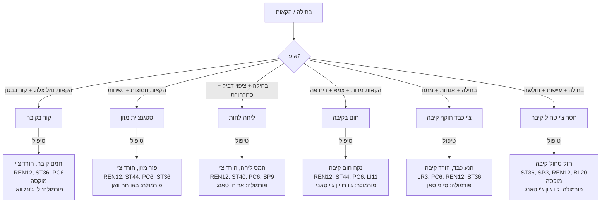
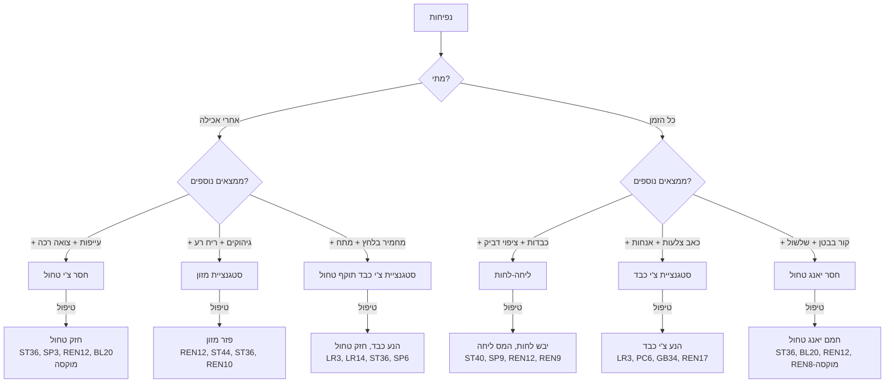
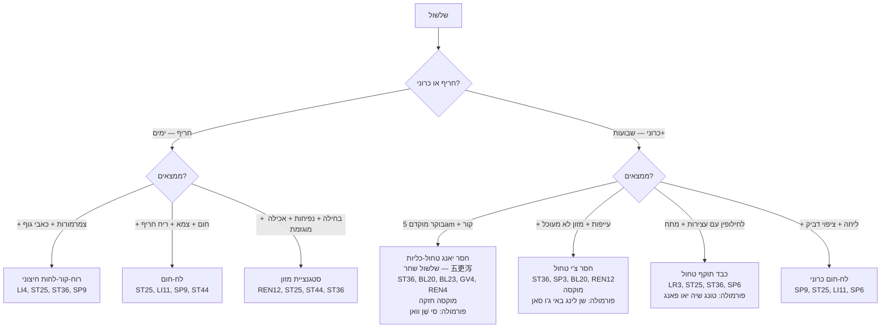
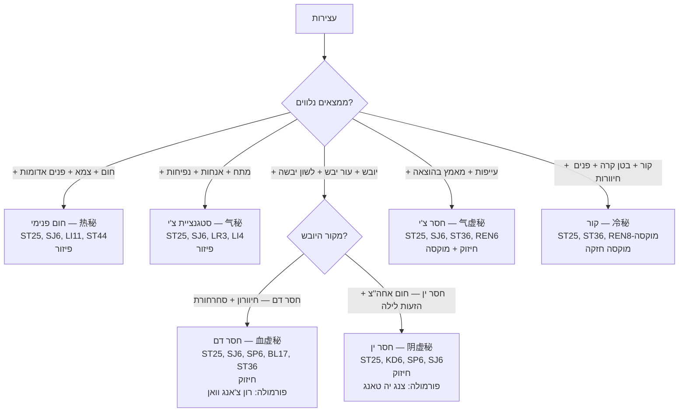
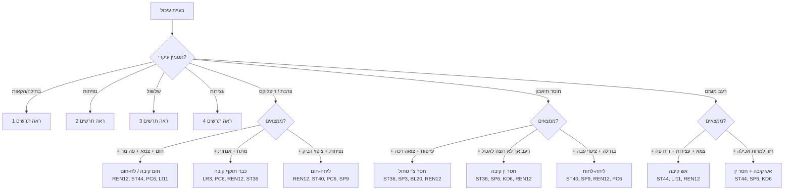

# תרשים זרימה — בעיות עיכול

## Digestive Disorders Flowchart (消化系统辨证流程 Xiao Hua Xi Tong Bian Zheng Liu Cheng)

---

## 1. בחילה והקאות (恶心呕吐 E Xin Ou Tu)

---

## 2. נפיחות (腹胀 Fu Zhang)

---

## 3. שלשול (泄泻 Xie Xie)

---

## 4. עצירות (便秘 Bian Mi)

---

## 5. כאב בטן + עיכול — תרשים מאוחד

---

## 6. טבלת ייחוס מהירה — עיכול

| תסמין | דפוס נפוץ ביותר | נקודות ליבה | פורמולה |
|---|---|---|---|
| נפיחות אחרי אכילה | חסר צ'י טחול | ST36, SP3, REN12, BL20 | סי ג'ון ג'י / ליו ג'ון ג'י |
| שלשול כרוני | חסר טחול / טחול-כליות | ST36, BL20, BL23, REN12 | שן לינג באי ג'ו סאן |
| עצירות + חום | חום פנימי | ST25, SJ6, LI11, ST44 | מא ג'י רן וואן |
| בחילה | צ'י קיבה עולה | PC6, REN12, ST36 | לפי דפוס |
| צרבת | חום קיבה / כבד → קיבה | REN12, ST44, PC6, LR3 | צואו שואה גאן טאנג |
| חוסר תיאבון | חסר טחול | ST36, SP3, BL20 | סי ג'ון ג'י טאנג |
| IBS — שלשול + עצירות | כבד תוקף טחול | LR3, ST25, ST36, SP6 | טונג שיה יאו פאנג |
| גזים | סטגנציית צ'י / חסר טחול | REN6, ST25, LR3, ST36 | לפי דפוס |

---

### נקודות מפתח לעיכול

| נקודה | תפקיד מרכזי |
|---|---|
| **REN12** (中脘) | מו קיבה — מרכז טיפול בכל בעיות קיבה |
| **ST36** (足三里) | הֶה-ארץ — מחזקת צ'י טחול-קיבה |
| **PC6** (内关) | נגד בחילה — מוכח מחקרית |
| **ST25** (天枢) | מו מעי גס — מווסתת מעיים |
| **SP6** (三阴交) | מחזקת טחול, מווסתת |
| **ST40** (丰隆) | ממיס ליחה |
| **SP9** (阴陵泉) | מייבשת לחות |
| **LR3** (太冲) | מניעה כבד — כשכבד תוקף קיבה/טחול |
