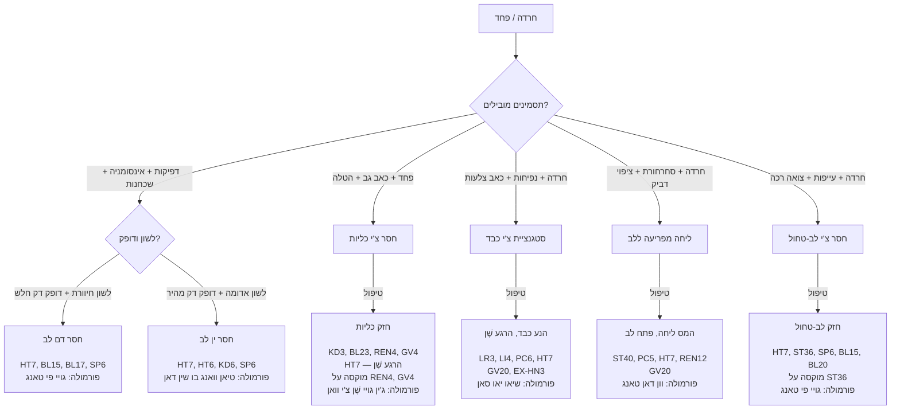
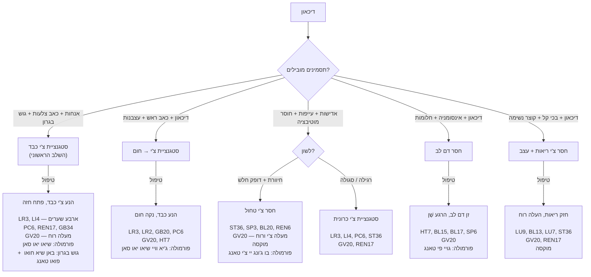
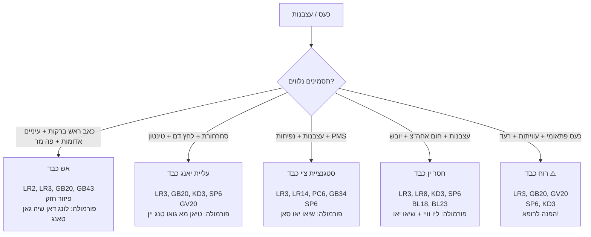
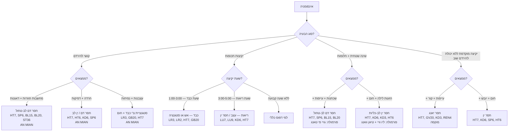
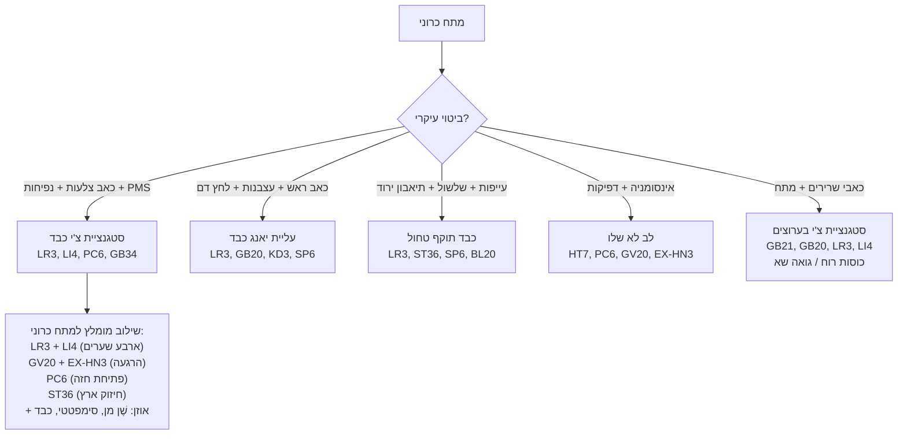

# תרשים זרימה — מצבים רגשיים

## Emotional Disorders Flowchart (情志病辨证流程 Qing Zhi Bing Bian Zheng Liu Cheng)

---

> **רקע:** ברפואה הסינית, שבעת הרגשות (七情 Qi Qing) הם גורמי מחלה פנימיים. כל רגש פוגע באיבר ספציפי: כעס → כבד, שמחה → לב, דאגה → טחול, עצב → ריאות, פחד → כליות.

---

## 1. חרדה ופחד (焦虑恐惧)

---

## 2. דיכאון (抑郁 Yi Yu)

---

## 3. כעס ועצבנות (怒 Nu / 烦躁 Fan Zao)

---

## 4. אינסומניה (失眠 Shi Mian)

---

## 5. מתח וסטרס כרוני (压力 Ya Li)

---

## 6. טבלת ייחוס מהירה — רגשות

| רגש / מצב | איבר מעורב | דפוס שכיח | נקודות ליבה | פורמולה |
|---|---|---|---|---|
| כעס | כבד | אש כבד / סטגנציית צ'י | LR2/LR3, GB20, HT7 | לונג דאן / שיאו יאו |
| חרדה | לב + כליות | חסר דם/ין לב / חסר כליות | HT7, KD3, PC6, GV20 | גויי פי / טיאן וואנג |
| דאגנות | טחול | חסר צ'י טחול | ST36, SP3, HT7, GV20 | גויי פי טאנג |
| עצב | ריאות | חסר צ'י ריאות | LU7, LU9, BL13, GV20 | בו ג'ונג יי צ'י |
| פחד | כליות | חסר כליות | KD3, BL23, HT7, GV20 | ג'ין גויי / ליו וויי |
| דיכאון | כבד (+ טחול) | סטגנציית צ'י כבד | LR3, LI4, GV20, PC6 | שיאו יאו סאן |
| אינסומניה | לב | חסר דם/ין לב | HT7, AN MIAN, KD6, SP6 | גויי פי / טיאן וואנג |
| מתח כרוני | כבד → טחול | סטגנציית צ'י → חסר טחול | LR3, LI4, ST36, GV20 | שיאו יאו סאן |

---

### נקודות מפתח למצבים רגשיים

| נקודה | תפקיד רגשי |
|---|---|
| **HT7** (神门) | "שער השֶׁן" — מרגיעה לב ורוח, כל מצב רגשי |
| **GV20** (百会) | מעלה שֶׁן, מבהירה ראש, נגד דיכאון |
| **EX-HN3** (印堂) | מרגיעה שֶׁן, "עין שלישית", הרגעה |
| **PC6** (内关) | פותחת חזה, מפחיתה חרדה, מרגיעה קיבה |
| **LR3** (太冲) | מניעה כבד — כל מצב של סטגנציה רגשית |
| **LI4** (合谷) | "ארבע שערות" עם LR3 — מניעה כללית |
| **KD1** (涌泉) | מעגנת, מורידה אש ורוח — חרדה, פאניקה |
| **AN MIAN** | נקודה ספציפית לשינה |
