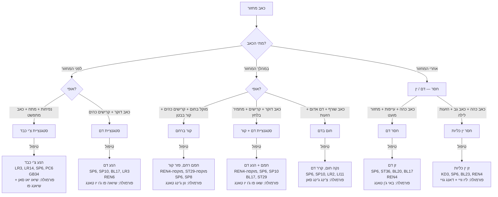
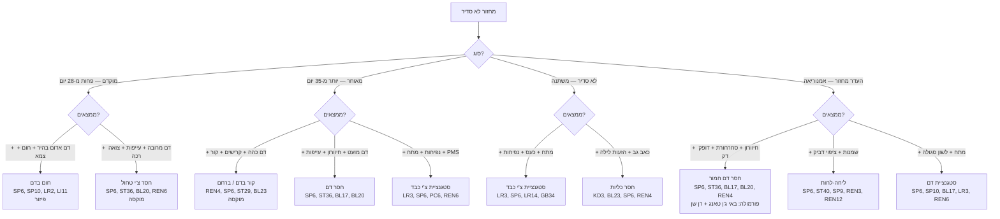
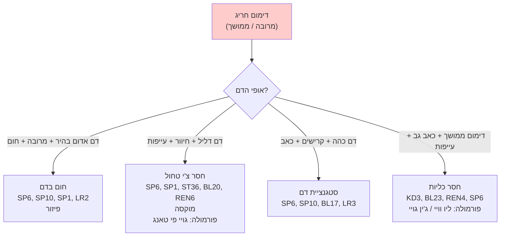
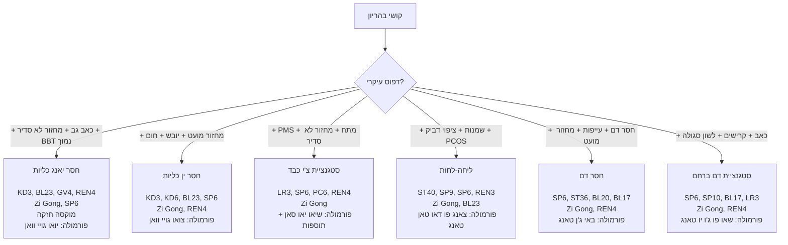
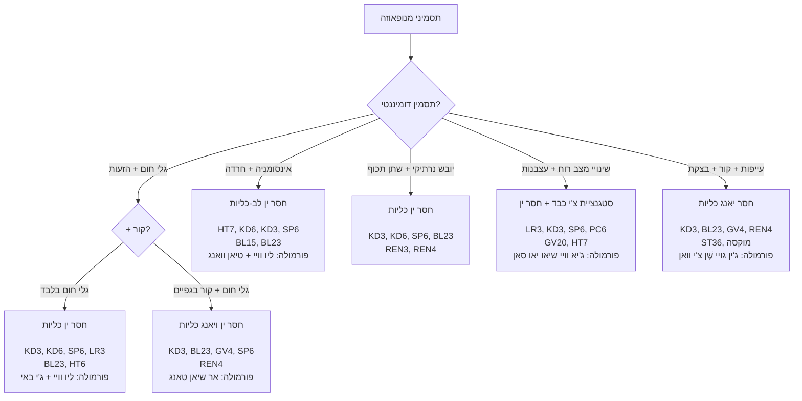
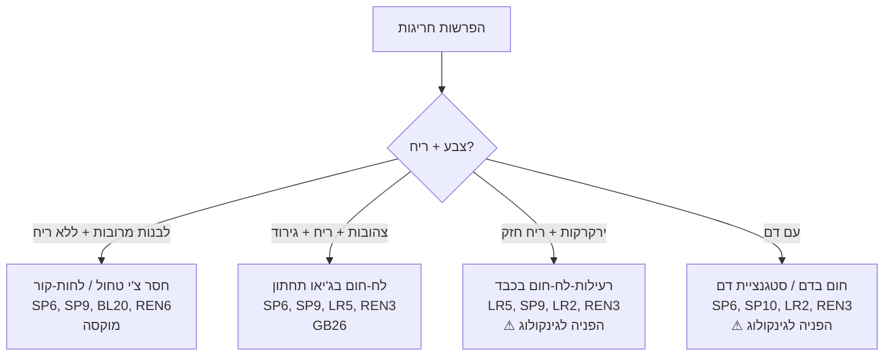

# תרשים זרימה — גינקולוגיה

## Gynecology Flowchart (妇科辨证流程 Fu Ke Bian Zheng Liu Cheng)

---

> **רקע:** גינקולוגיה ברפואה הסינית מבוססת על איזון צ'ונג מאי (冲脉) ורן מאי (任脉), בריאות כבד (שולט בזרימת צ'י ואחסון דם), טחול (מייצר דם ומחזיק אותו), וכליות (שולטות ברבייה ובג'ינג).

---

## 1. כאבי מחזור — דיסמנוריאה (痛经 Tong Jing)

---

## 2. אי-סדירות מחזור (月经不调 Yue Jing Bu Tiao)

---

## 3. דימום רחמי חריג (崩漏 Beng Lou)

> **⚠ חשוב:** דימום רחמי חריג דורש גם הפניה לבדיקה גינקולוגית מערבית לשלילת גורמים אורגניים.

---

## 4. פוריות (不孕 Bu Yun)

### פרוטוקול פוריות לפי שלבי המחזור

| שלב | ימים | עיקרון | נקודות |
|---|---|---|---|
| **מחזור** (ימים 1-5) | דימום | הנע דם, נקה | SP6, SP10, LR3, REN3 |
| **פוליקולרי** (ימים 6-13) | אחרי דימום | זן ין, בנה דם | KD3, KD6, SP6, BL23, REN4 |
| **ביוץ** (ימים 13-15) | ביוץ | הנע צ'י, חמם יאנג | LR3, LI4, SP6, REN4, Zi Gong |
| **לוטיאלי** (ימים 16-28) | אחרי ביוץ | חמם יאנג, חזק כליות | GV4, BL23, REN4, KD3, ST36 מוקסה |

---

## 5. מנופאוזה — תסמונת גיל המעבר (更年期综合征)

---

## 6. הפרשות נרתיקיות (带下病 Dai Xia Bing)

---

## 7. טבלת ייחוס מהירה — גינקולוגיה

| מצב | דפוס שכיח | נקודות ליבה | פורמולה |
|---|---|---|---|
| כאב מחזור — לפני | סטגנציית צ'י כבד | LR3, SP6, PC6, LR14 | שיאו יאו סאן |
| כאב מחזור — במהלך + קור | קור ברחם | REN4, SP6, ST29 + מוקסה | וון ג'ינג טאנג |
| כאב מחזור — אחרי | חסר דם | SP6, ST36, BL17, BL20 | באי ג'ן טאנג |
| מחזור מוקדם | חום בדם / חסר צ'י | SP6, SP10, LR2 / ST36 | לפי דפוס |
| מחזור מאוחר | קור / חסר דם | REN4, SP6, BL23 / ST36 | לפי דפוס |
| PMS | סטגנציית צ'י כבד | LR3, SP6, PC6, GB34 | שיאו יאו סאן |
| פוריות | חסר כליות (ין/יאנג) | KD3, BL23, REN4, SP6, Zi Gong | יואו/צואו גויי |
| מנופאוזה — גלי חום | חסר ין כליות | KD3, KD6, SP6, HT7 | ליו וויי + ג'י באי |
| דימום חריג | חסר צ'י / חום בדם | SP1, SP6, ST36, BL20 | גויי פי טאנג |

---

### נקודות מפתח בגינקולוגיה

| נקודה | חשיבות |
|---|---|
| **SP6** (三阴交) | מפגש שלוש ערוצי ין — מרכזית לכל בעיה גינקולוגית. ⚠ אסור בהיריון! |
| **REN4** (关元) | מחזקת כליות ורחם — פוריות, מחזור |
| **Zi Gong** (子宫) | "נקודת הרחם" — פוריות, כאב מחזור |
| **ST29** (归来) | מחממת רחם — קור ברחם |
| **SP8** (地机) | נקודת שי — כאבי מחזור חריפים |
| **LR3** (太冲) | מניעה צ'י כבד — PMS, סטגנציה |
| **BL23** (肾俞) | מחזקת כליות — פוריות, מנופאוזה |
| **SP10** (血海) | "ים הדם" — מווסתת דם |
