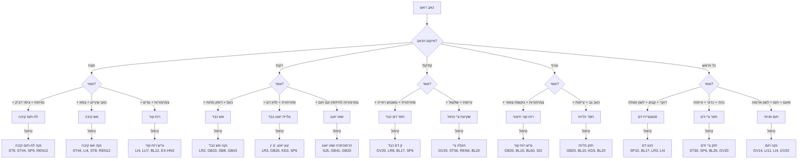
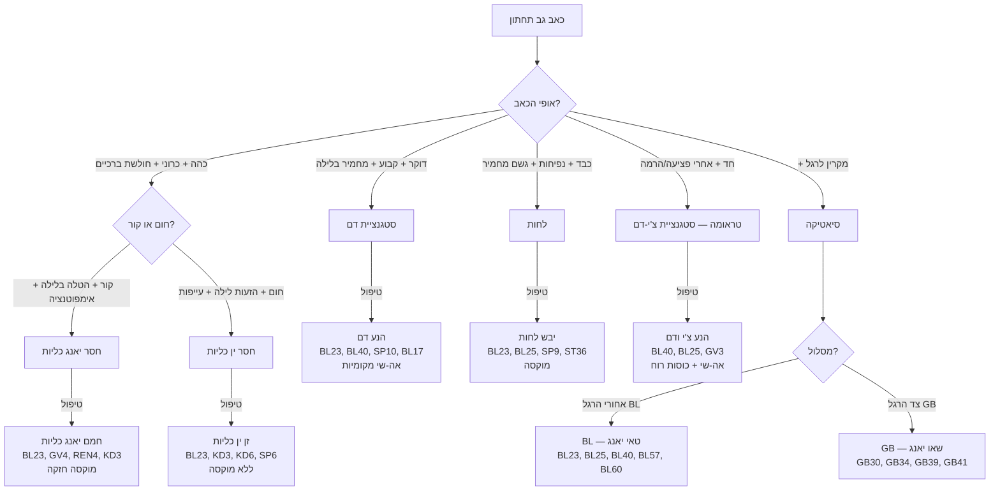
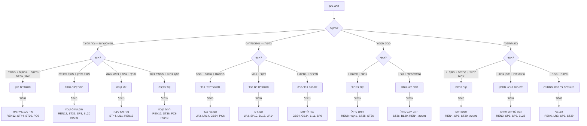
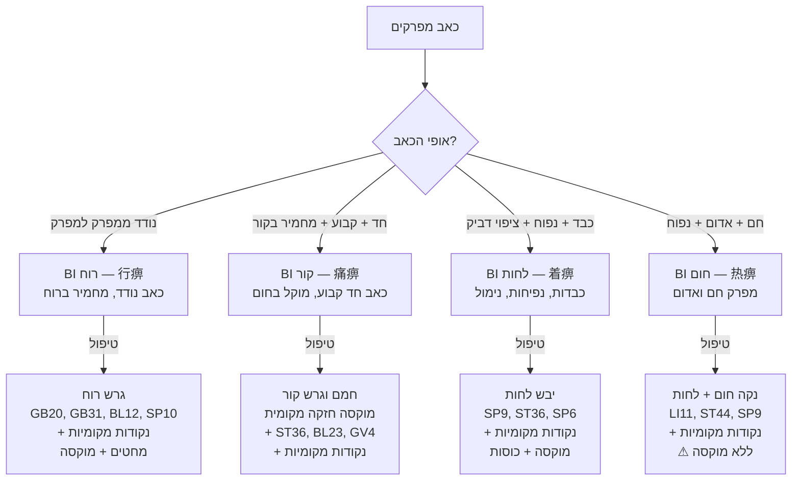

# תרשים זרימה — כאב

## Pain Diagnostic Flowchart (疼痛辨证流程 Teng Tong Bian Zheng Liu Cheng)

---

> **הוראות:** עקוב/י אחרי תרשים הזרימה מלמעלה למטה. בכל צומת — בחר/י את התשובה המתאימה ביותר. התרשים מוביל מהתלונה אל הדפוס, עיקרון הטיפול והנקודות המרכזיות.

---

## 1. כאב ראש (头痛 Tou Tong)

---

## 2. כאב גב תחתון (腰痛 Yao Tong)

---

## 3. כאב בטן (腹痛 Fu Tong)

---

## 4. כאב מפרקים — BI Syndrome (痹证 Bi Zheng)

---

## 5. טבלת ייחוס מהירה — כאב

| אופי כאב | דפוס | נקודות מפתח | שיטה |
|---|---|---|---|
| דוקר, קבוע | סטגנציית דם | SP10, BL17, LR3, LI4 + מקומיות | פיזור |
| כהה, מתפשט | סטגנציית צ'י | LR3, LI4, PC6, GB34 + מקומיות | פיזור/אפילו |
| חד, מחמיר בקור | קור | מוקסה + ST36, BL23, GV4 + מקומיות | חיזוק + מוקסה |
| כבד + נפיחות | לחות | SP9, ST36, SP6 + מקומיות | מוקסה |
| שורף, אדום, חם | חום | LI11, ST44 + מקומיות | פיזור |
| נודד | רוח | GB20, GB31, BL12 + מקומיות | פיזור |
| כהה + עייפות | חסר | ST36, SP6, BL20 + מקומיות | חיזוק + מוקסה |
| מוקל בלחץ | חסר | חיזוק + מוקסה |
| מחמיר בלחץ | עודף | פיזור |
| מחמיר בתנועה | עודף / סטגנציית דם | פיזור |
| מוקל בתנועה | סטגנציית צ'י | פיזור/אפילו |
