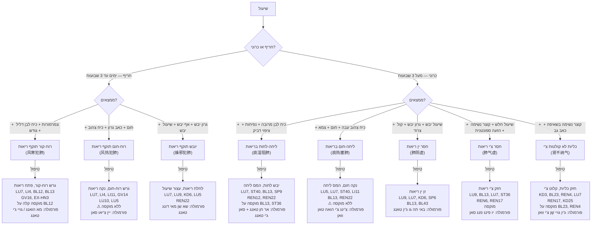
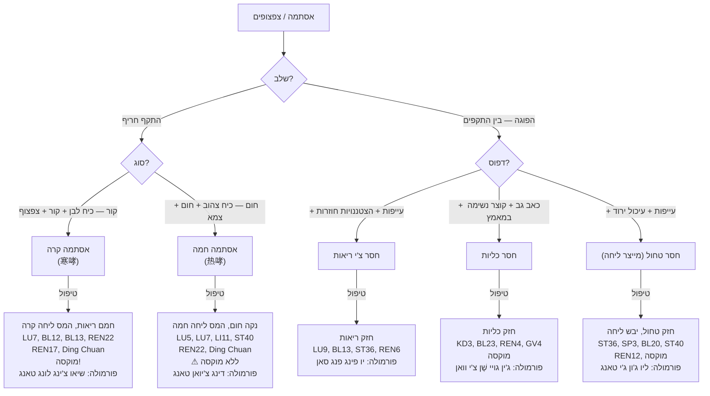
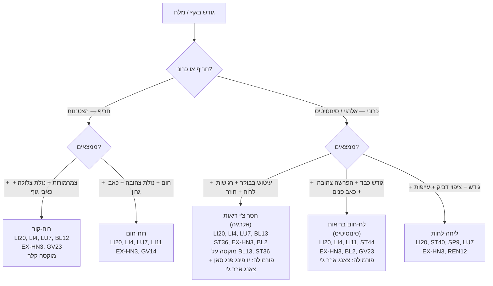
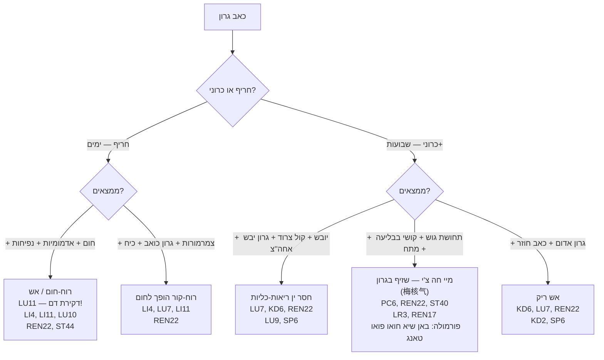
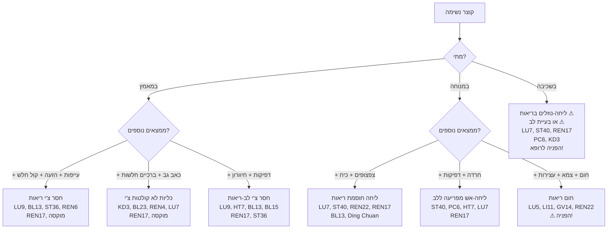

# תרשים זרימה — בעיות נשימה

## Respiratory Disorders Flowchart (呼吸系统辨证流程 Hu Xi Xi Tong Bian Zheng Liu Cheng)

---

## 1. שיעול (咳嗽 Ke Sou)

---

## 2. אסתמה / צפצופים (哮喘 Xiao Chuan)

---

## 3. גודש באף / נזלת / סינוסיטיס (鼻炎 Bi Yan)

---

## 4. כאב גרון (咽痛 Yan Tong)

---

## 5. קוצר נשימה (气短 Qi Duan / 喘 Chuan)

---

## 6. טבלת ייחוס מהירה — נשימה

| מצב | דפוס | נקודות ליבה | שיטה | פורמולה |
|---|---|---|---|---|
| הצטננות — קור | רוח-קור | LU7, LI4, BL12 | פיזור + מוקסה | גויי ג'י / מא הואנג טאנג |
| הצטננות — חום | רוח-חום | LU7, LI4, LI11, GV14 | פיזור | יין צ'יאו סאן |
| שיעול יבש כרוני | חסר ין ריאות | LU9, KD6, LU7, BL13 | חיזוק | באי חה גו ג'ין טאנג |
| שיעול ליחתי | ליחה-לחות | LU7, ST40, SP9, BL13 | מעורב + מוקסה | אר חן טאנג |
| שיעול + כיח צהוב | ליחה-חום | LU5, LU7, ST40, LI11 | פיזור | צ'ינג צ'י הואה טאן |
| אסתמה — התקף קר | ליחה-קור | LU7, BL13, REN22, Ding Chuan | פיזור + מוקסה | שיאו צ'ינג לונג |
| אסתמה — התקף חם | ליחה-חום | LU5, ST40, REN22, Ding Chuan | פיזור | דינג צ'יואן טאנג |
| אסתמה — הפוגה | חסר ריאות-כליות | LU9, BL13, KD3, BL23 | חיזוק + מוקסה | יו פינג פנג + ג'ין גויי |
| אלרגית נזלת | חסר צ'י ריאות | LI20, LI4, LU7, ST36 | חיזוק + מוקסה | יו פינג פנג סאן |
| סינוסיטיס | לח-חום | LI20, LI4, LI11, ST44 | פיזור | צאנג ארר ג'י |
| כאב גרון חריף | רוח-חום / אש | LU11, LI4, LI11, REN22 | פיזור / דקירת דם | יין צ'יאו סאן |
| גרון יבש כרוני | חסר ין | LU7, KD6, REN22, SP6 | חיזוק | באי חה / מאי מן דונג |
| קוצר נשימה כרוני | חסר ריאות + כליות | LU9, KD3, BL13, BL23, REN17 | חיזוק + מוקסה | לפי דפוס |

---

### נקודות מפתח לנשימה

| נקודה | תפקיד מרכזי |
|---|---|
| **LU7** (列缺) | לואו ריאות — מווסתת ופותחת ריאות, מגרשת רוח |
| **LI4** (合谷) | מגרשת רוח, פותחת שטח — כל פלישה חיצונית |
| **BL13** (肺俞) | בֵּי-שוּ ריאות — מחזקת ריאות |
| **REN22** (天突) | מקומית לגרון — עוצרת שיעול, פותחת גרון |
| **REN17** (膻中) | מו קרום לב — מחזקת צ'י חזה, פותחת נשימה |
| **ST40** (丰隆) | "נקודת הליחה" — ממיסה ליחה מכל מקום |
| **LU5** (尺泽) | הֶה-מים — מנקה חום ריאות |
| **LU9** (太渊) | מקור + ארץ — מחזקת צ'י ריאות |
| **KD3** (太溪) | מקור כליות — כליות קולטות צ'י ריאות |
| **Ding Chuan** (定喘) | EX-B1 — נקודה ספציפית לאסתמה |
| **LI20** (迎香) | פותחת אף — כל בעיית אף |
| **EX-HN3** (印堂) | פותחת אף, מרגיעה |
| **LU11** (少商) | ג'ינג-באר — דקירת דם לכאב גרון חריף |
