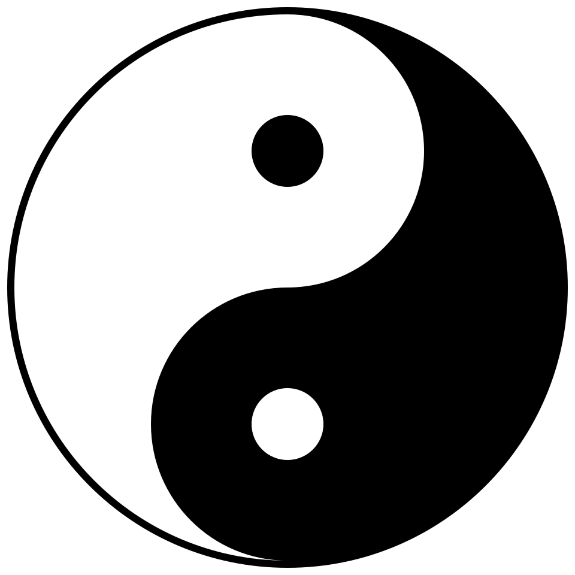

# מבוא לרפואה הסינית המסורתית

## Traditional Chinese Medicine - Introduction

---

## מטרות למידה

בסיום שיעור זה, הסטודנט יוכל:
1. לתאר את מקורות הרפואה הסינית המסורתית והתפתחותה לאורך אלפי שנים
2. להסביר את ההבדלים המהותיים בין הגישה ההוליסטית של הרפואה הסינית לגישה הרדוקציוניסטית של הרפואה המערבית
3. לזהות את הטקסטים הקלאסיים המרכזיים ולהבין את חשיבותם
4. להסביר את מושג השלמות - הקשר בין גוף, נפש ורוח
5. להכיר את תפקיד הדאו (道 Dao) והחוק הטבעי ברפואה

---

## 1. מקורות הרפואה הסינית המסורתית

### 1.1 שורשים היסטוריים

הרפואה הסינית המסורתית (Traditional Chinese Medicine - TCM) היא אחת ממערכות הרפואה העתיקות ביותר בעולם, עם מסורת רצופה של למעלה מ-5,000 שנה. שלא כמו מערכות רפואיות עתיקות אחרות שנעלמו או התמזגו ברפואה המודרנית, הרפואה הסינית שימרה את עקרונותיה הבסיסיים תוך התפתחות מתמדת.

המסורת הסינית מייחסת את ראשיתה של הרפואה לשלושה קיסרים אגדיים:

- **פו שי (伏羲 Fu Xi)** - מיוחס לו פיתוח שמונת הטריגרמות (八卦 Ba Gua), הבסיס לתורת ין-יאנג
- **שן נונג (神农 Shen Nong)** - "אבי החקלאות והפרמקולוגיה", מייסד הרוקחות הסינית. לפי המסורת, טעם מאות צמחים על עצמו כדי לקבוע את תכונותיהם הרפואיות
- **הואנג די (黄帝 Huang Di)** - "הקיסר הצהוב", שלפי המסורת ניהל את הדיאלוגים הרפואיים המתועדים ב"קלאסיקה הפנימית של הקיסר הצהוב"

### 1.2 תקופות מרכזיות בהתפתחות הרפואה הסינית

#### תקופת שושלת שאנג (商朝, 1600-1046 לפנה"ס)
- עדויות ארכיאולוגיות ראשונות לשימוש במחטי דיקור מעצם ואבן
- כתובות על עצמות אורקל המתארות מחלות וטיפולים

#### תקופת המלחמות (战国时期, 475-221 לפנה"ס)
- תקופת פריחה אינטלקטואלית שהניבה את הטקסטים הפילוסופיים הגדולים
- התגבשות עקרונות הדאואיזם והקונפוציאניזם שהשפיעו על התפתחות הרפואה
- חיבור חלקים מוקדמים של ה"הואנג די ניי ג'ינג" (黄帝内经)

#### שושלת האן (汉朝, 206 לפנה"ס - 220 לספירה)
- תור הזהב של הרפואה הסינית
- **ג'אנג ג'ונג ג'ינג (张仲景 Zhang Zhong Jing)** - מחבר ה"שאנג האן לון" (伤寒论), אבי הרפואה הקלינית הסינית
- **הואה טואו (华佗 Hua Tuo)** - רופא מפורסם, חלוץ ההרדמה וה"תרגילי חמשת בעלי החיים" (五禽戏 Wu Qin Xi)

#### שושלת טאנג (唐朝, 618-907)
- **סון סה מיאו (孙思邈 Sun Si Miao)** - "מלך הרפואה", מחבר "מרשמים שווים אלף זהב" (千金方 Qian Jin Fang)
- פיתוח מערכת שיטתית של נקודות דיקור וערוצים

#### שושלת סונג עד מינג (960-1644)
- שיטתיות של ידע רפואי מצטבר
- **לי שי ג'ן (李时珍 Li Shi Zhen)** - מחבר "קומפנדיום המטריה מדיקה" (本草纲目 Ben Cao Gang Mu) המונה 1,892 חומרי מרפא

### 1.3 דמויות מפתח נוספות

| שם | תקופה | תרומה עיקרית |
|---|---|---|
| ביאן צ'ואה (扁鹊) | המאה ה-5 לפנה"ס | אבי הדיאגנוסטיקה, פיתח אבחון דופק |
| הואנג פו מי (皇甫谧) | 215-282 | חיבר את "הקלאסיקה השיטתית של הדיקור" (针灸甲乙经) |
| וואנג שו חה (王叔和) | המאה ה-3 | כתב את "קלאסיקת הדופק" (脉经 Mai Jing) |

---

## 2. עקרונות יסוד - ההבדל בין רפואה סינית לרפואה מערבית

### 2.1 גישה הוליסטית מול גישה רדוקציוניסטית

הרפואה המערבית (ביו-רפואה) מבוססת על גישה **רדוקציוניסטית** - פירוק הגוף למערכות, איברים, רקמות, תאים ומולקולות. היא מחפשת את הגורם הספציפי למחלה ומטפלת בו באופן ממוקד.

הרפואה הסינית מבוססת על גישה **הוליסטית (整体观念 Zheng Ti Guan Nian)** - התבוננות בגוף כמערכת שלמה ומאוחדת, שאינה ניתנת לחלוקה לחלקים מבודדים. כל חלק משפיע על השלם, והשלם משפיע על כל חלק.

### 2.2 השוואה בין הגישות

| היבט | רפואה סינית (TCM) | רפואה מערבית |
|---|---|---|
| **מוקד** | האדם השלם | המחלה הספציפית |
| **אבחנה** | זיהוי דפוסים (辨证 Bian Zheng) | זיהוי מחלה (Diagnosis) |
| **טיפול** | שיקום האיזון | חיסול הגורם |
| **גישה לסימפטומים** | ביטוי של חוסר איזון מערכתי | סממנים של מחלה מוגדרת |
| **תפקיד המטופל** | שותף פעיל, אחראי על אורח חייו | מקבל טיפול פסיבי |
| **מניעה** | דגש מרכזי - "טיפול לפני שהמחלה מגיעה" | משני לטיפול |
| **פרדיגמה** | אנרגטית-פונקציונלית | חומרית-מבנית |

### 2.3 "רפואה טובה מרפאה לפני שהמחלה מגיעה"

עיקרון מרכזי ברפואה הסינית הוא:

> 上工治未病 (Shang Gong Zhi Wei Bing)
> "הרופא המעולה מטפל במה שטרם הפך למחלה"

משמעות עיקרון זה היא שהרפואה הסינית שמה דגש עצום על **מניעה**, על שמירת האיזון ועל טיפול בסימנים הראשוניים של חוסר הרמוניה, הרבה לפני שאלה מתפתחים למחלה ממשית.

---

## 3. מושג השלמות - גוף, נפש ורוח

### 3.1 אחדות גוף-נפש (形神合一 Xing Shen He Yi)

ברפואה הסינית, אין הפרדה בין הגוף (形 Xing) לנפש/רוח (神 Shen). הם שני היבטים של מציאות אחת:

- **הגוף הפיזי** מספק את הבסיס החומרי לקיום הרוח
- **הרוח** מעניקה חיוּת, תודעה וכוונה לגוף הפיזי
- שינוי באחד משפיע באופן ישיר על השני

### 3.2 אחדות האדם והטבע (天人合一 Tian Ren He Yi)

עיקרון יסוד נוסף הוא שהאדם הוא **מיקרוקוסמוס** - עולם קטן המשקף את המאקרוקוסמוס (היקום הגדול):

- עונות השנה משפיעות על תפקודי הגוף
- שעות היום מקבילות לפעילות איברים שונים (שעון האיברים)
- מזג האוויר והאקלים משפיעים על הבריאות
- האדם צריך לחיות בהרמוניה עם הטבע כדי לשמור על בריאותו

### 3.3 רגשות ובריאות

הרפואה הסינית מזהה קשר ישיר בין רגשות לאיברים פנימיים:

- **כעס (怒 Nu)** → פוגע בכבד (肝 Gan)
- **שמחה יתרה (喜 Xi)** → פוגעת בלב (心 Xin)
- **דאגה (忧 You)** → פוגעת בריאות (肺 Fei)
- **הרהור יתר (思 Si)** → פוגע בטחול (脾 Pi)
- **פחד (恐 Kong)** → פוגע בכליות (肾 Shen)

---

## 4. הרפואה הסינית כמסורת חיה

### 4.1 התפתחות מתמדת

הרפואה הסינית אינה מערכת סטטית שנשארה קפואה מלפני אלפי שנים. היא התפתחה באופן מתמיד:

- **תקופה קלאסית**: התגבשות העקרונות הבסיסיים
- **תקופת ביניים**: התמחות בתחומים שונים, פיתוח שיטות חדשות
- **תקופה מודרנית**: אינטגרציה עם רפואה מערבית, מחקר מדעי

### 4.2 רפואה סינית בעולם המודרני

כיום הרפואה הסינית:
- מוכרת על ידי ארגון הבריאות העולמי (WHO)
- נלמדת באוניברסיטאות ברחבי העולם
- נחקרת במחקרים קליניים מבוקרים
- משולבת במערכות בריאות ממשלתיות במדינות רבות
- בשנת 2010, הדיקור הסיני הוכר כמורשת תרבותית בלתי מוחשית על ידי אונסק"ו

---

## 5. הטקסטים הקלאסיים

### 5.1 הואנג די ניי ג'ינג (黄帝内经) - "הקלאסיקה הפנימית של הקיסר הצהוב"

זהו **הטקסט המכונן** של הרפואה הסינית, שחובר ככל הנראה בין המאה ה-3 לפנה"ס למאה ה-2 לספירה. הוא מורכב משני חלקים:

1. **סו וון (素问 Su Wen)** - "שאלות פשוטות": עוסק בתיאוריה הבסיסית - ין-יאנג, חמשת האלמנטים, אנטומיה, פיזיולוגיה, מניעה, אבחון וטיפול
2. **לינג שו (灵枢 Ling Shu)** - "ציר רוחני": מתמקד בדיקור - ערוצים, נקודות, טכניקות דיקור, ופיזיולוגיה אנרגטית

הטקסט מובנה כדיאלוג בין הקיסר הצהוב (黄帝 Huang Di) לבין רופאו צ'י בו (岐伯 Qi Bo).

**ציטוט מפתח:**
> "陰陽者，天地之道也，萬物之綱紀，變化之父母，生殺之本始"
> "ין ויאנג הם הדאו של שמיים וארץ, העיקרון המארגן של כל הדברים, אב ואם של כל שינוי, שורש ותחילה של חיים ומוות"
> — סו וון, פרק 5

### 5.2 נאן ג'ינג (难经) - "קלאסיקת הקשיים"

נכתב ככל הנראה במאה ה-1-2 לספירה, ומיוחס לביאן צ'ואה (扁鹊 Bian Que). הספר מורכב מ-81 "קשיים" (שאלות ותשובות) ומבהיר ומרחיב נושאים שנידונו בהואנג די ניי ג'ינג, בדגש על:

- אבחון דופק מפורט
- תיאוריית הערוצים
- מערכת נקודות "שו" (五输穴 Wu Shu Xue) של חמשת האלמנטים
- תיאוריית "שער החיים" (命门 Ming Men)

### 5.3 שאנג האן לון (伤寒论) - "דיון על נזקי הקור"

נכתב על ידי **ג'אנג ג'ונג ג'ינג (张仲景 Zhang Zhong Jing)** סביב שנת 220 לספירה. זהו הטקסט הקליני הראשון שמציג גישה שיטתית לאבחון וטיפול:

- מתאר **ששת הערוצים** (六经 Liu Jing) כמודל לאבחון מחלות חיצוניות
- מציג מאות נוסחאות צמחים, רבות מהן בשימוש עד היום
- מהווה את הבסיס לפרמקולוגיה הסינית הקלינית

### 5.4 טקסטים חשובים נוספים

| טקסט | מחבר | תקופה | נושא |
|---|---|---|---|
| שן נונג בן צאו ג'ינג (神农本草经) | — | שושלת האן | פרמקולוגיה - 365 חומרי מרפא |
| ג'ן ג'יו ג'יה יי ג'ינג (针灸甲乙经) | הואנג פו מי | 282 | דיקור שיטתי |
| בי הו לון (脾胃论) | לי דונג יואן | 1249 | בית הספר של הטחול והקיבה |
| וון בינג טיאו ביאן (温病条辨) | וו ג'ו טונג | 1798 | מחלות חום |

---

## 6. הדאו (道) והחוק הטבעי ברפואה

### 6.1 מהו הדאו?

הדאו (道 Dao) פירושו המילולי הוא "הדרך". בפילוסופיה הסינית, הדאו מתאר את:
- העיקרון הבסיסי שעומד מאחורי כל מה שקיים
- הסדר הטבעי של היקום
- התהליך המתמיד של שינוי והתהוות

**לאו דזה (老子 Lao Zi)** כתב בספרו "דאו דה ג'ינג" (道德经):
> "道生一，一生二，二生三，三生万物"
> "הדאו מוליד את האחד, האחד מוליד את השניים, השניים מולידים את השלושה, והשלושה מולידים את עשרת אלפי הדברים"

### 6.2 הדאו ברפואה

ברפואה הסינית, הדאו מתבטא בעקרונות הבאים:

1. **החוק הטבעי (自然 Zi Ran)**: הגוף פועל על פי חוקי הטבע. רפואה טובה תומכת בתהליכים הטבעיים ואינה עובדת נגדם
2. **האיזון (平衡 Ping Heng)**: בריאות היא מצב של איזון דינמי. מחלה היא חוסר איזון
3. **הזרימה (流通 Liu Tong)**: חיים הם תנועה. כאשר הזרימה חופשית - יש בריאות. כאשר יש חסימה - מופיעה מחלה
4. **ההתאמה (适应 Shi Ying)**: הטיפול חייב להיות מותאם לאדם הספציפי, לעונה, למקום ולנסיבות

### 6.3 עקרון "וו ווי" (无为) ברפואה

"וו ווי" פירושו "פעולה ללא כפייה" או "פעולה בהרמוניה עם הטבע". ברפואה, עיקרון זה מתורגם ל:
- לא לכפות שינוי אלא לתמוך ביכולת הריפוי הטבעית של הגוף
- להשתמש במינימום ההתערבות הנדרשת
- לעבוד עם הגוף ולא נגדו

---

## 7. עקרונות הליבה של הרפואה הסינית - סיכום

### שבעת עקרונות היסוד:

{ width="200" }

1. **הוליזם (整体观念 Zheng Ti Guan Nian)** - הגוף הוא שלם אחד
2. **ין-יאנג (阴阳 Yin Yang)** - כל דבר מכיל שני כוחות משלימים
3. **חמשת האלמנטים (五行 Wu Xing)** - חמשת התהליכים הבסיסיים בטבע
4. **צ'י (气 Qi)** - אנרגיית החיים שמניעה את הכל
5. **ערוצים ונקודות (经络 Jing Luo)** - רשת האנרגיה בגוף
6. **אבחון דפוסים (辨证论治 Bian Zheng Lun Zhi)** - טיפול המבוסס על זיהוי דפוסים אישיים
7. **מניעה (治未病 Zhi Wei Bing)** - טיפול לפני שהמחלה מתפתחת

---

## 8. שאלות לחזרה

1. תאר בקצרה את ההיסטוריה של הרפואה הסינית - אילו תקופות מרכזיות ודמויות מפתח השפיעו על התפתחותה?
2. מהם שלושת הקיסרים האגדיים ומה תרומתם לפי המסורת?
3. הסבר את ההבדלים העיקריים בין הגישה ההוליסטית של הרפואה הסינית לגישה הרדוקציוניסטית של הרפואה המערבית.
4. מהו העיקרון "上工治未病"? כיצד הוא מתבטא בפרקטיקה הקלינית?
5. תאר את הטקסטים הקלאסיים המרכזיים: מי כתב אותם, מתי, ומה תוכנם?
6. כיצד מושג הדאו (道) משפיע על הגישה הרפואית הסינית?
7. מהו עיקרון "אחדות האדם והטבע" (天人合一) וכיצד הוא בא לידי ביטוי ברפואה?
8. מדוע הרפואה הסינית מתוארת כ"מסורת חיה"? תן דוגמאות.

---

## קריאה מומלצת

- Maciocia, G. *The Foundations of Chinese Medicine* (פרק 1)
- Unschuld, P. *Huang Di Nei Jing Su Wen* (מבוא)
- Kaptchuk, T. *The Web That Has No Weaver* (פרקים 1-2)

---

> **הערה**: שיעור זה מהווה בסיס לכל הלימודים הבאים. הקפידו להבין את העקרונות שנדונו כאן לעומק, מכיוון שהם חוזרים ונשנים בכל היבטי הרפואה הסינית.

---

## ניווט

- **הבא**: [תורת ין-יאנג](02-yin-yang-theory.md)
- **חזרה למודול**: [מודול 1 — פילוסופיה](README.md)
- **ראה גם**: [מערכת המרידיאנים](../module-02-meridians/01-meridian-system.md) — הרשת שדרכה זורם הצ'י | [זיהוי דפוסים](../../year-2-intermediate/module-06-pathology/01-pattern-identification.md) — כשעקרונות אלו מופרים
