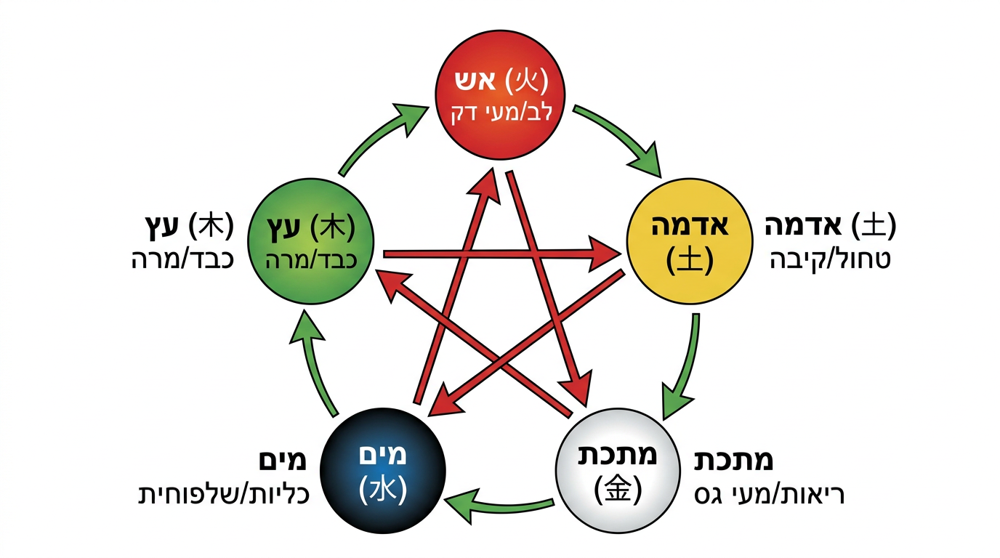
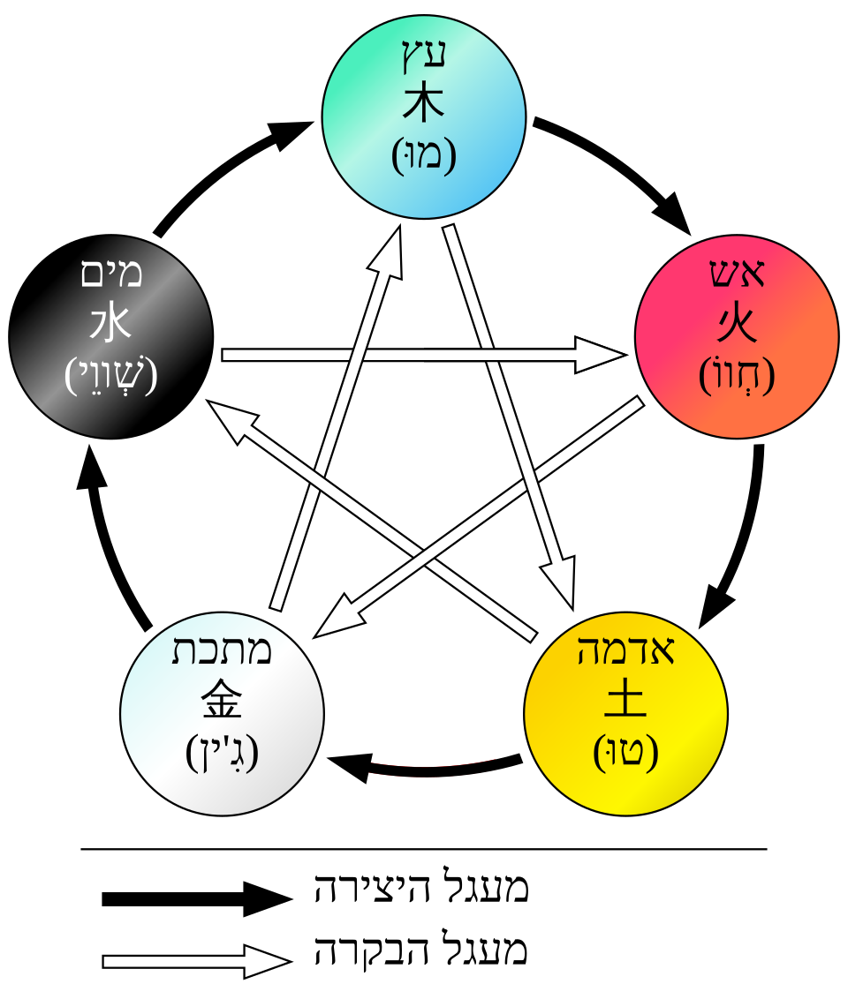
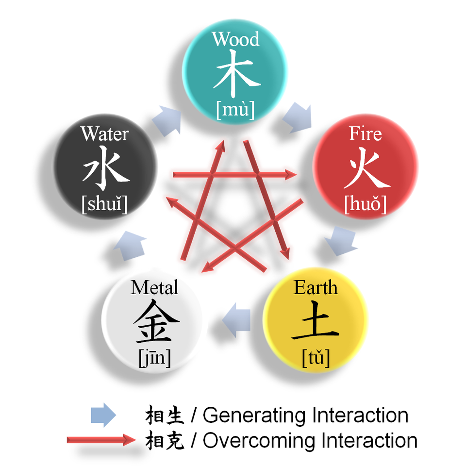
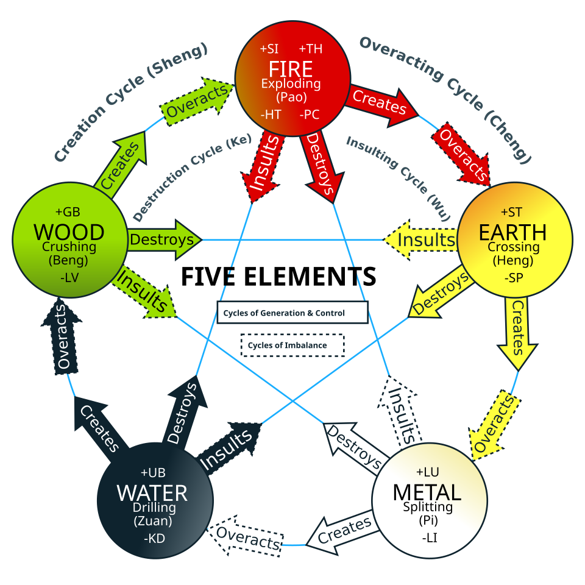

# חמשת האלמנטים - וו שינג

## Five Elements / Five Phases Theory - Wu Xing

---

## מטרות למידה

בסיום שיעור זה, הסטודנט יוכל:
1. לתאר את חמשת האלמנטים ואת משמעותם הסימבולית
2. להסביר את מחזורי היצירה (שנג), השליטה (קה), ההשתלטות (צ'נג) והעלבה (וו)
3. לזהות את ההתאמות של כל אלמנט (איברים, רגשות, רקמות, חושים ועוד)
4. ליישם את תורת חמשת האלמנטים באבחון ובטיפול
5. לזהות טיפוסים חוקתיים על בסיס חמשת האלמנטים

---

## 1. מבוא לחמשת האלמנטים

### 1.1 רקע פילוסופי

תורת חמשת האלמנטים (Wu Xing) היא מערכת פילוסופית סינית עתיקה המתארת חמישה תהליכים בסיסיים בטבע. המילה "שינג" (Xing) פירושה "תנועה" או "שלב" - ולכן תרגום מדויק יותר הוא "חמשת השלבים" או "חמשת התהליכים" ולא "חמשת האלמנטים".

חמשת האלמנטים הם:
1. **עץ (Mu)** - צמיחה, התפשטות, אביב
2. **אש (Huo)** - שיא, בשלות, קיץ
3. **אדמה (Tu)** - איזון, מרכז, עונות מעבר
4. **מתכת (Jin)** - התכווצות, ירידה, סתיו
5. **מים (Shui)** - אחסון, מנוחה, חורף

### 1.2 חמשת האלמנטים כמטאפורות

כל אלמנט מייצג **סוג של תנועה ואנרגיה** ולא חומר פיזי:

- **עץ **: אנרגיה של **צמיחה והתפשטות** - כמו שורש שפורץ דרך האדמה. כיוון: מעלה ולצדדים
- **אש **: אנרגיה של **שיא ובשלות** - כמו להבה שעולה ומפיצה אור. כיוון: מעלה ולכל הכיוונים
- **אדמה **: אנרגיה של **יציבות ואיזון** - כמו אדמה שמקבלת ומזינה. כיוון: מרכז, אופקי
- **מתכת **: אנרגיה של **התכנסות והתגבשות** - כמו מתכת שמצטננת ומתגבשת. כיוון: פנימה ומטה
- **מים **: אנרגיה של **אחסון ופוטנציאל** - כמו מים שזורמים למקום הנמוך ביותר. כיוון: מטה

---

## 2. מחזורי האינטראקציה בין האלמנטים





### 2.1 מחזור היצירה - שנג (Sheng Cycle / Generation Cycle)

מכונה גם "מחזור אם-בן" (Mu Zi). כל אלמנט מוליד/מזין את האלמנט הבא:

```
עץ → אש → אדמה → מתכת → מים → עץ

```

**הסבר:**
- **עץ מזין אש** - עץ שורף ויוצר אש
- **אש יוצרת אדמה** - אש שורפת ויוצרת אפר (אדמה)
- **אדמה יוצרת מתכת** - מתכות נמצאות בתוך האדמה
- **מתכת יוצרת מים** - מתכת קרה מעבה מים (טל על מתכת)
- **מים מזינים עץ** - מים מזינים צמחים (עצים)

**בגוף:**
- כבד (עץ) מזין את הלב (אש) - דם הכבד מזין את הלב
- לב (אש) מזין את הטחול (אדמה) - חום הלב מחמם את הטחול
- טחול (אדמה) מזין את הריאות (מתכת) - צ'י הטחול עולה לריאות
- ריאות (מתכת) מזינות את הכליות (מים) - צ'י הריאות יורד לכליות
- כליות (מים) מזינות את הכבד (עץ) - ין הכליות מזין ין הכבד

**משמעות קלינית:** כאשר איבר "אם" חלש, ניתן לחזק אותו כדי לחזק את איבר "הבן". לדוגמה: חיזוק הכליות (מים) יסייע לכבד (עץ).

### 2.2 מחזור השליטה - קה (Ke Cycle / Control Cycle)

מכונה גם "מחזור סבתא-נכד". כל אלמנט מרסן/שולט באלמנט שנמצא שני מקומות אחריו:

```
עץ → אדמה → מים → אש → מתכת → עץ

```

**הסבר:**
- **עץ שולט באדמה** - שורשי עץ מחזיקים ומפרקים אדמה
- **אדמה שולטת במים** - סוללת אדמה עוצרת מים
- **מים שולטים באש** - מים מכבים אש
- **אש שולטת במתכת** - אש מתיכה מתכת
- **מתכת שולטת בעץ** - גרזן (מתכת) חותך עץ

**בגוף:**
- כבד (עץ) שולט בטחול (אדמה) - צ'י הכבד מווסת את העיכול
- טחול (אדמה) שולט בכליות (מים) - הטחול שולט בחילוף המים
- כליות (מים) שולטות בלב (אש) - ין הכליות מקררת את אש הלב
- לב (אש) שולט בריאות (מתכת) - חום הלב מחמם את הריאות
- ריאות (מתכת) שולטות בכבד (עץ) - צ'י הריאות יורד ומרסן עליית צ'י הכבד

**משמעות קלינית:** שליטה תקינה שומרת על איזון. ללא שליטה, אלמנט עלול "לפרוע סדר".



### 2.3 מחזור ההשתלטות - צ'נג (Cheng Cycle / Overacting Cycle)

כאשר מחזור השליטה **מוגזם** - אלמנט אחד שולט יתר על המידה באלמנט אחר:

**דוגמה:** כבד (עץ) חזק מדי → משתלט על הטחול (אדמה) → מתבטא ב:
- כעס → בחילה, אובדן תיאבון
- מתח נפשי → כאבי בטן, שלשול
- זהו הדפוס הנפוץ של "כבד משתלט על טחול" (Gan Mu Cheng Pi Tu)

**דוגמה נוספת:** כליות (מים) חלשות מדי → לב (אש) ללא ריסון → מתבטא ב:
- נדודי שינה, חרדה, דפיקות לב
- זהו הדפוס של "אש לב ומים כליות לא מתואמים" (Xin Shen Bu Jiao)

### 2.4 מחזור העלבה - וו (Wu Cycle / Insulting Cycle)

מחזור השליטה **בכיוון הפוך** - האלמנט הנשלט "מורד" ותוקף את השולט:

**דוגמה:** מתכת (ריאות) אמורה לשלוט בעץ (כבד), אבל אם הכבד (עץ) חזק מאוד:
- עץ "מעליב" את מתכת → כבד תוקף ריאות
- מתבטא ב: כעס → שיעול, קוצר נשימה, כאב בחזה



---

## 3. טבלת ההתאמות של חמשת האלמנטים

### 3.1 טבלה מקיפה

| קטגוריה | עץ (Mu) | אש (Huo) | אדמה (Tu) | מתכת (Jin) | מים (Shui) |
|---|---|---|---|---|---|
| **איבר ין (צאנג)** | כבד (Gan) | לב (Xin) | טחול (Pi) | ריאות (Fei) | כליות (Shen) |
| **איבר יאנג (פו)** | כיס מרה (Dan) | מעי דק | קיבה (Wei) | מעי גס | שלפוחית |
| **רגש** | כעס (Nu) | שמחה (Xi) | דאגה/הרהור (Si) | עצב (Bei) | פחד (Kong) |
| **עונה** | אביב | קיץ | סוף קיץ | סתיו | חורף |
| **גורם אקלימי** | רוח (Feng) | חום (Shu) | לחות (Shi) | יובש (Zao) | קור (Han) |
| **כיוון** | מזרח | דרום | מרכז | מערב | צפון |
| **צבע** | ירוק/כחול | אדום | צהוב | לבן | שחור |
| **טעם** | חמוץ (Suan) | מר (Ku) | מתוק (Gan) | חריף (Xin) | מלוח (Xian) |
| **חוש** | ראייה | דיבור/לשון | טעם/פה | ריח/אף | שמיעה/אוזן |
| **רקמה** | גידים (Jin) | כלי דם (Mai) | שרירים/בשר (Rou) | עור/שיער גוף | עצמות (Gu) |
| **נוזל הפרשה** | דמעות | זיעה | ריר | ליחה מהאף | רוק |
| **קול** | צעקה | צחוק | שירה | בכי | אנחה/גניחה |
| **שלב התפתחות** | לידה/צמיחה | גדילה/שיא | הבשלה/שינוי | קציר/ירידה | אחסון/מוות |
| **כוכב לכת** | צדק | מאדים | שבתאי | נוגה | כוכב חמה |
| **מספר** | 8 | 7 | 5 | 9 | 6 |
| **חיה** | דרקון | ציפור | — | נמר | צב |
| **דגן** | חיטה | דוחן | אורז | שיבולת שועל | שעועית |
| **ביטוי בפנים** | עיניים | לשון/פנים | שפתיים | אף/עור | אוזניים/שיער ראש |

---

## 4. חמשת האלמנטים באבחון

### 4.1 אבחון על פי צבע הפנים

- **ירקרק/כחלחל** → בעיה בעץ/כבד: כאב, קיפאון צ'י
- **אדמומי** → בעיה באש/לב: חום, דלקת
- **צהבהב** → בעיה באדמה/טחול: לחות, חוסר עיכול
- **חיוור/לבנבן** → בעיה במתכת/ריאות: קור, חסר דם/צ'י
- **כהה/שחרחר** → בעיה במים/כליות: קור חמור, קיפאון דם

### 4.2 אבחון על פי רגשות

- **כעסנות, תסכול, עצבנות** → חוסר איזון בעץ/כבד
- **חרדה, שמחה מופרזת, מאניה** → חוסר איזון באש/לב
- **דאגנות, הרהור יתר, חשיבה אובססיבית** → חוסר איזון באדמה/טחול
- **עצבות, אבל, נטייה לבכי** → חוסר איזון במתכת/ריאות
- **פחד, חוסר ביטחון, פוביות** → חוסר איזון במים/כליות

### 4.3 אבחון על פי קול

- **קול צועק, חד** → עץ
- **קול צוחק, מהיר** → אש
- **קול שר, מלודי** → אדמה
- **קול בוכה, מתאונן** → מתכת
- **קול גונח, נמוך** → מים

---

## 5. אסטרטגיות טיפול על בסיס חמשת האלמנטים

### 5.1 שימוש במחזור היצירה (שנג) לטיפול

**עיקרון "חיזוק האם כדי לחזק את הבן"** (Xu Ze Bu Qi Mu):

כאשר איבר חלש, ניתן לחזק את ה"אם" שלו:
- כליות (מים) חלשות → חיזוק ריאות (מתכת) - כי מתכת מולידה מים
- כבד (עץ) חלש → חיזוק כליות (מים) - כי מים מולידים עץ
- לב (אש) חלש → חיזוק כבד (עץ) - כי עץ מוליד אש

### 5.2 שימוש במחזור השליטה (קה) לטיפול

**עיקרון "הרגעת הנשלט דרך ריסון השולט"** (Shi Ze Xie Qi Zi):

כאשר איבר פעיל מדי, ניתן לחזק את ה"שולט" בו:
- כבד (עץ) פעיל מדי → חיזוק ריאות (מתכת) - כי מתכת שולטת בעץ
- לב (אש) פעיל מדי → חיזוק כליות (מים) - כי מים שולטים באש

### 5.3 דוגמאות קליניות

**מקרה 1: כבד משתלט על טחול**
- **תלונות**: כאבי בטן שמחמירים במתח, גזים, שלשול לסירוגין עם עצירות, עצבנות
- **ניתוח**: עץ (כבד) חזק מדי ומשתלט על אדמה (טחול)
- **טיפול**: הרגעת הכבד + חיזוק הטחול (Shu Gan Jian Pi)

**מקרה 2: אש לב ומים כליות לא מתואמים**
- **תלונות**: נדודי שינה, דפיקות לב, חרדה, כאבי גב תחתון, זיכרון חלש
- **ניתוח**: מים (כליות) חלשות ואינן מרסנות את אש (לב)
- **טיפול**: חיזוק כליות + הורדת אש הלב (Jiao Tong Xin Shen)

**מקרה 3: אדמה לא מחזיקה מים**
- **תלונות**: בצקות, שלשולים מימיים, עייפות, כבדות בגפיים
- **ניתוח**: אדמה (טחול) חלשה ואינה שולטת במים → הצטברות לחות
- **טיפול**: חיזוק הטחול + ייבוש לחות (Jian Pi Li Shi)

---

## 6. טיפוסים חוקתיים על בסיס חמשת האלמנטים

### 6.1 טיפוס עץ (Mu)

- **מבנה גוף**: רזה, גבוה, כתפיים רחבות
- **אופי**: נחוש, שאפתני, מנהיג טבעי, תחרותי
- **חוזקות**: יצירתיות, חזון, יכולת תכנון
- **חולשות**: כעסנות, חוסר סבלנות, נוקשות
- **נטייה למחלות**: מיגרנות, בעיות עיניים, כאבי צוואר וכתפיים, בעיות כיס מרה
- **עונת פגיעות**: אביב (רוח)

### 6.2 טיפוס אש (Huo)

- **מבנה גוף**: ממוצע, חזה רחב, פנים אדמדמות
- **אופי**: חם, כריזמטי, אנרגטי, חברתי, אופטימי
- **חוזקות**: תקשורת, אינטואיציה, התלהבות
- **חולשות**: חרדה, נדודי שינה, פיזור, מאניה
- **נטייה למחלות**: בעיות לב וכלי דם, נדודי שינה, כיבים בפה
- **עונת פגיעות**: קיץ (חום)

### 6.3 טיפוס אדמה (Tu)

- **מבנה גוף**: עגלגל, שרירי, ממוצע עד מלא
- **אופי**: אכפתי, מזין, יציב, אמין, מתווך
- **חוזקות**: אמפתיה, יציבות, נאמנות
- **חולשות**: דאגנות, הרהור יתר, תלותיות, קושי להגיד "לא"
- **נטייה למחלות**: בעיות עיכול, עודף משקל, לחות, עייפות
- **עונת פגיעות**: סוף קיץ (לחות)

### 6.4 טיפוס מתכת (Jin)

- **מבנה גוף**: דק, מסודר, עור בהיר
- **אופי**: מדויק, מאורגן, מסודר, שואף לשלמות
- **חוזקות**: ארגון, ניתוח, הערכה, כבוד
- **חולשות**: ריגידיות, ביקורתיות, קשיי הרפיה, עצב כרוני
- **נטייה למחלות**: בעיות ריאות, אסתמה, אלרגיות, בעיות עור, עצירות
- **עונת פגיעות**: סתיו (יובש)

### 6.5 טיפוס מים (Shui)

- **מבנה גוף**: עצמות גדולות, מבנה חזק, עיגולים כהים מתחת לעיניים
- **אופי**: חכם, אינטרוספקטיבי, פילוסופי, עצמאי
- **חוזקות**: חוכמה, עומק, התבוננות, סיבולת
- **חולשות**: פחד, בידוד, פסימיות, חוסר מוטיבציה
- **נטייה למחלות**: בעיות גב תחתון וברכיים, בעיות שמיעה, עייפות, בעיות פוריות
- **עונת פגיעות**: חורף (קור)

---

## 7. חמשת האלמנטים בבחירת נקודות דיקור

### 7.1 נקודות "שו" של חמשת האלמנטים (Wu Shu Xue)

בכל ערוץ דיקור, קיימות חמש נקודות המתאימות לחמשת האלמנטים. נקודות אלו ממוקמות בין קצות האצבעות/הבהונות למרפק/ברך:

| סוג נקודה | אלמנט | מיקום | תפקוד |
|---|---|---|---|
| ג'ינג-באר (Jing-Well) | עץ (ין) / מתכת (יאנג) | קצה אצבע/בהון | מצבי חירום, שיקום הכרה |
| יינג-מעיין (Ying-Spring) | אש (ין) / מים (יאנג) | לפני המפרק | פינוי חום |
| שו-זרם (Shu-Stream) | אדמה (ין) / עץ (יאנג) | אחרי המפרק | כאבי גוף, לחות |
| ג'ינג-נהר (Jing-River) | מתכת (ין) / אש (יאנג) | אמה/שוק | שיעול, אסתמה |
| חה-ים (He-Sea) | מים (ין) / אדמה (יאנג) | מרפק/ברך | בעיות מעיים וקיבה |

---

## 8. תרגילים

### תרגיל 1: זיהוי אלמנטים
קשרו כל תופעה לאלמנט המתאים:
א. דמעות
ב. טעם מר
ג. רוח
ד. שיער ראש
ה. עור ושיער גוף
ו. עצמות
ז. צבע צהוב בפנים
ח. פחד

### תרגיל 2: מחזורים
א. עץ מוליד _____
ב. אש שולטת ב_____
ג. ה"אם" של מים היא _____
ד. ה"בן" של אדמה הוא _____
ה. מי שולט באדמה? _____

### תרגיל 3: ניתוח מקרה
מטופל מדווח על: כאבי בטן שמחמירים בזמן מתח, גזים, שלשולים, עצבנות, מתח בכתפיים, טעם מר בפה.
א. אילו אלמנטים מעורבים?
ב. מהו הדפוס?
ג. מהו עיקרון הטיפול?

### תרגיל 4: טיפוסים חוקתיים
תארו אדם שאתם מכירים (בלי לנקוב בשם) וזהו את האלמנט הדומיננטי שלו. הסבירו על סמך מה הגעתם למסקנה.

### תרגיל 5: מחזורים פתולוגיים
מהו ההבדל בין:
א. מחזור שליטה (קה) תקין למחזור השתלטות (צ'נג)?
ב. מחזור השתלטות (צ'נג) למחזור העלבה (וו)?
תנו דוגמה קלינית לכל אחד.

---

## קריאה מומלצת

- Maciocia, G. *The Foundations of Chinese Medicine* (פרק 3)
- Hicks, A. *Five Element Constitutional Acupuncture*
- הואנג די ניי ג'ינג, סו וון, פרקים 4-5

---

> **נקודה למחשבה**: חמשת האלמנטים מספקים "שפה" להבנת הקשרים בין איברים, רגשות, עונות ותופעות טבע. ברפואה הסינית, אין איבר שפועל לבדו - כולם חלק ממערכת יחסים דינמית, בדיוק כמו חמשת האלמנטים בטבע.

---

## ניווט

- **הקודם**: [תורת ין-יאנג](02-yin-yang-theory.md) | **הבא**: [חומרים חיוניים](04-vital-substances.md)
- **חזרה למודול**: [מודול 1 — פילוסופיה](README.md)
- **ראה גם**: [יחסים בין איברים](../../year-2-intermediate/module-05-zangfu/04-organ-relationships.md) — יחסי האיברים לפי חמשת האלמנטים | [חמש נקודות שו](../../year-2-intermediate/module-08-point-categories/01-five-shu-points.md) — נקודות המסווגות לפי חמשת האלמנטים
