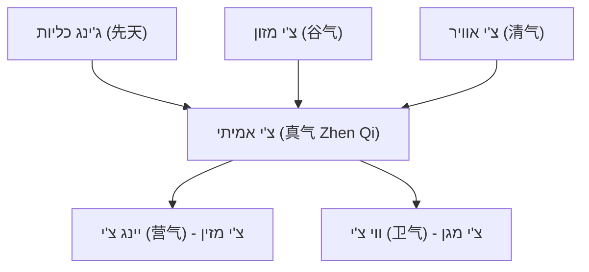
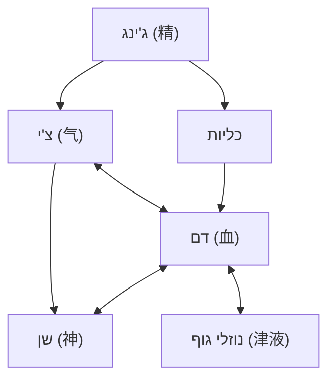

# חומרים חיוניים - צ'י, דם, ג'ינג, שן ונוזלי גוף

## Vital Substances - Qi, Blood, Jing, Shen & Body Fluids

---

## מטרות למידה

בסיום שיעור זה, הסטודנט יוכל:
1. להגדיר כל אחד מחמשת החומרים החיוניים ולתאר את מקורותיו
2. לפרט את סוגי הצ'י השונים ותפקודיהם
3. להסביר את הקשר בין צ'י לדם ואת המשמעות הקלינית שלו
4. לתאר את ההבדל בין ג'ינג של "לפני השמיים" ו"אחרי השמיים"
5. לזהות דפוסים פתולוגיים של כל חומר חיוני

---

## 1. צ'י (气 Qi) - אנרגיית החיים

### 1.1 מהו צ'י?

צ'י (气 Qi) הוא המושג המרכזי ברפואה הסינית, ואחד הקשים ביותר לתרגום. הוא מתייחס ל:

- **אנרגיה חיונית** שמניעה את כל תהליכי החיים
- **כוח פונקציונלי** המאפשר לאיברים לפעול
- **חומר בסיסי** שממנו מורכב היקום

> "气者，人之根本也" (Qi Zhe, Ren Zhi Gen Ben Ye)
> "צ'י הוא השורש והבסיס של האדם"
> — נאן ג'ינג

הרעיון המרכזי: **הכל הוא צ'י** - החומר הפיזי הוא צ'י מעובה, והאנרגיה היא צ'י מפוזר. ההבדל הוא בצפיפות ובמהירות התנועה.

### 1.2 מקורות הצ'י

צ'י נוצר משלושה מקורות:

1. **ג'ינג של לפני השמיים (先天之精 Xian Tian Zhi Jing)** - התמצית שעוברת מההורים ומאוחסנת בכליות
2. **צ'י של מזון (谷气 Gu Qi)** - נוצר מעיכול המזון על ידי הטחול והקיבה
3. **צ'י של אוויר (清气 Qing Qi)** - נקלט מהאוויר על ידי הריאות

### 1.3 סוגי הצ'י

#### א. יואן צ'י (元气 Yuan Qi) - צ'י מקורי / Original Qi

- **מקור**: ג'ינג של לפני השמיים (כליות) + תמיכה מג'ינג של אחרי השמיים (טחול/קיבה)
- **מיקום**: מקורו ב"שער החיים" (命门 Ming Men), מופץ דרך סאן ג'יאו (三焦)
- **תפקידים**:
  - הכוח המניע את כל תהליכי החיים
  - בסיס לפעילות של כל האיברים
  - מעורר ומחמם
- **משמעות קלינית**: חסר יואן צ'י = עייפות כללית, חולשה מולדת, התפתחות איטית

#### ב. גו צ'י (谷气 Gu Qi) - צ'י מזון / Food Qi

- **מקור**: מעיכול מזון ושתייה על ידי הטחול (脾) והקיבה (胃)
- **מיקום**: נוצר בטחול, עולה לחזה
- **תפקידים**:
  - חומר גלם לייצור צ'י ודם
  - מזין את הגוף כולו
- **משמעות קלינית**: תזונה לקויה → גו צ'י חלש → חולשת צ'י ודם

#### ג. זונג צ'י (宗气 Zong Qi) - צ'י חזה / Gathering Qi

- **מקור**: שילוב של גו צ'י (מזון) וצ'י אוויר (清气) בחזה
- **מיקום**: מצטבר בחזה, באזור הנקרא "ים הצ'י" (气海 Qi Hai) העליון
- **תפקידים**:
  - מזין את הלב ומניע את זרימת הדם
  - מזין את הריאות ומאפשר נשימה
  - משפיע על עוצמת הקול וחוזק הדיבור
  - מחמם את הגפיים
- **משמעות קלינית**: חסר זונג צ'י = קול חלש, קוצר נשימה, גפיים קרות, דפיקות לב

#### ד. ווי צ'י (卫气 Wei Qi) - צ'י מגן / Defensive Qi

- **מקור**: יואן צ'י + גו צ'י, מופץ על ידי הריאות
- **מיקום**: זורם **מחוץ** לערוצים, בעור ובשרירים
- **תפקידים**:
  - **הגנה** מפני גורמים פתוגניים חיצוניים (רוח, קור, חום)
  - **ויסות** פתיחת וסגירת נקבוביות העור (腠理 Cou Li)
  - **חימום** העור, השרירים והאיברים
  - **ויסות** הזעה וטמפרטורת גוף
- **מחזור**: ביום - פעיל בשטח הגוף (יאנג); בלילה - חודר פנימה לאיברים (ין)
- **משמעות קלינית**: ווי צ'י חלש = הצטננויות חוזרות, רגישות לשינויי מזג אוויר, הזעה ספונטנית

#### ה. יינג צ'י (营气 Ying Qi) - צ'י מזין / Nutritive Qi

- **מקור**: החלק הזך (清 Qing) של גו צ'י
- **מיקום**: זורם **בתוך** הערוצים וכלי הדם, יחד עם הדם
- **תפקידים**:
  - מזין את כל הרקמות והאיברים
  - חומר גלם לייצור דם
  - מלווה את הדם ומעשיר אותו
- **משמעות קלינית**: חסר יינג צ'י מתבטא כחסר דם

### 1.4 שישה תפקודי הצ'י

| תפקוד | סינית | הסבר | דוגמה קלינית |
|---|---|---|---|
| **המרה** (推动 Tui Dong) | Transforming | הפיכת חומרים - מזון לצ'י, צ'י לדם | חסר: עיכול חלש, אנמיה |
| **הובלה** (运输 Yun Shu) | Transporting | הנעת דם, נוזלים, מזון | חסר: קיפאון דם, בצקות |
| **החזקה** (固摄 Gu She) | Holding | שמירת חומרים במקומם | חסר: דימום, שלפוחית חלשה, צניחת איברים |
| **הרמה** (升提 Sheng Ti) | Raising | שמירת איברים במקומם, העלאת צ'י | חסר: צניחת רחם, טחורים, שלשול כרוני |
| **הגנה** (防御 Fang Yu) | Protecting | הגנה מגורמים פתוגניים | חסר: הצטננויות חוזרות |
| **חימום** (温煦 Wen Xu) | Warming | שמירת חום הגוף | חסר: קרירות, גפיים קרות |

### 1.5 פתולוגיות של צ'י

| מצב | סינית | סימנים | גורם |
|---|---|---|---|
| **חסר צ'י** | 气虚 Qi Xu | עייפות, קוצר נשימה, קול חלש, הזעה ספונטנית, לשון חיוורת | עבודת יתר, תזונה לקויה, מחלה כרונית |
| **קיפאון צ'י** | 气滞 Qi Zhi | כאב מתפשט, תחושת נפיחות, מתח, דיכאון, גזים | מתח רגשי, חוסר תנועה |
| **צ'י שוקע** | 气陷 Qi Xian | צניחת איברים, שלשול כרוני, עייפות קשה | חסר צ'י מתמשך |
| **צ'י מורד** | 气逆 Qi Ni | שיעול, בחילה, הקאה, שיהוקים, סחרחורת | קיפאון צ'י, חום |

---

## 2. דם (血 Xue)

### 2.1 מהו דם ברפואה הסינית?

דם (血 Xue) ברפואה הסינית הוא מושג רחב יותר מהדם בביולוגיה המערבית. הוא כולל:
- את הדם הפיזי (נוזל אדום בכלי הדם)
- את הפונקציה המזינה והמלחלחת של הדם
- את הקשר ההדוק לצ'י ולשן (רוח)

### 2.2 ייצור דם

הדם נוצר משלושה מקורות:

1. **גו צ'י (谷气)** - צ'י מזון שהטחול מפיק ושולח ללב, שם הוא הופך לדם
2. **יינג צ'י (营气)** - צ'י מזין שנכנס לכלי הדם ומשלים את הדם
3. **ג'ינג כליות (肾精)** - תמצית הכליות שיוצרת מח עצמות, והמח יוצר דם

**איברים המעורבים בייצור דם:**
- **טחול (脾)**: מפיק גו צ'י מהמזון - "הטחול הוא מקור הדם"
- **לב (心)**: הופך גו צ'י לדם
- **כליות (肾)**: ג'ינג → מח עצמות → דם
- **ריאות (肺)**: צ'י הריאות מסייע בהפצת הדם

### 2.3 תפקודי הדם

1. **הזנה (濡养 Ru Yang)**: מזין את כל הרקמות, האיברים, השרירים, הגידים, העצמות והעור
2. **לחלוח (滋润 Zi Run)**: שומר על לחות הרקמות, מונע יובש
3. **בית לשן (神之宅 Shen Zhi Zhai)**: הדם הוא "בית" לרוח (שן) - כאשר הדם מספיק, הרוח רגועה; כאשר הדם חסר, הרוח חסרת מנוחה

### 2.4 הקשר בין צ'י לדם

זהו אחד היחסים החשובים ביותר ברפואה הסינית:

> **"气为血之帅，血为气之母"**
> **"צ'י הוא מצביא הדם, דם הוא אם הצ'י"**

| צ'י ביחס לדם | דם ביחס לצ'י |
|---|---|
| צ'י **מייצר** דם (气能生血) | דם **מזין** צ'י (血能载气) |
| צ'י **מניע** דם (气能行血) | דם **נושא** צ'י (血能养气) |
| צ'י **מחזיק** דם בכלי הדם (气能摄血) | ללא דם, צ'י "נודד" ללא עוגן |

**משמעות קלינית:**
- חסר צ'י ממושך → חסר דם (כי אין מספיק כוח לייצר דם)
- חסר דם ממושך → חסר צ'י (כי הדם לא מזין את הצ'י)
- קיפאון צ'י → קיפאון דם (כי הצ'י לא מניע את הדם)
- חסר צ'י → דימום (כי הצ'י לא מחזיק את הדם בכלי הדם)

### 2.5 פתולוגיות של דם

| מצב | סינית | סימנים | גורם |
|---|---|---|---|
| **חסר דם** | 血虚 Xue Xu | חיוורון, סחרחורת, ראייה מטושטשת, נדודי שינה, זיכרון חלש, ציפורניים שבירות, וסת מועטה | תזונה לקויה, דימום, חסר טחול |
| **קיפאון דם** | 血瘀 Xue Yu | כאב קבוע ודוקר, צבע כהה/סגלגל, גושים, לשון סגולה עם נקודות כהות | חבלה, קור, חום, קיפאון צ'י ממושך |
| **חום בדם** | 血热 Xue Re | דימום, פריחות, אי-שקט, לשון אדומה כהה | חום חיצוני, חום פנימי |

---

## 3. ג'ינג (精 Jing) - תמצית

### 3.1 מהו ג'ינג?

ג'ינג (精 Jing) הוא ה**תמצית** - החומר הבסיסי ביותר שעומד מאחורי כל צמיחה, התפתחות ורבייה. הוא ה"מרק" המרוכז ביותר של הגוף.

### 3.2 שני סוגי ג'ינג

#### א. ג'ינג של לפני השמיים (先天之精 Xian Tian Zhi Jing) - Pre-Heaven Essence

- **מקור**: מההורים, ברגע ההפריה
- **מיקום**: מאוחסן בכליות (肾)
- **תפקידים**:
  - קובע את החוקה הבסיסית של האדם
  - מנחה צמיחה, התפתחות והזדקנות
  - בסיס לפוריות ורבייה
- **מאפיין**: **מוגבל בכמות** - לא ניתן להוסיף עליו, רק לשמר אותו
- **אנלוגיה**: כמו "חשבון בנק" שמתמלא פעם אחת בלידה

#### ב. ג'ינג של אחרי השמיים (后天之精 Hou Tian Zhi Jing) - Post-Heaven Essence

- **מקור**: נוצר מתזונה, נשימה ואורח חיים
- **מיקום**: מופק על ידי הטחול והקיבה, מאוחסן בכליות
- **תפקידים**:
  - מחדש ומשלים את הג'ינג היומיומי
  - מזין את כל האיברים
  - **מאט את שחיקת הג'ינג של לפני השמיים**
- **מאפיין**: ניתן לחידוש על ידי תזונה נכונה ואורח חיים בריא

### 3.3 ג'ינג, כליות והזדקנות

הג'ינג שולט במחזורי החיים. ה"הואנג די ניי ג'ינג" מתאר:

**אצל נשים - מחזורי 7 שנים:**
- 7: שיניים חלב נושרות, שיער מתחזק
- 14 (2×7): בגרות מינית, תחילת וסת (天癸 Tian Gui)
- 21 (3×7): שיא הצמיחה הפיזית
- 28 (4×7): שיא הכוח הפיזי
- 35 (5×7): תחילת ירידה - קמטים ראשונים
- 42 (6×7): שיער מתחיל ללבין
- 49 (7×7): הפסקת וסת, ירידה בפוריות

**אצל גברים - מחזורי 8 שנים:**
- 8: שיניים חלב, שיער מתחזק
- 16 (2×8): בגרות מינית
- 24 (3×8): שיא הצמיחה
- 32 (4×8): שיא הכוח
- 40 (5×8): תחילת ירידה
- 48 (6×8): שיער מלבין
- 56 (7×8): ירידה משמעותית
- 64 (8×8): שיניים ושיער נושרים

### 3.4 שמירה על הג'ינג

דרכים לשמור ולחזק את הג'ינג:
- **תזונה נכונה**: מזונות מזינים ומחזקים (אגוזים, זרעים, מזונות שחורים)
- **שינה מספקת**: מנוחה מאפשרת לג'ינג להתחדש
- **מיתון פעילות מינית**: פעילות מינית מופרזת מדלדלת ג'ינג (בגברים)
- **תרגילים נכונים**: צ'י גונג (气功) וטאי צ'י (太极) שומרים על ג'ינג
- **איזון רגשי**: רגשות קיצוניים שוחקים ג'ינג
- **צמחי מרפא**: נוסחאות לחיזוק כליות-ג'ינג

---

## 4. שן (神 Shen) - רוח / תודעה

### 4.1 מהו שן?

שן (神 Shen) הוא מושג רב-שכבתי:

**במובן הרחב**: כל הפעילויות המנטליות, הרגשיות והרוחניות של האדם
**במובן הצר**: הרוח/התודעה הספציפית ששוכנת בלב

### 4.2 שן והלב

> **"心藏神" (Xin Cang Shen)**
> **"הלב מאחסן את השן"**

הלב (心 Xin) ברפואה הסינית אינו רק משאבה פיזית - הוא מושב ה**תודעה, המחשבה, הזיכרון, השינה והרגשות**. כאשר:
- **דם הלב מספיק** → שן רגוע → שינה טובה, מחשבה צלולה, רגשות מאוזנים
- **דם הלב חסר** → שן חסר מנוחה → נדודי שינה, חלומות מטרידים, חרדה

### 4.3 חמשת השן (五神 Wu Shen)

כל איבר ין מאחסן היבט שונה של השן:

| איבר | היבט רוחני | סינית | תפקוד |
|---|---|---|---|
| **לב** (心) | שן (神 Shen) | Spirit | תודעה, מחשבה, שינה, זיכרון |
| **כבד** (肝) | הון (魂 Hun) | Ethereal Soul | דמיון, חזון, חלומות, תכנון |
| **ריאות** (肺) | פו (魄 Po) | Corporeal Soul | תחושות פיזיות, אינסטינקטים, גבולות |
| **טחול** (脾) | יי (意 Yi) | Intellect | ריכוז, למידה, זיכרון, חשיבה אנליטית |
| **כליות** (肾) | ג'י (志 Zhi) | Willpower | רצון, מוטיבציה, שאיפה, נחישות |

### 4.4 הערכת השן

בבדיקה קלינית, ניתן להעריך את מצב השן על ידי:
- **העיניים**: ברק, חיוּת, מבט ממוקד = שן חזק; מבט עמום, ריק = שן חלש
- **הפנים**: הבעה חיה ומגוונת = שן תקין; הבעה קהה = שן מופרע
- **הדיבור**: קוהרנטי, ברור = שן תקין; מבולבל, לא ממוקד = שן מופרע
- **התנהגות**: מותאמת, מאורגנת = שן תקין; לא מותאמת = שן מופרע

### 4.5 פתולוגיות של שן

- **שן חסר מנוחה (神不安 Shen Bu An)**: נדודי שינה, חרדה, חוסר שקט, דפיקות לב
- **שן מעורפל (神昏 Shen Hun)**: בלבול, ערפול תודעה, חוסר קוהרנטיות
- **שן מופרע (神乱 Shen Luan)**: מאניה, דיבור לא סדור, התנהגות לא מותאמת

---

## 5. נוזלי גוף (津液 Jin Ye)

### 5.1 שני סוגי נוזלים

#### א. ג'ין (津 Jin) - נוזלים דקים / Thin Fluids

- **מאפיינים**: קלים, שקופים, בעלי תנועה מהירה
- **מיקום**: עור, שרירים, ריריות, חלל הפה, עיניים
- **תפקידים**: לחלוח עור ושרירים, הזעה, דמעות, ריר
- **שייכות**: יאנג יחסית (כי הם קלים ונעים מהר)

#### ב. יה (液 Ye) - נוזלים עבים / Thick Fluids

- **מאפיינים**: כבדים, סמיכים, בעלי תנועה איטית
- **מיקום**: מפרקים, מוח, עמוד שדרה, עצמות, איברים פנימיים
- **תפקידים**: שימון מפרקים, הזנת מוח ועמוד שדרה, לחלוח עיניים ואף
- **שייכות**: ין יחסית (כי הם כבדים ונעים לאט)

### 5.2 ייצור, הפצה והפרשה

**ייצור:**
- **קיבה (胃)**: מקבלת מזון ושתייה, מפרידה טהור מעכור
- **טחול (脾)**: מעלה את הנוזלים הטהורים

**הפצה:**
- **ריאות (肺)**: מפיצות נוזלים לעור ולמעלה, מורידות נוזלים לכליות
- **טחול (脾)**: מפיץ לכל הגוף
- **כליות (肾)**: מאדות נוזלים ומחזירות את הטהור, שולחות עכור לשלפוחית

**הפרשה:**
- **שלפוחית (膀胱)**: שתן
- **מעי גס (大肠)**: צואה
- **ריאות (肺)**: הזעה, נשיפה

### 5.3 פתולוגיות של נוזלי גוף

| מצב | סימנים | גורם |
|---|---|---|
| **חסר נוזלים** (津液不足) | יובש (עור, פה, גרון, עיניים), צמא, עצירות, שתן מועט | חום, הזעה מופרזת, הקאות, שלשול |
| **הצטברות נוזלים** (水湿停聚) | בצקות, כבדות, שלשולים מימיים, ליחה | חסר טחול, חסר כליות-יאנג |
| **ליחה (痰 Tan)** | ליחה בריאות, גושים, סחרחורת, ערפול | חסר טחול, קיפאון צ'י, חום |

---

## 6. הקשרים בין החומרים החיוניים

### 6.1 תרשים יחסים

### 6.2 יחסים מרכזיים

| יחס | הסבר | משמעות קלינית |
|---|---|---|
| צ'י → דם | צ'י מייצר, מניע ומחזיק דם | חסר צ'י → חסר דם, דימום |
| דם → צ'י | דם מזין ונושא צ'י | חסר דם → חסר צ'י |
| ג'ינג ↔ צ'י | ג'ינג הוא בסיס לצ'י, צ'י שומר על ג'ינג | חסר ג'ינג → חסר צ'י |
| ג'ינג → דם | ג'ינג (מח עצמות) מייצר דם | חסר ג'ינג → אנמיה |
| דם → שן | דם מזין ומאכסן שן | חסר דם → חרדה, נדודי שינה |
| ג'ינג → שן | ג'ינג הוא הבסיס החומרי לשן | חסר ג'ינג → ירידה קוגניטיבית |
| צ'י ↔ נוזלים | צ'י מניע נוזלים, נוזלים נושאים צ'י | קיפאון צ'י → הצטברות נוזלים |

---

## 7. משמעות קלינית - סיכום

### 7.1 עקרונות טיפול

| חומר | עיקרון | דוגמה |
|---|---|---|
| צ'י חסר | חיזוק צ'י (补气 Bu Qi) | חיזוק טחול-צ'י |
| צ'י בקיפאון | הזזת צ'י (行气 Xing Qi) | הרגעת כבד |
| דם חסר | הזנת דם (补血 Bu Xue) | הזנת כבד-דם |
| דם בקיפאון | הפעלת דם (活血 Huo Xue) | פירוק קיפאון |
| ג'ינג חסר | חיזוק ג'ינג (补精 Bu Jing) | חיזוק כליות |
| שן לא שקט | הרגעת שן (安神 An Shen) | הרגעת לב |
| נוזלים חסרים | יצירת נוזלים (生津 Sheng Jin) | הזנת ין |

---

## 8. תרגילים

### תרגיל 1: זיהוי סוגי צ'י
התאימו את התפקוד לסוג הצ'י:
א. מגן מפני הצטננות: _____
ב. מניע את הדם בכלי הדם: _____
ג. מאפשר נשימה חזקה: _____
ד. בסיס לכל תפקודי האיברים: _____
ה. מזין את הרקמות בתוך הערוצים: _____

### תרגיל 2: צ'י ודם
הסבירו כיצד כל אחד מהמצבים הבאים קשור ליחס צ'י-דם:
א. אישה עם דימום וסת כבד שמתחילה לסבול מעייפות
ב. אדם עם מתח כרוני שמפתח כאבי ראש קבועים עם כאב דוקר

### תרגיל 3: מחזורי ג'ינג
על פי מחזורי 7 ו-8, באיזה גיל מגיעים לשיא הכוח הפיזי נשים וגברים? מתי מתחילה הירידה?

### תרגיל 4: שן
כיצד תעריכו את מצב השן בבדיקה ראשונית של מטופל? אילו סימנים תחפשו?

### תרגיל 5: מקרה קליני
מטופלת בת 35, מתלוננת על: עייפות, חיוורון, סחרחורת כשקמה מהר, ראייה מטושטשת, נדודי שינה, וסת מועטה.
א. אילו חומרים חיוניים מעורבים?
ב. מהם הדפוסים?
ג. מהו עיקרון הטיפול?

---

## קריאה מומלצת

- Maciocia, G. *The Foundations of Chinese Medicine* (פרקים 3-5)
- Deadman, P. *A Manual of Acupuncture* (מבוא)
- הואנג די ניי ג'ינג, סו וון, פרקים 8-10

---

> **נקודה למחשבה**: החומרים החיוניים אינם נפרדים - הם רצף אחד מהחומרי ביותר (ג'ינג) לרוחני ביותר (שן). בריאות היא מצב שבו כל החומרים החיוניים מספיקים בכמותם, זורמים בחופשיות, ופועלים בהרמוניה.

---

## ניווט

- **הקודם**: [חמשת האלמנטים](03-five-elements.md) | **הבא**: [גורמי מחלה](05-causes-of-disease.md)
- **חזרה למודול**: [מודול 1 — פילוסופיה](README.md)
- **ראה גם**: [דפוסי צ'י ודם](../../year-2-intermediate/module-06-pathology/03-qi-blood-patterns.md) — מה קורה כשחומרים חיוניים לוקים | [חוסר צ'י טחול](../../year-2-intermediate/module-06b-syndromes/spleen-syndromes/01-spleen-qi-deficiency.md) — דוגמא לסינדרום הנובע מחוסר צ'י
