# 02-lung-channel

## ערוץ הריאות - שו טאי ין פיי (手太阴肺经)

### Hand Tai Yin Lung Channel (Shou Tai Yin Fei Jing)

***

### מטרות למידה

בסיום שיעור זה, הסטודנט יוכל:

1. לתאר את מסלול ערוץ הריאות - חיצוני ופנימי
2. לאתר את כל 11 הנקודות (LU1-LU11) על הגוף
3. לתאר את פעולות כל נקודה ואת התוויותיה
4. לבצע דיקור בטוח בכל נקודות הערוץ
5. להסביר את הקשר פנים-חוץ בין ריאות (LU) למעי גס (LI)
6. לזהות פתולוגיות נפוצות של ערוץ הריאות

***

### 1. סקירת הערוץ

#### 1.1 מידע כללי

| מאפיין       | פרטים                         |
| ------------ | ----------------------------- |
| שם סיני      | 手太阴肺经 (Shou Tai Yin Fei Jing) |
| סוג          | ין — טאי ין (Tai Yin)         |
| גפה          | יד (Hand)                     |
| איבר         | ריאות (肺 Fei)                 |
| זוג פנים-חוץ | מעי גס (LI) — יאנג מינג       |
| מספר נקודות  | 11 (LU1-LU11)                 |
| שעת שיא      | 03:00-05:00                   |
| כיוון זרימה  | מהחזה אל האגודל               |
| אלמנט        | מתכת (金 Jin)                  |

#### 1.2 מסלול הערוץ

**מסלול פנימי (内行 Nei Xing)**

1. **מתחיל באזור הג'יאו האמצעי** (中焦 Zhong Jiao) - בקיבה
2. **יורד למטה** ומתחבר למעי הגס (האיבר המזווג)
3. **עולה חזרה** דרך הסרעפת ומגיע לריאות
4. **ממשיך אופקית** מהריאות אל הגרון
5. **יורד** לאזור תת-בית השחי

**מסלול חיצוני (外行 Wai Xing)**

1. **יוצא** באזור החלק הקדמי-צידי של החזה (LU1)
2. **עולה** לגומת הבריח (LU2)
3. **יורד** לאורך הצד הפנימי-קדמי (Anterior-Medial) של הזרוע
4. **עובר** לאורך הצד הרדיאלי (צד האגודל) של האמה
5. **ממשיך** מעל שורש כף היד אל האגודל
6. **מסתיים** בפינה הרדיאלית של ציפורן האגודל (LU11)

**ענף**

* מ-LU7 (ליה צ'יואה) יוצא ענף לצד הרדיאלי של האצבע המורה, שם מתחבר לערוץ המעי הגס (LI1)

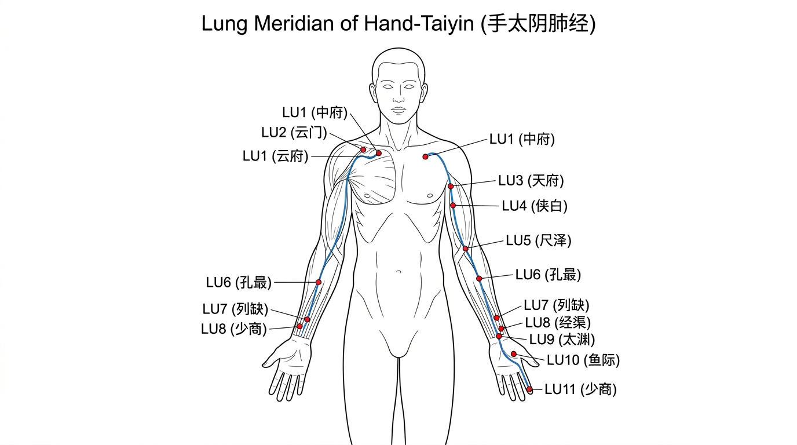

#### 1.3 תפקודי איבר הריאות (肺 Fei)

* **שולט בצ'י ובנשימה** (主气司呼吸) - הריאות שואפות צ'י טהור ופולטות צ'י עכור
* **שולט בהפצה ובהורדה** (宣发肃降) - מפזר ווי צ'י ונוזלים לשטח; מוריד צ'י ונוזלים כלפי מטה
* **שולט בערוצים ובכלי הדם** (朝百脉) - "כל הערוצים מגיעים לריאות"
* **שולט בעור ובשיער הגוף** (主皮毛) - ווי צ'י מגן על העור
* **נפתח לאף** (开窍于鼻) - האף הוא "השער" של הריאות
* **מאכסן את הפו** (藏魄) - הפו (魄) הוא ההיבט הנפשי של הריאות - אינסטינקט, תחושה גופנית
* **רגש**: עצב ואבל (悲忧)

#### 1.4 פתולוגיות נפוצות של הערוץ

* שיעול, אסתמה, קוצר נשימה
* כאב בחזה, גרון, כתף קדמית, זרוע פנימית
* הצטננות, נזלת, שפעת
* בעיות עור (אקזמה, פסוריאזיס)
* עצב כרוני, דיכאון קל

***

### 2. נקודות הערוץ

***

> **WHO Standard Acupuncture Point Locations** (WHO, CC BY-NC-SA 3.0 IGO):
>
> 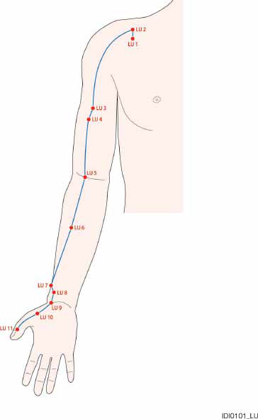

#### LU1 — צ'ונג פו (中府)

**שם סיני**: 中府 (Zhong Fu) **משמעות השם**: "ארמון האמצע" — נקודת המפגש של צ'י הריאות עם ג'יאו האמצעי **קטגוריה מיוחדת**: נקודת מו קדמית (募穴 Mu Xue) של הריאות; נקודת מפגש עם ערוץ הטחול

**מיקום אנטומי**

6 צון (寸) לטרלית לקו האמצע הקדמי, ברווח הבין-צלעי הראשון. 1 צון מתחת ל-LU2.

**איך למצוא את הנקודה**

1. בקשו מהמטופל לעמוד או לשבת עם ידיים לצדדים
2. אתרו את עצם הבריח (Clavicle)
3. גששו את הגומה שמתחת לקצה החיצוני של הבריח — זו LU2
4. ירדו 1 צון (רוחב אגודל אחד) ישירות מטה — זו LU1
5. הנקודה נמצאת ברווח הבין-צלעי הראשון, כ-6 צון מקו האמצע
6. לחצו — הנקודה רגישה במיוחד בקרב מטופלים עם בעיות ריאה

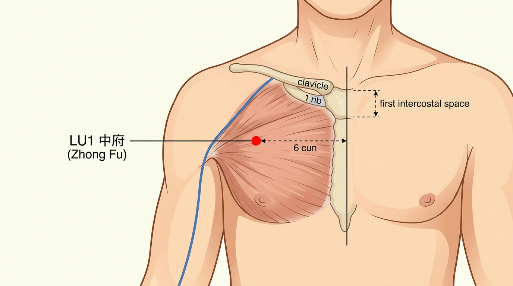

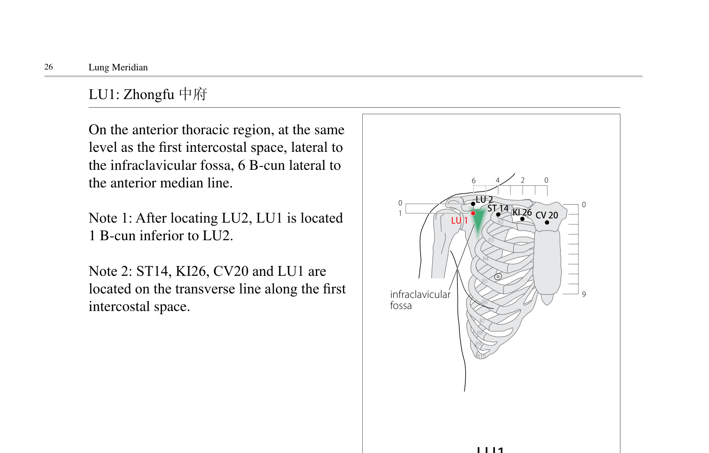

> **External References:** [AcuPoints](https://www.acupoints.org/lu1-acupuncture-point/)

**דיקור**

* **זווית**: אלכסונית-לטרלית (Oblique), 45° כלפי חוץ
* **עומק**: 0.5-0.8 צון
* **⚠️ זהירות**: אין לדקור עמוק או מדיאלית — סכנת פנאומותורקס (חדירה לריאה)
* **תחושת דה-צ'י**: כבדות, נימול, או תחושה שמתפשטת לכתף ולזרוע

**פעולות והתוויות**

* **פעולות**: מפזר ומוריד צ'י ריאות; מפנה חום מהג'יאו העליון; מווסת מסלול המים
* **התוויות**: שיעול, אסתמה, קוצר נשימה, כאב בחזה, גודש בחזה, כאב בכתף קדמית
* **שילובים נפוצים**: LU1 + LU7 (שיעול); LU1 + ST36 + SP6 (חיזוק צ'י ריאות-טחול)

***

#### LU2 — יון מן (云门)

**שם סיני**: 云门 (Yun Men) **משמעות השם**: "שער העננים" — השער שדרכו צ'י הריאות מתפשט כמו עננים

**מיקום אנטומי**

6 צון לטרלית לקו האמצע הקדמי, בגומה שמתחת לקצה הלטרלי של עצם הבריח (Clavicle), מדיאלית לתהליך הקורקואידי (Coracoid Process) של הכתף.

**איך למצוא את הנקודה**

1. בקשו מהמטופל לשבת עם ידיים על הירכיים
2. אתרו את עצם הבריח (Clavicle) — עקבו אותה לכיוון הכתף
3. בקצה החיצוני של הבריח, גששו את הגומה (Depression) שנוצרת מתחת לעצם
4. הגומה נמצאת מדיאלית (פנימית) לתהליך הקורקואידי של עצם השכם
5. לחצו בעדינות — אמורה להיות רגישות קלה

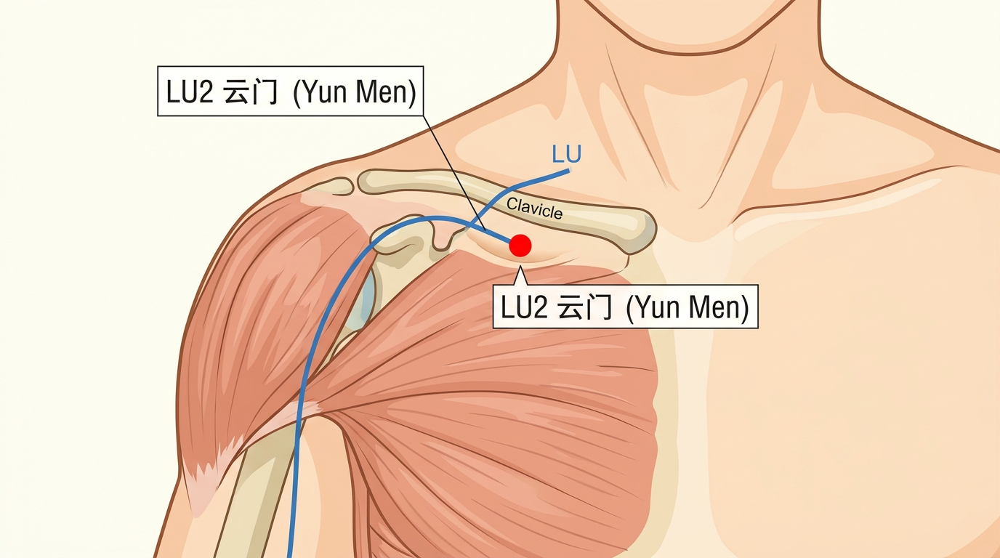

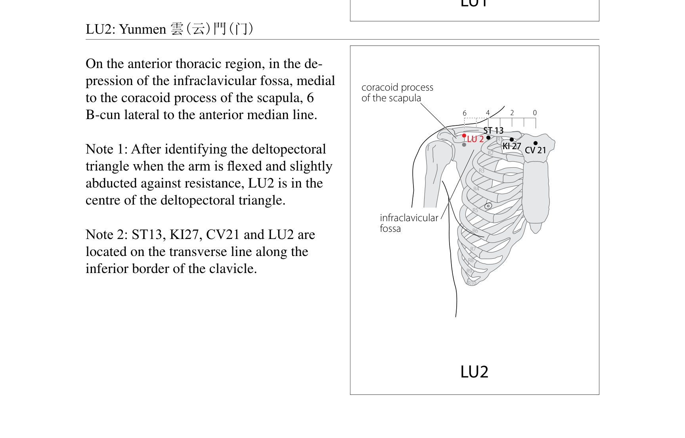

> **External References:** [AcuPoints](https://www.acupoints.org/lu2-acupuncture-point/)

**דיקור**

* **זווית**: אלכסונית-לטרלית, 45°
* **עומק**: 0.3-0.5 צון
* **⚠️ זהירות**: אין לדקור עמוק — סכנת פנאומותורקס
* **תחושת דה-צ'י**: נימול, כבדות מקומית

**פעולות והתוויות**

* **פעולות**: מפנה חום מהריאות; מווסת צ'י ריאות; מועיל לכתף
* **התוויות**: שיעול, אסתמה, כאב בחזה, כאב בכתף, חום
* **שילובים נפוצים**: LU2 + LU1 (גודש בחזה עליון); LU2 + LI15 (כאב כתף קדמי)

***

#### LU3 — טיאן פו (天府)

**שם סיני**: 天府 (Tian Fu) **משמעות השם**: "ארמון השמיים" — נקודה גבוהה בזרוע הקשורה לריאות (שמיים) **קטגוריה מיוחדת**: נקודת חלון השמיים (天窗穴 Tian Chuang Xue)

**מיקום אנטומי**

3 צון מתחת לקצה הקדמי של קפל בית השחי, על הצד הרדיאלי (לטרלי) של שריר הביצפס (Biceps Brachii), על הזרוע העליונה.

**איך למצוא את הנקודה**

1. בקשו מהמטופל להרים את הזרוע ישר קדימה לגובה הכתף
2. הצמידו את קצה האף לזרוע — המקום שבו האף נוגע הוא בקירוב LU3
3. לחלופין: מדדו 3 צון מתחת לקפל בית השחי הקדמי
4. הנקודה נמצאת על הגבול הרדיאלי (צד חיצוני) של שריר הביצפס
5. גששו את השריר — הנקודה ברצועת השריר עצמה

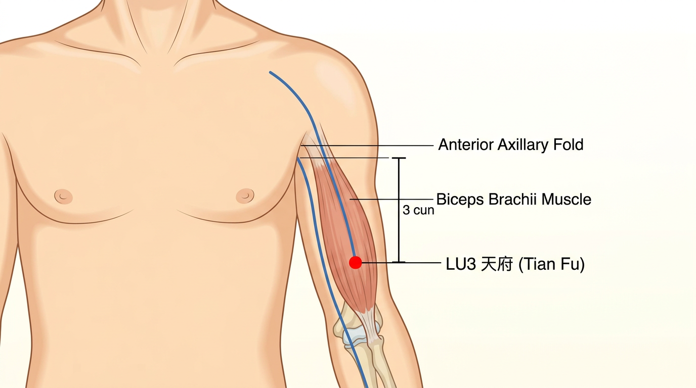

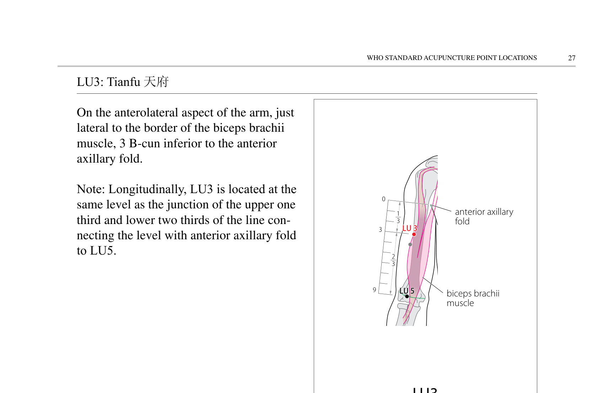

> **External References:** [AcuPoints](https://www.acupoints.org/lu3-acupuncture-point/)

**דיקור**

* **זווית**: ניצבת (Perpendicular), 90°
* **עומק**: 0.5-1.0 צון
* **תחושת דה-צ'י**: כבדות, נימול שמתפשט לאורך הזרוע

**פעולות והתוויות**

* **פעולות**: מוריד צ'י ריאות; מקרר דם; מרגיע את הפו (נפש); "חלון השמיים" — מבהיר את השכל
* **התוויות**: אסתמה, דימום מהאף (אפיסטקסיס), כאב בזרוע הפנימית, עצב כרוני, בלבול
* **שילובים נפוצים**: LU3 + BL13 (אסתמה); LU3 + HT7 (עצב ובכי)

***

#### LU4 — שיה באי (侠白)

**שם סיני**: 侠白 (Xia Bai) **משמעות השם**: "לוחם הלבן" — לבן הוא צבע הריאות (מתכת)

**מיקום אנטומי**

4 צון מתחת לקצה הקדמי של קפל בית השחי, על הצד הרדיאלי של שריר הביצפס. 1 צון מתחת ל-LU3.

**איך למצוא את הנקודה**

1. אתרו קודם את LU3 (3 צון מתחת לקפל בית השחי)
2. ירדו 1 צון נוסף (סה"כ 4 צון מקפל בית השחי)
3. הנקודה נמצאת על אותו קו — הגבול הרדיאלי של שריר הביצפס
4. גששו — הנקודה ברצועת השריר

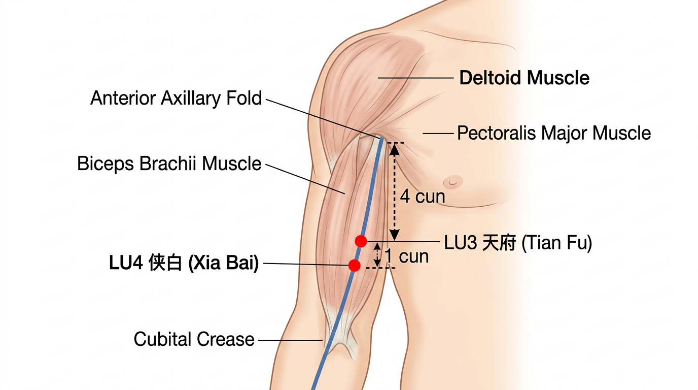

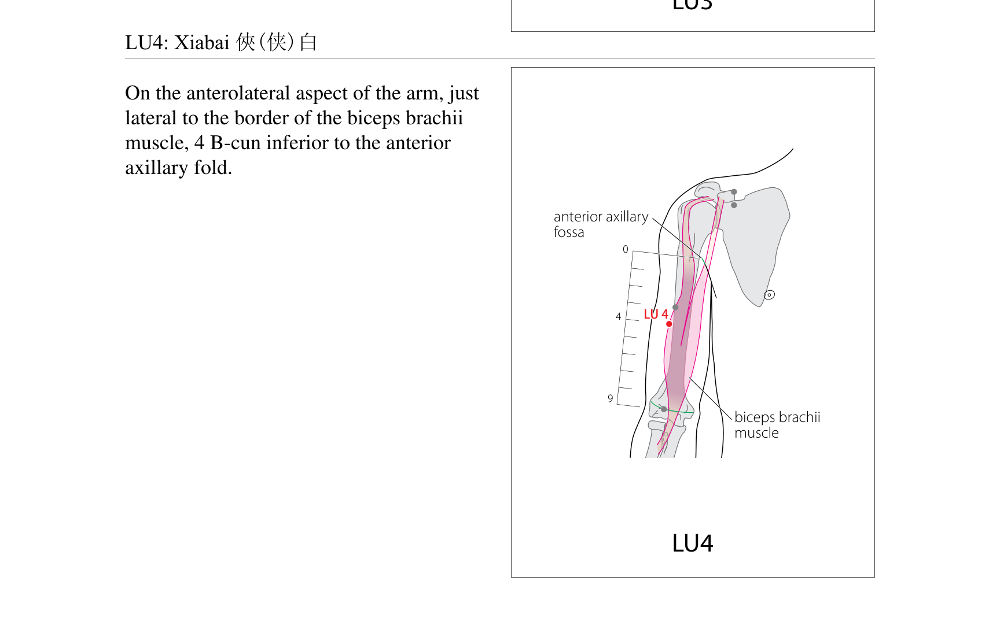

> **External References:** [AcuPoints](https://www.acupoints.org/lu4-acupuncture-point/)

**דיקור**

* **זווית**: ניצבת (Perpendicular), 90°
* **עומק**: 0.5-1.0 צון
* **תחושת דה-צ'י**: כבדות מקומית, לעתים נימול שיורד לכיוון המרפק

**פעולות והתוויות**

* **פעולות**: מווסת צ'י בחזה; מרחיב את החזה
* **התוויות**: שיעול, קוצר נשימה, כאב בצד הפנימי של הזרוע, כאב בלב (תחושת לחץ בחזה)
* **שילובים נפוצים**: LU4 + PC6 (כאב וגודש בחזה)

***

#### LU5 — צ'י צה (尺泽)

**שם סיני**: 尺泽 (Chi Ze) **משמעות השם**: "ביצת הצ'י" (צ'י = יחידת מדידה של האמה; צה = ביצה/מאגר מים) — מאגר מים של ערוץ הריאות **קטגוריה מיוחדת**: נקודת הה-ים (合穴 He Xue) — אלמנט מים (水 Shui)

**מיקום אנטומי**

בקפל המרפק (Cubital Crease), בצד הרדיאלי של גיד הביצפס (Biceps Brachii Tendon).

**איך למצוא את הנקודה**

1. בקשו מהמטופל לכופף מעט את המרפק
2. אתרו את קפל המרפק (הקו שנוצר כשהמרפק מכופף)
3. גששו את גיד הביצפס במרכז קפל המרפק — גיד בולט וקשיח
4. הנקודה נמצאת מיד לטרלית (צד האגודל) לגיד
5. לחצו בגומה שלצד הגיד — אמורה להיות רגישות ברורה

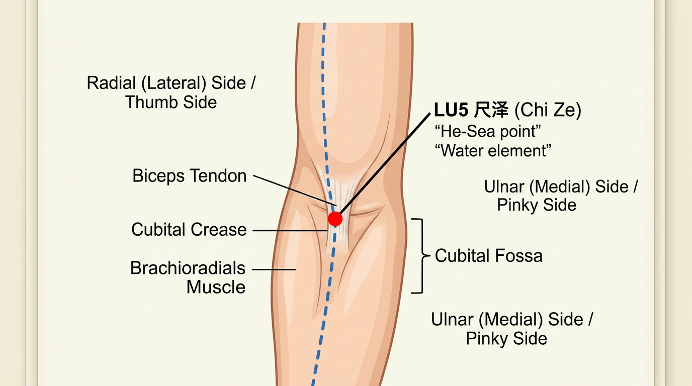

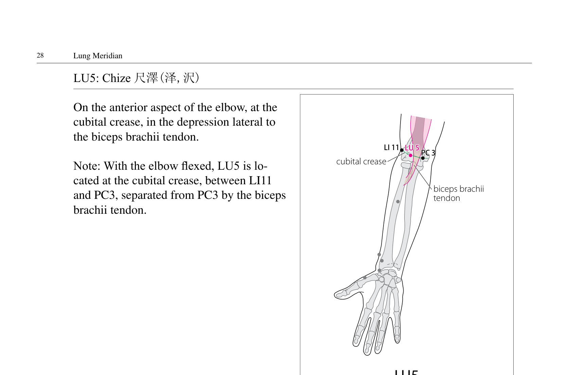

> **External References:** [AcuPoints](https://www.acupoints.org/lu5-acupuncture-point/)

**דיקור**

* **זווית**: ניצבת (Perpendicular), 90°, או מעט אלכסונית
* **עומק**: 0.5-1.0 צון
* **⚠️ זהירות**: הימנעו מדקירת העורק הברכיאלי (Brachial Artery) — הוא מדיאלי לגיד
* **תחושת דה-צ'י**: נימול חשמלי שיורד לאמה ולכף היד

**פעולות והתוויות**

* **פעולות**: מפנה חום מהריאות; מוריד צ'י מורד (Rebellious Qi); מרטיב את הריאות; מרפה גידים; מועיל לשלפוחית (כנקודת מים)
* **התוויות**: שיעול עם ליחה חמה/צהובה, שיעול דם (המופטיזיס), כאב גרון, כאב מרפק ("מרפק טניס"), שלשולות חריפות, הקאות
* **שילובים נפוצים**: LU5 + LU6 (שיעול דם — חירום); LU5 + LI11 (כאב מרפק); LU5 + REN17 (אסתמה עם ליחה)

***

#### LU6 — קונג צואי (孔最)

**שם סיני**: 孔最 (Kong Zui) **משמעות השם**: "חור האוסף" — נקודה שבה צ'י הריאות מתאסף בעומק **קטגוריה מיוחדת**: נקודת שי-צלע (郄穴 Xi Xue) — נקודת חירום/כאב חריף של הערוץ

**מיקום אנטומי**

7 צון מעל קפל שורש כף היד (Wrist Crease), על הקו המחבר בין LU5 ל-LU9, בצד הרדיאלי של האמה.

**איך למצוא את הנקודה**

1. אתרו את LU5 (בקפל המרפק) ואת LU9 (בקפל שורש כף היד)
2. המרחק ביניהם הוא 12 צון
3. מדדו 7 צון מעל LU9 (או 5 צון מתחת ל-LU5)
4. הנקודה נמצאת על הצד הרדיאלי (צד האגודל) של האמה
5. בין שריר ה-Brachioradialis לבין גיד ה-Flexor Carpi Radialis
6. לחצו עמוק — נקודה זו עשויה להיות רגישה מאוד

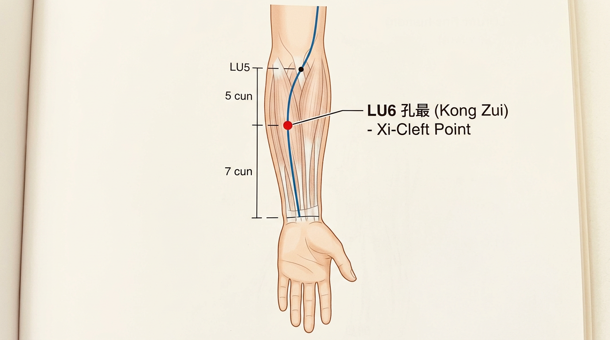

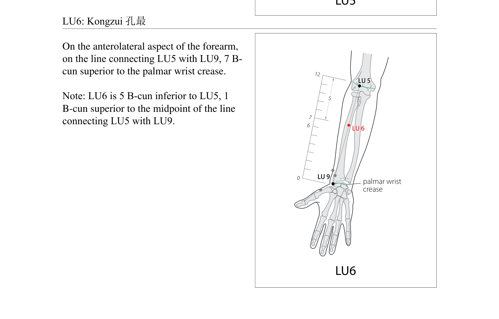

> **External References:** [AcuPoints](https://www.acupoints.org/lu6-acupuncture-point/)

**דיקור**

* **זווית**: ניצבת (Perpendicular), 90°
* **עומק**: 0.5-1.2 צון
* **תחושת דה-צ'י**: כאב מקומי, נימול שמתפשט לכף היד או למרפק

**פעולות והתוויות**

* **פעולות**: מפנה חום מהריאות; מקרר דם ועוצר דימום; מוריד צ'י מורד; מרטיב את הגרון
* **התוויות**: שיעול דם (**נקודת מפתח**), כאב גרון חריף, אובדן קול, שיעול חריף, חום, כאב באמה, טחורים (דימום)
* **כנקודת שי**: משמשת במיוחד למצבים **חריפים** של הערוץ
* **שילובים נפוצים**: LU6 + LU5 (שיעול דם); LU6 + LI4 + LU7 (כאב גרון חריף)

***

#### LU7 — ליה צ'יואה (列缺)

**שם סיני**: 列缺 (Lie Que) **משמעות השם**: "סדרת הפגמים" או "ברק" — הנקודה נמצאת בשקע (פגם) בעצם הרדיוס **קטגוריה מיוחדת**: נקודת לואו מחברת (络穴 Luo Xue); נקודת פתיחה של רן מאי (任脉); אחת מ-4 נקודות הפיקוד (四总穴); נקודת מפגש עם ערוץ המעי הגס

**מיקום אנטומי**

1.5 צון מעל קפל שורש כף היד, בצד הרדיאלי של האמה, מעל התהליך הסטילואידי (Styloid Process) של עצם הרדיוס, בשקע בין גידי ה-Brachioradialis וה-Abductor Pollicis Longus.

**איך למצוא את הנקודה**

1. **שיטת הצלבה**: בקשו מהמטופל להצליב את כפות הידיים כך שהאצבע המורה של יד אחת נמצאת על התהליך הסטילואידי (הבליטה העצמית בצד האגודל של שורש כף היד) של היד השנייה
2. קצה האצבע המורה נוגע בדיוק ב-LU7
3. **שיטה חלופית**: מצאו את קפל שורש כף היד, מדדו 1.5 צון כלפי מעלה בצד הרדיאלי
4. גששו את השקע/גומה שבין שני הגידים
5. הזיזו את האגודל קדימה ואחורה — תרגישו את הגידים נעים; הנקודה בשקע ביניהם

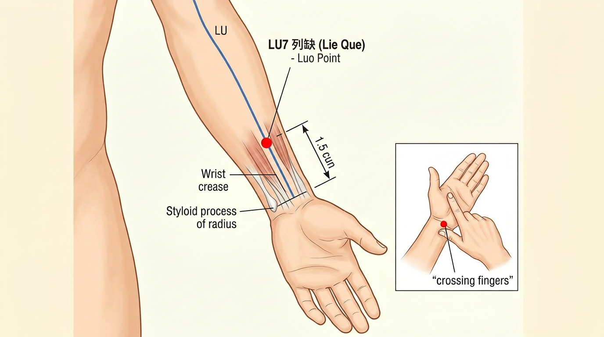

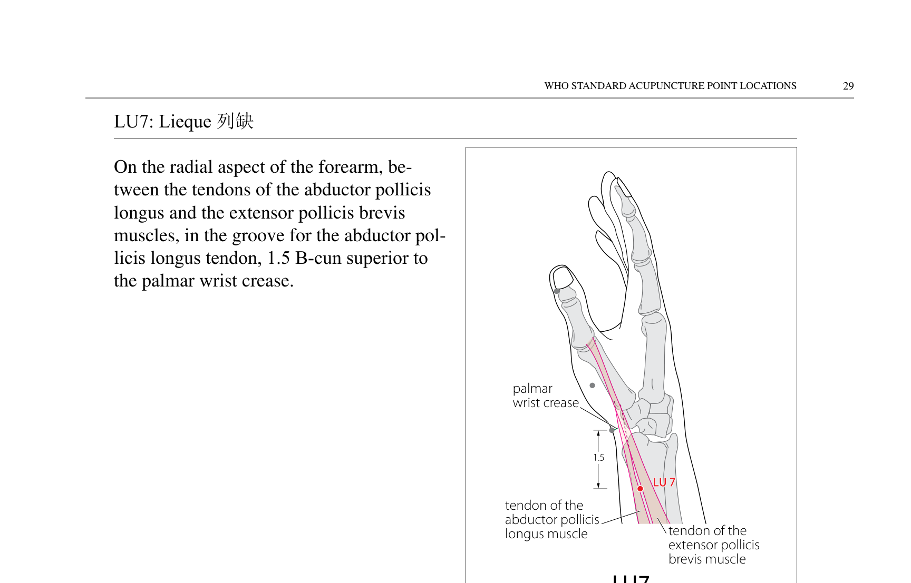

> **External References:** [AcuPoints](https://www.acupoints.org/lu7-acupuncture-point/)

**דיקור**

* **זווית**: אלכסונית (Oblique), 15-30° כלפי מעלה (לכיוון המרפק)
* **עומק**: 0.3-0.5 צון
* **תחושת דה-צ'י**: נימול, חשמל שמתפשט לאצבעות או לזרוע

**פעולות והתוויות**

* **פעולות**: משחרר שטח (释表 Shi Biao) — מגרש רוח וקור; מפתח ומווסת רן מאי; מועיל לראש ולעורף; מפזר צ'י ריאות; מועיל לדרכי השתן
* **כנקודת פיקוד**: "הראש והעורף — ליה צ'יואה גוששת" (头项寻列缺)
* **התוויות**: הצטננות (רוח-קור), כאב ראש, כאב עורף וצוואר, שיעול, אסתמה, כאב גרון, שיתוק פנים (Bell's Palsy), בעיות שתן (דרך רן מאי)
* **שילובים נפוצים**: LU7 + KI6 (פתיחת רן מאי — גרון, חזה, ריאות, שינה); LU7 + LI4 (הצטננות, כאב ראש); LU7 + REN17 + ST40 (ליחה בריאות)

***

#### LU8 — ג'ינג צ'יו (经渠)

**שם סיני**: 经渠 (Jing Qu) **משמעות השם**: "תעלת הערוץ" — נקודה שבה הצ'י זורם כמו מים בתעלה **קטגוריה מיוחדת**: נקודת ג'ינג-נהר (经穴 Jing Xue) — אלמנט מתכת (金 Jin)

**מיקום אנטומי**

1 צון מעל קפל שורש כף היד, בשקע שבצד הרדיאלי של עורק הרדיאלי (Radial Artery), על הצד הפנימי של התהליך הסטילואידי של עצם הרדיוס.

**איך למצוא את הנקודה**

1. אתרו את קפל שורש כף היד
2. גששו את דופק עורק הרדיאלי (Radial Pulse) — הדופק שנמדד לפני מדידת לחץ דם
3. מדדו 1 צון (רוחב אגודל) מעל קפל שורש כף היד
4. הנקודה נמצאת על הצד הרדיאלי (צד האגודל) של עורק הרדיאלי
5. **⚠️** הנקודה ממש ליד העורק — היזהרו לא לדקור את העורק

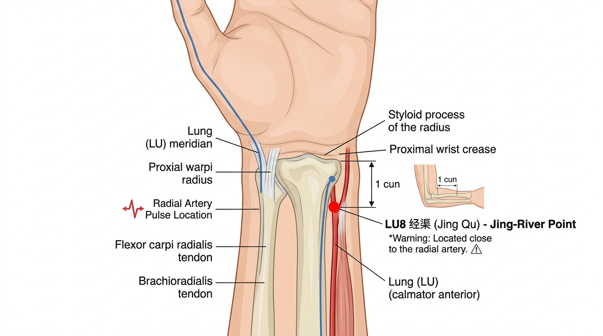

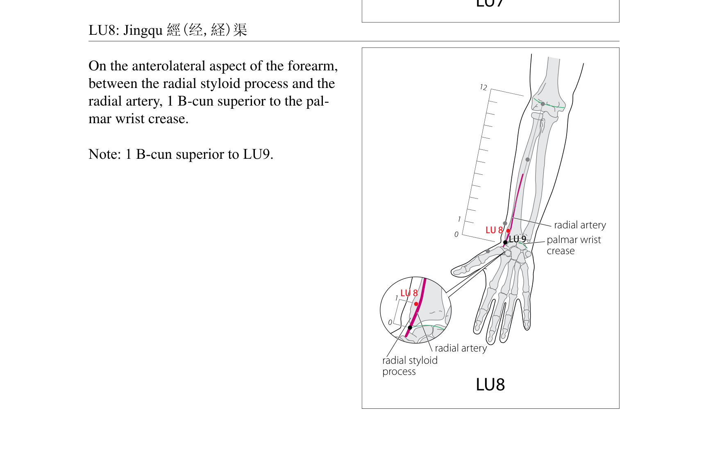

> **External References:** [AcuPoints](https://www.acupoints.org/lu8-acupuncture-point/)

**דיקור**

* **זווית**: ניצבת (Perpendicular), 90°
* **עומק**: 0.2-0.3 צון
* **⚠️ זהירות**: הימנעו מעורק הרדיאלי — דקרו לטרלית לעורק. **אין להשתמש במוקסה**
* **תחושת דה-צ'י**: נימול מקומי, לעתים תחושת חום

**פעולות והתוויות**

* **פעולות**: מפזר צ'י ריאות; מווסת דופק (כנקודת מתכת על ערוץ מתכת); מפנה רוח חיצונית
* **התוויות**: שיעול, אסתמה, כאב בחזה, כאב שורש כף היד, חום ללא הזעה
* **שילובים נפוצים**: LU8 + LU7 (שיעול עם כאב גרון); LU8 + LI4 (חום ללא הזעה)

***

#### LU9 — טאי יואן (太渊)

**שם סיני**: 太渊 (Tai Yuan) **משמעות השם**: "התהום הגדול" — מאגר עמוק של צ'י **קטגוריה מיוחדת**: נקודת יואן-מקור (原穴 Yuan Xue); נקודת שו-זרם (输穴 Shu Xue) — אלמנט אדמה (土 Tu); נקודת מפגש של כלי הדם (八会穴 Ba Hui Xue — 脉会太渊 Mai Hui Tai Yuan)

**מיקום אנטומי**

בקפל שורש כף היד, בצד הרדיאלי של עורק הרדיאלי, בגומה שבין התהליך הסטילואידי של הרדיוס לבין עצם ה-Scaphoid (Navicular).

**איך למצוא את הנקודה**

1. בקשו מהמטופל להניח את כף היד כלפי מעלה (שכיבת גב)
2. אתרו את קפל שורש כף היד
3. גששו את דופק עורק הרדיאלי על קפל שורש כף היד
4. הנקודה נמצאת **לטרלית (צד האגודל)** של העורק, על קפל שורש כף היד
5. גששו את הגומה בין הבליטה העצמית (Styloid) ועצמות שורש כף היד
6. **⚠️** העורק נמצא ממש ליד הנקודה

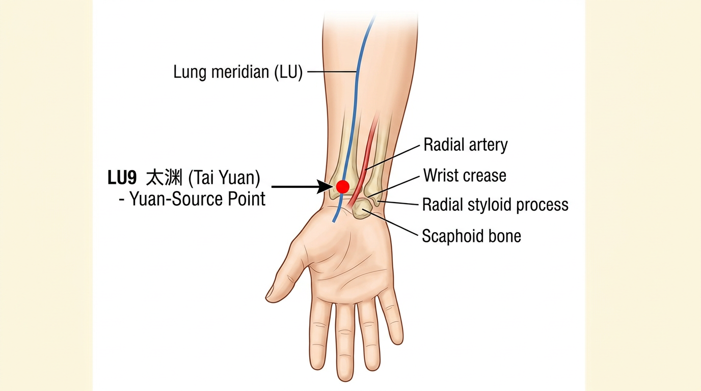

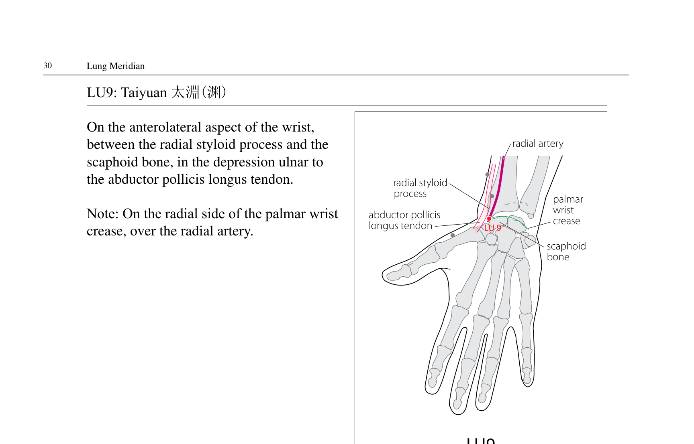

> **External References:** [AcuPoints](https://www.acupoints.org/lu9-acupuncture-point/)

**דיקור**

* **זווית**: ניצבת (Perpendicular), 90°
* **עומק**: 0.2-0.3 צון
* **⚠️ זהירות**: הימנעו מעורק הרדיאלי — דקרו לטרלית לעורק
* **תחושת דה-צ'י**: כאב מקומי חד, נימול באגודל

**פעולות והתוויות**

* **פעולות**: מחזק צ'י ריאות (**נקודת חיזוק מרכזית**); מזין ין ריאות; מווסת כלי דם; מפזר ומוריד צ'י ריאות; הופך ליחה
* **כנקודת יואן**: מחברת לצ'י המקורי (原气) של הריאות — נקודה מרכזית לכל בעיה כרונית של הריאות
* **כנקודת מפגש כלי הדם**: משמשת לכל בעיה של כלי דם ודופק
* **התוויות**: שיעול כרוני, חולשת ריאות, אסתמה כרונית, אובדן קול, כאב שורש כף היד, חולשת דופק, בעיות זרימת דם
* **שילובים נפוצים**: LU9 + BL13 + BL43 (חיזוק צ'י ריאות); LU9 + SP3 + ST36 (חיזוק צ'י ריאות-טחול — "אדמה מולידה מתכת"); LU9 + REN6 (חיזוק צ'י כללי)

***

#### LU10 — יו ג'י (鱼际)

**שם סיני**: 鱼际 (Yu Ji) **משמעות השם**: "גבול הדג" — האזור הבשרני של כף היד ליד האגודל דומה לצורת דג **קטגוריה מיוחדת**: נקודת יינג-מעיין (荥穴 Ying Xue) — אלמנט אש (火 Huo)

**מיקום אנטומי**

באמצע עצם המטקרפל הראשונה (First Metacarpal), על הגבול בין העור הבהיר (כף) לעור הכהה (גב), באזור ה-Thenar Eminence.

**איך למצוא את הנקודה**

1. בקשו מהמטופל לפתוח את כף היד כלפי מעלה
2. זהו את "גבעת הדג" (Thenar Eminence) — האזור הבשרני-השרירי בבסיס האגודל
3. מצאו את אמצע עצם המטקרפל הראשונה (העצם שמחברת שורש כף היד לאגודל)
4. הנקודה נמצאת על הגבול בין העור הבהיר של כף היד לעור הכהה של גב היד
5. לחצו — אמורה להיות רגישות ברורה בתוך השריר

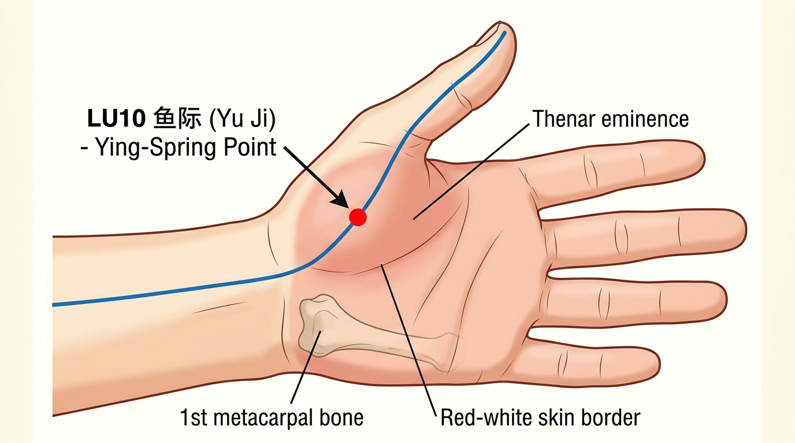

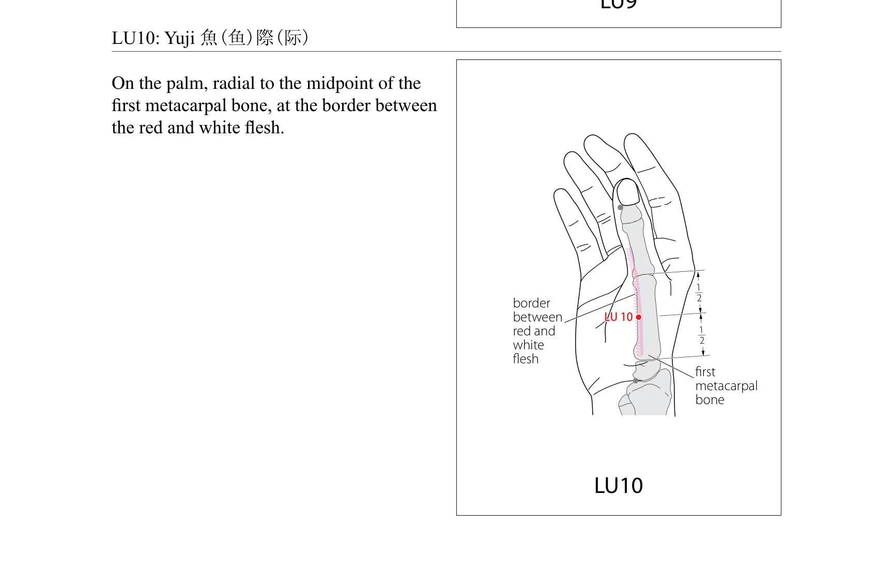

> **External References:** [AcuPoints](https://www.acupoints.org/lu10-acupuncture-point/)

**דיקור**

* **זווית**: ניצבת (Perpendicular), 90°
* **עומק**: 0.5-0.8 צון
* **תחושת דה-צ'י**: כאב מקומי חד, נימול שמתפשט לאגודל

**פעולות והתוויות**

* **פעולות**: מפנה חום מהריאות (**נקודת אש על ערוץ מתכת** — מצוינת לפינוי חום); מועיל לגרון; מרטיב את הריאות
* **התוויות**: כאב גרון חריף, שקדים נפוחים (טונסיליטיס), אובדן קול, שיעול עם דם, חום, כאב באגודל
* **שילובים נפוצים**: LU10 + LI4 (כאב גרון חריף); LU10 + LU11 (שקדים נפוחים — להוציא דם מ-LU11); LU10 + KI6 (גרון יבש מחסר ין)

***

#### LU11 — שאו שאנג (少商)

**שם סיני**: 少商 (Shao Shang) **משמעות השם**: "מסחר קטן" — שאנג הוא הצליל של אלמנט המתכת; שאו = קטן — הנקודה הקטנה שבקצה **קטגוריה מיוחדת**: נקודת ג'ינג-באר (井穴 Jing Xue) — אלמנט עץ (木 Mu)

**מיקום אנטומי**

בצד הרדיאלי (חיצוני) של האגודל, כ-0.1 צון מפינת בסיס הציפורן.

**איך למצוא את הנקודה**

1. התבוננו באגודל של המטופל
2. אתרו את ציפורן האגודל
3. הנקודה נמצאת בפינה של בסיס הציפורן — בצד הרדיאלי (הצד שפונה לאצבע המורה)
4. מדדו כ-0.1 צון (כ-2 מ"מ) מפינת הציפורן, באלכסון
5. הנקודה קטנה מאוד ורגישה ביותר

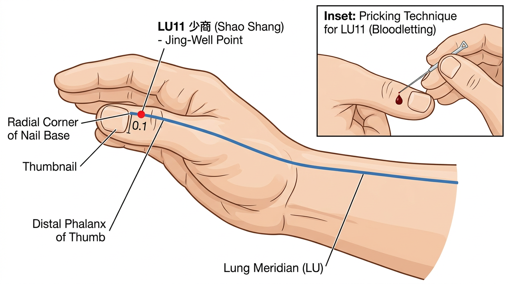

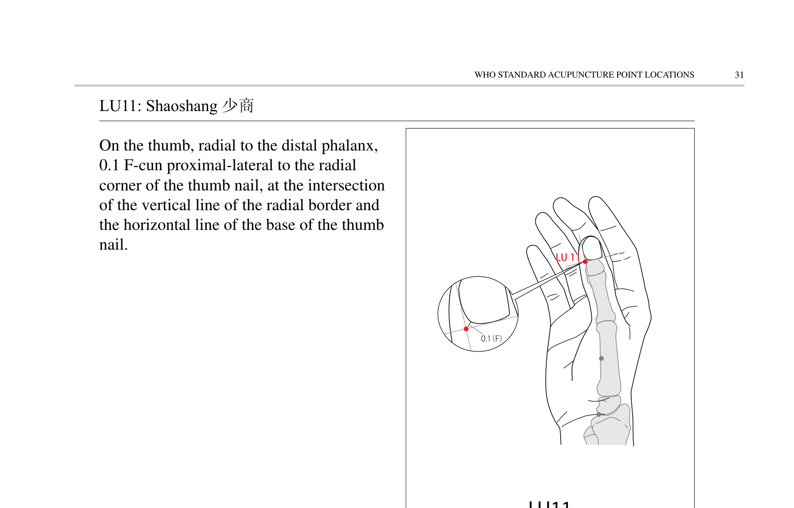

> **External References:** [AcuPoints](https://www.acupoints.org/lu11-acupuncture-point/)

**דיקור**

* **שיטה**: בעיקר הוצאת דם (放血 Fang Xue) — דקירה מהירה עם מחט משולשת (三棱针) או מחט לנסט
* **עומק**: 0.1 צון, או דקירה שטחית להוצאת טיפות דם
* **⚠️ שיטה**: דקירה מהירה — לא משאירים מחט
* **תחושת דה-צ'י**: כאב חד מקומי

**פעולות והתוויות**

* **פעולות**: מפנה חום; מועיל לגרון (**נקודת חירום לגרון**); משחרר שטח; מחייה מאבדן הכרה; מפזר רוח
* **כנקודת ג'ינג-באר**: נקודה שבה הצ'י "נובע" — משמשת למצבי חירום ולמצבים חריפים
* **התוויות**: כאב גרון חריף, שקדים נפוחים (חירום), חום גבוה, אובדן הכרה, שבץ (עזרה ראשונה), דימום מהאף, כאב באגודל
* **שילובים נפוצים**: LU11 + LI1 (הוצאת דם — חום גבוה, כאב גרון); LU11 + LI4 + ST44 (חום גבוה עם כאב גרון); LU11 + DU26 (אובדן הכרה — עזרה ראשונה)

***

### 3. סיכום קטגוריות הנקודות

| קטגוריה                  | נקודה | סינית | שימוש עיקרי                   |
| ------------------------ | ----- | ----- | ----------------------------- |
| מו קדמית (Front Mu)      | LU1   | 中府    | אבחון וטיפול בריאות           |
| הה-ים (He-Sea)           | LU5   | 尺泽    | מצבים כרוניים, חום בריאות     |
| שי-צלע (Xi-Cleft)        | LU6   | 孔最    | מצבי חירום, כאב חריף, דימום   |
| לואו (Luo-Connecting)    | LU7   | 列缺    | חיבור ל-LI, ראש ועורף, רן מאי |
| ג'ינג-נהר (Jing-River)   | LU8   | 经渠    | שיעול, חום                    |
| יואן-מקור (Yuan-Source)  | LU9   | 太渊    | חיזוק ריאות, מצבים כרוניים    |
| יינג-מעיין (Ying-Spring) | LU10  | 鱼际    | פינוי חום, כאב גרון           |
| ג'ינג-באר (Jing-Well)    | LU11  | 少商    | חירום, חום גבוה, אובדן הכרה   |
| שו-זרם (Shu-Stream)      | LU9   | 太渊    | כאבי מפרקים, רטיבות           |

***

### 4. חמש נקודות שו (五输穴 Wu Shu Xue) של ערוץ הריאות

| סוג                        | נקודה | אלמנט    | כיוון הזרימה |
| -------------------------- | ----- | -------- | ------------ |
| ג'ינג-באר (井 Jing-Well)    | LU11  | עץ (木)   | הצ'י "נובע"  |
| יינג-מעיין (荥 Ying-Spring) | LU10  | אש (火)   | הצ'י "זורם"  |
| שו-זרם (输 Shu-Stream)      | LU9   | אדמה (土) | הצ'י "מתחזק" |
| ג'ינג-נהר (经 Jing-River)   | LU8   | מתכת (金) | הצ'י "גדל"   |
| הה-ים (合 He-Sea)           | LU5   | מים (水)  | הצ'י "מתאסף" |

***

### 5. תרגילים

#### תרגיל 1: מיקום נקודות

על זרוע של שותף/ה, אתרו את הנקודות הבאות ותארו את המבנים האנטומיים שמסביב: א. LU5\
ב. LU7\
ג. LU9\
ד. LU11

#### תרגיל 2: בחירת נקודות

מטופל מגיע עם שיעול יבש כרוני, גרון יבש, ושיעול שמחמיר בלילה. הלשון אדומה ויבשה. א. מהי האבחנה? ב. אילו נקודות מערוץ הריאות תבחרו? ג. אילו נקודות מערוצים אחרים תוסיפו?

#### תרגיל 3: מקרה חירום

מטופלת מגיעה עם כאב גרון חריף, שקדים נפוחות ואדומות, חום גבוה. א. אילו נקודות מערוץ הריאות מתאימות למצב חריף? ב. מה הטכניקה המיוחדת שתשתמשו בה ב-LU11?

***

### קריאה מומלצת

* Deadman, P. _A Manual of Acupuncture_ — ערוץ הריאות
* Maciocia, G. _The Foundations of Chinese Medicine_ — פרק על הריאות
* הואנג די ניי ג'ינג, לינג שו, פרק 10
* O'Connor, J. & Bensky, D. _Acupuncture: A Comprehensive Text_

***

> **נקודה למחשבה**: ערוץ הריאות הוא הערוץ הראשון במחזור הצ'י ומסמל את תחילת החיים (הנשימה הראשונה). למרות שיש בו רק 11 נקודות, הוא כולל נקודות בעלות חשיבות קלינית עצומה — במיוחד LU7 (אחת מ-4 נקודות הפיקוד) ו-LU9 (נקודת מפגש כלי הדם). הכרת ערוץ זה היא הבסיס ללימוד שאר הערוצים.

***

### ניווט

* **הקודם**: [סקירת מערכת המרידיאנים](01-meridian-system.md) | **הבא**: [ערוץ המעי הגס (LI)](03-large-intestine.md)
* **זוג פנים-חוץ**: [ערוץ המעי הגס (LI)](03-large-intestine.md) — ערוץ היאנג הזוגי (אלמנט מתכת)
* **חזרה למודול**: [מודול 2 — מרידיאנים](./)
* **ראה גם**: [סינדרומי ריאות](../../year-2-intermediate/module-06b-syndromes/lung-syndromes/01-lung-qi-deficiency.md) — חוסר צ'י ריאות | [רוח-קור בריאות](../../year-2-intermediate/module-06b-syndromes/lung-syndromes/03-wind-cold-lung.md) — פלישת רוח-קור | [חמש נקודות שו](../../year-2-intermediate/module-08-point-categories/01-five-shu-points.md) — סיווג LU5, LU8, LU9, LU10, LU11
