# 04-stomach-channel

## ערוץ הקיבה - צו יאנג מינג וי (足阳明胃经)

### Foot Yang Ming Stomach Channel (Zu Yang Ming Wei Jing)

***

### מטרות למידה

בסיום שיעור זה, הסטודנט יוכל:

1. לתאר את מסלול ערוץ הקיבה — חיצוני ופנימי
2. לאתר את כל 45 הנקודות (ST1-ST45) על הגוף
3. לתאר את פעולות כל נקודה ואת התוויותיה
4. לבצע דיקור בטוח בכל נקודות הערוץ
5. להסביר את הקשר פנים-חוץ בין קיבה (ST) לטחול (SP)
6. לזהות פתולוגיות נפוצות של ערוץ הקיבה

***

### 1. סקירת הערוץ

#### 1.1 מידע כללי

| מאפיין       | פרטים                                   |
| ------------ | --------------------------------------- |
| שם סיני      | 足阳明胃经 (Zu Yang Ming Wei Jing)           |
| סוג          | יאנג — יאנג מינג (Yang Ming)            |
| גפה          | רגל (Foot)                              |
| איבר         | קיבה (胃 Wei)                            |
| זוג פנים-חוץ | טחול (SP) — טאי ין                      |
| מספר נקודות  | 45 (ST1-ST45) — הערוץ הארוך ביותר       |
| שעת שיא      | 07:00-09:00                             |
| כיוון זרימה  | מהפנים (מתחת לעין) אל האצבע השנייה ברגל |
| אלמנט        | אדמה (土 Tu)                             |

#### 1.2 מסלול הערוץ

**מסלול חיצוני (外行 Wai Xing)**

1. **מתחיל** בצד האף — מקבל מ-LI20, עולה לגשר האף ופוגש BL1
2. **יורד** לאורך צד האף ונכנס לחניכיים העליונות
3. **יוצא** ומקיף את השפתיים, חוצה את REN24 בסנטר
4. **עולה** לאורך הלחי (Mandible) אל ST5-ST7 (לחי, אוזן)
5. **ענף עולה** מ-ST5 אל הרקה ואל קו השיער הקדמי (ST8)
6. **ענף יורד** מהלחי אל הצוואר (ST9)
7. **יורד** דרך הבריח (ST12) אל החזה, 4 צון מקו האמצע
8. **יורד** דרך הבטן, 2 צון מקו האמצע
9. **ממשיך** דרך ירך קדמית אל הברך
10. **יורד** לאורך הצד הלטרלי של עצם השוקה (Tibia)
11. **מסתיים** בפינה הלטרלית של ציפורן האצבע השנייה ברגל (ST45)

**מסלול פנימי (内行 Nei Xing)**

1. מ-ST12, ענף פנימי יורד, חודר את הסרעפת
2. מתחבר לקיבה (האיבר העיקרי)
3. מתחבר לטחול (האיבר המזווג)

**ענפים**

* ענף מ-ST36 יורד לצד הלטרלי של האצבע האמצעית ברגל
* ענף מגב הרגל (ST42) לאצבע הגדולה — מתחבר לערוץ הטחול (SP1)

#### 1.3 תפקודי איבר הקיבה (胃 Wei)

* **שולטת בקבלה ובהבשלה של מזון** (受纳腐熟) — "ים של מזון ושתייה" (水谷之海)
* **שולטת בהורדה** (降浊) — מורידה מזון מעובד למעי הדק
* **מקור של צ'י ודם** — יחד עם הטחול, הקיבה היא "השורש של שמיים מאוחרים" (后天之本)
* **מעדיפה לחות** — הקיבה אוהבת לחות ולא אוהבת יובש (בניגוד לטחול)
* **צ'י הקיבה צריך לרדת** — כאשר צ'י הקיבה עולה במקום לרדת: בחילה, הקאות, שיהוקים

#### 1.4 פתולוגיות נפוצות של הערוץ

* כאבי קיבה, בחילה, הקאות, שיהוקים
* חום גבוה, צמא עז
* כאב שיניים (חניכיים עליונות), דימום חניכיים
* כאב פנים, שיתוק פנים
* כאב ברך, כאב ברגל קדמית
* בעיות עיכול: תיאבון מוגזם או חוסר תיאבון
* מצבים פסיכיאטריים: מאניה, חרדה (יאנג מינג = הרבה צ'י ודם)

***

### 2. נקודות הערוץ — אזור הפנים (ST1-ST8)

***

> **WHO Standard Acupuncture Point Locations** (WHO, CC BY-NC-SA 3.0 IGO):
>
> 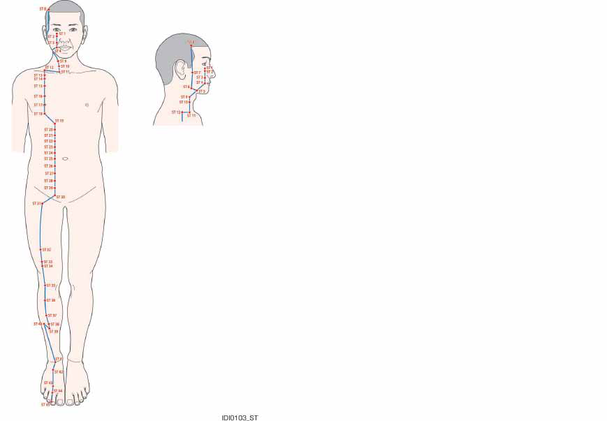

#### ST1 — צ'נג צ'י (承泣)

**שם סיני**: 承泣 (Cheng Qi) **משמעות השם**: "מקבל דמעות" — הנקודה מתחת לעין, מקום שבו דמעות נאספות **קטגוריה מיוחדת**: נקודת מפגש עם יאנג צ'יאו מאי (阳跷脉) ורן מאי (任脉)

**מיקום אנטומי**

ישירות מתחת לאישון (Pupil), בין גלגל העין לגבול התחתון של ארובת העין (Infraorbital Ridge), על הגבול התחתון של ה-Orbicularis Oculi.

**איך למצוא את הנקודה**

1. בקשו מהמטופל להביט ישר קדימה
2. אתרו את האישון (Pupil)
3. גששו את הגבול התחתון של ארובת העין (הקצה העצמי) — ישירות מתחת לאישון
4. הנקודה על הגבול העצמי, בין העצם לגלגל העין

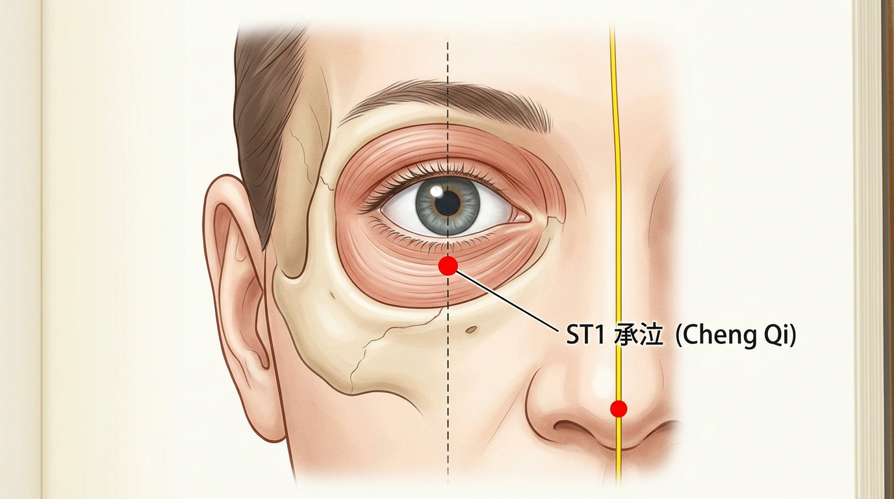

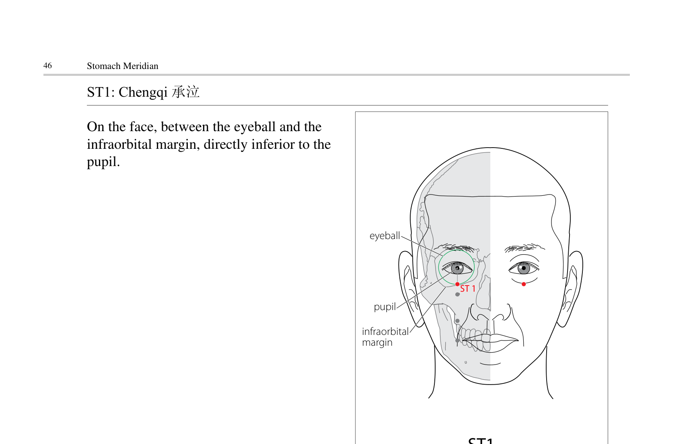

> **External References:** [AcuPoints](https://www.acupoints.org/st1-acupuncture-point/)

**דיקור**

* **זווית**: ניצבת, 90° לאורך דופן ארובת העין, דחפו את גלגל העין מעט כלפי מעלה
* **עומק**: 0.3-0.7 צון — לאט ובזהירות
* **⚠️ זהירות גבוהה**: אין לדקור עמוק — סכנת פגיעה בעין. אין לסובב את המחט. לחצו לאחר השליפה למניעת המטומה
* **תחושת דה-צ'י**: כבדות, דמעות, תחושת לחץ מאחורי העין

**פעולות והתוויות**

* **פעולות**: מועיל לעיניים (**נקודת מפתח לעיניים**); מפזר רוח; עוצר דמעות
* **התוויות**: כל בעיות העיניים — אדמומיות, כאב, דמעות, ראייה מטושטשת, קוצר ראייה, גלאוקומה, שיתוק פנים (קושי לעצום עין)
* **שילובים נפוצים**: ST1 + GB20 + LR3 (בעיות עיניים); ST1 + BL1 + GB37 (ירידה בראייה)

***

#### ST2 — סי באי (四白)

**שם סיני**: 四白 (Si Bai) **משמעות השם**: "ארבעה לבנים" — מהנקודה ניתן לראות לבן לארבע כיוונים (שדה ראייה)

**מיקום אנטומי**

ישירות מתחת לאישון, בגומה של ה-Infraorbital Foramen, כ-1 צון מתחת ל-ST1.

**איך למצוא את הנקודה**

1. בקשו מהמטופל להביט ישר קדימה
2. מתחת לאישון, גששו את הגבול התחתון של ארובת העין
3. ירדו כ-1 צון — גששו את הגומה (Infraorbital Foramen)
4. לחצו — תחושת כאב/חשמל שמקרין ללחי ולשפה העליונה

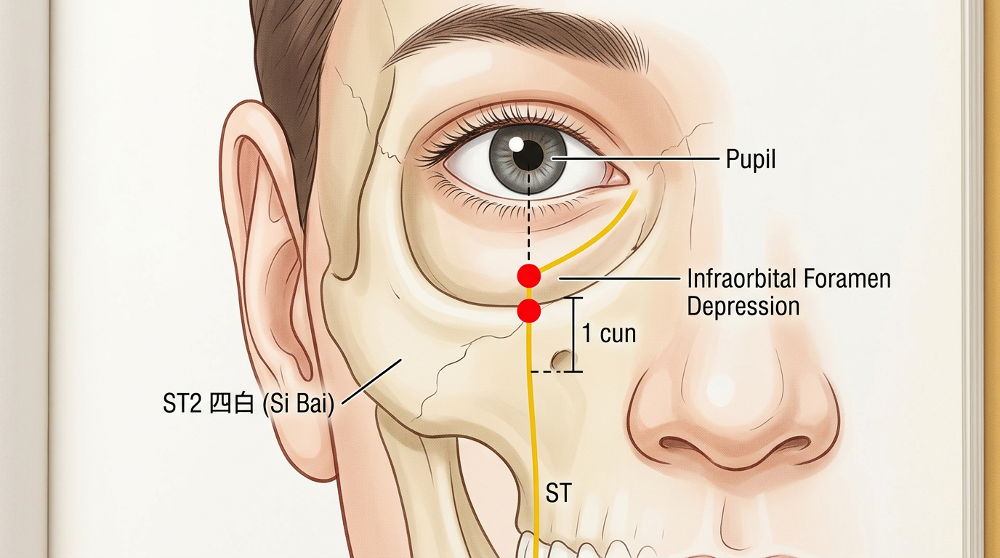

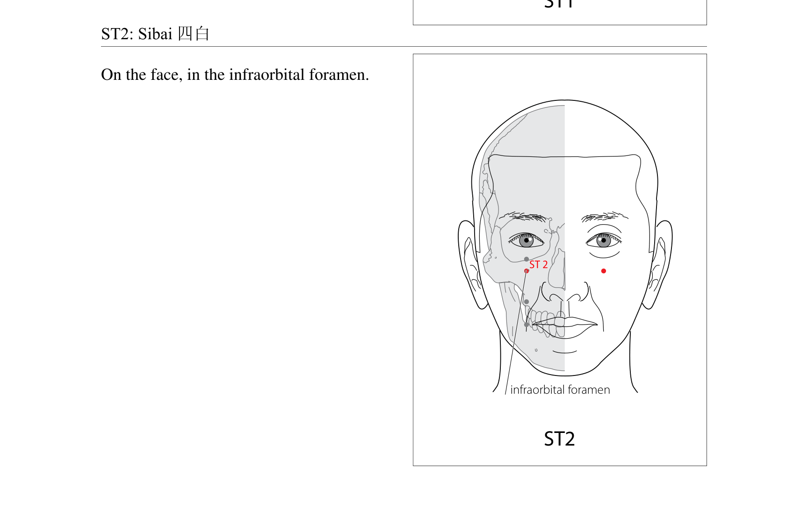

> **External References:** [AcuPoints](https://www.acupoints.org/st2-acupuncture-point/)

**דיקור**

* **זווית**: ניצבת, 90° (דקרו ישירות לתוך ה-Foramen)
* **עומק**: 0.2-0.4 צון
* **⚠️ זהירות**: אין לדקור עמוק — עצב ה-Infraorbital נמצא בתעלה
* **תחושת דה-צ'י**: חשמל/נימול שמקרין ללחי ולשפה

**פעולות והתוויות**

* **פעולות**: מועיל לעיניים; מפזר רוח; מרגיע כאב פנים
* **התוויות**: כאב פנים, טיק בעפעף, אדמומיות בעיניים, ראייה מטושטשת, כאב שיניים, שיתוק פנים, סינוסיטיס
* **שילובים נפוצים**: ST2 + LI20 + Yintang (סינוסיטיס); ST2 + ST6 + ST7 (שיתוק פנים)

***

#### ST3 — ג'ו ליאו (巨髎)

**שם סיני**: 巨髎 (Ju Liao) **משמעות השם**: "שקע גדול" — הגומה מתחת לעצם הלחי

**מיקום אנטומי**

ישירות מתחת לאישון, ברמת הגבול התחתון של כנף האף (Ala Nasi), לטרלית לקפל הנזולביאלי.

**איך למצוא את הנקודה**

1. ישירות מתחת לאישון (כמו ST1, ST2 — אותו קו אנכי)
2. ברמת הגבול התחתון של הנחיר
3. בנקודת החיתוך של קו אנכי מהאישון עם קו אופקי מתחתית הנחיר

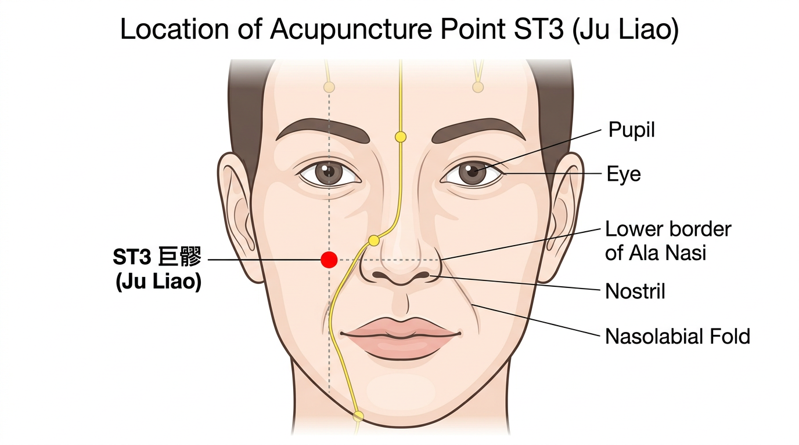

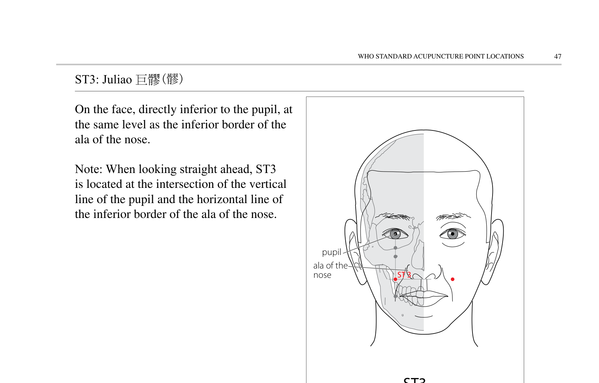

> **External References:** [AcuPoints](https://www.acupoints.org/st3-acupuncture-point/)

**דיקור**

* **זווית**: ניצבת או אלכסונית, 90-45°
* **עומק**: 0.3-0.5 צון
* **תחושת דה-צ'י**: נימול, כבדות

**פעולות והתוויות**

* **פעולות**: מפזר רוח; מפיג נפיחות; מרגיע כאב פנים
* **התוויות**: כאב פנים (נוירלגיה של הטריגמינוס), שיתוק פנים, נפיחות בשפתיים, כאב שיניים, דימום מהאף
* **שילובים נפוצים**: ST3 + ST6 + LI4 (כאב פנים, שיתוק)

***

#### ST4 — די צאנג (地仓)

**שם סיני**: 地仓 (Di Cang) **משמעות השם**: "מחסן הארץ" — ליד הפה, "מחסן" המזון; אדמה = קיבה/טחול

**מיקום אנטומי**

0.4 צון לטרלית לזווית הפה (Angle of the Mouth), ישירות מתחת לאישון.

**איך למצוא את הנקודה**

1. בקשו מהמטופל להביט ישר קדימה
2. אתרו את זווית (פינת) הפה
3. מדדו 0.4 צון (כחצי ס"מ) הצידה מזווית הפה
4. הנקודה על קו אנכי ישירות מתחת לאישון

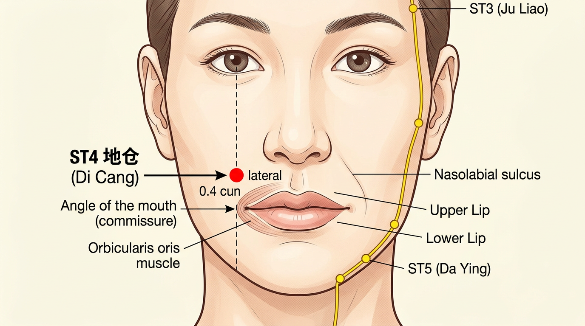

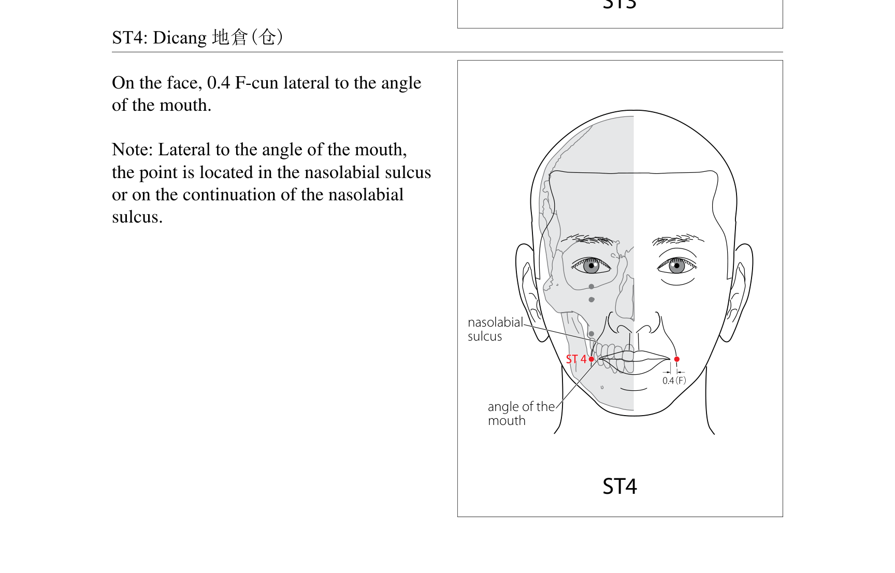

> **External References:** [AcuPoints](https://www.acupoints.org/st4-acupuncture-point/)

**דיקור**

* **זווית**: אלכסונית או מישורית לכיוון ST6
* **עומק**: 0.3-0.5 צון
* **תחושת דה-צ'י**: נימול מקומי, תחושה בשפתיים

**פעולות והתוויות**

* **פעולות**: מפזר רוח; מועיל לפנים ולפה; עוצר ריור
* **התוויות**: שיתוק פנים (**נקודה חשובה**), סטיית פה, ריור (Drooling), טיק בפנים, כאב פנים
* **שילובים נפוצים**: ST4 + ST6 + LI4 + GB14 (שיתוק פנים — פרוטוקול קלאסי)

***

#### ST5 — דה יינג (大迎)

**שם סיני**: 大迎 (Da Ying) **משמעות השם**: "קבלת פנים גדולה" — נקודה על עצם הלחי שבה "מקבלים" את הערוץ

**מיקום אנטומי**

קדמית לזווית המנדיבולה (Angle of Mandible), בגומה שנוצרת קדמית לשריר ה-Masseter, על עורק הפנים (Facial Artery).

**איך למצוא את הנקודה**

1. גששו את זווית הלחי (הפינה האחורית-תחתונה של עצם המנדיבולה)
2. הזיזו את האצבע כ-1.3 צון קדימה לאורך הגבול התחתון של המנדיבולה
3. גששו את הגומה שנוצרת קדמית ל-Masseter — תרגישו דופק (עורק הפנים)

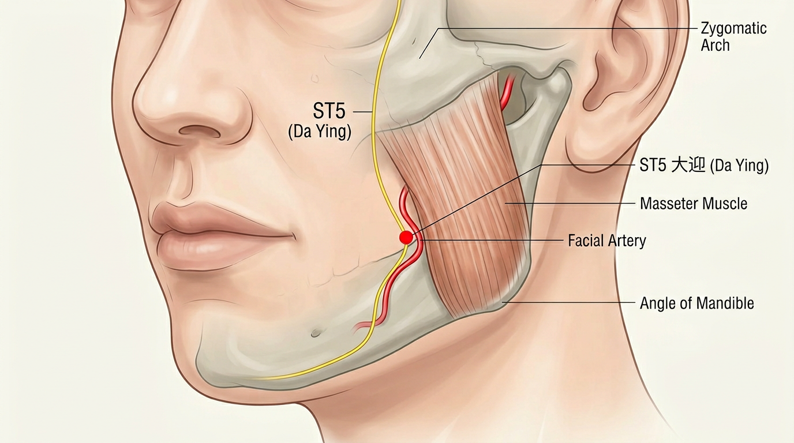

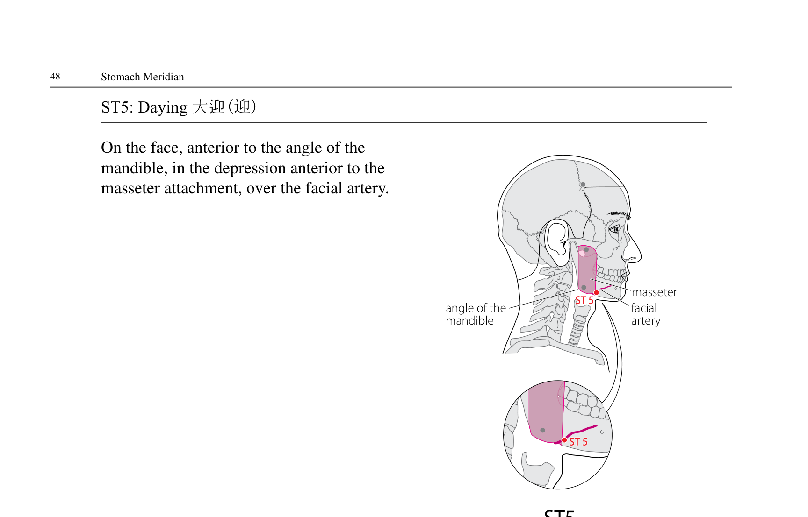

> **External References:** [AcuPoints](https://www.acupoints.org/st5-acupuncture-point/)

**דיקור**

* **זווית**: ניצבת, 90°
* **עומק**: 0.3-0.5 צון — הימנעו מהעורק
* **תחושת דה-צ'י**: נימול, כבדות

**פעולות והתוויות**

* **פעולות**: מפזר רוח; מפיג נפיחות; מרגיע כאב
* **התוויות**: כאב שיניים, נפיחות בלחי, שיתוק פנים, טריזמוס (נעילת לסת)
* **שילובים נפוצים**: ST5 + ST6 + ST7 (כאב לסת ושיניים)

***

#### ST6 — ג'יה צ'ה (颊车)

**שם סיני**: 颊车 (Jia Che) **משמעות השם**: "גלגל הלחי" — הנקודה על שריר הלעיסה, "גלגל" הלחי

**מיקום אנטומי**

רוחב אצבע אחד (1 צון) קדמית ומעל לזווית המנדיבולה, בבליטת שריר ה-Masseter שנוצרת כשמהדקים את השיניים.

**איך למצוא את הנקודה**

1. בקשו מהמטופל להדק שיניים — שריר ה-Masseter יבלוט
2. גששו את הבליטה — זו הנקודה
3. כשהשיניים רפויות, נוצרת גומה קלה באותו מקום
4. רוחב אצבע אחד קדמי ומעל לזווית הלחי

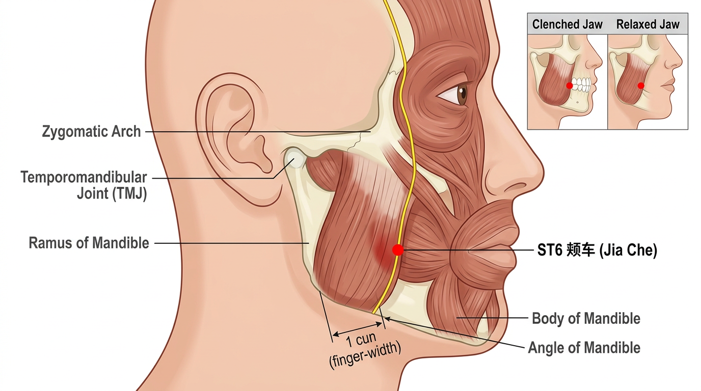

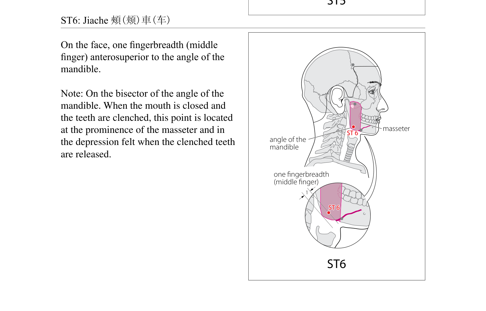

> **External References:** [AcuPoints](https://www.acupoints.org/st6-acupuncture-point/)

**דיקור**

* **זווית**: ניצבת, 90° או מישורית לכיוון ST4
* **עומק**: 0.3-0.5 צון
* **תחושת דה-צ'י**: כבדות בלחי, תחושה שמתפשטת לשיניים

**פעולות והתוויות**

* **פעולות**: מפזר רוח; מועיל ללחי ולשיניים; מרפה לסת
* **התוויות**: כאב שיניים (**נקודה מרכזית**), נעילת לסת (TMJ), שיתוק פנים, נפיחות בלחי, חריקת שיניים (Bruxism)
* **שילובים נפוצים**: ST6 + ST7 + LI4 (כאב שיניים); ST6 + ST4 (שיתוק פנים — דיקור מישורי מ-ST6 ל-ST4)

***

#### ST7 — שיה גואן (下关)

**שם סיני**: 下关 (Xia Guan) **משמעות השם**: "מפרק תחתון" — מתחת ל-Zygomatic Arch, ליד מפרק הלסת (TMJ) **קטגוריה מיוחדת**: נקודת מפגש עם ערוץ כיס המרה (GB)

**מיקום אנטומי**

בגומה שנוצרת בין ה-Zygomatic Arch (קשת הלחי) לבין ה-Mandibular Notch, קדמית ל-Condyloid Process של המנדיבולה. הגומה נעלמת כשהפה פתוח.

**איך למצוא את הנקודה**

1. אתרו את ה-Zygomatic Arch — הקשת העצמית שמהאוזן ללחי
2. גששו את הגומה שמתחת לקשת, קדמית לאוזן
3. בקשו מהמטופל לפתוח את הפה — הגומה נעלמת (ה-Condyle עולה)
4. בקשו מהמטופל לסגור — הגומה חוזרת

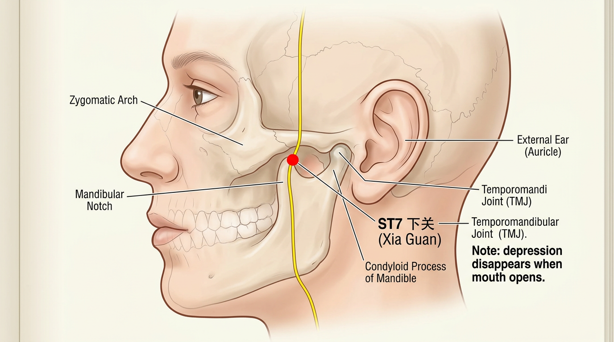

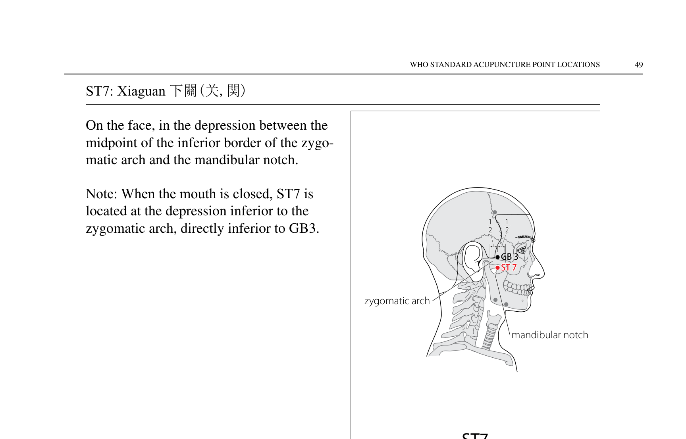

> **External References:** [AcuPoints](https://www.acupoints.org/st7-acupuncture-point/)

**דיקור**

* **זווית**: ניצבת, 90° (כשהפה סגור)
* **עומק**: 0.3-0.5 צון
* **תחושת דה-צ'י**: כבדות עמוקה, תחושה באוזן או בשיניים

**פעולות והתוויות**

* **פעולות**: מועיל לאוזן וללסת; מפזר רוח; מרגיע כאב
* **התוויות**: כאב מפרק הלסת (TMJ), נעילת לסת, כאב שיניים, טינטון, חירשות, כאב אוזניים
* **שילובים נפוצים**: ST7 + SI19 + TE21 (טינטון, חירשות); ST7 + ST6 (כאב TMJ)

***

#### ST8 — טאו ווי (头维)

**שם סיני**: 头维 (Tou Wei) **משמעות השם**: "פינת הראש" — בפינה הקדמית-צידית של קו השיער **קטגוריה מיוחדת**: נקודת מפגש עם ערוץ כיס המרה (GB) ויאנג ווי מאי (阳维脉)

**מיקום אנטומי**

0.5 צון מעל קו השיער הקדמי, 4.5 צון לטרלית לקו האמצע, בפינת קו השיער (Hairline Corner).

**איך למצוא את הנקודה**

1. אתרו את פינת קו השיער הקדמי — המקום שבו קו השיער מתעקל הצידה
2. מדדו 0.5 צון מעל קו השיער באותה פינה
3. הנקודה 4.5 צון לטרלית לקו האמצע של הראש

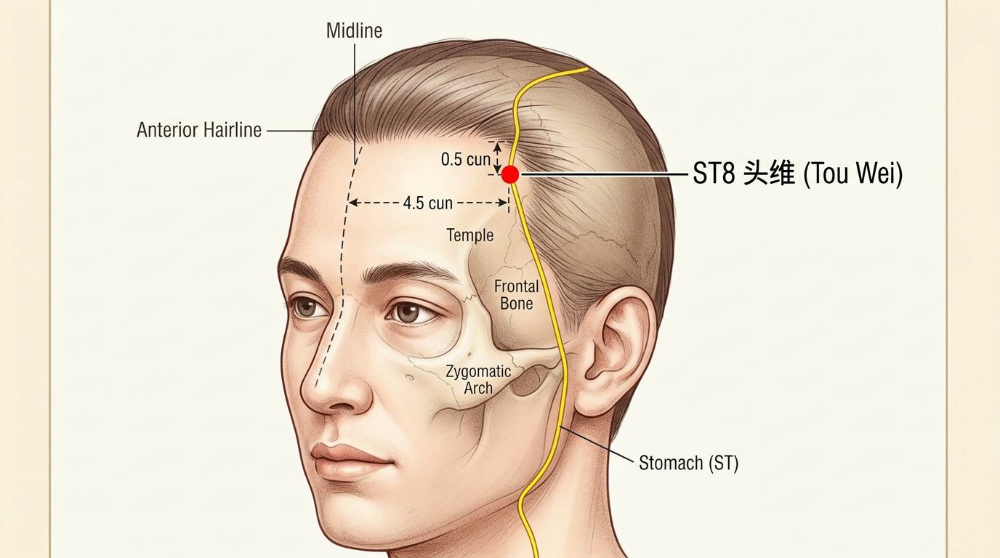

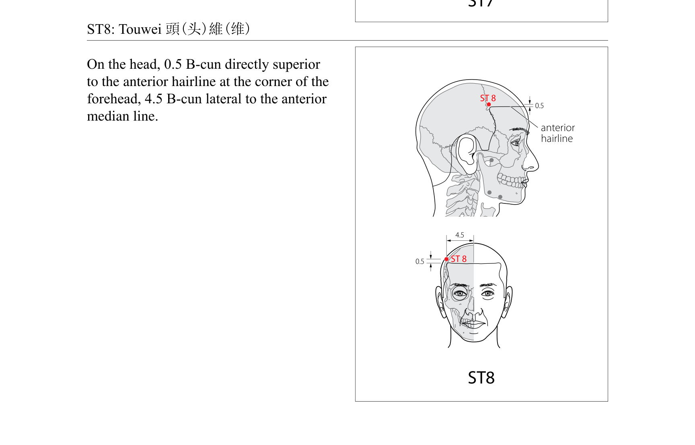

> **External References:** [AcuPoints](https://www.acupoints.org/st8-acupuncture-point/)

**דיקור**

* **זווית**: מישורית (Subcutaneous), 15-30° לכיוון אחורי
* **עומק**: 0.3-0.5 צון מישורית
* **תחושת דה-צ'י**: כבדות, נימול מקומי

**פעולות והתוויות**

* **פעולות**: מפזר רוח; מרגיע כאב ראש; מועיל לעיניים
* **התוויות**: כאב ראש (במיוחד קדמי וצידי), סחרחורת, כאב עיניים, דמעות, ראייה מטושטשת
* **שילובים נפוצים**: ST8 + GB20 + Taiyang (כאב ראש); ST8 + GB14 (כאב ראש קדמי)

***

### 3. נקודות הצוואר (ST9-ST12)

***

#### ST9 — רן יינג (人迎)

**שם סיני**: 人迎 (Ren Ying) **משמעות השם**: "קבלת אדם" — נקודה שבה ניתן לגשש את דופק ה"קבלה" **קטגוריה מיוחדת**: נקודה על עורק הקרוטיד; נקודת חלון השמיים (天窗穴)

**מיקום אנטומי**

1.5 צון לטרלית לתפוח האדם (Adam's Apple), על הגבול הקדמי של שריר ה-SCM, ברמת ה-Thyroid Cartilage, על עורק הקרוטיד.

**איך למצוא את הנקודה**

1. אתרו את תפוח האדם
2. מדדו 1.5 צון הצידה
3. גששו את דופק עורק הקרוטיד — הנקודה על העורק
4. הנקודה על הגבול הקדמי של ה-SCM

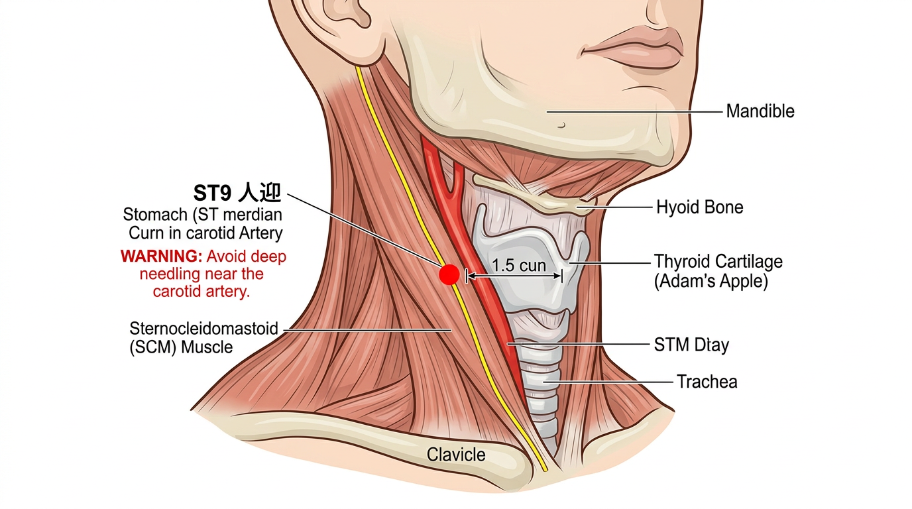

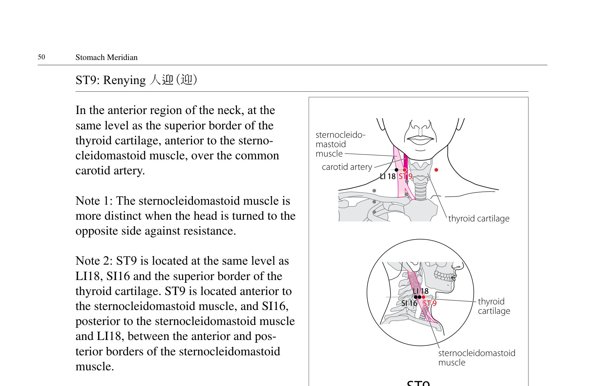

> **External References:** [AcuPoints](https://www.acupoints.org/st9-acupuncture-point/)

**דיקור**

* **זווית**: ניצבת, 90°
* **עומק**: 0.3-0.5 צון
* **⚠️ זהירות גבוהה**: הימנעו מעורק הקרוטיד — גששו דופק, דקרו לטרלית לעורק. אין לדקור בשני הצדדים בו-זמנית
* **תחושת דה-צ'י**: כבדות, תחושת לחץ

**פעולות והתוויות**

* **פעולות**: מווסת צ'י ודם; מוריד לחץ דם; מועיל לגרון; מפזר ליחה
* **התוויות**: יתר לחץ דם (**נקודה חשובה**), גויטר, כאב גרון, אסתמה, סחרחורת
* **שילובים נפוצים**: ST9 + LI11 + LR3 (יתר לחץ דם); ST9 + LI18 (גויטר)

***

#### ST10 — שואי טו (水突)

**שם סיני**: 水突 (Shui Tu) **משמעות השם**: "בליטת המים" — ליד תפוח האדם שבולט כ"מים" (רוק) כשבולעים

**מיקום אנטומי**

על הגבול הקדמי של ה-SCM, באמצע הקו בין ST9 ל-ST11.

**איך למצוא את הנקודה**

1. אתרו את ST9 (ברמת תפוח האדם) ואת ST11 (מעל הבריח)
2. הנקודה באמצע ביניהם, על הגבול הקדמי של ה-SCM

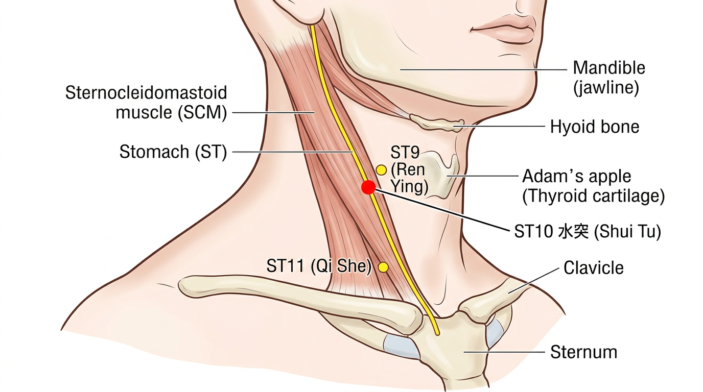

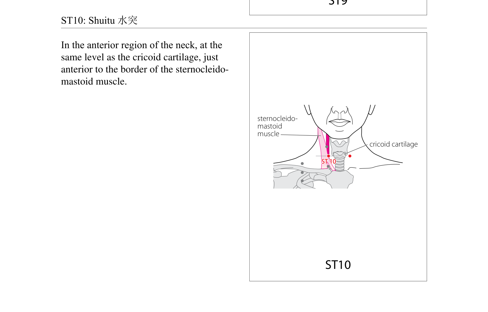

> **External References:** [AcuPoints](https://www.acupoints.org/st10-acupuncture-point/)

**דיקור**

* **זווית**: ניצבת, 90°
* **עומק**: 0.3-0.5 צון
* **⚠️ זהירות**: הימנעו מעורק הקרוטיד
* **תחושת דה-צ'י**: כבדות מקומית

**פעולות והתוויות**

* **פעולות**: מווסת צ'י; מועיל לגרון; מרגיע שיעול ואסתמה
* **התוויות**: כאב גרון, שיעול, אסתמה, גויטר, שיהוקים
* **שילובים נפוצים**: ST10 + REN22 (שיעול, אסתמה)

***

#### ST11 — צ'י שה (气舍)

**שם סיני**: 气舍 (Qi She) **משמעות השם**: "בית הצ'י" — מקום שבו צ'י שוכן

**מיקום אנטומי**

על הגבול העליון של הבריח (Clavicle), בין ראשי ה-SCM (Sternal Head ו-Clavicular Head), ישירות מתחת ל-ST9.

**איך למצוא את הנקודה**

1. אתרו את הבריח
2. גששו את ה-SCM ואת שני ראשיו — הסטרנלי והקלביקולרי
3. הנקודה בגומה שביניהם, על הגבול העליון של הבריח

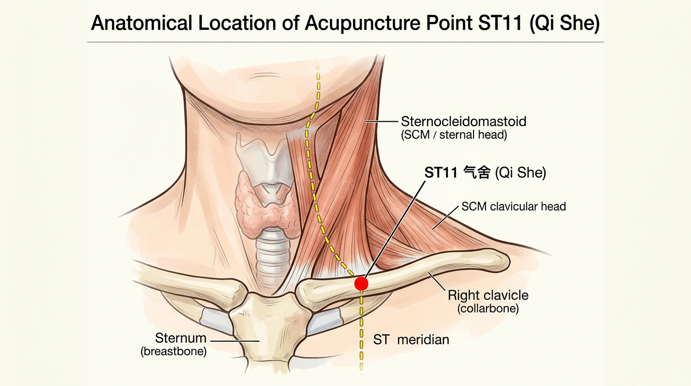

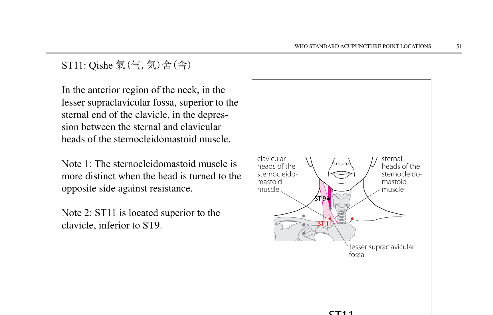

> **External References:** [AcuPoints](https://www.acupoints.org/st11-acupuncture-point/)

**דיקור**

* **זווית**: ניצבת, 90°
* **עומק**: 0.3-0.5 צון
* **⚠️ זהירות**: אין לדקור עמוק — סכנת פנאומותורקס
* **תחושת דה-צ'י**: כבדות מקומית

**פעולות והתוויות**

* **פעולות**: מווסת צ'י; מועיל לגרון ולצוואר
* **התוויות**: כאב גרון, שיהוקים, נפיחות בצוואר, גויטר, נוקשות צוואר
* **שילובים נפוצים**: ST11 + ST12 + REN22 (בעיות גרון-צוואר)

***

#### ST12 — צ'יואה פן (缺盆)

**שם סיני**: 缺盆 (Que Pen) **משמעות השם**: "אגן שבור" — הגומה שמעל לבריח נראית כמו אגן

**מיקום אנטומי**

באמצע הגומה שמעל לבריח (Supraclavicular Fossa), 4 צון לטרלית לקו האמצע, על הקו הפטמתי.

**איך למצוא את הנקודה**

1. אתרו את הגומה שמעל לבריח
2. מדדו 4 צון לטרלית לקו האמצע (או על קו אנכי מהפטמה)
3. הנקודה במרכז הגומה

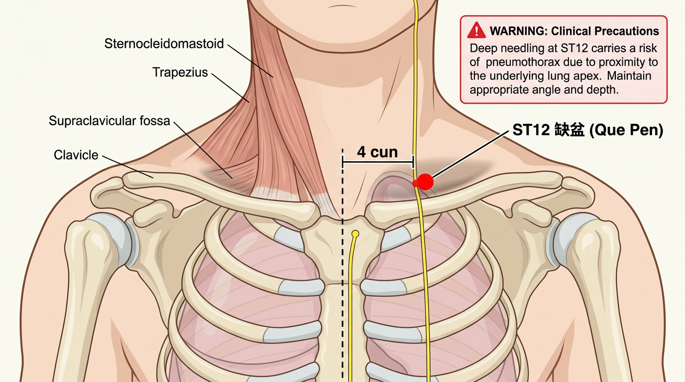

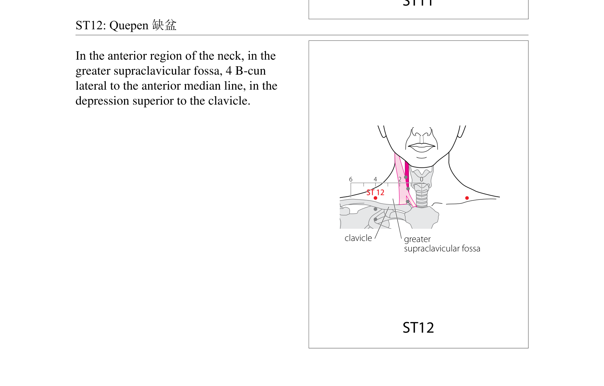

> **External References:** [AcuPoints](https://www.acupoints.org/st12-acupuncture-point/)

**דיקור**

* **זווית**: ניצבת, 90°
* **עומק**: 0.3-0.5 צון
* **⚠️ זהירות גבוהה**: מתחת נמצאת קודקוד הריאה — סכנת פנאומותורקס. אין לדקור עמוק
* **תחושת דה-צ'י**: כבדות מקומית, תחושה שמתפשטת לכתף

**פעולות והתוויות**

* **פעולות**: מפנה חום מהריאות; מוריד צ'י מורד; מועיל לגרון
* **התוויות**: שיעול, אסתמה, כאב גרון, כאב כתף, נפיחות בצוואר
* **שילובים נפוצים**: ST12 + LU1 (גודש חזה עליון); ST12 + LI15 (כאב כתף)

***

### 4. נקודות החזה (ST13-ST18)

***

#### ST13 — צ'י הו (气户)

**שם סיני**: 气户 (Qi Hu) **משמעות השם**: "דלת הצ'י" — שער הכניסה של צ'י לחזה

**מיקום אנטומי**

על הגבול התחתון של הבריח, 4 צון לטרלית לקו האמצע, על הקו הפטמתי.

**איך למצוא את הנקודה**

1. אתרו את הגבול התחתון של הבריח
2. מדדו 4 צון לטרלית לקו האמצע
3. הנקודה ישירות מתחת ל-ST12

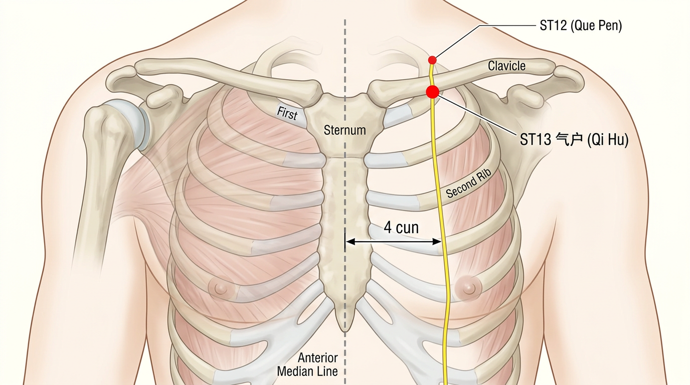

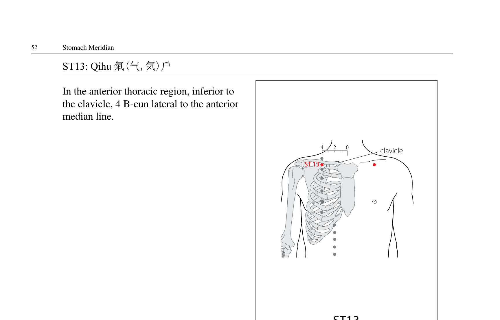

> **External References:** [AcuPoints](https://www.acupoints.org/st13-acupuncture-point/)

**דיקור**

* **זווית**: אלכסונית-לטרלית, 45°
* **עומק**: 0.3-0.5 צון
* **⚠️ זהירות**: סכנת פנאומותורקס
* **תחושת דה-צ'י**: כבדות, גודש מקומי

**פעולות והתוויות**

* **פעולות**: מווסת צ'י בחזה; מרחיב חזה
* **התוויות**: שיעול, אסתמה, כאב בחזה, גודש בחזה, שיהוקים
* **שילובים נפוצים**: ST13 + REN17 (גודש חזה)

***

#### ST14-ST17 — נקודות החזה

**ST14 — קו פאנג (库房)** "חדר האוצר" — ברווח הבין-צלעי הראשון, 4 צון לטרלית. שיעול, כאב חזה.

**ST15 — וו יי (屋翳)** "גג הבית" — ברווח הבין-צלעי השני, 4 צון לטרלית. שיעול, כאב חזה, מסטיטיס.

**ST16 — יינג צ'ואנג (膺窗)** "חלון החזה" — ברווח הבין-צלעי השלישי, 4 צון לטרלית. כאב חזה, שיעול, נפיחות שד.

**ST17 — רו ג'ונג (乳中)** "מרכז השד" — על הפטמה. **אסור לדקור** — נקודת ציון בלבד לצורך מדידה. הפטמה נמצאת ברווח הבין-צלעי הרביעי, 4 צון לטרלית.

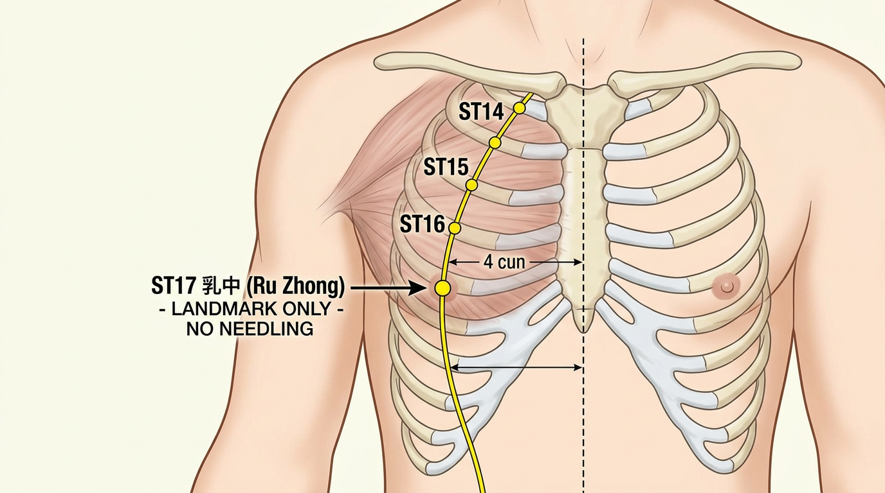

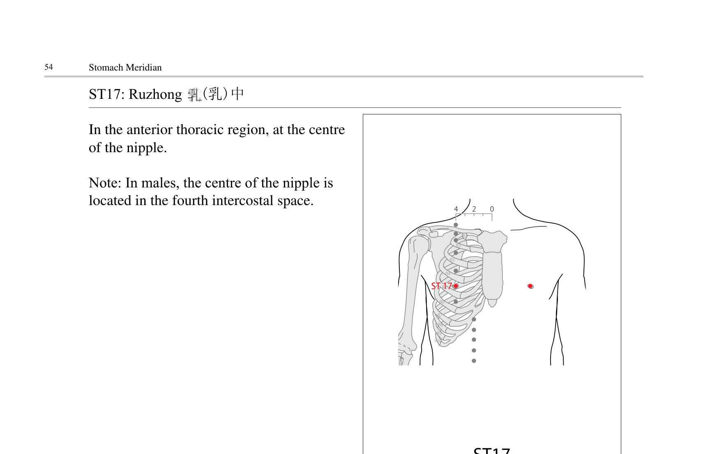

> **External References:** [AcuPoints](https://www.acupoints.org/st17-acupuncture-point/)

***

#### ST18 — רו גן (乳根)

**שם סיני**: 乳根 (Ru Gen) **משמעות השם**: "שורש השד" — בבסיס (שורש) השד

**מיקום אנטומי**

ברווח הבין-צלעי החמישי, 4 צון לטרלית לקו האמצע, ישירות מתחת לפטמה.

**איך למצוא את הנקודה**

1. אתרו את הפטמה (ST17)
2. ירדו רווח בין-צלעי אחד — לרווח החמישי
3. הנקודה ישירות מתחת לפטמה, בבסיס השד

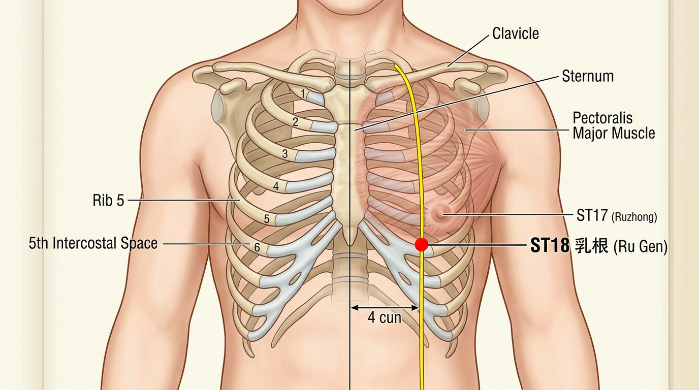

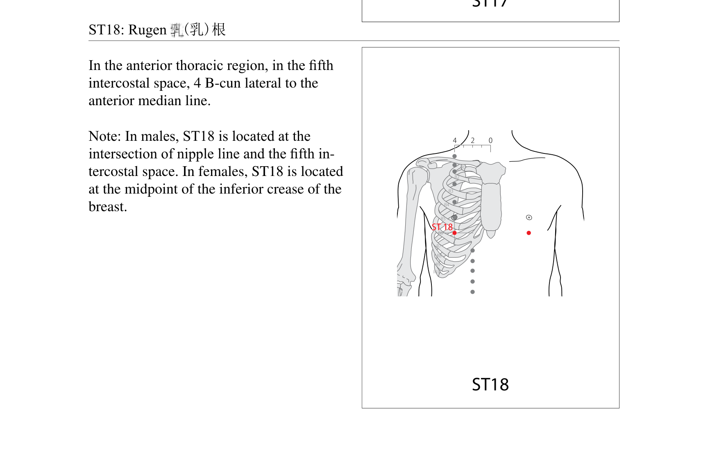

> **External References:** [AcuPoints](https://www.acupoints.org/st18-acupuncture-point/)

**דיקור**

* **זווית**: אלכסונית-לטרלית, 45°
* **עומק**: 0.3-0.5 צון
* **⚠️ זהירות**: סכנת פנאומותורקס
* **תחושת דה-צ'י**: כבדות מקומית

**פעולות והתוויות**

* **פעולות**: מועיל לשד; מוריד צ'י; מפנה חום
* **התוויות**: מסטיטיס (דלקת שד), חוסר חלב (אימהות מניקות), כאב בחזה, שיעול, אסתמה
* **שילובים נפוצים**: ST18 + SI1 + REN17 (חוסר חלב); ST18 + LR14 (כאב צלעות)

***

### 5. נקודות הבטן (ST19-ST30)

***

#### ST19 — בו רונג (不容)

**שם סיני**: 不容 (Bu Rong) **משמעות השם**: "לא מכיל" — כאשר הקיבה מלאה ולא יכולה להכיל עוד

**מיקום אנטומי**

6 צון מעל הטבור, 2 צון לטרלית לקו האמצע. ברמת REN14.

**איך למצוא את הנקודה**

1. אתרו את הטבור ואת מקום חיבור הצלעות (Xiphoid Process)
2. REN14 נמצא 6 צון מעל הטבור על קו האמצע
3. מדדו 2 צון לטרלית — זו ST19

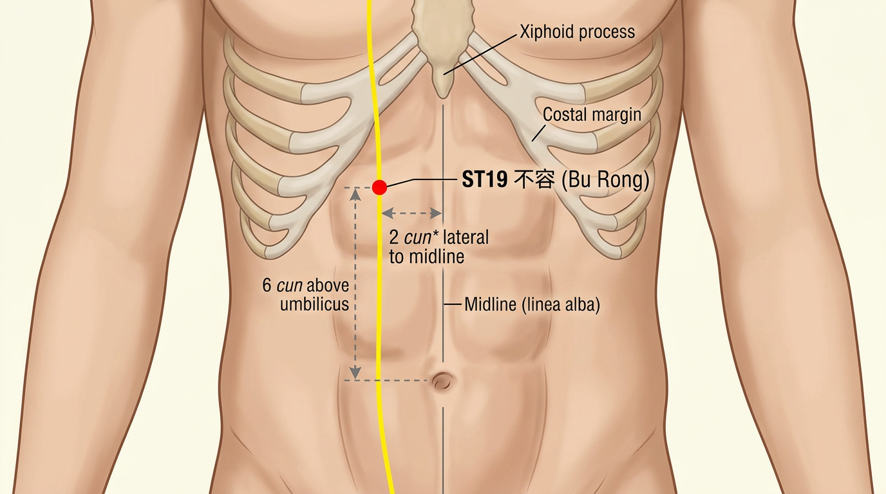

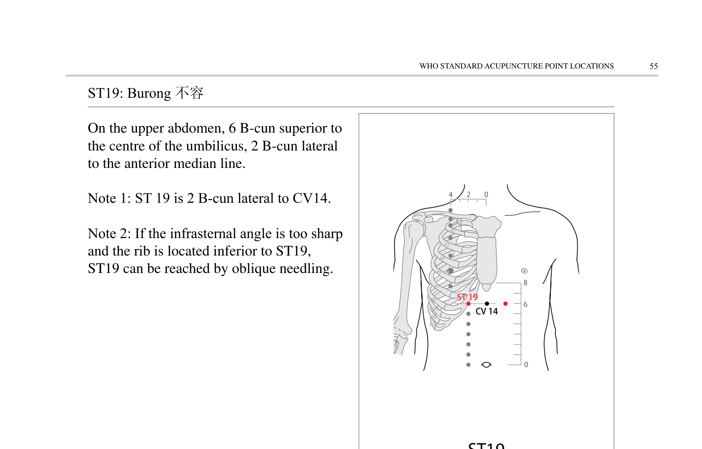

> **External References:** [AcuPoints](https://www.acupoints.org/st19-acupuncture-point/)

**דיקור**

* **זווית**: ניצבת, 90°
* **עומק**: 0.5-0.8 צון
* **תחושת דה-צ'י**: כבדות, גודש

**פעולות והתוויות**

* **פעולות**: מווסת צ'י של קיבה; מוריד צ'י מורד; מרגיע כאב
* **התוויות**: כאב קיבה, הקאות, חוסר תיאבון, נפיחות בטנית
* **שילובים נפוצים**: ST19 + REN12 + PC6 (כאב קיבה, הקאות)

***

#### ST20-ST24 — נקודות הבטן העליונה

**ST20 — צ'נג מאן (承满)** "מקבל מלאות" — 5 צון מעל הטבור, 2 צון לטרלית. כאב קיבה, הקאות.

**ST21 — ליאנג מן (梁门)** "שער הגשר" — 4 צון מעל הטבור, 2 צון לטרלית. **נקודה חשובה** — כאב קיבה, חוסר תיאבון, שלשול. שילוב: ST21 + REN12 + ST36 (בעיות קיבה כרוניות).

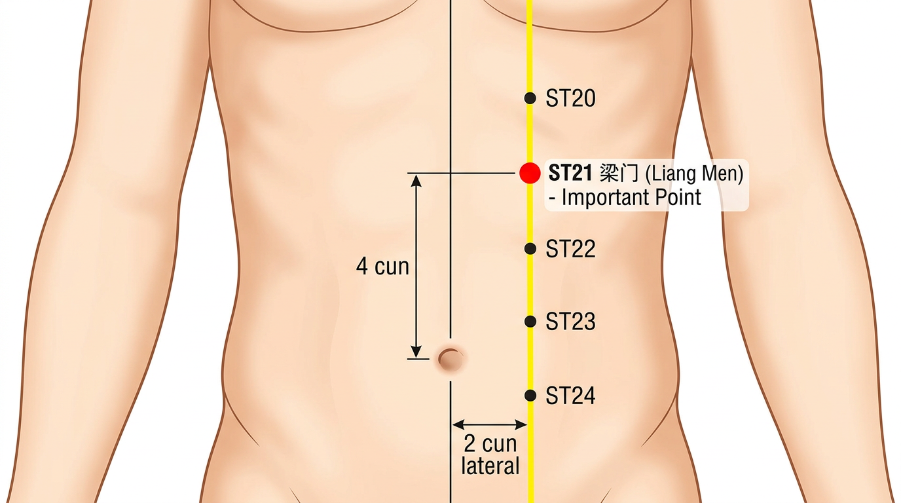

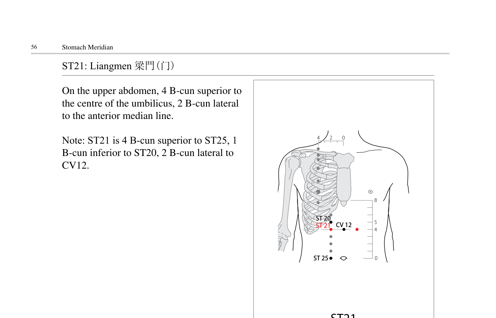

> **External References:** [AcuPoints](https://www.acupoints.org/st21-acupuncture-point/)

**ST22 — גואן מן (关门)** "שער הסגירה" — 3 צון מעל הטבור, 2 צון לטרלית. נפיחות בטנית, בצקות, שלשול.

**ST23 — טאי יי (太乙)** "אחדות גדולה" — 2 צון מעל הטבור, 2 צון לטרלית. כאב קיבה, אי-שקט נפשי, מאניה.

**ST24 — הואה רו מן (滑肉门)** "שער הבשר החלקלק" — 1 צון מעל הטבור, 2 צון לטרלית. הקאות, מאניה.

***

#### ST25 — טיאן שו (天枢)

**שם סיני**: 天枢 (Tian Shu) **משמעות השם**: "ציר השמיים" — הציר שבין ג'יאו עליון (שמיים) לג'יאו תחתון (ארץ) **קטגוריה מיוחדת**: נקודת מו קדמית (募穴 Mu Xue) של המעי הגס; נקודה מהחשובות בבטן

**מיקום אנטומי**

2 צון לטרלית לטבור, ברמת הטבור.

**איך למצוא את הנקודה**

1. אתרו את הטבור
2. מדדו 2 צון (רוחב 3 אצבעות) הצידה
3. הנקודה ברמת הטבור בדיוק, 2 צון לטרלית

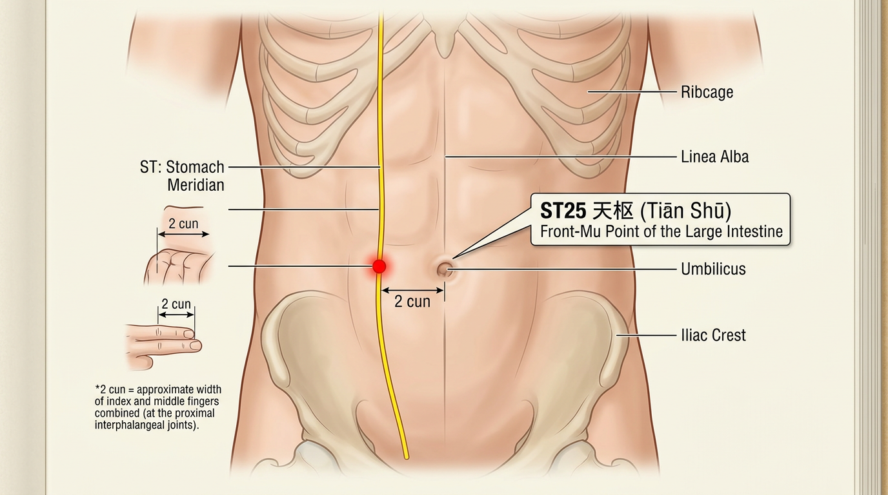

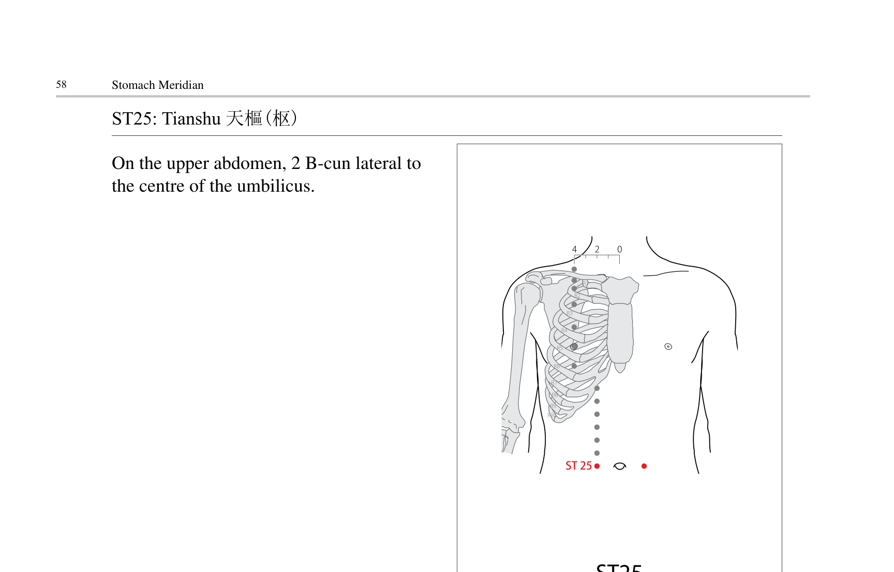

> **External References:** [AcuPoints](https://www.acupoints.org/st25-acupuncture-point/)

**דיקור**

* **זווית**: ניצבת, 90°
* **עומק**: 0.7-1.2 צון
* **⚠️ זהירות בהריון**: אין לדקור עמוק בנשים בהריון
* **תחושת דה-צ'י**: כבדות, תחושת תנועה במעיים

**פעולות והתוויות**

* **פעולות**: מווסת מעיים (**נקודת מפתח למעיים**); מווסת צ'י ודם; מפיג רטיבות וחום; מפזר סטגנציה
* **כנקודת מו של המעי הגס**: אבחון וטיפול ישיר במעי הגס
* **התוויות**: עצירות, שלשול, דיזנטריה, כאב בטן, נפיחות בטנית, אי-סדירות מחזור, דלקת מעיים (IBS, IBD), בצקות
* **שילובים נפוצים**: ST25 + ST36 + ST37 (כל בעיות מעיים); ST25 + REN6 + SP6 (אי-סדירות מחזור); ST25 + SP15 + ST37 (עצירות)

***

#### ST26-ST28 — נקודות הבטן התחתונה

**ST26 — וואי לינג (外陵)** "גבעה חיצונית" — 1 צון מתחת לטבור, 2 צון לטרלית. כאב בטן, דיסמנוריאה.

**ST27 — דה ג'ו (大巨)** "גדול ענק" — 2 צון מתחת לטבור, 2 צון לטרלית. כאב בטן תחתון, עצירות, בעיות שתן, אין-פוטנציה (Impotence).

**ST28 — שואי דאו (水道)** "מסלול המים" — 3 צון מתחת לטבור, 2 צון לטרלית. **נקודה חשובה למים** — בצקות, עצירת שתן, כאב מחזור, כאב בטן תחתון. שילוב: ST28 + REN3 + SP9 (בעיות שתן, בצקות).

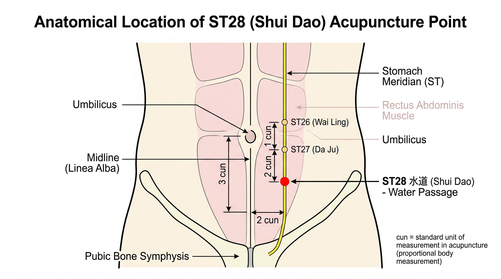

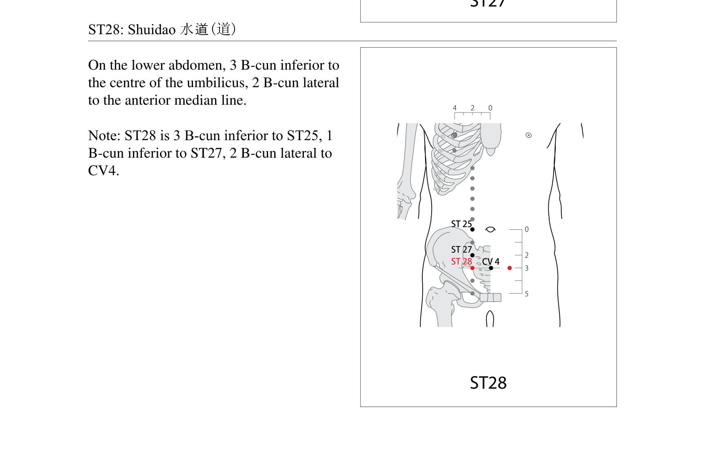

> **External References:** [AcuPoints](https://www.acupoints.org/st28-acupuncture-point/)

***

#### ST29 — גואי לאי (归来)

**שם סיני**: 归来 (Gui Lai) **משמעות השם**: "חזרה" — הצ'י חוזר; גם במשמעות של החזרת הרחם למקומו

**מיקום אנטומי**

4 צון מתחת לטבור, 2 צון לטרלית לקו האמצע.

**איך למצוא את הנקודה**

1. מדדו 4 צון מתחת לטבור (ברמת REN3)
2. מדדו 2 צון לטרלית

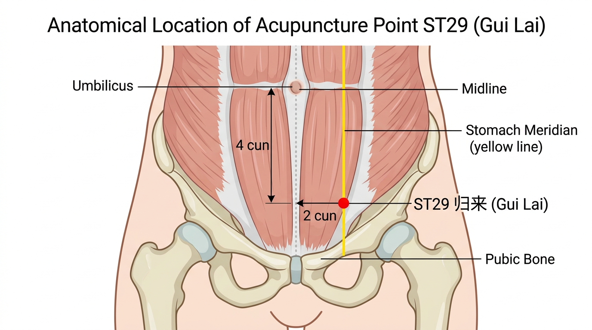

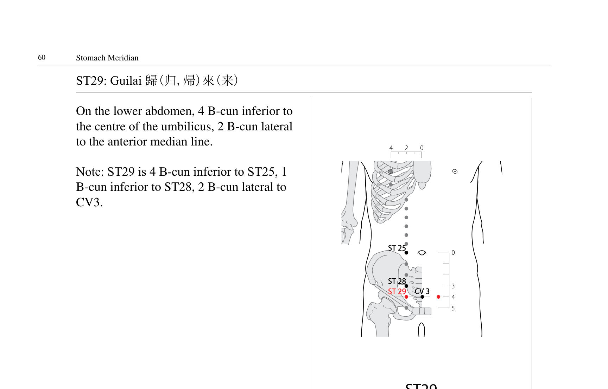

> **External References:** [AcuPoints](https://www.acupoints.org/st29-acupuncture-point/)

**דיקור**

* **זווית**: ניצבת, 90°
* **עומק**: 0.7-1.2 צון
* **תחושת דה-צ'י**: כבדות, תחושה שמתפשטת לאיברי המין

**פעולות והתוויות**

* **פעולות**: מווסת צ'י ודם בג'יאו תחתון; מחמם רחם; מועיל לאיברי מין
* **התוויות**: כאב מחזור, אי-סדירות מחזור, צניחת רחם, בקע מפשעתי (Hernia), אין-פוטנציה, כאב באשכים
* **שילובים נפוצים**: ST29 + REN4 + SP6 (בעיות גינקולוגיות)

***

#### ST30 — צ'י צ'ונג (气冲)

**שם סיני**: 气冲 (Qi Chong) **משמעות השם**: "פריצת צ'י" — מקום שבו צ'י פורצת החוצה **קטגוריה מיוחדת**: נקודת מפגש עם צ'ונג מאי (冲脉)

**מיקום אנטומי**

5 צון מתחת לטבור, 2 צון לטרלית לקו האמצע, על הגבול העליון של עצם ה-Pubis, מדיאלית לעורק הפמורלי.

**איך למצוא את הנקודה**

1. אתרו את הגבול העליון של עצם הערווה (Pubic Bone)
2. מדדו 2 צון לטרלית לקו האמצע
3. גששו את דופק עורק הפמורלי — הנקודה מדיאלית לעורק

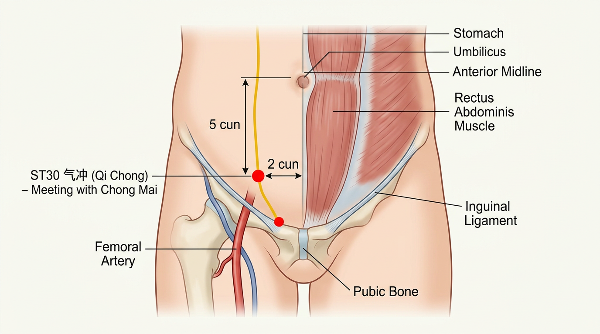

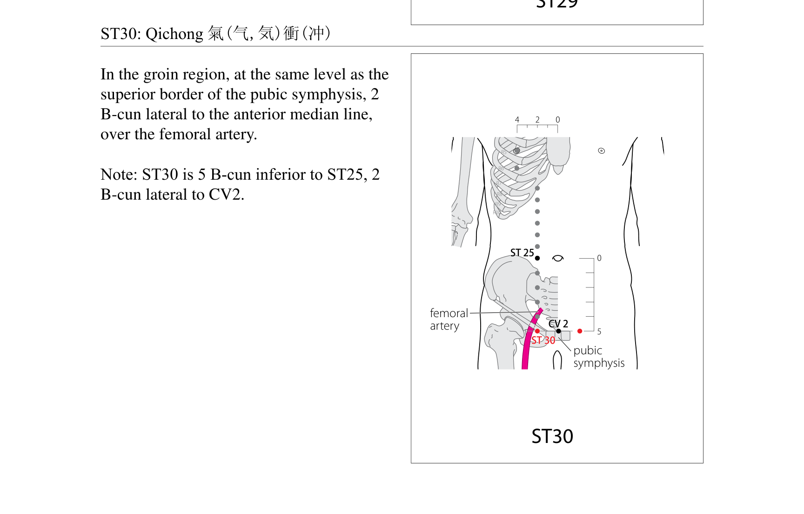

> **External References:** [AcuPoints](https://www.acupoints.org/st30-acupuncture-point/)

**דיקור**

* **זווית**: ניצבת, 90°
* **עומק**: 0.5-1.0 צון
* **⚠️ זהירות**: הימנעו מעורק הפמורלי
* **תחושת דה-צ'י**: כבדות, חום מקומי

**פעולות והתוויות**

* **פעולות**: מווסת צ'י וצ'ונג מאי; מועיל לאיברי מין ולמערכת הרבייה
* **התוויות**: בקע מפשעתי, כאב באיברי מין, אי-פוריות, אי-סדירות מחזור, אין-פוטנציה
* **שילובים נפוצים**: ST30 + SP6 + REN4 (בעיות פוריות); ST30 + LR3 (בקע)

***

### 6. נקודות הירך (ST31-ST35)

***

#### ST31 — בי גואן (髀关)

**שם סיני**: 髀关 (Bi Guan) **משמעות השם**: "שער הירך" — בי = ירך; גואן = שער/מפרק

**מיקום אנטומי**

על הצד הקדמי של הירך, ישירות מתחת ל-ASIS (Anterior Superior Iliac Spine), ברמת הגבול התחתון של עצם ה-Pubis, בגומה שלטרלית לשריר ה-Sartorius.

**איך למצוא את הנקודה**

1. בקשו מהמטופל לכופף מעט את הירך
2. אתרו את ה-ASIS (הבליטה העצמית בחזית האגן)
3. הנקודה ישירות מתחת ל-ASIS, בפגישת שרירי Sartorius ו-Tensor Fasciae Latae
4. גששו את הגומה שנוצרת — לחצו

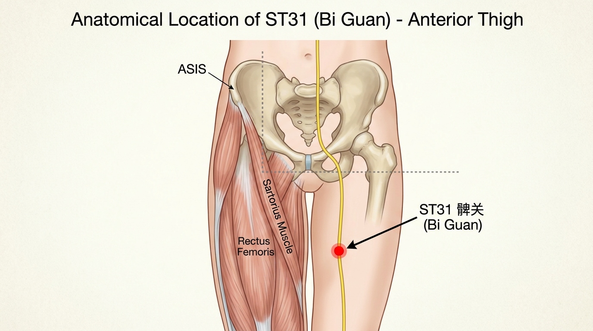

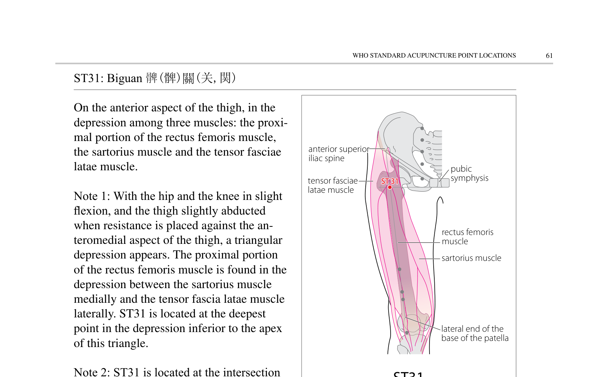

> **External References:** [AcuPoints](https://www.acupoints.org/st31-acupuncture-point/)

**דיקור**

* **זווית**: ניצבת, 90°
* **עומק**: 1.0-2.0 צון
* **תחושת דה-צ'י**: כבדות עמוקה, נימול שיורד לברך

**פעולות והתוויות**

* **פעולות**: מחזק רגליים; מפזר רוח-רטיבות; מרגיע כאב
* **התוויות**: כאב ירך, נימול ברגל, שיתוק גפה תחתונה, כאב מותני
* **שילובים נפוצים**: ST31 + ST32 + GB30 (כאב ירך)

***

#### ST32 — פו טו (伏兔)

**שם סיני**: 伏兔 (Fu Tu) **משמעות השם**: "ארנב רובץ" — בליטת שריר הקוואדריצפס נראית כארנב רובץ

**מיקום אנטומי**

6 צון מעל הגבול העליון-לטרלי של הפטלה (Patella), על הקו המחבר בין ASIS לגבול הלטרלי של הפטלה, על שריר ה-Rectus Femoris.

**איך למצוא את הנקודה**

1. בקשו מהמטופל לשכב על הגב עם רגל ישרה
2. אתרו את הגבול העליון-לטרלי של הפיקה (Patella)
3. מדדו 6 צון מעלה
4. הנקודה על בליטת שריר ה-Rectus Femoris — בקשו מהמטופל לכווץ את השריר

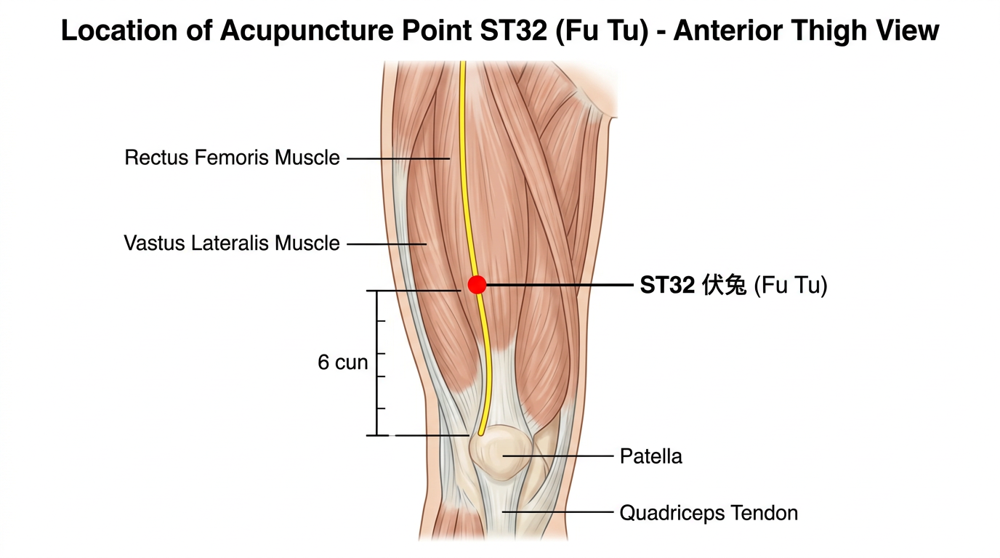

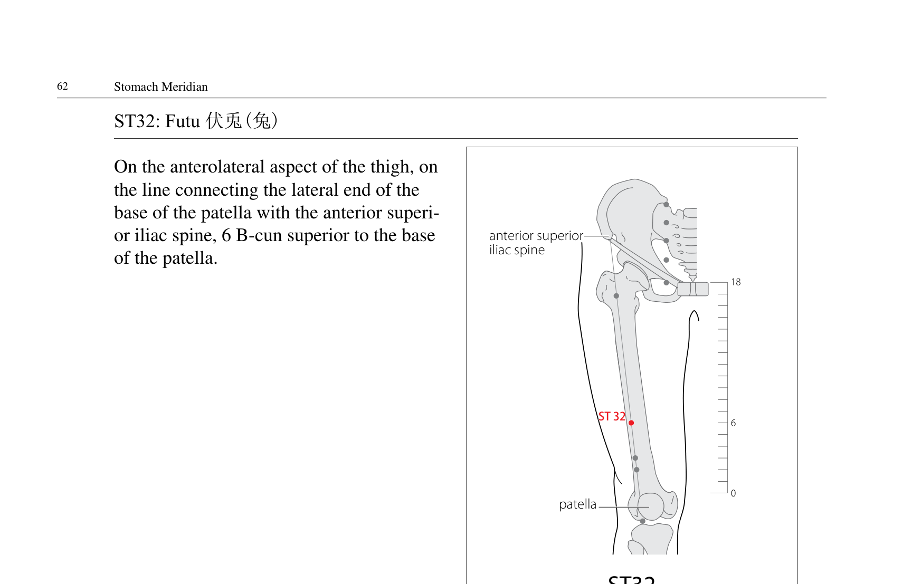

> **External References:** [AcuPoints](https://www.acupoints.org/st32-acupuncture-point/)

**דיקור**

* **זווית**: ניצבת, 90°
* **עומק**: 1.0-2.0 צון
* **תחושת דה-צ'י**: כבדות עמוקה

**פעולות והתוויות**

* **פעולות**: מחזק רגליים; מפזר רוח-קור; מרגיע כאב
* **התוויות**: כאב ברך וירך, נימול ברגל, שיתוק, בקע, כאב מותני
* **שילובים נפוצים**: ST32 + ST34 + ST36 (כאב ברך-ירך)

***

#### ST33 — ין שי (阴市)

**שם סיני**: 阴市 (Yin Shi) **משמעות השם**: "שוק הין" — אזור שבו צ'י ין מתאסף

**מיקום אנטומי**

3 צון מעל הגבול העליון-לטרלי של הפטלה, על שריר ה-Rectus Femoris.

**איך למצוא את הנקודה**

1. אתרו את הגבול העליון-לטרלי של הפטלה
2. מדדו 3 צון מעלה

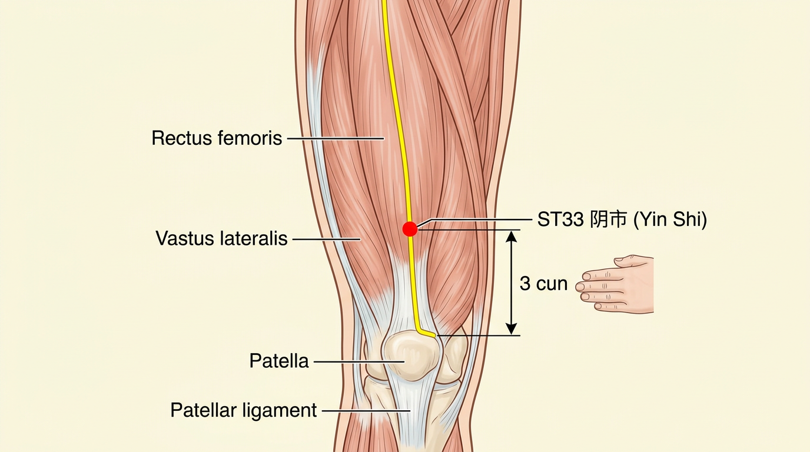

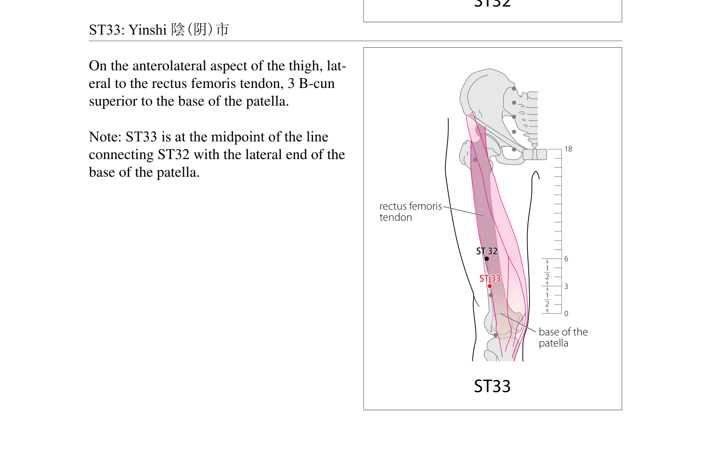

> **External References:** [AcuPoints](https://www.acupoints.org/st33-acupuncture-point/)

**דיקור**

* **זווית**: ניצבת, 90°
* **עומק**: 1.0-1.5 צון
* **תחושת דה-צ'י**: כבדות מקומית

**פעולות והתוויות**

* **פעולות**: מפזר קור-רטיבות; מחמם ערוץ; מרגיע כאב ברך
* **התוויות**: כאב ברך, קרירות ברגליים, נימול, בקע, כאב בטן תחתון
* **שילובים נפוצים**: ST33 + ST34 (כאב ירך-ברך)

***

#### ST34 — ליאנג צ'יו (梁丘)

**שם סיני**: 梁丘 (Liang Qiu) **משמעות השם**: "גבעת הגשר" — בליטת השריר כמו גבעה ליד "גשר" הברך **קטגוריה מיוחדת**: נקודת שי-צלע (郄穴 Xi Xue) — נקודת חירום/כאב חריף של הערוץ

**מיקום אנטומי**

2 צון מעל הגבול העליון-לטרלי של הפטלה, בין שריר ה-Rectus Femoris לבין ה-Vastus Lateralis.

**איך למצוא את הנקודה**

1. אתרו את הגבול העליון-לטרלי של הפטלה
2. מדדו 2 צון מעלה
3. הנקודה בין שני השרירים — גששו את השקע ביניהם

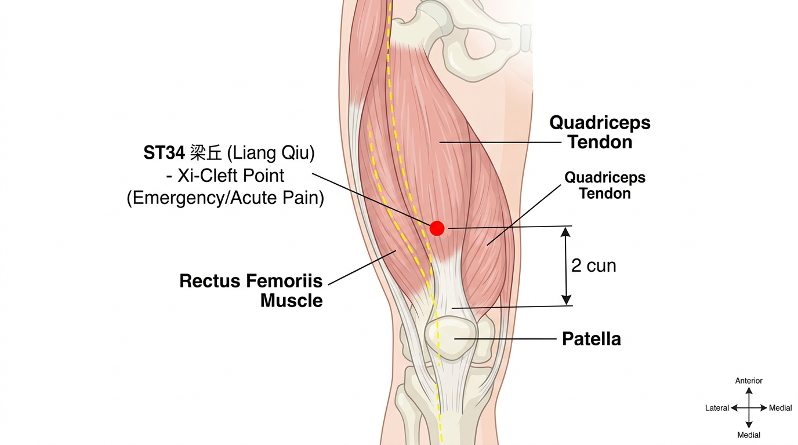

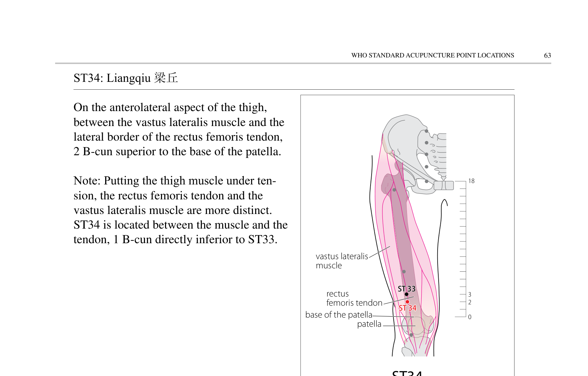

> **External References:** [AcuPoints](https://www.acupoints.org/st34-acupuncture-point/)

**דיקור**

* **זווית**: ניצבת, 90°
* **עומק**: 0.7-1.2 צון
* **תחושת דה-צ'י**: כבדות, כאב עמוק

**פעולות והתוויות**

* **פעולות**: מווסת צ'י קיבה; מרגיע כאב חריף (**נקודת חירום**); מועיל לברך
* **כנקודת שי**: משמשת למצבים **חריפים** של ערוץ הקיבה
* **התוויות**: כאב קיבה חריף (**נקודה ראשונה**), כאב ברך חריף, נפיחות ברך, מסטיטיס חריפה, שלשול חריף
* **שילובים נפוצים**: ST34 + REN12 + PC6 (כאב קיבה חריף); ST34 + ST35 + Xiyan (כאב ברך)

***

#### ST35 — דו בי (犊鼻)

**שם סיני**: 犊鼻 (Du Bi) **משמעות השם**: "אף העגל" — הגומה מתחת לפיקה נראית כמו נחיר של עגל **קטגוריה מיוחדת**: נקודה מרכזית לברך

**מיקום אנטומי**

כאשר הברך מכופפת, בגומה (Depression) הלטרלית שמתחת לפטלה, לטרלית לליגמנט הפטלרי (Patellar Ligament).

**איך למצוא את הנקודה**

1. בקשו מהמטופל לכופף את הברך ב-90° (ישיבה)
2. אתרו את הליגמנט הפטלרי — הרצועה הקשיחה שמתחת לפיקה
3. שתי גומות נוצרות משני צדי הליגמנט
4. ST35 בגומה **הלטרלית** (חיצונית) — "העין הלטרלית של הברך"
5. (הגומה המדיאלית היא נקודת Extra: Medial Xiyan)

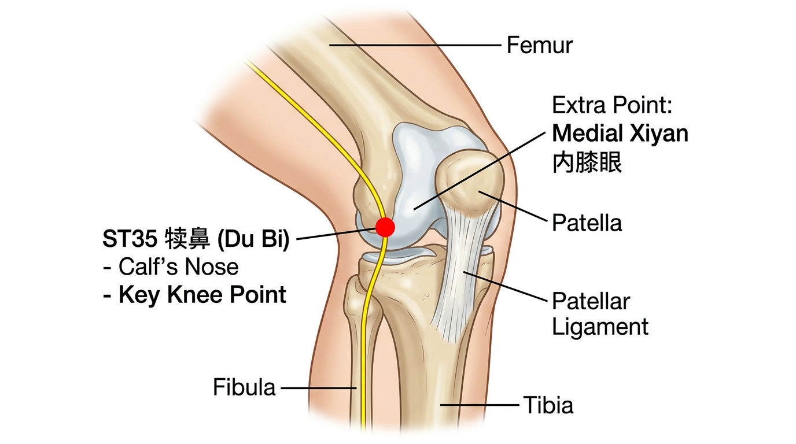

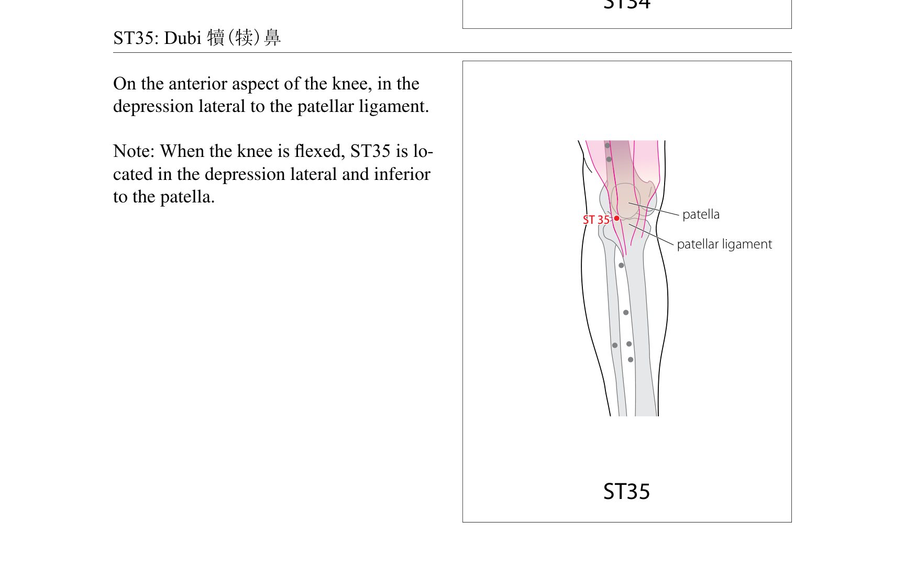

> **External References:** [AcuPoints](https://www.acupoints.org/st35-acupuncture-point/)

**דיקור**

* **זווית**: אלכסונית לכיוון מרכז הברך, 45° כלפי מדיאלי ואחורי
* **עומק**: 0.5-1.0 צון
* **תחושת דה-צ'י**: כבדות בברך, לעתים תחושת חום

**פעולות והתוויות**

* **פעולות**: מפזר רוח-רטיבות; מועיל לברך (**הנקודה העיקרית לברך**)
* **התוויות**: כאב ברך (כל סוג), נפיחות ברך, נוקשות ברך, קושי בהליכה
* **שילובים נפוצים**: ST35 + Medial Xiyan (Extra) = "עיני הברך" — שילוב קלאסי; ST35 + ST36 + SP9 + GB34 (ברך מקיף)

***

### 7. נקודות השוקה (ST36-ST40)

***

#### ST36 — צו סאן לי (足三里)

**שם סיני**: 足三里 (Zu San Li) **משמעות השם**: "שלושה לי של הרגל" — 3 צון מתחת לברך; "שלוש נסיעות" — אמרה סינית: "מי שדוקר צו סאן לי יכול ללכת שלושה לי נוספים" **קטגוריה מיוחדת**: נקודת הה-ים (合穴 He Xue) — אלמנט אדמה (土 Tu); אחת מ-4 נקודות הפיקוד (四总穴); נקודת הה-ים התחתונה (下合穴) של הקיבה; נקודת "ים של מזון" (水谷之海)

**מיקום אנטומי**

3 צון מתחת ל-ST35 (דו בי), רוחב אצבע אחד (1 צון) לטרלית לקצה הקדמי של עצם השוקה (Tibial Crest).

**איך למצוא את הנקודה**

1. בקשו מהמטופל לשבת עם ברך מכופפת ב-90°
2. אתרו את ST35 (הגומה הלטרלית מתחת לפיקה)
3. מדדו 3 צון (רוחב 4 אצבעות) ישירות מטה
4. הנקודה 1 צון (רוחב אצבע) לטרלית לקצה הקדמי של עצם השוקה (Tibia)
5. הנקודה בשריר ה-Tibialis Anterior — לחצו ותרגישו את השריר
6. **שיטה חלופית**: הניחו כף יד על הפיקה, אצבעות למטה — קצה האצבע הרביעית (Ring Finger) נוגע ב-ST36

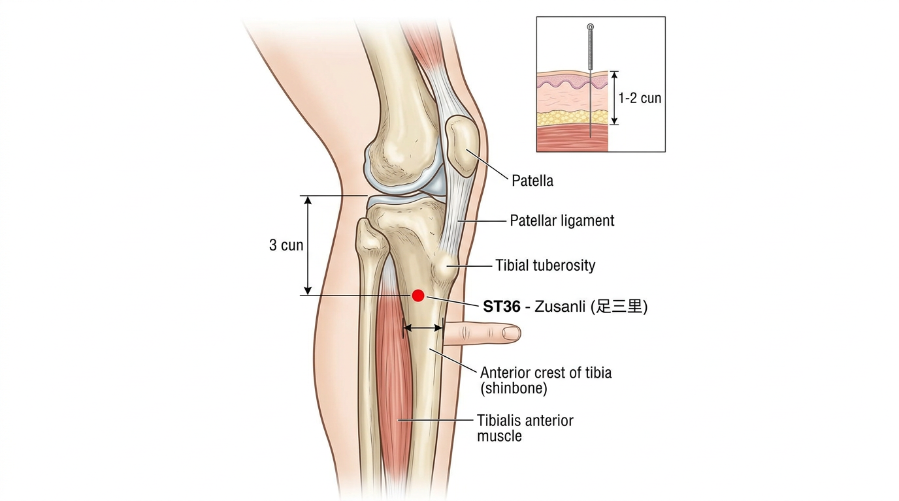

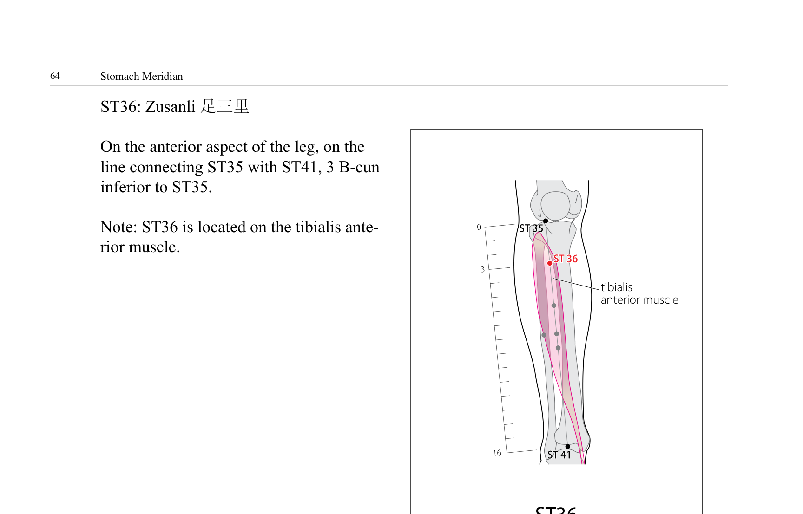

> **External References:** [AcuPoints](https://www.acupoints.org/st36-acupuncture-point/)

**דיקור**

* **זווית**: ניצבת, 90°
* **עומק**: 1.0-2.0 צון
* **תחושת דה-צ'י**: כבדות עמוקה, נימול שיורד לכף הרגל, לעתים תחושת חשמל

**פעולות והתוויות**

* **פעולות**: מחזק צ'י של קיבה וטחול (**הנקודה החשובה ביותר לחיזוק עיכול**); מחזק צ'י ודם כללי; מזין ין; מחמם יאנג; מחזק ווי צ'י (חיסון); מגרש רוח-רטיבות; מרגיע כאב; מרגיע שן (רוח); מווסת צ'י ודם; מוריד צ'י מורד
* **כנקודת פיקוד**: "הבטן — צו סאן לי שומרת" (肚腹三里留)
* **התוויות**: כאב קיבה, בחילה, הקאות, שלשול, עצירות, נפיחות בטנית, חולשה כללית, עייפות כרונית, חום, סחרחורת, דיכאון, חרדה, כאב ברך, שיתוק רגל, חיזוק חיסוני, אריכות ימים (長寿 — בשימוש מוקסה), מצבים כרוניים רבים
* **שילובים נפוצים**: ST36 + SP6 (חיזוק צ'י ודם — "זוג הזהב"); ST36 + REN12 + SP3 (חיזוק קיבה-טחול); ST36 + LI4 + LU7 (חיזוק חיסוני); ST36 + REN4 + REN6 (חיזוק כללי)

***

#### ST37 — שאנג ג'ו שו (上巨虚)

**שם סיני**: 上巨虚 (Shang Ju Xu) **משמעות השם**: "ריקנות עליונה גדולה" — הגומה שבין עצם השוקה לשריר **קטגוריה מיוחדת**: נקודת הה-ים התחתונה (下合穴 Xia He Xue) של המעי הגס

**מיקום אנטומי**

6 צון מתחת ל-ST35, 1 צון לטרלית לקצה הקדמי של עצם השוקה. 3 צון מתחת ל-ST36.

**איך למצוא את הנקודה**

1. אתרו את ST36
2. מדדו 3 צון ישירות מטה — זו ST37
3. הנקודה על אותו קו — 1 צון לטרלית לשוקה, על שריר ה-Tibialis Anterior

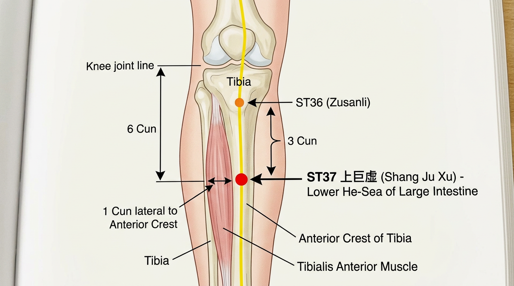

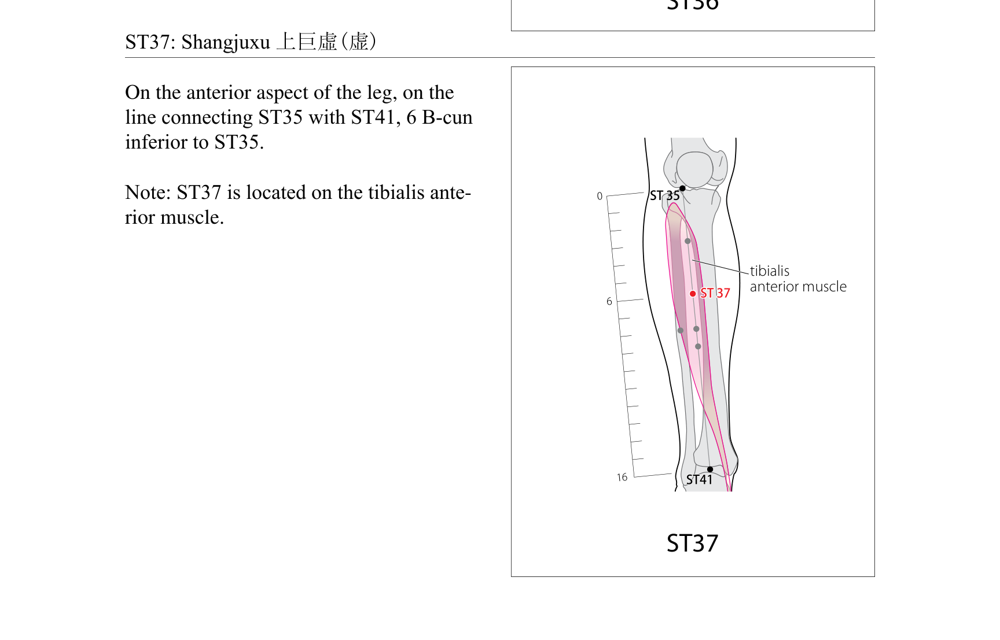

> **External References:** [AcuPoints](https://www.acupoints.org/st37-acupuncture-point/)

**דיקור**

* **זווית**: ניצבת, 90°
* **עומק**: 1.0-1.5 צון
* **תחושת דה-צ'י**: כבדות, נימול

**פעולות והתוויות**

* **פעולות**: מווסת מעי גס; מפנה חום-רטיבות מהמעיים; מרגיע כאב
* **כנקודת הה-ים של המעי הגס**: **הנקודה היעילה ביותר** לטיפול ישיר במעי הגס
* **התוויות**: דיזנטריה, שלשול, עצירות, כאב בטן, אפנדיציטיס, שיתוק רגל
* **שילובים נפוצים**: ST37 + ST25 (כל בעיות מעי גס); ST37 + ST39 + REN6 (שלשול כרוני)

***

#### ST38 — טיאו קאו (条口)

**שם סיני**: 条口 (Tiao Kou) **משמעות השם**: "פתח צר" — פתח צר בין עצמות השוקה

**מיקום אנטומי**

8 צון מתחת ל-ST35, 1 צון לטרלית לשוקה, באמצע הקו בין ST35 ל-ST41.

**איך למצוא את הנקודה**

1. אתרו את ST35 (מתחת לפיקה) ואת ST41 (קפל הקרסול)
2. מצאו את נקודת האמצע — 8 צון מכל צד
3. 2 צון מתחת ל-ST37

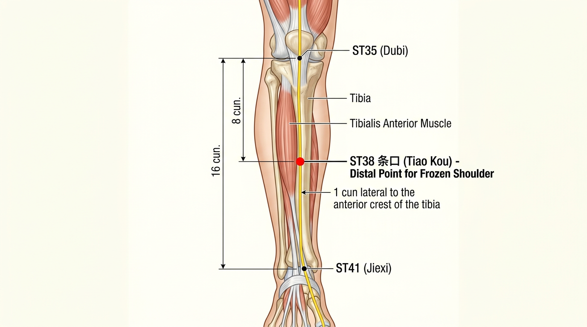

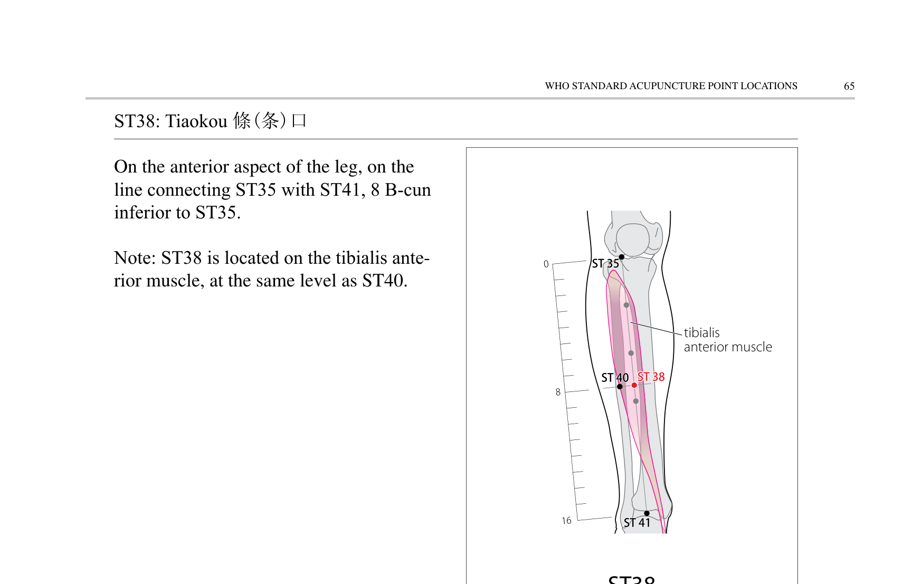

> **External References:** [AcuPoints](https://www.acupoints.org/st38-acupuncture-point/)

**דיקור**

* **זווית**: ניצבת, 90°
* **עומק**: 1.0-1.5 צון
* **טכניקה מיוחדת לכתף**: דקרו ניצבת ובו-זמנית בקשו מהמטופל לנוע את הכתף
* **תחושת דה-צ'י**: כבדות, נימול

**פעולות והתוויות**

* **פעולות**: מועיל לכתף (**נקודה מרוחקת לכאב כתף!**); מפזר קור-רטיבות; מרפה שרירים
* **התוויות**: כאב כתף וקפיאת כתף (**שימוש מרוחק אמפירי**), כאב ברגל, נימול, עוויתות שוקה, חולשת ברך
* **שילובים נפוצים**: ST38 + LI15 + TE14 (כאב כתף — ST38 כנקודה מרוחקת)

***

#### ST39 — שיה ג'ו שו (下巨虚)

**שם סיני**: 下巨虚 (Xia Ju Xu) **משמעות השם**: "ריקנות תחתונה גדולה" **קטגוריה מיוחדת**: נקודת הה-ים התחתונה (下合穴) של המעי הדק

**מיקום אנטומי**

9 צון מתחת ל-ST35, 1 צון לטרלית לשוקה. 1 צון מתחת ל-ST38.

**איך למצוא את הנקודה**

1. אתרו את ST38
2. מדדו 1 צון מטה

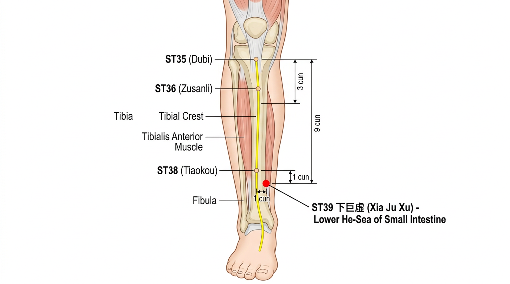

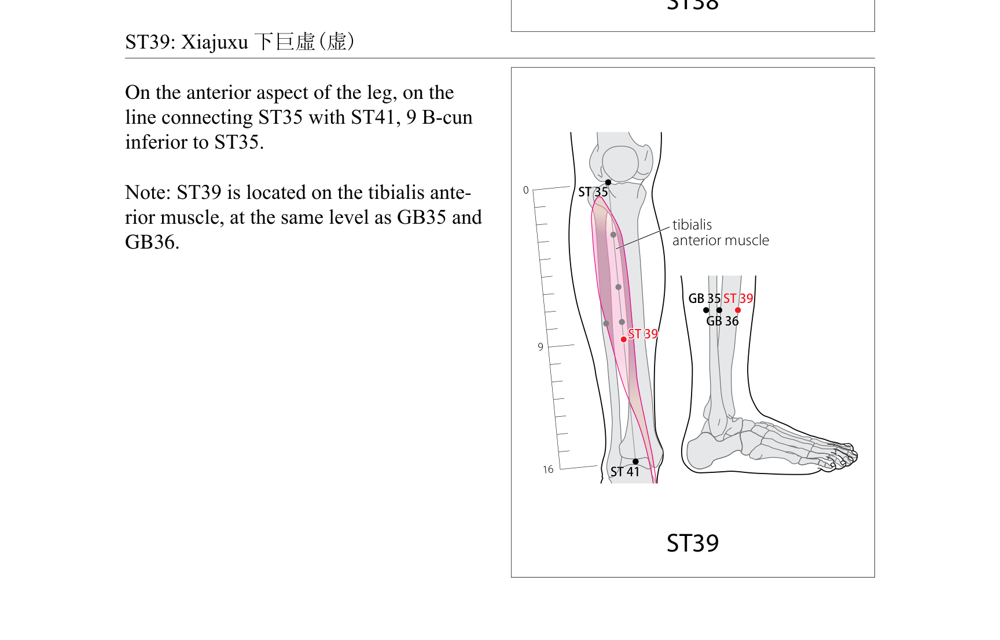

> **External References:** [AcuPoints](https://www.acupoints.org/st39-acupuncture-point/)

**דיקור**

* **זווית**: ניצבת, 90°
* **עומק**: 1.0-1.5 צון
* **תחושת דה-צ'י**: כבדות, נימול

**פעולות והתוויות**

* **פעולות**: מווסת מעי דק; מפנה חום-רטיבות; מרגיע כאב
* **כנקודת הה-ים של המעי הדק**: טיפול ישיר בבעיות מעי דק
* **התוויות**: כאב בטן תחתון, שלשול, דיזנטריה, מסטיטיס, כאב ברגל
* **שילובים נפוצים**: ST39 + ST37 + ST25 (בעיות מעיים); ST39 + REN4 (כאב בטן תחתון)

***

#### ST40 — פנג לונג (丰隆)

**שם סיני**: 丰隆 (Feng Long) **משמעות השם**: "שפע ושגשוג" — הנקודה על בליטה שרירית שופעת **קטגוריה מיוחדת**: נקודת לואו מחברת (络穴 Luo Xue); **הנקודה המרכזית לטיפול בליחה (痰 Tan)**

**מיקום אנטומי**

8 צון מעל קודקוד הקרסול החיצוני (Lateral Malleolus), 2 צון לטרלית ל-ST38, על הגבול הלטרלי של שריר ה-Tibialis Anterior (או בין Tibialis Anterior ל-Extensor Digitorum Longus).

**איך למצוא את הנקודה**

1. אתרו את קודקוד הקרסול החיצוני
2. מדדו 8 צון מעלה (נקודת האמצע בין הקרסול לברך)
3. הנקודה 2 צון לטרלית לקצה השוקה — צעד אחד לטרלית מקו ST38
4. על בליטה שרירית ברורה

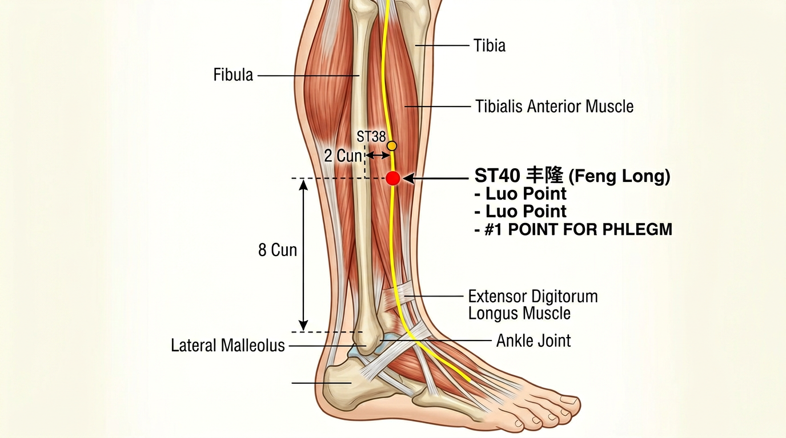

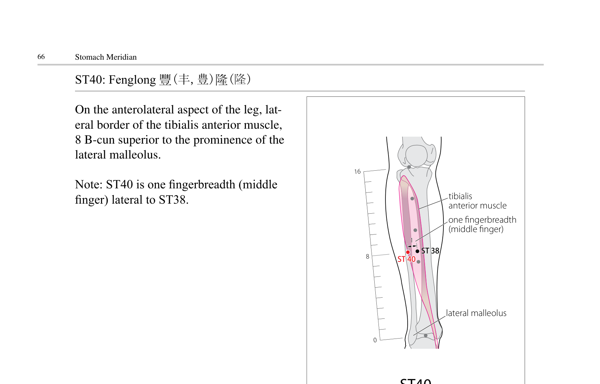

> **External References:** [AcuPoints](https://www.acupoints.org/st40-acupuncture-point/)

**דיקור**

* **זווית**: ניצבת, 90°
* **עומק**: 1.0-1.5 צון
* **תחושת דה-צ'י**: כבדות, נימול שמתפשט מטה

**פעולות והתוויות**

* **פעולות**: הופך ליחה (**הנקודה מספר 1 לטיפול בליחה**); מפנה חום; מרגיע שן (רוח); פותח חזה; מפזר רטיבות
* **כנקודת לואו**: מחברת לערוץ הטחול (SP)
* **התוויות**: שיעול עם ליחה (כל סוג — חמה, קרה, יבשה, רטובה), סחרחורת מליחה, ליחה שחוסמת את הלב (בלבול, מאניה), נפיחות בטנית, בחילה, שיהוקים, גודש בחזה, כאב ראש מליחה
* **שילובים נפוצים**: ST40 + SP3 (ליחה מחסר טחול); ST40 + LU5 + REN17 (ליחה בריאות); ST40 + PC5 + HT7 (ליחה שחוסמת לב — מאניה); ST40 + GV20 + SP6 (סחרחורת מליחה)

***

### 8. נקודות הקרסול וכף הרגל (ST41-ST45)

***

#### ST41 — ג'יה שי (解溪)

**שם סיני**: 解溪 (Jie Xi) **משמעות השם**: "פיצול הנחל" — הנקודה בקפל שבין השוקה לכף הרגל **קטגוריה מיוחדת**: נקודת ג'ינג-נהר (经穴 Jing Xue) — אלמנט אש (火 Huo)

**מיקום אנטומי**

בקפל הקדמי של מפרק הקרסול, באמצע, בין גידי ה-Extensor Hallucis Longus ו-Extensor Digitorum Longus.

**איך למצוא את הנקודה**

1. בקשו מהמטופל לכופף את כף הרגל כלפי מעלה (Dorsiflexion)
2. שני גידים יבלטו בחזית הקרסול
3. הנקודה בגומה שבין שני הגידים, באמצע קפל הקרסול הקדמי
4. ברמת קודקוד הקרסוליים (Malleoli)

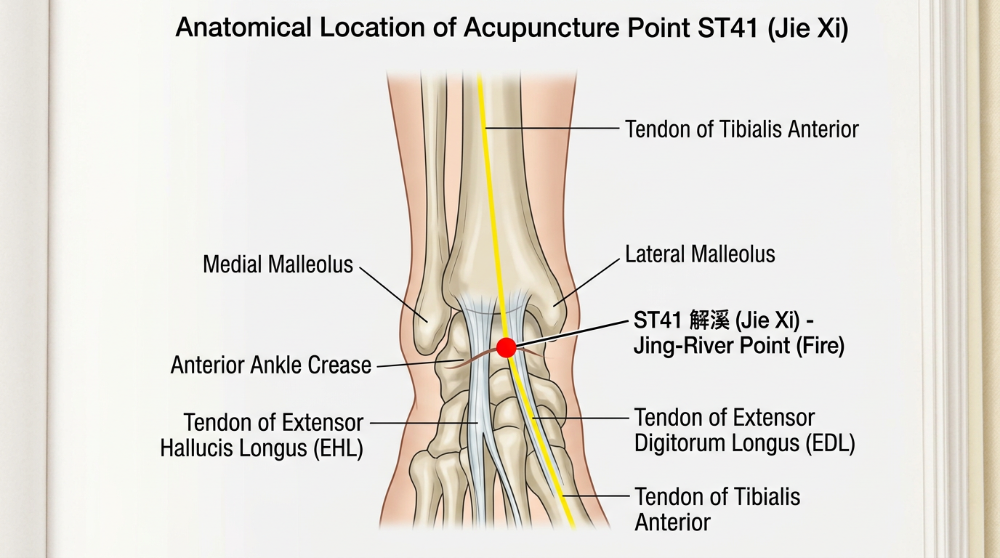

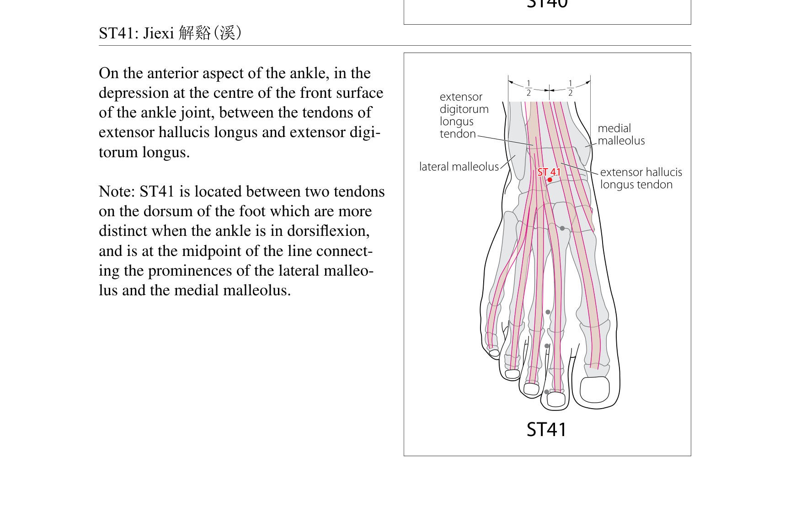

> **External References:** [AcuPoints](https://www.acupoints.org/st41-acupuncture-point/)

**דיקור**

* **זווית**: ניצבת, 90°
* **עומק**: 0.3-0.5 צון
* **תחושת דה-צ'י**: נימול, כאב מקומי

**פעולות והתוויות**

* **פעולות**: מפנה חום מקיבה וממעיים; מרגיע שן (רוח); מרגיע כאב קרסול; מועיל לראש
* **התוויות**: כאב ראש, סחרחורת, מאניה, כאב קרסול, נפיחות קרסול, עצירות מחום, כאב פנים
* **שילובים נפוצים**: ST41 + GB40 (כאב קרסול); ST41 + GV20 + LR3 (סחרחורת, כאב ראש)

***

#### ST42 — צ'ונג יאנג (冲阳)

**שם סיני**: 冲阳 (Chong Yang) **משמעות השם**: "פורץ היאנג" — מקום שבו דופק יאנג (של הקיבה) מורגש **קטגוריה מיוחדת**: נקודת יואן-מקור (原穴 Yuan Xue)

**מיקום אנטומי**

על גב הרגל, בנקודה הגבוהה ביותר של גב הרגל, 1.5 צון דיסטלית ל-ST41, בגומה שבין עצמות המטטרסל השנייה והשלישית ועצמות ה-Cuneiform.

**איך למצוא את הנקודה**

1. גששו את הנקודה הגבוהה ביותר של גב הרגל
2. גששו את דופק עורק ה-Dorsalis Pedis — הנקודה לטרלית לעורק
3. 1.5 צון דיסטלית ל-ST41

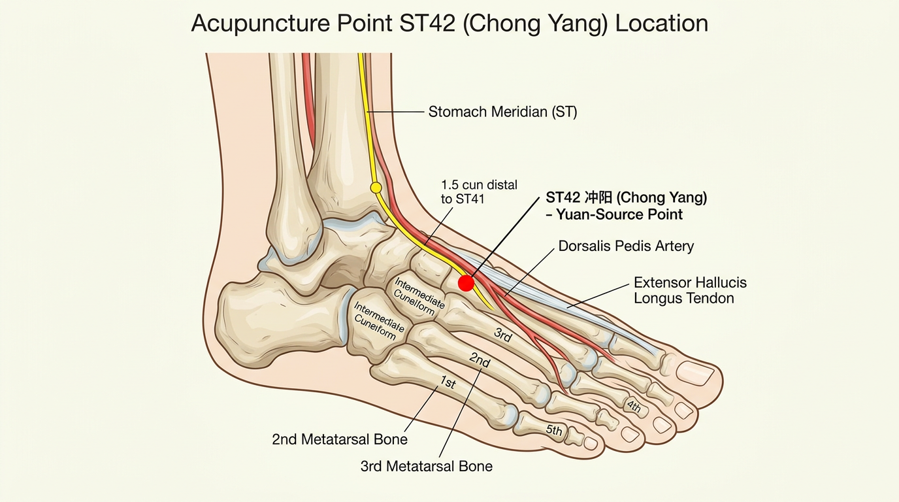

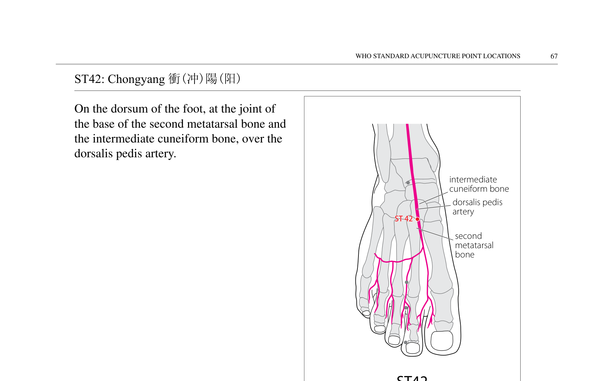

> **External References:** [AcuPoints](https://www.acupoints.org/st42-acupuncture-point/)

**דיקור**

* **זווית**: ניצבת, 90°
* **עומק**: 0.2-0.3 צון
* **⚠️ זהירות**: הימנעו מעורק ה-Dorsalis Pedis
* **תחושת דה-צ'י**: נימול מקומי

**פעולות והתוויות**

* **פעולות**: מחזק צ'י קיבה (כנקודת יואן); מרגיע שן; מפנה חום; מפיג נפיחות
* **התוויות**: כאב פנים, שיתוק פנים, כאב שיניים, נפיחות בפנים, כאב בגב הרגל, מאניה, אפילפסיה
* **שילובים נפוצים**: ST42 + LI4 (כאב שיניים ופנים); ST42 + SP3 (חיזוק עיכול)

***

#### ST43 — שיאן גו (陷谷)

**שם סיני**: 陷谷 (Xian Gu) **משמעות השם**: "עמק שוקע" — הגומה בין עצמות המטטרסל **קטגוריה מיוחדת**: נקודת שו-זרם (输穴 Shu Xue) — אלמנט עץ (木 Mu)

**מיקום אנטומי**

על גב הרגל, בגומה דיסטלית למפגש עצמות המטטרסל השנייה והשלישית, פרוקסימלית למפרק ה-MTP.

**איך למצוא את הנקודה**

1. אתרו את הגומה בין עצמות המטטרסל השנייה והשלישית
2. גששו לכיוון הקרסול עד שתגיעו למפגש העצמות
3. הנקודה בגומה שמיד דיסטלית למפגש

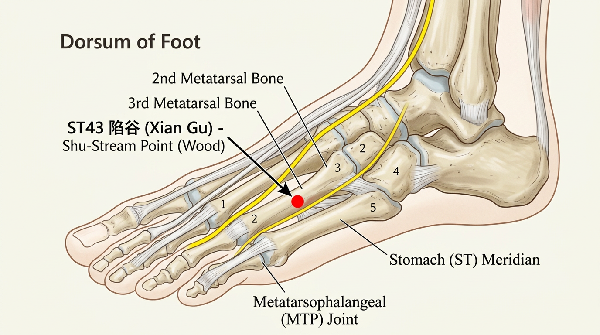

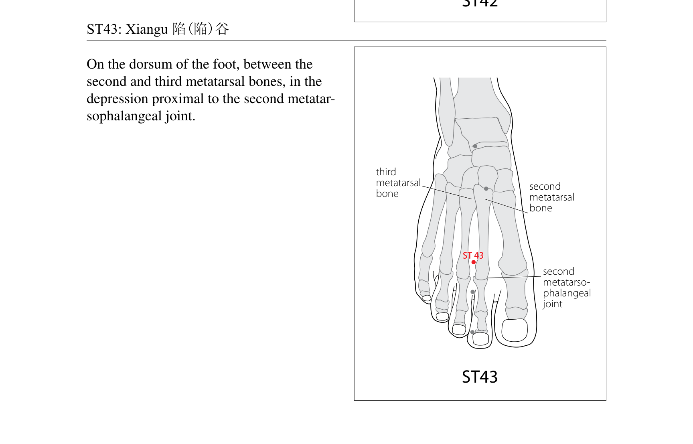

> **External References:** [AcuPoints](https://www.acupoints.org/st43-acupuncture-point/)

**דיקור**

* **זווית**: ניצבת, 90°
* **עומק**: 0.3-0.5 צון
* **תחושת דה-צ'י**: נימול, כבדות

**פעולות והתוויות**

* **פעולות**: מפנה חום; מפיג רטיבות; מפזר בצקות; מרגיע כאב פנים
* **התוויות**: בצקות בפנים ובעיניים, כאב בטן, בורבוריגמוס, כאב בגב הרגל, חום
* **שילובים נפוצים**: ST43 + SP9 + REN9 (בצקות); ST43 + ST44 (כאב ברגל)

***

#### ST44 — ניי טינג (内庭)

**שם סיני**: 内庭 (Nei Ting) **משמעות השם**: "חצר פנימית" — בכניסה (חצר) בין האצבעות **קטגוריה מיוחדת**: נקודת יינג-מעיין (荥穴 Ying Xue) — אלמנט מים (水 Shui)

**מיקום אנטומי**

על גב הרגל, בגומה דיסטלית למפרק ה-MTP של האצבע השנייה והשלישית, על הקרום (Web) בין האצבעות.

**איך למצוא את הנקודה**

1. אתרו את הקרום (Web) בין האצבע השנייה והשלישית ברגל
2. גששו את הגבול הפרוקסימלי של הקרום — מאחורי הקפל
3. הנקודה על הגבול בין העור הבהיר (כף) לעור הכהה (גב)

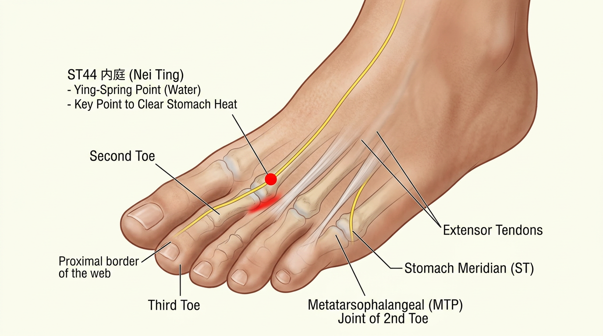

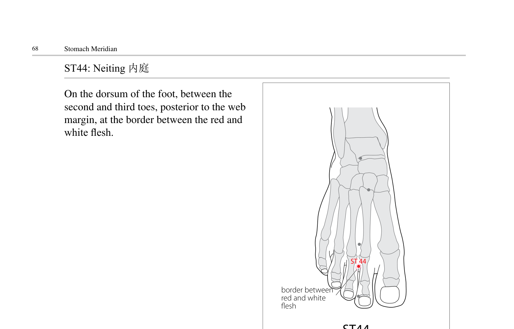

> **External References:** [AcuPoints](https://www.acupoints.org/st44-acupuncture-point/)

**דיקור**

* **זווית**: אלכסונית כלפי מעלה, 30-45°
* **עומק**: 0.3-0.5 צון
* **תחושת דה-צ'י**: כאב חד, נימול

**פעולות והתוויות**

* **פעולות**: מפנה חום מקיבה (**הנקודה המרכזית לפינוי חום-קיבה**); מרגיע כאב; מועיל לשיניים ולפנים; מווסת צ'י
* **כנקודת יינג-מעיין (מים)**: מצוינת לפינוי חום (מים מכבים אש)
* **התוויות**: כאב שיניים (**עם LI4 — שילוב מספר 1**), כאב פנים, דימום חניכיים, כאב גרון, דימום מהאף, כאב בטן, שלשול (חום-רטיבות), חום, חלומות מטרידים, כאב בגב הרגל
* **שילובים נפוצים**: ST44 + LI4 (כאב שיניים — שילוב קלאסי); ST44 + ST45 + LI4 (חום גבוה עם כאב שיניים); ST44 + PC6 + REN12 (חום בקיבה, בחילה)

***

#### ST45 — לי דואי (厉兑)

**שם סיני**: 厉兑 (Li Dui) **משמעות השם**: "החלפה חמורה" — נקודת הסיום שבה הצ'י מחליף ערוץ **קטגוריה מיוחדת**: נקודת ג'ינג-באר (井穴 Jing Xue) — אלמנט מתכת (金 Jin)

**מיקום אנטומי**

בצד הלטרלי של האצבע השנייה ברגל, כ-0.1 צון מפינת בסיס הציפורן.

**איך למצוא את הנקודה**

1. אתרו את ציפורן האצבע השנייה ברגל
2. הנקודה בפינה הלטרלית (צד חיצוני) של בסיס הציפורן
3. מדדו כ-0.1 צון (2 מ"מ) מפינת הציפורן

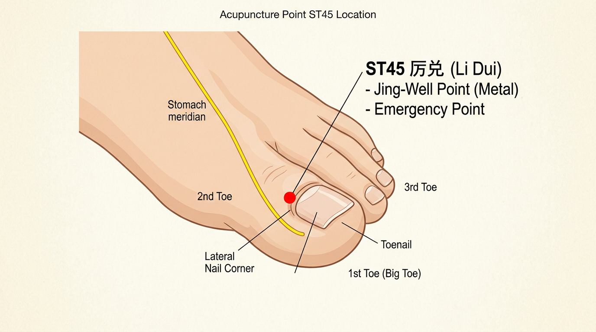

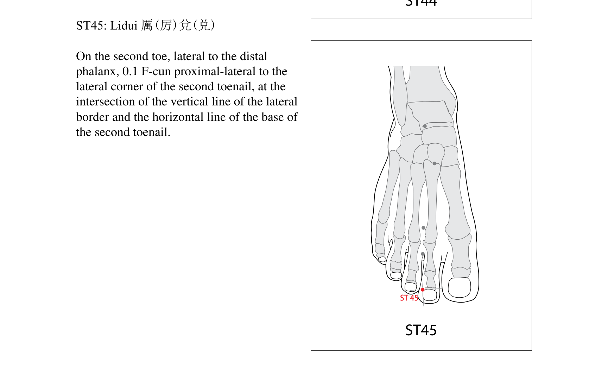

> **External References:** [AcuPoints](https://www.acupoints.org/st45-acupuncture-point/)

**דיקור**

* **שיטה**: בעיקר הוצאת דם (放血) עם מחט משולשת
* **עומק**: 0.1 צון
* **תחושת דה-צ'י**: כאב חד מקומי

**פעולות והתוויות**

* **פעולות**: מפנה חום; מרגיע שן; מחייה מאבדן הכרה; מועיל לפנים
* **כנקודת ג'ינג-באר**: משמשת למצבי חירום
* **התוויות**: חום גבוה, אובדן הכרה, מאניה, חלומות מטרידים ונדודי שינה, נפיחות בפנים, שיתוק פנים, דימום מהאף, כאב שיניים
* **שילובים נפוצים**: ST45 + DU26 (אובדן הכרה); ST45 + ST44 + LI4 (חום גבוה); ST45 + HT7 (נדודי שינה, חלומות)

***

### 9. סיכום קטגוריות הנקודות

| קטגוריה                  | נקודה | סינית | שימוש עיקרי                |
| ------------------------ | ----- | ----- | -------------------------- |
| ג'ינג-באר (Jing-Well)    | ST45  | 厉兑    | חירום, חום, אובדן הכרה     |
| יינג-מעיין (Ying-Spring) | ST44  | 内庭    | פינוי חום-קיבה, כאב שיניים |
| שו-זרם (Shu-Stream)      | ST43  | 陷谷    | בצקות, רטיבות              |
| ג'ינג-נהר (Jing-River)   | ST41  | 解溪    | חום, כאב ראש, קרסול        |
| הה-ים (He-Sea)           | ST36  | 足三里   | חיזוק עיכול, כל בעיות בטן  |
| יואן-מקור (Yuan-Source)  | ST42  | 冲阳    | חיזוק קיבה, מאניה          |
| לואו (Luo-Connecting)    | ST40  | 丰隆    | ליחה (כל סוג)              |
| שי-צלע (Xi-Cleft)        | ST34  | 梁丘    | כאב קיבה חריף, כאב ברך     |
| מו קדמית של מעי גס       | ST25  | 天枢    | בעיות מעי גס               |
| הה-ים תחתונה — מעי גס    | ST37  | 上巨虚   | בעיות מעי גס ישירות        |
| הה-ים תחתונה — מעי דק    | ST39  | 下巨虚   | בעיות מעי דק               |

***

### 10. חמש נקודות שו (五输穴) של ערוץ הקיבה

| סוג                        | נקודה | אלמנט    | כיוון הזרימה |
| -------------------------- | ----- | -------- | ------------ |
| ג'ינג-באר (井 Jing-Well)    | ST45  | מתכת (金) | הצ'י "נובע"  |
| יינג-מעיין (荥 Ying-Spring) | ST44  | מים (水)  | הצ'י "זורם"  |
| שו-זרם (输 Shu-Stream)      | ST43  | עץ (木)   | הצ'י "מתחזק" |
| ג'ינג-נהר (经 Jing-River)   | ST41  | אש (火)   | הצ'י "גדל"   |
| הה-ים (合 He-Sea)           | ST36  | אדמה (土) | הצ'י "מתאסף" |

***

### 11. תרגילים

#### תרגיל 1: מיקום נקודות מפתח

על רגל של שותף/ה, אתרו את הנקודות הבאות: א. ST36 (שתי שיטות) ב. ST35 (עם כפיפת ברך) ג. ST40 ד. ST44 ה. ST25 (על הבטן)

#### תרגיל 2: בחירת נקודות

מטופלת מגיעה עם: כאב קיבה כרוני, נפיחות אחרי אכילה, עייפות, שלשול. הלשון חיוורת עם ציפוי לבן. א. מהי האבחנה? ב. אילו נקודות מערוץ הקיבה תבחרו? ג. אילו נקודות מערוצים אחרים תוסיפו?

#### תרגיל 3: נקודות מיוחדות

הסבירו את ההבדל בשימוש בין: א. ST36 (הה-ים) לבין ST34 (שי-צלע) — מתי נשתמש בכל אחת? ב. ST37 (הה-ים תחתונה של מעי גס) לבין ST25 (מו של מעי גס) ג. ST40 (לואו) — מדוע היא כל כך חשובה לטיפול בליחה?

#### תרגיל 4: מקרה חריף

מטופל מגיע עם כאב שיניים חריף בלחי עליונה, חניכיים נפוחות ואדומות, צמא ונשימה עם ריח רע. א. מהי האבחנה הסינית? ב. בחרו 4-5 נקודות לטיפול מיידי ג. מהי הטכניקה ב-ST44 ובנקודות ג'ינג-באר?

***

### קריאה מומלצת

* Deadman, P. _A Manual of Acupuncture_ — ערוץ הקיבה
* Maciocia, G. _The Foundations of Chinese Medicine_ — פרק על הקיבה והטחול
* הואנג די ניי ג'ינג, לינג שו
* O'Connor, J. & Bensky, D. _Acupuncture: A Comprehensive Text_

***

> **נקודה למחשבה**: ערוץ הקיבה הוא הערוץ הארוך ביותר עם 45 נקודות, והוא עובר מהפנים ועד לאצבעות הרגל. כערוץ יאנג מינג, הוא עשיר בצ'י ובדם, מה שהופך אותו לערוץ חזק ורב-תכליתי. ST36 נחשבת לאחת מהנקודות החשובות ביותר באקופונקטורה כולה — "נקודת הבריאות" שמחזקת את הגוף כולו. ST40 היא הנקודה המרכזית לטיפול בליחה, ו-ST44 היא נקודת פינוי החום העיקרית של הערוץ. שליטה בערוץ הקיבה מקנה למטפל כלים רבים לטיפול במגוון רחב של מצבים.

***

### ניווט

* **הקודם**: [ערוץ המעי הגס (LI)](03-large-intestine.md) | **הבא**: [ערוץ הטחול (SP)](05-spleen-channel.md)
* **זוג פנים-חוץ**: [ערוץ הטחול (SP)](05-spleen-channel.md) — ערוץ הין הזוגי (אלמנט אדמה)
* **חזרה למודול**: [מודול 2 — מרידיאנים](./)
* **ראה גם**: [סינדרומי קיבה](../../year-2-intermediate/module-06b-syndromes/stomach-intestine-syndromes/01-stomach-qi-deficiency.md)
