# ערוץ שלפוחית השתן — BL (Zu Tai Yang Pang Guang Jing)

## Foot Tai Yang Bladder Channel (Zu Tai Yang Pang Guang Jing)

---

## מטרות למידה

בסיום שיעור זה, הסטודנט יוכל:

1. לתאר את מסלול ערוץ שלפוחית השתן — חיצוני ופנימי

2. לאתר את הנקודות המרכזיות (BL1-BL67) על הגוף

3. לתאר את פעולות כל נקודה מרכזית ואת התוויותיה

4. לבצע דיקור בטוח בכל נקודות הערוץ

5. להסביר את הקשר פנים-חוץ בין שלפוחית השתן (BL) לכליות (KI)

6. לזהות פתולוגיות נפוצות של ערוץ שלפוחית השתן

7. לזהות את כל נקודות השו-גב (Back-Shu) ואת הקשר שלהן לאיברי צאנג-פו

8. להשתמש בנקודות השו-גב בשילוב עם נקודות מו-קדמי לאבחון וטיפול

---

## 1. סקירת הערוץ

### 1.1 מידע כללי

| מאפיין | פרטים |

|---|---|

| שם סיני | (Zu Tai Yang Pang Guang Jing) |

| סוג | יאנג — טאי יאנג (Tai Yang) |

| גפה | רגל (Foot) |

| איבר | שלפוחית השתן (Pang Guang) |

| זוג פנים-חוץ | כליות (KI) — שאו ין |

| מספר נקודות | 67 (BL1-BL67) |

| שעת שיא | 15:00-17:00 |

| כיוון זרימה | מהעין הפנימית אל האצבע הקטנה ברגל |

| אלמנט | מים (Shui) |

### 1.2 מסלול הערוץ

#### מסלול פנימי (Nei Xing)

1. **נכנס לחלל הגולגולת** מאזור הקודקוד ומתחבר למוח

2. **יורד** ומתחבר לכליות (הזאנג המזווג)

3. **ממשיך** ומתחבר לשלפוחית השתן (האיבר עצמו)

#### מסלול חיצוני (Wai Xing)

1. **מתחיל** בזווית הפנימית של העין (Inner Canthus) — BL1

2. **עולה** על המצח ומגיע לקודקוד הראש

3. **ממשיך** לאורך העורף ויורד בחלק האחורי של הצוואר (BL10)

4. **מתפצל לשני ענפים** מקבילים בגב:

   - **ענף מדיאלי (ראשון)**: 1.5 צון לטרלית לקו האמצע האחורי — ערוץ השו-גב (Back-Shu), יורד לאורך כל עמוד השדרה (BL11-BL30)

   - **ענף לטרלי (שני)**: 3 צון לטרלית לקו האמצע האחורי — ערוץ הנפש (BL41-BL54)

5. **שני הענפים מתאחדים** באזור העכוז

6. **יורד** בחלק האחורי של הירך

7. **מגיע** לגומת הברך (Popliteal Fossa) — BL40

8. **יורד** בחלק האחורי של השוק דרך שריר הגסטרוקנמיוס (Gastrocnemius)

9. **עובר** מאחורי הקרסול החיצוני (Lateral Malleolus) — BL60

10. **ממשיך** לאורך הצד החיצוני של כף הרגל

11. **מסתיים** בפינה החיצונית של ציפורן האצבע הקטנה ברגל — BL67

### 1.3 תפקודי איבר שלפוחית השתן (Pang Guang)

- **אוגר ומפריש שתן** — שלפוחית השתן מקבלת נוזלים מהכליות ומפרישה שתן בהשפעת צ'י הכליות

- **שולט בצ'י הוואפוריזציה** (Qi Hua) — תהליך הפרדת הנוזלים הטהורים מהעכורים מתבצע בזכות יאנג הכליות

- **מזווג עם הכליות** — הכליות שולטות במים, שלפוחית השתן מפרישה אותם; שניהם שייכים לאלמנט המים

- **קשור לטאי יאנג** — הערוץ מגן על הגב כולו; טאי יאנג הוא "השער החיצוני" — השכבה הראשונה של ההגנה מפני גורמי מחלה חיצוניים

- **נושא את נקודות השו-גב** — כל נקודות ההשתקפות האחורית של האיברים הפנימיים נמצאות על הערוץ הזה

### 1.4 פתולוגיות נפוצות של הערוץ

- כאבי גב תחתון, גב עליון, צוואר ועורף

- כאבי ראש (אוקסיפיטלי — עורפי), סחרחורת

- בעיות עיניים — דמעות, אודם, טשטוש ראייה

- בעיות שתן — תכיפות, דלף, קושי במתן שתן

- הצטננות (פלישת רוח-קור לשכבת טאי יאנג)

- כאב ונוקשות לאורך עמוד השדרה

- כאב בירך אחורית, שוק, קרסול, כף רגל

- בעיות נפשיות-רגשיות (פחד, חוסר כוח רצון — דרך הקשר לכליות)

---

## 2. נקודות הערוץ — נקודות מפתח

---

> **WHO Standard Acupuncture Point Locations** (WHO, CC BY-NC-SA 3.0 IGO):
>
> 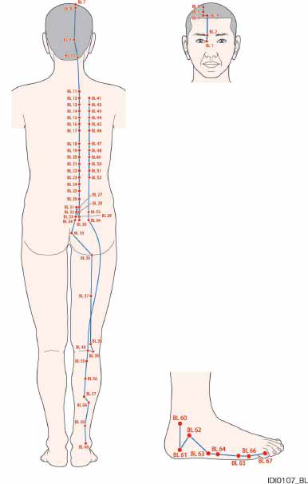

### BL1 — ג'ינג מינג

**שם סיני**: (Jing Ming)

**משמעות השם**: "אור העיניים" — נקודה שמאירה את העיניים ומשפרת ראייה

**קטגוריה מיוחדת**: נקודת מפגש של ערוצי טאי יאנג יד ורגל, יאנג מינג רגל, ין צ'יאו מאי ויאנג צ'יאו מאי

#### מיקום אנטומי

0.1 צון מדיאלית ומעל לזווית הפנימית של העין (Inner Canthus), בגומה שליד שורש האף.

#### איך מוצאים אותה

1. בקשו מהמטופל לשבת עם עיניים עצומות

2. אתרו את הזווית הפנימית של העין (הפינה הקרובה לאף)

3. גששו את הגומה הקטנה שנמצאת מעט מעל ומדיאלית (לכיוון האף) מפינת העין

4. הנקודה נמצאת בין דופן גלגל העין (Orbit) לבין שורש האף

5. **⚠️** הנקודה ממש ליד העין — נדרשת זהירות מרבית

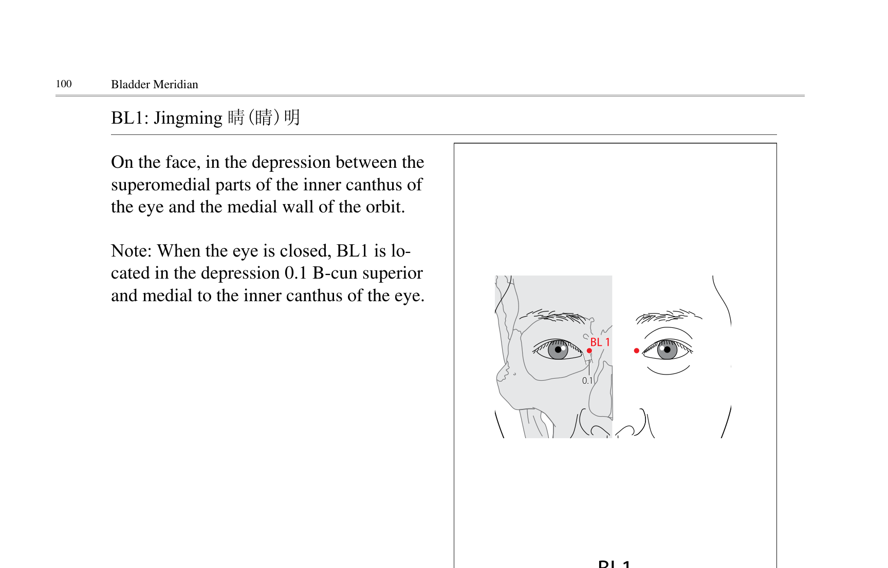

> **External References:** [AcuPoints](https://www.acupoints.org/bl1-acupuncture-point/)

#### דיקור

- **זווית**: ניצבת (Perpendicular), 90° — לאט ובעדינות לאורך דופן גלגל העין

- **עומק**: 0.3-0.5 צון

- **⚠️ זהירות**: אין להכניס ולהוציא את המחט במהירות. אין לסובב את המחט. בקשו מהמטופל לעצום עיניים ולהביט מטה. לחצו בעדינות לאחר הוצאת המחט למניעת המטומה (כחול)

- **תחושת דה-צ'י**: תחושת הקרנה מסביב לעין, דמעות קלות

#### פעולות והתוויות

- **פעולות**: מאיר את העיניים ומשפר ראייה; מגרש רוח ומפנה חום; עוצר דמעות

- **התוויות**: כל בעיות העיניים — קוצר ראייה, אודם, נפיחות, כאב, גלאוקומה, דמעות (ברוח), יובש עיניים, עיוורון לילה, ראייה מטושטשת

- **שילובים נפוצים**: BL1 + BL2 + GB20 (כאב ראש עם בעיות עיניים); BL1 + LR3 + GB37 (ראייה מטושטשת מעליית יאנג כבד)

---

### BL2 — צאן ג'ו

**שם סיני**: (Zan Zhu)

**משמעות השם**: "צרור הבמבוק" — הנקודה נמצאת בקצה המדיאלי של הגבה, שם שערות הגבה מתאספות כמו צרור במבוק

#### מיקום אנטומי

בקצה המדיאלי (פנימי) של הגבה, בשקע שמעל לזווית הפנימית של העין, על הנוטש הסופרה-אורביטלי (Supraorbital Notch).

#### איך מוצאים אותה

1. בקשו מהמטופל לשבת עם פנים אליכם

2. אתרו את קצה הגבה מצד האף — המקום שבו הגבה מתחילה

3. גששו את השקע הקטן (Notch) בקצה העצם שמעל העין (Supraorbital Ridge)

4. הנקודה נמצאת ישירות מעל BL1, בשקע של קצה הגבה המדיאלי

5. לחצו — הנקודה רגישה ואמורה לייצר תחושת הקרנה מעל העין

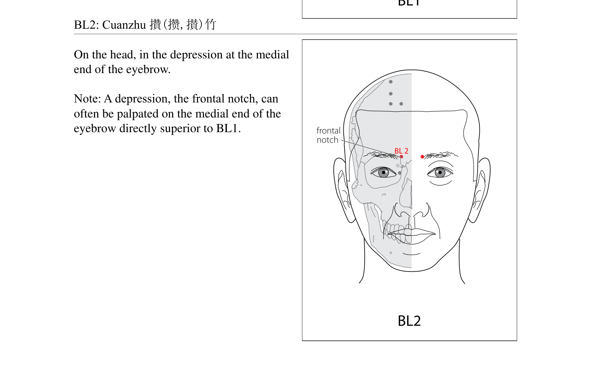

> **External References:** [AcuPoints](https://www.acupoints.org/bl2-acupuncture-point/)

#### דיקור

- **זווית**: אופקית — שטוחה כלפי מטה לכיוון BL1, או אופקית לטרלית לאורך הגבה

- **עומק**: 0.3-0.5 צון (הכנסה שטוחה מתחת לעור)

- **תחושת דה-צ'י**: כבדות מעל העין, נימול מקומי

#### פעולות והתוויות

- **פעולות**: מאיר את העיניים; מגרש רוח; מפנה חום; מרגיע כאב

- **התוויות**: כאב ראש חזיתי, כאב מעל העין (Supraorbital Pain), טשטוש ראייה, אודם בעין, דמעות, עוויות של עפעף (Tic), סינוסיטיס חזיתי

- **שילובים נפוצים**: BL2 + Yintang + GV23 (כאב ראש חזיתי); BL2 + GB14 + ST8 (כאב וכבדות במצח)

---

### BL10 — טיאן ג'ו

**שם סיני**: (Tian Zhu)

**משמעות השם**: "עמוד השמיים" — הצוואר הוא "העמוד" שתומך בראש (שמיים)

#### מיקום אנטומי

1.3 צון לטרלית לקו האמצע האחורי, בגובה GV15, על הגבול החיצוני של שריר הטרפזיוס (Trapezius), בשקע שמתחת לבליטה האוקסיפיטלית (Occiput).

#### איך מוצאים אותה

1. בקשו מהמטופל לשבת עם ראש מעט מורכן קדימה

2. אתרו את הבליטה האוקסיפיטלית (העצם הבולטת בבסיס הגולגולת מאחור)

3. גששו את שריר הטרפזיוס — השריר הגדול שיורד מהעורף לכתפיים

4. מצאו את הגבול החיצוני של השריר, מתחת לקו השיער האחורי

5. הנקודה נמצאת בשקע שבין שריר הטרפזיוס לשריר הסטרנוקליידומסטואיד (SCM), כ-1.3 צון לטרלית מקו האמצע

6. לחצו — אמורה להיות רגישות ותחושת הקרנה לראש

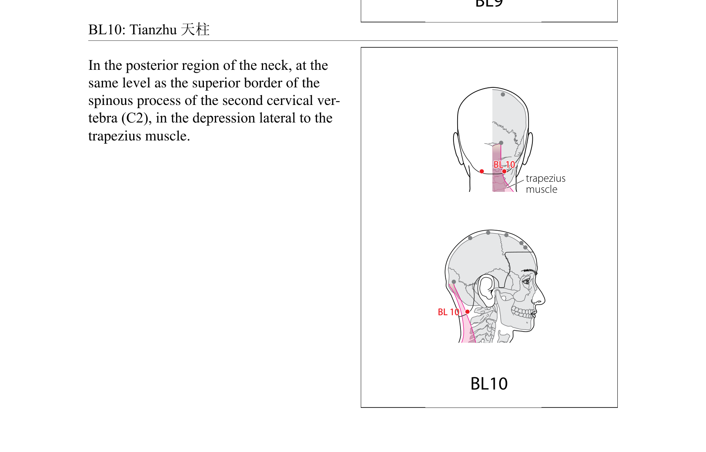

> **External References:** [AcuPoints](https://www.acupoints.org/bl10-acupuncture-point/)

#### דיקור

- **זווית**: ניצבת (Perpendicular) או מעט אלכסונית כלפי מטה, 90°

- **עומק**: 0.5-0.8 צון

- **⚠️ זהירות**: אין לדקור עמוק — קרבה לגזע המוח ולחוט השדרה

- **תחושת דה-צ'י**: כבדות מקומית, תחושת הקרנה לראש או לכתפיים

#### פעולות והתוויות

- **פעולות**: מגרש רוח; מועיל לראש ולעיניים; מחזק את הגב והצוואר; מפתח את שערי חוש הריח

- **התוויות**: כאב ראש עורפי, נוקשות צוואר, סחרחורת, כאב עיניים, גודש באף, כאב כתפיים וגב עליון

- **שילובים נפוצים**: BL10 + GB20 + GV16 (כאב ראש עורפי ונוקשות צוואר); BL10 + SI3 + BL62 (כאב עורף מרוח-קור)

---

### BL11 — דא ג'ו

**שם סיני**: (Da Zhu)

**משמעות השם**: "נול גדול" — הנקודה נמצאת ליד החוליה הבולטת כמו נול

**קטגוריה מיוחדת**: נקודת הוי של העצמות (Ba Hui Xue — Gu Hui Da Zhu); נקודת מפגש עם ערוץ המעי הדק (SI); נקודת ים של הדם (Sea of Blood)

#### מיקום אנטומי

1.5 צון לטרלית לקו האמצע האחורי, בגובה הגבול התחתון של התהליך הקוצני (Spinous Process) של חוליה T1.

#### איך מוצאים אותה

1. בקשו מהמטופל לשבת עם ראש מעט מורכן קדימה

2. אתרו את חוליה C7 (הבליטה הגדולה בבסיס הצוואר — "חוליה בולטת", Da Zhui, GV14)

3. ירדו חוליה אחת — זו T1

4. מדדו 1.5 צון (כ-2 אצבעות) לטרלית מקו האמצע

5. הנקודה נמצאת בשריר הטרפזיוס העליון ושריר הרומבואיד

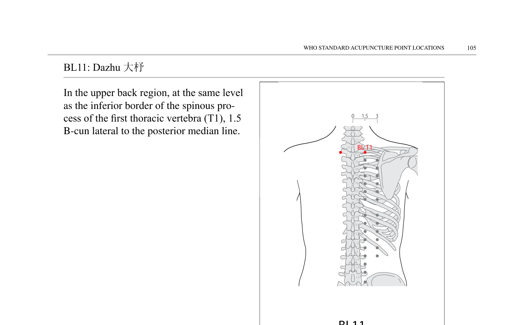

> **External References:** [AcuPoints](https://www.acupoints.org/bl11-acupuncture-point/)

#### דיקור

- **זווית**: אלכסונית (Oblique) 45° לכיוון עמוד השדרה, או ניצבת

- **עומק**: 0.5-0.8 צון

- **⚠️ זהירות**: אין לדקור עמוק — סכנת פנאומותורקס

- **תחושת דה-צ'י**: כבדות מקומית, הקרנה לכתף או לגב עליון

#### פעולות והתוויות

- **פעולות**: מחזק עצמות (**נקודת הוי של העצמות**); מגרש רוח ומשחרר שטח; מועיל לצוואר ולגב עליון; מווסת ריאות

- **התוויות**: כאב וגודש בצוואר ובגב עליון, נוקשות, שיעול, חום, כאבי עצמות, אוסטאופורוזיס, כאב ברכיים

- **שילובים נפוצים**: BL11 + GB39 (חיזוק עצמות ומוח עצם); BL11 + GV14 + LI4 (הצטננות עם כאב עורף)

---

### BL13 — פיי שו

**שם סיני**: (Fei Shu)

**משמעות השם**: "נקודת הובלה של הריאות" — נקודת השו-גב של הריאות

**קטגוריה מיוחדת**: נקודת שו-גב (Bei Shu Xue) של הריאות

#### מיקום אנטומי

1.5 צון לטרלית לקו האמצע האחורי, בגובה הגבול התחתון של התהליך הקוצני של חוליה T3.

#### איך מוצאים אותה

1. בקשו מהמטופל לשכב על הבטן או לשבת עם ראש מורכן קדימה

2. אתרו את חוליה C7 (הבליטה הגדולה בבסיס הצוואר)

3. ספרו 3 חוליות מטה — T1, T2, T3

4. מדדו 1.5 צון לטרלית מהתהליך הקוצני של T3

5. הנקודה נמצאת בין עמוד השדרה לשוליים המדיאליים של עצם השכם (Scapula)

6. לחצו — רגישות מיוחדת בקרב מטופלים עם בעיות ריאה

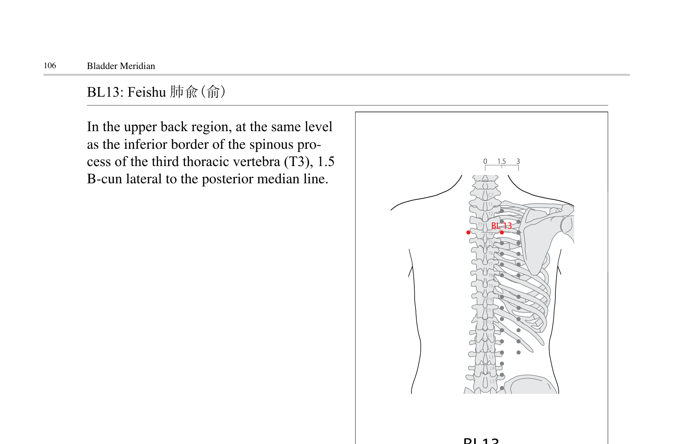

> **External References:** [AcuPoints](https://www.acupoints.org/bl13-acupuncture-point/)

#### דיקור

- **זווית**: אלכסונית (Oblique) 45° לכיוון עמוד השדרה

- **עומק**: 0.5-0.8 צון

- **⚠️ זהירות**: אין לדקור עמוק — סכנת פנאומותורקס

- **תחושת דה-צ'י**: כבדות והקרנה מקומית, לעתים תחושה שמתפשטת לחזה

#### פעולות והתוויות

- **פעולות**: מחזק ומווסת צ'י ריאות; מזין ין ריאות; משחרר שטח; מפנה חום מהריאות; עוצר שיעול

- **התוויות**: שיעול (כל סוג), אסתמה, קוצר נשימה, שחפת, הזעות לילה, חום אחר הצהריים, כאב גב עליון, בעיות עור

- **שילובים נפוצים**: BL13 + LU9 (חיזוק צ'י ריאות); BL13 + LU7 + LI4 (הצטננות); BL13 + KI6 (ין ריאות — שיעול יבש); BL13 + LU1 (מו-שו שילוב לריאות)

---

### BL14 — ג'יואה ין שו

**שם סיני**: (Jue Yin Shu)

**משמעות השם**: "נקודת הובלה של ג'יואה ין" — נקודת השו-גב של הפריקרד

**קטגוריה מיוחדת**: נקודת שו-גב של הפריקרד (Xin Bao)

#### מיקום אנטומי

1.5 צון לטרלית לקו האמצע האחורי, בגובה הגבול התחתון של התהליך הקוצני של חוליה T4.

#### איך מוצאים אותה

1. אתרו את חוליה T3 (כמו ב-BL13)

2. ירדו חוליה אחת נוספת — T4

3. מדדו 1.5 צון לטרלית מקו האמצע

4. הנקודה נמצאת חוליה אחת מתחת ל-BL13

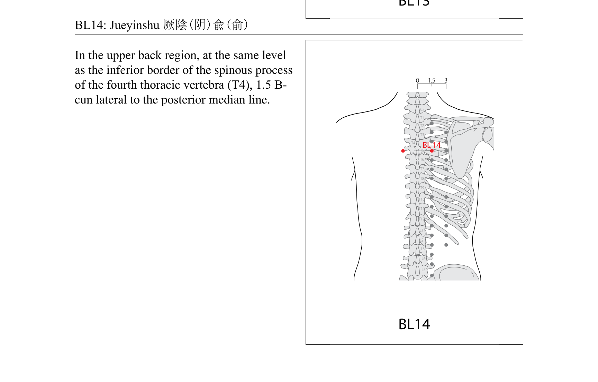

> **External References:** [AcuPoints](https://www.acupoints.org/bl14-acupuncture-point/)

#### דיקור

- **זווית**: אלכסונית (Oblique) 45° לכיוון עמוד השדרה

- **עומק**: 0.5-0.8 צון

- **⚠️ זהירות**: אין לדקור עמוק — סכנת פנאומותורקס

- **תחושת דה-צ'י**: כבדות מקומית, לעתים תחושת הקרנה לחזה

#### פעולות והתוויות

- **פעולות**: מווסת צ'י לב; מרחיב את החזה; מרגיע את הרוח (Shen)

- **התוויות**: כאב בחזה, דפיקות לב, חרדה, תחושת לחץ בחזה, שיעול, הקאות

- **שילובים נפוצים**: BL14 + PC6 (כאב בחזה ודפיקות לב); BL14 + BL15 + HT7 (חרדה ונדודי שינה)

---

### BL15 — שין שו

**שם סיני**: (Xin Shu)

**משמעות השם**: "נקודת הובלה של הלב" — נקודת השו-גב של הלב

**קטגוריה מיוחדת**: נקודת שו-גב של הלב

#### מיקום אנטומי

1.5 צון לטרלית לקו האמצע האחורי, בגובה הגבול התחתון של התהליך הקוצני של חוליה T5.

#### איך מוצאים אותה

1. אתרו את חוליה T3 (BL13)

2. ספרו 2 חוליות מטה — T4 (BL14), T5 (BL15)

3. מדדו 1.5 צון לטרלית מקו האמצע

4. הנקודה נמצאת בקירוב בגובה השוליים המדיאליים של עצם השכם

5. **שיטת ייחוס**: קו הגבה התחתון (Inferior Angle of Scapula) הוא בגובה T7 — ספרו 2 חוליות מעלה

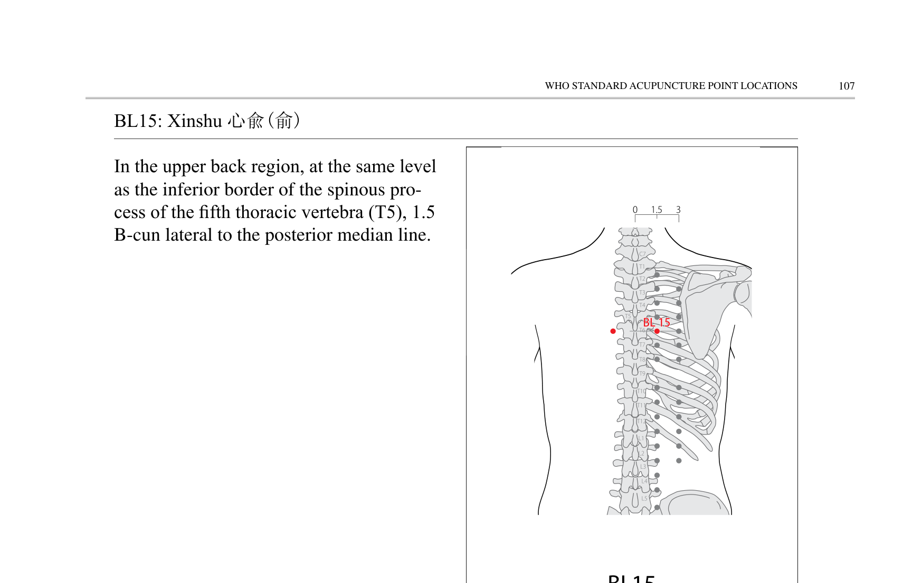

> **External References:** [AcuPoints](https://www.acupoints.org/bl15-acupuncture-point/)

#### דיקור

- **זווית**: אלכסונית (Oblique) 45° לכיוון עמוד השדרה

- **עומק**: 0.5-0.8 צון

- **⚠️ זהירות**: אין לדקור עמוק — סכנת פנאומותורקס

- **תחושת דה-צ'י**: כבדות מקומית, לעתים תחושה שמתפשטת לחזה הקדמי

#### פעולות והתוויות

- **פעולות**: מחזק ומווסת צ'י ודם הלב; מזין ין לב; מרגיע את השן (Shen); מפנה חום לב; מרגיע את הרוח

- **התוויות**: דפיקות לב, כאב בחזה, נדודי שינה, חרדה, אפילפסיה, מאניה, שכחנות, הזעות לילה, שיעול דם, חלומות רבים

- **שילובים נפוצים**: BL15 + HT7 (נדודי שינה, חרדה); BL15 + PC6 + REN14 (כאב בחזה ודפיקות); BL15 + BL44 (שן מוטרד — בעיות רגשיות עמוקות); BL15 + REN14 (מו-שו שילוב ללב)

---

### BL17 — גה שו

**שם סיני**: (Ge Shu)

**משמעות השם**: "נקודת הובלה של הסרעפת" — נקודה בגובה הסרעפת

**קטגוריה מיוחדת**: נקודת הוי של הדם (Ba Hui Xue — Xue Hui Ge Shu)

#### מיקום אנטומי

1.5 צון לטרלית לקו האמצע האחורי, בגובה הגבול התחתון של התהליך הקוצני של חוליה T7.

#### איך מוצאים אותה

1. בקשו מהמטופל לשכב על הבטן

2. אתרו את הפינה התחתונה של עצם השכם (Inferior Angle of Scapula) — היא בגובה T7

3. מדדו 1.5 צון לטרלית מהתהליך הקוצני של T7

4. הנקודה נמצאת בין שני השכמות, בגובה הסרעפת

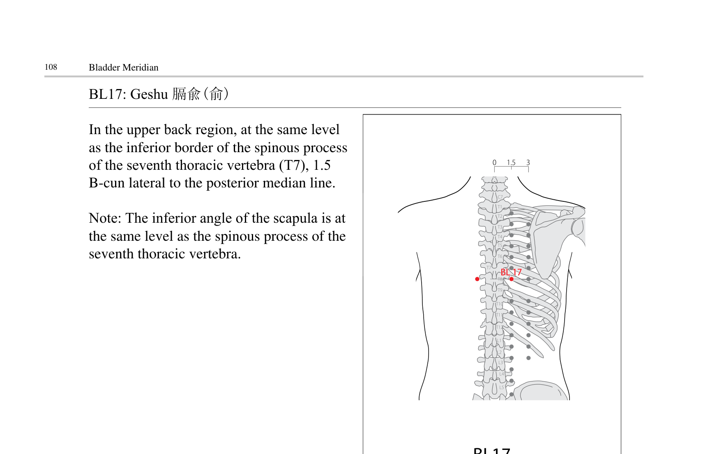

> **External References:** [AcuPoints](https://www.acupoints.org/bl17-acupuncture-point/)

#### דיקור

- **זווית**: אלכסונית (Oblique) 45° לכיוון עמוד השדרה

- **עומק**: 0.5-0.8 צון

- **⚠️ זהירות**: אין לדקור עמוק — סכנת פנאומותורקס

- **תחושת דה-צ'י**: כבדות מקומית, לעתים תחושה באזור הסרעפת

#### פעולות והתוויות

- **פעולות**: מזין ומווסת דם (**נקודת הוי של הדם**); מקרר דם חום; מפנה סטגנציית דם; הופך צ'י מורד (שיהוק, הקאות); מרמוניז את הסרעפת

- **התוויות**: כל בעיות הדם — אנמיה, דימום, סטגנציית דם, דם חם; שיהוק, הקאות, קושי בבליעה, אסתמה, הזעות לילה, עייפות כרונית, אורטיקריה

- **שילובים נפוצים**: BL17 + SP10 + SP6 (מזין דם — אנמיה); BL17 + BL20 + ST36 (חיזוק ייצור דם); BL17 + LR3 (סטגנציית דם); BL17 + REN12 + PC6 (שיהוק, הקאות)

---

### BL18 — גאן שו

**שם סיני**: (Gan Shu)

**משמעות השם**: "נקודת הובלה של הכבד" — נקודת השו-גב של הכבד

**קטגוריה מיוחדת**: נקודת שו-גב של הכבד

#### מיקום אנטומי

1.5 צון לטרלית לקו האמצע האחורי, בגובה הגבול התחתון של התהליך הקוצני של חוליה T9.

#### איך מוצאים אותה

1. אתרו את הפינה התחתונה של עצם השכם (T7)

2. ספרו 2 חוליות מטה — T8, T9

3. מדדו 1.5 צון לטרלית מהתהליך הקוצני של T9

4. לחצו — רגישות מיוחדת בקרב מטופלים עם סטגנציית צ'י כבד

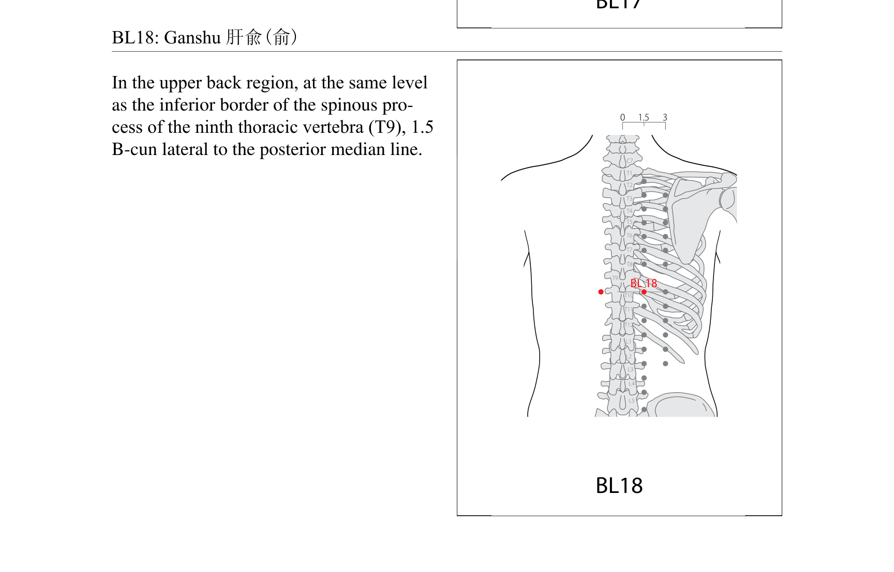

> **External References:** [AcuPoints](https://www.acupoints.org/bl18-acupuncture-point/)

#### דיקור

- **זווית**: אלכסונית (Oblique) 45° לכיוון עמוד השדרה

- **עומק**: 0.5-0.8 צון

- **⚠️ זהירות**: אין לדקור עמוק — קרבה לאיברים פנימיים

- **תחושת דה-צ'י**: כבדות מקומית, הקרנה לצלעות

#### פעולות והתוויות

- **פעולות**: מווסת צ'י כבד; מזין דם כבד ומזין ין כבד; מועיל לעיניים; מגרש רוח; מפנה דם חום ורטיבות-חום

- **התוויות**: כאב בצלעות (היפוכונדריום), סטגנציית צ'י כבד, כעס, דיכאון, מרירות בפה, בעיות עיניים (טשטוש, יובש), סחרחורת, כאב ראש צידי, ליקוי ראייה, צהבת, ספסמים ועוויתות

- **שילובים נפוצים**: BL18 + LR3 + LR14 (סטגנציית צ'י כבד); BL18 + GB34 + BL19 (כבד-מרה — מרירות, צהבת); BL18 + BL17 + SP6 (חיזוק דם כבד); BL18 + BL23 (ין כבד-כליות)

---

### BL19 — דאן שו

**שם סיני**: (Dan Shu)

**משמעות השם**: "נקודת הובלה של כיס המרה" — נקודת השו-גב של כיס המרה

**קטגוריה מיוחדת**: נקודת שו-גב של כיס המרה

#### מיקום אנטומי

1.5 צון לטרלית לקו האמצע האחורי, בגובה הגבול התחתון של התהליך הקוצני של חוליה T10.

#### איך מוצאים אותה

1. אתרו את T9 (BL18)

2. ירדו חוליה אחת — T10

3. מדדו 1.5 צון לטרלית מקו האמצע

4. הנקודה נמצאת חוליה אחת מתחת ל-BL18

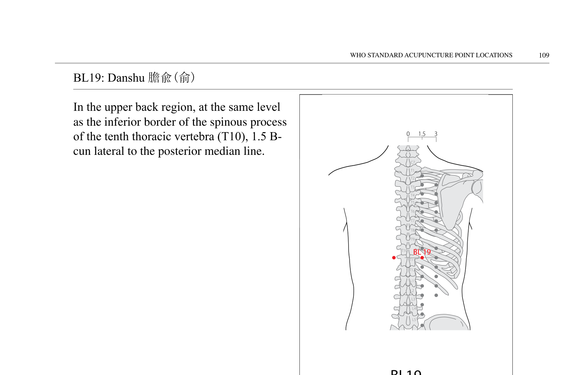

> **External References:** [AcuPoints](https://www.acupoints.org/bl19-acupuncture-point/)

#### דיקור

- **זווית**: אלכסונית (Oblique) 45° לכיוון עמוד השדרה

- **עומק**: 0.5-0.8 צון

- **תחושת דה-צ'י**: כבדות מקומית

#### פעולות והתוויות

- **פעולות**: מפנה רטיבות-חום מכבד ומרה; מרמוניז את הג'יאו האמצעי; מועיל למרה

- **התוויות**: צהבת, מרירות בפה, כאב בצלעות, בחילה, הקאות, חום וצמרמורות לסירוגין, אבני מרה

- **שילובים נפוצים**: BL19 + GB34 + BL18 (בעיות כבד-מרה); BL19 + GB24 (מו-שו שילוב למרה); BL19 + Yintang (קושי בהחלטות — כיס המרה שולט בהחלטיות)

---

### BL20 — פי שו

**שם סיני**: (Pi Shu)

**משמעות השם**: "נקודת הובלה של הטחול" — נקודת השו-גב של הטחול

**קטגוריה מיוחדת**: נקודת שו-גב של הטחול

#### מיקום אנטומי

1.5 צון לטרלית לקו האמצע האחורי, בגובה הגבול התחתון של התהליך הקוצני של חוליה T11.

#### איך מוצאים אותה

1. אתרו את L2 (גובה הקצה התחתון של הצלעות — Costal Margin)

2. ספרו 3 חוליות מעלה — L1, T12, T11

3. מדדו 1.5 צון לטרלית מהתהליך הקוצני של T11

4. לחלופין: מצאו את הפינה התחתונה של עצם השכם (T7) וספרו 4 חוליות מטה

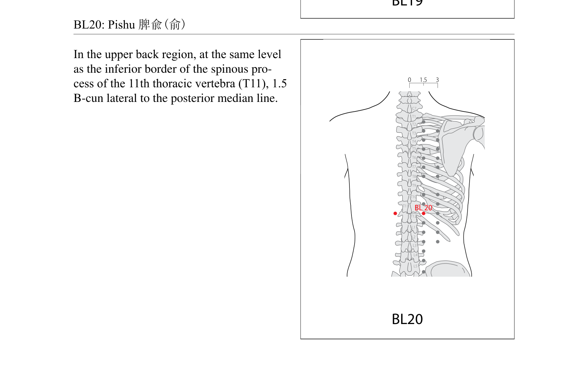

> **External References:** [AcuPoints](https://www.acupoints.org/bl20-acupuncture-point/)

#### דיקור

- **זווית**: אלכסונית (Oblique) 45° לכיוון עמוד השדרה

- **עומק**: 0.5-1.0 צון

- **תחושת דה-צ'י**: כבדות מקומית, לעתים תחושת חום עמומה

#### פעולות והתוויות

- **פעולות**: מחזק צ'י טחול; מועיל לעיכול; מרים צ'י (מונע צניחה); מפנה רטיבות; מזין דם (הטחול מייצר דם); מחזק שרירים

- **התוויות**: חולשת עיכול, שלשולים כרוניים, נפיחות, חוסר תיאבון, עייפות, אנמיה, דימום (הטחול לא מחזיק דם), בצקות, צניחת איברים (רחם, חלחולת), ליחה

- **שילובים נפוצים**: BL20 + ST36 + SP3 (חיזוק צ'י טחול); BL20 + BL21 (טחול-קיבה); BL20 + BL17 + ST36 (חיזוק ייצור דם); BL20 + LR13 (מו-שו שילוב לטחול); BL20 + REN6 + SP6 (רטיבות כרונית)

---

### BL21 — ווי שו

**שם סיני**: (Wei Shu)

**משמעות השם**: "נקודת הובלה של הקיבה" — נקודת השו-גב של הקיבה

**קטגוריה מיוחדת**: נקודת שו-גב של הקיבה

#### מיקום אנטומי

1.5 צון לטרלית לקו האמצע האחורי, בגובה הגבול התחתון של התהליך הקוצני של חוליה T12.

#### איך מוצאים אותה

1. אתרו את T11 (BL20)

2. ירדו חוליה אחת — T12

3. מדדו 1.5 צון לטרלית מקו האמצע

4. הנקודה נמצאת חוליה אחת מתחת ל-BL20

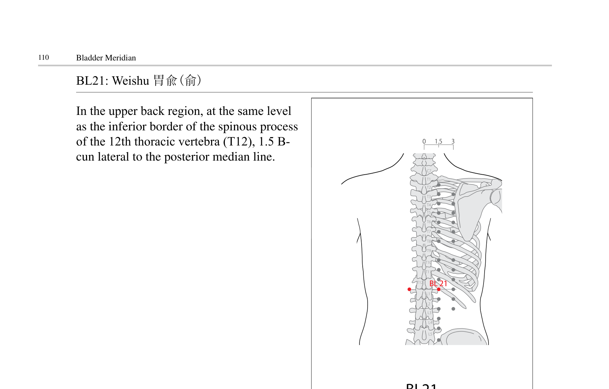

> **External References:** [AcuPoints](https://www.acupoints.org/bl21-acupuncture-point/)

#### דיקור

- **זווית**: אלכסונית (Oblique) 45° או ניצבת

- **עומק**: 0.5-1.0 צון

- **תחושת דה-צ'י**: כבדות מקומית, לעתים תחושה באזור הקיבה

#### פעולות והתוויות

- **פעולות**: מחזק ומרמוניז את הקיבה; מווסת צ'י קיבה; מפנה רטיבות

- **התוויות**: כאב בטן, בחילה, הקאות, שלשולים, חוסר תיאבון, נפיחות, גסטריטיס, כיב קיבה

- **שילובים נפוצים**: BL21 + REN12 + ST36 (חיזוק קיבה); BL21 + BL20 (טחול-קיבה — בסיס העיכול); BL21 + REN12 (מו-שו שילוב לקיבה); BL21 + PC6 (בחילה והקאות)

---

### BL22 — סאן ג'יאו שו

**שם סיני**: (San Jiao Shu)

**משמעות השם**: "נקודת הובלה של שלוש המחממות" — נקודת השו-גב של הסאן ג'יאו

**קטגוריה מיוחדת**: נקודת שו-גב של הסאן ג'יאו (Triple Energizer)

#### מיקום אנטומי

1.5 צון לטרלית לקו האמצע האחורי, בגובה הגבול התחתון של התהליך הקוצני של חוליה L1.

#### איך מוצאים אותה

1. אתרו את T12 (BL21)

2. ירדו חוליה אחת — L1 (החוליה המותנית הראשונה)

3. מדדו 1.5 צון לטרלית מקו האמצע

4. **שיטת ייחוס**: L2 הוא בגובה הקצה התחתון של הצלעות; L1 נמצא חוליה אחת מעל

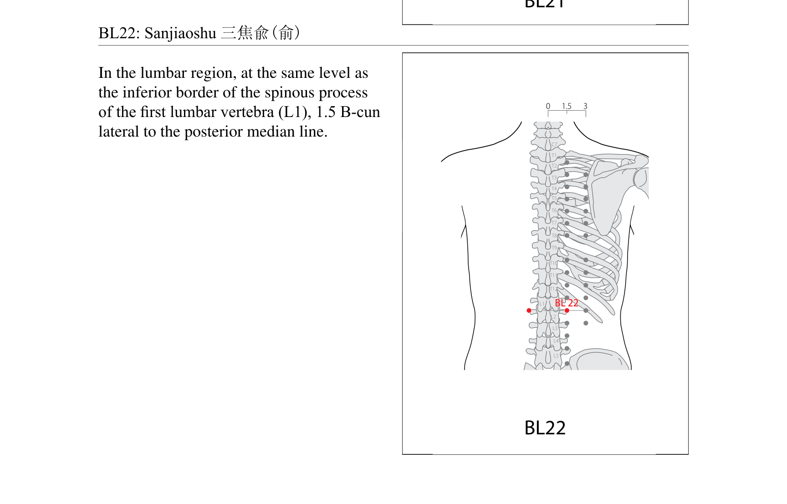

> **External References:** [AcuPoints](https://www.acupoints.org/bl22-acupuncture-point/)

#### דיקור

- **זווית**: ניצבת (Perpendicular) 90°

- **עומק**: 0.8-1.2 צון

- **תחושת דה-צ'י**: כבדות מקומית, הקרנה לגב תחתון

#### פעולות והתוויות

- **פעולות**: מווסת את מסלול המים; מפנה רטיבות; מחזק את מנגנון הצ'י הוואפוריזציה; מרמוניז את שלוש המחממות

- **התוויות**: בצקות, קושי במתן שתן, שלשולים, בחילה, נפיחות, כאב גב תחתון, בורבוריגמוס (רעשי מעיים)

- **שילובים נפוצים**: BL22 + REN5 (מו-שו שילוב לסאן ג'יאו); BL22 + SP9 + SP6 (בצקות ורטיבות); BL22 + BL23 (כליות וסאן ג'יאו — מטבוליזם של מים)

---

### BL23 — שן שו

**שם סיני**: (Shen Shu)

**משמעות השם**: "נקודת הובלה של הכליות" — נקודת השו-גב של הכליות

**קטגוריה מיוחדת**: נקודת שו-גב של הכליות

#### מיקום אנטומי

1.5 צון לטרלית לקו האמצע האחורי, בגובה הגבול התחתון של התהליך הקוצני של חוליה L2.

#### איך מוצאים אותה

1. בקשו מהמטופל לשכב על הבטן

2. אתרו את קו המותניים (הקו המחבר את הקצוות העליונים של עצמות הכסל — Iliac Crests) — גובה L4

3. ספרו 2 חוליות מעלה — L3, L2

4. מדדו 1.5 צון לטרלית מהתהליך הקוצני של L2

5. לחלופין: הקצה התחתון של הצלעות (Costal Margin) הוא בקירוב בגובה L2

6. הנקודה נמצאת בשריר ה-Erector Spinae — ליחצו ותרגישו רגישות עמוקה

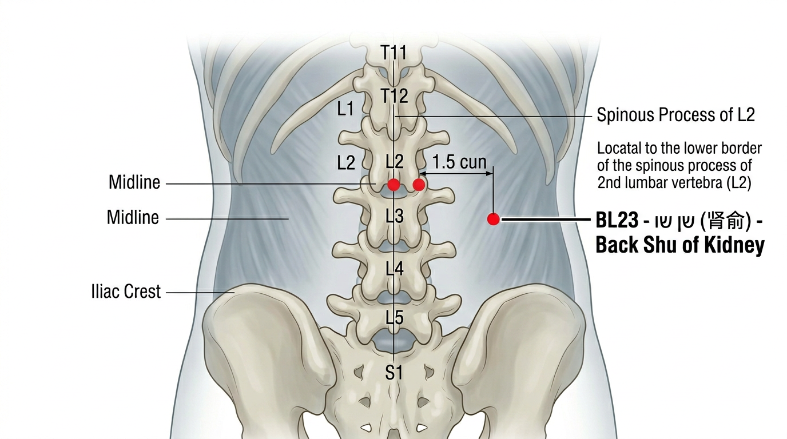

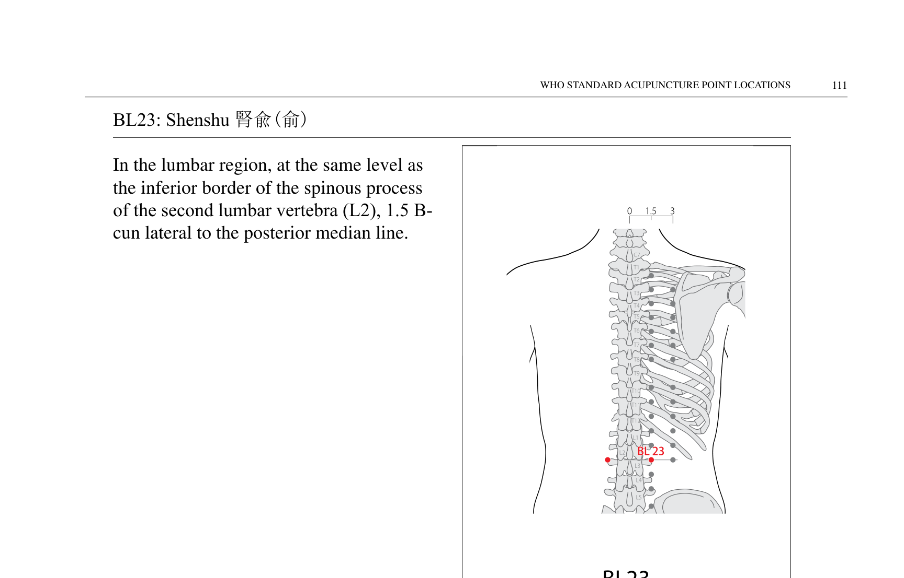

> **External References:** [AcuPoints](https://www.acupoints.org/bl23-acupuncture-point/)

#### דיקור

- **זווית**: ניצבת (Perpendicular) 90°

- **עומק**: 0.8-1.5 צון

- **תחושת דה-צ'י**: כבדות עמוקה, חום מקומי, לעתים הקרנה לגב תחתון או לעכוז

#### פעולות והתוויות

- **פעולות**: מחזק כליות — יאנג, ין, צ'י וג'ינג (**הנקודה המרכזית ביותר לכליות**); מחזק גב תחתון וברכיים; מועיל לאוזניים ולעצמות; מווסת מסלול המים; מעגן צ'י

- **התוויות**: כאב גב תחתון (נקודת המפתח), חולשת ברכיים, טינטון (צפצופים באוזניים), חירשות, סחרחורת, אימפוטנציה, עקרות, תכיפות/הרטבת לילה, הזעות לילה, שיער מאפיר מוקדם, אוסטאופורוזיס, עייפות כרונית, חולשת זיכרון

- **שילובים נפוצים**: BL23 + GV4 + REN4 (חיזוק יאנג כליות — "מדורת החיים"); BL23 + KI3 (חיזוק ין כליות); BL23 + BL52 (חיזוק כוח הרצון — ג'י); BL23 + GB25 (מו-שו שילוב לכליות); BL23 + ST36 + SP6 (חיזוק כליות וטחול); BL23 + BL40 (כאב גב תחתון)

---

### BL25 — דא צ'אנג שו

**שם סיני**: (Da Chang Shu)

**משמעות השם**: "נקודת הובלה של המעי הגס" — נקודת השו-גב של המעי הגס

**קטגוריה מיוחדת**: נקודת שו-גב של המעי הגס

#### מיקום אנטומי

1.5 צון לטרלית לקו האמצע האחורי, בגובה הגבול התחתון של התהליך הקוצני של חוליה L4.

#### איך מוצאים אותה

1. אתרו את קו המותניים (קו הכסל — Iliac Crest Line) — גובה L4

2. גששו את התהליך הקוצני של L4

3. מדדו 1.5 צון לטרלית מקו האמצע

4. הנקודה נמצאת בגובה הגומות שבגב התחתון (Dimples of Venus)

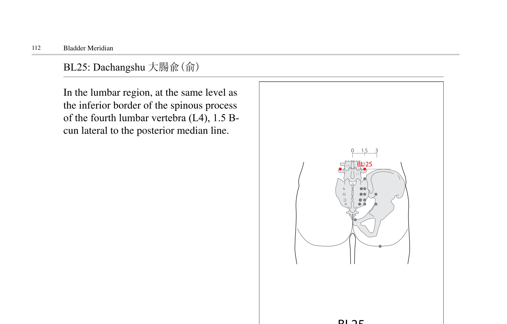

> **External References:** [AcuPoints](https://www.acupoints.org/bl25-acupuncture-point/)

#### דיקור

- **זווית**: ניצבת (Perpendicular) 90°

- **עומק**: 0.8-1.2 צון

- **תחושת דה-צ'י**: כבדות מקומית, לעתים הקרנה לעכוז או לרגל

#### פעולות והתוויות

- **פעולות**: מווסת מעי גס; מחזק גב תחתון; מפנה רטיבות-חום מהמעיים

- **התוויות**: כאב גב תחתון, עצירות, שלשולים, נפיחות, דלקת מעיים, דיזנטריה, כאב בטן תחתונה, טחורים

- **שילובים נפוצים**: BL25 + ST25 (מו-שו שילוב למעי גס); BL25 + ST37 (עצירות או שלשולים); BL25 + BL23 + GV3 (כאב גב תחתון)

---

### BL27 — שיאו צ'אנג שו

**שם סיני**: (Xiao Chang Shu)

**משמעות השם**: "נקודת הובלה של המעי הדק" — נקודת השו-גב של המעי הדק

**קטגוריה מיוחדת**: נקודת שו-גב של המעי הדק

#### מיקום אנטומי

1.5 צון לטרלית לקו האמצע האחורי, בגובה חור הסקרום הראשון (First Posterior Sacral Foramen), בגובה S1.

#### איך מוצאים אותה

1. אתרו את L4 (BL25) — קו הכסל

2. ירדו 2 חוליות — L5, S1

3. גששו את החור הראשון בעצם הסקרום (First Sacral Foramen)

4. מדדו 1.5 צון לטרלית מקו האמצע

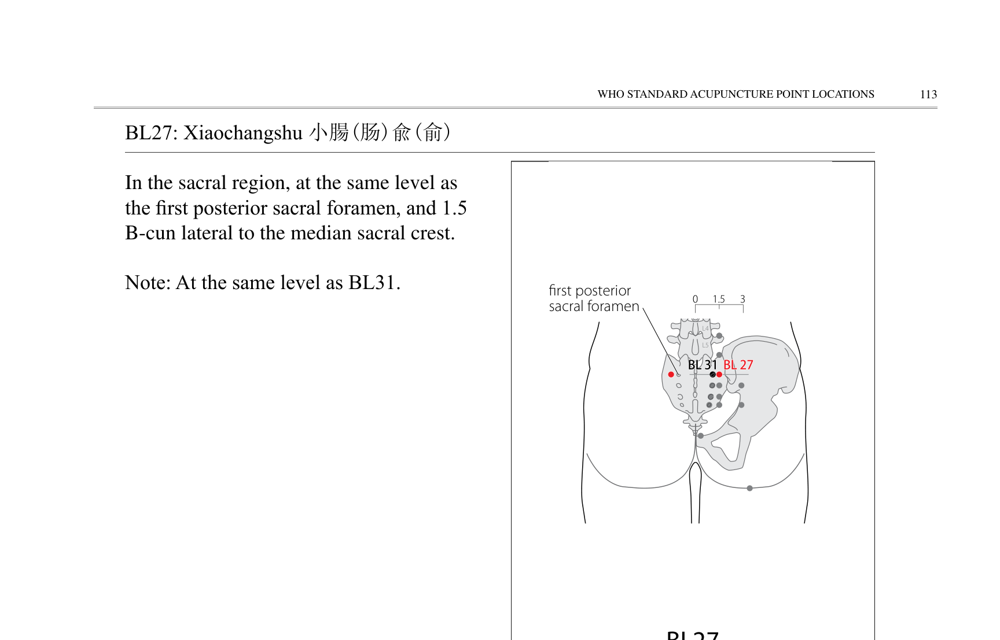

> **External References:** [AcuPoints](https://www.acupoints.org/bl27-acupuncture-point/)

#### דיקור

- **זווית**: ניצבת (Perpendicular) 90° או מעט אלכסונית

- **עומק**: 0.8-1.2 צון

- **תחושת דה-צ'י**: כבדות מקומית, הקרנה לעכוז

#### פעולות והתוויות

- **פעולות**: מועיל למעי הדק; מפריד טהור מעכור; מפנה רטיבות-חום; מחזק גב תחתון

- **התוויות**: כאב בטן תחתונה, שלשולים, דיזנטריה, דימום מהחלחולת, הרטבת לילה, תכיפות שתן, כאב גב תחתון, סקרואיליטיס

- **שילובים נפוצים**: BL27 + REN4 (מו-שו שילוב למעי דק); BL27 + ST39 (בעיות מעי דק); BL27 + BL28 (בעיות שתן וגב תחתון)

---

### BL28 — פאנג גואנג שו

**שם סיני**: (Pang Guang Shu)

**משמעות השם**: "נקודת הובלה של שלפוחית השתן" — נקודת השו-גב של שלפוחית השתן

**קטגוריה מיוחדת**: נקודת שו-גב של שלפוחית השתן

#### מיקום אנטומי

1.5 צון לטרלית לקו האמצע האחורי, בגובה חור הסקרום השני (Second Posterior Sacral Foramen), בגובה S2.

#### איך מוצאים אותה

1. אתרו את BL27 (S1)

2. ירדו מדיאלית לחור הסקרום השני (S2)

3. מדדו 1.5 צון לטרלית מקו האמצע

4. **שיטת ייחוס**: הנקודה נמצאת בקירוב בגובה ה-PSIS (Posterior Superior Iliac Spine) — הבליטות העצמיות שיוצרות את "גומות הגב"

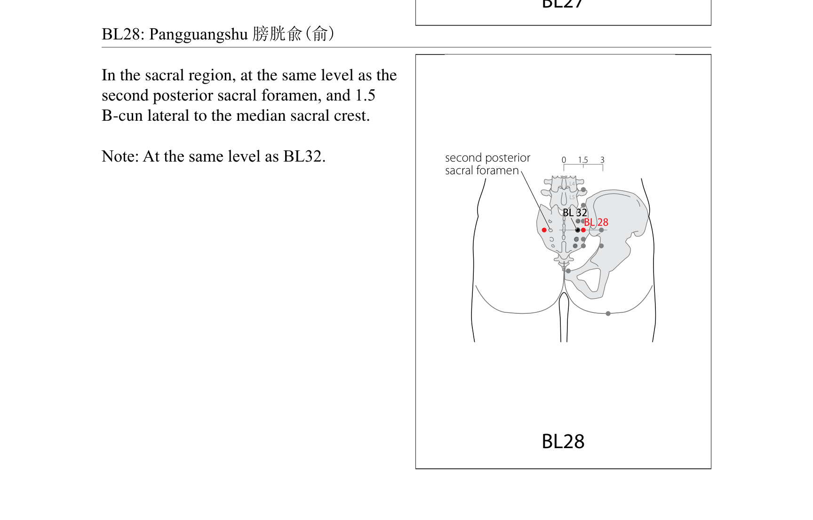

> **External References:** [AcuPoints](https://www.acupoints.org/bl28-acupuncture-point/)

#### דיקור

- **זווית**: ניצבת (Perpendicular) 90°

- **עומק**: 0.8-1.2 צון

- **תחושת דה-צ'י**: כבדות מקומית, לעתים הקרנה לאזור שלפוחית השתן או לאיבר המין

#### פעולות והתוויות

- **פעולות**: מווסת שלפוחית השתן; מפנה רטיבות-חום מהג'יאו התחתון; מועיל לגב תחתון ולסקרום

- **התוויות**: קושי במתן שתן, תכיפות שתן, הרטבת לילה, אצירת שתן, דלקת דרכי שתן, כאב גב תחתון, כאב סקרום, עצירות, שלשולים

- **שילובים נפוצים**: BL28 + REN3 (מו-שו שילוב לשלפוחית השתן); BL28 + SP9 + SP6 (רטיבות-חום בשלפוחית); BL28 + BL23 (שלפוחית-כליות); BL28 + REN4 + KI3 (אצירת שתן)

---

### BL40 — ווי ג'ונג

**שם סיני**: (Wei Zhong)

**משמעות השם**: "אמצע הכיפוף" — הנקודה באמצע הכיפוף של הברך מאחור

**קטגוריה מיוחדת**: נקודת הה-ים (He Xue) — אלמנט אדמה (Tu); אחת מ-4 נקודות הפיקוד — "הגב והמותניים — ווי ג'ונג גוששת"; נקודת פיקוד הגב (Command Point of the Back)

#### מיקום אנטומי

באמצע קפל הברך האחורי (Popliteal Crease), בין גידי שרירי הבייספס פמוריס (Biceps Femoris) והסמיטנדינוזוס (Semitendinosus).

#### איך מוצאים אותה

1. בקשו מהמטופל לשכב על הבטן עם הברכיים ישרות, או לעמוד

2. אתרו את קפל הברך האחורי (הקו שנוצר מאחורי הברך)

3. מצאו את אמצע הקפל — בין שני הגידים שניתן לגשש בצדדים

4. הנקודה נמצאת בדיוק באמצע, שם ניתן לחוש דופק של העורק הפופליטאלי

5. **⚠️** העורק הפופליטאלי (Popliteal Artery) עובר מתחת — היזהרו

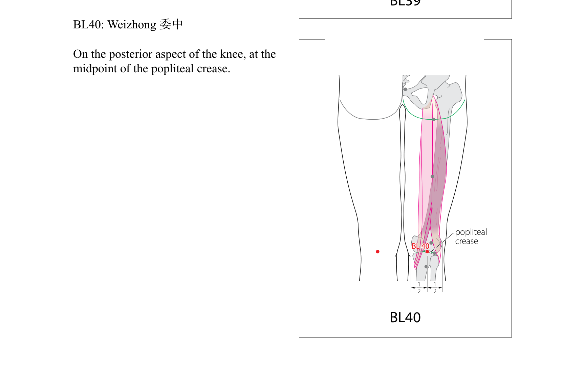

> **External References:** [AcuPoints](https://www.acupoints.org/bl40-acupuncture-point/)

#### דיקור

- **זווית**: ניצבת (Perpendicular) 90°, או דקירה להוצאת דם

- **עומק**: 0.5-1.5 צון

- **⚠️ זהירות**: הימנעו מהעורק והוריד הפופליטאליים. לטכניקת הוצאת דם — דקירה שטחית עם מחט משולשת

- **תחושת דה-צ'י**: נימול חשמלי שמתפשט לשוק, כבדות מקומית

#### פעולות והתוויות

- **פעולות**: מועיל לגב תחתון (**"נקודת הפיקוד של הגב"**); מפנה חום; מקרר דם; מרפה גידים ומפרקים; מגרש רטיבות-חום מהג'יאו התחתון; מועיל לעור

- **התוויות**: כאב גב תחתון חריף וכרוני (**נקודת מפתח**), סיאטיקה, כאב ברך, נוקשות ירך ושוק, עור חם ואדום, אקזמה, פסוריאזיס, חום קיץ, שלשולים, הקאות, כאב בטן

- **שילובים נפוצים**: BL40 + BL23 + BL25 (כאב גב תחתון); BL40 + BL60 (כאב גב — דיסטלי-פרוקסימלי); BL40 + SP10 + LI11 (בעיות עור — חום בדם); BL40 + GV26 (עזרה ראשונה — כאב גב חריף); BL40 + BL57 (כאב ברך ושוק)

---

### BL57 — צ'נג שאן

**שם סיני**: (Cheng Shan)

**משמעות השם**: "תמיכה בהר" — הנקודה נמצאת בשקע שנוצר בשריר כמו "הר"

#### מיקום אנטומי

בחלק האחורי של השוק, באמצע הקו בין BL40 (קפל הברך) ל-BL60 (אחורי קרסול חיצוני), בשקע שנוצר בין שני ראשי שריר הגסטרוקנמיוס (Gastrocnemius) כשהמטופל מתרומם על קצות האצבעות.

#### איך מוצאים אותה

1. בקשו מהמטופל לשכב על הבטן עם רגליים ישרות

2. בקשו ממנו להתרומם על קצות האצבעות או לכופף את כף הרגל כלפי מטה (Plantarflexion)

3. שריר הגסטרוקנמיוס (שריר השוק האחורי) יתכווץ וייווצר שקע V-צורני בחלק התחתון שלו

4. הנקודה נמצאת בדיוק בחוד ה-V — בשקע שבין שני ראשי השריר

5. לחלופין: מצאו את אמצע הקו בין קפל הברך לגובה הקרסול

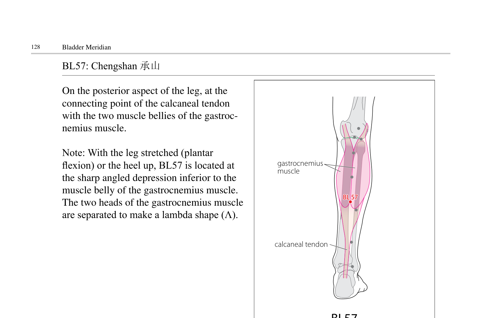

> **External References:** [AcuPoints](https://www.acupoints.org/bl57-acupuncture-point/)

#### דיקור

- **זווית**: ניצבת (Perpendicular) 90°

- **עומק**: 1.0-2.0 צון

- **תחושת דה-צ'י**: כבדות מקומית, לעתים עוויתות קלות בשריר, הקרנה לכף הרגל

#### פעולות והתוויות

- **פעולות**: מרפה גידים ושרירים; מועיל לטחורים (**נקודת מפתח**); מפנה רטיבות; מחזק גב תחתון

- **התוויות**: טחורים (נקודה מרכזית), עצירות, כאב בשוק, עוויתות שרירים בשוק (Cramps), כאב גב תחתון, סיאטיקה, צניחת חלחולת, כאב ברך

- **שילובים נפוצים**: BL57 + BL40 + GV20 (טחורים — שילוב קלאסי); BL57 + BL40 + BL60 (כאב שוק וגב); BL57 + GB34 (עוויתות שרירים)

---

### BL60 — קון לון

**שם סיני**: (Kun Lun)

**משמעות השם**: "הר קון לון" — ההר המיתולוגי בסין; הבליטה של הקרסול דומה להר

**קטגוריה מיוחדת**: נקודת ג'ינג-נהר (Jing Xue) — אלמנט אש (Huo)

#### מיקום אנטומי

בשקע שבין הקרסול החיצוני (Lateral Malleolus) לגיד אכילס (Achilles Tendon).

#### איך מוצאים אותה

1. אתרו את הנקודה הגבוהה ביותר של הקרסול החיצוני

2. אתרו את גיד אכילס (הגיד הגדול שמאחורי הקרסול)

3. הנקודה נמצאת באמצע המרחק ביניהם — בשקע

4. גששו את הגומה — היא ברורה ורגישה

5. **⚠️ זהירות בהיריון**: נקודה זו אסורה בשימוש במהלך היריון (עלולה לגרום לצירים)

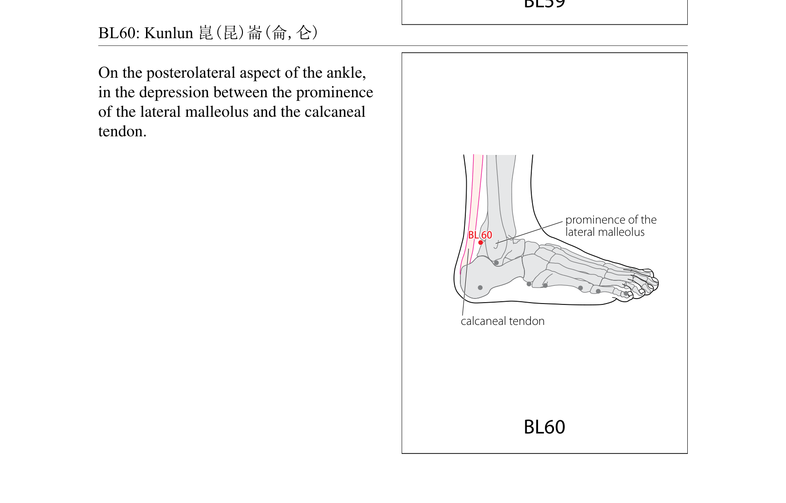

> **External References:** [AcuPoints](https://www.acupoints.org/bl60-acupuncture-point/)

#### דיקור

- **זווית**: ניצבת (Perpendicular) 90°, מכוון לכיוון BL62 או KI3

- **עומק**: 0.5-1.0 צון

- **⚠️ זהירות**: אסור בהיריון (גורם להורדת העובר). אין לדקור באופן חזק אצל נשים בהיריון

- **תחושת דה-צ'י**: כאב מקומי חד, נימול שמתפשט לכף הרגל

#### פעולות והתוויות

- **פעולות**: מגרש רוח ומפנה חום; מרפה גידים ושרירים; מחזק גב תחתון (**נקודה דיסטלית חשובה לגב**); מפנה חסימות מהערוץ; מהירת לידה (בסוף היריון)

- **התוויות**: כאב גב תחתון, סיאטיקה, כאב קרסול, כאב עקב, נוקשות צוואר, כאב ראש עורפי, אפילפסיה, קושי בלידה (בסוף היריון בלבד)

- **שילובים נפוצים**: BL60 + BL40 (כאב גב — קומבינציה קלאסית דיסטלית); BL60 + SI3 (כאב צוואר ועורף); BL60 + KI3 (חיזוק כליות ומותניים — ין-יאנג); BL60 + BL67 (לידה קשה)

---

### BL62 — שן מאי

**שם סיני**: (Shen Mai)

**משמעות השם**: "כלי דם מתרחב" — נקודה שפותחת את כלי היאנג צ'יאו

**קטגוריה מיוחדת**: נקודת פתיחה (Confluent Point) של יאנג צ'יאו מאי (Yang Qiao Mai); אחת מ-8 נקודות המפגש של כלי הפלא

#### מיקום אנטומי

0.5 צון מתחת לקצה התחתון של הקרסול החיצוני (Lateral Malleolus), בשקע.

#### איך מוצאים אותה

1. אתרו את הנקודה הנמוכה ביותר (הקצה התחתון) של הקרסול החיצוני

2. ירדו 0.5 צון ישירות מטה

3. גששו את השקע שנמצא ישירות מתחת לקרסול

4. הנקודה נמצאת על גבול העור הבהיר-כהה בכף הרגל

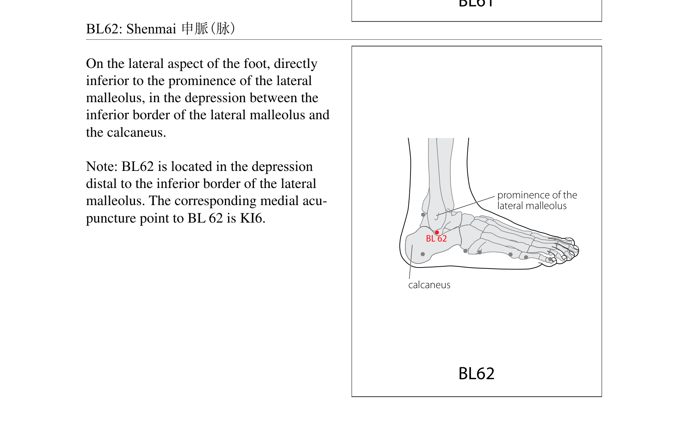

> **External References:** [AcuPoints](https://www.acupoints.org/bl62-acupuncture-point/)

#### דיקור

- **זווית**: ניצבת (Perpendicular) 90°

- **עומק**: 0.3-0.5 צון

- **תחושת דה-צ'י**: כאב מקומי, נימול שמתפשט לכף הרגל

#### פעולות והתוויות

- **פעולות**: פותחת את יאנג צ'יאו מאי; מרגיעה את הרוח (**נקודת מפתח לנדודי שינה**); מגרשת רוח פנימית; מרפה גידים; מועילה לראש ולעיניים

- **התוויות**: נדודי שינה (עודף יאנג — קושי להירדם), אפילפסיה, סחרחורת, כאב ראש, כאב קרסול ורגל, כאב גב תחתון, שיתוק חצי גוף

- **שילובים נפוצים**: BL62 + SI3 (פתיחת יאנג צ'יאו מאי + דו מאי — כאב גב, אפילפסיה, נדודי שינה); BL62 + KI6 (איזון ין-יאנג צ'יאו — הפרעות שינה: BL62 לעודף יאנג, KI6 לעודף ין)

---

### BL67 — ג'י ין

**שם סיני**: (Zhi Yin)

**משמעות השם**: "מגיע לין" — הנקודה האחרונה בערוץ הטאי יאנג, שמעבירה את הצ'י לערוץ הין (הכליות)

**קטגוריה מיוחדת**: נקודת ג'ינג-באר (Jing Xue) — אלמנט מתכת (Jin)

#### מיקום אנטומי

בצד החיצוני (לטרלי) של האצבע הקטנה ברגל, כ-0.1 צון מפינת בסיס הציפורן.

#### איך מוצאים אותה

1. התבוננו באצבע הקטנה של הרגל

2. אתרו את ציפורן האצבע הקטנה

3. הנקודה נמצאת בפינה החיצונית (לטרלית) של בסיס הציפורן

4. מדדו כ-0.1 צון (כ-2 מ"מ) מפינת הציפורן, באלכסון

5. הנקודה קטנה מאוד ורגישה

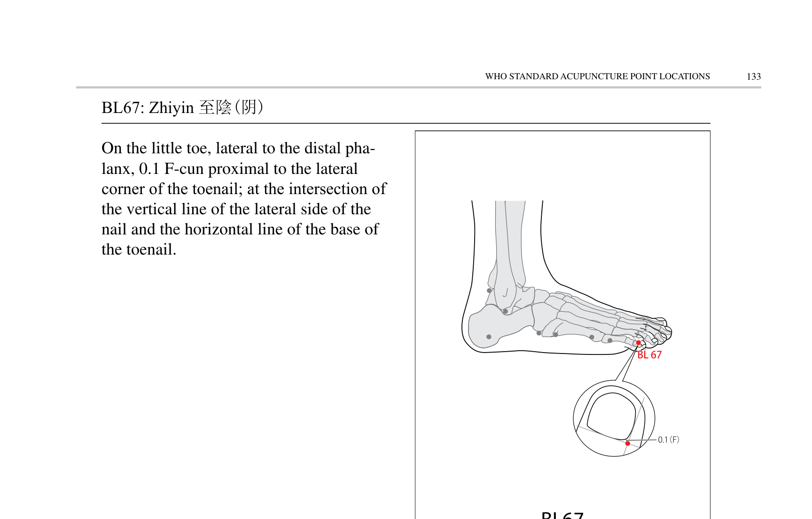

> **External References:** [AcuPoints](https://www.acupoints.org/bl67-acupuncture-point/)

#### דיקור

- **שיטה עיקרית**: מוקסה (Jiu) — **שימוש מיוחד להפיכת מצג עכוז** (Breech Presentation)

- **דיקור**: דקירה שטחית 0.1 צון, או הוצאת דם

- **תחושת דה-צ'י**: כאב חד מקומי

- **⚠️ מוקסה**: מקלון מוקסה ליד הנקודה למשך 15-20 דקות, לשימוש בשבועות 33-36 להיריון

#### פעולות והתוויות

- **פעולות**: מבהירה את הראש ומאירה את העיניים; מסירה חסימות מהערוץ; **הופכת מצג עכוז** (היישום המפורסם ביותר); מקלה על לידה; מגרשת רוח

- **התוויות**: מצג עכוז (**שימוש עם מוקסה** — מחקרים תומכים ביעילות), כאב ראש, כאב עיניים, גודש באף, קושי בלידה

- **שילובים נפוצים**: BL67 מוקסה (הפיכת מצג עכוז — שימוש יומיומי); BL67 + BL60 (הקלה על לידה); BL67 + BL1 (בעיות עיניים — נקודת ההתחלה ונקודת הסיום של הערוץ)

---

## 3. טבלת שאר הנקודות

הנקודות שלא פורטו לעיל מסוכמות בטבלה הבאה:

| מספר | שם סיני | פיניין | מיקום | התוויות עיקריות |

|---|---|---|---|---|

| BL3 | | Mei Chong | 0.5 צון מעל לתחילת הגבה, ישירות מעל BL2 | כאב ראש, סחרחורת, גודש באף, אפילפסיה |

| BL4 | | Qu Chai | 1.5 צון לטרלית לקו האמצע, 0.5 צון מעל לקו השיער הקדמי | כאב ראש חזיתי, טשטוש ראייה, גודש באף, דימום מהאף |

| BL5 | | Wu Chu | 1.5 צון לטרלית לקו האמצע, 1 צון מעל לקו השיער הקדמי | כאב ראש, סחרחורת, אפילפסיה |

| BL6 | | Cheng Guang | 1.5 צון לטרלית לקו האמצע, 2.5 צון מעל לקו השיער הקדמי | כאב ראש, טשטוש ראייה, גודש באף, חום |

| BL7 | | Tong Tian | 1.5 צון לטרלית לקו האמצע, 4 צון מעל לקו השיער הקדמי | כאב ראש, סחרחורת, נזלת, גודש באף, אובדן חוש ריח |

| BL8 | | Luo Que | 1.5 צון לטרלית לקו האמצע, 5.5 צון מעל לקו השיער הקדמי | סחרחורת, טינטון, טשטוש ראייה, מאניה |

| BL9 | | Yu Zhen | 1.3 צון לטרלית לקו האמצע, 2.5 צון מעל לקו השיער האחורי, בגובה הבליטה האוקסיפיטלית | כאב ראש עורפי, כאב עיניים, גודש באף, קוצר ראייה |

| BL12 | | Feng Men | 1.5 צון לטרלית ל-T2 — "שער הרוח" | הצטננות, שיעול, חום, כאב גב עליון, אורטיקריה — נקודה מרכזית לגירוש רוח |

| BL16 | | Du Shu | 1.5 צון לטרלית ל-T6 | כאב בלב, כאב בטן, שיהוק, בעיות עור |

| BL24 | | Qi Hai Shu | 1.5 צון לטרלית ל-L3 | כאב גב תחתון, טחורים, אסתמה |

| BL26 | | Guan Yuan Shu | 1.5 צון לטרלית ל-L5 | כאב גב תחתון, שלשולים, תכיפות שתן, נפיחות |

| BL29 | | Zhong Lü Shu | 1.5 צון לטרלית ל-S3 | כאב גב תחתון, דיזנטריה, סוכרת |

| BL30 | | Bai Huan Shu | 1.5 צון לטרלית ל-S4 | כאב גב תחתון, מחזור לא סדיר, הפרשות לבנות, בעיות שתן |

| BL31 | | Shang Liao | חור סקרלי 1 (S1 Foramen) | כאב גב תחתון, בעיות גינקולוגיות, בעיות שתן |

| BL32 | | Ci Liao | חור סקרלי 2 (S2 Foramen) | דיסמנוריאה, מחזור לא סדיר, בעיות שתן, אימפוטנציה |

| BL33 | | Zhong Liao | חור סקרלי 3 (S3 Foramen) | עצירות, שלשולים, בעיות שתן, כאב גב תחתון |

| BL34 | | Xia Liao | חור סקרלי 4 (S4 Foramen) | כאב גב תחתון, עצירות, בעיות שתן |

| BL35 | | Hui Yang | 0.5 צון לטרלית לקצה העוקץ (Coccyx) | טחורים, שלשולים, אימפוטנציה, הפרשות |

| BL36 | | Cheng Fu | באמצע קפל העכוז (Gluteal Fold) | כאב עכוז, סיאטיקה, עצירות, טחורים |

| BL37 | | Yin Men | 6 צון מתחת ל-BL36, בחלק האחורי של הירך | כאב ירך אחורית, סיאטיקה, נוקשות גב תחתון |

| BL38 | | Fu Xi | 1 צון מעל ל-BL40, בצד המדיאלי של גיד הביצפס פמוריס | כאב ברך, נימול ברגל |

| BL39 | | Wei Yang | בצד הלטרלי של קפל הברך האחורי, מדיאלית לגיד הביצפס פמוריס | כאב גב תחתון, בעיות שתן, כאב ברך, נוקשות שוק — נקודת הה תחתון של סאן ג'יאו |

| BL41 | | Fu Fen | 3 צון לטרלית ל-T2 — ענף שני | כאב כתף וגב עליון, נימול בזרוע, נוקשות צוואר |

| BL42 | | Po Hu | 3 צון לטרלית ל-T3 — "דלת הפו" | שיעול, אסתמה, שחפת, כאב כתף — נפש הפו (ריאות) |

| BL43 | | Gao Huang Shu | 3 צון לטרלית ל-T4 | חולשה כרונית, שחפת, עייפות, חיזוק כללי — "נקודת החיות" |

| BL44 | | Shen Tang | 3 צון לטרלית ל-T5 — "אולם הנפש" | דפיקות לב, חרדה, נדודי שינה, כאב גב — נפש השן (לב) |

| BL45 | | Yi Xi | 3 צון לטרלית ל-T6 | שיעול, אסתמה, כאב כתף וגב |

| BL46 | | Ge Guan | 3 צון לטרלית ל-T7 | שיהוק, הקאות, כאב גב, קושי בבליעה |

| BL47 | | Hun Men | 3 צון לטרלית ל-T9 — "שער ההון" | כאב בצלעות, כעס, דיכאון — נפש ההון (כבד) |

| BL48 | | Yang Gang | 3 צון לטרלית ל-T10 | צהבת, בורבוריגמוס, כאב בטן |

| BL49 | | Yi She | 3 צון לטרלית ל-T11 — "משכן הכוונה" | נפיחות, הקאות, שלשולים — נפש הי (טחול) |

| BL50 | | Wei Cang | 3 צון לטרלית ל-T12 | כאב בטן, נפיחות, כאב גב |

| BL51 | | Huang Men | 3 צון לטרלית ל-L1 | כאב בטן, עצירות, גושים בבטן |

| BL52 | | Zhi Shi | 3 צון לטרלית ל-L2 — "חדר הרצון" | כאב גב תחתון, אימפוטנציה, הרטבת לילה — נפש הג'י (כליות) |

| BL53 | | Bao Huang | 3 צון לטרלית ל-S2 | כאב גב תחתון, נפיחות, בעיות שתן |

| BL54 | | Zhi Bian | 3 צון לטרלית ל-S4 | סיאטיקה, כאב גב תחתון, טחורים, בעיות שתן |

| BL55 | | He Yang | 2 צון מתחת ל-BL40 | כאב גב תחתון, כאב שוק, דימום רחמי |

| BL56 | | Cheng Jin | באמצע השוק, בין BL40 ל-BL57 | עוויתות בשוק, כאב שוק, טחורים |

| BL58 | | Fei Yang | 7 צון מעל ל-BL60 — נקודת לואו | כאב ראש, סחרחורת, כאב שוק, חולשת רגליים — לואו מחבר ל-KI |

| BL59 | | Fu Yang | 3 צון מעל ל-BL60 | כאב רגל, כאב ראש, כבדות ברגליים — נקודת שי של יאנג צ'יאו מאי |

| BL61 | | Pu Can | מתחת ל-BL60, בשקע על הצד החיצוני של עצם העקב | כאב עקב, כאב קרסול, אפילפסיה |

| BL63 | | Jin Men | מתחת ובקדמת הקרסול החיצוני, לטרלית ל-Cuboid | כאב ראש, אפילפסיה, כאב גב תחתון — נקודת שי של ערוץ BL |

| BL64 | | Jing Gu | מאחורי ראש עצם המטטרסל ה-5, בגבול עור בהיר-כהה | כאב ראש עורפי, כאב צוואר, אפילפסיה — נקודת יואן-מקור |

| BL65 | | Shu Gu | מאחורי מפרק המטטרסו-פלנגאלי ה-5 | כאב ראש עורפי, כאב צוואר, טשטוש ראייה — נקודת שו-זרם |

| BL66 | | Zu Tong Gu | בשקע הדיסטלי-לטרלי למפרק המטטרסו-פלנגאלי ה-5 | כאב ראש, נוקשות צוואר, דימום מהאף — נקודת יינג-מעיין |

---

## 4. סיכום נקודות שו-גב (Bei Shu Xue)

כל נקודות השו-גב נמצאות על הענף המדיאלי של ערוץ שלפוחית השתן, 1.5 צון לטרלית לקו האמצע האחורי. כל נקודת שו-גב משקפת את מצב האיבר המתאים ומשמשת לאבחון ולטיפול.

| חוליה | נקודה | שם סיני | איבר | שילוב מו-שו (נקודת מו) |

|---|---|---|---|---|

| T1 | BL11 | Da Zhu | הוי עצמות (אין איבר ספציפי) | — |

| T3 | BL13 | Fei Shu | ריאות (LU) | LU1 |

| T4 | BL14 | Jue Yin Shu | פריקרד (PC) | REN17 |

| T5 | BL15 | Xin Shu | לב (HT) | REN14 |

| T7 | BL17 | Ge Shu | הוי דם (סרעפת) | — |

| T9 | BL18 | Gan Shu | כבד (LR) | LR14 |

| T10 | BL19 | Dan Shu | כיס מרה (GB) | GB24 |

| T11 | BL20 | Pi Shu | טחול (SP) | LR13 |

| T12 | BL21 | Wei Shu | קיבה (ST) | REN12 |

| L1 | BL22 | San Jiao Shu | סאן ג'יאו (TE) | REN5 |

| L2 | BL23 | Shen Shu | כליות (KI) | GB25 |

| L4 | BL25 | Da Chang Shu | מעי גס (LI) | ST25 |

| S1 | BL27 | Xiao Chang Shu | מעי דק (SI) | REN4 |

| S2 | BL28 | Pang Guang Shu | שלפוחית (BL) | REN3 |

> **כלל קליני**: שילוב מו-שו (Front Mu + Back Shu) הוא מהשילובים היעילים ביותר ברפואה סינית. נקודת השו-גב מטפלת באיבר ממישור היאנג (גב), ונקודת המו-קדמי ממישור הין (חזה/בטן). יחד הן "מקיפות" את האיבר ומשפיעות עליו מכל הכיוונים.

---

## 5. פתולוגיות ערוץ שלפוחית השתן

### 5.1 דפוסים חיצוניים (שכבת טאי יאנג)

ערוץ שלפוחית השתן הוא השכבה החיצונית ביותר (טאי יאנג) ולכן הוא הראשון שנפגע בפלישת גורמי מחלה חיצוניים:

| דפוס | תסמינים | נקודות עיקריות |

|---|---|---|

| פלישת רוח-קור | כאב ראש עורפי, נוקשות צוואר, צמרמורות, חום קל, ללא הזעה | BL12 + BL10 + GV14 + LU7 |

| פלישת רוח-חום | כאב ראש, חום, הזעה, כאב גרון, דופק צף-מהיר | BL12 + GV14 + LI4 + LI11 |

### 5.2 דפוסים פנימיים

| דפוס | תסמינים | נקודות עיקריות |

|---|---|---|

| רטיבות-חום בשלפוחית השתן | שתן כהה, צורב, תכיפות, דם בשתן | BL28 + BL22 + REN3 + SP9 |

| חוסר צ'י שלפוחית | הרטבת לילה, דלף שתן, תכיפות | BL28 + BL23 + REN4 + REN3 |

| סטגנציה בערוץ | כאב גב לאורך הערוץ, סיאטיקה, נוקשות | BL40 + BL60 + BL23 + BL25 |

### 5.3 דפוסים רגשיים

שלפוחית השתן מזווגת עם הכליות, ולכן קשורה ל:

- **פחד** (Kong) — פחד כרוני מחליש את הכליות ומשפיע על שלפוחית השתן

- **חוסר כוח רצון** (Zhi) — חולשת כליות פוגעת ביכולת ההתמדה וכוח הרצון

- **חוסר ביטחון** — "המים" לא יציבים → תחושת חוסר יציבות

---

## 6. חמש נקודות שו (Wu Shu Xue) של ערוץ שלפוחית השתן

| סוג | נקודה | אלמנט | כיוון הזרימה |

|---|---|---|---|

| ג'ינג-באר (Jing-Well) | BL67 | מתכת | הצ'י "נובע" |

| יינג-מעיין (Ying-Spring) | BL66 | מים | הצ'י "זורם" |

| שו-זרם (Shu-Stream) | BL65 | עץ | הצ'י "מתחזק" |

| ג'ינג-נהר (Jing-River) | BL60 | אש | הצ'י "גדל" |

| הה-ים (He-Sea) | BL40 | אדמה | הצ'י "מתאסף" |

---

## 7. תרגילים

### תרגיל 1: מיקום נקודות שו-גב

על גבו של שותף/ה (בשכיבה על הבטן), אתרו את הנקודות הבאות ותארו את המבנים האנטומיים שמסביב:

א. BL13 (ריאות — T3)

ב. BL15 (לב — T5)

ג. BL18 (כבד — T9)

ד. BL20 (טחול — T11)

ה. BL23 (כליות — L2)

### תרגיל 2: שו-גב ומו-קדמי

עבור כל אחד מהאיברים הבאים, ציינו את נקודת השו-גב ואת נקודת המו-קדמי המתאימה:

א. ריאות

ב. לב

ג. כבד

ד. טחול

ה. כליות

ו. קיבה

ז. שלפוחית השתן

### תרגיל 3: בחירת נקודות

מטופל בן 45 מגיע עם כאב גב תחתון כרוני שמחמיר בקור, תכיפות שתן, עייפות, ידיים ורגליים קרות. הלשון חיוורת ונפוחה.

א. מהי האבחנה?

ב. אילו נקודות מערוץ שלפוחית השתן תבחרו?

ג. אילו נקודות מערוצים אחרים תוסיפו?

### תרגיל 4: מצג עכוז

אישה בהיריון בשבוע 34, העובר במצג עכוז.

א. איזו נקודה תשתמשו בה?

ב. באיזו טכניקה (דיקור או מוקסה)?

ג. מהו הפרוטוקול המומלץ?

### תרגיל 5: סיאטיקה

מטופלת מגיעה עם כאב חד שמקרין מהעכוז, דרך החלק האחורי של הירך, ועד לשוק ולכף הרגל.

א. איזה ערוץ מעורב?

ב. בחרו 5 נקודות מערוץ שלפוחית השתן שתשתמשו בהן

ג. הוסיפו נקודות מערוצים אחרים

---

## קריאה מומלצת

- Deadman, P. *A Manual of Acupuncture* — ערוץ שלפוחית השתן (הפרק הארוך ביותר בספר)

- Maciocia, G. *The Foundations of Chinese Medicine* — פרקים על שלפוחית השתן, כליות, ונקודות שו-גב

- הואנג די ניי ג'ינג, לינג שו, פרקים 10, 51

- O'Connor, J. & Bensky, D. *Acupuncture: A Comprehensive Text*

- Cardini, F. & Weixin, H. "Moxibustion for correction of breech presentation" — *JAMA* 1998

---

> **נקודה למחשבה**: ערוץ שלפוחית השתן הוא הערוץ הארוך ביותר בגוף עם 67 נקודות, והוא נושא על גבו את כל נקודות השו-גב — "חלונות ההשתקפות" של כל האיברים הפנימיים. הוא הערוץ היחיד שדרכו ניתן לטפל בכל איבר בגוף. כשומר השער של טאי יאנג, הוא מגן על הגב כולו ועל הגוף מפני פלישות חיצוניות. לימוד מעמיק של ערוץ זה — ובמיוחד של נקודות השו-גב — הוא אבן יסוד בפרקטיקה הקלינית של כל מטפל בדיקור.

---

## ניווט

- **הקודם**: [ערוץ המעי הדק (SI)](07-small-intestine.md) | **הבא**: [ערוץ הכליות (KI)](09-kidney-channel.md)

- **זוג פנים-חוץ**: [ערוץ הכליות (KI)](09-kidney-channel.md) — ערוץ הין הזוגי (אלמנט מים)

- **חזרה למודול**: [מודול 2 — מרידיאנים](README.md)

- **ראה גם**: [שו-גב ומו-קדמי](../../year-2-intermediate/module-08-point-categories/03-back-shu-front-mu.md) — נקודות שו-גב נמצאות על ערוץ שלפוחית השתן

