# 10-pericardium

## ערוץ קרום הלב - שו ג'יואה ין שין באו

### Pericardium Channel - Shǒu Jué Yīn Xīn Bāo Jīng

***

### מטרות למידה

בסיום שיעור זה, הסטודנט יוכל:

1. לתאר את מסלול ערוץ קרום הלב (פריקרדיום) החיצוני והפנימי
2. לאתר את 9 הנקודות של הערוץ (PC1-PC9)
3. להסביר את תפקודי קרום הלב ברפואה הסינית
4. לזהות פתולוגיות נפוצות ולבחור נקודות מתאימות
5. ליישם שילובי נקודות קלאסיים הכוללים נקודות מערוץ הפריקרדיום

***

### 1. סקירת הערוץ

#### 1.1 מידע כללי

| פרט | תיאור |
| ---------------- | ----------------------------------------- |
| **שם סיני** | (Shǒu Jué Yīn Xīn Bāo Jīng) |
| **קיצור** | PC (Pericardium) |
| **מספר נקודות** | 9 |
| **סוג** | ין (Yin) |
| **אלמנט** | אש שרתית (Xiāng Huǒ) - אש מיניסטריאלית |
| **שעות פעילות** | 19:00-21:00 |
| **כיוון זרימה** | מהחזה אל קצה האצבע האמצעית |
| **זוג פנים-חוץ** | שלוש המבערות (TE -) |

#### 1.2 מסלול הערוץ

**מסלול חיצוני:** הערוץ מתחיל בחזה, באזור הפטמה (PC1), יוצא דרך בית השחי, יורד לאורך הצד המדיאלי (הפנימי) של הזרוע העליונה, בין ערוץ הריאות (LU) לערוץ הלב (HT). הוא ממשיך דרך הקפל הקוביטלי (מרפק), יורד באמצע חלק הזרוע הפנימי (אמה), עובר בין גידי הפלמריס לונגוס לפלקסור קרפי רדיאליס, ונכנס לכף היד. הערוץ ממשיך לאצבע האמצעית ומסתיים בקצה שלה (PC9).

**מסלול פנימי:** הערוץ הפנימי מתחיל בחזה, מתחבר לקרום הלב (פריקרדיום), יורד דרך הסרעפת ומתחבר לשלושת המבערות (סאן ג'יאו -) — העליונה, האמצעית והתחתונה.

**ענפים:** ענף יוצא מכף היד (PC8) ועובר לקצה האצבע הטבעתית, שם הוא מתחבר לערוץ שלוש המבערות (TE1).

#### 1.3 זוג פנים-חוץ

ערוץ קרום הלב (שו ג'יואה ין -) הוא הערוץ הפנימי (ין) המזווג עם ערוץ שלוש המבערות (שו שאו יאנג -), שהוא הערוץ החיצוני (יאנג). שניהם שייכים לאש המיניסטריאלית.

***

### 2. תפקודי קרום הלב (Xīn Bāo)

#### 2.1 תפקודים עיקריים

1. **הגנה על הלב** - קרום הלב הוא "שומר הסף" של הלב. הוא מגן על הלב מפני גורמים פתוגניים חיצוניים. כאשר חום פתוגני תוקף, קרום הלב נפגע ראשון ובכך מגן על הלב עצמו.
2. **שליטה על הדם ועל כלי הדם** - בדומה ללב, קרום הלב משפיע על מחזור הדם. הערוץ שלו עובר באזור שבו ניתן למשש את הדופק (כף היד והאמה).
3. **שיכון הרוח (שן)** - קרום הלב קשור לשמחה, תקשורת, יחסים ורגשות. הוא "שגריר" הלב — מנהל את הקשרים הרגשיים עם העולם.
4. **קשר לאש המיניסטריאלית** - יחד עם שלוש המבערות, קרום הלב מייצג את "אש הפקיד" (Xiāng Huǒ), בניגוד ל"אש הקיסר" (Jūn Huǒ) של הלב.

#### 2.2 רגש ומנטלי

* **רגש**: שמחה (Xǐ), אך גם חרדה ומניה כאשר אינו מאוזן
* קרום הלב שולט ביכולת ליצור קשרים רגשיים בריאים
* חוסר איזון מתבטא בחוסר יכולת להתחבר רגשית או בהצפה רגשית

#### 2.3 פתולוגיות נפוצות

| דפוס | סימפטומים עיקריים |
| ----------------------------- | ------------------------------------------------------------ |
| **חום בקרום הלב** | חום גבוה, דליריום, אובדן הכרה, לשון אדומה כהה, דיבור לא ברור |
| **פליגמה מעכירה את קרום הלב** | בלבול מנטלי, מאניה, אפילפסיה, דיבור לא קוהרנטי, ריר מוגבר |
| **סטגנציית דם בקרום הלב** | כאב דוקר בחזה, פלפיטציות, לשון סגולה עם כתמים |
| **חוסר דם בקרום הלב** | פלפיטציות, נדודי שינה, חרדה, חלימות מרובות |

***

### 3. נקודות הערוץ (PC1-PC9)

***

> **WHO Standard Acupuncture Point Locations** (WHO, CC BY-NC-SA 3.0 IGO):
>
> 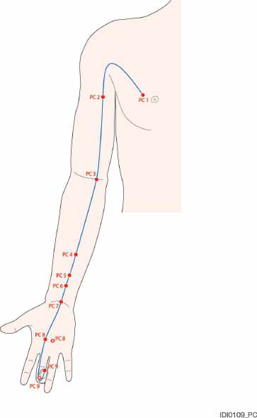

#### PC1 — טיאן צ'י — Tiān Chí — "בריכה שמימית"

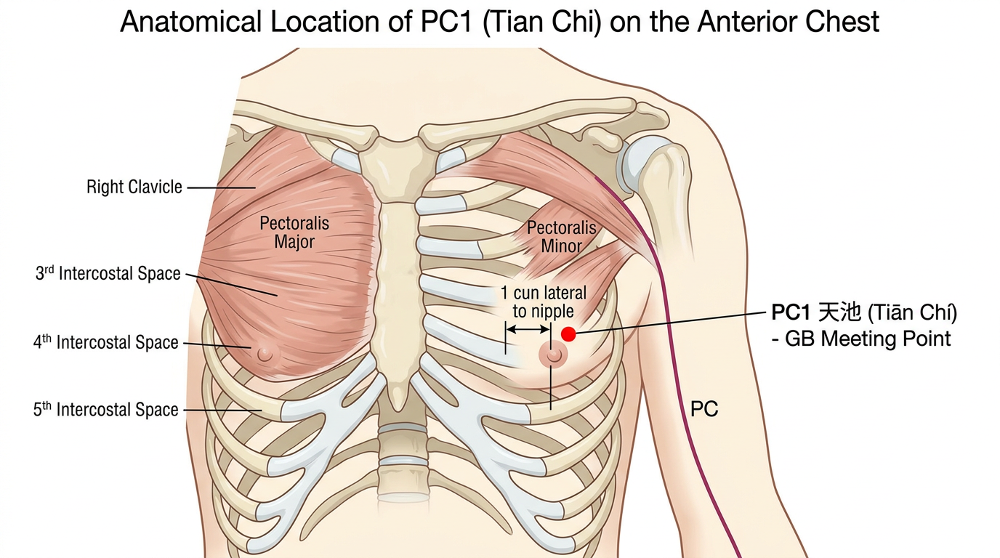

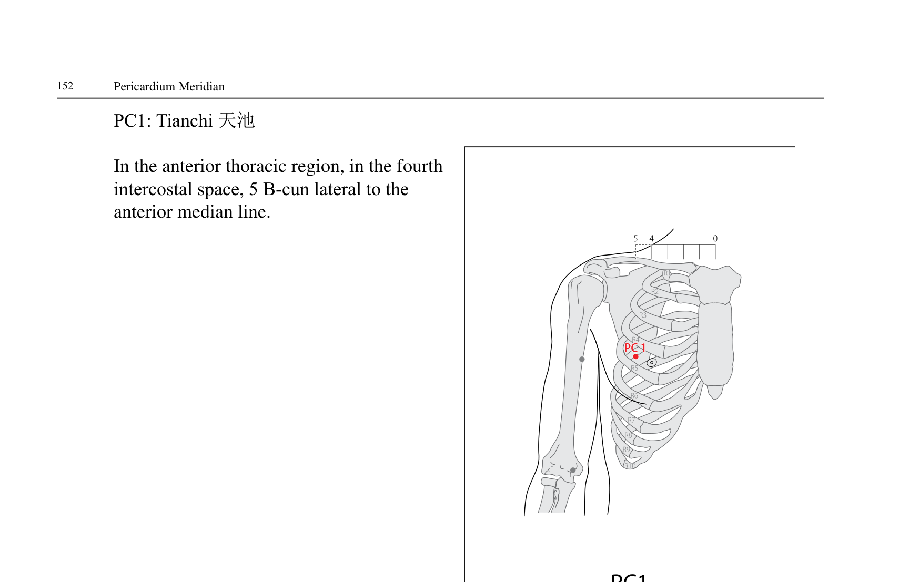

> **External References:** [AcuPoints](https://www.acupoints.org/pc1-acupuncture-point/)

**קטגוריה מיוחדת:** נקודת מפגש עם ערוץ כיס המרה (GB)

**מיקום אנטומי:** 1 צון לטרלית מהפטמה, ברווח הבין-צלעי ה-4.

**איך למצוא את הנקודה:**

1. מצאו את הפטמה (בגברים בדרך כלל ברווח הבין-צלעי ה-4)
2. מדדו 1 צון לטרלית (הצידה) מהפטמה
3. הנקודה נמצאת ברווח הבין-צלעי ה-4
4. בנשים: מצאו את הרווח הבין-צלעי ה-4 ומדדו 5 צון מקו האמצע (1 צון לטרלית ממקום הפטמה הצפוי)

**עומק דקירה:** 0.3-0.5 צון

**זווית דקירה:** אובליקית או שטוחה לטרלית (לא לדקור עמוק - ריאות ולב מתחת)

**תחושת דה-צ'י:** כאב מקומי, תחושת לחץ בחזה

**פעולות והתוויות:**

* מרחיבה את החזה, מווסתת צ'י
* מפזרת סטגנציה בחזה
* מועילה לשד
* התוויות: כאב בחזה, תחושת מלאות בחזה, כאב בבית השחי, בלוטות לימפה נפוחות, מורסה בשד

**שילובי נקודות נפוצים:**

* PC1 + REN17 — לשחרור סטגנציה בחזה
* PC1 + GB21 — לטיפול בבעיות שד

***

#### PC2 — טיאן צ'יואן — Tiān Quán — "מעיין שמימי"

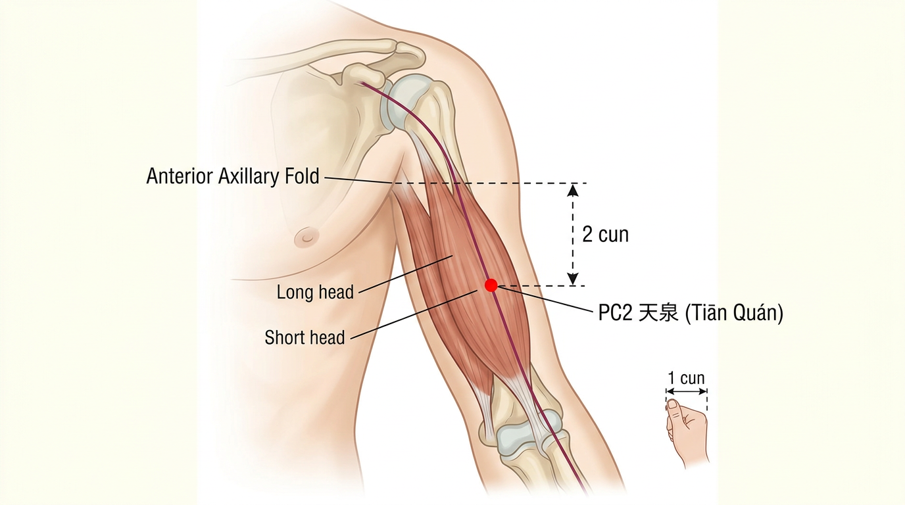

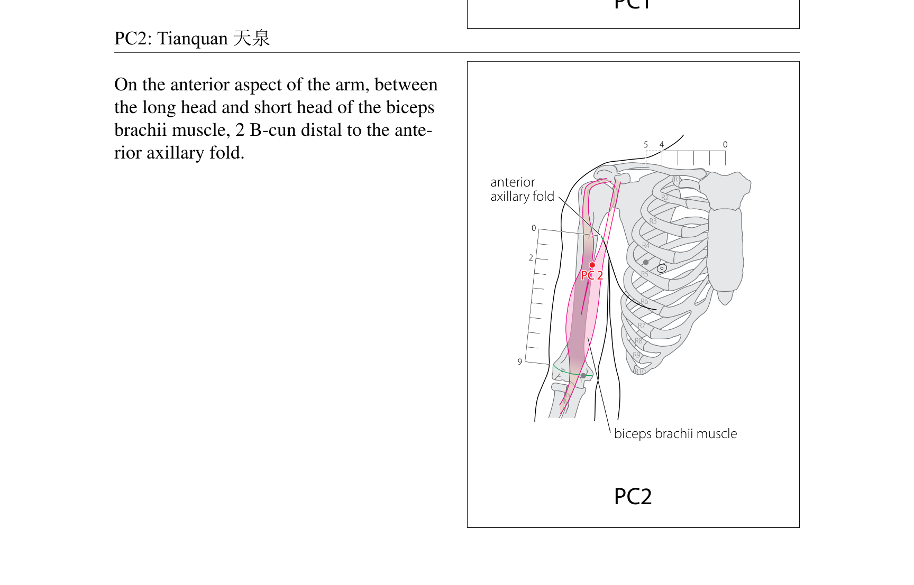

> **External References:** [AcuPoints](https://www.acupoints.org/pc2-acupuncture-point/)

**מיקום אנטומי:** 2 צון מתחת לקצה הקדמי של קפל בית השחי, בין שני ראשי שריר הביצפס.

**איך למצוא את הנקודה:**

1. מצאו את קצה קפל בית השחי הקדמי
2. מדדו 2 צון כלפי מטה לאורך הזרוע
3. הנקודה נמצאת בין שני ראשי שריר הביצפס ברכיאי
4. בקשו מהמטופל לכווץ קלות את שריר הביצפס כדי לזהות את החריץ בין הראשים

**עומק דקירה:** 0.5-1 צון

**זווית דקירה:** ניצבת (90°)

**תחושת דה-צ'י:** כאב מקומי, תחושת כבדות בזרוע

**פעולות והתוויות:**

* מפעילה את מחזור הדם בחזה ובזרוע
* מרחיבה את החזה
* התוויות: כאב בחזה, פלפיטציות, כאב בזרוע, שיעול, כאב בצד הפנימי של הזרוע

**שילובי נקודות נפוצים:**

* PC2 + HT1 — לכאב בזרוע הפנימית
* PC2 + REN17 — לכאב בחזה

***

#### PC3 — צ'יו צה — Qū Zé — "ביצה מתעקלת"

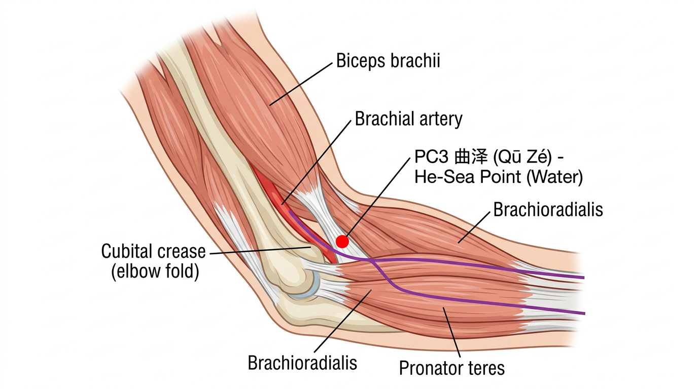

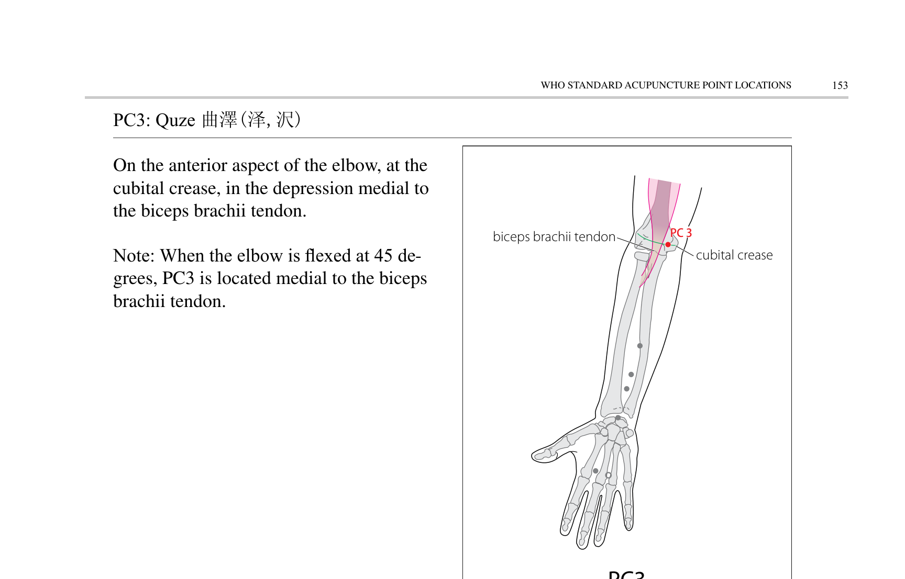

> **External References:** [AcuPoints](https://www.acupoints.org/pc3-acupuncture-point/)

**קטגוריה מיוחדת:** נקודת הא-ים, נקודת מים

**מיקום אנטומי:** על קפל המרפק (קפל קובויטלי), בצד האולנרי (מדיאלי) לגיד שריר הביצפס ברכיאי.

**איך למצוא את הנקודה:**

1. בקשו מהמטופל ליישר את הזרוע עם כף היד כלפי מעלה
2. כופפו קלות את המרפק
3. מצאו את גיד הביצפס הבולט בקפל המרפק
4. הנקודה נמצאת מיד לצד האולנרי (הפנימי) של הגיד
5. דופק עורק הברכיאלי מורגש בסמוך

**עומק דקירה:** 0.5-1 צון (או דקירה להוצאת דם בטכניקת הקזה)

**זווית דקירה:** ניצבת (90°), להימנע מפגיעה בעורק הברכיאלי

**תחושת דה-צ'י:** כאב מקומי, תחושת נימול או חשמל היורדים לאמה ולכף היד

**פעולות והתוויות:**

* מנקה חום מהלב ומקרום הלב
* מנקה חום מהדם
* מפעילה את הערוץ ושוככת כאב
* מרגיעה את הקיבה
* התוויות: כאב בלב ובחזה, פלפיטציות, כאב בקיבה, הקאות, שלשולים, חום גבוה, חוסר שקט, כאב במרפק ובזרוע

**שילובי נקודות נפוצים:**

* PC3 + HT3 — לניקוי חום מהלב
* PC3 + ST36 — לטיפול בהקאות ובעיות קיבה
* PC3 + BL40 — לניקוי חום מהדם (טכניקת הקזה)

***

#### PC4 — שי מן — Xì Mén — "שער הסדק"

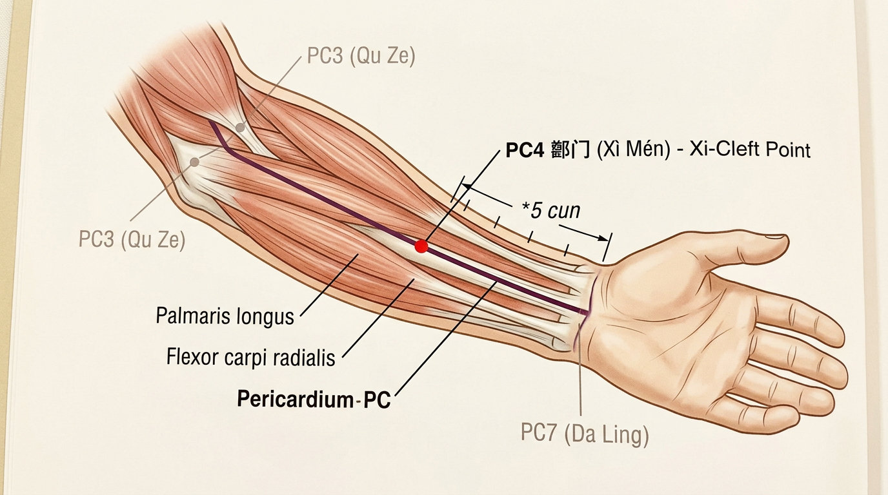

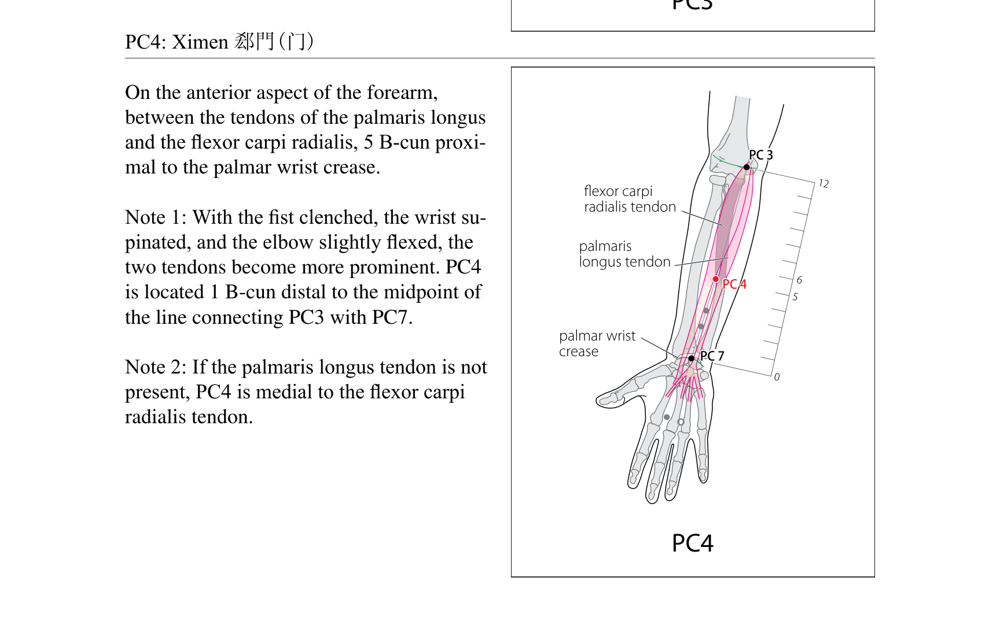

> **External References:** [AcuPoints](https://www.acupoints.org/pc4-acupuncture-point/)

**קטגוריה מיוחדת:** נקודת שי-צבירה

**מיקום אנטומי:** 5 צון מעל קפל שורש כף היד, בין גידי הפלמריס לונגוס לפלקסור קרפי רדיאליס.

**איך למצוא את הנקודה:**

1. מצאו את קפל שורש כף היד
2. מדדו 5 צון כלפי מעלה (לכיוון המרפק) לאורך האמה
3. הנקודה נמצאת בין שני הגידים: פלמריס לונגוס (מרכזי) ופלקסור קרפי רדיאליס (צד אגודל)
4. בקשו מהמטופל לכווץ קלות את שורש כף היד כדי להבליט את הגידים
5. הנקודה בדיוק באמצע בין PC3 ל-PC7

**עומק דקירה:** 0.5-1 צון

**זווית דקירה:** ניצבת (90°)

**תחושת דה-צ'י:** כאב מקומי, תחושת נימול או כבדות היורדת לכף היד

**פעולות והתוויות:**

* מרגיעה את הלב ומשכינה את הרוח (שן)
* מנקה חום מהדם, עוצרת דימום
* מפעילה את מחזור הדם ומפזרת סטגנציה
* התוויות: כאב בחזה (אנגינה), פלפיטציות, המופטיזיס (שיעול דם), דימום מהאף, מורסות, חרדה חריפה, אפילפסיה

**שילובי נקודות נפוצים:**

* PC4 + HT7 — לפלפיטציות וחרדה חריפה
* PC4 + SP1 — לעצירת דימום
* PC4 + PC6 — לכאב בחזה (אנגינה)

***

#### PC5 — ג'יאן שי — Jiān Shǐ — "שליח מתווך"

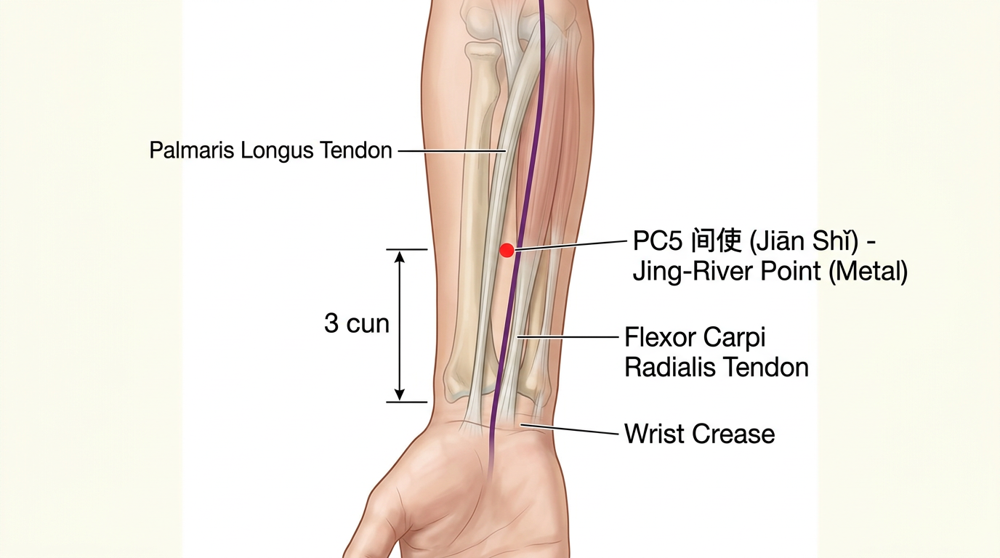

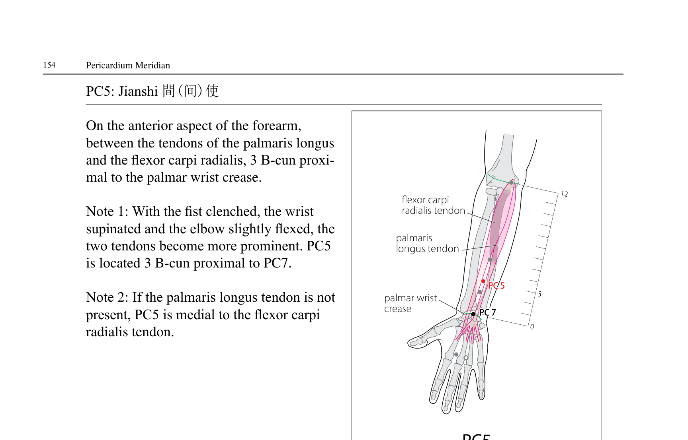

> **External References:** [AcuPoints](https://www.acupoints.org/pc5-acupuncture-point/)

**קטגוריה מיוחדת:** נקודת ג'ינג-נהר, נקודת מתכת

**מיקום אנטומי:** 3 צון מעל קפל שורש כף היד, בין גידי הפלמריס לונגוס לפלקסור קרפי רדיאליס.

**איך למצוא את הנקודה:**

1. מצאו את קפל שורש כף היד
2. מדדו 3 צון כלפי מעלה לאורך האמה
3. הנקודה נמצאת בין שני הגידים (אותם גידים כמו PC4)
4. 2 צון מתחת ל-PC4

**עומק דקירה:** 0.5-1 צון

**זווית דקירה:** ניצבת (90°)

**תחושת דה-צ'י:** כאב מקומי, תחושת חשמל או נימול היורדים לכף היד ולאצבעות

**פעולות והתוויות:**

* מנקה חום מקרום הלב
* מפזרת פליגמה מהלב (פותחת את פתחי הלב)
* מווסתת את הקיבה ומורידה צ'י מנוגד
* מפעילה את מחזור הדם
* התוויות: כאב בלב, פלפיטציות, מאניה, אפילפסיה, כאב בקיבה, הקאות, מלריה, כאב במרפק ובזרוע

**שילובי נקודות נפוצים:**

* PC5 + HT5 — להרגעת הרוח ופתיחת פתחי הלב
* PC5 + ST40 — לפיזור פליגמה מהלב
* PC5 + REN12 — לטיפול בבעיות קיבה

***

#### PC6 — ניי גואן — Nèi Guān — "מעבר פנימי"

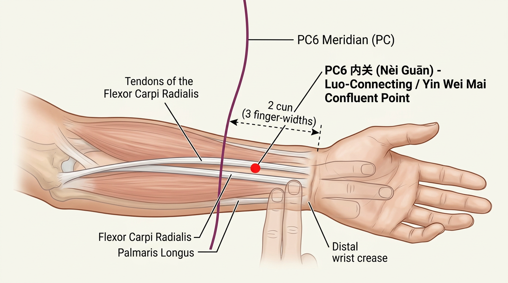

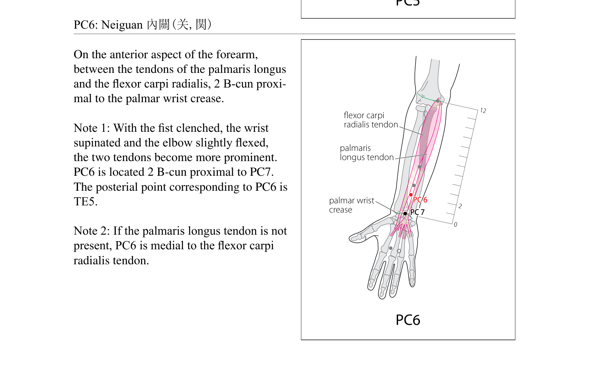

> **External References:** [AcuPoints](https://www.acupoints.org/pc6-acupuncture-point/)

**קטגוריה מיוחדת:** נקודת לואו-מחברת, אחת מ-8 נקודות המפגש — מחוברת לין ווי מאי, נקודת פיקוד על החזה (שיטת מאסטר טונג)

**מיקום אנטומי:** 2 צון מעל קפל שורש כף היד, בין גידי הפלמריס לונגוס לפלקסור קרפי רדיאליס.

**איך למצוא את הנקודה:**

1. מצאו את קפל שורש כף היד
2. מדדו 2 צון כלפי מעלה (כרוחב 3 אצבעות של המטופל)
3. הנקודה נמצאת בין שני הגידים הבולטים בצד הפנימי של האמה
4. בקשו מהמטופל לכווץ את שורש כף היד — הגידים בולטים
5. הנקודה בדיוק באמצע ביניהם

**עומק דקירה:** 0.5-1 צון

**זווית דקירה:** ניצבת (90°)

**תחושת דה-צ'י:** כאב מקומי, תחושת חשמל או נימול המתפשטים לכף היד ולאצבע האמצעית; לעיתים תחושה עולה לכיוון המרפק

**פעולות והתוויות:**

* מרגיעה את הלב ומשכינה את הרוח
* מרחיבה את החזה, מווסתת צ'י
* מפזרת סטגנציה בחזה ובקיבה
* נוגדת בחילות והקאות (אחת הנקודות היעילות ביותר לבחילה)
* מפעילה את ין ווי מאי
* התוויות: כאב בחזה (אנגינה), פלפיטציות, בחילות, הקאות, שיהוקים, כאב בקיבה, נדודי שינה, חרדה, דיכאון, מאניה, אפילפסיה, כאב בזרוע, מלריה

**שילובי נקודות נפוצים:**

* PC6 + SP4 — פתיחת חונג מאי — לבעיות בטן, חזה, לב, וגינקולוגיה
* PC6 + HT7 — להרגעת הרוח, נדודי שינה, חרדה
* PC6 + ST36 — לבחילות, הקאות, בעיות עיכול
* PC6 + REN12 — לכאבי קיבה
* PC6 + TE5 — חיבור לואו-יואן; כאב ראש, חום, בעיות אוזניים

***

#### PC7 — דא לינג — Dà Líng — "גבעה גדולה"

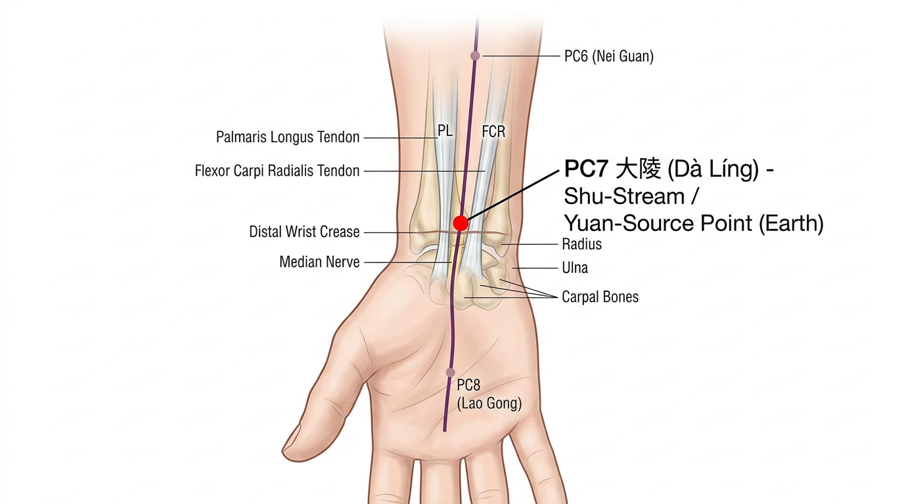

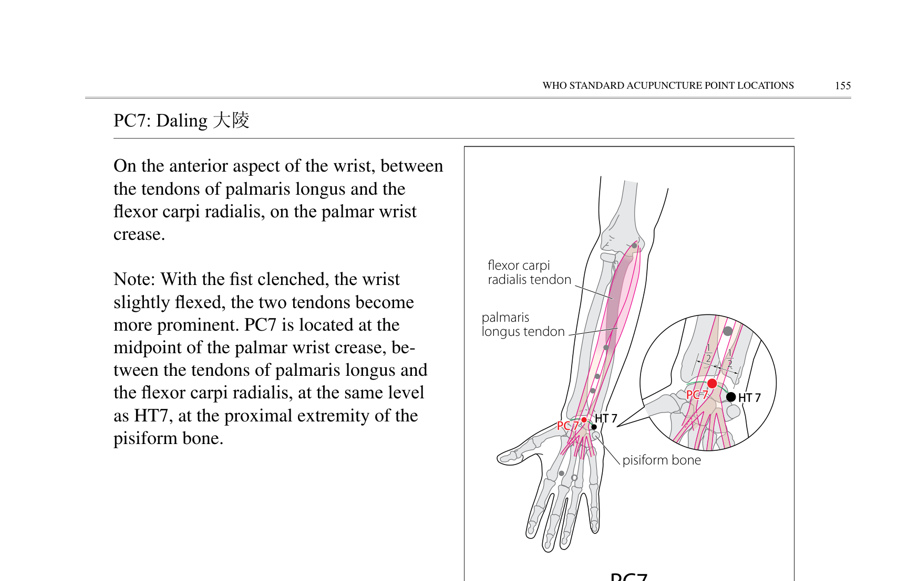

> **External References:** [AcuPoints](https://www.acupoints.org/pc7-acupuncture-point/)

**קטגוריה מיוחדת:** נקודת שו-זרם, נקודת יואן-מקור, נקודת אדמה, נקודת הרגעה

**מיקום אנטומי:** באמצע קפל שורש כף היד, בין גידי הפלמריס לונגוס לפלקסור קרפי רדיאליס.

**איך למצוא את הנקודה:**

1. מצאו את קפל שורש כף היד (הקפל הדיסטלי)
2. הנקודה נמצאת בדיוק על הקפל, באמצע בין שני הגידים
3. בקשו מהמטופל לכווץ קלות את שורש כף היד כדי להבליט את הגידים
4. הנקודה בין הגידים, בגובה הקפל

**עומק דקירה:** 0.3-0.5 צון

**זווית דקירה:** ניצבת (90°)

**תחושת דה-צ'י:** כאב מקומי, תחושת נימול או חשמל המתפשטים לכף היד ולאצבעות

**פעולות והתוויות:**

* מנקה חום מהלב ומרגיעה את הרוח
* מפזרת פליגמה מהלב (נקודה מצוינת למצבים פסיכיאטריים)
* מווסתת את הקיבה
* מועילה לשורש כף היד
* התוויות: כאב בחזה, פלפיטציות, כאב בקיבה, הקאות, מאניה, אפילפסיה, דיכאון, נדודי שינה, ריח רע מהפה, כאב בשורש כף היד (תעלה קרפלית)

**שילובי נקודות נפוצים:**

* PC7 + HT7 — להרגעת הרוח ולטיפול בנדודי שינה
* PC7 + ST44 — לניקוי חום מהקיבה וריח רע מהפה
* PC7 + DU26 — לטיפול במצבי חירום (מאניה, אפילפסיה)

***

#### PC8 — לאו גונג — Láo Gōng — "ארמון העמל"

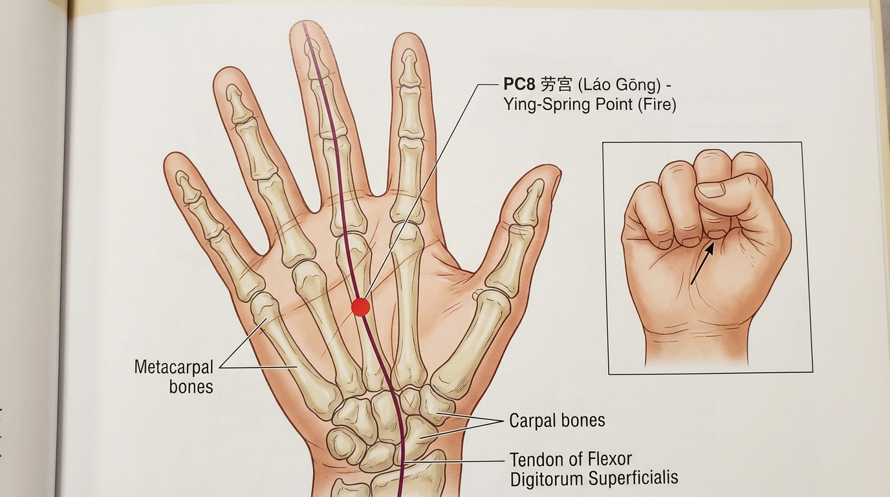

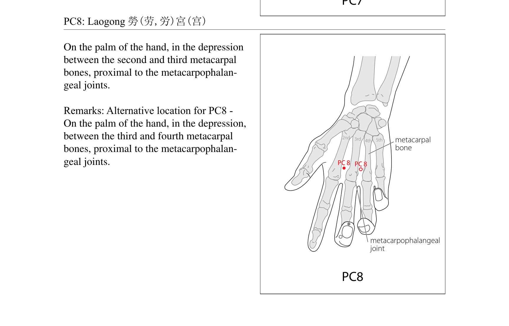

> **External References:** [AcuPoints](https://www.acupoints.org/pc8-acupuncture-point/)

**קטגוריה מיוחדת:** נקודת יינג-מעיין, נקודת אש

**מיקום אנטומי:** באמצע כף היד, בין עצמות המטקרפל ה-2 וה-3, פרוקסימלית למפרק המטקרפו-פלנגאלי.

**איך למצוא את הנקודה:**

1. בקשו מהמטופל לקפוץ אגרוף
2. הנקודה נמצאת במקום שבו קצה האצבע האמצעית נוגע בכף היד
3. לחלופין: במקום שבו קצות האצבע האמצעית והטבעתית נוגעות בכף היד כשמקפצים אגרוף
4. הנקודה באזור הפרוקסימלי של עצם המטקרפל ה-3

**עומק דקירה:** 0.3-0.5 צון

**זווית דקירה:** ניצבת (90°)

**תחושת דה-צ'י:** כאב מקומי חד, תחושת חשמל

**פעולות והתוויות:**

* מנקה חום מהלב ומקרום הלב
* מחייה את ההכרה, פותחת את חושי הראש
* מנקה חום מהדם
* מורידה אש מהלב
* התוויות: אובדן הכרה, שבץ, חום גבוה, כאב בפה (כיבים), ריח רע מהפה, פלפיטציות, מאניה, אפילפסיה, פטרת בפה (קנדידה), זיעה בכפות הידיים

**שילובי נקודות נפוצים:**

* PC8 + DU26 + KI1 — לטיפול חירום באובדן הכרה
* PC8 + HT8 — לניקוי חום מהלב
* PC8 + KI1 — להורדת חום מהראש

***

#### PC9 — ג'ונג צ'ונג — Zhōng Chōng — "פגיעה מרכזית"

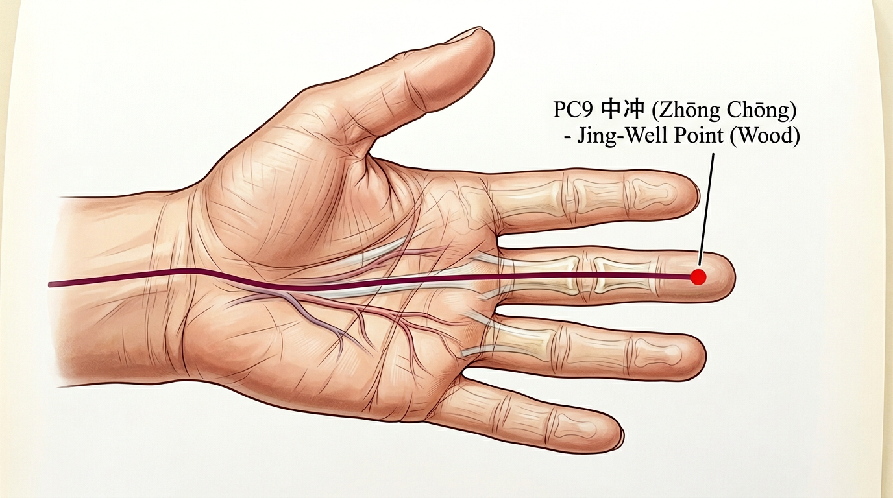

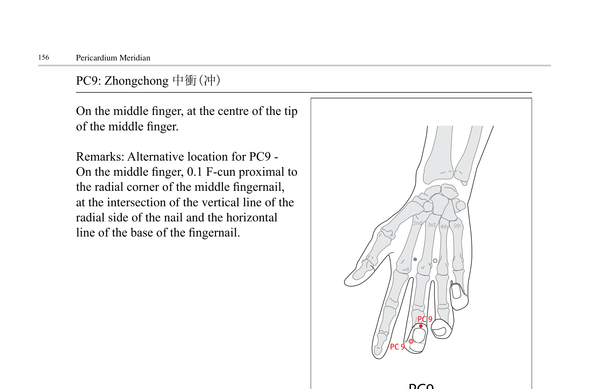

> **External References:** [AcuPoints](https://www.acupoints.org/pc9-acupuncture-point/)

**קטגוריה מיוחדת:** נקודת ג'ינג-באר, נקודת עץ

**מיקום אנטומי:** במרכז קצה האצבע האמצעית, 0.1 צון פרוקסימלית לזווית הציפורן.

**איך למצוא את הנקודה:**

1. מצאו את האצבע האמצעית
2. הנקודה נמצאת במרכז קצה האצבע
3. 0.1 צון (כ-1 מ"מ) מאחורי (פרוקסימלי) לזווית הציפורן
4. בקצה ה"בשרני" של האצבע

**עומק דקירה:** 0.1-0.2 צון (או דקירת הקזה)

**זווית דקירה:** ניצבת (90°) או דקירה שטוחה כלפי מעלה

**תחושת דה-צ'י:** כאב חד מקומי

**פעולות והתוויות:**

* מנקה חום, מחייה את ההכרה
* פותחת את חושי הראש
* מורידה חום ממצבי חירום
* התוויות: אובדן הכרה, שבץ, חום גבוה, מכת חום, כאב בלשון, נפיחות בלשון, כאב בלב, פלפיטציות, לילדים: חום עם עוויתות

**שילובי נקודות נפוצים:**

* PC9 + DU26 + KI1 — לטיפול חירום באובדן הכרה
* PC9 + שאר נקודות ג'ינג-באר (LU11, HT9, LI1 וכו') — לניקוי חום ומצבי חירום
* PC9 + HT9 — לכאב בלשון ובלב

***

### 4. סיכום נקודות מפתח של ערוץ קרום הלב

#### 4.1 נקודות חשובות ביותר

| נקודה | שם | חשיבות |
| ------- | ----------- | ------------------------------------------ |
| **PC3** | צ'יו צה | ניקוי חום מהלב ומהדם, בעיות קיבה |
| **PC6** | ניי גואן | נקודת המפתח - בחילות, חזה, לב, רגש |
| **PC7** | דא לינג | נקודת יואן - הרגעת הרוח, מצבים פסיכיאטריים |
| **PC8** | לאו גונג | חירום, ניקוי חום, אובדן הכרה |
| **PC9** | ג'ונג צ'ונג | חירום, החייאה |

#### 4.2 נקודות חמשת האלמנטים

| אלמנט | נקודה | סוג |
| -------- | ----- | -------------- |
| עץ | PC9 | ג'ינג-באר |
| אש | PC8 | יינג-מעיין |
| אדמה | PC7 | שו-זרם |
| מתכת | PC5 | ג'ינג-נהר |
| מים | PC3 | הא-ים |

#### 4.3 נקודות מיוחדות

| קטגוריה | נקודה |
| --------------------- | ---------------- |
| נקודת יואן | PC7 |
| נקודת לואו | PC6 |
| נקודת שי | PC4 |
| 8 נקודות מפגש | PC6 (ין ווי מאי) |

***

### 5. תרגילים

1. שרטטו את מסלול ערוץ קרום הלב על גוף שותף ללימודים וסמנו את כל 9 הנקודות.
2. תרגלו איתור PC3, PC6, PC7, ו-PC8 בעיניים עצומות.
3. הסבירו כיצד PC6 משפיעה על בחילות מנקודת מבט של הרפואה הסינית.
4. כתבו מרשם נקודות לטיפול ב: (א) פלפיטציות עם חרדה, (ב) בחילות בהריון, (ג) נדודי שינה עם חלומות מפחידים.

***

### ניווט

* **הקודם**: [ערוץ הכליות (KI)](09-kidney-channel.md) | **הבא**: [ערוץ שלוש המבערות (TE)](11-triple-energizer.md)
* **זוג פנים-חוץ**: [ערוץ שלוש המבערות (TE)](11-triple-energizer.md) — ערוץ היאנג הזוגי (אלמנט אש שרת)
* **חזרה למודול**: [מודול 2 — מרידיאנים]
