# 11-triple-energizer

## ערוץ שלוש המבערות - שו שאו יאנג סאן ג'יאו (手少阳三焦经)

### Triple Energizer Channel - Shǒu Shǎo Yáng Sān Jiāo Jīng

***

### מטרות למידה

בסיום שיעור זה, הסטודנט יוכל:

1. לתאר את מסלול ערוץ שלוש המבערות החיצוני והפנימי
2. לאתר את 23 הנקודות של הערוץ (TE1-TE23)
3. להסביר את תפקודי שלוש המבערות ברפואה הסינית
4. לזהות פתולוגיות נפוצות ולבחור נקודות מתאימות
5. ליישם שילובי נקודות קלאסיים לטיפול במצבים של שלוש המבערות

***

### 1. סקירת הערוץ

#### 1.1 מידע כללי

| פרט              | תיאור                                 |
| ---------------- | ------------------------------------- |
| **שם סיני**      | 手少阳三焦经 (Shǒu Shǎo Yáng Sān Jiāo Jīng) |
| **קיצור**        | TE (Triple Energizer) / SJ (San Jiao) |
| **מספר נקודות**  | 23                                    |
| **סוג**          | יאנג (Yang)                           |
| **אלמנט**        | אש שרתית (相火 Xiāng Huǒ)               |
| **שעות פעילות**  | 21:00-23:00                           |
| **כיוון זרימה**  | מקצה האצבע הטבעתית עולה אל הראש       |
| **זוג פנים-חוץ** | קרום הלב (PC - 手厥阴心包经)                |

#### 1.2 מסלול הערוץ

**מסלול חיצוני:** הערוץ מתחיל בקצה האצבע הטבעתית (TE1), עולה בין עצמות המטקרפל ה-4 וה-5 בגב היד (TE2-TE4), עובר לאורך הצד הדורסלי (חיצוני) של האמה בין הרדיוס לאולנה (TE5-TE10), עובר את הקפל האחורי של המרפק (TE10), עולה בצד הלטרלי-אחורי של הזרוע העליונה (TE11-TE14), עולה לכתף (TE14-TE15), עובר לצד הצוואר (TE16-TE17), עוטף את האוזן (TE17-TE22), ומסתיים בקצה החיצוני של הגבה (TE23).

**מסלול פנימי:** מהכתף, הערוץ הפנימי נכנס לפוסה העל-בריחית, יורד לחזה ומתחבר לקרום הלב (פריקרדיום). משם יורד דרך הסרעפת ומתחבר לשלושת המבערות — העליונה, האמצעית והתחתונה.

**ענפים:** ענף יוצא מאחורי האוזן, נכנס לאוזן, יוצא מלפני האוזן ומגיע לקצה החיצוני של הגבה (TE23), שם מתחבר לערוץ כיס המרה (GB1).

#### 1.3 זוג פנים-חוץ

ערוץ שלוש המבערות (שו שאו יאנג - 手少阳) הוא הערוץ החיצוני (יאנג) המזווג עם ערוץ קרום הלב (שו ג'יואה ין - 手厥阴), שהוא הערוץ הפנימי (ין). שניהם שייכים לאש המיניסטריאלית (相火).

***

### 2. תפקודי שלוש המבערות (三焦 Sān Jiāo)

#### 2.1 שלוש המבערות

שלוש המבערות הוא "איבר" ייחודי ברפואה הסינית — יש לו תפקוד אך אין לו צורה פיזית ברורה (有名无形). הוא מחולק לשלוש קומות:

| מבערה           | מיקום            | תפקיד                              | איברים                     |
| --------------- | ---------------- | ---------------------------------- | -------------------------- |
| **עליונה (上焦)** | מעל הסרעפת       | "כמו ערפל" — מפזרת צ'י ונוזלים     | לב, ריאות, קרום הלב        |
| **אמצעית (中焦)** | בין הסרעפת לטבור | "כמו בועות רותחות" — מעכלת ומפרידה | קיבה, טחול                 |
| **תחתונה (下焦)** | מתחת לטבור       | "כמו תעלת ניקוז" — מפרישה ומסלקת   | כליות, שלפוחית, כבד, מעיים |

#### 2.2 תפקודים עיקריים

1. **שליטה על מעברי המים** - שלוש המבערות שולטות על תנועת הנוזלים בכל הגוף, משמשות כ"מערכת ההשקיה" של הגוף.
2. **הובלת צ'י** - שלוש המבערות הן המסלול שדרכו הצ'י המקורית (原气 Yuán Qì) מופצת לכל הגוף.
3. **העברת מזון ופסולת** - שלוש המבערות מנהלות את תהליך העיכול, הספיגה וההפרשה.

#### 2.3 פתולוגיות נפוצות

| דפוס                       | סימפטומים עיקריים                                          |
| -------------------------- | ---------------------------------------------------------- |
| **חסימת מבערה עליונה**     | קוצר נשימה, כאב בחזה, שיעול                                |
| **חסימת מבערה אמצעית**     | נפיחות, בחילות, חוסר תיאבון, עיכול איטי                    |
| **חסימת מבערה תחתונה**     | בצקות, קושי במתן שתן, עצירות                               |
| **לחות-חום בשלוש המבערות** | חום, צמא, שתן כהה, גוף כבד                                 |
| **בעיות לאורך הערוץ**      | כאב באוזן, טינטון, חירשות, כאב בצד הראש, כאב בזרוע הלטרלית |

***

### 3. נקודות הערוץ (TE1-TE23)

***

> **WHO Standard Acupuncture Point Locations** (WHO, CC BY-NC-SA 3.0 IGO):
>
> 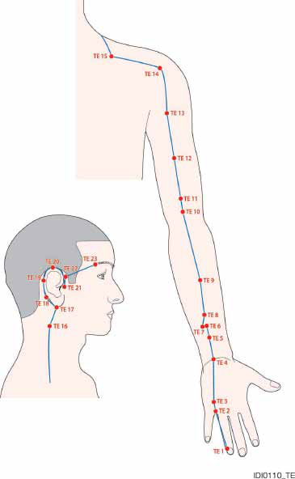

#### TE1 — גואן צ'ונג (关冲) — Guān Chōng — "מעבר פגיעה"

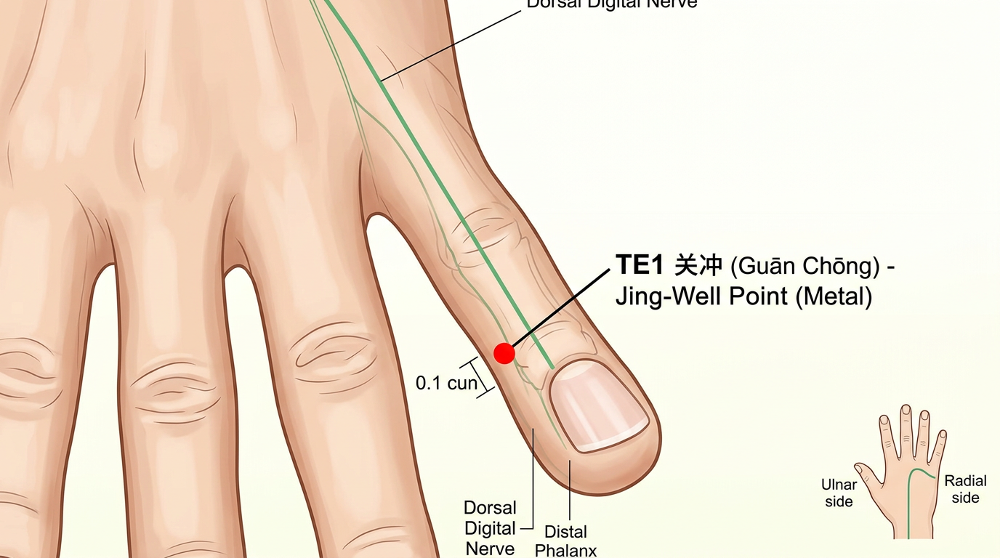

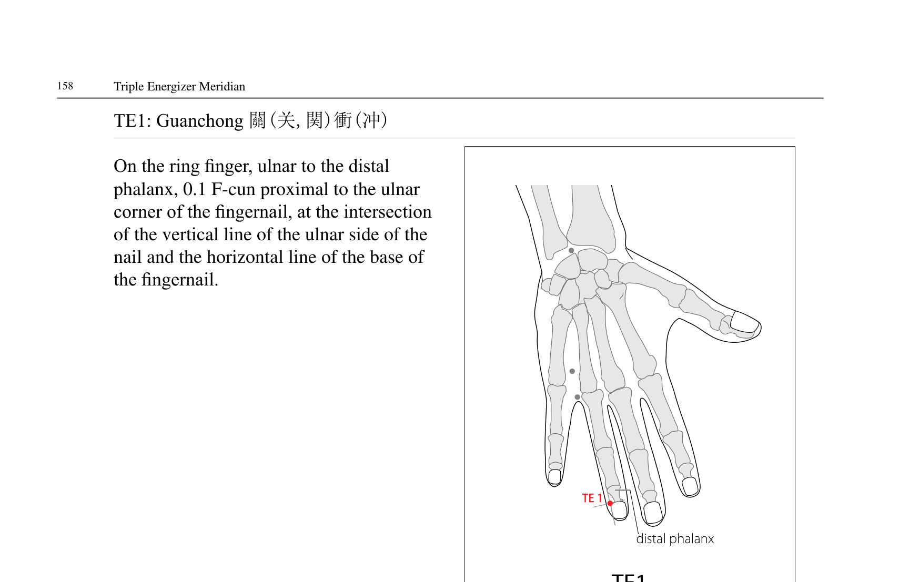

> **External References:** [AcuPoints](https://www.acupoints.org/te1-acupuncture-point/)

**קטגוריה מיוחדת:** נקודת ג'ינג-באר (井穴), נקודת מתכת (金)

**מיקום אנטומי:** בצד האולנרי של האצבע הטבעתית, 0.1 צון פרוקסימלית לזווית הציפורן.

**איך למצוא את הנקודה:**

1. מצאו את האצבע הטבעתית (אצבע 4)
2. הנקודה בצד שפונה לאצבע הקטנה (צד אולנרי)
3. 0.1 צון (כ-1 מ"מ) מאחורי זווית בסיס הציפורן
4. בפינה שבין שולי הציפורן לעור

**עומק דקירה:** 0.1-0.2 צון (או דקירת הקזה)

**זווית דקירה:** ניצבת (90°) או שטוחה כלפי מעלה

**תחושת דה-צ'י:** כאב חד מקומי

**פעולות והתוויות:**

* מנקה חום, מורידה חום
* מחייה את ההכרה
* מועילה לאוזניים ולגרון
* התוויות: כאב ראש, אדמומיות בעיניים, כאב גרון, חום גבוה, כאב באוזניים, טינטון, חוסר שקט

**שילובי נקודות נפוצים:**

* TE1 + שאר נקודות ג'ינג-באר — להורדת חום ומצבי חירום
* TE1 + LI4 — לטיפול בכאב גרון וחום

***

#### TE2 — יה מן (液门) — Yè Mén — "שער הנוזלים"

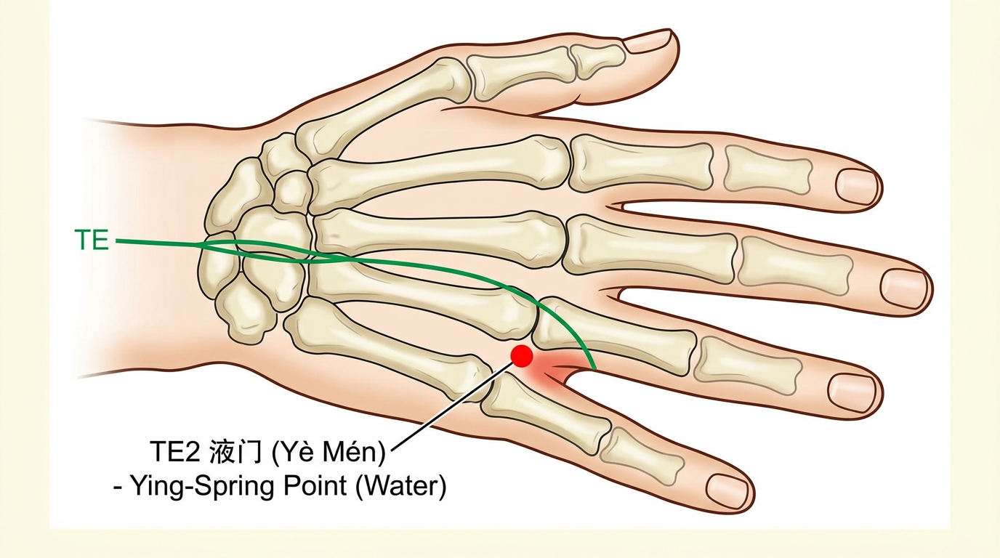

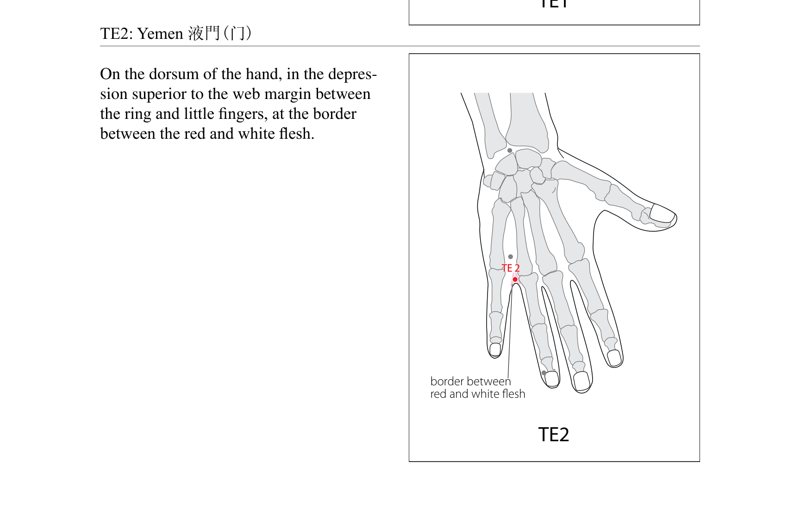

> **External References:** [AcuPoints](https://www.acupoints.org/te2-acupuncture-point/)

**קטגוריה מיוחדת:** נקודת יינג-מעיין (荥穴), נקודת מים (水)

**מיקום אנטומי:** בשקע הפרוקסימלי לקצה הקרום שבין האצבע הטבעתית לאצבע הקטנה, בגב היד.

**איך למצוא את הנקודה:**

1. מצאו את הקרום (רשת) שבין האצבע הטבעתית לקטנה
2. החליקו לכיוון הפרוקסימלי (לכיוון שורש כף היד) עד שתרגישו שקע
3. הנקודה נמצאת ממש מאחורי קצה הקרום, בין עצמות המטקרפל ה-4 וה-5
4. בקשו מהמטופל לקפוץ אגרוף קל — השקע ברור יותר

**עומק דקירה:** 0.3-0.5 צון

**זווית דקירה:** ניצבת (90°) או אובליקית כלפי מעלה

**תחושת דה-צ'י:** כאב מקומי, תחושת נפיחות בין האצבעות

**פעולות והתוויות:**

* מנקה חום, מועילה לאוזניים
* מווסתת צ'י של שלוש המבערות
* התוויות: כאב אוזניים, טינטון, חירשות, כאב ראש, כאב גרון, מלריה, כאב ביד

**שילובי נקודות נפוצים:**

* TE2 + TE3 — לטיפול בכאב אוזניים וטינטון
* TE2 + SI19 — לבעיות שמיעה

***

#### TE3 — ג'ונג ג'ו (中渚) — Zhōng Zhǔ — "אי מרכזי"

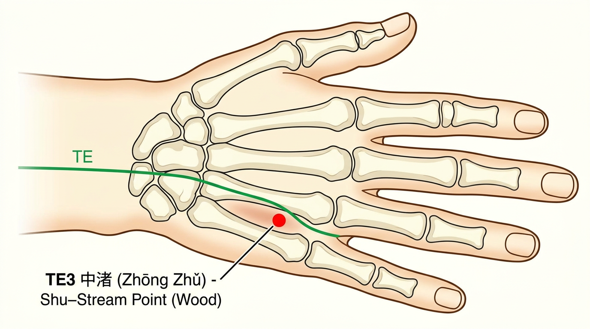

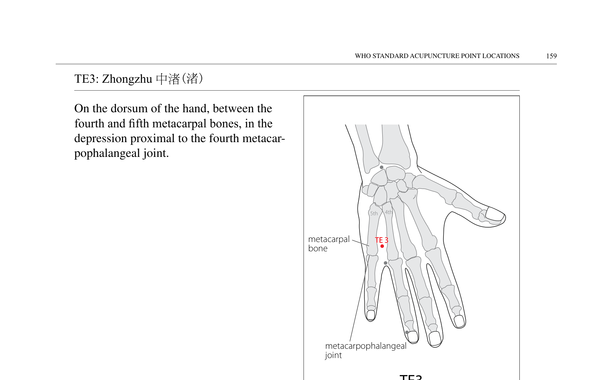

> **External References:** [AcuPoints](https://www.acupoints.org/te3-acupuncture-point/)

**קטגוריה מיוחדת:** נקודת שו-זרם (输穴), נקודת עץ (木)

**מיקום אנטומי:** בגב היד, בשקע שבין עצמות המטקרפל ה-4 וה-5, פרוקסימלית למפרק המטקרפו-פלנגאלי ה-4.

**איך למצוא את הנקודה:**

1. מצאו את המפרק שבבסיס האצבע הטבעתית (MCP ה-4)
2. החליקו פרוקסימלית (לכיוון שורש כף היד) כ-1 צון
3. הנקודה נמצאת בשקע שבין עצמות המטקרפל ה-4 וה-5
4. בקשו מהמטופל לקפוץ אגרוף — השקע בולט

**עומק דקירה:** 0.5-0.8 צון

**זווית דקירה:** ניצבת (90°)

**תחושת דה-צ'י:** כאב מקומי, תחושת נפיחות או נימול המתפשטים לאצבעות

**פעולות והתוויות:**

* מנקה חום, מועילה לאוזניים ולעיניים
* מפזרת רוח-חום
* מפעילה את הערוץ ומשחררת כאב
* התוויות: כאב אוזניים, טינטון, חירשות, כאב ראש, כאב גרון, חום, כאב בזרוע וביד, כאב בכתף

**שילובי נקודות נפוצים:**

* TE3 + GB41 — פתיחת דאי מאי (带脉) — לטיפול בכאבי צד, בעיות אוזניים, כאב ראש צידי
* TE3 + TE5 — לכאב בזרוע ובכתף
* TE3 + SI19 + GB2 — לטיפול בטינטון וחירשות

***

#### TE4 — יאנג צ'י (阳池) — Yáng Chí — "בריכת היאנג"

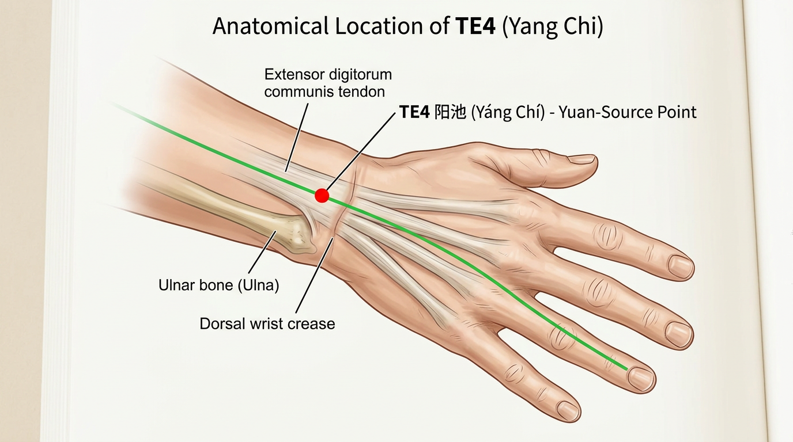

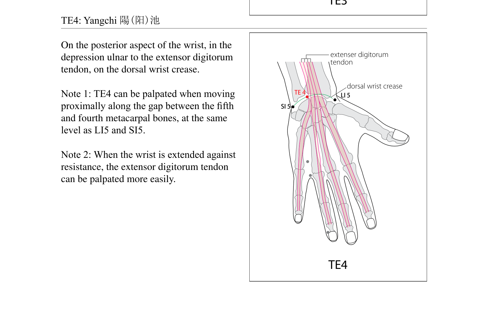

> **External References:** [AcuPoints](https://www.acupoints.org/te4-acupuncture-point/)

**קטגוריה מיוחדת:** נקודת יואן-מקור (原穴)

**מיקום אנטומי:** בגב שורש כף היד (דורסלי), בשקע שעל קפל שורש כף היד, בצד האולנרי לגיד שריר האקסטנסור דיגיטורום קומוניס.

**איך למצוא את הנקודה:**

1. מצאו את קפל שורש כף היד בצד הדורסלי (גב היד)
2. זהו את הגידים המיישרים את האצבעות (אקסטנסור דיגיטורום)
3. הנקודה נמצאת בשקע שבצד האולנרי (צד קטנה) לגידים אלו
4. ממש על קפל שורש כף היד
5. בקשו מהמטופל להרחיב את האצבעות — הגידים בולטים

**עומק דקירה:** 0.3-0.5 צון

**זווית דקירה:** ניצבת (90°)

**תחושת דה-צ'י:** כאב מקומי, תחושת נפיחות בשורש כף היד

**פעולות והתוויות:**

* מחזקת את צ'י המקור (原气) דרך שלוש המבערות
* מפזרת רוח-חום
* משחררת את שורש כף היד
* התוויות: כאב בשורש כף היד, כאב בכתף ובזרוע, חירשות, מלריה, צמא, כאב גרון

**שילובי נקודות נפוצים:**

* TE4 + PC7 — חיבור יואן-יואן בין ערוצים מזווגים (כאב שורש כף היד)
* TE4 + LI4 — לכאב בגפה העליונה

***

#### TE5 — וואי גואן (外关) — Wài Guān — "מעבר חיצוני"

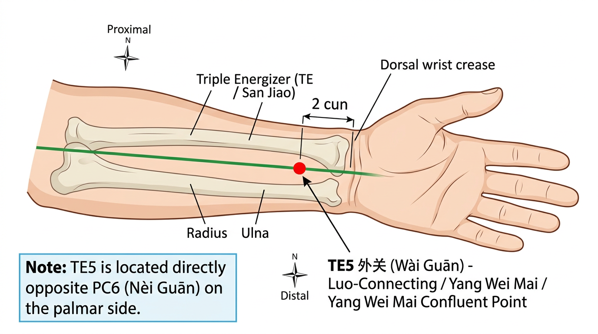

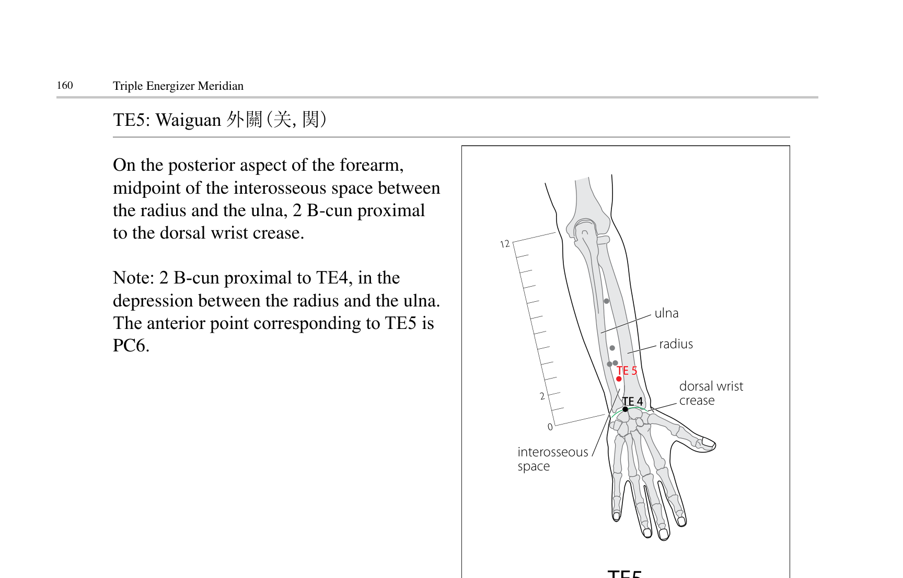

> **External References:** [AcuPoints](https://www.acupoints.org/te5-acupuncture-point/)

**קטגוריה מיוחדת:** נקודת לואו-מחברת (络穴), אחת מ-8 נקודות המפגש (八脉交会穴) — מחוברת ליאנג ווי מאי (阳维脉)

**מיקום אנטומי:** 2 צון מעל קפל שורש כף היד הדורסלי, בין עצם הרדיוס לאולנה.

**איך למצוא את הנקודה:**

1. מצאו את קפל שורש כף היד בגב היד
2. מדדו 2 צון כלפי מעלה (לכיוון המרפק)
3. הנקודה נמצאת בין שתי עצמות האמה (רדיוס ואולנה)
4. היא ממוקמת בדיוק מול PC6 (שנמצאת בצד הפנימי של האמה)

**עומק דקירה:** 0.5-1 צון

**זווית דקירה:** ניצבת (90°)

**תחושת דה-צ'י:** כאב מקומי, תחושת נימול או חשמל המתפשטים לאצבעות או עולים לכיוון המרפק

**פעולות והתוויות:**

* מפזרת רוח-חום, משחררת את החיצוני (解表)
* מנקה חום, מורידה חום
* מפעילה את יאנג ווי מאי
* משחררת כאב לאורך הערוץ
* מועילה לאוזניים
* התוויות: חום, כאב ראש, כאב באוזניים, טינטון, חירשות, כאב בצד הראש, כאב בעיניים, כאב בזרוע וביד, כאב בצלעות, עצירות

**שילובי נקודות נפוצים:**

* TE5 + GB41 — פתיחת דאי מאי (带脉) + יאנג ווי מאי — לכאבי צד, אוזניים, כאב ראש
* TE5 + PC6 — חיבור לואו-יואן; כאב בחזה ובזרוע, חום
* TE5 + LI4 — לפיזור רוח-חום (הצטננות חמה)
* TE5 + GB20 — לכאב ראש ונוקשות צוואר

***

#### TE6 — ג'י גו (支沟) — Zhī Gōu — "חפיר ענפים"

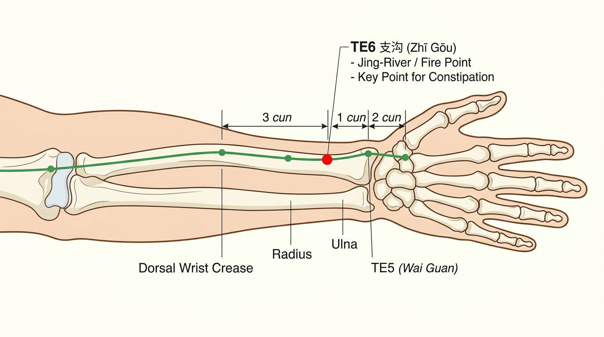

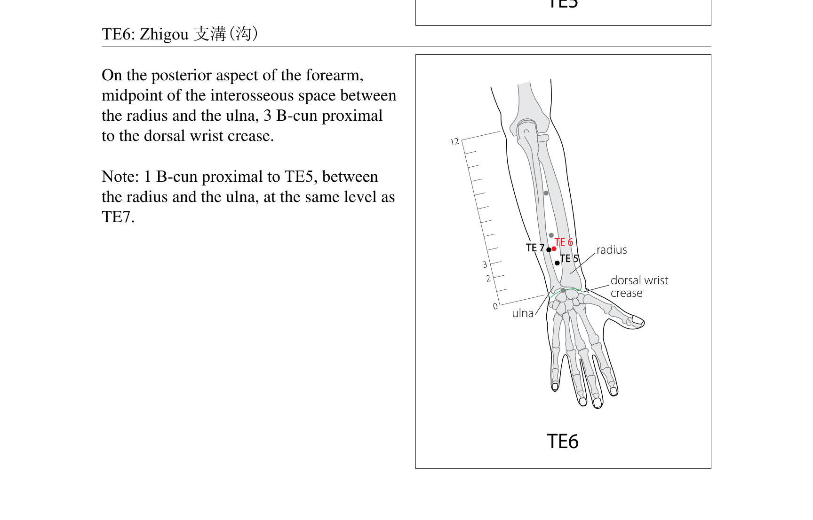

> **External References:** [AcuPoints](https://www.acupoints.org/te6-acupuncture-point/)

**קטגוריה מיוחדת:** נקודת ג'ינג-נהר (经穴), נקודת אש (火)

**מיקום אנטומי:** 3 צון מעל קפל שורש כף היד הדורסלי, בין עצם הרדיוס לאולנה.

**איך למצוא את הנקודה:**

1. מצאו את TE5 (2 צון מעל קפל שורש כף היד)
2. מדדו 1 צון נוסף כלפי מעלה
3. הנקודה נמצאת בין שתי עצמות האמה
4. 1 צון מעל TE5

**עומק דקירה:** 0.5-1 צון

**זווית דקירה:** ניצבת (90°)

**תחושת דה-צ'י:** כאב מקומי, תחושת כבדות או נימול

**פעולות והתוויות:**

* מווסתת צ'י, מפזרת סטגנציה
* מנקה חום, מלחלחת את המעיים
* מועילה לצלעות (כאב בין-צלעי)
* **נקודה עיקרית לטיפול בעצירות**
* התוויות: עצירות (חום או סטגנציה), כאב בצלעות, כאב בחזה הצידי, חום, הקאות, כאב בזרוע, שלבקת חוגרת

**שילובי נקודות נפוצים:**

* TE6 + ST25 + ST37 — לטיפול בעצירות
* TE6 + GB34 — לכאב בין-צלעי
* TE6 + LR3 — לפיזור סטגנציית צ'י הכבד

***

#### TE7 — הוי צונג (会宗) — Huì Zōng — "מפגש שושלות"

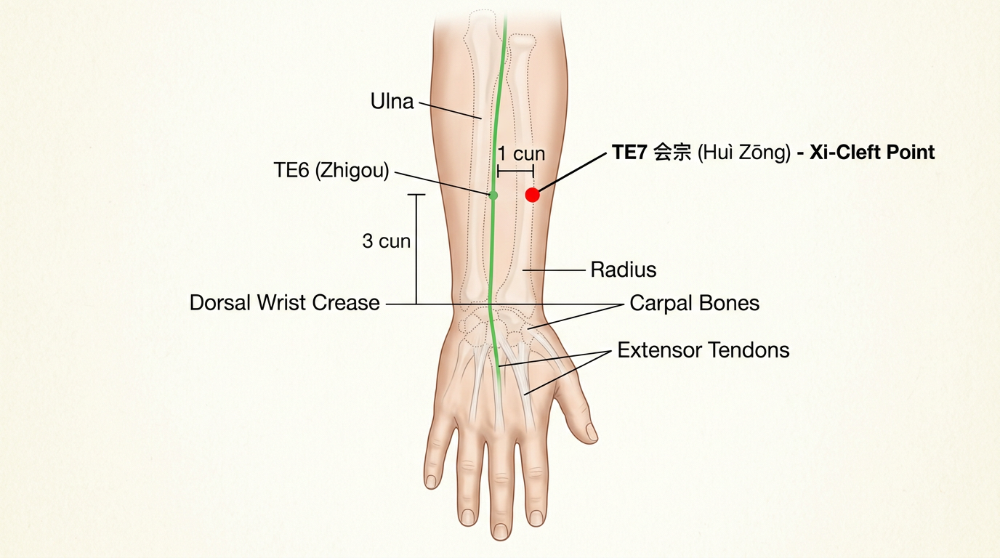

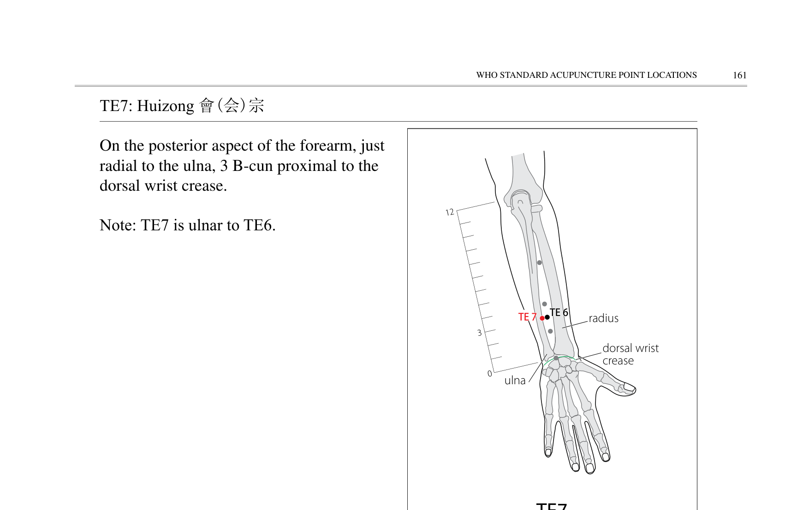

> **External References:** [AcuPoints](https://www.acupoints.org/te7-acupuncture-point/)

**קטגוריה מיוחדת:** נקודת שי-צבירה (郄穴)

**מיקום אנטומי:** 3 צון מעל קפל שורש כף היד הדורסלי, על הצד האולנרי של עצם האולנה (1 צון אולנרית ל-TE6).

**איך למצוא את הנקודה:**

1. מצאו תחילה את TE6 (3 צון מעל שורש כף היד, בין רדיוס לאולנה)
2. החליקו 1 צון לכיוון האולנרי (צד האצבע הקטנה)
3. הנקודה נמצאת על הצד הרדיאלי של עצם האולנה
4. מורגשת כנקודה רגישה על שפת העצם

**עומק דקירה:** 0.5-1 צון

**זווית דקירה:** ניצבת (90°)

**תחושת דה-צ'י:** כאב מקומי חד

**פעולות והתוויות:**

* מועילה לאוזניים (נקודה חשובה לחירשות)
* משחררת כאב לאורך הערוץ
* התוויות: חירשות, כאב באוזניים, אפילפסיה, כאב בזרוע

**שילובי נקודות נפוצים:**

* TE7 + SI19 — לטיפול בחירשות
* TE7 + TE3 — לבעיות אוזניים

***

#### TE8 — סאן יאנג לואו (三阳络) — Sān Yáng Luò — "חיבור שלושת היאנג"

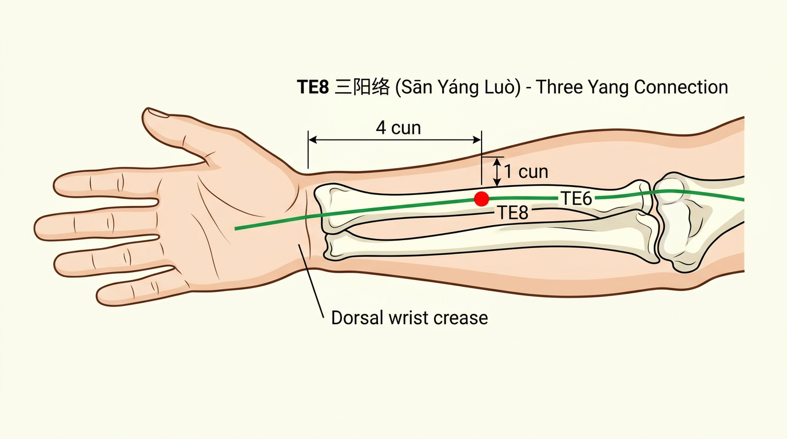

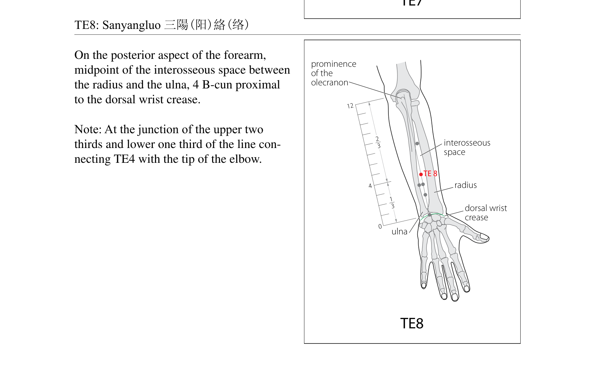

> **External References:** [AcuPoints](https://www.acupoints.org/te8-acupuncture-point/)

**מיקום אנטומי:** 4 צון מעל קפל שורש כף היד הדורסלי, בין עצם הרדיוס לאולנה.

**איך למצוא את הנקודה:**

1. מצאו את TE5 (2 צון מעל שורש כף היד)
2. מדדו 2 צון נוספים כלפי מעלה (סה"כ 4 צון מהקפל)
3. הנקודה נמצאת בין שתי עצמות האמה
4. 1 צון מעל TE6

**עומק דקירה:** 0.5-1 צון

**זווית דקירה:** ניצבת (90°)

**תחושת דה-צ'י:** כאב מקומי, תחושת כבדות באמה

**פעולות והתוויות:**

* מפתחת את חושי הראש (פותחת סתימות בחושים)
* משחררת כאב בזרוע
* התוויות: חירשות ואילמות פתאומית, כאב בזרוע, כאב שיניים

**שילובי נקודות נפוצים:**

* TE8 + SI19 + TE7 — לחירשות
* TE8 + LI4 — לכאב שיניים

***

#### TE9 — סי דו (四渎) — Sì Dú — "ארבע תעלות"

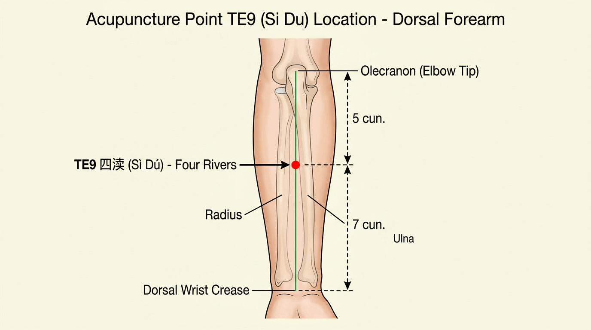

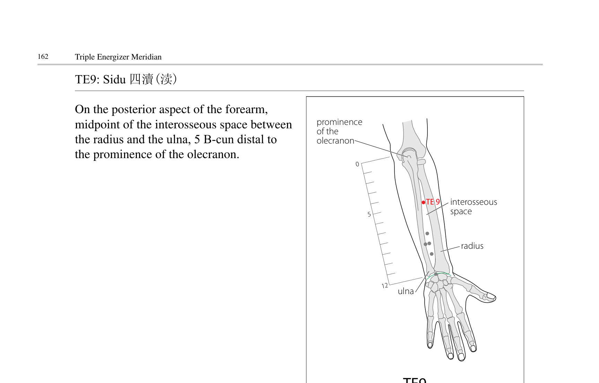

> **External References:** [AcuPoints](https://www.acupoints.org/te9-acupuncture-point/)

**מיקום אנטומי:** 5 צון מתחת לאולקרנון (קצה המרפק), בין עצם הרדיוס לאולנה, על הצד הדורסלי של האמה.

**איך למצוא את הנקודה:**

1. מצאו את קצה המרפק (אולקרנון)
2. מדדו 5 צון כלפי מטה לכיוון שורש כף היד
3. הנקודה נמצאת בין שתי עצמות האמה
4. או: 7 צון מעל קפל שורש כף היד

**עומק דקירה:** 0.5-1 צון

**זווית דקירה:** ניצבת (90°)

**תחושת דה-צ'י:** כאב מקומי, תחושת כבדות

**פעולות והתוויות:**

* מועילה לאוזניים, פותחת סתימות
* משחררת כאב בזרוע
* התוויות: חירשות, כאב גרון, כאב בזרוע, שיתוק בזרוע, כאב שיניים

**שילובי נקודות נפוצים:**

* TE9 + TE5 — לכאב באמה
* TE9 + SI19 — לבעיות שמיעה

***

#### TE10 — טיאן ג'ינג (天井) — Tiān Jǐng — "באר שמימית"

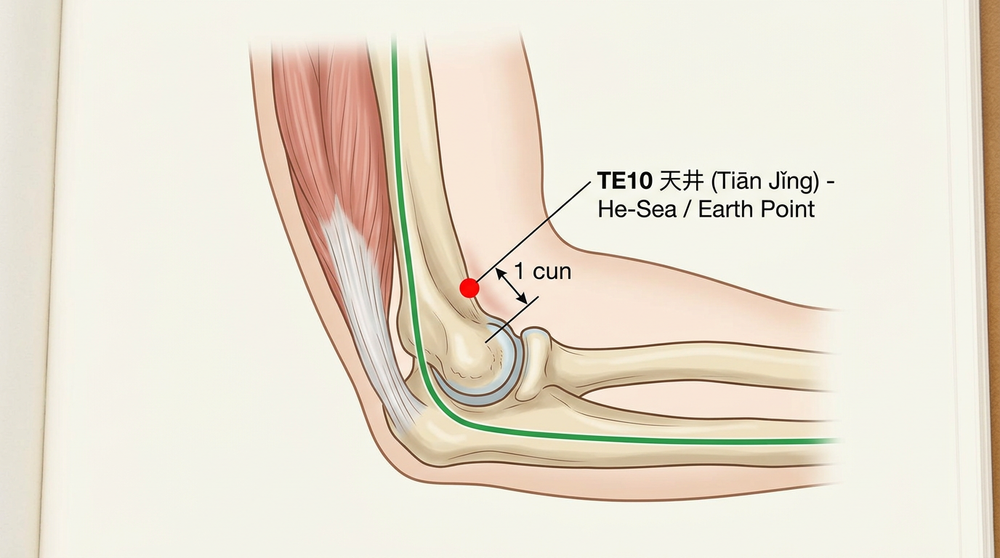

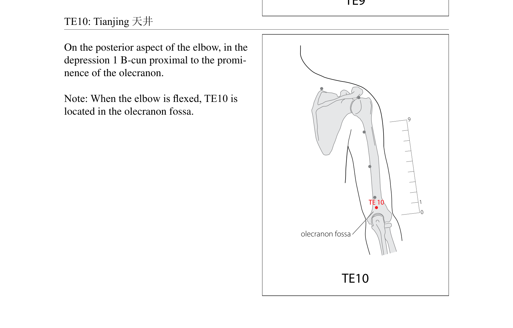

> **External References:** [AcuPoints](https://www.acupoints.org/te10-acupuncture-point/)

**קטגוריה מיוחדת:** נקודת הא-ים (合穴), נקודת אדמה (土)

**מיקום אנטומי:** בשקע שמעל קצה האולקרנון (קצה המרפק), 1 צון מעל האולקרנון כאשר המרפק מכופף.

**איך למצוא את הנקודה:**

1. כופפו את מרפק המטופל ב-90°
2. מצאו את קצה האולקרנון (הבליטה של המרפק)
3. מדדו 1 צון מעל האולקרנון, בשקע שנוצר
4. הנקודה נמצאת בשקע שמעל הבליטה כאשר המרפק מכופף

**עומק דקירה:** 0.5-1 צון

**זווית דקירה:** ניצבת (90°)

**תחושת דה-צ'י:** כאב מקומי, תחושת כבדות סביב המרפק

**פעולות והתוויות:**

* מווסתת צ'י, מפזרת פליגמה וגושים
* מנקה חום ולחות
* משחררת כאב במרפק
* מרגיעה את הרוח
* התוויות: כאב במרפק, כאב בכתף ובזרוע, בלוטות לימפה נפוחות (סקרופולה), גויטר, אפילפסיה, דיכאון, כאב בצלעות

**שילובי נקודות נפוצים:**

* TE10 + LI11 — לכאב במרפק
* TE10 + SP9 — לפיזור לחות ופליגמה
* TE10 + GB34 — לכאב בצלעות

***

#### TE11 — צ'ינג לנג יואן (清冷渊) — Qīng Lěng Yuān — "תהום צלולה וקרה"

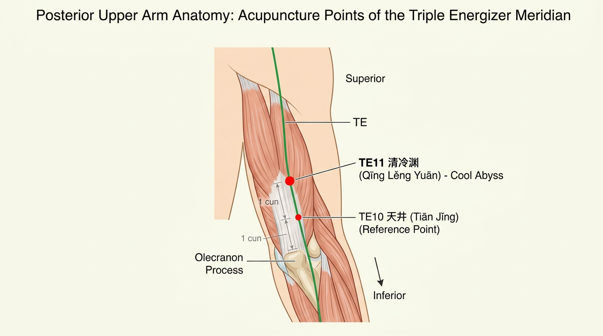

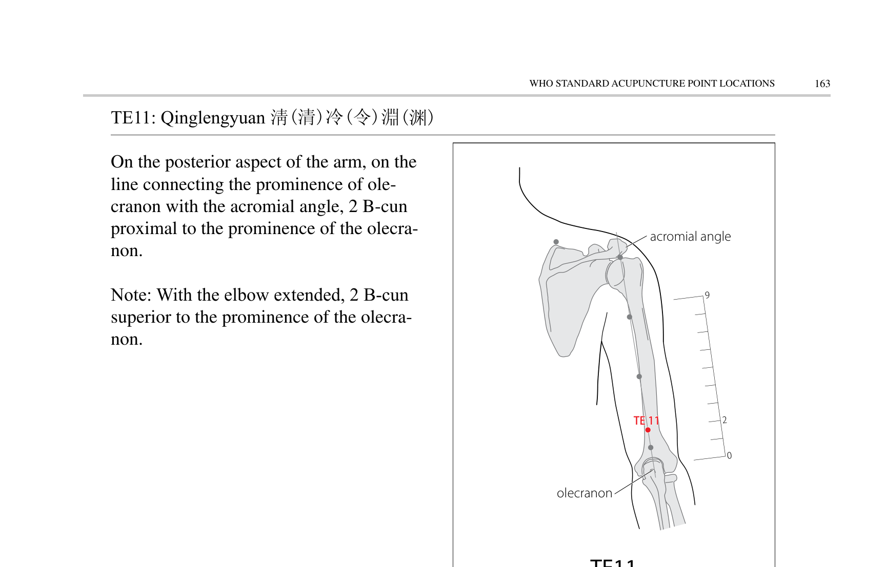

> **External References:** [AcuPoints](https://www.acupoints.org/te11-acupuncture-point/)

**מיקום אנטומי:** 1 צון מעל TE10, 2 צון מעל האולקרנון, על הצד הלטרלי של הזרוע.

**איך למצוא את הנקודה:**

1. מצאו את TE10 (1 צון מעל האולקרנון)
2. מדדו 1 צון נוסף כלפי מעלה
3. הנקודה נמצאת על הצד הלטרלי-אחורי של הזרוע העליונה

**עומק דקירה:** 0.5-1 צון

**זווית דקירה:** ניצבת (90°)

**תחושת דה-צ'י:** כאב מקומי

**פעולות והתוויות:**

* מפעילה את הערוץ ומשחררת כאב
* התוויות: כאב בכתף ובזרוע, כאב ראש, עיניים צהובות

**שילובי נקודות נפוצים:**

* TE11 + TE10 — לכאב במרפק ובזרוע

***

#### TE12 — שיאו לואו (消泺) — Xiāo Luò — "התכה מתפזרת"

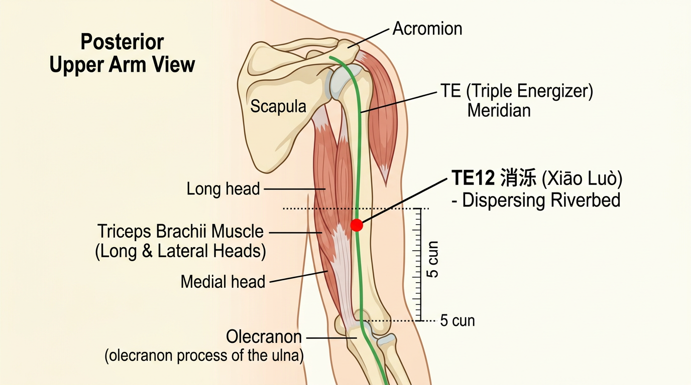

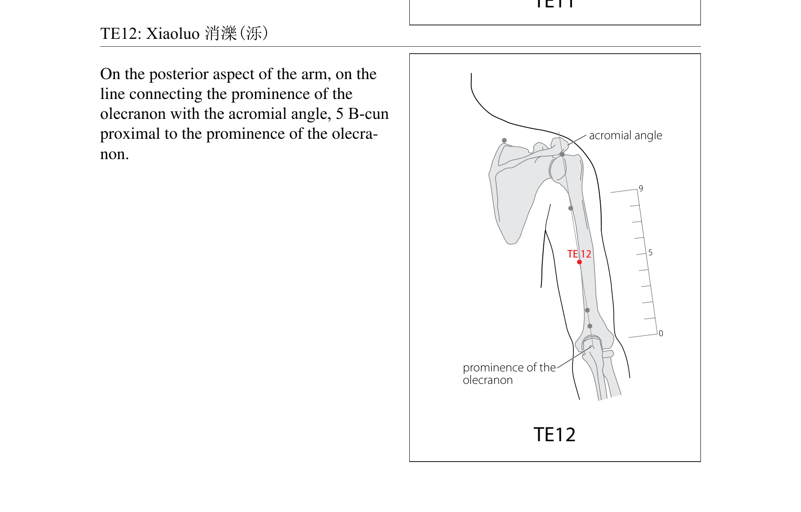

> **External References:** [AcuPoints](https://www.acupoints.org/te12-acupuncture-point/)

**מיקום אנטומי:** 5 צון מעל האולקרנון, באמצע הצד האחורי של הזרוע העליונה, בין ראשי שריר הטריצפס.

**איך למצוא את הנקודה:**

1. מצאו את המרחק בין האולקרנון לקצה האחורי של האקרומיון
2. הנקודה נמצאת באמצע הקו הזה
3. או: 5 צון מעל האולקרנון
4. ממוקמת באמצע שריר הטריצפס, בין ראשיו

**עומק דקירה:** 0.5-1 צון

**זווית דקירה:** ניצבת (90°)

**תחושת דה-צ'י:** כאב מקומי, תחושת כבדות בזרוע

**פעולות והתוויות:**

* מפעילה את הערוץ ומשחררת כאב
* מנקה חום
* התוויות: כאב בזרוע ובכתף, כאב ראש, נוקשות צוואר, כאב שיניים

**שילובי נקודות נפוצים:**

* TE12 + LI15 — לכאב בזרוע העליונה ובכתף

***

#### TE13 — נאו הוי (臑会) — Nào Huì — "מפגש הזרוע"

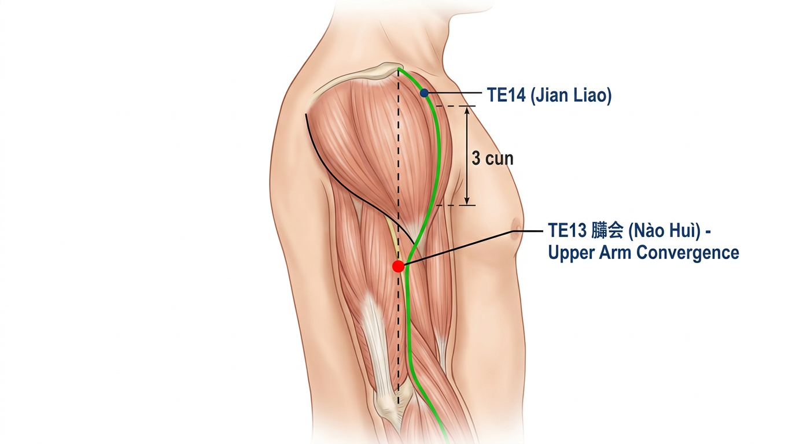

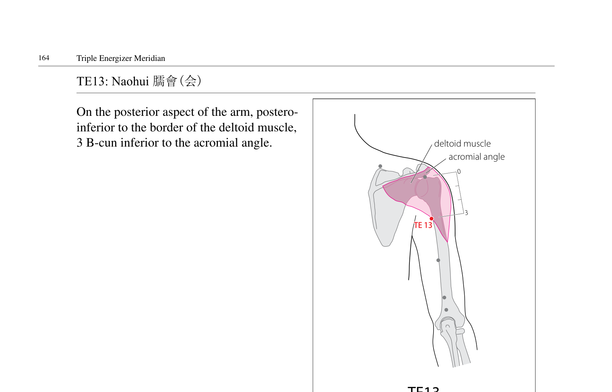

> **External References:** [AcuPoints](https://www.acupoints.org/te13-acupuncture-point/)

**מיקום אנטומי:** 3 צון מתחת לאחורי הדלטויד, על הקו שבין האולקרנון לקצה הכתף, על השפה האחורית של שריר הדלטויד.

**איך למצוא את הנקודה:**

1. מצאו את השפה האחורית (פוסטריורית) של שריר הדלטויד
2. מדדו 3 צון כלפי מטה מנקודת הכתף (TE14)
3. הנקודה נמצאת על השפה הפוסטריורית-אינפריורית של הדלטויד
4. על המשטח הלטרלי של הזרוע העליונה

**עומק דקירה:** 0.5-1 צון

**זווית דקירה:** ניצבת (90°)

**תחושת דה-צ'י:** כאב מקומי, תחושת כבדות

**פעולות והתוויות:**

* מפעילה את הערוץ ומשחררת כאב
* מפזרת פליגמה וגושים
* התוויות: כאב בכתף ובזרוע, גויטר, בלוטות לימפה נפוחות

**שילובי נקודות נפוצים:**

* TE13 + TE14 — לכאב בכתף
* TE13 + SI10 — לכאב בזרוע העליונה

***

#### TE14 — ג'יאן ליאו (肩髎) — Jiān Liáo — "שקע הכתף"

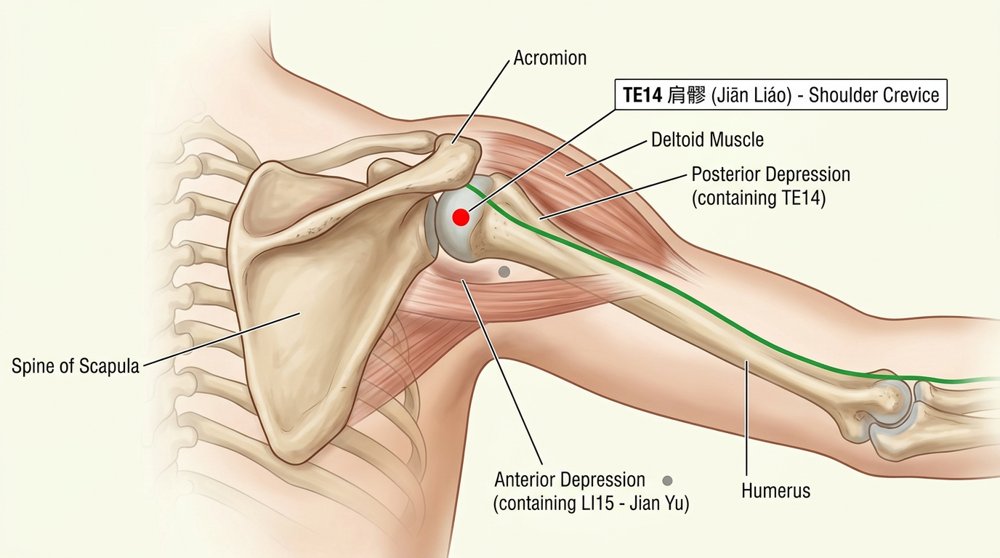

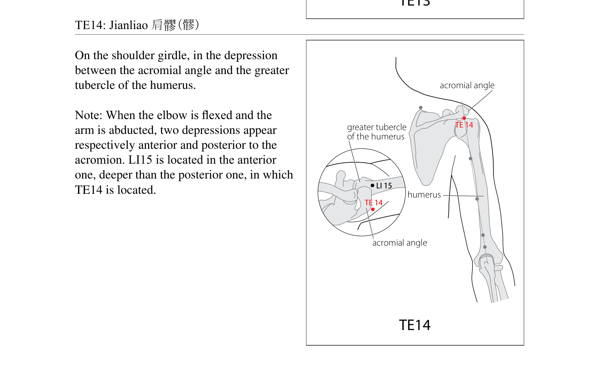

> **External References:** [AcuPoints](https://www.acupoints.org/te14-acupuncture-point/)

**מיקום אנטומי:** בשקע שמאחורי ומטה לאקרומיון, כאשר הזרוע מורמת (abducted), בשקע האחורי מבין שני השקעים שנוצרים.

**איך למצוא את הנקודה:**

1. בקשו מהמטופל להרים את הזרוע הצידה (אבדוקציה) ב-90°
2. שני שקעים נוצרים באזור הכתף — קדמי ואחורי
3. הנקודה נמצאת בשקע האחורי (posterior depression)
4. מאחורי ומתחת לאקרומיון
5. כאשר הזרוע מורדת, השקע נעלם

**עומק דקירה:** 1-1.5 צון

**זווית דקירה:** ניצבת או אובליקית כלפי מטה

**תחושת דה-צ'י:** כאב מקומי, תחושת כבדות בכתף, לעיתים הקרנה לזרוע

**פעולות והתוויות:**

* מפעילה את הערוץ ומשחררת כאב בכתף
* מפזרת רוח ולחות מהמפרק
* התוויות: כאב בכתף, קפיאת כתף (frozen shoulder), קושי להרים את הזרוע, כאב בזרוע

**שילובי נקודות נפוצים:**

* TE14 + LI15 + SI9 — לכאב בכתף (שלוש הנקודות של הכתף)
* TE14 + TE5 — לכאב לאורך ערוץ שלוש המבערות
* TE14 + GB21 — לנוקשות כתף וצוואר

***

#### TE15 — טיאן ליאו (天髎) — Tiān Liáo — "שקע שמימי"

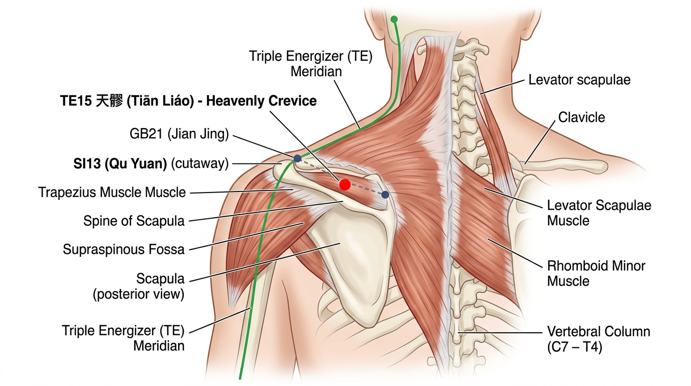

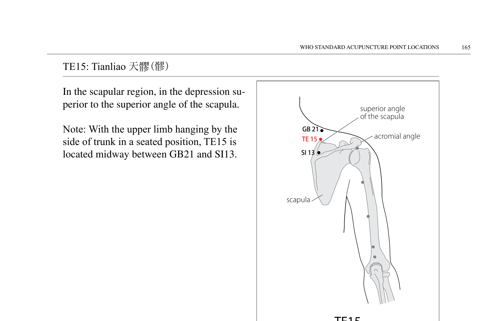

> **External References:** [AcuPoints](https://www.acupoints.org/te15-acupuncture-point/)

**מיקום אנטומי:** באמצע הקו בין GB21 (ג'יאן ג'ינג) ל-SI13 (צ'יו יואן), על שריר הסופרספינטוס, מעל לפוסה הסופרספינטית.

**איך למצוא את הנקודה:**

1. מצאו את GB21 (באמצע הקו בין C7 לאקרומיון)
2. מצאו את SI13 (על השפה המדיאלית של הספינה של השכמית)
3. הנקודה נמצאת בדיוק באמצע בין השתיים
4. על הפוסה הסופרספינטית של השכמית

**עומק דקירה:** 0.5-0.8 צון

**זווית דקירה:** ניצבת או אובליקית

**תחושת דה-צ'י:** כאב מקומי, תחושת כבדות בכתף

**פעולות והתוויות:**

* מפעילה את הערוץ ומשחררת כאב
* מפזרת רוח-לחות
* התוויות: כאב בכתף ובצוואר, נוקשות צוואר, כאב בזרוע

**שילובי נקודות נפוצים:**

* TE15 + GB21 — לכאב בכתף ובצוואר
* TE15 + SI11 — לכאב באזור השכמה

***

#### TE16 — טיאן יו (天牖) — Tiān Yǒu — "חלון שמיים"

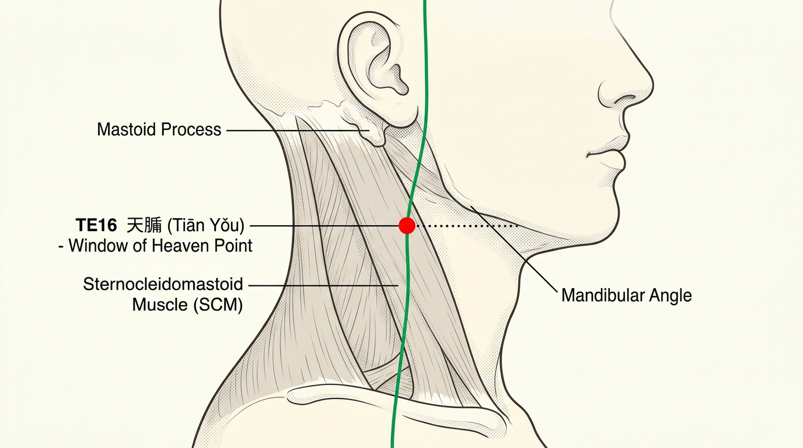

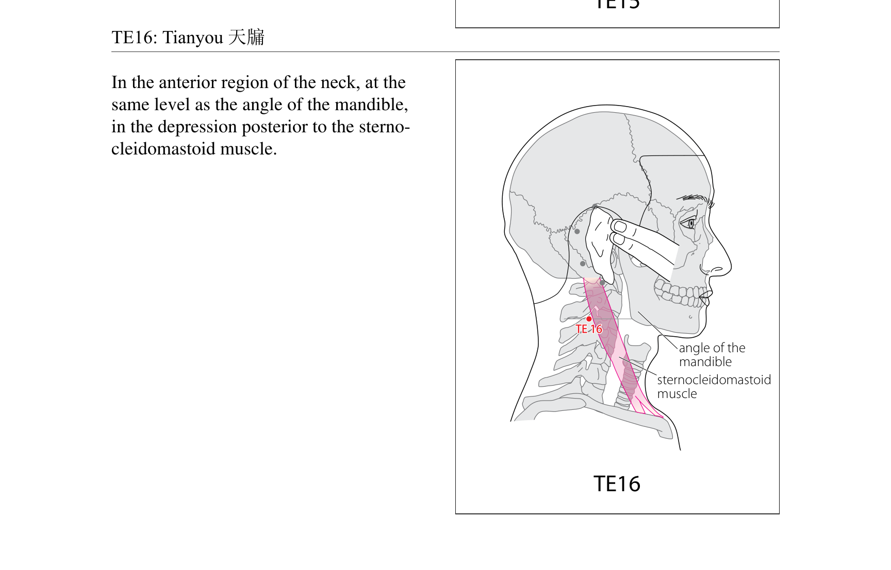

> **External References:** [AcuPoints](https://www.acupoints.org/te16-acupuncture-point/)

**קטגוריה מיוחדת:** נקודת חלון השמיים (天窗穴)

**מיקום אנטומי:** בצד האחורי-לטרלי של הצוואר, מאחורי ומתחת לתהליך המסטואידי, על השפה האחורית של שריר הסטרנוקלידומסטואיד (SCM), בגובה זווית הלסת.

**איך למצוא את הנקודה:**

1. מצאו את התהליך המסטואידי (הבליטה מאחורי האוזן)
2. החליקו ממנו כלפי מטה ואחורה
3. הנקודה נמצאת על השפה האחורית של שריר ה-SCM
4. בגובה זווית הלסת התחתונה (מנדיבולה)
5. בשקע שמאחורי שריר ה-SCM

**עומק דקירה:** 0.5-1 צון

**זווית דקירה:** ניצבת או אובליקית קדימה

**תחושת דה-צ'י:** כאב מקומי, תחושת כבדות

**פעולות והתוויות:**

* מועילה לעיניים ולאוזניים
* מפזרת רוח, מפתחת את חושי הראש
* התוויות: כאב ראש, נוקשות צוואר, טינטון, חירשות, טשטוש ראיה, נפיחות בפנים, חירשות פתאומית

**שילובי נקודות נפוצים:**

* TE16 + GB20 — לנוקשות צוואר וכאב ראש
* TE16 + SI19 — לבעיות שמיעה

***

#### TE17 — יי פנג (翳风) — Yì Fēng — "מגן רוח"

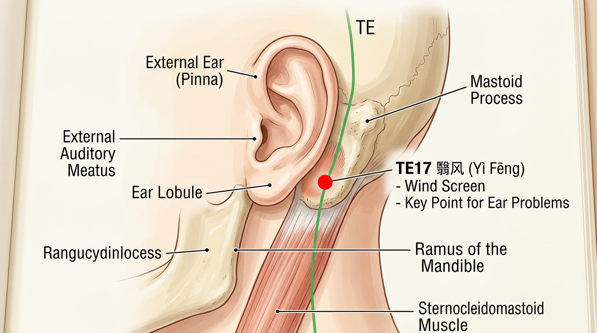

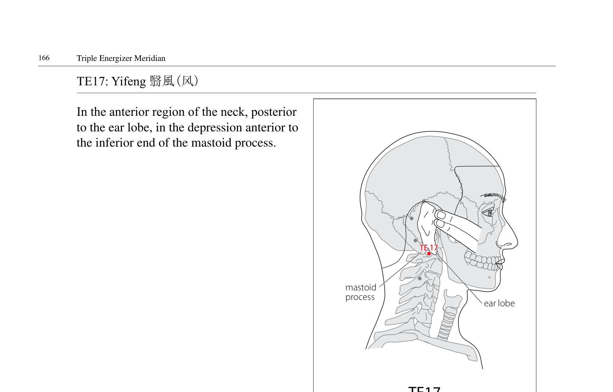

> **External References:** [AcuPoints](https://www.acupoints.org/te17-acupuncture-point/)

**מיקום אנטומי:** בשקע שמאחורי תנוך האוזן (lobule), בין התהליך המסטואידי לענף הלסת התחתונה (ramus of mandible).

**איך למצוא את הנקודה:**

1. מצאו את תנוך האוזן
2. החליקו מאחורי התנוך לשקע
3. הנקודה נמצאת בשקע שבין התהליך המסטואידי לענף הלסת
4. לחצו — השקע ברור ורגיש

**עומק דקירה:** 0.5-1 צון

**זווית דקירה:** ניצבת או אובליקית לכיוון קדמי-מדיאלי

**תחושת דה-צ'י:** כאב מקומי, לעיתים תחושת נימול באוזן או בצד הפנים

**פעולות והתוויות:**

* **נקודה מרכזית לטיפול בבעיות אוזניים**
* מפזרת רוח, מועילה לאוזניים ולמפרק הלסת
* מפעילה את מחזור הדם באזור
* התוויות: טינטון, חירשות, כאב אוזניים, דלקת אוזן תיכונה, שיתוק פנים (Bell's palsy), כאב בלסת (TMJ), בלוטות פרוטיד נפוחות (חזרת)

**שילובי נקודות נפוצים:**

* TE17 + SI19 + GB2 — לטיפול מקיף בבעיות אוזניים
* TE17 + ST6 + ST7 — לכאב בלסת (TMJ)
* TE17 + LI4 + ST4 — לשיתוק פנים

***

#### TE18 — צ'י מאי (瘈脉) — Chì Mài — "כלי העווית"

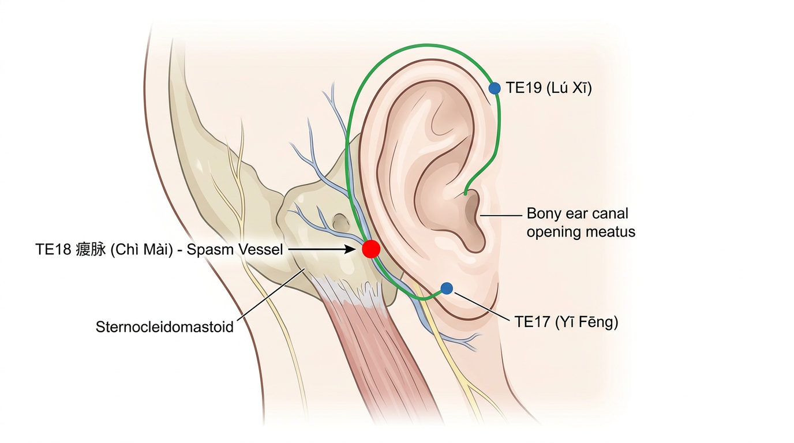

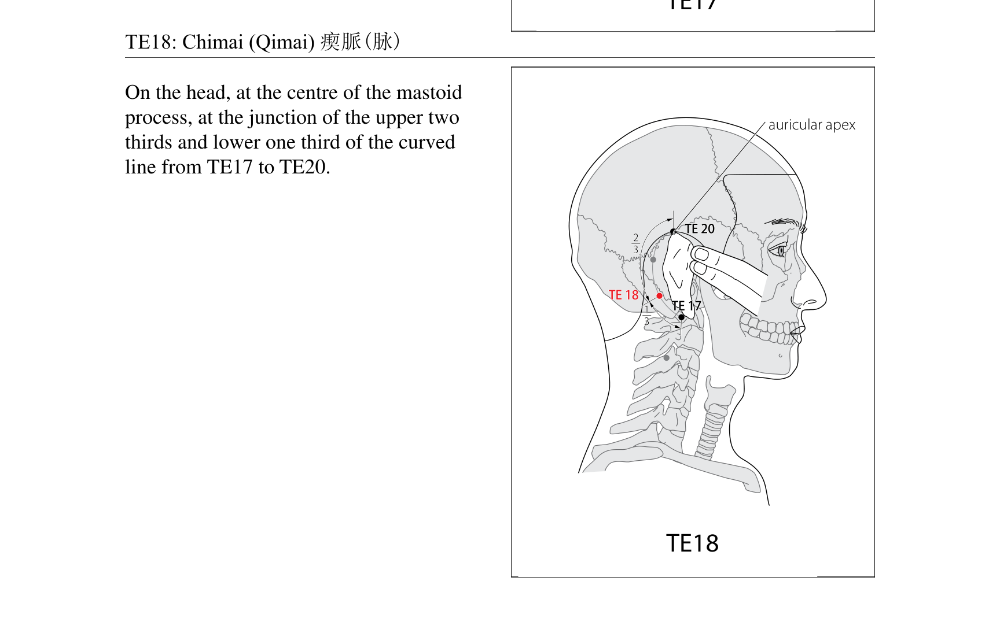

> **External References:** [AcuPoints](https://www.acupoints.org/te18-acupuncture-point/)

**מיקום אנטומי:** מאחורי האוזן, במרכז התהליך המסטואידי, בגובה פתח האוזן, על הוריד שמאחורי האוזן.

**איך למצוא את הנקודה:**

1. מצאו את התהליך המסטואידי (הבליטה מאחורי האוזן)
2. הנקודה נמצאת על התהליך עצמו, בין TE17 לבין TE19
3. בגובה פתח תעלת האוזן
4. ניתן למשש וריד קטן באזור

**עומק דקירה:** 0.1-0.2 צון (או הקזה — דקירה עם מחט שלוש-קצוות)

**זווית דקירה:** שטוחה או הקזה

**תחושת דה-צ'י:** כאב חד מקומי

**פעולות והתוויות:**

* מפזרת רוח, מנקה חום
* מועילה לאוזניים ולראש
* התוויות: כאב ראש, טינטון, חירשות, כאב אוזניים, עוויתות בילדים, הקאות, שלשולים

**שילובי נקודות נפוצים:**

* TE18 + TE17 — לכאב אוזניים
* TE18 + GB20 — לכאב ראש

***

#### TE19 — לו שי (颅息) — Lú Xī — "מנוחת הגולגולת"

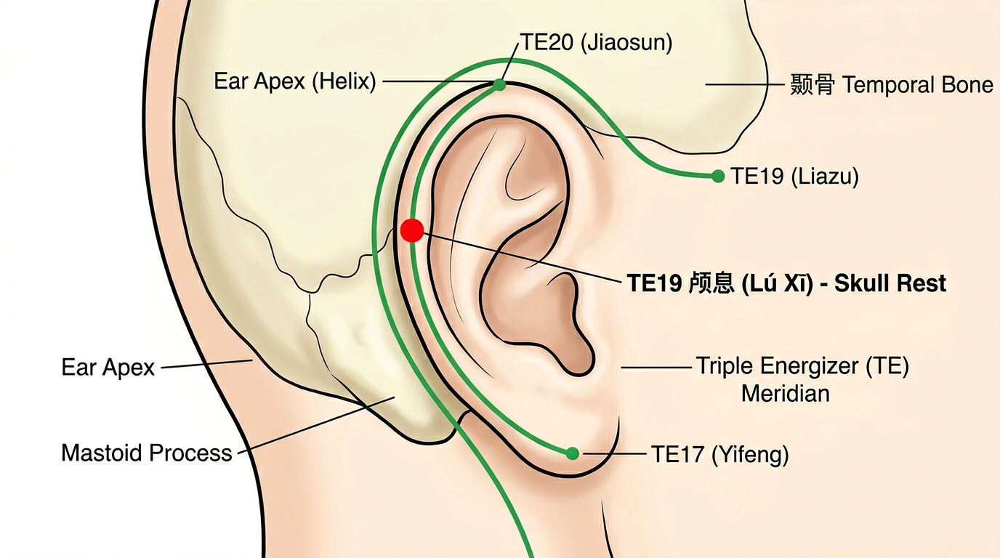

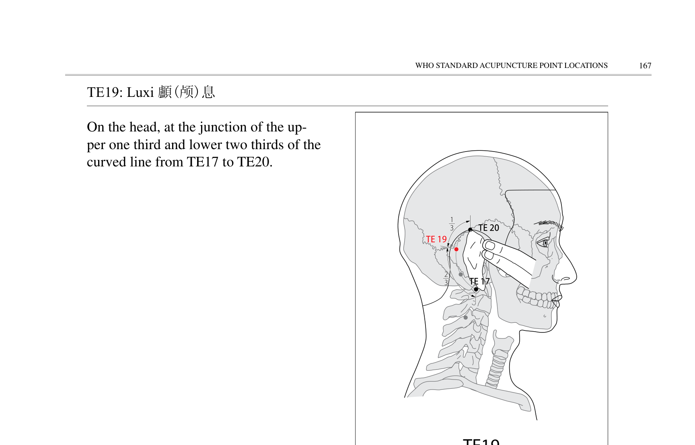

> **External References:** [AcuPoints](https://www.acupoints.org/te19-acupuncture-point/)

**מיקום אנטומי:** מאחורי האוזן, בגובה הגבול העליון של האוזן, על התהליך המסטואידי.

**איך למצוא את הנקודה:**

1. מצאו את הקצה העליון של האוזן (apex)
2. ישירות מאחורי הקצה העליון, על התהליך המסטואידי
3. הנקודה נמצאת בשליש העליון של הקו שבין TE17 ל-TE20

**עומק דקירה:** 0.1-0.3 צון (שטוחה)

**זווית דקירה:** שטוחה כלפי מטה

**תחושת דה-צ'י:** כאב מקומי

**פעולות והתוויות:**

* מפזרת רוח, משחררת כאב
* מועילה לאוזניים
* התוויות: כאב ראש, טינטון, כאב אוזניים, עוויתות בילדים

**שילובי נקודות נפוצים:**

* TE19 + GB8 — לכאב ראש צידי
* TE19 + TE17 — לטינטון

***

#### TE20 — ג'יאו סון (角孙) — Jiǎo Sūn — "זווית האוזן"

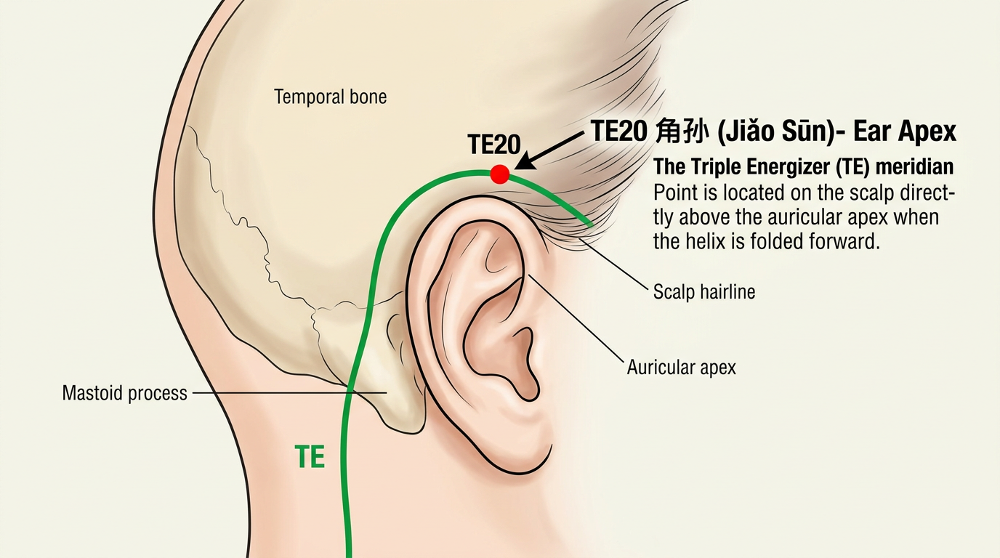

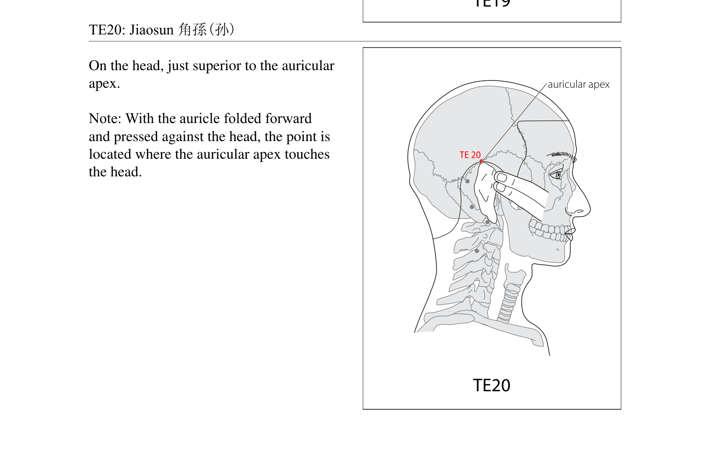

> **External References:** [AcuPoints](https://www.acupoints.org/te20-acupuncture-point/)

**מיקום אנטומי:** מעל לקצה העליון של האוזן (apex), כאשר האוזן מקופלת קדימה.

**איך למצוא את הנקודה:**

1. קפלו את האוזן קדימה
2. מצאו את הנקודה הגבוהה ביותר של האוזן (apex)
3. הנקודה נמצאת ישירות מעל, על הקרקפת, בקו השיער

**עומק דקירה:** 0.1-0.3 צון (שטוחה)

**זווית דקירה:** שטוחה כלפי מטה

**תחושת דה-צ'י:** כאב מקומי

**פעולות והתוויות:**

* מפזרת רוח-חום
* מועילה לאוזניים ולעיניים
* מפחיתה נפיחות
* התוויות: כאב ראש צידי, כאב אוזניים, דלקת חניכיים, נפיחות בלחי, טשטוש ראיה, נוקשות צוואר

**שילובי נקודות נפוצים:**

* TE20 + ST6 — לכאב שיניים ונפיחות בלחי
* TE20 + GB8 — לכאב ראש צידי

***

#### TE21 — אר מן (耳门) — Ěr Mén — "שער האוזן"

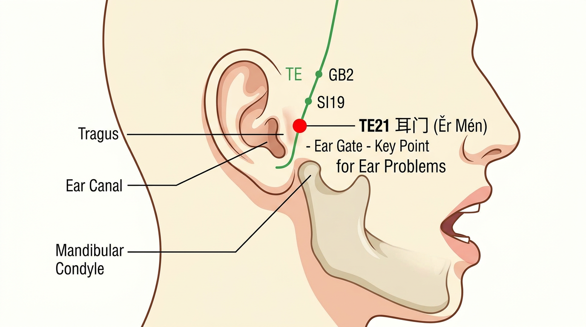

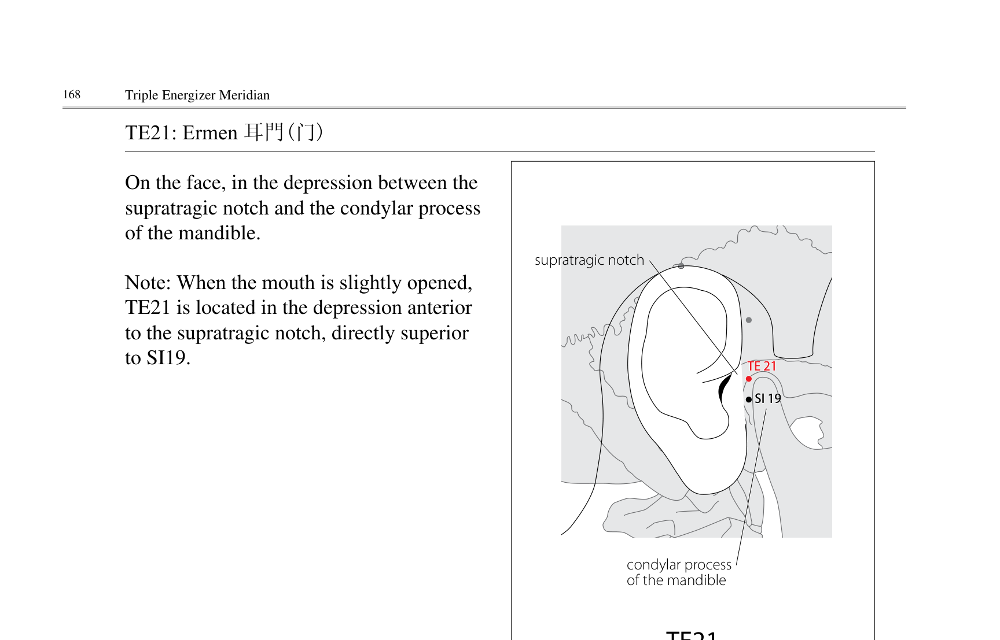

> **External References:** [AcuPoints](https://www.acupoints.org/te21-acupuncture-point/)

**מיקום אנטומי:** בשקע שלפני הטראגוס (הבליטה שמלפני תעלת האוזן), כאשר הפה פתוח, מעל לקונדיל של הלסת התחתונה.

**איך למצוא את הנקודה:**

1. בקשו מהמטופל לפתוח את הפה
2. מצאו את הטראגוס (הבליטה שמלפני פתח האוזן)
3. הנקודה נמצאת בשקע שנוצר מעל הקונדיל של הלסת כאשר הפה פתוח
4. מעל ל-SI19 (ממש מעל ל-SI19 וקדמי ל-GB2)

**עומק דקירה:** 0.5-1 צון

**זווית דקירה:** ניצבת (90°) כאשר הפה פתוח

**תחושת דה-צ'י:** כאב מקומי, תחושת סתימות באוזן

**פעולות והתוויות:**

* **נקודה מרכזית לטיפול בבעיות אוזניים**
* מועילה לשמיעה, פותחת את האוזניים
* מפזרת רוח-חום
* התוויות: טינטון, חירשות, כאב אוזניים, דלקת אוזן, הפרשות מהאוזן, כאב שיניים, כאב בלסת (TMJ)

**שילובי נקודות נפוצים:**

* TE21 + SI19 + GB2 — "שלוש נקודות האוזן" — לכל בעיות האוזניים
* TE21 + TE17 — לטינטון
* TE21 + ST7 — לכאב במפרק הלסת

***

#### TE22 — הא ליאו (和髎) — Hé Liáo — "שקע הרמוניה"

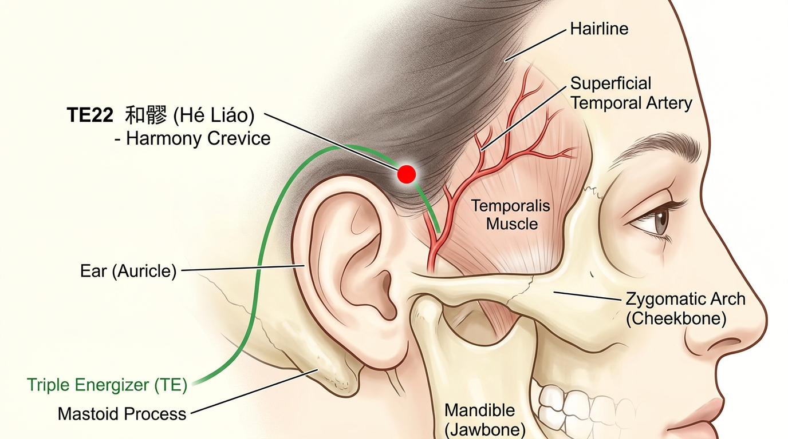

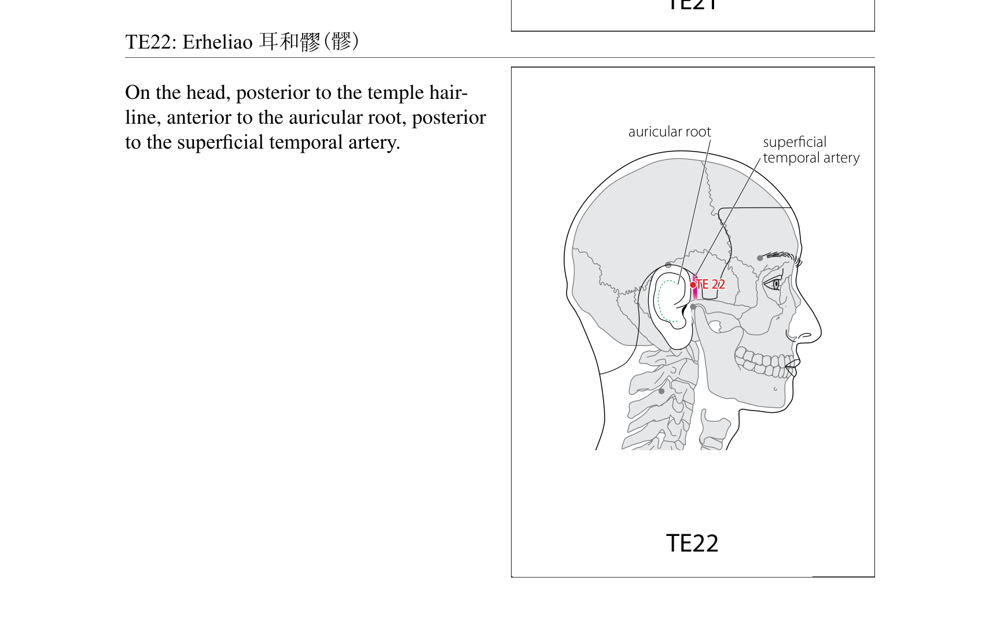

> **External References:** [AcuPoints](https://www.acupoints.org/te22-acupuncture-point/)

**מיקום אנטומי:** לפני האוזן, אחורית לעורק הטמפורלי השטחי, בגובה שורש הזיגומה (עצם הלחי), בגבול האחורי של קו השיער.

**איך למצוא את הנקודה:**

1. מצאו את העורק הטמפורלי השטחי (ניתן למשש פעימות מלפני האוזן)
2. הנקודה נמצאת מאחורי העורק
3. בגובה שורש עצם הזיגומה (עצם הלחי)
4. בגבול האחורי של קו השיער

**עומק דקירה:** 0.3-0.5 צון

**זווית דקירה:** שטוחה או אובליקית (להימנע מהעורק)

**תחושת דה-צ'י:** כאב מקומי

**פעולות והתוויות:**

* מפזרת רוח, מפעילה את הערוץ
* מועילה לאוזניים ולצד הראש
* התוויות: כאב ראש צידי, טינטון, לסת נעולה (טריסמוס), שיתוק פנים, כאב באזור הרקה

**שילובי נקודות נפוצים:**

* TE22 + GB8 — לכאב ראש צידי
* TE22 + ST6 — ללסת נעולה

***

#### TE23 — סי ג'ו קונג (丝竹空) — Sī Zhú Kōng — "חלל משי הבמבוק"

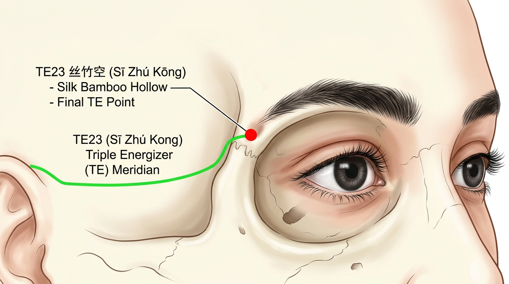

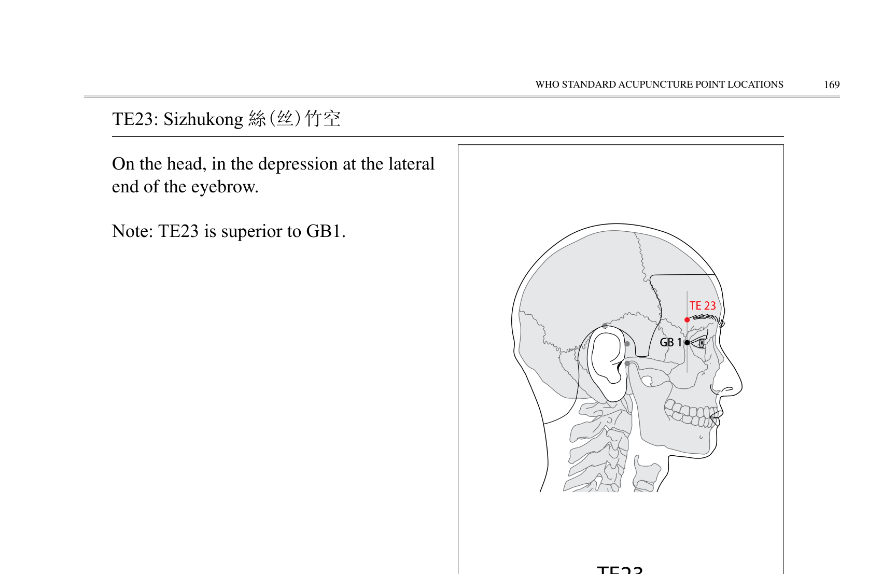

> **External References:** [AcuPoints](https://www.acupoints.org/te23-acupuncture-point/)

**מיקום אנטומי:** בשקע שבקצה הלטרלי (חיצוני) של הגבה.

**איך למצוא את הנקודה:**

1. מצאו את הקצה החיצוני של הגבה
2. הנקודה נמצאת בשקע שבקצה הגבה
3. לחצו — תרגישו שקע רגיש בעצם הגבה

**עומק דקירה:** 0.3-0.5 צון

**זווית דקירה:** שטוחה לכיוון אחורי או מטה (לא לדקור ניצבת — סמוך לעין)

**תחושת דה-צ'י:** כאב מקומי, תחושת מתיחה סביב העין

**פעולות והתוויות:**

* מפזרת רוח, מועילה לעיניים
* משחררת כאב ראש ומיגרנה
* התוויות: כאב ראש, מיגרנה, כאב בעיניים, אדמומיות בעיניים, עוויתות בעפעף, שיתוק פנים, אפילפסיה

**שילובי נקודות נפוצים:**

* TE23 + GB1 — לכאב בעיניים ובעיות ראיה
* TE23 + Taiyang (נקודה חוץ-ערוצית) — למיגרנה וכאב ראש צידי
* TE23 + GB14 — לכאב מעל העיניים

***

### 4. סיכום נקודות מפתח של ערוץ שלוש המבערות

#### 4.1 נקודות חשובות ביותר

| נקודה    | שם         | חשיבות                                   |
| -------- | ---------- | ---------------------------------------- |
| **TE3**  | ג'ונג ג'ו  | נקודת שו, מפתח לדאי מאי עם GB41, אוזניים |
| **TE5**  | וואי גואן  | נקודת לואו + 8 מפגש, פיזור רוח-חום, כאב  |
| **TE6**  | ג'י גו     | נקודת מפתח לעצירות                       |
| **TE14** | ג'יאן ליאו | כאב כתף                                  |
| **TE17** | יי פנג     | נקודת מפתח לבעיות אוזניים                |
| **TE21** | אר מן      | שער האוזן, שמיעה                         |

#### 4.2 נקודות חמשת האלמנטים

| אלמנט    | נקודה | סוג            |
| -------- | ----- | -------------- |
| מתכת (金) | TE1   | ג'ינג-באר (井)  |
| מים (水)  | TE2   | יינג-מעיין (荥) |
| עץ (木)   | TE3   | שו-זרם (输)     |
| אש (火)   | TE6   | ג'ינג-נהר (经)  |
| אדמה (土) | TE10  | הא-ים (合)      |

#### 4.3 נקודות מיוחדות

| קטגוריה               | נקודה              |
| --------------------- | ------------------ |
| נקודת יואן (原穴)       | TE4                |
| נקודת לואו (络穴)       | TE5                |
| נקודת שי (郄穴)         | TE7                |
| 8 נקודות מפגש (八脉交会穴) | TE5 (יאנג ווי מאי) |

***

### 5. תרגילים

1. שרטטו את מסלול ערוץ שלוש המבערות על גוף שותף ללימודים וסמנו את כל 23 הנקודות.
2. תרגלו איתור TE3, TE5, TE6, TE14, TE17, TE21 בעיניים עצומות.
3. הסבירו את תפקידן של שלוש המבערות ואת ההבדל בין המבערה העליונה, האמצעית והתחתונה.
4. כתבו מרשם נקודות לטיפול ב: (א) טינטון עם חירשות, (ב) כאב כתף לטרלי, (ג) עצירות כרונית.

***

### ניווט

* **הקודם**: [ערוץ קרום הלב (PC)](10-pericardium.md) | **הבא**: [ערוץ כיס המרה (GB)](12-gallbladder.md)
* **זוג פנים-חוץ**: [ערוץ קרום הלב (PC)](10-pericardium.md) — ערוץ הין הזוגי (אלמנט אש שרת)
* **חזרה למודול**: [מודול 2 — מרידיאנים](./)
* **ראה גם**: [דפוסי שלוש המבערות](../../year-2-intermediate/module-06-pathology/07-san-jiao-patterns.md)
