# 12-gallbladder

## ערוץ כיס המרה - צו שאו יאנג דאן (足少阳胆经)

### Gallbladder Channel - Zú Shǎo Yáng Dǎn Jīng

***

### מטרות למידה

בסיום שיעור זה, הסטודנט יוכל:

1. לתאר את מסלול ערוץ כיס המרה החיצוני והפנימי
2. לאתר את 44 הנקודות של הערוץ (GB1-GB44)
3. להסביר את תפקודי כיס המרה ברפואה הסינית
4. לזהות פתולוגיות נפוצות ולבחור נקודות מתאימות
5. ליישם שילובי נקודות קלאסיים לטיפול במצבי כיס המרה

***

### 1. סקירת הערוץ

#### 1.1 מידע כללי

| פרט              | תיאור                                     |
| ---------------- | ----------------------------------------- |
| **שם סיני**      | 足少阳胆经 (Zú Shǎo Yáng Dǎn Jīng)             |
| **קיצור**        | GB (Gallbladder)                          |
| **מספר נקודות**  | 44                                        |
| **סוג**          | יאנג (Yang)                               |
| **אלמנט**        | עץ (木 Mù)                                 |
| **שעות פעילות**  | 23:00-01:00                               |
| **כיוון זרימה**  | מזווית העין החיצונית אל אצבע הרגל הרביעית |
| **זוג פנים-חוץ** | כבד (LR - 足厥阴肝经)                          |

#### 1.2 מסלול הערוץ

**מסלול חיצוני:** הערוץ מתחיל בזווית החיצונית של העין (GB1), עולה לרקה, יורד מאחורי האוזן, עוקב אחר הגולגולת בתנועת זיגזג מורכבת (GB2-GB20), יורד לצוואר (GB20-GB21), עובר לכתף, ויורד בצד הלטרלי של הגוף. הוא ממשיך בצד הלטרלי של החזה והצלעות (GB22-GB25), דרך הבטן הלטרלית (GB26-GB29), ויורד בצד הלטרלי של הרגל (GB30-GB44), ומסתיים בקצה האצבע הרביעית של הרגל.

**מסלול פנימי:** מאזור הכתף, הערוץ הפנימי נכנס דרך הפוסה העל-בריחית לחזה, עובר דרך הסרעפת ומתחבר לכבד ולכיס המרה. משם הוא יורד לאורך הצלעות ויוצא באזור המפשעתי.

**ענפים:**

* ענף מאחורי האוזן נכנס לאוזן, יוצא מלפני האוזן ומגיע לזווית העין החיצונית
* ענף מזווית העין יורד ל-ST5 ומתחבר לערוץ שלוש המבערות מאחורי האוזן
* ענף מגב הרגל (GB41) הולך לאצבע הגדולה ומתחבר לערוץ הכבד (LR1)

#### 1.3 זוג פנים-חוץ

ערוץ כיס המרה (צו שאו יאנג - 足少阳) הוא הערוץ החיצוני (יאנג) המזווג עם ערוץ הכבד (צו ג'יואה ין - 足厥阴), שהוא הערוץ הפנימי (ין). שניהם שייכים לאלמנט העץ (木).

***

### 2. תפקודי כיס המרה (胆 Dǎn)

#### 2.1 תפקודים עיקריים

1. **אחסון והפרשת מרה (胆汁)** - כיס המרה אוגר מרה שהכבד מייצר, ומפריש אותה למעי הדק לצורך עיכול. ברפואה הסינית, הפרשת המרה תלויה בזרימה חלקה של צ'י הכבד.
2. **שליטה על החלטיות** - כיס המרה הוא "השופט הצדיק" — אחראי על קבלת החלטות, אומץ ונחישות. הכבד מתכנן, וכיס המרה מחליט ומוציא לפועל.
3. **שאו יאנג — ציר (枢 Shū)** - כיס המרה הוא ערוץ שאו יאנג, הממוקם בין טאי יאנג (חיצוני ביותר) לבין יאנג מינג (פנימי יותר). הוא משמש כ"ציר" בין פנים לחוץ, ומשפיע על מעבר גורמים פתוגניים.

#### 2.2 רגש ומנטלי

* **רגש**: אומץ/פחד, החלטיות/היסוס
* חולשת כיס המרה מתבטאת בהיסוס, חוסר אומץ, פחדנות, חוסר יכולת להחליט
* עודף כיס המרה: נועזות יתר, פזיזות

#### 2.3 פתולוגיות נפוצות

| דפוס                        | סימפטומים עיקריים                                                  |
| --------------------------- | ------------------------------------------------------------------ |
| **לחות-חום בכיס המרה**      | מרירות בפה, צהבת, כאב בצלעות, בחילות, שתן כהה                      |
| **אבנים בכיס המרה**         | כאב חד בהיפוכנדריום ימני, כאב המקרין לגב, בחילות                   |
| **עליית יאנג הכבד-כיס מרה** | כאב ראש צידי, סחרחורת, טינטון, עצבנות                              |
| **בעיות שאו יאנג**          | חום ורעד מתחלפים, מרירות בפה, חוסר תיאבון, כאב בצלעות              |
| **בעיות לאורך הערוץ**       | כאב ראש צידי, כאב עיניים, כאב אוזניים, כאב בצד הגוף, סיאטיקה צידית |

***

### 3. נקודות הערוץ (GB1-GB44)

***

> **WHO Standard Acupuncture Point Locations** (WHO, CC BY-NC-SA 3.0 IGO):
>
> 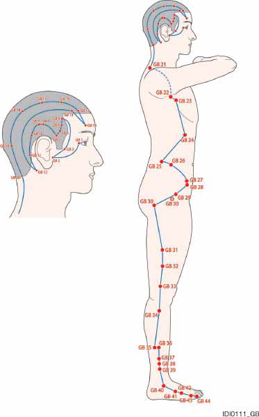

#### GB1 — טונג צ'י ליאו (瞳子髎) — Tóng Zǐ Liáo — "שקע האישון"

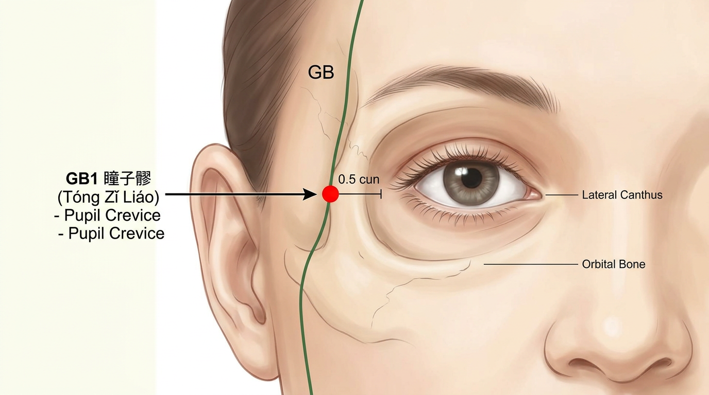

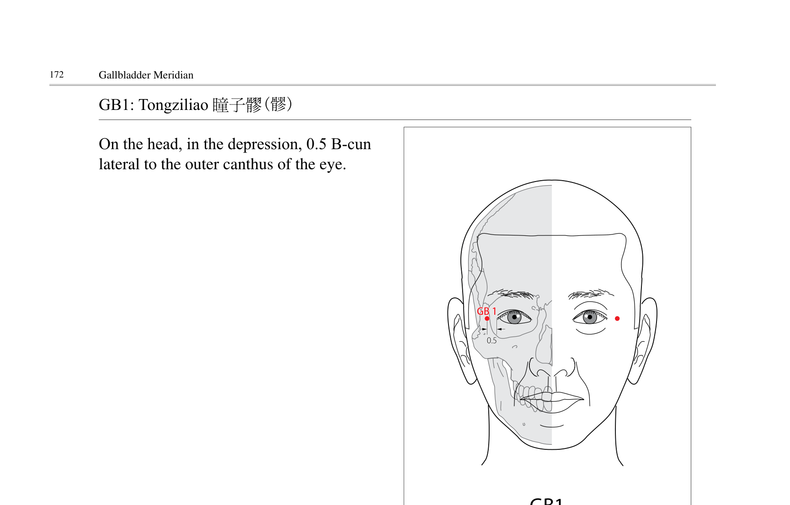

> **External References:** [AcuPoints](https://www.acupoints.org/gb1-acupuncture-point/)

**מיקום אנטומי:** 0.5 צון לטרלית מזווית העין החיצונית, בשקע שעל השפה הלטרלית של עצם הארביט.

**איך למצוא את הנקודה:**

1. מצאו את הזווית החיצונית של העין (קנתוס לטרלי)
2. החליקו 0.5 צון הצידה (לטרלית)
3. הנקודה נמצאת בשקע שעל שפת עצם הארביט (ארובת העין)
4. לחצו — תרגישו שקע רגיש על העצם

**עומק דקירה:** 0.3-0.5 צון

**זווית דקירה:** שטוחה לכיוון אחורי או אובליקית (לא לדקור לכיוון העין!)

**תחושת דה-צ'י:** כאב מקומי, תחושת דמעות

**פעולות והתוויות:**

* מועילה לעיניים, מבהירה את הראיה
* מפזרת רוח-חום מהעיניים
* התוויות: כאב בעיניים, עיניים אדומות, ירידה בראיה, דמעות ברוח, כאב ראש, שיתוק פנים

**שילובי נקודות נפוצים:**

* GB1 + TE23 + BL1 — לטיפול מקיף בבעיות עיניים
* GB1 + LR3 — לניקוי חום מהכבד המשפיע על העיניים

***

#### GB2 — טינג הוי (听会) — Tīng Huì — "מפגש השמיעה"

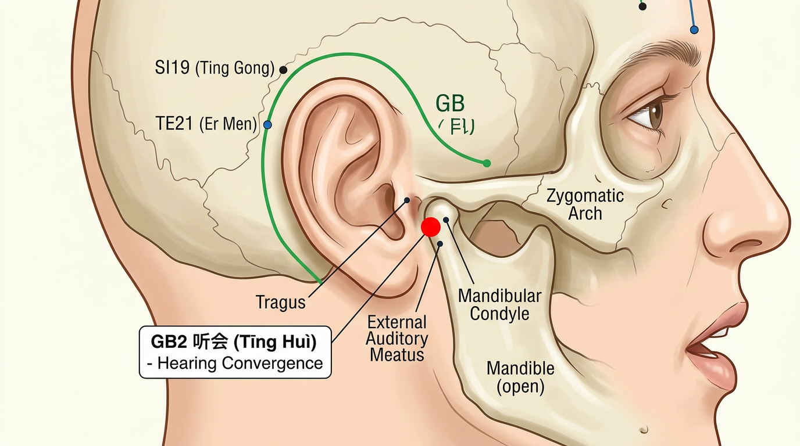

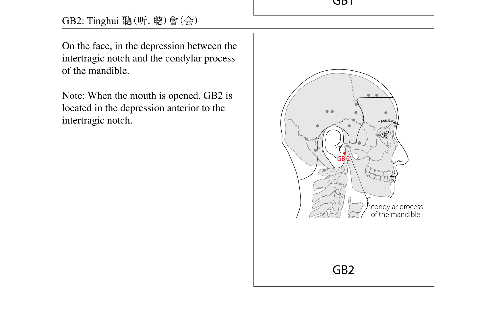

> **External References:** [AcuPoints](https://www.acupoints.org/gb2-acupuncture-point/)

**מיקום אנטומי:** לפני הטראגוס של האוזן, כאשר הפה פתוח, בשקע שמאחורי הקונדיל של הלסת.

**איך למצוא את הנקודה:**

1. בקשו מהמטופל לפתוח את הפה
2. מצאו את הטראגוס (הבליטה שלפני פתח האוזן)
3. הנקודה בשקע שנוצר ממש לפני התנוך (לובולה) של האוזן
4. מתחת ל-SI19 ול-TE21

**עומק דקירה:** 0.5-1 צון

**זווית דקירה:** ניצבת (90°) כאשר הפה פתוח

**תחושת דה-צ'י:** כאב מקומי, תחושת סתימה או פתיחה באוזן

**פעולות והתוויות:**

* מועילה לאוזניים, מפתחת את השמיעה
* מפזרת רוח-חום
* התוויות: טינטון, חירשות, כאב אוזניים, כאב שיניים, כאב בלסת (TMJ), שיתוק פנים

**שילובי נקודות נפוצים:**

* GB2 + SI19 + TE21 — "שלוש נקודות האוזן" — לכל בעיות שמיעה
* GB2 + ST7 — לכאב במפרק הלסת

***

#### GB3 — שאנג גואן (上关) — Shàng Guān — "מעבר עליון"

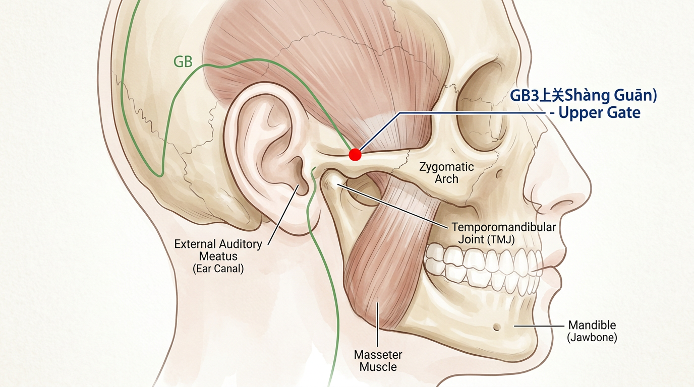

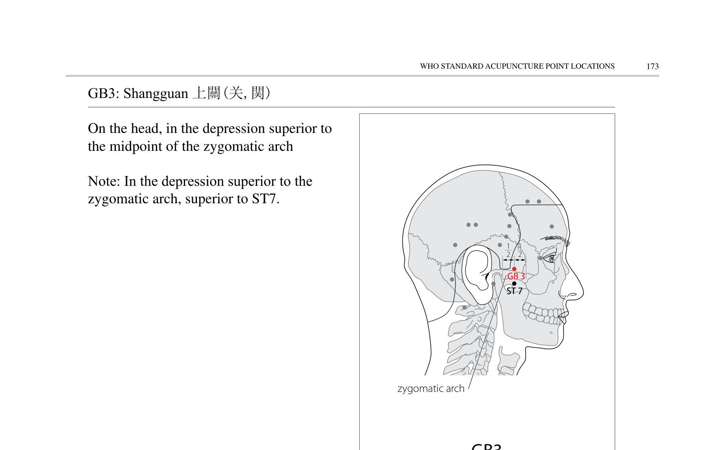

> **External References:** [AcuPoints](https://www.acupoints.org/gb3-acupuncture-point/)

**מיקום אנטומי:** לפני האוזן, על השפה העליונה של הזיגומה (עצם הלחי), בשקע שמעל ל-ST7.

**איך למצוא את הנקודה:**

1. מצאו את עצם הזיגומה (הקשת הבולטת של הלחי)
2. הנקודה נמצאת על השפה העליונה של הקשת, ישירות מעל ST7
3. בשקע שמעל הזיגומה
4. לפני האוזן ומעל למפרק הלסת

**עומק דקירה:** 0.3-0.5 צון

**זווית דקירה:** ניצבת (90°)

**תחושת דה-צ'י:** כאב מקומי, תחושת לחץ

**פעולות והתוויות:**

* מועילה לאוזניים ולמפרק הלסת
* מפזרת רוח
* התוויות: כאב אוזניים, טינטון, חירשות, כאב שיניים, שיתוק פנים, כאב בלסת, לסת נעולה (טריסמוס)

**שילובי נקודות נפוצים:**

* GB3 + ST7 — לכאב במפרק הלסת (TMJ)
* GB3 + TE21 — לכאב אוזניים

***

#### GB4 — האן יאן (颔厌) — Hàn Yàn — "לסת מלאה"

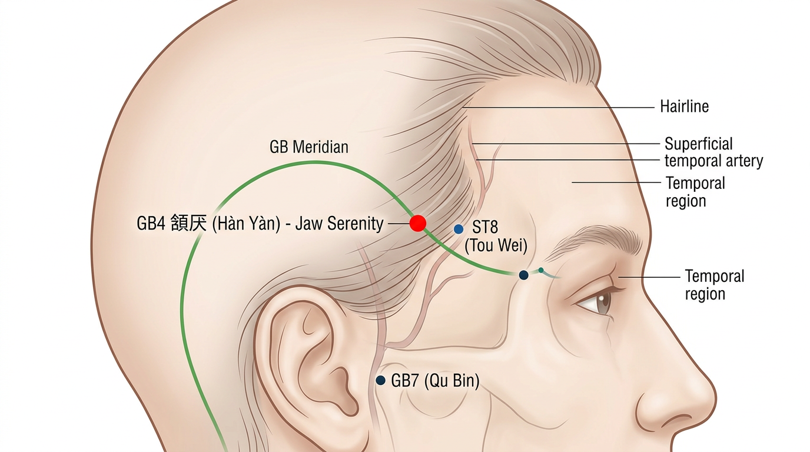

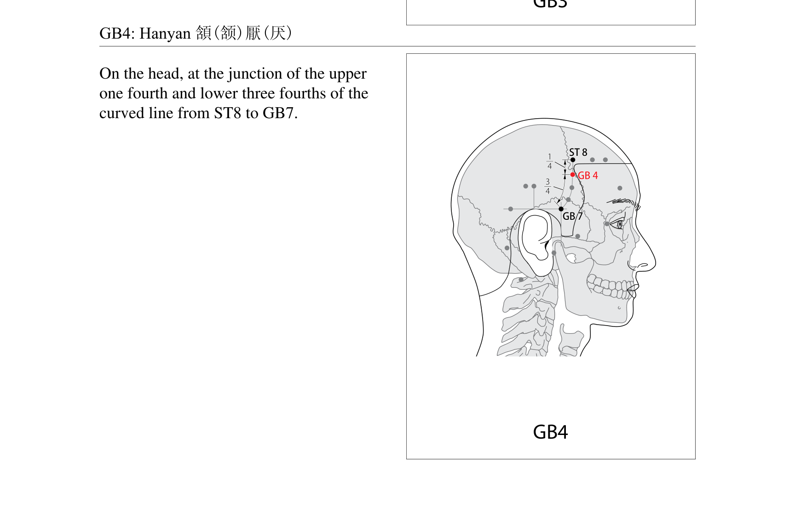

> **External References:** [AcuPoints](https://www.acupoints.org/gb4-acupuncture-point/)

**מיקום אנטומי:** ברקה, ברבע הנקודה בין ST8 ל-GB7, על קו השיער.

**איך למצוא את הנקודה:**

1. מצאו את קו השיער הצידי
2. חלקו את המרחק בין ST8 (פינת קו השיער הקדמית) ל-GB7 לארבעה חלקים
3. הנקודה ברבע הראשון (הקרוב ל-ST8)
4. על הרקה, ליד קו השיער

**עומק דקירה:** 0.3-0.5 צון

**זווית דקירה:** שטוחה לכיוון אחורי

**תחושת דה-צ'י:** כאב מקומי

**פעולות והתוויות:**

* מפזרת רוח, משחררת כאב ראש
* מועילה לעיניים ולאוזניים
* התוויות: כאב ראש צידי (מיגרנה), סחרחורת, כאב בעיניים, טינטון, כאב שיניים

**שילובי נקודות נפוצים:**

* GB4 + GB8 + Taiyang — למיגרנה
* GB4 + TE5 — לכאב ראש צידי

***

#### GB5 — שיואן לו (悬颅) — Xuán Lú — "גולגולת תלויה"

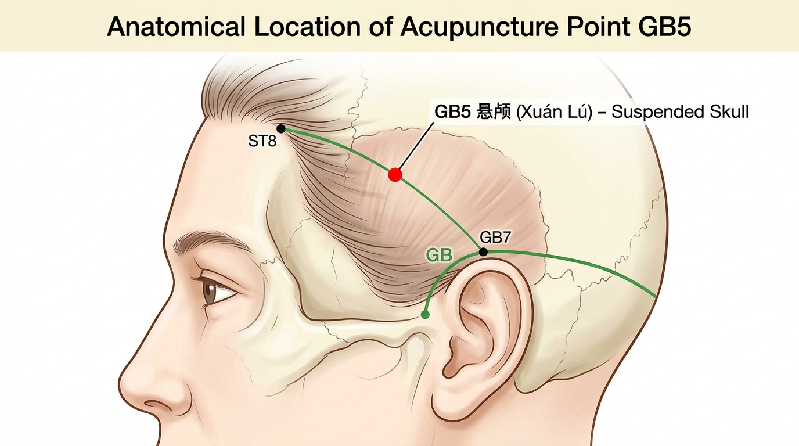

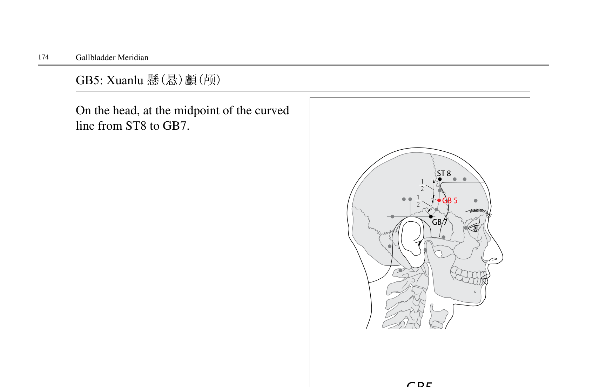

> **External References:** [AcuPoints](https://www.acupoints.org/gb5-acupuncture-point/)

**מיקום אנטומי:** ברקה, באמצע הקו בין ST8 ל-GB7, מעל קו השיער.

**איך למצוא את הנקודה:**

1. חלקו את המרחק בין ST8 ל-GB7 לשניים
2. הנקודה באמצע הקו
3. על הרקה, מעל האוזן

**עומק דקירה:** 0.3-0.5 צון

**זווית דקירה:** שטוחה

**תחושת דה-צ'י:** כאב מקומי

**פעולות והתוויות:**

* מפזרת רוח, מנקה חום
* משחררת כאב ראש צידי
* התוויות: כאב ראש צידי, כאב בעיניים, כאב שיניים, נפיחות בפנים

**שילובי נקודות נפוצים:**

* GB5 + GB4 + GB6 — לכאב ראש צידי

***

#### GB6 — שיואן לי (悬厘) — Xuán Lí — "מרווח תלוי"

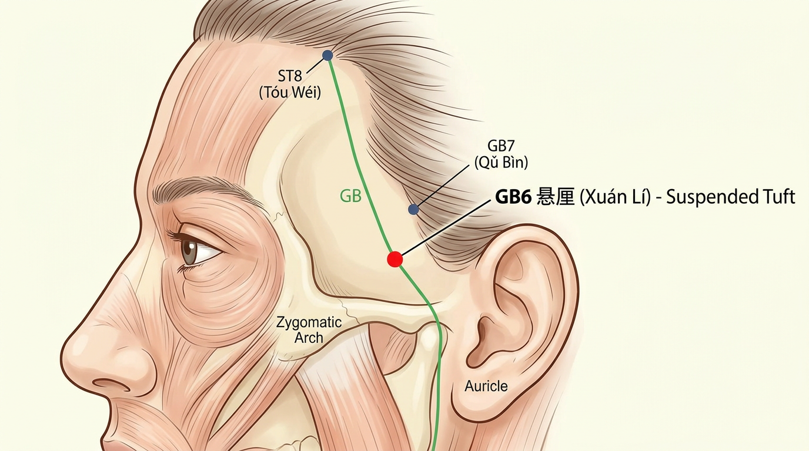

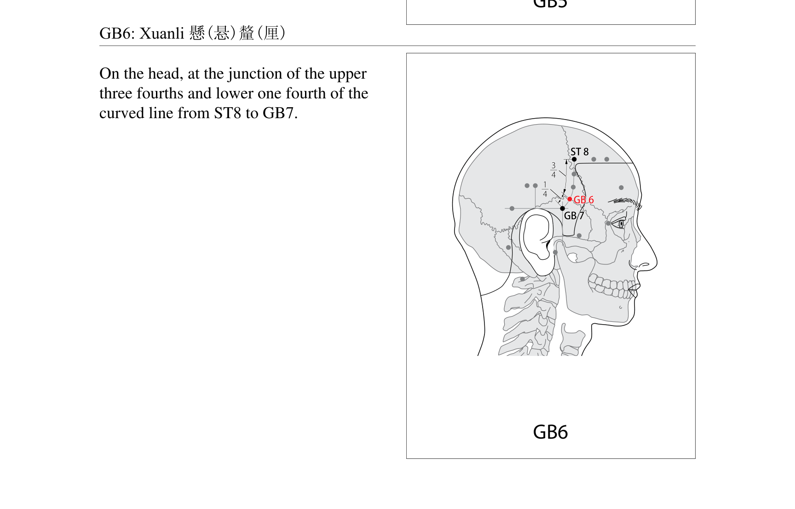

> **External References:** [AcuPoints](https://www.acupoints.org/gb6-acupuncture-point/)

**מיקום אנטומי:** ברקה, בשלושת הרבעים בין ST8 ל-GB7 (קרוב ל-GB7).

**איך למצוא את הנקודה:**

1. חלקו את המרחק בין ST8 ל-GB7 לארבעה
2. הנקודה בשלושת הרבעים (הקרוב ל-GB7)
3. על הרקה

**עומק דקירה:** 0.3-0.5 צון

**זווית דקירה:** שטוחה

**תחושת דה-צ'י:** כאב מקומי

**פעולות והתוויות:**

* מפזרת רוח, משחררת כאב ראש
* התוויות: כאב ראש צידי, כאב בעיניים, טינטון

**שילובי נקודות נפוצים:**

* GB6 + GB8 — לכאב ראש צידי

***

#### GB7 — צ'יו בין (曲鬓) — Qū Bìn — "פיאות מתעקלות"

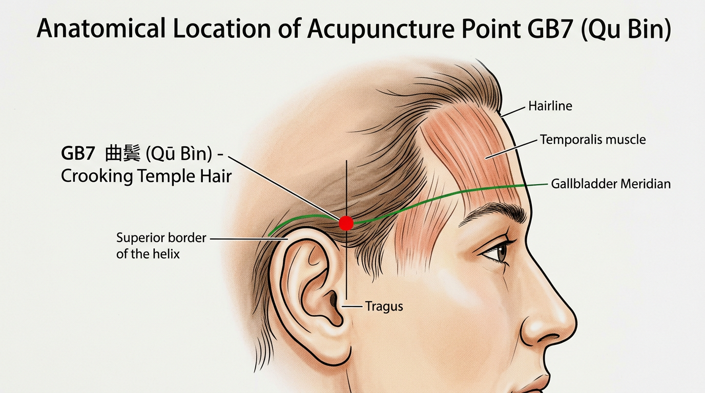

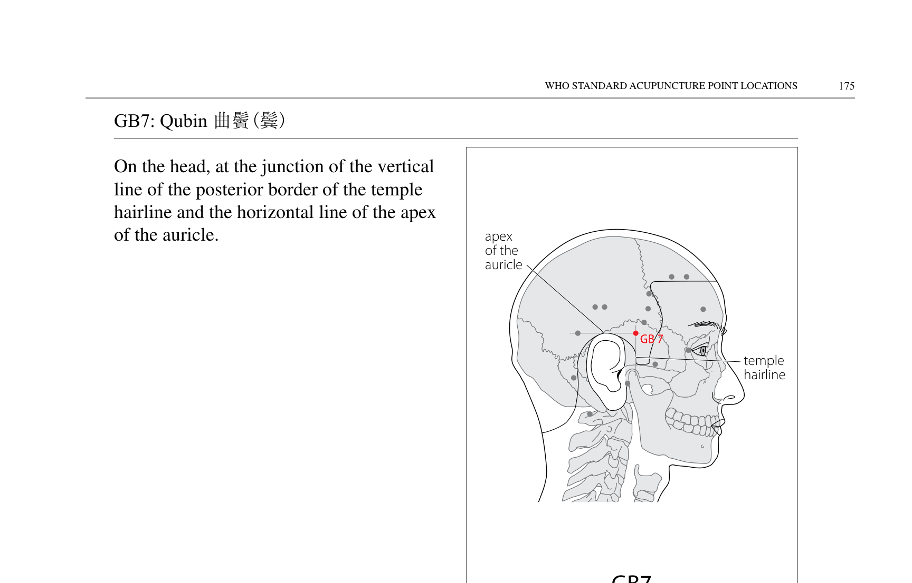

> **External References:** [AcuPoints](https://www.acupoints.org/gb7-acupuncture-point/)

**מיקום אנטומי:** ברקה, בצומת הקו האנכי שעולה מקצה הטראגוס עם קו השיער, מעל האוזן.

**איך למצוא את הנקודה:**

1. מצאו את הטראגוס (הבליטה שלפני פתח האוזן)
2. דמיינו קו אנכי העולה מקצהו העליון
3. הנקודה נמצאת במפגש הקו עם קו השיער
4. מעל האוזן, על הרקה

**עומק דקירה:** 0.3-0.5 צון

**זווית דקירה:** שטוחה

**תחושת דה-צ'י:** כאב מקומי

**פעולות והתוויות:**

* מפזרת רוח, משחררת כאב
* מועילה ללסת ולשיניים
* התוויות: כאב ראש צידי, נפיחות בלחי, כאב שיניים, לסת נעולה, נוקשות צוואר

**שילובי נקודות נפוצים:**

* GB7 + ST6 — לכאב שיניים ונפיחות בלחי

***

#### GB8 — שואי גו (率谷) — Shuài Gǔ — "עמק מוביל"

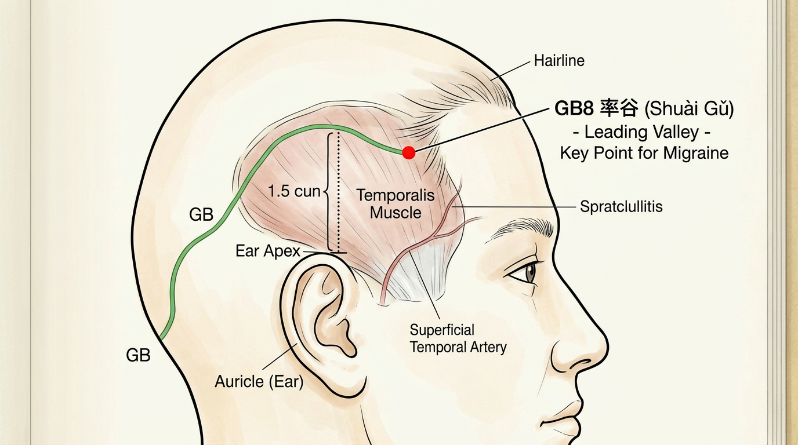

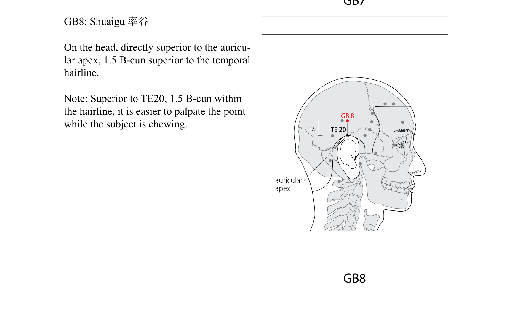

> **External References:** [AcuPoints](https://www.acupoints.org/gb8-acupuncture-point/)

**מיקום אנטומי:** 1.5 צון ישירות מעל קצה האוזן (apex), בתוך קו השיער.

**איך למצוא את הנקודה:**

1. קפלו את האוזן קדימה ומצאו את הנקודה הגבוהה ביותר (apex)
2. מדדו 1.5 צון ישירות כלפי מעלה מעל ה-apex
3. הנקודה נמצאת בתוך קו השיער, על הרקה

**עומק דקירה:** 0.3-0.5 צון

**זווית דקירה:** שטוחה לכיוון אחורי או קדמי

**תחושת דה-צ'י:** כאב מקומי

**פעולות והתוויות:**

* **נקודה חשובה למיגרנה ולכאב ראש צידי**
* מפזרת רוח-לחות
* מורידה צ'י מנוגד, מרגיעה הקאות
* התוויות: מיגרנה, כאב ראש צידי, הקאות, שיכרות (הנגאובר), סחרחורת

**שילובי נקודות נפוצים:**

* GB8 + Taiyang + TE5 — למיגרנה
* GB8 + PC6 — להקאות מיגרנה

***

#### GB9 — טיאן צ'ונג (天冲) — Tiān Chōng — "דחיפה שמימית"

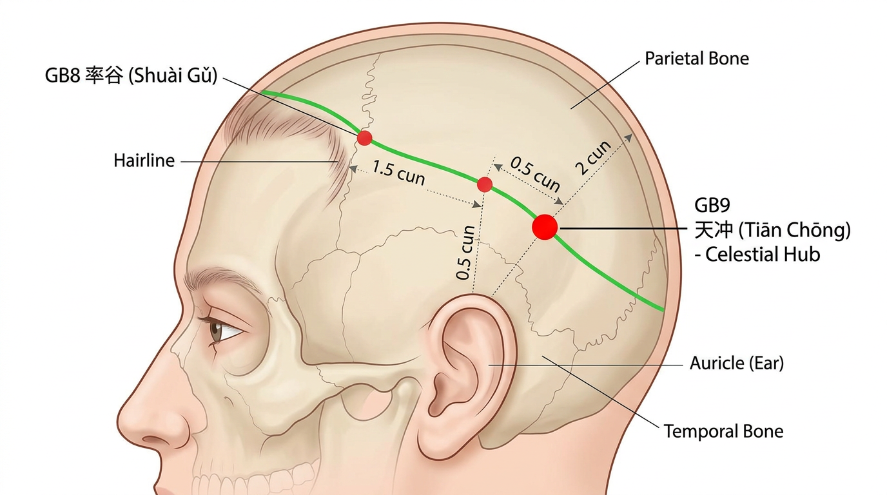

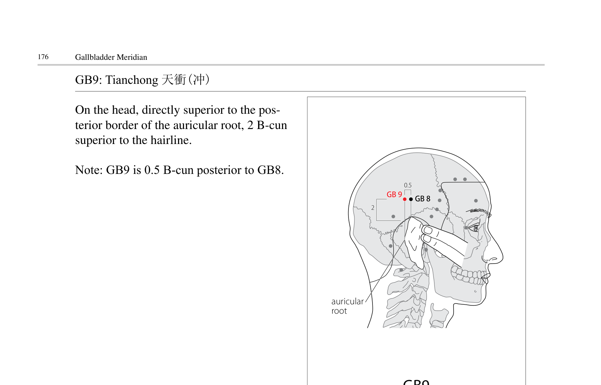

> **External References:** [AcuPoints](https://www.acupoints.org/gb9-acupuncture-point/)

**מיקום אנטומי:** 0.5 צון אחורי (פוסטריורי) ל-GB8, 2 צון מעל קו השיער, מעל האוזן.

**איך למצוא את הנקודה:**

1. מצאו את GB8 (1.5 צון מעל apex האוזן)
2. החליקו 0.5 צון אחורה
3. הנקודה על הקרקפת

**עומק דקירה:** 0.3-0.5 צון

**זווית דקירה:** שטוחה

**תחושת דה-צ'י:** כאב מקומי

**פעולות והתוויות:**

* מרגיעה את הרוח, מרגיעה פחד
* מנקה חום מהראש
* התוויות: כאב ראש, אפילפסיה, חרדה, דלקת חניכיים

**שילובי נקודות נפוצים:**

* GB9 + HT7 — לחרדה ופחד

***

#### GB10 — פו באי (浮白) — Fú Bái — "לבן צף"

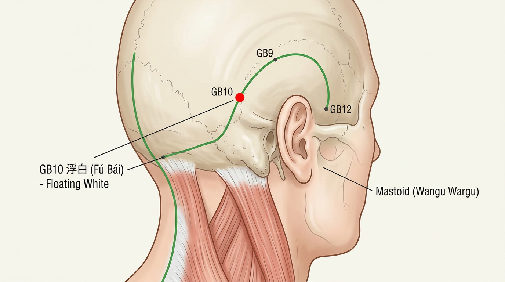

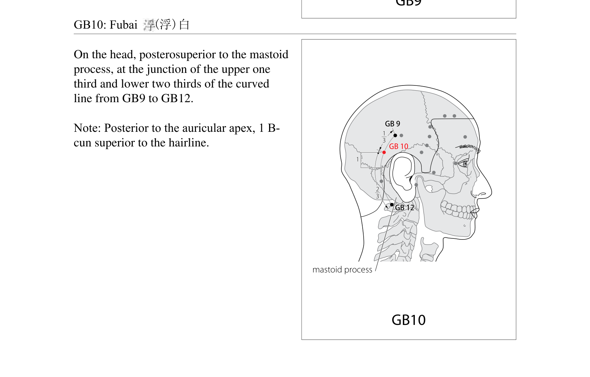

> **External References:** [AcuPoints](https://www.acupoints.org/gb10-acupuncture-point/)

**מיקום אנטומי:** מאחורי ומעל לתהליך המסטואידי, בשליש העליון של הקו בין GB9 ל-GB12.

**איך למצוא את הנקודה:**

1. מצאו את GB9 ואת GB12 (מאחורי ומתחת לתהליך המסטואידי)
2. חלקו את הקו לשלושה
3. הנקודה בשליש העליון

**עומק דקירה:** 0.3-0.5 צון

**זווית דקירה:** שטוחה

**תחושת דה-צ'י:** כאב מקומי

**פעולות והתוויות:**

* מפזרת רוח, משחררת כאב ראש
* מועילה לאוזניים
* התוויות: כאב ראש, טינטון, כאב שיניים, נפיחות בגרון, שיתוק רגל

**שילובי נקודות נפוצים:**

* GB10 + GB20 — לכאב ראש אחורי-צידי

***

#### GB11 — טאו צ'יאו ין (头窍阴) — Tóu Qiào Yīn — "חלל ין של הראש"

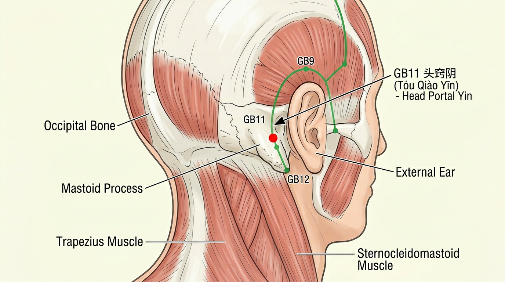

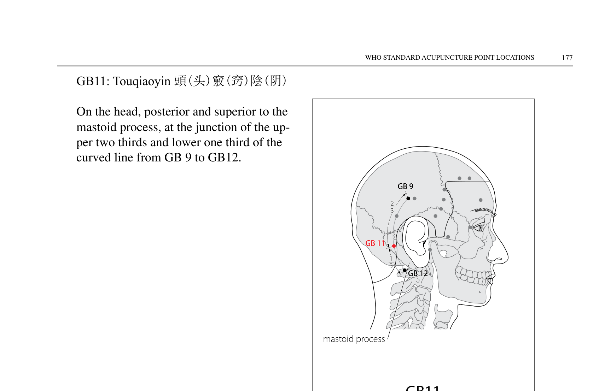

> **External References:** [AcuPoints](https://www.acupoints.org/gb11-acupuncture-point/)

**מיקום אנטומי:** מאחורי ומעל לתהליך המסטואידי, בשני שלישי הקו בין GB9 ל-GB12.

**איך למצוא את הנקודה:**

1. חלקו את הקו בין GB9 ל-GB12 לשלושה
2. הנקודה בשני השלישים (קרובה יותר ל-GB12)

**עומק דקירה:** 0.3-0.5 צון

**זווית דקירה:** שטוחה

**תחושת דה-צ'י:** כאב מקומי

**פעולות והתוויות:**

* מועילה לאוזניים ולעיניים
* מנקה חום מהראש
* התוויות: כאב ראש, סחרחורת, כאב אוזניים, טינטון

**שילובי נקודות נפוצים:**

* GB11 + GB20 — לכאב ראש וסחרחורת

***

#### GB12 — וואן גו (完骨) — Wán Gǔ — "עצם שלמה"

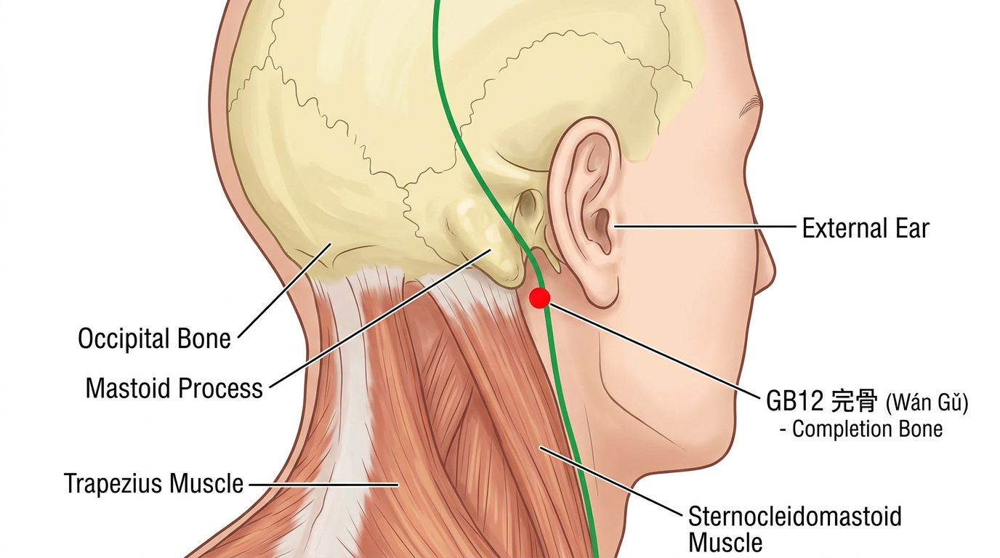

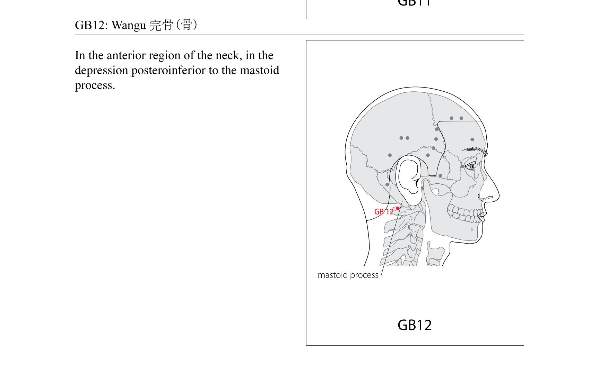

> **External References:** [AcuPoints](https://www.acupoints.org/gb12-acupuncture-point/)

**מיקום אנטומי:** בשקע שמאחורי ומתחת לתהליך המסטואידי.

**איך למצוא את הנקודה:**

1. מצאו את התהליך המסטואידי (הבליטה מאחורי האוזן)
2. החליקו לכיוון מטה ואחורה
3. הנקודה נמצאת בשקע שמתחת ומאחורי התהליך המסטואידי

**עומק דקירה:** 0.5-0.8 צון

**זווית דקירה:** אובליקית כלפי מטה

**תחושת דה-צ'י:** כאב מקומי, תחושת כבדות

**פעולות והתוויות:**

* מפזרת רוח, מנקה חום
* מרגיעה את הרוח
* מועילה לאוזניים ולצוואר
* התוויות: כאב ראש, נדודי שינה, נוקשות צוואר, כאב אוזניים, שיתוק פנים, נפיחות בלחי, מלריה

**שילובי נקודות נפוצים:**

* GB12 + GB20 — לכאב ראש אוקסיפיטלי ונוקשות צוואר
* GB12 + TE17 — לכאב אוזניים

***

#### GB13 — בן שן (本神) — Běn Shén — "שורש הרוח"

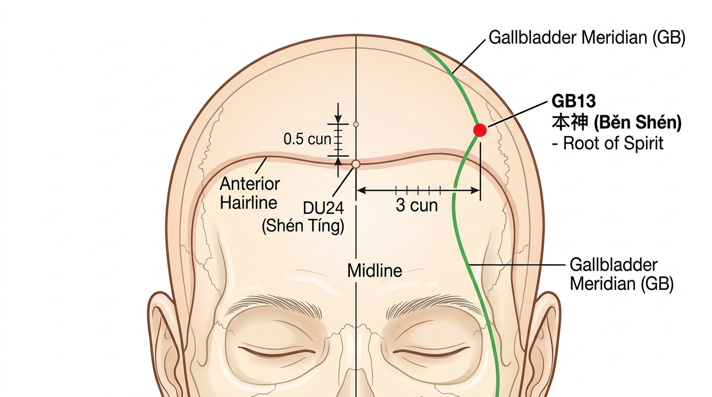

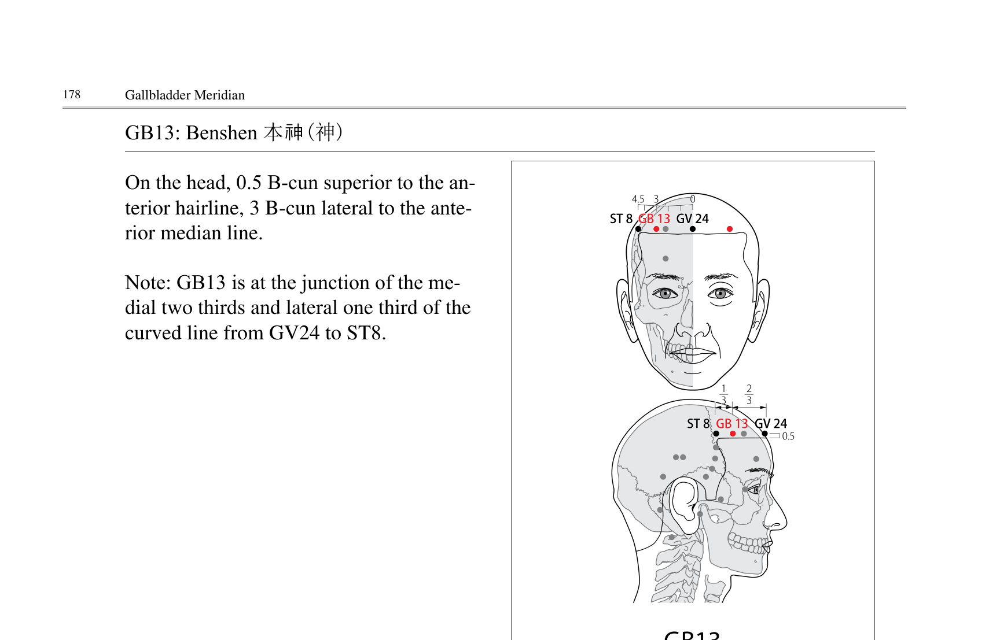

> **External References:** [AcuPoints](https://www.acupoints.org/gb13-acupuncture-point/)

**מיקום אנטומי:** 0.5 צון בתוך קו השיער, 3 צון לטרלית ל-DU24 (שן טינג).

**איך למצוא את הנקודה:**

1. מצאו את DU24 (0.5 צון בתוך קו השיער בקו האמצע)
2. מדדו 3 צון הצידה
3. הנקודה 0.5 צון בתוך קו השיער הקדמי

**עומק דקירה:** 0.3-0.5 צון

**זווית דקירה:** שטוחה

**תחושת דה-צ'י:** כאב מקומי

**פעולות והתוויות:**

* מרגיעה את הרוח, מנקה רוח מהראש
* מפזרת פליגמה מהמוח
* התוויות: כאב ראש, סחרחורת, אפילפסיה, מאניה, נדודי שינה, כאב בצוואר

**שילובי נקודות נפוצים:**

* GB13 + DU24 — להרגעת הרוח
* GB13 + HT7 — לנדודי שינה ומצבים נפשיים

***

#### GB14 — יאנג באי (阳白) — Yáng Bái — "לובן היאנג"

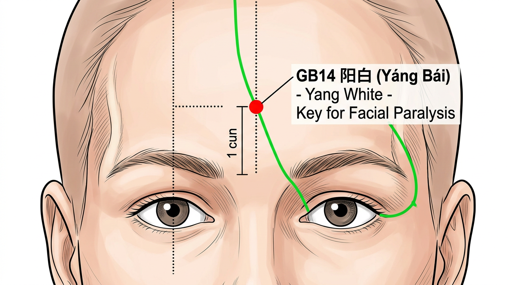

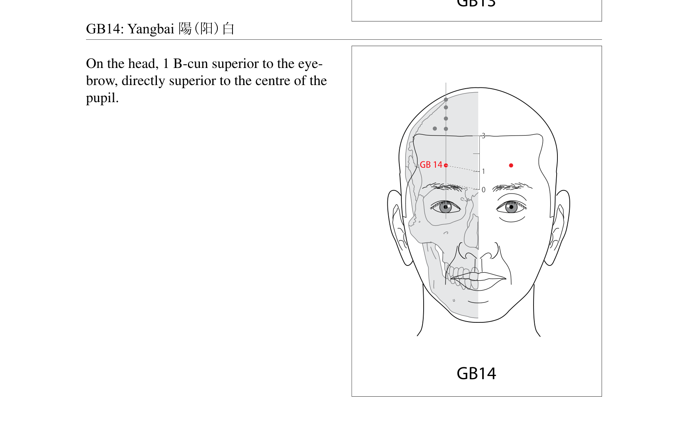

> **External References:** [AcuPoints](https://www.acupoints.org/gb14-acupuncture-point/)

**מיקום אנטומי:** 1 צון מעל אמצע הגבה, ישירות מעל האישון כאשר העין מביטה ישר קדימה.

**איך למצוא את הנקודה:**

1. בקשו מהמטופל להביט ישר קדימה
2. דמיינו קו אנכי מהאישון כלפי מעלה
3. מצאו את אמצע הגבה על קו זה
4. הנקודה 1 צון מעל הגבה על אותו קו אנכי

**עומק דקירה:** 0.3-0.5 צון

**זווית דקירה:** שטוחה כלפי מטה (לכיוון הגבה)

**תחושת דה-צ'י:** כאב מקומי, תחושת כבדות במצח

**פעולות והתוויות:**

* מועילה לעיניים, מבהירה את הראיה
* מפזרת רוח, משחררת כאב ראש קדמי
* **נקודה חשובה לשיתוק פנים**
* התוויות: כאב ראש קדמי, כאב מעל העיניים, סחרחורת, עוויתות בעפעף, ירידה בראיה, שיתוק פנים, עיוור לילה

**שילובי נקודות נפוצים:**

* GB14 + Yuyao + Taiyang — לכאב מעל העיניים ומיגרנה
* GB14 + ST2 + BL1 — לבעיות עיניים
* GB14 + LI4 + ST4 — לשיתוק פנים

***

#### GB15 — טאו לין צ'י (头临泣) — Tóu Lín Qì — "דמעה יורדת של הראש"

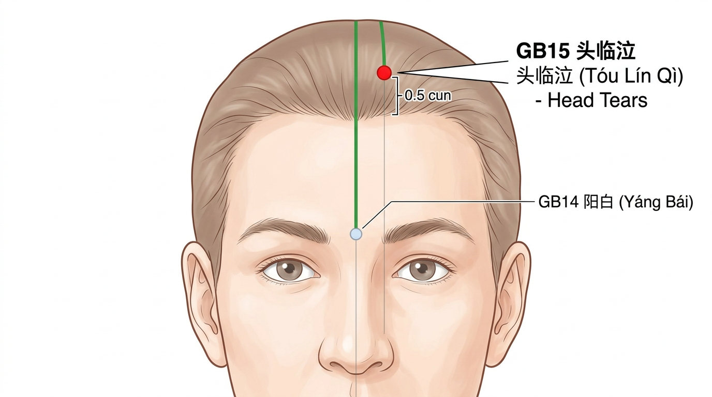

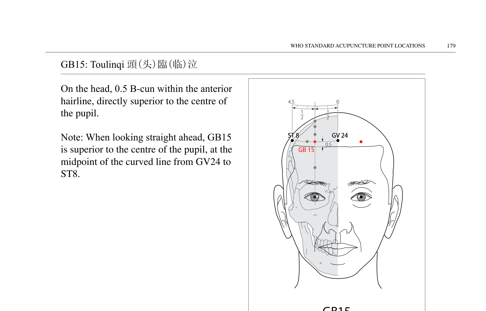

> **External References:** [AcuPoints](https://www.acupoints.org/gb15-acupuncture-point/)

**מיקום אנטומי:** 0.5 צון בתוך קו השיער, ישירות מעל GB14, על הקו שבין DU24 ל-GB15.

**איך למצוא את הנקודה:**

1. מצאו את GB14 (1 צון מעל אמצע הגבה)
2. המשיכו ישר כלפי מעלה עד לקו השיער
3. הנקודה 0.5 צון בתוך קו השיער

**עומק דקירה:** 0.3-0.5 צון

**זווית דקירה:** שטוחה

**תחושת דה-צ'י:** כאב מקומי

**פעולות והתוויות:**

* מועילה לעיניים, מפזרת רוח
* משחררת כאב ראש
* התוויות: כאב ראש, סחרחורת, כאב בעיניים, דמעות, סטיית עין, אפילפסיה, גודש באף

**שילובי נקודות נפוצים:**

* GB15 + GB14 — לכאב ראש קדמי-צידי
* GB15 + BL2 — לבעיות עיניים

***

#### GB16 — מו צ'ואנג (目窗) — Mù Chuāng — "חלון העין"

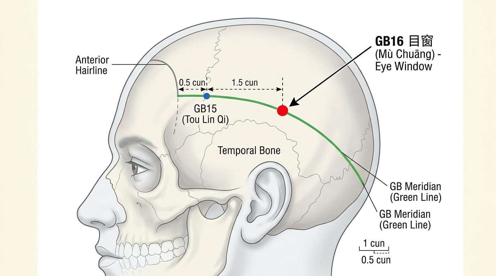

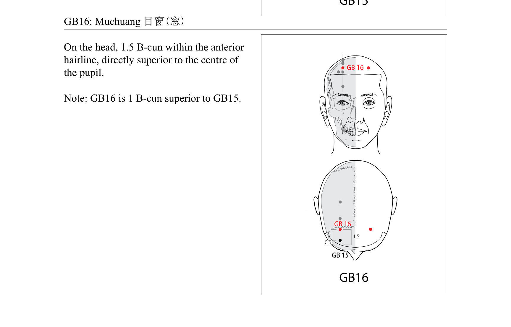

> **External References:** [AcuPoints](https://www.acupoints.org/gb16-acupuncture-point/)

**מיקום אנטומי:** 1.5 צון אחורי ל-GB15, 2 צון בתוך קו השיער.

**איך למצוא את הנקודה:**

1. מצאו את GB15
2. מדדו 1.5 צון אחורה לאורך הקרקפת

**עומק דקירה:** 0.3-0.5 צון

**זווית דקירה:** שטוחה

**תחושת דה-צ'י:** כאב מקומי

**פעולות והתוויות:**

* מבהירה את העיניים, מפזרת רוח
* התוויות: כאב ראש, סחרחורת, כאב בעיניים, נפיחות בפנים

**שילובי נקודות נפוצים:**

* GB16 + GB14 — לכאב בעיניים עם כאב ראש

***

#### GB17 — ג'נג יינג (正营) — Zhèng Yíng — "מחנה ישר"

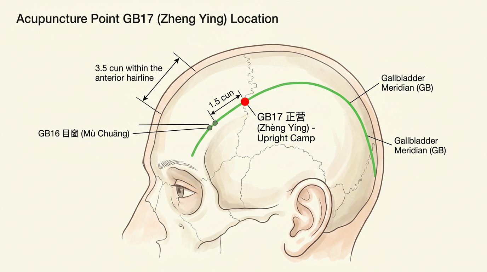

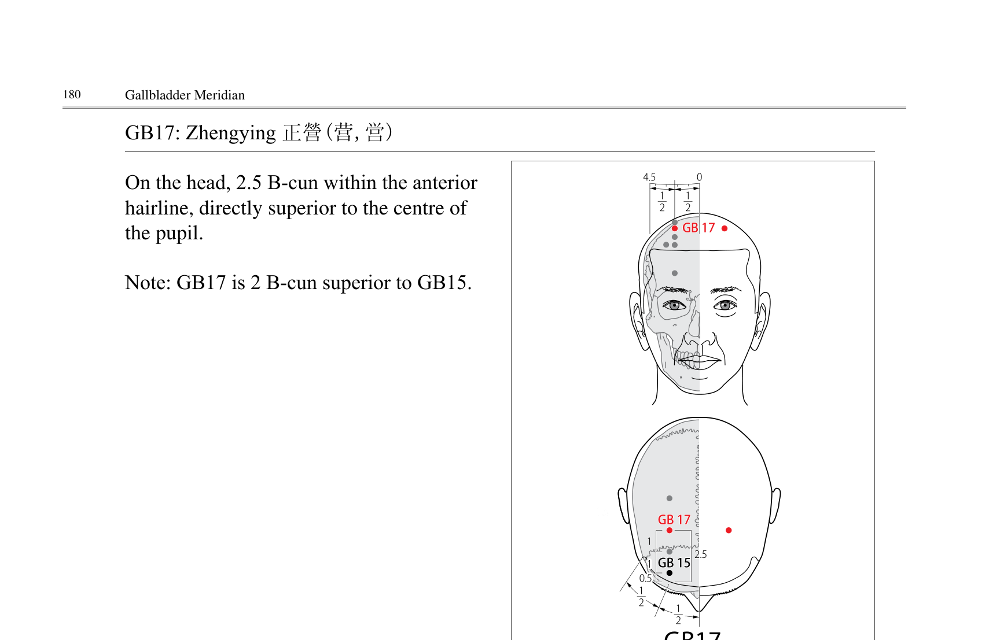

> **External References:** [AcuPoints](https://www.acupoints.org/gb17-acupuncture-point/)

**מיקום אנטומי:** 1.5 צון אחורי ל-GB16, 3.5 צון בתוך קו השיער.

**איך למצוא את הנקודה:**

1. מצאו את GB16
2. מדדו 1.5 צון אחורה

**עומק דקירה:** 0.3-0.5 צון

**זווית דקירה:** שטוחה

**תחושת דה-צ'י:** כאב מקומי

**פעולות והתוויות:**

* מפזרת רוח, משחררת כאב ראש
* מרגיעה את הרוח
* התוויות: כאב ראש, סחרחורת, כאב שיניים, הקאות

**שילובי נקודות נפוצים:**

* GB17 + GB20 — לכאב ראש צידי-אחורי

***

#### GB18 — צ'נג לינג (承灵) — Chéng Líng — "קבלת רוח"

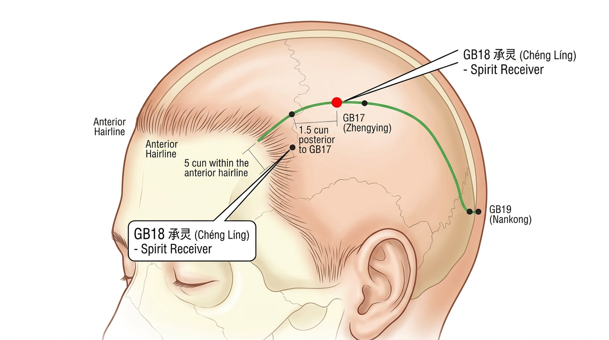

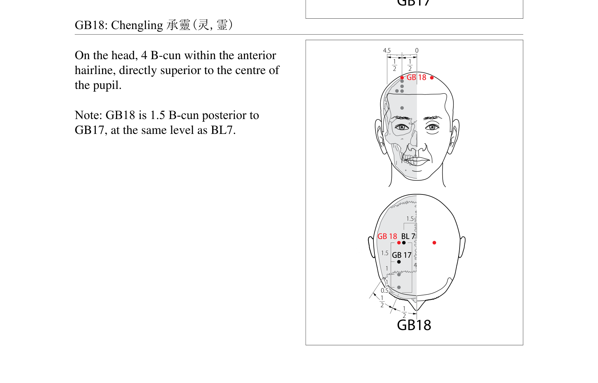

> **External References:** [AcuPoints](https://www.acupoints.org/gb18-acupuncture-point/)

**מיקום אנטומי:** 1.5 צון אחורי ל-GB17, 5 צון בתוך קו השיער.

**איך למצוא את הנקודה:**

1. מצאו את GB17
2. מדדו 1.5 צון אחורה

**עומק דקירה:** 0.3-0.5 צון

**זווית דקירה:** שטוחה

**תחושת דה-צ'י:** כאב מקומי

**פעולות והתוויות:**

* מפזרת רוח, מנקה את האף
* התוויות: כאב ראש, סחרחורת, גודש באף, דימום מהאף, אסתמה

**שילובי נקודות נפוצים:**

* GB18 + LI20 — לגודש באף

***

#### GB19 — נאו קונג (脑空) — Nǎo Kōng — "חלל המוח"

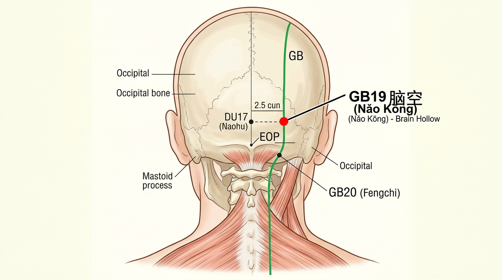

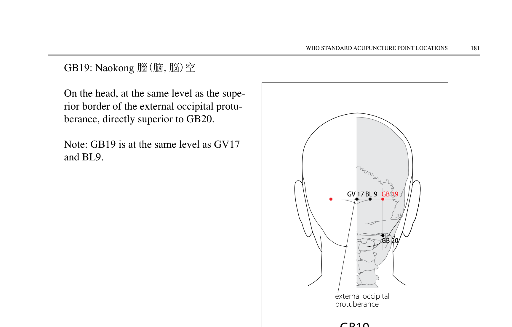

> **External References:** [AcuPoints](https://www.acupoints.org/gb19-acupuncture-point/)

**מיקום אנטומי:** ישירות מעל GB20, בגובה השפה העליונה של הבליטה האוקסיפיטלית החיצונית (EOP), 2.5 צון לטרלית ל-DU17.

**איך למצוא את הנקודה:**

1. מצאו את GB20 (בשקע מתחת לאוקסיפוט)
2. הנקודה ישירות מעלה, בגובה DU17
3. על הבליטה האוקסיפיטלית, 2.5 צון מקו האמצע

**עומק דקירה:** 0.3-0.5 צון

**זווית דקירה:** שטוחה

**תחושת דה-צ'י:** כאב מקומי

**פעולות והתוויות:**

* מפזרת רוח, מנקה חום מהראש
* מרגיעה את הרוח
* התוויות: כאב ראש, נוקשות צוואר, סחרחורת, מאניה, אפילפסיה

**שילובי נקודות נפוצים:**

* GB19 + GB20 — לכאב ראש אוקסיפיטלי

***

#### GB20 — פנג צ'י (风池) — Fēng Chí — "בריכת הרוח"

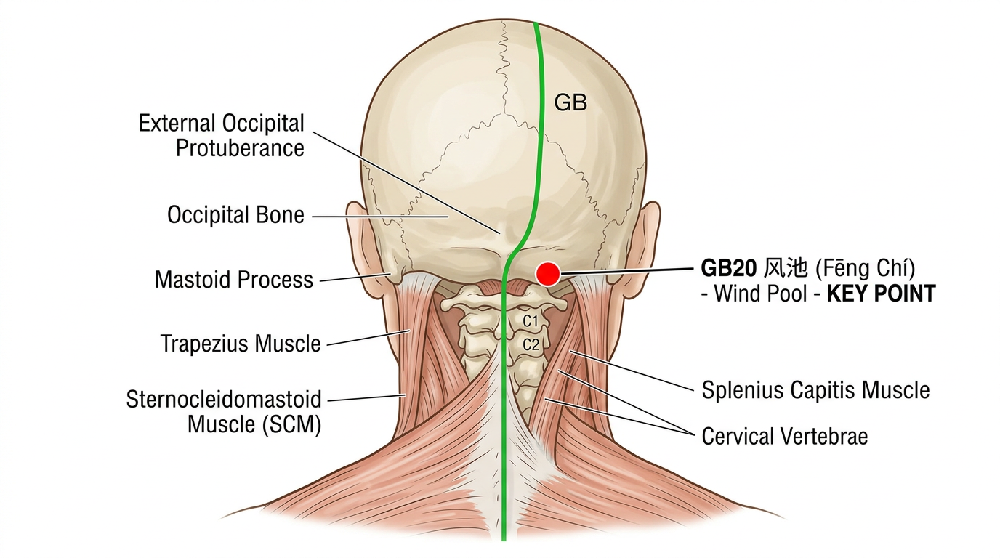

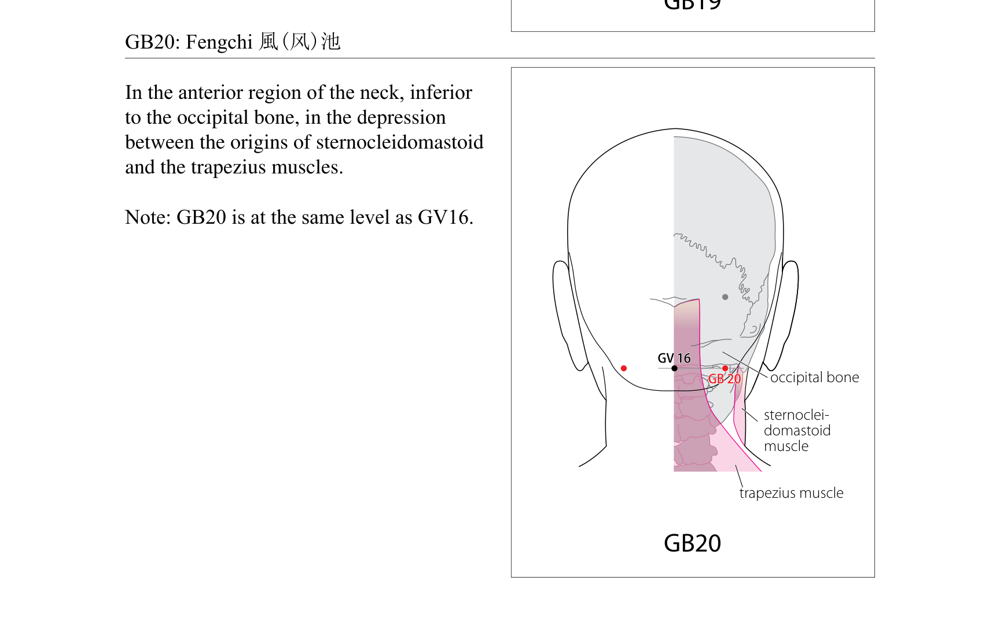

> **External References:** [AcuPoints](https://www.acupoints.org/gb20-acupuncture-point/)

**קטגוריה מיוחדת:** נקודת מפגש עם יאנג ווי מאי (阳维脉), אחת הנקודות החשובות ביותר בגוף

**מיקום אנטומי:** בשקע שמתחת לעצם האוקסיפוט, בין מקומות ההתחברות של שרירי הטרפזיוס והסטרנוקלידומסטואיד (SCM).

**איך למצוא את הנקודה:**

1. מצאו את הבליטה האוקסיפיטלית החיצונית (EOP) בעורף
2. החליקו לטרלית (הצידה) לאורך הבסיס של הגולגולת
3. מצאו את השקע בין שריר הטרפזיוס (מדיאלי) לשריר ה-SCM (לטרלי)
4. הנקודה בשקע הזה, בגובה DU16 (פנג פו)
5. בדרך כלל ניתן למשש שקע ברור

**עומק דקירה:** 0.8-1.2 צון

**זווית דקירה:** לכיוון קצה האף (אובליקית קדמית-מדיאלית). אסור לדקור עמוק בכיוון ישר — מדולה אובלונגטה!

**תחושת דה-צ'י:** כאב מקומי חזק, תחושת הקרנה לראש, לעין או למצח, תחושת כבדות

**פעולות והתוויות:**

* **נקודה מרכזית לפיזור רוח חיצונית ופנימית**
* מועילה לראש ולעיניים
* מפזרת רוח-חום ורוח-קור
* מפתחת את חושי הראש
* מורידה יאנג עולה
* מפעילה את הערוץ ומשחררת כאב בצוואר
* התוויות: כאב ראש (כל סוג), מיגרנה, סחרחורת, טינטון, כאב בעיניים, גודש באף, הצטננות, שפעת, חום, נוקשות צוואר, כאב צוואר, יתר לחץ דם, שבץ, שיתוק פנים, אפילפסיה

**שילובי נקודות נפוצים:**

* GB20 + LI4 + LU7 — להצטננות (רוח-קור או רוח-חום)
* GB20 + LR3 — להורדת יאנג, יתר לחץ דם, כאב ראש
* GB20 + TE5 — לכאב ראש ונוקשות צוואר
* GB20 + BL10 — לכאב ראש אוקסיפיטלי
* GB20 + GV20 — לסחרחורת
* GB20 + Taiyang + GB8 — למיגרנה

***

#### GB21 — ג'יאן ג'ינג (肩井) — Jiān Jǐng — "באר הכתף"

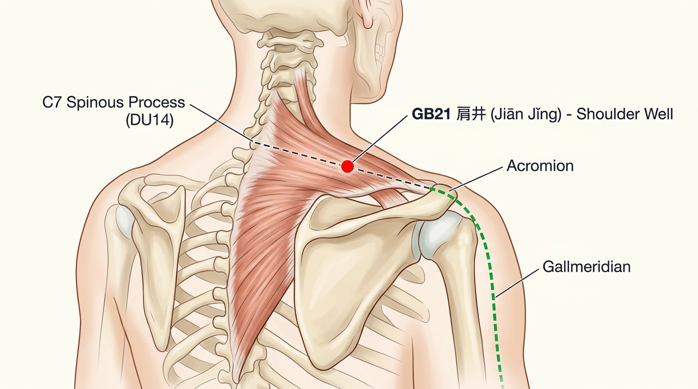

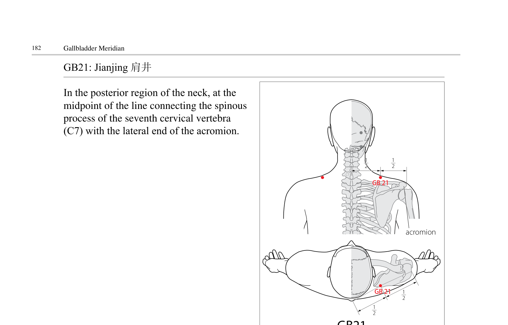

> **External References:** [AcuPoints](https://www.acupoints.org/gb21-acupuncture-point/)

**קטגוריה מיוחדת:** נקודת מפגש עם ערוץ שלוש המבערות (TE), ערוץ הקיבה (ST), ויאנג ווי מאי

**מיקום אנטומי:** באמצע הקו בין תהליך השדרה C7 (DU14) לקצה הלטרלי של האקרומיון, על הנקודה הגבוהה ביותר של שריר הטרפזיוס.

**איך למצוא את הנקודה:**

1. מצאו את C7 (החוליה הבולטת בבסיס הצוואר — DU14)
2. מצאו את קצה הכתף (אקרומיון)
3. הנקודה נמצאת בדיוק באמצע הקו בין השניים
4. על הנקודה הגבוהה ביותר של שריר הטרפזיוס
5. לחצו — רגישה מאוד ברוב האנשים

**עומק דקירה:** 0.5-0.8 צון

**זווית דקירה:** ניצבת (90°). **זהירות**: לא לדקור עמוק — ריאה מתחת! אסור בהריון (נקודת הנמכה חזקה).

**תחושת דה-צ'י:** כאב מקומי חזק, תחושת כבדות בכתף, לעיתים הקרנה לזרוע

**פעולות והתוויות:**

* מפעילה צ'י ודם, מפזרת סטגנציה
* מורידה צ'י (כולל הנמכת שליה/עובר)
* מועילה לכתף ולצוואר
* מקדמת לידה ומורידה חלב
* התוויות: כאב בכתף ובצוואר, נוקשות צוואר, כאב ראש, כאב גב, קושי בלידה, אי-ירידת חלב, מסטיטיס, שבץ

**שילובי נקודות נפוצים:**

* GB21 + TE14 + LI15 — לכאב כתף מקיף
* GB21 + GB20 — לנוקשות צוואר
* GB21 + LI4 + SP6 — לקידום לידה (אסור בהריון רגיל!)

***

#### GB22 — יואן יה (渊腋) — Yuān Yè — "בית שחי עמוק"

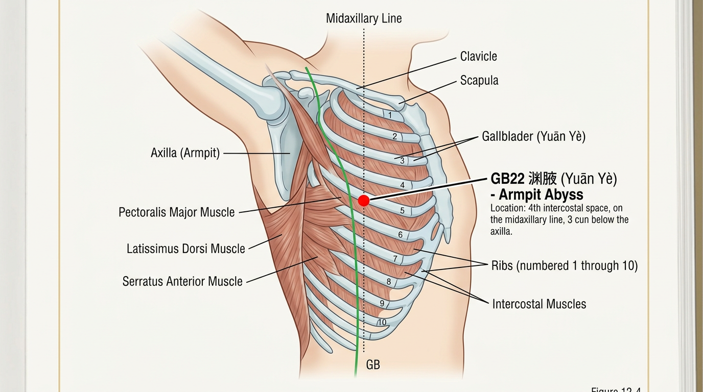

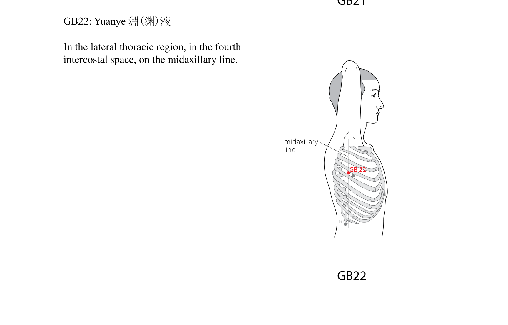

> **External References:** [AcuPoints](https://www.acupoints.org/gb22-acupuncture-point/)

**מיקום אנטומי:** על קו האמצע של בית השחי, ברווח הבין-צלעי ה-4, 3 צון מתחת לבית השחי.

**איך למצוא את הנקודה:**

1. מצאו את קפל בית השחי
2. מדדו 3 צון כלפי מטה לאורך קו האמצע של בית השחי
3. הנקודה ברווח הבין-צלעי ה-4

**עומק דקירה:** 0.3-0.5 צון

**זווית דקירה:** אובליקית או שטוחה (לא לדקור עמוק — ריאות)

**תחושת דה-צ'י:** כאב מקומי

**פעולות והתוויות:**

* מרחיבה את החזה, מפזרת סטגנציה
* התוויות: כאב בצלעות, נפיחות בבית השחי, כאב בחזה הצידי

**שילובי נקודות נפוצים:**

* GB22 + GB34 — לכאב בצלעות

***

#### GB23 — ג'ה ג'ין (辄筋) — Zhé Jīn — "גיד נבחר"

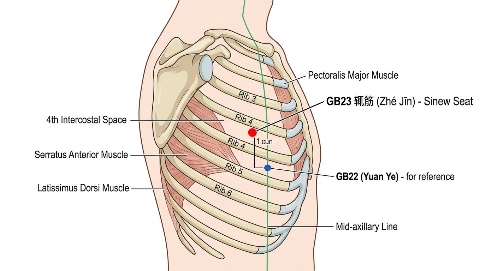

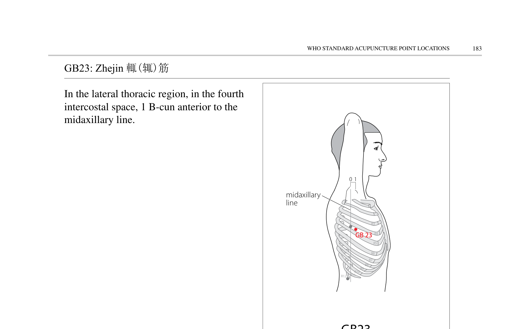

> **External References:** [AcuPoints](https://www.acupoints.org/gb23-acupuncture-point/)

**מיקום אנטומי:** 1 צון קדימה (אנטריורית) ל-GB22, ברווח הבין-צלעי ה-4.

**איך למצוא את הנקודה:**

1. מצאו את GB22
2. מדדו 1 צון קדימה
3. ברווח הבין-צלעי ה-4

**עומק דקירה:** 0.3-0.5 צון

**זווית דקירה:** אובליקית או שטוחה

**תחושת דה-צ'י:** כאב מקומי

**פעולות והתוויות:**

* מורידה צ'י מנוגד, מרחיבה את החזה
* התוויות: אסתמה, כאב בחזה, כאב בצלעות, הקאות חומצית

**שילובי נקודות נפוצים:**

* GB23 + PC6 — לכאב בחזה עם בחילות

***

#### GB24 — רי יואה (日月) — Rì Yuè — "שמש וירח"

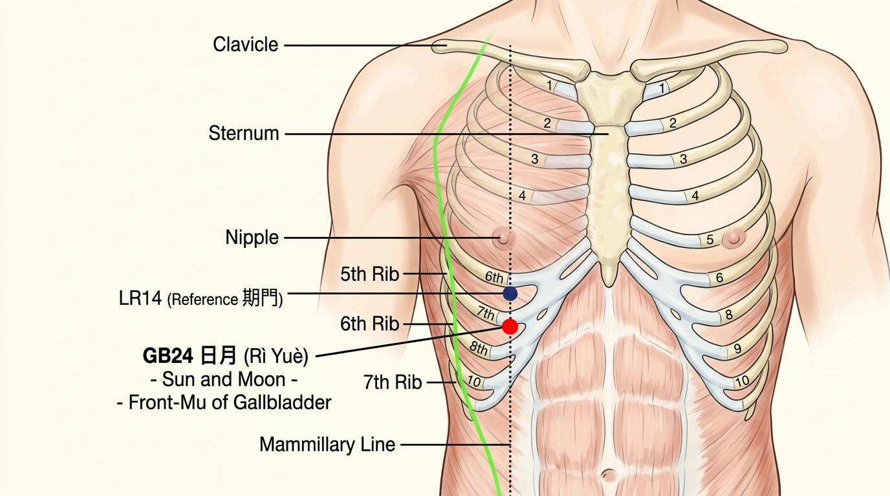

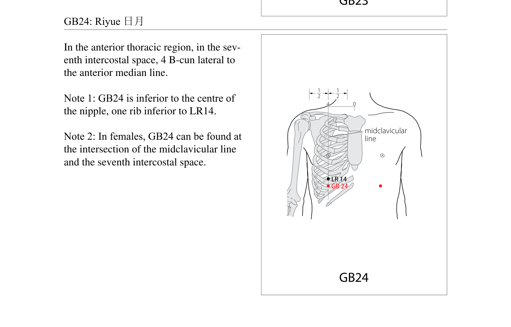

> **External References:** [AcuPoints](https://www.acupoints.org/gb24-acupuncture-point/)

**קטגוריה מיוחדת:** נקודת מו-קדמית (募穴) של כיס המרה

**מיקום אנטומי:** ברווח הבין-צלעי ה-7, ישירות מתחת לפטמה, 1 רווח בין-צלעי מתחת ל-LR14.

**איך למצוא את הנקודה:**

1. מצאו את LR14 (ברווח הבין-צלעי ה-6, מתחת לפטמה)
2. ירדו רווח בין-צלעי אחד כלפי מטה
3. הנקודה ברווח הבין-צלעי ה-7, ישירות מתחת לפטמה
4. 4 צון מקו האמצע

**עומק דקירה:** 0.5-0.8 צון

**זווית דקירה:** אובליקית או שטוחה (לא לדקור עמוק)

**תחושת דה-צ'י:** כאב מקומי, תחושת נפיחות

**פעולות והתוויות:**

* **נקודת מו של כיס המרה — מפזרת לחות-חום מכיס המרה**
* מווסתת צ'י הכבד
* מרגיעה את הקיבה
* התוויות: כאב בצלעות, מרירות בפה, צהבת, הקאות, בחילות, שיהוקים, כאב בהיפוכנדריום

**שילובי נקודות נפוצים:**

* GB24 + LR14 — לטיפול משולב בכבד וכיס מרה
* GB24 + GB34 — לניקוי לחות-חום מכיס המרה
* GB24 + REN12 — לבעיות עיכול

***

#### GB25 — ג'ינג מן (京门) — Jīng Mén — "שער הבירה"

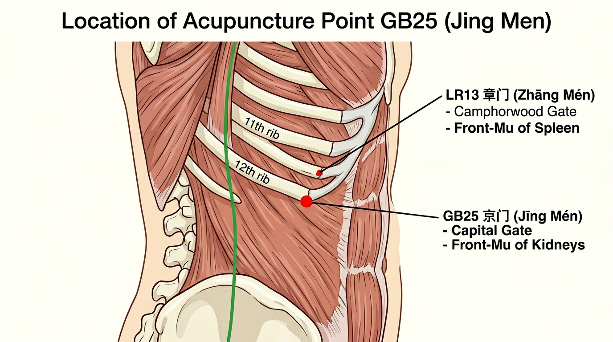

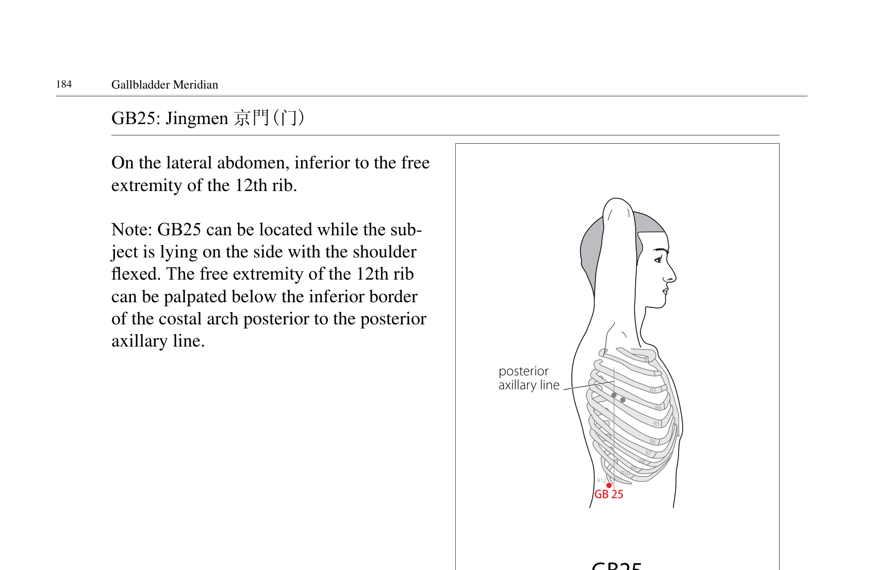

> **External References:** [AcuPoints](https://www.acupoints.org/gb25-acupuncture-point/)

**קטגוריה מיוחדת:** נקודת מו-קדמית (募穴) של הכליות

**מיקום אנטומי:** בקצה החופשי של הצלע ה-12 (הצלע הצפה האחרונה), בצד הלטרלי של הבטן.

**איך למצוא את הנקודה:**

1. מצאו את הצלע ה-12 (הצלע הקצרה ביותר, הצפה)
2. הנקודה בקצה החופשי של הצלע
3. LR13 היא בקצה הצלע ה-11, GB25 בקצה הצלע ה-12

**עומק דקירה:** 0.5-1 צון

**זווית דקירה:** ניצבת (90°), לא לדקור עמוק (כליה מתחת)

**תחושת דה-צ'י:** כאב מקומי

**פעולות והתוויות:**

* **נקודת מו של הכליות**
* מחזקת את הכליות, מווסתת מים
* מפזרת סטגנציה מהצלעות
* התוויות: כאב בצלעות, כאב בגב התחתון, כאב ובטן, שלשולים, בצקות, אבנים בכליות

**שילובי נקודות נפוצים:**

* GB25 + BL23 — לחיזוק הכליות (מו + שו)
* GB25 + KI3 — לטיפול בבעיות כליות

***

#### GB26 — דאי מאי (带脉) — Dài Mài — "כלי החגורה"

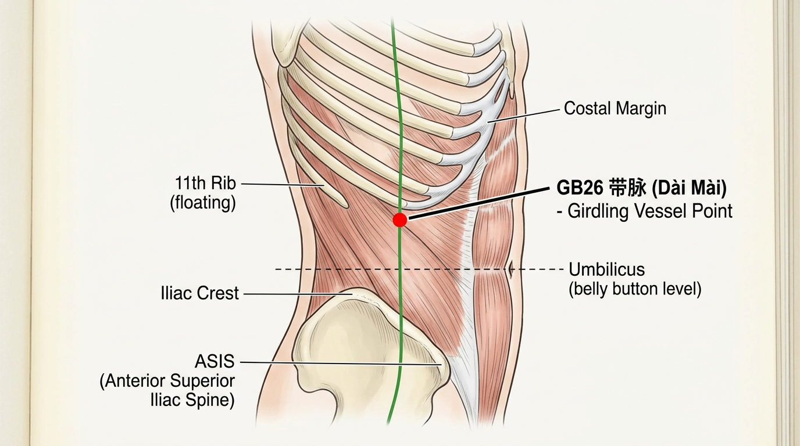

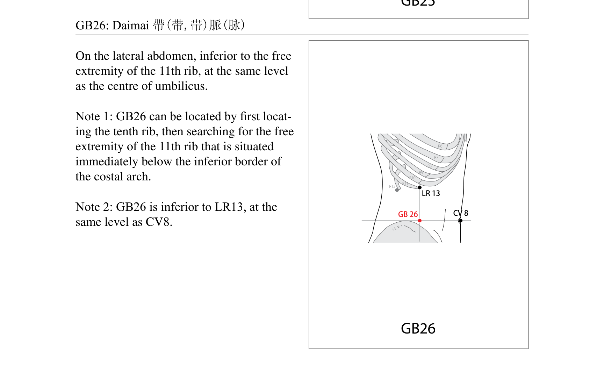

> **External References:** [AcuPoints](https://www.acupoints.org/gb26-acupuncture-point/)

**קטגוריה מיוחדת:** נקודת מפגש עם כלי דאי מאי (带脉)

**מיקום אנטומי:** ישירות מתחת ל-LR13 (קצה הצלע ה-11), בגובה הטבור, על קו אמצע בית השחי.

**איך למצוא את הנקודה:**

1. מצאו את LR13 (קצה הצלע ה-11)
2. ירדו ישירות כלפי מטה עד לגובה הטבור
3. הנקודה על הקו שבין הצלע ה-11 לאגן, בגובה הטבור

**עומק דקירה:** 0.5-1 צון

**זווית דקירה:** ניצבת (90°)

**תחושת דה-צ'י:** כאב מקומי

**פעולות והתוויות:**

* מווסתת את דאי מאי (כלי החגורה)
* מפזרת לחות-חום מהמבער התחתון
* מווסתת את המחזור
* התוויות: הפרשות מהנרתיק (ליקוריאה), כאבי מחזור, אי-סדירות במחזור, כאב בבטן, בקע, כאב בגב התחתון

**שילובי נקודות נפוצים:**

* GB26 + GB41 — לוויסות דאי מאי
* GB26 + SP6 — לטיפול בהפרשות ובעיות גינקולוגיות

***

#### GB27 — וו שו (五枢) — Wǔ Shū — "ציר חמישי"

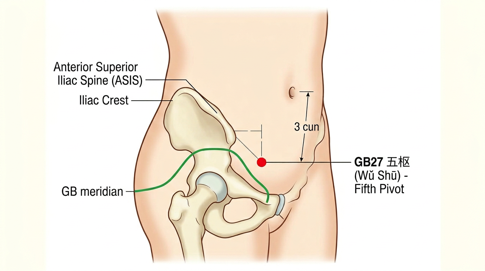

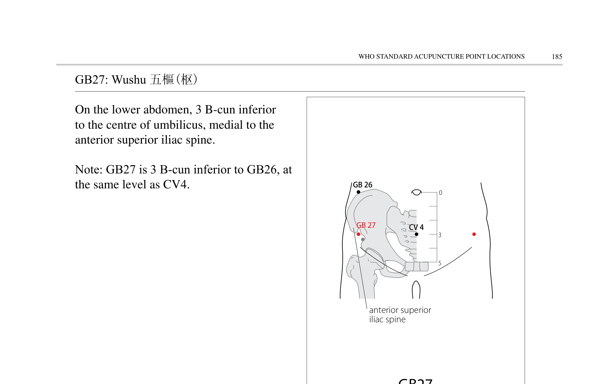

> **External References:** [AcuPoints](https://www.acupoints.org/gb27-acupuncture-point/)

**מיקום אנטומי:** באזור הבטן התחתונה, קדמי ומתחת לעמוד השדרה הכסלי העליון (ASIS), 3 צון מתחת לגובה הטבור.

**איך למצוא את הנקודה:**

1. מצאו את ה-ASIS (הבליטה הקדמית-עליונה של עצם האגן)
2. הנקודה קדמית ומטה ל-ASIS
3. בגובה 3 צון מתחת לטבור

**עומק דקירה:** 0.5-1 צון

**זווית דקירה:** ניצבת (90°)

**תחושת דה-צ'י:** כאב מקומי

**פעולות והתוויות:**

* מווסתת דאי מאי
* מפזרת לחות מהמבער התחתון
* התוויות: הפרשות מהנרתיק, כאב בבטן תחתונה, כאב בגב תחתון, בקע, עצירות

**שילובי נקודות נפוצים:**

* GB27 + GB26 — לוויסות דאי מאי

***

#### GB28 — ווי דאו (维道) — Wéi Dào — "דרך המחבר"

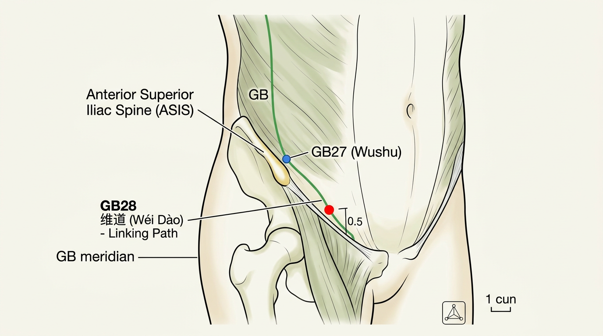

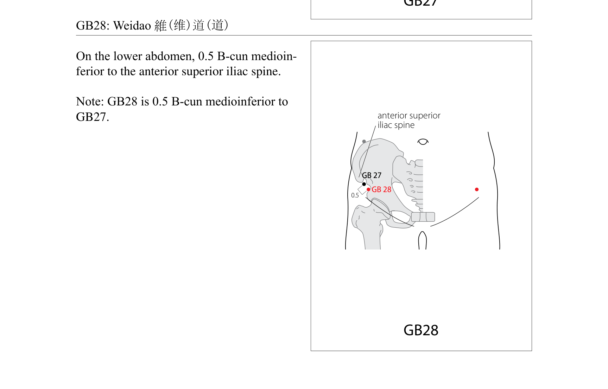

> **External References:** [AcuPoints](https://www.acupoints.org/gb28-acupuncture-point/)

**מיקום אנטומי:** 0.5 צון קדמי ומטה ל-GB27, קדמי-תחתון ל-ASIS.

**איך למצוא את הנקודה:**

1. מצאו את GB27
2. החליקו 0.5 צון קדימה ומטה

**עומק דקירה:** 0.5-1 צון

**זווית דקירה:** ניצבת (90°)

**תחושת דה-צ'י:** כאב מקומי

**פעולות והתוויות:**

* מווסתת דאי מאי, מפזרת לחות
* התוויות: הפרשות מהנרתיק, כאב בבטן תחתונה, צניחת רחם, בקע

**שילובי נקודות נפוצים:**

* GB28 + GB26 + SP6 — לטיפול בהפרשות

***

#### GB29 — ג'ו ליאו (居髎) — Jū Liáo — "שקע מגורים"

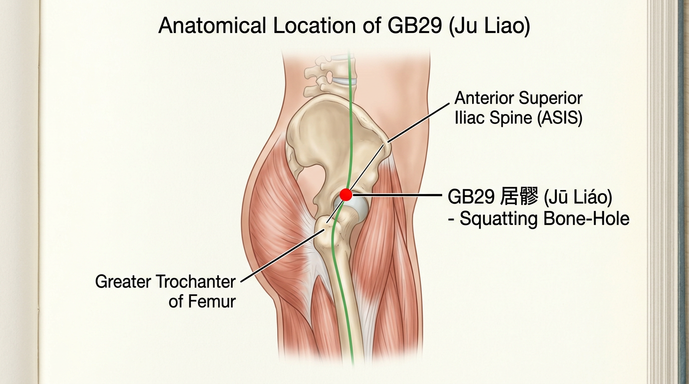

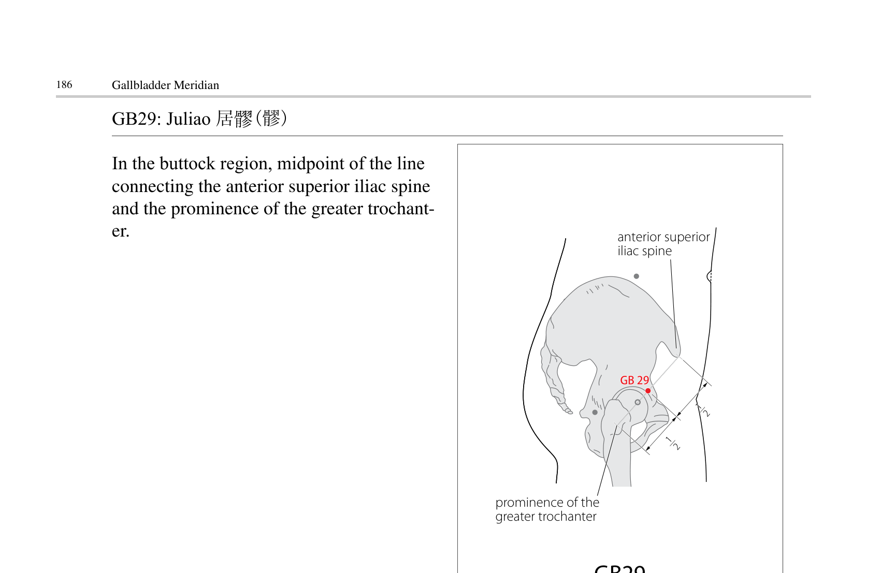

> **External References:** [AcuPoints](https://www.acupoints.org/gb29-acupuncture-point/)

**מיקום אנטומי:** באמצע הקו בין ASIS לנקודת השיא של הטרוכנטר הגדול (הבליטה הגדולה של עצם הירך).

**איך למצוא את הנקודה:**

1. מצאו את ה-ASIS (בליטת האגן הקדמית)
2. מצאו את הטרוכנטר הגדול (הבליטה הצידית של עצם הירך)
3. הנקודה בדיוק באמצע הקו ביניהם

**עומק דקירה:** 1-1.5 צון

**זווית דקירה:** ניצבת (90°)

**תחושת דה-צ'י:** כאב מקומי, תחושת כבדות באגן

**פעולות והתוויות:**

* מפעילה את הערוץ ומשחררת כאב
* מחזקת את הגב התחתון ואת מפרק הירך
* התוויות: כאב במפרק הירך, כאב בגב תחתון, כאב ברגל, שיתוק ברגל

**שילובי נקודות נפוצים:**

* GB29 + GB30 — לכאב במפרק הירך
* GB29 + GB34 — לכאב ברגל הלטרלית

***

#### GB30 — הואן טיאו (环跳) — Huán Tiào — "קפיצה בעיגול"

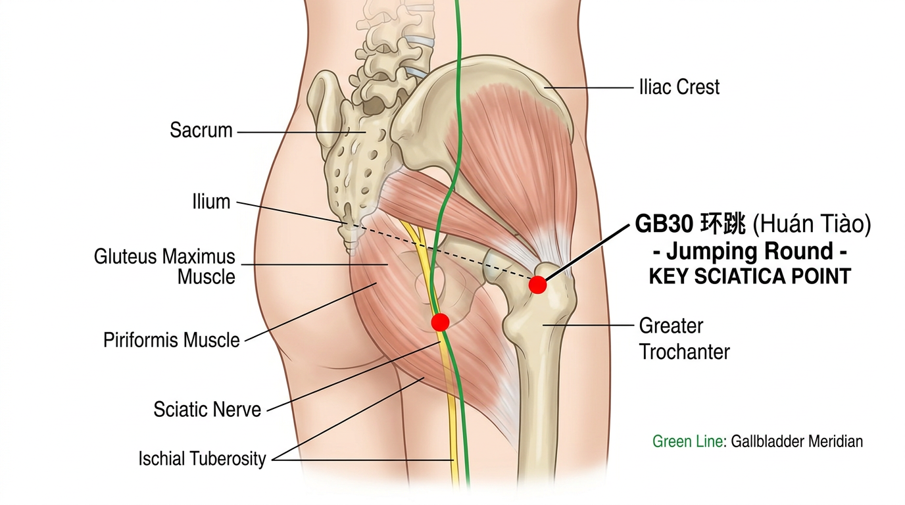

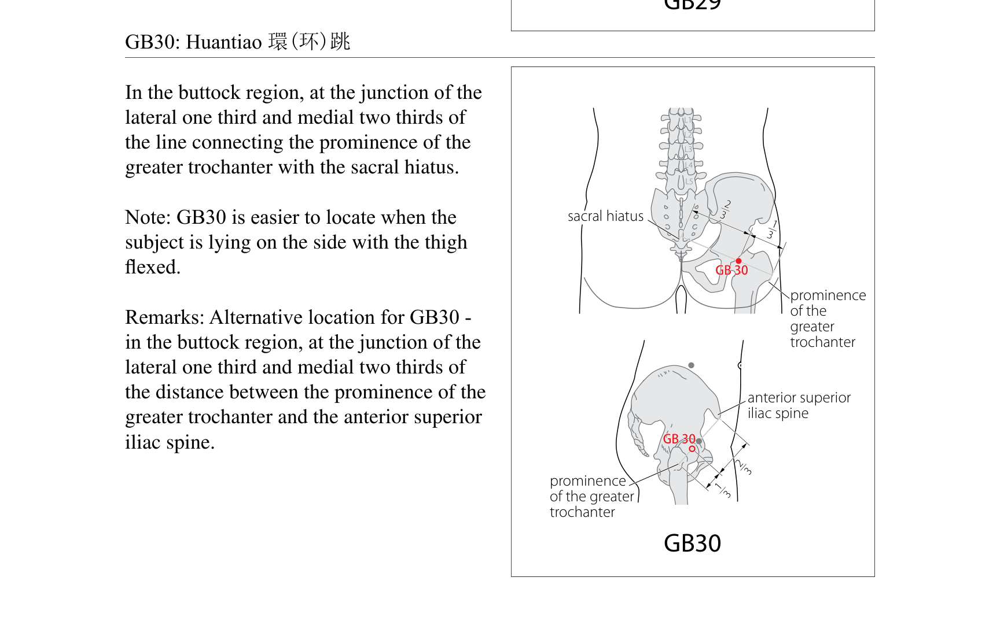

> **External References:** [AcuPoints](https://www.acupoints.org/gb30-acupuncture-point/)

**קטגוריה מיוחדת:** נקודת מפגש עם ערוץ שלפוחית השתן (BL)

**מיקום אנטומי:** בישבן, בשליש הלטרלי של הקו שבין קצה העצה (sacral hiatus) לנקודת השיא של הטרוכנטר הגדול. לחלופין: בצד הלטרלי של הישבן, בשליש הנקודה בין הטרוכנטר הגדול לבסיס העצה.

**איך למצוא את הנקודה:**

1. המטופל שוכב על הצד הבריא, עם הרגל העליונה מכופפת
2. מצאו את הטרוכנטר הגדול (הבליטה הלטרלית של הירך)
3. מצאו את ה-sacral hiatus (הפתח בבסיס העצה) או את קצה העצה
4. חלקו את הקו בין השניים לשלושה חלקים
5. הנקודה בשליש הלטרלי (הקרוב לטרוכנטר)
6. לחצו עמוק — הנקודה עמוקה וכואבת, לעיתים מקרינה לרגל

**עומק דקירה:** 2-3 צון (נקודה עמוקה!)

**זווית דקירה:** ניצבת (90°)

**תחושת דה-צ'י:** כאב עמוק, תחושת חשמל או נימול המקרינים לרגל (דמוי סיאטיקה)

**פעולות והתוויות:**

* **נקודה מרכזית לטיפול בסיאטיקה וכאב ירך**
* מפזרת רוח-לחות
* מפעילה את הערוץ ומשחררת כאב
* מחזקת את הגב התחתון ואת מפרק הירך
* התוויות: סיאטיקה, כאב במפרק הירך, כאב בגב תחתון, כאב ברגל, שיתוק ברגל, חולשת גפיים תחתונות, אורטיקריה (פריחה)

**שילובי נקודות נפוצים:**

* GB30 + BL40 + BL60 — לסיאטיקה לאורך ערוץ שלפוחית השתן
* GB30 + GB34 + GB39 — לסיאטיקה לאורך ערוץ כיס המרה
* GB30 + BL23 — לכאב גב תחתון עם סיאטיקה

***

#### GB31 — פנג שי (风市) — Fēng Shì — "שוק הרוח"

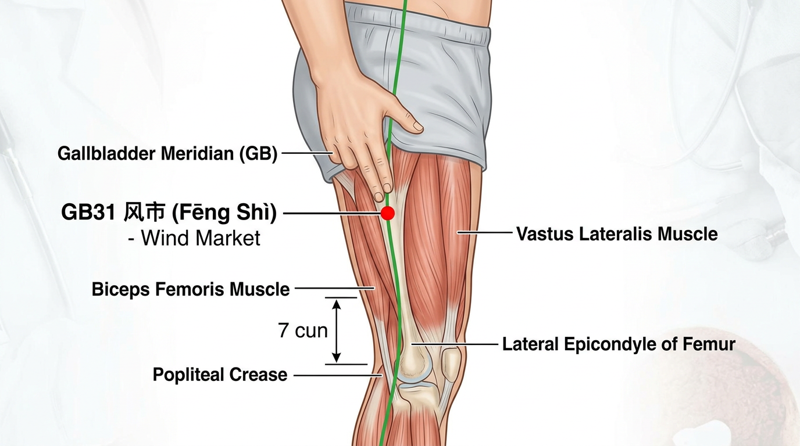

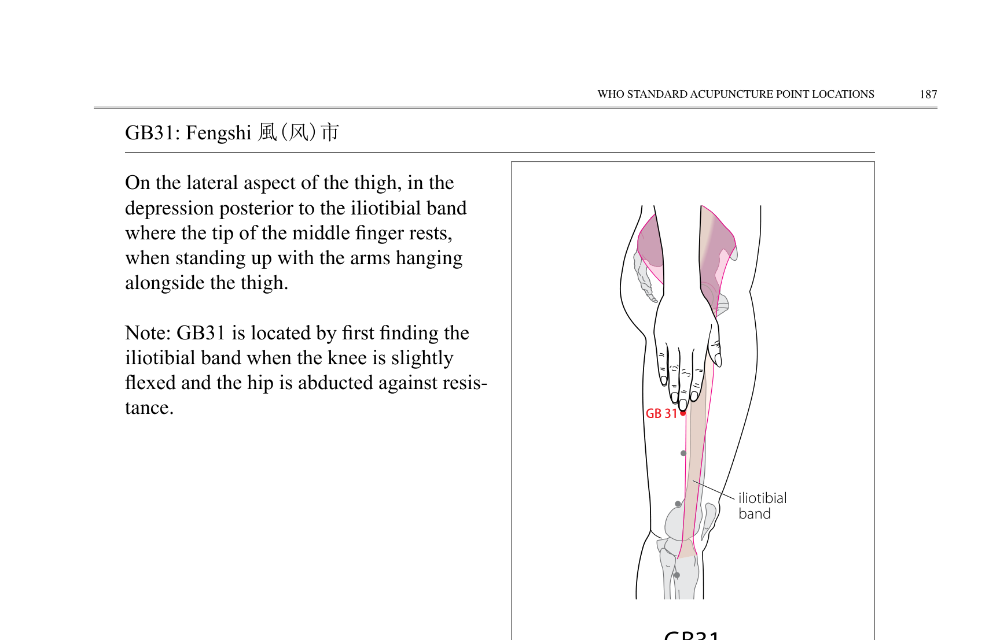

> **External References:** [AcuPoints](https://www.acupoints.org/gb31-acupuncture-point/)

**מיקום אנטומי:** על הצד הלטרלי של הירך, 7 צון מעל קפל הברך, בחריץ שבין שרירי הוסטוס לטרליס לביצפס פמוריס.

**איך למצוא את הנקודה:**

1. בקשו מהמטופל לעמוד זקוף עם הידיים לצדדים
2. הנקודה נמצאת במקום שבו קצה האצבע האמצעית נוגעת בירך
3. לחלופין: 7 צון מעל קפל הברך, על הצד הלטרלי של הירך
4. בחריץ שבין שתי קבוצות שרירי הירך הלטרליים

**עומק דקירה:** 1-1.5 צון

**זווית דקירה:** ניצבת (90°)

**תחושת דה-צ'י:** כאב מקומי, תחושת כבדות בירך

**פעולות והתוויות:**

* **נקודה מרכזית לפיזור רוח ולטיפול בגירוד**
* מפזרת רוח-לחות
* מפעילה את הערוץ ומשחררת כאב
* התוויות: כאב ברגל, סיאטיקה, שיתוק ברגל, גירוד כללי (אורטיקריה), חולשת גפיים תחתונות, נימול ברגליים

**שילובי נקודות נפוצים:**

* GB31 + SP10 + LI11 — לטיפול בגירוד ובעיות עור
* GB31 + GB30 + GB34 — לכאב ברגל הלטרלית

***

#### GB32 — ג'ונג דו (中渎) — Zhōng Dú — "תעלה מרכזית"

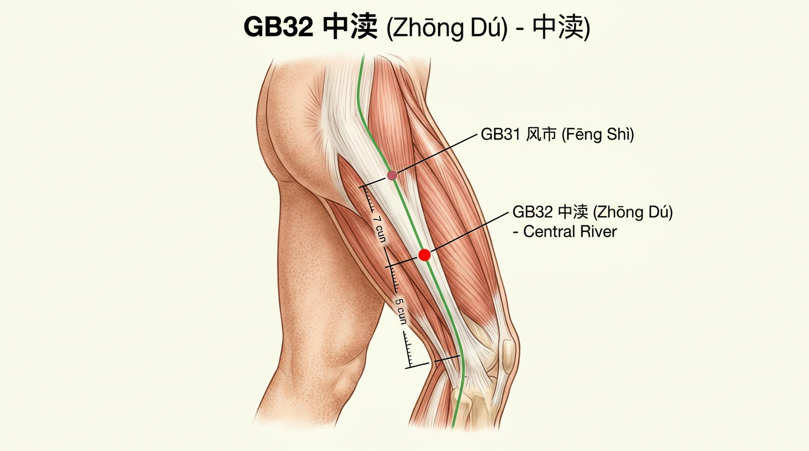

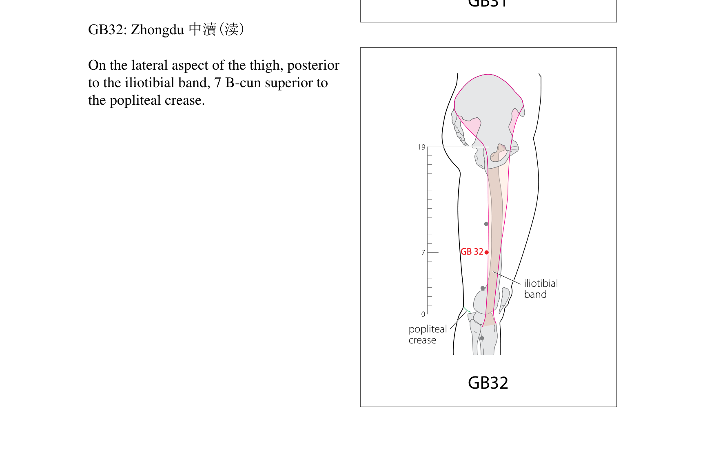

> **External References:** [AcuPoints](https://www.acupoints.org/gb32-acupuncture-point/)

**מיקום אנטומי:** 5 צון מעל קפל הברך, על הצד הלטרלי של הירך, בין שרירי הוסטוס לטרליס לביצפס פמוריס.

**איך למצוא את הנקודה:**

1. מצאו את GB31 (7 צון מעל קפל הברך)
2. מדדו 2 צון כלפי מטה
3. הנקודה על הצד הלטרלי של הירך

**עומק דקירה:** 1-1.5 צון

**זווית דקירה:** ניצבת (90°)

**תחושת דה-צ'י:** כאב מקומי, תחושת כבדות

**פעולות והתוויות:**

* מפזרת רוח-לחות, מפעילה את הערוץ
* התוויות: כאב ברגל, נימול ברגל, שיתוק, חולשת גפיים

**שילובי נקודות נפוצים:**

* GB32 + GB34 — לכאב בירך ובברך

***

#### GB33 — שי יאנג גואן (膝阳关) — Xī Yáng Guān — "מעבר יאנג של הברך"

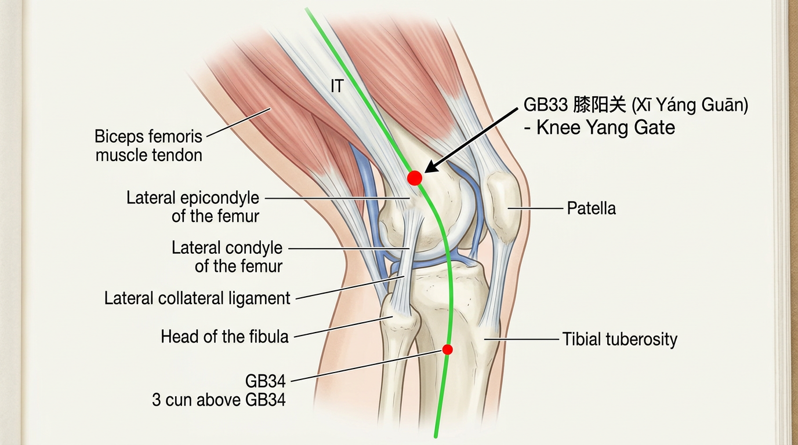

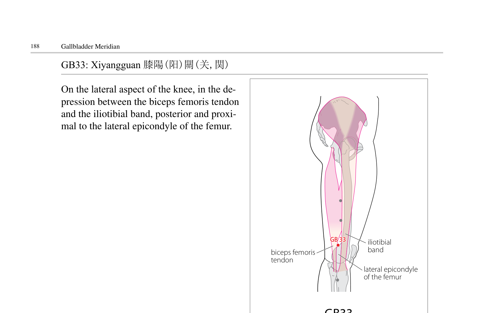

> **External References:** [AcuPoints](https://www.acupoints.org/gb33-acupuncture-point/)

**מיקום אנטומי:** 3 צון מעל GB34, בשקע שמעל לאפיקונדיל הלטרלי של הפמור (עצם הירך), כאשר הברך מכופפת.

**איך למצוא את הנקודה:**

1. כופפו את ברך המטופל
2. מצאו את האפיקונדיל הלטרלי של הפמור (הבליטה הצידית מעל הברך)
3. הנקודה בשקע שמעל לאפיקונדיל, בין גיד הביצפס פמוריס ל-iliotibial band
4. 3 צון מעל GB34

**עומק דקירה:** 0.8-1 צון

**זווית דקירה:** ניצבת (90°)

**תחושת דה-צ'י:** כאב מקומי, תחושת כבדות בברך

**פעולות והתוויות:**

* מפזרת רוח-לחות מהברך
* מפעילה את הערוץ ומשחררת כאב
* התוויות: כאב בברך, נפיחות בברך, קושי לכופף ולפשוט את הברך, נימול בשוק

**שילובי נקודות נפוצים:**

* GB33 + GB34 + ST35 — לכאב בברך
* GB33 + SP9 — לנפיחות בברך

***

#### GB34 — יאנג לינג צ'יואן (阳陵泉) — Yáng Líng Quán — "מעיין גבעת היאנג"

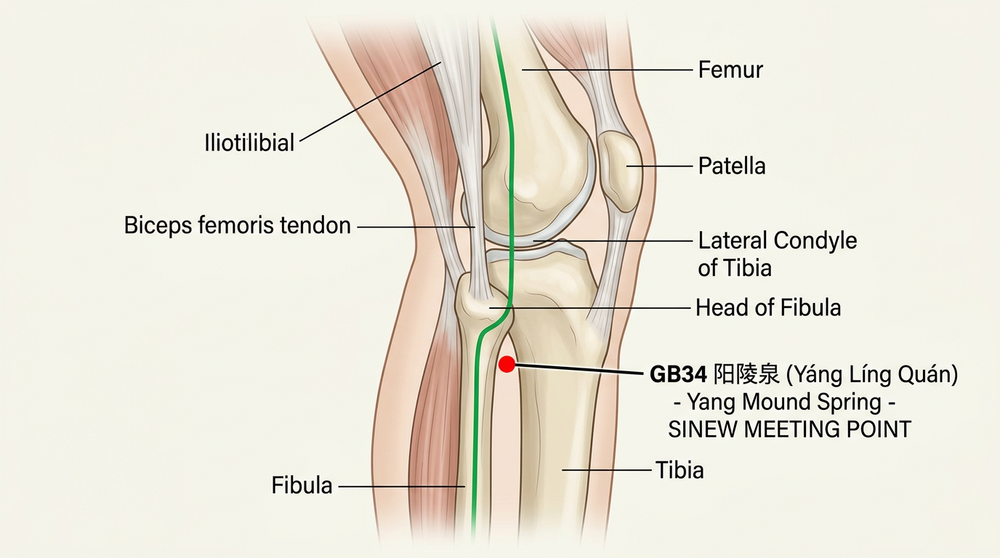

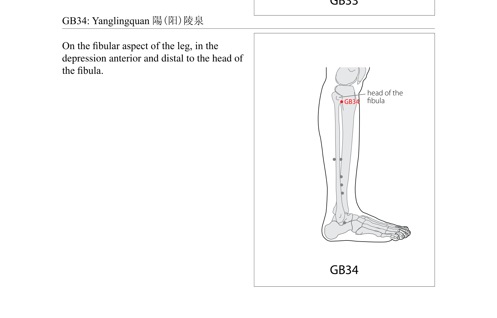

> **External References:** [AcuPoints](https://www.acupoints.org/gb34-acupuncture-point/)

**קטגוריה מיוחדת:** נקודת הא-ים (合穴), נקודת אדמה (土), נקודת מפגש (会穴) של הגידים (筋会), נקודת הכוכב השמימי התחתון של הא (下合穴) של כיס המרה

**מיקום אנטומי:** בשקע שקדמי ומתחת לראש הפיבולה (עצם השוק הצדדית).

**איך למצוא את הנקודה:**

1. מצאו את ראש הפיבולה — הבליטה העגולה בצד הלטרלי של הברך, מתחת ומאחור לברך
2. הנקודה בשקע שקדמי (אנטריורי) ותחתון (אינפריורי) לראש הפיבולה
3. לחצו — שקע ברור ורגיש

**עומק דקירה:** 1-1.5 צון

**זווית דקירה:** ניצבת (90°) או אובליקית מעט לכיוון מדיאלי

**תחושת דה-צ'י:** כאב מקומי, תחושת חשמל או נימול היורדים בשוק

**פעולות והתוויות:**

* **נקודת מפגש הגידים — נקודת מפתח לכל בעיית גיד, שריר ומפרק**
* מפזרת לחות-חום מכבד וכיס מרה
* מווסתת צ'י הכבד, מפזרת סטגנציה
* מרפה את הגידים והשרירים
* מועילה לצלעות
* התוויות: כאב בצלעות, מרירות בפה, צהבת, בחילות, הקאות, כאב בברך, כאב ברגל, שיתוק ברגל, סיאטיקה, כאב כתף, עוויתות שרירים, שבץ

**שילובי נקודות נפוצים:**

* GB34 + LR3 — לסטגנציית צ'י הכבד וכאב בצלעות
* GB34 + GB24 — לניקוי לחות-חום מכיס המרה
* GB34 + ST36 — לחיזוק הגפיים התחתונות
* GB34 + TE6 — לכאב בין-צלעי
* GB34 + GB30 — לסיאטיקה
* GB34 + LR13 — לכאב בצלעות (ברפואה הסינית: כבד-כיס מרה דיסהרמוניה)

***

#### GB35 — יאנג ג'יאו (阳交) — Yáng Jiāo — "הצטלבות היאנג"

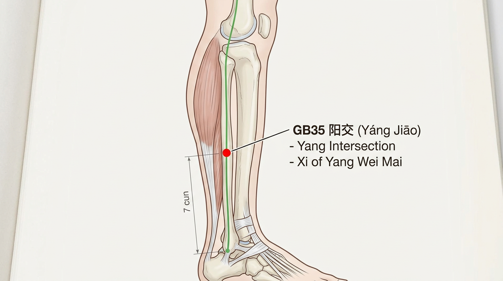

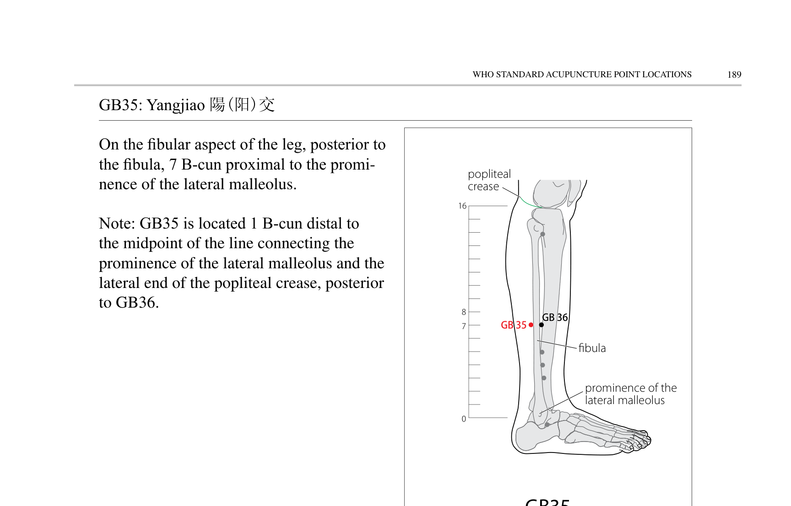

> **External References:** [AcuPoints](https://www.acupoints.org/gb35-acupuncture-point/)

**קטגוריה מיוחדת:** נקודת שי (郄穴) של יאנג ווי מאי (阳维脉)

**מיקום אנטומי:** 7 צון מעל קצה המלאולוס הלטרלי (הקרסול החיצוני), על השפה האחורית של הפיבולה.

**איך למצוא את הנקודה:**

1. מצאו את קצה הקרסול החיצוני
2. מדדו 7 צון ישירות כלפי מעלה
3. הנקודה על השפה האחורית של עצם הפיבולה

**עומק דקירה:** 0.5-1 צון

**זווית דקירה:** ניצבת (90°)

**תחושת דה-צ'י:** כאב מקומי

**פעולות והתוויות:**

* מפזרת רוח-לחות מהשוק
* מפעילה את יאנג ווי מאי
* מרגיעה את הרוח
* התוויות: כאב בשוק, כאב בברך, כאב בחזה, אסתמה, מאניה

**שילובי נקודות נפוצים:**

* GB35 + GB34 — לכאב בשוק הלטרלי

***

#### GB36 — וואי צ'יו (外丘) — Wài Qiū — "גבעה חיצונית"

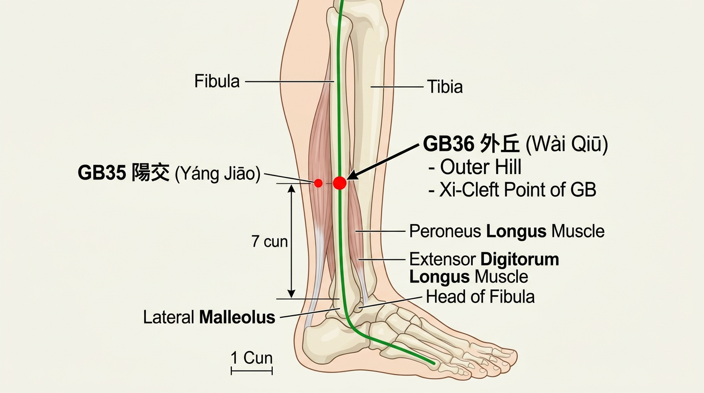

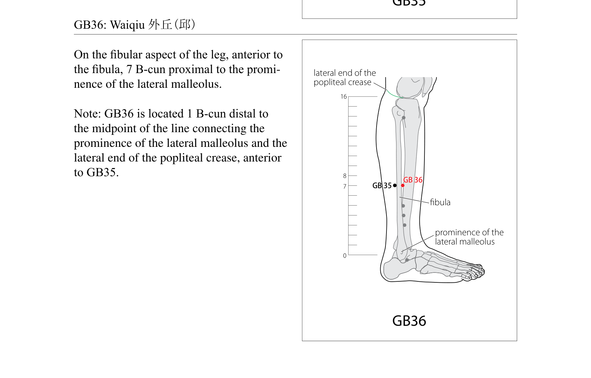

> **External References:** [AcuPoints](https://www.acupoints.org/gb36-acupuncture-point/)

**קטגוריה מיוחדת:** נקודת שי-צבירה (郄穴) של ערוץ כיס המרה

**מיקום אנטומי:** 7 צון מעל קצה המלאולוס הלטרלי, על השפה הקדמית (אנטריורית) של הפיבולה.

**איך למצוא את הנקודה:**

1. מצאו את קצה הקרסול החיצוני
2. מדדו 7 צון ישירות כלפי מעלה
3. הנקודה על השפה הקדמית של עצם הפיבולה (קדמית ל-GB35)

**עומק דקירה:** 0.5-1 צון

**זווית דקירה:** ניצבת (90°)

**תחושת דה-צ'י:** כאב מקומי חד

**פעולות והתוויות:**

* מנקה חום מכיס המרה (נקודת שי — למצבים חריפים)
* מפעילה את הערוץ ומשחררת כאב
* התוויות: כאב חריף בצלעות, כאב בצוואר, כאב בשוק, כאב בחזה

**שילובי נקודות נפוצים:**

* GB36 + GB34 — לכאב חריף בצלעות

***

#### GB37 — גואנג מינג (光明) — Guāng Míng — "אור בהיר"

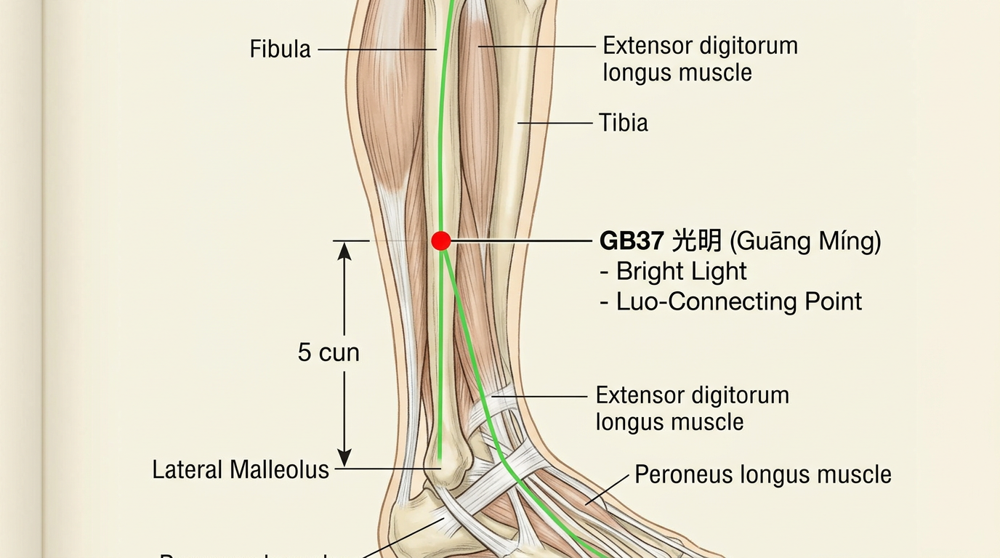

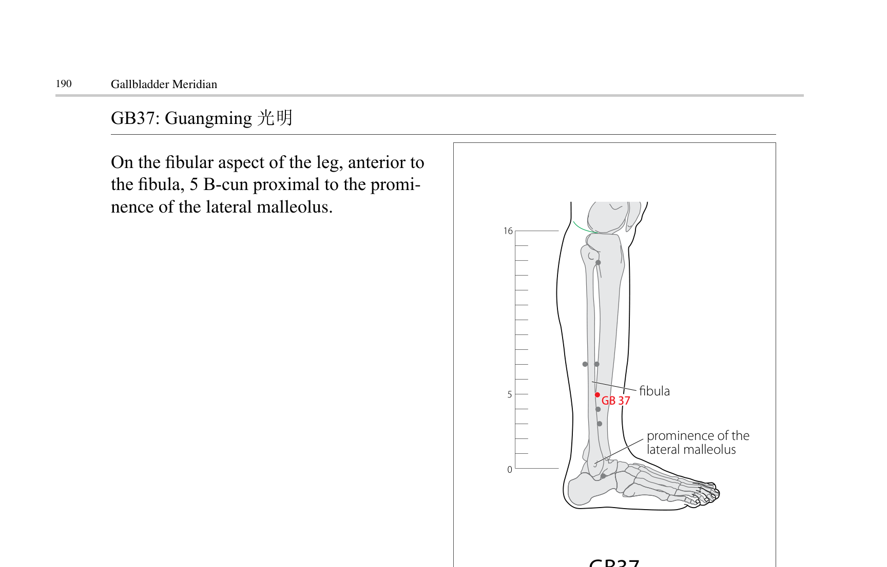

> **External References:** [AcuPoints](https://www.acupoints.org/gb37-acupuncture-point/)

**קטגוריה מיוחדת:** נקודת לואו-מחברת (络穴)

**מיקום אנטומי:** 5 צון מעל קצה המלאולוס הלטרלי, על השפה הקדמית של הפיבולה.

**איך למצוא את הנקודה:**

1. מצאו את קצה הקרסול החיצוני
2. מדדו 5 צון ישירות כלפי מעלה
3. הנקודה על השפה הקדמית של עצם הפיבולה

**עומק דקירה:** 0.5-1 צון

**זווית דקירה:** ניצבת (90°)

**תחושת דה-צ'י:** כאב מקומי, תחושת נימול

**פעולות והתוויות:**

* **מועילה לעיניים** (שם הנקודה "אור בהיר")
* מפזרת רוח-לחות
* מפעילה את הערוץ, מחברת לערוץ הכבד (דרך לואו)
* התוויות: בעיות עיניים (טשטוש ראיה, כאב, עיוור לילה), כאב בשוק, כאב בברך, מיגרנה, כאב בשד

**שילובי נקודות נפוצים:**

* GB37 + LR3 — חיבור לואו-יואן; לטיפול בבעיות עיניים
* GB37 + BL18 — לטיפול בעיניים דרך חיזוק הכבד

***

#### GB38 — יאנג פו (阳辅) — Yáng Fǔ — "עזר היאנג"

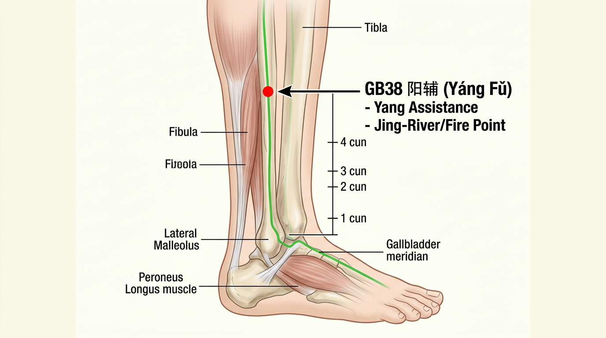

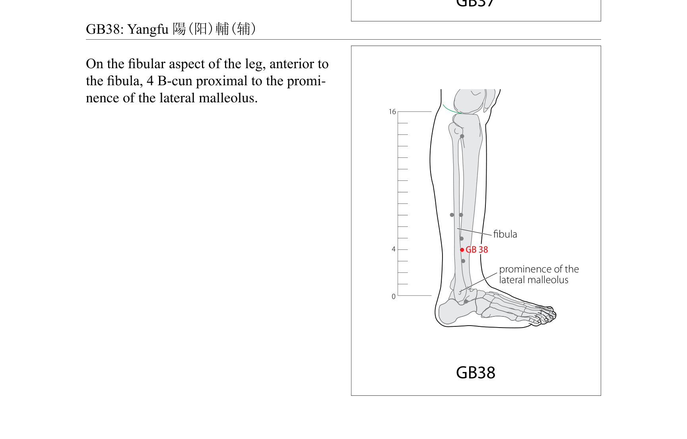

> **External References:** [AcuPoints](https://www.acupoints.org/gb38-acupuncture-point/)

**קטגוריה מיוחדת:** נקודת ג'ינג-נהר (经穴), נקודת אש (火), נקודת הרגעה/ניקוז (泻穴 - נקודת הבן)

**מיקום אנטומי:** 4 צון מעל קצה המלאולוס הלטרלי, על השפה הקדמית של הפיבולה.

**איך למצוא את הנקודה:**

1. מצאו את קצה הקרסול החיצוני
2. מדדו 4 צון ישירות כלפי מעלה
3. הנקודה על השפה הקדמית של עצם הפיבולה
4. 1 צון מתחת ל-GB37

**עומק דקירה:** 0.5-1 צון

**זווית דקירה:** ניצבת (90°)

**תחושת דה-צ'י:** כאב מקומי

**פעולות והתוויות:**

* מנקה חום מכיס המרה
* מפזרת רוח-חום
* מפעילה את הערוץ ומשחררת כאב
* התוויות: מיגרנה, כאב בעיניים, כאב בצלעות, כאב בשוק ובקרסול, מרירות בפה, כאב בית השחי

**שילובי נקודות נפוצים:**

* GB38 + GB20 — למיגרנה עם חום
* GB38 + GB34 — לכאב בשוק הלטרלי

***

#### GB39 — שיואן ג'ונג (悬钟) — Xuán Zhōng — "פעמון תלוי" (גם: 绝骨 Jué Gǔ — "עצם נפרדת")

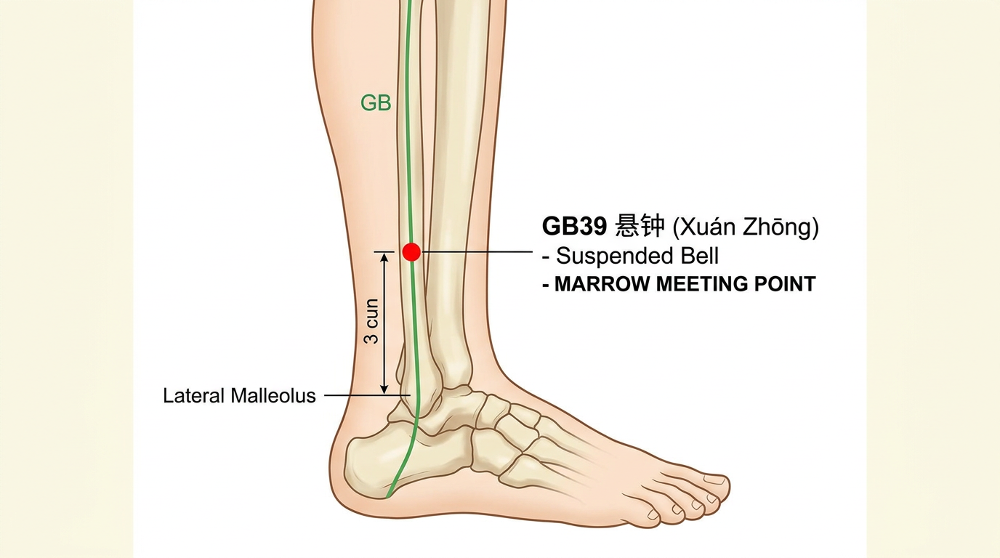

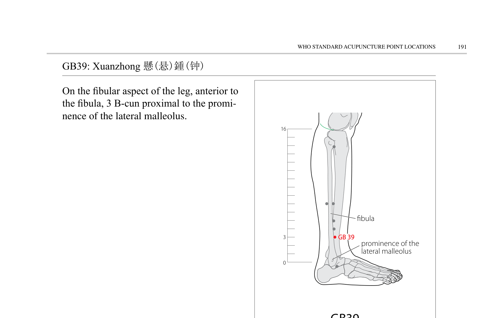

> **External References:** [AcuPoints](https://www.acupoints.org/gb39-acupuncture-point/)

**קטגוריה מיוחדת:** נקודת מפגש (会穴) של המח (髓会), נקודת מפגש של שלושת ערוצי היאנג של הרגל

**מיקום אנטומי:** 3 צון מעל קצה המלאולוס הלטרלי, על השפה הקדמית של הפיבולה.

**איך למצוא את הנקודה:**

1. מצאו את קצה הקרסול החיצוני (מלאולוס לטרלי)
2. מדדו 3 צון ישירות כלפי מעלה
3. הנקודה על השפה הקדמית של עצם הפיבולה

**עומק דקירה:** 0.5-1 צון

**זווית דקירה:** ניצבת (90°)

**תחושת דה-צ'י:** כאב מקומי, תחושת נימול או כבדות בשוק

**פעולות והתוויות:**

* **נקודת מפגש המח — מועילה לעצמות, מח ומוח**
* מפזרת רוח-לחות
* מחזקת את העצמות והגידים
* מועילה לצוואר
* התוויות: סיאטיקה, כאב ברגל, שיתוק, נוקשות צוואר, כאב ראש, סחרחורת, שבץ (נקודת חירום), כאב בקרסול, חולשת עצמות

**שילובי נקודות נפוצים:**

* GB39 + GB20 — לכאב ראש וסחרחורת, נוקשות צוואר
* GB39 + GB34 + GB30 — לסיאטיקה
* GB39 + BL11 — לחיזוק עצמות (מפגש מח + מפגש עצמות)
* GB39 + KI3 — להזנת מח העצמות

***

#### GB40 — צ'יו שו (丘墟) — Qiū Xū — "גבעות וחורבות"

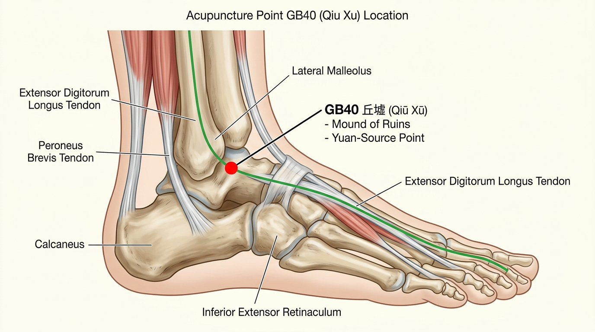

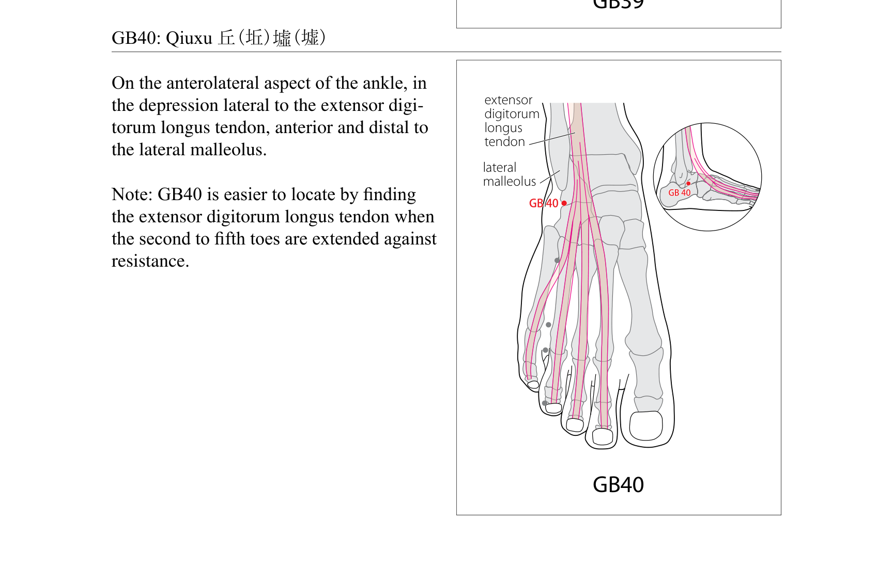

> **External References:** [AcuPoints](https://www.acupoints.org/gb40-acupuncture-point/)

**קטגוריה מיוחדת:** נקודת יואן-מקור (原穴)

**מיקום אנטומי:** קדמי ומתחת למלאולוס הלטרלי (הקרסול החיצוני), בשקע שעל הצד הלטרלי של גיד שריר האקסטנסור דיגיטורום לונגוס.

**איך למצוא את הנקודה:**

1. מצאו את קצה הקרסול החיצוני
2. החליקו קדימה ומטה
3. הנקודה בשקע שנמצא קדמי-תחתון לקרסול החיצוני
4. על הצד הלטרלי של הגידים המיישרים את האצבעות

**עומק דקירה:** 0.5-0.8 צון

**זווית דקירה:** ניצבת (90°)

**תחושת דה-צ'י:** כאב מקומי, תחושת כבדות בקרסול

**פעולות והתוויות:**

* מווסתת צ'י כיס המרה, מנקה לחות-חום
* מפעילה את הערוץ ומשחררת כאב בקרסול
* מחזקת את ההחלטיות
* התוויות: כאב בצלעות, מרירות בפה, נפיחות בבית השחי, כאב וניפוח בקרסול, כאב ברגל, היסוס, חוסר אומץ

**שילובי נקודות נפוצים:**

* GB40 + LR5 — חיבור יואן-לואו בין כיס מרה לכבד
* GB40 + GB34 — לבעיות כיס המרה

***

#### GB41 — צו לין צ'י (足临泣) — Zú Lín Qì — "דמעה יורדת של הרגל"

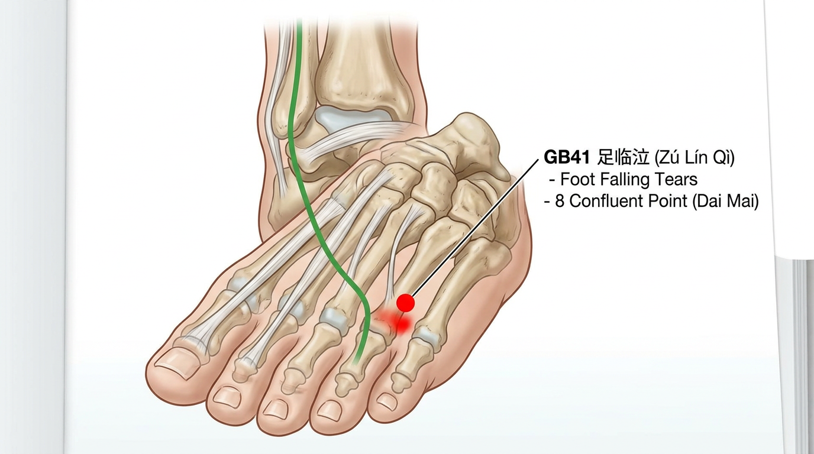

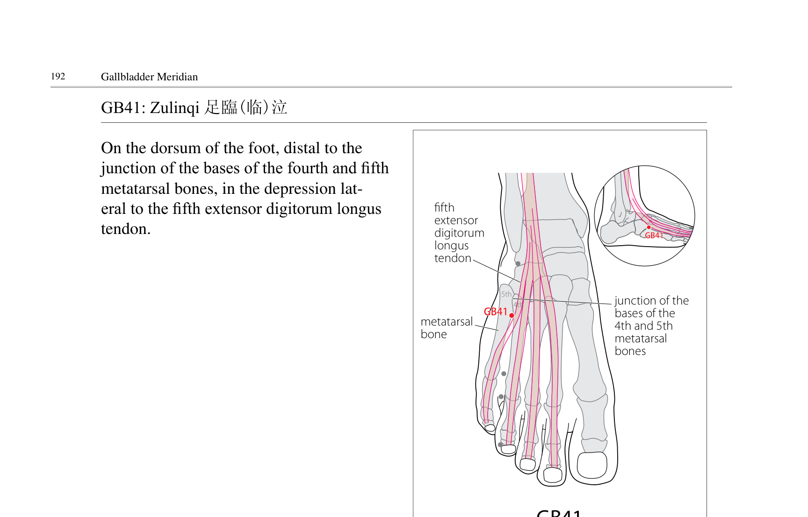

> **External References:** [AcuPoints](https://www.acupoints.org/gb41-acupuncture-point/)

**קטגוריה מיוחדת:** נקודת שו-זרם (输穴), נקודת עץ (木), אחת מ-8 נקודות המפגש (八脉交会穴) — מחוברת לדאי מאי (带脉)

**מיקום אנטומי:** בגב הרגל, בשקע הדיסטלי למפגש של עצמות המטטרסל ה-4 וה-5.

**איך למצוא את הנקודה:**

1. מצאו את הרווח בין אצבעות הרגל ה-4 וה-5
2. החליקו פרוקסימלית (כלפי הקרסול) לאורך גב הרגל
3. הנקודה בשקע שלפני מפגש עצמות המטטרסל ה-4 וה-5
4. דומה למיקום LR3 אך באצבעות 4-5 במקום 1-2

**עומק דקירה:** 0.3-0.5 צון

**זווית דקירה:** ניצבת (90°) או אובליקית כלפי מעלה

**תחושת דה-צ'י:** כאב מקומי, תחושת נפיחות

**פעולות והתוויות:**

* מווסתת צ'י הכבד וכיס המרה
* מפעילה את דאי מאי
* מועילה לעיניים ולצד הראש
* מפזרת לחות-חום
* התוויות: כאב ראש צידי (מיגרנה), כאב בעיניים, סחרחורת, כאב בצלעות, כאב בשד (לפני מחזור), אי-סדירות במחזור, כאב ברגל

**שילובי נקודות נפוצים:**

* GB41 + TE5 — פתיחת דאי מאי (带脉) + יאנג ווי מאי — למיגרנה, כאב אוזניים, כאב צלעות, בעיות גינקולוגיות
* GB41 + LR3 — לסטגנציית צ'י כבד-כיס מרה עם מיגרנה
* GB41 + GB20 — לכאב ראש צידי

***

#### GB42 — די וו הוי (地五会) — Dì Wǔ Huì — "מפגש חמש הארצות"

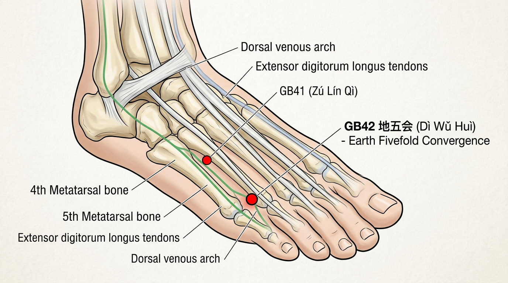

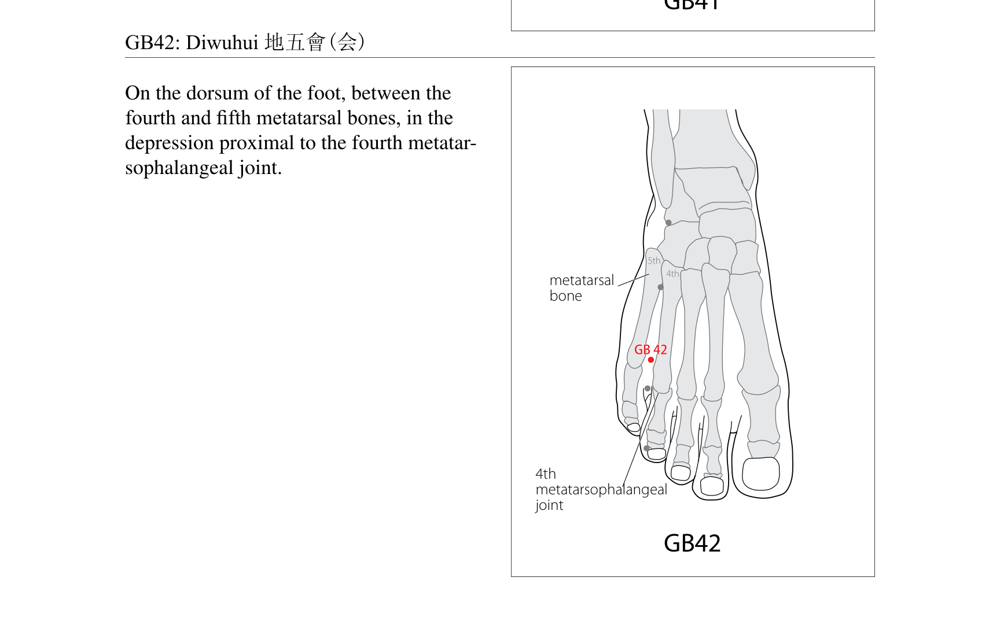

> **External References:** [AcuPoints](https://www.acupoints.org/gb42-acupuncture-point/)

**מיקום אנטומי:** בגב הרגל, בין עצמות המטטרסל ה-4 וה-5, ליד המפרק המטטרסו-פלנגאלי, פרוקסימלית לקרום בין האצבעות.

**איך למצוא את הנקודה:**

1. מצאו את הרווח בין אצבעות 4 ו-5
2. מ-GB41, החליקו דיסטלית (קדימה) כ-0.5-1 צון
3. הנקודה בין עצמות המטטרסל, דיסטלית ל-GB41

**עומק דקירה:** 0.3-0.5 צון

**זווית דקירה:** ניצבת (90°)

**תחושת דה-צ'י:** כאב מקומי

**פעולות והתוויות:**

* מפזרת סטגנציית צ'י הכבד
* מועילה לעיניים ולאוזניים
* התוויות: כאב בעיניים, טינטון, כאב בשד, כאב ברגל, נפיחות בבית השחי

**שילובי נקודות נפוצים:**

* GB42 + GB41 — לכאב בגב הרגל

***

#### GB43 — שיא שי (侠溪) — Xiá Xī — "נחל צר"

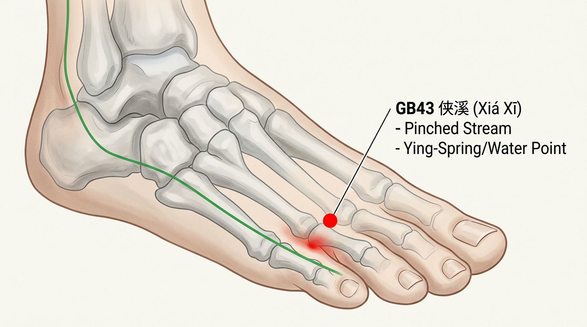

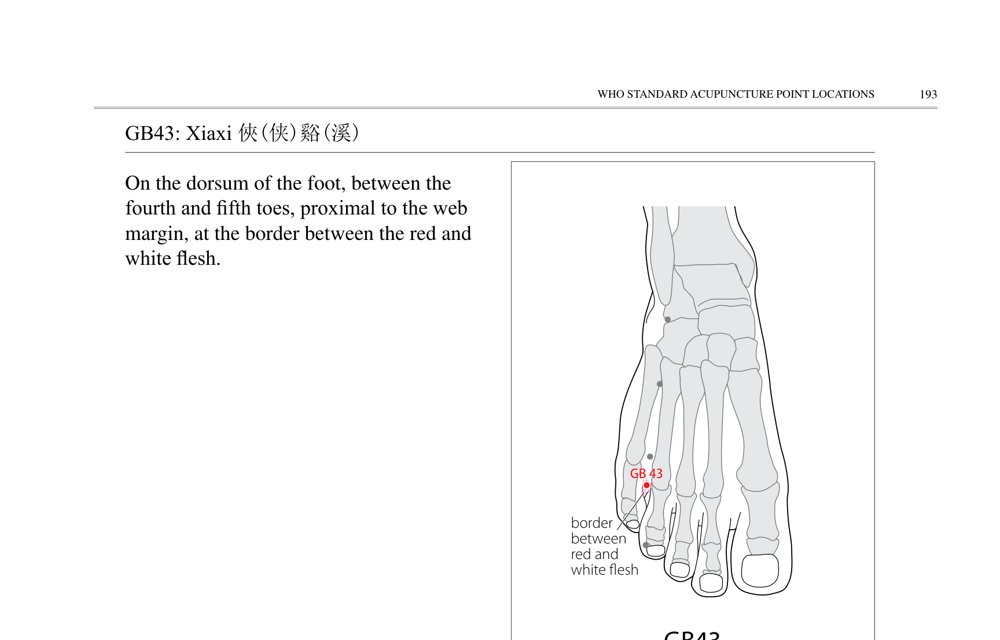

> **External References:** [AcuPoints](https://www.acupoints.org/gb43-acupuncture-point/)

**קטגוריה מיוחדת:** נקודת יינג-מעיין (荥穴), נקודת מים (水)

**מיקום אנטומי:** בגב הרגל, בשקע הפרוקסימלי לקצה הקרום שבין אצבעות הרגל ה-4 וה-5.

**איך למצוא את הנקודה:**

1. מצאו את הקרום (רשת) שבין אצבעות 4 ו-5
2. החליקו פרוקסימלית מקצה הקרום
3. הנקודה בשקע שמיד מאחורי קצה הקרום

**עומק דקירה:** 0.3-0.5 צון

**זווית דקירה:** אובליקית כלפי מעלה

**תחושת דה-צ'י:** כאב מקומי

**פעולות והתוויות:**

* מנקה חום מכיס המרה
* מועילה לאוזניים ולעיניים
* מפזרת רוח-חום מהראש
* התוויות: כאב ראש, סחרחורת, כאב בעיניים, טינטון, חירשות, כאב בצלעות, מרירות בפה, חום

**שילובי נקודות נפוצים:**

* GB43 + TE3 — לטינטון וכאב אוזניים
* GB43 + GB20 — לכאב ראש צידי עם חום

***

#### GB44 — צו צ'יאו ין (足窍阴) — Zú Qiào Yīn — "חלל ין של הרגל"

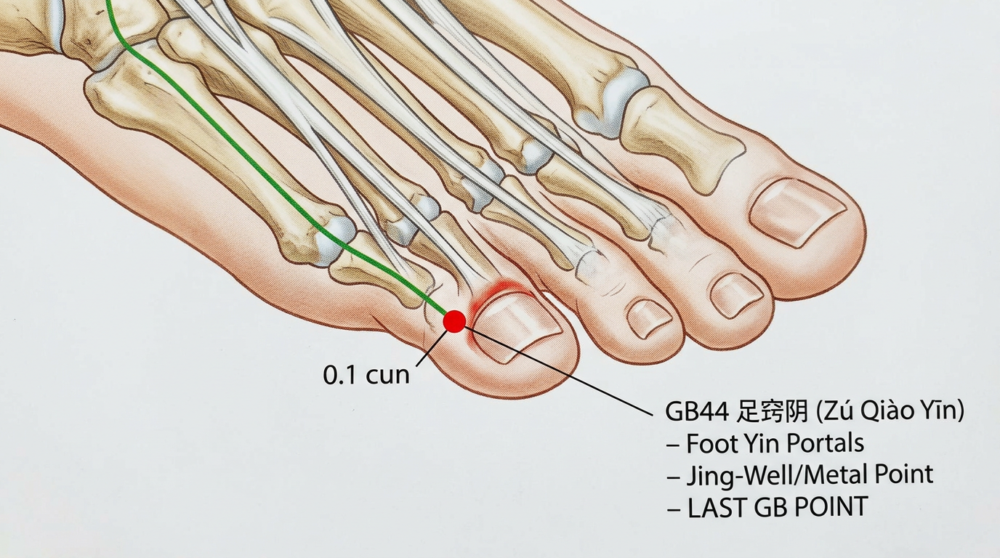

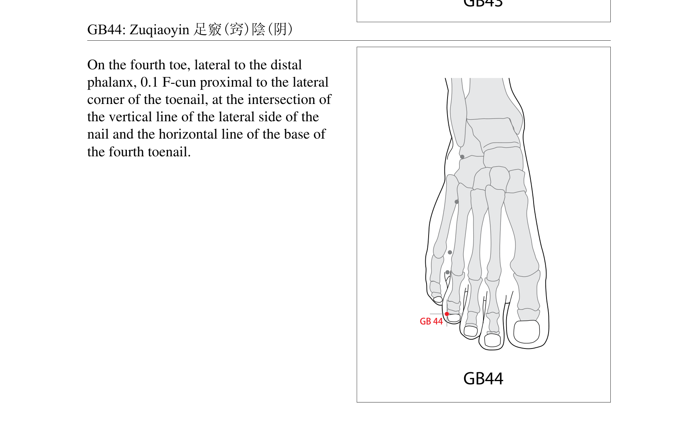

> **External References:** [AcuPoints](https://www.acupoints.org/gb44-acupuncture-point/)

**קטגוריה מיוחדת:** נקודת ג'ינג-באר (井穴), נקודת מתכת (金)

**מיקום אנטומי:** בצד הלטרלי של אצבע הרגל הרביעית, 0.1 צון פרוקסימלית לזווית הציפורן.

**איך למצוא את הנקודה:**

1. מצאו את אצבע הרגל הרביעית
2. הנקודה בצד הלטרלי (הצד שפונה לאצבע הקטנה)
3. 0.1 צון (כ-1 מ"מ) מאחורי זווית בסיס הציפורן

**עומק דקירה:** 0.1-0.2 צון (או דקירת הקזה)

**זווית דקירה:** ניצבת (90°)

**תחושת דה-צ'י:** כאב חד מקומי

**פעולות והתוויות:**

* מנקה חום מכיס המרה
* מועילה לאוזניים ולעיניים
* מחייה את ההכרה
* התוויות: כאב ראש צידי, כאב בעיניים, טינטון, חירשות, כאב בצלעות, חום, נדודי שינה, חלומות מרובים

**שילובי נקודות נפוצים:**

* GB44 + TE1 — לניקוי חום מכיס המרה ושלוש המבערות
* GB44 + LR1 — לכאב ראש ובעיות עיניים (חיבור בין ערוצים מזווגים)

***

### 4. סיכום נקודות מפתח של ערוץ כיס המרה

#### 4.1 נקודות חשובות ביותר

| נקודה    | שם               | חשיבות                                      |
| -------- | ---------------- | ------------------------------------------- |
| **GB8**  | שואי גו          | מיגרנה, כאב ראש צידי                        |
| **GB14** | יאנג באי         | עיניים, שיתוק פנים                          |
| **GB20** | פנג צ'י          | אחת הנקודות החשובות ביותר — רוח, ראש, צוואר |
| **GB21** | ג'יאן ג'ינג      | כתף, צוואר, לידה                            |
| **GB24** | רי יואה          | מו של כיס המרה                              |
| **GB25** | ג'ינג מן         | מו של הכליות                                |
| **GB30** | הואן טיאו        | סיאטיקה, כאב ירך                            |
| **GB31** | פנג שי           | רוח, גירוד, כאב רגל                         |
| **GB34** | יאנג לינג צ'יואן | מפגש הגידים — כל בעיות שרירים ומפרקים       |
| **GB39** | שיואן ג'ונג      | מפגש המח — עצמות, שבץ                       |
| **GB40** | צ'יו שו          | יואן — כיס המרה                             |
| **GB41** | צו לין צ'י       | 8 מפגש (דאי מאי), מיגרנה                    |

#### 4.2 נקודות חמשת האלמנטים

| אלמנט    | נקודה | סוג            |
| -------- | ----- | -------------- |
| מתכת (金) | GB44  | ג'ינג-באר (井)  |
| מים (水)  | GB43  | יינג-מעיין (荥) |
| עץ (木)   | GB41  | שו-זרם (输)     |
| אש (火)   | GB38  | ג'ינג-נהר (经)  |
| אדמה (土) | GB34  | הא-ים (合)      |

#### 4.3 נקודות מיוחדות

| קטגוריה                    | נקודה          |
| -------------------------- | -------------- |
| נקודת יואן (原穴)            | GB40           |
| נקודת לואו (络穴)            | GB37           |
| נקודת שי (郄穴)              | GB36           |
| 8 נקודות מפגש (八脉交会穴)      | GB41 (דאי מאי) |
| נקודת מו של כיס המרה (胆募穴) | GB24           |
| נקודת מו של הכליות (肾募穴)   | GB25           |
| מפגש הגידים (筋会)           | GB34           |
| מפגש המח (髓会)              | GB39           |
| שי של יאנג ווי מאי         | GB35           |

***

### 5. תרגילים

1. שרטטו את מסלול ערוץ כיס המרה על גוף שותף — שימו לב למסלול הזיגזג המורכב בראש.
2. תרגלו איתור GB20, GB21, GB30, GB34, GB39, GB40, GB41 בעיניים עצומות.
3. הסבירו מדוע GB34 היא "נקודת מפגש הגידים" ואילו מצבים תטפלו איתה.
4. כתבו מרשם נקודות לטיפול ב: (א) מיגרנה צידית, (ב) סיאטיקה צידית, (ג) לחות-חום בכיס המרה.
5. תרגלו את שילוב GB41 + TE5 והסבירו מדוע הוא משמש לפתיחת דאי מאי.

***

### ניווט

* **הקודם**: [ערוץ שלוש המבערות (TE)](11-triple-energizer.md) | **הבא**: [ערוץ הכבד (LR)](13-liver-channel.md)
* **זוג פנים-חוץ**: [ערוץ הכבד (LR)](13-liver-channel.md) — ערוץ הין הזוגי (אלמנט עץ)
* **חזרה למודול**: [מודול 2 — מרידיאנים](./)
* **ראה גם**: [לחות-חום כבד-מרה](../../year-2-intermediate/module-06b-syndromes/liver-syndromes/08-liver-gallbladder-damp-heat.md)
