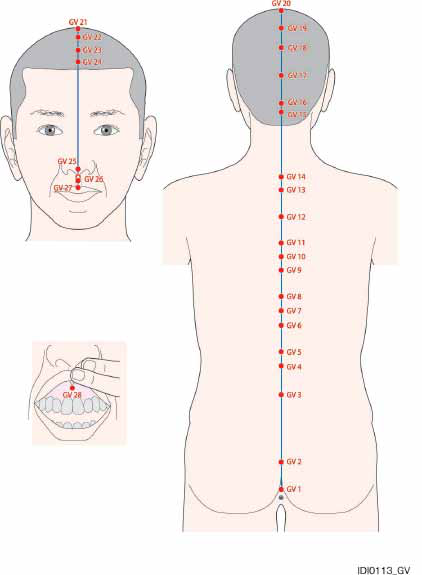
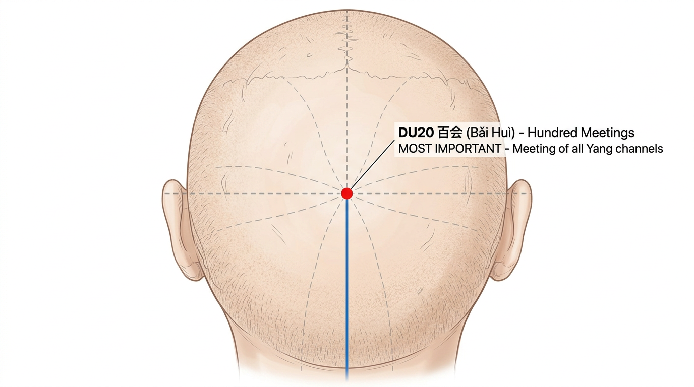
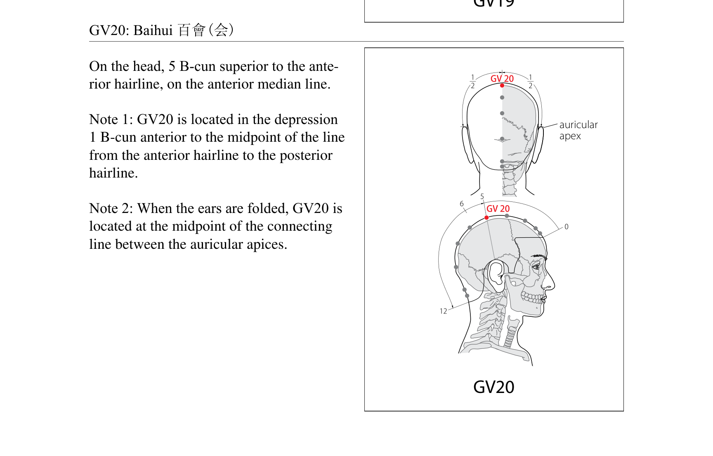
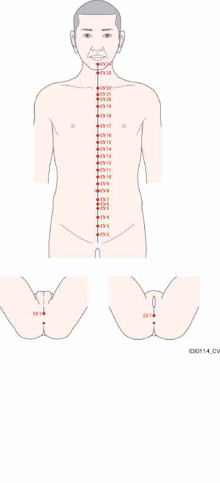

# 14-extraordinary-vessels

## שמונת הכלים יוצאי הדופן (奇经八脉)

### Eight Extraordinary Vessels - Qí Jīng Bā Mài

***

### מטרות למידה

בסיום שיעור זה, הסטודנט יוכל:

1. לתאר את שמונת הכלים יוצאי הדופן ואת תפקודיהם
2. לאתר את 28 הנקודות של דו מאי (DU1-DU28) ו-24 הנקודות של רן מאי (REN1-REN24)
3. להסביר את ההבדל בין 12 הערוצים הראשיים לכלים יוצאי הדופן
4. לזהות את נקודות המפתח (八脉交会穴) ולהשתמש בהן בשילובים קלאסיים
5. לתאר את המסלול, התפקוד והשימוש הקליני של כל אחד מ-8 הכלים

***

### 1. מבוא — מה הם הכלים יוצאי הדופן?

#### 1.1 הגדרה

הכלים יוצאי הדופן (奇经八脉 Qí Jīng Bā Mài) הם שמונה כלים מיוחדים שנבדלים מ-12 הערוצים הראשיים (正经 Zhèng Jīng) במספר מאפיינים חשובים:

| מאפיין             | 12 ערוצים ראשיים         | 8 כלים יוצאי דופן                                                     |
| ------------------ | ------------------------ | --------------------------------------------------------------------- |
| **חיבור לאיברים**  | כל ערוץ מחובר לאיבר      | אינם מחוברים ישירות לאיברים                                           |
| **זוגות פנים-חוץ** | 6 זוגות ין-יאנג          | אינם יוצרים זוגות פנים-חוץ קלאסיים                                    |
| **נקודות עצמאיות** | לכל ערוץ נקודות ייחודיות | רק לדו מאי ורן מאי נקודות עצמאיות; השאר "שואלים" נקודות מערוצים אחרים |
| **תפקיד**          | הובלת צ'י ודם שוטפת      | אגירה ווויסות — "אגמים ונחלים"                                        |

#### 1.2 מטאפורה

אם 12 הערוצים הראשיים הם כמו נהרות הזורמים בכיוון קבוע, הכלים יוצאי הדופן הם כמו **אגמים ומאגרי מים** — הם אוגרים עודפי צ'י ודם ומשחררים אותם כאשר יש חוסר.

#### 1.3 שמונת הכלים

| כלי                | שם סיני | פיניין        | תפקיד עיקרי                         |
| ------------------ | ------- | ------------- | ----------------------------------- |
| **דו מאי**         | 督脉      | Dū Mài        | "ים היאנג" — שולט על כל ערוצי היאנג |
| **רן מאי**         | 任脉      | Rèn Mài       | "ים הין" — שולט על כל ערוצי הין     |
| **חונג מאי**       | 冲脉      | Chōng Mài     | "ים הדם" — ים של 12 הערוצים         |
| **דאי מאי**        | 带脉      | Dài Mài       | "כלי החגורה" — חוגר ומחבר           |
| **יאנג צ'יאו מאי** | 阳跷脉     | Yáng Qiāo Mài | יאנג של הצד — תנועה ושינה           |
| **ין צ'יאו מאי**   | 阴跷脉     | Yīn Qiāo Mài  | ין של הצד — תנועה ושינה             |
| **יאנג ווי מאי**   | 阳维脉     | Yáng Wéi Mài  | מחבר את כל ערוצי היאנג              |
| **ין ווי מאי**     | 阴维脉     | Yīn Wéi Mài   | מחבר את כל ערוצי הין                |

#### 1.4 שמונה נקודות המפגש (八脉交会穴 Bā Mài Jiāo Huì Xué)

כל כלי יוצא דופן מחובר לנקודה ספציפית על הגפיים:

| כלי                  | נקודת מפגש            | מיקום          | זוג    |
| -------------------- | --------------------- | -------------- | ------ |
| דו מאי (督脉)          | **SI3** (הוא שי)      | יד אולנרית     | + BL62 |
| יאנג צ'יאו מאי (阳跷脉) | **BL62** (שן מאי)     | קרסול חיצוני   | + SI3  |
| רן מאי (任脉)          | **LU7** (ליה צ'יואה)  | אמה רדיאלית    | + KI6  |
| ין צ'יאו מאי (阴跷脉)   | **KI6** (ג'או האי)    | קרסול פנימי    | + LU7  |
| חונג מאי (冲脉)        | **SP4** (גונג סון)    | כף רגל מדיאלית | + PC6  |
| ין ווי מאי (阴维脉)     | **PC6** (ניי גואן)    | אמה פנימית     | + SP4  |
| דאי מאי (带脉)         | **GB41** (צו לין צ'י) | גב הרגל        | + TE5  |
| יאנג ווי מאי (阳维脉)   | **TE5** (וואי גואן)   | אמה חיצונית    | + GB41 |

**שימוש קליני:** בדרך כלל משתמשים בזוגות — דוקרים תחילה את הנקודה הראשונה בצד החולה, ואז את הנקודה המזווגת בצד הנגדי.

***

### 2. דו מאי — כלי המושל (督脉 Dū Mài)

#### 2.1 סקירה כללית

| פרט              | תיאור                                                        |
| ---------------- | ------------------------------------------------------------ |
| **שם**           | 督脉 (Dū Mài) — "כלי המושל/המפקח"                              |
| **מספר נקודות**  | 28 (DU1-DU28)                                                |
| **מסלול**        | מהפרינאום, לאורך עמוד השדרה, מעל הראש, ועד לחניכיים העליונות |
| **תפקיד**        | "ים היאנג" — שולט ומווסת את כל ערוצי היאנג                   |
| **נקודת מפגש**   | SI3 (הוא שי)                                                 |
| **נקודה מזווגת** | BL62 (שן מאי)                                                |

#### 2.2 מסלול

דו מאי מתחיל בפרינאום (בין פי הטבעת לאיברי המין), עולה לאורך עמוד השדרה — עובר דרך העצה, אזור המותני, הגבי, הצווארי — ממשיך מעל הראש דרך האוקסיפוט, הקודקוד, המצח, ומסתיים בחניכיים העליונות (מאחורי השיניים הקדמיות). ענף פנימי נכנס למוח.

#### 2.3 תפקודים

1. **שליטה על כל ערוצי היאנג** — נקרא "ים היאנג" כי כל ערוצי היאנג נפגשים בו ב-DU14
2. **הזנת המוח ומח השדרה** — עמוד השדרה והמוח קשורים ישירות לדו מאי
3. **חיזוק יאנג הגוף** — מוקסה על נקודות דו מאי מחממת ומחזקת את יאנג הגוף
4. **הגנה מפתוגנים חיצוניים** — דו מאי עובר באזור הגב שהוא "שער הכניסה" של רוח חיצונית

#### 2.4 פתולוגיות

* כאבי גב ועמוד שדרה, נוקשות גב
* כאב ראש אוקסיפיטלי, כאב ראש בקודקוד
* חום, רעד, שפעת
* מצבים פסיכיאטריים (מאניה, אפילפסיה)
* חולשת יאנג כללית
* בעיות מוח (סחרחורת, זיכרון, ריכוז)

***

#### נקודות דו מאי (DU1-DU28)

***

> **WHO Standard Acupuncture Point Locations** (WHO, CC BY-NC-SA 3.0 IGO):
>
> 

#### DU1 — צ'אנג צ'יאנג (长强) — Cháng Qiáng — "חוזק ארוך"

**קטגוריה מיוחדת:** נקודת לואו-מחברת (络穴) של דו מאי, נקודת מפגש עם ערוץ כיס המרה (GB) וערוץ הכליות (KI)

**מיקום אנטומי:** באמצע בין קצה העצה (coccyx) לפי הטבעת.

**איך למצוא את הנקודה:**

1. המטופל שוכב על הבטן או בתנוחת ברך-חזה
2. מצאו את קצה העצה (coccyx)
3. הנקודה באמצע בין קצה העצה לפי הטבעת

**עומק דקירה:** 0.5-1 צון

**זווית דקירה:** אובליקית כלפי מעלה (לכיוון ראשי), מקבילה לעצה. לא ניצבת!

**תחושת דה-צ'י:** כאב מקומי, תחושת כבדות באזור

**פעולות והתוויות:**

* מווסתת את דו מאי ורן מאי
* מטפלת בטחורים ובצניחת פי הטבעת
* מרגיעה את הרוח
* התוויות: טחורים, צניחת פי הטבעת, שלשולים, עצירות, כאב בגב תחתון, כאב בעצה, אפילפסיה, מאניה

**שילובי נקודות נפוצים:**

* DU1 + DU20 + BL57 — לטחורים וצניחת פי הטבעת
* DU1 + REN1 — לטיפול בפרינאום

***

#### DU2 — יאו שו (腰俞) — Yāo Shū — "נקודת המותן"

**מיקום אנטומי:** ב-sacral hiatus, בפתח שבבסיס העצה (sacrum), בקו האמצע.

**איך למצוא את הנקודה:**

1. מצאו את העצה (sacrum)
2. החליקו כלפי מטה עד שתרגישו פתח (sacral hiatus)
3. הנקודה בפתח, בקו האמצע

**עומק דקירה:** 0.5-1 צון

**זווית דקירה:** אובליקית כלפי מעלה

**תחושת דה-צ'י:** כאב מקומי

**פעולות והתוויות:**

* מחזקת את הגב התחתון
* מווסתת את דו מאי
* התוויות: כאב בגב תחתון, אי-סדירות במחזור, טחורים, אפילפסיה, נימול ברגליים

**שילובי נקודות נפוצים:**

* DU2 + BL23 — לכאב גב תחתון

***

#### DU3 — יאו יאנג גואן (腰阳关) — Yāo Yáng Guān — "מעבר יאנג המותני"

**מיקום אנטומי:** מתחת לתהליך השדרתי של חוליה L4, בקו האמצע.

**איך למצוא את הנקודה:**

1. מצאו את הקו שמחבר בין שני פסגות הכסל (iliac crests) — קו זה חוצה את L4
2. הנקודה מתחת לתהליך השדרתי של L4, בשקע
3. בקו האמצע של הגב

**עומק דקירה:** 0.5-1 צון

**זווית דקירה:** אובליקית קלות כלפי מעלה

**תחושת דה-צ'י:** כאב מקומי, תחושת כבדות

**פעולות והתוויות:**

* **מחזקת יאנג הכליות ואת הגב התחתון**
* מחממת את המבער התחתון
* מחזקת את הברכיים
* התוויות: כאב בגב תחתון, כאב ברגליים, אימפוטנציה, שפיכה מוקדמת, אי-סדירות במחזור, שלשולים, אי-שליטה בשתן

**שילובי נקודות נפוצים:**

* DU3 + BL23 + KI3 — לחיזוק כליות וגב תחתון
* DU3 + BL40 — לכאב גב תחתון חריף

***

#### DU4 — מינג מן (命门) — Mìng Mén — "שער החיים"

**קטגוריה מיוחדת:** אחת הנקודות החשובות ביותר — מקור אש החיים

**מיקום אנטומי:** מתחת לתהליך השדרתי של חוליה L2, בקו האמצע.

**איך למצוא את הנקודה:**

1. מצאו את L4 (בגובה פסגות הכסל)
2. ספרו 2 תהליכים שדרתיים כלפי מעלה עד L2
3. הנקודה בשקע שמתחת ל-L2
4. ישירות מול הטבור (מאחור)

**עומק דקירה:** 0.5-1 צון

**זווית דקירה:** אובליקית קלות כלפי מעלה

**תחושת דה-צ'י:** כאב מקומי, תחושת חום המתפשט הצידה

**פעולות והתוויות:**

* **מחממת ומחזקת את יאנג הכליות ("אש שער החיים")**
* מזינה את ג'ינג המקורי
* מחזקת את הגב התחתון
* מחממת את הרחם
* התוויות: כאב בגב תחתון, אימפוטנציה, אי-פריון, הפלות חוזרות, שלשולים כרוניים (שחר), חוסר ליבידו, אי-שליטה בשתן, זיעות לילה, עייפות כרונית

**שילובי נקודות נפוצים:**

* DU4 + BL23 — מוקסה לחיזוק יאנג הכליות (שילוב קלאסי!)
* DU4 + REN4 — "שער קדמי ואחורי" — לחיזוק יאנג ולחימום
* DU4 + KI3 + KI7 — לחיזוק כליות מקיף

***

#### DU5 — שיואן שו (悬枢) — Xuán Shū — "ציר תלוי"

**מיקום אנטומי:** מתחת לתהליך השדרתי של חוליה L1.

**איך למצוא את הנקודה:**

1. מצאו את DU4 (L2)
2. ספרו תהליך שדרתי אחד כלפי מעלה
3. הנקודה מתחת ל-L1

**עומק דקירה:** 0.5-1 צון

**זווית דקירה:** אובליקית כלפי מעלה

**תחושת דה-צ'י:** כאב מקומי

**פעולות והתוויות:**

* מחזקת את הגב והטחול
* התוויות: כאב גב תחתון, שלשולים, נוקשות גב, כאב בטן

**שילובי נקודות נפוצים:**

* DU5 + BL20 — לחיזוק הטחול

***

#### DU6 — ג'י ג'ונג (脊中) — Jǐ Zhōng — "אמצע עמוד השדרה"

**מיקום אנטומי:** מתחת לתהליך השדרתי של חוליה T11.

**איך למצוא את הנקודה:**

1. ספרו מ-L2 כלפי מעלה: L1, T12, T11
2. הנקודה מתחת ל-T11

**עומק דקירה:** 0.5-1 צון

**זווית דקירה:** אובליקית כלפי מעלה

**תחושת דה-צ'י:** כאב מקומי

**פעולות והתוויות:**

* מחזקת את הטחול ואת הקיבה
* מפזרת לחות
* התוויות: צהבת, שלשולים, כאב גב, אפילפסיה, טחורים

**שילובי נקודות נפוצים:**

* DU6 + BL20 + ST36 — לחיזוק הטחול והקיבה

***

#### DU7 — ג'ונג שו (中枢) — Zhōng Shū — "ציר מרכזי"

**מיקום אנטומי:** מתחת לתהליך השדרתי של חוליה T10.

**איך למצוא את הנקודה:**

1. חוליה אחת מעל DU6
2. מתחת ל-T10

**עומק דקירה:** 0.5-1 צון

**זווית דקירה:** אובליקית כלפי מעלה

**תחושת דה-צ'י:** כאב מקומי

**פעולות והתוויות:**

* מחזקת את הקיבה, מורידה צ'י מנוגד
* התוויות: כאב גב, כאב בקיבה, חוסר תיאבון, טשטוש ראיה

**שילובי נקודות נפוצים:**

* DU7 + REN12 — לבעיות קיבה

***

#### DU8 — ג'ין סו (筋缩) — Jīn Suō — "כיווץ גידים"

**מיקום אנטומי:** מתחת לתהליך השדרתי של חוליה T9.

**איך למצוא את הנקודה:**

1. מתחת ל-T9, בקו האמצע

**עומק דקירה:** 0.5-1 צון

**זווית דקירה:** אובליקית כלפי מעלה

**תחושת דה-צ'י:** כאב מקומי

**פעולות והתוויות:**

* מרפה את הגידים, מרגיעה את הרוח
* מנקה רוח מהכבד
* התוויות: כאב גב, עוויתות, אפילפסיה, מאניה, כאב בקיבה

**שילובי נקודות נפוצים:**

* DU8 + GB34 — לעוויתות וכאב גידים

***

#### DU9 — ג'י יאנג (至阳) — Zhì Yáng — "שיא היאנג"

**מיקום אנטומי:** מתחת לתהליך השדרתי של חוליה T7.

**איך למצוא את הנקודה:**

1. מצאו את הקצה התחתון של השכמה — בגובה T7
2. הנקודה מתחת ל-T7, בקו האמצע

**עומק דקירה:** 0.5-1 צון

**זווית דקירה:** אובליקית כלפי מעלה

**תחושת דה-צ'י:** כאב מקומי

**פעולות והתוויות:**

* מחזקת את יאנג הגוף
* מווסתת צ'י הכבד וכיס המרה
* מנקה לחות-חום
* התוויות: צהבת, כאב בצלעות, כאב בחזה, כאב גב, אסתמה, קוצר נשימה

**שילובי נקודות נפוצים:**

* DU9 + GB34 — לצהבת ולחות-חום בכיס המרה

***

#### DU10 — לינג טאי (灵台) — Líng Tái — "במה רוחנית"

**מיקום אנטומי:** מתחת לתהליך השדרתי של חוליה T6, בקו האמצע.

**איך למצוא את הנקודה:**

1. מצאו את DU9 (מתחת ל-T7, בגובה הקצה התחתון של השכמה)
2. ספרו חוליה אחת כלפי מעלה — T6
3. הנקודה מתחת לתהליך השדרתי של T6, בקו האמצע

**עומק דקירה:** 0.5-1 צון

**זווית דקירה:** אובליקית כלפי מעלה

**תחושת דה-צ'י:** כאב מקומי, תחושת כבדות או מתיחה באזור הגב העליון

**פעולות והתוויות:**

* מנקה חום, מרגיעה שיעול
* מחזקת את הריאות
* התוויות: שיעול, אסתמה, כאב גב, מורסות, דלקת עור

**שילובי נקודות נפוצים:**

* DU10 + BL13 — לשיעול ואסתמה
* DU10 + DU11 — לכאב גב עליון

***

#### DU11 — שן דאו (神道) — Shén Dào — "דרך הרוח"

**מיקום אנטומי:** מתחת לתהליך השדרתי של חוליה T5, בקו האמצע.

**איך למצוא את הנקודה:**

1. מצאו את DU14 (מתחת ל-C7, החוליה הבולטת בבסיס הצוואר)
2. ספרו 5 תהליכים שדרתיים כלפי מטה מ-C7: T1, T2, T3, T4, T5
3. הנקודה מתחת ל-T5, בקו האמצע
4. או: 2 תהליכים מתחת ל-DU12 (T3)

**עומק דקירה:** 0.5-1 צון

**זווית דקירה:** אובליקית כלפי מעלה

**תחושת דה-צ'י:** כאב מקומי, תחושת מתיחה או כבדות בגב עליון

**פעולות והתוויות:**

* מרגיעה את הרוח (שן)
* מנקה חום מהלב
* התוויות: פלפיטציות, חרדה, נדודי שינה, ירידה בזיכרון, כאב גב, שיעול

**שילובי נקודות נפוצים:**

* DU11 + HT7 — להרגעת הרוח
* DU11 + BL15 — לפלפיטציות ובעיות לב

***

#### DU12 — שן ג'ו (身柱) — Shēn Zhù — "עמוד הגוף"

**מיקום אנטומי:** מתחת לתהליך השדרתי של חוליה T3.

**איך למצוא את הנקודה:**

1. מצאו את T3 — 3 תהליכים מתחת ל-C7 (DU14)

**עומק דקירה:** 0.5-1 צון

**זווית דקירה:** אובליקית כלפי מעלה

**תחושת דה-צ'י:** כאב מקומי

**פעולות והתוויות:**

* מחזקת את הריאות, מנקה חום
* מרגיעה את הרוח
* נקודה חשובה לטיפול בילדים
* התוויות: שיעול, אסתמה, כאב גב, אפילפסיה, חום בילדים, עוויתות בילדים

**שילובי נקודות נפוצים:**

* DU12 + BL13 — לאסתמה ושיעול בילדים

***

#### DU13 — טאו דאו (陶道) — Táo Dào — "דרך הכבשן"

**מיקום אנטומי:** מתחת לתהליך השדרתי של חוליה T1.

**עומק דקירה:** 0.5-1 צון

**זווית דקירה:** אובליקית כלפי מעלה

**פעולות והתוויות:**

* מפזרת רוח-חום, מורידה חום
* התוויות: חום, מלריה, כאב ראש, נוקשות צוואר, כאב גב

**שילובי נקודות נפוצים:**

* DU13 + DU14 — להורדת חום

***

#### DU14 — דא ג'וי (大椎) — Dà Zhuī — "חוליה גדולה"

**קטגוריה מיוחדת:** נקודת מפגש של כל 6 ערוצי היאנג (!!), אחת הנקודות החשובות ביותר בגוף

**מיקום אנטומי:** מתחת לתהליך השדרתי של חוליה C7 (החוליה הצווארית ה-7), בקו האמצע.

**איך למצוא את הנקודה:**

1. כופפו את ראש המטופל קדימה
2. מצאו את הבליטה הגדולה ביותר בבסיס הצוואר — זהו תהליך C7
3. הנקודה בשקע שמתחת לתהליך הזה
4. אימות: כאשר המטופל מסובב את הראש, C7 לא זז (בניגוד ל-C6 שמעליו שכן זז)

**עומק דקירה:** 0.5-1 צון

**זווית דקירה:** אובליקית כלפי מעלה (לא ניצבת! — חוט השדרה מתחת)

**תחושת דה-צ'י:** כאב מקומי, תחושת חום או כבדות המתפשטים לכתפיים

**פעולות והתוויות:**

* **מנקה חום — אחת הנקודות היעילות ביותר להורדת חום**
* מפזרת רוח-חום ורוח-קור
* מחזקת יאנג הגוף
* מווסתת צ'י ודם
* מרגיעה את הרוח
* התוויות: חום (כל סוג), שפעת, הצטננות, כאב ראש, נוקשות צוואר, מלריה, אסתמה, אפילפסיה, זיעות לילה, כאב גב עליון

**שילובי נקודות נפוצים:**

* DU14 + LI4 + LI11 — להורדת חום (שילוב קלאסי!)
* DU14 + GB20 + LU7 — להצטננות ושפעת
* DU14 + BL40 (הקזה) — לחום גבוה
* DU14 + ST36 — מוקסה לחיזוק יאנג ומניעת מחלות

***

#### DU15 — יא מן (哑门) — Yǎ Mén — "שער האילמים"

**קטגוריה מיוחדת:** נקודת מפגש עם יאנג ווי מאי, נקודת חלון השמיים

**מיקום אנטומי:** 0.5 צון מעל קו השיער האחורי, בשקע שמתחת לתהליך השדרתי של C1 (אטלס), בקו האמצע.

**איך למצוא את הנקודה:**

1. מצאו את קו השיער האחורי
2. מדדו 0.5 צון כלפי מעלה
3. הנקודה בשקע שבין C1 לאוקסיפוט

**עומק דקירה:** 0.5-1 צון

**זווית דקירה:** אובליקית כלפי מטה לכיוון הסנטר. **זהירות מרבית** — לא לדקור עמוק או כלפי מעלה! מדולה אובלונגטה!

**תחושת דה-צ'י:** כאב מקומי, תחושת כבדות

**פעולות והתוויות:**

* מועילה למוח וללשון
* פותחת את חושי הראש
* מפזרת רוח פנימית
* התוויות: אילמות, קושי בדיבור, כבדות לשון, כאב ראש, נוקשות צוואר, שבץ, אפילפסיה, דימום מהאף

**שילובי נקודות נפוצים:**

* DU15 + REN23 — לטיפול בקושי דיבור ואילמות
* DU15 + GB20 — לכאב ראש ונוקשות צוואר

***

#### DU16 — פנג פו (风府) — Fēng Fǔ — "ארמון הרוח"

**קטגוריה מיוחדת:** נקודת מפגש עם יאנג ווי מאי, נקודת ים של המח

**מיקום אנטומי:** 1 צון ישירות מעל קו השיער האחורי, ישירות מתחת לבליטה האוקסיפיטלית החיצונית, בשקע.

**איך למצוא את הנקודה:**

1. מצאו את הבליטה האוקסיפיטלית החיצונית (EOP) בעורף
2. החליקו ישירות כלפי מטה עד שתרגישו שקע
3. הנקודה בשקע, 1 צון מעל קו השיער האחורי

**עומק דקירה:** 0.5-1 צון

**זווית דקירה:** אובליקית כלפי מטה. **זהירות מרבית** — כמו DU15!

**תחושת דה-צ'י:** כאב מקומי, תחושת כבדות בראש

**פעולות והתוויות:**

* **מפזרת רוח (פנימית וחיצונית)**
* מועילה למוח
* פותחת את חושי הראש
* התוויות: כאב ראש, נוקשות צוואר, סחרחורת, כאב גרון, אובדן קול, דימום מהאף, שבץ, מאניה

**שילובי נקודות נפוצים:**

* DU16 + GB20 — לפיזור רוח מהראש
* DU16 + DU14 — לטיפול ברוח-קור

***

#### DU17 — נאו הו (脑户) — Nǎo Hù — "דלת המוח"

**מיקום אנטומי:** 1.5 צון ישירות מעל DU16, בשקע שעל השפה העליונה של הבליטה האוקסיפיטלית החיצונית.

**איך למצוא את הנקודה:**

1. מצאו את DU16 (פנג פו) — בשקע שמתחת לבליטה העורפית
2. מדדו 1.5 צון ישירות כלפי מעלה בקו האמצע
3. הנקודה נמצאת על השפה העליונה של הבליטה האוקסיפיטלית החיצונית
4. גששו את הבליטה הבולטת בעורף — הנקודה בגבולה העליון

**עומק דקירה:** 0.3-0.5 צון

**זווית דקירה:** שטוחה כלפי מטה

**תחושת דה-צ'י:** כאב מקומי, תחושת כבדות או לחץ בעורף

**פעולות והתוויות:**

* מועילה למוח, מנקה רוח
* מבהירה את הראיה
* התוויות: כאב ראש, סחרחורת, נוקשות צוואר, טשטוש ראיה, אפילפסיה, אילמות

**שילובי נקודות נפוצים:**

* DU17 + DU20 — לסחרחורת וכאב ראש
* DU17 + GB20 — לנוקשות צוואר וכאב ראש עורפי

***

#### DU18 — צ'יאנג ג'יאן (强间) — Qiáng Jiān — "מרווח חזק"

**מיקום אנטומי:** 1.5 צון מעל DU17, בקו האמצע של הגולגולת.

**איך למצוא את הנקודה:**

1. מצאו את DU17 (על הבליטה האוקסיפיטלית)
2. מדדו 1.5 צון ישירות כלפי מעלה בקו האמצע
3. הנקודה בין DU17 ל-DU19, על הגולגולת האחורית

**עומק דקירה:** 0.3-0.5 צון

**זווית דקירה:** שטוחה

**תחושת דה-צ'י:** כאב מקומי, תחושת לחץ בקודקוד אחורי

**פעולות והתוויות:**

* מנקה רוח, מרגיעה את הרוח
* מבהירה את הראש
* התוויות: כאב ראש, סחרחורת, מאניה, הקאות, נדודי שינה

**שילובי נקודות נפוצים:**

* DU18 + DU20 — לסחרחורת וכאב ראש בקודקוד
* DU18 + GB20 — לכאב ראש עורפי עם סחרחורת

***

#### DU19 — הוא דינג (后顶) — Hòu Dǐng — "קודקוד אחורי"

**מיקום אנטומי:** 1.5 צון אחורי ל-DU20 (באי הוי), בקו האמצע.

**איך למצוא את הנקודה:**

1. מצאו את DU20 (בקודקוד — מפגש קו אוזן לאוזן עם קו האמצע)
2. מדדו 1.5 צון ישירות כלפי אחור
3. הנקודה בקו האמצע, באזור הקודקוד האחורי

**עומק דקירה:** 0.3-0.5 צון

**זווית דקירה:** שטוחה

**תחושת דה-צ'י:** כאב מקומי, תחושת לחץ או כבדות בקודקוד

**פעולות והתוויות:**

* מפזרת רוח, משחררת כאב ראש
* מרגיעה את הרוח
* התוויות: כאב ראש בקודקוד, סחרחורת, נדודי שינה, מאניה

**שילובי נקודות נפוצים:**

* DU19 + DU20 — לכאב ראש בקודקוד
* DU19 + GB20 + DU16 — לכאב ראש עורפי

***

#### DU20 — באי הוי (百会) — Bǎi Huì — "מפגש המאה"

> **External References:** [AcuPoints](https://www.acupoints.org/gv20-acupuncture-point/)

**קטגוריה מיוחדת:** נקודת מפגש של כל ערוצי היאנג ודו מאי, נקודת מפגש עם ערוץ הכבד (LR), אחת הנקודות החשובות ביותר בגוף

**מיקום אנטומי:** בקודקוד הראש, בקו האמצע, 5 צון מקו השיער הקדמי ו-7 צון מקו השיער האחורי.

**איך למצוא את הנקודה:**

1. דמיינו קו מקצה אוזן אחת לשנייה מעל הראש
2. הנקודה נמצאת במפגש הקו הזה עם קו האמצע של הראש
3. שיטה נוספת: מהאוזניים — קפלו את האוזניים קדימה, הנקודה ישירות מעל קצות האוזניים, בקו האמצע
4. בקודקוד הראש, במרכז "הכתר"

**עומק דקירה:** 0.3-0.5 צון (שטוחה)

**זווית דקירה:** שטוחה לכיוון אחורי או קדמי. לא ניצבת (אין שריר מתחת).

**תחושת דה-צ'י:** תחושת כבדות או לחץ בקודקוד

**פעולות והתוויות:**

* **"מפגש המאה" — מרכזת ומחברת את כל ערוצי היאנג**
* מרימה יאנג, מונעת צניחה (פרולפס)
* מועילה למוח, מבהירה את הראש
* מרגיעה את הרוח
* מחייה את ההכרה
* התוויות: כאב ראש בקודקוד, סחרחורת, טינטון, גודש באף, צניחת פי הטבעת, צניחת רחם, שלשולים כרוניים, אובדן הכרה, שבץ, אפילפסיה, מאניה, נדודי שינה, ירידה בזיכרון, דיכאון

**שילובי נקודות נפוצים:**

* DU20 + DU1 — לטיפול בצניחות (פרולפס)
* DU20 + HT7 — להרגעת הרוח ונדודי שינה
* DU20 + LR3 — להורדת יאנג עולה, כאב ראש
* DU20 + ST36 — לחיזוק צ'י ומניעת צניחה
* DU20 + Sishencong (4 נקודות סביב DU20) — לסחרחורת וזיכרון

***

#### DU21 — צ'יאן דינג (前顶) — Qián Dǐng — "קודקוד קדמי"

**מיקום אנטומי:** 1.5 צון קדמי ל-DU20, 3.5 צון מקו השיער הקדמי, בקו האמצע.

**איך למצוא את הנקודה:**

1. מצאו את DU20 (בקודקוד הראש)
2. מדדו 1.5 צון ישירות קדימה בקו האמצע
3. או: מדדו 3.5 צון אחורה מקו השיער הקדמי

**עומק דקירה:** 0.3-0.5 צון

**זווית דקירה:** שטוחה

**תחושת דה-צ'י:** כאב מקומי, תחושת לחץ בקודקוד

**פעולות והתוויות:**

* מפזרת רוח, משחררת כאב ראש
* מועילה לאף
* התוויות: כאב ראש, סחרחורת, גודש באף, נפיחות בפנים, אפילפסיה

**שילובי נקודות נפוצים:**

* DU21 + DU20 — לכאב ראש בקודקוד
* DU21 + LI20 — לגודש באף

***

#### DU22 — שין הוי (囟会) — Xìn Huì — "מפגש המרפס"

**מיקום אנטומי:** 2 צון מקו השיער הקדמי, בקו האמצע.

**איך למצוא את הנקודה:**

1. מצאו את קו השיער הקדמי
2. מדדו 2 צון אחורה בקו האמצע
3. הנקודה נמצאת 1 צון אחורי ל-DU23 ו-3 צון קדמי ל-DU20

**עומק דקירה:** 0.3-0.5 צון

**זווית דקירה:** שטוחה. **אסור** לדקור בתינוקות (המרפס עדיין פתוח)!

**תחושת דה-צ'י:** כאב מקומי, תחושת לחץ

**פעולות והתוויות:**

* מנקה רוח, מועילה לאף
* מבהירה את הראש
* התוויות: כאב ראש, סחרחורת, גודש באף, דימום מהאף, ריניטיס

**שילובי נקודות נפוצים:**

* DU22 + DU23 — לגודש באף ודימום מהאף
* DU22 + LI4 + LI20 — לריניטיס כרונית

***

#### DU23 — שאנג שינג (上星) — Shàng Xīng — "כוכב עליון"

**מיקום אנטומי:** 1 צון בתוך קו השיער הקדמי, בקו האמצע.

**איך למצוא את הנקודה:**

1. מצאו את קו השיער הקדמי
2. מדדו 1 צון אחורה (לתוך קו השיער)
3. בקו האמצע

**עומק דקירה:** 0.3-0.5 צון

**זווית דקירה:** שטוחה

**תחושת דה-צ'י:** כאב מקומי

**פעולות והתוויות:**

* מועילה לאף ולעיניים
* מפזרת רוח-חום מהראש
* התוויות: כאב ראש קדמי, כאב בעיניים, גודש באף, דימום מהאף, מלריה

**שילובי נקודות נפוצים:**

* DU23 + LI20 + BL2 — לגודש באף וסינוסיטיס

***

#### DU24 — שן טינג (神庭) — Shén Tíng — "חצר הרוח"

**מיקום אנטומי:** 0.5 צון בתוך קו השיער הקדמי, בקו האמצע.

**איך למצוא את הנקודה:**

1. מצאו את קו השיער הקדמי במרכז המצח
2. מדדו 0.5 צון אחורה (לתוך קו השיער)
3. הנקודה בקו האמצע, 0.5 צון קדמי ל-DU23

**עומק דקירה:** 0.3-0.5 צון

**זווית דקירה:** שטוחה

**תחושת דה-צ'י:** כאב מקומי, תחושת לחץ במצח

**פעולות והתוויות:**

* מרגיעה את הרוח, מבהירה את המוח
* מועילה לאף ולעיניים
* התוויות: כאב ראש קדמי, סחרחורת, נדודי שינה, חרדה, אפילפסיה, גודש באף

**שילובי נקודות נפוצים:**

* DU24 + HT7 + DU20 — להרגעת הרוח
* DU24 + GB13 — למצבים פסיכיאטריים

***

#### DU25 — סו ליאו (素髎) — Sù Liáo — "שקע פשוט"

**מיקום אנטומי:** על קצה האף (tip of nose), בנקודה הגבוהה ביותר.

**איך למצוא את הנקודה:**

1. מצאו את קצה האף — הנקודה הגבוהה ביותר בקצה
2. הנקודה בדיוק במרכז קצה האף, בקו האמצע

**עומק דקירה:** 0.2-0.3 צון (או צביטה)

**זווית דקירה:** אובליקית כלפי מעלה

**תחושת דה-צ'י:** כאב חד מקומי, דמעת עיניים

**פעולות והתוויות:**

* מחייה את ההכרה
* מועילה לאף
* התוויות: אובדן הכרה, גודש באף, דימום מהאף, ריניטיס, אדמומיות באף (רוזאצאה)

**שילובי נקודות נפוצים:**

* DU25 + DU26 — להחייאה ואובדן הכרה
* DU25 + LI20 — לגודש באף כרוני

***

#### DU26 — שוי גו (水沟) — Shuǐ Gōu — "תעלת מים" (גם: רן ג'ונג 人中)

**קטגוריה מיוחדת:** נקודת מפגש עם ערוצי הקיבה (ST) ומעי גס (LI), נקודת חירום חשובה ביותר

**מיקום אנטומי:** בשליש העליון של הפילטרום (החריץ שבין האף לשפה העליונה).

**איך למצוא את הנקודה:**

1. מצאו את החריץ שבין האף לשפה העליונה (פילטרום)
2. חלקו את הפילטרום לשלושה חלקים שווים
3. הנקודה בגבול שליש עליון ושני שלישים תחתונים
4. קרוב יותר לאף מאשר לשפה

**עומק דקירה:** 0.3-0.5 צון

**זווית דקירה:** אובליקית כלפי מעלה (לכיוון האף)

**תחושת דה-צ'י:** כאב חד, דמעות

**פעולות והתוויות:**

* **נקודת החירום מספר 1 — מחייה את ההכרה**
* פותחת את חושי הראש
* מפזרת רוח פנימית
* מועילה לגב התחתון
* התוויות: אובדן הכרה, שבץ, שוק, אפילפסיה, מאניה, היסטריה, כאב גב תחתון חריף, נפיחות בפנים, נעילת לסת

**שילובי נקודות נפוצים:**

* DU26 + PC8 + KI1 — לטיפול חירום באובדן הכרה
* DU26 + PC9 + HT9 — להחייאה
* DU26 + DU20 — לשבץ ומצבים פסיכיאטריים
* DU26 + BL40 — לכאב גב תחתון חריף

***

#### DU27 — דואי דואן (兑端) — Duì Duān — "קצה מנוחד"

**מיקום אנטומי:** באמצע השפה העליונה, בגבול בין החלק האדום (ורמיליון) לעור.

**איך למצוא את הנקודה:**

1. מצאו את השפה העליונה
2. הנקודה נמצאת בדיוק במרכז השפה העליונה, על הגבול שבין החלק האדום של השפה (ורמיליון) לעור
3. בקו האמצע

**עומק דקירה:** 0.2-0.3 צון

**זווית דקירה:** אובליקית כלפי מעלה

**תחושת דה-צ'י:** כאב חד מקומי

**פעולות והתוויות:**

* מנקה חום, מועילה לפה ולחניכיים
* מפזרת רוח מהפנים
* התוויות: כאב בחניכיים, נפיחות בשפתיים, גודש באף, דימום מהאף, מאניה

**שילובי נקודות נפוצים:**

* DU27 + DU26 — להחייאה ולמצבים פסיכיאטריים
* DU27 + ST4 + LI4 — לשיתוק פנים ובעיות פה

***

#### DU28 — ין ג'יאו (龈交) — Yín Jiāo — "מפגש החניכיים"

**קטגוריה מיוחדת:** נקודת מפגש עם ערוצי הקיבה (ST) ורן מאי

**מיקום אנטומי:** בתוך הפה, במפגש בין החניכה העליונה לרצועה (frenulum) של השפה העליונה.

**איך למצוא את הנקודה:**

1. הרימו את השפה העליונה
2. מצאו את הרצועה (frenulum) שמחברת את השפה לחניכה
3. הנקודה במפגש הרצועה עם החניכה

**עומק דקירה:** 0.1-0.2 צון (או דקירת הקזה)

**זווית דקירה:** אובליקית כלפי מעלה

**תחושת דה-צ'י:** כאב חד מקומי בחניכיים

**פעולות והתוויות:**

* מנקה חום מהפה, מועילה לחניכיים
* מרגיעה את הרוח
* התוויות: דלקת חניכיים, כאב חניכיים, גודש באף, מאניה, אפילפסיה

**שילובי נקודות נפוצים:**

* DU28 + ST44 — לחום בחניכיים וכאב שיניים
* DU28 + LI4 — לכאב שיניים ודלקת חניכיים

***

### 3. רן מאי — כלי המנהל (任脉 Rèn Mài)

#### 3.1 סקירה כללית

| פרט              | תיאור                                     |
| ---------------- | ----------------------------------------- |
| **שם**           | 任脉 (Rèn Mài) — "כלי המנהל/האחראי"         |
| **מספר נקודות**  | 24 (REN1-REN24)                           |
| **מסלול**        | מהפרינאום, לאורך קו האמצע הקדמי, עד לסנטר |
| **תפקיד**        | "ים הין" — שולט ומווסת את כל ערוצי הין    |
| **נקודת מפגש**   | LU7 (ליה צ'יואה)                          |
| **נקודה מזווגת** | KI6 (ג'או האי)                            |

#### 3.2 מסלול

רן מאי מתחיל בפרינאום (REN1), עולה לאורך קו האמצע הקדמי של הגוף — דרך אזור המין, הבטן התחתונה, הבטן העליונה, החזה, הצוואר — ועד לסנטר (REN24). ענף פנימי עוטף את השפתיים ומתחבר לדו מאי.

#### 3.3 תפקודים

1. **שליטה על כל ערוצי הין** — נקרא "ים הין"
2. **וויסות הרחם והמחזור** — רן מאי מחובר ישירות לרחם
3. **הזנת העובר** — רן מאי משמעו "אחריות/הריון"
4. **וויסות נוזלים** — רן מאי שולט על הנוזלים בבטן התחתונה

#### 3.4 פתולוגיות

* בעיות גינקולוגיות (מחזור, פריון, הריון)
* בעיות דרכי השתן
* בעיות עיכול
* כאבי בטן
* בעיות נשימה
* כאב גרון

***

#### נקודות רן מאי (REN1-REN24)

***

> **WHO Standard Acupuncture Point Locations** (WHO, CC BY-NC-SA 3.0 IGO):
>
> 

#### REN1 — הוי ין (会阴) — Huì Yīn — "מפגש הין"

**קטגוריה מיוחדת:** נקודת מפגש של דו מאי, רן מאי וחונג מאי

**מיקום אנטומי:** באמצע הפרינאום — בגברים: בין בסיס שק האשכים לפי הטבעת; בנשים: בין הקומיסורה האחורית של הלביה לפי הטבעת.

**איך למצוא את הנקודה:**

1. המטופל שוכב על הגב עם רגליים מכופפות ומופרדות
2. הנקודה נמצאת בדיוק באמצע הפרינאום
3. בגברים: באמצע המרחק בין בסיס שק האשכים לפי הטבעת
4. בנשים: באמצע המרחק בין הקומיסורה האחורית של הנרתיק לפי הטבעת

**עומק דקירה:** 0.5-1 צון

**זווית דקירה:** ניצבת (90°)

**תחושת דה-צ'י:** כאב מקומי, תחושת כבדות או נימול באזור הפרינאום

**פעולות והתוויות:**

* מווסתת את רן מאי ודו מאי
* מרגיעה את הרוח, מחייה את ההכרה
* מועילה לשני הפתחים התחתונים
* התוויות: טביעה, אובדן הכרה, כאב באזור המין, גירוד, טחורים, אצירת שתן, צניחת רחם

**שילובי נקודות נפוצים:**

* REN1 + DU1 + DU20 — לצניחת איברים
* REN1 + DU26 — להחייאה במצבי חירום

***

#### REN2 — צ'יו גו (曲骨) — Qū Gǔ — "עצם מעוקלת"

**קטגוריה מיוחדת:** נקודת מפגש עם ערוץ הכבד (LR)

**מיקום אנטומי:** על קו האמצע, על השפה העליונה של הסימפיזיס פוביס (עצם הערווה).

**איך למצוא את הנקודה:**

1. מצאו את השפה העליונה של עצם הערווה בקו האמצע
2. הנקודה ישירות עליה, 5 צון מתחת לטבור

**עומק דקירה:** 0.5-1 צון (שלפוחית צריכה להיות ריקה!)

**זווית דקירה:** ניצבת (90°)

**תחושת דה-צ'י:** כאב מקומי, תחושת מתיחה או כבדות בבטן התחתונה

**פעולות והתוויות:**

* מווסתת את המבער התחתון
* מועילה לשלפוחית ולאזור המין
* התוויות: אצירת שתן, אי-שליטה בשתן, הפרשות, אימפוטנציה, כאבי מחזור

**שילובי נקודות נפוצים:**

* REN2 + SP6 — לבעיות דרכי השתן
* REN2 + REN3 + BL28 — לאצירת שתן

***

#### REN3 — ג'ונג ג'י (中极) — Zhōng Jí — "קוטב מרכזי"

**קטגוריה מיוחדת:** נקודת מו-קדמית (募穴) של שלפוחית השתן, נקודת מפגש עם ערוצי הטחול (SP), הכבד (LR) והכליות (KI)

**מיקום אנטומי:** 4 צון מתחת לטבור, 1 צון מעל הסימפיזיס פוביס, בקו האמצע.

**איך למצוא את הנקודה:**

1. מצאו את הטבור
2. מדדו 4 צון כלפי מטה
3. או: 1 צון מעל השפה העליונה של עצם הערווה

**עומק דקירה:** 0.5-1.5 צון (שלפוחית צריכה להיות ריקה!)

**זווית דקירה:** ניצבת (90°)

**תחושת דה-צ'י:** כאב מקומי, תחושת נפיחות בבטן התחתונה

**פעולות והתוויות:**

* **מו של שלפוחית השתן**
* מווסתת את שלפוחית השתן ואת הרחם
* מנקה לחות-חום מהמבער התחתון
* מחזקת את הכליות
* התוויות: אצירת שתן, אי-שליטה בשתן, דלקת בדרכי השתן, כאבי מחזור, אי-סדירות במחזור, הפרשות, אימפוטנציה, כאב בבטן תחתונה, אי-פריון

**שילובי נקודות נפוצים:**

* REN3 + BL28 — מו + שו של שלפוחית השתן
* REN3 + SP6 + SP9 — לניקוי לחות-חום מדרכי השתן
* REN3 + KI3 — לחיזוק הכליות ושלפוחית

***

#### REN4 — גואן יואן (关元) — Guān Yuán — "שער המקור"

**קטגוריה מיוחדת:** נקודת מו-קדמית (募穴) של מעי הדק, נקודת מפגש עם ערוצי הטחול (SP), הכבד (LR) והכליות (KI), מפגש רן מאי עם 3 ערוצי ין של הרגל

**מיקום אנטומי:** 3 צון מתחת לטבור, בקו האמצע.

**איך למצוא את הנקודה:**

1. מצאו את הטבור
2. מדדו 3 צון כלפי מטה
3. הנקודה בקו האמצע

**עומק דקירה:** 0.5-1.5 צון

**זווית דקירה:** ניצבת (90°)

**תחושת דה-צ'י:** כאב מקומי, תחושת חום או נפיחות בבטן התחתונה

**פעולות והתוויות:**

* **אחת הנקודות החשובות ביותר — "שער הצ'י המקורית"**
* מחזקת את צ'י המקור (元气)
* מחזקת את הכליות (ין ויאנג)
* מחממת את המבער התחתון (מוקסה!)
* מווסתת את הרחם והמחזור
* מחזקת את הגוף בכללותו
* התוויות: עייפות כרונית, חולשה כללית, כאבי גב תחתון, אי-סדירות במחזור, כאבי מחזור, אי-פריון, אימפוטנציה, שפיכה מוקדמת, שלשולים כרוניים, אי-שליטה בשתן, אסתמה כרונית

**שילובי נקודות נפוצים:**

* REN4 + DU4 — "שער קדמי ואחורי" — מוקסה לחיזוק יאנג
* REN4 + ST36 — לחיזוק צ'י ודם
* REN4 + SP6 — לוויסות המחזור
* REN4 + BL23 + KI3 — לחיזוק הכליות
* REN4 + REN6 — לחיזוק כללי של צ'י הבטן

***

#### REN5 — שי מן (石门) — Shí Mén — "שער האבן"

**קטגוריה מיוחדת:** נקודת מו-קדמית (募穴) של שלוש המבערות

**מיקום אנטומי:** 2 צון מתחת לטבור, בקו האמצע.

**איך למצוא את הנקודה:**

1. מצאו את הטבור
2. מדדו 2 צון ישירות כלפי מטה
3. הנקודה בקו האמצע, 0.5 צון מתחת ל-REN6 ו-1 צון מעל REN4

**עומק דקירה:** 0.5-1 צון. **זהירות**: טקסטים קלאסיים מזהירים שמוקסה על נקודה זו עלולה לגרום לאי-פריון בנשים.

**זווית דקירה:** ניצבת (90°)

**תחושת דה-צ'י:** כאב מקומי, תחושת נפיחות

**פעולות והתוויות:**

* מו של שלוש המבערות
* מווסתת את מערכת המים
* מפזרת סטגנציה בבטן התחתונה
* התוויות: בצקות, שלשולים, כאבי בטן, אצירת שתן, דימום רחמי

**שילובי נקודות נפוצים:**

* REN5 + ST36 — לוויסות מערכת המים
* REN5 + TE5 — חיבור מו-ערוץ לשלוש המבערות

***

#### REN6 — צ'י האי (气海) — Qì Hǎi — "ים הצ'י"

**קטגוריה מיוחדת:** נקודה חשובה ביותר לחיזוק צ'י

**מיקום אנטומי:** 1.5 צון מתחת לטבור, בקו האמצע.

**איך למצוא את הנקודה:**

1. מצאו את הטבור
2. מדדו 1.5 צון כלפי מטה

**עומק דקירה:** 0.5-1.5 צון

**זווית דקירה:** ניצבת (90°)

**תחושת דה-צ'י:** כאב מקומי, תחושת חום או נפיחות

**פעולות והתוויות:**

* **"ים הצ'י" — נקודת מפתח לחיזוק צ'י הגוף**
* מחזקת את צ'י המקור
* מחממת את המבער התחתון
* מפזרת סטגנציית צ'י
* מווסתת את המחזור
* התוויות: עייפות, חולשה כללית, קוצר נשימה, כאבי בטן, שלשולים, עצירות, כאבי מחזור, בקע, אי-שליטה בשתן

**שילובי נקודות נפוצים:**

* REN6 + ST36 — לחיזוק צ'י (שילוב קלאסי!)
* REN6 + REN4 — לחיזוק כפול של צ'י
* REN6 + SP6 — לוויסות המחזור
* REN6 + LR3 — לפיזור סטגנציית צ'י בבטן

***

#### REN7 — ין ג'יאו (阴交) — Yīn Jiāo — "הצטלבות הין"

**קטגוריה מיוחדת:** נקודת מפגש עם ערוץ הכליות (KI) וחונג מאי

**מיקום אנטומי:** 1 צון מתחת לטבור, בקו האמצע.

**איך למצוא את הנקודה:**

1. מצאו את הטבור
2. מדדו 1 צון ישירות כלפי מטה
3. הנקודה בקו האמצע, 0.5 צון מתחת ל-REN6

**עומק דקירה:** 0.5-1 צון

**זווית דקירה:** ניצבת (90°)

**תחושת דה-צ'י:** כאב מקומי, תחושת נפיחות בבטן התחתונה

**פעולות והתוויות:**

* מווסתת את המחזור ואת הרחם
* מווסתת את מערכת המים
* התוויות: כאבי מחזור, דימום רחמי, כאבי בטן, בקע, בצקת

**שילובי נקודות נפוצים:**

* REN7 + SP6 — לוויסות המחזור
* REN7 + REN4 — לכאבי מחזור

***

#### REN8 — שן צ'יואה (神阙) — Shén Què — "ארמון הרוח" (הטבור)

**קטגוריה מיוחדת:** **אסור לדקור!** טיפול במוקסה בלבד (ישירה עם מלח, או עקיפה)

**מיקום אנטומי:** מרכז הטבור.

**עומק דקירה:** **אין! אסור לדקור!**

**טיפול:** מוקסה בלבד — מוקסה על מלח בטבור, או מוקסה עקיפה עם פרוסת ג'ינג'ר

**פעולות והתוויות:**

* מחממת ומחזקת את יאנג
* מחייה את ההכרה (מוקסה חירום)
* מחזקת את הטחול ואת הקיבה
* התוויות: שלשולים כרוניים, כאבי בטן, בורבוריגמוס, קריסה, אובדן הכרה (מוקסה!), שבץ

**שילובי נקודות נפוצים:**

* REN8 (מוקסה) + ST36 + REN4 — לחיזוק יאנג בחולשה כרונית

***

#### REN9 — שוי פן (水分) — Shuǐ Fēn — "חלוקת מים"

**מיקום אנטומי:** 1 צון מעל הטבור, בקו האמצע.

**איך למצוא את הנקודה:**

1. מצאו את הטבור
2. מדדו 1 צון ישירות כלפי מעלה
3. הנקודה בקו האמצע

**עומק דקירה:** 0.5-1 צון

**זווית דקירה:** ניצבת (90°)

**תחושת דה-צ'י:** כאב מקומי, תחושת נפיחות

**פעולות והתוויות:**

* **"חלוקת מים" — נקודה חשובה לוויסות נוזלים**
* מווסתת את מערכת המים, מפזרת בצקות
* מפרידה בין "מים טהורים" ל"מים עכורים"
* התוויות: בצקות, מיימת (ascites), שלשולים, הקאות, אצירת שתן, כאבי בטן

**שילובי נקודות נפוצים:**

* REN9 + SP9 + KI7 — לפיזור בצקות
* REN9 + ST36 + SP6 — לטיפול בשלשולים עם בצקות

***

#### REN10 — שיה וואן (下脘) — Xià Wǎn — "חלל תחתון"

**מיקום אנטומי:** 2 צון מעל הטבור, בקו האמצע.

**איך למצוא את הנקודה:**

1. מצאו את הטבור
2. מדדו 2 צון ישירות כלפי מעלה
3. הנקודה בקו האמצע
4. 2 צון מתחת ל-REN12

**עומק דקירה:** 0.5-1 צון

**זווית דקירה:** ניצבת (90°)

**תחושת דה-צ'י:** כאב מקומי, תחושת נפיחות

**פעולות והתוויות:**

* מחזקת את הקיבה ואת הטחול
* מורידה צ'י מנוגד
* התוויות: כאב בקיבה, נפיחות, הקאות, חוסר תיאבון

**שילובי נקודות נפוצים:**

* REN10 + REN12 + ST36 — לבעיות עיכול
* REN10 + SP4 — לנפיחות בטנית

***

#### REN11 — ג'יאן לי (建里) — Jiàn Lǐ — "בנייה פנימית"

**מיקום אנטומי:** 3 צון מעל הטבור, בקו האמצע.

**איך למצוא את הנקודה:**

1. מצאו את הטבור
2. מדדו 3 צון ישירות כלפי מעלה
3. הנקודה בקו האמצע, 1 צון מתחת ל-REN12

**עומק דקירה:** 0.5-1 צון

**זווית דקירה:** ניצבת (90°)

**תחושת דה-צ'י:** כאב מקומי, תחושת נפיחות

**פעולות והתוויות:**

* מחזקת את הקיבה
* מווסתת צ'י, מפזרת סטגנציה
* מפזרת בצקות
* התוויות: כאב בקיבה, נפיחות, הקאות, בצקות, חוסר תיאבון

**שילובי נקודות נפוצים:**

* REN11 + REN12 — לחיזוק הקיבה
* REN11 + ST36 + SP9 — לבצקות עם בעיות עיכול

***

#### REN12 — ג'ונג וואן (中脘) — Zhōng Wǎn — "חלל אמצעי"

**קטגוריה מיוחדת:** נקודת מו-קדמית (募穴) של הקיבה, נקודת מפגש (会穴) של איברי הפו (六腑之会), נקודת מפגש עם ערוצי הטחול (SP), מעי דק (SI), ושלוש המבערות (TE)

**מיקום אנטומי:** 4 צון מעל הטבור, בקו האמצע, באמצע בין הטבור לתהליך הכיפויידי.

**איך למצוא את הנקודה:**

1. מצאו את הטבור
2. מצאו את קצה עצם החזה (תהליך כיפויידי)
3. הנקודה בדיוק באמצע (4 צון מעל הטבור, או 4 צון מתחת לכיפויידי)

**עומק דקירה:** 0.5-1.5 צון

**זווית דקירה:** ניצבת (90°)

**תחושת דה-צ'י:** כאב מקומי, תחושת נפיחות

**פעולות והתוויות:**

* **"נקודת הקיבה" — אחת הנקודות החשובות ביותר לעיכול**
* מו של הקיבה, מפגש איברי הפו
* מחזקת את הקיבה והטחול
* מווסתת צ'י, מורידה צ'י מנוגד
* מפזרת לחות ופליגמה
* התוויות: כאב בקיבה, נפיחות, חוסר תיאבון, בחילות, הקאות, שלשולים, עצירות, שיהוקים, רפלוקס

**שילובי נקודות נפוצים:**

* REN12 + ST36 — לחיזוק הקיבה והטחול (שילוב קלאסי!)
* REN12 + PC6 — לבחילות והקאות
* REN12 + SP6 — לחיזוק הטחול
* REN12 + LR13 — לטיפול בטחול וקיבה (מו + מו)
* REN12 + ST25 — לטיפול בבעיות מעיים

***

#### REN13 — שאנג וואן (上脘) — Shàng Wǎn — "חלל עליון"

**קטגוריה מיוחדת:** נקודת מפגש עם ערוץ הקיבה (ST) ומעי דק (SI)

**מיקום אנטומי:** 5 צון מעל הטבור, בקו האמצע.

**איך למצוא את הנקודה:**

1. מצאו את הטבור
2. מדדו 5 צון ישירות כלפי מעלה
3. הנקודה בקו האמצע, 1 צון מעל REN12

**עומק דקירה:** 0.5-1 צון

**זווית דקירה:** ניצבת (90°)

**תחושת דה-צ'י:** כאב מקומי, תחושת נפיחות

**פעולות והתוויות:**

* מורידה צ'י מנוגד של הקיבה
* מפזרת פליגמה
* מועילה לחלק העליון של הקיבה (קרדיה)
* התוויות: כאב בקיבה, בחילות, הקאות, שיהוקים, אפילפסיה

**שילובי נקודות נפוצים:**

* REN13 + REN12 + PC6 — לבחילות והקאות
* REN13 + ST36 — לכאב בחלק העליון של הקיבה

***

#### REN14 — ג'יו ווי (巨阙) — Jù Què — "שער גדול"

**קטגוריה מיוחדת:** נקודת מו-קדמית (募穴) של הלב

**מיקום אנטומי:** 6 צון מעל הטבור, בקו האמצע, 2 צון מתחת לתהליך הכיפויידי.

**איך למצוא את הנקודה:**

1. מצאו את קצה עצם החזה (תהליך כיפויידי)
2. מדדו 2 צון ישירות כלפי מטה
3. או: מצאו את הטבור ומדדו 6 צון כלפי מעלה
4. הנקודה בקו האמצע

**עומק דקירה:** 0.3-0.8 צון

**זווית דקירה:** אובליקית כלפי מטה (לא לדקור עמוק! לב מתחת)

**תחושת דה-צ'י:** כאב מקומי, תחושת לחץ באפיגסטריום, לעיתים פלפיטציה

**פעולות והתוויות:**

* **מו של הלב**
* מרגיעה את הלב ואת הרוח (שן)
* מורידה צ'י מנוגד של הקיבה
* התוויות: כאב בחזה, פלפיטציות, חרדה, נדודי שינה, מאניה, אפילפסיה, בחילות, הקאות, כאב בקיבה

**שילובי נקודות נפוצים:**

* REN14 + HT7 — להרגעת הלב והרוח
* REN14 + PC6 — לפלפיטציות וכאב בחזה
* REN14 + BL15 — חיבור מו-שו של הלב

***

#### REN15 — ג'יו ווי (鸠尾) — Jiū Wěi — "זנב היונה"

**קטגוריה מיוחדת:** נקודת לואו-מחברת (络穴) של רן מאי

**מיקום אנטומי:** 1 צון מתחת לתהליך הכיפויידי (Xiphoid process), 7 צון מעל הטבור, בקו האמצע.

**איך למצוא את הנקודה:**

1. מצאו את קצה עצם החזה — התהליך הכיפויידי (Xiphoid process) — הבליטה הקטנה בתחתית הסטרנום
2. מדדו 1 צון ישירות כלפי מטה
3. הנקודה בקו האמצע

**עומק דקירה:** 0.3-0.5 צון

**זווית דקירה:** אובליקית כלפי מטה

**תחושת דה-צ'י:** כאב מקומי, תחושת לחץ באפיגסטריום

**פעולות והתוויות:**

* מרחיבה את החזה, מורידה צ'י מנוגד
* מרגיעה את הרוח
* מפזרת פליגמה מהלב
* התוויות: כאב בחזה, שיהוקים, כאב בקיבה, מאניה, אפילפסיה

**שילובי נקודות נפוצים:**

* REN15 + PC6 — לכאב בחזה ולרגיעת הרוח
* REN15 + DU26 — למאניה ואפילפסיה

***

#### REN16 — ג'ונג טינג (中庭) — Zhōng Tíng — "חצר מרכזית"

**מיקום אנטומי:** בגובה מפרק הסטרנום ה-5, בקו האמצע, בגובה בסיס התהליך הכיפויידי.

**איך למצוא את הנקודה:**

1. מצאו את תהליך הכיפויידי בתחתית עצם החזה
2. הנקודה נמצאת בגובה בסיס הכיפויידי, על הסטרנום
3. בין REN15 ל-REN17, בקו האמצע

**עומק דקירה:** 0.3-0.5 צון

**זווית דקירה:** שטוחה כלפי מטה

**תחושת דה-צ'י:** כאב מקומי, תחושת לחץ בחזה

**פעולות והתוויות:**

* מרחיבה את החזה, מורידה צ'י מנוגד
* התוויות: כאב בחזה, בחילות, הקאות, שיהוקים, קושי בבליעה

**שילובי נקודות נפוצים:**

* REN16 + REN17 — לגודש בחזה
* REN16 + PC6 — לבחילות עם כאב בחזה

***

#### REN17 — שאן ג'ונג (膻中) — Shān Zhōng — "מרכז החזה"

**קטגוריה מיוחדת:** נקודת מו-קדמית (募穴) של קרום הלב, נקודת מפגש (会穴) של הצ'י (气会), נקודת ים העליון של הצ'י

**מיקום אנטומי:** בקו האמצע של החזה, בגובה הרווח הבין-צלעי ה-4, בגובה הפטמות.

**איך למצוא את הנקודה:**

1. מצאו את שתי הפטמות
2. הנקודה בדיוק באמצע בין הפטמות, על עצם החזה (סטרנום)
3. בגובה הרווח הבין-צלעי ה-4

**עומק דקירה:** 0.3-0.5 צון

**זווית דקירה:** שטוחה כלפי מטה (על עצם החזה)

**תחושת דה-צ'י:** תחושת לחץ או הרחבה בחזה

**פעולות והתוויות:**

* **"מפגש הצ'י" — נקודת מפתח לכל בעיות צ'י בחזה**
* מרחיבה את החזה ומווסתת צ'י
* מו של קרום הלב
* מועילה ללב ולריאות
* מורידה צ'י מנוגד
* מקדמת ייצור חלב
* התוויות: כאב בחזה, קוצר נשימה, אסתמה, שיעול, שיהוקים, פלפיטציות, חוסר חלב, מסטיטיס, דיכאון, חרדה

**שילובי נקודות נפוצים:**

* REN17 + PC6 — לכאב בחזה ופלפיטציות
* REN17 + LU7 — לשיעול ואסתמה
* REN17 + ST36 — לחיזוק צ'י
* REN17 + LR3 — לשחרור סטגנציית צ'י בחזה (דיכאון, אנחות)
* REN17 + SI1 — לקידום ייצור חלב

***

#### REN18 — יו טאנג (玉堂) — Yù Táng — "אולם הירקן"

**מיקום אנטומי:** בגובה הרווח הבין-צלעי ה-3, בקו האמצע, על עצם החזה (סטרנום).

**איך למצוא את הנקודה:**

1. מצאו את REN17 (בגובה הרווח הבין-צלעי ה-4)
2. ספרו רווח בין-צלעי אחד כלפי מעלה
3. הנקודה בקו האמצע, על הסטרנום

**עומק דקירה:** 0.3-0.5 צון

**זווית דקירה:** שטוחה

**תחושת דה-צ'י:** כאב מקומי, תחושת לחץ על עצם החזה

**פעולות והתוויות:**

* מרחיבה את החזה, מורידה צ'י
* מועילה לריאות
* התוויות: כאב בחזה, שיעול, הקאות, אסתמה

**שילובי נקודות נפוצים:**

* REN18 + REN17 — לגודש בחזה וקוצר נשימה
* REN18 + LU7 — לשיעול

***

#### REN19 — צ'י גונג (紫宫) — Zǐ Gōng — "ארמון ארגמן"

**מיקום אנטומי:** בגובה הרווח הבין-צלעי ה-2, בקו האמצע, על עצם החזה.

**איך למצוא את הנקודה:**

1. מצאו את REN18 (בגובה הרווח הבין-צלעי ה-3)
2. ספרו רווח בין-צלעי אחד כלפי מעלה
3. הנקודה בקו האמצע, על הסטרנום

**עומק דקירה:** 0.3-0.5 צון

**זווית דקירה:** שטוחה

**תחושת דה-צ'י:** כאב מקומי, תחושת לחץ

**פעולות והתוויות:**

* מרחיבה את החזה, מורידה צ'י של הריאות
* התוויות: שיעול, אסתמה, כאב בחזה, קוצר נשימה

**שילובי נקודות נפוצים:**

* REN19 + REN17 — לכאב בחזה
* REN19 + LU1 — לקוצר נשימה

***

#### REN20 — הואה גאי (华盖) — Huá Gài — "מכסה מפואר"

**מיקום אנטומי:** בגובה הרווח הבין-צלעי ה-1, בקו האמצע, על עצם החזה.

**איך למצוא את הנקודה:**

1. מצאו את החיבור בין ידית הסטרנום (manubrium) לגוף הסטרנום — "זווית לואי" (Angle of Louis)
2. הנקודה בגובה הרווח הבין-צלעי ה-1, מעל הזווית
3. או: ספרו 2 רווחים מעל REN18

**עומק דקירה:** 0.3-0.5 צון

**זווית דקירה:** שטוחה

**תחושת דה-צ'י:** כאב מקומי

**פעולות והתוויות:**

* מורידה צ'י, מרגיעה שיעול
* מרחיבה את החזה
* התוויות: שיעול, אסתמה, כאב בחזה, כאב גרון

**שילובי נקודות נפוצים:**

* REN20 + REN22 — לשיעול עם כאב גרון
* REN20 + LU5 — לשיעול עם פליגמה

***

#### REN21 — שיואן ג'י (璇玑) — Xuán Jī — "ציר הירקן"

**מיקום אנטומי:** 1 צון מתחת ל-REN22, על מרכז עצם החזה (manubrium), בקו האמצע.

**איך למצוא את הנקודה:**

1. מצאו את REN22 (בשקע שמעל עצם החזה, בין הקלביקולות)
2. מדדו 1 צון ישירות כלפי מטה על ידית הסטרנום
3. הנקודה בקו האמצע

**עומק דקירה:** 0.3-0.5 צון

**זווית דקירה:** שטוחה כלפי מטה

**תחושת דה-צ'י:** כאב מקומי, תחושת לחץ

**פעולות והתוויות:**

* מורידה צ'י, מרחיבה את החזה
* מועילה לגרון
* התוויות: שיעול, אסתמה, כאב בחזה, כאב גרון

**שילובי נקודות נפוצים:**

* REN21 + REN22 — לכאב גרון עם שיעול
* REN21 + LU7 — לקוצר נשימה עם שיעול

***

#### REN22 — טיאן טו (天突) — Tiān Tū — "בליטה שמימית"

**קטגוריה מיוחדת:** נקודת חלון השמיים (天窗穴), נקודת מפגש עם ין ווי מאי

**מיקום אנטומי:** באמצע השקע שמעל לעצם החזה (suprasternal fossa / jugular notch), בקו האמצע.

**איך למצוא את הנקודה:**

1. מצאו את החריץ שבין שתי עצמות הבריח (קלביקולות) מעל עצם החזה
2. הנקודה במרכז השקע הזה, על קו האמצע
3. לחצו — תרגישו שקע ברור

**עומק דקירה:** 0.3-0.5 צון

**זווית דקירה:** תחילה ניצבת 0.2 צון, ואז **שינוי כיוון לאחורי** לאורך השפה האחורית של עצם החזה (כלפי מטה ואחורה). **לא** לדקור עמוק ניצבת — קנה וושט מתחת!

**תחושת דה-צ'י:** תחושת לחץ בגרון, לעיתים שיעול

**פעולות והתוויות:**

* **נקודה מרכזית לטיפול בגרון ובבעיות קול**
* מורידה צ'י מנוגד של הריאות
* מפזרת פליגמה
* מועילה לגרון ולקול
* התוויות: שיעול, אסתמה, כאב גרון, אובדן קול, שיהוקים, גויטר, תחושת גוש בגרון (שזיפת אדמה), קושי בבליעה

**שילובי נקודות נפוצים:**

* REN22 + LU7 — לשיעול ואסתמה
* REN22 + LI4 — לכאב גרון ואובדן קול
* REN22 + PC6 + LR3 — לתחושת גוש בגרון (מי שזיף)
* REN22 + ST40 — לפיזור פליגמה

***

#### REN23 — ליאן צ'יואן (廉泉) — Lián Quán — "מעיין בפינה"

**מיקום אנטומי:** מעל עצם ההיואיד, באמצע הקו בין הסנטר לגרון, בשקע שמעל לפרזה של התירואיד.

**איך למצוא את הנקודה:**

1. בקשו מהמטופל להטות את הראש קלות אחורה
2. מצאו את עצם ההיואיד (ניתן למשש בגרון)
3. הנקודה בשקע שמעל ל-prominence הלרינגאלי, מעל עצם ההיואיד

**עומק דקירה:** 0.5-0.8 צון

**זווית דקירה:** אובליקית לכיוון שורש הלשון (כלפי מעלה)

**תחושת דה-צ'י:** תחושת מלאות בגרון

**פעולות והתוויות:**

* מועילה ללשון ולגרון
* מפזרת פליגמה
* התוויות: קושי בבליעה, קושי בדיבור, כבדות לשון, ריור מוגבר, אובדן קול, כאב גרון, נפיחות מתחת ללשון

**שילובי נקודות נפוצים:**

* REN23 + DU15 — לקושי בדיבור ואילמות
* REN23 + HT5 — לטיפול בבעיות לשון ודיבור

***

#### REN24 — צ'נג ג'יאנג (承浆) — Chéng Jiāng — "קבלת הנוזל"

**קטגוריה מיוחדת:** נקודת מפגש עם ערוצי הקיבה (ST) ומעי גס (LI), מפגש דו מאי ורן מאי

**מיקום אנטומי:** באמצע השקע המנטו-לביאלי (mentolabial groove), באמצע בין השפה התחתונה לקצה הסנטר.

**איך למצוא את הנקודה:**

1. מצאו את השקע שמתחת לשפה התחתונה (חריץ מנטו-לביאלי)
2. הנקודה במרכז השקע, בקו האמצע

**עומק דקירה:** 0.2-0.3 צון

**זווית דקירה:** אובליקית כלפי מעלה

**תחושת דה-צ'י:** כאב מקומי

**פעולות והתוויות:**

* מפזרת רוח מהפנים
* מועילה לפה ולשיניים
* התוויות: שיתוק פנים, נפיחות בפנים, כאב שיניים, דלקת חניכיים, ריור, כאב בפנים (טריגמינל)

**שילובי נקודות נפוצים:**

* REN24 + ST4 + LI4 — לשיתוק פנים
* REN24 + ST6 — לכאב שיניים בלסת התחתונה

***

### 4. ששת הכלים הנוספים

***

#### 4.1 חונג מאי — ים הדם (冲脉 Chōng Mài)

**שם:** 冲脉 (Chōng Mài) — "כלי הפגיעה/השטף"

**נקודת מפגש:** SP4 (גונג סון) | **נקודה מזווגת:** PC6 (ניי גואן)

**מסלול:** חונג מאי מתחיל ברחם (胞宫), יורד לפרינאום ומתחבר ל-REN1. ענף עיקרי עולה לאורך שני צדדי הבטן (0.5 צון מקו האמצע, זהה לנקודות KI11-KI21) עד לחזה ולגרון. ענף נוסף יורד לרגליים, וענף שלישי עולה לעמוד השדרה.

**תפקודים:**

1. **"ים הדם" (血海)** — שולט על הדם בכל הגוף, קשור ישירות לרחם ולמחזור
2. **"ים של 12 הערוצים"** — מנהל ומחלק צ'י ודם לכל הערוצים
3. **וויסות הרחם והמחזור** — מפתח לפריון, הריון ולידה
4. **הזנת דן טיאן** — מפגש עם צ'י המקור

**פתולוגיות:**

* אי-סדירות במחזור, כאבי מחזור, אמנוריאה
* אי-פריון, הפלות חוזרות
* צ'י חונג מאי עולה ומורד (气逆) — בחילות, הקאות, תחושת חנק, חרדה
* דימום רחמי
* בעיות עיכול (נפיחות, כאבי בטן)

**שימוש קליני:**

* דקרו SP4 בצד הנגדי, PC6 בצד החולה (או להפך)
* לטיפול בבעיות גינקולוגיות, בעיות בטן עליונה, בחילות, חרדה

***

#### 4.2 דאי מאי — כלי החגורה (带脉 Dài Mài)

**שם:** 带脉 (Dài Mài) — "כלי החגורה"

**נקודת מפגש:** GB41 (צו לין צ'י) | **נקודה מזווגת:** TE5 (וואי גואן)

**מסלול:** דאי מאי הוא הכלי היחיד שעובר אופקית — כמו חגורה סביב המותניים. הוא מתחיל באזור LR13 (קצה הצלע ה-11), עוטף את הגוף בגובה המותניים, ועובר דרך GB26, GB27, GB28.

**תפקודים:**

1. **חוגר ומחבר** את כל הערוצים האנכיים (כמו חגורה שמחזיקה חצאית)
2. **שולט על הפרשות** — ליקוריאה (הפרשות מהנרתיק) קשורה ישירות לחולשת דאי מאי
3. **מחזיק את הרחם** — מונע צניחה
4. **מווסת את הגב התחתון** — כאב חגורתי במותניים

**פתולוגיות:**

* הפרשות מהנרתיק (ליקוריאה — לבנה: קור; צהובה: חום)
* תחושת כבדות ומלאות בבטן התחתונה
* כאב חגורתי בגב התחתון
* חולשת רגליים
* צניחת רחם

**שימוש קליני:**

* GB41 + TE5 — לטיפול בכאב צידי, מיגרנה, בעיות אוזניים, הפרשות
* GB26, GB27, GB28 — נקודות מקומיות

***

#### 4.3 יאנג צ'יאו מאי — כלי עקב היאנג (阳跷脉 Yáng Qiāo Mài)

**שם:** 阳跷脉 (Yáng Qiāo Mài) — "כלי עקב היאנג"

**נקודת מפגש:** BL62 (שן מאי) | **נקודה מזווגת:** SI3 (הוא שי)

**מסלול:** מתחיל ב-BL62 (מתחת לקרסול החיצוני), עולה בצד הלטרלי של הרגל, הירך, הגוף, הכתף, הצוואר, ומגיע לפנים (GB1, ST1) ולראש (GB20, DU16).

**תפקודים:**

1. **שולט על צד היאנג** (הצד הלטרלי) של הגוף
2. **וויסות שינה** — עודף יאנג צ'יאו = נדודי שינה (עיניים פתוחות)
3. **שולט על תנועת הרגליים** — הרגל הלטרלית
4. **מתח שרירי** בצד הלטרלי

**פתולוגיות:**

* נדודי שינה (עיניים שלא נסגרות)
* כאב בצד הלטרלי של הגוף
* אפילפסיה
* כאב גב

**שימוש קליני:**

* BL62 + SI3 — לנדודי שינה (עודף יאנג), כאב גב, כאב ראש אוקסיפיטלי

***

#### 4.4 ין צ'יאו מאי — כלי עקב הין (阴跷脉 Yīn Qiāo Mài)

**שם:** 阴跷脉 (Yīn Qiāo Mài) — "כלי עקב הין"

**נקודת מפגש:** KI6 (ג'או האי) | **נקודה מזווגת:** LU7 (ליה צ'יואה)

**מסלול:** מתחיל ב-KI6 (מתחת לקרסול הפנימי), עולה בצד המדיאלי של הרגל, הירך, אזור המין, הבטן, החזה, הצוואר, ומגיע לעין (BL1) ולמוח (BL1 → DU16).

**תפקודים:**

1. **שולט על צד הין** (הצד המדיאלי) של הגוף
2. **וויסות שינה** — עודף ין צ'יאו = ישנוניות יתר (עיניים שלא נפתחות)
3. **מזין את העיניים** (ין → לחלוח)
4. **שולט על הרחם** ועל אזור המין

**פתולוגיות:**

* ישנוניות מוגזמת (היפרסומניה)
* כאב בצד המדיאלי של הגוף
* בעיות גינקולוגיות
* גרון יבש, עיניים יבשות

**שימוש קליני:**

* KI6 + LU7 — פתיחת רן מאי + ין צ'יאו מאי — לגרון יבש, בעיות גינקולוגיות, נדודי שינה (חוסר ין), אסתמה

***

#### 4.5 יאנג ווי מאי — כלי קישור היאנג (阳维脉 Yáng Wéi Mài)

**שם:** 阳维脉 (Yáng Wéi Mài) — "כלי קישור/שמירת היאנג"

**נקודת מפגש:** TE5 (וואי גואן) | **נקודה מזווגת:** GB41 (צו לין צ'י)

**מסלול:** מתחיל ב-BL63 (ג'ין מן), עולה בצד הלטרלי של הרגל, עובר דרך GB35, ועולה דרך הצד הלטרלי של הגוף, עובר דרך SI10, TE15, GB21, ומגיע לראש דרך GB20, GB19, GB16, GB15, GB14, GB13, ועד DU16 ו-DU15.

**תפקודים:**

1. **מחבר ומווסת את כל ערוצי היאנג** — "מקשר" את כל ערוצי היאנג יחד
2. **שולט על פני השטח** — ההגנה החיצונית של הגוף
3. **מווסת את הווי צ'י** (צ'י ההגנה)

**פתולוגיות:**

* חום ורעד מתחלפים (דפוס שאו יאנג)
* כאב בצד הגוף
* כאב ראש צידי
* רגישות לרוח וקור

**שימוש קליני:**

* TE5 + GB41 — לטיפול בחום ורעד, כאב צידי, מיגרנה, בעיות אוזניים

***

#### 4.6 ין ווי מאי — כלי קישור הין (阴维脉 Yīn Wéi Mài)

**שם:** 阴维脉 (Yīn Wéi Mài) — "כלי קישור/שמירת הין"

**נקודת מפגש:** PC6 (ניי גואן) | **נקודה מזווגת:** SP4 (גונג סון)

**מסלול:** מתחיל ב-KI9 (ג'ו בין), עולה בצד המדיאלי של הרגל, ומתחבר לערוצי הטחול (SP13, SP15, SP16), הכבד (LR14), ורן מאי (REN22, REN23).

**תפקודים:**

1. **מחבר ומווסת את כל ערוצי הין** — "מקשר" את כל ערוצי הין יחד
2. **מזין את הפנים** — דם וין
3. **שולט על הלב ועל הרגשות** — חיבור לפריקרד (PC6)

**פתולוגיות:**

* כאב בלב ובחזה
* כאב בקיבה
* חרדה, דיכאון
* פלפיטציות
* כאב בצלעות

**שימוש קליני:**

* PC6 + SP4 — פתיחת חונג מאי + ין ווי מאי — לכאב בחזה, בעיות לב, בחילות, בעיות גינקולוגיות, חרדה

***

### 5. סיכום — שמונה הזוגות וההתוויות

| זוג   | נקודות     | כלים                    | התוויות עיקריות                                            |
| ----- | ---------- | ----------------------- | ---------------------------------------------------------- |
| **1** | SI3 + BL62 | דו מאי + יאנג צ'יאו מאי | כאב גב, כאב ראש אוקסיפיטלי, נדודי שינה (עודף יאנג), שבץ    |
| **2** | LU7 + KI6  | רן מאי + ין צ'יאו מאי   | גרון יבש, בעיות גינקולוגיות, אסתמה, עיניים יבשות, ישנוניות |
| **3** | SP4 + PC6  | חונג מאי + ין ווי מאי   | בעיות לב וחזה, בחילות, בעיות גינקולוגיות, כאבי בטן         |
| **4** | GB41 + TE5 | דאי מאי + יאנג ווי מאי  | מיגרנה, כאב אוזניים, כאב צידי, חום ורעד, הפרשות            |

***

### 6. נקודות מפתח — דו מאי

| נקודה    | שם           | חשיבות                         |
| -------- | ------------ | ------------------------------ |
| **DU1**  | צ'אנג צ'יאנג | טחורים, צניחה                  |
| **DU4**  | מינג מן      | שער החיים — חיזוק יאנג כליות   |
| **DU14** | דא ג'וי      | מפגש כל היאנג — הורדת חום      |
| **DU16** | פנג פו       | פיזור רוח                      |
| **DU20** | באי הוי      | מפגש המאה — קודקוד, צניחה, רוח |
| **DU26** | שוי גו       | נקודת חירום #1 — החייאה        |

### 7. נקודות מפתח — רן מאי

| נקודה     | שם         | חשיבות                            |
| --------- | ---------- | --------------------------------- |
| **REN3**  | ג'ונג ג'י  | מו שלפוחית, בעיות דרכי שתן        |
| **REN4**  | גואן יואן  | שער המקור — חיזוק צ'י, כליות, רחם |
| **REN6**  | צ'י האי    | ים הצ'י — חיזוק צ'י הגוף          |
| **REN8**  | שן צ'יואה  | הטבור — מוקסה בלבד, חימום יאנג    |
| **REN12** | ג'ונג וואן | מו קיבה — מפתח העיכול             |
| **REN14** | ג'יו ווי   | מו הלב                            |
| **REN17** | שאן ג'ונג  | מפגש הצ'י — חזה, נשימה, רגש       |
| **REN22** | טיאן טו    | גרון, קול, פליגמה                 |

***

### 8. תרגילים

1. שרטטו את מסלולי דו מאי ורן מאי על גוף שותף ללימודים.
2. תרגלו איתור DU4, DU14, DU20, DU26, REN4, REN6, REN12, REN17, REN22.
3. שננו את 8 נקודות המפגש (八脉交会穴) ואת הזוגות שלהן.
4. הסבירו את ההבדל בין דו מאי לרן מאי — מסלול, תפקיד, ושימוש קליני.
5. כתבו מרשם נקודות לטיפול ב:
   * (א) כאב גב תחתון עם חולשת יאנג — באילו נקודות דו מאי תשתמשו?
   * (ב) בחילות בהריון — באילו שילובי כלים יוצאי דופן תשתמשו?
   * (ג) מיגרנה צידית — באילו נקודות מפגש תפתחו?
   * (ד) גרון יבש עם שיעול יבש — באילו כלים ונקודות תטפלו?
6. הסבירו מדוע 8 הכלים יוצאי הדופן נקראים "אגמים" לעומת "נהרות" של 12 הערוצים.

***

### ניווט

* **הקודם**: [ערוץ הכבד (LR)](13-liver-channel.md)
* **חזרה למודול**: [מודול 2 — מרידיאנים](./)
* **ראה גם**: [שמונה נקודות המפגש](../../year-2-intermediate/module-08-point-categories/04-eight-confluent.md) — נקודות שפותחות את הכלים יוצאי הדופן
