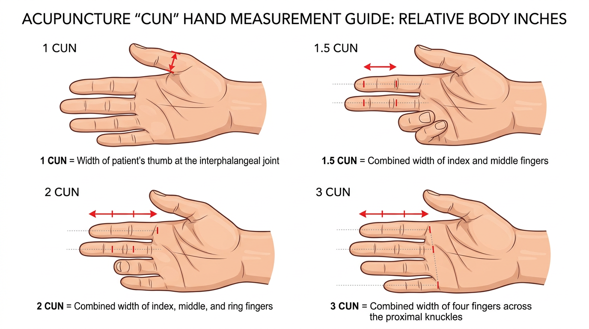
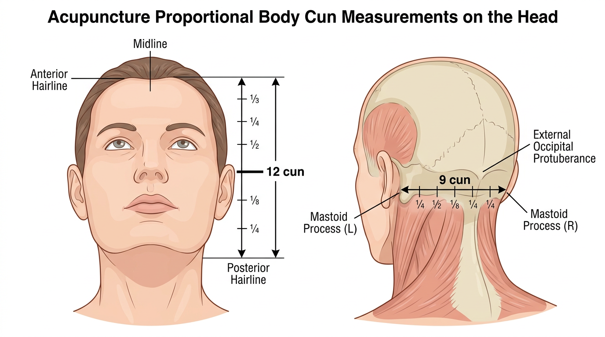
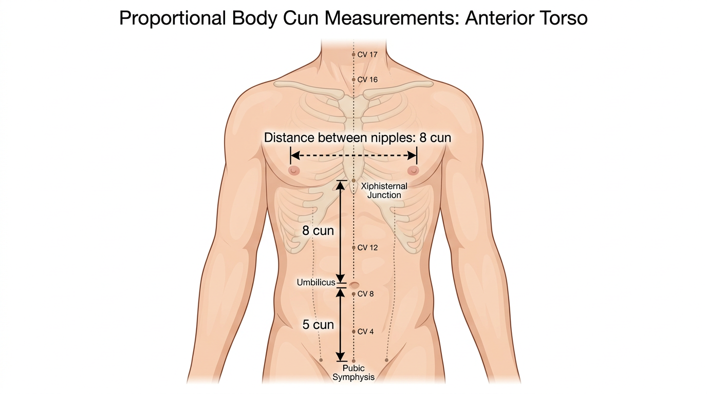
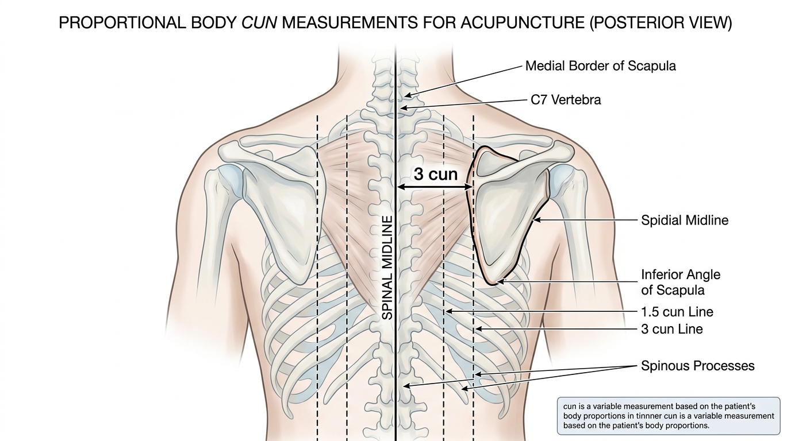
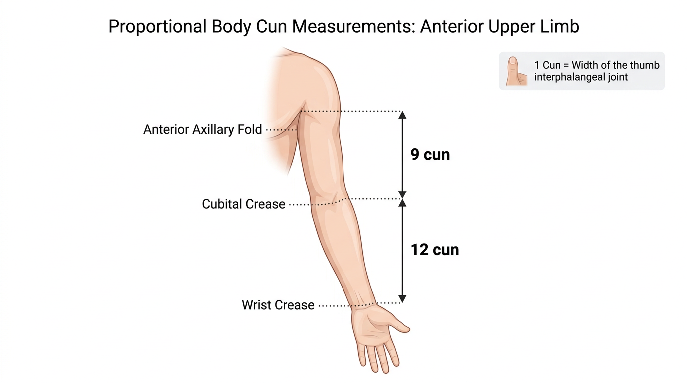
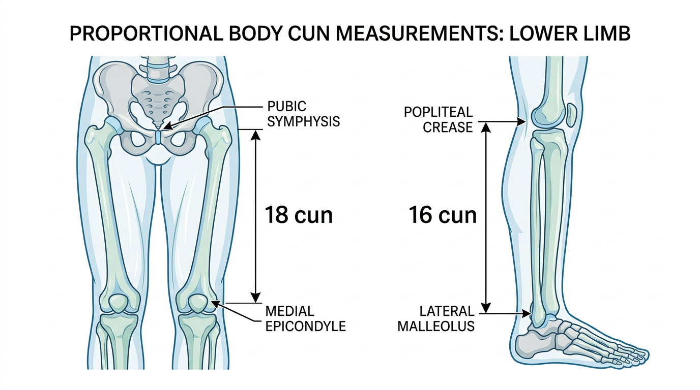

# אנטומיית משטח - ציוני דרך למציאת נקודות

## Surface Anatomy - Landmarks for Point Location

---

## מטרות למידה

בסיום שיעור זה, הסטודנט יוכל:
1. להסביר ולהשתמש במערכת מדידת הצון (Cun)
2. למדוד מרחקים על הגוף בשיטות שונות (אצבעות, מדידה יחסית)
3. לזהות ולמשש ציוני דרך אנטומיים בכל אזורי הגוף
4. לתאר את הקפלים, הבליטות, הגידים והשקעים המשמשים למיקום נקודות
5. להשתמש בטבלאות הצון למציאת נקודות מדויקת

---

## 1. מערכת מדידת הצון (寸 Cun)

### 1.1 מהו צון?

**צון** (寸 Cun, לעיתים מתורגם "אינץ' סיני") הוא יחידת מדידה **יחסית** - המבוססת על גוף המטופל עצמו. צון אחד שונה מאדם לאדם, ומבטיח שנקודות הדיקור נמצאות באותו מיקום יחסי על כל אדם, ללא קשר לגודלו.

> **כלל זהב**: תמיד מדדו על גוף **המטופל**, לא על הגוף שלכם!

### 1.2 שלוש שיטות מדידה

#### א. מדידה באצבע אגודל (拇指同身寸 Mu Zhi Tong Shen Cun)

**1 צון** = רוחב המפרק הבין-גלילי של אגודל המטופל

שימוש: מתאים למרחקים קצרים (1-2 צון)

#### ב. מדידה באצבע אמצעית (中指同身寸 Zhong Zhi Tong Shen Cun)

**1 צון** = המרחק בין שני קצוות הקפלים של המפרק האמצעי של האצבע האמצעית כשהיא מכופפת

שימוש: מתאים למרחקים קצרים, אלטרנטיבה לאגודל

#### ג. מדידת ארבע אצבעות (横指同身寸 Heng Zhi Tong Shen Cun)

- **1 אצבע** (אגודל) = 1 צון
- **2 אצבעות** (אצבע מורה + אמצעית) = 1.5 צון
- **3 אצבעות** (אצבע מורה + אמצעית + קמיצה) = 2 צון
- **4 אצבעות** (אצבע מורה + אמצעית + קמיצה + זרת) = 3 צון

שימוש: השיטה הנפוצה ביותר לשימוש יומיומי

### 1.3 מדידה יחסית (骨度分寸法 Gu Du Fen Cun Fa)

שיטת "מדידת עצמות יחסית" — המרחק בין שני ציוני דרך אנטומיים קבועים מוגדר כמספר צונים קבוע. המרחק מחולק באופן שווה, ללא קשר לגודל המטופל.

> **זוהי השיטה המדויקת ביותר** ויש להעדיף אותה על פני מדידת אצבעות כשאפשר.

---

## 2. טבלאות צון לפי אזור גוף

### 2.1 הראש (Head)

| מ- | עד | מרחק |
|---|---|---|
| קו השיער הקדמי (前发际) | קו השיער האחורי (后发际) | 12 צון |
| בין שני קצוות הגבות (印堂) | קו השיער הקדמי | 3 צון |
| קו השיער האחורי | GV14 (דא ג'ואי) | 3 צון |
| בין שני התוצאים המסטואידיים | — | 9 צון |

> **הערה**: כאשר קו השיער לא ברור (אצל קרחים), משתמשים ב: מ-Glabella (בין הגבות) עד GV14 = 18 צון.

### 2.2 החזה והבטן (Chest & Abdomen)

| מ- | עד | מרחק |
|---|---|---|
| שני הפטמות (אצל גברים) | — | 8 צון |
| קו האמצע → פטמה | — | 4 צון |
| חריץ הצלע (Sternal Notch) | מפרק הצלע-חרב (Xiphisternal Junction) | 9 צון |
| מפרק הצלע-חרב | מרכז הטבור | 8 צון |
| מרכז הטבור | קצה עליון של הסימפיזה הפובית | 5 צון |

### 2.3 הגב (Back)

| מ- | עד | מרחק |
|---|---|---|
| קו אמצע (תוצאים שיכיים) → שורת BL הפנימית | — | 1.5 צון |
| קו אמצע → שורת BL החיצונית | — | 3 צון |
| הקצה המדיאלי של השכם → קו האמצע | — | 3 צון |

### 2.4 הגפה העליונה (Upper Limb)

| מ- | עד | מרחק |
|---|---|---|
| קפל בית השחי הקדמי | קפל המרפק | 9 צון |
| קפל המרפק | קפל שורש כף היד | 12 צון |

### 2.5 הגפה התחתונה (Lower Limb)

| מ- | עד | מרחק |
|---|---|---|
| קצה עליון של הסימפיזה הפובית | קצה עליון של האפיקונדיל המדיאלי של הפמור | 18 צון |
| טרוכנטר גדול | קפל הפופליטאלי (גב הברך) | 19 צון |
| קפל הפופליטאלי | קודקוד המלאולוס הלטרלי | 16 צון |
| קצה תחתון של הקונדיל המדיאלי של הטיביה (SP9) | קודקוד המלאולוס המדיאלי | 13 צון |

---

## 3. ציוני דרך נמושים לפי אזור

### 3.1 ראש ופנים (Head & Face)

| ציון דרך | תיאור | נקודות קשורות |
|---|---|---|
| גלבלה (Glabella) | שטח חלק בין הגבות | יין טאנג (Extra) |
| קשת הגבה (Superciliary Arch) | בליטת עצם מעל העין | BL2 (צואן ג'ו) |
| תחתית הארובה (Infraorbital Foramen) | חור מתחת לעין | ST2 (סי באי) |
| קשת הלחי (Zygomatic Arch) | עצם הלחי הבולטת | SI18, ST6 |
| זווית הלסת (Angle of Mandible) | פינה אחורית-תחתונה | ST6 (ג'יא צ'ה) |
| תוצא מסטואידי (Mastoid Process) | בליטה מאחורי האוזן | TE17 (יי פנג), GB12 |
| בליטת העורף (EOP) | בליטה בעורף | GV17 (נאו הו) |
| קודקוד הראש | נקודת הצטלבות קו אמצע + קו בין האוזניים | GV20 (באי הואי) |

### 3.2 צוואר (Neck)

| ציון דרך | תיאור | נקודות קשורות |
|---|---|---|
| עצם הלאמי (Hyoid Bone) | עצם קטנה מתחת לסנטר | REN23 (ליאן צ'ואן) |
| סחוס בלוטת התריס | "תפוח אדם" | ST9 (רן יינג) - לצידו |
| SCM - שריר סטרנוקליידומסטואיד | שריר בולט בצד הצוואר | LI18, ST9 |
| C7 - Vertebra Prominens | החוליה הבולטת ביותר בבסיס הצוואר | GV14 (דא ג'ואי) |

**טיפ למציאת C7**: בקשו מהמטופל לכופף את הראש קדימה. החוליה הבולטת ביותר שנעלמת כשמרימים את הראש היא C6; זו שנשארת בולטת היא C7.

### 3.3 חזה (Chest)

| ציון דרך | תיאור | נקודות קשורות |
|---|---|---|
| חריץ הצלע (Sternal Notch) | שקע בראש הסטרנום | REN22 (טיאן טו) |
| זווית הסטרנום (Sternal Angle) | חיבור מנובריום-גוף, גובה צלע 2 | מיקום מרווח בין-צלעי 2 |
| פטמה | — | ST17 (רו ג'ונג) - **אסור לדקור!** |
| תוצא החרב (Xiphoid) | קצה תחתון של הסטרנום | REN15 (ג'יו ווי) |
| מרווחים בין-צלעיים | בין צלעות עוקבות | נקודות על החזה |

> **טיפ חשוב**: כדי לספור מרווחים בין-צלעיים, התחילו מזווית הסטרנום (Sternal Angle), שם מתחבר צלע 2. משם ספרו מטה.

### 3.4 בטן (Abdomen)

| ציון דרך | תיאור | נקודות קשורות |
|---|---|---|
| תוצא החרב | קצה תחתון של הסטרנום | REN15 - 7 צון מעל הטבור |
| הטבור (Umbilicus) | — | REN8 (שן צ'ו) - **אסור לדקור!** |
| קצה עליון סימפיזה פובית | — | REN2 (צ'ו גו) |

### 3.5 גב (Back)

| ציון דרך | תיאור | נקודות קשורות |
|---|---|---|
| C7 (Vertebra Prominens) | חוליה בולטת בבסיס הצוואר | GV14 |
| עמוד השכם (Spine of Scapula) | גובה T3 | BL13 |
| זווית תחתונה של השכם | גובה T7 | BL17 (גה שו) |
| קצה צלע 12 | גובה L2 | BL23 (שן שו) |
| פסגת הכסל (Iliac Crest) | גובה L4 | BL25 |
| PSIS (שקעים בגב התחתון) | גובה S2 | BL27 |
| קצה עצם הזנב (Coccyx) | — | GV1 |

### 3.6 גפה עליונה (Upper Limb)

| ציון דרך | תיאור | נקודות קשורות |
|---|---|---|
| אקרומיון | קצה הכתף | LI15 (ג'יאן יו) |
| קפל המרפק (Cubital Crease) | קפל כשהמרפק מכופף | LI11, LU5, PC3 |
| אפיקונדיל לטרלי | בליטה חיצונית במרפק | LI11 (צ'ו צ'י) |
| גיד הביצפס (Biceps Tendon) | גיד בולט בקפל המרפק | LU5 (מלטרלית לו) |
| גידי שורש כף היד | גידים בולטים בשורש כף יד | PC7, HT7 |
| תוצא שיכי רדיוס | בליטה בצד אגודל | LU7, LI5 |
| "קופסת הטבק" (Anatomical Snuffbox) | שקע בבסיס האגודל | LI5 (יאנג שי) |
| מרווח בין מטקרפל 1-2 | בין אגודל לאצבע מורה | LI4 (חה גו) |

### 3.7 גפה תחתונה (Lower Limb)

| ציון דרך | תיאור | נקודות קשורות |
|---|---|---|
| טרוכנטר גדול | בליטה בצד הירך | GB30 (הואן טיאו) |
| פטלה (פיקת הברך) | — | ST35 (מתחת), SP10 (מעל) |
| קפל הפופליטאלי | קפל גב הברך | BL40 (ווי ג'ונג) |
| ראש הפיבולה | בליטה בצד חיצוני-תחתון לברך | GB34 (יאנג לינג צ'ואן) |
| קצה קדמי טיביה (Tibial Crest) | "עצם השוקה" | ציון דרך ל-ST36 |
| מלאולוס מדיאלי | בליטה פנימית בקרסול | SP6, KI3, KI6 |
| מלאולוס לטרלי | בליטה חיצונית בקרסול | BL60, GB40 |
| גיד אכילס (Achilles Tendon) | גיד בולט מעל העקב | KI3 (בין גיד למלאולוס) |
| מרווח בין מטטרסל 1-2 | בין בוהן לאצבע 2 | LR3 (טאי צ'ונג) |

---

## 4. קפלים (Creases) כציוני דרך

קפלי עור הם ציוני דרך חשובים במיוחד:

| קפל | מיקום | נקודות |
|---|---|---|
| קפל שורש כף היד (Wrist Crease) | שורש כף יד | HT7, PC7, LU9 |
| קפל המרפק (Cubital Crease) | חזית המרפק | LI11, PC3, LU5 |
| קפל בית השחי (Axillary Fold) | בית השחי | HT1 |
| קפל הפופליטאלי (Popliteal Crease) | גב הברך | BL40 |
| קפל העכוז (Gluteal Fold) | תחתית העכוז | BL36 |

---

## 5. שיטות למציאת נקודות מדויקת

### 5.1 שיטת השלבים

1. **זהו את האזור הכללי** על פי תיאור הנקודה
2. **מצאו ציון דרך** (עצם, גיד, קפל) הקרוב לנקודה
3. **מדדו** את המרחק בצון מציון הדרך
4. **מששו** - חפשו שקע, רגישות, או שינוי במרקם
5. **אמתו** - בדקו שהמיקום הגיוני ביחס לתיאור המקורי

### 5.2 טעויות נפוצות

- **שימוש באצבעות המטפל** במקום באצבעות המטופל
- **ספירה שגויה** של מרווחים בין-צלעיים (תמיד ספרו מזווית הסטרנום)
- **בלבול** בין מלאולוס מדיאלי ללטרלי
- **אי-התחשבות** בתנוחת הגפה (יש נקודות שנמצאות רק כשהמרפק/ברך מכופפים)
- **הזנחת המישוש** - מדידה בלבד אינה מספיקה, יש לאמת בנגיעה

### 5.3 חשיבות המישוש

> "הנקודה הנכונה מודיעה על עצמה" — כאשר לוחצים על נקודת דיקור אמיתית, המטופל ירגיש לרוב רגישות מוגברת, והמטפל ירגיש שקע קל או שינוי במרקם הרקמה.

---

## 6. תרגילים

### תרגיל 1: מדידות צון
על שותף, מדדו את המרחקים הבאים ובדקו:
א. מקפל שורש כף היד לקפל המרפק (צריך להיות 12 צון)
ב. מקפל הפופליטאלי לקודקוד המלאולוס הלטרלי (16 צון)
ג. מזווית הסטרנום עד הטבור (כמה מרווחים בין-צלעיים + 8 צון)

### תרגיל 2: מציאת נקודות
מצאו את הנקודות הבאות תוך שימוש בציוני דרך ומדידות:
א. ST36 - 3 צון מתחת ל-ST35, אצבע אחת לטרלית לקצה הטיביה
ב. SP6 - 3 צון מעל קודקוד המלאולוס המדיאלי, אחורית לטיביה
ג. LI11 - בקצה הלטרלי של קפל המרפק כשהמרפק מכופף

### תרגיל 3: ציוני דרך בגב
בקשו משותף לשבת ולכופף את הראש. מצאו:
א. C7 (Vertebra Prominens)
ב. T3 (גובה עמוד השכם)
ג. T7 (גובה הזווית התחתונה של השכם)
ד. L4 (גובה פסגת הכסל)

### תרגיל 4: חשבו מדוע
הסבירו מדוע מערכת הצון היא יחסית ולא מוחלטת. מה היה קורה אם היינו משתמשים בסנטימטרים?

---

## קריאה מומלצת

- Deadman, P. *A Manual of Acupuncture* (מבוא - Point Location)
- WHO Standard Acupuncture Point Locations (2008)
- Lian, Y.L. *Atlas of Acupuncture* (מדריך מיקום)

---

> **נקודה למחשבה**: מיקום נקודות מדויק הוא אמנות הדורשת תרגול. ככל שתתרגלו יותר מישוש ומדידה, כך האצבעות שלכם "ילמדו" למצוא את הנקודה הנכונה באופן אינטואיטיבי. אין תחליף לתרגול מעשי על גופים שונים.

---

## ניווט

- **הקודם**: [מערכות האיברים](03-organ-systems.md)
- **חזרה למודול**: [מודול 3 — אנטומיה](README.md)
- **ראה גם**: [מדריך מיקום נקודות](../module-02-meridians/practical/point-location-guide.md) | [טכניקות מישוש](../module-02-meridians/practical/palpation-techniques.md)
