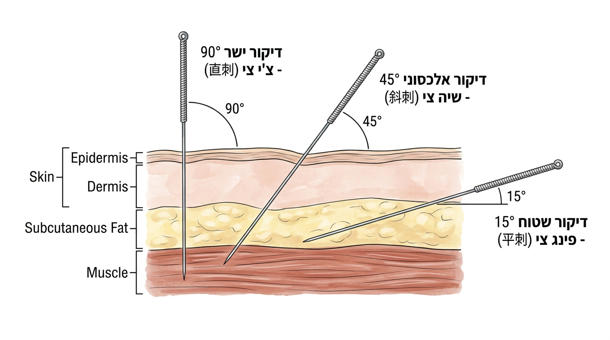

# טכניקות החדרה בסיסיות

## Basic Insertion Techniques

---

## מטרות למידה

בסיום שיעור זה, הסטודנט יוכל:
1. לתאר ולבצע שלוש זוויות החדרה (ניצבת, אלכסונית, שטוחה)
2. לבחור זווית ועומק מתאימים לפי אזור הגוף
3. לבצע החדרה ביד אחת ובשתי ידיים, עם ובלי צינורית הכוונה
4. לבצע מניפולציות בסיסיות (הרמה-דחיפה, סיבוב)
5. להוציא מחט בצורה בטוחה ונכונה

---

## 1. שלוש זוויות החדרה

### 1.1 החדרה ניצבת (直刺 Zhi Ci) — 90°

- **זווית**: 90° ביחס לפני העור
- **שימוש**: אזורים עם שכבת שריר עבה
- **אזורים**: גפיים (ST36, LI4, SP6), גב (BL23, BL25), עכוז (GB30)
- **יתרון**: עומק מרבי, דה-צ'י חזקה
- **זהירות**: לא בחזה, לא באזורים עם איברים שטחיים

### 1.2 החדרה אלכסונית (斜刺 Xie Ci) — 45°

- **זווית**: 30°-60° ביחס לפני העור (45° הוא הנפוץ)
- **שימוש**: אזורים עם שכבת שריר בינונית, או כאשר רוצים להגיע לנקודה מסוימת מהצד
- **אזורים**: חזה (LU1), בטן (REN12), כתף (LI15), פנים (ST2)
- **יתרון**: מאפשר עומק סביר עם בטיחות
- **זהירות**: כיוון האלכסון חשוב — בחזה, תמיד הרחק מהריאות

### 1.3 החדרה שטוחה / רוחבית (平刺 Ping Ci) — 15°

- **זווית**: 10°-20° ביחס לפני העור
- **שימוש**: אזורים עם שכבת רקמה דקה, או דיקור לאורך ערוץ
- **אזורים**: קרקפת (דיקור קרקפת), מצח (GV24, יין טאנג), חזה (על הסטרנום), גב ידיים ורגליים
- **יתרון**: בטוח ביותר, מתאים לאזורים מסוכנים
- **טכניקה מיוחדת**: "דיקור שרשור" (透刺 Tou Ci) — מחט אחת חודרת מנקודה אחת לכיוון נקודה אחרת מתחת לעור

---

## 2. עומקי החדרה לפי אזור גוף

### 2.1 טבלת עומקים מומלצים

| אזור | עומק טיפוסי | זווית | הערות |
|---|---|---|---|
| קרקפת | 0.5-1 צון | שטוח (15°) | מתחת לגולגולת, בשכבה התת-עורית |
| מצח | 0.3-0.5 צון | שטוח (15°) | שכבת רקמה דקה מאוד |
| פנים | 0.2-0.5 צון | ניצב/אלכסוני | זהירות מעצבים וכלי דם |
| צוואר | 0.5-1 צון | ניצב/אלכסוני | זהירות מעורק הצוואר |
| חזה קדמי | 0.3-0.5 צון | **שטוח/אלכסוני בלבד** | **סיכון פנאומותורקס!** |
| גב עליון (T1-T9) | 0.5-0.8 צון | אלכסוני (45°) כלפי עמוד השדרה | **סיכון פנאומותורקס!** |
| בטן | 0.5-1.5 צון | ניצב | זהירות במטופלים רזים |
| גב תחתון (L1-L5) | 1-1.5 צון | ניצב | בטוח יחסית |
| עכוז | 1.5-3 צון | ניצב | שכבת שריר עבה |
| זרוע/שוק | 0.5-1.5 צון | ניצב | שכבת שריר בינונית |
| כף יד/רגל | 0.3-0.8 צון | ניצב | שכבת רקמה דקה |
| אצבעות | 0.1-0.3 צון | ניצב/אלכסוני | רגישות גבוהה |

### 2.2 גורמים המשפיעים על עומק

- **מבנה גוף המטופל**: מטופל שמן → עמוק יותר; רזה → שטחי יותר
- **גיל**: ילדים וקשישים → שטחי יותר
- **מצב המטופל**: חסר (虚) → שטחי, עודף (实) → עמוק
- **מטרת הטיפול**: חיזוק → עדין ושטחי, פיזור → חזק ועמוק
- **עונה**: קיץ → שטחי יותר (צ'י בשטח), חורף → עמוק יותר (צ'י בעומק)

---

## 3. שיטות החדרה

### 3.1 החדרה ביד אחת (单手进针 Dan Shou Jin Zhen)

**תיאור**: יד אחת מחזיקה ומחדירה את המחט בו-זמנית.

**טכניקה**:
1. אחזו את המחט בין אגודל לאצבע מורה של היד הדומיננטית
2. האצבע האמצעית מונחת על גוף המחט לתמיכה
3. תנועה מהירה ומדויקת של פרק כף היד כלפי מטה
4. לאחר חדירת העור, המשיכו לדחוף בעדינות

**יתרון**: מהירה, מתאימה למתרגלים מנוסים
**חיסרון**: פחות יציבות, דורשת מיומנות

### 3.2 החדרה בשתי ידיים (双手进针 Shuang Shou Jin Zhen)

**תיאור**: יד אחת מחדירה, היד השנייה מסייעת.

#### שיטת לחיצת עור (按压法 An Ya Fa)
1. **יד עוזרת**: אגודל או אצבע מורה לוחצים על העור ליד נקודת הדיקור
2. **יד דוקרת**: מחדירה את המחט ליד האצבע הלוחצת
3. **יתרון**: הלחיצה מפחיתה כאב ומייצבת את האזור

#### שיטת מתיחת עור (提捏法 Ti Nie Fa)
1. **יד עוזרת**: מותחת או צובטת את העור כדי ליצור קפל
2. **יד דוקרת**: מחדירה את המחט לתוך הקפל
3. **שימוש**: אזורים עם שכבת רקמה דקה (מצח, גב יד)

#### שיטת תמיכת מחט (夹持法 Jia Chi Fa)
1. **יד עוזרת**: מחזיקה את גוף המחט דרך ספוגית סטרילית
2. **יד דוקרת**: דוחפת את המחט מהידית
3. **שימוש**: מחטים ארוכות (2-3 צון)

### 3.3 טכניקת צינורית הכוונה (管针法 Guan Zhen Fa)

**השיטה הנפוצה ביותר למתחילים ובפרקטיקה מודרנית**:

1. הכניסו את המחט לצינורית (המחט בולטת 1-2 מ"מ מעל הצינורית)
2. הניחו את הצינורית על נקודת הדיקור
3. **טפיחה מהירה וקלה** על זנב המחט — המחט חודרת 1-2 מ"מ לעור
4. הסירו את הצינורית (החליקו כלפי מעלה)
5. המשיכו לדחוף את המחט לעומק הרצוי

**יתרונות**:
- החדרה כמעט ללא כאב
- יציבות מרבית
- קלה ללימוד
- סטנדרטית ברוב המחטים החד-פעמיות

---

## 4. מהירות ההחדרה

### 4.1 החדרה מהירה (快速进针 Kuai Su Jin Zhen)

- **תיאור**: חדירה מהירה ונחרצת דרך העור
- **יתרון**: **פחות כאב** — חדירה מהירה מגרה פחות קולטני כאב
- **שימוש**: רוב המצבים, במיוחד מטופלים רגישים

### 4.2 החדרה איטית (慢速进针 Man Su Jin Zhen)

- **תיאור**: חדירה הדרגתית ואיטית
- **שימוש**: אזורים רגישים מאוד, כשצריך דיוק מרבי (ליד עצבים/כלי דם)
- **חיסרון**: יותר כואב מהחדרה מהירה

> **כלל**: חדרו את העור **מהר**, ואז האטו בדרך לעומק הרצוי.

---

## 5. מניפולציות לאחר החדרה

### 5.1 הרמה ודחיפה (提插 Ti Cha / Lifting-Thrusting)

**תיאור**: תנועה אנכית של המחט — מעלה ומטה

- **טכניקה**: אחזו בידית, הרימו 2-3 מ"מ, דחפו בחזרה
- **עוצמה**: מתחילים עדין, מגבירים בהדרגה
- **מטרה**: עורר דה-צ'י, שנה את עומק הגירוי
- **משמעות טיפולית**:
  - דחיפה חזקה + הרמה עדינה = **חיזוק** (补法 Bu Fa)
  - הרמה חזקה + דחיפה עדינה = **פיזור** (泻法 Xie Fa)

### 5.2 סיבוב (捻转 Nian Zhuan / Rotating)

**תיאור**: סיבוב המחט סביב צירה

- **טכניקה**: אחזו בידית בין אגודל לאצבע מורה, סובבו 180°-360° לכל כיוון
- **תדירות**: 2-3 סיבובים בשנייה
- **זהירות**: אל תסובבו תמיד באותו כיוון — המחט תתעקל או תיתקע ברקמת חיבור!
- **משמעות טיפולית**:
  - סיבוב בטווח קטן (90°-180°), איטי = **חיזוק**
  - סיבוב בטווח גדול (360°+), מהיר = **פיזור**

### 5.3 שילוב טכניקות

ברוב הפרקטיקה, משלבים הרמה-דחיפה עם סיבוב:
1. הרמה קלה
2. סיבוב 180° ימינה
3. דחיפה
4. סיבוב 180° שמאלה
5. חזרה על המחזור

---

## 6. זמן החזקת מחטים (留针 Liu Zhen / Needle Retention)

### 6.1 זמני החזקה מקובלים

| מצב | זמן | הסבר |
|---|---|---|
| טיפול סטנדרטי | 20-30 דקות | הנפוץ ביותר |
| מצב חריף (כאב חד) | 10-15 דקות | גירוי חזק וקצר |
| מצב כרוני | 30-45 דקות | גירוי ממושך |
| ילדים | 5-10 דקות | סבלנות מוגבלת |
| חיזוק (补) | 15-20 דקות | עדין וקצר יחסית |
| פיזור (泻) | 25-40 דקות | חזק וארוך יחסית |

### 6.2 מניפולציה במהלך ההחזקה

- **שיטה ראשונה**: הכנסה → מניפולציה ליצירת דה-צ'י → השארת מחטים למנוחה → מניפולציה נוספת באמצע → הוצאה
- **שיטה שנייה**: הכנסה → מניפולציה מתמשכת (כל 5-10 דקות) → הוצאה
- **שיטה שלישית**: הכנסה → ללא מניפולציה כלל → הוצאה (שיטה יפנית)

### 6.3 מעקב בזמן ההחזקה

- **אל תשאירו מטופל ללא השגחה** (במיוחד בטיפולים ראשונים)
- בדקו כל 5-10 דקות: צבע פנים, תחושות, נוחות
- וודאו שהמטופל לא ישן בתנוחה שתגרום למחטים לזוז

---

## 7. הוצאת מחטים (出针 Chu Zhen / Needle Removal)

### 7.1 טכניקה

1. **הכינו ספוגית יבשה/מעוקרת** ליד נקודת הדיקור
2. **סובבו את המחט בעדינות** 90° לכל כיוון (לשחרר הצמדות)
3. **משכו באיטיות ובעדינות** — לא בכוח
4. **הניחו ספוגית על הנקודה** ולחצו
5. **השליכו מחט ישירות לפח חדים**
6. **לחצו** על הנקודה למשך 5-10 שניות

### 7.2 לחיצה לאחר הוצאה

- **לחיזוק (补)**: לחצו ועסו את הנקודה לאחר הוצאה ("סגירת הנקודה")
- **לפיזור (泻)**: אל תלחצו — השאירו את הנקודה "פתוחה" לפיזור
- **למניעת המטומה**: לחצו 30 שניות-1 דקה, במיוחד במטופלים הנוטלים מדללי דם

### 7.3 ספירת מחטים

> **כלל ברזל**: ספרו מחטים! ספרו כמה מחטים הכנסתם, וודאו שאותו מספר יצא. השתמשו ברשימה כתובה אם יש יותר מ-10 מחטים.

---

## 8. סדר עבודה שלם — מהכנה עד סיום

1. **שטיפת ידיים** + לבישת כפפות
2. **הכנת ציוד**: מחטים, ספוגיות אלכוהול, פח חדים
3. **הכנת מטופל**: תנוחה נוחה, חשיפת אזורים
4. **חיטוי עור** באלכוהול 70%
5. **החדרת מחטים** — לפי תוכנית הטיפול
6. **מניפולציה** ליצירת דה-צ'י
7. **זמן החזקה** (20-30 דקות) עם מעקב
8. **הוצאת מחטים** + לחיצה
9. **ספירת מחטים** — וודאו שכולן יצאו
10. **השלכה לפח חדים**
11. **בדיקת מטופל**: מצב כללי, תחושות, הנחיות לאחר טיפול
12. **תיעוד** בתיק המטופל

---

## 9. תרגילים

### תרגיל 1: זוויות
על כרית אימון, תרגלו את שלוש הזוויות:
א. החדרה ניצבת (90°)
ב. החדרה אלכסונית (45°)
ג. החדרה שטוחה (15°)
בכל זווית, שימו לב לעומק שהמחט מגיעה אליו.

### תרגיל 2: צינורית הכוונה
בצעו 20 החדרות עם צינורית הכוונה. שימו לב ל:
- עוצמת הטפיחה (לא חזקה מדי, לא חלשה מדי)
- הסרת הצינורית בצורה חלקה

### תרגיל 3: מניפולציות
על כרית, תרגלו:
א. הרמה-דחיפה: 20 חזרות, שימו לב לטווח (2-3 מ"מ)
ב. סיבוב: 20 חזרות, תמיד מחליפים כיוון
ג. שילוב: 20 חזרות של הרמה-דחיפה + סיבוב

### תרגיל 4: בחירת זווית ועומק
עבור כל נקודה, ציינו את הזווית, העומק, ואורך המחט המומלצים:
א. ST36 (צו סאן לי) — שוק
ב. REN12 (ג'ונג ואן) — בטן
ג. GV20 (באי הואי) — קודקוד
ד. BL13 (פיי שו) — גב עליון
ה. LI4 (חה גו) — כף יד

---

## קריאה מומלצת

- Deadman, P. *A Manual of Acupuncture* (Introduction - Needling Technique)
- Cheng, X. *Chinese Acupuncture and Moxibustion* (פרק 14)
- NCCAOM *Clean Needle Technique Manual* (פרק Needling)

---

> **נקודה למחשבה**: טכניקה טובה היא שקופה — המטופל בקושי מרגיש את ההחדרה, אך מרגיש בבירור את דה-צ'י. הדרך להגיע לשם היא תרגול, תרגול, ועוד תרגול. אין קיצורי דרך.

---

## ניווט

- **הקודם**: [טכניקת מחט נקייה](02-clean-needle-technique.md) | **הבא**: [תחושת דה-צ'י](04-deqi-sensation.md)
- **חזרה למודול**: [מודול 4 — יסודות הדיקור](README.md)
- **ראה גם**: [אנטומיית משטח](../module-03-anatomy/04-surface-anatomy.md) — ציוני דרך לחדירה בטוחה
