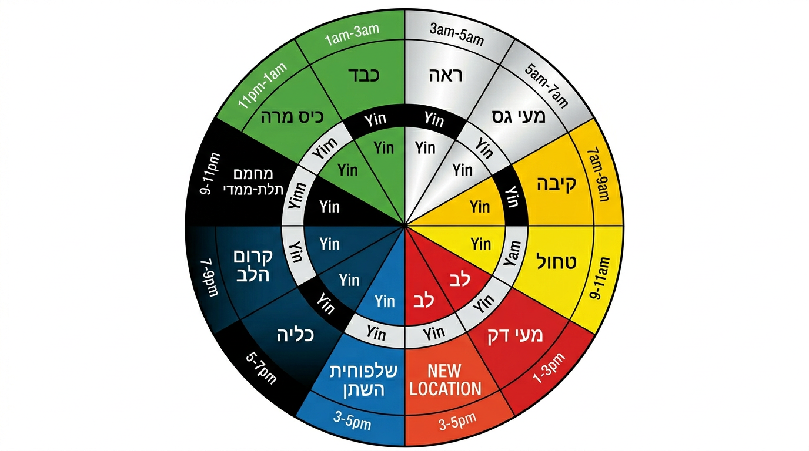

# שעון האיברים — זי וו ליו ג'ו (子午流注)

## The Organ Clock — Zi Wu Liu Zhu

---

## מטרות למידה

בסיום שיעור זה, הסטודנט יוכל:
1. לתאר את מחזור 24 השעות של זרימת צ'י דרך האיברים
2. לזהות את שעות השיא של כל איבר ואת המשמעות הקלינית
3. ליישם את שעון האיברים באבחון — מתי מחמירים תסמינים
4. להבין את עקרונות תזמון הטיפול לפי שעון האיברים

---

## מבוא

**זי וו ליו ג'ו** (子午流注) פירושו "זרימת [צ'י בשעות] זי ווו". זי (子) היא שעת חצות, וו (午) היא שעת הצהריים — שני הקטבים של המחזור היומי. תורה זו טוענת כי **הצ'י זורם דרך 12 הערוצים העיקריים במחזור קבוע של 24 שעות**, כאשר כל איבר מגיע לשיא פעילותו במשך שעתיים.

> "人与天地相应" (Ren Yu Tian Di Xiang Ying)
> "האדם ושמיים-אדמה מתכתבים זה עם זה"
> — הואנג די ניי ג'ינג

### הרעיון המרכזי

כשם שלטבע יש מחזורים (יום-לילה, עונות השנה), כך **לגוף יש מחזור פנימי**. כל שעתיים, צ'י מרוכז באיבר אחר. ההבנה הזו מאפשרת:
- **אבחון:** מתי מתחמיר בעיה? → איזה איבר פעיל באותה שעה?
- **טיפול:** מתי הכי טוב לטפל באיבר מסוים?
- **מניעה:** כיצד לארגן את היום לבריאות מיטבית?

---

## שעון האיברים — מחזור 24 שעות



```
                        🕛 12:00
                     לב (心)
                   11:00-13:00
                  /            \
     טחול (脾)  /              \ מעי דק (小肠)
    09:00-11:00                 13:00-15:00
        |                            |
  קיבה (胃)                   שלפוחית (膀胱)
  07:00-09:00                  15:00-17:00
        |                            |
  מעי גס (大肠)                כליות (肾)
  05:00-07:00                  17:00-19:00
        |                            |
  ריאות (肺)                   פריקרד (心包)
  03:00-05:00                  19:00-21:00
                \              /
    כבד (肝)     \            /  סאן ג'יאו (三焦)
   01:00-03:00                 21:00-23:00
                  \          /
                כיס מרה (胆)
                23:00-01:00
                     🕛 00:00
```

---

## פירוט כל שעה

### 03:00–05:00 — ריאות (肺 Fei) | שעת ין (寅时)

- **תפקיד בשיא:** הריאות מפזרות צ'י ונוזלים בכל הגוף, מכינות את הגוף ליום החדש
- **משמעות קלינית:** התעוררות תכופה בשעות אלו מצביעה על **בעיית ריאות** (חסר ין ריאות, חום ריאות) או על **עצב עמוק**
- **שיעול כרוני** שמחמיר בין 3-5 לפנות בוקר = סימן מובהק לפתולוגיית ריאות
- **מנהג בריאות:** זו השעה הטובה ביותר לנשימות עמוקות ולצ'י גונג

### 05:00–07:00 — מעי גס (大肠 Da Chang) | שעת מאו (卯时)

- **תפקיד בשיא:** זמן אידיאלי **לפינוי המעיים** — הגוף מוכן להפרשה
- **משמעות קלינית:** עצירות כרונית או שלשול בשעות אלו → בעיית מעי גס
- **מנהג בריאות:** שתיית כוס מים חמים בבוקר ויציאה לשירותים — הזמן הטבעי ביותר

### 07:00–09:00 — קיבה (胃 Wei) | שעת צ'ן (辰时)

- **תפקיד בשיא:** הקיבה בשיא כוחה — **הזמן הטוב ביותר לארוחת בוקר**
- **משמעות קלינית:** בחילה בבוקר → חום או קור בקיבה; חוסר תיאבון בבוקר → חסר צ'י קיבה/טחול
- **מנהג בריאות:** ארוחת בוקר מזינה וחמה היא הבסיס לבריאות הטחול-קיבה
- **אמרה סינית:** "בוקר — אכול כמלך, צהריים — כנסיך, ערב — כעני"

### 09:00–11:00 — טחול (脾 Pi) | שעת סה (巳时)

- **תפקיד בשיא:** הטחול ממיר ומוביל את תמציות המזון — **שיא העיכול וייצור הצ'י**
- **משמעות קלינית:** עייפות חמורה בשעות אלו → חסר צ'י טחול; נפיחות אחרי ארוחת בוקר → ליחה
- **מנהג בריאות:** זמן טוב למחשבה ברורה וללמידה (הטחול מאכלס י — כוונה וריכוז)

### 11:00–13:00 — לב (心 Xin) | שעת וו (午时)

- **תפקיד בשיא:** הלב בשיא — התודעה (שן) הכי ערנית, מחזור הדם חזק
- **משמעות קלינית:** דפיקות לב, חרדה או הזעה מוגברת בצהריים → בעיית לב
- **מנהג בריאות:** נמנום קצר בצהריים (20-30 דקות) מועיל מאוד ללב ולשן. מסורת סינית עתיקה

### 13:00–15:00 — מעי דק (小肠 Xiao Chang) | שעת ווי (未时)

- **תפקיד בשיא:** הפרדת טהור מעכור — עיבוד ארוחת הצהריים
- **משמעות קלינית:** כאבי בטן אחרי צהריים → בעיית מעי דק; שתן צורב בשעות אלו → חום מעי דק
- **מנהג בריאות:** שתיית מים מספקת מסייעת למעי הדק בתהליך ההפרדה

### 15:00–17:00 — שלפוחית (膀胱 Pang Guang) | שעת שן (申时)

- **תפקיד בשיא:** שלפוחית השתן מפרישה — **ניקוי ופינוי פסולת נוזלית**
- **משמעות קלינית:** כאבי ראש בשעות אחר הצהריים → ערוץ שלפוחית (טאי יאנג); תכיפות שתן
- **מנהג בריאות:** שתייה מרובה מסייעת בפינוי; זמן טוב ללמידה ולעבודה (המוח "נקי")

### 17:00–19:00 — כליות (肾 Shen) | שעת יו (酉时)

- **תפקיד בשיא:** הכליות מאחסנות ג'ינג ומווסתות מים — **חידוש אנרגיה חיונית**
- **משמעות קלינית:** עייפות חמורה בערב → חסר כליות; כאבי גב שמחמירים לקראת ערב → כליות
- **מנהג בריאות:** זמן טוב לפעילות מתונה, התמתחות; לא מומלץ מאמץ פיזי קיצוני

### 19:00–21:00 — פריקרד (心包 Xin Bao) | שעת שו (戌时)

- **תפקיד בשיא:** הפריקרד מגן על הלב — **זמן לחיזוק הרגשות והקשרים**
- **משמעות קלינית:** חרדה או לחץ בחזה בערב → בעיית פריקרד
- **מנהג בריאות:** זמן מעולה לשיחות אינטימיות, למשפחה, לפעילויות מרגיעות

### 21:00–23:00 — סאן ג'יאו (三焦 San Jiao) | שעת האי (亥时)

- **תפקיד בשיא:** סאן ג'יאו מאזן את כל מערכות הגוף — **הכנה לשינה**
- **משמעות קלינית:** קושי להירדם בשעות אלו → חום בסאן ג'יאו; הזעה ללא סיבה
- **מנהג בריאות:** להתחיל להרגע, להימנע ממסכים, להתכונן לשינה. **הזמן האידיאלי להירדם הוא לפני 23:00**

### 23:00–01:00 — כיס מרה (胆 Dan) | שעת זי (子时)

- **תפקיד בשיא:** כיס המרה מחליט ומעבד — **תחילת מחזור הין, שינה עמוקה חיונית**
- **משמעות קלינית:** התעוררות סביב חצות → חום-לחות בכיס מרה; חלומות מטרידים → כיס מרה/כבד
- **מנהג בריאות:** **חובה לישון!** לפי הרפואה הסינית, שינה בשעת זי היא הבסיס להתחדשות

### 01:00–03:00 — כבד (肝 Gan) | שעת צ'או (丑时)

- **תפקיד בשיא:** הכבד מנקה דם, מתכנן ומארגן — **שיא הניקוי והתחדשות הדם**
- **משמעות קלינית:** התעוררות בין 1-3 בלילה = **סימן קלאסי לבעיית כבד** (קיפאון צ'י, חום כבד, כעס מודחק)
- **מנהג בריאות:** הכבד זקוק לשינה עמוקה בשעות אלו כדי לנקות ולאחסן דם. חוסר שינה פוגע ישירות בכבד

---

## יישום קליני של שעון האיברים

### 1. אבחון לפי זמן החמרה

| שעת החמרה | איבר לחקור | דוגמאות |
|-----------|-----------|---------|
| 03:00-05:00 | ריאות | שיעול, אסתמה, התעוררות |
| 07:00-09:00 | קיבה | בחילה, חוסר תיאבון |
| 11:00-13:00 | לב | דפיקות, חרדה |
| 15:00-17:00 | שלפוחית | כאבי ראש, כאבי גב |
| 23:00-01:00 | כיס מרה | נדודי שינה, חלומות |
| 01:00-03:00 | כבד | התעוררות, עצבנות |

### 2. עיקרון השיא והשפל

כל איבר מגיע ל**שיא** (פעילות מקסימלית) ול**שפל** (12 שעות מאוחר יותר):

| איבר | שיא | שפל |
|------|-----|-----|
| כבד | 01:00-03:00 | 13:00-15:00 |
| ריאות | 03:00-05:00 | 15:00-17:00 |
| קיבה | 07:00-09:00 | 19:00-21:00 |
| לב | 11:00-13:00 | 23:00-01:00 |
| כליות | 17:00-19:00 | 05:00-07:00 |
| כבד | 01:00-03:00 | 13:00-15:00 |

**עיקרון:** תסמיני **עודף** מחמירים בשיא; תסמיני **חסר** מחמירים בשפל.

### 3. תזמון טיפולים

- **חיזוק איבר:** טפל בשעת השיא שלו (הצ'י כבר שם)
- **ניקוי/פיזור:** טפל בשעת השיא כשהפתוגן חזק, או בשעת השפל כשהאיבר חלש
- **שיטת זי וו ליו ג'ו המלאה** כוללת גם חישוב לפי גזעים שמימיים וענפים ארציים — שיטה מתקדמת

---

## הקשר למערכת גזעים וענפים

שעון האיברים מתחבר למערכת **הגזעים השמימיים** (天干 Tian Gan) ו**הענפים הארציים** (地支 Di Zhi):

- כל שעה בשעון שייכת ל**ענף ארצי** (12 ענפים = 12 שעות כפולות)
- בשיטת זי וו ליו ג'ו המלאה, נקודות הדיקור נבחרות לפי **יום ושעה** ספציפיים
- שיטה מתקדמת זו דורשת חישוב מורכב ותרגול רב

---

## נקודות חשובות לזכירה

1. **כל איבר פעיל שעתיים** — צ'י זורם במחזור קבוע של 24 שעות
2. **התעוררות בלילה** היא רמז אבחנתי חשוב — 1-3 = כבד, 3-5 = ריאות
3. **שינה לפני 23:00** חיונית — כיס מרה וכבד זקוקים לשינה עמוקה לניקוי
4. **ארוחת בוקר בין 7-9** היא הבסיס — הקיבה בשיא כוחה
5. **עודף מחמיר בשיא, חסר מחמיר בשפל** — כלל אבחנתי מעשי
6. **שעון האיברים** הוא כלי אבחנתי וטיפולי — לא רק "לוח זמנים"
