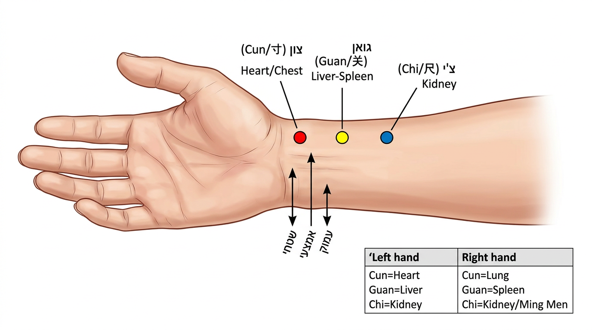

# אבחון דופק

## Pulse Diagnosis - Mai Zhen

---

## מטרות למידה

בסיום שיעור זה, הסטודנט יוכל:
1. לבצע נטילת דופק שיטתית על שלוש עמדות ובשלושה עומקים
2. לזהות את 28 סוגי הדופק הקלאסיים ואת משמעותם
3. לקשר עמדות דופק לאיברים פנימיים
4. להבין את המלכודות הנפוצות באבחון דופק
5. לתעד ממצאי דופק בצורה שיטתית

---

## 1. מבוא — השיטה המורכבת ביותר

אבחון הדופק הוא **השיטה המורכבת ביותר** ברפואה הסינית, ויחד עם אבחון הלשון מהווה את שני עמודי התווך של האבחון הפיזי. נדרשות **שנים של תרגול** לפיתוח רגישות אמיתית.

> (Qie Er Zhi Zhi Wei Zhi Qiao)
> "למשש ולדעת — זוהי מיומנות [במלאכת הרפואה]"
> — נאן ג'ינג, קושי 61

הטקסט הקלאסי הראשון שעסק בדופק באופן שיטתי הוא **מאי ג'ינג** של וואנג שו חה, מהמאה ה-3 לספירה.

---

## 2. כיצד לקחת דופק

### 2.1 הכנה

- **זמן אידיאלי**: בוקר, לפני מאמץ פיזי
- **המטופל**: יושב או שוכב, ידו מונחת בנוחות על כרית, כף היד כלפי מעלה
- **המטפל**: יושב מול המטופל (או לצדו), נושם רגוע
- **משך**: לפחות **דקה אחת** על כל יד (ולא 15 שניות כמו ברפואה המערבית)
- **סדר**: נהוג לבדוק קודם את יד ימין (אצל גברים) או שמאל (אצל נשים), אך הבדיקה חייבת לכלול את **שתי הידיים**

### 2.2 מיקום שלוש האצבעות

שלוש אצבעות המטפל (מורה, אמצעית, קמיצה) מונחות על העורק הרדיאלי בשלוש עמדות:

| עמדה | מיקום אנטומי |
|---|---|
| **צון** (Cun) | ליד קפל שורש כף היד, דיסטלי לתוצא הרדיוס (הסטיילואיד) |
| **גואן** (Guan) | על התוצא הסטיילואיד של הרדיוס |
| **צ'י** (Chi) | פרוקסימלי לתוצא הרדיוס |

**טיפ מעשי**: האצבע האמצעית מונחת ראשונה על **גואן** (ניתן למשש את הבליטה של הסטיילואיד), ואז המורה מונחת דיסטלית (צון) והקמיצה פרוקסימלית (צ'י).

### 2.3 שלושה עומקים

בכל עמדה, בודקים שלושה עומקי לחיצה:

| עומק | לחץ | מה מרגישים |
|---|---|---|
| **שטחי** (Fu) | לחץ קל — נוגעים בעור | רמת הווי צ'י, גורמים חיצוניים |
| **אמצעי** (Zhong) | לחץ בינוני | רמת הדם והצ'י |
| **עמוק** (Chen) | לחץ עד העצם | רמת האיברים (זאנג), ין |

---

## 3. התאמת עמדות לאיברים

| עמדה | יד שמאל | יד ימין |
|---|---|---|
| **צון** | לב (Xin) | ריאות (Fei) |
| **גואן** | כבד (Gan) | טחול (Pi) |
| **צ'י** | כליות-ין | כליות-יאנג / מינג מן |

**הערה**: ישנן שיטות שונות. השיטה הנ"ל היא הנפוצה ביותר, אך יש שיטות שמחליפות לב/ריאות או שונות בצ'י.



---

## 4. הדופק התקין (Ping Mai)

דופק תקין בריא הוא:
- **קצב**: 4-5 פעימות לכל נשימה (60-75 פעימות לדקה)
- **עוצמה**: בינונית — לא חזק מדי ולא חלש מדי
- **עומק**: מורגש בעומק בינוני בצורה הטובה ביותר
- **קצב**: סדיר
- **"צ'י קיבה"** (Wei Qi): תחושת רכות ושפיות — מעיד על בסיס בריא
- **"רוח"** (Shen): חיוניות בדופק — מעיד על שן תקין

דופק תקין משתנה עם:
- **עונות**: קצת שטחי ומתוח באביב, מלא וחזק בקיץ, שטחי בסתיו, עמוק בחורף
- **גיל**: חזק יותר בצעירים, חלש יותר בקשישים
- **מבנה גוף**: חזק יותר באנשים גדולים, עדין יותר ברזים
- **מאמץ**: מהיר יותר אחרי מאמץ
- **הריון**: חלקלק (הואה)

---

## 5. 28 סוגי הדופק הקלאסיים

### 5.1 דופקים לפי עומק

| דופק | תיאור | משמעות |
|---|---|---|
| **צף** | מורגש חזק בשטח, נחלש בעומק | התקפה חיצונית, או חסר ין |
| **שוקע/עמוק** | מורגש רק בלחיצה עמוקה | מחלה פנימית |
| **מוסתר** | מורגש רק בלחיצה חזקה מאוד עד העצם | סטגנציה חמורה, כאב חמור |

### 5.2 דופקים לפי קצב

| דופק | תיאור | משמעות |
|---|---|---|
| **איטי** | פחות מ-4 פעימות לנשימה (<60/דקה) | קור |
| **מהיר** | יותר מ-5 פעימות לנשימה (>90/דקה) | חום |
| **בינוני** | קצת איטי, רפוי | לחות, חסר טחול |

### 5.3 דופקים לפי עוצמה/נפח

| דופק | תיאור | משמעות |
|---|---|---|
| **ריק** | חלש בכל העומקים | חסר כללי |
| **מלא** | חזק בכל העומקים | עודף |
| **דק/חוטי** | כמו חוט דק — צר אך ברור | חסר דם, חסר ין |
| **גדול/רחב** | רחב, בולט | חום חמור, חסר מתקדם |
| **זעיר** | כמעט לא מורגש, דק וחלש | חסר חמור, קריסה |
| **חלול** | חזק בשטח ובעומק, ריק באמצע | אובדן דם |

### 5.4 דופקים לפי איכות

| דופק | תיאור | משמעות |
|---|---|---|
| **חלקלק** | כמו כדורון מתגלגל, חלק | פלגמה, לחות, מזון, הריון |
| **מחוספס/מעוכב** | לא חלק, כאילו "מגרד" | סטגנציית דם, חסר דם |
| **מתוח כמיתר** | כמו מיתר גיטרה — מתוח וישר | סטגנציית צ'י כבד, כאב |
| **הדוק** | כמו חבל מתוח מסובב | קור, כאב |
| **קצר** | מורגש רק בגואן, לא בצון ובצ'י | חסר צ'י, סטגנציה |
| **ארוך** | חורג מעבר לצון ולצ'י | עודף, בריאות חזקה |
| **חזק/עור** | שטחי, קשה, ריק בעומק | אובדן דם/ג'ינג, הפלה |
| **יציב** | עמוק, חזק, מתוח | קור פנימי, מסה פנימית |
| **מפוזר** | שטחי, לא ברור, ללא גבולות | קריסת צ'י, מצב חמור מאוד |
| **רך/ספוגי** | שטחי, דק, רך | לחות, חסר |
| **חלש** | עמוק, דק, רך | חסר צ'י ודם |
| **שעועית מסתובבת** | קצר, מהיר, מרגיש כמו פולסציה ממוקדת | פחד, כאב, הלם |

### 5.5 דופקים עם הפרעות קצב

| דופק | תיאור | משמעות |
|---|---|---|
| **קשור** | איטי עם הפסקות לא סדירות | קור, סטגנציית דם/צ'י |
| **לסירוגין** | הפסקות סדירות (כל X פעימות) | חסר איברים חמור, מצב חמור |
| **ממהר** | מהיר עם הפסקות לא סדירות | חום חמור, סטגנציית דם/פלגמה/מזון |

---

## 6. שילובי דופק נפוצים

| שילוב | משמעות קלינית |
|---|---|
| צף + מהיר | רוח-חום חיצוני |
| צף + איטי | רוח-קור חיצוני |
| צף + ריק | חסר ין (חום מעלה דופק לשטח) |
| שוקע + איטי | קור פנימי |
| שוקע + מתוח | סטגנציית צ'י כבד פנימית |
| דק + מהיר | חסר ין עם חום מחסר |
| חלקלק + מהיר | פלגמה-חום |
| מתוח + דק | חסר דם כבד |
| ריק + מהיר | חסר ין חמור |

---

## 7. נטילת דופק — טעויות נפוצות

| טעות | השפעה | תיקון |
|---|---|---|
| לחץ חזק מדי מהתחלה | מפספסים דופק שטחי | התחילו קל, הגבירו בהדרגה |
| בדיקה קצרה מדי | לא קולטים הפרעות קצב | לפחות דקה לכל יד |
| אצבעות צפופות מדי | לא מבחינים בין עמדות | התאימו מרחק לגודל יד המטופל |
| בדיקה אחרי מאמץ | דופק מהיר מלאכותי | המתינו 10-15 דקות מנוחה |
| אי-בדיקת שתי ידיים | מפספסים הבדלים חשובים | תמיד שתי ידיים |
| ציפייה למצוא דופק "קלאסי" | אכזבה, חוסר ביטחון | דופק אמיתי הוא ספקטרום, לא קטגוריה נוקשה |

---

## 8. דופק וסתירות אבחוניות

### 8.1 כאשר דופק ולשון סותרים

- **לשון חיוורת + דופק מהיר**: ייתכן חסר דם עם חום מחסר ין — הלשון מעידה על חסר דם, הדופק על חום שניוני
- **לשון אדומה + דופק איטי**: ייתכן חום פנימי כרוני עם קור חיצוני — יש לבדוק היטב

**כלל אצבע**: הלשון אמינה יותר למצבים כרוניים, הדופק למצבים חריפים.

---

## 9. תיעוד ממצאי דופק

### 9.1 פורמט תיעוד מומלץ

```
תאריך: ___________

יד שמאל:
  צון (לב): עומק: ___ קצב: ___ איכות: ___
  גואן (כבד): עומק: ___ קצב: ___ איכות: ___
  צ'י (כליות): עומק: ___ קצב: ___ איכות: ___

יד ימין:
  צון (ריאות): עומק: ___ קצב: ___ איכות: ___
  גואן (טחול): עומק: ___ קצב: ___ איכות: ___
  צ'י (מינגמן): עומק: ___ קצב: ___ איכות: ___

הערכה כללית: ___
קצב כללי: ___ פעימות/דקה
```

---

## 10. שאלות לחזרה

1. מהן שלוש העמדות ושלושת העומקים באבחון דופק?
2. פרט את התאמת העמדות לאיברים בשתי הידיים.
3. מה ההבדל בין דופק מתוח לדופק הדוק?
4. מה ההבדל בין דופק חלקלק למחוספס?
5. מטופל עם דופק צף ומהיר — מה הדפוס הסביר?
6. מדוע נדרשות שנים של תרגול לאבחון דופק?

---

## קריאה מומלצת

- Maciocia, G. *Diagnosis in Chinese Medicine* (פרקים 9-10)
- Li Shi Zhen, *Bin Hu Mai Xue* (קלאסיקת הדופק)
- Flaws, B. *The Secret of Chinese Pulse Diagnosis*

---

> **הערה**: אל תתייאשו. בתחילת הדרך, כל הדופקים מרגישים אותו דבר. זה **נורמלי**. התחילו מהבחנות בסיסיות: צף/שוקע, מהיר/איטי, חזק/חלש. עם הזמן, האצבעות מתחדדות. תרגלו על כל מי שמוכן — חברים, משפחה, עצמכם. כל פעימה שתרגישו מביאה אתכם צעד אחד קדימה.

---

## ניווט

- **הקודם**: [שאילה](04-inquiry.md) | **הבא**: [אבחון בטני](06-abdominal-diagnosis.md)
- **חזרה למודול**: [מודול 7 — אבחון](README.md)
- **ראה גם**: [מדריך תרגול דופק](practical/pulse-practice-guide.md) | [כלי אבחון](../../diagnostic-tool/README.md)
