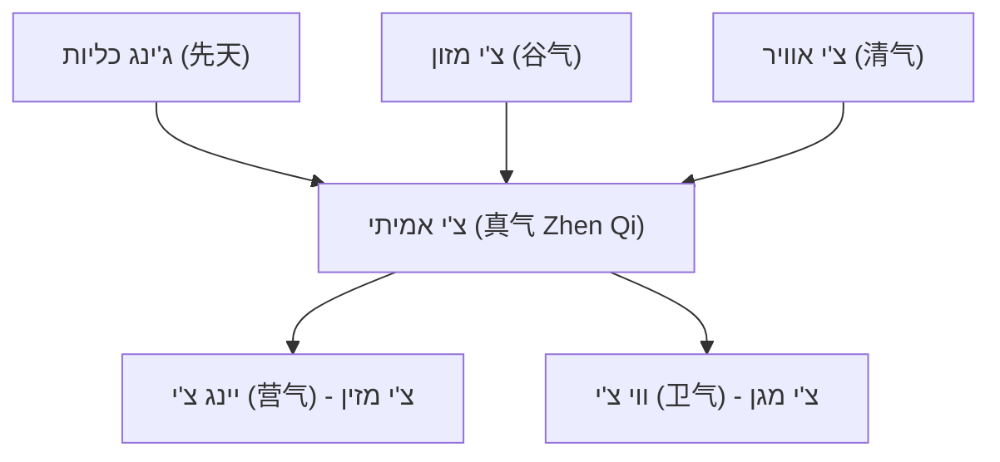
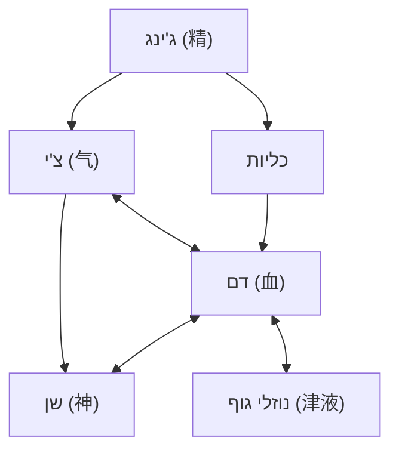
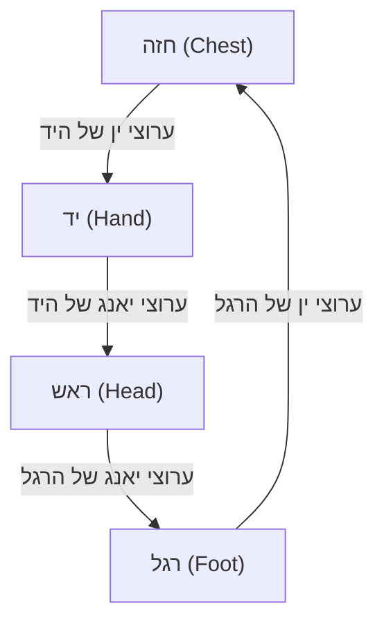

# Year 1 - Foundations (Acupuncture Course)

_Merged from: `year-1-foundations` - 36 file(s)_

---

## Source: `module-01-philosophy/01-intro-to-tcm.md`

<div dir="rtl">

# מבוא לרפואה הסינית המסורתית

## Traditional Chinese Medicine - Introduction

---

## מטרות למידה

בסיום שיעור זה, הסטודנט יוכל:
1. לתאר את מקורות הרפואה הסינית המסורתית והתפתחותה לאורך אלפי שנים
2. להסביר את ההבדלים המהותיים בין הגישה ההוליסטית של הרפואה הסינית לגישה הרדוקציוניסטית של הרפואה המערבית
3. לזהות את הטקסטים הקלאסיים המרכזיים ולהבין את חשיבותם
4. להסביר את מושג השלמות - הקשר בין גוף, נפש ורוח
5. להכיר את תפקיד הדאו (道 Dao) והחוק הטבעי ברפואה

---

## 1. מקורות הרפואה הסינית המסורתית

### 1.1 שורשים היסטוריים

הרפואה הסינית המסורתית (Traditional Chinese Medicine - TCM) היא אחת ממערכות הרפואה העתיקות ביותר בעולם, עם מסורת רצופה של למעלה מ-5,000 שנה. שלא כמו מערכות רפואיות עתיקות אחרות שנעלמו או התמזגו ברפואה המודרנית, הרפואה הסינית שימרה את עקרונותיה הבסיסיים תוך התפתחות מתמדת.

המסורת הסינית מייחסת את ראשיתה של הרפואה לשלושה קיסרים אגדיים:

- **פו שי (伏羲 Fu Xi)** - מיוחס לו פיתוח שמונת הטריגרמות (八卦 Ba Gua), הבסיס לתורת ין-יאנג
- **שן נונג (神农 Shen Nong)** - "אבי החקלאות והפרמקולוגיה", מייסד הרוקחות הסינית. לפי המסורת, טעם מאות צמחים על עצמו כדי לקבוע את תכונותיהם הרפואיות
- **הואנג די (黄帝 Huang Di)** - "הקיסר הצהוב", שלפי המסורת ניהל את הדיאלוגים הרפואיים המתועדים ב"קלאסיקה הפנימית של הקיסר הצהוב"

### 1.2 תקופות מרכזיות בהתפתחות הרפואה הסינית

#### תקופת שושלת שאנג (商朝, 1600-1046 לפנה"ס)
- עדויות ארכיאולוגיות ראשונות לשימוש במחטי דיקור מעצם ואבן
- כתובות על עצמות אורקל המתארות מחלות וטיפולים

#### תקופת המלחמות (战国时期, 475-221 לפנה"ס)
- תקופת פריחה אינטלקטואלית שהניבה את הטקסטים הפילוסופיים הגדולים
- התגבשות עקרונות הדאואיזם והקונפוציאניזם שהשפיעו על התפתחות הרפואה
- חיבור חלקים מוקדמים של ה"הואנג די ניי ג'ינג" (黄帝内经)

#### שושלת האן (汉朝, 206 לפנה"ס - 220 לספירה)
- תור הזהב של הרפואה הסינית
- **ג'אנג ג'ונג ג'ינג (张仲景 Zhang Zhong Jing)** - מחבר ה"שאנג האן לון" (伤寒论), אבי הרפואה הקלינית הסינית
- **הואה טואו (华佗 Hua Tuo)** - רופא מפורסם, חלוץ ההרדמה וה"תרגילי חמשת בעלי החיים" (五禽戏 Wu Qin Xi)

#### שושלת טאנג (唐朝, 618-907)
- **סון סה מיאו (孙思邈 Sun Si Miao)** - "מלך הרפואה", מחבר "מרשמים שווים אלף זהב" (千金方 Qian Jin Fang)
- פיתוח מערכת שיטתית של נקודות דיקור וערוצים

#### שושלת סונג עד מינג (960-1644)
- שיטתיות של ידע רפואי מצטבר
- **לי שי ג'ן (李时珍 Li Shi Zhen)** - מחבר "קומפנדיום המטריה מדיקה" (本草纲目 Ben Cao Gang Mu) המונה 1,892 חומרי מרפא

### 1.3 דמויות מפתח נוספות

| שם | תקופה | תרומה עיקרית |
|---|---|---|
| ביאן צ'ואה (扁鹊) | המאה ה-5 לפנה"ס | אבי הדיאגנוסטיקה, פיתח אבחון דופק |
| הואנג פו מי (皇甫谧) | 215-282 | חיבר את "הקלאסיקה השיטתית של הדיקור" (针灸甲乙经) |
| וואנג שו חה (王叔和) | המאה ה-3 | כתב את "קלאסיקת הדופק" (脉经 Mai Jing) |

---

## 2. עקרונות יסוד - ההבדל בין רפואה סינית לרפואה מערבית

### 2.1 גישה הוליסטית מול גישה רדוקציוניסטית

הרפואה המערבית (ביו-רפואה) מבוססת על גישה **רדוקציוניסטית** - פירוק הגוף למערכות, איברים, רקמות, תאים ומולקולות. היא מחפשת את הגורם הספציפי למחלה ומטפלת בו באופן ממוקד.

הרפואה הסינית מבוססת על גישה **הוליסטית (整体观念 Zheng Ti Guan Nian)** - התבוננות בגוף כמערכת שלמה ומאוחדת, שאינה ניתנת לחלוקה לחלקים מבודדים. כל חלק משפיע על השלם, והשלם משפיע על כל חלק.

### 2.2 השוואה בין הגישות

| היבט | רפואה סינית (TCM) | רפואה מערבית |
|---|---|---|
| **מוקד** | האדם השלם | המחלה הספציפית |
| **אבחנה** | זיהוי דפוסים (辨证 Bian Zheng) | זיהוי מחלה (Diagnosis) |
| **טיפול** | שיקום האיזון | חיסול הגורם |
| **גישה לסימפטומים** | ביטוי של חוסר איזון מערכתי | סממנים של מחלה מוגדרת |
| **תפקיד המטופל** | שותף פעיל, אחראי על אורח חייו | מקבל טיפול פסיבי |
| **מניעה** | דגש מרכזי - "טיפול לפני שהמחלה מגיעה" | משני לטיפול |
| **פרדיגמה** | אנרגטית-פונקציונלית | חומרית-מבנית |

### 2.3 "רפואה טובה מרפאה לפני שהמחלה מגיעה"

עיקרון מרכזי ברפואה הסינית הוא:

> 上工治未病 (Shang Gong Zhi Wei Bing)
> "הרופא המעולה מטפל במה שטרם הפך למחלה"

משמעות עיקרון זה היא שהרפואה הסינית שמה דגש עצום על **מניעה**, על שמירת האיזון ועל טיפול בסימנים הראשוניים של חוסר הרמוניה, הרבה לפני שאלה מתפתחים למחלה ממשית.

---

## 3. מושג השלמות - גוף, נפש ורוח

### 3.1 אחדות גוף-נפש (形神合一 Xing Shen He Yi)

ברפואה הסינית, אין הפרדה בין הגוף (形 Xing) לנפש/רוח (神 Shen). הם שני היבטים של מציאות אחת:

- **הגוף הפיזי** מספק את הבסיס החומרי לקיום הרוח
- **הרוח** מעניקה חיוּת, תודעה וכוונה לגוף הפיזי
- שינוי באחד משפיע באופן ישיר על השני

### 3.2 אחדות האדם והטבע (天人合一 Tian Ren He Yi)

עיקרון יסוד נוסף הוא שהאדם הוא **מיקרוקוסמוס** - עולם קטן המשקף את המאקרוקוסמוס (היקום הגדול):

- עונות השנה משפיעות על תפקודי הגוף
- שעות היום מקבילות לפעילות איברים שונים (שעון האיברים)
- מזג האוויר והאקלים משפיעים על הבריאות
- האדם צריך לחיות בהרמוניה עם הטבע כדי לשמור על בריאותו

### 3.3 רגשות ובריאות

הרפואה הסינית מזהה קשר ישיר בין רגשות לאיברים פנימיים:

- **כעס (怒 Nu)** → פוגע בכבד (肝 Gan)
- **שמחה יתרה (喜 Xi)** → פוגעת בלב (心 Xin)
- **דאגה (忧 You)** → פוגעת בריאות (肺 Fei)
- **הרהור יתר (思 Si)** → פוגע בטחול (脾 Pi)
- **פחד (恐 Kong)** → פוגע בכליות (肾 Shen)

---

## 4. הרפואה הסינית כמסורת חיה

### 4.1 התפתחות מתמדת

הרפואה הסינית אינה מערכת סטטית שנשארה קפואה מלפני אלפי שנים. היא התפתחה באופן מתמיד:

- **תקופה קלאסית**: התגבשות העקרונות הבסיסיים
- **תקופת ביניים**: התמחות בתחומים שונים, פיתוח שיטות חדשות
- **תקופה מודרנית**: אינטגרציה עם רפואה מערבית, מחקר מדעי

### 4.2 רפואה סינית בעולם המודרני

כיום הרפואה הסינית:
- מוכרת על ידי ארגון הבריאות העולמי (WHO)
- נלמדת באוניברסיטאות ברחבי העולם
- נחקרת במחקרים קליניים מבוקרים
- משולבת במערכות בריאות ממשלתיות במדינות רבות
- בשנת 2010, הדיקור הסיני הוכר כמורשת תרבותית בלתי מוחשית על ידי אונסק"ו

---

## 5. הטקסטים הקלאסיים

### 5.1 הואנג די ניי ג'ינג (黄帝内经) - "הקלאסיקה הפנימית של הקיסר הצהוב"

זהו **הטקסט המכונן** של הרפואה הסינית, שחובר ככל הנראה בין המאה ה-3 לפנה"ס למאה ה-2 לספירה. הוא מורכב משני חלקים:

1. **סו וון (素问 Su Wen)** - "שאלות פשוטות": עוסק בתיאוריה הבסיסית - ין-יאנג, חמשת האלמנטים, אנטומיה, פיזיולוגיה, מניעה, אבחון וטיפול
2. **לינג שו (灵枢 Ling Shu)** - "ציר רוחני": מתמקד בדיקור - ערוצים, נקודות, טכניקות דיקור, ופיזיולוגיה אנרגטית

הטקסט מובנה כדיאלוג בין הקיסר הצהוב (黄帝 Huang Di) לבין רופאו צ'י בו (岐伯 Qi Bo).

**ציטוט מפתח:**
> "陰陽者，天地之道也，萬物之綱紀，變化之父母，生殺之本始"
> "ין ויאנג הם הדאו של שמיים וארץ, העיקרון המארגן של כל הדברים, אב ואם של כל שינוי, שורש ותחילה של חיים ומוות"
> — סו וון, פרק 5

### 5.2 נאן ג'ינג (难经) - "קלאסיקת הקשיים"

נכתב ככל הנראה במאה ה-1-2 לספירה, ומיוחס לביאן צ'ואה (扁鹊 Bian Que). הספר מורכב מ-81 "קשיים" (שאלות ותשובות) ומבהיר ומרחיב נושאים שנידונו בהואנג די ניי ג'ינג, בדגש על:

- אבחון דופק מפורט
- תיאוריית הערוצים
- מערכת נקודות "שו" (五输穴 Wu Shu Xue) של חמשת האלמנטים
- תיאוריית "שער החיים" (命门 Ming Men)

### 5.3 שאנג האן לון (伤寒论) - "דיון על נזקי הקור"

נכתב על ידי **ג'אנג ג'ונג ג'ינג (张仲景 Zhang Zhong Jing)** סביב שנת 220 לספירה. זהו הטקסט הקליני הראשון שמציג גישה שיטתית לאבחון וטיפול:

- מתאר **ששת הערוצים** (六经 Liu Jing) כמודל לאבחון מחלות חיצוניות
- מציג מאות נוסחאות צמחים, רבות מהן בשימוש עד היום
- מהווה את הבסיס לפרמקולוגיה הסינית הקלינית

### 5.4 טקסטים חשובים נוספים

| טקסט | מחבר | תקופה | נושא |
|---|---|---|---|
| שן נונג בן צאו ג'ינג (神农本草经) | — | שושלת האן | פרמקולוגיה - 365 חומרי מרפא |
| ג'ן ג'יו ג'יה יי ג'ינג (针灸甲乙经) | הואנג פו מי | 282 | דיקור שיטתי |
| בי הו לון (脾胃论) | לי דונג יואן | 1249 | בית הספר של הטחול והקיבה |
| וון בינג טיאו ביאן (温病条辨) | וו ג'ו טונג | 1798 | מחלות חום |

---

## 6. הדאו (道) והחוק הטבעי ברפואה

### 6.1 מהו הדאו?

הדאו (道 Dao) פירושו המילולי הוא "הדרך". בפילוסופיה הסינית, הדאו מתאר את:
- העיקרון הבסיסי שעומד מאחורי כל מה שקיים
- הסדר הטבעי של היקום
- התהליך המתמיד של שינוי והתהוות

**לאו דזה (老子 Lao Zi)** כתב בספרו "דאו דה ג'ינג" (道德经):
> "道生一，一生二，二生三，三生万物"
> "הדאו מוליד את האחד, האחד מוליד את השניים, השניים מולידים את השלושה, והשלושה מולידים את עשרת אלפי הדברים"

### 6.2 הדאו ברפואה

ברפואה הסינית, הדאו מתבטא בעקרונות הבאים:

1. **החוק הטבעי (自然 Zi Ran)**: הגוף פועל על פי חוקי הטבע. רפואה טובה תומכת בתהליכים הטבעיים ואינה עובדת נגדם
2. **האיזון (平衡 Ping Heng)**: בריאות היא מצב של איזון דינמי. מחלה היא חוסר איזון
3. **הזרימה (流通 Liu Tong)**: חיים הם תנועה. כאשר הזרימה חופשית - יש בריאות. כאשר יש חסימה - מופיעה מחלה
4. **ההתאמה (适应 Shi Ying)**: הטיפול חייב להיות מותאם לאדם הספציפי, לעונה, למקום ולנסיבות

### 6.3 עקרון "וו ווי" (无为) ברפואה

"וו ווי" פירושו "פעולה ללא כפייה" או "פעולה בהרמוניה עם הטבע". ברפואה, עיקרון זה מתורגם ל:
- לא לכפות שינוי אלא לתמוך ביכולת הריפוי הטבעית של הגוף
- להשתמש במינימום ההתערבות הנדרשת
- לעבוד עם הגוף ולא נגדו

---

## 7. עקרונות הליבה של הרפואה הסינית - סיכום

### שבעת עקרונות היסוד:

1. **הוליזם (整体观念 Zheng Ti Guan Nian)** - הגוף הוא שלם אחד
2. **ין-יאנג (阴阳 Yin Yang)** - כל דבר מכיל שני כוחות משלימים
3. **חמשת האלמנטים (五行 Wu Xing)** - חמשת התהליכים הבסיסיים בטבע
4. **צ'י (气 Qi)** - אנרגיית החיים שמניעה את הכל
5. **ערוצים ונקודות (经络 Jing Luo)** - רשת האנרגיה בגוף
6. **אבחון דפוסים (辨证论治 Bian Zheng Lun Zhi)** - טיפול המבוסס על זיהוי דפוסים אישיים
7. **מניעה (治未病 Zhi Wei Bing)** - טיפול לפני שהמחלה מתפתחת

---

## 8. שאלות לחזרה

1. תאר בקצרה את ההיסטוריה של הרפואה הסינית - אילו תקופות מרכזיות ודמויות מפתח השפיעו על התפתחותה?
2. מהם שלושת הקיסרים האגדיים ומה תרומתם לפי המסורת?
3. הסבר את ההבדלים העיקריים בין הגישה ההוליסטית של הרפואה הסינית לגישה הרדוקציוניסטית של הרפואה המערבית.
4. מהו העיקרון "上工治未病"? כיצד הוא מתבטא בפרקטיקה הקלינית?
5. תאר את הטקסטים הקלאסיים המרכזיים: מי כתב אותם, מתי, ומה תוכנם?
6. כיצד מושג הדאו (道) משפיע על הגישה הרפואית הסינית?
7. מהו עיקרון "אחדות האדם והטבע" (天人合一) וכיצד הוא בא לידי ביטוי ברפואה?
8. מדוע הרפואה הסינית מתוארת כ"מסורת חיה"? תן דוגמאות.

---

## קריאה מומלצת

- Maciocia, G. *The Foundations of Chinese Medicine* (פרק 1)
- Unschuld, P. *Huang Di Nei Jing Su Wen* (מבוא)
- Kaptchuk, T. *The Web That Has No Weaver* (פרקים 1-2)

---

> **הערה**: שיעור זה מהווה בסיס לכל הלימודים הבאים. הקפידו להבין את העקרונות שנדונו כאן לעומק, מכיוון שהם חוזרים ונשנים בכל היבטי הרפואה הסינית.

---

## ניווט

- **הבא**: [תורת ין-יאנג](02-yin-yang-theory.md)
- **חזרה למודול**: [מודול 1 — פילוסופיה](README.md)
- **ראה גם**: [מערכת המרידיאנים](../module-02-meridians/01-meridian-system.md) — הרשת שדרכה זורם הצ'י | [זיהוי דפוסים](../../year-2-intermediate/module-06-pathology/01-pattern-identification.md) — כשעקרונות אלו מופרים

---

## Source: `module-01-philosophy/02-yin-yang-theory.md`

<div dir="rtl">

# תורת ין-יאנג (阴阳)

## Yin-Yang Theory

---

## מטרות למידה

בסיום שיעור זה, הסטודנט יוכל:
1. להסביר את המקורות הפילוסופיים של תורת ין-יאנג
2. לתאר את ארבעת ההיבטים של יחסי ין-יאנג
3. ליישם את תורת ין-יאנג על מבנה הגוף ותפקודיו
4. לנתח דפוסי מחלה באמצעות ין-יאנג
5. להסביר כיצד עקרונות ין-יאנג מנחים אבחון וטיפול

---

## 1. מקורות ופילוסופיה של ין-יאנג

### 1.1 מקורות היסטוריים

תורת ין-יאנג (阴阳 Yin Yang) היא אחד מעמודי התווך של הפילוסופיה הסינית ושל הרפואה הסינית. שורשיה נעוצים בתצפית עתיקה על הטבע:

- **ין (阴)** - פירושו המילולי "הצד המוצל של ההר" - מייצג חושך, קור, מנוחה, פנימיות
- **יאנג (阳)** - פירושו המילולי "הצד המואר של ההר" - מייצג אור, חום, פעילות, חיצוניות

המושג מופיע לראשונה ב"ספר השינויים" (易经 Yi Jing), אחד הטקסטים העתיקים ביותר בתרבות הסינית (כ-1000 לפנה"ס), ופותח בהרחבה ב"הואנג די ניי ג'ינג" (黄帝内经).

### 1.2 סמל הטאי ג'י (太极)


סמל הטאי ג'י (☯) מבטא באופן ויזואלי את מהות תורת ין-יאנג:
- **העיגול** מייצג את השלם, את האחדות
- **שני החלקים** המתעקלים מראים שין ויאנג תמיד בתנועה
- **הנקודה הלבנה בשחור והנקודה השחורה בלבן** מראות שבתוך כל ין יש יאנג, ובתוך כל יאנג יש ין
- **הקו המתעקל** (לא ישר!) מראה שהגבול בין ין ויאנג דינמי ומשתנה

### 1.3 עקרון יסוד

> "阴阳者，天地之道也" (Yin Yang Zhe, Tian Di Zhi Dao Ye)
> "ין ויאנג הם הדאו של שמיים וארץ"
> — הואנג די ניי ג'ינג, סו וון פרק 5

ין ויאנג אינם "דברים" אלא **יחסים**. שום דבר אינו ין או יאנג באופן מוחלט - הכל תלוי בנקודת ההשוואה. לדוגמה: מים הם ין ביחס לאש, אבל יאנג ביחס לקרח.

---

## 2. ארבעת ההיבטים של יחסי ין-יאנג

### 2.1 ניגודיות (对立 Dui Li) - Opposition

ין ויאנג הם כוחות **מנוגדים** המגדירים זה את זה:

- אין חום ללא קור
- אין אור ללא חושך
- אין פעילות ללא מנוחה
- אין חיצוני ללא פנימי

**בגוף**: ללא הקור (ין) שמאזן את החום (יאנג), הגוף היה נשרף. ללא החום שמאזן את הקור, הגוף היה קופא.

**משמעות קלינית**: כאשר ישנה עודפות של צד אחד, מופיעים סימפטומים של חוסר איזון. למשל, עודף חום (יאנג) מתבטא בחום גוף, צמא, עור אדום, דופק מהיר.

### 2.2 תלות הדדית (互根 Hu Gen) - Interdependence

ין ויאנג **תלויים זה בזה** - אף אחד אינו יכול להתקיים ללא השני:

- ללא יום אין משמעות ללילה
- ללא חומר (ין) אין תפקוד (יאנג), וללא תפקוד אין צורך בחומר
- ללא מנוחה (ין) אין אנרגיה לפעולה (יאנג)

**בגוף**: 
- הדם (ין) מזין את הצ'י (יאנג), והצ'י מניע את הדם
- המבנה של האיברים (ין) מאפשר את התפקוד (יאנג), והתפקוד שומר על המבנה
- ללא ג'ינג (精, ין) אין שן (神, יאנג)

**משמעות קלינית**: כאשר ין נפגע לאורך זמן, גם יאנג ייפגע בסופו של דבר (ולהפך). לדוגמה, דימום כבד (אובדן דם/ין) יוביל בסופו של דבר לחולשת צ'י (יאנג).

### 2.3 צריכה הדדית (消长 Xiao Zhang) - Mutual Consumption

ין ויאנג נמצאים **באיזון דינמי** - כאשר אחד עולה, השני יורד:

- כאשר היום מתארך (יאנג עולה), הלילה מתקצר (ין יורד)
- כאשר הפעילות (יאנג) עולה, רזרבות האנרגיה (ין) יורדות
- כאשר חום הגוף (יאנג) עולה, נוזלי הגוף (ין) יורדים (הזעה)

**ארבעה מצבים פתולוגיים:**

| מצב | תיאור | דוגמה קלינית |
|---|---|---|
| עודף ין (阴盛) | ין עולה → יאנג יחסית נמוך | קור פנימי, שלשול, חיוורון |
| עודף יאנג (阳盛) | יאנג עולה → ין יחסית נמוך | חום, צמא, עצבנות, פנים אדומות |
| חסר ין (阴虚) | ין יורד → יאנג יחסית גבוה | חום בלילה, הזעות לילה, יובש |
| חסר יאנג (阳虚) | יאנג יורד → ין יחסית גבוה | קרירות, עייפות, חיוורון, שתן בהיר |

### 2.4 טרנספורמציה הדדית (转化 Zhuan Hua) - Mutual Transformation

בתנאים מסוימים, ין ויאנג **מתהפכים** - ין הופך ליאנג ולהפך:

- חצות (ין מקסימלי) → תחילת עלייה של יאנג
- צהריים (יאנג מקסימלי) → תחילת עלייה של ין
- קיץ → סתיו → חורף
- מים רותחים → קיטור

**בגוף**:
- חום גבוה (יאנג) שנמשך זמן רב עלול לגרום לקריסה פתאומית - גפיים קרות, הזעה קרה (תופעת ין)
- דלקת כרונית (יאנג) שלא מטופלת עלולה להפוך לניוון (ין)
- מחלה חריפה (יאנג) עלולה להפוך לכרונית (ין)

**העיקרון**: "物极必反" (Wu Ji Bi Fan) - "כאשר דבר מגיע לקיצוניות, הוא בהכרח מתהפך"

---

## 3. ין-יאנג בגוף האדם

### 3.1 איברים

**איברי צאנג (脏 Zang) - ין:**
אלה איברים מלאים (Solid), שתפקידם לייצר, לאחסן ולווסת חומרים חיוניים:
- כבד (肝 Gan)
- לב (心 Xin)
- טחול (脾 Pi)
- ריאות (肺 Fei)
- כליות (肾 Shen)
- פריקרד (心包 Xin Bao)

**איברי פו (腑 Fu) - יאנג:**
אלה איברים חלולים (Hollow), שתפקידם לקבל, לעכל ולהוציא:
- כיס מרה (胆 Dan)
- מעי דק (小肠 Xiao Chang)
- קיבה (胃 Wei)
- מעי גס (大肠 Da Chang)
- שלפוחית שתן (膀胱 Pang Guang)
- סאן ג'יאו (三焦 San Jiao) - "המחמם המשולש"

### 3.2 אזורי הגוף

| יאנג (阳) | ין (阴) |
|---|---|
| חלק עליון (ראש, חזה) | חלק תחתון (בטן, רגליים) |
| חלק חיצוני (עור, שרירים) | חלק פנימי (איברים) |
| גב (背 Bei) | חזית (腹 Fu) |
| צד לטרלי (חיצוני) | צד מדיאלי (פנימי) |

### 3.3 חומרים חיוניים

| יאנג (阳) | ין (阴) |
|---|---|
| צ'י (气 Qi) | דם (血 Xue) |
| ווי צ'י (卫气 Wei Qi) - צ'י מגן | יינג צ'י (营气 Ying Qi) - צ'י מזין |
| יאנג צ'י (פעילות, חימום) | ג'ינג (精 Jing) - תמצית |
| — | ג'ין יה (津液 Jin Ye) - נוזלי גוף |

---

## 4. ין-יאנג בפיזיולוגיה

### 4.1 חילוף חומרים

- **תהליכים אנבוליים** (בנייה, אחסון) = **ין**
- **תהליכים קטבוליים** (פירוק, שחרור אנרגיה) = **יאנג**
- בריאות = איזון בין שני התהליכים

### 4.2 ויסות חום

- **חום הגוף** = יאנג צ'י (שריפת מזון, פעילות מטבולית)
- **קירור הגוף** = ין (נוזלי גוף, דם, הזעה)
- חום תקין = איזון בין ייצור חום (יאנג) לפיזור חום (ין)

### 4.3 פעילות ומנוחה

- **פעילות, ערנות, תנועה** = יאנג
- **מנוחה, שינה, הרפיה** = ין
- מחזור יום/לילה (昼夜 Zhou Ye): יאנג שולט ביום, ין שולט בלילה
- הפרעות שינה = חוסר איזון ין-יאנג

### 4.4 מערכת העצבים (בהקשר מודרני)

- **מערכת העצבים הסימפתטית** (fight or flight) = יאנג
- **מערכת העצבים הפאראסימפתטית** (rest and digest) = ין

---

## 5. ין-יאנג בפתולוגיה

### 5.1 ארבעה דפוסי חוסר איזון בסיסיים

#### א. עודף יאנג (阳盛 Yang Sheng) - Full Heat
- **סיבה**: גורם פתוגני חם חודר לגוף
- **סימנים**: חום, צמא, פנים אדומות, עצבנות, עצירות, שתן צהוב כהה
- **לשון**: אדומה עם ציפוי צהוב
- **דופק**: מהיר (数 Shuo), מלא (洪 Hong)
- **עיקרון טיפולי**: לפנות חום (清热 Qing Re)

#### ב. עודף ין (阴盛 Yin Sheng) - Full Cold
- **סיבה**: גורם פתוגני קר חודר לגוף
- **סימנים**: תחושת קור, גפיים קרות, שלשול, כאבי בטן, שתן בהיר ושופע
- **לשון**: חיוורת עם ציפוי לבן ולח
- **דופק**: איטי (迟 Chi), מלא
- **עיקרון טיפולי**: לחמם ולפזר קור (温散寒邪 Wen San Han Xie)

#### ג. חסר ין (阴虚 Yin Xu) - Yin Deficiency
- **סיבה**: שחיקת ין לאורך זמן (מחלה כרונית, עבודת יתר, גיל)
- **סימנים**: חום בלילה, הזעות לילה, יובש (עור, פה, גרון), חום בכפות ידיים ורגליים (五心烦热 Wu Xin Fan Re)
- **לשון**: אדומה, יבשה, ללא ציפוי או ציפוי מועט
- **דופק**: דק (细 Xi), מהיר
- **עיקרון טיפולי**: לזין את הין (滋阴 Zi Yin)

#### ד. חסר יאנג (阳虚 Yang Xu) - Yang Deficiency
- **סיבה**: שחיקת יאנג לאורך זמן
- **סימנים**: קרירות כללית, עייפות, חיוורון, חוסר חשק, שתן בהיר ושופע, שלשול
- **לשון**: חיוורת, נפוחה, עם סימני שיניים בצדדים
- **דופק**: עמוק (沉 Chen), איטי (迟 Chi), חלש (弱 Ruo)
- **עיקרון טיפולי**: לחמם ולחזק יאנג (温阳 Wen Yang)

### 5.2 התפתחות פתולוגית

```
חסר ין ממושך → ין לא יכול לעגן את יאנג → יאנג "צף" למעלה → סימני חום כזב למעלה + קור אמיתי למטה

חסר יאנג ממושך → יאנג לא יכול לאדות נוזלים → הצטברות רטיבות ולחות → בצקות, כבדות
```

### 5.3 קריסת ין ויאנג

- **קריסת ין (阴脱 Yin Tuo)**: אובדן נוזלים חמור - הזעה שופעת, צמא עז, עור יבש חם, דופק דק ומהיר
- **קריסת יאנג (阳脱 Yang Tuo)**: קריסה אנרגטית - הזעה קרה, גפיים קרות, פנים חיוורות, דופק חלש עד נעלם

---

## 6. ין-יאנג באבחון ובטיפול

### 6.1 שמונת העקרונות (八纲 Ba Gang)

ין-יאנג הם הבסיס ל"שמונת העקרונות" של האבחון הסיני:

| ין (阴) | יאנג (阳) |
|---|---|
| פנימי (里 Li) | חיצוני (表 Biao) |
| קור (寒 Han) | חום (热 Re) |
| חסר (虚 Xu) | עודף (实 Shi) |

### 6.2 עקרונות טיפול על בסיס ין-יאנג

| מצב | עיקרון טיפולי | דוגמה |
|---|---|---|
| עודף יאנג | להפחית יאנג (泻阳) | לפנות חום, להוריד אש |
| עודף ין | להפחית ין (泻阴) | לחמם, לייבש רטיבות |
| חסר יאנג | לחזק יאנג (补阳) | לחמם כליות, לחזק טחול-יאנג |
| חסר ין | לחזק ין (补阴) | לזין ין של כליות, כבד, ריאות |

### 6.3 דוגמאות קליניות

**מקרה 1: מטופלת, בת 45, מתלוננת על:**
- גלי חום בלילה, הזעות לילה
- יובש בפה ובגרון
- חום בכפות ידיים ורגליים
- נדודי שינה
- **אבחנה**: חסר ין (阴虚)
- **עיקרון טיפולי**: לזין את הין, לצנן חום ריק

**מקרה 2: מטופל, בן 60, מתלונן על:**
- קרירות מתמדת, במיוחד בגב התחתון וברכיים
- עייפות, חוסר מוטיבציה
- שתן בהיר ושופע, במיוחד בלילה
- שלשול בשעות הבוקר המוקדמות
- **אבחנה**: חסר יאנג של הכליות (肾阳虚)
- **עיקרון טיפולי**: לחמם ולחזק יאנג הכליות

---

## 7. טבלת התאמות ין-יאנג מקיפה

| קטגוריה | ין (阴) | יאנג (阳) |
|---|---|---|
| **טבע** | ירח | שמש |
| **עונה** | סתיו, חורף | אביב, קיץ |
| **זמן** | לילה | יום |
| **טמפרטורה** | קור | חום |
| **כיוון** | מטה, פנימה | מעלה, החוצה |
| **תנועה** | מנוחה, שקט | פעילות, תנועה |
| **מצב חומר** | נוזלי, מוצק | גזי |
| **אור** | חושך | אור |
| **משקל** | כבד | קל |
| **גוף - אזור** | חלק תחתון, פנימי, חזית | חלק עליון, חיצוני, גב |
| **גוף - איברים** | צאנג (脏) - מלאים | פו (腑) - חלולים |
| **גוף - חומרים** | דם, ג'ינג, נוזלים | צ'י, יאנג-צ'י |
| **גוף - רקמות** | עצמות, מח, דם | עור, שרירים, גידים |
| **תפקוד** | אחסון, הזנה, לחלוח | הגנה, חימום, תנועה |
| **מחלה** | כרונית, פנימית, קרה | חריפה, חיצונית, חמה |
| **דופק** | עמוק, איטי, חלש | שטחי, מהיר, מלא |
| **לשון** | חיוורת, רטובה, נפוחה | אדומה, יבשה |
| **רגש** | פחד, עצב | כעס, שמחה |
| **טעם** | מלוח, חמוץ, מר | חריף, מתוק |
| **מספרים** | זוגיים | אי-זוגיים |

---

## 8. תרגילים

### תרגיל 1: זיהוי ין-יאנג
סווגו כל אחד מהבאים כין או יאנג (הסבירו):
א. שינה  
ב. ריצה  
ג. דם  
ד. הגנה חיסונית  
ה. עצמות  
ו. הזעה  

### תרגיל 2: ניתוח דפוסים
מטופל מדווח על: עייפות קשה, קרירות בגפיים, פנים חיוורות, שלשול, שתן בהיר ושופע.
א. האם זהו מצב של ין או יאנג?
ב. האם מדובר בעודף או בחסר?
ג. מהו עיקרון הטיפול?

### תרגיל 3: הקשרים בין ארבעת ההיבטים
הסבירו כיצד ארבעת ההיבטים של ין-יאנג (ניגודיות, תלות הדדית, צריכה הדדית, טרנספורמציה) באים לידי ביטוי בתופעה הבאה: מחזור עונות השנה.

### תרגיל 4: מקרה קליני
אישה בת 52 מתלוננת על: גלי חום, הזעות לילה, עצבנות, נדודי שינה, יובש בפה, סחרחורת. הלשון אדומה ויבשה, הדופק דק ומהיר.
א. נתחו את הממצאים במונחי ין-יאנג
ב. מהי האבחנה הסינית?
ג. מהו עיקרון הטיפול?

---

## קריאה מומלצת

- Maciocia, G. *The Foundations of Chinese Medicine* (פרק 2)
- הואנג די ניי ג'ינג, סו וון, פרקים 5-7
- Kaptchuk, T. *The Web That Has No Weaver* (פרק 4)

---

> **נקודה למחשבה**: ין-יאנג אינם רק מושג תיאורטי - הם כלי קליני חיוני. בכל מפגש עם מטופל, השאלה הראשונה היא: "האם המצב הזה הוא ין או יאנג?" התשובה מכוונת את כל תהליך האבחון והטיפול.

---

## ניווט

- **הקודם**: [מבוא לרפואה הסינית](01-intro-to-tcm.md) | **הבא**: [חמשת האלמנטים](03-five-elements.md)
- **חזרה למודול**: [מודול 1 — פילוסופיה](README.md)
- **ראה גם**: [שמונת העקרונות](../../year-2-intermediate/module-06-pathology/02-eight-principles.md) — ין-יאנג כעיקרון האבחון הראשון | [זאנג-פו](../../year-2-intermediate/module-05-zangfu/01-zang-organs.md) — איברי ין (זאנג) ואיברי יאנג (פו)

---

## Source: `module-01-philosophy/03-five-elements.md`

<div dir="rtl">

# חמשת האלמנטים - וו שינג (五行)

## Five Elements / Five Phases Theory - Wu Xing

---

## מטרות למידה

בסיום שיעור זה, הסטודנט יוכל:
1. לתאר את חמשת האלמנטים ואת משמעותם הסימבולית
2. להסביר את מחזורי היצירה (שנג), השליטה (קה), ההשתלטות (צ'נג) והעלבה (וו)
3. לזהות את ההתאמות של כל אלמנט (איברים, רגשות, רקמות, חושים ועוד)
4. ליישם את תורת חמשת האלמנטים באבחון ובטיפול
5. לזהות טיפוסים חוקתיים על בסיס חמשת האלמנטים

---

## 1. מבוא לחמשת האלמנטים

### 1.1 רקע פילוסופי

תורת חמשת האלמנטים (五行 Wu Xing) היא מערכת פילוסופית סינית עתיקה המתארת חמישה תהליכים בסיסיים בטבע. המילה "שינג" (行 Xing) פירושה "תנועה" או "שלב" - ולכן תרגום מדויק יותר הוא "חמשת השלבים" או "חמשת התהליכים" ולא "חמשת האלמנטים".

חמשת האלמנטים הם:
1. **עץ (木 Mu)** - צמיחה, התפשטות, אביב
2. **אש (火 Huo)** - שיא, בשלות, קיץ
3. **אדמה (土 Tu)** - איזון, מרכז, עונות מעבר
4. **מתכת (金 Jin)** - התכווצות, ירידה, סתיו
5. **מים (水 Shui)** - אחסון, מנוחה, חורף

### 1.2 חמשת האלמנטים כמטאפורות

כל אלמנט מייצג **סוג של תנועה ואנרגיה** ולא חומר פיזי:

- **עץ 木**: אנרגיה של **צמיחה והתפשטות** - כמו שורש שפורץ דרך האדמה. כיוון: מעלה ולצדדים
- **אש 火**: אנרגיה של **שיא ובשלות** - כמו להבה שעולה ומפיצה אור. כיוון: מעלה ולכל הכיוונים
- **אדמה 土**: אנרגיה של **יציבות ואיזון** - כמו אדמה שמקבלת ומזינה. כיוון: מרכז, אופקי
- **מתכת 金**: אנרגיה של **התכנסות והתגבשות** - כמו מתכת שמצטננת ומתגבשת. כיוון: פנימה ומטה
- **מים 水**: אנרגיה של **אחסון ופוטנציאל** - כמו מים שזורמים למקום הנמוך ביותר. כיוון: מטה

---

## 2. מחזורי האינטראקציה בין האלמנטים


### 2.1 מחזור היצירה - שנג (生 Sheng Cycle / Generation Cycle)

מכונה גם "מחזור אם-בן" (母子 Mu Zi). כל אלמנט מוליד/מזין את האלמנט הבא:

```
עץ → אש → אדמה → מתכת → מים → עץ
 木    火     土      金     水    木
```

**הסבר:**
- **עץ מזין אש** (木生火) - עץ שורף ויוצר אש
- **אש יוצרת אדמה** (火生土) - אש שורפת ויוצרת אפר (אדמה)
- **אדמה יוצרת מתכת** (土生金) - מתכות נמצאות בתוך האדמה
- **מתכת יוצרת מים** (金生水) - מתכת קרה מעבה מים (טל על מתכת)
- **מים מזינים עץ** (水生木) - מים מזינים צמחים (עצים)

**בגוף:**
- כבד (עץ) מזין את הלב (אש) - דם הכבד מזין את הלב
- לב (אש) מזין את הטחול (אדמה) - חום הלב מחמם את הטחול
- טחול (אדמה) מזין את הריאות (מתכת) - צ'י הטחול עולה לריאות
- ריאות (מתכת) מזינות את הכליות (מים) - צ'י הריאות יורד לכליות
- כליות (מים) מזינות את הכבד (עץ) - ין הכליות מזין ין הכבד

**משמעות קלינית:** כאשר איבר "אם" חלש, ניתן לחזק אותו כדי לחזק את איבר "הבן". לדוגמה: חיזוק הכליות (מים) יסייע לכבד (עץ).

### 2.2 מחזור השליטה - קה (克 Ke Cycle / Control Cycle)

מכונה גם "מחזור סבתא-נכד". כל אלמנט מרסן/שולט באלמנט שנמצא שני מקומות אחריו:

```
עץ → אדמה → מים → אש → מתכת → עץ
 木     土     水    火     金     木
```

**הסבר:**
- **עץ שולט באדמה** (木克土) - שורשי עץ מחזיקים ומפרקים אדמה
- **אדמה שולטת במים** (土克水) - סוללת אדמה עוצרת מים
- **מים שולטים באש** (水克火) - מים מכבים אש
- **אש שולטת במתכת** (火克金) - אש מתיכה מתכת
- **מתכת שולטת בעץ** (金克木) - גרזן (מתכת) חותך עץ

**בגוף:**
- כבד (עץ) שולט בטחול (אדמה) - צ'י הכבד מווסת את העיכול
- טחול (אדמה) שולט בכליות (מים) - הטחול שולט בחילוף המים
- כליות (מים) שולטות בלב (אש) - ין הכליות מקררת את אש הלב
- לב (אש) שולט בריאות (מתכת) - חום הלב מחמם את הריאות
- ריאות (מתכת) שולטות בכבד (עץ) - צ'י הריאות יורד ומרסן עליית צ'י הכבד

**משמעות קלינית:** שליטה תקינה שומרת על איזון. ללא שליטה, אלמנט עלול "לפרוע סדר".

### 2.3 מחזור ההשתלטות - צ'נג (乘 Cheng Cycle / Overacting Cycle)

כאשר מחזור השליטה **מוגזם** - אלמנט אחד שולט יתר על המידה באלמנט אחר:

**דוגמה:** כבד (עץ) חזק מדי → משתלט על הטחול (אדמה) → מתבטא ב:
- כעס → בחילה, אובדן תיאבון
- מתח נפשי → כאבי בטן, שלשול
- זהו הדפוס הנפוץ של "כבד משתלט על טחול" (肝木乘脾土 Gan Mu Cheng Pi Tu)

**דוגמה נוספת:** כליות (מים) חלשות מדי → לב (אש) ללא ריסון → מתבטא ב:
- נדודי שינה, חרדה, דפיקות לב
- זהו הדפוס של "אש לב ומים כליות לא מתואמים" (心肾不交 Xin Shen Bu Jiao)

### 2.4 מחזור העלבה - וו (侮 Wu Cycle / Insulting Cycle)

מחזור השליטה **בכיוון הפוך** - האלמנט הנשלט "מורד" ותוקף את השולט:

**דוגמה:** מתכת (ריאות) אמורה לשלוט בעץ (כבד), אבל אם הכבד (עץ) חזק מאוד:
- עץ "מעליב" את מתכת → כבד תוקף ריאות
- מתבטא ב: כעס → שיעול, קוצר נשימה, כאב בחזה

---

## 3. טבלת ההתאמות של חמשת האלמנטים

### 3.1 טבלה מקיפה

| קטגוריה | עץ (木 Mu) | אש (火 Huo) | אדמה (土 Tu) | מתכת (金 Jin) | מים (水 Shui) |
|---|---|---|---|---|---|
| **איבר ין (צאנג)** | כבד (肝 Gan) | לב (心 Xin) | טחול (脾 Pi) | ריאות (肺 Fei) | כליות (肾 Shen) |
| **איבר יאנג (פו)** | כיס מרה (胆 Dan) | מעי דק (小肠) | קיבה (胃 Wei) | מעי גס (大肠) | שלפוחית (膀胱) |
| **רגש** | כעס (怒 Nu) | שמחה (喜 Xi) | דאגה/הרהור (思 Si) | עצב (悲 Bei) | פחד (恐 Kong) |
| **עונה** | אביב (春) | קיץ (夏) | סוף קיץ (长夏) | סתיו (秋) | חורף (冬) |
| **גורם אקלימי** | רוח (风 Feng) | חום (暑 Shu) | לחות (湿 Shi) | יובש (燥 Zao) | קור (寒 Han) |
| **כיוון** | מזרח | דרום | מרכז | מערב | צפון |
| **צבע** | ירוק/כחול | אדום | צהוב | לבן | שחור |
| **טעם** | חמוץ (酸 Suan) | מר (苦 Ku) | מתוק (甘 Gan) | חריף (辛 Xin) | מלוח (咸 Xian) |
| **חוש** | ראייה (目) | דיבור/לשון (舌) | טעם/פה (口) | ריח/אף (鼻) | שמיעה/אוזן (耳) |
| **רקמה** | גידים (筋 Jin) | כלי דם (脉 Mai) | שרירים/בשר (肉 Rou) | עור/שיער גוף (皮毛) | עצמות (骨 Gu) |
| **נוזל הפרשה** | דמעות (泪) | זיעה (汗) | ריר (涎) | ליחה מהאף (涕) | רוק (唾) |
| **קול** | צעקה (呼) | צחוק (笑) | שירה (歌) | בכי (哭) | אנחה/גניחה (呻) |
| **שלב התפתחות** | לידה/צמיחה | גדילה/שיא | הבשלה/שינוי | קציר/ירידה | אחסון/מוות |
| **כוכב לכת** | צדק (木星) | מאדים (火星) | שבתאי (土星) | נוגה (金星) | כוכב חמה (水星) |
| **מספר** | 8 | 7 | 5 | 9 | 6 |
| **חיה** | דרקון | ציפור | — | נמר | צב |
| **דגן** | חיטה | דוחן | אורז | שיבולת שועל | שעועית |
| **ביטוי בפנים** | עיניים | לשון/פנים | שפתיים | אף/עור | אוזניים/שיער ראש |

---

## 4. חמשת האלמנטים באבחון

### 4.1 אבחון על פי צבע הפנים

- **ירקרק/כחלחל** → בעיה בעץ/כבד: כאב, קיפאון צ'י
- **אדמומי** → בעיה באש/לב: חום, דלקת
- **צהבהב** → בעיה באדמה/טחול: לחות, חוסר עיכול
- **חיוור/לבנבן** → בעיה במתכת/ריאות: קור, חסר דם/צ'י
- **כהה/שחרחר** → בעיה במים/כליות: קור חמור, קיפאון דם

### 4.2 אבחון על פי רגשות

- **כעסנות, תסכול, עצבנות** → חוסר איזון בעץ/כבד
- **חרדה, שמחה מופרזת, מאניה** → חוסר איזון באש/לב
- **דאגנות, הרהור יתר, חשיבה אובססיבית** → חוסר איזון באדמה/טחול
- **עצבות, אבל, נטייה לבכי** → חוסר איזון במתכת/ריאות
- **פחד, חוסר ביטחון, פוביות** → חוסר איזון במים/כליות

### 4.3 אבחון על פי קול

- **קול צועק, חד** → עץ
- **קול צוחק, מהיר** → אש
- **קול שר, מלודי** → אדמה
- **קול בוכה, מתאונן** → מתכת
- **קול גונח, נמוך** → מים

---

## 5. אסטרטגיות טיפול על בסיס חמשת האלמנטים

### 5.1 שימוש במחזור היצירה (שנג) לטיפול

**עיקרון "חיזוק האם כדי לחזק את הבן"** (虚则补其母 Xu Ze Bu Qi Mu):

כאשר איבר חלש, ניתן לחזק את ה"אם" שלו:
- כליות (מים) חלשות → חיזוק ריאות (מתכת) - כי מתכת מולידה מים
- כבד (עץ) חלש → חיזוק כליות (מים) - כי מים מולידים עץ
- לב (אש) חלש → חיזוק כבד (עץ) - כי עץ מוליד אש

### 5.2 שימוש במחזור השליטה (קה) לטיפול

**עיקרון "הרגעת הנשלט דרך ריסון השולט"** (实则泻其子 Shi Ze Xie Qi Zi):

כאשר איבר פעיל מדי, ניתן לחזק את ה"שולט" בו:
- כבד (עץ) פעיל מדי → חיזוק ריאות (מתכת) - כי מתכת שולטת בעץ
- לב (אש) פעיל מדי → חיזוק כליות (מים) - כי מים שולטים באש

### 5.3 דוגמאות קליניות

**מקרה 1: כבד משתלט על טחול**
- **תלונות**: כאבי בטן שמחמירים במתח, גזים, שלשול לסירוגין עם עצירות, עצבנות
- **ניתוח**: עץ (כבד) חזק מדי ומשתלט על אדמה (טחול)
- **טיפול**: הרגעת הכבד + חיזוק הטחול (疏肝健脾 Shu Gan Jian Pi)

**מקרה 2: אש לב ומים כליות לא מתואמים**
- **תלונות**: נדודי שינה, דפיקות לב, חרדה, כאבי גב תחתון, זיכרון חלש
- **ניתוח**: מים (כליות) חלשות ואינן מרסנות את אש (לב)
- **טיפול**: חיזוק כליות + הורדת אש הלב (交通心肾 Jiao Tong Xin Shen)

**מקרה 3: אדמה לא מחזיקה מים**
- **תלונות**: בצקות, שלשולים מימיים, עייפות, כבדות בגפיים
- **ניתוח**: אדמה (טחול) חלשה ואינה שולטת במים → הצטברות לחות
- **טיפול**: חיזוק הטחול + ייבוש לחות (健脾利湿 Jian Pi Li Shi)

---

## 6. טיפוסים חוקתיים על בסיס חמשת האלמנטים

### 6.1 טיפוס עץ (木 Mu)

- **מבנה גוף**: רזה, גבוה, כתפיים רחבות
- **אופי**: נחוש, שאפתני, מנהיג טבעי, תחרותי
- **חוזקות**: יצירתיות, חזון, יכולת תכנון
- **חולשות**: כעסנות, חוסר סבלנות, נוקשות
- **נטייה למחלות**: מיגרנות, בעיות עיניים, כאבי צוואר וכתפיים, בעיות כיס מרה
- **עונת פגיעות**: אביב (רוח)

### 6.2 טיפוס אש (火 Huo)

- **מבנה גוף**: ממוצע, חזה רחב, פנים אדמדמות
- **אופי**: חם, כריזמטי, אנרגטי, חברתי, אופטימי
- **חוזקות**: תקשורת, אינטואיציה, התלהבות
- **חולשות**: חרדה, נדודי שינה, פיזור, מאניה
- **נטייה למחלות**: בעיות לב וכלי דם, נדודי שינה, כיבים בפה
- **עונת פגיעות**: קיץ (חום)

### 6.3 טיפוס אדמה (土 Tu)

- **מבנה גוף**: עגלגל, שרירי, ממוצע עד מלא
- **אופי**: אכפתי, מזין, יציב, אמין, מתווך
- **חוזקות**: אמפתיה, יציבות, נאמנות
- **חולשות**: דאגנות, הרהור יתר, תלותיות, קושי להגיד "לא"
- **נטייה למחלות**: בעיות עיכול, עודף משקל, לחות, עייפות
- **עונת פגיעות**: סוף קיץ (לחות)

### 6.4 טיפוס מתכת (金 Jin)

- **מבנה גוף**: דק, מסודר, עור בהיר
- **אופי**: מדויק, מאורגן, מסודר, שואף לשלמות
- **חוזקות**: ארגון, ניתוח, הערכה, כבוד
- **חולשות**: ריגידיות, ביקורתיות, קשיי הרפיה, עצב כרוני
- **נטייה למחלות**: בעיות ריאות, אסתמה, אלרגיות, בעיות עור, עצירות
- **עונת פגיעות**: סתיו (יובש)

### 6.5 טיפוס מים (水 Shui)

- **מבנה גוף**: עצמות גדולות, מבנה חזק, עיגולים כהים מתחת לעיניים
- **אופי**: חכם, אינטרוספקטיבי, פילוסופי, עצמאי
- **חוזקות**: חוכמה, עומק, התבוננות, סיבולת
- **חולשות**: פחד, בידוד, פסימיות, חוסר מוטיבציה
- **נטייה למחלות**: בעיות גב תחתון וברכיים, בעיות שמיעה, עייפות, בעיות פוריות
- **עונת פגיעות**: חורף (קור)

---

## 7. חמשת האלמנטים בבחירת נקודות דיקור

### 7.1 נקודות "שו" של חמשת האלמנטים (五输穴 Wu Shu Xue)

בכל ערוץ דיקור, קיימות חמש נקודות המתאימות לחמשת האלמנטים. נקודות אלו ממוקמות בין קצות האצבעות/הבהונות למרפק/ברך:

| סוג נקודה | אלמנט | מיקום | תפקוד |
|---|---|---|---|
| ג'ינג-באר (井 Jing-Well) | עץ (ין) / מתכת (יאנג) | קצה אצבע/בהון | מצבי חירום, שיקום הכרה |
| יינג-מעיין (荥 Ying-Spring) | אש (ין) / מים (יאנג) | לפני המפרק | פינוי חום |
| שו-זרם (输 Shu-Stream) | אדמה (ין) / עץ (יאנג) | אחרי המפרק | כאבי גוף, לחות |
| ג'ינג-נהר (经 Jing-River) | מתכת (ין) / אש (יאנג) | אמה/שוק | שיעול, אסתמה |
| חה-ים (合 He-Sea) | מים (ין) / אדמה (יאנג) | מרפק/ברך | בעיות מעיים וקיבה |

---

## 8. תרגילים

### תרגיל 1: זיהוי אלמנטים
קשרו כל תופעה לאלמנט המתאים:
א. דמעות  
ב. טעם מר  
ג. רוח  
ד. שיער ראש  
ה. עור ושיער גוף  
ו. עצמות  
ז. צבע צהוב בפנים  
ח. פחד  

### תרגיל 2: מחזורים
א. עץ מוליד _____  
ב. אש שולטת ב_____  
ג. ה"אם" של מים היא _____  
ד. ה"בן" של אדמה הוא _____  
ה. מי שולט באדמה? _____  

### תרגיל 3: ניתוח מקרה
מטופל מדווח על: כאבי בטן שמחמירים בזמן מתח, גזים, שלשולים, עצבנות, מתח בכתפיים, טעם מר בפה.
א. אילו אלמנטים מעורבים?
ב. מהו הדפוס?
ג. מהו עיקרון הטיפול?

### תרגיל 4: טיפוסים חוקתיים
תארו אדם שאתם מכירים (בלי לנקוב בשם) וזהו את האלמנט הדומיננטי שלו. הסבירו על סמך מה הגעתם למסקנה.

### תרגיל 5: מחזורים פתולוגיים
מהו ההבדל בין:
א. מחזור שליטה (קה) תקין למחזור השתלטות (צ'נג)?
ב. מחזור השתלטות (צ'נג) למחזור העלבה (וו)?
תנו דוגמה קלינית לכל אחד.

---

## קריאה מומלצת

- Maciocia, G. *The Foundations of Chinese Medicine* (פרק 3)
- Hicks, A. *Five Element Constitutional Acupuncture*
- הואנג די ניי ג'ינג, סו וון, פרקים 4-5

---

> **נקודה למחשבה**: חמשת האלמנטים מספקים "שפה" להבנת הקשרים בין איברים, רגשות, עונות ותופעות טבע. ברפואה הסינית, אין איבר שפועל לבדו - כולם חלק ממערכת יחסים דינמית, בדיוק כמו חמשת האלמנטים בטבע.

---

## ניווט

- **הקודם**: [תורת ין-יאנג](02-yin-yang-theory.md) | **הבא**: [חומרים חיוניים](04-vital-substances.md)
- **חזרה למודול**: [מודול 1 — פילוסופיה](README.md)
- **ראה גם**: [יחסים בין איברים](../../year-2-intermediate/module-05-zangfu/04-organ-relationships.md) — יחסי האיברים לפי חמשת האלמנטים | [חמש נקודות שו](../../year-2-intermediate/module-08-point-categories/01-five-shu-points.md) — נקודות המסווגות לפי חמשת האלמנטים

---

## Source: `module-01-philosophy/04-vital-substances.md`

<div dir="rtl">

# חומרים חיוניים - צ'י, דם, ג'ינג, שן ונוזלי גוף

## Vital Substances - Qi, Blood, Jing, Shen & Body Fluids

---

## מטרות למידה

בסיום שיעור זה, הסטודנט יוכל:
1. להגדיר כל אחד מחמשת החומרים החיוניים ולתאר את מקורותיו
2. לפרט את סוגי הצ'י השונים ותפקודיהם
3. להסביר את הקשר בין צ'י לדם ואת המשמעות הקלינית שלו
4. לתאר את ההבדל בין ג'ינג של "לפני השמיים" ו"אחרי השמיים"
5. לזהות דפוסים פתולוגיים של כל חומר חיוני

---

## 1. צ'י (气 Qi) - אנרגיית החיים

### 1.1 מהו צ'י?

צ'י (气 Qi) הוא המושג המרכזי ברפואה הסינית, ואחד הקשים ביותר לתרגום. הוא מתייחס ל:

- **אנרגיה חיונית** שמניעה את כל תהליכי החיים
- **כוח פונקציונלי** המאפשר לאיברים לפעול
- **חומר בסיסי** שממנו מורכב היקום

> "气者，人之根本也" (Qi Zhe, Ren Zhi Gen Ben Ye)
> "צ'י הוא השורש והבסיס של האדם"
> — נאן ג'ינג

הרעיון המרכזי: **הכל הוא צ'י** - החומר הפיזי הוא צ'י מעובה, והאנרגיה היא צ'י מפוזר. ההבדל הוא בצפיפות ובמהירות התנועה.

### 1.2 מקורות הצ'י

צ'י נוצר משלושה מקורות:

1. **ג'ינג של לפני השמיים (先天之精 Xian Tian Zhi Jing)** - התמצית שעוברת מההורים ומאוחסנת בכליות
2. **צ'י של מזון (谷气 Gu Qi)** - נוצר מעיכול המזון על ידי הטחול והקיבה
3. **צ'י של אוויר (清气 Qing Qi)** - נקלט מהאוויר על ידי הריאות



### 1.3 סוגי הצ'י

#### א. יואן צ'י (元气 Yuan Qi) - צ'י מקורי / Original Qi

- **מקור**: ג'ינג של לפני השמיים (כליות) + תמיכה מג'ינג של אחרי השמיים (טחול/קיבה)
- **מיקום**: מקורו ב"שער החיים" (命门 Ming Men), מופץ דרך סאן ג'יאו (三焦)
- **תפקידים**:
  - הכוח המניע את כל תהליכי החיים
  - בסיס לפעילות של כל האיברים
  - מעורר ומחמם
- **משמעות קלינית**: חסר יואן צ'י = עייפות כללית, חולשה מולדת, התפתחות איטית

#### ב. גו צ'י (谷气 Gu Qi) - צ'י מזון / Food Qi

- **מקור**: מעיכול מזון ושתייה על ידי הטחול (脾) והקיבה (胃)
- **מיקום**: נוצר בטחול, עולה לחזה
- **תפקידים**:
  - חומר גלם לייצור צ'י ודם
  - מזין את הגוף כולו
- **משמעות קלינית**: תזונה לקויה → גו צ'י חלש → חולשת צ'י ודם

#### ג. זונג צ'י (宗气 Zong Qi) - צ'י חזה / Gathering Qi

- **מקור**: שילוב של גו צ'י (מזון) וצ'י אוויר (清气) בחזה
- **מיקום**: מצטבר בחזה, באזור הנקרא "ים הצ'י" (气海 Qi Hai) העליון
- **תפקידים**:
  - מזין את הלב ומניע את זרימת הדם
  - מזין את הריאות ומאפשר נשימה
  - משפיע על עוצמת הקול וחוזק הדיבור
  - מחמם את הגפיים
- **משמעות קלינית**: חסר זונג צ'י = קול חלש, קוצר נשימה, גפיים קרות, דפיקות לב

#### ד. ווי צ'י (卫气 Wei Qi) - צ'י מגן / Defensive Qi

- **מקור**: יואן צ'י + גו צ'י, מופץ על ידי הריאות
- **מיקום**: זורם **מחוץ** לערוצים, בעור ובשרירים
- **תפקידים**:
  - **הגנה** מפני גורמים פתוגניים חיצוניים (רוח, קור, חום)
  - **ויסות** פתיחת וסגירת נקבוביות העור (腠理 Cou Li)
  - **חימום** העור, השרירים והאיברים
  - **ויסות** הזעה וטמפרטורת גוף
- **מחזור**: ביום - פעיל בשטח הגוף (יאנג); בלילה - חודר פנימה לאיברים (ין)
- **משמעות קלינית**: ווי צ'י חלש = הצטננויות חוזרות, רגישות לשינויי מזג אוויר, הזעה ספונטנית

#### ה. יינג צ'י (营气 Ying Qi) - צ'י מזין / Nutritive Qi

- **מקור**: החלק הזך (清 Qing) של גו צ'י
- **מיקום**: זורם **בתוך** הערוצים וכלי הדם, יחד עם הדם
- **תפקידים**:
  - מזין את כל הרקמות והאיברים
  - חומר גלם לייצור דם
  - מלווה את הדם ומעשיר אותו
- **משמעות קלינית**: חסר יינג צ'י מתבטא כחסר דם

### 1.4 שישה תפקודי הצ'י

| תפקוד | סינית | הסבר | דוגמה קלינית |
|---|---|---|---|
| **המרה** (推动 Tui Dong) | Transforming | הפיכת חומרים - מזון לצ'י, צ'י לדם | חסר: עיכול חלש, אנמיה |
| **הובלה** (运输 Yun Shu) | Transporting | הנעת דם, נוזלים, מזון | חסר: קיפאון דם, בצקות |
| **החזקה** (固摄 Gu She) | Holding | שמירת חומרים במקומם | חסר: דימום, שלפוחית חלשה, צניחת איברים |
| **הרמה** (升提 Sheng Ti) | Raising | שמירת איברים במקומם, העלאת צ'י | חסר: צניחת רחם, טחורים, שלשול כרוני |
| **הגנה** (防御 Fang Yu) | Protecting | הגנה מגורמים פתוגניים | חסר: הצטננויות חוזרות |
| **חימום** (温煦 Wen Xu) | Warming | שמירת חום הגוף | חסר: קרירות, גפיים קרות |

### 1.5 פתולוגיות של צ'י

| מצב | סינית | סימנים | גורם |
|---|---|---|---|
| **חסר צ'י** | 气虚 Qi Xu | עייפות, קוצר נשימה, קול חלש, הזעה ספונטנית, לשון חיוורת | עבודת יתר, תזונה לקויה, מחלה כרונית |
| **קיפאון צ'י** | 气滞 Qi Zhi | כאב מתפשט, תחושת נפיחות, מתח, דיכאון, גזים | מתח רגשי, חוסר תנועה |
| **צ'י שוקע** | 气陷 Qi Xian | צניחת איברים, שלשול כרוני, עייפות קשה | חסר צ'י מתמשך |
| **צ'י מורד** | 气逆 Qi Ni | שיעול, בחילה, הקאה, שיהוקים, סחרחורת | קיפאון צ'י, חום |

---

## 2. דם (血 Xue)

### 2.1 מהו דם ברפואה הסינית?

דם (血 Xue) ברפואה הסינית הוא מושג רחב יותר מהדם בביולוגיה המערבית. הוא כולל:
- את הדם הפיזי (נוזל אדום בכלי הדם)
- את הפונקציה המזינה והמלחלחת של הדם
- את הקשר ההדוק לצ'י ולשן (רוח)

### 2.2 ייצור דם

הדם נוצר משלושה מקורות:

1. **גו צ'י (谷气)** - צ'י מזון שהטחול מפיק ושולח ללב, שם הוא הופך לדם
2. **יינג צ'י (营气)** - צ'י מזין שנכנס לכלי הדם ומשלים את הדם
3. **ג'ינג כליות (肾精)** - תמצית הכליות שיוצרת מח עצמות, והמח יוצר דם

**איברים המעורבים בייצור דם:**
- **טחול (脾)**: מפיק גו צ'י מהמזון - "הטחול הוא מקור הדם"
- **לב (心)**: הופך גו צ'י לדם
- **כליות (肾)**: ג'ינג → מח עצמות → דם
- **ריאות (肺)**: צ'י הריאות מסייע בהפצת הדם

### 2.3 תפקודי הדם

1. **הזנה (濡养 Ru Yang)**: מזין את כל הרקמות, האיברים, השרירים, הגידים, העצמות והעור
2. **לחלוח (滋润 Zi Run)**: שומר על לחות הרקמות, מונע יובש
3. **בית לשן (神之宅 Shen Zhi Zhai)**: הדם הוא "בית" לרוח (שן) - כאשר הדם מספיק, הרוח רגועה; כאשר הדם חסר, הרוח חסרת מנוחה

### 2.4 הקשר בין צ'י לדם

זהו אחד היחסים החשובים ביותר ברפואה הסינית:

> **"气为血之帅，血为气之母"**
> **"צ'י הוא מצביא הדם, דם הוא אם הצ'י"**

| צ'י ביחס לדם | דם ביחס לצ'י |
|---|---|
| צ'י **מייצר** דם (气能生血) | דם **מזין** צ'י (血能载气) |
| צ'י **מניע** דם (气能行血) | דם **נושא** צ'י (血能养气) |
| צ'י **מחזיק** דם בכלי הדם (气能摄血) | ללא דם, צ'י "נודד" ללא עוגן |

**משמעות קלינית:**
- חסר צ'י ממושך → חסר דם (כי אין מספיק כוח לייצר דם)
- חסר דם ממושך → חסר צ'י (כי הדם לא מזין את הצ'י)
- קיפאון צ'י → קיפאון דם (כי הצ'י לא מניע את הדם)
- חסר צ'י → דימום (כי הצ'י לא מחזיק את הדם בכלי הדם)

### 2.5 פתולוגיות של דם

| מצב | סינית | סימנים | גורם |
|---|---|---|---|
| **חסר דם** | 血虚 Xue Xu | חיוורון, סחרחורת, ראייה מטושטשת, נדודי שינה, זיכרון חלש, ציפורניים שבירות, וסת מועטה | תזונה לקויה, דימום, חסר טחול |
| **קיפאון דם** | 血瘀 Xue Yu | כאב קבוע ודוקר, צבע כהה/סגלגל, גושים, לשון סגולה עם נקודות כהות | חבלה, קור, חום, קיפאון צ'י ממושך |
| **חום בדם** | 血热 Xue Re | דימום, פריחות, אי-שקט, לשון אדומה כהה | חום חיצוני, חום פנימי |

---

## 3. ג'ינג (精 Jing) - תמצית

### 3.1 מהו ג'ינג?

ג'ינג (精 Jing) הוא ה**תמצית** - החומר הבסיסי ביותר שעומד מאחורי כל צמיחה, התפתחות ורבייה. הוא ה"מרק" המרוכז ביותר של הגוף.

### 3.2 שני סוגי ג'ינג

#### א. ג'ינג של לפני השמיים (先天之精 Xian Tian Zhi Jing) - Pre-Heaven Essence

- **מקור**: מההורים, ברגע ההפריה
- **מיקום**: מאוחסן בכליות (肾)
- **תפקידים**:
  - קובע את החוקה הבסיסית של האדם
  - מנחה צמיחה, התפתחות והזדקנות
  - בסיס לפוריות ורבייה
- **מאפיין**: **מוגבל בכמות** - לא ניתן להוסיף עליו, רק לשמר אותו
- **אנלוגיה**: כמו "חשבון בנק" שמתמלא פעם אחת בלידה

#### ב. ג'ינג של אחרי השמיים (后天之精 Hou Tian Zhi Jing) - Post-Heaven Essence

- **מקור**: נוצר מתזונה, נשימה ואורח חיים
- **מיקום**: מופק על ידי הטחול והקיבה, מאוחסן בכליות
- **תפקידים**:
  - מחדש ומשלים את הג'ינג היומיומי
  - מזין את כל האיברים
  - **מאט את שחיקת הג'ינג של לפני השמיים**
- **מאפיין**: ניתן לחידוש על ידי תזונה נכונה ואורח חיים בריא

### 3.3 ג'ינג, כליות והזדקנות

הג'ינג שולט במחזורי החיים. ה"הואנג די ניי ג'ינג" מתאר:

**אצל נשים - מחזורי 7 שנים:**
- 7: שיניים חלב נושרות, שיער מתחזק
- 14 (2×7): בגרות מינית, תחילת וסת (天癸 Tian Gui)
- 21 (3×7): שיא הצמיחה הפיזית
- 28 (4×7): שיא הכוח הפיזי
- 35 (5×7): תחילת ירידה - קמטים ראשונים
- 42 (6×7): שיער מתחיל ללבין
- 49 (7×7): הפסקת וסת, ירידה בפוריות

**אצל גברים - מחזורי 8 שנים:**
- 8: שיניים חלב, שיער מתחזק
- 16 (2×8): בגרות מינית
- 24 (3×8): שיא הצמיחה
- 32 (4×8): שיא הכוח
- 40 (5×8): תחילת ירידה
- 48 (6×8): שיער מלבין
- 56 (7×8): ירידה משמעותית
- 64 (8×8): שיניים ושיער נושרים

### 3.4 שמירה על הג'ינג

דרכים לשמור ולחזק את הג'ינג:
- **תזונה נכונה**: מזונות מזינים ומחזקים (אגוזים, זרעים, מזונות שחורים)
- **שינה מספקת**: מנוחה מאפשרת לג'ינג להתחדש
- **מיתון פעילות מינית**: פעילות מינית מופרזת מדלדלת ג'ינג (בגברים)
- **תרגילים נכונים**: צ'י גונג (气功) וטאי צ'י (太极) שומרים על ג'ינג
- **איזון רגשי**: רגשות קיצוניים שוחקים ג'ינג
- **צמחי מרפא**: נוסחאות לחיזוק כליות-ג'ינג

---

## 4. שן (神 Shen) - רוח / תודעה

### 4.1 מהו שן?

שן (神 Shen) הוא מושג רב-שכבתי:

**במובן הרחב**: כל הפעילויות המנטליות, הרגשיות והרוחניות של האדם
**במובן הצר**: הרוח/התודעה הספציפית ששוכנת בלב

### 4.2 שן והלב

> **"心藏神" (Xin Cang Shen)**
> **"הלב מאחסן את השן"**

הלב (心 Xin) ברפואה הסינית אינו רק משאבה פיזית - הוא מושב ה**תודעה, המחשבה, הזיכרון, השינה והרגשות**. כאשר:
- **דם הלב מספיק** → שן רגוע → שינה טובה, מחשבה צלולה, רגשות מאוזנים
- **דם הלב חסר** → שן חסר מנוחה → נדודי שינה, חלומות מטרידים, חרדה

### 4.3 חמשת השן (五神 Wu Shen)

כל איבר ין מאחסן היבט שונה של השן:

| איבר | היבט רוחני | סינית | תפקוד |
|---|---|---|---|
| **לב** (心) | שן (神 Shen) | Spirit | תודעה, מחשבה, שינה, זיכרון |
| **כבד** (肝) | הון (魂 Hun) | Ethereal Soul | דמיון, חזון, חלומות, תכנון |
| **ריאות** (肺) | פו (魄 Po) | Corporeal Soul | תחושות פיזיות, אינסטינקטים, גבולות |
| **טחול** (脾) | יי (意 Yi) | Intellect | ריכוז, למידה, זיכרון, חשיבה אנליטית |
| **כליות** (肾) | ג'י (志 Zhi) | Willpower | רצון, מוטיבציה, שאיפה, נחישות |

### 4.4 הערכת השן

בבדיקה קלינית, ניתן להעריך את מצב השן על ידי:
- **העיניים**: ברק, חיוּת, מבט ממוקד = שן חזק; מבט עמום, ריק = שן חלש
- **הפנים**: הבעה חיה ומגוונת = שן תקין; הבעה קהה = שן מופרע
- **הדיבור**: קוהרנטי, ברור = שן תקין; מבולבל, לא ממוקד = שן מופרע
- **התנהגות**: מותאמת, מאורגנת = שן תקין; לא מותאמת = שן מופרע

### 4.5 פתולוגיות של שן

- **שן חסר מנוחה (神不安 Shen Bu An)**: נדודי שינה, חרדה, חוסר שקט, דפיקות לב
- **שן מעורפל (神昏 Shen Hun)**: בלבול, ערפול תודעה, חוסר קוהרנטיות
- **שן מופרע (神乱 Shen Luan)**: מאניה, דיבור לא סדור, התנהגות לא מותאמת

---

## 5. נוזלי גוף (津液 Jin Ye)

### 5.1 שני סוגי נוזלים

#### א. ג'ין (津 Jin) - נוזלים דקים / Thin Fluids

- **מאפיינים**: קלים, שקופים, בעלי תנועה מהירה
- **מיקום**: עור, שרירים, ריריות, חלל הפה, עיניים
- **תפקידים**: לחלוח עור ושרירים, הזעה, דמעות, ריר
- **שייכות**: יאנג יחסית (כי הם קלים ונעים מהר)

#### ב. יה (液 Ye) - נוזלים עבים / Thick Fluids

- **מאפיינים**: כבדים, סמיכים, בעלי תנועה איטית
- **מיקום**: מפרקים, מוח, עמוד שדרה, עצמות, איברים פנימיים
- **תפקידים**: שימון מפרקים, הזנת מוח ועמוד שדרה, לחלוח עיניים ואף
- **שייכות**: ין יחסית (כי הם כבדים ונעים לאט)

### 5.2 ייצור, הפצה והפרשה

**ייצור:**
- **קיבה (胃)**: מקבלת מזון ושתייה, מפרידה טהור מעכור
- **טחול (脾)**: מעלה את הנוזלים הטהורים

**הפצה:**
- **ריאות (肺)**: מפיצות נוזלים לעור ולמעלה, מורידות נוזלים לכליות
- **טחול (脾)**: מפיץ לכל הגוף
- **כליות (肾)**: מאדות נוזלים ומחזירות את הטהור, שולחות עכור לשלפוחית

**הפרשה:**
- **שלפוחית (膀胱)**: שתן
- **מעי גס (大肠)**: צואה
- **ריאות (肺)**: הזעה, נשיפה

### 5.3 פתולוגיות של נוזלי גוף

| מצב | סימנים | גורם |
|---|---|---|
| **חסר נוזלים** (津液不足) | יובש (עור, פה, גרון, עיניים), צמא, עצירות, שתן מועט | חום, הזעה מופרזת, הקאות, שלשול |
| **הצטברות נוזלים** (水湿停聚) | בצקות, כבדות, שלשולים מימיים, ליחה | חסר טחול, חסר כליות-יאנג |
| **ליחה (痰 Tan)** | ליחה בריאות, גושים, סחרחורת, ערפול | חסר טחול, קיפאון צ'י, חום |

---

## 6. הקשרים בין החומרים החיוניים

### 6.1 תרשים יחסים



### 6.2 יחסים מרכזיים

| יחס | הסבר | משמעות קלינית |
|---|---|---|
| צ'י → דם | צ'י מייצר, מניע ומחזיק דם | חסר צ'י → חסר דם, דימום |
| דם → צ'י | דם מזין ונושא צ'י | חסר דם → חסר צ'י |
| ג'ינג ↔ צ'י | ג'ינג הוא בסיס לצ'י, צ'י שומר על ג'ינג | חסר ג'ינג → חסר צ'י |
| ג'ינג → דם | ג'ינג (מח עצמות) מייצר דם | חסר ג'ינג → אנמיה |
| דם → שן | דם מזין ומאכסן שן | חסר דם → חרדה, נדודי שינה |
| ג'ינג → שן | ג'ינג הוא הבסיס החומרי לשן | חסר ג'ינג → ירידה קוגניטיבית |
| צ'י ↔ נוזלים | צ'י מניע נוזלים, נוזלים נושאים צ'י | קיפאון צ'י → הצטברות נוזלים |

---

## 7. משמעות קלינית - סיכום

### 7.1 עקרונות טיפול

| חומר | עיקרון | דוגמה |
|---|---|---|
| צ'י חסר | חיזוק צ'י (补气 Bu Qi) | חיזוק טחול-צ'י |
| צ'י בקיפאון | הזזת צ'י (行气 Xing Qi) | הרגעת כבד |
| דם חסר | הזנת דם (补血 Bu Xue) | הזנת כבד-דם |
| דם בקיפאון | הפעלת דם (活血 Huo Xue) | פירוק קיפאון |
| ג'ינג חסר | חיזוק ג'ינג (补精 Bu Jing) | חיזוק כליות |
| שן לא שקט | הרגעת שן (安神 An Shen) | הרגעת לב |
| נוזלים חסרים | יצירת נוזלים (生津 Sheng Jin) | הזנת ין |

---

## 8. תרגילים

### תרגיל 1: זיהוי סוגי צ'י
התאימו את התפקוד לסוג הצ'י:
א. מגן מפני הצטננות: _____
ב. מניע את הדם בכלי הדם: _____
ג. מאפשר נשימה חזקה: _____
ד. בסיס לכל תפקודי האיברים: _____
ה. מזין את הרקמות בתוך הערוצים: _____

### תרגיל 2: צ'י ודם
הסבירו כיצד כל אחד מהמצבים הבאים קשור ליחס צ'י-דם:
א. אישה עם דימום וסת כבד שמתחילה לסבול מעייפות
ב. אדם עם מתח כרוני שמפתח כאבי ראש קבועים עם כאב דוקר

### תרגיל 3: מחזורי ג'ינג
על פי מחזורי 7 ו-8, באיזה גיל מגיעים לשיא הכוח הפיזי נשים וגברים? מתי מתחילה הירידה?

### תרגיל 4: שן
כיצד תעריכו את מצב השן בבדיקה ראשונית של מטופל? אילו סימנים תחפשו?

### תרגיל 5: מקרה קליני
מטופלת בת 35, מתלוננת על: עייפות, חיוורון, סחרחורת כשקמה מהר, ראייה מטושטשת, נדודי שינה, וסת מועטה.
א. אילו חומרים חיוניים מעורבים?
ב. מהם הדפוסים?
ג. מהו עיקרון הטיפול?

---

## קריאה מומלצת

- Maciocia, G. *The Foundations of Chinese Medicine* (פרקים 3-5)
- Deadman, P. *A Manual of Acupuncture* (מבוא)
- הואנג די ניי ג'ינג, סו וון, פרקים 8-10

---

> **נקודה למחשבה**: החומרים החיוניים אינם נפרדים - הם רצף אחד מהחומרי ביותר (ג'ינג) לרוחני ביותר (שן). בריאות היא מצב שבו כל החומרים החיוניים מספיקים בכמותם, זורמים בחופשיות, ופועלים בהרמוניה.

---

## ניווט

- **הקודם**: [חמשת האלמנטים](03-five-elements.md) | **הבא**: [גורמי מחלה](05-causes-of-disease.md)
- **חזרה למודול**: [מודול 1 — פילוסופיה](README.md)
- **ראה גם**: [דפוסי צ'י ודם](../../year-2-intermediate/module-06-pathology/03-qi-blood-patterns.md) — מה קורה כשחומרים חיוניים לוקים | [חוסר צ'י טחול](../../year-2-intermediate/module-06b-syndromes/spleen-syndromes/01-spleen-qi-deficiency.md) — דוגמא לסינדרום הנובע מחוסר צ'י

---

## Source: `module-01-philosophy/05-causes-of-disease.md`

<div dir="rtl">

# גורמי מחלה ברפואה הסינית

## Causes of Disease in Chinese Medicine

---

## מטרות למידה

בסיום שיעור זה, הסטודנט יוכל:
1. לתאר את שש הרעות החיצוניות (六淫) ואת מאפייניהן
2. להסביר כיצד שבעת הרגשות (七情) גורמים למחלה
3. לזהות גורמי מחלה שונים (miscellaneous causes)
4. להבין כיצד גורמים פתוגניים מתחברים זה לזה
5. ליישם עקרונות מניעה על בסיס הבנת גורמי מחלה

---

## 1. סקירה כללית - שלוש קטגוריות של גורמי מחלה

הרפואה הסינית מחלקת את גורמי המחלה לשלוש קטגוריות:

| קטגוריה | סינית | גורמים | כיוון |
|---|---|---|---|
| **גורמים חיצוניים** | 外因 Wai Yin | שש הרעות (六淫 Liu Yin) | חודרים מבחוץ פנימה |
| **גורמים פנימיים** | 内因 Nei Yin | שבעת הרגשות (七情 Qi Qing) | נוצרים מבפנים |
| **גורמים שונים** | 不内外因 Bu Nei Wai Yin | תזונה, עבודת יתר, טראומה ועוד | לא חיצוניים ולא פנימיים |

**עיקרון מפתח:**

> **"正气存内，邪不可干" (Zheng Qi Cun Nei, Xie Bu Ke Gan)**
> **"כאשר הצ'י הנכון (ההגנתי) חזק בפנים, הרע (הפתוגני) אינו יכול לחדור"**

כלומר: גורם פתוגני יכול לגרום למחלה רק כאשר ההגנה של הגוף (正气 Zheng Qi) חלשה מספיק כדי לאפשר חדירה.

---

## 2. גורמים חיצוניים - שש הרעות (六淫 Liu Yin - Six Excesses)

שש הרעות הן גורמים אקלימיים שהופכים פתוגניים כאשר הם חזקים מדי, או כאשר ההגנה של הגוף חלשה:

### 2.1 רוח (风 Feng - Wind)

**"הרוח היא הראש של מאה מחלות" (风为百病之长)**

הרוח נחשבת לגורם הפתוגני החשוב ביותר, כי היא לרוב ה"נשא" שמביא גורמים אחרים לגוף.

**מאפיינים:**
- **שייכות**: יאנג, אביב, כבד
- **תנועה**: מהירה, משתנה, נעה מעלה ולצדדים
- **תוקפת**: חלק עליון ושטחי של הגוף (ראש, צוואר, עור)

**סימנים אופייניים:**
- סימפטומים שמופיעים **פתאום** ומשתנים
- סימפטומים שנודדים ממקום למקום (כאבים נודדים)
- גירוד, רעידות, עוויתות, סחרחורת
- סטיית פה ועיניים (בדומה לשיתוק בל)
- שיתוק חלקי
- הצטננות: גודש באף, כאב גרון, כאב ראש

**איברים מושפעים**: ריאות (ראשית), כבד
**עיקרון טיפולי**: לגרש רוח (祛风 Qu Feng)

### 2.2 קור (寒 Han - Cold)

**מאפיינים:**
- **שייכות**: ין, חורף, כליות
- **תנועה**: מכווץ, מקפיא, מאט
- **תוקף**: שרירים, מפרקים, מערכת עיכול

**סימנים אופייניים:**
- **כאב חד**, קבוע, שמשתפר עם חום
- **כיווץ**: שרירים מתוחים, מפרקים נוקשים
- **קור**: גפיים קרות, פנים חיוורות, שתן בהיר ושופע
- **האטה**: שלשולים מימיים עם מזון לא מעוכל, הפרשות בהירות ומימיות
- לשון חיוורת עם ציפוי לבן
- דופק הדוק (紧 Jin) ואיטי

**איברים מושפעים**: כליות, טחול, ריאות, שרירים ומפרקים
**עיקרון טיפולי**: לחמם ולפזר קור (温散寒邪 Wen San Han Xie)

### 2.3 חום קיץ (暑 Shu - Summer Heat)

**מאפיינים:**
- **שייכות**: יאנג, קיץ, לב
- **תנועה**: עולה, מתפזר
- **ייחוד**: זהו **הגורם היחיד שהוא רק חיצוני** - אינו נוצר מבפנים

**סימנים אופייניים:**
- חום גבוה, הזעה מרובה, צמא עז
- פנים אדומות, עייפות, קוצר נשימה
- במקרים קשים: אובדן הכרה (מכת חום)
- לרוב מלווה בלחות (暑湿) → בחילה, כבדות, שלשולים

**איברים מושפעים**: לב, ריאות
**עיקרון טיפולי**: לפנות חום ולייצר נוזלים (清暑生津 Qing Shu Sheng Jin)

### 2.4 לחות (湿 Shi - Dampness)

**"הלחות היא הגורם הקשה ביותר לטיפול"**

**מאפיינים:**
- **שייכות**: ין, סוף קיץ, טחול
- **תנועה**: כבדה, שוקעת למטה, נוטה להידבק ולהתמיד
- **תוקפת**: חלק תחתון של הגוף, מערכת עיכול

**סימנים אופייניים:**
- **כבדות**: ראש כבד, גוף כבד, גפיים כבדות ("כאילו עטופים במגבת רטובה")
- **עכירות**: הפרשות עכורות (שתן עכור, הפרשות נרתיקיות, פצעים מוגלתיים)
- **דביקות**: סימפטומים שנמשכים זמן רב ומתמידים
- בצקות, במיוחד בגפיים תחתונות
- שלשולים רפויים, חוסר תיאבון, בחילה
- לשון עם ציפוי שמנוני (腻 Ni)
- דופק חלקלק (滑 Hua)

**איברים מושפעים**: טחול (ראשית), כליות, שלפוחית
**עיקרון טיפולי**: ייבוש לחות, חיזוק טחול (燥湿健脾 Zao Shi Jian Pi)

### 2.5 יובש (燥 Zao - Dryness)

**מאפיינים:**
- **שייכות**: יאנג, סתיו, ריאות
- **תנועה**: מייבש, מכווץ
- **תוקף**: ריאות ונוזלי גוף

**סימנים אופייניים:**
- **יובש**: עור יבש, שפתיים סדוקות, פה ואף יבשים, גרון יבש
- שיעול יבש ללא ליחה או עם ליחה מועטה ודביקה
- עצירות עם צואה יבשה
- שתן מועט וצהוב כהה
- לשון יבשה עם ציפוי מועט

**שני סוגים:**
- **יובש-חום (温燥 Wen Zao)**: בתחילת הסתיו, מלווה בסימני חום
- **יובש-קור (凉燥 Liang Zao)**: בסוף הסתיו, מלווה בסימני קור

**איברים מושפעים**: ריאות (ראשית), מעי גס, קיבה
**עיקרון טיפולי**: לחלח יובש, להזין נוזלים (润燥生津 Run Zao Sheng Jin)

### 2.6 אש/חום (火 Huo / 热 Re - Fire/Heat)

**מאפיינים:**
- **שייכות**: יאנג, קיץ, לב
- **תנועה**: עולה, בוערת, מתפשטת
- **תוקפת**: חלק עליון של הגוף, דם, נוזלים

**סימנים אופייניים:**
- **חום**: חום גוף גבוה, פנים אדומות, עיניים אדומות
- **עלייה**: כאב ראש, סחרחורת, כיבים בפה ובלשון
- **פגיעה בנוזלים**: צמא עז, שתן צהוב כהה, עצירות
- **הזעה**: הזעה מרובה
- **פגיעה בדם**: דימומים (אף, חניכיים, עור)
- **פגיעה בשן**: עצבנות, מאניה, דליריום (במקרים חמורים)
- לשון אדומה עם ציפוי צהוב
- דופק מהיר (数 Shuo)

**הבדל בין חום (热 Re) לאש (火 Huo):**
- **חום** = חם יותר מהרגיל, דרגה קלה יותר
- **אש** = חום חזק, מרוכז, עם סימנים בולטים יותר

**איברים מושפעים**: לב, כבד, ריאות, קיבה
**עיקרון טיפולי**: לפנות חום/אש (清热泻火 Qing Re Xie Huo)

### 2.7 טבלת סיכום - שש הרעות

| גורם | עונה | שייכות | כיוון תקיפה | סימן מוביל | עיקרון טיפולי |
|---|---|---|---|---|---|
| רוח (风) | אביב | יאנג, כבד | למעלה, לצדדים | שינוי, נדידה | גירוש רוח |
| קור (寒) | חורף | ין, כליות | פנימה, כיווץ | כאב, קור | חימום |
| חום קיץ (暑) | קיץ | יאנג, לב | למעלה | חום, הזעה | פינוי חום |
| לחות (湿) | סוף קיץ | ין, טחול | למטה | כבדות, עכירות | ייבוש |
| יובש (燥) | סתיו | יאנג, ריאות | פנימה | יובש | לחלוח |
| אש (火) | קיץ | יאנג, לב | למעלה | חום חזק, אדמומית | פינוי אש |

---

## 3. גורמים פנימיים - שבעת הרגשות (七情 Qi Qing - Seven Emotions)

ברפואה הסינית, רגשות הם חלק טבעי ובריא מהחיים. הם הופכים לגורם מחלה רק כאשר הם **חזקים מדי, נמשכים זמן רב, או מודחקים**.

### 3.1 שמחה (喜 Xi - Joy)

- **איבר מושפע**: לב (心)
- **מנגנון**: שמחה מפזרת ומרפה את צ'י הלב
- **במצב תקין**: פותחת את הלב, משפרת זרימת צ'י
- **בעודף**: מפזרת צ'י → חוסר ריכוז, היסח דעת, התנהגות מאנית, צחוק לא מתאים
- **דוגמה**: התרגשות יתר, מאניה, שמחה שטחית שאינה אמיתית

### 3.2 כעס (怒 Nu - Anger)

- **איבר מושפע**: כבד (肝)
- **מנגנון**: כעס מעלה את צ'י הכבד למעלה בחוזקה
- **כולל**: כעס, תסכול, עלבון, מרירות, חוסר סבלנות
- **סימנים**: כאב ראש, סחרחורת, פנים אדומות, טעם מר, טינטון
- **במקרים חמורים**: שבץ מוחי (中风 Zhong Feng), הקאת דם
- **דוגמה**: מנהל שסובל ממיגרנות אחרי ישיבות מלחיצות

### 3.3 דאגה (忧 You - Worry)

- **איבר מושפע**: ריאות (肺) וטחול (脾)
- **מנגנון**: דאגה קושרת וחוסמת את זרימת הצ'י
- **סימנים**: קוצר נשימה, כתפיים מכווצות, עייפות, חוסר תיאבון
- **דוגמה**: אדם שדואג כל הזמן - סובל מבעיות עיכול ונשימה

### 3.4 הרהור יתר (思 Si - Pensiveness/Overthinking)

- **איבר מושפע**: טחול (脾)
- **מנגנון**: הרהור יתר קושר את צ'י הטחול
- **סימנים**: חוסר תיאבון, נפיחות בטנית, עייפות, שלשולים, ירידה בזיכרון
- **קשור ל**: לימוד אינטנסיבי, חשיבה אובססיבית, חרדת ביצועים
- **דוגמה**: סטודנט בתקופת מבחנים שמאבד תיאבון ומרגיש עייף

### 3.5 עצב/אבל (悲 Bei - Grief/Sadness)

- **איבר מושפע**: ריאות (肺)
- **מנגנון**: עצב ממיס/מפזר צ'י הריאות
- **סימנים**: קוצר נשימה, קול חלש, עייפות, חיוורון, בכי, חוסר רצון לדבר
- **ממושך**: מחליש גם את צ'י הלב
- **דוגמה**: אדם שאיבד קרוב משפחה - סובל מדלקות ריאות חוזרות

### 3.6 פחד (恐 Kong - Fear)

- **איבר מושפע**: כליות (肾)
- **מנגנון**: פחד מוריד את הצ'י → צ'י שוקע למטה
- **סימנים**: חולשת ברכיים, כאבי גב תחתון, הרטבת לילה (אצל ילדים), שלפוחית חלשה, אי-פוריות
- **ממושך**: מחליש את ג'ינג הכליות
- **דוגמה**: ילד שחווה אירוע מפחיד ומתחיל להרטיב בלילה

### 3.7 בהלה/הלם (惊 Jing - Fright/Shock)

- **איבר מושפע**: לב (心) וכליות (肾)
- **מנגנון**: בהלה מפזרת את צ'י הלב ומורידה צ'י הכליות
- **ההבדל מפחד**: פחד הוא כרוני וידוע; בהלה היא פתאומית ובלתי צפויה
- **סימנים**: דפיקות לב, נדודי שינה, חרדה, פאניקה, בלבול
- **דוגמה**: אדם שעבר תאונה פתאומית - סובל מדפיקות לב וחרדה

### 3.8 טבלת סיכום - שבעת הרגשות

| רגש | סינית | איבר | כיוון הצ'י | סימנים עיקריים |
|---|---|---|---|---|
| שמחה | 喜 Xi | לב | מתפזר | חוסר ריכוז, מאניה |
| כעס | 怒 Nu | כבד | עולה | כאב ראש, פנים אדומות |
| דאגה | 忧 You | ריאות/טחול | נקשר | קוצר נשימה, עייפות |
| הרהור | 思 Si | טחול | נקשר | בעיות עיכול, עייפות |
| עצב | 悲 Bei | ריאות | מתמוסס | קול חלש, בכי, חיוורון |
| פחד | 恐 Kong | כליות | יורד | חולשת ברכיים, הרטבה |
| בהלה | 惊 Jing | לב/כליות | מתפזר ויורד | דפיקות, פאניקה |

---

## 4. גורמים שונים (不内外因 Bu Nei Wai Yin)

### 4.1 תזונה לקויה (饮食不节 Yin Shi Bu Jie)

#### א. אכילת יתר
- מעמיסה על הטחול והקיבה
- יוצרת "קיפאון מזון" (食积 Shi Ji): נפיחות, גזים, ריח רע מהפה, בחילה

#### ב. אכילת חסר / הרעבה
- מחלישה טחול וקיבה
- גורמת לחסר צ'י ודם

#### ג. תזונה לא מאוזנת
- **ריבוי מזון קר וגולמי** → פוגע בטחול-יאנג → לחות, שלשולים
- **ריבוי מזון חם וחריף** → חום בקיבה → צמא, עצירות, כיבים
- **ריבוי מזון מתוק ושומני** → לחות וליחה → השמנה, עייפות
- **ריבוי אלכוהול** → לחות-חום → פגיעה בכבד וטחול

#### ד. אכילה לא סדירה
- דילוג על ארוחות, אכילה בשעות מאוחרות, אכילה בחופזה

### 4.2 עבודת יתר ומנוחת יתר

#### א. עבודת יתר (过劳 Guo Lao)
- **עבודה פיזית מופרזת** → מחלישה צ'י וטחול
- **עבודה מנטלית מופרזת** → מחלישה טחול (הרהור יתר) ודם לב
- **עבודה ללא מנוחה מספקת** → שוחקת ין וג'ינג

#### ב. חוסר פעילות (过逸 Guo Yi)
- **מנוחת יתר** → צ'י נעשה אטי → קיפאון צ'י, חולשת טחול
- **חוסר תנועה** → צ'י ודם לא זורמים → קיפאון, כבדות, עייפות

### 4.3 פעילות מינית מופרזת (房劳过度 Fang Lao Guo Du)

- בגברים: פעילות מינית מופרזת מדלדלת ג'ינג כליות
- סימנים: כאבי גב תחתון, חולשת ברכיים, עייפות, ירידה בזיכרון, סחרחורת, שיער מלבין מוקדם
- בנשים: הריונות רבים מדי יכולים לדלדל דם וג'ינג

### 4.4 טראומה (外伤 Wai Shang)

- חבלה פיזית, שברים, פצעים
- גורמת לקיפאון דם מקומי (血瘀) וקיפאון צ'י
- אם לא מטופלת → כאב כרוני, חסימות ערוצים

### 4.5 טפילים ורעלים (虫积 Chong Ji)

- טפילי מעיים: תולעים, אמבות
- סימנים: כאבי בטן, תיאבון משתנה, פנים צהובות, גירוד סביב פי הטבעת
- חשיפה לרעלים סביבתיים

### 4.6 ליחה (痰 Tan - Phlegm)

ליחה היא גם **תוצר** של מחלה וגם **גורם** למחלה חדשה:

**שני סוגים:**
- **ליחה מוחשית (有形之痰)**: ליחה נשימתית שניתן לראות/לשמוע
- **ליחה בלתי מוחשית (无形之痰)**: "ליחה" כמטאפורה - הצטברות עכורה שחוסמת זרימה

**ליחה יכולה לגרום ל:**
- גושים וציסטות (ברקמות רכות, בית שחי, צוואר)
- ערפול תודעה, סחרחורת
- בחילה, תחושת נפיחות
- תחושת "משהו תקוע בגרון" (梅核气 Mei He Qi - "גרעין שזיף")

**"הטחול הוא מקור הליחה, הריאות הן המאחסנות" (脾为生痰之源，肺为贮痰之器)**

### 4.7 קיפאון דם (血瘀 Xue Yu - Blood Stasis)

גם תוצר וגם גורם:

**סיבות:** טראומה, קור, חום, קיפאון צ'י ממושך, חסר צ'י
**סימנים:**
- כאב קבוע, דוקר, במיקום מוגדר
- צבע כהה/סגלגל (פנים, שפתיים, ציפורניים)
- גושים מוחשיים
- דימום עם קרישים כהים
- לשון סגולה/כהה עם נקודות כהות

---

## 5. שילובי גורמים פתוגניים

במציאות הקלינית, גורמים פתוגניים לרוב מופיעים **בשילוב**:

### 5.1 שילובים נפוצים

| שילוב | סינית | סימנים אופייניים | דוגמה |
|---|---|---|---|
| **רוח-קור** | 风寒 Feng Han | הצטננות עם צמרמורת, ללא הזעה, כאב ראש, גוף כואב | שפעת חורפית |
| **רוח-חום** | 风热 Feng Re | כאב גרון, חום, הזעה קלה, צמא | דלקת גרון |
| **רוח-לחות** | 风湿 Feng Shi | כאבי מפרקים נודדים עם כבדות ונפיחות | דלקת מפרקים |
| **לחות-חום** | 湿热 Shi Re | הפרשות צהובות ומסריחות, עור שמנוני, אקנה | דלקת בדרכי השתן |
| **לחות-קור** | 寒湿 Han Shi | כבדות עם קור, שלשולים מימיים, בצקות קרות | בעיות עיכול בחורף |
| **רוח-יובש** | 风燥 Feng Zao | שיעול יבש, גרון יבש, אף יבש | שיעול סתווי |

### 5.2 התפתחות והטרנספורמציה של גורמים פתוגניים

גורמים פתוגניים יכולים **להשתנות** עם הזמן:
- **קור** שנשאר בגוף זמן רב → מתהפך ל**חום** (寒化热)
- **לחות** שנשארת זמן רב → מתעבה ל**ליחה** (湿聚为痰)
- **קיפאון צ'י** ממושך → הופך ל**אש** (气郁化火)
- **חום** ממושך → שורף **נוזלים** ו**ין** (热伤阴)

---

## 6. עקרונות מניעה (养生 Yang Sheng - Nourishing Life)

### 6.1 מניעת גורמים חיצוניים
- התלבשות מותאמת לעונה ולמזג אוויר
- הימנעות מחשיפה ממושכת לרוח, קור, חום, לחות
- חיזוק ווי צ'י (צ'י מגן) באמצעות תזונה, תנועה ודיקור

### 6.2 איזון רגשי
- פיתוח מודעות רגשית
- ביטוי בריא של רגשות (לא הדחקה ולא הצפה)
- מדיטציה, צ'י גונג, טאי צ'י
- חיי חברה ותמיכה סוציאלית

### 6.3 תזונה נכונה
- אכילה סדירה, בישיבה, במנוחה
- מזון מבושל, חם, מגוון
- התאמת תזונה לעונה ולחוקה
- מיתון בכמות - "לאכול עד 70% שובע"

### 6.4 אורח חיים מאוזן
- איזון בין עבודה למנוחה
- שינה מספקת ובשעות סדירות
- פעילות גופנית מתונה וסדירה
- מיתון בפעילות מינית בהתאם לגיל ולעונה

### 6.5 חיים בהתאם לעונות

| עונה | מומלץ |
|---|---|
| **אביב** | פעילות, צמיחה, יציאה החוצה, הימנעות מרוח |
| **קיץ** | פעילות מרובה, שינה מאוחרת וקימה מוקדמת, שתייה מרובה |
| **סתיו** | האטה, התכנסות, לחלוח, שינה מוקדמת |
| **חורף** | מנוחה, אחסון, חימום, שינה מוקדמת וקימה מאוחרת |

---

## 7. תרגילים

### תרגיל 1: זיהוי גורמים פתוגניים
זהו את הגורם הפתוגני העיקרי בכל מקרה:
א. כאבים נודדים שמשתנים ממקום למקום, סחרחורת, גירוד
ב. כבדות בגפיים, נפיחות בטנית, הפרשות עכורות, ציפוי לשון שמנוני
ג. יובש בפה ובגרון, שיעול יבש, עור סדוק
ד. כאב חד שמשתפר בחום, גפיים קרות, שלשולים מימיים
ה. חום גבוה, פנים אדומות, צמא עז, שתן צהוב

### תרגיל 2: רגשות ואיברים
כיצד כל אחד מהמצבים הבאים קשור לרגש ולאיבר?
א. סטודנט שמתקשה לאכול ומרגיש נפיחות בתקופת מבחנים
ב. אלמנה שסובלת מדלקות ריאות חוזרות
ג. מנהל שסובל ממיגרנות אחרי ימי עבודה מלחיצים

### תרגיל 3: שילובים
הסבירו את ההבדל בין:
א. רוח-קור (风寒) לרוח-חום (风热)
ב. לחות-קור (寒湿) ללחות-חום (湿热)

### תרגיל 4: מקרה קליני מורכב
מטופל בן 50, מנהל חברה, מתלונן על:
- כאב ראש פועם שמחמיר בזמן מתח
- פנים אדמדמות, עיניים אדומות
- טעם מר בפה, יובש בגרון
- נדודי שינה עם חלומות מטרידים
- כאבי בטן וגזים שמחמירים במתח
- עצירות לסירוגין עם שלשול

א. אילו גורמי מחלה מעורבים (חיצוניים, פנימיים, שונים)?
ב. אילו איברים מושפעים?
ג. תארו את הדפוס הפתולוגי במונחי חמשת האלמנטים

---

## קריאה מומלצת

- Maciocia, G. *The Foundations of Chinese Medicine* (פרקים 17-20)
- הואנג די ניי ג'ינג, סו וון, פרקים 3-4 (על מניעה)
- Kaptchuk, T. *The Web That Has No Weaver* (פרק 6)

---

> **נקודה למחשבה**: הרפואה הסינית אינה מסתכלת רק על "מה הגורם?" אלא גם "מדוע דווקא עכשיו?" ו"מדוע דווקא אצל אדם זה?". אותו גורם פתוגני יכול להשפיע באופן שונה על אנשים שונים, בהתאם לחוקתם, לאורח חייהם ולמצבם הרגשי. זוהי מהות הטיפול האישי ברפואה הסינית.

---

## ניווט

- **הקודם**: [חומרים חיוניים](04-vital-substances.md)
- **חזרה למודול**: [מודול 1 — פילוסופיה](README.md)
- **ראה גם**: [סינדרומים של פתוגנים חיצוניים](../../year-2-intermediate/module-06b-syndromes/external-pathogen-syndromes/01-wind-cold.md) — רוח-קור כדוגמא לששת העודפים | [אגירת צ'י כבד](../../year-2-intermediate/module-06b-syndromes/liver-syndromes/01-liver-qi-stagnation.md) — דוגמא לנזק רגשי (שבעת הרגשות) | [שמונת העקרונות](../../year-2-intermediate/module-06-pathology/02-eight-principles.md) — סיווג הגורמים לדפוסים

---

## Source: `module-01-philosophy/exercises/01-philosophy-exercises.md`

<div dir="rtl">

# תרגילים - פילוסופיית הרפואה הסינית

## Module 01 - Philosophy of TCM - Exercises & Review

---

## חלק א': 20 שאלות חזרה

### מבוא לרפואה הסינית (שאלות 1-4)

**שאלה 1:**
מהם שלושת המקורות העיקריים של הצ'י בגוף? תארו כל אחד מהם ואת מקורו.

**שאלה 2:**
הסבירו את העיקרון "上工治未病" (Shang Gong Zhi Wei Bing). כיצד עיקרון זה מבדיל את הרפואה הסינית מהרפואה המערבית?

**שאלה 3:**
מהו ה"הואנג די ניי ג'ינג" (黄帝内经)? מי כתב אותו, מתי חובר, ומהם שני חלקיו?

**שאלה 4:**
הסבירו את מושג "אחדות האדם והטבע" (天人合一 Tian Ren He Yi). תנו שלוש דוגמאות לאופן שבו הטבע משפיע על בריאות האדם.

### תורת ין-יאנג (שאלות 5-8)

**שאלה 5:**
תארו את ארבעת ההיבטים של יחסי ין-יאנג (ניגודיות, תלות הדדית, צריכה הדדית, טרנספורמציה). תנו דוגמה קלינית אחת לכל היבט.

**שאלה 6:**
מהם ארבעת הדפוסים הבסיסיים של חוסר איזון ין-יאנג? תארו את הסימנים העיקריים של כל דפוס.

**שאלה 7:**
הסבירו מדוע חסר ין גורם לסימני חום (כגון גלי חום, הזעות לילה) למרות שאין עודף חום אמיתי בגוף.

**שאלה 8:**
מטופל בן 65 מדווח על: קרירות מתמדת בגפיים תחתונות, כאבי גב תחתון, שתן שופע ובהיר, עייפות, לשון חיוורת ונפוחה עם סימני שיניים.
א. האם זהו דפוס ין או יאנג?
ב. האם מדובר בעודף או בחסר?
ג. מהו האיבר המעורב?

### חמשת האלמנטים (שאלות 9-12)

**שאלה 9:**
שרטטו את מחזור היצירה (שנג) ומחזור השליטה (קה) של חמשת האלמנטים. ציינו ליד כל אלמנט את האיבר הין השייך לו.

**שאלה 10:**
הסבירו את ההבדל בין מחזור ההשתלטות (乘 Cheng) למחזור העלבה (侮 Wu). תנו דוגמה קלינית לכל אחד.

**שאלה 11:**
מטופלת מדווחת על: כאבי בטן שמחמירים בזמן מתח, עצבנות, שלשולים, גזים, טעם מר בפה. מהו הדפוס הפתולוגי על פי חמשת האלמנטים?

**שאלה 12:**
התאימו את כל אחד מהדברים הבאים לאלמנט הנכון (עץ, אש, אדמה, מתכת, מים):
א. טעם מלוח  
ב. כיס מרה  
ג. עור ושיער גוף  
ד. עצמות  
ה. כלי דם  
ו. צבע צהוב  
ז. עונת הסתיו  
ח. רגש הפחד  
ט. גידים  
י. חוש השמיעה  

### חומרים חיוניים (שאלות 13-16)

**שאלה 13:**
הסבירו את המשפט: "气为血之帅，血为气之母" (צ'י הוא מצביא הדם, דם הוא אם הצ'י). תנו שתי דוגמאות קליניות שממחישות יחס זה.

**שאלה 14:**
מהו ההבדל בין ווי צ'י (卫气) ליינג צ'י (营气)? היכן כל אחד מהם זורם ומהם תפקידיו?

**שאלה 15:**
מהם מחזורי ההזדקנות של ג'ינג (精) על פי ה"הואנג די ניי ג'ינג"? באיזה גיל מתחילה הירידה אצל נשים ואצל גברים?

**שאלה 16:**
מטופלת בת 40 מדווחת על: עייפות קשה, חיוורון, סחרחורת, ראייה מטושטשת, ציפורניים שבירות, נדודי שינה, חלומות מרובים, וסת מועטה וחיוורת.
א. אילו חומרים חיוניים מעורבים?
ב. אילו איברים מושפעים?
ג. מהו עיקרון הטיפול?

### גורמי מחלה (שאלות 17-20)

**שאלה 17:**
מהן שש הרעות (六淫 Liu Yin)? עבור כל אחת, ציינו: עונה, שייכות (ין/יאנג), וסימן מוביל אחד.

**שאלה 18:**
הסבירו כיצד הרגשות הבאים גורמים למחלה, על פי הרפואה הסינית:
א. כעס (怒)
ב. פחד (恐)
ג. הרהור יתר (思)

**שאלה 19:**
מהו ההבדל בין רוח-קור (风寒) לרוח-חום (风热)? כיצד נבדיל ביניהם קלינית?

**שאלה 20:**
הסבירו את המשפט: "正气存内，邪不可干" (כאשר הצ'י הנכון חזק, הרע אינו יכול לחדור). כיצד עיקרון זה מנחה את הגישה למניעת מחלות?

---

## חלק ב': 5 שאלות דיון מבוססות מקרים

### מקרה 1: בעיות עיכול ומתח

דנה, בת 35, מנהלת פרויקטים, מתלוננת על:
- כאבי בטן שמחמירים משמעותית בתקופות לחץ בעבודה
- גזים ונפיחות בטנית
- שלשולים לסירוגין עם עצירות
- עצבנות, חוסר סבלנות, נטייה "להתפוצץ" על הסובבים
- מתח בכתפיים ובצוואר
- כאבי ראש צידיים (רקתיים)
- שינה לא טובה עם חלומות מרובים
- לשון אדומה בצדדים, ציפוי דק לבן
- דופק מיתרי (弦 Xian) במיוחד בצד שמאל

**שאלות לדיון:**
א. נתחו את המקרה על פי תורת ין-יאנג - מהו מצב הין-יאנג?
ב. נתחו את המקרה על פי חמשת האלמנטים - אילו אלמנטים מעורבים ומהו הדפוס?
ג. אילו גורמי מחלה (חיצוניים, פנימיים, שונים) מעורבים?
ד. אילו חומרים חיוניים מושפעים?
ה. מהם עקרונות הטיפול?

### מקרה 2: עייפות והזדקנות מוקדמת

יוסי, בן 48, מהנדס תוכנה, מתלונן על:
- עייפות קשה שמחמירה משנה לשנה
- כאבי גב תחתון כרוניים
- ברכיים חלשות
- שיער מלבין מוקדם (מאז גיל 40)
- ירידה בזיכרון ובריכוז
- ירידה בחשק המיני
- שתן שופע, במיוחד בלילה (3-4 פעמים)
- קרירות בגפיים, במיוחד בחורף
- לשון חיוורת, נפוחה, עם סימני שיניים
- דופק עמוק (沉) וחלש (弱)

**שאלות לדיון:**
א. על פי מחזורי ג'ינג, האם הסימנים מתאימים לגילו או מוקדמים?
ב. אילו חומרים חיוניים מעורבים ומהם הדפוסים?
ג. על פי חמשת האלמנטים, מהו האלמנט המרכזי המעורב?
ד. אילו גורמי מחלה שונים יכלו לתרום למצב?
ה. כיצד תנחו את המטופל מבחינת אורח חיים ומניעה (养生)?

### מקרה 3: חרדה ונדודי שינה

מיכל, בת 52, מורה, מתלוננת על:
- נדודי שינה - קושי להירדם ויקיצות חוזרות
- גלי חום, במיוחד בלילה
- הזעות לילה
- דפיקות לב, במיוחד בערב
- חרדה ללא סיבה נראית לעין
- יובש בפה ובגרון
- חום בכפות ידיים ורגליים (五心烦热)
- סחרחורת קלה
- טינטון (צלצול באוזניים)
- לשון אדומה, יבשה, חסרת ציפוי
- דופק דק (细) ומהיר (数)

**שאלות לדיון:**
א. נתחו את מצב הין-יאנג - מהו הדפוס הבסיסי?
ב. אילו איברים מעורבים? הסבירו על פי חמשת האלמנטים.
ג. מדוע מופיעים סימני חום למרות שאין גורם חום חיצוני?
ד. כיצד הגיל והמין רלוונטיים להבנת המקרה (חשבו על מחזורי ג'ינג)?
ה. אילו חומרים חיוניים דורשים טיפול?

### מקרה 4: הצטננויות חוזרות

טל, בת 28, סטודנטית, מתלוננת על:
- הצטננויות חוזרות (כל 3-4 שבועות)
- כל הצטננות מתחילה עם צמרמורות, גוף כואב, אף סתום
- הזעה ספונטנית (גם ללא מאמץ)
- עייפות כרונית
- קול חלש
- חיוורון
- קוצר נשימה במאמץ קל
- תיאבון חלש, נפיחות בטנית אחרי אכילה
- לשון חיוורת עם ציפוי לבן דק
- דופק חלש (弱), במיוחד בעמדת ריאות

**אנמנזה נוספת:** טל היא סטודנטית לרפואה, לומדת 14 שעות ביום, אוכלת בעיקר סנדוויצ'ים קרים וסלטים, שותה הרבה קפה, ישנה 5-6 שעות בלילה.

**שאלות לדיון:**
א. מדוע ווי צ'י (卫气) חלש? הסבירו את המנגנון.
ב. אילו גורמי מחלה חיצוניים ושונים מעורבים?
ג. מהו הקשר בין הטחול לריאות במקרה זה (חשבו על מחזור היצירה)?
ד. אילו שינויים באורח חיים הייתם ממליצים?
ה. מהם עקרונות הטיפול?

### מקרה 5: כאבים נודדים וכבדות

אברהם, בן 62, גמלאי, מתלונן על:
- כאבי מפרקים שנודדים ממקום למקום (לפעמים בברכיים, לפעמים בכתפיים, לפעמים בידיים)
- כבדות בגפיים, במיוחד בבוקר
- נפיחות במפרקים
- כאבים שמחמירים בימים גשומים ולחים
- כאבים שמשתפרים בחום (מקלחת חמה, כרית חימום)
- עייפות כללית
- חוסר תיאבון
- לשון חיוורת עם ציפוי לבן ושמנוני
- דופק חלקלק (滑) ואיטי (迟)

**שאלות לדיון:**
א. אילו גורמים פתוגניים חיצוניים מעורבים? (רמז: יש יותר מאחד)
ב. מדוע הכאבים נודדים? מה גורם לזה?
ג. מדוע הכאבים מחמירים בימים לחים ומשתפרים בחום?
ד. איזה איבר חלש ברקע ומאפשר את חדירת הגורמים הפתוגניים?
ה. מהם עקרונות הטיפול?

---

## חלק ג': מפתח תשובות

### תשובות לשאלות חזרה

**תשובה 1:**
שלושת מקורות הצ'י:
1. **ג'ינג של לפני השמיים (先天之精)** - תמצית שעוברת מההורים, מאוחסנת בכליות
2. **צ'י מזון (谷气 Gu Qi)** - נוצר מעיכול מזון על ידי הטחול והקיבה
3. **צ'י אוויר (清气 Qing Qi)** - נקלט מהאוויר על ידי הריאות

**תשובה 2:**
"הרופא המעולה מטפל במה שטרם הפך למחלה" - עיקרון המניעה. הרפואה הסינית שמה דגש עצום על מניעת מחלות באמצעות שמירת איזון, תזונה נכונה, אורח חיים מותאם לעונות, ואיזון רגשי. בניגוד לרפואה המערבית שמתמקדת בעיקר בטיפול במחלה שכבר התפתחה.

**תשובה 3:**
ה"הואנג די ניי ג'ינג" (黄帝内经 - הקלאסיקה הפנימית של הקיסר הצהוב) הוא הטקסט המכונן של הרפואה הסינית, שחובר בין המאה ה-3 לפנה"ס למאה ה-2 לספירה (לא מחבר יחיד). שני חלקיו: **סו וון (素问)** - תיאוריה בסיסית, אבחון וטיפול; **לינג שו (灵枢)** - דיקור, ערוצים ונקודות.

**תשובה 4:**
"אחדות האדם והטבע" - האדם הוא מיקרוקוסמוס המשקף את היקום. דוגמאות: (1) עונות השנה משפיעות על תפקודי הגוף - בחורף הגוף מאחסן, בקיץ הוא פעיל; (2) שעות היום מקבילות לאיברים - כל איבר פעיל בשעה מסוימת; (3) מזג אוויר לח מחמיר בעיות לחות בגוף.

**תשובה 5:**
1. **ניגודיות**: חום/קור בגוף - עודף חום = חום גוף גבוה
2. **תלות הדדית**: צ'י ודם - צ'י מניע דם, דם מזין צ'י; ללא אחד, השני נפגע
3. **צריכה הדדית**: חום שורף נוזלים - חום (יאנג) עולה, נוזלים (ין) יורדים → יובש, צמא
4. **טרנספורמציה**: חום גבוה שמוביל לקריסה - חום קיצוני (יאנג) מתהפך לגפיים קרות והזעה קרה (ין)

**תשובה 6:**
1. **עודף יאנג (阳盛)**: חום, פנים אדומות, צמא, עצירות, דופק מהיר
2. **עודף ין (阴盛)**: קור, גפיים קרות, שלשול, שתן בהיר, דופק איטי
3. **חסר ין (阴虚)**: גלי חום, הזעות לילה, יובש, חום בכפות ידיים, דופק דק ומהיר
4. **חסר יאנג (阳虚)**: קרירות, עייפות, חיוורון, שתן שופע, דופק עמוק ואיטי

**תשובה 7:**
בחסר ין, אין עודף חום אמיתי - אלא ין (הכוח המקרר, המלחלח) חסר. כאשר ין נמוך, יאנג הופך ל**גבוה יחסית** (אף שהוא תקין באופן מוחלט). זה נקרא "חום ריק" (虚热 Xu Re) - חום שנובע מחסר ין ולא מעודף חום. לכן הסימנים מופיעים בעיקר בלילה (זמן הין) ובאזורים של ין (כפות ידיים ורגליים, חזה).

**תשובה 8:**
א. דפוס **יאנג** - כל הסימנים מצביעים על חסר יאנג (ולא על עודף ין)
ב. **חסר** - חסר יאנג (阳虚)
ג. **כליות** - כאבי גב תחתון, שתן שופע, קרירות בגפיים תחתונות = חסר יאנג כליות (肾阳虚)

**תשובה 9:**
מחזור יצירה (שנג): עץ/כבד → אש/לב → אדמה/טחול → מתכת/ריאות → מים/כליות → עץ/כבד
מחזור שליטה (קה): עץ/כבד → אדמה/טחול → מים/כליות → אש/לב → מתכת/ריאות → עץ/כבד

**תשובה 10:**
**השתלטות (乘 Cheng)**: מחזור שליטה מוגזם - אלמנט שולט יתר על המידה. דוגמה: כבד (עץ) חזק מדי משתלט על טחול (אדמה) → כאבי בטן ובעיות עיכול בזמן מתח.
**העלבה (侮 Wu)**: מחזור שליטה הפוך - הנשלט מורד ותוקף את השולט. דוגמה: כבד (עץ) חזק כל כך שהוא "מעליב" את ריאות (מתכת, שאמורות לשלוט בו) → כעס גורם לשיעול וקוצר נשימה.

**תשובה 11:**
כבד (עץ) משתלט על טחול (אדמה) - 肝木乘脾土 (Gan Mu Cheng Pi Tu). הכעס/מתח מחזק את צ'י הכבד, שמשתלט על הטחול ופוגע בעיכול.

**תשובה 12:**
א. מלוח = **מים** | ב. כיס מרה = **עץ** | ג. עור ושיער גוף = **מתכת** | ד. עצמות = **מים** | ה. כלי דם = **אש** | ו. צהוב = **אדמה** | ז. סתיו = **מתכת** | ח. פחד = **מים** | ט. גידים = **עץ** | י. שמיעה = **מים**

**תשובה 13:**
"צ'י מצביא הדם" - צ'י מייצר דם, מניע את זרימתו ומחזיק אותו בכלי הדם. דוגמה: חסר צ'י → דימום (כי הצ'י לא מחזיק את הדם).
"דם אם הצ'י" - דם מזין את הצ'י ונושא אותו. דוגמה: דימום כבד → עייפות וחולשת צ'י (כי הדם שאבד נשא עמו צ'י).

**תשובה 14:**
**ווי צ'י (卫气)** - צ'י מגן: זורם **מחוץ** לערוצים, בעור ובשרירים. תפקידים: הגנה מגורמים חיצוניים, ויסות נקבוביות, חימום עור ושרירים.
**יינג צ'י (营气)** - צ'י מזין: זורם **בתוך** הערוצים וכלי הדם, יחד עם הדם. תפקידים: הזנת רקמות ואיברים, חומר גלם לייצור דם.

**תשובה 15:**
נשים - מחזורי 7: שיא בגיל 28 (4×7), ירידה מתחילה בגיל 35 (5×7).
גברים - מחזורי 8: שיא בגיל 32 (4×8), ירידה מתחילה בגיל 40 (5×8).

**תשובה 16:**
א. **דם** (חסר) ו**שן** (חסר מנוחה בגלל חסר דם)
ב. **כבד** (מאחסן דם - חסר דם כבד גורם לסחרחורת, ראייה מטושטשת, ציפורניים שבירות), **לב** (דם לב לא מזין שן → נדודי שינה), **טחול** (מקור ייצור הדם)
ג. הזנת דם כבד ולב (补血养心肝), חיזוק טחול לייצור דם (健脾生血)

**תשובה 17:**
| גורם | עונה | שייכות | סימן מוביל |
|---|---|---|---|
| רוח (风) | אביב | יאנג | שינוי/נדידה |
| קור (寒) | חורף | ין | כאב/כיווץ |
| חום קיץ (暑) | קיץ | יאנג | חום/הזעה |
| לחות (湿) | סוף קיץ | ין | כבדות/עכירות |
| יובש (燥) | סתיו | יאנג | יובש |
| אש (火) | קיץ | יאנג | חום חזק/אדמומית |

**תשובה 18:**
א. **כעס** → מעלה צ'י כבד בחוזקה → כאב ראש, סחרחורת, פנים אדומות, במקרים חמורים שבץ
ב. **פחד** → מוריד צ'י כליות → חולשת ברכיים, הרטבה, שלפוחית חלשה
ג. **הרהור יתר** → קושר צ'י טחול → חוסר תיאבון, נפיחות, עייפות, בעיות עיכול

**תשובה 19:**
**רוח-קור (风寒)**: צמרמורות חזקות, חום קל, ללא הזעה, גוף כואב, אף סתום עם הפרשה בהירה, ציפוי לשון לבן, דופק שטחי והדוק.
**רוח-חום (风热)**: חום גבוה, צמרמורות קלות, כאב גרון, הזעה קלה, צמא, אף סתום עם הפרשה צהובה, ציפוי לשון צהוב, דופק שטחי ומהיר.
**ההבדל המרכזי**: ברוח-קור - צמרמורות דומיננטיות, ללא הזעה, הפרשות בהירות; ברוח-חום - חום דומיננטי, כאב גרון, הפרשות צהובות.

**תשובה 20:**
כאשר הצ'י ההגנתי (正气 Zheng Qi) חזק, גורמים פתוגניים חיצוניים אינם יכולים לחדור ולגרום למחלה. עיקרון זה מנחה את גישת המניעה: חיזוק הגוף מבפנים (תזונה, שינה, תנועה, איזון רגשי) חשוב לא פחות מהימנעות מגורמים מזיקים. רופא טוב מחזק את ההגנה, לא רק נלחם בפתוגנים.

### כיווני תשובה למקרים קליניים

**מקרה 1 (דנה):**
- ין-יאנג: קיפאון צ'י כבד עם סימני חום (יאנג עולה)
- חמשת האלמנטים: עץ (כבד) משתלט על אדמה (טחול) - 肝木乘脾土
- גורמים: פנימיים (כעס/תסכול), שונים (לחץ בעבודה, שינה לקויה)
- חומרים: קיפאון צ'י, התחלת חום-דם (לשון אדומה בצדדים)
- טיפול: הרגעת כבד, חיזוק טחול (疏肝健脾)

**מקרה 2 (יוסי):**
- מחזורי ג'ינג: הסימנים מוקדמים - שיער מלבין בגיל 40 (צפוי בגיל 48 לגבר)
- חומרים: חסר ג'ינג, חסר יאנג כליות
- חמשת האלמנטים: מים (כליות) - האלמנט המרכזי
- גורמים שונים: עבודה מנטלית מופרזת (14 שנות הייטק), אפשרית פעילות מינית
- המלצות: שינה מספקת, תזונה מחממת, הפחתת עבודה, צ'י גונג

**מקרה 3 (מיכל):**
- ין-יאנג: חסר ין עם "חום ריק" (阴虚内热)
- איברים: כליות-ין וגם לב-ין (מים לא מרסנות אש)
- חום ריק: ין חסר → יאנג יחסית גבוה → סימני חום ללא גורם חום חיצוני
- גיל: 52 = 7×7+3, אחרי הירידה הגדולה בג'ינג (49=7×7)
- טיפול: זין ין כליות, הרגעת אש לב (滋阴降火, 交通心肾)

**מקרה 4 (טל):**
- ווי צ'י חלש כי: (1) טחול חלש מתזונה קרה → לא מייצר מספיק צ'י; (2) ריאות לא מקבלות מספיק צ'י מטחול (מחזור יצירה: אדמה→מתכת)
- גורמים: חיצוני (רוח-קור חוזר), שונים (תזונה קרה, חוסר שינה, עבודת יתר)
- מחזור יצירה: טחול (אדמה) חלש → ריאות (מתכת) חלשות
- המלצות: מזון מבושל וחם, שינה 7-8 שעות, הפחתת קפה
- טיפול: חיזוק טחול וריאות, חיזוק ווי צ'י (补脾益肺, 固表止汗)

**מקרה 5 (אברהם):**
- גורמים חיצוניים: רוח (风, כאבים נודדים) + לחות (湿, כבדות ונפיחות) + קור (寒, משתפר בחום) = "בי סינדרום" (痹证 Bi Zheng)
- כאבים נודדים = דומיננטיות של רוח (风痹)
- מחמיר בלחות = לחות תורמת; משתפר בחום = קור תורם
- טחול חלש ברקע (חוסר תיאבון, ציפוי שמנוני) - מאפשר חדירת לחות
- טיפול: גירוש רוח, פיזור קור, ייבוש לחות, חיזוק טחול (祛风散寒除湿, 健脾)

---

> **הערה למרצה**: ניתן להשתמש בשאלות הדיון כבסיס לעבודה בקבוצות קטנות. מומלץ לתת לסטודנטים 15-20 דקות לנתח כל מקרה בקבוצה, ולאחר מכן לדון יחד בכיתה.

---

## Source: `module-01-philosophy/README.md`

<div dir="rtl">

# מודול 1: פילוסופיית הרפואה הסינית

> חלק מ[שנה א׳ — יסודות](../README.md)

## תיאור

מודול זה מניח את היסודות הפילוסופיים של הרפואה הסינית המסורתית. נלמד את העקרונות שמהווים את הבסיס לכל ההבנה הקלינית: הדאו, ין-יאנג, חמשת האלמנטים, חומרים חיוניים, וגורמי מחלה.

## שיעורים

| # | נושא | קובץ |
|---|------|------|
| 1 | מבוא לרפואה הסינית | [01-intro-to-tcm.md](01-intro-to-tcm.md) |
| 2 | תורת ין-יאנג | [02-yin-yang-theory.md](02-yin-yang-theory.md) |
| 3 | חמשת האלמנטים (וו שינג) | [03-five-elements.md](03-five-elements.md) |
| 4 | חומרים חיוניים — צ'י, דם, ג'ינג, שן | [04-vital-substances.md](04-vital-substances.md) |
| 5 | גורמי מחלה | [05-causes-of-disease.md](05-causes-of-disease.md) |

## תרגילים

- [תרגילים — פילוסופיה](exercises/01-philosophy-exercises.md)

## קשרים למודולים אחרים

- **המשך ל**: [מודול 2 — תורת המרידיאנים](../module-02-meridians/README.md) — הערוצים שדרכם זורמים הצ'י והדם שלמדנו כאן
- **יישום קליני**: [מודול 6 — פתולוגיה](../../year-2-intermediate/module-06-pathology/README.md) — כשהעקרונות הפילוסופיים מופרים נוצרים דפוסים פתולוגיים
- **ראה גם**: [גורמי מחלה](05-causes-of-disease.md) → מתקשר ל[דפוסי צ'י ודם](../../year-2-intermediate/module-06-pathology/03-qi-blood-patterns.md)

---

## Source: `module-02-meridians/01-meridian-system.md`

<div dir="rtl">

# מערכת המרידיאנים - סקירה כללית

## The Meridian System (经络 Jing Luo) - Overview

---

## מטרות למידה

בסיום שיעור זה, הסטודנט יוכל:
1. לתאר את מבנה מערכת הג'ינג לואו (Jing Luo) על כל רכיביה
2. לזהות את 12 הערוצים הראשיים ואת מאפייניהם
3. להסביר את מושג זרימת הצ'י במרידיאנים ואת השעון הביולוגי (Circadian Flow)
4. להבחין בין ערוצי יד (Hand) לערוצי רגל (Foot), ובין ערוצי ין ליאנג
5. לתאר את שש הרמות (Six Levels) ומשמעותן הקלינית
6. להכיר את שמונת הכלים יוצאי הדופן (Extraordinary Vessels)

---

## 1. מבוא למערכת המרידיאנים

### 1.1 מהי מערכת הג'ינג לואו?

מערכת המרידיאנים (经络 Jing Luo) היא רשת ערוצים הפרוסה בכל הגוף, המשמשת כמערכת תקשורת ותחבורה של הצ'י (气 Qi), הדם (血 Xue) והחומרים החיוניים. המילה מורכבת משני חלקים:

- **ג'ינג (经 Jing)** - "ערכה, שתי" - הערוצים הראשיים, הארוכים, שרצים לאורך הגוף בכיוון אנכי
- **לואו (络 Luo)** - "רשת" - הענפים המחברים, הקטנים יותר, שיוצרים רשת רוחבית

> "经脉者，所以能决死生，处百病，调虚实，不可不通"
> "הערוצים הם אלה שקובעים חיים ומוות, מטפלים במאה מחלות, מווסתים חסר ועודף - אסור שייחסמו"
> — הואנג די ניי ג'ינג, לינג שו פרק 10

### 1.2 תפקידי מערכת המרידיאנים

1. **העברת צ'י ודם** - הערוצים מובילים צ'י ודם לכל חלקי הגוף
2. **חיבור פנים וחוץ** - מקשרים בין האיברים הפנימיים לבין פני השטח של הגוף
3. **חיבור עליון ותחתון** - מקשרים בין הראש והגפיים העליונות לבין הגו והגפיים התחתונות
4. **הגנה** - ווי צ'י (卫气 Wei Qi) זורם בערוצים ומגן על הגוף מפני גורמים פתוגניים
5. **ויסות** - שומרים על איזון ין-יאנג בגוף
6. **אבחון** - שינויים בערוצים משקפים מצב פנימי של איברים (רגישות, כאב, שינויי עור)

### 1.3 רכיבי המערכת - סקירה

| רכיב | סינית | כמות | תפקיד עיקרי |
|---|---|---|---|
| ערוצים ראשיים | 正经 (Zheng Jing) | 12 | הובלת צ'י ודם לאיברים ולגפיים |
| כלים יוצאי דופן | 奇经八脉 (Qi Jing Ba Mai) | 8 | מאגרי צ'י, ויסות הערוצים הראשיים |
| ערוצי לואו מחברים | 络脉 (Luo Mai) | 15 | חיבור בין זוגות ערוצים ין-יאנג |
| ערוצים מסתעפים | 别经 (Bie Jing) | 12 | חיבור פנימי עמוק לאיברים |
| ערוצי שרירים | 经筋 (Jing Jin) | 12 | שליטה בשרירים ובתנועה |
| אזורי עור | 皮部 (Pi Bu) | 12 | הגנה חיצונית, אזורי השפעה על העור |

---

## 2. שנים-עשר הערוצים הראשיים (十二正经 Shi Er Zheng Jing)

### 2.1 רשימת הערוצים

12 הערוצים הראשיים מתחלקים ל-6 ערוצי ין ו-6 ערוצי יאנג, כאשר לכל אחד שייכות לאיבר ספציפי:

#### ערוצי היד (手经 Shou Jing) - 6 ערוצים

| ערוץ | סינית | קיצור | סוג | איבר | מספר נקודות |
|---|---|---|---|---|---|
| ריאות | 手太阴肺经 (Shou Tai Yin Fei Jing) | LU | ין | ריאות (肺) | 11 |
| מעי גס | 手阳明大肠经 (Shou Yang Ming Da Chang Jing) | LI | יאנג | מעי גס (大肠) | 20 |
| לב | 手少阴心经 (Shou Shao Yin Xin Jing) | HT | ין | לב (心) | 9 |
| מעי דק | 手太阳小肠经 (Shou Tai Yang Xiao Chang Jing) | SI | יאנג | מעי דק (小肠) | 19 |
| קרום הלב | 手厥阴心包经 (Shou Jue Yin Xin Bao Jing) | PC | ין | פריקרד (心包) | 9 |
| שלוש מבערות | 手少阳三焦经 (Shou Shao Yang San Jiao Jing) | TE | יאנג | סאן ג'יאו (三焦) | 23 |

#### ערוצי הרגל (足经 Zu Jing) - 6 ערוצים

| ערוץ | סינית | קיצור | סוג | איבר | מספר נקודות |
|---|---|---|---|---|---|
| קיבה | 足阳明胃经 (Zu Yang Ming Wei Jing) | ST | יאנג | קיבה (胃) | 45 |
| טחול | 足太阴脾经 (Zu Tai Yin Pi Jing) | SP | ין | טחול (脾) | 21 |
| שלפוחית שתן | 足太阳膀胱经 (Zu Tai Yang Pang Guang Jing) | BL | יאנג | שלפוחית (膀胱) | 67 |
| כליות | 足少阴肾经 (Zu Shao Yin Shen Jing) | KI | ין | כליות (肾) | 27 |
| כיס מרה | 足少阳胆经 (Zu Shao Yang Dan Jing) | GB | יאנג | כיס מרה (胆) | 44 |
| כבד | 足厥阴肝经 (Zu Jue Yin Gan Jing) | LR | ין | כבד (肝) | 14 |

### 2.2 כיווני הזרימה

ישנו כלל פשוט לכיוון זרימת הצ'י:



- **ערוצי ין של היד** — זורמים מהחזה אל היד (מגו → לפריפריה)
- **ערוצי יאנג של היד** — זורמים מהיד אל הראש (מפריפריה → לראש)
- **ערוצי יאנג של הרגל** — זורמים מהראש אל הרגל (מראש → לפריפריה)
- **ערוצי ין של הרגל** — זורמים מהרגל אל החזה (מפריפריה → לגו)

**סיכום**: הצ'י זורם בלולאה רציפה: חזה → יד → ראש → רגל → חזה → יד...

### 2.3 מיקום הערוצים על הגפיים

#### על הזרוע

| צד | ערוץ |
|---|---|
| צד קדמי (Anterior) | ריאות (LU) — טאי ין |
| צד חיצוני (Lateral) | מעי גס (LI) — יאנג מינג |
| צד פנימי-קדמי (Anteromedial) | קרום הלב (PC) — ג'יואה ין |
| צד חיצוני-אמצעי (Lateral-middle) | שלוש מבערות (TE) — שאו יאנג |
| צד פנימי-אחורי (Posteromedial) | לב (HT) — שאו ין |
| צד אחורי (Posterior) | מעי דק (SI) — טאי יאנג |

#### על הרגל

| צד | ערוץ |
|---|---|
| צד קדמי (Anterior) | קיבה (ST) — יאנג מינג |
| צד חיצוני (Lateral) | כיס מרה (GB) — שאו יאנג |
| צד אחורי (Posterior) | שלפוחית שתן (BL) — טאי יאנג |
| צד פנימי-קדמי (Anteromedial) | טחול (SP) — טאי ין |
| צד פנימי-אמצעי (Medial-middle) | כבד (LR) — ג'יואה ין |
| צד פנימי-אחורי (Posteromedial) | כליות (KI) — שאו ין |

---

## 3. זרימת הצ'י - השעון הביולוגי (子午流注 Zi Wu Liu Zhu)


### 3.1 מחזור 24 השעות

הצ'י זורם דרך 12 הערוצים הראשיים במחזור של 24 שעות. לכל ערוץ יש שעתיים של "שיא" בהן הצ'י בו חזק ביותר:

| שעות | ערוץ | איבר | סינית | משמעות קלינית |
|---|---|---|---|---|
| 03:00-05:00 | LU | ריאות | 肺 | שיעול/אסתמה מחמירים; זמן לפתיחת היום |
| 05:00-07:00 | LI | מעי גס | 大肠 | זמן אידיאלי ליציאה (עשיית צרכים) |
| 07:00-09:00 | ST | קיבה | 胃 | זמן אידיאלי לארוחת בוקר מזינה |
| 09:00-11:00 | SP | טחול | 脾 | שיא עיכול וספיגה; ריכוז מנטלי |
| 11:00-13:00 | HT | לב | 心 | זמן למנוחת צהריים קצרה; שמירה על שן |
| 13:00-15:00 | SI | מעי דק | 小肠 | הפרדת "צלול מעכור"; ספיגת מזון |
| 15:00-17:00 | BL | שלפוחית | 膀胱 | זמן לשתייה ולניקוי; למידה |
| 17:00-19:00 | KI | כליות | 肾 | אחסון אנרגיה; תחושת עייפות אם כליות חלשות |
| 19:00-21:00 | PC | קרום הלב | 心包 | הגנה על הלב; אינטימיות וקשרים |
| 21:00-23:00 | TE | שלוש מבערות | 三焦 | ויסות חום; כניסה לשינה |
| 23:00-01:00 | GB | כיס מרה | 胆 | מרה מייצרת מיץ; שינה חשובה לניקוי רעלים |
| 01:00-03:00 | LR | כבד | 肝 | הכבד מנקה דם; יקיצות מעידות על בעיית כבד |

### 3.2 משמעות קלינית של השעון

- **סימפטומים שמתעוררים בשעה קבועה** מצביעים על בעיה בערוץ/איבר הפעיל באותה שעה
- **שיעול בין 3:00-5:00** → בדוק ערוץ/איבר הריאות
- **יקיצות בין 1:00-3:00** → בדוק ערוץ/איבר הכבד
- **שלשול בשעה 5:00-7:00** → בדוק יאנג טחול-כליות (שחר שלשול = 五更泻)

---

## 4. ערוצי ין לעומת ערוצי יאנג

### 4.1 הבדלים עיקריים

| מאפיין | ערוצי ין (阴经) | ערוצי יאנג (阳经) |
|---|---|---|
| מיקום על הגפיים | צד פנימי (מדיאלי) | צד חיצוני (לטרלי) |
| מיקום על הגו | חזית (בטן, חזה) | גב |
| איברים | צאנג (脏) - מלאים | פו (腑) - חלולים |
| כיוון על היד | חזה → יד | יד → ראש |
| כיוון על הרגל | רגל → חזה | ראש → רגל |
| מספר ערוצים | 6 | 6 |

### 4.2 זיווגי פנים-חוץ (表里 Biao Li)

כל ערוץ ין מזווג עם ערוץ יאנג. הם שייכים לאותה רמה ולאותה גפה, ויש ביניהם חיבור פנימי:

| ערוץ ין (פנימי - 里) | ערוץ יאנג (חיצוני - 表) | גפה |
|---|---|---|
| ריאות (LU) — טאי ין | מעי גס (LI) — יאנג מינג | יד |
| טחול (SP) — טאי ין | קיבה (ST) — יאנג מינג | רגל |
| לב (HT) — שאו ין | מעי דק (SI) — טאי יאנג | יד |
| כליות (KI) — שאו ין | שלפוחית שתן (BL) — טאי יאנג | רגל |
| קרום הלב (PC) — ג'יואה ין | שלוש מבערות (TE) — שאו יאנג | יד |
| כבד (LR) — ג'יואה ין | כיס מרה (GB) — שאו יאנג | רגל |

**משמעות קלינית**: ניתן לטפל בבעיות של ערוץ אחד דרך ערוץ הזוג שלו. למשל: כאב ראש בערוץ שלפוחית השתן (BL, יאנג) ניתן לטפל גם דרך נקודות כליות (KI, ין).

---

## 5. שש הרמות (六经 Liu Jing)

### 5.1 סקירה כללית

שש הרמות הן מערכת סיווג שמאגדת את 12 הערוצים לשישה זוגות. כל רמה כוללת ערוץ יד וערוץ רגל בעלי מאפיינים דומים:

### 5.2 שלוש הרמות של יאנג

#### טאי יאנג (太阳) - יאנג הגדול
- **ערוצים**: מעי דק (SI) + שלפוחית שתן (BL)
- **מיקום**: השכבה החיצונית ביותר, הגב
- **תפקיד**: קו ההגנה הראשון מפני פתוגנים חיצוניים
- **פתולוגיה**: הצטננות ושפעת (שלב ראשוני), כאב עורף וגב, חום וצמרמורת
- **סימנים**: כאב ראש אחורי (עורפי), קשיחות עורף, חום עם צמרמורת, דופק צף (浮 Fu)

#### שאו יאנג (少阳) - יאנג הקטן
- **ערוצים**: שלוש מבערות (TE) + כיס מרה (GB)
- **מיקום**: שכבת הביניים, הצדדים
- **תפקיד**: ציר (枢 Shu) בין חוץ לפנים
- **פתולוגיה**: מצב "חצי חיצוני חצי פנימי" (半表半里 Ban Biao Ban Li)
- **סימנים**: חום לסירוגין עם צמרמורת, מרירות בפה, סחרחורת, כאב בצדדי הראש, כאב בצלעות

#### יאנג מינג (阳明) - יאנג הבהיר
- **ערוצים**: מעי גס (LI) + קיבה (ST)
- **מיקום**: השכבה הפנימית ביותר של היאנג, חזית הגוף
- **תפקיד**: עיכול והובלה; מאגר צ'י ודם עשיר
- **פתולוגיה**: חום פנימי מלא; עצירות; "ארבעת הגדולים" (四大 Si Da)
- **סימנים**: חום גבוה, הזעה שופעת, צמא עז, דופק מלא וגדול (洪大 Hong Da)

### 5.3 שלוש הרמות של ין

#### טאי ין (太阴) - ין הגדול
- **ערוצים**: ריאות (LU) + טחול (SP)
- **מיקום**: השכבה החיצונית ביותר של הין
- **תפקיד**: ספיגה, הפצה, הובלת צ'י ונוזלים
- **פתולוגיה**: חסר צ'י, רטיבות, בעיות עיכול
- **סימנים**: נפיחות בטנית, שלשול, חוסר תיאבון, עייפות, גפיים כבדות

#### שאו ין (少阴) - ין הקטן
- **ערוצים**: לב (HT) + כליות (KI)
- **מיקום**: שכבה עמוקה, ציר לב-כליות
- **תפקיד**: ציר בין אש למים, בין שן לג'ינג
- **פתולוגיה**: חסר יאנג (קור) או חסר ין (חום)
- **סימנים**: קור - רצון לשכב מכורבל, שלשול, גפיים קרות; חום - אי-שקט, נדודי שינה, גרון יבש

#### ג'יואה ין (厥阴) - ין הסופי
- **ערוצים**: קרום הלב (PC) + כבד (LR)
- **מיקום**: השכבה הפנימית והעמוקה ביותר
- **תפקיד**: נקודת המפנה בין ין ליאנג
- **פתולוגיה**: מצבים מורכבים של חום וקור מעורבים
- **סימנים**: צמא, כאב בחזה, חום ב"שרת" (厥 Jue), תולעים (פרזיטים), הקאות

---

## 6. שמונת הכלים יוצאי הדופן (奇经八脉 Qi Jing Ba Mai)

### 6.1 תפקיד כללי

שמונת הכלים יוצאי הדופן (Extraordinary Vessels) שונים מ-12 הערוצים הראשיים:
- **אין להם שייכות ישירה לאיבר** (למעט דו ורן)
- **אינם חלק מהמחזור היומי** של השעון הביולוגי
- **משמשים כמאגרים** - מווסתים עודפי או חוסרי צ'י בערוצים הראשיים
- **רק לשניים יש נקודות משלהם**: דו מאי (Du Mai) ורן מאי (Ren Mai)
- ששת האחרים "שואלים" נקודות מהערוצים הראשיים

### 6.2 רשימת הכלים

| כלי | סינית | מסלול | תפקיד עיקרי | נקודת פתיחה |
|---|---|---|---|---|
| דו מאי | 督脉 (Du Mai) | קו האמצע האחורי (גב) | "ים היאנג" - מווסת כל ערוצי היאנג | SI3 (后溪) |
| רן מאי | 任脉 (Ren Mai) | קו האמצע הקדמי (בטן) | "ים הין" - מווסת כל ערוצי הין | LU7 (列缺) |
| צ'ונג מאי | 冲脉 (Chong Mai) | מרכז הגוף | "ים הדם" - מווסת צ'י ודם | SP4 (公孙) |
| דאי מאי | 带脉 (Dai Mai) | חגורה סביב המותניים | הכלי האופקי היחיד; מחבר עליון-תחתון | GB41 (足临泣) |
| ין צ'יאו מאי | 阴跷脉 (Yin Qiao Mai) | צד פנימי של הרגל → עין | שינה, עיניים, צד פנימי | KI6 (照海) |
| יאנג צ'יאו מאי | 阳跷脉 (Yang Qiao Mai) | צד חיצוני של הרגל → עין | ערנות, עיניים, צד חיצוני | BL62 (申脉) |
| ין ווי מאי | 阴维脉 (Yin Wei Mai) | מחבר ערוצי ין | מקשר בין כל ערוצי הין | PC6 (内关) |
| יאנג ווי מאי | 阳维脉 (Yang Wei Mai) | מחבר ערוצי יאנג | מקשר בין כל ערוצי היאנג | TE5 (外关) |

### 6.3 זוגות הכלים

הכלים עובדים בזוגות עם נקודות פתיחה מזווגות:

| זוג | כלי 1 | נקודה | כלי 2 | נקודה | אזור השפעה |
|---|---|---|---|---|---|
| 1 | דו מאי (Du) | SI3 | יאנג צ'יאו (Yang Qiao) | BL62 | גב, עורף, עיניים, מוח |
| 2 | רן מאי (Ren) | LU7 | ין צ'יאו (Yin Qiao) | KI6 | חזה, ריאות, גרון, שינה |
| 3 | צ'ונג מאי (Chong) | SP4 | ין ווי (Yin Wei) | PC6 | לב, קיבה, גינקולוגיה |
| 4 | דאי מאי (Dai) | GB41 | יאנג ווי (Yang Wei) | TE5 | צדדים, אוזניים, כתפיים |

---

## 7. ערוצי לואו מחברים (络脉 Luo Mai)

### 7.1 סקירה

15 ערוצי הלואו (Luo-connecting channels) מחברים בין ערוצים מזווגים (ין-יאנג). ישנם:
- **12 ערוצי לואו** - אחד לכל ערוץ ראשי
- **לואו של טחול הגדול** (大络 Da Luo) — ה-Great Luo של הטחול
- **לואו של דו מאי**
- **לואו של רן מאי**

כל ערוץ לואו מתחיל בנקודת הלואו (络穴 Luo Xue) של הערוץ ומתחבר לערוץ הזוג (Interior-Exterior pair).

### 7.2 משמעות קלינית

- נקודות הלואו משמשות לטיפול בבעיות של **שני** הערוצים המזווגים
- סימפטומים של "מלאות" או "ריקנות" בערוצי הלואו עוזרים באבחון
- שימוש נפוץ בשילוב עם נקודת היואן (原穴) של הערוץ המזווג ("שיטת אורח-מארח" 主客原络)

---

## 8. ערוצים מסתעפים (经别 Jing Bie)

12 הערוצים המסתעפים (Divergent Channels) הם ענפים עמוקים של הערוצים הראשיים:
- **נפרדים** (离) מהערוץ הראשי בגפיים
- **חודרים** (入) עמוק לתוך חלל הגוף, מגיעים לאיברים
- **עולים** (出) חזרה לשטח ומתחברים לערוץ היאנג המזווג
- **מתחברים** (合) עם ערוץ היאנג בראש/צוואר

**משמעות קלינית**: מסבירים כיצד מחלות פנימיות עמוקות מתבטאות באזורים שטחיים, ולהפך.

---

## 9. ערוצי שרירים (经筋 Jing Jin)

12 ערוצי השרירים (Sinew Channels) קשורים ל-12 הערוצים הראשיים:
- **שטחיים** - נמצאים בשרירים, גידים ומפרקים
- **לא חודרים לאיברים** - עוסקים רק במערכת השרירים-שלד
- **כיוון**: כולם זורמים מהפריפריה (אצבעות) אל הגו
- **שימוש קליני**: טיפול בבעיות אורתופדיות, כאבי שרירים, הגבלות תנועה

---

## 10. אזורי עור (皮部 Pi Bu)

12 אזורי העור מתאימים ל-12 הערוצים הראשיים:
- **השכבה החיצונית ביותר** של מערכת הערוצים
- כל אזור עור מכסה את השטח שמעל ערוץ ראשי מסוים
- **ווי צ'י** (צ'י מגן) זורם באזורים אלו
- גורמים פתוגניים חיצוניים חודרים דרך אזורי העור תחילה
- **שימוש קליני**: גואה שא (刮痧 Gua Sha), כוסות רוח (拔罐 Ba Guan), מוקסה (灸 Jiu)

---

## 11. ערוצי יד לעומת ערוצי רגל

### 11.1 הבדלים עיקריים

| מאפיין | ערוצי יד (手经) | ערוצי רגל (足经) |
|---|---|---|
| מספר | 6 | 6 |
| אזור | גפיים עליונות + חזה + ראש | גפיים תחתונות + גו + ראש |
| סה"כ נקודות | ~91 | ~270 |
| שימוש קליני | מצבים חריפים, חלק עליון | מצבים כרוניים, כל הגוף |
| אנרגטיקה | "שמיים" (天) | "ארץ" (地) |

### 11.2 עיקרון קליני

> "上病下取，下病上取" (Shang Bing Xia Qu, Xia Bing Shang Qu)
> "מחלה למעלה - טפל למטה; מחלה למטה - טפל למעלה"

- כאב ראש → ניתן לטפל בנקודות ברגל (ST44, LR3, GB34)
- כאב בטן → ניתן לטפל בנקודות ביד (PC6, LI4)

---

## 12. סיכום - עקרונות יסוד

1. **רציפות**: מערכת המרידיאנים היא רשת רציפה - הצ'י זורם ללא הפסקה
2. **דו-כיווניות**: חיבור בין פנים לחוץ, עליון לתחתון, ימין לשמאל
3. **שיקוף**: מצב הערוץ משקף מצב האיבר הפנימי
4. **השפעה מרחוק**: דיקור בנקודה מרוחקת יכול להשפיע על אזור רחוק (LI4 ביד → כאב ראש/שיניים בפנים)
5. **זוגיות**: כל ערוץ ין מזווג עם ערוץ יאנג, ויחד הם מהווים מערכת שלמה
6. **שכבתיות**: המערכת מאורגנת בשכבות - מאזורי עור (שטחי) ועד ערוצים מסתעפים (עמוק)

---

## תרגילים

### תרגיל 1: זיהוי ערוצים
לכל אחד מהבאים, ציינו את הערוץ, הרמה והסוג (ין/יאנג, יד/רגל):
א. LU  
ב. ST  
ג. GB  
ד. HT  
ה. BL  

### תרגיל 2: השעון הביולוגי
מטופל מתעורר באופן קבוע בין 1:00-3:00 בלילה. על איזה ערוץ/איבר חושדים? מה הסימנים הנוספים שנחפש?

### תרגיל 3: זיווגי פנים-חוץ
הסבירו מדוע דיקור בנקודת LI4 (בערוץ המעי הגס) יכול לעזור לכאב שיניים, נזלת ובעיות ריאה.

### תרגיל 4: שש הרמות
מטופל מגיע עם חום לסירוגין, מרירות בפה, כאב בצדדי הראש, ובחילה.
א. לאיזו רמה שייכים הסימפטומים?
ב. אילו ערוצים מעורבים?
ג. מהו עיקרון הטיפול?

---

## קריאה מומלצת

- Maciocia, G. *The Foundations of Chinese Medicine* (פרקים 15-18)
- Deadman, P. *A Manual of Acupuncture* (פרק 1: The Channel System)
- הואנג די ניי ג'ינג, לינג שו, פרקים 10-13
- Kaptchuk, T. *The Web That Has No Weaver* (פרק 6)

---

> **נקודה למחשבה**: מערכת המרידיאנים היא הבסיס לכל עבודת האקופונקטורה. הבנת הערוצים - מסלולם, זוגיותם, רמותיהם ומחזור הזרימה - היא המפתח לאבחון מדויק ולבחירת נקודות יעילה. בשיעורים הבאים נלמד כל ערוץ לעומק, נקודה אחר נקודה.

---

## ניווט

- **הבא**: [ערוץ הריאות (LU)](02-lung-channel.md)
- **חזרה למודול**: [מודול 2 — מרידיאנים](README.md)
- **ראה גם**: [אנטומיית משטח](../module-03-anatomy/04-surface-anatomy.md) — ציוני דרך למציאת נקודות | [קטגוריות נקודות](../../year-2-intermediate/module-08-point-categories/README.md) — סיווג נקודות לפי תפקיד | [פתולוגיות ערוצים](../../year-2-intermediate/module-06-pathology/08-channel-patterns.md) — מה קורה כשהערוצים נחסמים

---

## Source: `module-02-meridians/02-lung-channel.md`

<div dir="rtl">

# ערוץ הריאות - שו טאי ין פיי (手太阴肺经)

## Hand Tai Yin Lung Channel (Shou Tai Yin Fei Jing)

---

## מטרות למידה

בסיום שיעור זה, הסטודנט יוכל:
1. לתאר את מסלול ערוץ הריאות - חיצוני ופנימי
2. לאתר את כל 11 הנקודות (LU1-LU11) על הגוף
3. לתאר את פעולות כל נקודה ואת התוויותיה
4. לבצע דיקור בטוח בכל נקודות הערוץ
5. להסביר את הקשר פנים-חוץ בין ריאות (LU) למעי גס (LI)
6. לזהות פתולוגיות נפוצות של ערוץ הריאות

---

## 1. סקירת הערוץ

### 1.1 מידע כללי

| מאפיין | פרטים |
|---|---|
| שם סיני | 手太阴肺经 (Shou Tai Yin Fei Jing) |
| סוג | ין — טאי ין (Tai Yin) |
| גפה | יד (Hand) |
| איבר | ריאות (肺 Fei) |
| זוג פנים-חוץ | מעי גס (LI) — יאנג מינג |
| מספר נקודות | 11 (LU1-LU11) |
| שעת שיא | 03:00-05:00 |
| כיוון זרימה | מהחזה אל האגודל |
| אלמנט | מתכת (金 Jin) |

### 1.2 מסלול הערוץ


#### מסלול פנימי (内行 Nei Xing)
1. **מתחיל באזור הג'יאו האמצעי** (中焦 Zhong Jiao) - בקיבה
2. **יורד למטה** ומתחבר למעי הגס (האיבר המזווג)
3. **עולה חזרה** דרך הסרעפת ומגיע לריאות
4. **ממשיך אופקית** מהריאות אל הגרון
5. **יורד** לאזור תת-בית השחי

#### מסלול חיצוני (外行 Wai Xing)
1. **יוצא** באזור החלק הקדמי-צידי של החזה (LU1)
2. **עולה** לגומת הבריח (LU2)
3. **יורד** לאורך הצד הפנימי-קדמי (Anterior-Medial) של הזרוע
4. **עובר** לאורך הצד הרדיאלי (צד האגודל) של האמה
5. **ממשיך** מעל שורש כף היד אל האגודל
6. **מסתיים** בפינה הרדיאלית של ציפורן האגודל (LU11)

#### ענף
- מ-LU7 (ליה צ'יואה) יוצא ענף לצד הרדיאלי של האצבע המורה, שם מתחבר לערוץ המעי הגס (LI1)

### 1.3 תפקודי איבר הריאות (肺 Fei)

- **שולט בצ'י ובנשימה** (主气司呼吸) - הריאות שואפות צ'י טהור ופולטות צ'י עכור
- **שולט בהפצה ובהורדה** (宣发肃降) - מפזר ווי צ'י ונוזלים לשטח; מוריד צ'י ונוזלים כלפי מטה
- **שולט בערוצים ובכלי הדם** (朝百脉) - "כל הערוצים מגיעים לריאות"
- **שולט בעור ובשיער הגוף** (主皮毛) - ווי צ'י מגן על העור
- **נפתח לאף** (开窍于鼻) - האף הוא "השער" של הריאות
- **מאכסן את הפו** (藏魄) - הפו (魄) הוא ההיבט הנפשי של הריאות - אינסטינקט, תחושה גופנית
- **רגש**: עצב ואבל (悲忧)

### 1.4 פתולוגיות נפוצות של הערוץ

- שיעול, אסתמה, קוצר נשימה
- כאב בחזה, גרון, כתף קדמית, זרוע פנימית
- הצטננות, נזלת, שפעת
- בעיות עור (אקזמה, פסוריאזיס)
- עצב כרוני, דיכאון קל

---

## 2. נקודות הערוץ

---

### LU1 — צ'ונג פו (中府)

**שם סיני**: 中府 (Zhong Fu)
**משמעות השם**: "ארמון האמצע" — נקודת המפגש של צ'י הריאות עם ג'יאו האמצעי
**קטגוריה מיוחדת**: נקודת מו קדמית (募穴 Mu Xue) של הריאות; נקודת מפגש עם ערוץ הטחול

#### מיקום אנטומי
6 צון (寸) לטרלית לקו האמצע הקדמי, ברווח הבין-צלעי הראשון. 1 צון מתחת ל-LU2.

#### איך למצוא את הנקודה
1. בקשו מהמטופל לעמוד או לשבת עם ידיים לצדדים
2. אתרו את עצם הבריח (Clavicle)
3. גששו את הגומה שמתחת לקצה החיצוני של הבריח — זו LU2
4. ירדו 1 צון (רוחב אגודל אחד) ישירות מטה — זו LU1
5. הנקודה נמצאת ברווח הבין-צלעי הראשון, כ-6 צון מקו האמצע
6. לחצו — הנקודה רגישה במיוחד בקרב מטופלים עם בעיות ריאה


#### דיקור
- **זווית**: אלכסונית-לטרלית (Oblique), 45° כלפי חוץ
- **עומק**: 0.5-0.8 צון
- **⚠️ זהירות**: אין לדקור עמוק או מדיאלית — סכנת פנאומותורקס (חדירה לריאה)
- **תחושת דה-צ'י**: כבדות, נימול, או תחושה שמתפשטת לכתף ולזרוע

#### פעולות והתוויות
- **פעולות**: מפזר ומוריד צ'י ריאות; מפנה חום מהג'יאו העליון; מווסת מסלול המים
- **התוויות**: שיעול, אסתמה, קוצר נשימה, כאב בחזה, גודש בחזה, כאב בכתף קדמית
- **שילובים נפוצים**: LU1 + LU7 (שיעול); LU1 + ST36 + SP6 (חיזוק צ'י ריאות-טחול)

---

### LU2 — יון מן (云门)

**שם סיני**: 云门 (Yun Men)
**משמעות השם**: "שער העננים" — השער שדרכו צ'י הריאות מתפשט כמו עננים

#### מיקום אנטומי
6 צון לטרלית לקו האמצע הקדמי, בגומה שמתחת לקצה הלטרלי של עצם הבריח (Clavicle), מדיאלית לתהליך הקורקואידי (Coracoid Process) של הכתף.

#### איך למצוא את הנקודה
1. בקשו מהמטופל לשבת עם ידיים על הירכיים
2. אתרו את עצם הבריח (Clavicle) — עקבו אותה לכיוון הכתף
3. בקצה החיצוני של הבריח, גששו את הגומה (Depression) שנוצרת מתחת לעצם
4. הגומה נמצאת מדיאלית (פנימית) לתהליך הקורקואידי של עצם השכם
5. לחצו בעדינות — אמורה להיות רגישות קלה


#### דיקור
- **זווית**: אלכסונית-לטרלית, 45°
- **עומק**: 0.3-0.5 צון
- **⚠️ זהירות**: אין לדקור עמוק — סכנת פנאומותורקס
- **תחושת דה-צ'י**: נימול, כבדות מקומית

#### פעולות והתוויות
- **פעולות**: מפנה חום מהריאות; מווסת צ'י ריאות; מועיל לכתף
- **התוויות**: שיעול, אסתמה, כאב בחזה, כאב בכתף, חום
- **שילובים נפוצים**: LU2 + LU1 (גודש בחזה עליון); LU2 + LI15 (כאב כתף קדמי)

---

### LU3 — טיאן פו (天府)

**שם סיני**: 天府 (Tian Fu)
**משמעות השם**: "ארמון השמיים" — נקודה גבוהה בזרוע הקשורה לריאות (שמיים)
**קטגוריה מיוחדת**: נקודת חלון השמיים (天窗穴 Tian Chuang Xue)

#### מיקום אנטומי
3 צון מתחת לקצה הקדמי של קפל בית השחי, על הצד הרדיאלי (לטרלי) של שריר הביצפס (Biceps Brachii), על הזרוע העליונה.

#### איך למצוא את הנקודה
1. בקשו מהמטופל להרים את הזרוע ישר קדימה לגובה הכתף
2. הצמידו את קצה האף לזרוע — המקום שבו האף נוגע הוא בקירוב LU3
3. לחלופין: מדדו 3 צון מתחת לקפל בית השחי הקדמי
4. הנקודה נמצאת על הגבול הרדיאלי (צד חיצוני) של שריר הביצפס
5. גששו את השריר — הנקודה ברצועת השריר עצמה


#### דיקור
- **זווית**: ניצבת (Perpendicular), 90°
- **עומק**: 0.5-1.0 צון
- **תחושת דה-צ'י**: כבדות, נימול שמתפשט לאורך הזרוע

#### פעולות והתוויות
- **פעולות**: מוריד צ'י ריאות; מקרר דם; מרגיע את הפו (נפש); "חלון השמיים" — מבהיר את השכל
- **התוויות**: אסתמה, דימום מהאף (אפיסטקסיס), כאב בזרוע הפנימית, עצב כרוני, בלבול
- **שילובים נפוצים**: LU3 + BL13 (אסתמה); LU3 + HT7 (עצב ובכי)

---

### LU4 — שיה באי (侠白)

**שם סיני**: 侠白 (Xia Bai)
**משמעות השם**: "לוחם הלבן" — לבן הוא צבע הריאות (מתכת)

#### מיקום אנטומי
4 צון מתחת לקצה הקדמי של קפל בית השחי, על הצד הרדיאלי של שריר הביצפס. 1 צון מתחת ל-LU3.

#### איך למצוא את הנקודה
1. אתרו קודם את LU3 (3 צון מתחת לקפל בית השחי)
2. ירדו 1 צון נוסף (סה"כ 4 צון מקפל בית השחי)
3. הנקודה נמצאת על אותו קו — הגבול הרדיאלי של שריר הביצפס
4. גששו — הנקודה ברצועת השריר


#### דיקור
- **זווית**: ניצבת (Perpendicular), 90°
- **עומק**: 0.5-1.0 צון
- **תחושת דה-צ'י**: כבדות מקומית, לעתים נימול שיורד לכיוון המרפק

#### פעולות והתוויות
- **פעולות**: מווסת צ'י בחזה; מרחיב את החזה
- **התוויות**: שיעול, קוצר נשימה, כאב בצד הפנימי של הזרוע, כאב בלב (תחושת לחץ בחזה)
- **שילובים נפוצים**: LU4 + PC6 (כאב וגודש בחזה)

---

### LU5 — צ'י צה (尺泽)

**שם סיני**: 尺泽 (Chi Ze)
**משמעות השם**: "ביצת הצ'י" (צ'י = יחידת מדידה של האמה; צה = ביצה/מאגר מים) — מאגר מים של ערוץ הריאות
**קטגוריה מיוחדת**: נקודת הה-ים (合穴 He Xue) — אלמנט מים (水 Shui)

#### מיקום אנטומי
בקפל המרפק (Cubital Crease), בצד הרדיאלי של גיד הביצפס (Biceps Brachii Tendon).

#### איך למצוא את הנקודה
1. בקשו מהמטופל לכופף מעט את המרפק
2. אתרו את קפל המרפק (הקו שנוצר כשהמרפק מכופף)
3. גששו את גיד הביצפס במרכז קפל המרפק — גיד בולט וקשיח
4. הנקודה נמצאת מיד לטרלית (צד האגודל) לגיד
5. לחצו בגומה שלצד הגיד — אמורה להיות רגישות ברורה


#### דיקור
- **זווית**: ניצבת (Perpendicular), 90°, או מעט אלכסונית
- **עומק**: 0.5-1.0 צון
- **⚠️ זהירות**: הימנעו מדקירת העורק הברכיאלי (Brachial Artery) — הוא מדיאלי לגיד
- **תחושת דה-צ'י**: נימול חשמלי שיורד לאמה ולכף היד

#### פעולות והתוויות
- **פעולות**: מפנה חום מהריאות; מוריד צ'י מורד (Rebellious Qi); מרטיב את הריאות; מרפה גידים; מועיל לשלפוחית (כנקודת מים)
- **התוויות**: שיעול עם ליחה חמה/צהובה, שיעול דם (המופטיזיס), כאב גרון, כאב מרפק ("מרפק טניס"), שלשולות חריפות, הקאות
- **שילובים נפוצים**: LU5 + LU6 (שיעול דם — חירום); LU5 + LI11 (כאב מרפק); LU5 + REN17 (אסתמה עם ליחה)

---

### LU6 — קונג צואי (孔最)

**שם סיני**: 孔最 (Kong Zui)
**משמעות השם**: "חור האוסף" — נקודה שבה צ'י הריאות מתאסף בעומק
**קטגוריה מיוחדת**: נקודת שי-צלע (郄穴 Xi Xue) — נקודת חירום/כאב חריף של הערוץ

#### מיקום אנטומי
7 צון מעל קפל שורש כף היד (Wrist Crease), על הקו המחבר בין LU5 ל-LU9, בצד הרדיאלי של האמה.

#### איך למצוא את הנקודה
1. אתרו את LU5 (בקפל המרפק) ואת LU9 (בקפל שורש כף היד)
2. המרחק ביניהם הוא 12 צון
3. מדדו 7 צון מעל LU9 (או 5 צון מתחת ל-LU5)
4. הנקודה נמצאת על הצד הרדיאלי (צד האגודל) של האמה
5. בין שריר ה-Brachioradialis לבין גיד ה-Flexor Carpi Radialis
6. לחצו עמוק — נקודה זו עשויה להיות רגישה מאוד


#### דיקור
- **זווית**: ניצבת (Perpendicular), 90°
- **עומק**: 0.5-1.2 צון
- **תחושת דה-צ'י**: כאב מקומי, נימול שמתפשט לכף היד או למרפק

#### פעולות והתוויות
- **פעולות**: מפנה חום מהריאות; מקרר דם ועוצר דימום; מוריד צ'י מורד; מרטיב את הגרון
- **התוויות**: שיעול דם (**נקודת מפתח**), כאב גרון חריף, אובדן קול, שיעול חריף, חום, כאב באמה, טחורים (דימום)
- **כנקודת שי**: משמשת במיוחד למצבים **חריפים** של הערוץ
- **שילובים נפוצים**: LU6 + LU5 (שיעול דם); LU6 + LI4 + LU7 (כאב גרון חריף)

---

### LU7 — ליה צ'יואה (列缺)

**שם סיני**: 列缺 (Lie Que)
**משמעות השם**: "סדרת הפגמים" או "ברק" — הנקודה נמצאת בשקע (פגם) בעצם הרדיוס
**קטגוריה מיוחדת**: נקודת לואו מחברת (络穴 Luo Xue); נקודת פתיחה של רן מאי (任脉); אחת מ-4 נקודות הפיקוד (四总穴); נקודת מפגש עם ערוץ המעי הגס

#### מיקום אנטומי
1.5 צון מעל קפל שורש כף היד, בצד הרדיאלי של האמה, מעל התהליך הסטילואידי (Styloid Process) של עצם הרדיוס, בשקע בין גידי ה-Brachioradialis וה-Abductor Pollicis Longus.

#### איך למצוא את הנקודה
1. **שיטת הצלבה**: בקשו מהמטופל להצליב את כפות הידיים כך שהאצבע המורה של יד אחת נמצאת על התהליך הסטילואידי (הבליטה העצמית בצד האגודל של שורש כף היד) של היד השנייה
2. קצה האצבע המורה נוגע בדיוק ב-LU7
3. **שיטה חלופית**: מצאו את קפל שורש כף היד, מדדו 1.5 צון כלפי מעלה בצד הרדיאלי
4. גששו את השקע/גומה שבין שני הגידים
5. הזיזו את האגודל קדימה ואחורה — תרגישו את הגידים נעים; הנקודה בשקע ביניהם


#### דיקור
- **זווית**: אלכסונית (Oblique), 15-30° כלפי מעלה (לכיוון המרפק)
- **עומק**: 0.3-0.5 צון
- **תחושת דה-צ'י**: נימול, חשמל שמתפשט לאצבעות או לזרוע

#### פעולות והתוויות
- **פעולות**: משחרר שטח (释表 Shi Biao) — מגרש רוח וקור; מפתח ומווסת רן מאי; מועיל לראש ולעורף; מפזר צ'י ריאות; מועיל לדרכי השתן
- **כנקודת פיקוד**: "הראש והעורף — ליה צ'יואה גוששת" (头项寻列缺)
- **התוויות**: הצטננות (רוח-קור), כאב ראש, כאב עורף וצוואר, שיעול, אסתמה, כאב גרון, שיתוק פנים (Bell's Palsy), בעיות שתן (דרך רן מאי)
- **שילובים נפוצים**: LU7 + KI6 (פתיחת רן מאי — גרון, חזה, ריאות, שינה); LU7 + LI4 (הצטננות, כאב ראש); LU7 + REN17 + ST40 (ליחה בריאות)

---

### LU8 — ג'ינג צ'יו (经渠)

**שם סיני**: 经渠 (Jing Qu)
**משמעות השם**: "תעלת הערוץ" — נקודה שבה הצ'י זורם כמו מים בתעלה
**קטגוריה מיוחדת**: נקודת ג'ינג-נהר (经穴 Jing Xue) — אלמנט מתכת (金 Jin)

#### מיקום אנטומי
1 צון מעל קפל שורש כף היד, בשקע שבצד הרדיאלי של עורק הרדיאלי (Radial Artery), על הצד הפנימי של התהליך הסטילואידי של עצם הרדיוס.

#### איך למצוא את הנקודה
1. אתרו את קפל שורש כף היד
2. גששו את דופק עורק הרדיאלי (Radial Pulse) — הדופק שנמדד לפני מדידת לחץ דם
3. מדדו 1 צון (רוחב אגודל) מעל קפל שורש כף היד
4. הנקודה נמצאת על הצד הרדיאלי (צד האגודל) של עורק הרדיאלי
5. **⚠️** הנקודה ממש ליד העורק — היזהרו לא לדקור את העורק


#### דיקור
- **זווית**: ניצבת (Perpendicular), 90°
- **עומק**: 0.2-0.3 צון
- **⚠️ זהירות**: הימנעו מעורק הרדיאלי — דקרו לטרלית לעורק. **אין להשתמש במוקסה**
- **תחושת דה-צ'י**: נימול מקומי, לעתים תחושת חום

#### פעולות והתוויות
- **פעולות**: מפזר צ'י ריאות; מווסת דופק (כנקודת מתכת על ערוץ מתכת); מפנה רוח חיצונית
- **התוויות**: שיעול, אסתמה, כאב בחזה, כאב שורש כף היד, חום ללא הזעה
- **שילובים נפוצים**: LU8 + LU7 (שיעול עם כאב גרון); LU8 + LI4 (חום ללא הזעה)

---

### LU9 — טאי יואן (太渊)

**שם סיני**: 太渊 (Tai Yuan)
**משמעות השם**: "התהום הגדול" — מאגר עמוק של צ'י
**קטגוריה מיוחדת**: נקודת יואן-מקור (原穴 Yuan Xue); נקודת שו-זרם (输穴 Shu Xue) — אלמנט אדמה (土 Tu); נקודת מפגש של כלי הדם (八会穴 Ba Hui Xue — 脉会太渊 Mai Hui Tai Yuan)

#### מיקום אנטומי
בקפל שורש כף היד, בצד הרדיאלי של עורק הרדיאלי, בגומה שבין התהליך הסטילואידי של הרדיוס לבין עצם ה-Scaphoid (Navicular).

#### איך למצוא את הנקודה
1. בקשו מהמטופל להניח את כף היד כלפי מעלה (שכיבת גב)
2. אתרו את קפל שורש כף היד
3. גששו את דופק עורק הרדיאלי על קפל שורש כף היד
4. הנקודה נמצאת **לטרלית (צד האגודל)** של העורק, על קפל שורש כף היד
5. גששו את הגומה בין הבליטה העצמית (Styloid) ועצמות שורש כף היד
6. **⚠️** העורק נמצא ממש ליד הנקודה


#### דיקור
- **זווית**: ניצבת (Perpendicular), 90°
- **עומק**: 0.2-0.3 צון
- **⚠️ זהירות**: הימנעו מעורק הרדיאלי — דקרו לטרלית לעורק
- **תחושת דה-צ'י**: כאב מקומי חד, נימול באגודל

#### פעולות והתוויות
- **פעולות**: מחזק צ'י ריאות (**נקודת חיזוק מרכזית**); מזין ין ריאות; מווסת כלי דם; מפזר ומוריד צ'י ריאות; הופך ליחה
- **כנקודת יואן**: מחברת לצ'י המקורי (原气) של הריאות — נקודה מרכזית לכל בעיה כרונית של הריאות
- **כנקודת מפגש כלי הדם**: משמשת לכל בעיה של כלי דם ודופק
- **התוויות**: שיעול כרוני, חולשת ריאות, אסתמה כרונית, אובדן קול, כאב שורש כף היד, חולשת דופק, בעיות זרימת דם
- **שילובים נפוצים**: LU9 + BL13 + BL43 (חיזוק צ'י ריאות); LU9 + SP3 + ST36 (חיזוק צ'י ריאות-טחול — "אדמה מולידה מתכת"); LU9 + REN6 (חיזוק צ'י כללי)

---

### LU10 — יו ג'י (鱼际)

**שם סיני**: 鱼际 (Yu Ji)
**משמעות השם**: "גבול הדג" — האזור הבשרני של כף היד ליד האגודל דומה לצורת דג
**קטגוריה מיוחדת**: נקודת יינג-מעיין (荥穴 Ying Xue) — אלמנט אש (火 Huo)

#### מיקום אנטומי
באמצע עצם המטקרפל הראשונה (First Metacarpal), על הגבול בין העור הבהיר (כף) לעור הכהה (גב), באזור ה-Thenar Eminence.

#### איך למצוא את הנקודה
1. בקשו מהמטופל לפתוח את כף היד כלפי מעלה
2. זהו את "גבעת הדג" (Thenar Eminence) — האזור הבשרני-השרירי בבסיס האגודל
3. מצאו את אמצע עצם המטקרפל הראשונה (העצם שמחברת שורש כף היד לאגודל)
4. הנקודה נמצאת על הגבול בין העור הבהיר של כף היד לעור הכהה של גב היד
5. לחצו — אמורה להיות רגישות ברורה בתוך השריר


#### דיקור
- **זווית**: ניצבת (Perpendicular), 90°
- **עומק**: 0.5-0.8 צון
- **תחושת דה-צ'י**: כאב מקומי חד, נימול שמתפשט לאגודל

#### פעולות והתוויות
- **פעולות**: מפנה חום מהריאות (**נקודת אש על ערוץ מתכת** — מצוינת לפינוי חום); מועיל לגרון; מרטיב את הריאות
- **התוויות**: כאב גרון חריף, שקדים נפוחים (טונסיליטיס), אובדן קול, שיעול עם דם, חום, כאב באגודל
- **שילובים נפוצים**: LU10 + LI4 (כאב גרון חריף); LU10 + LU11 (שקדים נפוחים — להוציא דם מ-LU11); LU10 + KI6 (גרון יבש מחסר ין)

---

### LU11 — שאו שאנג (少商)

**שם סיני**: 少商 (Shao Shang)
**משמעות השם**: "מסחר קטן" — שאנג הוא הצליל של אלמנט המתכת; שאו = קטן — הנקודה הקטנה שבקצה
**קטגוריה מיוחדת**: נקודת ג'ינג-באר (井穴 Jing Xue) — אלמנט עץ (木 Mu)

#### מיקום אנטומי
בצד הרדיאלי (חיצוני) של האגודל, כ-0.1 צון מפינת בסיס הציפורן.

#### איך למצוא את הנקודה
1. התבוננו באגודל של המטופל
2. אתרו את ציפורן האגודל
3. הנקודה נמצאת בפינה של בסיס הציפורן — בצד הרדיאלי (הצד שפונה לאצבע המורה)
4. מדדו כ-0.1 צון (כ-2 מ"מ) מפינת הציפורן, באלכסון
5. הנקודה קטנה מאוד ורגישה ביותר


#### דיקור
- **שיטה**: בעיקר הוצאת דם (放血 Fang Xue) — דקירה מהירה עם מחט משולשת (三棱针) או מחט לנסט
- **עומק**: 0.1 צון, או דקירה שטחית להוצאת טיפות דם
- **⚠️ שיטה**: דקירה מהירה — לא משאירים מחט
- **תחושת דה-צ'י**: כאב חד מקומי

#### פעולות והתוויות
- **פעולות**: מפנה חום; מועיל לגרון (**נקודת חירום לגרון**); משחרר שטח; מחייה מאבדן הכרה; מפזר רוח
- **כנקודת ג'ינג-באר**: נקודה שבה הצ'י "נובע" — משמשת למצבי חירום ולמצבים חריפים
- **התוויות**: כאב גרון חריף, שקדים נפוחים (חירום), חום גבוה, אובדן הכרה, שבץ (עזרה ראשונה), דימום מהאף, כאב באגודל
- **שילובים נפוצים**: LU11 + LI1 (הוצאת דם — חום גבוה, כאב גרון); LU11 + LI4 + ST44 (חום גבוה עם כאב גרון); LU11 + DU26 (אובדן הכרה — עזרה ראשונה)

---

## 3. סיכום קטגוריות הנקודות

| קטגוריה | נקודה | סינית | שימוש עיקרי |
|---|---|---|---|
| מו קדמית (Front Mu) | LU1 | 中府 | אבחון וטיפול בריאות |
| הה-ים (He-Sea) | LU5 | 尺泽 | מצבים כרוניים, חום בריאות |
| שי-צלע (Xi-Cleft) | LU6 | 孔最 | מצבי חירום, כאב חריף, דימום |
| לואו (Luo-Connecting) | LU7 | 列缺 | חיבור ל-LI, ראש ועורף, רן מאי |
| ג'ינג-נהר (Jing-River) | LU8 | 经渠 | שיעול, חום |
| יואן-מקור (Yuan-Source) | LU9 | 太渊 | חיזוק ריאות, מצבים כרוניים |
| יינג-מעיין (Ying-Spring) | LU10 | 鱼际 | פינוי חום, כאב גרון |
| ג'ינג-באר (Jing-Well) | LU11 | 少商 | חירום, חום גבוה, אובדן הכרה |
| שו-זרם (Shu-Stream) | LU9 | 太渊 | כאבי מפרקים, רטיבות |

---

## 4. חמש נקודות שו (五输穴 Wu Shu Xue) של ערוץ הריאות

| סוג | נקודה | אלמנט | כיוון הזרימה |
|---|---|---|---|
| ג'ינג-באר (井 Jing-Well) | LU11 | עץ (木) | הצ'י "נובע" |
| יינג-מעיין (荥 Ying-Spring) | LU10 | אש (火) | הצ'י "זורם" |
| שו-זרם (输 Shu-Stream) | LU9 | אדמה (土) | הצ'י "מתחזק" |
| ג'ינג-נהר (经 Jing-River) | LU8 | מתכת (金) | הצ'י "גדל" |
| הה-ים (合 He-Sea) | LU5 | מים (水) | הצ'י "מתאסף" |

---

## 5. תרגילים

### תרגיל 1: מיקום נקודות
על זרוע של שותף/ה, אתרו את הנקודות הבאות ותארו את המבנים האנטומיים שמסביב:
א. LU5  
ב. LU7  
ג. LU9  
ד. LU11  

### תרגיל 2: בחירת נקודות
מטופל מגיע עם שיעול יבש כרוני, גרון יבש, ושיעול שמחמיר בלילה. הלשון אדומה ויבשה.
א. מהי האבחנה?
ב. אילו נקודות מערוץ הריאות תבחרו?
ג. אילו נקודות מערוצים אחרים תוסיפו?

### תרגיל 3: מקרה חירום
מטופלת מגיעה עם כאב גרון חריף, שקדים נפוחות ואדומות, חום גבוה.
א. אילו נקודות מערוץ הריאות מתאימות למצב חריף?
ב. מה הטכניקה המיוחדת שתשתמשו בה ב-LU11?

---

## קריאה מומלצת

- Deadman, P. *A Manual of Acupuncture* — ערוץ הריאות
- Maciocia, G. *The Foundations of Chinese Medicine* — פרק על הריאות
- הואנג די ניי ג'ינג, לינג שו, פרק 10
- O'Connor, J. & Bensky, D. *Acupuncture: A Comprehensive Text*

---

> **נקודה למחשבה**: ערוץ הריאות הוא הערוץ הראשון במחזור הצ'י ומסמל את תחילת החיים (הנשימה הראשונה). למרות שיש בו רק 11 נקודות, הוא כולל נקודות בעלות חשיבות קלינית עצומה — במיוחד LU7 (אחת מ-4 נקודות הפיקוד) ו-LU9 (נקודת מפגש כלי הדם). הכרת ערוץ זה היא הבסיס ללימוד שאר הערוצים.

---

## ניווט

- **הקודם**: [סקירת מערכת המרידיאנים](01-meridian-system.md) | **הבא**: [ערוץ המעי הגס (LI)](03-large-intestine.md)
- **זוג פנים-חוץ**: [ערוץ המעי הגס (LI)](03-large-intestine.md) — ערוץ היאנג הזוגי (אלמנט מתכת)
- **חזרה למודול**: [מודול 2 — מרידיאנים](README.md)
- **ראה גם**: [סינדרומי ריאות](../../year-2-intermediate/module-06b-syndromes/lung-syndromes/01-lung-qi-deficiency.md) — חוסר צ'י ריאות | [רוח-קור בריאות](../../year-2-intermediate/module-06b-syndromes/lung-syndromes/03-wind-cold-lung.md) — פלישת רוח-קור | [חמש נקודות שו](../../year-2-intermediate/module-08-point-categories/01-five-shu-points.md) — סיווג LU5, LU8, LU9, LU10, LU11

---

## Source: `module-02-meridians/03-large-intestine.md`

<div dir="rtl">

# ערוץ המעי הגס - שו יאנג מינג דה צ'אנג (手阳明大肠经)

## Hand Yang Ming Large Intestine Channel (Shou Yang Ming Da Chang Jing)

---

## מטרות למידה

בסיום שיעור זה, הסטודנט יוכל:
1. לתאר את מסלול ערוץ המעי הגס — חיצוני ופנימי
2. לאתר את כל 20 הנקודות (LI1-LI20) על הגוף
3. לתאר את פעולות כל נקודה ואת התוויותיה
4. לבצע דיקור בטוח בכל נקודות הערוץ
5. להסביר את הקשר פנים-חוץ בין מעי גס (LI) לריאות (LU)
6. לזהות פתולוגיות נפוצות של ערוץ המעי הגס

---

## 1. סקירת הערוץ

### 1.1 מידע כללי

| מאפיין | פרטים |
|---|---|
| שם סיני | 手阳明大肠经 (Shou Yang Ming Da Chang Jing) |
| סוג | יאנג — יאנג מינג (Yang Ming) |
| גפה | יד (Hand) |
| איבר | מעי גס (大肠 Da Chang) |
| זוג פנים-חוץ | ריאות (LU) — טאי ין |
| מספר נקודות | 20 (LI1-LI20) |
| שעת שיא | 05:00-07:00 |
| כיוון זרימה | מהאצבע המורה אל הפנים (הצד הנגדי של האף) |
| אלמנט | מתכת (金 Jin) |

### 1.2 מסלול הערוץ

#### מסלול חיצוני (外行 Wai Xing)
1. **מתחיל** בפינה הרדיאלית של ציפורן האצבע המורה (LI1)
2. **עולה** לאורך הצד הרדיאלי (צד האגודל) של האצבע המורה
3. **ממשיך** בין עצמות המטקרפל הראשונה והשנייה (LI4)
4. **עובר** דרך ה-"Anatomical Snuffbox" ועולה לאורך הצד האחורי-לטרלי של האמה
5. **מגיע** למרפק (LI11) בצד הלטרלי
6. **עולה** לאורך הצד הלטרלי-קדמי של הזרוע העליונה
7. **מגיע** לכתף (LI15) ולבליטת הכתף
8. **יורד** אל הגומה שמעל לבריח (LI16) ועולה לצוואר
9. **חוצה את הלחי** ונכנס לחניכיים התחתונות ושיניים
10. **חוצה** את השפה העליונה ומסתיים בצד הנגדי של האף (LI20)

#### מסלול פנימי (内行 Nei Xing)
1. מ-LI16, ענף פנימי יורד דרך הסרעפת
2. מתחבר לריאות (האיבר המזווג)
3. חודר דרך הסרעפת אל המעי הגס

#### ענף לפנים
- מ-LI16, ענף עולה לצוואר ולחי, נכנס לשיניים התחתונות
- חוצה את הפילטרום (人中 Ren Zhong / DU26) — כאן ערוצי ימין ושמאל מצטלבים
- LI20 של ימין נמצא ליד נחיר שמאל, ולהפך

### 1.3 תפקודי איבר המעי הגס (大肠 Da Chang)

- **שולט בהעברה ובהוצאה** (传导糟粕) — מקבל פסולת מהמעי הדק ומוציא אותה
- **שולט בנוזלים** — ספיגת מים מהפסולת
- **קשור לריאות** — הריאות שולטות בהורדת צ'י, שמשפיעה על תפקוד המעי
- **קשור לעור** — דרך הריאות (פנים-חוץ), בעיות עור קשורות למעי
- **נפתח לאף** (דרך הערוץ) — LI20 ליד האף

### 1.4 פתולוגיות נפוצות של הערוץ

- כאב שיניים, כאב חניכיים, נפיחות בפנים
- כאב גרון, דימום מהאף
- עצירות, שלשול
- כאב לאורך מסלול הערוץ: אצבע מורה, יד, אמה, מרפק, כתף
- בעיות עור (אקנה, אקזמה)
- כאב ראש קדמי (Frontal headache)

---

## 2. נקודות הערוץ

---

### LI1 — שאנג יאנג (商阳)

**שם סיני**: 商阳 (Shang Yang)
**משמעות השם**: "יאנג של המתכת" — שאנג = צליל המתכת; יאנג = ערוץ יאנג
**קטגוריה מיוחדת**: נקודת ג'ינג-באר (井穴 Jing Xue) — אלמנט מתכת (金 Jin)

#### מיקום אנטומי
בצד הרדיאלי (צד האגודל) של האצבע המורה, כ-0.1 צון מפינת בסיס הציפורן.

#### איך למצוא את הנקודה
1. התבוננו באצבע המורה של המטופל
2. אתרו את ציפורן האצבע המורה
3. הנקודה בפינה של בסיס הציפורן — בצד שפונה לאגודל (צד רדיאלי)
4. מדדו כ-0.1 צון (2 מ"מ) מפינת הציפורן, באלכסון


#### דיקור
- **שיטה**: בעיקר הוצאת דם (放血) עם מחט משולשת
- **עומק**: 0.1 צון
- **תחושת דה-צ'י**: כאב חד מקומי

#### פעולות והתוויות
- **פעולות**: מפנה חום; מועיל לגרון ולשיניים; משחרר שטח; מחייה מאבדן הכרה
- **התוויות**: כאב שיניים, כאב גרון, נפיחות בלחי, חום גבוה, אובדן הכרה, נימול באצבעות
- **שילובים נפוצים**: LI1 + LU11 (הוצאת דם — חום גבוה, כאב גרון)

---

### LI2 — אר ג'יאן (二间)

**שם סיני**: 二间 (Er Jian)
**משמעות השם**: "המרווח השני" — הנקודה השנייה בערוץ, במרווח השני של האצבע
**קטגוריה מיוחדת**: נקודת יינג-מעיין (荥穴 Ying Xue) — אלמנט מים (水 Shui)

#### מיקום אנטומי
בצד הרדיאלי של האצבע המורה, דיסטלית למפרק המטקרפו-פלנגיאלי (MCP), בגבול בין העור הבהיר לכהה.

#### איך למצוא את הנקודה
1. בקשו מהמטופל לכופף מעט את האצבע המורה
2. אתרו את מפרק הפרק השני (MCP) של האצבע — הבליטה הגדולה בבסיס האצבע
3. הנקודה נמצאת דיסטלית (לכיוון קצה האצבע) למפרק, בצד הרדיאלי
4. על הגבול בין העור הבהיר (כף) לעור הכהה (גב)


#### דיקור
- **זווית**: ניצבת, 90°
- **עומק**: 0.2-0.3 צון
- **תחושת דה-צ'י**: נימול מקומי

#### פעולות והתוויות
- **פעולות**: מפנה חום מערוץ יאנג מינג; מועיל לגרון, לאף ולשיניים
- **התוויות**: כאב שיניים, דימום מהאף, כאב גרון, ראייה מטושטשת
- **שילובים נפוצים**: LI2 + LI4 (כאב שיניים חריף)

---

### LI3 — סאן ג'יאן (三间)

**שם סיני**: 三间 (San Jian)
**משמעות השם**: "המרווח השלישי" — הנקודה השלישית בערוץ
**קטגוריה מיוחדת**: נקודת שו-זרם (输穴 Shu Xue) — אלמנט עץ (木 Mu)

#### מיקום אנטומי
בצד הרדיאלי של האצבע המורה, פרוקסימלית למפרק המטקרפו-פלנגיאלי (MCP), בגומה שמאחורי ראש עצם המטקרפל השנייה.

#### איך למצוא את הנקודה
1. בקשו מהמטופל לקפוץ את האגרוף בעדינות
2. אתרו את מפרק ה-MCP של האצבע המורה (הפרק הבולט)
3. גששו את הגומה שמאחורי ראש עצם המטקרפל — פרוקסימלית למפרק
4. הנקודה בצד הרדיאלי (צד האגודל), על הגבול בין עור בהיר לכהה


#### דיקור
- **זווית**: ניצבת, 90°
- **עומק**: 0.3-0.5 צון
- **תחושת דה-צ'י**: כבדות, נימול מקומי

#### פעולות והתוויות
- **פעולות**: מפנה חום; מפיג נפיחות; מועיל לעיניים ולשיניים
- **התוויות**: כאב שיניים, כאב עיניים, כאב גרון, שלשולות, כאב בגב היד
- **שילובים נפוצים**: LI3 + LI4 (כאב וגודש ביד)

---

### LI4 — הה גו (合谷)

**שם סיני**: 合谷 (He Gu)
**משמעות השם**: "עמק המפגש" — הנקודה בעמק (הגומה) שבין עצמות המטקרפל הראשונה והשנייה
**קטגוריה מיוחדת**: נקודת יואן-מקור (原穴 Yuan Xue); אחת מ-4 נקודות הפיקוד (四总穴)

#### מיקום אנטומי
על גב היד, בין עצמות המטקרפל הראשונה והשנייה, בנקודת האמצע של הצד הרדיאלי של עצם המטקרפל השנייה, בשריר ה-First Dorsal Interosseous.

#### איך למצוא את הנקודה
1. בקשו מהמטופל להרפות את היד
2. **שיטה 1**: הניחו את קפל המפרק הבין-פלנגיאלי (IP) של האגודל על קרום האצבעות (Web) בין אגודל לאצבע מורה של היד השנייה — קצה האגודל נוגע ב-LI4
3. **שיטה 2**: אתרו את אמצע הצד הרדיאלי של עצם המטקרפל השנייה; לחצו לכיוון העצם
4. הנקודה נמצאת בבשר השרירי (First Dorsal Interosseous) שבין האגודל לאצבע המורה
5. לחצו כלפי עצם המטקרפל השנייה — כאב ברור וחד


#### דיקור
- **זווית**: ניצבת, 90° (כלפי עצם המטקרפל השנייה)
- **עומק**: 0.5-1.0 צון
- **⚠️ זהירות**: **אסור בהריון** — נקודה זו מעודדת צירים ועלולה לגרום להפלה
- **תחושת דה-צ'י**: כבדות, כאב עמוק, נימול שמתפשט לאצבעות או לזרוע

#### פעולות והתוויות
- **פעולות**: מפזר רוח ומשחרר שטח; מפנה חום; מרגיע כאב (**נקודת שיכוך כאב מספר 1**); מווסת צ'י הפנים, האף, העיניים, האוזניים והפה; מווסת הזעה; מחזק ווי צ'י; מווסת צירים
- **כנקודת פיקוד**: "הפנים והפה — הה גו גוששת" (面口合谷收)
- **התוויות**: כאב ראש (כל סוג), כאב שיניים, כאב פנים, שיתוק פנים, הצטננות, חום, הזעה (או חוסר הזעה), כאב גרון, אלרגיה, עצירות, כאב בטן, אי-סדירות מחזור, עיכוב לידה
- **שילובים נפוצים**: LI4 + LR3 = "ארבע שערות" (四关 Si Guan — מרגיע כאב, מפזר צ'י); LI4 + LU7 (הצטננות); LI4 + ST44 (כאב שיניים, חום בקיבה); LI4 + SP6 (לעידוד צירים — **אסור בהריון!**)

---

### LI5 — יאנג שי (阳溪)

**שם סיני**: 阳溪 (Yang Xi)
**משמעות השם**: "נחל היאנג" — נקודה בגומה (נחל) בצד היאנג של שורש כף היד
**קטגוריה מיוחדת**: נקודת ג'ינג-נהר (经穴 Jing Xue) — אלמנט אש (火 Huo)

#### מיקום אנטומי
בגומה (Anatomical Snuffbox) שנוצרת בצד הרדיאלי-אחורי של שורש כף היד, בין גידי ה-Extensor Pollicis Longus ו-Extensor Pollicis Brevis, כאשר האגודל מורחק (Abducted).

#### איך למצוא את הנקודה
1. בקשו מהמטופל להרחיק (Abduct) את האגודל — כאילו עושה "הכל בסדר" (thumbs up)
2. בצד האחורי של שורש כף היד, תיווצר גומה ברורה בין שני גידים בולטים
3. זו ה-"Anatomical Snuffbox" — תיבת הטבק האנטומית
4. הנקודה במרכז הגומה, ברמת קפל שורש כף היד


#### דיקור
- **זווית**: ניצבת, 90°
- **עומק**: 0.3-0.5 צון
- **תחושת דה-צ'י**: כאב מקומי, נימול

#### פעולות והתוויות
- **פעולות**: מפנה חום; מרגיע כאב; מועיל לשורש כף היד
- **התוויות**: כאב שורש כף היד, כאב ראש, כאב שיניים, כאב עיניים (אדמומיות), חום
- **שילובים נפוצים**: LI5 + TE4 (כאב שורש כף היד)

---

### LI6 — פיאן לי (偏历)

**שם סיני**: 偏历 (Pian Li)
**משמעות השם**: "מעבר צדדי" — ענף שסוטה (偏) הצידה מהערוץ הראשי
**קטגוריה מיוחדת**: נקודת לואו מחברת (络穴 Luo Xue)

#### מיקום אנטומי
3 צון מעל LI5, על הקו המחבר בין LI5 ל-LI11, על הצד הרדיאלי-אחורי של האמה.

#### איך למצוא את הנקודה
1. אתרו את LI5 (בגומה בשורש כף היד) ואת LI11 (בקפל המרפק)
2. מדדו 3 צון מעל LI5 לאורך הקו המחבר
3. הנקודה נמצאת על הצד הרדיאלי (צד האגודל) של האמה
4. בין שרירי ה-Extensor Carpi Radialis ו-Abductor Pollicis Longus


#### דיקור
- **זווית**: ניצבת או אלכסונית, 90-45°
- **עומק**: 0.3-0.5 צון
- **תחושת דה-צ'י**: כבדות, נימול מקומי

#### פעולות והתוויות
- **פעולות**: מפזר רוח; מפתח מסלול מים; מועיל לאוזן ולעין; מחבר לערוץ הריאות (כנקודת לואו)
- **התוויות**: בצקות (נפיחות), בעיות שמיעה, טינטון, דימום מהאף, כאב באמה, כאב שיניים
- **שילובים נפוצים**: LI6 + LU9 (שיטת אורח-מארח — בעיות ריאות ומעי); LI6 + REN9 (בצקות)

---

### LI7 — וון ליו (温溜)

**שם סיני**: 温溜 (Wen Liu)
**משמעות השם**: "חום זורם" — נקודה שבה הצ'י נאסף וזורם בחמימות
**קטגוריה מיוחדת**: נקודת שי-צלע (郄穴 Xi Xue) — נקודת חירום/כאב חריף של הערוץ

#### מיקום אנטומי
5 צון מעל LI5, על הקו המחבר בין LI5 ל-LI11, על הצד הרדיאלי של האמה.

#### איך למצוא את הנקודה
1. אתרו את LI5 ואת LI11
2. מדדו 5 צון מעל LI5 (או 7 צון מתחת ל-LI11)
3. הנקודה על הצד הרדיאלי של האמה, על שריר ה-Extensor Carpi Radialis


#### דיקור
- **זווית**: ניצבת, 90°
- **עומק**: 0.5-1.0 צון
- **תחושת דה-צ'י**: כבדות, כאב עמוק מקומי

#### פעולות והתוויות
- **פעולות**: מפנה חום; מפיג נפיחות; מועיל לראש ולפנים; מרגיע כאב חריף (כנקודת שי)
- **התוויות**: כאב ראש, כאב פנים, נפיחות בפנים, כאב גרון, כאב כתף וזרוע, מורסות בפה
- **שילובים נפוצים**: LI7 + LI4 + ST44 (כאב שיניים חריף); LI7 + ST6 (נפיחות בלחי)

---

### LI8 — שיה ליאן (下廉)

**שם סיני**: 下廉 (Xia Lian)
**משמעות השם**: "צד תחתון" — הנקודה התחתונה מבין שתי נקודות "ליאן" באמה

#### מיקום אנטומי
4 צון מתחת ל-LI11, על הקו המחבר בין LI5 ל-LI11.

#### איך למצוא את הנקודה
1. אתרו את LI11 (בקפל המרפק)
2. מדדו 4 צון ישירות מטה לכיוון שורש כף היד
3. הנקודה על שריר ה-Extensor Carpi Radialis


#### דיקור
- **זווית**: ניצבת, 90°
- **עומק**: 0.5-1.0 צון
- **תחושת דה-צ'י**: כבדות מקומית

#### פעולות והתוויות
- **פעולות**: מווסת צ'י של קיבה ומעיים; מרגיע כאב באמה
- **התוויות**: כאב בטן, כאב באמה ובמרפק, כאב ראש, סחרחורת
- **שילובים נפוצים**: LI8 + ST36 (כאבי בטן)

---

### LI9 — שאנג ליאן (上廉)

**שם סיני**: 上廉 (Shang Lian)
**משמעות השם**: "צד עליון" — הנקודה העליונה מבין שתי נקודות "ליאן"

#### מיקום אנטומי
3 צון מתחת ל-LI11, על הקו המחבר בין LI5 ל-LI11.

#### איך למצוא את הנקודה
1. אתרו את LI11
2. מדדו 3 צון ישירות מטה
3. הנקודה 1 צון מעל LI8


#### דיקור
- **זווית**: ניצבת, 90°
- **עומק**: 0.5-1.0 צון
- **תחושת דה-צ'י**: כבדות, נימול

#### פעולות והתוויות
- **פעולות**: מווסת מעיים; מרגיע כאב בזרוע
- **התוויות**: כאב בכתף וזרוע, נימול בזרוע, כאב בטן, בורבוריגמוס (קולות מעיים)
- **שילובים נפוצים**: LI9 + LI11 (כאב מרפק וזרוע)

---

### LI10 — שו סאן לי (手三里)

**שם סיני**: 手三里 (Shou San Li)
**משמעות השם**: "שלושה לי של היד" — 3 לי (=2 צון) מתחת למרפק; מקבילת היד של ST36
**קטגוריה מיוחדת**: נקודה חשובה לכאב מרפק ולזרוע

#### מיקום אנטומי
2 צון מתחת ל-LI11, על הקו המחבר בין LI5 ל-LI11, על שריר ה-Extensor Carpi Radialis Longus.

#### איך למצוא את הנקודה
1. אתרו את LI11 (בקפל המרפק, צד לטרלי)
2. מדדו 2 צון ישירות מטה לכיוון שורש כף היד
3. הנקודה על הגוש השרירי הבולט בצד החיצוני של האמה
4. לחצו — רגישות ברורה


#### דיקור
- **זווית**: ניצבת, 90°
- **עומק**: 0.8-1.2 צון
- **תחושת דה-צ'י**: כבדות עמוקה, נימול שמתפשט למרפק או ליד

#### פעולות והתוויות
- **פעולות**: מווסת צ'י של קיבה ומעיים; מרגיע כאב בזרוע; מחזק את הזרוע; מפזר רוח-רטיבות
- **התוויות**: כאב מרפק ("מרפק טניס"), כאב וחולשה בזרוע, שיתוק ידיים, כאב בטן, שלשול, כאב שיניים
- **שילובים נפוצים**: LI10 + LI11 + LI4 (כאב מרפק וזרוע); LI10 + ST36 (חיזוק צ'י כללי)

---

### LI11 — צ'יו צ'י (曲池)

**שם סיני**: 曲池 (Qu Chi)
**משמעות השם**: "בריכה מעוקלת" — כשהמרפק מכופף, נוצרת גומה (בריכה) בקצה הקפל
**קטגוריה מיוחדת**: נקודת הה-ים (合穴 He Xue) — אלמנט אדמה (土 Tu); נקודה מהחשובות באקופונקטורה

#### מיקום אנטומי
כאשר המרפק מכופף ב-90°, הנקודה נמצאת בקצה הלטרלי של קפל המרפק, באמצע הקו בין ה-Lateral Epicondyle של ה-Humerus לבין LU5.

#### איך למצוא את הנקודה
1. בקשו מהמטופל לכופף את המרפק ב-90°
2. אתרו את קפל המרפק
3. הנקודה בקצה הלטרלי (חיצוני) של הקפל
4. גששו את הגומה שנוצרת בין ה-Lateral Epicondyle לבין גיד ה-Biceps
5. לחצו בגומה — רגישות ברורה


#### דיקור
- **זווית**: ניצבת, 90° (כשהמרפק מכופף)
- **עומק**: 1.0-1.5 צון
- **תחושת דה-צ'י**: כבדות עמוקה, נימול שמתפשט לאמה או לכתף

#### פעולות והתוויות
- **פעולות**: מפנה חום (**נקודת פינוי חום מספר 1 לערוץ יאנג מינג**); מקרר דם; מפזר רוח; מפיג רטיבות; מווסת צ'י ודם; מועיל למפרקים; מחזק ווי צ'י
- **התוויות**: חום, מחלות חום (זיהומיות), יתר לחץ דם, בעיות עור (אקזמה, אקנה, חרפשת/אורטיקריה), כאב מרפק, כאב כתף, שיתוק גפה עליונה, אלרגיות, עצירות, כאב שיניים, כאב עיניים
- **שילובים נפוצים**: LI11 + LI4 + ST36 (חיזוק חיסוני, פינוי חום); LI11 + SP10 + SP6 (בעיות עור); LI11 + GV14 (חום גבוה); LI11 + ST37 (עצירות); LI11 + GB20 + LR3 (יתר לחץ דם)

---

### LI12 — ז'או ליאו (肘髎)

**שם סיני**: 肘髎 (Zhou Liao)
**משמעות השם**: "שקע המרפק" — ז'או = מרפק; ליאו = שקע עצם

#### מיקום אנטומי
כאשר המרפק מכופף, 1 צון מעל ולטרלית ל-LI11, על הגבול הלטרלי של ה-Humerus, קדמית ל-Lateral Epicondyle.

#### איך למצוא את הנקודה
1. כופפו את המרפק
2. אתרו את LI11
3. מדדו 1 צון מעלה ולטרלית, על שפת עצם ה-Humerus
4. הנקודה על הגבול של ה-Lateral Supracondylar Ridge


#### דיקור
- **זווית**: ניצבת, 90°
- **עומק**: 0.5-1.0 צון
- **תחושת דה-צ'י**: כבדות מקומית

#### פעולות והתוויות
- **פעולות**: מרפה גידים; מרגיע כאב מרפק
- **התוויות**: כאב מרפק, נוקשות מרפק, נימול וכאב בזרוע
- **שילובים נפוצים**: LI12 + LI11 + LI10 (כאב מרפק מורכב)

---

### LI13 — שו וו לי (手五里)

**שם סיני**: 手五里 (Shou Wu Li)
**משמעות השם**: "חמישה לי של היד" — 5 לי מעל המרפק

#### מיקום אנטומי
3 צון מעל LI11, על הקו המחבר בין LI11 ל-LI15, על הצד הלטרלי של הזרוע העליונה.

#### איך למצוא את הנקודה
1. אתרו את LI11
2. מדדו 3 צון מעלה לכיוון הכתף
3. הנקודה על הצד הלטרלי-קדמי של הזרוע, על שריר ה-Brachioradialis/Brachialis


#### דיקור
- **זווית**: ניצבת, 90°
- **עומק**: 0.5-1.0 צון
- **תחושת דה-צ'י**: כבדות מקומית

#### פעולות והתוויות
- **פעולות**: מווסת צ'י; מפיג נפיחות; מרגיע כאב בזרוע
- **התוויות**: כאב בזרוע ובמרפק, נפיחות בלוטות לימפה (Scrofula)
- **שילובים נפוצים**: LI13 + LI15 (כאב זרוע עליונה)

---

### LI14 — בי נאו (臂臑)

**שם סיני**: 臂臑 (Bi Nao)
**משמעות השם**: "זרוע ושריר" — בי = זרוע; נאו = שריר הזרוע העליונה
**קטגוריה מיוחדת**: נקודת מפגש עם ערוץ שלפוחית השתן (BL)

#### מיקום אנטומי
על הצד הלטרלי של הזרוע העליונה, 7 צון מעל LI11, על שריר ה-Deltoid, במקום החיבור של הדלתואיד.

#### איך למצוא את הנקודה
1. אתרו את LI11 (קפל מרפק) ואת LI15 (כתף)
2. מדדו 7 צון מעל LI11, על הקו המחבר ביניהם
3. הנקודה נמצאת על קצה ה-Deltoid Insertion, בגבול בין הדלתואיד לביצפס


#### דיקור
- **זווית**: ניצבת או אלכסונית, 90-45° כלפי מעלה
- **עומק**: 0.5-1.5 צון
- **תחושת דה-צ'י**: כבדות, כאב מקומי

#### פעולות והתוויות
- **פעולות**: מועיל לעיניים; מפזר רוח-רטיבות; מפיג נפיחות
- **התוויות**: כאב בכתף ובזרוע, נוקשות צוואר, בעיות עיניים, נפיחות בלוטות בצוואר
- **שילובים נפוצים**: LI14 + LI15 + TE14 (כאב כתף)

---

### LI15 — ג'יאן יו (肩髃)

**שם סיני**: 肩髃 (Jian Yu)
**משמעות השם**: "שקע הכתף" — ג'יאן = כתף; יו = שקע/בליטת עצם
**קטגוריה מיוחדת**: נקודת מפגש עם ערוץ יאנג צ'יאו מאי (阳跷脉)

#### מיקום אנטומי
בגומה שנוצרת קדמית ותחתית ל-Acromion (בליטת עצם השכם), כאשר הזרוע מורמת (Abducted) ב-90°. בין החלק הקדמי והאמצעי של שריר ה-Deltoid.

#### איך למצוא את הנקודה
1. בקשו מהמטופל להרים את הזרוע ישירות לצד (Abduction) ב-90°
2. שתי גומות ייווצרו בכתף — קדמית ואחורית ל-Acromion
3. LI15 נמצאת בגומה **הקדמית** (Anterior Depression)
4. כאשר הזרוע מורדת, הנקודה מכוסה על ידי שריר ה-Deltoid


#### דיקור
- **זווית**: ניצבת או אלכסונית כלפי מטה, 90-60°
- **עומק**: 0.8-1.5 צון
- **תחושת דה-צ'י**: כבדות עמוקה, תחושה שמתפשטת לזרוע או לכתף

#### פעולות והתוויות
- **פעולות**: מפזר רוח-רטיבות; מועיל לכתף ולזרוע; מפזר צ'י תקוע
- **התוויות**: כאב כתף (**נקודה מרכזית**), קפיאת כתף (Frozen Shoulder), חוסר יכולת להרים זרוע, שיתוק גפה עליונה, חרפשת (אורטיקריה)
- **שילובים נפוצים**: LI15 + TE14 + SI9 (כאב כתף — "שלושת הנקודות של הכתף"); LI15 + GB21 (כאב כתף-צוואר); LI15 + LI11 + LI4 (שיתוק גפה עליונה)

---

### LI16 — ג'ו גו (巨骨)

**שם סיני**: 巨骨 (Ju Gu)
**משמעות השם**: "עצם גדולה" — ליד מפגש עצם הבריח עם ה-Acromion

#### מיקום אנטומי
בגומה שבין ה-Acromial End של עצם הבריח לבין ה-Scapular Spine (עמוד השדרה של עצם השכם).

#### איך למצוא את הנקודה
1. אתרו את קצה ה-Acromion (בליטת הכתף)
2. גששו את מפרק ה-Acromioclavicular (AC Joint) — המפגש בין עצם הבריח ל-Acromion
3. הנקודה בגומה שאחורית ותחתית למפרק זה
4. בקשו מהמטופל להצמיד את היד לכתף הנגדית — הגומה תתגלה


#### דיקור
- **זווית**: ניצבת או אלכסונית כלפי מטה
- **עומק**: 0.5-1.0 צון
- **⚠️ זהירות**: אין לדקור עמוק — סכנת פנאומותורקס
- **תחושת דה-צ'י**: כבדות מקומית, כאב

#### פעולות והתוויות
- **פעולות**: מפזר רוח; מועיל למפרק הכתף; מרפה גידים
- **התוויות**: כאב כתף, חוסר יכולת להרים זרוע, כאב בגב עליון
- **שילובים נפוצים**: LI16 + LI15 + SI10 (כאב כתף עליון)

---

### LI17 — טיאן דינג (天鼎)

**שם סיני**: 天鼎 (Tian Ding)
**משמעות השם**: "קדרה שמיימית" — טיאן = שמיים; דינג = קדרה מפורסמת בתרבות הסינית

#### מיקום אנטומי
על הצוואר, 1 צון מתחת ל-LI18, על הגבול האחורי של שריר ה-Sternocleidomastoid (SCM), ברמת הגבול העליון של סחוס ה-Cricoid.

#### איך למצוא את הנקודה
1. אתרו את ה-SCM (שריר הצוואר הבולט — בקשו מהמטופל לסובב ראש)
2. מצאו את תפוח האדם (Adam's Apple) והגבול התחתון שלו (Cricoid Cartilage)
3. הנקודה ברמת ה-Cricoid, על הגבול האחורי של ה-SCM
4. 1 צון מתחת ל-LI18


#### דיקור
- **זווית**: ניצבת, 90°
- **עומק**: 0.3-0.5 צון
- **⚠️ זהירות**: הימנעו מעורק הקרוטיד (Carotid Artery) ומוריד הג'וגולרי
- **תחושת דה-צ'י**: כבדות מקומית

#### פעולות והתוויות
- **פעולות**: מועיל לגרון; מפנה חום; מרגיע שיעול
- **התוויות**: כאב גרון, אובדן קול פתאומי, קושי בבליעה, גויטר (נפיחות בלוטת התריס)
- **שילובים נפוצים**: LI17 + LI18 + ST9 (בעיות גרון וצוואר)

---

### LI18 — פו טו (扶突)

**שם סיני**: 扶突 (Fu Tu)
**משמעות השם**: "תומך בבליטה" — ליד תפוח האדם (הבליטה בגרון)

#### מיקום אנטומי
על הצוואר, 3 צון לטרלית לתפוח האדם (Adam's Apple), בין ראשי שריר ה-SCM.

#### איך למצוא את הנקודה
1. אתרו את תפוח האדם
2. מדדו 3 צון הצידה (לטרלית)
3. הנקודה ברמת תפוח האדם, בין הראש הסטרנלי והקלביקולרי של ה-SCM
4. 1 צון מעל LI17


#### דיקור
- **זווית**: ניצבת, 90°
- **עומק**: 0.3-0.5 צון
- **⚠️ זהירות**: הימנעו מעורק הקרוטיד — גששו את הדופק לפני הדיקור
- **תחושת דה-צ'י**: כבדות מקומית

#### פעולות והתוויות
- **פעולות**: מועיל לגרון; מווסת צ'י; מפזר ליחה
- **התוויות**: שיעול, אסתמה, אובדן קול, כאב גרון, גויטר, קושי בבליעה
- **שילובים נפוצים**: LI18 + REN22 (אובדן קול); LI18 + ST9 (גויטר)

---

### LI19 — הה ליאו (禾髎)

**שם סיני**: 禾髎 (He Liao)
**משמעות השם**: "שקע התבואה" — הה = תבואה (מתייחס לשפם שנראה כשיבולים); ליאו = שקע

#### מיקום אנטומי
0.5 צון לטרלית לקו האמצע של השפה העליונה, מתחת לנחיר, ברמת הגבול התחתון של הנחיר.

#### איך למצוא את הנקודה
1. אתרו את DU26 (הפילטרום — המרזב שמתחת לאף)
2. מדדו 0.5 צון הצידה מ-DU26
3. הנקודה ישירות מתחת לנחיר, ברמת הגבול של השפה העליונה


#### דיקור
- **זווית**: אלכסונית או מישורית (Transverse), 15-30°
- **עומק**: 0.2-0.3 צון
- **תחושת דה-צ'י**: כאב מקומי, דמעות

#### פעולות והתוויות
- **פעולות**: מפתח את האף; מפזר רוח; מרגיע שיעול
- **התוויות**: חסימת אף, דימום מהאף, סטיית פה (שיתוק פנים), אובדן חוש ריח
- **שילובים נפוצים**: LI19 + LI20 + DU26 (חסימת אף, שיתוק פנים)

---

### LI20 — יינג שיאנג (迎香)

**שם סיני**: 迎香 (Ying Xiang)
**משמעות השם**: "מקבל את הניחוח" — הנקודה ליד האף, ופתיחתה מאפשרת לקבל ריחות
**קטגוריה מיוחדת**: נקודת מפגש עם ערוץ הקיבה (ST); נקודת סיום הערוץ

#### מיקום אנטומי
בקפל הנזולביאלי (Nasolabial Groove), ברמת נקודת האמצע של הגבול הלטרלי של הנחיר (Ala Nasi), כ-0.5 צון לטרלית לנחיר.

#### איך למצוא את הנקודה
1. אתרו את כנף האף (Ala Nasi) — החלק הרך של הנחיר
2. מצאו את נקודת האמצע של הגבול הלטרלי של הנחיר
3. הנקודה בקפל שנוצר בין הלחי לאף (Nasolabial Fold)
4. לחצו — רגישות ותחושה של "פתיחת האף"


#### דיקור
- **זווית**: אלכסונית כלפי מעלה ומדיאלית, או מישורית (Transverse) לכיוון BL2
- **עומק**: 0.2-0.3 צון
- **תחושת דה-צ'י**: תחושת פתיחה באף, דמעות, נימול מקומי

#### פעולות והתוויות
- **פעולות**: מפתח את האף (**הנקודה המרכזית לאף**); מפזר רוח-חום; מפיג נפיחות בפנים
- **התוויות**: חסימת אף, נזלת, סינוסיטיס, אובדן חוש ריח, דימום מהאף, שיתוק פנים, כאב פנים, גרד באף (אלרגיה)
- **שילובים נפוצים**: LI20 + LI4 + BL2 (סינוסיטיס, חסימת אף); LI20 + GV23 + BL7 (נזלת אלרגית); LI20 + ST2 (כאב פנים, שיתוק); LI20 + Yintang (חסימת אף — שילוב פשוט ויעיל)

---

## 3. סיכום קטגוריות הנקודות

| קטגוריה | נקודה | סינית | שימוש עיקרי |
|---|---|---|---|
| ג'ינג-באר (Jing-Well) | LI1 | 商阳 | חירום, חום, אובדן הכרה |
| יינג-מעיין (Ying-Spring) | LI2 | 二间 | פינוי חום |
| שו-זרם (Shu-Stream) | LI3 | 三间 | כאבי מפרקים, רטיבות |
| יואן-מקור (Yuan-Source) | LI4 | 合谷 | שיכוך כאב, פנים ופה, הצטננות |
| ג'ינג-נהר (Jing-River) | LI5 | 阳溪 | שורש כף יד, חום |
| לואו (Luo-Connecting) | LI6 | 偏历 | חיבור ל-LU, בצקות |
| שי-צלע (Xi-Cleft) | LI7 | 温溜 | כאב חריף, חירום |
| הה-ים (He-Sea) | LI11 | 曲池 | פינוי חום, בעיות עור, מרפק |

---

## 4. חמש נקודות שו (五输穴) של ערוץ המעי הגס

| סוג | נקודה | אלמנט | כיוון הזרימה |
|---|---|---|---|
| ג'ינג-באר (井 Jing-Well) | LI1 | מתכת (金) | הצ'י "נובע" |
| יינג-מעיין (荥 Ying-Spring) | LI2 | מים (水) | הצ'י "זורם" |
| שו-זרם (输 Shu-Stream) | LI3 | עץ (木) | הצ'י "מתחזק" |
| ג'ינג-נהר (经 Jing-River) | LI5 | אש (火) | הצ'י "גדל" |
| הה-ים (合 He-Sea) | LI11 | אדמה (土) | הצ'י "מתאסף" |

---

## 5. נקודות ה-Lower He-Sea (下合穴)

ערוץ המעי הגס הוא ערוץ יד, אך נקודת ה-Lower He-Sea שלו נמצאת **ברגל**:
- **ST37 (上巨虚 Shang Ju Xu)** — נקודת ה-Lower He-Sea של המעי הגס
- משמשת לטיפול ישיר בבעיות של איבר המעי הגס (עצירות, שלשול, דלקת מעיים)

---

## 6. תרגילים

### תרגיל 1: מיקום נקודות
על זרוע של שותף/ה, אתרו את הנקודות הבאות:
א. LI4 (שתי השיטות)
ב. LI11
ג. LI10
ד. LI15 (עם הרמת זרוע)
ה. LI20

### תרגיל 2: בחירת נקודות
מטופל מגיע עם הצטננות: נזלת, כאב ראש קדמי, כאב גרון, וחום קל.
א. אילו נקודות מערוץ המעי הגס תבחרו?
ב. אילו נקודות מערוצים אחרים תוסיפו?

### תרגיל 3: פנים-חוץ
הסבירו כיצד הקשר פנים-חוץ בין ריאות (LU) למעי גס (LI) בא לידי ביטוי:
א. באנטומיה של הערוצים
ב. בפתולוגיה (תנו דוגמה קלינית)
ג. בטיפול (כיצד נשתמש בנקודות לואו-יואן?)

---

## קריאה מומלצת

- Deadman, P. *A Manual of Acupuncture* — ערוץ המעי הגס
- Maciocia, G. *The Foundations of Chinese Medicine* — פרק על המעי הגס
- הואנג די ניי ג'ינג, לינג שו, פרקים על ערוץ יאנג מינג

---

> **נקודה למחשבה**: ערוץ המעי הגס הוא אחד הערוצים הנפוצים ביותר בשימוש קליני, בעיקר בזכות LI4 ו-LI11 — שתי נקודות בעלות ספקטרום פעולה רחב ביותר. LI4 היא כנראה הנקודה הנדקרת ביותר בעולם. הערוץ עובר מהיד דרך הפנים, ולכן הוא חיוני לטיפול בכאבי ראש, שיניים, סינוסים ושיתוק פנים.

---

## ניווט

- **הקודם**: [ערוץ הריאות (LU)](02-lung-channel.md) | **הבא**: [ערוץ הקיבה (ST)](04-stomach-channel.md)
- **זוג פנים-חוץ**: [ערוץ הריאות (LU)](02-lung-channel.md) — ערוץ הין הזוגי (אלמנט מתכת)
- **חזרה למודול**: [מודול 2 — מרידיאנים](README.md)

---

## Source: `module-02-meridians/04-stomach-channel.md`

<div dir="rtl">

# ערוץ הקיבה - צו יאנג מינג וי (足阳明胃经)

## Foot Yang Ming Stomach Channel (Zu Yang Ming Wei Jing)

---

## מטרות למידה

בסיום שיעור זה, הסטודנט יוכל:
1. לתאר את מסלול ערוץ הקיבה — חיצוני ופנימי
2. לאתר את כל 45 הנקודות (ST1-ST45) על הגוף
3. לתאר את פעולות כל נקודה ואת התוויותיה
4. לבצע דיקור בטוח בכל נקודות הערוץ
5. להסביר את הקשר פנים-חוץ בין קיבה (ST) לטחול (SP)
6. לזהות פתולוגיות נפוצות של ערוץ הקיבה

---

## 1. סקירת הערוץ

### 1.1 מידע כללי

| מאפיין | פרטים |
|---|---|
| שם סיני | 足阳明胃经 (Zu Yang Ming Wei Jing) |
| סוג | יאנג — יאנג מינג (Yang Ming) |
| גפה | רגל (Foot) |
| איבר | קיבה (胃 Wei) |
| זוג פנים-חוץ | טחול (SP) — טאי ין |
| מספר נקודות | 45 (ST1-ST45) — הערוץ הארוך ביותר |
| שעת שיא | 07:00-09:00 |
| כיוון זרימה | מהפנים (מתחת לעין) אל האצבע השנייה ברגל |
| אלמנט | אדמה (土 Tu) |

### 1.2 מסלול הערוץ

#### מסלול חיצוני (外行 Wai Xing)
1. **מתחיל** בצד האף — מקבל מ-LI20, עולה לגשר האף ופוגש BL1
2. **יורד** לאורך צד האף ונכנס לחניכיים העליונות
3. **יוצא** ומקיף את השפתיים, חוצה את REN24 בסנטר
4. **עולה** לאורך הלחי (Mandible) אל ST5-ST7 (לחי, אוזן)
5. **ענף עולה** מ-ST5 אל הרקה ואל קו השיער הקדמי (ST8)
6. **ענף יורד** מהלחי אל הצוואר (ST9)
7. **יורד** דרך הבריח (ST12) אל החזה, 4 צון מקו האמצע
8. **יורד** דרך הבטן, 2 צון מקו האמצע
9. **ממשיך** דרך ירך קדמית אל הברך
10. **יורד** לאורך הצד הלטרלי של עצם השוקה (Tibia)
11. **מסתיים** בפינה הלטרלית של ציפורן האצבע השנייה ברגל (ST45)

#### מסלול פנימי (内行 Nei Xing)
1. מ-ST12, ענף פנימי יורד, חודר את הסרעפת
2. מתחבר לקיבה (האיבר העיקרי)
3. מתחבר לטחול (האיבר המזווג)

#### ענפים
- ענף מ-ST36 יורד לצד הלטרלי של האצבע האמצעית ברגל
- ענף מגב הרגל (ST42) לאצבע הגדולה — מתחבר לערוץ הטחול (SP1)

### 1.3 תפקודי איבר הקיבה (胃 Wei)

- **שולטת בקבלה ובהבשלה של מזון** (受纳腐熟) — "ים של מזון ושתייה" (水谷之海)
- **שולטת בהורדה** (降浊) — מורידה מזון מעובד למעי הדק
- **מקור של צ'י ודם** — יחד עם הטחול, הקיבה היא "השורש של שמיים מאוחרים" (后天之本)
- **מעדיפה לחות** — הקיבה אוהבת לחות ולא אוהבת יובש (בניגוד לטחול)
- **צ'י הקיבה צריך לרדת** — כאשר צ'י הקיבה עולה במקום לרדת: בחילה, הקאות, שיהוקים

### 1.4 פתולוגיות נפוצות של הערוץ

- כאבי קיבה, בחילה, הקאות, שיהוקים
- חום גבוה, צמא עז
- כאב שיניים (חניכיים עליונות), דימום חניכיים
- כאב פנים, שיתוק פנים
- כאב ברך, כאב ברגל קדמית
- בעיות עיכול: תיאבון מוגזם או חוסר תיאבון
- מצבים פסיכיאטריים: מאניה, חרדה (יאנג מינג = הרבה צ'י ודם)

---

## 2. נקודות הערוץ — אזור הפנים (ST1-ST8)

---

### ST1 — צ'נג צ'י (承泣)

**שם סיני**: 承泣 (Cheng Qi)
**משמעות השם**: "מקבל דמעות" — הנקודה מתחת לעין, מקום שבו דמעות נאספות
**קטגוריה מיוחדת**: נקודת מפגש עם יאנג צ'יאו מאי (阳跷脉) ורן מאי (任脉)

#### מיקום אנטומי
ישירות מתחת לאישון (Pupil), בין גלגל העין לגבול התחתון של ארובת העין (Infraorbital Ridge), על הגבול התחתון של ה-Orbicularis Oculi.

#### איך למצוא את הנקודה
1. בקשו מהמטופל להביט ישר קדימה
2. אתרו את האישון (Pupil)
3. גששו את הגבול התחתון של ארובת העין (הקצה העצמי) — ישירות מתחת לאישון
4. הנקודה על הגבול העצמי, בין העצם לגלגל העין


#### דיקור
- **זווית**: ניצבת, 90° לאורך דופן ארובת העין, דחפו את גלגל העין מעט כלפי מעלה
- **עומק**: 0.3-0.7 צון — לאט ובזהירות
- **⚠️ זהירות גבוהה**: אין לדקור עמוק — סכנת פגיעה בעין. אין לסובב את המחט. לחצו לאחר השליפה למניעת המטומה
- **תחושת דה-צ'י**: כבדות, דמעות, תחושת לחץ מאחורי העין

#### פעולות והתוויות
- **פעולות**: מועיל לעיניים (**נקודת מפתח לעיניים**); מפזר רוח; עוצר דמעות
- **התוויות**: כל בעיות העיניים — אדמומיות, כאב, דמעות, ראייה מטושטשת, קוצר ראייה, גלאוקומה, שיתוק פנים (קושי לעצום עין)
- **שילובים נפוצים**: ST1 + GB20 + LR3 (בעיות עיניים); ST1 + BL1 + GB37 (ירידה בראייה)

---

### ST2 — סי באי (四白)

**שם סיני**: 四白 (Si Bai)
**משמעות השם**: "ארבעה לבנים" — מהנקודה ניתן לראות לבן לארבע כיוונים (שדה ראייה)

#### מיקום אנטומי
ישירות מתחת לאישון, בגומה של ה-Infraorbital Foramen, כ-1 צון מתחת ל-ST1.

#### איך למצוא את הנקודה
1. בקשו מהמטופל להביט ישר קדימה
2. מתחת לאישון, גששו את הגבול התחתון של ארובת העין
3. ירדו כ-1 צון — גששו את הגומה (Infraorbital Foramen)
4. לחצו — תחושת כאב/חשמל שמקרין ללחי ולשפה העליונה


#### דיקור
- **זווית**: ניצבת, 90° (דקרו ישירות לתוך ה-Foramen)
- **עומק**: 0.2-0.4 צון
- **⚠️ זהירות**: אין לדקור עמוק — עצב ה-Infraorbital נמצא בתעלה
- **תחושת דה-צ'י**: חשמל/נימול שמקרין ללחי ולשפה

#### פעולות והתוויות
- **פעולות**: מועיל לעיניים; מפזר רוח; מרגיע כאב פנים
- **התוויות**: כאב פנים, טיק בעפעף, אדמומיות בעיניים, ראייה מטושטשת, כאב שיניים, שיתוק פנים, סינוסיטיס
- **שילובים נפוצים**: ST2 + LI20 + Yintang (סינוסיטיס); ST2 + ST6 + ST7 (שיתוק פנים)

---

### ST3 — ג'ו ליאו (巨髎)

**שם סיני**: 巨髎 (Ju Liao)
**משמעות השם**: "שקע גדול" — הגומה מתחת לעצם הלחי

#### מיקום אנטומי
ישירות מתחת לאישון, ברמת הגבול התחתון של כנף האף (Ala Nasi), לטרלית לקפל הנזולביאלי.

#### איך למצוא את הנקודה
1. ישירות מתחת לאישון (כמו ST1, ST2 — אותו קו אנכי)
2. ברמת הגבול התחתון של הנחיר
3. בנקודת החיתוך של קו אנכי מהאישון עם קו אופקי מתחתית הנחיר


#### דיקור
- **זווית**: ניצבת או אלכסונית, 90-45°
- **עומק**: 0.3-0.5 צון
- **תחושת דה-צ'י**: נימול, כבדות

#### פעולות והתוויות
- **פעולות**: מפזר רוח; מפיג נפיחות; מרגיע כאב פנים
- **התוויות**: כאב פנים (נוירלגיה של הטריגמינוס), שיתוק פנים, נפיחות בשפתיים, כאב שיניים, דימום מהאף
- **שילובים נפוצים**: ST3 + ST6 + LI4 (כאב פנים, שיתוק)

---

### ST4 — די צאנג (地仓)

**שם סיני**: 地仓 (Di Cang)
**משמעות השם**: "מחסן הארץ" — ליד הפה, "מחסן" המזון; אדמה = קיבה/טחול

#### מיקום אנטומי
0.4 צון לטרלית לזווית הפה (Angle of the Mouth), ישירות מתחת לאישון.

#### איך למצוא את הנקודה
1. בקשו מהמטופל להביט ישר קדימה
2. אתרו את זווית (פינת) הפה
3. מדדו 0.4 צון (כחצי ס"מ) הצידה מזווית הפה
4. הנקודה על קו אנכי ישירות מתחת לאישון


#### דיקור
- **זווית**: אלכסונית או מישורית לכיוון ST6
- **עומק**: 0.3-0.5 צון
- **תחושת דה-צ'י**: נימול מקומי, תחושה בשפתיים

#### פעולות והתוויות
- **פעולות**: מפזר רוח; מועיל לפנים ולפה; עוצר ריור
- **התוויות**: שיתוק פנים (**נקודה חשובה**), סטיית פה, ריור (Drooling), טיק בפנים, כאב פנים
- **שילובים נפוצים**: ST4 + ST6 + LI4 + GB14 (שיתוק פנים — פרוטוקול קלאסי)

---

### ST5 — דה יינג (大迎)

**שם סיני**: 大迎 (Da Ying)
**משמעות השם**: "קבלת פנים גדולה" — נקודה על עצם הלחי שבה "מקבלים" את הערוץ

#### מיקום אנטומי
קדמית לזווית המנדיבולה (Angle of Mandible), בגומה שנוצרת קדמית לשריר ה-Masseter, על עורק הפנים (Facial Artery).

#### איך למצוא את הנקודה
1. גששו את זווית הלחי (הפינה האחורית-תחתונה של עצם המנדיבולה)
2. הזיזו את האצבע כ-1.3 צון קדימה לאורך הגבול התחתון של המנדיבולה
3. גששו את הגומה שנוצרת קדמית ל-Masseter — תרגישו דופק (עורק הפנים)


#### דיקור
- **זווית**: ניצבת, 90°
- **עומק**: 0.3-0.5 צון — הימנעו מהעורק
- **תחושת דה-צ'י**: נימול, כבדות

#### פעולות והתוויות
- **פעולות**: מפזר רוח; מפיג נפיחות; מרגיע כאב
- **התוויות**: כאב שיניים, נפיחות בלחי, שיתוק פנים, טריזמוס (נעילת לסת)
- **שילובים נפוצים**: ST5 + ST6 + ST7 (כאב לסת ושיניים)

---

### ST6 — ג'יה צ'ה (颊车)

**שם סיני**: 颊车 (Jia Che)
**משמעות השם**: "גלגל הלחי" — הנקודה על שריר הלעיסה, "גלגל" הלחי

#### מיקום אנטומי
רוחב אצבע אחד (1 צון) קדמית ומעל לזווית המנדיבולה, בבליטת שריר ה-Masseter שנוצרת כשמהדקים את השיניים.

#### איך למצוא את הנקודה
1. בקשו מהמטופל להדק שיניים — שריר ה-Masseter יבלוט
2. גששו את הבליטה — זו הנקודה
3. כשהשיניים רפויות, נוצרת גומה קלה באותו מקום
4. רוחב אצבע אחד קדמי ומעל לזווית הלחי


#### דיקור
- **זווית**: ניצבת, 90° או מישורית לכיוון ST4
- **עומק**: 0.3-0.5 צון
- **תחושת דה-צ'י**: כבדות בלחי, תחושה שמתפשטת לשיניים

#### פעולות והתוויות
- **פעולות**: מפזר רוח; מועיל ללחי ולשיניים; מרפה לסת
- **התוויות**: כאב שיניים (**נקודה מרכזית**), נעילת לסת (TMJ), שיתוק פנים, נפיחות בלחי, חריקת שיניים (Bruxism)
- **שילובים נפוצים**: ST6 + ST7 + LI4 (כאב שיניים); ST6 + ST4 (שיתוק פנים — דיקור מישורי מ-ST6 ל-ST4)

---

### ST7 — שיה גואן (下关)

**שם סיני**: 下关 (Xia Guan)
**משמעות השם**: "מפרק תחתון" — מתחת ל-Zygomatic Arch, ליד מפרק הלסת (TMJ)
**קטגוריה מיוחדת**: נקודת מפגש עם ערוץ כיס המרה (GB)

#### מיקום אנטומי
בגומה שנוצרת בין ה-Zygomatic Arch (קשת הלחי) לבין ה-Mandibular Notch, קדמית ל-Condyloid Process של המנדיבולה. הגומה נעלמת כשהפה פתוח.

#### איך למצוא את הנקודה
1. אתרו את ה-Zygomatic Arch — הקשת העצמית שמהאוזן ללחי
2. גששו את הגומה שמתחת לקשת, קדמית לאוזן
3. בקשו מהמטופל לפתוח את הפה — הגומה נעלמת (ה-Condyle עולה)
4. בקשו מהמטופל לסגור — הגומה חוזרת


#### דיקור
- **זווית**: ניצבת, 90° (כשהפה סגור)
- **עומק**: 0.3-0.5 צון
- **תחושת דה-צ'י**: כבדות עמוקה, תחושה באוזן או בשיניים

#### פעולות והתוויות
- **פעולות**: מועיל לאוזן וללסת; מפזר רוח; מרגיע כאב
- **התוויות**: כאב מפרק הלסת (TMJ), נעילת לסת, כאב שיניים, טינטון, חירשות, כאב אוזניים
- **שילובים נפוצים**: ST7 + SI19 + TE21 (טינטון, חירשות); ST7 + ST6 (כאב TMJ)

---

### ST8 — טאו ווי (头维)

**שם סיני**: 头维 (Tou Wei)
**משמעות השם**: "פינת הראש" — בפינה הקדמית-צידית של קו השיער
**קטגוריה מיוחדת**: נקודת מפגש עם ערוץ כיס המרה (GB) ויאנג ווי מאי (阳维脉)

#### מיקום אנטומי
0.5 צון מעל קו השיער הקדמי, 4.5 צון לטרלית לקו האמצע, בפינת קו השיער (Hairline Corner).

#### איך למצוא את הנקודה
1. אתרו את פינת קו השיער הקדמי — המקום שבו קו השיער מתעקל הצידה
2. מדדו 0.5 צון מעל קו השיער באותה פינה
3. הנקודה 4.5 צון לטרלית לקו האמצע של הראש


#### דיקור
- **זווית**: מישורית (Subcutaneous), 15-30° לכיוון אחורי
- **עומק**: 0.3-0.5 צון מישורית
- **תחושת דה-צ'י**: כבדות, נימול מקומי

#### פעולות והתוויות
- **פעולות**: מפזר רוח; מרגיע כאב ראש; מועיל לעיניים
- **התוויות**: כאב ראש (במיוחד קדמי וצידי), סחרחורת, כאב עיניים, דמעות, ראייה מטושטשת
- **שילובים נפוצים**: ST8 + GB20 + Taiyang (כאב ראש); ST8 + GB14 (כאב ראש קדמי)

---

## 3. נקודות הצוואר (ST9-ST12)

---

### ST9 — רן יינג (人迎)

**שם סיני**: 人迎 (Ren Ying)
**משמעות השם**: "קבלת אדם" — נקודה שבה ניתן לגשש את דופק ה"קבלה"
**קטגוריה מיוחדת**: נקודה על עורק הקרוטיד; נקודת חלון השמיים (天窗穴)

#### מיקום אנטומי
1.5 צון לטרלית לתפוח האדם (Adam's Apple), על הגבול הקדמי של שריר ה-SCM, ברמת ה-Thyroid Cartilage, על עורק הקרוטיד.

#### איך למצוא את הנקודה
1. אתרו את תפוח האדם
2. מדדו 1.5 צון הצידה
3. גששו את דופק עורק הקרוטיד — הנקודה על העורק
4. הנקודה על הגבול הקדמי של ה-SCM


#### דיקור
- **זווית**: ניצבת, 90°
- **עומק**: 0.3-0.5 צון
- **⚠️ זהירות גבוהה**: הימנעו מעורק הקרוטיד — גששו דופק, דקרו לטרלית לעורק. אין לדקור בשני הצדדים בו-זמנית
- **תחושת דה-צ'י**: כבדות, תחושת לחץ

#### פעולות והתוויות
- **פעולות**: מווסת צ'י ודם; מוריד לחץ דם; מועיל לגרון; מפזר ליחה
- **התוויות**: יתר לחץ דם (**נקודה חשובה**), גויטר, כאב גרון, אסתמה, סחרחורת
- **שילובים נפוצים**: ST9 + LI11 + LR3 (יתר לחץ דם); ST9 + LI18 (גויטר)

---

### ST10 — שואי טו (水突)

**שם סיני**: 水突 (Shui Tu)
**משמעות השם**: "בליטת המים" — ליד תפוח האדם שבולט כ"מים" (רוק) כשבולעים

#### מיקום אנטומי
על הגבול הקדמי של ה-SCM, באמצע הקו בין ST9 ל-ST11.

#### איך למצוא את הנקודה
1. אתרו את ST9 (ברמת תפוח האדם) ואת ST11 (מעל הבריח)
2. הנקודה באמצע ביניהם, על הגבול הקדמי של ה-SCM


#### דיקור
- **זווית**: ניצבת, 90°
- **עומק**: 0.3-0.5 צון
- **⚠️ זהירות**: הימנעו מעורק הקרוטיד
- **תחושת דה-צ'י**: כבדות מקומית

#### פעולות והתוויות
- **פעולות**: מווסת צ'י; מועיל לגרון; מרגיע שיעול ואסתמה
- **התוויות**: כאב גרון, שיעול, אסתמה, גויטר, שיהוקים
- **שילובים נפוצים**: ST10 + REN22 (שיעול, אסתמה)

---

### ST11 — צ'י שה (气舍)

**שם סיני**: 气舍 (Qi She)
**משמעות השם**: "בית הצ'י" — מקום שבו צ'י שוכן

#### מיקום אנטומי
על הגבול העליון של הבריח (Clavicle), בין ראשי ה-SCM (Sternal Head ו-Clavicular Head), ישירות מתחת ל-ST9.

#### איך למצוא את הנקודה
1. אתרו את הבריח
2. גששו את ה-SCM ואת שני ראשיו — הסטרנלי והקלביקולרי
3. הנקודה בגומה שביניהם, על הגבול העליון של הבריח


#### דיקור
- **זווית**: ניצבת, 90°
- **עומק**: 0.3-0.5 צון
- **⚠️ זהירות**: אין לדקור עמוק — סכנת פנאומותורקס
- **תחושת דה-צ'י**: כבדות מקומית

#### פעולות והתוויות
- **פעולות**: מווסת צ'י; מועיל לגרון ולצוואר
- **התוויות**: כאב גרון, שיהוקים, נפיחות בצוואר, גויטר, נוקשות צוואר
- **שילובים נפוצים**: ST11 + ST12 + REN22 (בעיות גרון-צוואר)

---

### ST12 — צ'יואה פן (缺盆)

**שם סיני**: 缺盆 (Que Pen)
**משמעות השם**: "אגן שבור" — הגומה שמעל לבריח נראית כמו אגן

#### מיקום אנטומי
באמצע הגומה שמעל לבריח (Supraclavicular Fossa), 4 צון לטרלית לקו האמצע, על הקו הפטמתי.

#### איך למצוא את הנקודה
1. אתרו את הגומה שמעל לבריח
2. מדדו 4 צון לטרלית לקו האמצע (או על קו אנכי מהפטמה)
3. הנקודה במרכז הגומה


#### דיקור
- **זווית**: ניצבת, 90°
- **עומק**: 0.3-0.5 צון
- **⚠️ זהירות גבוהה**: מתחת נמצאת קודקוד הריאה — סכנת פנאומותורקס. אין לדקור עמוק
- **תחושת דה-צ'י**: כבדות מקומית, תחושה שמתפשטת לכתף

#### פעולות והתוויות
- **פעולות**: מפנה חום מהריאות; מוריד צ'י מורד; מועיל לגרון
- **התוויות**: שיעול, אסתמה, כאב גרון, כאב כתף, נפיחות בצוואר
- **שילובים נפוצים**: ST12 + LU1 (גודש חזה עליון); ST12 + LI15 (כאב כתף)

---

## 4. נקודות החזה (ST13-ST18)

---

### ST13 — צ'י הו (气户)

**שם סיני**: 气户 (Qi Hu)
**משמעות השם**: "דלת הצ'י" — שער הכניסה של צ'י לחזה

#### מיקום אנטומי
על הגבול התחתון של הבריח, 4 צון לטרלית לקו האמצע, על הקו הפטמתי.

#### איך למצוא את הנקודה
1. אתרו את הגבול התחתון של הבריח
2. מדדו 4 צון לטרלית לקו האמצע
3. הנקודה ישירות מתחת ל-ST12


#### דיקור
- **זווית**: אלכסונית-לטרלית, 45°
- **עומק**: 0.3-0.5 צון
- **⚠️ זהירות**: סכנת פנאומותורקס
- **תחושת דה-צ'י**: כבדות, גודש מקומי

#### פעולות והתוויות
- **פעולות**: מווסת צ'י בחזה; מרחיב חזה
- **התוויות**: שיעול, אסתמה, כאב בחזה, גודש בחזה, שיהוקים
- **שילובים נפוצים**: ST13 + REN17 (גודש חזה)

---

### ST14-ST17 — נקודות החזה

**ST14 — קו פאנג (库房)** "חדר האוצר" — ברווח הבין-צלעי הראשון, 4 צון לטרלית. שיעול, כאב חזה.

**ST15 — וו יי (屋翳)** "גג הבית" — ברווח הבין-צלעי השני, 4 צון לטרלית. שיעול, כאב חזה, מסטיטיס.

**ST16 — יינג צ'ואנג (膺窗)** "חלון החזה" — ברווח הבין-צלעי השלישי, 4 צון לטרלית. כאב חזה, שיעול, נפיחות שד.

**ST17 — רו ג'ונג (乳中)** "מרכז השד" — על הפטמה. **אסור לדקור** — נקודת ציון בלבד לצורך מדידה. הפטמה נמצאת ברווח הבין-צלעי הרביעי, 4 צון לטרלית.


---

### ST18 — רו גן (乳根)

**שם סיני**: 乳根 (Ru Gen)
**משמעות השם**: "שורש השד" — בבסיס (שורש) השד

#### מיקום אנטומי
ברווח הבין-צלעי החמישי, 4 צון לטרלית לקו האמצע, ישירות מתחת לפטמה.

#### איך למצוא את הנקודה
1. אתרו את הפטמה (ST17)
2. ירדו רווח בין-צלעי אחד — לרווח החמישי
3. הנקודה ישירות מתחת לפטמה, בבסיס השד


#### דיקור
- **זווית**: אלכסונית-לטרלית, 45°
- **עומק**: 0.3-0.5 צון
- **⚠️ זהירות**: סכנת פנאומותורקס
- **תחושת דה-צ'י**: כבדות מקומית

#### פעולות והתוויות
- **פעולות**: מועיל לשד; מוריד צ'י; מפנה חום
- **התוויות**: מסטיטיס (דלקת שד), חוסר חלב (אימהות מניקות), כאב בחזה, שיעול, אסתמה
- **שילובים נפוצים**: ST18 + SI1 + REN17 (חוסר חלב); ST18 + LR14 (כאב צלעות)

---

## 5. נקודות הבטן (ST19-ST30)

---

### ST19 — בו רונג (不容)

**שם סיני**: 不容 (Bu Rong)
**משמעות השם**: "לא מכיל" — כאשר הקיבה מלאה ולא יכולה להכיל עוד

#### מיקום אנטומי
6 צון מעל הטבור, 2 צון לטרלית לקו האמצע. ברמת REN14.

#### איך למצוא את הנקודה
1. אתרו את הטבור ואת מקום חיבור הצלעות (Xiphoid Process)
2. REN14 נמצא 6 צון מעל הטבור על קו האמצע
3. מדדו 2 צון לטרלית — זו ST19


#### דיקור
- **זווית**: ניצבת, 90°
- **עומק**: 0.5-0.8 צון
- **תחושת דה-צ'י**: כבדות, גודש

#### פעולות והתוויות
- **פעולות**: מווסת צ'י של קיבה; מוריד צ'י מורד; מרגיע כאב
- **התוויות**: כאב קיבה, הקאות, חוסר תיאבון, נפיחות בטנית
- **שילובים נפוצים**: ST19 + REN12 + PC6 (כאב קיבה, הקאות)

---

### ST20-ST24 — נקודות הבטן העליונה

**ST20 — צ'נג מאן (承满)** "מקבל מלאות" — 5 צון מעל הטבור, 2 צון לטרלית. כאב קיבה, הקאות.

**ST21 — ליאנג מן (梁门)** "שער הגשר" — 4 צון מעל הטבור, 2 צון לטרלית. **נקודה חשובה** — כאב קיבה, חוסר תיאבון, שלשול. שילוב: ST21 + REN12 + ST36 (בעיות קיבה כרוניות).


**ST22 — גואן מן (关门)** "שער הסגירה" — 3 צון מעל הטבור, 2 צון לטרלית. נפיחות בטנית, בצקות, שלשול.

**ST23 — טאי יי (太乙)** "אחדות גדולה" — 2 צון מעל הטבור, 2 צון לטרלית. כאב קיבה, אי-שקט נפשי, מאניה.

**ST24 — הואה רו מן (滑肉门)** "שער הבשר החלקלק" — 1 צון מעל הטבור, 2 צון לטרלית. הקאות, מאניה.

---

### ST25 — טיאן שו (天枢)

**שם סיני**: 天枢 (Tian Shu)
**משמעות השם**: "ציר השמיים" — הציר שבין ג'יאו עליון (שמיים) לג'יאו תחתון (ארץ)
**קטגוריה מיוחדת**: נקודת מו קדמית (募穴 Mu Xue) של המעי הגס; נקודה מהחשובות בבטן

#### מיקום אנטומי
2 צון לטרלית לטבור, ברמת הטבור.

#### איך למצוא את הנקודה
1. אתרו את הטבור
2. מדדו 2 צון (רוחב 3 אצבעות) הצידה
3. הנקודה ברמת הטבור בדיוק, 2 צון לטרלית


#### דיקור
- **זווית**: ניצבת, 90°
- **עומק**: 0.7-1.2 צון
- **⚠️ זהירות בהריון**: אין לדקור עמוק בנשים בהריון
- **תחושת דה-צ'י**: כבדות, תחושת תנועה במעיים

#### פעולות והתוויות
- **פעולות**: מווסת מעיים (**נקודת מפתח למעיים**); מווסת צ'י ודם; מפיג רטיבות וחום; מפזר סטגנציה
- **כנקודת מו של המעי הגס**: אבחון וטיפול ישיר במעי הגס
- **התוויות**: עצירות, שלשול, דיזנטריה, כאב בטן, נפיחות בטנית, אי-סדירות מחזור, דלקת מעיים (IBS, IBD), בצקות
- **שילובים נפוצים**: ST25 + ST36 + ST37 (כל בעיות מעיים); ST25 + REN6 + SP6 (אי-סדירות מחזור); ST25 + SP15 + ST37 (עצירות)

---

### ST26-ST28 — נקודות הבטן התחתונה

**ST26 — וואי לינג (外陵)** "גבעה חיצונית" — 1 צון מתחת לטבור, 2 צון לטרלית. כאב בטן, דיסמנוריאה.

**ST27 — דה ג'ו (大巨)** "גדול ענק" — 2 צון מתחת לטבור, 2 צון לטרלית. כאב בטן תחתון, עצירות, בעיות שתן, אין-פוטנציה (Impotence).

**ST28 — שואי דאו (水道)** "מסלול המים" — 3 צון מתחת לטבור, 2 צון לטרלית. **נקודה חשובה למים** — בצקות, עצירת שתן, כאב מחזור, כאב בטן תחתון. שילוב: ST28 + REN3 + SP9 (בעיות שתן, בצקות).


---

### ST29 — גואי לאי (归来)

**שם סיני**: 归来 (Gui Lai)
**משמעות השם**: "חזרה" — הצ'י חוזר; גם במשמעות של החזרת הרחם למקומו

#### מיקום אנטומי
4 צון מתחת לטבור, 2 צון לטרלית לקו האמצע.

#### איך למצוא את הנקודה
1. מדדו 4 צון מתחת לטבור (ברמת REN3)
2. מדדו 2 צון לטרלית


#### דיקור
- **זווית**: ניצבת, 90°
- **עומק**: 0.7-1.2 צון
- **תחושת דה-צ'י**: כבדות, תחושה שמתפשטת לאיברי המין

#### פעולות והתוויות
- **פעולות**: מווסת צ'י ודם בג'יאו תחתון; מחמם רחם; מועיל לאיברי מין
- **התוויות**: כאב מחזור, אי-סדירות מחזור, צניחת רחם, בקע מפשעתי (Hernia), אין-פוטנציה, כאב באשכים
- **שילובים נפוצים**: ST29 + REN4 + SP6 (בעיות גינקולוגיות)

---

### ST30 — צ'י צ'ונג (气冲)

**שם סיני**: 气冲 (Qi Chong)
**משמעות השם**: "פריצת צ'י" — מקום שבו צ'י פורצת החוצה
**קטגוריה מיוחדת**: נקודת מפגש עם צ'ונג מאי (冲脉)

#### מיקום אנטומי
5 צון מתחת לטבור, 2 צון לטרלית לקו האמצע, על הגבול העליון של עצם ה-Pubis, מדיאלית לעורק הפמורלי.

#### איך למצוא את הנקודה
1. אתרו את הגבול העליון של עצם הערווה (Pubic Bone)
2. מדדו 2 צון לטרלית לקו האמצע
3. גששו את דופק עורק הפמורלי — הנקודה מדיאלית לעורק


#### דיקור
- **זווית**: ניצבת, 90°
- **עומק**: 0.5-1.0 צון
- **⚠️ זהירות**: הימנעו מעורק הפמורלי
- **תחושת דה-צ'י**: כבדות, חום מקומי

#### פעולות והתוויות
- **פעולות**: מווסת צ'י וצ'ונג מאי; מועיל לאיברי מין ולמערכת הרבייה
- **התוויות**: בקע מפשעתי, כאב באיברי מין, אי-פוריות, אי-סדירות מחזור, אין-פוטנציה
- **שילובים נפוצים**: ST30 + SP6 + REN4 (בעיות פוריות); ST30 + LR3 (בקע)

---

## 6. נקודות הירך (ST31-ST35)

---

### ST31 — בי גואן (髀关)

**שם סיני**: 髀关 (Bi Guan)
**משמעות השם**: "שער הירך" — בי = ירך; גואן = שער/מפרק

#### מיקום אנטומי
על הצד הקדמי של הירך, ישירות מתחת ל-ASIS (Anterior Superior Iliac Spine), ברמת הגבול התחתון של עצם ה-Pubis, בגומה שלטרלית לשריר ה-Sartorius.

#### איך למצוא את הנקודה
1. בקשו מהמטופל לכופף מעט את הירך
2. אתרו את ה-ASIS (הבליטה העצמית בחזית האגן)
3. הנקודה ישירות מתחת ל-ASIS, בפגישת שרירי Sartorius ו-Tensor Fasciae Latae
4. גששו את הגומה שנוצרת — לחצו


#### דיקור
- **זווית**: ניצבת, 90°
- **עומק**: 1.0-2.0 צון
- **תחושת דה-צ'י**: כבדות עמוקה, נימול שיורד לברך

#### פעולות והתוויות
- **פעולות**: מחזק רגליים; מפזר רוח-רטיבות; מרגיע כאב
- **התוויות**: כאב ירך, נימול ברגל, שיתוק גפה תחתונה, כאב מותני
- **שילובים נפוצים**: ST31 + ST32 + GB30 (כאב ירך)

---

### ST32 — פו טו (伏兔)

**שם סיני**: 伏兔 (Fu Tu)
**משמעות השם**: "ארנב רובץ" — בליטת שריר הקוואדריצפס נראית כארנב רובץ

#### מיקום אנטומי
6 צון מעל הגבול העליון-לטרלי של הפטלה (Patella), על הקו המחבר בין ASIS לגבול הלטרלי של הפטלה, על שריר ה-Rectus Femoris.

#### איך למצוא את הנקודה
1. בקשו מהמטופל לשכב על הגב עם רגל ישרה
2. אתרו את הגבול העליון-לטרלי של הפיקה (Patella)
3. מדדו 6 צון מעלה
4. הנקודה על בליטת שריר ה-Rectus Femoris — בקשו מהמטופל לכווץ את השריר


#### דיקור
- **זווית**: ניצבת, 90°
- **עומק**: 1.0-2.0 צון
- **תחושת דה-צ'י**: כבדות עמוקה

#### פעולות והתוויות
- **פעולות**: מחזק רגליים; מפזר רוח-קור; מרגיע כאב
- **התוויות**: כאב ברך וירך, נימול ברגל, שיתוק, בקע, כאב מותני
- **שילובים נפוצים**: ST32 + ST34 + ST36 (כאב ברך-ירך)

---

### ST33 — ין שי (阴市)

**שם סיני**: 阴市 (Yin Shi)
**משמעות השם**: "שוק הין" — אזור שבו צ'י ין מתאסף

#### מיקום אנטומי
3 צון מעל הגבול העליון-לטרלי של הפטלה, על שריר ה-Rectus Femoris.

#### איך למצוא את הנקודה
1. אתרו את הגבול העליון-לטרלי של הפטלה
2. מדדו 3 צון מעלה


#### דיקור
- **זווית**: ניצבת, 90°
- **עומק**: 1.0-1.5 צון
- **תחושת דה-צ'י**: כבדות מקומית

#### פעולות והתוויות
- **פעולות**: מפזר קור-רטיבות; מחמם ערוץ; מרגיע כאב ברך
- **התוויות**: כאב ברך, קרירות ברגליים, נימול, בקע, כאב בטן תחתון
- **שילובים נפוצים**: ST33 + ST34 (כאב ירך-ברך)

---

### ST34 — ליאנג צ'יו (梁丘)

**שם סיני**: 梁丘 (Liang Qiu)
**משמעות השם**: "גבעת הגשר" — בליטת השריר כמו גבעה ליד "גשר" הברך
**קטגוריה מיוחדת**: נקודת שי-צלע (郄穴 Xi Xue) — נקודת חירום/כאב חריף של הערוץ

#### מיקום אנטומי
2 צון מעל הגבול העליון-לטרלי של הפטלה, בין שריר ה-Rectus Femoris לבין ה-Vastus Lateralis.

#### איך למצוא את הנקודה
1. אתרו את הגבול העליון-לטרלי של הפטלה
2. מדדו 2 צון מעלה
3. הנקודה בין שני השרירים — גששו את השקע ביניהם


#### דיקור
- **זווית**: ניצבת, 90°
- **עומק**: 0.7-1.2 צון
- **תחושת דה-צ'י**: כבדות, כאב עמוק

#### פעולות והתוויות
- **פעולות**: מווסת צ'י קיבה; מרגיע כאב חריף (**נקודת חירום**); מועיל לברך
- **כנקודת שי**: משמשת למצבים **חריפים** של ערוץ הקיבה
- **התוויות**: כאב קיבה חריף (**נקודה ראשונה**), כאב ברך חריף, נפיחות ברך, מסטיטיס חריפה, שלשול חריף
- **שילובים נפוצים**: ST34 + REN12 + PC6 (כאב קיבה חריף); ST34 + ST35 + Xiyan (כאב ברך)

---

### ST35 — דו בי (犊鼻)

**שם סיני**: 犊鼻 (Du Bi)
**משמעות השם**: "אף העגל" — הגומה מתחת לפיקה נראית כמו נחיר של עגל
**קטגוריה מיוחדת**: נקודה מרכזית לברך

#### מיקום אנטומי
כאשר הברך מכופפת, בגומה (Depression) הלטרלית שמתחת לפטלה, לטרלית לליגמנט הפטלרי (Patellar Ligament).

#### איך למצוא את הנקודה
1. בקשו מהמטופל לכופף את הברך ב-90° (ישיבה)
2. אתרו את הליגמנט הפטלרי — הרצועה הקשיחה שמתחת לפיקה
3. שתי גומות נוצרות משני צדי הליגמנט
4. ST35 בגומה **הלטרלית** (חיצונית) — "העין הלטרלית של הברך"
5. (הגומה המדיאלית היא נקודת Extra: Medial Xiyan)


#### דיקור
- **זווית**: אלכסונית לכיוון מרכז הברך, 45° כלפי מדיאלי ואחורי
- **עומק**: 0.5-1.0 צון
- **תחושת דה-צ'י**: כבדות בברך, לעתים תחושת חום

#### פעולות והתוויות
- **פעולות**: מפזר רוח-רטיבות; מועיל לברך (**הנקודה העיקרית לברך**)
- **התוויות**: כאב ברך (כל סוג), נפיחות ברך, נוקשות ברך, קושי בהליכה
- **שילובים נפוצים**: ST35 + Medial Xiyan (Extra) = "עיני הברך" — שילוב קלאסי; ST35 + ST36 + SP9 + GB34 (ברך מקיף)

---

## 7. נקודות השוקה (ST36-ST40)

---

### ST36 — צו סאן לי (足三里)

**שם סיני**: 足三里 (Zu San Li)
**משמעות השם**: "שלושה לי של הרגל" — 3 צון מתחת לברך; "שלוש נסיעות" — אמרה סינית: "מי שדוקר צו סאן לי יכול ללכת שלושה לי נוספים"
**קטגוריה מיוחדת**: נקודת הה-ים (合穴 He Xue) — אלמנט אדמה (土 Tu); אחת מ-4 נקודות הפיקוד (四总穴); נקודת הה-ים התחתונה (下合穴) של הקיבה; נקודת "ים של מזון" (水谷之海)

#### מיקום אנטומי
3 צון מתחת ל-ST35 (דו בי), רוחב אצבע אחד (1 צון) לטרלית לקצה הקדמי של עצם השוקה (Tibial Crest).

#### איך למצוא את הנקודה
1. בקשו מהמטופל לשבת עם ברך מכופפת ב-90°
2. אתרו את ST35 (הגומה הלטרלית מתחת לפיקה)
3. מדדו 3 צון (רוחב 4 אצבעות) ישירות מטה
4. הנקודה 1 צון (רוחב אצבע) לטרלית לקצה הקדמי של עצם השוקה (Tibia)
5. הנקודה בשריר ה-Tibialis Anterior — לחצו ותרגישו את השריר
6. **שיטה חלופית**: הניחו כף יד על הפיקה, אצבעות למטה — קצה האצבע הרביעית (Ring Finger) נוגע ב-ST36


#### דיקור
- **זווית**: ניצבת, 90°
- **עומק**: 1.0-2.0 צון
- **תחושת דה-צ'י**: כבדות עמוקה, נימול שיורד לכף הרגל, לעתים תחושת חשמל

#### פעולות והתוויות
- **פעולות**: מחזק צ'י של קיבה וטחול (**הנקודה החשובה ביותר לחיזוק עיכול**); מחזק צ'י ודם כללי; מזין ין; מחמם יאנג; מחזק ווי צ'י (חיסון); מגרש רוח-רטיבות; מרגיע כאב; מרגיע שן (רוח); מווסת צ'י ודם; מוריד צ'י מורד
- **כנקודת פיקוד**: "הבטן — צו סאן לי שומרת" (肚腹三里留)
- **התוויות**: כאב קיבה, בחילה, הקאות, שלשול, עצירות, נפיחות בטנית, חולשה כללית, עייפות כרונית, חום, סחרחורת, דיכאון, חרדה, כאב ברך, שיתוק רגל, חיזוק חיסוני, אריכות ימים (長寿 — בשימוש מוקסה), מצבים כרוניים רבים
- **שילובים נפוצים**: ST36 + SP6 (חיזוק צ'י ודם — "זוג הזהב"); ST36 + REN12 + SP3 (חיזוק קיבה-טחול); ST36 + LI4 + LU7 (חיזוק חיסוני); ST36 + REN4 + REN6 (חיזוק כללי)

---

### ST37 — שאנג ג'ו שו (上巨虚)

**שם סיני**: 上巨虚 (Shang Ju Xu)
**משמעות השם**: "ריקנות עליונה גדולה" — הגומה שבין עצם השוקה לשריר
**קטגוריה מיוחדת**: נקודת הה-ים התחתונה (下合穴 Xia He Xue) של המעי הגס

#### מיקום אנטומי
6 צון מתחת ל-ST35, 1 צון לטרלית לקצה הקדמי של עצם השוקה. 3 צון מתחת ל-ST36.

#### איך למצוא את הנקודה
1. אתרו את ST36
2. מדדו 3 צון ישירות מטה — זו ST37
3. הנקודה על אותו קו — 1 צון לטרלית לשוקה, על שריר ה-Tibialis Anterior


#### דיקור
- **זווית**: ניצבת, 90°
- **עומק**: 1.0-1.5 צון
- **תחושת דה-צ'י**: כבדות, נימול

#### פעולות והתוויות
- **פעולות**: מווסת מעי גס; מפנה חום-רטיבות מהמעיים; מרגיע כאב
- **כנקודת הה-ים של המעי הגס**: **הנקודה היעילה ביותר** לטיפול ישיר במעי הגס
- **התוויות**: דיזנטריה, שלשול, עצירות, כאב בטן, אפנדיציטיס, שיתוק רגל
- **שילובים נפוצים**: ST37 + ST25 (כל בעיות מעי גס); ST37 + ST39 + REN6 (שלשול כרוני)

---

### ST38 — טיאו קאו (条口)

**שם סיני**: 条口 (Tiao Kou)
**משמעות השם**: "פתח צר" — פתח צר בין עצמות השוקה

#### מיקום אנטומי
8 צון מתחת ל-ST35, 1 צון לטרלית לשוקה, באמצע הקו בין ST35 ל-ST41.

#### איך למצוא את הנקודה
1. אתרו את ST35 (מתחת לפיקה) ואת ST41 (קפל הקרסול)
2. מצאו את נקודת האמצע — 8 צון מכל צד
3. 2 צון מתחת ל-ST37


#### דיקור
- **זווית**: ניצבת, 90°
- **עומק**: 1.0-1.5 צון
- **טכניקה מיוחדת לכתף**: דקרו ניצבת ובו-זמנית בקשו מהמטופל לנוע את הכתף
- **תחושת דה-צ'י**: כבדות, נימול

#### פעולות והתוויות
- **פעולות**: מועיל לכתף (**נקודה מרוחקת לכאב כתף!**); מפזר קור-רטיבות; מרפה שרירים
- **התוויות**: כאב כתף וקפיאת כתף (**שימוש מרוחק אמפירי**), כאב ברגל, נימול, עוויתות שוקה, חולשת ברך
- **שילובים נפוצים**: ST38 + LI15 + TE14 (כאב כתף — ST38 כנקודה מרוחקת)

---

### ST39 — שיה ג'ו שו (下巨虚)

**שם סיני**: 下巨虚 (Xia Ju Xu)
**משמעות השם**: "ריקנות תחתונה גדולה"
**קטגוריה מיוחדת**: נקודת הה-ים התחתונה (下合穴) של המעי הדק

#### מיקום אנטומי
9 צון מתחת ל-ST35, 1 צון לטרלית לשוקה. 1 צון מתחת ל-ST38.

#### איך למצוא את הנקודה
1. אתרו את ST38
2. מדדו 1 צון מטה


#### דיקור
- **זווית**: ניצבת, 90°
- **עומק**: 1.0-1.5 צון
- **תחושת דה-צ'י**: כבדות, נימול

#### פעולות והתוויות
- **פעולות**: מווסת מעי דק; מפנה חום-רטיבות; מרגיע כאב
- **כנקודת הה-ים של המעי הדק**: טיפול ישיר בבעיות מעי דק
- **התוויות**: כאב בטן תחתון, שלשול, דיזנטריה, מסטיטיס, כאב ברגל
- **שילובים נפוצים**: ST39 + ST37 + ST25 (בעיות מעיים); ST39 + REN4 (כאב בטן תחתון)

---

### ST40 — פנג לונג (丰隆)

**שם סיני**: 丰隆 (Feng Long)
**משמעות השם**: "שפע ושגשוג" — הנקודה על בליטה שרירית שופעת
**קטגוריה מיוחדת**: נקודת לואו מחברת (络穴 Luo Xue); **הנקודה המרכזית לטיפול בליחה (痰 Tan)**

#### מיקום אנטומי
8 צון מעל קודקוד הקרסול החיצוני (Lateral Malleolus), 2 צון לטרלית ל-ST38, על הגבול הלטרלי של שריר ה-Tibialis Anterior (או בין Tibialis Anterior ל-Extensor Digitorum Longus).

#### איך למצוא את הנקודה
1. אתרו את קודקוד הקרסול החיצוני
2. מדדו 8 צון מעלה (נקודת האמצע בין הקרסול לברך)
3. הנקודה 2 צון לטרלית לקצה השוקה — צעד אחד לטרלית מקו ST38
4. על בליטה שרירית ברורה


#### דיקור
- **זווית**: ניצבת, 90°
- **עומק**: 1.0-1.5 צון
- **תחושת דה-צ'י**: כבדות, נימול שמתפשט מטה

#### פעולות והתוויות
- **פעולות**: הופך ליחה (**הנקודה מספר 1 לטיפול בליחה**); מפנה חום; מרגיע שן (רוח); פותח חזה; מפזר רטיבות
- **כנקודת לואו**: מחברת לערוץ הטחול (SP)
- **התוויות**: שיעול עם ליחה (כל סוג — חמה, קרה, יבשה, רטובה), סחרחורת מליחה, ליחה שחוסמת את הלב (בלבול, מאניה), נפיחות בטנית, בחילה, שיהוקים, גודש בחזה, כאב ראש מליחה
- **שילובים נפוצים**: ST40 + SP3 (ליחה מחסר טחול); ST40 + LU5 + REN17 (ליחה בריאות); ST40 + PC5 + HT7 (ליחה שחוסמת לב — מאניה); ST40 + GV20 + SP6 (סחרחורת מליחה)

---

## 8. נקודות הקרסול וכף הרגל (ST41-ST45)

---

### ST41 — ג'יה שי (解溪)

**שם סיני**: 解溪 (Jie Xi)
**משמעות השם**: "פיצול הנחל" — הנקודה בקפל שבין השוקה לכף הרגל
**קטגוריה מיוחדת**: נקודת ג'ינג-נהר (经穴 Jing Xue) — אלמנט אש (火 Huo)

#### מיקום אנטומי
בקפל הקדמי של מפרק הקרסול, באמצע, בין גידי ה-Extensor Hallucis Longus ו-Extensor Digitorum Longus.

#### איך למצוא את הנקודה
1. בקשו מהמטופל לכופף את כף הרגל כלפי מעלה (Dorsiflexion)
2. שני גידים יבלטו בחזית הקרסול
3. הנקודה בגומה שבין שני הגידים, באמצע קפל הקרסול הקדמי
4. ברמת קודקוד הקרסוליים (Malleoli)


#### דיקור
- **זווית**: ניצבת, 90°
- **עומק**: 0.3-0.5 צון
- **תחושת דה-צ'י**: נימול, כאב מקומי

#### פעולות והתוויות
- **פעולות**: מפנה חום מקיבה וממעיים; מרגיע שן (רוח); מרגיע כאב קרסול; מועיל לראש
- **התוויות**: כאב ראש, סחרחורת, מאניה, כאב קרסול, נפיחות קרסול, עצירות מחום, כאב פנים
- **שילובים נפוצים**: ST41 + GB40 (כאב קרסול); ST41 + GV20 + LR3 (סחרחורת, כאב ראש)

---

### ST42 — צ'ונג יאנג (冲阳)

**שם סיני**: 冲阳 (Chong Yang)
**משמעות השם**: "פורץ היאנג" — מקום שבו דופק יאנג (של הקיבה) מורגש
**קטגוריה מיוחדת**: נקודת יואן-מקור (原穴 Yuan Xue)

#### מיקום אנטומי
על גב הרגל, בנקודה הגבוהה ביותר של גב הרגל, 1.5 צון דיסטלית ל-ST41, בגומה שבין עצמות המטטרסל השנייה והשלישית ועצמות ה-Cuneiform.

#### איך למצוא את הנקודה
1. גששו את הנקודה הגבוהה ביותר של גב הרגל
2. גששו את דופק עורק ה-Dorsalis Pedis — הנקודה לטרלית לעורק
3. 1.5 צון דיסטלית ל-ST41


#### דיקור
- **זווית**: ניצבת, 90°
- **עומק**: 0.2-0.3 צון
- **⚠️ זהירות**: הימנעו מעורק ה-Dorsalis Pedis
- **תחושת דה-צ'י**: נימול מקומי

#### פעולות והתוויות
- **פעולות**: מחזק צ'י קיבה (כנקודת יואן); מרגיע שן; מפנה חום; מפיג נפיחות
- **התוויות**: כאב פנים, שיתוק פנים, כאב שיניים, נפיחות בפנים, כאב בגב הרגל, מאניה, אפילפסיה
- **שילובים נפוצים**: ST42 + LI4 (כאב שיניים ופנים); ST42 + SP3 (חיזוק עיכול)

---

### ST43 — שיאן גו (陷谷)

**שם סיני**: 陷谷 (Xian Gu)
**משמעות השם**: "עמק שוקע" — הגומה בין עצמות המטטרסל
**קטגוריה מיוחדת**: נקודת שו-זרם (输穴 Shu Xue) — אלמנט עץ (木 Mu)

#### מיקום אנטומי
על גב הרגל, בגומה דיסטלית למפגש עצמות המטטרסל השנייה והשלישית, פרוקסימלית למפרק ה-MTP.

#### איך למצוא את הנקודה
1. אתרו את הגומה בין עצמות המטטרסל השנייה והשלישית
2. גששו לכיוון הקרסול עד שתגיעו למפגש העצמות
3. הנקודה בגומה שמיד דיסטלית למפגש


#### דיקור
- **זווית**: ניצבת, 90°
- **עומק**: 0.3-0.5 צון
- **תחושת דה-צ'י**: נימול, כבדות

#### פעולות והתוויות
- **פעולות**: מפנה חום; מפיג רטיבות; מפזר בצקות; מרגיע כאב פנים
- **התוויות**: בצקות בפנים ובעיניים, כאב בטן, בורבוריגמוס, כאב בגב הרגל, חום
- **שילובים נפוצים**: ST43 + SP9 + REN9 (בצקות); ST43 + ST44 (כאב ברגל)

---

### ST44 — ניי טינג (内庭)

**שם סיני**: 内庭 (Nei Ting)
**משמעות השם**: "חצר פנימית" — בכניסה (חצר) בין האצבעות
**קטגוריה מיוחדת**: נקודת יינג-מעיין (荥穴 Ying Xue) — אלמנט מים (水 Shui)

#### מיקום אנטומי
על גב הרגל, בגומה דיסטלית למפרק ה-MTP של האצבע השנייה והשלישית, על הקרום (Web) בין האצבעות.

#### איך למצוא את הנקודה
1. אתרו את הקרום (Web) בין האצבע השנייה והשלישית ברגל
2. גששו את הגבול הפרוקסימלי של הקרום — מאחורי הקפל
3. הנקודה על הגבול בין העור הבהיר (כף) לעור הכהה (גב)


#### דיקור
- **זווית**: אלכסונית כלפי מעלה, 30-45°
- **עומק**: 0.3-0.5 צון
- **תחושת דה-צ'י**: כאב חד, נימול

#### פעולות והתוויות
- **פעולות**: מפנה חום מקיבה (**הנקודה המרכזית לפינוי חום-קיבה**); מרגיע כאב; מועיל לשיניים ולפנים; מווסת צ'י
- **כנקודת יינג-מעיין (מים)**: מצוינת לפינוי חום (מים מכבים אש)
- **התוויות**: כאב שיניים (**עם LI4 — שילוב מספר 1**), כאב פנים, דימום חניכיים, כאב גרון, דימום מהאף, כאב בטן, שלשול (חום-רטיבות), חום, חלומות מטרידים, כאב בגב הרגל
- **שילובים נפוצים**: ST44 + LI4 (כאב שיניים — שילוב קלאסי); ST44 + ST45 + LI4 (חום גבוה עם כאב שיניים); ST44 + PC6 + REN12 (חום בקיבה, בחילה)

---

### ST45 — לי דואי (厉兑)

**שם סיני**: 厉兑 (Li Dui)
**משמעות השם**: "החלפה חמורה" — נקודת הסיום שבה הצ'י מחליף ערוץ
**קטגוריה מיוחדת**: נקודת ג'ינג-באר (井穴 Jing Xue) — אלמנט מתכת (金 Jin)

#### מיקום אנטומי
בצד הלטרלי של האצבע השנייה ברגל, כ-0.1 צון מפינת בסיס הציפורן.

#### איך למצוא את הנקודה
1. אתרו את ציפורן האצבע השנייה ברגל
2. הנקודה בפינה הלטרלית (צד חיצוני) של בסיס הציפורן
3. מדדו כ-0.1 צון (2 מ"מ) מפינת הציפורן


#### דיקור
- **שיטה**: בעיקר הוצאת דם (放血) עם מחט משולשת
- **עומק**: 0.1 צון
- **תחושת דה-צ'י**: כאב חד מקומי

#### פעולות והתוויות
- **פעולות**: מפנה חום; מרגיע שן; מחייה מאבדן הכרה; מועיל לפנים
- **כנקודת ג'ינג-באר**: משמשת למצבי חירום
- **התוויות**: חום גבוה, אובדן הכרה, מאניה, חלומות מטרידים ונדודי שינה, נפיחות בפנים, שיתוק פנים, דימום מהאף, כאב שיניים
- **שילובים נפוצים**: ST45 + DU26 (אובדן הכרה); ST45 + ST44 + LI4 (חום גבוה); ST45 + HT7 (נדודי שינה, חלומות)

---

## 9. סיכום קטגוריות הנקודות

| קטגוריה | נקודה | סינית | שימוש עיקרי |
|---|---|---|---|
| ג'ינג-באר (Jing-Well) | ST45 | 厉兑 | חירום, חום, אובדן הכרה |
| יינג-מעיין (Ying-Spring) | ST44 | 内庭 | פינוי חום-קיבה, כאב שיניים |
| שו-זרם (Shu-Stream) | ST43 | 陷谷 | בצקות, רטיבות |
| ג'ינג-נהר (Jing-River) | ST41 | 解溪 | חום, כאב ראש, קרסול |
| הה-ים (He-Sea) | ST36 | 足三里 | חיזוק עיכול, כל בעיות בטן |
| יואן-מקור (Yuan-Source) | ST42 | 冲阳 | חיזוק קיבה, מאניה |
| לואו (Luo-Connecting) | ST40 | 丰隆 | ליחה (כל סוג) |
| שי-צלע (Xi-Cleft) | ST34 | 梁丘 | כאב קיבה חריף, כאב ברך |
| מו קדמית של מעי גס | ST25 | 天枢 | בעיות מעי גס |
| הה-ים תחתונה — מעי גס | ST37 | 上巨虚 | בעיות מעי גס ישירות |
| הה-ים תחתונה — מעי דק | ST39 | 下巨虚 | בעיות מעי דק |

---

## 10. חמש נקודות שו (五输穴) של ערוץ הקיבה

| סוג | נקודה | אלמנט | כיוון הזרימה |
|---|---|---|---|
| ג'ינג-באר (井 Jing-Well) | ST45 | מתכת (金) | הצ'י "נובע" |
| יינג-מעיין (荥 Ying-Spring) | ST44 | מים (水) | הצ'י "זורם" |
| שו-זרם (输 Shu-Stream) | ST43 | עץ (木) | הצ'י "מתחזק" |
| ג'ינג-נהר (经 Jing-River) | ST41 | אש (火) | הצ'י "גדל" |
| הה-ים (合 He-Sea) | ST36 | אדמה (土) | הצ'י "מתאסף" |

---

## 11. תרגילים

### תרגיל 1: מיקום נקודות מפתח
על רגל של שותף/ה, אתרו את הנקודות הבאות:
א. ST36 (שתי שיטות)
ב. ST35 (עם כפיפת ברך)
ג. ST40
ד. ST44
ה. ST25 (על הבטן)

### תרגיל 2: בחירת נקודות
מטופלת מגיעה עם: כאב קיבה כרוני, נפיחות אחרי אכילה, עייפות, שלשול. הלשון חיוורת עם ציפוי לבן.
א. מהי האבחנה?
ב. אילו נקודות מערוץ הקיבה תבחרו?
ג. אילו נקודות מערוצים אחרים תוסיפו?

### תרגיל 3: נקודות מיוחדות
הסבירו את ההבדל בשימוש בין:
א. ST36 (הה-ים) לבין ST34 (שי-צלע) — מתי נשתמש בכל אחת?
ב. ST37 (הה-ים תחתונה של מעי גס) לבין ST25 (מו של מעי גס)
ג. ST40 (לואו) — מדוע היא כל כך חשובה לטיפול בליחה?

### תרגיל 4: מקרה חריף
מטופל מגיע עם כאב שיניים חריף בלחי עליונה, חניכיים נפוחות ואדומות, צמא ונשימה עם ריח רע.
א. מהי האבחנה הסינית?
ב. בחרו 4-5 נקודות לטיפול מיידי
ג. מהי הטכניקה ב-ST44 ובנקודות ג'ינג-באר?

---

## קריאה מומלצת

- Deadman, P. *A Manual of Acupuncture* — ערוץ הקיבה
- Maciocia, G. *The Foundations of Chinese Medicine* — פרק על הקיבה והטחול
- הואנג די ניי ג'ינג, לינג שו
- O'Connor, J. & Bensky, D. *Acupuncture: A Comprehensive Text*

---

> **נקודה למחשבה**: ערוץ הקיבה הוא הערוץ הארוך ביותר עם 45 נקודות, והוא עובר מהפנים ועד לאצבעות הרגל. כערוץ יאנג מינג, הוא עשיר בצ'י ובדם, מה שהופך אותו לערוץ חזק ורב-תכליתי. ST36 נחשבת לאחת מהנקודות החשובות ביותר באקופונקטורה כולה — "נקודת הבריאות" שמחזקת את הגוף כולו. ST40 היא הנקודה המרכזית לטיפול בליחה, ו-ST44 היא נקודת פינוי החום העיקרית של הערוץ. שליטה בערוץ הקיבה מקנה למטפל כלים רבים לטיפול במגוון רחב של מצבים.

---

## ניווט

- **הקודם**: [ערוץ המעי הגס (LI)](03-large-intestine.md) | **הבא**: [ערוץ הטחול (SP)](05-spleen-channel.md)
- **זוג פנים-חוץ**: [ערוץ הטחול (SP)](05-spleen-channel.md) — ערוץ הין הזוגי (אלמנט אדמה)
- **חזרה למודול**: [מודול 2 — מרידיאנים](README.md)
- **ראה גם**: [סינדרומי קיבה](../../year-2-intermediate/module-06b-syndromes/stomach-intestine-syndromes/01-stomach-qi-deficiency.md)

---

## Source: `module-02-meridians/05-spleen-channel.md`

<div dir="rtl">

# ערוץ הטחול - צו טאי ין פי (足太阴脾经)

## Foot Tai Yin Spleen Channel

---

## מטרות למידה

בסיום שיעור זה, הסטודנט יוכל:
1. לתאר את מסלול ערוץ הטחול החיצוני והפנימי
2. לאתר את 21 נקודות הדיקור של הערוץ על הגוף
3. להסביר את תפקידי הטחול ברפואה הסינית
4. לבחור נקודות מתאימות לטיפול בפתולוגיות נפוצות של הטחול
5. לבצע דיקור בטוח בנקודות העיקריות של הערוץ

---

## 1. סקירת הערוץ

### 1.1 מידע כללי

| פרט | תיאור |
|---|---|
| **שם סיני** | 足太阴脾经 (Zú Tài Yīn Pí Jīng) |
| **קיצור** | SP (Spleen) |
| **מספר נקודות** | 21 |
| **סוג** | ין (Yin) |
| **אלמנט** | אדמה (土 Tǔ) |
| **זוג פנימי-חיצוני** | קיבה (足阳明胃经 ST) |
| **שעות פעילות** | 09:00–11:00 |
| **כיוון זרימה** | מהרגל לחזה (עולה) |

### 1.2 מסלול הערוץ

#### מסלול חיצוני (外行 Wài Xíng)
הערוץ מתחיל בפינה המדיאלית של ציפורן הבוהן הגדולה (SP1), עולה לאורך הצד המדיאלי של כף הרגל, עובר מתחת לעצם המדיאלית של הקרסול (malleolus medialis), ממשיך לאורך הגבול האחורי של עצם השוקה (tibia) בצדה המדיאלי. עובר דרך הברך מצד מדיאלי, ממשיך לאורך הצד המדיאלי-הקדמי של הירך. נכנס לבטן דרך המפשעה, עולה לאורך הבטן (4 צון לרוחב מקו האמצע), ממשיך לחזה עד למרווח הבין-צלעי השישי בצד, ומשם יורד מעט אל הצד (SP21) במרווח הבין-צלעי השביעי על קו אמצע השחי.

#### מסלול פנימי (内行 Nèi Xíng)
מהמפשעה, ענף פנימי חודר לחלל הבטן ומתחבר אל **הטחול** (脾 Pí) - האיבר השייך לו, ואל **הקיבה** (胃 Wèi) - איבר הפו המזווג. ממשיך כלפי מעלה, חוצה את הסרעפת, עולה לאורך הוושט ומגיע לשורש הלשון, שם מתפזר מתחתיה.

ענף נוסף מפריד מהקיבה, חוצה את הסרעפת ומתחבר ללב - שם הוא מצטרף לערוץ הלב (手少阴心经 HT).

### 1.3 זיווג פנימי-חיצוני

ערוץ הטחול (ין) מזווג עם ערוץ הקיבה (יאנג). שניהם שייכים לאלמנט האדמה (土 Tǔ):
- **הטחול** (ין) - מעביר ומטמיע (运化 Yùn Huà) - אחראי על עיבוד והפצת תוצרי העיכול
- **הקיבה** (יאנג) - מקבלת ומרככת (受纳腐熟 Shòu Nà Fǔ Shú) - אחראית על קבלת מזון ועיכול ראשוני

---

## 2. תפקידי הטחול ברפואה הסינית

### 2.1 תפקידים עיקריים

1. **העברה והטמעה** (运化 Yùn Huà): הטחול מעבד מזון ונוזלים, מפיק מהם את "תמצית הדגנים" (水谷精微 Shuǐ Gǔ Jīng Wēi), ומפיץ אותה לכל הגוף. זהו המקור העיקרי לצ'י ולדם שלאחר הלידה.

2. **שליטה בדם** (统血 Tǒng Xuè): הטחול שומר שהדם יישאר בתוך כלי הדם ולא ידלוף מחוץ להם. חולשת טחול עלולה לגרום לדימומים.

3. **העלאת הצ'י** (升清 Shēng Qīng): הטחול מעלה את הצ'י הצלול כלפי מעלה אל הריאות והלב. כאשר תפקוד זה נפגע, האיברים הפנימיים עלולים "לצנוח" (צניחת איברים).

4. **שליטה בשרירים ובגפיים** (主肌肉四肢 Zhǔ Jī Ròu Sì Zhī): הטחול מזין את השרירים. חולשת טחול מתבטאת בחולשת שרירים ועייפות בגפיים.

5. **נפתח בפה, מתגלה בשפתיים** (开窍于口，其华在唇 Kāi Qiào Yú Kǒu, Qí Huá Zài Chún): מצב הטחול משתקף בתיאבון ובצבע השפתיים.

### 2.2 פתולוגיות נפוצות

| פתולוגיה | סימנים עיקריים |
|---|---|
| **חסר צ'י הטחול** (脾气虚) | עייפות, תיאבון ירוד, נפיחות אחרי אכילה, צואה רכה, חיוורון |
| **חסר יאנג הטחול** (脾阳虚) | כל הנ"ל + קרירות בבטן, שלשול עם מזון לא מעוכל, גפיים קרות |
| **הטחול לא שולט בדם** (脾不统血) | דימומים כרוניים - דם בצואה, מחזור מרובה, חבורות בקלות |
| **צניחת צ'י הטחול** (中气下陷) | צניחת איברים, שלשולים כרוניים, עייפות קשה, סחרחורת |
| **רטיבות-לחות בטחול** (脾湿) | כבדות בגוף, נפיחות, ליחה, שלשול, ציפוי לשון עבה ודביק |
| **רטיבות-חום בטחול** (脾湿热) | צהבת, שלשול עם ריח, בטן נפוחה וכואבת, ציפוי צהוב ודביק |

---

## 3. נקודות הערוץ

---

### SP1 - ין באי (隐白) - Yǐn Bái

**משמעות השם**: "לבן נסתר" - הנקודה נמצאת בפינה הנסתרת של ציפורן הבוהן, כאשר הציפורן מכסה חלקית את הבשר הלבן

**מיקום אנטומי**: בצד המדיאלי של הבוהן הגדולה, 0.1 צון פרוקסימלית לפינה של בסיס הציפורן

**איך למצוא את הנקודה**:
1. מצאו את הבוהן הגדולה של הרגל
2. הביטו בפינה המדיאלית (הפנימית) של בסיס הציפורן
3. מדדו כ-0.1 צון (כ-2 מ"מ) לכיוון פרוקסימלי ומדיאלי מפינת הציפורן
4. הנקודה נמצאת במפגש שני קווים: אחד לאורך הצד המדיאלי של הציפורן, והשני לאורך בסיס הציפורן

**דיקור**: דקירה רדודה 0.1 צון, או דימום בעזרת מחט שלוש קצוות. מוקסה מומלצת מאוד.

**תחושת דה-צ'י**: כאב מקומי חד, תחושת עקצוץ

**פעולות והתוויות**:
- עוצרת דימומים (止血 Zhǐ Xuè) - במיוחד דימום רחמי, דם בצואה, דם באף
- מרגיעה את הרוח (安神 Ān Shén) - חלומות מטרידים, נדודי שינה, הזיות
- מחייה את ההכרה (开窍 Kāi Qiào)

**קטגוריה מיוחדת**: נקודת ג'ינג-באר (井穴 Jǐng) - אלמנט עץ; נקודת שורש

**שילובי נקודות נפוצים**:
- SP1 + DU20 (באי הוי) - צניחת רחם, דימום רחמי
- SP1 + LR1 (דא דון) - דימום רחמי חריף
- SP1 + HT7 (שן מן) - נדודי שינה עם חלומות מטרידים


---

### SP2 - דא דו (大都) - Dà Dū

**משמעות השם**: "עיר גדולה" - הנקודה נמצאת ליד מפרק גדול (MTP), כמו עיר גדולה שהיא צומת מרכזי

**מיקום אנטומי**: בצד המדיאלי של הבוהן הגדולה, בשקע הדיסטלי-תחתון של מפרק המטטרסו-פלנגיאלי (MTP) הראשון, במפגש בין עור כף הרגל לגב הרגל

**איך למצוא את הנקודה**:
1. מצאו את מפרק הבוהן הגדולה (מפרק MTP הראשון)
2. כופפו מעט את הבוהן כדי למצוא את קו המפרק
3. מצאו את השקע בצד המדיאלי של המפרק, מעט דיסטלית ותחתונה
4. הנקודה נמצאת במעבר בין עור בהיר (גב הרגל) לעור כהה יותר (כף הרגל)

**דיקור**: דקירה ניצבת 0.3–0.5 צון

**תחושת דה-צ'י**: כאב מקומי, תחושת נפיחות סביב המפרק

**פעולות והתוויות**:
- מפנה חום (清热 Qīng Rè)
- מחזקת את הטחול (健脾 Jiàn Pí) - כאבי בטן, נפיחות, עצירות או שלשול
- חום ללא הזעה, כאבי בטן, הקאות

**קטגוריה מיוחדת**: נקודת יינג-מעיין (荥穴 Yíng) - אלמנט אש

**שילובי נקודות נפוצים**:
- SP2 + SP1 - חום חריף עם הפרעות עיכול
- SP2 + ST44 (ניי טינג) - חום בקיבה


---

### SP3 - טאי באי (太白) - Tài Bái

**משמעות השם**: "לובן עליון" או "כוכב נוגה" (Venus) - כוכב נוגה משויך לאלמנט מתכת; הנקודה לבנה ובולטת

**מיקום אנטומי**: בצד המדיאלי של כף הרגל, בשקע הפרוקסימלי-תחתון של ראש עצם המטטרסוס הראשונה, במעבר בין עור כף הרגל לגב הרגל

**איך למצוא את הנקודה**:
1. מצאו את מפרק ה-MTP הראשון בצד המדיאלי של כף הרגל
2. החליקו לאורך עצם המטטרסוס הראשונה לכיוון פרוקסימלי (לכיוון העקב)
3. מצאו את הבליטה של ראש עצם המטטרסוס הראשונה
4. הנקודה נמצאת בשקע שמיד מאחורי (פרוקסימלית) לבליטה זו, במעבר בין עור גב הרגל לעור כף הרגל

**דיקור**: דקירה ניצבת 0.5–0.8 צון

**תחושת דה-צ'י**: תחושת כבדות וכאב עמום מקומי, עשויה להקרין לכף הרגל

**פעולות והתוויות**:
- מחזקת את הטחול ואת הקיבה (健脾和胃) - נקודת מפתח לכל בעיות עיכול
- מפנה רטיבות (化湿 Huà Shī) - כבדות בגוף, נפיחות, שלשול
- מווסתת את הצ'י - כאבי בטן, בורבוריגמוס (קולות מעיים)
- כאבי גוף מרטיבות

**קטגוריה מיוחדת**: נקודת שו-זרם (输穴 Shū) - אלמנט אדמה; **נקודת יואן-מקור** (原穴 Yuán Xué)

**שילובי נקודות נפוצים**:
- SP3 + ST36 (צו סאן לי) - חיזוק כללי של טחול וקיבה
- SP3 + SP9 (ין לינג צ'ואן) - סילוק רטיבות
- SP3 + LU9 (טאי יואן) - חיזוק צ'י של ריאות וטחול (אדמה מזינה מתכת)


---

### SP4 - גונג סון (公孙) - Gōng Sūn

**משמעות השם**: "נכד" - בהתייחס ליחסים המשפחתיים בתורת חמשת האלמנטים: הטחול (אדמה) הוא "נכד" של הכבד (עץ)

**מיקום אנטומי**: בצד המדיאלי של כף הרגל, בשקע הדיסטלי-תחתון של בסיס עצם המטטרסוס הראשונה, במעבר בין עור בהיר וכהה

**איך למצוא את הנקודה**:
1. מצאו את SP3 (טאי באי)
2. החליקו לאורך הצד המדיאלי של עצם המטטרסוס הראשונה לכיוון פרוקסימלי (לכיוון העקב)
3. מצאו את בסיס העצם - הבליטה הגרמית הבולטת ביותר
4. הנקודה נמצאת בשקע שמיד לפני (דיסטלית) הבליטה, כ-1 צון פרוקסימלית ל-SP3

**דיקור**: דקירה ניצבת 0.5–1.0 צון

**תחושת דה-צ'י**: תחושת נפיחות וכבדות מקומית, עשויה להקרין לכף הרגל

**פעולות והתוויות**:
- מווסתת את הטחול והקיבה - כאבי בטן, הקאות, שלשול
- מפנה רטיבות
- מווסתת את צ'ונג מאי (冲脉) - בעיות גינקולוגיות, כאבי חזה
- מרגיעה את הלב והרוח
- כאבי לב, כאבי חזה

**קטגוריה מיוחדת**: **נקודת לואו-מחברת** (络穴 Luò Xué) - מתחברת לערוץ הקיבה; **נקודת פתיחה של צ'ונג מאי** (冲脉 Chōng Mài) - כלי חודר (Penetrating Vessel)

**שילובי נקודות נפוצים**:
- SP4 + PC6 (ניי גואן) - **זוג מצמד** לפתיחת צ'ונג מאי - כאבי חזה, בעיות לב, בחילות, כאבי בטן עליונה, בעיות גינקולוגיות
- SP4 + ST36 - בעיות עיכול כרוניות
- SP4 + REN12 (ג'ונג וואן) - כאבי קיבה


---

### SP5 - שאנג צ'יו (商丘) - Shāng Qiū

**משמעות השם**: "גבעת המתכת" - "שאנג" הוא הצליל של אלמנט המתכת בתורת חמשת הצלילים; "צ'יו" = גבעה, בהתייחס לבליטת הקרסול

**מיקום אנטומי**: בשקע הדיסטלי-הקדמי של הקרסול המדיאלי (malleolus medialis), באמצע הדרך בין קצה הקרסול לעצם הנביקולרית

**איך למצוא את הנקודה**:
1. מצאו את הבליטה של הקרסול המדיאלי (malleolus medialis)
2. מצאו את עצם הנביקולרית (navicular) - הבליטה הגרמית בצד המדיאלי של כף הרגל, כ-2.5 ס"מ מלפנים ומתחת לקרסול
3. הנקודה נמצאת בשקע שבאלכסון קדמי-תחתון לקרסול המדיאלי, במרחק בערך חצי הדרך בין שתי הבליטות הללו
4. ניתן לחוש שקע ברור בין הגידים במנח דורסיפלקסיה של כף הרגל

**דיקור**: דקירה ניצבת 0.3–0.5 צון; הימנעו מדיקור עמוק

**תחושת דה-צ'י**: כאב מקומי עם תחושת עקצוץ סביב הקרסול

**פעולות והתוויות**:
- מחזקת את הטחול ומפנה רטיבות
- מפעילה את הערוץ ומשככת כאבים - כאבי קרסול, נוקשות כף הרגל
- עצירות, צהבת, טחורים
- כאבי בטן, בורבוריגמוס

**קטגוריה מיוחדת**: נקודת ג'ינג-נהר (经穴 Jīng) - אלמנט מתכת

**שילובי נקודות נפוצים**:
- SP5 + SP9 - רטיבות בגפיים תחתונות, בצקת בקרסוליים
- SP5 + ST41 (ג'יה שי) - כאבי קרסול
- SP5 + BL20 (פי שו) - חולשת טחול עם רטיבות


---

### SP6 - סאן ין ג'יאו (三阴交) - Sān Yīn Jiāo

**משמעות השם**: "מפגש שלושת הין" - נקודת המפגש של שלושת ערוצי הין של הרגל: טחול, כבד וכליות

**מיקום אנטומי**: בצד המדיאלי של השוק, 3 צון מעל קצה הקרסול המדיאלי, על הגבול האחורי של עצם השוקה (tibia)

**איך למצוא את הנקודה**:
1. מצאו את הנקודה הגבוהה ביותר של הקרסול המדיאלי
2. מדדו 3 צון (רוחב 4 אצבעות של המטופל, ללא הבוהן) ישירות כלפי מעלה
3. הנקודה נמצאת על הגבול האחורי של עצם השוקה (כלומר, מיד מאחורי העצם, לא על העצם עצמה)
4. ניתן לחוש רגישות ברורה בלחיצה על הנקודה

**דיקור**: דקירה ניצבת 1.0–1.5 צון. **אסור לדקור בהריון** (עלול לגרום להתכווצויות רחם!)

**תחושת דה-צ'י**: תחושת כבדות, נפיחות וכאב עמום שמקרינים לאורך הצד המדיאלי של השוק, לעיתים כלפי מעלה או מטה

**פעולות והתוויות**:
- מחזקת טחול וקיבה - בעיות עיכול, שלשול, נפיחות
- מזינה דם וין - אנמיה, סחרחורת, עייפות
- מווסתת מחזור חודשי - אי סדירות, כאבי מחזור, דימום מוגבר
- מפנה רטיבות - בצקות, הפרשות לבנות
- מחליקה לידה (בהריון מאוחר, תחת פיקוח!) - אך אסורה בתחילת הריון
- מווסתת מערכת השתן - הטלת שתן תכופה, דלקות
- מרגיעה את הרוח - נדודי שינה, חרדה
- מחזקת את הכליות - אין-אונות, פוריות

**קטגוריה מיוחדת**: **נקודת מפגש** (交会穴 Jiāo Huì Xué) של שלושת ערוצי הין של הרגל (טחול, כבד, כליות) - אחת הנקודות החשובות ביותר בגוף

**שילובי נקודות נפוצים**:
- SP6 + ST36 (צו סאן לי) - חיזוק צ'י ודם, חולשה כללית
- SP6 + LR3 (טאי צ'ונג) - מווסת כבד וטחול, כאבי מחזור
- SP6 + KI3 (טאי שי) - חיזוק כליות, ין, ודם
- SP6 + REN4 (גואן יואן) - בעיות גינקולוגיות ופוריות
- SP6 + HT7 (שן מן) - נדודי שינה, חרדה
- SP6 + PC6 (ניי גואן) - בחילות, הקאות


---

### SP7 - לואו גו (漏谷) - Lòu Gǔ

**משמעות השם**: "עמק הדולף" - מתייחס לתפקיד הנקודה בטיפול בדליפת נוזלים (בצקות, שתן לא רצוני)

**מיקום אנטומי**: בצד המדיאלי של השוק, 6 צון מעל קצה הקרסול המדיאלי, על הגבול האחורי של עצם השוקה

**איך למצוא את הנקודה**:
1. מצאו את SP6 (3 צון מעל הקרסול)
2. מדדו 3 צון נוספים כלפי מעלה (סה"כ 6 צון מעל קצה הקרסול המדיאלי)
3. הנקודה נמצאת על הגבול האחורי של עצם השוקה
4. או: מצאו את נקודת האמצע בין קצה הקרסול המדיאלי ל-SP9, ותהיה בקירוב ב-SP7

**דיקור**: דקירה ניצבת 1.0–1.5 צון

**תחושת דה-צ'י**: כבדות ונפיחות מקומית

**פעולות והתוויות**:
- מחזקת את הטחול ומפנה רטיבות
- מווסתת מערכת השתן - שתן לא רצוני, קושי בהשתנה
- מפחיתה בצקות בגפיים תחתונות
- כאבי בטן, בורבוריגמוס

**קטגוריה מיוחדת**: אין

**שילובי נקודות נפוצים**:
- SP7 + SP9 - בצקות בגפיים תחתונות
- SP7 + REN9 (שואי פן) - הצטברות נוזלים, בצקת


---

### SP8 - די ג'י (地机) - Dì Jī

**משמעות השם**: "מנגנון הארץ" - "ארץ" מתייחסת לאלמנט האדמה (הטחול); "מנגנון" מתייחס לנקודה שבה הצ'י מצטבר ומשתחרר

**מיקום אנטומי**: בצד המדיאלי של השוק, 3 צון מתחת ל-SP9, על הגבול האחורי של עצם השוקה

**איך למצוא את הנקודה**:
1. מצאו תחילה את SP9 (ין לינג צ'ואן) - בשקע מתחת לקונדילוס המדיאלי של עצם השוקה
2. מדדו 3 צון ישירות כלפי מטה לאורך הגבול האחורי של עצם השוקה
3. הנקודה רגישה בדרך כלל ללחיצה, במיוחד אצל נשים עם דיסמנוריאה

**דיקור**: דקירה ניצבת 1.0–1.5 צון

**תחושת דה-צ'י**: כאב עמום עם תחושת נפיחות, עשויה להקרין לאורך הצד המדיאלי של השוק

**פעולות והתוויות**:
- **נקודת מפתח לכאבי מחזור** (痛经 Tòng Jīng) - אחת הנקודות היעילות ביותר לדיסמנוריאה
- מווסתת מחזור חודשי - דימום לא סדיר, אמנוריאה
- מחזקת את הטחול ומפנה רטיבות
- שולטת בדימומים רחמיים
- בצקות, קושי בהשתנה

**קטגוריה מיוחדת**: **נקודת שי-צ'לפט** (郄穴 Xì Xué) - נקודת הצטברות צ'י ודם; יעילה במיוחד למצבים חריפים וכאב

**שילובי נקודות נפוצים**:
- SP8 + SP6 (סאן ין ג'יאו) - כאבי מחזור (שילוב קלאסי)
- SP8 + REN3 (ג'ונג ג'י) + SP6 - דיסמנוריאה חמורה
- SP8 + BL17 (גה שו) - דימומים כרוניים מחולשת טחול
- SP8 + ST36 - כאבי בטן חריפים


---

### SP9 - ין לינג צ'ואן (阴陵泉) - Yīn Líng Quán

**משמעות השם**: "מעיין גבעת הין" - נמצאת בצד הין (מדיאלי) של הברך, בשקע שנראה כמעיין ליד "גבעה" (הקונדילוס המדיאלי)

**מיקום אנטומי**: בצד המדיאלי של השוק, בשקע שבגבול התחתון-האחורי של הקונדילוס המדיאלי של עצם השוקה (tibia), באותו גובה כמו הטוברוסיטי (tuberosity) של עצם השוקה

**איך למצוא את הנקודה**:
1. שבו את המטופל עם הברך כפופה מעט
2. מצאו את הגבול האחורי של עצם השוקה בשוק
3. החליקו באצבע כלפי מעלה לאורך הגבול האחורי של עצם השוקה
4. האצבע תיעצר בשקע ברור מתחת לקונדילוס המדיאלי של עצם השוקה
5. הנקודה נמצאת בשקע זה - בדרך כלל רגישה מאוד ללחיצה

**דיקור**: דקירה ניצבת 1.0–2.0 צון

**תחושת דה-צ'י**: תחושת כבדות ונפיחות חזקה, עשויה להקרין לאורך הצד המדיאלי של השוק

**פעולות והתוויות**:
- **נקודת המפתח לסילוק רטיבות** (利湿 Lì Shī) - הנקודה היעילה ביותר לסילוק רטיבות מהגוף
- מחזקת את הטחול
- פותחת את מעברי המים (通利水道) - בצקות, מיימת, שתן מועט
- כאבי ברכיים (צד מדיאלי)
- דלקות בדרכי השתן
- שלשול, צהבת
- הפרשות לבנות מרובות

**קטגוריה מיוחדת**: נקודת הה-ים (合穴 Hé) - אלמנט מים

**שילובי נקודות נפוצים**:
- SP9 + SP6 - רטיבות בג'יאו התחתון, בצקות
- SP9 + ST36 (צו סאן לי) - חיזוק טחול וסילוק רטיבות
- SP9 + REN9 (שואי פן) - מיימת, בצקת כללית
- SP9 + BL20 (פי שו) + BL22 (סאן ג'יאו שו) - רטיבות מחולשת טחול


---

### SP10 - שיואה האי (血海) - Xuè Hǎi

**משמעות השם**: "ים הדם" - נקודה חשובה ביותר לכל הקשור לדם: הזנה, הפעלה, ושליטה בדם

**מיקום אנטומי**: בצד המדיאלי של הירך, 2 צון מעל הגבול העליון-המדיאלי של הפטלה (עצם הפיקה), על הבטן של שריר הוואסטוס מדיאליס (vastus medialis)

**איך למצוא את הנקודה**:
1. בקשו מהמטופל לשבת עם הברך כפופה ב-90 מעלות
2. מצאו את הפינה העליונה-המדיאלית של הפטלה
3. מדדו 2 צון (כ-3 אצבעות) כלפי מעלה ומדיאלית
4. **שיטה חלופית**: הניחו את כף ידכם הנגדית (יד ימין על ברך שמאל) כך שהפטלה נמצאת בין האגודל לשאר האצבעות - הנקודה נמצאת בקצה האגודל
5. הנקודה על בטן השריר שמתכווץ כשהמטופל מותח את הברך

**דיקור**: דקירה ניצבת 1.0–1.5 צון

**תחושת דה-צ'י**: תחושת נפיחות וכבדות מקומית על השריר, עשויה להקרין לאורך הצד המדיאלי של הירך

**פעולות והתוויות**:
- **מזינה ומפעילה את הדם** (养血活血) - נקודת מפתח לכל מצבי דם
- מווסתת מחזור חודשי - אי-סדירות, אמנוריאה, דימום מוגבר
- מפנה חום מהדם - פריחות עוריות, אקזמה, סבוריאה, גרד
- מקררת דם - אורטיקריה (חרלת)
- כאבי ברכיים (צד מדיאלי), כאבי ירך פנימי

**קטגוריה מיוחדת**: אין (אך נחשבת אחת הנקודות החשובות ביותר לטיפול במצבי דם)

**שילובי נקודות נפוצים**:
- SP10 + SP6 (סאן ין ג'יאו) - מצבי דם כלליים, גינקולוגיה
- SP10 + LI11 (צ'ו צ'י) - מצבי עור, גרד, אקזמה
- SP10 + BL17 (גה שו) - אנמיה, חסר דם
- SP10 + LR3 (טאי צ'ונג) - מחזור לא סדיר, כאבי מחזור


---

### SP11 - ג'י מן (箕门) - Jī Mén

**משמעות השם**: "שער הסל" - "ג'י" = סל נצרים לנפוי תבואה; הנקודה נמצאת באזור שבו שריר הסרטוריוס יוצר צורת V כמו סל

**מיקום אנטומי**: בצד המדיאלי של הירך, 6 צון מעל SP10, על קו המחבר בין SP10 ל-SP12, בשריר הסרטוריוס

**איך למצוא את הנקודה**:
1. מצאו את SP10 (שיואה האי) - 2 צון מעל הפטלה בצד המדיאלי
2. מדדו 6 צון ישירות כלפי מעלה לאורך הצד המדיאלי של הירך
3. הנקודה נמצאת על שריר הסרטוריוס
4. ניתן למשש את עורק הירך (femoral artery) בסמוך - יש להיזהר!

**דיקור**: דקירה ניצבת 0.5–1.0 צון. **זהירות**: הימנעו מפגיעה בעורק הירך!

**תחושת דה-צ'י**: תחושת נפיחות מקומית

**פעולות והתוויות**:
- מווסתת השתנה - קושי בהשתנה, אצירת שתן
- מפנה רטיבות מהג'יאו התחתון
- כאבי מפשעה, כאבי ירך פנימי
- בצקת בגפיים תחתונות

**קטגוריה מיוחדת**: אין

**שילובי נקודות נפוצים**:
- SP11 + SP9 - בצקות בגפיים תחתונות
- SP11 + REN3 (ג'ונג ג'י) - קושי בהשתנה


---

### SP12 - צ'ונג מן (冲门) - Chōng Mén

**משמעות השם**: "שער הפריצה" - הנקודה נמצאת במקום שבו עורק הירך "פורץ" מחלל הבטן אל הרגל

**מיקום אנטומי**: בקפל המפשעתי (inguinal crease), 3.5 צון לרוחב מקו האמצע, בצד הלטרלי של עורק הירך

**איך למצוא את הנקודה**:
1. בקשו מהמטופל לשכב על הגב
2. מצאו את קפל המפשעה (הקפל שנוצר בין הבטן לירך)
3. מששו את דופק עורק הירך בקפל המפשעה
4. הנקודה נמצאת בצד הלטרלי (חיצוני) של העורק, 3.5 צון מקו האמצע
5. או: בגובה הגבול העליון של סימפיזיס הפוביס, 3.5 צון לטרלית

**דיקור**: דקירה ניצבת 0.5–1.0 צון. **זהירות**: הימנעו מעורק הירך!

**תחושת דה-צ'י**: תחושת נפיחות מקומית, עשויה להקרין לירך

**פעולות והתוויות**:
- מפנה רטיבות וחום מהג'יאו התחתון
- כאבי בטן תחתונה, הרניה (פתק)
- כאבי מפשעה
- אצירת שתן

**קטגוריה מיוחדת**: נקודת מפגש (交会穴) עם ערוץ הכבד וין ווי מאי (阴维脉)

**שילובי נקודות נפוצים**:
- SP12 + SP6 - כאבי מפשעה, בעיות גינקולוגיות
- SP12 + LR12 (ג'י מאי) - הרניה מפשעתית


---

### SP13 - פו שה (府舍) - Fǔ Shè

**משמעות השם**: "מעון האיבר" - "פו" = אוצר/מחסן (כינוי לאיברי הפו); "שה" = מעון. הנקודה קרובה לאיברי הבטן

**מיקום אנטומי**: בבטן התחתונה, 0.7 צון מעל SP12, 4 צון לרוחב מקו האמצע

**איך למצוא את הנקודה**:
1. מצאו את SP12 (צ'ונג מן) בקפל המפשעה
2. מדדו 0.7 צון ישירות כלפי מעלה
3. הנקודה נמצאת 4 צון לרוחב מקו האמצע (הטבור)
4. בקירוב - 4.3 צון מתחת לטבור, 4 צון לטרלית

**דיקור**: דקירה ניצבת 1.0–1.5 צון. זהירות באזור הבטן התחתונה.

**תחושת דה-צ'י**: תחושת נפיחות מקומית

**פעולות והתוויות**:
- כאבי בטן תחתונה, הרניה
- הצטברות מסות בבטן
- עצירות

**קטגוריה מיוחדת**: נקודת מפגש (交会穴) עם ין ווי מאי (阴维脉) וערוץ הכבד

**שילובי נקודות נפוצים**:
- SP13 + REN4 (גואן יואן) - כאבי בטן תחתונה
- SP13 + ST25 (טיאן שו) - כאבי בטן עם הפרעות עיכול


---

### SP14 - פו ג'יה (腹结) - Fù Jié

**משמעות השם**: "קשר הבטן" - הנקודה מטפלת בקשרים והצטברויות בבטן (גושים, עצירות)

**מיקום אנטומי**: בבטן התחתונה, 1.3 צון מתחת לטבור, 4 צון לרוחב מקו האמצע

**איך למצוא את הנקודה**:
1. מצאו את הטבור
2. מדדו 1.3 צון כלפי מטה
3. ממיקום זה, מדדו 4 צון לרוחב (לטרלית)
4. או: מצאו את SP15 (דא הנג, בגובה הטבור, 4 צון לטרלית) ומדדו 1.3 צון כלפי מטה

**דיקור**: דקירה ניצבת 1.0–1.5 צון

**תחושת דה-צ'י**: תחושת נפיחות וכבדות בבטן

**פעולות והתוויות**:
- כאבי בטן סביב הטבור
- שלשול, עצירות
- הרניה

**קטגוריה מיוחדת**: אין

**שילובי נקודות נפוצים**:
- SP14 + ST25 (טיאן שו) - עצירות, כאבי בטן
- SP14 + REN6 (צ'י האי) - כאבי בטן תחתונה


---

### SP15 - דא הנג (大横) - Dà Héng

**משמעות השם**: "אופקי גדול" - הנקודה נמצאת בגובה הטבור, בקו אופקי ישיר, במרחק רחב (גדול) מקו האמצע

**מיקום אנטומי**: בבטן, בגובה הטבור, 4 צון לרוחב מקו האמצע (מרכז הטבור)

**איך למצוא את הנקודה**:
1. מצאו את הטבור
2. מדדו 4 צון ישירות לצד (לטרלית) - שווה ערך לרוחב 4 אצבעות של המטופל מהגבול הלטרלי של הטבור
3. הנקודה בגובה הטבור בדיוק, 4 צון מקו האמצע

**דיקור**: דקירה ניצבת 1.0–1.5 צון

**תחושת דה-צ'י**: תחושת נפיחות מקומית בבטן

**פעולות והתוויות**:
- מחזקת את הטחול ומווסתת את המעיים
- עצירות (במיוחד מרטיבות או חסר צ'י)
- שלשול, כאבי בטן
- כבדות ועייפות בגפיים

**קטגוריה מיוחדת**: נקודת מפגש (交会穴) עם ין ווי מאי (阴维脉)

**שילובי נקודות נפוצים**:
- SP15 + ST25 (טיאן שו) - עצירות, שלשול (שילוב קלאסי לבעיות מעיים)
- SP15 + ST37 (שאנג ג'ו שיו) - שלשול כרוני
- SP15 + REN12 (ג'ונג וואן) - חולשת טחול עם נפיחות


---

### SP16 - פו אי (腹哀) - Fù Āi

**משמעות השם**: "יגון הבטן" - הנקודה מטפלת בכאבי בטן חזקים שגורמים ליגון ("אי" = אנחת כאב)

**מיקום אנטומי**: בבטן העליונה, 3 צון מעל הטבור, 4 צון לרוחב מקו האמצע

**איך למצוא את הנקודה**:
1. מצאו את הטבור
2. מדדו 3 צון כלפי מעלה (זה גם גובה REN11, ג'יאן לי)
3. ממיקום זה, מדדו 4 צון לרוחב (לטרלית)
4. או: מצאו את SP15 (בגובה הטבור, 4 צון לטרלית) ומדדו 3 צון ישירות כלפי מעלה

**דיקור**: דקירה ניצבת 1.0–1.5 צון

**תחושת דה-צ'י**: תחושת נפיחות בבטן

**פעולות והתוויות**:
- כאבי בטן עליונה
- שלשול, דיזנטריה, עצירות
- הפרעות עיכול

**קטגוריה מיוחדת**: נקודת מפגש (交会穴) עם ין ווי מאי (阴维脉)

**שילובי נקודות נפוצים**:
- SP16 + REN12 (ג'ונג וואן) - כאבי בטן עליונה
- SP16 + ST21 (ליאנג מן) - כאבי קיבה לטרליים


---

### SP17 - שי דואו (食窦) - Shí Dòu

**משמעות השם**: "חור המזון" - הנקודה קשורה לוושט ולמעבר המזון; "דואו" = חור, פתח

**מיקום אנטומי**: בחזה, במרווח הבין-צלעי החמישי, 6 צון לרוחב מקו האמצע הקדמי

**איך למצוא את הנקודה**:
1. מצאו את הפטמה (בדרך כלל בגובה מרווח בין-צלעי 4)
2. ירדו מרווח בין-צלעי אחד כלפי מטה (מרווח 5)
3. מדדו 6 צון מקו האמצע הקדמי (קו חזה האמצע), או 2 צון לטרלית מהפטמה
4. הנקודה נמצאת במרווח הבין-צלעי החמישי

**דיקור**: דקירה אלכסונית או שטוחה (subcutaneous) 0.5–0.8 צון לכיוון לטרלי. **אין לדקור עמוק** - סכנת פנאומוטורקס!

**תחושת דה-צ'י**: תחושת נפיחות מקומית בחזה

**פעולות והתוויות**:
- תחושת מלאות בחזה ובצלעות
- שיהוקים, הקאות, קושי בבליעה
- בצקת כללית
- כאבי בין-צלעיים

**קטגוריה מיוחדת**: אין

**שילובי נקודות נפוצים**:
- SP17 + REN17 (שאן ג'ונג) - תחושת לחץ בחזה
- SP17 + PC6 (ניי גואן) - שיהוקים, בחילות


---

### SP18 - טיאן שי (天溪) - Tiān Xī

**משמעות השם**: "נחל שמיימי" - "טיאן" = שמיים (מתייחס לחלק העליון של הגוף/חזה); "שי" = נחל/זרם - מתאר את זרימת הצ'י והחלב

**מיקום אנטומי**: בחזה, במרווח הבין-צלעי הרביעי, 6 צון לרוחב מקו האמצע הקדמי

**איך למצוא את הנקודה**:
1. מצאו את הפטמה (מרווח בין-צלעי 4)
2. הנקודה נמצאת באותו גובה כמו הפטמה, 6 צון מקו האמצע
3. או 2 צון לטרלית מהפטמה
4. במרווח הבין-צלעי הרביעי

**דיקור**: דקירה אלכסונית או שטוחה 0.5–0.8 צון. **אין לדקור עמוק** - סכנת פנאומוטורקס!

**תחושת דה-צ'י**: תחושת נפיחות מקומית

**פעולות והתוויות**:
- כאבי חזה, כאבי שד
- מחסור בחלב אם (促乳 Cù Rǔ) - נקודה חשובה להגברת ייצור חלב
- שיעול, קוצר נשימה
- דלקת שד (מסטיטיס)

**קטגוריה מיוחדת**: אין

**שילובי נקודות נפוצים**:
- SP18 + ST18 (רו גן) - מחסור בחלב אם
- SP18 + REN17 (שאן ג'ונג) - כאבי חזה, בעיות הנקה
- SP18 + SI1 (שאו צה) - חוסר חלב


---

### SP19 - שיונג שיאנג (胸乡) - Xiōng Xiāng

**משמעות השם**: "כפר החזה" - "שיאנג" = כפר, אזור; הנקודה נמצאת באזור (ב"כפר") החזה

**מיקום אנטומי**: בחזה, במרווח הבין-צלעי השלישי, 6 צון לרוחב מקו האמצע הקדמי

**איך למצוא את הנקודה**:
1. מצאו את SP18 (מרווח בין-צלעי 4, 6 צון מקו האמצע)
2. עלו מרווח בין-צלעי אחד כלפי מעלה (מרווח 3)
3. הנקודה נמצאת 6 צון מקו האמצע, במרווח הבין-צלעי השלישי

**דיקור**: דקירה אלכסונית או שטוחה 0.5–0.8 צון. **אין לדקור עמוק** - סכנת פנאומוטורקס!

**תחושת דה-צ'י**: תחושת נפיחות ולחץ מקומי

**פעולות והתוויות**:
- כאבי חזה, תחושת מלאות בחזה
- כאבי בין-צלעיים (intercostal)
- קושי בנשימה

**קטגוריה מיוחדת**: אין

**שילובי נקודות נפוצים**:
- SP19 + REN17 - כאבי חזה כלליים
- SP19 + PC6 (ניי גואן) - לחץ בחזה עם בחילות


---

### SP20 - ג'ואו רונג (周荣) - Zhōu Róng

**משמעות השם**: "פריחה מסביב" - מתייחס ליכולת הטחול להפיץ הזנה לכל הגוף, כמו פריחה שמתפשטת

**מיקום אנטומי**: בחזה, במרווח הבין-צלעי השני, 6 צון לרוחב מקו האמצע הקדמי

**איך למצוא את הנקודה**:
1. מצאו את SP19 (מרווח בין-צלעי 3, 6 צון מקו האמצע)
2. עלו מרווח בין-צלעי אחד כלפי מעלה (מרווח 2)
3. או: מצאו את הזווית של לואי (angle of Louis / sternal angle) - הבליטה בחלק העליון של עצם החזה, שמסמנת את מרווח בין-צלעי 2
4. מדדו 6 צון לטרלית מקו האמצע

**דיקור**: דקירה אלכסונית או שטוחה 0.5–0.8 צון. **אין לדקור עמוק** - סכנת פנאומוטורקס!

**תחושת דה-צ'י**: תחושת נפיחות מקומית

**פעולות והתוויות**:
- שיעול, קוצר נשימה
- כאבי חזה, תחושת מלאות בחזה
- ירידה בתיאבון, אי-יכולת לאכול

**קטגוריה מיוחדת**: אין

**שילובי נקודות נפוצים**:
- SP20 + LU1 (ג'ונג פו) - שיעול עם כיח
- SP20 + REN17 - לחץ וכאבים בחזה


---

### SP21 - דא באו (大包) - Dà Bāo

**משמעות השם**: "חיבוק גדול" או "עטיפה גדולה" - הנקודה היא נקודת הלואו הגדולה של הטחול, ש"עוטפת" ומחברת את כל ערוצי הלואו בגוף

**מיקום אנטומי**: בצד הגוף, על קו אמצע השחי (midaxillary line), במרווח הבין-צלעי השביעי (בין צלע 7 לצלע 8)

**איך למצוא את הנקודה**:
1. בקשו מהמטופל להרים את הזרוע
2. מצאו את מרכז השחי (axilla) ותארו קו ישר כלפי מטה
3. מצאו את המרווח הבין-צלעי השביעי על קו זה
4. **שיטה חלופית**: מצאו את קצה עצם הגבורה (xiphoid process) - הנקודה בגובה זה על קו אמצע השחי
5. או: 6 צון מתחת לשחי על קו אמצע השחי

**דיקור**: דקירה אלכסונית או שטוחה 0.5–0.8 צון. **אין לדקור עמוק** - סכנת פנאומוטורקס!

**תחושת דה-צ'י**: תחושת נפיחות מקומית עם הקרנה לאורך הצלעות

**פעולות והתוויות**:
- כאב בכל הגוף, חולשה כללית (כאשר "הרשת הגדולה" של הלואו לא מתפקדת)
- כאבי צלעות, כאבי צד
- קושי בנשימה
- חולשת גפיים

**קטגוריה מיוחדת**: **נקודת הלואו הגדולה של הטחול** (脾之大络 Pí Zhī Dà Luò) - מחברת את כל 15 ערוצי הלואו בגוף. נקודה ייחודית בכל מערכת המרידיאנים.

**שילובי נקודות נפוצים**:
- SP21 + GB34 (יאנג לינג צ'ואן) - כאבי צלעות, כאבי צד
- SP21 + REN17 (שאן ג'ונג) - כאבי חזה וקוצר נשימה
- SP21 + ST36 (צו סאן לי) - חולשה כללית עם כאבי גוף


---

## 4. סיכום נקודות מפתח

### נקודות חמש האלמנטים (五输穴 Wǔ Shū Xué)

| נקודה | סוג | אלמנט |
|---|---|---|
| SP1 (ין באי) | ג'ינג-באר (井) | עץ |
| SP2 (דא דו) | יינג-מעיין (荥) | אש |
| SP3 (טאי באי) | שו-זרם (输) | אדמה |
| SP5 (שאנג צ'יו) | ג'ינג-נהר (经) | מתכת |
| SP9 (ין לינג צ'ואן) | הה-ים (合) | מים |

### נקודות מיוחדות נוספות

| נקודה | קטגוריה |
|---|---|
| SP3 (טאי באי) | יואן - מקור (原穴) |
| SP4 (גונג סון) | לואו - מחברת (络穴); פתיחת צ'ונג מאי |
| SP8 (די ג'י) | שי - צ'לפט (郄穴) |
| SP21 (דא באו) | לואו גדולה של הטחול (大络) |

### נקודות שימוש נפוצות ביותר

1. **SP6** (סאן ין ג'יאו) - הנקודה הנפוצה ביותר; גינקולוגיה, עיכול, שינה, דם
2. **SP9** (ין לינג צ'ואן) - סילוק רטיבות
3. **SP10** (שיואה האי) - מצבי דם ועור
4. **SP4** (גונג סון) - בעיות עיכול, חזה, גינקולוגיה (עם PC6)
5. **SP3** (טאי באי) - חיזוק טחול וקיבה

---

## 5. קריאה מומלצת

- Deadman, P. *A Manual of Acupuncture* - פרק ערוץ הטחול
- Maciocia, G. *The Foundations of Chinese Medicine* - פרקי הטחול
- הואנג די ניי ג'ינג, לינג שו, פרק 10

---

> **נקודה למחשבה**: ערוץ הטחול הוא "אם הצ'י והדם שלאחר הלידה" (后天之本). חיזוק הטחול הוא הבסיס לכל טיפול ברפואה הסינית, משום שללא עיכול תקין והפקת צ'י ודם - אין לגוף ממה לחיות.

---

## ניווט

- **הקודם**: [ערוץ הקיבה (ST)](04-stomach-channel.md) | **הבא**: [ערוץ הלב (HT)](06-heart-channel.md)
- **זוג פנים-חוץ**: [ערוץ הקיבה (ST)](04-stomach-channel.md) — ערוץ היאנג הזוגי (אלמנט אדמה)
- **חזרה למודול**: [מודול 2 — מרידיאנים](README.md)
- **ראה גם**: [סינדרומי טחול](../../year-2-intermediate/module-06b-syndromes/spleen-syndromes/01-spleen-qi-deficiency.md)

---

## Source: `module-02-meridians/06-heart-channel.md`

<div dir="rtl">

# ערוץ הלב - שו שאו ין שין (手少阴心经)

## Hand Shao Yin Heart Channel

---

## מטרות למידה

בסיום שיעור זה, הסטודנט יוכל:
1. לתאר את מסלול ערוץ הלב החיצוני והפנימי
2. לאתר את 9 נקודות הדיקור של הערוץ על הגוף
3. להסביר את תפקידי הלב ברפואה הסינית
4. לבחור נקודות מתאימות לטיפול בפתולוגיות נפוצות של הלב
5. להבין את הקשר בין הלב, הרוח (שן), והרגשות

---

## 1. סקירת הערוץ

### 1.1 מידע כללי

| פרט | תיאור |
|---|---|
| **שם סיני** | 手少阴心经 (Shǒu Shào Yīn Xīn Jīng) |
| **קיצור** | HT (Heart) |
| **מספר נקודות** | 9 |
| **סוג** | ין (Yin) |
| **אלמנט** | אש (火 Huǒ) |
| **זוג פנימי-חיצוני** | מעי דק (手太阳小肠经 SI) |
| **שעות פעילות** | 11:00–13:00 |
| **כיוון זרימה** | מהחזה ליד (יורד) |

### 1.2 מסלול הערוץ

#### מסלול חיצוני (外行 Wài Xíng)
הערוץ יוצא משטח הגוף באזור השחי (HT1), עובר לאורך הצד המדיאלי של הזרוע העליונה (בין ביספס לטריספס), ממשיך לאורך הצד המדיאלי של האמה (ulnar side), עובר ליד עצם האולנה (ulna), חוצה את שורש כף היד בצד האולנרי, נכנס לכף היד ומסתיים בפינה הרדיאלית של ציפורן הזרת (HT9).

#### מסלול פנימי (内行 Nèi Xíng)
הערוץ מתחיל ב**לב** (心 Xīn), יוצא ממנו ומתפצל לשלושה ענפים:
1. **ענף יורד**: יורד דרך הסרעפת ומתחבר אל **המעי הדק** (小肠 Xiǎo Cháng) - איבר הפו המזווג
2. **ענף עולה**: עולה מהלב לאורך הגרון ומגיע אל **העין** (目系 Mù Xì - "קשר העין")
3. **ענף לטרלי**: יוצא מהלב לריאות, חוצה את השחי ויוצא ב-HT1 - כך מתחבר למסלול החיצוני

### 1.3 זיווג פנימי-חיצוני

ערוץ הלב (ין) מזווג עם ערוץ המעי הדק (יאנג). שניהם שייכים לאלמנט האש (火 Huǒ):
- **הלב** (ין) - שולט על הדם וכלי הדם, מאכלס את הרוח (שן)
- **המעי הדק** (יאנג) - מפריד בין טהור לעכור, מעביר נוזלים לשלפוחית

הקשר הקליני: חום בלב (心火 Xīn Huǒ) יכול לרדת למעי הדק ולגרום לתסמיני חום בדרכי השתן (צריבה בהשתנה, דם בשתן).

---

## 2. תפקידי הלב ברפואה הסינית

### 2.1 תפקידים עיקריים

1. **שולט על הדם וכלי הדם** (主血脉 Zhǔ Xuè Mài): הלב מניע את הדם בכלי הדם. כוח הלב = דופק תקין, מחזור דם תקין.

2. **מאכלס את הרוח** (藏神 Cáng Shén): הלב הוא "הארמון" שבו שוכנת הרוח (神 Shén) - ההכרה, החשיבה, הזיכרון, השינה, והרגשות. כאשר הלב חזק, הרוח יציבה - שינה טובה, חשיבה ברורה, רגשות מאוזנים.

3. **נפתח בלשון** (开窍于舌 Kāi Qiào Yú Shé): מצב הלב משתקף בלשון - צבעה, תנועתה ויכולת הדיבור. לשון אדומה עם קצה אדום = חום בלב. גמגום או קושי בדיבור = חסימת ערוץ הלב.

4. **מתגלה בפנים** (其华在面 Qí Huá Zài Miàn): צבע הפנים משקף את מצב הלב. פנים ורודות = לב בריא. פנים חיוורות = חסר דם הלב. פנים כהות/סגולות = סטגנציה של דם.

5. **שולט על הזיעה** (汗为心之液 Hàn Wéi Xīn Zhī Yè): "הזיעה היא נוזל הלב" - הזעה מוגזמת פוגעת בצ'י ובין הלב.

### 2.2 פתולוגיות נפוצות

| פתולוגיה | סימנים עיקריים |
|---|---|
| **חסר צ'י הלב** (心气虚) | דפיקות לב, קוצר נשימה במאמץ, עייפות, הזעה ספונטנית, פנים חיוורות |
| **חסר יאנג הלב** (心阳虚) | כל הנ"ל + קרירות בגפיים, פנים חיוורות-כחלחלות, כאבי חזה |
| **חסר דם הלב** (心血虚) | דפיקות לב, חיוורון, סחרחורת, שכחנות, נדודי שינה, חלומות מרובים |
| **חסר ין הלב** (心阴虚) | דפיקות לב, נדודי שינה, הזעות לילה, חום בכפות ידיים, אי-שקט |
| **אש הלב עולה** (心火上炎) | כיבים בפה ובלשון, אי-שקט, נדודי שינה, פנים אדומות, צמא |
| **חסימת דם הלב** (心血瘀阻) | כאבי חזה דוקרניים (כמו דקירת סיכה), שפתיים כהות, לשון סגולה |
| **ליחה מטשטשת את הלב** (痰蒙心窍) | בלבול, דיבור לא קוהרנטי, הזיות, אפילפסיה, קהות חושים |

---

## 3. נקודות הערוץ

---

### HT1 - ג'י צ'ואן (极泉) - Jí Quán

**משמעות השם**: "מעיין הפסגה" - "ג'י" = קיצוניות/פסגה; "צ'ואן" = מעיין. הנקודה נמצאת בנקודה הגבוהה ביותר של הערוץ (שחי), כמו מעיין שבפסגת ההר שממנו זורם הערוץ כלפי מטה

**מיקום אנטומי**: במרכז השחי (axilla), בצד המדיאלי של עורק השחי (axillary artery), על שריר הקורקובראכיאליס (coracobrachialis)

**איך למצוא את הנקודה**:
1. בקשו מהמטופל לשכב על הגב עם הזרוע מורמת ב-90 מעלות והכף כלפי מעלה
2. מצאו את מרכז השחי (בית השחי)
3. מששו את דופק עורק השחי
4. הנקודה נמצאת בצד המדיאלי של העורק, במרכז השחי
5. ניתן לחוש שריר קורקובראכיאליס כשהמטופל מכופף מעט את הזרוע

**דיקור**: דקירה ניצבת 0.5–1.0 צון. **זהירות**: הימנעו מעורק ועצב השחי! אין לדקור ישירות לתוך העורק.

**תחושת דה-צ'י**: תחושת חשמלית שמקרינה לאורך הצד המדיאלי של הזרוע עד לאצבעות (עקב סמיכות לעצב)

**פעולות והתוויות**:
- מרחיבה את החזה ומווסתת את צ'י הלב - כאבי חזה, דפיקות לב
- משחררת את הערוץ - כאבי כתף, כאבי זרוע מדיאליים, "יד קפואה"
- כאב בצלעות
- יובש בגרון, צמא

**קטגוריה מיוחדת**: אין

**שילובי נקודות נפוצים**:
- HT1 + PC1 (טיאן צ'י) - כאבי חזה, לחץ בבית השחי
- HT1 + LI15 (ג'יאן יו) - כאבי כתף עם הגבלת תנועה


---

### HT2 - צ'ינג לינג (青灵) - Qīng Líng

**משמעות השם**: "רוח כחולה-ירוקה" - "צ'ינג" = כחול-ירוק (צבע אלמנט העץ/הכבד); "לינג" = רוח/נשמה. מתייחס לקשר הלב-כבד וליכולת הנקודה להשפיע על הרוח

**מיקום אנטומי**: בצד המדיאלי של הזרוע העליונה, 3 צון מעל קפל המרפק, בחריץ המדיאלי של שריר הביסספס ברכיי (biceps brachii)

**איך למצוא את הנקודה**:
1. כופפו את מרפק המטופל מעט
2. מצאו את קפל המרפק (HT3 נמצא בקצה המדיאלי שלו)
3. מדדו 3 צון כלפי מעלה לאורך הצד המדיאלי של הזרוע
4. הנקודה נמצאת בחריץ המדיאלי של שריר הביסספס (בין הביסספס לטריספס)

**דיקור**: דקירה ניצבת 0.5–1.0 צון

**תחושת דה-צ'י**: כאב מקומי עם תחושת נפיחות שעשויה להקרין לכיוון המרפק או השחי

**פעולות והתוויות**:
- כאבי ראש, כאב בעיניים, צהוב בעיניים
- כאבי כתף וזרוע (צד מדיאלי)
- כאבי צלעות, כאבי לב

**קטגוריה מיוחדת**: אין

**שילובי נקודות נפוצים**:
- HT2 + HT3 - כאבי זרוע מדיאליים
- HT2 + PC3 (צ'ו צה) - כאבי מרפק פנימיים


---

### HT3 - שאו האי (少海) - Shào Hǎi

**משמעות השם**: "ים קטן" - "שאו" = קטן/מועט (שם ערוץ שאו-ין); "האי" = ים. נקודת הה (ים) של הערוץ, כמו ים שאליו מתנקזות כל המים

**מיקום אנטומי**: בקפל המרפק, בשקע בין הקצה המדיאלי של קפל המרפק (כשהמרפק מכופף) לבין האפיקונדילוס המדיאלי של עצם הזרוע (humerus)

**איך למצוא את הנקודה**:
1. כופפו את מרפק המטופל ב-90 מעלות
2. מצאו את האפיקונדילוס המדיאלי של ההומרוס (הבליטה הגרמית בצד הפנימי של המרפק)
3. מצאו את קצה הקפל המדיאלי של המרפק
4. הנקודה נמצאת בשקע שבין שני מבנים אלה, בקצה המדיאלי של קפל המרפק
5. באמצע הדרך בין האפיקונדילוס המדיאלי לגיד שריר הביסספס

**דיקור**: דקירה ניצבת 0.5–1.0 צון

**תחושת דה-צ'י**: תחושת נפיחות וכבדות מקומית, עשויה להקרין לאמה

**פעולות והתוויות**:
- מפנה חום מהלב - כאבי לב, אי-שקט, נדודי שינה
- מרגיעה את הרוח (שן) - חרדה, מאניה, אפילפסיה, הפרעות נפשיות
- משחררת את הערוץ - כאבי מרפק, רעד בידיים, חוסר תחושה בזרוע
- כאבי שיניים, נפיחות בצד המרפק
- בלוטות לימפה נפוחות בשחי

**קטגוריה מיוחדת**: נקודת הה-ים (合穴 Hé) - אלמנט מים

**שילובי נקודות נפוצים**:
- HT3 + HT7 (שן מן) - נדודי שינה, חרדה
- HT3 + PC3 (צ'ו צה) - כאבי מרפק מדיאליים ("מרפק גולף")
- HT3 + DU26 (שואי גואו) - אפילפסיה, אובדן הכרה


---

### HT4 - לינג דאו (灵道) - Líng Dào

**משמעות השם**: "נתיב הרוח" - "לינג" = רוח/נשמה; "דאו" = דרך/נתיב. הנקודה פותחת את הנתיב שדרכו הרוח (שן) זורמת בחופשיות

**מיקום אנטומי**: בצד המדיאלי-הקדמי של האמה (אנטרו-מדיאלי), 1.5 צון מעל קפל שורש כף היד, בצד הרדיאלי של גיד שריר פלקסור קרפי אולנריס (FCU)

**איך למצוא את הנקודה**:
1. מצאו תחילה את HT7 (שן מן) - בקפל שורש כף היד, בצד הרדיאלי של גיד FCU
2. מדדו 1.5 צון כלפי מעלה (לכיוון המרפק) מ-HT7
3. הנקודה נמצאת בצד הרדיאלי (צד האגודל) של גיד שריר FCU
4. ניתן לזהות את גיד FCU כשהמטופל מכופף את שורש כף היד ומטה אותו לצד האולנרי

**דיקור**: דקירה ניצבת 0.3–0.5 צון

**תחושת דה-צ'י**: כאב מקומי עם תחושת עקצוץ שעשויה להקרין לכף היד

**פעולות והתוויות**:
- מרגיעה את הרוח - עצב פתאומי, פחד, חרדה
- מווסתת את צ'י הלב - דפיקות לב, כאבי חזה
- משחררת את הקול - אובדן קול פתאומי (אפוניה), גמגום
- כאבי שורש כף היד ואמה

**קטגוריה מיוחדת**: נקודת ג'ינג-נהר (经穴 Jīng) - אלמנט מתכת

**שילובי נקודות נפוצים**:
- HT4 + HT7 (שן מן) - דפיקות לב עם חרדה
- HT4 + REN23 (ליאן צ'ואן) - אובדן קול, קושי בדיבור
- HT4 + PC6 (ניי גואן) - כאבי חזה, דפיקות לב


---

### HT5 - טונג לי (通里) - Tōng Lǐ

**משמעות השם**: "חודר פנימה" - "טונג" = לחדור/לעבור; "לי" = פנים. כנקודת לואו, היא "חודרת" ומחברת את ערוץ הלב לערוץ המעי הדק (הזוג החיצוני)

**מיקום אנטומי**: בצד המדיאלי-הקדמי של האמה, 1 צון מעל קפל שורש כף היד, בצד הרדיאלי של גיד שריר FCU

**איך למצוא את הנקודה**:
1. מצאו את HT7 (שן מן) בקפל שורש כף היד
2. מדדו 1 צון בלבד כלפי מעלה (לכיוון המרפק)
3. הנקודה נמצאת בצד הרדיאלי של גיד FCU
4. ממוקמת 0.5 צון דיסטלית (קרוב יותר ליד) מ-HT4

**דיקור**: דקירה ניצבת 0.3–0.5 צון

**תחושת דה-צ'י**: כאב מקומי עם תחושת עקצוץ, עשויה להקרין לכף היד ולזרת

**פעולות והתוויות**:
- מחזקת את הלשון ומשחררת דיבור - גמגום, אובדן קול, לשון נוקשה
- מרגיעה את הרוח - אי-שקט, פחד, דפיקות לב
- מווסתת את קצב הלב - אריתמיה, ברדיקרדיה
- מווסתת מחזור חודשי - דימום רחמי (עקב קשר לב-רחם)
- הזעות לילה, הזעה ספונטנית
- כאבי עיניים, ראייה מטושטשת
- כאבי שורש כף היד

**קטגוריה מיוחדת**: **נקודת לואו-מחברת** (络穴 Luò Xué) - מתחברת לערוץ המעי הדק (SI)

**שילובי נקודות נפוצים**:
- HT5 + SI7 (ג'י ג'נג) - חיבור פנימי-חיצוני לב/מעי דק
- HT5 + REN23 (ליאן צ'ואן) - גמגום, אובדן קול
- HT5 + BL15 (שין שו) - דפיקות לב, אריתמיה
- HT5 + SP6 (סאן ין ג'יאו) - דימום רחמי


---

### HT6 - ין שי (阴郄) - Yīn Xì

**משמעות השם**: "צ'לפט הין" - "ין" = ין; "שי" = צ'לפט (סדק, חריץ). נקודת הצ'לפט של ערוץ ין, שבה הצ'י והדם מצטברים

**מיקום אנטומי**: בצד המדיאלי-הקדמי של האמה, 0.5 צון מעל קפל שורש כף היד, בצד הרדיאלי של גיד שריר FCU

**איך למצוא את הנקודה**:
1. מצאו את HT7 (שן מן) בקפל שורש כף היד
2. מדדו 0.5 צון בלבד כלפי מעלה
3. הנקודה נמצאת בצד הרדיאלי של גיד FCU
4. ממוקמת חצי צון דיסטלית מ-HT5 וחצי צון פרוקסימלית מ-HT7

**דיקור**: דקירה ניצבת 0.3–0.5 צון

**תחושת דה-צ'י**: כאב מקומי חד, תחושת עקצוץ

**פעולות והתוויות**:
- **נקודת מפתח להזעות לילה** (盗汗 Dào Hàn) - הנקודה היעילה ביותר להזעות לילה מחסר ין
- מזינה ין הלב - חום בלילה, חום בכפות ידיים, אי-שקט
- מפנה חום ריק (虚热 Xū Rè) מהלב
- מקררת דם - דימום אף, הקאת דם
- מרגיעה את הרוח - פחד פתאומי, חרדת לילה
- כאבי לב חריפים

**קטגוריה מיוחדת**: **נקודת שי-צ'לפט** (郄穴 Xì Xué) - יעילה במיוחד למצבים חריפים ולכאב

**שילובי נקודות נפוצים**:
- HT6 + KI7 (פו ליו) - הזעות לילה (שילוב קלאסי)
- HT6 + KI6 (ג'או האי) - חסר ין עם הזעות לילה וחום ריק
- HT6 + HT7 (שן מן) - חרדת לילה, פחד פתאומי
- HT6 + BL15 (שין שו) - כאבי לב חריפים


---

### HT7 - שן מן (神门) - Shén Mén

**משמעות השם**: "שער הרוח" - "שן" = רוח/נשמה/הכרה; "מן" = שער. הנקודה היא ה"שער" שדרכו ניתן להשפיע על הרוח (שן) - ההכרה, הרגשות והשינה

**מיקום אנטומי**: בקפל שורש כף היד (הקפל הדיסטלי), בשקע הרדיאלי של גיד שריר פלקסור קרפי אולנריס (FCU), בגובה עצם הפיסיפורם (pisiform)

**איך למצוא את הנקודה**:
1. מצאו את קפל שורש כף היד (הקפל הקרוב ביותר לכף היד)
2. מצאו את גיד שריר FCU - בקשו מהמטופל לכופף את שורש כף היד ולהטות לצד האולנרי; הגיד יבלוט בצד האולנרי של שורש כף היד
3. הנקודה נמצאת בצד הרדיאלי (צד האגודל) של הגיד, על קפל שורש כף היד
4. ניתן לחוש את עצם הפיסיפורם (עצם עגולה קטנה) בצד האולנרי - הנקודה ממש בצד הרדיאלי שלה
5. לחיצה על הנקודה בדרך כלל גורמת לתחושת רגישות ברורה

**דיקור**: דקירה ניצבת 0.3–0.5 צון

**תחושת דה-צ'י**: כאב עמום מקומי, תחושת כבדות, עשויה להקרין לכף היד

**פעולות והתוויות**:
- **נקודת המפתח להרגעת הרוח** (安神 Ān Shén) - הנקודה הנפוצה ביותר לנדודי שינה, חרדה, ודפיקות לב
- מרגיעה ומייצבת את הרוח - חרדה, דיכאון, מאניה, אפילפסיה, היסטריה
- מחזקת ומזינה את הלב - דפיקות לב, כאבי חזה
- מפנה חום מהלב - כיבים בפה, צמא
- שכחנות, חלומות מרובים, דיבור בשינה
- רעד בידיים

**קטגוריה מיוחדת**: נקודת שו-זרם (输穴 Shū) - אלמנט אדמה; **נקודת יואן-מקור** (原穴 Yuán Xué); נקודת סדציה (泻穴 Xiè Xué)

**שילובי נקודות נפוצים**:
- HT7 + SP6 (סאן ין ג'יאו) - **שילוב קלאסי** לנדודי שינה
- HT7 + PC6 (ניי גואן) - דפיקות לב, חרדה
- HT7 + BL15 (שין שו) - חיזוק לב, דפיקות לב (קדמי-אחורי)
- HT7 + KI6 (ג'או האי) - נדודי שינה מחסר ין
- HT7 + DU20 (באי הוי) - חרדה, סחרחורת, שכחנות
- HT7 + LR3 (טאי צ'ונג) - דיכאון, אי-שקט רגשי
- HT7 + REN14 (ג'ו צ'ואה) - בעיות לב עם חרדה


---

### HT8 - שאו פו (少府) - Shào Fǔ

**משמעות השם**: "ארמון קטן" - "שאו" = קטן/מועט (שאו-ין); "פו" = ארמון/מעון. הנקודה היא מעון האש של ערוץ שאו-ין

**מיקום אנטומי**: בכף היד, בין עצמות המטקרפוס ה-4 וה-5, כשקופצים אגרוף - בנקודה שבה קצה הזרת נוגע בכף היד

**איך למצוא את הנקודה**:
1. בקשו מהמטופל לסגור אגרוף קל
2. המקום שבו קצה הזרת נוגע בכף היד - זוהי הנקודה
3. **שיטה חלופית**: מצאו את המרווח בין עצמות המטקרפוס ה-4 וה-5
4. הנקודה נמצאת פרוקסימלית למפרק המטקרפו-פלנגיאלי, בערך במרכז כף היד (קרוב לקצה הדיסטלי של קפל הלב בכף היד)

**דיקור**: דקירה ניצבת 0.3–0.5 צון

**תחושת דה-צ'י**: כאב מקומי חד בכף היד

**פעולות והתוויות**:
- מפנה חום מהלב ומהמעי הדק - כיבים בפה ובלשון, צריבה בהשתנה
- מרגיעה את הרוח - אי-שקט, עצבנות, פחד
- מווסתת צ'י הלב - דפיקות לב, כאבי חזה
- גרד באיברי מין, הטלת שתן כואבת (חום לב שיורד למעי דק ולשלפוחית)
- כאב ונפיחות בכף היד, כיווץ הזרת והקמיצה

**קטגוריה מיוחדת**: נקודת יינג-מעיין (荥穴 Yíng) - אלמנט אש

**שילובי נקודות נפוצים**:
- HT8 + HT7 (שן מן) - חום בלב עם חרדה
- HT8 + SI2 (צ'יאן גו) - כיבים בפה, חום לב שיורד למעי דק
- HT8 + REN15 (ג'יו ווי) - מאניה, חום בלב


---

### HT9 - שאו צ'ונג (少冲) - Shào Chōng

**משמעות השם**: "פריצת השאו" - "שאו" = קטן/מועט (שאו-ין); "צ'ונג" = לפרוץ/להתנגש. נקודת הג'ינג שממנה הצ'י פורצת אל ערוץ המעי הדק

**מיקום אנטומי**: בצד הרדיאלי של הזרת, 0.1 צון פרוקסימלית לפינה של בסיס הציפורן

**איך למצוא את הנקודה**:
1. מצאו את הזרת (האצבע הקטנה)
2. הביטו בפינה הרדיאלית (צד פנימי, לכיוון האצבע הרביעית) של בסיס הציפורן
3. מדדו כ-0.1 צון (כ-2 מ"מ) פרוקסימלית ורדיאלית מפינת הציפורן
4. הנקודה נמצאת במפגש שני קווים: אחד לאורך הצד הרדיאלי של הציפורן, והשני לאורך בסיס הציפורן

**דיקור**: דקירה רדודה 0.1 צון, או דימום בעזרת מחט שלוש קצוות. מוקסה אפשרית.

**תחושת דה-צ'י**: כאב חד מקומי, תחושת עקצוץ

**פעולות והתוויות**:
- **מחייה את ההכרה** (开窍 Kāi Qiào) - אובדן הכרה, שבץ, קומה
- מפנה חום מהלב - חום גבוה עם דליריום, עוויתות חום בילדים
- מרגיעה את הרוח - מאניה חריפה, חרדה חמורה
- כאבי חזה, דפיקות לב
- כאב וחום בכף היד ובזרת

**קטגוריה מיוחדת**: נקודת ג'ינג-באר (井穴 Jǐng) - אלמנט עץ

**שילובי נקודות נפוצים**:
- HT9 + PC9 (ג'ונג צ'ונג) + DU26 (שואי גואו) - מצבי חירום: אובדן הכרה, שבץ
- HT9 + PC8 (לאו גונג) - חום בלב עם דליריום
- HT9 + LU11 (שאו שאנג) - כאב גרון חריף, חום גבוה


---

## 4. סיכום נקודות מפתח

### נקודות חמש האלמנטים (五输穴 Wǔ Shū Xué)

| נקודה | סוג | אלמנט |
|---|---|---|
| HT9 (שאו צ'ונג) | ג'ינג-באר (井) | עץ |
| HT8 (שאו פו) | יינג-מעיין (荥) | אש |
| HT7 (שן מן) | שו-זרם (输) | אדמה |
| HT4 (לינג דאו) | ג'ינג-נהר (经) | מתכת |
| HT3 (שאו האי) | הה-ים (合) | מים |

### נקודות מיוחדות נוספות

| נקודה | קטגוריה |
|---|---|
| HT7 (שן מן) | יואן - מקור (原穴); שו-זרם (输穴) |
| HT5 (טונג לי) | לואו - מחברת (络穴) |
| HT6 (ין שי) | שי - צ'לפט (郄穴) |

### נקודות שימוש נפוצות ביותר

1. **HT7** (שן מן) - הנקודה הנפוצה ביותר; נדודי שינה, חרדה, דפיקות לב
2. **HT6** (ין שי) - הזעות לילה, חסר ין הלב
3. **HT5** (טונג לי) - בעיות דיבור, אריתמיה
4. **HT3** (שאו האי) - בעיות נפשיות, כאבי מרפק
5. **HT8** (שאו פו) - חום בלב, כיבים בפה

---

## 5. קריאה מומלצת

- Deadman, P. *A Manual of Acupuncture* - פרק ערוץ הלב
- Maciocia, G. *The Foundations of Chinese Medicine* - פרקי הלב
- הואנג די ניי ג'ינג, סו וון, פרק 8: "הלב הוא השליט"

---

> **נקודה למחשבה**: הלב נקרא ברפואה הסינית "קיסר של כל האיברים" (君主之官 Jūn Zhǔ Zhī Guān). בדומה לקיסר שאינו עושה את העבודה בעצמו אלא מנהל, הלב שולט על ההכרה, הרגשות והדם - והפריקרד (心包 Xīn Bāo) משמש כ"שר הפנים" שמגן עליו. לכן, פתולוגיות רבות של "הלב" מטופלות דרך ערוץ הפריקרד.

---

## ניווט

- **הקודם**: [ערוץ הטחול (SP)](05-spleen-channel.md) | **הבא**: [ערוץ המעי הדק (SI)](07-small-intestine.md)
- **זוג פנים-חוץ**: [ערוץ המעי הדק (SI)](07-small-intestine.md) — ערוץ היאנג הזוגי (אלמנט אש)
- **חזרה למודול**: [מודול 2 — מרידיאנים](README.md)
- **ראה גם**: [סינדרומי לב](../../year-2-intermediate/module-06b-syndromes/heart-syndromes/01-heart-qi-deficiency.md)

---

## Source: `module-02-meridians/07-small-intestine.md`

<div dir="rtl">

# ערוץ המעי הדק - שו טאי יאנג שיאו צ'אנג (手太阳小肠经)

## Hand Tai Yang Small Intestine Channel

---

## מטרות למידה

בסיום שיעור זה, הסטודנט יוכל:
1. לתאר את מסלול ערוץ המעי הדק החיצוני והפנימי
2. לאתר את 19 נקודות הדיקור של הערוץ על הגוף
3. להסביר את תפקודי המעי הדק ברפואה הסינית
4. לבחור נקודות מתאימות לטיפול בפתולוגיות נפוצות
5. להבין את הקשר בין הלב והמעי הדק (זיווג פנימי-חיצוני)

---

## 1. סקירת הערוץ

### 1.1 מידע כללי

| פרט | תיאור |
|---|---|
| **שם סיני** | 手太阳小肠经 (Shǒu Tài Yáng Xiǎo Cháng Jīng) |
| **קיצור** | SI (Small Intestine) |
| **מספר נקודות** | 19 |
| **סוג** | יאנג (Yang) |
| **אלמנט** | אש (火 Huǒ) |
| **זוג פנימי-חיצוני** | לב (手少阴心经 HT) |
| **שעות פעילות** | 13:00–15:00 |
| **כיוון זרימה** | מהיד לראש (עולה) |

### 1.2 מסלול הערוץ

#### מסלול חיצוני (外行 Wài Xíng)
הערוץ מתחיל בפינה האולנרית של ציפורן הזרת (SI1), עולה לאורך הצד האולנרי של כף היד, עובר את שורש כף היד, ממשיך לאורך הצד האחורי-האולנרי של האמה (בין עצם האולנה לשריר FCU), עובר בין האולקרנון (olecranon) לאפיקונדילוס המדיאלי של ההומרוס, עולה לאורך הצד האחורי של הזרוע העליונה, עובר דרך הצד האחורי של הכתף, מתעקל בצורת זיגזג על גב הכתף (עובר דרך SI9-SI15), עולה לצוואר, מגיע ללחי ולאוזן החיצונית (SI19), עם ענף שעולה ללחי ומגיע לזווית הפנימית של העין (שם מתחבר לערוץ שלפוחית השתן BL1).

#### מסלול פנימי (内行 Nèi Xíng)
מהבור העל-שכמי (supraclavicular fossa), ענף פנימי יורד אל הלב (心 Xīn) ומשם יורד לאורך הוושט, חוצה את הסרעפת, עובר דרך הקיבה ומגיע אל **המעי הדק** (小肠 Xiǎo Cháng) - האיבר השייך לו.

ענף נוסף עולה מהבור העל-שכמי לאורך הצוואר ללחי, ומגיע לאזור מתחת לעין ולאוזן הפנימית.

### 1.3 זיווג פנימי-חיצוני

ערוץ המעי הדק (יאנג) מזווג עם ערוץ הלב (ין). שניהם שייכים לאלמנט האש (火 Huǒ):
- **הלב** (ין) - שולט על הדם, מאכלס את הרוח
- **המעי הדק** (יאנג) - מפריד בין טהור (清 Qīng) לעכור (浊 Zhuó)

הקשר הקליני: חום בלב (心火) יכול לרדת למעי הדק ולגרום: צריבה בהשתנה, שתן כהה, דם בשתן. בנוסף, בעיות רגשיות של הלב (חרדה, עצבנות) משפיעות על העיכול דרך המעי הדק.

---

## 2. תפקודי המעי הדק ברפואה הסינית

### 2.1 תפקידים עיקריים

1. **שליטה על קבלה ופירוק** (受盛化物 Shòu Chéng Huà Wù): המעי הדק מקבל מזון מעוכל חלקית מהקיבה וממשיך את תהליך העיכול.

2. **הפרדה בין טהור לעכור** (泌别清浊 Mì Bié Qīng Zhuó): זהו התפקיד המרכזי - המעי הדק מפריד:
   - **טהור** (清 Qīng): חומרים מזינים → נשלחים לטחול להפצה
   - **עכור מוצק** (浊) → נשלח למעי הגס להפרשה
   - **עכור נוזלי** (浊) → נשלח לשלפוחית השתן

3. **קשר ללב**: כאיבר הפו המזווג ללב, המעי הדק מושפע ישירות ממצב הלב. חום בלב מועבר למעי הדק.

### 2.2 פתולוגיות נפוצות

| פתולוגיה | סימנים עיקריים |
|---|---|
| **חום במעי הדק** (小肠实热) | כאבי בטן תחתונה, צריבה בהשתנה, שתן כהה, כיבים בפה (חום עולה מלב) |
| **חסר וקור במעי הדק** (小肠虚寒) | כאבי בטן עמומים שמשתפרים בחום ובלחיצה, בורבוריגמוס, שלשול |
| **סטגנציה של צ'י במעי הדק** (小肠气滞) | כאבי בטן תחתונה, נפיחות, הרניה מפשעתית |

---

## 3. נקודות הערוץ

---

### SI1 - שאו צה (少泽) - Shào Zé

**משמעות השם**: "ביצה קטנה" - "שאו" = קטן; "צה" = ביצה/אגם רדוד. נקודת הג'ינג שממנה הצ'י מתחילה לזרום כמו מים בביצה קטנה

**מיקום אנטומי**: בצד האולנרי של הזרת, 0.1 צון פרוקסימלית לפינה של בסיס הציפורן

**איך למצוא את הנקודה**:
1. מצאו את הזרת (האצבע הקטנה)
2. הביטו בפינה האולנרית (חיצונית) של בסיס הציפורן
3. מדדו כ-0.1 צון (כ-2 מ"מ) פרוקסימלית ואולנרית מפינת הציפורן
4. הנקודה נמצאת בצד ההפוך ל-HT9 (שנמצא בצד הרדיאלי של הזרת)

**דיקור**: דקירה רדודה 0.1 צון, או דימום בעזרת מחט שלוש קצוות. מוקסה מומלצת.

**תחושת דה-צ'י**: כאב חד מקומי, עקצוץ

**פעולות והתוויות**:
- **מגבירה ייצור חלב אם** (催乳 Cuī Rǔ) - נקודה חשובה מאוד למחסור בחלב
- מפנה חום ומפחיתה נפיחות - כאב גרון, נפיחות בלחי, דלקת עיניים
- מחייה את ההכרה - אובדן הכרה, שבץ
- חום גבוה, עוויתות חום

**קטגוריה מיוחדת**: נקודת ג'ינג-באר (井穴 Jǐng) - אלמנט מתכת

**שילובי נקודות נפוצים**:
- SI1 + REN17 (שאן ג'ונג) + SP18 (טיאן שי) - מחסור בחלב אם
- SI1 + LU11 (שאו שאנג) - כאב גרון חריף
- SI1 + DU26 (שואי גואו) - אובדן הכרה


---

### SI2 - צ'יאן גו (前谷) - Qián Gǔ

**משמעות השם**: "עמק קדמי" - הנקודה נמצאת לפני (דיסטלית) למפרק, בשקע כמו עמק קטן

**מיקום אנטומי**: בצד האולנרי של הזרת, בשקע הדיסטלי של מפרק ה-MTP החמישי, במעבר בין עור כף היד לגב היד

**איך למצוא את הנקודה**:
1. מצאו את מפרק ה-MTP החמישי (מפרק בסיס הזרת)
2. קפצו אגרוף קל כדי להבליט את קו המפרק
3. מצאו את השקע בצד האולנרי של המפרק, מעט דיסטלית
4. הנקודה נמצאת במעבר בין עור כף היד (כהה) לעור גב היד (בהיר)

**דיקור**: דקירה ניצבת 0.3–0.5 צון

**תחושת דה-צ'י**: כאב מקומי עם נפיחות קלה

**פעולות והתוויות**:
- מפנה חום מהלב ומהמעי הדק - כיבים בפה, כיבים על הלשון
- מפחיתה נפיחות - כאב גרון, נפיחות בלחי
- מחסור בחלב אם (משני ל-SI1)
- חום, כאבי ראש, טינטון
- כאבי אצבעות

**קטגוריה מיוחדת**: נקודת יינג-מעיין (荥穴 Yíng) - אלמנט מים

**שילובי נקודות נפוצים**:
- SI2 + HT8 (שאו פו) - חום בלב עם כיבים בפה
- SI2 + LI4 (חה גו) - כאב גרון, כאבי שיניים


---

### SI3 - הואו שי (后溪) - Hòu Xī

**משמעות השם**: "נחל אחורי" - הנקודה נמצאת בצד האולנרי (אחורי) של כף היד, בשקע כמו נחל קטן שנוצר כשקופצים אגרוף

**מיקום אנטומי**: בצד האולנרי של כף היד, בשקע הפרוקסימלי של מפרק ה-MTP החמישי, במעבר בין עור כף היד לגב היד

**איך למצוא את הנקודה**:
1. בקשו מהמטופל לקפוץ אגרוף רפוי
2. מצאו את מפרק ה-MTP החמישי בצד האולנרי של כף היד
3. הנקודה נמצאת בשקע שמיד מעל (פרוקסימלית) לראש עצם המטקרפוס החמישית
4. הקפל שנוצר בצד האולנרי של כף היד כשקופצים אגרוף - הנקודה בקצה הפרוקסימלי של קפל זה
5. במעבר בין עור כף היד לגב היד

**דיקור**: דקירה ניצבת 0.5–0.8 צון, בכיוון כף היד

**תחושת דה-צ'י**: כאב מקומי עם תחושת נפיחות, עשויה להקרין לזרת

**פעולות והתוויות**:
- **פותחת את דו מאי** (督脉 Dū Mài) - כאבי גב, נוקשות צוואר, כאבי עמוד שדרה
- מפנה רוח-חום - חום, כאבי ראש עורפיים, נוקשות צוואר
- מרגיעה את הרוח - אפילפסיה, מאניה, היסטריה
- מועילה לעיניים ולאוזניים - כאבי עיניים, טינטון, חירשות
- מפנה חום מהלב - הזעות לילה, כיבים בפה
- כאבי מרפק, כאבי זרוע

**קטגוריה מיוחדת**: נקודת שו-זרם (输穴 Shū) - אלמנט עץ; **נקודת פתיחה של דו מאי** (督脉 Dū Mài) - ערוץ המושל (Governing Vessel)

**שילובי נקודות נפוצים**:
- SI3 + BL62 (שן מאי) - **זוג מצמד** לפתיחת דו מאי - כאבי גב, כאבי צוואר, כאבי ראש עורפיים, אפילפסיה
- SI3 + DU14 (דא ג'ואי) - נוקשות צוואר, חום
- SI3 + BL40 (ווי ג'ונג) - כאבי גב תחתון חריפים
- SI3 + LU7 (ליה צ'ואה) - כאבי ראש, נוקשות צוואר


---

### SI4 - וואן גו (腕骨) - Wàn Gǔ

**משמעות השם**: "עצם שורש כף היד" - הנקודה נמצאת ליד עצם שורש כף היד (ספציפית, עצם ה-hamate/hook of hamate וה-triquetrum)

**מיקום אנטומי**: בצד האולנרי של שורש כף היד, בשקע בין בסיס עצם המטקרפוס החמישית לבין עצם הטריקווטרום (triquetrum) / המייט (hamate)

**איך למצוא את הנקודה**:
1. החליקו לאורך הצד האולנרי של כף היד מ-SI3 לכיוון שורש כף היד
2. מצאו את בסיס עצם המטקרפוס החמישית (בליטה קטנה)
3. הנקודה נמצאת בשקע שמיד מעבר (פרוקסימלית) לבליטה זו, לפני קפל שורש כף היד
4. בין עצמות הקרפוס לבסיס המטקרפוס ה-5

**דיקור**: דקירה ניצבת 0.3–0.5 צון

**תחושת דה-צ'י**: כאב מקומי, תחושת נפיחות בשורש כף היד

**פעולות והתוויות**:
- מפנה רטיבות-חום - צהבת (黄疸 Huáng Dǎn), שלשול
- מפנה חום מהמעי הדק - כאבי בטן עם חום
- כאבי שורש כף היד (צד אולנרי)
- כאבי ראש, נוקשות צוואר
- חום, חוסר תיאבון
- טינטון

**קטגוריה מיוחדת**: **נקודת יואן-מקור** (原穴 Yuán Xué)

**שילובי נקודות נפוצים**:
- SI4 + GB34 (יאנג לינג צ'ואן) + DU9 (ג'י יאנג) - צהבת
- SI4 + HT5 (טונג לי) - חיבור יואן-לואו בין מעי דק ולב
- SI4 + TE4 (יאנג צ'י) - כאבי שורש כף היד


---

### SI5 - יאנג גו (阳谷) - Yáng Gǔ

**משמעות השם**: "עמק היאנג" - הנקודה נמצאת בצד היאנג (אחורי-אולנרי) של שורש כף היד, בשקע כמו עמק

**מיקום אנטומי**: בצד האולנרי של שורש כף היד, בשקע בין התוצאה השטילואידית של האולנה (ulnar styloid process) לבין עצם הטריקווטרום, בצד הדורסלי

**איך למצוא את הנקודה**:
1. מצאו את התוצאה השטילואידית של האולנה - הבליטה הגרמית בצד האולנרי של שורש כף היד
2. הנקודה נמצאת בשקע בין הבליטה הזו לבין עצמות הקרפוס, בצד הדורסלי (גב היד)
3. כשמטים את היד לצד הרדיאלי (אולנר דויאיישן), השקע נפתח ומורגש ביתר בהירות

**דיקור**: דקירה ניצבת 0.3–0.5 צון

**תחושת דה-צ'י**: כאב מקומי חד, תחושת עקצוץ

**פעולות והתוויות**:
- מפנה חום, מפחיתה נפיחות - נפיחות בלחי, כאב חניכיים, כאב גרון
- מרגיעה את הרוח - מאניה, אפילפסיה
- כאבי שורש כף היד (צד אולנרי)
- כאבי ראש בצד, טינטון
- חום ללא הזעה

**קטגוריה מיוחדת**: נקודת ג'ינג-נהר (经穴 Jīng) - אלמנט אש

**שילובי נקודות נפוצים**:
- SI5 + SI3 - כאבי שורש כף היד עם נוקשות צוואר
- SI5 + TE5 (וואי גואן) - כאבי שורש כף היד


---

### SI6 - יאנג לאו (养老) - Yǎng Lǎo

**משמעות השם**: "הזנת הזקן" - "יאנג" = להזין/לטפח; "לאו" = זקן/מבוגר. הנקודה מטפלת בבעיות הקשורות להזדקנות - ראייה מטושטשת, כאבי גב, נוקשות

**מיקום אנטומי**: בצד הגבי (דורסלי) של האמה, 1 צון מעל SI5, בשקע הרדיאלי של התוצאה השטילואידית של האולנה

**איך למצוא את הנקודה**:
1. הניחו את כף היד של המטופל שטוחה על השולחן, כף כלפי מטה
2. מצאו את התוצאה השטילואידית של האולנה (הבליטה הגרמית בשורש כף היד, צד אולנרי)
3. הפכו את כף היד כך שהיא פונה לחזה (סופינציה)
4. הנקודה נמצאת בשקע שנוצר בצד הרדיאלי של התוצאה השטילואידית, כ-1 צון פרוקסימלית ל-SI5
5. ניתן להחליק אצבע מקצה הבליטה לכיוון הרדיאלי - האצבע "נופלת" לתוך שקע

**דיקור**: דקירה ניצבת או אלכסונית 0.3–0.5 צון לכיוון דיסטלי

**תחושת דה-צ'י**: כאב מקומי, תחושת נפיחות

**פעולות והתוויות**:
- **מועילה לעיניים** - ראייה מטושטשת, כאבי עיניים, ירידה בראייה אצל מבוגרים
- כאבי כתף, כאבי זרוע, נוקשות צוואר
- כאבי גב תחתון חריפים (טורטיקוליס)
- כאבי שורש כף היד

**קטגוריה מיוחדת**: אין

**שילובי נקודות נפוצים**:
- SI6 + BL1 (ג'ינג מינג) - ירידה בראייה, כאבי עיניים
- SI6 + SI3 (הואו שי) - כאבי צוואר חריפים עם הגבלת תנועה
- SI6 + DU26 (שואי גואו) - כאבי גב תחתון חריפים


---

### SI7 - ג'י ג'נג (支正) - Zhī Zhèng

**משמעות השם**: "ענף אל הנכון" - "ג'י" = ענף; "ג'נג" = ישר/נכון. כנקודת לואו, היא ה"ענף" שמתפצל מערוץ המעי הדק ומתחבר ל"נכון" - ערוץ הלב (הזוג הפנימי)

**מיקום אנטומי**: בצד האולנרי של האמה, 5 צון מעל שורש כף היד, על הקו המחבר בין SI5 ל-SI8

**איך למצוא את הנקודה**:
1. מצאו את SI5 (יאנג גו) בשורש כף היד
2. מצאו את SI8 (שיאו האי) בקפל המרפק
3. מדדו 5 צון מעל SI5 (או 7 צון מתחת ל-SI8) לאורך הצד האולנרי-האחורי של האמה
4. הנקודה נמצאת בין עצם האולנה לשריר FCU, בצד הדורסלי

**דיקור**: דקירה ניצבת או אלכסונית 0.5–0.8 צון

**תחושת דה-צ'י**: כאב מקומי עם תחושת נפיחות, עשויה להקרין למרפק או לשורש כף היד

**פעולות והתוויות**:
- מרגיעה את הרוח - מאניה, חרדה, עצבות
- מפנה חום - חום, כאבי ראש
- משחררת את הערוץ - כאבי צוואר, כאבי זרוע, כאבי מרפק
- נוקשות אצבעות, חולשת זרוע
- יבלות (贅疣 Zhuì Yóu) - שימוש מסורתי

**קטגוריה מיוחדת**: **נקודת לואו-מחברת** (络穴 Luò Xué) - מתחברת לערוץ הלב (HT)

**שילובי נקודות נפוצים**:
- SI7 + HT5 (טונג לי) - חיבור לואו-לואו בין מעי דק ולב
- SI7 + HT7 (שן מן) - מאניה, חרדה
- SI7 + SI3 - כאבי צוואר וזרוע


---

### SI8 - שיאו האי (小海) - Xiǎo Hǎi

**משמעות השם**: "ים קטן" - "שיאו" = קטן; "האי" = ים. נקודת הה (ים) של הערוץ, כמו ים שבו מתקבצים כל הזרמים

**מיקום אנטומי**: בשקע בין האולקרנון (olecranon) של האולנה לבין האפיקונדילוס המדיאלי של ההומרוס, כשהמרפק כפוף

**איך למצוא את הנקודה**:
1. כופפו את מרפק המטופל ב-90 מעלות
2. מצאו את האולקרנון (קצה המרפק - הבליטה הגרמית האחורית)
3. מצאו את האפיקונדילוס המדיאלי של ההומרוס (הבליטה הגרמית בצד הפנימי)
4. הנקודה נמצאת בשקע (חריץ) בין שני מבנים גרמיים אלה
5. זהו "תעלת העצב האולנרי" - המקום שבו נגיעה גורמת לתחושת "חשמל" לזרת

**דיקור**: דקירה ניצבת 0.3–0.5 צון. **זהירות**: עצב אולנרי עובר בסמוך!

**תחושת דה-צ'י**: תחושת חשמלית שמקרינה לזרת ולאמה (עקב סמיכות לעצב האולנרי)

**פעולות והתוויות**:
- מפנה רטיבות-חום מהמעי הדק
- מרגיעה את הרוח - אפילפסיה, מאניה
- משחררת את הערוץ - כאבי מרפק ("עצם מצחיקה"), כאבי זרוע
- נפיחות בלחי, כאבי חניכיים, כאבי שיניים
- כאבי כתף, טורטיקוליס (צוואר עקום)

**קטגוריה מיוחדת**: נקודת הה-ים (合穴 Hé) - אלמנט אדמה

**שילובי נקודות נפוצים**:
- SI8 + HT3 (שאו האי) - כאבי מרפק מדיאליים
- SI8 + SI3 - כאבי מרפק עם נוקשות צוואר
- SI8 + DU26 (שואי גואו) - אפילפסיה


---

### SI9 - ג'יאן ג'ן (肩贞) - Jiān Zhēn

**משמעות השם**: "כתף אמיתית/ישרה" - "ג'יאן" = כתף; "ג'ן" = אמיתי/ישר. נקודה עיקרית לטיפול בכאבי כתף

**מיקום אנטומי**: בצד האחורי-התחתון של הכתף, 1 צון מעל הקפל האחורי של השחי, כשהזרוע צמודה לגוף

**איך למצוא את הנקודה**:
1. בקשו מהמטופל לשבת עם הזרוע צמודה לגוף
2. מצאו את הקפל האחורי של השחי (נוצר על ידי שריר הטרס מג'ור / latissimus dorsi)
3. מדדו 1 צון ישירות כלפי מעלה מקצה הקפל
4. הנקודה נמצאת ישירות מתחת לאקרומיון, בצד האחורי-התחתון של מפרק הכתף

**דיקור**: דקירה ניצבת 1.0–1.5 צון, או אלכסונית לכיוון מפרק הכתף

**תחושת דה-צ'י**: כאב עמוק עם תחושת נפיחות שמקרינה לכתף ולזרוע

**פעולות והתוויות**:
- משחררת את הערוץ ומשככת כאבים - כאבי כתף, הגבלת תנועה בכתף
- כאבי זרוע (צד אחורי)
- טינטון, חירשות
- נפיחות בצד הצוואר

**קטגוריה מיוחדת**: אין

**שילובי נקודות נפוצים**:
- SI9 + SI10 + SI11 - "שלישיית הכתף" של ערוץ המעי הדק
- SI9 + LI15 (ג'יאן יו) - כאבי כתף כלליים
- SI9 + TE14 (ג'יאן ליאו) - הגבלת תנועה בכתף


---

### SI10 - נאו שו (臑俞) - Nào Shū

**משמעות השם**: "נקודת שו של הזרוע העליונה" - "נאו" = זרוע עליונה; "שו" = נקודת העברה/שינוע

**מיקום אנטומי**: בצד האחורי של הכתף, בשקע ישירות מעל SI9, מתחת לאקרומיון (acromion), על הגבול האחורי-התחתון של שריר הדלטואיד

**איך למצוא את הנקודה**:
1. מצאו את SI9 (1 צון מעל הקפל האחורי של השחי)
2. עלו ישירות כלפי מעלה עד שתגיעו לגובה שריר האינפרספינטוס
3. הנקודה נמצאת בשקע שנוצר כשהזרוע מורמת - מתחת לאקרומיון, בגבול התחתון של עצם השכם (scapular spine)
4. על הקו המחבר בין הקצה האחורי של קפל השחי לבין SI11

**דיקור**: דקירה ניצבת 0.5–1.0 צון, או אלכסונית כלפי מטה

**תחושת דה-צ'י**: כאב עמום מקומי עם נפיחות

**פעולות והתוויות**:
- כאבי כתף, הגבלת תנועה בכתף (במיוחד רוטציה חיצונית)
- כאבי זרוע, חולשת זרוע
- כאבי צוואר ועורף

**קטגוריה מיוחדת**: נקודת מפגש (交会穴) עם יאנג ווי מאי (阳维脉) ויאנג צ'יאו מאי (阳跷脉)

**שילובי נקודות נפוצים**:
- SI10 + SI9 + SI11 - כאבי כתף אחוריים
- SI10 + TE14 (ג'יאן ליאו) - כאבי כתף עם הגבלת תנועה
- SI10 + GB21 (ג'יאן ג'ינג) - כאבי כתף עליונים


---

### SI11 - טיאן צונג (天宗) - Tiān Zōng

**משמעות השם**: "מרכז שמיימי" - "טיאן" = שמיים; "צונג" = אב קדמון/מרכז. נקודה מרכזית על גב הכתף, כמו "מרכז שמיימי" שממנו שולטים על אזור הכתף

**מיקום אנטומי**: על עצם השכם (scapula), במרכז הפוסה האינפרספינטית (infraspinous fossa), בשליש העליון של המרחק בין שדרת עצם השכם (scapular spine) לפינה התחתונה של עצם השכם

**איך למצוא את הנקודה**:
1. מצאו את שדרת עצם השכם (הגב העליון) - הקו הגרמי שחוצה את עצם השכם
2. מצאו את הפינה התחתונה של עצם השכם (הזווית הקאודלית)
3. חלקו את המרחק בין שדרת השכם לפינה התחתונה לשלושה חלקים שווים
4. הנקודה נמצאת בשליש העליון, במרכז הפוסה האינפרספינטית (בערך באמצע עצם השכם, מתחת לשדרה)
5. לחיצה על הנקודה גורמת בדרך כלל לכאב מורגש שמקרין לכתף

**דיקור**: דקירה ניצבת או אלכסונית 0.5–1.0 צון

**תחושת דה-צ'י**: כאב עמוק עם נפיחות שמקרינה לכתף, לזרוע או לגב העליון

**פעולות והתוויות**:
- **נקודת מפתח לכאבי כתף** - כאבי כתף מכל סוג, "כתף קפואה"
- כאבי גב עליון, כאבי עצם השכם
- כאבי זרוע (צד לטרלי ואחורי)
- מחסור בחלב אם, כאבי שד, דלקת שד
- קוצר נשימה, אסטמה

**קטגוריה מיוחדת**: אין

**שילובי נקודות נפוצים**:
- SI11 + SI9 + SI10 - כאבי כתף אחוריים מקיפים
- SI11 + GB21 (ג'יאן ג'ינג) + LI15 (ג'יאן יו) - "כתף קפואה"
- SI11 + BL43 (גאו הואנג שו) - כאבי גב עליון כרוניים
- SI11 + REN17 (שאן ג'ונג) - מחסור בחלב אם


---

### SI12 - בינג פנג (秉风) - Bǐng Fēng

**משמעות השם**: "אוחז ברוח" - "בינג" = לאחוז; "פנג" = רוח. הנקודה "אוחזת" ומגרשת רוח מאזור הכתף

**מיקום אנטומי**: באזור הכתף, במרכז הפוסה הסופרספינטית (supraspinous fossa), ישירות מעל SI11, בשקע שנוצר כשמרימים את הזרוע

**איך למצוא את הנקודה**:
1. מצאו את שדרת עצם השכם
2. הנקודה נמצאת ישירות מעל אמצע שדרת השכם, בפוסה הסופרספינטית
3. בקשו מהמטופל להניח את כף ידו על הכתף הנגדית - הנקודה בשקע שנוצר
4. ישירות מעל SI11

**דיקור**: דקירה ניצבת או אלכסונית 0.5–0.8 צון

**תחושת דה-צ'י**: כאב עמום מקומי עם תחושת נפיחות

**פעולות והתוויות**:
- מגרשת רוח ומשחררת את הערוץ - כאבי כתף, נוקשות כתף
- כאבי שכם, כאבי גב עליון
- חוסר תחושה בזרוע

**קטגוריה מיוחדת**: אין

**שילובי נקודות נפוצים**:
- SI12 + SI11 - כאבי כתף אחוריים
- SI12 + GB21 (ג'יאן ג'ינג) - כאבי כתף עליונים ונוקשות


---

### SI13 - צ'ו יואן (曲垣) - Qū Yuán

**משמעות השם**: "חומה עקומה" - "צ'ו" = עקום; "יואן" = חומה/גדר. מתאר את הצורה העקומה של שדרת עצם השכם שלידה נמצאת הנקודה

**מיקום אנטומי**: על הגב העליון, בקצה המדיאלי של הפוסה הסופרספינטית, באמצע הדרך בין SI10 לקצה הצדי של תהליך שדרתי T2

**איך למצוא את הנקודה**:
1. מצאו את הקצה המדיאלי של שדרת עצם השכם (הפינה שליד עמוד השדרה)
2. הנקודה נמצאת בשקע שמעל הקצה המדיאלי של שדרת השכם
3. בפוסה הסופרספינטית, קרוב לזווית העליונה-המדיאלית של עצם השכם

**דיקור**: דקירה ניצבת או אלכסונית 0.5–0.8 צון

**תחושת דה-צ'י**: כאב מקומי עם נפיחות

**פעולות והתוויות**:
- כאבי כתף ושכם (במיוחד אזור מדיאלי-עליון)
- כאבי גב עליון
- נוקשות צוואר

**קטגוריה מיוחדת**: אין

**שילובי נקודות נפוצים**:
- SI13 + SI14 + SI15 - כאבי גב עליון ושכם
- SI13 + BL41 (פו פן) - כאבי שכם מדיאליים


---

### SI14 - ג'יאן וואי שו (肩外俞) - Jiān Wài Shū

**משמעות השם**: "נקודת שו חיצונית של הכתף" - "ג'יאן" = כתף; "וואי" = חיצוני; "שו" = נקודת העברה. נקודת ההעברה החיצונית של הכתף

**מיקום אנטומי**: על הגב העליון, 3 צון לרוחב מקו האמצע (מתחת לתהליך השדרתי של T1), על הגבול המדיאלי של עצם השכם

**איך למצוא את הנקודה**:
1. מצאו את תהליך שדרתי T1 (החוליה הבולטת ביותר בבסיס הצוואר; T1 נמצאת מתחת ל-C7/DU14)
2. מדדו 3 צון לרוחב (לטרלית)
3. הנקודה נמצאת על הגבול המדיאלי של עצם השכם, בגובה T1

**דיקור**: דקירה אלכסונית 0.5–0.8 צון לכיוון עמוד השדרה, או שטוחה (oblique). **אין לדקור עמוק** - סכנת פנאומוטורקס.

**תחושת דה-צ'י**: כאב מקומי עם תחושת נפיחות

**פעולות והתוויות**:
- כאבי כתף, כאבי גב עליון
- נוקשות צוואר ושכם
- כאבי זרוע

**קטגוריה מיוחדת**: אין

**שילובי נקודות נפוצים**:
- SI14 + SI15 - כאבי שכם וצוואר
- SI14 + GB21 (ג'יאן ג'ינג) - נוקשות כתפיים


---

### SI15 - ג'יאן ג'ונג שו (肩中俞) - Jiān Zhōng Shū

**משמעות השם**: "נקודת שו אמצעית של הכתף" - "ג'ונג" = אמצע. נקודת ההעברה באמצע אזור הכתף

**מיקום אנטומי**: על הגב העליון, 2 צון לרוחב מקו האמצע, בגובה תהליך שדרתי C7 (דא ג'ואי, DU14)

**איך למצוא את הנקודה**:
1. מצאו את DU14 (דא ג'ואי) - בשקע מתחת לתהליך השדרתי C7 (החוליה הבולטת ביותר בבסיס הצוואר)
2. מדדו 2 צון לרוחב (לטרלית)
3. הנקודה נמצאת על שריר הטרפזיוס

**דיקור**: דקירה אלכסונית 0.5–0.8 צון. **אין לדקור עמוק** - סכנת פנאומוטורקס.

**תחושת דה-צ'י**: כאב מקומי עם נפיחות

**פעולות והתוויות**:
- שיעול, אסטמה, קוצר נשימה, המופטיזיס (שיעול דם)
- כאבי כתף ושכם
- כאבי צוואר, טורטיקוליס
- ירידה בראייה

**קטגוריה מיוחדת**: אין

**שילובי נקודות נפוצים**:
- SI15 + BL13 (פיי שו) - שיעול, אסטמה
- SI15 + DU14 (דא ג'ואי) - כאבי צוואר, חום


---

### SI16 - טיאן צ'ואנג (天窗) - Tiān Chuāng

**משמעות השם**: "חלון שמיימי" - "טיאן" = שמיים (חלק עליון/ראש); "צ'ואנג" = חלון. הנקודה "פותחת חלון" לראש - משפרת שמיעה, ראייה וזרימה לראש

**מיקום אנטומי**: בצד הלטרלי של הצוואר, על הגבול האחורי של שריר הסטרנוקליידומסטואיד (SCM), בגובה גרון אדם, 3.5 צון לרוחב מגרון אדם

**איך למצוא את הנקודה**:
1. מצאו את גרון אדם (prominentia laryngea)
2. מצאו את הגבול האחורי של שריר SCM באותו גובה
3. הנקודה נמצאת על הגבול האחורי של שריר SCM, בגובה גרון אדם
4. או: 0.5 צון מאחורי SI17, בגובה גרון אדם

**דיקור**: דקירה ניצבת 0.5–0.8 צון. **זהירות**: אזור עשיר בכלי דם ועצבים!

**תחושת דה-צ'י**: כאב מקומי, תחושת נפיחות

**פעולות והתוויות**:
- מועילה לאוזניים - טינטון, חירשות
- כאבי גרון, צרידות, אובדן קול
- נפיחות בלחי ובצוואר
- נוקשות צוואר, טורטיקוליס

**קטגוריה מיוחדת**: נקודת חלון השמיים (天窗穴 Tiān Chuāng Xué)

**שילובי נקודות נפוצים**:
- SI16 + SI17 - טינטון, חירשות
- SI16 + SI19 (טינג גונג) - בעיות שמיעה
- SI16 + LI18 (פו טו) - כאבי גרון, נפיחות צוואר


---

### SI17 - טיאן רונג (天容) - Tiān Róng

**משמעות השם**: "מראה שמיימי" - "טיאן" = שמיים; "רונג" = מראה/פנים. הנקודה משפיעה על מראה הפנים והצוואר

**מיקום אנטומי**: בצד הלטרלי של הצוואר, מאחורי זווית הלסת (angle of mandible), בשקע הקדמי של שריר SCM

**איך למצוא את הנקודה**:
1. מצאו את זווית הלסת (הפינה האחורית של עצם הלסת)
2. הנקודה נמצאת בשקע שמיד מאחורי ומתחת לזווית הלסת
3. על הגבול הקדמי של שריר SCM
4. ניתן לחוש את דופק עורק הצוואר (carotid) בסמוך - **הימנעו מלחיצה על העורק!**

**דיקור**: דקירה ניצבת 0.5–1.0 צון. **זהירות**: עורק ווריד הצוואר בסמוך!

**תחושת דה-צ'י**: כאב מקומי, תחושת נפיחות

**פעולות והתוויות**:
- כאבי גרון, דלקת שקדים, צרידות
- נפיחות בלחי ובצוואר, בלוטות לימפה נפוחות
- טינטון, חירשות
- קוצר נשימה, אסטמה

**קטגוריה מיוחדת**: אין

**שילובי נקודות נפוצים**:
- SI17 + LI4 (חה גו) - כאבי גרון, נפיחות בצוואר
- SI17 + LU7 (ליה צ'ואה) - צרידות, אובדן קול


---

### SI18 - צ'ואן ליאו (颧髎) - Quán Liáo

**משמעות השם**: "סדק עצם הלחי" - "צ'ואן" = עצם הלחי (zygoma); "ליאו" = סדק/שקע בעצם. הנקודה נמצאת בשקע מתחת לעצם הלחי

**מיקום אנטומי**: על הפנים, ישירות מתחת לזווית החיצונית של העין, בשקע התחתון של עצם הלחי (zygomatic bone), בגבול התחתון של הארכוס הזיגומטי

**איך למצוא את הנקודה**:
1. מצאו את הזווית החיצונית של העין
2. ירדו ישירות כלפי מטה עד שתגיעו לגבול התחתון של עצם הלחי (zygomatic arch)
3. הנקודה נמצאת בשקע שמיד מתחת לארכוס הזיגומטי
4. ניתן לחוש שקע ברור בלחיצה

**דיקור**: דקירה ניצבת 0.3–0.5 צון, או אלכסונית כלפי מטה

**תחושת דה-צ'י**: כאב מקומי עם תחושת כבדות בלחי

**פעולות והתוויות**:
- מגרשת רוח ומפחיתה נפיחות - שיתוק פנים (Bell's palsy), עיווית שרירי פנים
- כאבי שיניים (שיניים עליונות), כאבי לחי
- נפיחות בלחי, דלקת סינוסים
- נוירלגיה של עצב טריגמינלי (V2)
- צהוב בעיניים

**קטגוריה מיוחדת**: נקודת מפגש (交会穴) עם ערוץ שלוש המבערות (TE) וערוץ המעי הדק

**שילובי נקודות נפוצים**:
- SI18 + ST6 (ג'יא צ'ה) + ST7 (שיא גואן) - שיתוק פנים, כאבי לחי
- SI18 + LI4 (חה גו) - כאבי שיניים עליונות
- SI18 + GB14 (יאנג באי) - נוירלגיה טריגמינלית


---

### SI19 - טינג גונג (听宫) - Tīng Gōng

**משמעות השם**: "ארמון השמיעה" - "טינג" = לשמוע; "גונג" = ארמון. הנקודה היא ה"ארמון" שממנו נשלטת השמיעה

**מיקום אנטומי**: על הפנים, לפני הטרגוס (tragus) של האוזן, בשקע שנוצר כשפותחים את הפה, בגובה אמצע הטרגוס

**איך למצוא את הנקודה**:
1. מצאו את הטרגוס - הבליטה הסחוסית הקטנה שלפני פתח האוזן
2. בקשו מהמטופל לפתוח את הפה מעט - ייווצר שקע ברור לפני הטרגוס
3. הנקודה נמצאת בשקע זה, בגובה אמצע הטרגוס
4. בין הטרגוס לבין הקונדילוס של הלסת (condyle of mandible)
5. ניתן לחוש את תנועת מפרק הלסת כשהמטופל פותח וסוגר את הפה

**דיקור**: דקירה ניצבת 0.5–1.0 צון, כשהפה פתוח מעט

**תחושת דה-צ'י**: כאב מקומי עם תחושת מלאות באוזן, עשויה להקרין לתוך האוזן

**פעולות והתוויות**:
- **נקודת מפתח לבעיות אוזניים** - טינטון, חירשות, דלקת אוזן תיכונה, אוטיטיס
- כאבי אוזניים, הפרשה מהאוזן
- כאבי שיניים, כאבי מפרק הלסת (TMJ)
- אובדן קול, שיתוק פנים

**קטגוריה מיוחדת**: נקודת מפגש (交会穴) של ערוצי המעי הדק (SI), כיס המרה (GB), ושלוש המבערות (TE)

**שילובי נקודות נפוצים**:
- SI19 + TE17 (יי פנג) + TE21 (ארמן) - **שלישיית האוזן** - טינטון, חירשות, כל בעיות אוזניים
- SI19 + GB2 (טינג הוי) - טינטון, חירשות
- SI19 + ST7 (שיא גואן) - כאבי TMJ
- SI19 + KI3 (טאי שי) - טינטון מחסר כליות


---

## 4. סיכום נקודות מפתח

### נקודות חמש האלמנטים (五输穴 Wǔ Shū Xué)

| נקודה | סוג | אלמנט |
|---|---|---|
| SI1 (שאו צה) | ג'ינג-באר (井) | מתכת |
| SI2 (צ'יאן גו) | יינג-מעיין (荥) | מים |
| SI3 (הואו שי) | שו-זרם (输) | עץ |
| SI5 (יאנג גו) | ג'ינג-נהר (经) | אש |
| SI8 (שיאו האי) | הה-ים (合) | אדמה |

### נקודות מיוחדות נוספות

| נקודה | קטגוריה |
|---|---|
| SI3 (הואו שי) | שו-זרם (输穴); פתיחת דו מאי (督脉) |
| SI4 (וואן גו) | יואן - מקור (原穴) |
| SI7 (ג'י ג'נג) | לואו - מחברת (络穴) |
| SI16 (טיאן צ'ואנג) | חלון השמיים (天窗穴) |

### נקודות שימוש נפוצות ביותר

1. **SI3** (הואו שי) - נוקשות צוואר, כאבי גב, אפילפסיה (עם BL62 לפתיחת דו מאי)
2. **SI19** (טינג גונג) - כל בעיות אוזניים: טינטון, חירשות
3. **SI11** (טיאן צונג) - כאבי כתף, מחסור בחלב
4. **SI1** (שאו צה) - הגברת חלב אם, החייאה
5. **SI6** (יאנג לאו) - בעיות ראייה, כאבי כתף

---

## 5. קריאה מומלצת

- Deadman, P. *A Manual of Acupuncture* - פרק ערוץ המעי הדק
- Maciocia, G. *The Foundations of Chinese Medicine* - פרקי המעי הדק
- הואנג די ניי ג'ינג, לינג שו, פרק 10

---

> **נקודה למחשבה**: ערוץ המעי הדק הוא ערוץ טאי-יאנג של היד, ולכן הוא עובר באזור האחורי של הגוף (גב הכתף, צוואר אחורי). זה הופך אותו לערוץ חשוב מאוד לטיפול בכאבי כתף אחוריים, נוקשות צוואר, וכאבי גב עליון. נקודת SI3 (הואו שי) היא אחת הנקודות הדיסטליות היעילות ביותר לטיפול בכאבי גב וצוואר - דרך הקשר שלה לדו מאי.

---

## ניווט

- **הקודם**: [ערוץ הלב (HT)](06-heart-channel.md) | **הבא**: [ערוץ שלפוחית השתן (BL)](08-bladder-channel.md)
- **זוג פנים-חוץ**: [ערוץ הלב (HT)](06-heart-channel.md) — ערוץ הין הזוגי (אלמנט אש)
- **חזרה למודול**: [מודול 2 — מרידיאנים](README.md)

---

## Source: `module-02-meridians/08-bladder-channel.md`

<div dir="rtl">



# ���� ������� ����   BL (��*Y3�����~ Zu Tai Yang Pang Guang Jing)



## Foot Tai Yang Bladder Channel (Zu Tai Yang Pang Guang Jing)



---



## ����� �����



����� ����� ��, ������� ����:

1. ���� �� ����� ���� ������� ����   ������ ������

2. ���� �� ������� �������� (BL1-BL67) �� ����

3. ���� �� ������ �� ����� ������ ��� ���������

4. ���� ����� ���� ��� ������ �����

5. ������ �� ���� ����-��� ��� ������� ���� (BL) ������ (KI)

6. ����� ��������� ������ �� ���� ������� ����

7. ����� �� �� ������ ���-�� (Back-Shu) ��� ���� ���� ������ ����-��

8. ������ ������� ���-�� ������ �� ������ ��-���� ������ ������



---



## 1. ����� �����



### 1.1 ���� ����



| ������ | ����� |

|---|---|

| �� ���� | ��*Y3�����~ (Zu Tai Yang Pang Guang Jing) |

| ��� | ����   ��� ���� (Tai Yang) |

| ��� | ��� (Foot) |

| ���� | ������� ���� (��� Pang Guang) |

| ��� ����-��� | ����� (KI)   ��� �� |

| ���� ������ | 67 (BL1-BL67) |

| ��� ��� | 15:00-17:00 |

| ����� ����� | ����� ������� �� ����� ����� ���� |

| ����� | ��� (4l Shui) |



### 1.2 ����� �����



#### ����� ����� (�QL� Nei Xing)

1. **���� ���� ��������** ����� ������� ������ ����

2. **����** ������ ������ (����� ������)

3. **�����** ������ �������� ���� (����� ����)



#### ����� ������ (YL� Wai Xing)

1. **�����** ������ ������� �� ���� (Inner Canthus)   BL1

2. **����** �� ���� ����� ������� ����

3. **�����** ����� ����� ����� ���� ������ �� ������ (BL10)

4. **����� ���� �����** ������� ���:

   - **��� ������ (�����)**: 1.5 ��� ������ ��� ����� ������   ���� ���-�� (Back-Shu), ���� ����� �� ���� ����� (BL11-BL30)

   - **��� ����� (���)**: 3 ��� ������ ��� ����� ������   ���� ���� (BL41-BL54)

5. **��� ������ �������** ����� �����

6. **����** ���� ������ �� ����

7. **����** ����� ���� (Popliteal Fossa)   BL40

8. **����** ���� ������ �� ���� ��� ���� ������������ (Gastrocnemius)

9. **����** ������ ������ ������� (Lateral Malleolus)   BL60

10. **�����** ����� ��� ������� �� �� ����

11. **������** ����� �������� �� ������ ����� ����� ����   BL67



### 1.3 ������ ���� ������� ���� (��� Pang Guang)



- **���� ������ ���** (.�?\�c?\)   ������� ���� ����� ������ ������� ������� ��� ������ �'� ������

- **���� ��'� ������������** (lS Qi Hua)   ����� ����� ������� ������� �������� ����� ����� ���� ������

- **����� �� ������** (N���vh�̑)   ������ ������ ����, ������� ���� ������ ����; ����� ������ ������ ����

- **���� ���� ����** (*Y3�)   ����� ��� �� ��� ����; ��� ���� ��� "���� �������"   ����� ������� �� ����� ���� ����� ���� ��������

- **���� �� ������ ���-��** (̀�Otz)   �� ������ �������� ������� �� ������� �������� ������ �� ����� ���



### 1.4 ��������� ������ �� �����



- ���� �� �����, �� �����, ����� �����

- ���� ��� (����������   �����), �������

- ����� ������   �����, ����, ����� �����

- ����� ���   ������, ���, ���� ���� ���

- ������� (����� ���-��� ����� ��� ����)

- ��� ������� ����� ���� �����

- ��� ���� ������, ���, �����, �� ���

- ����� ������-������ (���, ���� ��� ����   ��� ���� ������)



---



## 2. ������ �����   ������ ����



---



### BL1   �'��� ���� ([wf)



**�� ����**: [wf (Jing Ming)

**������ ���**: "��� �������"   ����� ������ �� ������� ������ �����

**������� ������**: ����� ���� �� ����� ��� ���� �� ����, ���� ���� ���, �� �'��� ��� ����� �'��� ���



#### ����� ������

0.1 ��� ������� ���� ������ ������� �� ���� (Inner Canthus), ����� ���� ���� ���.



#### ��� ������ ����

1. ���� ������� ���� �� ������ ������

2. ���� �� ������ ������� �� ���� (����� ������ ���)

3. ���� �� ����� ����� ������ ��� ��� �������� (������ ���) ����� ����

4. ������ ����� ��� ���� ���� ���� (Orbit) ���� ���� ���

5. **�&�** ������ ��� ��� ����   ����� ������ �����



![BL1](../../images/points/BL/BL1.png)



#### �����

- **�����**: ����� (Perpendicular), 90�   ��� �������� ����� ���� ���� ����

- **����**: 0.3-0.5 ���

- **�&� ������**: ��� ������ ������� �� ���� �������. ��� ����� �� ����. ���� ������� ����� ������ ������ ���. ���� ������� ���� ����� ���� ������ ������ (����)

- **����� ��-�'�**: ����� ����� ����� ����, ����� ����



#### ������ ��������

- **������**: ���� �� ������� ����� �����; ���� ��� ����� ���; ���� �����

- **�������**: �� ����� �������   ���� �����, ����, ������, ���, ��������, ����� (����), ���� ������, ������� ����, ����� �������

- **������� ������**: BL1 + BL2 + GB20 (��� ��� �� ����� ������); BL1 + LR3 + GB37 (����� ������� ������ ���� ���)



---



### BL2   ��� �'� (e�z)



**�� ����**: e�z (Zan Zhu)

**������ ���**: "���� ������"   ������ ����� ���� ������� �� ����, �� ����� ���� ������� ��� ���� �����



#### ����� ������

���� ������� (�����) �� ����, ���� ���� ������ ������� �� ����, �� ����� ������-�������� (Supraorbital Notch).



#### ��� ������ ����

1. ���� ������� ���� �� ���� �����

2. ���� �� ��� ���� ��� ���   ����� ��� ���� ������

3. ���� �� ���� ���� (Notch) ���� ���� ���� ���� (Supraorbital Ridge)

4. ������ ����� ������ ��� BL1, ���� �� ��� ���� �������

5. ����   ������ ����� ������ ����� ����� ����� ��� ����



![BL2](../../images/points/BL/BL2.png)



#### �����

- **�����**: ������   ����� ���� ��� ������ BL1, �� ������ ������ ����� ����

- **����**: 0.3-0.5 ��� (����� ����� ���� ����)

- **����� ��-�'�**: ����� ��� ����, ����� �����



#### ������ ��������

- **������**: ���� �� �������; ���� ���; ���� ���; ����� ���

- **�������**: ��� ��� �����, ��� ��� ���� (Supraorbital Pain), ����� �����, ���� ����, �����, ������ �� ���� (Tic), ��������� �����

- **������� ������**: BL2 + Yintang + GV23 (��� ��� �����); BL2 + GB14 + ST8 (��� ������ ����)



---



### BL10   ���� �'� ()Y�g)



**�� ����**: )Y�g (Tian Zhu)

**������ ���**: "���� ������"   ������ ��� "�����" ����� ���� (�����)



#### ����� ������

1.3 ��� ������ ��� ����� ������, ����� GV15, �� ����� ������� �� ���� �������� (Trapezius), ���� ����� ������ ������������ (Occiput).



#### ��� ������ ����

1. ���� ������� ���� �� ��� ��� ����� �����

2. ���� �� ������ ������������ (���� ������ ����� �������� �����)

3. ���� �� ���� ��������   ����� ����� ����� ������ �������

4. ���� �� ����� ������� �� �����, ���� ��� ����� ������

5. ������ ����� ���� ���� ���� �������� ����� ������������������� (SCM), �-1.3 ��� ������ ��� �����

6. ����   ����� ����� ������ ������ ����� ����



![BL10](../../images/points/BL/BL10.png)



#### �����

- **�����**: ����� (Perpendicular) �� ��� �������� ���� ���, 90�

- **����**: 0.5-0.8 ���

- **�&� ������**: ��� ����� ����   ���� ���� ���� ����� �����

- **����� ��-�'�**: ����� ������, ����� ����� ���� �� �������



#### ������ ��������

- **������**: ���� ���; ����� ���� ��������; ���� �� ��� �������; ���� �� ���� ��� ����

- **�������**: ��� ��� �����, ������ �����, �������, ��� ������, ���� ���, ��� ������ ��� �����

- **������� ������**: BL10 + GB20 + GV16 (��� ��� ����� ������� �����); BL10 + SI3 + BL62 (��� ���� ����-���)



---



### BL11   �� �'� ('Y|g)



**�� ����**: 'Y|g (Da Zhu)

**������ ���**: "��� ����"   ������ ����� ��� ������ ������ ��� ���

**������� ������**: ����� ��� �� ������ (kQOtz Ba Hui Xue   ��O'Y|g Gu Hui Da Zhu); ����� ���� �� ���� ���� ��� (SI); ����� �� �� ��� (Sea of Blood)



#### ����� ������

1.5 ��� ������ ��� ����� ������, ����� ����� ������ �� ������ ������ (Spinous Process) �� ����� T1.



#### ��� ������ ����

1. ���� ������� ���� �� ��� ��� ����� �����

2. ���� �� ����� C7 (������ ������ ����� ������   "����� �����", Da Zhui, GV14)

3. ���� ����� ���   �� T1

4. ���� 1.5 ��� (�-2 ������) ������ ��� �����

5. ������ ����� ����� �������� ������ ����� ���������



![BL11](../../images/points/BL/BL11.png)



#### �����

- **�����**: �������� (Oblique) 45� ������ ���� �����, �� �����

- **����**: 0.5-0.8 ���

- **�&� ������**: ��� ����� ����   ���� �����������

- **����� ��-�'�**: ����� ������, ����� ���� �� ��� �����



#### ������ ��������

- **������**: ���� ����� (**����� ��� �� ������**); ���� ��� ������ ���; ����� ������ ���� �����; ����� �����

- **�������**: ��� ����� ������ ���� �����, ������, �����, ���, ���� �����, �������������, ��� ������

- **������� ������**: BL11 + GB39 (����� ����� ���� ���); BL11 + GV14 + LI4 (������� �� ��� ����)



---



### BL13   ��� �� (���O)



**�� ����**: ���O (Fei Shu)

**������ ���**: "����� ����� �� ������"   ����� ���-�� �� ������

**������� ������**: ����� ��-�� (̀�Otz Bei Shu Xue) �� ������



#### ����� ������

1.5 ��� ������ ��� ����� ������, ����� ����� ������ �� ������ ������ �� ����� T3.



#### ��� ������ ����

1. ���� ������� ���� �� ���� �� ���� �� ��� ����� �����

2. ���� �� ����� C7 (������ ������ ����� ������)

3. ���� 3 ������ ���   T1, T2, T3

4. ���� 1.5 ��� ������ ������� ������ �� T3

5. ������ ����� ��� ���� ����� ������� ��������� �� ��� ���� (Scapula)

6. ����   ������ ������ ���� ������� �� ����� ����



![BL13](../../images/points/BL/BL13.png)



#### �����

- **�����**: �������� (Oblique) 45� ������ ���� �����

- **����**: 0.5-0.8 ���

- **�&� ������**: ��� ����� ����   ���� �����������

- **����� ��-�'�**: ����� ������ ������, ����� ����� ������� ����



#### ������ ��������

- **������**: ���� ������ �'� �����; ���� �� �����; ����� ���; ���� ��� �������; ���� �����

- **�������**: ����� (�� ���), �����, ���� �����, ����, ����� ����, ��� ��� �������, ��� �� �����, ����� ���

- **������� ������**: BL13 + LU9 (����� �'� �����); BL13 + LU7 + LI4 (�������); BL13 + KI6 (�� �����   ����� ���); BL13 + LU1 (��-�� ����� ������)



---



### BL14   �'���� �� �� (�S4��O)



**�� ����**: �S4��O (Jue Yin Shu)

**������ ���**: "����� ����� �� �'���� ��"   ����� ���-�� �� �������

**������� ������**: ����� ��-�� (̀�Otz) �� ������� (�_S Xin Bao)



#### ����� ������

1.5 ��� ������ ��� ����� ������, ����� ����� ������ �� ������ ������ �� ����� T4.



#### ��� ������ ����

1. ���� �� ����� T3 (��� �-BL13)

2. ���� ����� ��� �����   T4

3. ���� 1.5 ��� ������ ��� �����

4. ������ ����� ����� ��� ���� �-BL13



![BL14](../../images/points/BL/BL14.png)



#### �����

- **�����**: �������� (Oblique) 45� ������ ���� �����

- **����**: 0.5-0.8 ���

- **�&� ������**: ��� ����� ����   ���� �����������

- **����� ��-�'�**: ����� ������, ����� ����� ����� ����



#### ������ ��������

- **������**: ����� �'� ��; ����� �� ����; ����� �� ���� (Shen)

- **�������**: ��� ����, ������ ��, ����, ����� ��� ����, �����, �����

- **������� ������**: BL14 + PC6 (��� ���� ������� ��); BL14 + BL15 + HT7 (���� ������ ����)



---



### BL15   ��� �� (�_�O)



**�� ����**: �_�O (Xin Shu)

**������ ���**: "����� ����� �� ���"   ����� ���-�� �� ���

**������� ������**: ����� ��-�� (̀�Otz) �� ���



#### ����� ������

1.5 ��� ������ ��� ����� ������, ����� ����� ������ �� ������ ������ �� ����� T5.



#### ��� ������ ����

1. ���� �� ����� T3 (BL13)

2. ���� 2 ������ ���   T4 (BL14), T5 (BL15)

3. ���� 1.5 ��� ������ ��� �����

4. ������ ����� ������ ����� ������� ��������� �� ��� ����

5. **���� �����**: �� ���� ������ (Inferior Angle of Scapula) ��� ����� T7   ���� 2 ������ ����



![BL15](../../images/points/BL/BL15.png)



#### �����

- **�����**: �������� (Oblique) 45� ������ ���� �����

- **����**: 0.5-0.8 ���

- **�&� ������**: ��� ����� ����   ���� �����������

- **����� ��-�'�**: ����� ������, ����� ����� ������� ���� �����



#### ������ ��������

- **������**: ���� ������ �'� ��� ���; ���� �� ��; ����� �� ��� (Shen); ���� ��� ��; ����� �� ����

- **�������**: ������ ��, ��� ����, ����� ����, ����, ��������, �����, ������, ����� ����, ����� ��, ������ ����

- **������� ������**: BL15 + HT7 (����� ����, ����); BL15 + PC6 + REN14 (��� ���� �������); BL15 + BL44 (�� �����   ����� ������ ������); BL15 + REN14 (��-�� ����� ���)



---



### BL17   �� �� (���O)



**�� ����**: ���O (Ge Shu)

**������ ���**: "����� ����� �� ������"   ����� ����� ������

**������� ������**: ����� ��� �� ��� (kQOtz Ba Hui Xue   @�O���O Xue Hui Ge Shu)



#### ����� ������

1.5 ��� ������ ��� ����� ������, ����� ����� ������ �� ������ ������ �� ����� T7.



#### ��� ������ ����

1. ���� ������� ���� �� ����

2. ���� �� ����� ������� �� ��� ���� (Inferior Angle of Scapula)   ��� ����� T7

3. ���� 1.5 ��� ������ ������� ������ �� T7

4. ������ ����� ��� ��� ������, ����� ������



![BL17](../../images/points/BL/BL17.png)



#### �����

- **�����**: �������� (Oblique) 45� ������ ���� �����

- **����**: 0.5-0.8 ���

- **�&� ������**: ��� ����� ����   ���� �����������

- **����� ��-�'�**: ����� ������, ����� ����� ����� ������



#### ������ ��������

- **������**: ���� ������ �� (**����� ��� �� ���**); ���� �� ���; ���� �������� ��; ���� �'� ���� (�����, �����); ������� �� ������

- **�������**: �� ����� ���   �����, �����, �������� ��, �� ��; �����, �����, ���� ������, �����, ����� ����, ������ ������, ���������

- **������� ������**: BL17 + SP10 + SP6 (���� ��   �����); BL17 + BL20 + ST36 (����� ����� ��); BL17 + LR3 (�������� ��); BL17 + REN12 + PC6 (�����, �����)



---



### BL18   ��� �� (���O)



**�� ����**: ���O (Gan Shu)

**������ ���**: "����� ����� �� ����"   ����� ���-�� �� ����

**������� ������**: ����� ��-�� (̀�Otz) �� ����



#### ����� ������

1.5 ��� ������ ��� ����� ������, ����� ����� ������ �� ������ ������ �� ����� T9.



#### ��� ������ ����

1. ���� �� ����� ������� �� ��� ���� (T7)

2. ���� 2 ������ ���   T8, T9

3. ���� 1.5 ��� ������ ������� ������ �� T9

4. ����   ������ ������ ���� ������� �� �������� �'� ���



![BL18](../../images/points/BL/BL18.png)



#### �����

- **�����**: �������� (Oblique) 45� ������ ���� �����

- **����**: 0.5-0.8 ���

- **�&� ������**: ��� ����� ����   ���� ������� �������

- **����� ��-�'�**: ����� ������, ����� ������



#### ������ ��������

- **������**: ����� �'� ���; ���� �� ��� ����� �� ���; ����� �������; ���� ���; ���� �� ��� �������-���

- **�������**: ��� ������ (������������), �������� �'� ���, ���, ������, ������ ���, ����� ������ (�����, ����), �������, ��� ��� ����, ����� �����, ����, ������ ��������

- **������� ������**: BL18 + LR3 + LR14 (�������� �'� ���); BL18 + GB34 + BL19 (���-���   ������, ����); BL18 + BL17 + SP6 (����� �� ���); BL18 + BL23 (�� ���-�����)



---



### BL19   ��� �� (ƀ�O)



**�� ����**: ƀ�O (Dan Shu)

**������ ���**: "����� ����� �� ��� ����"   ����� ���-�� �� ��� ����

**������� ������**: ����� ��-�� (̀�Otz) �� ��� ����



#### ����� ������

1.5 ��� ������ ��� ����� ������, ����� ����� ������ �� ������ ������ �� ����� T10.



#### ��� ������ ����

1. ���� �� T9 (BL18)

2. ���� ����� ���   T10

3. ���� 1.5 ��� ������ ��� �����

4. ������ ����� ����� ��� ���� �-BL18



![BL19](../../images/points/BL/BL19.png)



#### �����

- **�����**: �������� (Oblique) 45� ������ ���� �����

- **����**: 0.5-0.8 ���

- **����� ��-�'�**: ����� ������



#### ������ ��������

- **������**: ���� ������-��� ���� ����; ������� �� ��'��� ������; ����� ����

- **�������**: ����, ������ ���, ��� ������, �����, �����, ��� ��������� ��������, ���� ���

- **������� ������**: BL19 + GB34 + BL18 (����� ���-���); BL19 + GB24 (��-�� ����� ����); BL19 + Yintang (���� �������   ��� ���� ���� ��������)



---



### BL20   �� �� (>��O)



**�� ����**: >��O (Pi Shu)

**������ ���**: "����� ����� �� �����"   ����� ���-�� �� �����

**������� ������**: ����� ��-�� (̀�Otz) �� �����



#### ����� ������

1.5 ��� ������ ��� ����� ������, ����� ����� ������ �� ������ ������ �� ����� T11.



#### ��� ������ ����

1. ���� �� L2 (���� ���� ������ �� ������   Costal Margin)

2. ���� 3 ������ ����   L1, T12, T11

3. ���� 1.5 ��� ������ ������� ������ �� T11

4. �������: ���� �� ����� ������� �� ��� ���� (T7) ����� 4 ������ ���



![BL20](../../images/points/BL/BL20.png)



#### �����

- **�����**: �������� (Oblique) 45� ������ ���� �����

- **����**: 0.5-1.0 ���

- **����� ��-�'�**: ����� ������, ����� ����� ��� �����



#### ������ ��������

- **������**: ���� �'� ����; ����� ������; ���� �'� (���� �����); ���� ������; ���� �� (����� ����� ��); ���� ������

- **�������**: ����� �����, ������� �������, ������, ���� ������, ������, �����, ����� (����� �� ����� ��), �����, ����� ������ (���, ������), ����

- **������� ������**: BL20 + ST36 + SP3 (����� �'� ����); BL20 + BL21 (����-����); BL20 + BL17 + ST36 (����� ����� ��); BL20 + LR13 (��-�� ����� �����); BL20 + REN6 + SP6 (������ ������)



---



### BL21   ��� �� (À�O)



**�� ����**: À�O (Wei Shu)

**������ ���**: "����� ����� �� �����"   ����� ���-�� �� �����

**������� ������**: ����� ��-�� (̀�Otz) �� �����



#### ����� ������

1.5 ��� ������ ��� ����� ������, ����� ����� ������ �� ������ ������ �� ����� T12.



#### ��� ������ ����

1. ���� �� T11 (BL20)

2. ���� ����� ���   T12

3. ���� 1.5 ��� ������ ��� �����

4. ������ ����� ����� ��� ���� �-BL20



![BL21](../../images/points/BL/BL21.png)



#### �����

- **�����**: �������� (Oblique) 45� �� �����

- **����**: 0.5-1.0 ���

- **����� ��-�'�**: ����� ������, ����� ����� ����� �����



#### ������ ��������

- **������**: ���� �������� �� �����; ����� �'� ����; ���� ������

- **�������**: ��� ���, �����, �����, �������, ���� ������, ������, ��������, ��� ����

- **������� ������**: BL21 + REN12 + ST36 (����� ����); BL21 + BL20 (����-����   ���� ������); BL21 + REN12 (��-�� ����� �����); BL21 + PC6 (����� ������)



---



### BL22   ��� �'��� �� (	N&q�O)



**�� ����**: 	N&q�O (San Jiao Shu)

**������ ���**: "����� ����� �� ���� �������"   ����� ���-�� �� ���� �'���

**������� ������**: ����� ��-�� (̀�Otz) �� ���� �'��� (Triple Energizer)



#### ����� ������

1.5 ��� ������ ��� ����� ������, ����� ����� ������ �� ������ ������ �� ����� L1.



#### ��� ������ ����

1. ���� �� T12 (BL21)

2. ���� ����� ���   L1 (������ ������� �������)

3. ���� 1.5 ��� ������ ��� �����

4. **���� �����**: L2 ��� ����� ���� ������ �� ������; L1 ���� ����� ��� ���



![BL22](../../images/points/BL/BL22.png)



#### �����

- **�����**: ����� (Perpendicular) 90�

- **����**: 0.8-1.2 ���

- **����� ��-�'�**: ����� ������, ����� ��� �����



#### ������ ��������

- **������**: ����� �� ����� ����; ���� ������; ���� �� ������ ��'� ������������; ������� �� ���� �������

- **�������**: �����, ���� ���� ���, �������, �����, ������, ��� �� �����, ����������� (���� �����)

- **������� ������**: BL22 + REN5 (��-�� ����� ���� �'���); BL22 + SP9 + SP6 (����� �������); BL22 + BL23 (����� ���� �'���   �������� �� ���)



---



### BL23   �� �� (���O)



**�� ����**: ���O (Shen Shu)

**������ ���**: "����� ����� �� ������"   ����� ���-�� �� ������

**������� ������**: ����� ��-�� (̀�Otz) �� ������



#### ����� ������

1.5 ��� ������ ��� ����� ������, ����� ����� ������ �� ������ ������ �� ����� L2.



#### ��� ������ ����

1. ���� ������� ���� �� ����

2. ���� �� �� �������� (��� ����� �� ������ �������� �� ����� ����   Iliac Crests)   ���� L4

3. ���� 2 ������ ����   L3, L2

4. ���� 1.5 ��� ������ ������� ������ �� L2

5. �������: ���� ������ �� ������ (Costal Margin) ��� ������ ����� L2

6. ������ ����� ����� �-Erector Spinae   ����� ������� ������ �����



![BL23](../../images/points/BL/BL23.png)



#### �����

- **�����**: ����� (Perpendicular) 90�

- **����**: 0.8-1.5 ���

- **����� ��-�'�**: ����� �����, ��� �����, ����� ����� ��� ����� �� �����



#### ������ ��������

- **������**: ���� �����   ����, ��, �'� ��'��� (**������ ������� ����� ������**); ���� �� ����� �������; ����� �������� �������; ����� ����� ����; ���� �'�

- **�������**: ��� �� ����� (����� �����), ����� ������, ������ (������� ��������), ������, �������, ����������, �����, ������/����� ����, ����� ����, ���� ����� �����, �������������, ������ ������, ����� ������

- **������� ������**: BL23 + GV4 + REN4 (����� ���� �����   "����� �����"); BL23 + KI3 (����� �� �����); BL23 + BL52 (����� ��� �����   �'�); BL23 + GB25 (��-�� ����� ������); BL23 + ST36 + SP6 (����� ����� �����); BL23 + BL40 (��� �� �����)



---



### BL25   �� �'��� �� ('Y���O)



**�� ����**: 'Y���O (Da Chang Shu)

**������ ���**: "����� ����� �� ���� ���"   ����� ���-�� �� ���� ���

**������� ������**: ����� ��-�� (̀�Otz) �� ���� ���



#### ����� ������

1.5 ��� ������ ��� ����� ������, ����� ����� ������ �� ������ ������ �� ����� L4.



#### ��� ������ ����

1. ���� �� �� �������� (�� ����   Iliac Crest Line)   ���� L4

2. ���� �� ������ ������ �� L4

3. ���� 1.5 ��� ������ ��� �����

4. ������ ����� ����� ������ ���� ������ (Dimples of Venus)



![BL25](../../images/points/BL/BL25.png)



#### �����

- **�����**: ����� (Perpendicular) 90�

- **����**: 0.8-1.2 ���

- **����� ��-�'�**: ����� ������, ����� ����� ����� �� ����



#### ������ ��������

- **������**: ����� ��� ��; ���� �� �����; ���� ������-��� �������

- **�������**: ��� �� �����, ������, �������, ������, ���� �����, ��������, ��� ��� ������, ������

- **������� ������**: BL25 + ST25 (��-�� ����� ���� ��); BL25 + ST37 (������ �� �������); BL25 + BL23 + GV3 (��� �� �����)



---



### BL27   ���� �'��� �� (\���O)



**�� ����**: \���O (Xiao Chang Shu)

**������ ���**: "����� ����� �� ���� ���"   ����� ���-�� �� ���� ���

**������� ������**: ����� ��-�� (̀�Otz) �� ���� ���



#### ����� ������

1.5 ��� ������ ��� ����� ������, ����� ��� ������ ������ (First Posterior Sacral Foramen), ����� S1.



#### ��� ������ ����

1. ���� �� L4 (BL25)   �� ����

2. ���� 2 ������   L5, S1

3. ���� �� ���� ������ ���� ������ (First Sacral Foramen)

4. ���� 1.5 ��� ������ ��� �����



![BL27](../../images/points/BL/BL27.png)



#### �����

- **�����**: ����� (Perpendicular) 90� �� ��� ��������

- **����**: 0.8-1.2 ���

- **����� ��-�'�**: ����� ������, ����� �����



#### ������ ��������

- **������**: ����� ���� ���; ����� ���� �����; ���� ������-���; ���� �� �����

- **�������**: ��� ��� ������, �������, ��������, ����� ��������, ����� ����, ������ ���, ��� �� �����, �����������

- **������� ������**: BL27 + REN4 (��-�� ����� ���� ��); BL27 + ST39 (����� ��� ��); BL27 + BL28 (����� ��� ��� �����)



---



### BL28   ���� ����� �� (����O)



**�� ����**: ����O (Pang Guang Shu)

**������ ���**: "����� ����� �� ������� ����"   ����� ���-�� �� ������� ����

**������� ������**: ����� ��-�� (̀�Otz) �� ������� ����



#### ����� ������

1.5 ��� ������ ��� ����� ������, ����� ��� ������ ���� (Second Posterior Sacral Foramen), ����� S2.



#### ��� ������ ����

1. ���� �� BL27 (S1)

2. ���� ������� ���� ������ ���� (S2)

3. ���� 1.5 ��� ������ ��� �����

4. **���� �����**: ������ ����� ������ ����� �-PSIS (Posterior Superior Iliac Spine)   ������� ������� ������� �� "����� ���"



![BL28](../../images/points/BL/BL28.png)



#### �����

- **�����**: ����� (Perpendicular) 90�

- **����**: 0.8-1.2 ���

- **����� ��-�'�**: ����� ������, ����� ����� ����� ������� ���� �� ����� ����



#### ������ ��������

- **������**: ����� ������� ����; ���� ������-��� ���'��� ������; ����� ��� ����� �������

- **�������**: ���� ���� ���, ������ ���, ����� ����, ����� ���, ���� ���� ���, ��� �� �����, ��� �����, ������, �������

- **������� ������**: BL28 + REN3 (��-�� ����� �������� ����); BL28 + SP9 + SP6 (������-��� ��������); BL28 + BL23 (�������-�����); BL28 + REN4 + KI3 (����� ���)



---



### BL40   ��� �'��� (�Y-N)



**�� ����**: �Y-N (Wei Zhong)

**������ ���**: "���� ������"   ������ ����� ������ �� ���� �����

**������� ������**: ����� ��-�� (Ttz He Xue)   ����� ���� (W Tu); ��� �-4 ������ ������ (�V;`tz)   "��� ���������   ��� �'��� �����" (p�̀�Y-NBl); ����� ����� ��� (Command Point of the Back)



#### ����� ������

����� ��� ���� ������ (Popliteal Crease), ��� ���� ����� ������� ������ (Biceps Femoris) �������������� (Semitendinosus).



#### ��� ������ ����

1. ���� ������� ���� �� ���� �� ������� �����, �� �����

2. ���� �� ��� ���� ������ (��� ����� ������ ����)

3. ���� �� ���� ����   ��� ��� ������ ����� ���� ������

4. ������ ����� ����� �����, �� ���� ���� ���� �� ����� ����������

5. **�&�** ����� ���������� (Popliteal Artery) ���� ����   ������



![BL40](../../images/points/BL/BL40.png)



#### �����

- **�����**: ����� (Perpendicular) 90�, �� ����� ������ ��

- **����**: 0.5-1.5 ���

- **�&� ������**: ������ ������ ������ ������������. ������� ����� ��   ����� ����� �� ��� ������

- **����� ��-�'�**: ����� ����� ������ ����, ����� ������



#### ������ ��������

- **������**: ����� ��� ����� (**"����� ������ �� ���"**); ���� ���; ���� ��; ���� ����� �������; ���� ������-��� ���'��� ������; ����� ����

- **�������**: ��� �� ����� ���� ������ (**����� ����**), �������, ��� ���, ������ ��� ����, ��� �� �����, �����, ���������, ��� ���, �������, �����, ��� ���

- **������� ������**: BL40 + BL23 + BL25 (��� �� �����); BL40 + BL60 (��� ��   ������-���������); BL40 + SP10 + LI11 (����� ���   ��� ���); BL40 + GV26 (���� ������   ��� �� ����); BL40 + BL57 (��� ��� ����)



---



### BL57   �'�� ��� (bq\)



**�� ����**: bq\ (Cheng Shan)

**������ ���**: "����� ���"   ������ ����� ���� ����� ����� ��� "��"



#### ����� ������

���� ������ �� ����, ����� ��� ��� BL40 (��� ����) �-BL60 (����� ����� ������), ���� ����� ��� ��� ���� ���� ������������ (Gastrocnemius) �������� ������ �� ���� �������.



#### ��� ������ ����

1. ���� ������� ���� �� ���� �� ������ �����

2. ���� ���� ������� �� ���� ������� �� ����� �� �� ���� ���� ��� (Plantarflexion)

3. ���� ������������ (���� ���� ������) ������ ������� ��� V-����� ���� ������ ���

4. ������ ����� ����� ���� �-V   ���� ���� ��� ���� �����

5. �������: ���� �� ���� ��� ��� ��� ���� ����� ������



![BL57](../../images/points/BL/BL57.png)



#### �����

- **�����**: ����� (Perpendicular) 90�

- **����**: 1.0-2.0 ���

- **����� ��-�'�**: ����� ������, ����� ������� ���� �����, ����� ��� ����



#### ������ ��������

- **������**: ���� ����� �������; ����� ������� (**����� ����**); ���� ������; ���� �� �����

- **�������**: ������ (����� ������), ������, ��� ����, ������� ������ ���� (Cramps), ��� �� �����, �������, ����� ������, ��� ���

- **������� ������**: BL57 + BL40 + GV20 (������   ����� �����); BL57 + BL40 + BL60 (��� ��� ���); BL57 + GB34 (������� ������)



---



### BL60   ��� ��� (f�N)



**�� ����**: f�N (Kun Lun)

**������ ���**: "�� ��� ���"   ��� ��������� ����; ������ �� ������ ���� ���

**������� ������**: ����� �'���-��� (�~tz Jing Xue)   ����� �� (kp Huo)



#### ����� ������

���� ���� ������ ������� (Lateral Malleolus) ���� ����� (Achilles Tendon).



#### ��� ������ ����

1. ���� �� ������ ������ ����� �� ������ �������

2. ���� �� ��� ����� (���� ����� ������� ������)

3. ������ ����� ����� ����� ������   ����

4. ���� �� �����   ��� ����� ������

5. **�&� ������ �������**: ����� �� ����� ������ ����� ������ (����� ����� ������)



![BL60](../../images/points/BL/BL60.png)



#### �����

- **�����**: ����� (Perpendicular) 90�, ����� ������ BL62 �� KI3

- **����**: 0.5-1.0 ���

- **�&� ������**: ���� ������� (���� ������ �����   X΀). ��� ����� ����� ��� ��� ���� �������

- **����� ��-�'�**: ��� ����� ��, ����� ������ ��� ����



#### ������ ��������

- **������**: ���� ��� ����� ���; ���� ����� �������; ���� �� ����� (**����� ������� ����� ���**); ���� ������ ������; ����� ���� (���� ������)

- **�������**: ��� �� �����, �������, ��� �����, ��� ���, ������ �����, ��� ��� �����, ��������, ���� ����� (���� ������ ����)

- **������� ������**: BL60 + BL40 (��� ��   ��������� ������ �������); BL60 + SI3 (��� ����� �����); BL60 + KI3 (����� ����� ��������   ��-����); BL60 + BL67 (���� ���)



---



### BL62   �� ��� (3u	�)



**�� ����**: 3u	� (Shen Mai)

**������ ���**: "��� �� �����"   ����� ������ �� ��� ����� �'���

**������� ������**: ����� ����� (Confluent Point) �� ���� �'��� ��� (3���	� Yang Qiao Mai); ��� �-8 ������ ����� �� ��� ���� (kQ	��NOtz)



#### ����� ������

0.5 ��� ���� ���� ������ �� ������ ������� (Lateral Malleolus), ����.



#### ��� ������ ����

1. ���� �� ������ ������ ����� (���� ������) �� ������ �������

2. ���� 0.5 ��� ������ ���

3. ���� �� ���� ����� ������ ���� ������

4. ������ ����� �� ���� ���� �����-��� ��� ����



![BL62](../../images/points/BL/BL62.png)



#### �����

- **�����**: ����� (Perpendicular) 90�

- **����**: 0.3-0.5 ���

- **����� ��-�'�**: ��� �����, ����� ������ ��� ����



#### ������ ��������

- **������**: ����� �� ���� �'��� ���; ������ �� ���� (**����� ���� ������ ����**); ����� ��� ������; ���� �����; ������ ���� ��������

- **�������**: ����� ���� (���� ����   ���� ������), ��������, �������, ��� ���, ��� ����� ����, ��� �� �����, ����� ��� ���

- **������� ������**: BL62 + SI3 (����� ���� �'��� ��� + �� ���   ��� ��, ��������, ����� ����); BL62 + KI6 (����� ��-���� �'���   ������ ����: BL62 ����� ����, KI6 ����� ��)



---



### BL67   �'� �� (�4�)



**�� ����**: �4� (Zhi Yin)

**������ ���**: "���� ���"   ������ ������� ����� ���� ����, ������� �� ��'� ����� ��� (������)

**������� ������**: ����� �'���-��� (�Ntz Jing Xue)   ����� ���� (ё Jin)



#### ����� ������

��� ������� (�����) �� ����� ����� ����, �-0.1 ��� ����� ���� �������.



#### ��� ������ ����

1. ������� ����� ����� �� ����

2. ���� �� ������ ����� �����

3. ������ ����� ����� �������� (������) �� ���� �������

4. ���� �-0.1 ��� (�-2 �"�) ����� �������, �������

5. ������ ���� ���� ������



![BL67](../../images/points/BL/BL67.png)



#### �����

- **���� ������**: ����� (xp Jiu)   **����� ����� ������ ��� ����** (Breech Presentation)

- **�����**: ����� ����� 0.1 ���, �� ����� ��

- **����� ��-�'�**: ��� �� �����

- **�&� �����**: ����� ����� ��� ������ ���� 15-20 ����, ������ ������� 33-36 �������



#### ������ ��������

- **������**: ������ �� ���� ������ �� �������; ����� ������ ������; **����� ��� ����** (������ ������� �����); ���� �� ����; ����� ���

- **�������**: ��� ���� (**����� �� �����**   ������ ������ �������), ��� ���, ��� ������, ���� ���, ���� �����

- **������� ������**: BL67 ����� (����� ��� ����   ����� �������); BL67 + BL60 (���� �� ����); BL67 + BL1 (����� ������   ����� ������ ������ ����� �� �����)



---



## 3. ���� ��� �������



������� ��� ����� ���� ������� ����� ����:



| ���� | �� ���� | ������ | ����� | ������� ������� |

|---|---|---|---|---|

| BL3 | 	w�Q | Mei Chong | 0.5 ��� ��� ������ ����, ������ ��� BL2 | ��� ���, �������, ���� ���, �������� |

| BL4 | �f�] | Qu Chai | 1.5 ��� ������ ��� �����, 0.5 ��� ��� ��� ����� ����� | ��� ��� �����, ����� �����, ���� ���, ����� ���� |

| BL5 | �NY | Wu Chu | 1.5 ��� ������ ��� �����, 1 ��� ��� ��� ����� ����� | ��� ���, �������, �������� |

| BL6 | bIQ | Cheng Guang | 1.5 ��� ������ ��� �����, 2.5 ��� ��� ��� ����� ����� | ��� ���, ����� �����, ���� ���, ��� |

| BL7 | �)Y | Tong Tian | 1.5 ��� ������ ��� �����, 4 ��� ��� ��� ����� ����� | ��� ���, �������, ����, ���� ���, ����� ��� ��� |

| BL8 | �~tS | Luo Que | 1.5 ��� ������ ��� �����, 5.5 ��� ��� ��� ����� ����� | �������, ������, ����� �����, ����� |

| BL9 | �s�g | Yu Zhen | 1.3 ��� ������ ��� �����, 2.5 ��� ��� ��� ����� ������, ����� ������ ������������ | ��� ��� �����, ��� ������, ���� ���, ���� ����� |

| BL12 | � | Feng Men | 1.5 ��� ������ �-T2   "��� ����" | �������, �����, ���, ��� �� �����, ���������   ����� ������ ������ ��� |

| BL16 | cw�O | Du Shu | 1.5 ��� ������ �-T6 | ��� ���, ��� ���, �����, ����� ��� |

| BL24 | lwm�O | Qi Hai Shu | 1.5 ��� ������ �-L3 | ��� �� �����, ������, ����� |

| BL26 | sQCQ�O | Guan Yuan Shu | 1.5 ��� ������ �-L5 | ��� �� �����, �������, ������ ���, ������ |

| BL29 | -N���O | Zhong L� Shu | 1.5 ��� ������ �-S3 | ��� �� �����, ��������, ����� |

| BL30 | }v�s�O | Bai Huan Shu | 1.5 ��� ������ �-S4 | ��� �� �����, ����� �� ����, ������ �����, ����� ��� |

| BL31 | 
NΚ | Shang Liao | ��� ����� 1 (S1 Foramen) | ��� �� �����, ����� �����������, ����� ��� |

| BL32 | !kΚ | Ci Liao | ��� ����� 2 (S2 Foramen) | ����������, ����� �� ����, ����� ���, ���������� |

| BL33 | -NΚ | Zhong Liao | ��� ����� 3 (S3 Foramen) | ������, �������, ����� ���, ��� �� ����� |

| BL34 | NΚ | Xia Liao | ��� ����� 4 (S4 Foramen) | ��� �� �����, ������, ����� ��� |

| BL35 | O3� | Hui Yang | 0.5 ��� ������ ���� ����� (Coccyx) | ������, �������, ����������, ������ |

| BL36 | bvb | Cheng Fu | ����� ��� ����� (Gluteal Fold) | ��� ����, �������, ������, ������ |

| BL37 | �k� | Yin Men | 6 ��� ���� �-BL36, ���� ������ �� ���� | ��� ��� ������, �������, ������ �� ����� |

| BL38 | nmР| Fu Xi | 1 ��� ��� �-BL40, ��� ������� �� ��� ������ ������ | ��� ���, ����� ���� |

| BL39 | �Y3� | Wei Yang | ��� ������ �� ��� ���� ������, ������� ���� ������ ������ | ��� �� �����, ����� ���, ��� ���, ������ ���   ����� �� ����� �� ��� �'��� |

| BL41 | D�R | Fu Fen | 3 ��� ������ �-T2   ��� ��� | ��� ��� ��� �����, ����� �����, ������ ����� |

| BL42 | D�7b | Po Hu | 3 ��� ������ �-T3   "��� ���" | �����, �����, ����, ��� ���   ��� ��� (�����) |

| BL43 | �����O | Gao Huang Shu | 3 ��� ������ �-T4 | ����� ������, ����, ������, ����� ����   "����� �����" |

| BL44 | ^yX | Shen Tang | 3 ��� ������ �-T5   "���� ����" | ������ ��, ����, ����� ����, ��� ��   ��� ��� (��) |

| BL45 | i�F� | Yi Xi | 3 ��� ������ �-T6 | �����, �����, ��� ��� ��� |

| BL46 | ��sQ | Ge Guan | 3 ��� ������ �-T7 | �����, �����, ��� ��, ���� ������ |

| BL47 | B�� | Hun Men | 3 ��� ������ �-T9   "��� ����" | ��� ������, ���, ������   ��� ���� (���) |

| BL48 | 3��~ | Yang Gang | 3 ��� ������ �-T10 | ����, �����������, ��� ��� |

| BL49 | a
� | Yi She | 3 ��� ������ �-T11   "���� ������" | ������, �����, �������   ��� �� (����) |

| BL50 | À�N | Wei Cang | 3 ��� ������ �-T12 | ��� ���, ������, ��� �� |

| BL51 | ��� | Huang Men | 3 ��� ������ �-L1 | ��� ���, ������, ����� ���� |

| BL52 | �_�[ | Zhi Shi | 3 ��� ������ �-L2   "��� �����" | ��� �� �����, ����������, ����� ����   ��� ��'� (�����) |

| BL53 | ހ�� | Bao Huang | 3 ��� ������ �-S2 | ��� �� �����, ������, ����� ��� |

| BL54 | �y�� | Zhi Bian | 3 ��� ������ �-S4 | �������, ��� �� �����, ������, ����� ��� |

| BL55 | T3� | He Yang | 2 ��� ���� �-BL40 | ��� �� �����, ��� ���, ����� ���� |

| BL56 | bK{ | Cheng Jin | ����� ����, ��� BL40 �-BL57 | ������� ����, ��� ���, ������ |

| BL58 | ޘlb | Fei Yang | 7 ��� ��� �-BL60   ����� ���� | ��� ���, �������, ��� ���, ����� ������   ���� ���� �-KI |

| BL59 | ׍3� | Fu Yang | 3 ��� ��� �-BL60 | ��� ���, ��� ���, ����� �������   ����� �� �� ���� �'��� ��� |

| BL61 | �N�S | Pu Can | ���� �-BL60, ���� �� ��� ������� �� ��� ���� | ��� ���, ��� �����, �������� |

| BL63 | ё� | Jin Men | ���� ������ ������ �������, ������ �-Cuboid | ��� ���, ��������, ��� �� �����   ����� �� �� ���� BL |

| BL64 | �N�� | Jing Gu | ������ ��� ��� ������� �-5, ����� ��� ����-��� | ��� ��� �����, ��� �����, ��������   ����� ����-���� |

| BL65 | _g�� | Shu Gu | ������ ���� �������-������� �-5 | ��� ��� �����, ��� �����, ����� �����   ����� ��-��� |

| BL66 | ���7� | Zu Tong Gu | ���� �������-����� ����� �������-������� �-5 | ��� ���, ������ �����, ����� ����   ����� ����-����� |



---



## 4. ����� ������ ��-�� (̀�Otz Bei Shu Xue)



�� ������ ���-�� ������ �� ���� ������� �� ���� ������� ����, 1.5 ��� ������ ��� ����� ������. �� ����� ��-�� ����� �� ��� ����� ������ ������ ������ �������.



| ����� | ����� | �� ���� | ���� | ����� ��-�� (����� ��) |

|---|---|---|---|---|

| T1 | BL11 | 'Y|g Da Zhu | ��� ����� (��� ���� ������) |   |

| T3 | BL13 | ���O Fei Shu | ����� (LU) | LU1 -N�^ |

| T4 | BL14 | �S4��O Jue Yin Shu | ������ (PC) | REN17 ��-N |

| T5 | BL15 | �_�O Xin Shu | �� (HT) | REN14 �]� |

| T7 | BL17 | ���O Ge Shu | ��� �� (�����) |   |

| T9 | BL18 | ���O Gan Shu | ��� (LR) | LR14 g� |

| T10 | BL19 | ƀ�O Dan Shu | ��� ��� (GB) | GB24 �eg |

| T11 | BL20 | >��O Pi Shu | ���� (SP) | LR13 �z� |

| T12 | BL21 | À�O Wei Shu | ���� (ST) | REN12 -N� |

| L1 | BL22 | 	N&q�O San Jiao Shu | ��� �'��� (TE) | REN5 �w� |

| L2 | BL23 | ���O Shen Shu | ����� (KI) | GB25 �N� |

| L4 | BL25 | 'Y���O Da Chang Shu | ��� �� (LI) | ST25 )Y�g |

| S1 | BL27 | \���O Xiao Chang Shu | ��� �� (SI) | REN4 sQCQ |

| S2 | BL28 | ����O Pang Guang Shu | ������� (BL) | REN3 -N�g |



> **��� �����**: ����� ��-�� (Front Mu + Back Shu) ��� ��������� ������� ����� ������ �����. ����� ���-�� ����� ����� ������ ����� (��), ������ ���-���� ������ ��� (���/���). ��� �� "������" �� ����� �������� ���� ��� ��������.



---



## 5. ��������� ���� ������� ����



### 5.1 ������ �������� (���� ��� ����)



���� ������� ���� ��� ����� �������� ����� (��� ����) ���� ��� ������ ����� ������ ����� ���� ��������:



| ���� | ������� | ������ ������� |

|---|---|---|

| ����� ���-��� | ��� ��� �����, ������ �����, ��������, ��� ��, ��� ���� | BL12 + BL10 + GV14 + LU7 |

| ����� ���-��� | ��� ���, ���, ����, ��� ����, ���� ��-���� | BL12 + GV14 + LI4 + LI11 |



### 5.2 ������ �������



| ���� | ������� | ������ ������� |

|---|---|---|

| ������-��� �������� ���� | ��� ���, ����, ������, �� ���� | BL28 + BL22 + REN3 + SP9 |

| ���� �'� ������� | ����� ����, ��� ���, ������ | BL28 + BL23 + REN4 + REN3 |

| ������� ����� | ��� �� ����� �����, �������, ������ | BL40 + BL60 + BL23 + BL25 |



### 5.3 ������ ������



������� ���� ������ �� ������, ���� ����� �:

- **���** (P` Kong)   ��� ����� ����� �� ������ ������ �� ������� ����

- **���� ��� ����** (�_ Zhi)   ����� ����� ����� ������ ������ ���� �����

- **���� ������**   "����" �� ������ �! ����� ���� ������



---



## 6. ��� ������ �� (�N��tz Wu Shu Xue) �� ���� ������� ����



| ��� | ����� | ����� | ����� ������ |

|---|---|---|---|

| �'���-��� (�N Jing-Well) | BL67 | ���� (ё) | ��'� "����" |

| ����-����� (e� Ying-Spring) | BL66 | ��� (4l) | ��'� "����" |

| ��-��� (�� Shu-Stream) | BL65 | �� ((g) | ��'� "�����" |

| �'���-��� (�~ Jing-River) | BL60 | �� (kp) | ��'� "���" |

| ��-�� (T He-Sea) | BL40 | ���� (W) | ��'� "�����" |



---



## 7. �������



### ����� 1: ����� ������ ��-��

�� ��� �� ����/� (������ �� ����), ���� �� ������� ����� ����� �� ������ ��������� ������:

�. BL13 (�����   T3)

�. BL15 (��   T5)

�. BL18 (���   T9)

�. BL20 (����   T11)

�. BL23 (�����   L2)



### ����� 2: ��-�� ���-����

���� �� ��� �������� �����, ����� �� ����� ���-�� ��� ����� ���-���� �������:

�. �����

�. ��

�. ���

�. ����

�. �����

�. ����

�. ������� ����



### ����� 3: ����� ������

����� �� 45 ���� �� ��� �� ����� ����� ������ ����, ������ ���, ������, ����� ������� ����. ����� ������ ������.

�. ��� ������?

�. ���� ������ ����� ������� ���� �����?

�. ���� ������ ������� ����� ������?



### ����� 4: ��� ����

���� ������� ����� 34, ����� ���� ����.

�. ���� ����� ������ ��?

�. ����� ������ (����� �� �����)?

�. ��� ��������� ������?



### ����� 5: �������

������ ����� �� ��� �� ������ ������, ��� ���� ������ �� ����, ��� ���� ���� ����.

�. ���� ���� �����?

�. ���� 5 ������ ����� ������� ���� ������� ���

�. ������ ������ ������� �����



---



## ����� ������



- Deadman, P. *A Manual of Acupuncture*   ���� ������� ���� (���� ����� ����� ����)

- Maciocia, G. *The Foundations of Chinese Medicine*   ����� �� ������� ����, �����, ������� ��-��

- ����� �� ��� �'���, ���� ��, ����� 10, 51

- O'Connor, J. & Bensky, D. *Acupuncture: A Comprehensive Text*

- Cardini, F. & Weixin, H. "Moxibustion for correction of breech presentation"   *JAMA* 1998



---



> **����� ������**: ���� ������� ���� ��� ����� ����� ����� ���� �� 67 ������, ���� ���� �� ��� �� �� ������ ���-��   "������ ��������" �� �� ������� ��������. ��� ����� ����� ����� ���� ���� ��� ���� ����. ����� ���� �� ��� ����, ��� ��� �� ��� ���� ��� ���� ���� ������ ��������. ����� ����� �� ���� ��   ������� �� ������ ���-��   ��� ��� ���� �������� ������� �� �� ���� ������.



---



## �����



- **�����**: [���� ���� ��� (SI)](07-small-intestine.md) | **���**: [���� ������ (KI)](09-kidney-channel.md)

- **��� ����-���**: [���� ������ (KI)](09-kidney-channel.md)   ���� ��� ����� (����� ���)

- **���� ������**: [����� 2   ���������](README.md)

- **��� ��**: [��-�� ���-����](../../year-2-intermediate/module-08-point-categories/03-back-shu-front-mu.md)   ������ ��-�� ������ �� ���� ������� ����



---

## Source: `module-02-meridians/09-kidney-channel.md`

<div dir="rtl">

# ערוץ הכליות - צו שאו ין שן (足少阴肾经)

## Kidney Channel - Zu Shao Yin Shen Jing

---

## מטרות למידה

בסיום שיעור זה, הסטודנט יוכל:
1. לתאר את מסלול ערוץ הכליות החיצוני והפנימי
2. לאתר את 27 הנקודות של הערוץ (KI1-KI27)
3. להסביר את תפקודי איבר הכליות ברפואה הסינית
4. לזהות פתולוגיות נפוצות של הכליות ולבחור נקודות מתאימות
5. ליישם שילובי נקודות קלאסיים לטיפול בדפוסי חוסר איזון של הכליות

---

## 1. סקירת הערוץ

### 1.1 מידע כללי

| פרט | תיאור |
|---|---|
| **שם סיני** | 足少阴肾经 (Zú Shǎo Yīn Shèn Jīng) |
| **קיצור** | KI (Kidney) |
| **מספר נקודות** | 27 |
| **סוג** | ין (Yin) |
| **אלמנט** | מים (水 Shuǐ) |
| **שעות פעילות** | 17:00-19:00 |
| **כיוון זרימה** | מכף הרגל עולה אל החזה |
| **זוג פנים-חוץ** | שלפוחית השתן (BL - 足太阳膀胱经) |

### 1.2 מסלול הערוץ

**מסלול חיצוני:**
הערוץ מתחיל בכף הרגל, בצד התחתון של האצבע הקטנה (KI1). הוא עובר לכף הרגל הפנימית, עובר מתחת לעצם הנוויקולרית (KI2-KI3), עוטף את המלאולוס המדיאלי (KI4-KI6), עולה לאורך הצד המדיאלי של השוק (KI7-KI10), ממשיך לאורך הצד המדיאלי-אחורי של הירך, ונכנס לגוף באזור העצה.

**מסלול פנימי:**
הערוץ הפנימי נכנס לכליות ומתחבר לשלפוחית השתן. ענף עולה מהכליות דרך הכבד והסרעפת, נכנס לריאות ומסתיים בשורש הלשון. ענף נוסף יוצא מהריאות ומתחבר ללב ולקרום הלב (פריקרד), ומתפזר בחזה.

**ענף בטן-חזה:**
מהאזור הפנימי, הערוץ יוצא לשטח לאורך קו 0.5 צון מקו האמצע של הבטן (KI11-KI21) ואז 2 צון מקו האמצע של החזה (KI22-KI27).

### 1.3 זוג פנים-חוץ

ערוץ הכליות (צו שאו ין - 足少阴) הוא הערוץ הפנימי (ין) המזווג עם ערוץ שלפוחית השתן (צו טאי יאנג - 足太阳), שהוא הערוץ החיצוני (יאנג). שניהם שייכים לאלמנט המים. קשר זה חשוב בטיפול - לעיתים משתמשים בנקודות של ערוץ אחד כדי לטפל בבעיות בערוץ המזווג.

---

## 2. תפקודי איבר הכליות (腎 Shèn)

### 2.1 תפקודים עיקריים

1. **אחסון ג'ינג (精 Jīng)** - הכליות אוצרות את המהות החיונית, הן את הג'ינג המולד (先天之精) והן את הג'ינג הנרכש (后天之精). הג'ינג קובע את החוקה, ההתפתחות, הפריון וההזדקנות.

2. **שליטה על המים** - הכליות שולטות על חילוף המים בגוף, מפרידות בין "מים נקיים" ל"מים עכורים", ומווסתות את ההשתנה.

3. **קליטת הצ'י (纳气 Nà Qì)** - הכליות "תופסות" את הצ'י שנשלח מהריאות כלפי מטה, ומאפשרות נשימה עמוקה ויציבה.

4. **שליטה על העצמות ומח העצם** - הג'ינג של הכליות מייצר מח עצם, המזין את העצמות, עמוד השדרה והמוח.

5. **פתיחה באוזניים** - הכליות פתוחות לאוזניים; חולשת כליות עלולה לגרום לטינטון וירידה בשמיעה.

6. **ביטוי בשיער** - מצב השיער משקף את חוזק ג'ינג הכליות; שיער דליל, אפור מוקדם או נשירה מצביעים על חולשת כליות.

7. **שליטה בשני הפתחים התחתונים** - הכליות שולטות על השתן ועל הצואה.

### 2.2 רגש ומנטלי

- **רגש**: פחד (恐 Kǒng) וחרדה
- **רצון (志 Zhì)**: כוח רצון, נחישות
- **חולשת כליות** עלולה לגרום לפחד, חוסר ביטחון, חוסר מוטיבציה

### 2.3 פתולוגיות נפוצות

| דפוס | סימפטומים עיקריים |
|---|---|
| **חוסר ין כליות** | כאבי גב תחתון, חולשת ברכיים, טינטון, זיעות לילה, חום בכפות ידיים ורגליים, לשון אדומה |
| **חוסר יאנג כליות** | כאבי גב תחתון, ברכיים קרות, שתן רב וצלול, אימפוטנציה, עייפות, לשון חיוורת ונפוחה |
| **חוסר ג'ינג כליות** | עיכוב התפתחות, אי-פריון, הזדקנות מוקדמת, שיער אפור מוקדם, חולשת עצמות |
| **כליות לא תופסות צ'י** | קוצר נשימה במאמץ, אסתמה כרונית, שאיפה קשה |
| **מים עולים ומציפים את הלב** | בצקות, פלפיטציות, חרדה |

---

## 3. נקודות הערוץ (KI1-KI27)

---

### KI1 — יונג צ'יואן (涌泉) — Yǒng Quán — "מעיין נובע"


**קטגוריה מיוחדת:** נקודת ג'ינג-באר (井穴), נקודת עץ (木), נקודת טיפול חירום

**מיקום אנטומי:**
על כף הרגל, בשקע שנוצר כאשר כופפים את אצבעות הרגל, בשליש הקדמי של כף הרגל, בין עצמות המטטרסל ה-2 וה-3.

**איך למצוא את הנקודה:**
1. בקשו מהמטופל לכופף את אצבעות הרגל כלפי מטה
2. זהו את השקע הבולט ביותר שנוצר בכף הרגל
3. הנקודה נמצאת בשליש הקדמי של הקו המחבר את בסיס אצבע 2 לקצה העקב
4. חלקו את כף הרגל ל-3 חלקים שווים מהקצה הקדמי לעקב - הנקודה בגבול שליש קדמי ושני שלישים אחוריים

**עומק דקירה:** 0.5-1 צון

**זווית דקירה:** ניצבת (90°)

**תחושת דה-צ'י:** כאב מקומי חד, תחושת חשמל היורדת לאצבעות הרגל או עולה לאורך כף הרגל

**פעולות והתוויות:**
- מחייה את ההכרה, פותחת את חושי הראש
- מורידה עודף יאנג מהראש
- מרגיעה את הרוח (שן)
- התוויות: אובדן הכרה, שבץ, חום גבוה, כאבי ראש בקודקוד, יובש בגרון, טינטון, אפילפסיה, היסטריה, נדודי שינה בילדים

**שילובי נקודות נפוצים:**
- KI1 + DU26 — לאובדן הכרה ושבץ
- KI1 + LR3 — להורדת יאנג הכבד (כאבי ראש, סחרחורת)
- KI1 + HT7 — להרגעת הרוח ונדודי שינה

---

### KI2 — ראן גו (然谷) — Rán Gǔ — "עמק הלהבה"


**קטגוריה מיוחדת:** נקודת יינג-מעיין (荥穴), נקודת אש (火)

**מיקום אנטומי:**
על הצד המדיאלי של כף הרגל, בשקע שמתחת ולפני (אנטריורי ואינפריורי) לבליטה של עצם הנוויקולרית (הסירה).

**איך למצוא את הנקודה:**
1. מצאו את הבליטה הבולטת של עצם הנוויקולרית בצד הפנימי של כף הרגל
2. החליקו את האצבע קדימה ומטה מהבליטה
3. הנקודה נמצאת בשקע הראשון שתמצאו, בגבול בין עור כף הרגל ועור גב הרגל
4. כאשר מוחלים לחץ, מורגש שקע ברור

**עומק דקירה:** 0.5-0.8 צון

**זווית דקירה:** ניצבת (90°)

**תחושת דה-צ'י:** כאב מקומי, תחושת כבדות או נימול המתפשטת לכף הרגל

**פעולות והתוויות:**
- מנקה חום מחוסר (虚热)
- מחזקת את ין הכליות
- מווסתת את מחזור הערוץ
- התוויות: זיעות לילה, חום בכפות ידיים ורגליים, גרון יבש, אי-סדירות במחזור, גירוד באזור המין, שתן מטפטף, שלשולים

**שילובי נקודות נפוצים:**
- KI2 + KI6 — להזנת ין הכליות וניקוי חום מחוסר
- KI2 + HT8 — לניקוי חום מהלב ומהכליות

---

### KI3 — טאי שי (太溪) — Tài Xī — "נחל גדול"


**קטגוריה מיוחדת:** נקודת שו-זרם (输穴), נקודת יואן-מקור (原穴), נקודת אדמה (土)

**מיקום אנטומי:**
בשקע שבין קצה המלאולוס המדיאלי (הקרסול הפנימי) לגיד אכילס (Tendo calcaneus).

**איך למצוא את הנקודה:**
1. מצאו את הנקודה הבולטת ביותר של הקרסול הפנימי (מלאולוס מדיאלי)
2. מצאו את גיד אכילס מאחור
3. הנקודה נמצאת בדיוק באמצע בין השניים, בגובה קצה הקרסול הפנימי
4. הניחו את האצבע בשקע - תרגישו את פעימת עורק הטיביאלי האחורי

**עומק דקירה:** 0.5-1 צון

**זווית דקירה:** ניצבת (90°)

**תחושת דה-צ'י:** כאב מקומי, תחושת נימול או חום המתפשטים לכף הרגל או עולים בשוק

**פעולות והתוויות:**
- מחזקת את הכליות (ין ויאנג כאחד)
- מזינה את ין הכליות
- מורידה חום מחוסר
- מחזקת את הגב התחתון והברכיים
- התוויות: כאבי גב תחתון, טינטון, ירידה בשמיעה, כאב גרון, כאב שיניים, אסתמה, אי-סדירות במחזור, אימפוטנציה, נדודי שינה, ירידה בזיכרון

**שילובי נקודות נפוצים:**
- KI3 + BL23 — לחיזוק הכליות וטיפול בכאבי גב תחתון
- KI3 + LU7 + KI6 — להזנת ין הכליות והריאות (גרון יבש, שיעול יבש)
- KI3 + SP6 — להזנת ין ודם
- KI3 + KI7 — לחיזוק יאנג הכליות

---

### KI4 — דא ג'ונג (大钟) — Dà Zhōng — "פעמון גדול"


**קטגוריה מיוחדת:** נקודת לואו-מחברת (络穴)

**מיקום אנטומי:**
0.5 צון מאחורי ומתחת ל-KI3, על המקום שבו גיד אכילס מתחבר לעצם העקב (קלקנאוס), בצד המדיאלי.

**איך למצוא את הנקודה:**
1. מצאו תחילה את KI3 (בין קרסול פנימי לגיד אכילס)
2. החליקו 0.5 צון לכיוון מטה ואחורה
3. הנקודה נמצאת על הקצה המדיאלי-עליון של עצם העקב, במקום שגיד אכילס נצמד לעצם
4. מורגש כשקע רגיש בלחיצה

**עומק דקירה:** 0.3-0.5 צון

**זווית דקירה:** ניצבת (90°)

**תחושת דה-צ'י:** כאב מקומי, תחושת מתיחה באזור העקב

**פעולות והתוויות:**
- מחזקת את רצון הכליות (志 Zhì)
- מווסתת את ערוץ הכליות ואת ערוץ שלפוחית השתן (דרך חיבור הלואו)
- מטפלת בבעיות גרון
- התוויות: כאבי עקב, כאב גב תחתון, אסתמה, דם בשתן, צפצופים בגרון, חרדה, פחד, עצירות

**שילובי נקודות נפוצים:**
- KI4 + BL58 — חיבור לואו-יואן בין כליות לשלפוחית (בעיות דרכי השתן)
- KI4 + LU7 — לטיפול בבעיות גרון

---

### KI5 — שוי צ'יואן (水泉) — Shuǐ Quán — "מעיין מים"


**קטגוריה מיוחדת:** נקודת שי-צבירה (郄穴)

**מיקום אנטומי:**
1 צון ישירות מתחת ל-KI3, בשקע המדיאלי-קדמי של עצם העקב (tuberosity of calcaneus).

**איך למצוא את הנקודה:**
1. מצאו תחילה את KI3 (בין קרסול פנימי לגיד אכילס)
2. מדדו 1 צון ישירות כלפי מטה
3. הנקודה נמצאת בשקע שעל הבליטה המדיאלית-קדמית של עצם העקב
4. לחצו לתוך השקע - הנקודה רגישה ללחיצה

**עומק דקירה:** 0.3-0.5 צון

**זווית דקירה:** ניצבת (90°)

**תחושת דה-צ'י:** כאב מקומי חד

**פעולות והתוויות:**
- מווסתת את הרחם ואת המחזור
- מקדמת את זרימת הדם
- מפעילה את ערוץ הכליות
- התוויות: אי-סדירות במחזור, כאבי מחזור (דיסמנוריאה), היעדר מחזור (אמנוריאה), צניחת רחם, קושי במתן שתן, טשטוש ראיה

**שילובי נקודות נפוצים:**
- KI5 + SP6 — לוויסות המחזור
- KI5 + BL23 — לחיזוק הכליות וטיפול בבעיות מחזור

---

### KI6 — ג'או האי (照海) — Zhào Hǎi — "ים זוהר"


**קטגוריה מיוחדת:** נקודת מפגש עם ין צ'יאו מאי (阴跷脉), אחת מ-8 נקודות המפגש (八脉交会穴)

**מיקום אנטומי:**
1 צון מתחת לקצה המלאולוס המדיאלי (הקרסול הפנימי), בשקע.

**איך למצוא את הנקודה:**
1. מצאו את הנקודה הבולטת ביותר של הקרסול הפנימי
2. מדדו 1 צון ישירות כלפי מטה (כרוחב אגודל)
3. הנקודה נמצאת בשקע שמתחת לקרסול הפנימי
4. לחצו - תרגישו שקע רגיש מעל עצם העקב

**עומק דקירה:** 0.3-0.5 צון

**זווית דקירה:** ניצבת (90°)

**תחושת דה-צ'י:** כאב מקומי, תחושת נימול או כבדות סביב הקרסול

**פעולות והתוויות:**
- מזינה את ין הכליות
- מנקה חום מחוסר, מלחלחת את הגרון
- מרגיעה את הרוח (שן), מקדמת שינה
- מווסתת את ין צ'יאו מאי
- התוויות: גרון יבש וכואב, נדודי שינה, אפילפסיה, עצירות, אי-סדירות במחזור, גירוד באזור המין, תכיפות במתן שתן, עיניים יבשות

**שילובי נקודות נפוצים:**
- KI6 + LU7 — פתיחת רן מאי (任脉) — לגרון יבש, אסתמה, בעיות גינקולוגיות
- KI6 + HT7 — לנדודי שינה
- KI6 + SP6 — להזנת ין ודם

---

### KI7 — פו ליו (复溜) — Fù Liū — "זרם חוזר"


**קטגוריה מיוחדת:** נקודת ג'ינג-נהר (经穴), נקודת מתכת (金), נקודת חיזוק (补穴 - נקודת האם)

**מיקום אנטומי:**
2 צון ישירות מעל KI3, על השפה הקדמית של גיד אכילס.

**איך למצוא את הנקודה:**
1. מצאו תחילה את KI3 (בין קרסול פנימי לגיד אכילס)
2. מדדו 2 צון ישירות כלפי מעלה לאורך השוק
3. הנקודה נמצאת על השפה הקדמית (אנטריורית) של גיד אכילס
4. הנקודה ממוקמת בשקע בין גיד אכילס לשריר הסולאוס

**עומק דקירה:** 0.5-1 צון

**זווית דקירה:** ניצבת (90°)

**תחושת דה-צ'י:** כאב מקומי, תחושת כבדות או נימול העולים בשוק

**פעולות והתוויות:**
- מחזקת את יאנג הכליות
- מווסתת את הזעה (עוצרת הזעה מוגברת, מקדמת הזעה בצורך)
- מפזרת לחות, מווסתת את מערכת המים
- מחזקת את הגב התחתון
- התוויות: הזעה ספונטנית, זיעות לילה, בצקות, שלשולים, כאבי גב תחתון, כאבי בטן, חום ללא הזעה

**שילובי נקודות נפוצים:**
- KI7 + LU7 — לוויסות הזעה
- KI7 + SP9 — לפיזור לחות ובצקות
- KI7 + KI3 — לחיזוק כללי של הכליות
- KI7 + HT6 — לעצירת זיעות לילה

---

### KI8 — ג'יאו שין (交信) — Jiāo Xìn — "הצטלבות אמינה"


**קטגוריה מיוחדת:** נקודת שי (郄穴) של ין צ'יאו מאי (阴跷脉)

**מיקום אנטומי:**
2 צון מעל קצה המלאולוס המדיאלי, 0.5 צון קדימה (אנטריורית) ל-KI7, על השפה המדיאלית-אחורית של הטיביה.

**איך למצוא את הנקודה:**
1. מצאו את KI7 (2 צון מעל KI3, על שפת גיד אכילס)
2. החליקו 0.5 צון קדימה לכיוון הטיביה
3. הנקודה נמצאת על השפה האחורית-מדיאלית של עצם הטיביה
4. מורגשת כנקודה רגישה על שפת העצם

**עומק דקירה:** 0.5-1 צון

**זווית דקירה:** ניצבת (90°)

**תחושת דה-צ'י:** כאב מקומי, תחושת כבדות

**פעולות והתוויות:**
- מווסתת את הרחם ואת המחזור
- מפזרת לחות מהמבער התחתון
- מחזקת את ין צ'יאו מאי
- התוויות: דימום רחמי לא סדיר, כאבי מחזור, צניחת רחם, שלשולים, עצירות, כאב ובצקת במדיאל של השוק

**שילובי נקודות נפוצים:**
- KI8 + SP6 — לוויסות המחזור ודימום רחמי
- KI8 + REN4 — לחיזוק הרחם

---

### KI9 — ג'ו בין (筑宾) — Zhù Bīn — "בניין אורח"


**קטגוריה מיוחדת:** נקודת שי (郄穴) של ין ווי מאי (阴维脉)

**מיקום אנטומי:**
5 צון מעל KI3, על השפה המדיאלית של שריר הגסטרוקנמיוס (שריר השוק), בקו שבין KI3 ל-KI10.

**איך למצוא את הנקודה:**
1. מדדו את המרחק בין KI3 (קרסול פנימי) ל-KI10 (קפל הברך)
2. מצאו את הנקודה 5 צון מעל KI3
3. הנקודה נמצאת על השפה המדיאלית (הפנימית) של שריר השוק (גסטרוקנמיוס)
4. היא ממוקמת בין שריר הגסטרוקנמיוס לגיד אכילס

**עומק דקירה:** 1-1.5 צון

**זווית דקירה:** ניצבת (90°)

**תחושת דה-צ'י:** כאב מקומי, תחושת כבדות בשוק

**פעולות והתוויות:**
- מרגיעה את הרוח, מנקה פליגמה מהלב
- מפעילה את ין ווי מאי
- מנקה רעלנות (רעלים)
- התוויות: הפרעות פסיכיאטריות (מאניה, אפילפסיה), כאב בשוק, הקאות, בחילות, פתולוגיות שליה בהריון

**שילובי נקודות נפוצים:**
- KI9 + HT7 + PC6 — להרגעת הרוח ומצבים נפשיים
- KI9 + ST40 — לניקוי פליגמה

---

### KI10 — ין גו (阴谷) — Yīn Gǔ — "עמק הין"


**קטגוריה מיוחדת:** נקודת הא-ים (合穴), נקודת מים (水)

**מיקום אנטומי:**
בצד המדיאלי של הפוסה הפופליטאלית (גב הברך), בין גיד השריר הסמי-טנדינוסוס לגיד השריר הסמי-ממברנוסוס, בגובה קפל הברך.

**איך למצוא את הנקודה:**
1. כופפו קלות את ברך המטופל
2. מצאו את קפל הברך מאחור
3. זהו את הגידים הבולטים בצד המדיאלי (פנימי) של גב הברך
4. הנקודה נמצאת בשקע שבין שני הגידים (סמי-טנדינוסוס וסמי-ממברנוסוס)
5. דופק עורק הפופליטאלי עשוי להיות מורגש בסמוך

**עומק דקירה:** 1-1.5 צון

**זווית דקירה:** ניצבת (90°)

**תחושת דה-צ'י:** כאב מקומי, תחושת כבדות או נימול סביב הברך

**פעולות והתוויות:**
- מחזקת את ין הכליות
- מנקה לחות-חום מהמבער התחתון
- מועילה לברכיים
- התוויות: כאב בברך, אימפוטנציה, דימום רחמי, קושי במתן שתן, כאב בצד המדיאלי של הירך, כאבי בטן תחתונה

**שילובי נקודות נפוצים:**
- KI10 + SP9 — לניקוי לחות-חום מהמבער התחתון
- KI10 + BL40 — לטיפול בכאבי ברך
- KI10 + REN3 — לבעיות דרכי השתן

---

### KI11 — הנג גו (横骨) — Héng Gǔ — "עצם רוחבית"


**קטגוריה מיוחדת:** נקודת מפגש עם כלי חונג מאי (冲脉)

**מיקום אנטומי:**
5 צון מתחת לטבור, 0.5 צון לטרלית לקו האמצע, על השפה העליונה של עצם ה-Pubis (ערווה).

**איך למצוא את הנקודה:**
1. מצאו את השפה העליונה של עצם הערווה (סימפיזיס פוביס) בקו האמצע
2. מדדו 0.5 צון הצידה (לטרלית)
3. הנקודה נמצאת על השפה העליונה של העצם, 0.5 צון מקו האמצע
4. בגובה REN2

**עומק דקירה:** 0.5-1 צון

**זווית דקירה:** ניצבת (90°)

**תחושת דה-צ'י:** כאב מקומי, תחושת כבדות בבטן התחתונה

**פעולות והתוויות:**
- מחזקת את הכליות
- מועילה לאזור המין ולשלפוחית
- התוויות: כאבי בטן תחתונה, אצירת שתן, אימפוטנציה, שפיכה מוקדמת, כאבי אשכים, הפרשות מהנרתיק

**שילובי נקודות נפוצים:**
- KI11 + REN4 — לחיזוק הכליות וטיפול בבעיות גניטו-אורינריות
- KI11 + SP6 — לבעיות גינקולוגיות

---

### KI12 — דא הא (大赫) — Dà Hè — "זוהר גדול"


**קטגוריה מיוחדת:** נקודת מפגש עם כלי חונג מאי (冲脉)

**מיקום אנטומי:**
4 צון מתחת לטבור, 0.5 צון לטרלית לקו האמצע.

**איך למצוא את הנקודה:**
1. מצאו את הטבור ואת השפה העליונה של עצם הערווה
2. מדדו 4 צון מתחת לטבור (או 1 צון מעל השפה העליונה של עצם הערווה)
3. מדדו 0.5 צון הצידה מקו האמצע
4. בגובה REN3

**עומק דקירה:** 0.5-1 צון

**זווית דקירה:** ניצבת (90°)

**תחושת דה-צ'י:** כאב מקומי, תחושת מתיחה

**פעולות והתוויות:**
- מחזקת את ג'ינג וצ'י הכליות
- מועילה לאזור המין
- התוויות: אימפוטנציה, שפיכה מוקדמת, הפרשות מהנרתיק, כאב באזור המין, צניחת רחם

**שילובי נקודות נפוצים:**
- KI12 + REN4 + BL23 — לחיזוק הכליות וטיפול באימפוטנציה
- KI12 + SP6 — לוויסות המחזור

---

### KI13 — צ'י שיואה (气穴) — Qì Xué — "חור הצ'י"


**קטגוריה מיוחדת:** נקודת מפגש עם כלי חונג מאי (冲脉)

**מיקום אנטומי:**
3 צון מתחת לטבור, 0.5 צון לטרלית לקו האמצע.

**איך למצוא את הנקודה:**
1. מצאו את הטבור
2. מדדו 3 צון כלפי מטה
3. מדדו 0.5 צון הצידה מקו האמצע
4. בגובה REN4

**עומק דקירה:** 0.5-1 צון

**זווית דקירה:** ניצבת (90°)

**תחושת דה-צ'י:** כאב מקומי, תחושת כבדות

**פעולות והתוויות:**
- מחזקת את הכליות ומווסתת צ'י
- מווסתת את המחזור
- התוויות: אי-סדירות במחזור, כאבי מחזור, שלשולים, כאבי גב תחתון, אצירת שתן

**שילובי נקודות נפוצים:**
- KI13 + REN4 — לוויסות המחזור וחיזוק הכליות
- KI13 + ST36 — לחיזוק הצ'י

---

### KI14 — סי מאן (四满) — Sì Mǎn — "ארבע מלאויות"


**קטגוריה מיוחדת:** נקודת מפגש עם כלי חונג מאי (冲脉)

**מיקום אנטומי:**
2 צון מתחת לטבור, 0.5 צון לטרלית לקו האמצע.

**איך למצוא את הנקודה:**
1. מצאו את הטבור
2. מדדו 2 צון כלפי מטה
3. מדדו 0.5 צון הצידה מקו האמצע
4. בגובה REN5

**עומק דקירה:** 0.5-1 צון

**זווית דקירה:** ניצבת (90°)

**תחושת דה-צ'י:** כאב מקומי, תחושת נפיחות

**פעולות והתוויות:**
- מווסתת את המחזור ומפזרת סטגנציה
- מפזרת הצטברות מים בבטן
- התוויות: כאבי בטן תחתונה, אי-סדירות במחזור, הפרשות מהנרתיק, בצקת בבטן, עצירות, שלשולים

**שילובי נקודות נפוצים:**
- KI14 + SP9 — לפיזור לחות ובצקת
- KI14 + REN6 — לטיפול בכאבי בטן

---

### KI15 — ג'ונג ג'ו (中注) — Zhōng Zhù — "יציקה מרכזית"


**קטגוריה מיוחדת:** נקודת מפגש עם כלי חונג מאי (冲脉)

**מיקום אנטומי:**
1 צון מתחת לטבור, 0.5 צון לטרלית לקו האמצע.

**איך למצוא את הנקודה:**
1. מצאו את הטבור
2. מדדו 1 צון כלפי מטה
3. מדדו 0.5 צון הצידה מקו האמצע
4. בגובה REN7 (ין ג'יאו - 阴交)

**עומק דקירה:** 0.5-1 צון

**זווית דקירה:** ניצבת (90°)

**תחושת דה-צ'י:** כאב מקומי

**פעולות והתוויות:**
- מווסתת את חונג מאי
- מווסתת את המעיים
- התוויות: עצירות, כאבי בטן, אי-סדירות במחזור

**שילובי נקודות נפוצים:**
- KI15 + ST25 — לוויסות המעיים
- KI15 + REN6 — לחיזוק צ'י הבטן

---

### KI16 — הואנג שו (肓俞) — Huāng Shū — "נקודת ממברנה חיונית"


**קטגוריה מיוחדת:** נקודת מפגש עם כלי חונג מאי (冲脉)

**מיקום אנטומי:**
בגובה הטבור, 0.5 צון לטרלית לקו האמצע.

**איך למצוא את הנקודה:**
1. מצאו את מרכז הטבור
2. מדדו 0.5 צון הצידה מקו האמצע
3. הנקודה נמצאת בדיוק בגובה הטבור
4. בגובה REN8 (שן צ'יואה - 神阙)

**עומק דקירה:** 0.5-1 צון

**זווית דקירה:** ניצבת (90°)

**תחושת דה-צ'י:** כאב מקומי, תחושת נפיחות

**פעולות והתוויות:**
- מווסתת את המעיים ואת הקיבה
- מפזרת סטגנציה
- התוויות: כאבי בטן סביב הטבור, עצירות, שלשולים, הקאות, נפיחות

**שילובי נקודות נפוצים:**
- KI16 + ST25 + REN8 (מוקסה) — לטיפול בכאבי בטן ושלשולים
- KI16 + SP4 — לוויסות חונג מאי

---

### KI17 — שאנג צ'יו (商曲) — Shāng Qū — "עיקול המסחר"


**קטגוריה מיוחדת:** נקודת מפגש עם כלי חונג מאי (冲脉)

**מיקום אנטומי:**
2 צון מעל הטבור, 0.5 צון לטרלית לקו האמצע.

**איך למצוא את הנקודה:**
1. מצאו את הטבור
2. מדדו 2 צון כלפי מעלה
3. מדדו 0.5 צון הצידה מקו האמצע
4. בגובה REN10 (שיה וואן - 下脘)

**עומק דקירה:** 0.5-1 צון

**זווית דקירה:** ניצבת (90°)

**תחושת דה-צ'י:** כאב מקומי, תחושת נפיחות

**פעולות והתוויות:**
- מווסתת את המעיים
- מפזרת סטגנציה
- התוויות: כאבי בטן, עצירות, שלשולים, כאב בבטן

**שילובי נקודות נפוצים:**
- KI17 + ST25 — לוויסות המעיים
- KI17 + REN12 — לטיפול בבעיות עיכול

---

### KI18 — שי גואן (石关) — Shí Guān — "שער האבן"


**קטגוריה מיוחדת:** נקודת מפגש עם כלי חונג מאי (冲脉)

**מיקום אנטומי:**
3 צון מעל הטבור, 0.5 צון לטרלית לקו האמצע.

**איך למצוא את הנקודה:**
1. מצאו את הטבור
2. מדדו 3 צון כלפי מעלה
3. מדדו 0.5 צון הצידה מקו האמצע
4. בגובה REN11 (ג'יאן לי - 建里)

**עומק דקירה:** 0.5-1 צון

**זווית דקירה:** ניצבת (90°)

**תחושת דה-צ'י:** כאב מקומי

**פעולות והתוויות:**
- מחזקת את הקיבה ומפזרת סטגנציה
- מורידה צ'י מנוגד (הקאות)
- התוויות: כאבי בטן, הקאות, בחילות, שיהוקים, עצירות, אי-פריון

**שילובי נקודות נפוצים:**
- KI18 + REN12 + PC6 — להקאות ובחילות
- KI18 + ST36 — לחיזוק הקיבה

---

### KI19 — ין דו (阴都) — Yīn Dū — "בירת הין"


**קטגוריה מיוחדת:** נקודת מפגש עם כלי חונג מאי (冲脉)

**מיקום אנטומי:**
4 צון מעל הטבור, 0.5 צון לטרלית לקו האמצע.

**איך למצוא את הנקודה:**
1. מצאו את הטבור
2. מדדו 4 צון כלפי מעלה
3. מדדו 0.5 צון הצידה מקו האמצע
4. בגובה REN12 (ג'ונג וואן - 中脘)

**עומק דקירה:** 0.5-1 צון

**זווית דקירה:** ניצבת (90°)

**תחושת דה-צ'י:** כאב מקומי

**פעולות והתוויות:**
- מווסתת את הקיבה
- מורידה צ'י מנוגד
- התוויות: כאב בבטן עליונה, בורבוריגמוס (קולות מעיים), בחילות, עצירות, קוצר נשימה

**שילובי נקודות נפוצים:**
- KI19 + REN12 — לטיפול בבעיות קיבה
- KI19 + PC6 — נגד בחילות

---

### KI20 — פו טונג גו (腹通谷) — Fù Tōng Gǔ — "עמק התקשורת של הבטן"


**קטגוריה מיוחדת:** נקודת מפגש עם כלי חונג מאי (冲脉)

**מיקום אנטומי:**
5 צון מעל הטבור, 0.5 צון לטרלית לקו האמצע.

**איך למצוא את הנקודה:**
1. מצאו את הטבור
2. מדדו 5 צון כלפי מעלה
3. מדדו 0.5 צון הצידה מקו האמצע
4. בגובה REN13 (שאנג וואן - 上脘)

**עומק דקירה:** 0.5-1 צון

**זווית דקירה:** ניצבת (90°)

**תחושת דה-צ'י:** כאב מקומי

**פעולות והתוויות:**
- מווסתת את הקיבה
- מרגיעה את הרוח
- התוויות: כאבי בטן עליונה, נפיחות, הקאות, חוסר תיאבון

**שילובי נקודות נפוצים:**
- KI20 + REN13 — לטיפול בבעיות קיבה עליונה
- KI20 + SP4 — לוויסות חונג מאי

---

### KI21 — יו מן (幽门) — Yōu Mén — "שער החושך"


**קטגוריה מיוחדת:** נקודת מפגש עם כלי חונג מאי (冲脉)

**מיקום אנטומי:**
6 צון מעל הטבור, 0.5 צון לטרלית לקו האמצע, ממש מתחת לתהליך הכיפויידי (Xiphoid process).

**איך למצוא את הנקודה:**
1. מצאו את קצה עצם החזה (תהליך כיפויידי)
2. מדדו 0.5 צון הצידה מקו האמצע
3. או: מדדו 6 צון מעל הטבור + 0.5 צון הצידה
4. בגובה REN14 (ג'יו ווי - 巨阙)

**עומק דקירה:** 0.5-1 צון

**זווית דקירה:** ניצבת (90°) או אובליקית כלפי מטה (לא לדקור עמוק - קרבה לאיברים פנימיים)

**תחושת דה-צ'י:** כאב מקומי, תחושת כבדות

**פעולות והתוויות:**
- מווסתת את הקיבה ומורידה צ'י מנוגד
- מרגיעה בחילות והקאות
- התוויות: כאב בבטן עליונה, בחילות, הקאות, שלשולים, כאב בחזה, שיהוקים

**שילובי נקודות נפוצים:**
- KI21 + REN14 + PC6 — לטיפול בהקאות ובחילות
- KI21 + REN12 — לכאבי קיבה

---

### KI22 — בו לאנג (步廊) — Bù Láng — "מסדרון צעדים"


**מיקום אנטומי:**
ברווח הבין-צלעי ה-5, 2 צון לטרלית לקו האמצע של החזה.

**איך למצוא את הנקודה:**
1. מצאו את קו האמצע של החזה (סטרנום)
2. מדדו 2 צון הצידה
3. מצאו את הרווח הבין-צלעי ה-5 (ספרו מלמעלה)
4. בגובה REN17 (שאן ג'ונג - 膻中)

**עומק דקירה:** 0.3-0.5 צון

**זווית דקירה:** אובליקית לטרלית או שטוחה (לא לדקור עמוק - ריאות מתחת)

**תחושת דה-צ'י:** כאב מקומי, תחושת לחץ בחזה

**פעולות והתוויות:**
- מווסתת את הריאות ומורידה צ'י
- מרחיבה את החזה
- התוויות: שיעול, קוצר נשימה, כאב בחזה, חוסר תיאבון, הקאות

**שילובי נקודות נפוצים:**
- KI22 + REN17 — להרחבת החזה ושחרור קוצר נשימה
- KI22 + LU7 — לטיפול בשיעול

---

### KI23 — שן פנג (神封) — Shén Fēng — "חותם הרוח"


**מיקום אנטומי:**
ברווח הבין-צלעי ה-4, 2 צון לטרלית לקו האמצע של החזה.

**איך למצוא את הנקודה:**
1. מצאו את קו האמצע של החזה
2. מדדו 2 צון הצידה
3. מצאו את הרווח הבין-צלעי ה-4
4. רווח אחד מעל KI22

**עומק דקירה:** 0.3-0.5 צון

**זווית דקירה:** אובליקית לטרלית או שטוחה

**תחושת דה-צ'י:** כאב מקומי, תחושת לחץ

**פעולות והתוויות:**
- מרחיבה את החזה, מורידה צ'י מנוגד
- מרגיעה את הרוח
- התוויות: שיעול, אסתמה, כאב בחזה, חוסר תיאבון, הקאות, שד כואב

**שילובי נקודות נפוצים:**
- KI23 + PC6 — להרגעת הרוח ושחרור החזה
- KI23 + REN17 — לכאבי חזה

---

### KI24 — לינג שו (灵墟) — Líng Xū — "שממה רוחנית"


**מיקום אנטומי:**
ברווח הבין-צלעי ה-3, 2 צון לטרלית לקו האמצע של החזה.

**איך למצוא את הנקודה:**
1. מצאו את קו האמצע של החזה
2. מדדו 2 צון הצידה
3. מצאו את הרווח הבין-צלעי ה-3
4. רווח אחד מעל KI23

**עומק דקירה:** 0.3-0.5 צון

**זווית דקירה:** אובליקית לטרלית או שטוחה

**תחושת דה-צ'י:** כאב מקומי

**פעולות והתוויות:**
- מרחיבה את החזה
- מורידה צ'י מנוגד
- מרגיעה שיעול ואסתמה
- התוויות: שיעול, אסתמה, כאב בחזה, הקאות, שד כואב

**שילובי נקודות נפוצים:**
- KI24 + LU1 — לשיעול ואסתמה
- KI24 + REN17 — לכאבי חזה

---

### KI25 — שן צאנג (神藏) — Shén Cáng — "אוצר הרוח"


**מיקום אנטומי:**
ברווח הבין-צלעי ה-2, 2 צון לטרלית לקו האמצע של החזה.

**איך למצוא את הנקודה:**
1. מצאו את קו האמצע של החזה
2. מדדו 2 צון הצידה
3. מצאו את הרווח הבין-צלעי ה-2
4. רווח אחד מעל KI24

**עומק דקירה:** 0.3-0.5 צון

**זווית דקירה:** אובליקית לטרלית או שטוחה

**תחושת דה-צ'י:** כאב מקומי, תחושת לחץ

**פעולות והתוויות:**
- מרחיבה את החזה
- מורידה צ'י מנוגד, מרגיעה שיעול ואסתמה
- מרגיעה את הרוח
- התוויות: שיעול, אסתמה, כאב בחזה, חרדה, נדודי שינה

**שילובי נקודות נפוצים:**
- KI25 + HT7 — להרגעת הרוח
- KI25 + LU7 — לשיעול ובעיות ריאות

---

### KI26 — יו ג'ונג (彧中) — Yù Zhōng — "מרכז מבריק"


**מיקום אנטומי:**
ברווח הבין-צלעי ה-1, 2 צון לטרלית לקו האמצע של החזה.

**איך למצוא את הנקודה:**
1. מצאו את קו האמצע של החזה
2. מדדו 2 צון הצידה
3. מצאו את הרווח הבין-צלעי ה-1 (מתחת לצלע הראשונה)
4. רווח אחד מעל KI25

**עומק דקירה:** 0.3-0.5 צון

**זווית דקירה:** אובליקית לטרלית או שטוחה

**תחושת דה-צ'י:** כאב מקומי

**פעולות והתוויות:**
- מרחיבה את החזה ומורידה צ'י
- מרגיעה שיעול ואסתמה
- התוויות: שיעול, אסתמה, כאב בחזה, נפיחות, חוסר תיאבון

**שילובי נקודות נפוצים:**
- KI26 + REN22 — לטיפול בשיעול ובעיות גרון
- KI26 + LU1 — לשחרור החזה

---

### KI27 — שו פו (俞府) — Shū Fǔ — "ארמון ההעברה"


**מיקום אנטומי:**
בשקע שעל השפה התחתונה של עצם הבריח (קלביקולה), 2 צון לטרלית לקו האמצע של החזה.

**איך למצוא את הנקודה:**
1. מצאו את המפגש בין עצם החזה (סטרנום) לעצם הבריח (קלביקולה)
2. החליקו לאורך השפה התחתונה של עצם הבריח כ-2 צון הצידה
3. הנקודה נמצאת בשקע שמתחת לעצם הבריח
4. או: 2 צון לטרלית מ-REN21

**עומק דקירה:** 0.3-0.5 צון

**זווית דקירה:** אובליקית כלפי מטה ולטרלית (לא לדקור עמוק - ריאות מתחת)

**תחושת דה-צ'י:** כאב מקומי, תחושת לחץ

**פעולות והתוויות:**
- מורידה צ'י מנוגד של הריאות והקיבה
- מרגיעה שיעול ואסתמה
- מועילה לנשימה ולקליטת צ'י הכליות
- התוויות: שיעול, אסתמה, כאב בחזה, הקאות, חוסר תיאבון, קוצר נשימה

**שילובי נקודות נפוצים:**
- KI27 + LU7 + KI6 — לאסתמה ובעיות נשימה
- KI27 + REN22 — לטיפול בשיעול
- KI27 + REN17 — לשחרור החזה

---

## 4. סיכום נקודות מפתח של ערוץ הכליות

### 4.1 נקודות חשובות ביותר

| נקודה | שם | חשיבות |
|---|---|---|
| **KI1** | יונג צ'יואן | חירום, החייאה, הורדת יאנג |
| **KI3** | טאי שי | נקודת יואן - חיזוק כללי של הכליות |
| **KI6** | ג'או האי | הזנת ין, נדודי שינה, נקודת מפתח לרן מאי |
| **KI7** | פו ליו | חיזוק יאנג, וויסות הזעה |
| **KI27** | שו פו | קליטת צ'י, אסתמה, שיעול |

### 4.2 נקודות חמשת האלמנטים

| אלמנט | נקודה | סוג |
|---|---|---|
| עץ (木) | KI1 | ג'ינג-באר (井) |
| אש (火) | KI2 | יינג-מעיין (荥) |
| אדמה (土) | KI3 | שו-זרם (输) |
| מתכת (金) | KI7 | ג'ינג-נהר (经) |
| מים (水) | KI10 | הא-ים (合) |

### 4.3 נקודות מיוחדות

| קטגוריה | נקודה |
|---|---|
| נקודת יואן (原穴) | KI3 |
| נקודת לואו (络穴) | KI4 |
| נקודת שי (郄穴) | KI5 |
| 8 נקודות מפגש (八脉交会穴) | KI6 (ין צ'יאו מאי) |
| שי של ין צ'יאו מאי | KI8 |
| שי של ין ווי מאי | KI9 |

---

## 5. תרגילים

1. שרטטו את מסלול ערוץ הכליות על גוף שותף ללימודים וסמנו את כל 27 הנקודות.
2. תרגלו איתור של KI1, KI3, KI6, KI7, ו-KI10 בעיניים עצומות תוך שימוש בציוני דרך אנטומיים.
3. הסבירו את ההבדל בין חוסר ין כליות לחוסר יאנג כליות ואילו נקודות תבחרו לכל מצב.
4. תרגלו שילובי נקודות: בחרו 3 מצבים קליניים וכתבו מרשם נקודות מתאים מערוץ הכליות.

---

## ניווט

- **הקודם**: [ערוץ שלפוחית השתן (BL)](08-bladder-channel.md) | **הבא**: [ערוץ קרום הלב (PC)](10-pericardium.md)
- **זוג פנים-חוץ**: [ערוץ שלפוחית השתן (BL)](08-bladder-channel.md) — ערוץ היאנג הזוגי (אלמנט מים)
- **חזרה למודול**: [מודול 2 — מרידיאנים](README.md)
- **ראה גם**: [סינדרומי כליות](../../year-2-intermediate/module-06b-syndromes/kidney-syndromes/01-kidney-yang-deficiency.md)

---

## Source: `module-02-meridians/10-pericardium.md`

<div dir="rtl">

# ערוץ קרום הלב - שו ג'יואה ין שין באו (手厥阴心包经)

## Pericardium Channel - Shǒu Jué Yīn Xīn Bāo Jīng

---

## מטרות למידה

בסיום שיעור זה, הסטודנט יוכל:
1. לתאר את מסלול ערוץ קרום הלב (פריקרדיום) החיצוני והפנימי
2. לאתר את 9 הנקודות של הערוץ (PC1-PC9)
3. להסביר את תפקודי קרום הלב ברפואה הסינית
4. לזהות פתולוגיות נפוצות ולבחור נקודות מתאימות
5. ליישם שילובי נקודות קלאסיים הכוללים נקודות מערוץ הפריקרדיום

---

## 1. סקירת הערוץ

### 1.1 מידע כללי

| פרט | תיאור |
|---|---|
| **שם סיני** | 手厥阴心包经 (Shǒu Jué Yīn Xīn Bāo Jīng) |
| **קיצור** | PC (Pericardium) |
| **מספר נקודות** | 9 |
| **סוג** | ין (Yin) |
| **אלמנט** | אש שרתית (相火 Xiāng Huǒ) - אש מיניסטריאלית |
| **שעות פעילות** | 19:00-21:00 |
| **כיוון זרימה** | מהחזה אל קצה האצבע האמצעית |
| **זוג פנים-חוץ** | שלוש המבערות (TE - 手少阳三焦经) |

### 1.2 מסלול הערוץ

**מסלול חיצוני:**
הערוץ מתחיל בחזה, באזור הפטמה (PC1), יוצא דרך בית השחי, יורד לאורך הצד המדיאלי (הפנימי) של הזרוע העליונה, בין ערוץ הריאות (LU) לערוץ הלב (HT). הוא ממשיך דרך הקפל הקוביטלי (מרפק), יורד באמצע חלק הזרוע הפנימי (אמה), עובר בין גידי הפלמריס לונגוס לפלקסור קרפי רדיאליס, ונכנס לכף היד. הערוץ ממשיך לאצבע האמצעית ומסתיים בקצה שלה (PC9).

**מסלול פנימי:**
הערוץ הפנימי מתחיל בחזה, מתחבר לקרום הלב (פריקרדיום), יורד דרך הסרעפת ומתחבר לשלושת המבערות (סאן ג'יאו - 三焦) — העליונה, האמצעית והתחתונה.

**ענפים:**
ענף יוצא מכף היד (PC8) ועובר לקצה האצבע הטבעתית, שם הוא מתחבר לערוץ שלוש המבערות (TE1).

### 1.3 זוג פנים-חוץ

ערוץ קרום הלב (שו ג'יואה ין - 手厥阴) הוא הערוץ הפנימי (ין) המזווג עם ערוץ שלוש המבערות (שו שאו יאנג - 手少阳), שהוא הערוץ החיצוני (יאנג). שניהם שייכים לאש המיניסטריאלית (相火).

---

## 2. תפקודי קרום הלב (心包 Xīn Bāo)

### 2.1 תפקודים עיקריים

1. **הגנה על הלב** - קרום הלב הוא "שומר הסף" של הלב. הוא מגן על הלב מפני גורמים פתוגניים חיצוניים. כאשר חום פתוגני תוקף, קרום הלב נפגע ראשון ובכך מגן על הלב עצמו.

2. **שליטה על הדם ועל כלי הדם** - בדומה ללב, קרום הלב משפיע על מחזור הדם. הערוץ שלו עובר באזור שבו ניתן למשש את הדופק (כף היד והאמה).

3. **שיכון הרוח (שן)** - קרום הלב קשור לשמחה, תקשורת, יחסים ורגשות. הוא "שגריר" הלב — מנהל את הקשרים הרגשיים עם העולם.

4. **קשר לאש המיניסטריאלית** - יחד עם שלוש המבערות, קרום הלב מייצג את "אש הפקיד" (相火 Xiāng Huǒ), בניגוד ל"אש הקיסר" (君火 Jūn Huǒ) של הלב.

### 2.2 רגש ומנטלי

- **רגש**: שמחה (喜 Xǐ), אך גם חרדה ומניה כאשר אינו מאוזן
- קרום הלב שולט ביכולת ליצור קשרים רגשיים בריאים
- חוסר איזון מתבטא בחוסר יכולת להתחבר רגשית או בהצפה רגשית

### 2.3 פתולוגיות נפוצות

| דפוס | סימפטומים עיקריים |
|---|---|
| **חום בקרום הלב** | חום גבוה, דליריום, אובדן הכרה, לשון אדומה כהה, דיבור לא ברור |
| **פליגמה מעכירה את קרום הלב** | בלבול מנטלי, מאניה, אפילפסיה, דיבור לא קוהרנטי, ריר מוגבר |
| **סטגנציית דם בקרום הלב** | כאב דוקר בחזה, פלפיטציות, לשון סגולה עם כתמים |
| **חוסר דם בקרום הלב** | פלפיטציות, נדודי שינה, חרדה, חלימות מרובות |

---

## 3. נקודות הערוץ (PC1-PC9)

---

### PC1 — טיאן צ'י (天池) — Tiān Chí — "בריכה שמימית"


**קטגוריה מיוחדת:** נקודת מפגש עם ערוץ כיס המרה (GB)

**מיקום אנטומי:**
1 צון לטרלית מהפטמה, ברווח הבין-צלעי ה-4.

**איך למצוא את הנקודה:**
1. מצאו את הפטמה (בגברים בדרך כלל ברווח הבין-צלעי ה-4)
2. מדדו 1 צון לטרלית (הצידה) מהפטמה
3. הנקודה נמצאת ברווח הבין-צלעי ה-4
4. בנשים: מצאו את הרווח הבין-צלעי ה-4 ומדדו 5 צון מקו האמצע (1 צון לטרלית ממקום הפטמה הצפוי)

**עומק דקירה:** 0.3-0.5 צון

**זווית דקירה:** אובליקית או שטוחה לטרלית (לא לדקור עמוק - ריאות ולב מתחת)

**תחושת דה-צ'י:** כאב מקומי, תחושת לחץ בחזה

**פעולות והתוויות:**
- מרחיבה את החזה, מווסתת צ'י
- מפזרת סטגנציה בחזה
- מועילה לשד
- התוויות: כאב בחזה, תחושת מלאות בחזה, כאב בבית השחי, בלוטות לימפה נפוחות, מורסה בשד

**שילובי נקודות נפוצים:**
- PC1 + REN17 — לשחרור סטגנציה בחזה
- PC1 + GB21 — לטיפול בבעיות שד

---

### PC2 — טיאן צ'יואן (天泉) — Tiān Quán — "מעיין שמימי"


**מיקום אנטומי:**
2 צון מתחת לקצה הקדמי של קפל בית השחי, בין שני ראשי שריר הביצפס.

**איך למצוא את הנקודה:**
1. מצאו את קצה קפל בית השחי הקדמי
2. מדדו 2 צון כלפי מטה לאורך הזרוע
3. הנקודה נמצאת בין שני ראשי שריר הביצפס ברכיאי
4. בקשו מהמטופל לכווץ קלות את שריר הביצפס כדי לזהות את החריץ בין הראשים

**עומק דקירה:** 0.5-1 צון

**זווית דקירה:** ניצבת (90°)

**תחושת דה-צ'י:** כאב מקומי, תחושת כבדות בזרוע

**פעולות והתוויות:**
- מפעילה את מחזור הדם בחזה ובזרוע
- מרחיבה את החזה
- התוויות: כאב בחזה, פלפיטציות, כאב בזרוע, שיעול, כאב בצד הפנימי של הזרוע

**שילובי נקודות נפוצים:**
- PC2 + HT1 — לכאב בזרוע הפנימית
- PC2 + REN17 — לכאב בחזה

---

### PC3 — צ'יו צה (曲泽) — Qū Zé — "ביצה מתעקלת"


**קטגוריה מיוחדת:** נקודת הא-ים (合穴), נקודת מים (水)

**מיקום אנטומי:**
על קפל המרפק (קפל קובויטלי), בצד האולנרי (מדיאלי) לגיד שריר הביצפס ברכיאי.

**איך למצוא את הנקודה:**
1. בקשו מהמטופל ליישר את הזרוע עם כף היד כלפי מעלה
2. כופפו קלות את המרפק
3. מצאו את גיד הביצפס הבולט בקפל המרפק
4. הנקודה נמצאת מיד לצד האולנרי (הפנימי) של הגיד
5. דופק עורק הברכיאלי מורגש בסמוך

**עומק דקירה:** 0.5-1 צון (או דקירה להוצאת דם בטכניקת הקזה)

**זווית דקירה:** ניצבת (90°), להימנע מפגיעה בעורק הברכיאלי

**תחושת דה-צ'י:** כאב מקומי, תחושת נימול או חשמל היורדים לאמה ולכף היד

**פעולות והתוויות:**
- מנקה חום מהלב ומקרום הלב
- מנקה חום מהדם
- מפעילה את הערוץ ושוככת כאב
- מרגיעה את הקיבה
- התוויות: כאב בלב ובחזה, פלפיטציות, כאב בקיבה, הקאות, שלשולים, חום גבוה, חוסר שקט, כאב במרפק ובזרוע

**שילובי נקודות נפוצים:**
- PC3 + HT3 — לניקוי חום מהלב
- PC3 + ST36 — לטיפול בהקאות ובעיות קיבה
- PC3 + BL40 — לניקוי חום מהדם (טכניקת הקזה)

---

### PC4 — שי מן (郄门) — Xì Mén — "שער הסדק"


**קטגוריה מיוחדת:** נקודת שי-צבירה (郄穴)

**מיקום אנטומי:**
5 צון מעל קפל שורש כף היד, בין גידי הפלמריס לונגוס לפלקסור קרפי רדיאליס.

**איך למצוא את הנקודה:**
1. מצאו את קפל שורש כף היד
2. מדדו 5 צון כלפי מעלה (לכיוון המרפק) לאורך האמה
3. הנקודה נמצאת בין שני הגידים: פלמריס לונגוס (מרכזי) ופלקסור קרפי רדיאליס (צד אגודל)
4. בקשו מהמטופל לכווץ קלות את שורש כף היד כדי להבליט את הגידים
5. הנקודה בדיוק באמצע בין PC3 ל-PC7

**עומק דקירה:** 0.5-1 צון

**זווית דקירה:** ניצבת (90°)

**תחושת דה-צ'י:** כאב מקומי, תחושת נימול או כבדות היורדת לכף היד

**פעולות והתוויות:**
- מרגיעה את הלב ומשכינה את הרוח (שן)
- מנקה חום מהדם, עוצרת דימום
- מפעילה את מחזור הדם ומפזרת סטגנציה
- התוויות: כאב בחזה (אנגינה), פלפיטציות, המופטיזיס (שיעול דם), דימום מהאף, מורסות, חרדה חריפה, אפילפסיה

**שילובי נקודות נפוצים:**
- PC4 + HT7 — לפלפיטציות וחרדה חריפה
- PC4 + SP1 — לעצירת דימום
- PC4 + PC6 — לכאב בחזה (אנגינה)

---

### PC5 — ג'יאן שי (间使) — Jiān Shǐ — "שליח מתווך"


**קטגוריה מיוחדת:** נקודת ג'ינג-נהר (经穴), נקודת מתכת (金)

**מיקום אנטומי:**
3 צון מעל קפל שורש כף היד, בין גידי הפלמריס לונגוס לפלקסור קרפי רדיאליס.

**איך למצוא את הנקודה:**
1. מצאו את קפל שורש כף היד
2. מדדו 3 צון כלפי מעלה לאורך האמה
3. הנקודה נמצאת בין שני הגידים (אותם גידים כמו PC4)
4. 2 צון מתחת ל-PC4

**עומק דקירה:** 0.5-1 צון

**זווית דקירה:** ניצבת (90°)

**תחושת דה-צ'י:** כאב מקומי, תחושת חשמל או נימול היורדים לכף היד ולאצבעות

**פעולות והתוויות:**
- מנקה חום מקרום הלב
- מפזרת פליגמה מהלב (פותחת את פתחי הלב)
- מווסתת את הקיבה ומורידה צ'י מנוגד
- מפעילה את מחזור הדם
- התוויות: כאב בלב, פלפיטציות, מאניה, אפילפסיה, כאב בקיבה, הקאות, מלריה, כאב במרפק ובזרוע

**שילובי נקודות נפוצים:**
- PC5 + HT5 — להרגעת הרוח ופתיחת פתחי הלב
- PC5 + ST40 — לפיזור פליגמה מהלב
- PC5 + REN12 — לטיפול בבעיות קיבה

---

### PC6 — ניי גואן (内关) — Nèi Guān — "מעבר פנימי"


**קטגוריה מיוחדת:** נקודת לואו-מחברת (络穴), אחת מ-8 נקודות המפגש (八脉交会穴) — מחוברת לין ווי מאי (阴维脉), נקודת פיקוד על החזה (שיטת מאסטר טונג)

**מיקום אנטומי:**
2 צון מעל קפל שורש כף היד, בין גידי הפלמריס לונגוס לפלקסור קרפי רדיאליס.

**איך למצוא את הנקודה:**
1. מצאו את קפל שורש כף היד
2. מדדו 2 צון כלפי מעלה (כרוחב 3 אצבעות של המטופל)
3. הנקודה נמצאת בין שני הגידים הבולטים בצד הפנימי של האמה
4. בקשו מהמטופל לכווץ את שורש כף היד — הגידים בולטים
5. הנקודה בדיוק באמצע ביניהם

**עומק דקירה:** 0.5-1 צון

**זווית דקירה:** ניצבת (90°)

**תחושת דה-צ'י:** כאב מקומי, תחושת חשמל או נימול המתפשטים לכף היד ולאצבע האמצעית; לעיתים תחושה עולה לכיוון המרפק

**פעולות והתוויות:**
- מרגיעה את הלב ומשכינה את הרוח
- מרחיבה את החזה, מווסתת צ'י
- מפזרת סטגנציה בחזה ובקיבה
- נוגדת בחילות והקאות (אחת הנקודות היעילות ביותר לבחילה)
- מפעילה את ין ווי מאי
- התוויות: כאב בחזה (אנגינה), פלפיטציות, בחילות, הקאות, שיהוקים, כאב בקיבה, נדודי שינה, חרדה, דיכאון, מאניה, אפילפסיה, כאב בזרוע, מלריה

**שילובי נקודות נפוצים:**
- PC6 + SP4 — פתיחת חונג מאי (冲脉) — לבעיות בטן, חזה, לב, וגינקולוגיה
- PC6 + HT7 — להרגעת הרוח, נדודי שינה, חרדה
- PC6 + ST36 — לבחילות, הקאות, בעיות עיכול
- PC6 + REN12 — לכאבי קיבה
- PC6 + TE5 — חיבור לואו-יואן; כאב ראש, חום, בעיות אוזניים

---

### PC7 — דא לינג (大陵) — Dà Líng — "גבעה גדולה"


**קטגוריה מיוחדת:** נקודת שו-זרם (输穴), נקודת יואן-מקור (原穴), נקודת אדמה (土), נקודת הרגעה (镇定穴)

**מיקום אנטומי:**
באמצע קפל שורש כף היד, בין גידי הפלמריס לונגוס לפלקסור קרפי רדיאליס.

**איך למצוא את הנקודה:**
1. מצאו את קפל שורש כף היד (הקפל הדיסטלי)
2. הנקודה נמצאת בדיוק על הקפל, באמצע בין שני הגידים
3. בקשו מהמטופל לכווץ קלות את שורש כף היד כדי להבליט את הגידים
4. הנקודה בין הגידים, בגובה הקפל

**עומק דקירה:** 0.3-0.5 צון

**זווית דקירה:** ניצבת (90°)

**תחושת דה-צ'י:** כאב מקומי, תחושת נימול או חשמל המתפשטים לכף היד ולאצבעות

**פעולות והתוויות:**
- מנקה חום מהלב ומרגיעה את הרוח
- מפזרת פליגמה מהלב (נקודה מצוינת למצבים פסיכיאטריים)
- מווסתת את הקיבה
- מועילה לשורש כף היד
- התוויות: כאב בחזה, פלפיטציות, כאב בקיבה, הקאות, מאניה, אפילפסיה, דיכאון, נדודי שינה, ריח רע מהפה, כאב בשורש כף היד (תעלה קרפלית)

**שילובי נקודות נפוצים:**
- PC7 + HT7 — להרגעת הרוח ולטיפול בנדודי שינה
- PC7 + ST44 — לניקוי חום מהקיבה וריח רע מהפה
- PC7 + DU26 — לטיפול במצבי חירום (מאניה, אפילפסיה)

---

### PC8 — לאו גונג (劳宫) — Láo Gōng — "ארמון העמל"


**קטגוריה מיוחדת:** נקודת יינג-מעיין (荥穴), נקודת אש (火)

**מיקום אנטומי:**
באמצע כף היד, בין עצמות המטקרפל ה-2 וה-3, פרוקסימלית למפרק המטקרפו-פלנגאלי.

**איך למצוא את הנקודה:**
1. בקשו מהמטופל לקפוץ אגרוף
2. הנקודה נמצאת במקום שבו קצה האצבע האמצעית נוגע בכף היד
3. לחלופין: במקום שבו קצות האצבע האמצעית והטבעתית נוגעות בכף היד כשמקפצים אגרוף
4. הנקודה באזור הפרוקסימלי של עצם המטקרפל ה-3

**עומק דקירה:** 0.3-0.5 צון

**זווית דקירה:** ניצבת (90°)

**תחושת דה-צ'י:** כאב מקומי חד, תחושת חשמל

**פעולות והתוויות:**
- מנקה חום מהלב ומקרום הלב
- מחייה את ההכרה, פותחת את חושי הראש
- מנקה חום מהדם
- מורידה אש מהלב
- התוויות: אובדן הכרה, שבץ, חום גבוה, כאב בפה (כיבים), ריח רע מהפה, פלפיטציות, מאניה, אפילפסיה, פטרת בפה (קנדידה), זיעה בכפות הידיים

**שילובי נקודות נפוצים:**
- PC8 + DU26 + KI1 — לטיפול חירום באובדן הכרה
- PC8 + HT8 — לניקוי חום מהלב
- PC8 + KI1 — להורדת חום מהראש

---

### PC9 — ג'ונג צ'ונג (中冲) — Zhōng Chōng — "פגיעה מרכזית"


**קטגוריה מיוחדת:** נקודת ג'ינג-באר (井穴), נקודת עץ (木)

**מיקום אנטומי:**
במרכז קצה האצבע האמצעית, 0.1 צון פרוקסימלית לזווית הציפורן.

**איך למצוא את הנקודה:**
1. מצאו את האצבע האמצעית
2. הנקודה נמצאת במרכז קצה האצבע
3. 0.1 צון (כ-1 מ"מ) מאחורי (פרוקסימלי) לזווית הציפורן
4. בקצה ה"בשרני" של האצבע

**עומק דקירה:** 0.1-0.2 צון (או דקירת הקזה)

**זווית דקירה:** ניצבת (90°) או דקירה שטוחה כלפי מעלה

**תחושת דה-צ'י:** כאב חד מקומי

**פעולות והתוויות:**
- מנקה חום, מחייה את ההכרה
- פותחת את חושי הראש
- מורידה חום ממצבי חירום
- התוויות: אובדן הכרה, שבץ, חום גבוה, מכת חום, כאב בלשון, נפיחות בלשון, כאב בלב, פלפיטציות, לילדים: חום עם עוויתות

**שילובי נקודות נפוצים:**
- PC9 + DU26 + KI1 — לטיפול חירום באובדן הכרה
- PC9 + שאר נקודות ג'ינג-באר (LU11, HT9, LI1 וכו') — לניקוי חום ומצבי חירום
- PC9 + HT9 — לכאב בלשון ובלב

---

## 4. סיכום נקודות מפתח של ערוץ קרום הלב

### 4.1 נקודות חשובות ביותר

| נקודה | שם | חשיבות |
|---|---|---|
| **PC3** | צ'יו צה | ניקוי חום מהלב ומהדם, בעיות קיבה |
| **PC6** | ניי גואן | נקודת המפתח - בחילות, חזה, לב, רגש |
| **PC7** | דא לינג | נקודת יואן - הרגעת הרוח, מצבים פסיכיאטריים |
| **PC8** | לאו גונג | חירום, ניקוי חום, אובדן הכרה |
| **PC9** | ג'ונג צ'ונג | חירום, החייאה |

### 4.2 נקודות חמשת האלמנטים

| אלמנט | נקודה | סוג |
|---|---|---|
| עץ (木) | PC9 | ג'ינג-באר (井) |
| אש (火) | PC8 | יינג-מעיין (荥) |
| אדמה (土) | PC7 | שו-זרם (输) |
| מתכת (金) | PC5 | ג'ינג-נהר (经) |
| מים (水) | PC3 | הא-ים (合) |

### 4.3 נקודות מיוחדות

| קטגוריה | נקודה |
|---|---|
| נקודת יואן (原穴) | PC7 |
| נקודת לואו (络穴) | PC6 |
| נקודת שי (郄穴) | PC4 |
| 8 נקודות מפגש (八脉交会穴) | PC6 (ין ווי מאי) |

---

## 5. תרגילים

1. שרטטו את מסלול ערוץ קרום הלב על גוף שותף ללימודים וסמנו את כל 9 הנקודות.
2. תרגלו איתור PC3, PC6, PC7, ו-PC8 בעיניים עצומות.
3. הסבירו כיצד PC6 משפיעה על בחילות מנקודת מבט של הרפואה הסינית.
4. כתבו מרשם נקודות לטיפול ב: (א) פלפיטציות עם חרדה, (ב) בחילות בהריון, (ג) נדודי שינה עם חלומות מפחידים.

---

## ניווט

- **הקודם**: [ערוץ הכליות (KI)](09-kidney-channel.md) | **הבא**: [ערוץ שלוש המבערות (TE)](11-triple-energizer.md)
- **זוג פנים-חוץ**: [ערוץ שלוש המבערות (TE)](11-triple-energizer.md) — ערוץ היאנג הזוגי (אלמנט אש שרת)
- **חזרה למודול**: [מודול 2 — מרידיאנים](README.md)

---

## Source: `module-02-meridians/11-triple-energizer.md`

<div dir="rtl">

# ערוץ שלוש המבערות - שו שאו יאנג סאן ג'יאו (手少阳三焦经)

## Triple Energizer Channel - Shǒu Shǎo Yáng Sān Jiāo Jīng

---

## מטרות למידה

בסיום שיעור זה, הסטודנט יוכל:
1. לתאר את מסלול ערוץ שלוש המבערות החיצוני והפנימי
2. לאתר את 23 הנקודות של הערוץ (TE1-TE23)
3. להסביר את תפקודי שלוש המבערות ברפואה הסינית
4. לזהות פתולוגיות נפוצות ולבחור נקודות מתאימות
5. ליישם שילובי נקודות קלאסיים לטיפול במצבים של שלוש המבערות

---

## 1. סקירת הערוץ

### 1.1 מידע כללי

| פרט | תיאור |
|---|---|
| **שם סיני** | 手少阳三焦经 (Shǒu Shǎo Yáng Sān Jiāo Jīng) |
| **קיצור** | TE (Triple Energizer) / SJ (San Jiao) |
| **מספר נקודות** | 23 |
| **סוג** | יאנג (Yang) |
| **אלמנט** | אש שרתית (相火 Xiāng Huǒ) |
| **שעות פעילות** | 21:00-23:00 |
| **כיוון זרימה** | מקצה האצבע הטבעתית עולה אל הראש |
| **זוג פנים-חוץ** | קרום הלב (PC - 手厥阴心包经) |

### 1.2 מסלול הערוץ

**מסלול חיצוני:**
הערוץ מתחיל בקצה האצבע הטבעתית (TE1), עולה בין עצמות המטקרפל ה-4 וה-5 בגב היד (TE2-TE4), עובר לאורך הצד הדורסלי (חיצוני) של האמה בין הרדיוס לאולנה (TE5-TE10), עובר את הקפל האחורי של המרפק (TE10), עולה בצד הלטרלי-אחורי של הזרוע העליונה (TE11-TE14), עולה לכתף (TE14-TE15), עובר לצד הצוואר (TE16-TE17), עוטף את האוזן (TE17-TE22), ומסתיים בקצה החיצוני של הגבה (TE23).

**מסלול פנימי:**
מהכתף, הערוץ הפנימי נכנס לפוסה העל-בריחית, יורד לחזה ומתחבר לקרום הלב (פריקרדיום). משם יורד דרך הסרעפת ומתחבר לשלושת המבערות — העליונה, האמצעית והתחתונה.

**ענפים:**
ענף יוצא מאחורי האוזן, נכנס לאוזן, יוצא מלפני האוזן ומגיע לקצה החיצוני של הגבה (TE23), שם מתחבר לערוץ כיס המרה (GB1).

### 1.3 זוג פנים-חוץ

ערוץ שלוש המבערות (שו שאו יאנג - 手少阳) הוא הערוץ החיצוני (יאנג) המזווג עם ערוץ קרום הלב (שו ג'יואה ין - 手厥阴), שהוא הערוץ הפנימי (ין). שניהם שייכים לאש המיניסטריאלית (相火).

---

## 2. תפקודי שלוש המבערות (三焦 Sān Jiāo)

### 2.1 שלוש המבערות

שלוש המבערות הוא "איבר" ייחודי ברפואה הסינית — יש לו תפקוד אך אין לו צורה פיזית ברורה (有名无形). הוא מחולק לשלוש קומות:

| מבערה | מיקום | תפקיד | איברים |
|---|---|---|---|
| **עליונה (上焦)** | מעל הסרעפת | "כמו ערפל" — מפזרת צ'י ונוזלים | לב, ריאות, קרום הלב |
| **אמצעית (中焦)** | בין הסרעפת לטבור | "כמו בועות רותחות" — מעכלת ומפרידה | קיבה, טחול |
| **תחתונה (下焦)** | מתחת לטבור | "כמו תעלת ניקוז" — מפרישה ומסלקת | כליות, שלפוחית, כבד, מעיים |

### 2.2 תפקודים עיקריים

1. **שליטה על מעברי המים** - שלוש המבערות שולטות על תנועת הנוזלים בכל הגוף, משמשות כ"מערכת ההשקיה" של הגוף.

2. **הובלת צ'י** - שלוש המבערות הן המסלול שדרכו הצ'י המקורית (原气 Yuán Qì) מופצת לכל הגוף.

3. **העברת מזון ופסולת** - שלוש המבערות מנהלות את תהליך העיכול, הספיגה וההפרשה.

### 2.3 פתולוגיות נפוצות

| דפוס | סימפטומים עיקריים |
|---|---|
| **חסימת מבערה עליונה** | קוצר נשימה, כאב בחזה, שיעול |
| **חסימת מבערה אמצעית** | נפיחות, בחילות, חוסר תיאבון, עיכול איטי |
| **חסימת מבערה תחתונה** | בצקות, קושי במתן שתן, עצירות |
| **לחות-חום בשלוש המבערות** | חום, צמא, שתן כהה, גוף כבד |
| **בעיות לאורך הערוץ** | כאב באוזן, טינטון, חירשות, כאב בצד הראש, כאב בזרוע הלטרלית |

---

## 3. נקודות הערוץ (TE1-TE23)

---

### TE1 — גואן צ'ונג (关冲) — Guān Chōng — "מעבר פגיעה"


**קטגוריה מיוחדת:** נקודת ג'ינג-באר (井穴), נקודת מתכת (金)

**מיקום אנטומי:**
בצד האולנרי של האצבע הטבעתית, 0.1 צון פרוקסימלית לזווית הציפורן.

**איך למצוא את הנקודה:**
1. מצאו את האצבע הטבעתית (אצבע 4)
2. הנקודה בצד שפונה לאצבע הקטנה (צד אולנרי)
3. 0.1 צון (כ-1 מ"מ) מאחורי זווית בסיס הציפורן
4. בפינה שבין שולי הציפורן לעור

**עומק דקירה:** 0.1-0.2 צון (או דקירת הקזה)

**זווית דקירה:** ניצבת (90°) או שטוחה כלפי מעלה

**תחושת דה-צ'י:** כאב חד מקומי

**פעולות והתוויות:**
- מנקה חום, מורידה חום
- מחייה את ההכרה
- מועילה לאוזניים ולגרון
- התוויות: כאב ראש, אדמומיות בעיניים, כאב גרון, חום גבוה, כאב באוזניים, טינטון, חוסר שקט

**שילובי נקודות נפוצים:**
- TE1 + שאר נקודות ג'ינג-באר — להורדת חום ומצבי חירום
- TE1 + LI4 — לטיפול בכאב גרון וחום

---

### TE2 — יה מן (液门) — Yè Mén — "שער הנוזלים"


**קטגוריה מיוחדת:** נקודת יינג-מעיין (荥穴), נקודת מים (水)

**מיקום אנטומי:**
בשקע הפרוקסימלי לקצה הקרום שבין האצבע הטבעתית לאצבע הקטנה, בגב היד.

**איך למצוא את הנקודה:**
1. מצאו את הקרום (רשת) שבין האצבע הטבעתית לקטנה
2. החליקו לכיוון הפרוקסימלי (לכיוון שורש כף היד) עד שתרגישו שקע
3. הנקודה נמצאת ממש מאחורי קצה הקרום, בין עצמות המטקרפל ה-4 וה-5
4. בקשו מהמטופל לקפוץ אגרוף קל — השקע ברור יותר

**עומק דקירה:** 0.3-0.5 צון

**זווית דקירה:** ניצבת (90°) או אובליקית כלפי מעלה

**תחושת דה-צ'י:** כאב מקומי, תחושת נפיחות בין האצבעות

**פעולות והתוויות:**
- מנקה חום, מועילה לאוזניים
- מווסתת צ'י של שלוש המבערות
- התוויות: כאב אוזניים, טינטון, חירשות, כאב ראש, כאב גרון, מלריה, כאב ביד

**שילובי נקודות נפוצים:**
- TE2 + TE3 — לטיפול בכאב אוזניים וטינטון
- TE2 + SI19 — לבעיות שמיעה

---

### TE3 — ג'ונג ג'ו (中渚) — Zhōng Zhǔ — "אי מרכזי"


**קטגוריה מיוחדת:** נקודת שו-זרם (输穴), נקודת עץ (木)

**מיקום אנטומי:**
בגב היד, בשקע שבין עצמות המטקרפל ה-4 וה-5, פרוקסימלית למפרק המטקרפו-פלנגאלי ה-4.

**איך למצוא את הנקודה:**
1. מצאו את המפרק שבבסיס האצבע הטבעתית (MCP ה-4)
2. החליקו פרוקסימלית (לכיוון שורש כף היד) כ-1 צון
3. הנקודה נמצאת בשקע שבין עצמות המטקרפל ה-4 וה-5
4. בקשו מהמטופל לקפוץ אגרוף — השקע בולט

**עומק דקירה:** 0.5-0.8 צון

**זווית דקירה:** ניצבת (90°)

**תחושת דה-צ'י:** כאב מקומי, תחושת נפיחות או נימול המתפשטים לאצבעות

**פעולות והתוויות:**
- מנקה חום, מועילה לאוזניים ולעיניים
- מפזרת רוח-חום
- מפעילה את הערוץ ומשחררת כאב
- התוויות: כאב אוזניים, טינטון, חירשות, כאב ראש, כאב גרון, חום, כאב בזרוע וביד, כאב בכתף

**שילובי נקודות נפוצים:**
- TE3 + GB41 — פתיחת דאי מאי (带脉) — לטיפול בכאבי צד, בעיות אוזניים, כאב ראש צידי
- TE3 + TE5 — לכאב בזרוע ובכתף
- TE3 + SI19 + GB2 — לטיפול בטינטון וחירשות

---

### TE4 — יאנג צ'י (阳池) — Yáng Chí — "בריכת היאנג"


**קטגוריה מיוחדת:** נקודת יואן-מקור (原穴)

**מיקום אנטומי:**
בגב שורש כף היד (דורסלי), בשקע שעל קפל שורש כף היד, בצד האולנרי לגיד שריר האקסטנסור דיגיטורום קומוניס.

**איך למצוא את הנקודה:**
1. מצאו את קפל שורש כף היד בצד הדורסלי (גב היד)
2. זהו את הגידים המיישרים את האצבעות (אקסטנסור דיגיטורום)
3. הנקודה נמצאת בשקע שבצד האולנרי (צד קטנה) לגידים אלו
4. ממש על קפל שורש כף היד
5. בקשו מהמטופל להרחיב את האצבעות — הגידים בולטים

**עומק דקירה:** 0.3-0.5 צון

**זווית דקירה:** ניצבת (90°)

**תחושת דה-צ'י:** כאב מקומי, תחושת נפיחות בשורש כף היד

**פעולות והתוויות:**
- מחזקת את צ'י המקור (原气) דרך שלוש המבערות
- מפזרת רוח-חום
- משחררת את שורש כף היד
- התוויות: כאב בשורש כף היד, כאב בכתף ובזרוע, חירשות, מלריה, צמא, כאב גרון

**שילובי נקודות נפוצים:**
- TE4 + PC7 — חיבור יואן-יואן בין ערוצים מזווגים (כאב שורש כף היד)
- TE4 + LI4 — לכאב בגפה העליונה

---

### TE5 — וואי גואן (外关) — Wài Guān — "מעבר חיצוני"


**קטגוריה מיוחדת:** נקודת לואו-מחברת (络穴), אחת מ-8 נקודות המפגש (八脉交会穴) — מחוברת ליאנג ווי מאי (阳维脉)

**מיקום אנטומי:**
2 צון מעל קפל שורש כף היד הדורסלי, בין עצם הרדיוס לאולנה.

**איך למצוא את הנקודה:**
1. מצאו את קפל שורש כף היד בגב היד
2. מדדו 2 צון כלפי מעלה (לכיוון המרפק)
3. הנקודה נמצאת בין שתי עצמות האמה (רדיוס ואולנה)
4. היא ממוקמת בדיוק מול PC6 (שנמצאת בצד הפנימי של האמה)

**עומק דקירה:** 0.5-1 צון

**זווית דקירה:** ניצבת (90°)

**תחושת דה-צ'י:** כאב מקומי, תחושת נימול או חשמל המתפשטים לאצבעות או עולים לכיוון המרפק

**פעולות והתוויות:**
- מפזרת רוח-חום, משחררת את החיצוני (解表)
- מנקה חום, מורידה חום
- מפעילה את יאנג ווי מאי
- משחררת כאב לאורך הערוץ
- מועילה לאוזניים
- התוויות: חום, כאב ראש, כאב באוזניים, טינטון, חירשות, כאב בצד הראש, כאב בעיניים, כאב בזרוע וביד, כאב בצלעות, עצירות

**שילובי נקודות נפוצים:**
- TE5 + GB41 — פתיחת דאי מאי (带脉) + יאנג ווי מאי — לכאבי צד, אוזניים, כאב ראש
- TE5 + PC6 — חיבור לואו-יואן; כאב בחזה ובזרוע, חום
- TE5 + LI4 — לפיזור רוח-חום (הצטננות חמה)
- TE5 + GB20 — לכאב ראש ונוקשות צוואר

---

### TE6 — ג'י גו (支沟) — Zhī Gōu — "חפיר ענפים"


**קטגוריה מיוחדת:** נקודת ג'ינג-נהר (经穴), נקודת אש (火)

**מיקום אנטומי:**
3 צון מעל קפל שורש כף היד הדורסלי, בין עצם הרדיוס לאולנה.

**איך למצוא את הנקודה:**
1. מצאו את TE5 (2 צון מעל קפל שורש כף היד)
2. מדדו 1 צון נוסף כלפי מעלה
3. הנקודה נמצאת בין שתי עצמות האמה
4. 1 צון מעל TE5

**עומק דקירה:** 0.5-1 צון

**זווית דקירה:** ניצבת (90°)

**תחושת דה-צ'י:** כאב מקומי, תחושת כבדות או נימול

**פעולות והתוויות:**
- מווסתת צ'י, מפזרת סטגנציה
- מנקה חום, מלחלחת את המעיים
- מועילה לצלעות (כאב בין-צלעי)
- **נקודה עיקרית לטיפול בעצירות**
- התוויות: עצירות (חום או סטגנציה), כאב בצלעות, כאב בחזה הצידי, חום, הקאות, כאב בזרוע, שלבקת חוגרת

**שילובי נקודות נפוצים:**
- TE6 + ST25 + ST37 — לטיפול בעצירות
- TE6 + GB34 — לכאב בין-צלעי
- TE6 + LR3 — לפיזור סטגנציית צ'י הכבד

---

### TE7 — הוי צונג (会宗) — Huì Zōng — "מפגש שושלות"


**קטגוריה מיוחדת:** נקודת שי-צבירה (郄穴)

**מיקום אנטומי:**
3 צון מעל קפל שורש כף היד הדורסלי, על הצד האולנרי של עצם האולנה (1 צון אולנרית ל-TE6).

**איך למצוא את הנקודה:**
1. מצאו תחילה את TE6 (3 צון מעל שורש כף היד, בין רדיוס לאולנה)
2. החליקו 1 צון לכיוון האולנרי (צד האצבע הקטנה)
3. הנקודה נמצאת על הצד הרדיאלי של עצם האולנה
4. מורגשת כנקודה רגישה על שפת העצם

**עומק דקירה:** 0.5-1 צון

**זווית דקירה:** ניצבת (90°)

**תחושת דה-צ'י:** כאב מקומי חד

**פעולות והתוויות:**
- מועילה לאוזניים (נקודה חשובה לחירשות)
- משחררת כאב לאורך הערוץ
- התוויות: חירשות, כאב באוזניים, אפילפסיה, כאב בזרוע

**שילובי נקודות נפוצים:**
- TE7 + SI19 — לטיפול בחירשות
- TE7 + TE3 — לבעיות אוזניים

---

### TE8 — סאן יאנג לואו (三阳络) — Sān Yáng Luò — "חיבור שלושת היאנג"


**מיקום אנטומי:**
4 צון מעל קפל שורש כף היד הדורסלי, בין עצם הרדיוס לאולנה.

**איך למצוא את הנקודה:**
1. מצאו את TE5 (2 צון מעל שורש כף היד)
2. מדדו 2 צון נוספים כלפי מעלה (סה"כ 4 צון מהקפל)
3. הנקודה נמצאת בין שתי עצמות האמה
4. 1 צון מעל TE6

**עומק דקירה:** 0.5-1 צון

**זווית דקירה:** ניצבת (90°)

**תחושת דה-צ'י:** כאב מקומי, תחושת כבדות באמה

**פעולות והתוויות:**
- מפתחת את חושי הראש (פותחת סתימות בחושים)
- משחררת כאב בזרוע
- התוויות: חירשות ואילמות פתאומית, כאב בזרוע, כאב שיניים

**שילובי נקודות נפוצים:**
- TE8 + SI19 + TE7 — לחירשות
- TE8 + LI4 — לכאב שיניים

---

### TE9 — סי דו (四渎) — Sì Dú — "ארבע תעלות"


**מיקום אנטומי:**
5 צון מתחת לאולקרנון (קצה המרפק), בין עצם הרדיוס לאולנה, על הצד הדורסלי של האמה.

**איך למצוא את הנקודה:**
1. מצאו את קצה המרפק (אולקרנון)
2. מדדו 5 צון כלפי מטה לכיוון שורש כף היד
3. הנקודה נמצאת בין שתי עצמות האמה
4. או: 7 צון מעל קפל שורש כף היד

**עומק דקירה:** 0.5-1 צון

**זווית דקירה:** ניצבת (90°)

**תחושת דה-צ'י:** כאב מקומי, תחושת כבדות

**פעולות והתוויות:**
- מועילה לאוזניים, פותחת סתימות
- משחררת כאב בזרוע
- התוויות: חירשות, כאב גרון, כאב בזרוע, שיתוק בזרוע, כאב שיניים

**שילובי נקודות נפוצים:**
- TE9 + TE5 — לכאב באמה
- TE9 + SI19 — לבעיות שמיעה

---

### TE10 — טיאן ג'ינג (天井) — Tiān Jǐng — "באר שמימית"


**קטגוריה מיוחדת:** נקודת הא-ים (合穴), נקודת אדמה (土)

**מיקום אנטומי:**
בשקע שמעל קצה האולקרנון (קצה המרפק), 1 צון מעל האולקרנון כאשר המרפק מכופף.

**איך למצוא את הנקודה:**
1. כופפו את מרפק המטופל ב-90°
2. מצאו את קצה האולקרנון (הבליטה של המרפק)
3. מדדו 1 צון מעל האולקרנון, בשקע שנוצר
4. הנקודה נמצאת בשקע שמעל הבליטה כאשר המרפק מכופף

**עומק דקירה:** 0.5-1 צון

**זווית דקירה:** ניצבת (90°)

**תחושת דה-צ'י:** כאב מקומי, תחושת כבדות סביב המרפק

**פעולות והתוויות:**
- מווסתת צ'י, מפזרת פליגמה וגושים
- מנקה חום ולחות
- משחררת כאב במרפק
- מרגיעה את הרוח
- התוויות: כאב במרפק, כאב בכתף ובזרוע, בלוטות לימפה נפוחות (סקרופולה), גויטר, אפילפסיה, דיכאון, כאב בצלעות

**שילובי נקודות נפוצים:**
- TE10 + LI11 — לכאב במרפק
- TE10 + SP9 — לפיזור לחות ופליגמה
- TE10 + GB34 — לכאב בצלעות

---

### TE11 — צ'ינג לנג יואן (清冷渊) — Qīng Lěng Yuān — "תהום צלולה וקרה"


**מיקום אנטומי:**
1 צון מעל TE10, 2 צון מעל האולקרנון, על הצד הלטרלי של הזרוע.

**איך למצוא את הנקודה:**
1. מצאו את TE10 (1 צון מעל האולקרנון)
2. מדדו 1 צון נוסף כלפי מעלה
3. הנקודה נמצאת על הצד הלטרלי-אחורי של הזרוע העליונה

**עומק דקירה:** 0.5-1 צון

**זווית דקירה:** ניצבת (90°)

**תחושת דה-צ'י:** כאב מקומי

**פעולות והתוויות:**
- מפעילה את הערוץ ומשחררת כאב
- התוויות: כאב בכתף ובזרוע, כאב ראש, עיניים צהובות

**שילובי נקודות נפוצים:**
- TE11 + TE10 — לכאב במרפק ובזרוע

---

### TE12 — שיאו לואו (消泺) — Xiāo Luò — "התכה מתפזרת"


**מיקום אנטומי:**
5 צון מעל האולקרנון, באמצע הצד האחורי של הזרוע העליונה, בין ראשי שריר הטריצפס.

**איך למצוא את הנקודה:**
1. מצאו את המרחק בין האולקרנון לקצה האחורי של האקרומיון
2. הנקודה נמצאת באמצע הקו הזה
3. או: 5 צון מעל האולקרנון
4. ממוקמת באמצע שריר הטריצפס, בין ראשיו

**עומק דקירה:** 0.5-1 צון

**זווית דקירה:** ניצבת (90°)

**תחושת דה-צ'י:** כאב מקומי, תחושת כבדות בזרוע

**פעולות והתוויות:**
- מפעילה את הערוץ ומשחררת כאב
- מנקה חום
- התוויות: כאב בזרוע ובכתף, כאב ראש, נוקשות צוואר, כאב שיניים

**שילובי נקודות נפוצים:**
- TE12 + LI15 — לכאב בזרוע העליונה ובכתף

---

### TE13 — נאו הוי (臑会) — Nào Huì — "מפגש הזרוע"


**מיקום אנטומי:**
3 צון מתחת לאחורי הדלטויד, על הקו שבין האולקרנון לקצה הכתף, על השפה האחורית של שריר הדלטויד.

**איך למצוא את הנקודה:**
1. מצאו את השפה האחורית (פוסטריורית) של שריר הדלטויד
2. מדדו 3 צון כלפי מטה מנקודת הכתף (TE14)
3. הנקודה נמצאת על השפה הפוסטריורית-אינפריורית של הדלטויד
4. על המשטח הלטרלי של הזרוע העליונה

**עומק דקירה:** 0.5-1 צון

**זווית דקירה:** ניצבת (90°)

**תחושת דה-צ'י:** כאב מקומי, תחושת כבדות

**פעולות והתוויות:**
- מפעילה את הערוץ ומשחררת כאב
- מפזרת פליגמה וגושים
- התוויות: כאב בכתף ובזרוע, גויטר, בלוטות לימפה נפוחות

**שילובי נקודות נפוצים:**
- TE13 + TE14 — לכאב בכתף
- TE13 + SI10 — לכאב בזרוע העליונה

---

### TE14 — ג'יאן ליאו (肩髎) — Jiān Liáo — "שקע הכתף"


**מיקום אנטומי:**
בשקע שמאחורי ומטה לאקרומיון, כאשר הזרוע מורמת (abducted), בשקע האחורי מבין שני השקעים שנוצרים.

**איך למצוא את הנקודה:**
1. בקשו מהמטופל להרים את הזרוע הצידה (אבדוקציה) ב-90°
2. שני שקעים נוצרים באזור הכתף — קדמי ואחורי
3. הנקודה נמצאת בשקע האחורי (posterior depression)
4. מאחורי ומתחת לאקרומיון
5. כאשר הזרוע מורדת, השקע נעלם

**עומק דקירה:** 1-1.5 צון

**זווית דקירה:** ניצבת או אובליקית כלפי מטה

**תחושת דה-צ'י:** כאב מקומי, תחושת כבדות בכתף, לעיתים הקרנה לזרוע

**פעולות והתוויות:**
- מפעילה את הערוץ ומשחררת כאב בכתף
- מפזרת רוח ולחות מהמפרק
- התוויות: כאב בכתף, קפיאת כתף (frozen shoulder), קושי להרים את הזרוע, כאב בזרוע

**שילובי נקודות נפוצים:**
- TE14 + LI15 + SI9 — לכאב בכתף (שלוש הנקודות של הכתף)
- TE14 + TE5 — לכאב לאורך ערוץ שלוש המבערות
- TE14 + GB21 — לנוקשות כתף וצוואר

---

### TE15 — טיאן ליאו (天髎) — Tiān Liáo — "שקע שמימי"


**מיקום אנטומי:**
באמצע הקו בין GB21 (ג'יאן ג'ינג) ל-SI13 (צ'יו יואן), על שריר הסופרספינטוס, מעל לפוסה הסופרספינטית.

**איך למצוא את הנקודה:**
1. מצאו את GB21 (באמצע הקו בין C7 לאקרומיון)
2. מצאו את SI13 (על השפה המדיאלית של הספינה של השכמית)
3. הנקודה נמצאת בדיוק באמצע בין השתיים
4. על הפוסה הסופרספינטית של השכמית

**עומק דקירה:** 0.5-0.8 צון

**זווית דקירה:** ניצבת או אובליקית

**תחושת דה-צ'י:** כאב מקומי, תחושת כבדות בכתף

**פעולות והתוויות:**
- מפעילה את הערוץ ומשחררת כאב
- מפזרת רוח-לחות
- התוויות: כאב בכתף ובצוואר, נוקשות צוואר, כאב בזרוע

**שילובי נקודות נפוצים:**
- TE15 + GB21 — לכאב בכתף ובצוואר
- TE15 + SI11 — לכאב באזור השכמה

---

### TE16 — טיאן יו (天牖) — Tiān Yǒu — "חלון שמיים"


**קטגוריה מיוחדת:** נקודת חלון השמיים (天窗穴)

**מיקום אנטומי:**
בצד האחורי-לטרלי של הצוואר, מאחורי ומתחת לתהליך המסטואידי, על השפה האחורית של שריר הסטרנוקלידומסטואיד (SCM), בגובה זווית הלסת.

**איך למצוא את הנקודה:**
1. מצאו את התהליך המסטואידי (הבליטה מאחורי האוזן)
2. החליקו ממנו כלפי מטה ואחורה
3. הנקודה נמצאת על השפה האחורית של שריר ה-SCM
4. בגובה זווית הלסת התחתונה (מנדיבולה)
5. בשקע שמאחורי שריר ה-SCM

**עומק דקירה:** 0.5-1 צון

**זווית דקירה:** ניצבת או אובליקית קדימה

**תחושת דה-צ'י:** כאב מקומי, תחושת כבדות

**פעולות והתוויות:**
- מועילה לעיניים ולאוזניים
- מפזרת רוח, מפתחת את חושי הראש
- התוויות: כאב ראש, נוקשות צוואר, טינטון, חירשות, טשטוש ראיה, נפיחות בפנים, חירשות פתאומית

**שילובי נקודות נפוצים:**
- TE16 + GB20 — לנוקשות צוואר וכאב ראש
- TE16 + SI19 — לבעיות שמיעה

---

### TE17 — יי פנג (翳风) — Yì Fēng — "מגן רוח"


**מיקום אנטומי:**
בשקע שמאחורי תנוך האוזן (lobule), בין התהליך המסטואידי לענף הלסת התחתונה (ramus of mandible).

**איך למצוא את הנקודה:**
1. מצאו את תנוך האוזן
2. החליקו מאחורי התנוך לשקע
3. הנקודה נמצאת בשקע שבין התהליך המסטואידי לענף הלסת
4. לחצו — השקע ברור ורגיש

**עומק דקירה:** 0.5-1 צון

**זווית דקירה:** ניצבת או אובליקית לכיוון קדמי-מדיאלי

**תחושת דה-צ'י:** כאב מקומי, לעיתים תחושת נימול באוזן או בצד הפנים

**פעולות והתוויות:**
- **נקודה מרכזית לטיפול בבעיות אוזניים**
- מפזרת רוח, מועילה לאוזניים ולמפרק הלסת
- מפעילה את מחזור הדם באזור
- התוויות: טינטון, חירשות, כאב אוזניים, דלקת אוזן תיכונה, שיתוק פנים (Bell's palsy), כאב בלסת (TMJ), בלוטות פרוטיד נפוחות (חזרת)

**שילובי נקודות נפוצים:**
- TE17 + SI19 + GB2 — לטיפול מקיף בבעיות אוזניים
- TE17 + ST6 + ST7 — לכאב בלסת (TMJ)
- TE17 + LI4 + ST4 — לשיתוק פנים

---

### TE18 — צ'י מאי (瘈脉) — Chì Mài — "כלי העווית"


**מיקום אנטומי:**
מאחורי האוזן, במרכז התהליך המסטואידי, בגובה פתח האוזן, על הוריד שמאחורי האוזן.

**איך למצוא את הנקודה:**
1. מצאו את התהליך המסטואידי (הבליטה מאחורי האוזן)
2. הנקודה נמצאת על התהליך עצמו, בין TE17 לבין TE19
3. בגובה פתח תעלת האוזן
4. ניתן למשש וריד קטן באזור

**עומק דקירה:** 0.1-0.2 צון (או הקזה — דקירה עם מחט שלוש-קצוות)

**זווית דקירה:** שטוחה או הקזה

**תחושת דה-צ'י:** כאב חד מקומי

**פעולות והתוויות:**
- מפזרת רוח, מנקה חום
- מועילה לאוזניים ולראש
- התוויות: כאב ראש, טינטון, חירשות, כאב אוזניים, עוויתות בילדים, הקאות, שלשולים

**שילובי נקודות נפוצים:**
- TE18 + TE17 — לכאב אוזניים
- TE18 + GB20 — לכאב ראש

---

### TE19 — לו שי (颅息) — Lú Xī — "מנוחת הגולגולת"


**מיקום אנטומי:**
מאחורי האוזן, בגובה הגבול העליון של האוזן, על התהליך המסטואידי.

**איך למצוא את הנקודה:**
1. מצאו את הקצה העליון של האוזן (apex)
2. ישירות מאחורי הקצה העליון, על התהליך המסטואידי
3. הנקודה נמצאת בשליש העליון של הקו שבין TE17 ל-TE20

**עומק דקירה:** 0.1-0.3 צון (שטוחה)

**זווית דקירה:** שטוחה כלפי מטה

**תחושת דה-צ'י:** כאב מקומי

**פעולות והתוויות:**
- מפזרת רוח, משחררת כאב
- מועילה לאוזניים
- התוויות: כאב ראש, טינטון, כאב אוזניים, עוויתות בילדים

**שילובי נקודות נפוצים:**
- TE19 + GB8 — לכאב ראש צידי
- TE19 + TE17 — לטינטון

---

### TE20 — ג'יאו סון (角孙) — Jiǎo Sūn — "זווית האוזן"


**מיקום אנטומי:**
מעל לקצה העליון של האוזן (apex), כאשר האוזן מקופלת קדימה.

**איך למצוא את הנקודה:**
1. קפלו את האוזן קדימה
2. מצאו את הנקודה הגבוהה ביותר של האוזן (apex)
3. הנקודה נמצאת ישירות מעל, על הקרקפת, בקו השיער

**עומק דקירה:** 0.1-0.3 צון (שטוחה)

**זווית דקירה:** שטוחה כלפי מטה

**תחושת דה-צ'י:** כאב מקומי

**פעולות והתוויות:**
- מפזרת רוח-חום
- מועילה לאוזניים ולעיניים
- מפחיתה נפיחות
- התוויות: כאב ראש צידי, כאב אוזניים, דלקת חניכיים, נפיחות בלחי, טשטוש ראיה, נוקשות צוואר

**שילובי נקודות נפוצים:**
- TE20 + ST6 — לכאב שיניים ונפיחות בלחי
- TE20 + GB8 — לכאב ראש צידי

---

### TE21 — אר מן (耳门) — Ěr Mén — "שער האוזן"


**מיקום אנטומי:**
בשקע שלפני הטראגוס (הבליטה שמלפני תעלת האוזן), כאשר הפה פתוח, מעל לקונדיל של הלסת התחתונה.

**איך למצוא את הנקודה:**
1. בקשו מהמטופל לפתוח את הפה
2. מצאו את הטראגוס (הבליטה שמלפני פתח האוזן)
3. הנקודה נמצאת בשקע שנוצר מעל הקונדיל של הלסת כאשר הפה פתוח
4. מעל ל-SI19 (ממש מעל ל-SI19 וקדמי ל-GB2)

**עומק דקירה:** 0.5-1 צון

**זווית דקירה:** ניצבת (90°) כאשר הפה פתוח

**תחושת דה-צ'י:** כאב מקומי, תחושת סתימות באוזן

**פעולות והתוויות:**
- **נקודה מרכזית לטיפול בבעיות אוזניים**
- מועילה לשמיעה, פותחת את האוזניים
- מפזרת רוח-חום
- התוויות: טינטון, חירשות, כאב אוזניים, דלקת אוזן, הפרשות מהאוזן, כאב שיניים, כאב בלסת (TMJ)

**שילובי נקודות נפוצים:**
- TE21 + SI19 + GB2 — "שלוש נקודות האוזן" — לכל בעיות האוזניים
- TE21 + TE17 — לטינטון
- TE21 + ST7 — לכאב במפרק הלסת

---

### TE22 — הא ליאו (和髎) — Hé Liáo — "שקע הרמוניה"


**מיקום אנטומי:**
לפני האוזן, אחורית לעורק הטמפורלי השטחי, בגובה שורש הזיגומה (עצם הלחי), בגבול האחורי של קו השיער.

**איך למצוא את הנקודה:**
1. מצאו את העורק הטמפורלי השטחי (ניתן למשש פעימות מלפני האוזן)
2. הנקודה נמצאת מאחורי העורק
3. בגובה שורש עצם הזיגומה (עצם הלחי)
4. בגבול האחורי של קו השיער

**עומק דקירה:** 0.3-0.5 צון

**זווית דקירה:** שטוחה או אובליקית (להימנע מהעורק)

**תחושת דה-צ'י:** כאב מקומי

**פעולות והתוויות:**
- מפזרת רוח, מפעילה את הערוץ
- מועילה לאוזניים ולצד הראש
- התוויות: כאב ראש צידי, טינטון, לסת נעולה (טריסמוס), שיתוק פנים, כאב באזור הרקה

**שילובי נקודות נפוצים:**
- TE22 + GB8 — לכאב ראש צידי
- TE22 + ST6 — ללסת נעולה

---

### TE23 — סי ג'ו קונג (丝竹空) — Sī Zhú Kōng — "חלל משי הבמבוק"


**מיקום אנטומי:**
בשקע שבקצה הלטרלי (חיצוני) של הגבה.

**איך למצוא את הנקודה:**
1. מצאו את הקצה החיצוני של הגבה
2. הנקודה נמצאת בשקע שבקצה הגבה
3. לחצו — תרגישו שקע רגיש בעצם הגבה

**עומק דקירה:** 0.3-0.5 צון

**זווית דקירה:** שטוחה לכיוון אחורי או מטה (לא לדקור ניצבת — סמוך לעין)

**תחושת דה-צ'י:** כאב מקומי, תחושת מתיחה סביב העין

**פעולות והתוויות:**
- מפזרת רוח, מועילה לעיניים
- משחררת כאב ראש ומיגרנה
- התוויות: כאב ראש, מיגרנה, כאב בעיניים, אדמומיות בעיניים, עוויתות בעפעף, שיתוק פנים, אפילפסיה

**שילובי נקודות נפוצים:**
- TE23 + GB1 — לכאב בעיניים ובעיות ראיה
- TE23 + Taiyang (נקודה חוץ-ערוצית) — למיגרנה וכאב ראש צידי
- TE23 + GB14 — לכאב מעל העיניים

---

## 4. סיכום נקודות מפתח של ערוץ שלוש המבערות

### 4.1 נקודות חשובות ביותר

| נקודה | שם | חשיבות |
|---|---|---|
| **TE3** | ג'ונג ג'ו | נקודת שו, מפתח לדאי מאי עם GB41, אוזניים |
| **TE5** | וואי גואן | נקודת לואו + 8 מפגש, פיזור רוח-חום, כאב |
| **TE6** | ג'י גו | נקודת מפתח לעצירות |
| **TE14** | ג'יאן ליאו | כאב כתף |
| **TE17** | יי פנג | נקודת מפתח לבעיות אוזניים |
| **TE21** | אר מן | שער האוזן, שמיעה |

### 4.2 נקודות חמשת האלמנטים

| אלמנט | נקודה | סוג |
|---|---|---|
| מתכת (金) | TE1 | ג'ינג-באר (井) |
| מים (水) | TE2 | יינג-מעיין (荥) |
| עץ (木) | TE3 | שו-זרם (输) |
| אש (火) | TE6 | ג'ינג-נהר (经) |
| אדמה (土) | TE10 | הא-ים (合) |

### 4.3 נקודות מיוחדות

| קטגוריה | נקודה |
|---|---|
| נקודת יואן (原穴) | TE4 |
| נקודת לואו (络穴) | TE5 |
| נקודת שי (郄穴) | TE7 |
| 8 נקודות מפגש (八脉交会穴) | TE5 (יאנג ווי מאי) |

---

## 5. תרגילים

1. שרטטו את מסלול ערוץ שלוש המבערות על גוף שותף ללימודים וסמנו את כל 23 הנקודות.
2. תרגלו איתור TE3, TE5, TE6, TE14, TE17, TE21 בעיניים עצומות.
3. הסבירו את תפקידן של שלוש המבערות ואת ההבדל בין המבערה העליונה, האמצעית והתחתונה.
4. כתבו מרשם נקודות לטיפול ב: (א) טינטון עם חירשות, (ב) כאב כתף לטרלי, (ג) עצירות כרונית.

---

## ניווט

- **הקודם**: [ערוץ קרום הלב (PC)](10-pericardium.md) | **הבא**: [ערוץ כיס המרה (GB)](12-gallbladder.md)
- **זוג פנים-חוץ**: [ערוץ קרום הלב (PC)](10-pericardium.md) — ערוץ הין הזוגי (אלמנט אש שרת)
- **חזרה למודול**: [מודול 2 — מרידיאנים](README.md)
- **ראה גם**: [דפוסי שלוש המבערות](../../year-2-intermediate/module-06-pathology/07-san-jiao-patterns.md)

---

## Source: `module-02-meridians/12-gallbladder.md`

<div dir="rtl">

# ערוץ כיס המרה - צו שאו יאנג דאן (足少阳胆经)

## Gallbladder Channel - Zú Shǎo Yáng Dǎn Jīng

---

## מטרות למידה

בסיום שיעור זה, הסטודנט יוכל:
1. לתאר את מסלול ערוץ כיס המרה החיצוני והפנימי
2. לאתר את 44 הנקודות של הערוץ (GB1-GB44)
3. להסביר את תפקודי כיס המרה ברפואה הסינית
4. לזהות פתולוגיות נפוצות ולבחור נקודות מתאימות
5. ליישם שילובי נקודות קלאסיים לטיפול במצבי כיס המרה

---

## 1. סקירת הערוץ

### 1.1 מידע כללי

| פרט | תיאור |
|---|---|
| **שם סיני** | 足少阳胆经 (Zú Shǎo Yáng Dǎn Jīng) |
| **קיצור** | GB (Gallbladder) |
| **מספר נקודות** | 44 |
| **סוג** | יאנג (Yang) |
| **אלמנט** | עץ (木 Mù) |
| **שעות פעילות** | 23:00-01:00 |
| **כיוון זרימה** | מזווית העין החיצונית אל אצבע הרגל הרביעית |
| **זוג פנים-חוץ** | כבד (LR - 足厥阴肝经) |

### 1.2 מסלול הערוץ

**מסלול חיצוני:**
הערוץ מתחיל בזווית החיצונית של העין (GB1), עולה לרקה, יורד מאחורי האוזן, עוקב אחר הגולגולת בתנועת זיגזג מורכבת (GB2-GB20), יורד לצוואר (GB20-GB21), עובר לכתף, ויורד בצד הלטרלי של הגוף. הוא ממשיך בצד הלטרלי של החזה והצלעות (GB22-GB25), דרך הבטן הלטרלית (GB26-GB29), ויורד בצד הלטרלי של הרגל (GB30-GB44), ומסתיים בקצה האצבע הרביעית של הרגל.

**מסלול פנימי:**
מאזור הכתף, הערוץ הפנימי נכנס דרך הפוסה העל-בריחית לחזה, עובר דרך הסרעפת ומתחבר לכבד ולכיס המרה. משם הוא יורד לאורך הצלעות ויוצא באזור המפשעתי.

**ענפים:**
- ענף מאחורי האוזן נכנס לאוזן, יוצא מלפני האוזן ומגיע לזווית העין החיצונית
- ענף מזווית העין יורד ל-ST5 ומתחבר לערוץ שלוש המבערות מאחורי האוזן
- ענף מגב הרגל (GB41) הולך לאצבע הגדולה ומתחבר לערוץ הכבד (LR1)

### 1.3 זוג פנים-חוץ

ערוץ כיס המרה (צו שאו יאנג - 足少阳) הוא הערוץ החיצוני (יאנג) המזווג עם ערוץ הכבד (צו ג'יואה ין - 足厥阴), שהוא הערוץ הפנימי (ין). שניהם שייכים לאלמנט העץ (木).

---

## 2. תפקודי כיס המרה (胆 Dǎn)

### 2.1 תפקודים עיקריים

1. **אחסון והפרשת מרה (胆汁)** - כיס המרה אוגר מרה שהכבד מייצר, ומפריש אותה למעי הדק לצורך עיכול. ברפואה הסינית, הפרשת המרה תלויה בזרימה חלקה של צ'י הכבד.

2. **שליטה על החלטיות** - כיס המרה הוא "השופט הצדיק" — אחראי על קבלת החלטות, אומץ ונחישות. הכבד מתכנן, וכיס המרה מחליט ומוציא לפועל.

3. **שאו יאנג — ציר (枢 Shū)** - כיס המרה הוא ערוץ שאו יאנג, הממוקם בין טאי יאנג (חיצוני ביותר) לבין יאנג מינג (פנימי יותר). הוא משמש כ"ציר" בין פנים לחוץ, ומשפיע על מעבר גורמים פתוגניים.

### 2.2 רגש ומנטלי

- **רגש**: אומץ/פחד, החלטיות/היסוס
- חולשת כיס המרה מתבטאת בהיסוס, חוסר אומץ, פחדנות, חוסר יכולת להחליט
- עודף כיס המרה: נועזות יתר, פזיזות

### 2.3 פתולוגיות נפוצות

| דפוס | סימפטומים עיקריים |
|---|---|
| **לחות-חום בכיס המרה** | מרירות בפה, צהבת, כאב בצלעות, בחילות, שתן כהה |
| **אבנים בכיס המרה** | כאב חד בהיפוכנדריום ימני, כאב המקרין לגב, בחילות |
| **עליית יאנג הכבד-כיס מרה** | כאב ראש צידי, סחרחורת, טינטון, עצבנות |
| **בעיות שאו יאנג** | חום ורעד מתחלפים, מרירות בפה, חוסר תיאבון, כאב בצלעות |
| **בעיות לאורך הערוץ** | כאב ראש צידי, כאב עיניים, כאב אוזניים, כאב בצד הגוף, סיאטיקה צידית |

---

## 3. נקודות הערוץ (GB1-GB44)

---

### GB1 — טונג צ'י ליאו (瞳子髎) — Tóng Zǐ Liáo — "שקע האישון"


**מיקום אנטומי:**
0.5 צון לטרלית מזווית העין החיצונית, בשקע שעל השפה הלטרלית של עצם הארביט.

**איך למצוא את הנקודה:**
1. מצאו את הזווית החיצונית של העין (קנתוס לטרלי)
2. החליקו 0.5 צון הצידה (לטרלית)
3. הנקודה נמצאת בשקע שעל שפת עצם הארביט (ארובת העין)
4. לחצו — תרגישו שקע רגיש על העצם

**עומק דקירה:** 0.3-0.5 צון

**זווית דקירה:** שטוחה לכיוון אחורי או אובליקית (לא לדקור לכיוון העין!)

**תחושת דה-צ'י:** כאב מקומי, תחושת דמעות

**פעולות והתוויות:**
- מועילה לעיניים, מבהירה את הראיה
- מפזרת רוח-חום מהעיניים
- התוויות: כאב בעיניים, עיניים אדומות, ירידה בראיה, דמעות ברוח, כאב ראש, שיתוק פנים

**שילובי נקודות נפוצים:**
- GB1 + TE23 + BL1 — לטיפול מקיף בבעיות עיניים
- GB1 + LR3 — לניקוי חום מהכבד המשפיע על העיניים

---

### GB2 — טינג הוי (听会) — Tīng Huì — "מפגש השמיעה"


**מיקום אנטומי:**
לפני הטראגוס של האוזן, כאשר הפה פתוח, בשקע שמאחורי הקונדיל של הלסת.

**איך למצוא את הנקודה:**
1. בקשו מהמטופל לפתוח את הפה
2. מצאו את הטראגוס (הבליטה שלפני פתח האוזן)
3. הנקודה בשקע שנוצר ממש לפני התנוך (לובולה) של האוזן
4. מתחת ל-SI19 ול-TE21

**עומק דקירה:** 0.5-1 צון

**זווית דקירה:** ניצבת (90°) כאשר הפה פתוח

**תחושת דה-צ'י:** כאב מקומי, תחושת סתימה או פתיחה באוזן

**פעולות והתוויות:**
- מועילה לאוזניים, מפתחת את השמיעה
- מפזרת רוח-חום
- התוויות: טינטון, חירשות, כאב אוזניים, כאב שיניים, כאב בלסת (TMJ), שיתוק פנים

**שילובי נקודות נפוצים:**
- GB2 + SI19 + TE21 — "שלוש נקודות האוזן" — לכל בעיות שמיעה
- GB2 + ST7 — לכאב במפרק הלסת

---

### GB3 — שאנג גואן (上关) — Shàng Guān — "מעבר עליון"


**מיקום אנטומי:**
לפני האוזן, על השפה העליונה של הזיגומה (עצם הלחי), בשקע שמעל ל-ST7.

**איך למצוא את הנקודה:**
1. מצאו את עצם הזיגומה (הקשת הבולטת של הלחי)
2. הנקודה נמצאת על השפה העליונה של הקשת, ישירות מעל ST7
3. בשקע שמעל הזיגומה
4. לפני האוזן ומעל למפרק הלסת

**עומק דקירה:** 0.3-0.5 צון

**זווית דקירה:** ניצבת (90°)

**תחושת דה-צ'י:** כאב מקומי, תחושת לחץ

**פעולות והתוויות:**
- מועילה לאוזניים ולמפרק הלסת
- מפזרת רוח
- התוויות: כאב אוזניים, טינטון, חירשות, כאב שיניים, שיתוק פנים, כאב בלסת, לסת נעולה (טריסמוס)

**שילובי נקודות נפוצים:**
- GB3 + ST7 — לכאב במפרק הלסת (TMJ)
- GB3 + TE21 — לכאב אוזניים

---

### GB4 — האן יאן (颔厌) — Hàn Yàn — "לסת מלאה"


**מיקום אנטומי:**
ברקה, ברבע הנקודה בין ST8 ל-GB7, על קו השיער.

**איך למצוא את הנקודה:**
1. מצאו את קו השיער הצידי
2. חלקו את המרחק בין ST8 (פינת קו השיער הקדמית) ל-GB7 לארבעה חלקים
3. הנקודה ברבע הראשון (הקרוב ל-ST8)
4. על הרקה, ליד קו השיער

**עומק דקירה:** 0.3-0.5 צון

**זווית דקירה:** שטוחה לכיוון אחורי

**תחושת דה-צ'י:** כאב מקומי

**פעולות והתוויות:**
- מפזרת רוח, משחררת כאב ראש
- מועילה לעיניים ולאוזניים
- התוויות: כאב ראש צידי (מיגרנה), סחרחורת, כאב בעיניים, טינטון, כאב שיניים

**שילובי נקודות נפוצים:**
- GB4 + GB8 + Taiyang — למיגרנה
- GB4 + TE5 — לכאב ראש צידי

---

### GB5 — שיואן לו (悬颅) — Xuán Lú — "גולגולת תלויה"


**מיקום אנטומי:**
ברקה, באמצע הקו בין ST8 ל-GB7, מעל קו השיער.

**איך למצוא את הנקודה:**
1. חלקו את המרחק בין ST8 ל-GB7 לשניים
2. הנקודה באמצע הקו
3. על הרקה, מעל האוזן

**עומק דקירה:** 0.3-0.5 צון

**זווית דקירה:** שטוחה

**תחושת דה-צ'י:** כאב מקומי

**פעולות והתוויות:**
- מפזרת רוח, מנקה חום
- משחררת כאב ראש צידי
- התוויות: כאב ראש צידי, כאב בעיניים, כאב שיניים, נפיחות בפנים

**שילובי נקודות נפוצים:**
- GB5 + GB4 + GB6 — לכאב ראש צידי

---

### GB6 — שיואן לי (悬厘) — Xuán Lí — "מרווח תלוי"


**מיקום אנטומי:**
ברקה, בשלושת הרבעים בין ST8 ל-GB7 (קרוב ל-GB7).

**איך למצוא את הנקודה:**
1. חלקו את המרחק בין ST8 ל-GB7 לארבעה
2. הנקודה בשלושת הרבעים (הקרוב ל-GB7)
3. על הרקה

**עומק דקירה:** 0.3-0.5 צון

**זווית דקירה:** שטוחה

**תחושת דה-צ'י:** כאב מקומי

**פעולות והתוויות:**
- מפזרת רוח, משחררת כאב ראש
- התוויות: כאב ראש צידי, כאב בעיניים, טינטון

**שילובי נקודות נפוצים:**
- GB6 + GB8 — לכאב ראש צידי

---

### GB7 — צ'יו בין (曲鬓) — Qū Bìn — "פיאות מתעקלות"


**מיקום אנטומי:**
ברקה, בצומת הקו האנכי שעולה מקצה הטראגוס עם קו השיער, מעל האוזן.

**איך למצוא את הנקודה:**
1. מצאו את הטראגוס (הבליטה שלפני פתח האוזן)
2. דמיינו קו אנכי העולה מקצהו העליון
3. הנקודה נמצאת במפגש הקו עם קו השיער
4. מעל האוזן, על הרקה

**עומק דקירה:** 0.3-0.5 צון

**זווית דקירה:** שטוחה

**תחושת דה-צ'י:** כאב מקומי

**פעולות והתוויות:**
- מפזרת רוח, משחררת כאב
- מועילה ללסת ולשיניים
- התוויות: כאב ראש צידי, נפיחות בלחי, כאב שיניים, לסת נעולה, נוקשות צוואר

**שילובי נקודות נפוצים:**
- GB7 + ST6 — לכאב שיניים ונפיחות בלחי

---

### GB8 — שואי גו (率谷) — Shuài Gǔ — "עמק מוביל"


**מיקום אנטומי:**
1.5 צון ישירות מעל קצה האוזן (apex), בתוך קו השיער.

**איך למצוא את הנקודה:**
1. קפלו את האוזן קדימה ומצאו את הנקודה הגבוהה ביותר (apex)
2. מדדו 1.5 צון ישירות כלפי מעלה מעל ה-apex
3. הנקודה נמצאת בתוך קו השיער, על הרקה

**עומק דקירה:** 0.3-0.5 צון

**זווית דקירה:** שטוחה לכיוון אחורי או קדמי

**תחושת דה-צ'י:** כאב מקומי

**פעולות והתוויות:**
- **נקודה חשובה למיגרנה ולכאב ראש צידי**
- מפזרת רוח-לחות
- מורידה צ'י מנוגד, מרגיעה הקאות
- התוויות: מיגרנה, כאב ראש צידי, הקאות, שיכרות (הנגאובר), סחרחורת

**שילובי נקודות נפוצים:**
- GB8 + Taiyang + TE5 — למיגרנה
- GB8 + PC6 — להקאות מיגרנה

---

### GB9 — טיאן צ'ונג (天冲) — Tiān Chōng — "דחיפה שמימית"


**מיקום אנטומי:**
0.5 צון אחורי (פוסטריורי) ל-GB8, 2 צון מעל קו השיער, מעל האוזן.

**איך למצוא את הנקודה:**
1. מצאו את GB8 (1.5 צון מעל apex האוזן)
2. החליקו 0.5 צון אחורה
3. הנקודה על הקרקפת

**עומק דקירה:** 0.3-0.5 צון

**זווית דקירה:** שטוחה

**תחושת דה-צ'י:** כאב מקומי

**פעולות והתוויות:**
- מרגיעה את הרוח, מרגיעה פחד
- מנקה חום מהראש
- התוויות: כאב ראש, אפילפסיה, חרדה, דלקת חניכיים

**שילובי נקודות נפוצים:**
- GB9 + HT7 — לחרדה ופחד

---

### GB10 — פו באי (浮白) — Fú Bái — "לבן צף"


**מיקום אנטומי:**
מאחורי ומעל לתהליך המסטואידי, בשליש העליון של הקו בין GB9 ל-GB12.

**איך למצוא את הנקודה:**
1. מצאו את GB9 ואת GB12 (מאחורי ומתחת לתהליך המסטואידי)
2. חלקו את הקו לשלושה
3. הנקודה בשליש העליון

**עומק דקירה:** 0.3-0.5 צון

**זווית דקירה:** שטוחה

**תחושת דה-צ'י:** כאב מקומי

**פעולות והתוויות:**
- מפזרת רוח, משחררת כאב ראש
- מועילה לאוזניים
- התוויות: כאב ראש, טינטון, כאב שיניים, נפיחות בגרון, שיתוק רגל

**שילובי נקודות נפוצים:**
- GB10 + GB20 — לכאב ראש אחורי-צידי

---

### GB11 — טאו צ'יאו ין (头窍阴) — Tóu Qiào Yīn — "חלל ין של הראש"


**מיקום אנטומי:**
מאחורי ומעל לתהליך המסטואידי, בשני שלישי הקו בין GB9 ל-GB12.

**איך למצוא את הנקודה:**
1. חלקו את הקו בין GB9 ל-GB12 לשלושה
2. הנקודה בשני השלישים (קרובה יותר ל-GB12)

**עומק דקירה:** 0.3-0.5 צון

**זווית דקירה:** שטוחה

**תחושת דה-צ'י:** כאב מקומי

**פעולות והתוויות:**
- מועילה לאוזניים ולעיניים
- מנקה חום מהראש
- התוויות: כאב ראש, סחרחורת, כאב אוזניים, טינטון

**שילובי נקודות נפוצים:**
- GB11 + GB20 — לכאב ראש וסחרחורת

---

### GB12 — וואן גו (完骨) — Wán Gǔ — "עצם שלמה"


**מיקום אנטומי:**
בשקע שמאחורי ומתחת לתהליך המסטואידי.

**איך למצוא את הנקודה:**
1. מצאו את התהליך המסטואידי (הבליטה מאחורי האוזן)
2. החליקו לכיוון מטה ואחורה
3. הנקודה נמצאת בשקע שמתחת ומאחורי התהליך המסטואידי

**עומק דקירה:** 0.5-0.8 צון

**זווית דקירה:** אובליקית כלפי מטה

**תחושת דה-צ'י:** כאב מקומי, תחושת כבדות

**פעולות והתוויות:**
- מפזרת רוח, מנקה חום
- מרגיעה את הרוח
- מועילה לאוזניים ולצוואר
- התוויות: כאב ראש, נדודי שינה, נוקשות צוואר, כאב אוזניים, שיתוק פנים, נפיחות בלחי, מלריה

**שילובי נקודות נפוצים:**
- GB12 + GB20 — לכאב ראש אוקסיפיטלי ונוקשות צוואר
- GB12 + TE17 — לכאב אוזניים

---

### GB13 — בן שן (本神) — Běn Shén — "שורש הרוח"


**מיקום אנטומי:**
0.5 צון בתוך קו השיער, 3 צון לטרלית ל-DU24 (שן טינג).

**איך למצוא את הנקודה:**
1. מצאו את DU24 (0.5 צון בתוך קו השיער בקו האמצע)
2. מדדו 3 צון הצידה
3. הנקודה 0.5 צון בתוך קו השיער הקדמי

**עומק דקירה:** 0.3-0.5 צון

**זווית דקירה:** שטוחה

**תחושת דה-צ'י:** כאב מקומי

**פעולות והתוויות:**
- מרגיעה את הרוח, מנקה רוח מהראש
- מפזרת פליגמה מהמוח
- התוויות: כאב ראש, סחרחורת, אפילפסיה, מאניה, נדודי שינה, כאב בצוואר

**שילובי נקודות נפוצים:**
- GB13 + DU24 — להרגעת הרוח
- GB13 + HT7 — לנדודי שינה ומצבים נפשיים

---

### GB14 — יאנג באי (阳白) — Yáng Bái — "לובן היאנג"


**מיקום אנטומי:**
1 צון מעל אמצע הגבה, ישירות מעל האישון כאשר העין מביטה ישר קדימה.

**איך למצוא את הנקודה:**
1. בקשו מהמטופל להביט ישר קדימה
2. דמיינו קו אנכי מהאישון כלפי מעלה
3. מצאו את אמצע הגבה על קו זה
4. הנקודה 1 צון מעל הגבה על אותו קו אנכי

**עומק דקירה:** 0.3-0.5 צון

**זווית דקירה:** שטוחה כלפי מטה (לכיוון הגבה)

**תחושת דה-צ'י:** כאב מקומי, תחושת כבדות במצח

**פעולות והתוויות:**
- מועילה לעיניים, מבהירה את הראיה
- מפזרת רוח, משחררת כאב ראש קדמי
- **נקודה חשובה לשיתוק פנים**
- התוויות: כאב ראש קדמי, כאב מעל העיניים, סחרחורת, עוויתות בעפעף, ירידה בראיה, שיתוק פנים, עיוור לילה

**שילובי נקודות נפוצים:**
- GB14 + Yuyao + Taiyang — לכאב מעל העיניים ומיגרנה
- GB14 + ST2 + BL1 — לבעיות עיניים
- GB14 + LI4 + ST4 — לשיתוק פנים

---

### GB15 — טאו לין צ'י (头临泣) — Tóu Lín Qì — "דמעה יורדת של הראש"


**מיקום אנטומי:**
0.5 צון בתוך קו השיער, ישירות מעל GB14, על הקו שבין DU24 ל-GB15.

**איך למצוא את הנקודה:**
1. מצאו את GB14 (1 צון מעל אמצע הגבה)
2. המשיכו ישר כלפי מעלה עד לקו השיער
3. הנקודה 0.5 צון בתוך קו השיער

**עומק דקירה:** 0.3-0.5 צון

**זווית דקירה:** שטוחה

**תחושת דה-צ'י:** כאב מקומי

**פעולות והתוויות:**
- מועילה לעיניים, מפזרת רוח
- משחררת כאב ראש
- התוויות: כאב ראש, סחרחורת, כאב בעיניים, דמעות, סטיית עין, אפילפסיה, גודש באף

**שילובי נקודות נפוצים:**
- GB15 + GB14 — לכאב ראש קדמי-צידי
- GB15 + BL2 — לבעיות עיניים

---

### GB16 — מו צ'ואנג (目窗) — Mù Chuāng — "חלון העין"


**מיקום אנטומי:**
1.5 צון אחורי ל-GB15, 2 צון בתוך קו השיער.

**איך למצוא את הנקודה:**
1. מצאו את GB15
2. מדדו 1.5 צון אחורה לאורך הקרקפת

**עומק דקירה:** 0.3-0.5 צון

**זווית דקירה:** שטוחה

**תחושת דה-צ'י:** כאב מקומי

**פעולות והתוויות:**
- מבהירה את העיניים, מפזרת רוח
- התוויות: כאב ראש, סחרחורת, כאב בעיניים, נפיחות בפנים

**שילובי נקודות נפוצים:**
- GB16 + GB14 — לכאב בעיניים עם כאב ראש

---

### GB17 — ג'נג יינג (正营) — Zhèng Yíng — "מחנה ישר"


**מיקום אנטומי:**
1.5 צון אחורי ל-GB16, 3.5 צון בתוך קו השיער.

**איך למצוא את הנקודה:**
1. מצאו את GB16
2. מדדו 1.5 צון אחורה

**עומק דקירה:** 0.3-0.5 צון

**זווית דקירה:** שטוחה

**תחושת דה-צ'י:** כאב מקומי

**פעולות והתוויות:**
- מפזרת רוח, משחררת כאב ראש
- מרגיעה את הרוח
- התוויות: כאב ראש, סחרחורת, כאב שיניים, הקאות

**שילובי נקודות נפוצים:**
- GB17 + GB20 — לכאב ראש צידי-אחורי

---

### GB18 — צ'נג לינג (承灵) — Chéng Líng — "קבלת רוח"


**מיקום אנטומי:**
1.5 צון אחורי ל-GB17, 5 צון בתוך קו השיער.

**איך למצוא את הנקודה:**
1. מצאו את GB17
2. מדדו 1.5 צון אחורה

**עומק דקירה:** 0.3-0.5 צון

**זווית דקירה:** שטוחה

**תחושת דה-צ'י:** כאב מקומי

**פעולות והתוויות:**
- מפזרת רוח, מנקה את האף
- התוויות: כאב ראש, סחרחורת, גודש באף, דימום מהאף, אסתמה

**שילובי נקודות נפוצים:**
- GB18 + LI20 — לגודש באף

---

### GB19 — נאו קונג (脑空) — Nǎo Kōng — "חלל המוח"


**מיקום אנטומי:**
ישירות מעל GB20, בגובה השפה העליונה של הבליטה האוקסיפיטלית החיצונית (EOP), 2.5 צון לטרלית ל-DU17.

**איך למצוא את הנקודה:**
1. מצאו את GB20 (בשקע מתחת לאוקסיפוט)
2. הנקודה ישירות מעלה, בגובה DU17
3. על הבליטה האוקסיפיטלית, 2.5 צון מקו האמצע

**עומק דקירה:** 0.3-0.5 צון

**זווית דקירה:** שטוחה

**תחושת דה-צ'י:** כאב מקומי

**פעולות והתוויות:**
- מפזרת רוח, מנקה חום מהראש
- מרגיעה את הרוח
- התוויות: כאב ראש, נוקשות צוואר, סחרחורת, מאניה, אפילפסיה

**שילובי נקודות נפוצים:**
- GB19 + GB20 — לכאב ראש אוקסיפיטלי

---

### GB20 — פנג צ'י (风池) — Fēng Chí — "בריכת הרוח"


**קטגוריה מיוחדת:** נקודת מפגש עם יאנג ווי מאי (阳维脉), אחת הנקודות החשובות ביותר בגוף

**מיקום אנטומי:**
בשקע שמתחת לעצם האוקסיפוט, בין מקומות ההתחברות של שרירי הטרפזיוס והסטרנוקלידומסטואיד (SCM).

**איך למצוא את הנקודה:**
1. מצאו את הבליטה האוקסיפיטלית החיצונית (EOP) בעורף
2. החליקו לטרלית (הצידה) לאורך הבסיס של הגולגולת
3. מצאו את השקע בין שריר הטרפזיוס (מדיאלי) לשריר ה-SCM (לטרלי)
4. הנקודה בשקע הזה, בגובה DU16 (פנג פו)
5. בדרך כלל ניתן למשש שקע ברור

**עומק דקירה:** 0.8-1.2 צון

**זווית דקירה:** לכיוון קצה האף (אובליקית קדמית-מדיאלית). אסור לדקור עמוק בכיוון ישר — מדולה אובלונגטה!

**תחושת דה-צ'י:** כאב מקומי חזק, תחושת הקרנה לראש, לעין או למצח, תחושת כבדות

**פעולות והתוויות:**
- **נקודה מרכזית לפיזור רוח חיצונית ופנימית**
- מועילה לראש ולעיניים
- מפזרת רוח-חום ורוח-קור
- מפתחת את חושי הראש
- מורידה יאנג עולה
- מפעילה את הערוץ ומשחררת כאב בצוואר
- התוויות: כאב ראש (כל סוג), מיגרנה, סחרחורת, טינטון, כאב בעיניים, גודש באף, הצטננות, שפעת, חום, נוקשות צוואר, כאב צוואר, יתר לחץ דם, שבץ, שיתוק פנים, אפילפסיה

**שילובי נקודות נפוצים:**
- GB20 + LI4 + LU7 — להצטננות (רוח-קור או רוח-חום)
- GB20 + LR3 — להורדת יאנג, יתר לחץ דם, כאב ראש
- GB20 + TE5 — לכאב ראש ונוקשות צוואר
- GB20 + BL10 — לכאב ראש אוקסיפיטלי
- GB20 + GV20 — לסחרחורת
- GB20 + Taiyang + GB8 — למיגרנה

---

### GB21 — ג'יאן ג'ינג (肩井) — Jiān Jǐng — "באר הכתף"


**קטגוריה מיוחדת:** נקודת מפגש עם ערוץ שלוש המבערות (TE), ערוץ הקיבה (ST), ויאנג ווי מאי

**מיקום אנטומי:**
באמצע הקו בין תהליך השדרה C7 (DU14) לקצה הלטרלי של האקרומיון, על הנקודה הגבוהה ביותר של שריר הטרפזיוס.

**איך למצוא את הנקודה:**
1. מצאו את C7 (החוליה הבולטת בבסיס הצוואר — DU14)
2. מצאו את קצה הכתף (אקרומיון)
3. הנקודה נמצאת בדיוק באמצע הקו בין השניים
4. על הנקודה הגבוהה ביותר של שריר הטרפזיוס
5. לחצו — רגישה מאוד ברוב האנשים

**עומק דקירה:** 0.5-0.8 צון

**זווית דקירה:** ניצבת (90°). **זהירות**: לא לדקור עמוק — ריאה מתחת! אסור בהריון (נקודת הנמכה חזקה).

**תחושת דה-צ'י:** כאב מקומי חזק, תחושת כבדות בכתף, לעיתים הקרנה לזרוע

**פעולות והתוויות:**
- מפעילה צ'י ודם, מפזרת סטגנציה
- מורידה צ'י (כולל הנמכת שליה/עובר)
- מועילה לכתף ולצוואר
- מקדמת לידה ומורידה חלב
- התוויות: כאב בכתף ובצוואר, נוקשות צוואר, כאב ראש, כאב גב, קושי בלידה, אי-ירידת חלב, מסטיטיס, שבץ

**שילובי נקודות נפוצים:**
- GB21 + TE14 + LI15 — לכאב כתף מקיף
- GB21 + GB20 — לנוקשות צוואר
- GB21 + LI4 + SP6 — לקידום לידה (אסור בהריון רגיל!)

---

### GB22 — יואן יה (渊腋) — Yuān Yè — "בית שחי עמוק"


**מיקום אנטומי:**
על קו האמצע של בית השחי, ברווח הבין-צלעי ה-4, 3 צון מתחת לבית השחי.

**איך למצוא את הנקודה:**
1. מצאו את קפל בית השחי
2. מדדו 3 צון כלפי מטה לאורך קו האמצע של בית השחי
3. הנקודה ברווח הבין-צלעי ה-4

**עומק דקירה:** 0.3-0.5 צון

**זווית דקירה:** אובליקית או שטוחה (לא לדקור עמוק — ריאות)

**תחושת דה-צ'י:** כאב מקומי

**פעולות והתוויות:**
- מרחיבה את החזה, מפזרת סטגנציה
- התוויות: כאב בצלעות, נפיחות בבית השחי, כאב בחזה הצידי

**שילובי נקודות נפוצים:**
- GB22 + GB34 — לכאב בצלעות

---

### GB23 — ג'ה ג'ין (辄筋) — Zhé Jīn — "גיד נבחר"


**מיקום אנטומי:**
1 צון קדימה (אנטריורית) ל-GB22, ברווח הבין-צלעי ה-4.

**איך למצוא את הנקודה:**
1. מצאו את GB22
2. מדדו 1 צון קדימה
3. ברווח הבין-צלעי ה-4

**עומק דקירה:** 0.3-0.5 צון

**זווית דקירה:** אובליקית או שטוחה

**תחושת דה-צ'י:** כאב מקומי

**פעולות והתוויות:**
- מורידה צ'י מנוגד, מרחיבה את החזה
- התוויות: אסתמה, כאב בחזה, כאב בצלעות, הקאות חומצית

**שילובי נקודות נפוצים:**
- GB23 + PC6 — לכאב בחזה עם בחילות

---

### GB24 — רי יואה (日月) — Rì Yuè — "שמש וירח"


**קטגוריה מיוחדת:** נקודת מו-קדמית (募穴) של כיס המרה

**מיקום אנטומי:**
ברווח הבין-צלעי ה-7, ישירות מתחת לפטמה, 1 רווח בין-צלעי מתחת ל-LR14.

**איך למצוא את הנקודה:**
1. מצאו את LR14 (ברווח הבין-צלעי ה-6, מתחת לפטמה)
2. ירדו רווח בין-צלעי אחד כלפי מטה
3. הנקודה ברווח הבין-צלעי ה-7, ישירות מתחת לפטמה
4. 4 צון מקו האמצע

**עומק דקירה:** 0.5-0.8 צון

**זווית דקירה:** אובליקית או שטוחה (לא לדקור עמוק)

**תחושת דה-צ'י:** כאב מקומי, תחושת נפיחות

**פעולות והתוויות:**
- **נקודת מו של כיס המרה — מפזרת לחות-חום מכיס המרה**
- מווסתת צ'י הכבד
- מרגיעה את הקיבה
- התוויות: כאב בצלעות, מרירות בפה, צהבת, הקאות, בחילות, שיהוקים, כאב בהיפוכנדריום

**שילובי נקודות נפוצים:**
- GB24 + LR14 — לטיפול משולב בכבד וכיס מרה
- GB24 + GB34 — לניקוי לחות-חום מכיס המרה
- GB24 + REN12 — לבעיות עיכול

---

### GB25 — ג'ינג מן (京门) — Jīng Mén — "שער הבירה"


**קטגוריה מיוחדת:** נקודת מו-קדמית (募穴) של הכליות

**מיקום אנטומי:**
בקצה החופשי של הצלע ה-12 (הצלע הצפה האחרונה), בצד הלטרלי של הבטן.

**איך למצוא את הנקודה:**
1. מצאו את הצלע ה-12 (הצלע הקצרה ביותר, הצפה)
2. הנקודה בקצה החופשי של הצלע
3. LR13 היא בקצה הצלע ה-11, GB25 בקצה הצלע ה-12

**עומק דקירה:** 0.5-1 צון

**זווית דקירה:** ניצבת (90°), לא לדקור עמוק (כליה מתחת)

**תחושת דה-צ'י:** כאב מקומי

**פעולות והתוויות:**
- **נקודת מו של הכליות**
- מחזקת את הכליות, מווסתת מים
- מפזרת סטגנציה מהצלעות
- התוויות: כאב בצלעות, כאב בגב התחתון, כאב ובטן, שלשולים, בצקות, אבנים בכליות

**שילובי נקודות נפוצים:**
- GB25 + BL23 — לחיזוק הכליות (מו + שו)
- GB25 + KI3 — לטיפול בבעיות כליות

---

### GB26 — דאי מאי (带脉) — Dài Mài — "כלי החגורה"


**קטגוריה מיוחדת:** נקודת מפגש עם כלי דאי מאי (带脉)

**מיקום אנטומי:**
ישירות מתחת ל-LR13 (קצה הצלע ה-11), בגובה הטבור, על קו אמצע בית השחי.

**איך למצוא את הנקודה:**
1. מצאו את LR13 (קצה הצלע ה-11)
2. ירדו ישירות כלפי מטה עד לגובה הטבור
3. הנקודה על הקו שבין הצלע ה-11 לאגן, בגובה הטבור

**עומק דקירה:** 0.5-1 צון

**זווית דקירה:** ניצבת (90°)

**תחושת דה-צ'י:** כאב מקומי

**פעולות והתוויות:**
- מווסתת את דאי מאי (כלי החגורה)
- מפזרת לחות-חום מהמבער התחתון
- מווסתת את המחזור
- התוויות: הפרשות מהנרתיק (ליקוריאה), כאבי מחזור, אי-סדירות במחזור, כאב בבטן, בקע, כאב בגב התחתון

**שילובי נקודות נפוצים:**
- GB26 + GB41 — לוויסות דאי מאי
- GB26 + SP6 — לטיפול בהפרשות ובעיות גינקולוגיות

---

### GB27 — וו שו (五枢) — Wǔ Shū — "ציר חמישי"


**מיקום אנטומי:**
באזור הבטן התחתונה, קדמי ומתחת לעמוד השדרה הכסלי העליון (ASIS), 3 צון מתחת לגובה הטבור.

**איך למצוא את הנקודה:**
1. מצאו את ה-ASIS (הבליטה הקדמית-עליונה של עצם האגן)
2. הנקודה קדמית ומטה ל-ASIS
3. בגובה 3 צון מתחת לטבור

**עומק דקירה:** 0.5-1 צון

**זווית דקירה:** ניצבת (90°)

**תחושת דה-צ'י:** כאב מקומי

**פעולות והתוויות:**
- מווסתת דאי מאי
- מפזרת לחות מהמבער התחתון
- התוויות: הפרשות מהנרתיק, כאב בבטן תחתונה, כאב בגב תחתון, בקע, עצירות

**שילובי נקודות נפוצים:**
- GB27 + GB26 — לוויסות דאי מאי

---

### GB28 — ווי דאו (维道) — Wéi Dào — "דרך המחבר"


**מיקום אנטומי:**
0.5 צון קדמי ומטה ל-GB27, קדמי-תחתון ל-ASIS.

**איך למצוא את הנקודה:**
1. מצאו את GB27
2. החליקו 0.5 צון קדימה ומטה

**עומק דקירה:** 0.5-1 צון

**זווית דקירה:** ניצבת (90°)

**תחושת דה-צ'י:** כאב מקומי

**פעולות והתוויות:**
- מווסתת דאי מאי, מפזרת לחות
- התוויות: הפרשות מהנרתיק, כאב בבטן תחתונה, צניחת רחם, בקע

**שילובי נקודות נפוצים:**
- GB28 + GB26 + SP6 — לטיפול בהפרשות

---

### GB29 — ג'ו ליאו (居髎) — Jū Liáo — "שקע מגורים"


**מיקום אנטומי:**
באמצע הקו בין ASIS לנקודת השיא של הטרוכנטר הגדול (הבליטה הגדולה של עצם הירך).

**איך למצוא את הנקודה:**
1. מצאו את ה-ASIS (בליטת האגן הקדמית)
2. מצאו את הטרוכנטר הגדול (הבליטה הצידית של עצם הירך)
3. הנקודה בדיוק באמצע הקו ביניהם

**עומק דקירה:** 1-1.5 צון

**זווית דקירה:** ניצבת (90°)

**תחושת דה-צ'י:** כאב מקומי, תחושת כבדות באגן

**פעולות והתוויות:**
- מפעילה את הערוץ ומשחררת כאב
- מחזקת את הגב התחתון ואת מפרק הירך
- התוויות: כאב במפרק הירך, כאב בגב תחתון, כאב ברגל, שיתוק ברגל

**שילובי נקודות נפוצים:**
- GB29 + GB30 — לכאב במפרק הירך
- GB29 + GB34 — לכאב ברגל הלטרלית

---

### GB30 — הואן טיאו (环跳) — Huán Tiào — "קפיצה בעיגול"


**קטגוריה מיוחדת:** נקודת מפגש עם ערוץ שלפוחית השתן (BL)

**מיקום אנטומי:**
בישבן, בשליש הלטרלי של הקו שבין קצה העצה (sacral hiatus) לנקודת השיא של הטרוכנטר הגדול. לחלופין: בצד הלטרלי של הישבן, בשליש הנקודה בין הטרוכנטר הגדול לבסיס העצה.

**איך למצוא את הנקודה:**
1. המטופל שוכב על הצד הבריא, עם הרגל העליונה מכופפת
2. מצאו את הטרוכנטר הגדול (הבליטה הלטרלית של הירך)
3. מצאו את ה-sacral hiatus (הפתח בבסיס העצה) או את קצה העצה
4. חלקו את הקו בין השניים לשלושה חלקים
5. הנקודה בשליש הלטרלי (הקרוב לטרוכנטר)
6. לחצו עמוק — הנקודה עמוקה וכואבת, לעיתים מקרינה לרגל

**עומק דקירה:** 2-3 צון (נקודה עמוקה!)

**זווית דקירה:** ניצבת (90°)

**תחושת דה-צ'י:** כאב עמוק, תחושת חשמל או נימול המקרינים לרגל (דמוי סיאטיקה)

**פעולות והתוויות:**
- **נקודה מרכזית לטיפול בסיאטיקה וכאב ירך**
- מפזרת רוח-לחות
- מפעילה את הערוץ ומשחררת כאב
- מחזקת את הגב התחתון ואת מפרק הירך
- התוויות: סיאטיקה, כאב במפרק הירך, כאב בגב תחתון, כאב ברגל, שיתוק ברגל, חולשת גפיים תחתונות, אורטיקריה (פריחה)

**שילובי נקודות נפוצים:**
- GB30 + BL40 + BL60 — לסיאטיקה לאורך ערוץ שלפוחית השתן
- GB30 + GB34 + GB39 — לסיאטיקה לאורך ערוץ כיס המרה
- GB30 + BL23 — לכאב גב תחתון עם סיאטיקה

---

### GB31 — פנג שי (风市) — Fēng Shì — "שוק הרוח"


**מיקום אנטומי:**
על הצד הלטרלי של הירך, 7 צון מעל קפל הברך, בחריץ שבין שרירי הוסטוס לטרליס לביצפס פמוריס.

**איך למצוא את הנקודה:**
1. בקשו מהמטופל לעמוד זקוף עם הידיים לצדדים
2. הנקודה נמצאת במקום שבו קצה האצבע האמצעית נוגעת בירך
3. לחלופין: 7 צון מעל קפל הברך, על הצד הלטרלי של הירך
4. בחריץ שבין שתי קבוצות שרירי הירך הלטרליים

**עומק דקירה:** 1-1.5 צון

**זווית דקירה:** ניצבת (90°)

**תחושת דה-צ'י:** כאב מקומי, תחושת כבדות בירך

**פעולות והתוויות:**
- **נקודה מרכזית לפיזור רוח ולטיפול בגירוד**
- מפזרת רוח-לחות
- מפעילה את הערוץ ומשחררת כאב
- התוויות: כאב ברגל, סיאטיקה, שיתוק ברגל, גירוד כללי (אורטיקריה), חולשת גפיים תחתונות, נימול ברגליים

**שילובי נקודות נפוצים:**
- GB31 + SP10 + LI11 — לטיפול בגירוד ובעיות עור
- GB31 + GB30 + GB34 — לכאב ברגל הלטרלית

---

### GB32 — ג'ונג דו (中渎) — Zhōng Dú — "תעלה מרכזית"


**מיקום אנטומי:**
5 צון מעל קפל הברך, על הצד הלטרלי של הירך, בין שרירי הוסטוס לטרליס לביצפס פמוריס.

**איך למצוא את הנקודה:**
1. מצאו את GB31 (7 צון מעל קפל הברך)
2. מדדו 2 צון כלפי מטה
3. הנקודה על הצד הלטרלי של הירך

**עומק דקירה:** 1-1.5 צון

**זווית דקירה:** ניצבת (90°)

**תחושת דה-צ'י:** כאב מקומי, תחושת כבדות

**פעולות והתוויות:**
- מפזרת רוח-לחות, מפעילה את הערוץ
- התוויות: כאב ברגל, נימול ברגל, שיתוק, חולשת גפיים

**שילובי נקודות נפוצים:**
- GB32 + GB34 — לכאב בירך ובברך

---

### GB33 — שי יאנג גואן (膝阳关) — Xī Yáng Guān — "מעבר יאנג של הברך"


**מיקום אנטומי:**
3 צון מעל GB34, בשקע שמעל לאפיקונדיל הלטרלי של הפמור (עצם הירך), כאשר הברך מכופפת.

**איך למצוא את הנקודה:**
1. כופפו את ברך המטופל
2. מצאו את האפיקונדיל הלטרלי של הפמור (הבליטה הצידית מעל הברך)
3. הנקודה בשקע שמעל לאפיקונדיל, בין גיד הביצפס פמוריס ל-iliotibial band
4. 3 צון מעל GB34

**עומק דקירה:** 0.8-1 צון

**זווית דקירה:** ניצבת (90°)

**תחושת דה-צ'י:** כאב מקומי, תחושת כבדות בברך

**פעולות והתוויות:**
- מפזרת רוח-לחות מהברך
- מפעילה את הערוץ ומשחררת כאב
- התוויות: כאב בברך, נפיחות בברך, קושי לכופף ולפשוט את הברך, נימול בשוק

**שילובי נקודות נפוצים:**
- GB33 + GB34 + ST35 — לכאב בברך
- GB33 + SP9 — לנפיחות בברך

---

### GB34 — יאנג לינג צ'יואן (阳陵泉) — Yáng Líng Quán — "מעיין גבעת היאנג"


**קטגוריה מיוחדת:** נקודת הא-ים (合穴), נקודת אדמה (土), נקודת מפגש (会穴) של הגידים (筋会), נקודת הכוכב השמימי התחתון של הא (下合穴) של כיס המרה

**מיקום אנטומי:**
בשקע שקדמי ומתחת לראש הפיבולה (עצם השוק הצדדית).

**איך למצוא את הנקודה:**
1. מצאו את ראש הפיבולה — הבליטה העגולה בצד הלטרלי של הברך, מתחת ומאחור לברך
2. הנקודה בשקע שקדמי (אנטריורי) ותחתון (אינפריורי) לראש הפיבולה
3. לחצו — שקע ברור ורגיש

**עומק דקירה:** 1-1.5 צון

**זווית דקירה:** ניצבת (90°) או אובליקית מעט לכיוון מדיאלי

**תחושת דה-צ'י:** כאב מקומי, תחושת חשמל או נימול היורדים בשוק

**פעולות והתוויות:**
- **נקודת מפגש הגידים — נקודת מפתח לכל בעיית גיד, שריר ומפרק**
- מפזרת לחות-חום מכבד וכיס מרה
- מווסתת צ'י הכבד, מפזרת סטגנציה
- מרפה את הגידים והשרירים
- מועילה לצלעות
- התוויות: כאב בצלעות, מרירות בפה, צהבת, בחילות, הקאות, כאב בברך, כאב ברגל, שיתוק ברגל, סיאטיקה, כאב כתף, עוויתות שרירים, שבץ

**שילובי נקודות נפוצים:**
- GB34 + LR3 — לסטגנציית צ'י הכבד וכאב בצלעות
- GB34 + GB24 — לניקוי לחות-חום מכיס המרה
- GB34 + ST36 — לחיזוק הגפיים התחתונות
- GB34 + TE6 — לכאב בין-צלעי
- GB34 + GB30 — לסיאטיקה
- GB34 + LR13 — לכאב בצלעות (ברפואה הסינית: כבד-כיס מרה דיסהרמוניה)

---

### GB35 — יאנג ג'יאו (阳交) — Yáng Jiāo — "הצטלבות היאנג"


**קטגוריה מיוחדת:** נקודת שי (郄穴) של יאנג ווי מאי (阳维脉)

**מיקום אנטומי:**
7 צון מעל קצה המלאולוס הלטרלי (הקרסול החיצוני), על השפה האחורית של הפיבולה.

**איך למצוא את הנקודה:**
1. מצאו את קצה הקרסול החיצוני
2. מדדו 7 צון ישירות כלפי מעלה
3. הנקודה על השפה האחורית של עצם הפיבולה

**עומק דקירה:** 0.5-1 צון

**זווית דקירה:** ניצבת (90°)

**תחושת דה-צ'י:** כאב מקומי

**פעולות והתוויות:**
- מפזרת רוח-לחות מהשוק
- מפעילה את יאנג ווי מאי
- מרגיעה את הרוח
- התוויות: כאב בשוק, כאב בברך, כאב בחזה, אסתמה, מאניה

**שילובי נקודות נפוצים:**
- GB35 + GB34 — לכאב בשוק הלטרלי

---

### GB36 — וואי צ'יו (外丘) — Wài Qiū — "גבעה חיצונית"


**קטגוריה מיוחדת:** נקודת שי-צבירה (郄穴) של ערוץ כיס המרה

**מיקום אנטומי:**
7 צון מעל קצה המלאולוס הלטרלי, על השפה הקדמית (אנטריורית) של הפיבולה.

**איך למצוא את הנקודה:**
1. מצאו את קצה הקרסול החיצוני
2. מדדו 7 צון ישירות כלפי מעלה
3. הנקודה על השפה הקדמית של עצם הפיבולה (קדמית ל-GB35)

**עומק דקירה:** 0.5-1 צון

**זווית דקירה:** ניצבת (90°)

**תחושת דה-צ'י:** כאב מקומי חד

**פעולות והתוויות:**
- מנקה חום מכיס המרה (נקודת שי — למצבים חריפים)
- מפעילה את הערוץ ומשחררת כאב
- התוויות: כאב חריף בצלעות, כאב בצוואר, כאב בשוק, כאב בחזה

**שילובי נקודות נפוצים:**
- GB36 + GB34 — לכאב חריף בצלעות

---

### GB37 — גואנג מינג (光明) — Guāng Míng — "אור בהיר"


**קטגוריה מיוחדת:** נקודת לואו-מחברת (络穴)

**מיקום אנטומי:**
5 צון מעל קצה המלאולוס הלטרלי, על השפה הקדמית של הפיבולה.

**איך למצוא את הנקודה:**
1. מצאו את קצה הקרסול החיצוני
2. מדדו 5 צון ישירות כלפי מעלה
3. הנקודה על השפה הקדמית של עצם הפיבולה

**עומק דקירה:** 0.5-1 צון

**זווית דקירה:** ניצבת (90°)

**תחושת דה-צ'י:** כאב מקומי, תחושת נימול

**פעולות והתוויות:**
- **מועילה לעיניים** (שם הנקודה "אור בהיר")
- מפזרת רוח-לחות
- מפעילה את הערוץ, מחברת לערוץ הכבד (דרך לואו)
- התוויות: בעיות עיניים (טשטוש ראיה, כאב, עיוור לילה), כאב בשוק, כאב בברך, מיגרנה, כאב בשד

**שילובי נקודות נפוצים:**
- GB37 + LR3 — חיבור לואו-יואן; לטיפול בבעיות עיניים
- GB37 + BL18 — לטיפול בעיניים דרך חיזוק הכבד

---

### GB38 — יאנג פו (阳辅) — Yáng Fǔ — "עזר היאנג"


**קטגוריה מיוחדת:** נקודת ג'ינג-נהר (经穴), נקודת אש (火), נקודת הרגעה/ניקוז (泻穴 - נקודת הבן)

**מיקום אנטומי:**
4 צון מעל קצה המלאולוס הלטרלי, על השפה הקדמית של הפיבולה.

**איך למצוא את הנקודה:**
1. מצאו את קצה הקרסול החיצוני
2. מדדו 4 צון ישירות כלפי מעלה
3. הנקודה על השפה הקדמית של עצם הפיבולה
4. 1 צון מתחת ל-GB37

**עומק דקירה:** 0.5-1 צון

**זווית דקירה:** ניצבת (90°)

**תחושת דה-צ'י:** כאב מקומי

**פעולות והתוויות:**
- מנקה חום מכיס המרה
- מפזרת רוח-חום
- מפעילה את הערוץ ומשחררת כאב
- התוויות: מיגרנה, כאב בעיניים, כאב בצלעות, כאב בשוק ובקרסול, מרירות בפה, כאב בית השחי

**שילובי נקודות נפוצים:**
- GB38 + GB20 — למיגרנה עם חום
- GB38 + GB34 — לכאב בשוק הלטרלי

---

### GB39 — שיואן ג'ונג (悬钟) — Xuán Zhōng — "פעמון תלוי" (גם: 绝骨 Jué Gǔ — "עצם נפרדת")


**קטגוריה מיוחדת:** נקודת מפגש (会穴) של המח (髓会), נקודת מפגש של שלושת ערוצי היאנג של הרגל

**מיקום אנטומי:**
3 צון מעל קצה המלאולוס הלטרלי, על השפה הקדמית של הפיבולה.

**איך למצוא את הנקודה:**
1. מצאו את קצה הקרסול החיצוני (מלאולוס לטרלי)
2. מדדו 3 צון ישירות כלפי מעלה
3. הנקודה על השפה הקדמית של עצם הפיבולה

**עומק דקירה:** 0.5-1 צון

**זווית דקירה:** ניצבת (90°)

**תחושת דה-צ'י:** כאב מקומי, תחושת נימול או כבדות בשוק

**פעולות והתוויות:**
- **נקודת מפגש המח — מועילה לעצמות, מח ומוח**
- מפזרת רוח-לחות
- מחזקת את העצמות והגידים
- מועילה לצוואר
- התוויות: סיאטיקה, כאב ברגל, שיתוק, נוקשות צוואר, כאב ראש, סחרחורת, שבץ (נקודת חירום), כאב בקרסול, חולשת עצמות

**שילובי נקודות נפוצים:**
- GB39 + GB20 — לכאב ראש וסחרחורת, נוקשות צוואר
- GB39 + GB34 + GB30 — לסיאטיקה
- GB39 + BL11 — לחיזוק עצמות (מפגש מח + מפגש עצמות)
- GB39 + KI3 — להזנת מח העצמות

---

### GB40 — צ'יו שו (丘墟) — Qiū Xū — "גבעות וחורבות"


**קטגוריה מיוחדת:** נקודת יואן-מקור (原穴)

**מיקום אנטומי:**
קדמי ומתחת למלאולוס הלטרלי (הקרסול החיצוני), בשקע שעל הצד הלטרלי של גיד שריר האקסטנסור דיגיטורום לונגוס.

**איך למצוא את הנקודה:**
1. מצאו את קצה הקרסול החיצוני
2. החליקו קדימה ומטה
3. הנקודה בשקע שנמצא קדמי-תחתון לקרסול החיצוני
4. על הצד הלטרלי של הגידים המיישרים את האצבעות

**עומק דקירה:** 0.5-0.8 צון

**זווית דקירה:** ניצבת (90°)

**תחושת דה-צ'י:** כאב מקומי, תחושת כבדות בקרסול

**פעולות והתוויות:**
- מווסתת צ'י כיס המרה, מנקה לחות-חום
- מפעילה את הערוץ ומשחררת כאב בקרסול
- מחזקת את ההחלטיות
- התוויות: כאב בצלעות, מרירות בפה, נפיחות בבית השחי, כאב וניפוח בקרסול, כאב ברגל, היסוס, חוסר אומץ

**שילובי נקודות נפוצים:**
- GB40 + LR5 — חיבור יואן-לואו בין כיס מרה לכבד
- GB40 + GB34 — לבעיות כיס המרה

---

### GB41 — צו לין צ'י (足临泣) — Zú Lín Qì — "דמעה יורדת של הרגל"


**קטגוריה מיוחדת:** נקודת שו-זרם (输穴), נקודת עץ (木), אחת מ-8 נקודות המפגש (八脉交会穴) — מחוברת לדאי מאי (带脉)

**מיקום אנטומי:**
בגב הרגל, בשקע הדיסטלי למפגש של עצמות המטטרסל ה-4 וה-5.

**איך למצוא את הנקודה:**
1. מצאו את הרווח בין אצבעות הרגל ה-4 וה-5
2. החליקו פרוקסימלית (כלפי הקרסול) לאורך גב הרגל
3. הנקודה בשקע שלפני מפגש עצמות המטטרסל ה-4 וה-5
4. דומה למיקום LR3 אך באצבעות 4-5 במקום 1-2

**עומק דקירה:** 0.3-0.5 צון

**זווית דקירה:** ניצבת (90°) או אובליקית כלפי מעלה

**תחושת דה-צ'י:** כאב מקומי, תחושת נפיחות

**פעולות והתוויות:**
- מווסתת צ'י הכבד וכיס המרה
- מפעילה את דאי מאי
- מועילה לעיניים ולצד הראש
- מפזרת לחות-חום
- התוויות: כאב ראש צידי (מיגרנה), כאב בעיניים, סחרחורת, כאב בצלעות, כאב בשד (לפני מחזור), אי-סדירות במחזור, כאב ברגל

**שילובי נקודות נפוצים:**
- GB41 + TE5 — פתיחת דאי מאי (带脉) + יאנג ווי מאי — למיגרנה, כאב אוזניים, כאב צלעות, בעיות גינקולוגיות
- GB41 + LR3 — לסטגנציית צ'י כבד-כיס מרה עם מיגרנה
- GB41 + GB20 — לכאב ראש צידי

---

### GB42 — די וו הוי (地五会) — Dì Wǔ Huì — "מפגש חמש הארצות"


**מיקום אנטומי:**
בגב הרגל, בין עצמות המטטרסל ה-4 וה-5, ליד המפרק המטטרסו-פלנגאלי, פרוקסימלית לקרום בין האצבעות.

**איך למצוא את הנקודה:**
1. מצאו את הרווח בין אצבעות 4 ו-5
2. מ-GB41, החליקו דיסטלית (קדימה) כ-0.5-1 צון
3. הנקודה בין עצמות המטטרסל, דיסטלית ל-GB41

**עומק דקירה:** 0.3-0.5 צון

**זווית דקירה:** ניצבת (90°)

**תחושת דה-צ'י:** כאב מקומי

**פעולות והתוויות:**
- מפזרת סטגנציית צ'י הכבד
- מועילה לעיניים ולאוזניים
- התוויות: כאב בעיניים, טינטון, כאב בשד, כאב ברגל, נפיחות בבית השחי

**שילובי נקודות נפוצים:**
- GB42 + GB41 — לכאב בגב הרגל

---

### GB43 — שיא שי (侠溪) — Xiá Xī — "נחל צר"


**קטגוריה מיוחדת:** נקודת יינג-מעיין (荥穴), נקודת מים (水)

**מיקום אנטומי:**
בגב הרגל, בשקע הפרוקסימלי לקצה הקרום שבין אצבעות הרגל ה-4 וה-5.

**איך למצוא את הנקודה:**
1. מצאו את הקרום (רשת) שבין אצבעות 4 ו-5
2. החליקו פרוקסימלית מקצה הקרום
3. הנקודה בשקע שמיד מאחורי קצה הקרום

**עומק דקירה:** 0.3-0.5 צון

**זווית דקירה:** אובליקית כלפי מעלה

**תחושת דה-צ'י:** כאב מקומי

**פעולות והתוויות:**
- מנקה חום מכיס המרה
- מועילה לאוזניים ולעיניים
- מפזרת רוח-חום מהראש
- התוויות: כאב ראש, סחרחורת, כאב בעיניים, טינטון, חירשות, כאב בצלעות, מרירות בפה, חום

**שילובי נקודות נפוצים:**
- GB43 + TE3 — לטינטון וכאב אוזניים
- GB43 + GB20 — לכאב ראש צידי עם חום

---

### GB44 — צו צ'יאו ין (足窍阴) — Zú Qiào Yīn — "חלל ין של הרגל"


**קטגוריה מיוחדת:** נקודת ג'ינג-באר (井穴), נקודת מתכת (金)

**מיקום אנטומי:**
בצד הלטרלי של אצבע הרגל הרביעית, 0.1 צון פרוקסימלית לזווית הציפורן.

**איך למצוא את הנקודה:**
1. מצאו את אצבע הרגל הרביעית
2. הנקודה בצד הלטרלי (הצד שפונה לאצבע הקטנה)
3. 0.1 צון (כ-1 מ"מ) מאחורי זווית בסיס הציפורן

**עומק דקירה:** 0.1-0.2 צון (או דקירת הקזה)

**זווית דקירה:** ניצבת (90°)

**תחושת דה-צ'י:** כאב חד מקומי

**פעולות והתוויות:**
- מנקה חום מכיס המרה
- מועילה לאוזניים ולעיניים
- מחייה את ההכרה
- התוויות: כאב ראש צידי, כאב בעיניים, טינטון, חירשות, כאב בצלעות, חום, נדודי שינה, חלומות מרובים

**שילובי נקודות נפוצים:**
- GB44 + TE1 — לניקוי חום מכיס המרה ושלוש המבערות
- GB44 + LR1 — לכאב ראש ובעיות עיניים (חיבור בין ערוצים מזווגים)

---

## 4. סיכום נקודות מפתח של ערוץ כיס המרה

### 4.1 נקודות חשובות ביותר

| נקודה | שם | חשיבות |
|---|---|---|
| **GB8** | שואי גו | מיגרנה, כאב ראש צידי |
| **GB14** | יאנג באי | עיניים, שיתוק פנים |
| **GB20** | פנג צ'י | אחת הנקודות החשובות ביותר — רוח, ראש, צוואר |
| **GB21** | ג'יאן ג'ינג | כתף, צוואר, לידה |
| **GB24** | רי יואה | מו של כיס המרה |
| **GB25** | ג'ינג מן | מו של הכליות |
| **GB30** | הואן טיאו | סיאטיקה, כאב ירך |
| **GB31** | פנג שי | רוח, גירוד, כאב רגל |
| **GB34** | יאנג לינג צ'יואן | מפגש הגידים — כל בעיות שרירים ומפרקים |
| **GB39** | שיואן ג'ונג | מפגש המח — עצמות, שבץ |
| **GB40** | צ'יו שו | יואן — כיס המרה |
| **GB41** | צו לין צ'י | 8 מפגש (דאי מאי), מיגרנה |

### 4.2 נקודות חמשת האלמנטים

| אלמנט | נקודה | סוג |
|---|---|---|
| מתכת (金) | GB44 | ג'ינג-באר (井) |
| מים (水) | GB43 | יינג-מעיין (荥) |
| עץ (木) | GB41 | שו-זרם (输) |
| אש (火) | GB38 | ג'ינג-נהר (经) |
| אדמה (土) | GB34 | הא-ים (合) |

### 4.3 נקודות מיוחדות

| קטגוריה | נקודה |
|---|---|
| נקודת יואן (原穴) | GB40 |
| נקודת לואו (络穴) | GB37 |
| נקודת שי (郄穴) | GB36 |
| 8 נקודות מפגש (八脉交会穴) | GB41 (דאי מאי) |
| נקודת מו של כיס המרה (胆募穴) | GB24 |
| נקודת מו של הכליות (肾募穴) | GB25 |
| מפגש הגידים (筋会) | GB34 |
| מפגש המח (髓会) | GB39 |
| שי של יאנג ווי מאי | GB35 |

---

## 5. תרגילים

1. שרטטו את מסלול ערוץ כיס המרה על גוף שותף — שימו לב למסלול הזיגזג המורכב בראש.
2. תרגלו איתור GB20, GB21, GB30, GB34, GB39, GB40, GB41 בעיניים עצומות.
3. הסבירו מדוע GB34 היא "נקודת מפגש הגידים" ואילו מצבים תטפלו איתה.
4. כתבו מרשם נקודות לטיפול ב: (א) מיגרנה צידית, (ב) סיאטיקה צידית, (ג) לחות-חום בכיס המרה.
5. תרגלו את שילוב GB41 + TE5 והסבירו מדוע הוא משמש לפתיחת דאי מאי.

---

## ניווט

- **הקודם**: [ערוץ שלוש המבערות (TE)](11-triple-energizer.md) | **הבא**: [ערוץ הכבד (LR)](13-liver-channel.md)
- **זוג פנים-חוץ**: [ערוץ הכבד (LR)](13-liver-channel.md) — ערוץ הין הזוגי (אלמנט עץ)
- **חזרה למודול**: [מודול 2 — מרידיאנים](README.md)
- **ראה גם**: [לחות-חום כבד-מרה](../../year-2-intermediate/module-06b-syndromes/liver-syndromes/08-liver-gallbladder-damp-heat.md)

---

## Source: `module-02-meridians/13-liver-channel.md`

<div dir="rtl">

# ערוץ הכבד - צו ג'יואה ין גאן (足厥阴肝经)

## Liver Channel - Zú Jué Yīn Gān Jīng

---

## מטרות למידה

בסיום שיעור זה, הסטודנט יוכל:
1. לתאר את מסלול ערוץ הכבד החיצוני והפנימי
2. לאתר את 14 הנקודות של הערוץ (LR1-LR14)
3. להסביר את תפקודי איבר הכבד ברפואה הסינית
4. לזהות דפוסי חוסר איזון של הכבד ולבחור נקודות מתאימות
5. ליישם שילובי נקודות קלאסיים לטיפול בבעיות הכבד

---

## 1. סקירת הערוץ

### 1.1 מידע כללי

| פרט | תיאור |
|---|---|
| **שם סיני** | 足厥阴肝经 (Zú Jué Yīn Gān Jīng) |
| **קיצור** | LR (Liver) |
| **מספר נקודות** | 14 |
| **סוג** | ין (Yin) |
| **אלמנט** | עץ (木 Mù) |
| **שעות פעילות** | 01:00-03:00 |
| **כיוון זרימה** | מאצבע הרגל הגדולה עולה אל החזה |
| **זוג פנים-חוץ** | כיס המרה (GB - 足少阳胆经) |

### 1.2 מסלול הערוץ

**מסלול חיצוני:**
הערוץ מתחיל בצד הלטרלי של אצבע הרגל הגדולה (LR1), עולה על גב הרגל (LR2-LR4), עובר את המלאולוס המדיאלי (LR4-LR5), עולה לאורך הצד המדיאלי של השוק (LR5-LR8) — שם הוא חוצה את ערוץ הטחול (SP) בנקודה SP6. הערוץ ממשיך לצד המדיאלי של הברך (LR8), עולה לאורך הצד המדיאלי של הירך, עוטף את אזור המין, ועולה לבטן התחתונה (LR12-LR13). הוא מסתיים ברווח הבין-צלעי ה-6, מתחת לפטמה (LR14).

**מסלול פנימי:**
מאזור המין, הערוץ הפנימי נכנס לבטן, עוטף את הקיבה, מתחבר לכבד ולכיס המרה. משם הוא עולה דרך הסרעפת, מתפשט בצלעות, עולה בצד האחורי של הגרון, מגיע לנזופרינקס (חלק העליון של הגרון), מתחבר לעיניים, ועולה למצח ולקודקוד הראש שם הוא מתחבר לכלי דו מאי (督脉).

**ענפים:**
- ענף מהעיניים יורד ללחי ומקיף את השפתיים הפנימיות
- ענף מהכבד עובר דרך הסרעפת לריאות, שם הוא מתחבר לערוץ הריאות (LU1) ומשלים את מעגל 12 הערוצים

### 1.3 זוג פנים-חוץ

ערוץ הכבד (צו ג'יואה ין - 足厥阴) הוא הערוץ הפנימי (ין) המזווג עם ערוץ כיס המרה (צו שאו יאנג - 足少阳), שהוא הערוץ החיצוני (יאנג). שניהם שייכים לאלמנט העץ (木). הכבד וכיס המרה פועלים בשיתוף פעולה — הכבד מייצר מרה והכיס אוגר ומפריש אותה.

---

## 2. תפקודי איבר הכבד (肝 Gān)

### 2.1 תפקודים עיקריים

1. **שליטה על זרימת הצ'י (疏泄 Shū Xiè)** - הכבד אחראי על זרימה חלקה וחופשית של הצ'י בכל הגוף. זהו התפקיד החשוב ביותר של הכבד. סטגנציית צ'י הכבד היא אחד הדפוסים הנפוצים ביותר בקליניקה.

2. **אחסון דם (藏血 Cáng Xuè)** - הכבד אוגר דם ומווסת את כמות הדם שמסתובבת בגוף בהתאם לפעילות. בזמן מנוחה ושינה, דם חוזר לכבד; בזמן פעילות, דם משוחרר לגפיים.

3. **שליטה על הגידים (筋 Jīn)** - הכבד מזין את הגידים, הרצועות והשרירים. חוסר דם כבד מוביל לעוויתות, רעד, נימול וקשיחות.

4. **פתיחה בעיניים** - הכבד פתוח לעיניים. רוב בעיות העיניים ברפואה הסינית קשורות לכבד: עיניים אדומות, יבשות, מטושטשות, או כואבות.

5. **ביטוי בציפורניים** - מצב הציפורניים משקף את חוזק דם הכבד. ציפורניים שבירות, דקות או חיוורות מעידות על חוסר דם כבד.

6. **שליטה על התכנון (谋略 Móu Lüè)** - הכבד הוא "הגנרל" — אחראי על תכנון אסטרטגי, קבלת החלטות ויכולת ארגון.

### 2.2 רגש ומנטלי

- **רגש**: כעס (怒 Nù) — כולל תסכול, עצבנות, מרירות, דיכאון מודחק
- **רוח (魂 Hún)**: נשמה אתרית — דמיון, חזון, חלומות, תכנון לעתיד
- **חוסר איזון**: כעס, עצבנות, תסכול, דיכאון, חוסר יכולת לתכנן, חלומות חיים מדי

### 2.3 פתולוגיות נפוצות

| דפוס | סימפטומים עיקריים |
|---|---|
| **סטגנציית צ'י הכבד** | תחושת לחץ בצלעות, אנחות, עצבנות, דיכאון, גוש בגרון (שזיפת אדמה), נפיחות לפני מחזור, שד כואב |
| **עליית יאנג הכבד** | כאב ראש צידי או בקודקוד, סחרחורת, טינטון, פנים אדומות, עיניים אדומות, עצבנות חזקה |
| **אש הכבד** | כאב ראש חזק, עיניים אדומות ובוערות, מרירות בפה, כעס חזק, נדודי שינה, עצירות |
| **רוח הכבד** | רעד, עוויתות, טיקים, סחרחורת חזקה, אפילפסיה, שבץ |
| **חוסר דם כבד** | טשטוש ראיה, עיניים יבשות, ציפורניים שבירות, נימול בגפיים, מחזור דל, עוויתות, נדודי שינה |
| **חוסר ין הכבד** | סחרחורת, טינטון, עיניים יבשות, חום בכפות ידיים ורגליים, זיעות לילה |
| **לחות-חום בכבד וכיס המרה** | צהבת, מרירות בפה, בחילות, שתן כהה, כאב בצלעות, הפרשות צהובות מאזור המין |

---

## 3. נקודות הערוץ (LR1-LR14)

---

### LR1 — דא דון (大敦) — Dà Dūn — "גבעה גדולה"


**קטגוריה מיוחדת:** נקודת ג'ינג-באר (井穴), נקודת עץ (木)

**מיקום אנטומי:**
בצד הלטרלי של אצבע הרגל הגדולה, 0.1 צון פרוקסימלית לזווית הציפורן.

**איך למצוא את הנקודה:**
1. מצאו את אצבע הרגל הגדולה (אצבע 1)
2. הנקודה בצד הלטרלי (הצד שפונה לאצבע השנייה)
3. 0.1 צון (כ-1 מ"מ) מאחורי (פרוקסימלי) לזווית בסיס הציפורן
4. בפינה שבין שולי הציפורן לעור

**עומק דקירה:** 0.1-0.2 צון (או דקירת הקזה)

**זווית דקירה:** ניצבת (90°) או שטוחה כלפי מעלה

**תחושת דה-צ'י:** כאב חד מקומי

**פעולות והתוויות:**
- מווסתת צ'י הכבד ומפזרת סטגנציה
- מווסתת את המבער התחתון ואת אזור המין
- עוצרת דימום (רחמי)
- מחייה את ההכרה
- התוויות: בקע (הרניה), נפיחות ב Falling/אשכים, דימום רחמי, צניחת רחם, אצירת שתן, אפילפסיה, אובדן הכרה

**שילובי נקודות נפוצים:**
- LR1 + SP1 — לעצירת דימום רחמי
- LR1 + REN1 — לבעיות אזור המין והפרינאום
- LR1 + DU20 — לצניחת איברים

---

### LR2 — שינג ג'יאן (行间) — Xíng Jiān — "מרווח הליכה"


**קטגוריה מיוחדת:** נקודת יינג-מעיין (荥穴), נקודת אש (火), נקודת הרגעה/ניקוז (泻穴 - נקודת הבן)

**מיקום אנטומי:**
בגב הרגל, בשקע הדיסטלי לקצה הקרום שבין אצבע הרגל הגדולה לאצבע השנייה.

**איך למצוא את הנקודה:**
1. מצאו את הקרום (רשת) שבין אצבע הרגל הגדולה לשנייה
2. החליקו לקצה הדיסטלי (קדמי) של הקרום
3. הנקודה נמצאת בשקע שממש מלפני קצה הקרום, בגב הרגל
4. בגבול בין עור כף הרגל לעור גב הרגל

**עומק דקירה:** 0.5-0.8 צון

**זווית דקירה:** אובליקית כלפי מעלה (45°)

**תחושת דה-צ'י:** כאב מקומי, תחושת נפיחות בין האצבעות

**פעולות והתוויות:**
- **מנקה אש הכבד** (אחת הנקודות היעילות ביותר)
- מורידה יאנג עולה
- מנקה רוח-חום
- מווסתת את המחזור
- התוויות: כאב ראש, סחרחורת, עיניים אדומות ובוערות, כעס חזק, נדודי שינה, מרירות בפה, כאב בצלעות, כאבי מחזור, דימום רחמי, שתן כהה, אפילפסיה

**שילובי נקודות נפוצים:**
- LR2 + LR3 — לניקוי אש הכבד והורדת יאנג
- LR2 + GB43 — לטיפול בכאב ראש צידי מאש כבד
- LR2 + HT8 — לניקוי אש מהלב והכבד

---

### LR3 — טאי צ'ונג (太冲) — Tài Chōng — "שטף גדול"


**קטגוריה מיוחדת:** נקודת שו-זרם (输穴), נקודת יואן-מקור (原穴), נקודת אדמה (土)

**מיקום אנטומי:**
בגב הרגל, בשקע שבין עצמות המטטרסל ה-1 וה-2, פרוקסימלית למפגש של עצמות המטטרסל.

**איך למצוא את הנקודה:**
1. מצאו את הרווח שבין אצבע הרגל הגדולה לשנייה
2. החליקו את האצבע לאורך הרווח כלפי מעלה (פרוקסימלית) לאורך גב הרגל
3. המשיכו עד שתרגישו שקע לפני שהעצמות נפגשות (כ-2 צון מהרשת)
4. הנקודה נמצאת בשקע שלפני מפגש עצמות המטטרסל
5. ניתן למשש דופק עורק הדורסליס פדיס בסמוך

**עומק דקירה:** 0.5-1 צון

**זווית דקירה:** ניצבת (90°) או אובליקית כלפי מעלה

**תחושת דה-צ'י:** כאב מקומי, תחושת נפיחות או כבדות המתפשטת לאצבעות

**פעולות והתוויות:**
- **נקודת המפתח של הכבד — אחת הנקודות החשובות ביותר בגוף**
- מפזרת סטגנציית צ'י הכבד
- מורידה יאנג עולה של הכבד
- מחזקת דם ומזינה ין הכבד (בטכניקת חיזוק)
- מווסתת את המחזור
- מרגיעה את הרוח
- מנקה את הראש ואת העיניים
- התוויות: כאב ראש (כל סוג), סחרחורת, טינטון, כאב בעיניים, כאב בצלעות, כעס, דיכאון, עצבנות, נדודי שינה, כאבי מחזור, אי-סדירות במחזור, בקע, כאב באזור המין, שתן קשה, יתר לחץ דם

**שילובי נקודות נפוצים:**
- LR3 + LI4 — "ארבעת השערים" (四关 Sì Guān) — לפיזור סטגנציה, הרגעת הרוח, כאב ראש
- LR3 + GB34 — לכאב בצלעות וסטגנציית צ'י הכבד
- LR3 + KI3 — להזנת ין הכבד והכליות
- LR3 + SP6 — לוויסות המחזור
- LR3 + GB20 — לכאב ראש ויתר לחץ דם
- LR3 + HT7 — להרגעת הרוח ונדודי שינה

---

### LR4 — ג'ונג פנג (中封) — Zhōng Fēng — "חותם מרכזי"


**קטגוריה מיוחדת:** נקודת ג'ינג-נהר (经穴), נקודת מתכת (金)

**מיקום אנטומי:**
1 צון קדימה (אנטריורית) למלאולוס המדיאלי (הקרסול הפנימי), בשקע שעל גיד שריר הטיביאליס אנטריור, כאשר כף הרגל בדורסיפלקסיה.

**איך למצוא את הנקודה:**
1. מצאו את הנקודה הבולטת ביותר של הקרסול הפנימי
2. בקשו מהמטופל להרים את כף הרגל כלפי מעלה (דורסיפלקסיה)
3. הבליטו את גיד הטיביאליס אנטריור
4. הנקודה נמצאת בשקע שבצד המדיאלי של הגיד, 1 צון קדימה לקרסול הפנימי
5. בדיוק באמצע בין הקרסול הפנימי לגיד

**עומק דקירה:** 0.5-0.8 צון

**זווית דקירה:** ניצבת (90°)

**תחושת דה-צ'י:** כאב מקומי, תחושת כבדות

**פעולות והתוויות:**
- מפזרת סטגנציית צ'י הכבד
- מנקה לחות-חום מהמבער התחתון
- מועילה לאזור המין ולהשתנה
- התוויות: כאב באזור המין, בקע, קושי במתן שתן, כאב ברגל, כאב בבטן תחתונה, שפיכה מוקדמת

**שילובי נקודות נפוצים:**
- LR4 + LR3 — לסטגנציית צ'י הכבד עם בעיות אזור מין
- LR4 + REN3 — לבעיות דרכי השתן

---

### LR5 — לי גו (蠡沟) — Lǐ Gōu — "חריץ התולעת"


**קטגוריה מיוחדת:** נקודת לואו-מחברת (络穴)

**מיקום אנטומי:**
5 צון מעל קצה המלאולוס המדיאלי, על השפה המדיאלית (פנימית) של עצם הטיביה.

**איך למצוא את הנקודה:**
1. מצאו את הנקודה הבולטת ביותר של הקרסול הפנימי
2. מדדו 5 צון ישירות כלפי מעלה לאורך השוק
3. הנקודה נמצאת על השטח המדיאלי (פנימי) של עצם הטיביה
4. ממש על שפת העצם

**עומק דקירה:** 0.5-0.8 צון

**זווית דקירה:** שטוחה לאורך העצם או ניצבת

**תחושת דה-צ'י:** כאב מקומי על העצם

**פעולות והתוויות:**
- מווסתת צ'י הכבד ומפזרת סטגנציה
- מנקה לחות-חום מהמבער התחתון
- מווסתת את המחזור ומועילה לאזור המין
- מועילה לערוץ כיס המרה (דרך חיבור הלואו)
- התוויות: אי-סדירות במחזור, הפרשות מהנרתיק, גירוד באזור המין, בקע, קושי במתן שתן, תחושת נפיחות באשכים, כאב ברגל

**שילובי נקודות נפוצים:**
- LR5 + GB40 — חיבור לואו-יואן בין כבד לכיס מרה
- LR5 + SP6 — לוויסות המחזור
- LR5 + REN3 — לטיפול בלחות-חום באזור המין

---

### LR6 — ג'ונג דו (中都) — Zhōng Dū — "בירה מרכזית"


**קטגוריה מיוחדת:** נקודת שי-צבירה (郄穴)

**מיקום אנטומי:**
7 צון מעל קצה המלאולוס המדיאלי, על השפה המדיאלית של עצם הטיביה.

**איך למצוא את הנקודה:**
1. מצאו את הנקודה הבולטת ביותר של הקרסול הפנימי
2. מדדו 7 צון ישירות כלפי מעלה
3. הנקודה נמצאת על השטח המדיאלי של עצם הטיביה
4. 2 צון מעל LR5

**עומק דקירה:** 0.5-0.8 צון

**זווית דקירה:** שטוחה לאורך העצם או ניצבת

**תחושת דה-צ'י:** כאב מקומי

**פעולות והתוויות:**
- מפעילה את מחזור הדם ועוצרת דימום (נקודת שי של ערוץ ין)
- מווסתת צ'י הכבד
- מטפלת בכאב חריף
- התוויות: דימום רחמי, כאבי מחזור, לוכיה ממושכת, בקע, כאב בבטן תחתונה, שלשולים

**שילובי נקודות נפוצים:**
- LR6 + SP1 — לעצירת דימום רחמי
- LR6 + SP6 — לכאבי מחזור

---

### LR7 — שי גואן (膝关) — Xī Guān — "מעבר הברך"


**מיקום אנטומי:**
1 צון אחורית (פוסטריורית) ל-SP9, בשקע שעל השפה האחורית של הקונדיל המדיאלי של הטיביה.

**איך למצוא את הנקודה:**
1. מצאו את SP9 (בשקע שמתחת לקונדיל המדיאלי של הטיביה)
2. החליקו 1 צון אחורה (לכיוון גב הברך)
3. הנקודה נמצאת בשקע שעל השפה האחורית של הקונדיל המדיאלי
4. על הקצה של גיד שריר הסרטוריוס

**עומק דקירה:** 0.5-1 צון

**זווית דקירה:** ניצבת (90°)

**תחושת דה-צ'י:** כאב מקומי, תחושת כבדות בברך

**פעולות והתוויות:**
- מפזרת רוח-לחות מהברך
- מפעילה את הערוץ ומשחררת כאב
- התוויות: כאב בברך, נפיחות בברך, כאב בצד המדיאלי של הירך, כאב גרון

**שילובי נקודות נפוצים:**
- LR7 + SP9 + ST35 — לכאב וניפוח בברך
- LR7 + GB34 — לכאב בברך ובגידים

---

### LR8 — צ'יו צ'יואן (曲泉) — Qū Quán — "מעיין מתעקל"


**קטגוריה מיוחדת:** נקודת הא-ים (合穴), נקודת מים (水), נקודת חיזוק (补穴 - נקודת האם)

**מיקום אנטומי:**
בקצה המדיאלי של קפל הברך, כאשר הברך מכופפת, בשקע שמעל לקונדיל המדיאלי של הטיביה, אחורית לאפיקונדיל המדיאלי של הפמור.

**איך למצוא את הנקודה:**
1. כופפו את ברך המטופל
2. מצאו את קפל הברך מהצד המדיאלי (הפנימי)
3. הנקודה נמצאת בקצה המדיאלי של הקפל
4. בשקע שמאחורי (פוסטריורי) לגידים הבולטים של שריר הסמי-טנדינוסוס וגרסיליס
5. ממש אחורית לאפיקונדיל המדיאלי של עצם הירך

**עומק דקירה:** 1-1.5 צון

**זווית דקירה:** ניצבת (90°)

**תחושת דה-צ'י:** כאב מקומי, תחושת כבדות או נימול סביב הברך

**פעולות והתוויות:**
- **מזינה דם ו-ין הכבד** (נקודת חיזוק)
- מנקה לחות-חום מהמבער התחתון
- מועילה לאזור המין ולרחם
- מועילה לברכיים
- התוויות: כאב בברך, לחות-חום באזור המין (הפרשות, גירוד), כאבי מחזור, צניחת רחם, אי-פריון, כאב בבטן תחתונה, שלשולים, דיזוריה (כאב במתן שתן), שפיכה מוקדמת, אימפוטנציה

**שילובי נקודות נפוצים:**
- LR8 + KI3 — להזנת ין הכבד והכליות
- LR8 + SP6 + SP9 — לניקוי לחות-חום מהמבער התחתון
- LR8 + REN3 — לבעיות גניטו-אורינריות
- LR8 + ST36 — להזנת דם

---

### LR9 — ין באו (阴包) — Yīn Bāo — "מעטפת הין"


**מיקום אנטומי:**
4 צון מעל האפיקונדיל המדיאלי של הפמור, בין שרירי הסרטוריוס לגרסיליס, בצד המדיאלי של הירך.

**איך למצוא את הנקודה:**
1. מצאו את האפיקונדיל המדיאלי של הפמור (הבליטה הפנימית מעל הברך)
2. מדדו 4 צון כלפי מעלה לאורך הצד המדיאלי של הירך
3. הנקודה נמצאת בין שרירי הסרטוריוס (קדמי) לגרסיליס (אחורי)
4. על הצד הפנימי של הירך

**עומק דקירה:** 0.5-1 צון

**זווית דקירה:** ניצבת (90°)

**תחושת דה-צ'י:** כאב מקומי, תחושת כבדות בירך

**פעולות והתוויות:**
- מווסתת צ'י הכבד
- מועילה למבער התחתון ולאזור המין
- התוויות: כאב בבטן תחתונה, קושי במתן שתן, אי-סדירות במחזור, כאב בצד המדיאלי של הירך, כאב בגב התחתון המקרין לאזור המין

**שילובי נקודות נפוצים:**
- LR9 + REN3 — לבעיות דרכי השתן
- LR9 + SP6 — לכאבי מחזור

---

### LR10 — צו וו לי (足五里) — Zú Wǔ Lǐ — "חמש מיילים ברגל"


**מיקום אנטומי:**
3 צון מתחת ל-ST30 (צ'י צ'ונג), על הצד המדיאלי של הירך, על השפה הלטרלית של שריר האדוקטור לונגוס.

**איך למצוא את הנקודה:**
1. מצאו את ST30 (בגובה השפה העליונה של עצם הערווה, 2 צון מקו האמצע)
2. מדדו 3 צון ישירות כלפי מטה לאורך הירך
3. הנקודה נמצאת על השפה הלטרלית של שריר האדוקטור לונגוס
4. על הצד המדיאלי-עליון של הירך

**עומק דקירה:** 0.5-1 צון

**זווית דקירה:** ניצבת (90°)

**תחושת דה-צ'י:** כאב מקומי

**פעולות והתוויות:**
- מפזרת לחות-חום מהמבער התחתון
- מפעילה את הערוץ
- התוויות: נפיחות באשכים, גירוד באזור המין, כאב בירך, אצירת שתן

**שילובי נקודות נפוצים:**
- LR10 + LR5 — לטיפול בלחות-חום באזור המין

---

### LR11 — ין ליאן (阴廉) — Yīn Lián — "זווית הין"


**מיקום אנטומי:**
2 צון מתחת ל-ST30, על הצד המדיאלי של הירך, על שריר האדוקטור לונגוס.

**איך למצוא את הנקודה:**
1. מצאו את ST30 (בגובה עצם הערווה, 2 צון מקו האמצע)
2. מדדו 2 צון ישירות כלפי מטה
3. הנקודה על שריר האדוקטור לונגוס
4. 1 צון מעל LR10

**עומק דקירה:** 0.5-1 צון

**זווית דקירה:** ניצבת (90°)

**תחושת דה-צ'י:** כאב מקומי

**פעולות והתוויות:**
- מווסתת את המחזור ומועילה לרחם
- מפזרת לחות-חום מהמבער התחתון
- התוויות: אי-סדירות במחזור, כאב בירך, אי-פריון, הפרשות מהנרתיק

**שילובי נקודות נפוצים:**
- LR11 + SP6 — לוויסות המחזור
- LR11 + REN4 — לבעיות רחם

---

### LR12 — ג'י מאי (急脉) — Jí Mài — "דופק מהיר"


**מיקום אנטומי:**
2.5 צון לטרלית לקו האמצע, בצד הלטרלי-תחתון של עצם הערווה, בצד המדיאלי של עורק הפמורלי.

**איך למצוא את הנקודה:**
1. מצאו את עורק הפמורלי בקפל המפשעתי (דופק ברור)
2. הנקודה נמצאת בצד המדיאלי (פנימי) של העורק
3. בגובה השפה העליונה של עצם הערווה
4. 2.5 צון מקו האמצע

**עומק דקירה:** 0.5-0.8 צון (להימנע מעורק הפמורלי!)

**זווית דקירה:** ניצבת (90°)

**תחושת דה-צ'י:** כאב מקומי, תחושת מתיחה

**פעולות והתוויות:**
- מפזרת סטגנציה ומשחררת כאב באזור המין
- מועילה לאזור המפשעתי
- התוויות: בקע, כאב באזור המין, כאב במפשעה, כאב בצד המדיאלי של הירך

**שילובי נקודות נפוצים:**
- LR12 + LR3 — לטיפול בבקע
- LR12 + ST30 — לכאב במפשעה

---

### LR13 — ג'אנג מן (章门) — Zhāng Mén — "שער המניפסט"


**קטגוריה מיוחדת:** נקודת מו-קדמית (募穴) של הטחול, נקודת מפגש (会穴) של איברי הזאנג (五脏之会)

**מיקום אנטומי:**
בקצה חופשי של הצלע ה-11, בצד הלטרלי של הבטן.

**איך למצוא את הנקודה:**
1. בקשו מהמטופל לשכב על הצד או להניח את הזרוע מעל הראש
2. מצאו את הצלע ה-11 (הצלע הצפה הראשונה — צלע קצרה שלא מתחברת בקדמה)
3. הנקודה נמצאת בקצה החופשי (הקדמי) של הצלע
4. שיטה חלופית: כופפו את מרפק המטופל והצמידו לצד הגוף — הנקודה בגובה קצה המרפק

**עומק דקירה:** 0.5-1 צון

**זווית דקירה:** ניצבת (90°) או אובליקית (לא לדקור עמוק — טחול/כליה מתחת)

**תחושת דה-צ'י:** כאב מקומי, תחושת נפיחות באזור הצלעות

**פעולות והתוויות:**
- **נקודת מו של הטחול — מחזקת את הטחול ומווסתת צ'י**
- מווסתת צ'י הכבד ומפזרת סטגנציה
- מפזרת גושים בבטן
- נקודת מפגש של כל איברי הזאנג (5 איברי הין)
- התוויות: כאב בצלעות, נפיחות בבטן, שלשולים, כאבי בטן, הקאות, עייפות, טחול מוגדל, כבד מוגדל

**שילובי נקודות נפוצים:**
- LR13 + LR14 — לוויסות צ'י הכבד
- LR13 + SP6 + ST36 — לחיזוק הטחול
- LR13 + REN12 — לטיפול בטחול וקיבה (מו של טחול + מו של קיבה)
- LR13 + GB34 — לכאב בצלעות

---

### LR14 — צ'י מן (期门) — Qī Mén — "שער המחזור"


**קטגוריה מיוחדת:** נקודת מו-קדמית (募穴) של הכבד, נקודת מפגש עם ערוצי הטחול וין ווי מאי

**מיקום אנטומי:**
ברווח הבין-צלעי ה-6, 4 צון לטרלית לקו האמצע, ישירות מתחת לפטמה.

**איך למצוא את הנקודה:**
1. מצאו את הפטמה (בגברים) או את הרווח הבין-צלעי ה-4 בקו הפטמה
2. ספרו 2 רווחים בין-צלעיים כלפי מטה עד לרווח ה-6
3. הנקודה נמצאת ברווח הבין-צלעי ה-6, ישירות מתחת לפטמה
4. 4 צון מקו האמצע של החזה

**עומק דקירה:** 0.5-0.8 צון

**זווית דקירה:** אובליקית או שטוחה (לא לדקור עמוק — כבד/ריאה מתחת)

**תחושת דה-צ'י:** כאב מקומי, תחושת נפיחות או לחץ באזור

**פעולות והתוויות:**
- **נקודת מו של הכבד — מווסתת צ'י הכבד, מפזרת סטגנציה**
- מרחיבה את החזה
- מפזרת לחות-חום מכבד וכיס מרה
- מרגיעה את הקיבה
- מועילה לשד (סטגנציה)
- התוויות: כאב בצלעות, כאב בחזה, נפיחות בבטן, בחילות, הקאות, שלשולים, שיהוקים, דיכאון, כאב שד לפני מחזור, מרירות בפה, צהבת

**שילובי נקודות נפוצים:**
- LR14 + LR3 — לפיזור סטגנציית צ'י הכבד (מו + יואן)
- LR14 + GB24 — לטיפול בכבד וכיס מרה (מו + מו)
- LR14 + PC6 — לכאב בחזה ובצלעות
- LR14 + SP6 — לוויסות המחזור ופיזור סטגנציה
- LR14 + REN12 + ST36 — כאשר הכבד תוקף את הקיבה (כבד-קיבה דיסהרמוניה)

---

## 4. סיכום נקודות מפתח של ערוץ הכבד

### 4.1 נקודות חשובות ביותר

| נקודה | שם | חשיבות |
|---|---|---|
| **LR1** | דא דון | חירום, בקע, דימום רחמי |
| **LR2** | שינג ג'יאן | ניקוי אש הכבד |
| **LR3** | טאי צ'ונג | נקודת המפתח — סטגנציה, כאב ראש, רגש |
| **LR8** | צ'יו צ'יואן | הזנת דם ו-ין הכבד, לחות-חום |
| **LR13** | ג'אנג מן | מו של הטחול, מפגש איברי זאנג |
| **LR14** | צ'י מן | מו של הכבד, סטגנציית צ'י |

### 4.2 נקודות חמשת האלמנטים

| אלמנט | נקודה | סוג |
|---|---|---|
| עץ (木) | LR1 | ג'ינג-באר (井) |
| אש (火) | LR2 | יינג-מעיין (荥) |
| אדמה (土) | LR3 | שו-זרם (输) |
| מתכת (金) | LR4 | ג'ינג-נהר (经) |
| מים (水) | LR8 | הא-ים (合) |

### 4.3 נקודות מיוחדות

| קטגוריה | נקודה |
|---|---|
| נקודת יואן (原穴) | LR3 |
| נקודת לואו (络穴) | LR5 |
| נקודת שי (郄穴) | LR6 |
| נקודת מו של הכבד (肝募穴) | LR14 |
| נקודת מו של הטחול (脾募穴) | LR13 |
| מפגש איברי זאנג (五脏之会) | LR13 |

---

## 5. תרגילים

1. שרטטו את מסלול ערוץ הכבד על גוף שותף ללימודים וסמנו את כל 14 הנקודות.
2. תרגלו איתור LR2, LR3, LR8, LR13, ו-LR14 בעיניים עצומות.
3. הסבירו את ההבדל בין סטגנציית צ'י הכבד, עליית יאנג הכבד ואש הכבד — ואילו נקודות תבחרו לכל דפוס.
4. כתבו מרשם נקודות לטיפול ב: (א) כאב ראש צידי עם עצבנות, (ב) כאבי מחזור עם נפיחות, (ג) לחות-חום באזור המין.
5. הסבירו מדוע LR3 + LI4 נקראים "ארבעת השערים" ומהן ההתוויות העיקריות לשימוש בשילוב זה.

---

## ניווט

- **הקודם**: [ערוץ כיס המרה (GB)](12-gallbladder.md) | **הבא**: [כלים יוצאי דופן](14-extraordinary-vessels.md)
- **זוג פנים-חוץ**: [ערוץ כיס המרה (GB)](12-gallbladder.md) — ערוץ היאנג הזוגי (אלמנט עץ)
- **חזרה למודול**: [מודול 2 — מרידיאנים](README.md)
- **ראה גם**: [אגירת צ'י כבד](../../year-2-intermediate/module-06b-syndromes/liver-syndromes/01-liver-qi-stagnation.md) — הסינדרום הנפוץ ביותר | [אש כבד](../../year-2-intermediate/module-06b-syndromes/liver-syndromes/02-liver-fire.md) | [עליית יאנג כבד](../../year-2-intermediate/module-06b-syndromes/liver-syndromes/06-liver-yang-rising.md) | [לחות-חום כבד-מרה](../../year-2-intermediate/module-06b-syndromes/liver-syndromes/08-liver-gallbladder-damp-heat.md)

---

## Source: `module-02-meridians/14-extraordinary-vessels.md`

<div dir="rtl">

# שמונת הכלים יוצאי הדופן (奇经八脉)

## Eight Extraordinary Vessels - Qí Jīng Bā Mài

---

## מטרות למידה

בסיום שיעור זה, הסטודנט יוכל:
1. לתאר את שמונת הכלים יוצאי הדופן ואת תפקודיהם
2. לאתר את 28 הנקודות של דו מאי (DU1-DU28) ו-24 הנקודות של רן מאי (REN1-REN24)
3. להסביר את ההבדל בין 12 הערוצים הראשיים לכלים יוצאי הדופן
4. לזהות את נקודות המפתח (八脉交会穴) ולהשתמש בהן בשילובים קלאסיים
5. לתאר את המסלול, התפקוד והשימוש הקליני של כל אחד מ-8 הכלים

---

## 1. מבוא — מה הם הכלים יוצאי הדופן?

### 1.1 הגדרה

הכלים יוצאי הדופן (奇经八脉 Qí Jīng Bā Mài) הם שמונה כלים מיוחדים שנבדלים מ-12 הערוצים הראשיים (正经 Zhèng Jīng) במספר מאפיינים חשובים:

| מאפיין | 12 ערוצים ראשיים | 8 כלים יוצאי דופן |
|---|---|---|
| **חיבור לאיברים** | כל ערוץ מחובר לאיבר | אינם מחוברים ישירות לאיברים |
| **זוגות פנים-חוץ** | 6 זוגות ין-יאנג | אינם יוצרים זוגות פנים-חוץ קלאסיים |
| **נקודות עצמאיות** | לכל ערוץ נקודות ייחודיות | רק לדו מאי ורן מאי נקודות עצמאיות; השאר "שואלים" נקודות מערוצים אחרים |
| **תפקיד** | הובלת צ'י ודם שוטפת | אגירה ווויסות — "אגמים ונחלים" |

### 1.2 מטאפורה

אם 12 הערוצים הראשיים הם כמו נהרות הזורמים בכיוון קבוע, הכלים יוצאי הדופן הם כמו **אגמים ומאגרי מים** — הם אוגרים עודפי צ'י ודם ומשחררים אותם כאשר יש חוסר.

### 1.3 שמונת הכלים

| כלי | שם סיני | פיניין | תפקיד עיקרי |
|---|---|---|---|
| **דו מאי** | 督脉 | Dū Mài | "ים היאנג" — שולט על כל ערוצי היאנג |
| **רן מאי** | 任脉 | Rèn Mài | "ים הין" — שולט על כל ערוצי הין |
| **חונג מאי** | 冲脉 | Chōng Mài | "ים הדם" — ים של 12 הערוצים |
| **דאי מאי** | 带脉 | Dài Mài | "כלי החגורה" — חוגר ומחבר |
| **יאנג צ'יאו מאי** | 阳跷脉 | Yáng Qiāo Mài | יאנג של הצד — תנועה ושינה |
| **ין צ'יאו מאי** | 阴跷脉 | Yīn Qiāo Mài | ין של הצד — תנועה ושינה |
| **יאנג ווי מאי** | 阳维脉 | Yáng Wéi Mài | מחבר את כל ערוצי היאנג |
| **ין ווי מאי** | 阴维脉 | Yīn Wéi Mài | מחבר את כל ערוצי הין |

### 1.4 שמונה נקודות המפגש (八脉交会穴 Bā Mài Jiāo Huì Xué)

כל כלי יוצא דופן מחובר לנקודה ספציפית על הגפיים:

| כלי | נקודת מפגש | מיקום | זוג |
|---|---|---|---|
| דו מאי (督脉) | **SI3** (הוא שי) | יד אולנרית | + BL62 |
| יאנג צ'יאו מאי (阳跷脉) | **BL62** (שן מאי) | קרסול חיצוני | + SI3 |
| רן מאי (任脉) | **LU7** (ליה צ'יואה) | אמה רדיאלית | + KI6 |
| ין צ'יאו מאי (阴跷脉) | **KI6** (ג'או האי) | קרסול פנימי | + LU7 |
| חונג מאי (冲脉) | **SP4** (גונג סון) | כף רגל מדיאלית | + PC6 |
| ין ווי מאי (阴维脉) | **PC6** (ניי גואן) | אמה פנימית | + SP4 |
| דאי מאי (带脉) | **GB41** (צו לין צ'י) | גב הרגל | + TE5 |
| יאנג ווי מאי (阳维脉) | **TE5** (וואי גואן) | אמה חיצונית | + GB41 |

**שימוש קליני:** בדרך כלל משתמשים בזוגות — דוקרים תחילה את הנקודה הראשונה בצד החולה, ואז את הנקודה המזווגת בצד הנגדי.

---

## 2. דו מאי — כלי המושל (督脉 Dū Mài)

### 2.1 סקירה כללית

| פרט | תיאור |
|---|---|
| **שם** | 督脉 (Dū Mài) — "כלי המושל/המפקח" |
| **מספר נקודות** | 28 (DU1-DU28) |
| **מסלול** | מהפרינאום, לאורך עמוד השדרה, מעל הראש, ועד לחניכיים העליונות |
| **תפקיד** | "ים היאנג" — שולט ומווסת את כל ערוצי היאנג |
| **נקודת מפגש** | SI3 (הוא שי) |
| **נקודה מזווגת** | BL62 (שן מאי) |

### 2.2 מסלול

דו מאי מתחיל בפרינאום (בין פי הטבעת לאיברי המין), עולה לאורך עמוד השדרה — עובר דרך העצה, אזור המותני, הגבי, הצווארי — ממשיך מעל הראש דרך האוקסיפוט, הקודקוד, המצח, ומסתיים בחניכיים העליונות (מאחורי השיניים הקדמיות). ענף פנימי נכנס למוח.

### 2.3 תפקודים

1. **שליטה על כל ערוצי היאנג** — נקרא "ים היאנג" כי כל ערוצי היאנג נפגשים בו ב-DU14
2. **הזנת המוח ומח השדרה** — עמוד השדרה והמוח קשורים ישירות לדו מאי
3. **חיזוק יאנג הגוף** — מוקסה על נקודות דו מאי מחממת ומחזקת את יאנג הגוף
4. **הגנה מפתוגנים חיצוניים** — דו מאי עובר באזור הגב שהוא "שער הכניסה" של רוח חיצונית

### 2.4 פתולוגיות

- כאבי גב ועמוד שדרה, נוקשות גב
- כאב ראש אוקסיפיטלי, כאב ראש בקודקוד
- חום, רעד, שפעת
- מצבים פסיכיאטריים (מאניה, אפילפסיה)
- חולשת יאנג כללית
- בעיות מוח (סחרחורת, זיכרון, ריכוז)

---

### נקודות דו מאי (DU1-DU28)

---

### DU1 — צ'אנג צ'יאנג (长强) — Cháng Qiáng — "חוזק ארוך"


**קטגוריה מיוחדת:** נקודת לואו-מחברת (络穴) של דו מאי, נקודת מפגש עם ערוץ כיס המרה (GB) וערוץ הכליות (KI)

**מיקום אנטומי:**
באמצע בין קצה העצה (coccyx) לפי הטבעת.

**איך למצוא את הנקודה:**
1. המטופל שוכב על הבטן או בתנוחת ברך-חזה
2. מצאו את קצה העצה (coccyx)
3. הנקודה באמצע בין קצה העצה לפי הטבעת

**עומק דקירה:** 0.5-1 צון

**זווית דקירה:** אובליקית כלפי מעלה (לכיוון ראשי), מקבילה לעצה. לא ניצבת!

**תחושת דה-צ'י:** כאב מקומי, תחושת כבדות באזור

**פעולות והתוויות:**
- מווסתת את דו מאי ורן מאי
- מטפלת בטחורים ובצניחת פי הטבעת
- מרגיעה את הרוח
- התוויות: טחורים, צניחת פי הטבעת, שלשולים, עצירות, כאב בגב תחתון, כאב בעצה, אפילפסיה, מאניה

**שילובי נקודות נפוצים:**
- DU1 + DU20 + BL57 — לטחורים וצניחת פי הטבעת
- DU1 + REN1 — לטיפול בפרינאום

---

### DU2 — יאו שו (腰俞) — Yāo Shū — "נקודת המותן"


**מיקום אנטומי:**
ב-sacral hiatus, בפתח שבבסיס העצה (sacrum), בקו האמצע.

**איך למצוא את הנקודה:**
1. מצאו את העצה (sacrum)
2. החליקו כלפי מטה עד שתרגישו פתח (sacral hiatus)
3. הנקודה בפתח, בקו האמצע

**עומק דקירה:** 0.5-1 צון

**זווית דקירה:** אובליקית כלפי מעלה

**תחושת דה-צ'י:** כאב מקומי

**פעולות והתוויות:**
- מחזקת את הגב התחתון
- מווסתת את דו מאי
- התוויות: כאב בגב תחתון, אי-סדירות במחזור, טחורים, אפילפסיה, נימול ברגליים

**שילובי נקודות נפוצים:**
- DU2 + BL23 — לכאב גב תחתון

---

### DU3 — יאו יאנג גואן (腰阳关) — Yāo Yáng Guān — "מעבר יאנג המותני"


**מיקום אנטומי:**
מתחת לתהליך השדרתי של חוליה L4, בקו האמצע.

**איך למצוא את הנקודה:**
1. מצאו את הקו שמחבר בין שני פסגות הכסל (iliac crests) — קו זה חוצה את L4
2. הנקודה מתחת לתהליך השדרתי של L4, בשקע
3. בקו האמצע של הגב

**עומק דקירה:** 0.5-1 צון

**זווית דקירה:** אובליקית קלות כלפי מעלה

**תחושת דה-צ'י:** כאב מקומי, תחושת כבדות

**פעולות והתוויות:**
- **מחזקת יאנג הכליות ואת הגב התחתון**
- מחממת את המבער התחתון
- מחזקת את הברכיים
- התוויות: כאב בגב תחתון, כאב ברגליים, אימפוטנציה, שפיכה מוקדמת, אי-סדירות במחזור, שלשולים, אי-שליטה בשתן

**שילובי נקודות נפוצים:**
- DU3 + BL23 + KI3 — לחיזוק כליות וגב תחתון
- DU3 + BL40 — לכאב גב תחתון חריף

---

### DU4 — מינג מן (命门) — Mìng Mén — "שער החיים"


**קטגוריה מיוחדת:** אחת הנקודות החשובות ביותר — מקור אש החיים

**מיקום אנטומי:**
מתחת לתהליך השדרתי של חוליה L2, בקו האמצע.

**איך למצוא את הנקודה:**
1. מצאו את L4 (בגובה פסגות הכסל)
2. ספרו 2 תהליכים שדרתיים כלפי מעלה עד L2
3. הנקודה בשקע שמתחת ל-L2
4. ישירות מול הטבור (מאחור)

**עומק דקירה:** 0.5-1 צון

**זווית דקירה:** אובליקית קלות כלפי מעלה

**תחושת דה-צ'י:** כאב מקומי, תחושת חום המתפשט הצידה

**פעולות והתוויות:**
- **מחממת ומחזקת את יאנג הכליות ("אש שער החיים")**
- מזינה את ג'ינג המקורי
- מחזקת את הגב התחתון
- מחממת את הרחם
- התוויות: כאב בגב תחתון, אימפוטנציה, אי-פריון, הפלות חוזרות, שלשולים כרוניים (שחר), חוסר ליבידו, אי-שליטה בשתן, זיעות לילה, עייפות כרונית

**שילובי נקודות נפוצים:**
- DU4 + BL23 — מוקסה לחיזוק יאנג הכליות (שילוב קלאסי!)
- DU4 + REN4 — "שער קדמי ואחורי" — לחיזוק יאנג ולחימום
- DU4 + KI3 + KI7 — לחיזוק כליות מקיף

---

### DU5 — שיואן שו (悬枢) — Xuán Shū — "ציר תלוי"


**מיקום אנטומי:**
מתחת לתהליך השדרתי של חוליה L1.

**איך למצוא את הנקודה:**
1. מצאו את DU4 (L2)
2. ספרו תהליך שדרתי אחד כלפי מעלה
3. הנקודה מתחת ל-L1

**עומק דקירה:** 0.5-1 צון

**זווית דקירה:** אובליקית כלפי מעלה

**תחושת דה-צ'י:** כאב מקומי

**פעולות והתוויות:**
- מחזקת את הגב והטחול
- התוויות: כאב גב תחתון, שלשולים, נוקשות גב, כאב בטן

**שילובי נקודות נפוצים:**
- DU5 + BL20 — לחיזוק הטחול

---

### DU6 — ג'י ג'ונג (脊中) — Jǐ Zhōng — "אמצע עמוד השדרה"


**מיקום אנטומי:**
מתחת לתהליך השדרתי של חוליה T11.

**איך למצוא את הנקודה:**
1. ספרו מ-L2 כלפי מעלה: L1, T12, T11
2. הנקודה מתחת ל-T11

**עומק דקירה:** 0.5-1 צון

**זווית דקירה:** אובליקית כלפי מעלה

**תחושת דה-צ'י:** כאב מקומי

**פעולות והתוויות:**
- מחזקת את הטחול ואת הקיבה
- מפזרת לחות
- התוויות: צהבת, שלשולים, כאב גב, אפילפסיה, טחורים

**שילובי נקודות נפוצים:**
- DU6 + BL20 + ST36 — לחיזוק הטחול והקיבה

---

### DU7 — ג'ונג שו (中枢) — Zhōng Shū — "ציר מרכזי"


**מיקום אנטומי:**
מתחת לתהליך השדרתי של חוליה T10.

**איך למצוא את הנקודה:**
1. חוליה אחת מעל DU6
2. מתחת ל-T10

**עומק דקירה:** 0.5-1 צון

**זווית דקירה:** אובליקית כלפי מעלה

**תחושת דה-צ'י:** כאב מקומי

**פעולות והתוויות:**
- מחזקת את הקיבה, מורידה צ'י מנוגד
- התוויות: כאב גב, כאב בקיבה, חוסר תיאבון, טשטוש ראיה

**שילובי נקודות נפוצים:**
- DU7 + REN12 — לבעיות קיבה

---

### DU8 — ג'ין סו (筋缩) — Jīn Suō — "כיווץ גידים"


**מיקום אנטומי:**
מתחת לתהליך השדרתי של חוליה T9.

**איך למצוא את הנקודה:**
1. מתחת ל-T9, בקו האמצע

**עומק דקירה:** 0.5-1 צון

**זווית דקירה:** אובליקית כלפי מעלה

**תחושת דה-צ'י:** כאב מקומי

**פעולות והתוויות:**
- מרפה את הגידים, מרגיעה את הרוח
- מנקה רוח מהכבד
- התוויות: כאב גב, עוויתות, אפילפסיה, מאניה, כאב בקיבה

**שילובי נקודות נפוצים:**
- DU8 + GB34 — לעוויתות וכאב גידים

---

### DU9 — ג'י יאנג (至阳) — Zhì Yáng — "שיא היאנג"


**מיקום אנטומי:**
מתחת לתהליך השדרתי של חוליה T7.

**איך למצוא את הנקודה:**
1. מצאו את הקצה התחתון של השכמה — בגובה T7
2. הנקודה מתחת ל-T7, בקו האמצע

**עומק דקירה:** 0.5-1 צון

**זווית דקירה:** אובליקית כלפי מעלה

**תחושת דה-צ'י:** כאב מקומי

**פעולות והתוויות:**
- מחזקת את יאנג הגוף
- מווסתת צ'י הכבד וכיס המרה
- מנקה לחות-חום
- התוויות: צהבת, כאב בצלעות, כאב בחזה, כאב גב, אסתמה, קוצר נשימה

**שילובי נקודות נפוצים:**
- DU9 + GB34 — לצהבת ולחות-חום בכיס המרה

---

### DU10 — לינג טאי (灵台) — Líng Tái — "במה רוחנית"


**מיקום אנטומי:**
מתחת לתהליך השדרתי של חוליה T6, בקו האמצע.

**איך למצוא את הנקודה:**
1. מצאו את DU9 (מתחת ל-T7, בגובה הקצה התחתון של השכמה)
2. ספרו חוליה אחת כלפי מעלה — T6
3. הנקודה מתחת לתהליך השדרתי של T6, בקו האמצע

**עומק דקירה:** 0.5-1 צון

**זווית דקירה:** אובליקית כלפי מעלה

**תחושת דה-צ'י:** כאב מקומי, תחושת כבדות או מתיחה באזור הגב העליון

**פעולות והתוויות:**
- מנקה חום, מרגיעה שיעול
- מחזקת את הריאות
- התוויות: שיעול, אסתמה, כאב גב, מורסות, דלקת עור

**שילובי נקודות נפוצים:**
- DU10 + BL13 — לשיעול ואסתמה
- DU10 + DU11 — לכאב גב עליון

---

### DU11 — שן דאו (神道) — Shén Dào — "דרך הרוח"


**מיקום אנטומי:**
מתחת לתהליך השדרתי של חוליה T5, בקו האמצע.

**איך למצוא את הנקודה:**
1. מצאו את DU14 (מתחת ל-C7, החוליה הבולטת בבסיס הצוואר)
2. ספרו 5 תהליכים שדרתיים כלפי מטה מ-C7: T1, T2, T3, T4, T5
3. הנקודה מתחת ל-T5, בקו האמצע
4. או: 2 תהליכים מתחת ל-DU12 (T3)

**עומק דקירה:** 0.5-1 צון

**זווית דקירה:** אובליקית כלפי מעלה

**תחושת דה-צ'י:** כאב מקומי, תחושת מתיחה או כבדות בגב עליון

**פעולות והתוויות:**
- מרגיעה את הרוח (שן)
- מנקה חום מהלב
- התוויות: פלפיטציות, חרדה, נדודי שינה, ירידה בזיכרון, כאב גב, שיעול

**שילובי נקודות נפוצים:**
- DU11 + HT7 — להרגעת הרוח
- DU11 + BL15 — לפלפיטציות ובעיות לב

---

### DU12 — שן ג'ו (身柱) — Shēn Zhù — "עמוד הגוף"


**מיקום אנטומי:**
מתחת לתהליך השדרתי של חוליה T3.

**איך למצוא את הנקודה:**
1. מצאו את T3 — 3 תהליכים מתחת ל-C7 (DU14)

**עומק דקירה:** 0.5-1 צון

**זווית דקירה:** אובליקית כלפי מעלה

**תחושת דה-צ'י:** כאב מקומי

**פעולות והתוויות:**
- מחזקת את הריאות, מנקה חום
- מרגיעה את הרוח
- נקודה חשובה לטיפול בילדים
- התוויות: שיעול, אסתמה, כאב גב, אפילפסיה, חום בילדים, עוויתות בילדים

**שילובי נקודות נפוצים:**
- DU12 + BL13 — לאסתמה ושיעול בילדים

---

### DU13 — טאו דאו (陶道) — Táo Dào — "דרך הכבשן"


**מיקום אנטומי:**
מתחת לתהליך השדרתי של חוליה T1.

**עומק דקירה:** 0.5-1 צון

**זווית דקירה:** אובליקית כלפי מעלה

**פעולות והתוויות:**
- מפזרת רוח-חום, מורידה חום
- התוויות: חום, מלריה, כאב ראש, נוקשות צוואר, כאב גב

**שילובי נקודות נפוצים:**
- DU13 + DU14 — להורדת חום

---

### DU14 — דא ג'וי (大椎) — Dà Zhuī — "חוליה גדולה"


**קטגוריה מיוחדת:** נקודת מפגש של כל 6 ערוצי היאנג (!!), אחת הנקודות החשובות ביותר בגוף

**מיקום אנטומי:**
מתחת לתהליך השדרתי של חוליה C7 (החוליה הצווארית ה-7), בקו האמצע.

**איך למצוא את הנקודה:**
1. כופפו את ראש המטופל קדימה
2. מצאו את הבליטה הגדולה ביותר בבסיס הצוואר — זהו תהליך C7
3. הנקודה בשקע שמתחת לתהליך הזה
4. אימות: כאשר המטופל מסובב את הראש, C7 לא זז (בניגוד ל-C6 שמעליו שכן זז)

**עומק דקירה:** 0.5-1 צון

**זווית דקירה:** אובליקית כלפי מעלה (לא ניצבת! — חוט השדרה מתחת)

**תחושת דה-צ'י:** כאב מקומי, תחושת חום או כבדות המתפשטים לכתפיים

**פעולות והתוויות:**
- **מנקה חום — אחת הנקודות היעילות ביותר להורדת חום**
- מפזרת רוח-חום ורוח-קור
- מחזקת יאנג הגוף
- מווסתת צ'י ודם
- מרגיעה את הרוח
- התוויות: חום (כל סוג), שפעת, הצטננות, כאב ראש, נוקשות צוואר, מלריה, אסתמה, אפילפסיה, זיעות לילה, כאב גב עליון

**שילובי נקודות נפוצים:**
- DU14 + LI4 + LI11 — להורדת חום (שילוב קלאסי!)
- DU14 + GB20 + LU7 — להצטננות ושפעת
- DU14 + BL40 (הקזה) — לחום גבוה
- DU14 + ST36 — מוקסה לחיזוק יאנג ומניעת מחלות

---

### DU15 — יא מן (哑门) — Yǎ Mén — "שער האילמים"


**קטגוריה מיוחדת:** נקודת מפגש עם יאנג ווי מאי, נקודת חלון השמיים

**מיקום אנטומי:**
0.5 צון מעל קו השיער האחורי, בשקע שמתחת לתהליך השדרתי של C1 (אטלס), בקו האמצע.

**איך למצוא את הנקודה:**
1. מצאו את קו השיער האחורי
2. מדדו 0.5 צון כלפי מעלה
3. הנקודה בשקע שבין C1 לאוקסיפוט

**עומק דקירה:** 0.5-1 צון

**זווית דקירה:** אובליקית כלפי מטה לכיוון הסנטר. **זהירות מרבית** — לא לדקור עמוק או כלפי מעלה! מדולה אובלונגטה!

**תחושת דה-צ'י:** כאב מקומי, תחושת כבדות

**פעולות והתוויות:**
- מועילה למוח וללשון
- פותחת את חושי הראש
- מפזרת רוח פנימית
- התוויות: אילמות, קושי בדיבור, כבדות לשון, כאב ראש, נוקשות צוואר, שבץ, אפילפסיה, דימום מהאף

**שילובי נקודות נפוצים:**
- DU15 + REN23 — לטיפול בקושי דיבור ואילמות
- DU15 + GB20 — לכאב ראש ונוקשות צוואר

---

### DU16 — פנג פו (风府) — Fēng Fǔ — "ארמון הרוח"


**קטגוריה מיוחדת:** נקודת מפגש עם יאנג ווי מאי, נקודת ים של המח

**מיקום אנטומי:**
1 צון ישירות מעל קו השיער האחורי, ישירות מתחת לבליטה האוקסיפיטלית החיצונית, בשקע.

**איך למצוא את הנקודה:**
1. מצאו את הבליטה האוקסיפיטלית החיצונית (EOP) בעורף
2. החליקו ישירות כלפי מטה עד שתרגישו שקע
3. הנקודה בשקע, 1 צון מעל קו השיער האחורי

**עומק דקירה:** 0.5-1 צון

**זווית דקירה:** אובליקית כלפי מטה. **זהירות מרבית** — כמו DU15!

**תחושת דה-צ'י:** כאב מקומי, תחושת כבדות בראש

**פעולות והתוויות:**
- **מפזרת רוח (פנימית וחיצונית)**
- מועילה למוח
- פותחת את חושי הראש
- התוויות: כאב ראש, נוקשות צוואר, סחרחורת, כאב גרון, אובדן קול, דימום מהאף, שבץ, מאניה

**שילובי נקודות נפוצים:**
- DU16 + GB20 — לפיזור רוח מהראש
- DU16 + DU14 — לטיפול ברוח-קור

---

### DU17 — נאו הו (脑户) — Nǎo Hù — "דלת המוח"


**מיקום אנטומי:**
1.5 צון ישירות מעל DU16, בשקע שעל השפה העליונה של הבליטה האוקסיפיטלית החיצונית.

**איך למצוא את הנקודה:**
1. מצאו את DU16 (פנג פו) — בשקע שמתחת לבליטה העורפית
2. מדדו 1.5 צון ישירות כלפי מעלה בקו האמצע
3. הנקודה נמצאת על השפה העליונה של הבליטה האוקסיפיטלית החיצונית
4. גששו את הבליטה הבולטת בעורף — הנקודה בגבולה העליון

**עומק דקירה:** 0.3-0.5 צון

**זווית דקירה:** שטוחה כלפי מטה

**תחושת דה-צ'י:** כאב מקומי, תחושת כבדות או לחץ בעורף

**פעולות והתוויות:**
- מועילה למוח, מנקה רוח
- מבהירה את הראיה
- התוויות: כאב ראש, סחרחורת, נוקשות צוואר, טשטוש ראיה, אפילפסיה, אילמות

**שילובי נקודות נפוצים:**
- DU17 + DU20 — לסחרחורת וכאב ראש
- DU17 + GB20 — לנוקשות צוואר וכאב ראש עורפי

---

### DU18 — צ'יאנג ג'יאן (强间) — Qiáng Jiān — "מרווח חזק"


**מיקום אנטומי:**
1.5 צון מעל DU17, בקו האמצע של הגולגולת.

**איך למצוא את הנקודה:**
1. מצאו את DU17 (על הבליטה האוקסיפיטלית)
2. מדדו 1.5 צון ישירות כלפי מעלה בקו האמצע
3. הנקודה בין DU17 ל-DU19, על הגולגולת האחורית

**עומק דקירה:** 0.3-0.5 צון

**זווית דקירה:** שטוחה

**תחושת דה-צ'י:** כאב מקומי, תחושת לחץ בקודקוד אחורי

**פעולות והתוויות:**
- מנקה רוח, מרגיעה את הרוח
- מבהירה את הראש
- התוויות: כאב ראש, סחרחורת, מאניה, הקאות, נדודי שינה

**שילובי נקודות נפוצים:**
- DU18 + DU20 — לסחרחורת וכאב ראש בקודקוד
- DU18 + GB20 — לכאב ראש עורפי עם סחרחורת

---

### DU19 — הוא דינג (后顶) — Hòu Dǐng — "קודקוד אחורי"


**מיקום אנטומי:**
1.5 צון אחורי ל-DU20 (באי הוי), בקו האמצע.

**איך למצוא את הנקודה:**
1. מצאו את DU20 (בקודקוד — מפגש קו אוזן לאוזן עם קו האמצע)
2. מדדו 1.5 צון ישירות כלפי אחור
3. הנקודה בקו האמצע, באזור הקודקוד האחורי

**עומק דקירה:** 0.3-0.5 צון

**זווית דקירה:** שטוחה

**תחושת דה-צ'י:** כאב מקומי, תחושת לחץ או כבדות בקודקוד

**פעולות והתוויות:**
- מפזרת רוח, משחררת כאב ראש
- מרגיעה את הרוח
- התוויות: כאב ראש בקודקוד, סחרחורת, נדודי שינה, מאניה

**שילובי נקודות נפוצים:**
- DU19 + DU20 — לכאב ראש בקודקוד
- DU19 + GB20 + DU16 — לכאב ראש עורפי

---

### DU20 — באי הוי (百会) — Bǎi Huì — "מפגש המאה"


**קטגוריה מיוחדת:** נקודת מפגש של כל ערוצי היאנג ודו מאי, נקודת מפגש עם ערוץ הכבד (LR), אחת הנקודות החשובות ביותר בגוף

**מיקום אנטומי:**
בקודקוד הראש, בקו האמצע, 5 צון מקו השיער הקדמי ו-7 צון מקו השיער האחורי.

**איך למצוא את הנקודה:**
1. דמיינו קו מקצה אוזן אחת לשנייה מעל הראש
2. הנקודה נמצאת במפגש הקו הזה עם קו האמצע של הראש
3. שיטה נוספת: מהאוזניים — קפלו את האוזניים קדימה, הנקודה ישירות מעל קצות האוזניים, בקו האמצע
4. בקודקוד הראש, במרכז "הכתר"

**עומק דקירה:** 0.3-0.5 צון (שטוחה)

**זווית דקירה:** שטוחה לכיוון אחורי או קדמי. לא ניצבת (אין שריר מתחת).

**תחושת דה-צ'י:** תחושת כבדות או לחץ בקודקוד

**פעולות והתוויות:**
- **"מפגש המאה" — מרכזת ומחברת את כל ערוצי היאנג**
- מרימה יאנג, מונעת צניחה (פרולפס)
- מועילה למוח, מבהירה את הראש
- מרגיעה את הרוח
- מחייה את ההכרה
- התוויות: כאב ראש בקודקוד, סחרחורת, טינטון, גודש באף, צניחת פי הטבעת, צניחת רחם, שלשולים כרוניים, אובדן הכרה, שבץ, אפילפסיה, מאניה, נדודי שינה, ירידה בזיכרון, דיכאון

**שילובי נקודות נפוצים:**
- DU20 + DU1 — לטיפול בצניחות (פרולפס)
- DU20 + HT7 — להרגעת הרוח ונדודי שינה
- DU20 + LR3 — להורדת יאנג עולה, כאב ראש
- DU20 + ST36 — לחיזוק צ'י ומניעת צניחה
- DU20 + Sishencong (4 נקודות סביב DU20) — לסחרחורת וזיכרון

---

### DU21 — צ'יאן דינג (前顶) — Qián Dǐng — "קודקוד קדמי"


**מיקום אנטומי:**
1.5 צון קדמי ל-DU20, 3.5 צון מקו השיער הקדמי, בקו האמצע.

**איך למצוא את הנקודה:**
1. מצאו את DU20 (בקודקוד הראש)
2. מדדו 1.5 צון ישירות קדימה בקו האמצע
3. או: מדדו 3.5 צון אחורה מקו השיער הקדמי

**עומק דקירה:** 0.3-0.5 צון

**זווית דקירה:** שטוחה

**תחושת דה-צ'י:** כאב מקומי, תחושת לחץ בקודקוד

**פעולות והתוויות:**
- מפזרת רוח, משחררת כאב ראש
- מועילה לאף
- התוויות: כאב ראש, סחרחורת, גודש באף, נפיחות בפנים, אפילפסיה

**שילובי נקודות נפוצים:**
- DU21 + DU20 — לכאב ראש בקודקוד
- DU21 + LI20 — לגודש באף

---

### DU22 — שין הוי (囟会) — Xìn Huì — "מפגש המרפס"


**מיקום אנטומי:**
2 צון מקו השיער הקדמי, בקו האמצע.

**איך למצוא את הנקודה:**
1. מצאו את קו השיער הקדמי
2. מדדו 2 צון אחורה בקו האמצע
3. הנקודה נמצאת 1 צון אחורי ל-DU23 ו-3 צון קדמי ל-DU20

**עומק דקירה:** 0.3-0.5 צון

**זווית דקירה:** שטוחה. **אסור** לדקור בתינוקות (המרפס עדיין פתוח)!

**תחושת דה-צ'י:** כאב מקומי, תחושת לחץ

**פעולות והתוויות:**
- מנקה רוח, מועילה לאף
- מבהירה את הראש
- התוויות: כאב ראש, סחרחורת, גודש באף, דימום מהאף, ריניטיס

**שילובי נקודות נפוצים:**
- DU22 + DU23 — לגודש באף ודימום מהאף
- DU22 + LI4 + LI20 — לריניטיס כרונית

---

### DU23 — שאנג שינג (上星) — Shàng Xīng — "כוכב עליון"


**מיקום אנטומי:**
1 צון בתוך קו השיער הקדמי, בקו האמצע.

**איך למצוא את הנקודה:**
1. מצאו את קו השיער הקדמי
2. מדדו 1 צון אחורה (לתוך קו השיער)
3. בקו האמצע

**עומק דקירה:** 0.3-0.5 צון

**זווית דקירה:** שטוחה

**תחושת דה-צ'י:** כאב מקומי

**פעולות והתוויות:**
- מועילה לאף ולעיניים
- מפזרת רוח-חום מהראש
- התוויות: כאב ראש קדמי, כאב בעיניים, גודש באף, דימום מהאף, מלריה

**שילובי נקודות נפוצים:**
- DU23 + LI20 + BL2 — לגודש באף וסינוסיטיס

---

### DU24 — שן טינג (神庭) — Shén Tíng — "חצר הרוח"


**מיקום אנטומי:**
0.5 צון בתוך קו השיער הקדמי, בקו האמצע.

**איך למצוא את הנקודה:**
1. מצאו את קו השיער הקדמי במרכז המצח
2. מדדו 0.5 צון אחורה (לתוך קו השיער)
3. הנקודה בקו האמצע, 0.5 צון קדמי ל-DU23

**עומק דקירה:** 0.3-0.5 צון

**זווית דקירה:** שטוחה

**תחושת דה-צ'י:** כאב מקומי, תחושת לחץ במצח

**פעולות והתוויות:**
- מרגיעה את הרוח, מבהירה את המוח
- מועילה לאף ולעיניים
- התוויות: כאב ראש קדמי, סחרחורת, נדודי שינה, חרדה, אפילפסיה, גודש באף

**שילובי נקודות נפוצים:**
- DU24 + HT7 + DU20 — להרגעת הרוח
- DU24 + GB13 — למצבים פסיכיאטריים

---

### DU25 — סו ליאו (素髎) — Sù Liáo — "שקע פשוט"


**מיקום אנטומי:**
על קצה האף (tip of nose), בנקודה הגבוהה ביותר.

**איך למצוא את הנקודה:**
1. מצאו את קצה האף — הנקודה הגבוהה ביותר בקצה
2. הנקודה בדיוק במרכז קצה האף, בקו האמצע

**עומק דקירה:** 0.2-0.3 צון (או צביטה)

**זווית דקירה:** אובליקית כלפי מעלה

**תחושת דה-צ'י:** כאב חד מקומי, דמעת עיניים

**פעולות והתוויות:**
- מחייה את ההכרה
- מועילה לאף
- התוויות: אובדן הכרה, גודש באף, דימום מהאף, ריניטיס, אדמומיות באף (רוזאצאה)

**שילובי נקודות נפוצים:**
- DU25 + DU26 — להחייאה ואובדן הכרה
- DU25 + LI20 — לגודש באף כרוני

---

### DU26 — שוי גו (水沟) — Shuǐ Gōu — "תעלת מים" (גם: רן ג'ונג 人中)


**קטגוריה מיוחדת:** נקודת מפגש עם ערוצי הקיבה (ST) ומעי גס (LI), נקודת חירום חשובה ביותר

**מיקום אנטומי:**
בשליש העליון של הפילטרום (החריץ שבין האף לשפה העליונה).

**איך למצוא את הנקודה:**
1. מצאו את החריץ שבין האף לשפה העליונה (פילטרום)
2. חלקו את הפילטרום לשלושה חלקים שווים
3. הנקודה בגבול שליש עליון ושני שלישים תחתונים
4. קרוב יותר לאף מאשר לשפה

**עומק דקירה:** 0.3-0.5 צון

**זווית דקירה:** אובליקית כלפי מעלה (לכיוון האף)

**תחושת דה-צ'י:** כאב חד, דמעות

**פעולות והתוויות:**
- **נקודת החירום מספר 1 — מחייה את ההכרה**
- פותחת את חושי הראש
- מפזרת רוח פנימית
- מועילה לגב התחתון
- התוויות: אובדן הכרה, שבץ, שוק, אפילפסיה, מאניה, היסטריה, כאב גב תחתון חריף, נפיחות בפנים, נעילת לסת

**שילובי נקודות נפוצים:**
- DU26 + PC8 + KI1 — לטיפול חירום באובדן הכרה
- DU26 + PC9 + HT9 — להחייאה
- DU26 + DU20 — לשבץ ומצבים פסיכיאטריים
- DU26 + BL40 — לכאב גב תחתון חריף

---

### DU27 — דואי דואן (兑端) — Duì Duān — "קצה מנוחד"


**מיקום אנטומי:**
באמצע השפה העליונה, בגבול בין החלק האדום (ורמיליון) לעור.

**איך למצוא את הנקודה:**
1. מצאו את השפה העליונה
2. הנקודה נמצאת בדיוק במרכז השפה העליונה, על הגבול שבין החלק האדום של השפה (ורמיליון) לעור
3. בקו האמצע

**עומק דקירה:** 0.2-0.3 צון

**זווית דקירה:** אובליקית כלפי מעלה

**תחושת דה-צ'י:** כאב חד מקומי

**פעולות והתוויות:**
- מנקה חום, מועילה לפה ולחניכיים
- מפזרת רוח מהפנים
- התוויות: כאב בחניכיים, נפיחות בשפתיים, גודש באף, דימום מהאף, מאניה

**שילובי נקודות נפוצים:**
- DU27 + DU26 — להחייאה ולמצבים פסיכיאטריים
- DU27 + ST4 + LI4 — לשיתוק פנים ובעיות פה

---

### DU28 — ין ג'יאו (龈交) — Yín Jiāo — "מפגש החניכיים"


**קטגוריה מיוחדת:** נקודת מפגש עם ערוצי הקיבה (ST) ורן מאי

**מיקום אנטומי:**
בתוך הפה, במפגש בין החניכה העליונה לרצועה (frenulum) של השפה העליונה.

**איך למצוא את הנקודה:**
1. הרימו את השפה העליונה
2. מצאו את הרצועה (frenulum) שמחברת את השפה לחניכה
3. הנקודה במפגש הרצועה עם החניכה

**עומק דקירה:** 0.1-0.2 צון (או דקירת הקזה)

**זווית דקירה:** אובליקית כלפי מעלה

**תחושת דה-צ'י:** כאב חד מקומי בחניכיים

**פעולות והתוויות:**
- מנקה חום מהפה, מועילה לחניכיים
- מרגיעה את הרוח
- התוויות: דלקת חניכיים, כאב חניכיים, גודש באף, מאניה, אפילפסיה

**שילובי נקודות נפוצים:**
- DU28 + ST44 — לחום בחניכיים וכאב שיניים
- DU28 + LI4 — לכאב שיניים ודלקת חניכיים

---

## 3. רן מאי — כלי המנהל (任脉 Rèn Mài)

### 3.1 סקירה כללית

| פרט | תיאור |
|---|---|
| **שם** | 任脉 (Rèn Mài) — "כלי המנהל/האחראי" |
| **מספר נקודות** | 24 (REN1-REN24) |
| **מסלול** | מהפרינאום, לאורך קו האמצע הקדמי, עד לסנטר |
| **תפקיד** | "ים הין" — שולט ומווסת את כל ערוצי הין |
| **נקודת מפגש** | LU7 (ליה צ'יואה) |
| **נקודה מזווגת** | KI6 (ג'או האי) |

### 3.2 מסלול

רן מאי מתחיל בפרינאום (REN1), עולה לאורך קו האמצע הקדמי של הגוף — דרך אזור המין, הבטן התחתונה, הבטן העליונה, החזה, הצוואר — ועד לסנטר (REN24). ענף פנימי עוטף את השפתיים ומתחבר לדו מאי.

### 3.3 תפקודים

1. **שליטה על כל ערוצי הין** — נקרא "ים הין"
2. **וויסות הרחם והמחזור** — רן מאי מחובר ישירות לרחם
3. **הזנת העובר** — רן מאי משמעו "אחריות/הריון"
4. **וויסות נוזלים** — רן מאי שולט על הנוזלים בבטן התחתונה

### 3.4 פתולוגיות

- בעיות גינקולוגיות (מחזור, פריון, הריון)
- בעיות דרכי השתן
- בעיות עיכול
- כאבי בטן
- בעיות נשימה
- כאב גרון

---

### נקודות רן מאי (REN1-REN24)

---

### REN1 — הוי ין (会阴) — Huì Yīn — "מפגש הין"


**קטגוריה מיוחדת:** נקודת מפגש של דו מאי, רן מאי וחונג מאי

**מיקום אנטומי:**
באמצע הפרינאום — בגברים: בין בסיס שק האשכים לפי הטבעת; בנשים: בין הקומיסורה האחורית של הלביה לפי הטבעת.

**איך למצוא את הנקודה:**
1. המטופל שוכב על הגב עם רגליים מכופפות ומופרדות
2. הנקודה נמצאת בדיוק באמצע הפרינאום
3. בגברים: באמצע המרחק בין בסיס שק האשכים לפי הטבעת
4. בנשים: באמצע המרחק בין הקומיסורה האחורית של הנרתיק לפי הטבעת

**עומק דקירה:** 0.5-1 צון

**זווית דקירה:** ניצבת (90°)

**תחושת דה-צ'י:** כאב מקומי, תחושת כבדות או נימול באזור הפרינאום

**פעולות והתוויות:**
- מווסתת את רן מאי ודו מאי
- מרגיעה את הרוח, מחייה את ההכרה
- מועילה לשני הפתחים התחתונים
- התוויות: טביעה, אובדן הכרה, כאב באזור המין, גירוד, טחורים, אצירת שתן, צניחת רחם

**שילובי נקודות נפוצים:**
- REN1 + DU1 + DU20 — לצניחת איברים
- REN1 + DU26 — להחייאה במצבי חירום

---

### REN2 — צ'יו גו (曲骨) — Qū Gǔ — "עצם מעוקלת"


**קטגוריה מיוחדת:** נקודת מפגש עם ערוץ הכבד (LR)

**מיקום אנטומי:**
על קו האמצע, על השפה העליונה של הסימפיזיס פוביס (עצם הערווה).

**איך למצוא את הנקודה:**
1. מצאו את השפה העליונה של עצם הערווה בקו האמצע
2. הנקודה ישירות עליה, 5 צון מתחת לטבור

**עומק דקירה:** 0.5-1 צון (שלפוחית צריכה להיות ריקה!)

**זווית דקירה:** ניצבת (90°)

**תחושת דה-צ'י:** כאב מקומי, תחושת מתיחה או כבדות בבטן התחתונה

**פעולות והתוויות:**
- מווסתת את המבער התחתון
- מועילה לשלפוחית ולאזור המין
- התוויות: אצירת שתן, אי-שליטה בשתן, הפרשות, אימפוטנציה, כאבי מחזור

**שילובי נקודות נפוצים:**
- REN2 + SP6 — לבעיות דרכי השתן
- REN2 + REN3 + BL28 — לאצירת שתן

---

### REN3 — ג'ונג ג'י (中极) — Zhōng Jí — "קוטב מרכזי"


**קטגוריה מיוחדת:** נקודת מו-קדמית (募穴) של שלפוחית השתן, נקודת מפגש עם ערוצי הטחול (SP), הכבד (LR) והכליות (KI)

**מיקום אנטומי:**
4 צון מתחת לטבור, 1 צון מעל הסימפיזיס פוביס, בקו האמצע.

**איך למצוא את הנקודה:**
1. מצאו את הטבור
2. מדדו 4 צון כלפי מטה
3. או: 1 צון מעל השפה העליונה של עצם הערווה

**עומק דקירה:** 0.5-1.5 צון (שלפוחית צריכה להיות ריקה!)

**זווית דקירה:** ניצבת (90°)

**תחושת דה-צ'י:** כאב מקומי, תחושת נפיחות בבטן התחתונה

**פעולות והתוויות:**
- **מו של שלפוחית השתן**
- מווסתת את שלפוחית השתן ואת הרחם
- מנקה לחות-חום מהמבער התחתון
- מחזקת את הכליות
- התוויות: אצירת שתן, אי-שליטה בשתן, דלקת בדרכי השתן, כאבי מחזור, אי-סדירות במחזור, הפרשות, אימפוטנציה, כאב בבטן תחתונה, אי-פריון

**שילובי נקודות נפוצים:**
- REN3 + BL28 — מו + שו של שלפוחית השתן
- REN3 + SP6 + SP9 — לניקוי לחות-חום מדרכי השתן
- REN3 + KI3 — לחיזוק הכליות ושלפוחית

---

### REN4 — גואן יואן (关元) — Guān Yuán — "שער המקור"


**קטגוריה מיוחדת:** נקודת מו-קדמית (募穴) של מעי הדק, נקודת מפגש עם ערוצי הטחול (SP), הכבד (LR) והכליות (KI), מפגש רן מאי עם 3 ערוצי ין של הרגל

**מיקום אנטומי:**
3 צון מתחת לטבור, בקו האמצע.

**איך למצוא את הנקודה:**
1. מצאו את הטבור
2. מדדו 3 צון כלפי מטה
3. הנקודה בקו האמצע

**עומק דקירה:** 0.5-1.5 צון

**זווית דקירה:** ניצבת (90°)

**תחושת דה-צ'י:** כאב מקומי, תחושת חום או נפיחות בבטן התחתונה

**פעולות והתוויות:**
- **אחת הנקודות החשובות ביותר — "שער הצ'י המקורית"**
- מחזקת את צ'י המקור (元气)
- מחזקת את הכליות (ין ויאנג)
- מחממת את המבער התחתון (מוקסה!)
- מווסתת את הרחם והמחזור
- מחזקת את הגוף בכללותו
- התוויות: עייפות כרונית, חולשה כללית, כאבי גב תחתון, אי-סדירות במחזור, כאבי מחזור, אי-פריון, אימפוטנציה, שפיכה מוקדמת, שלשולים כרוניים, אי-שליטה בשתן, אסתמה כרונית

**שילובי נקודות נפוצים:**
- REN4 + DU4 — "שער קדמי ואחורי" — מוקסה לחיזוק יאנג
- REN4 + ST36 — לחיזוק צ'י ודם
- REN4 + SP6 — לוויסות המחזור
- REN4 + BL23 + KI3 — לחיזוק הכליות
- REN4 + REN6 — לחיזוק כללי של צ'י הבטן

---

### REN5 — שי מן (石门) — Shí Mén — "שער האבן"


**קטגוריה מיוחדת:** נקודת מו-קדמית (募穴) של שלוש המבערות

**מיקום אנטומי:**
2 צון מתחת לטבור, בקו האמצע.

**איך למצוא את הנקודה:**
1. מצאו את הטבור
2. מדדו 2 צון ישירות כלפי מטה
3. הנקודה בקו האמצע, 0.5 צון מתחת ל-REN6 ו-1 צון מעל REN4

**עומק דקירה:** 0.5-1 צון. **זהירות**: טקסטים קלאסיים מזהירים שמוקסה על נקודה זו עלולה לגרום לאי-פריון בנשים.

**זווית דקירה:** ניצבת (90°)

**תחושת דה-צ'י:** כאב מקומי, תחושת נפיחות

**פעולות והתוויות:**
- מו של שלוש המבערות
- מווסתת את מערכת המים
- מפזרת סטגנציה בבטן התחתונה
- התוויות: בצקות, שלשולים, כאבי בטן, אצירת שתן, דימום רחמי

**שילובי נקודות נפוצים:**
- REN5 + ST36 — לוויסות מערכת המים
- REN5 + TE5 — חיבור מו-ערוץ לשלוש המבערות

---

### REN6 — צ'י האי (气海) — Qì Hǎi — "ים הצ'י"


**קטגוריה מיוחדת:** נקודה חשובה ביותר לחיזוק צ'י

**מיקום אנטומי:**
1.5 צון מתחת לטבור, בקו האמצע.

**איך למצוא את הנקודה:**
1. מצאו את הטבור
2. מדדו 1.5 צון כלפי מטה

**עומק דקירה:** 0.5-1.5 צון

**זווית דקירה:** ניצבת (90°)

**תחושת דה-צ'י:** כאב מקומי, תחושת חום או נפיחות

**פעולות והתוויות:**
- **"ים הצ'י" — נקודת מפתח לחיזוק צ'י הגוף**
- מחזקת את צ'י המקור
- מחממת את המבער התחתון
- מפזרת סטגנציית צ'י
- מווסתת את המחזור
- התוויות: עייפות, חולשה כללית, קוצר נשימה, כאבי בטן, שלשולים, עצירות, כאבי מחזור, בקע, אי-שליטה בשתן

**שילובי נקודות נפוצים:**
- REN6 + ST36 — לחיזוק צ'י (שילוב קלאסי!)
- REN6 + REN4 — לחיזוק כפול של צ'י
- REN6 + SP6 — לוויסות המחזור
- REN6 + LR3 — לפיזור סטגנציית צ'י בבטן

---

### REN7 — ין ג'יאו (阴交) — Yīn Jiāo — "הצטלבות הין"


**קטגוריה מיוחדת:** נקודת מפגש עם ערוץ הכליות (KI) וחונג מאי

**מיקום אנטומי:**
1 צון מתחת לטבור, בקו האמצע.

**איך למצוא את הנקודה:**
1. מצאו את הטבור
2. מדדו 1 צון ישירות כלפי מטה
3. הנקודה בקו האמצע, 0.5 צון מתחת ל-REN6

**עומק דקירה:** 0.5-1 צון

**זווית דקירה:** ניצבת (90°)

**תחושת דה-צ'י:** כאב מקומי, תחושת נפיחות בבטן התחתונה

**פעולות והתוויות:**
- מווסתת את המחזור ואת הרחם
- מווסתת את מערכת המים
- התוויות: כאבי מחזור, דימום רחמי, כאבי בטן, בקע, בצקת

**שילובי נקודות נפוצים:**
- REN7 + SP6 — לוויסות המחזור
- REN7 + REN4 — לכאבי מחזור

---

### REN8 — שן צ'יואה (神阙) — Shén Què — "ארמון הרוח" (הטבור)


**קטגוריה מיוחדת:** **אסור לדקור!** טיפול במוקסה בלבד (ישירה עם מלח, או עקיפה)

**מיקום אנטומי:**
מרכז הטבור.

**עומק דקירה:** **אין! אסור לדקור!**

**טיפול:** מוקסה בלבד — מוקסה על מלח בטבור, או מוקסה עקיפה עם פרוסת ג'ינג'ר

**פעולות והתוויות:**
- מחממת ומחזקת את יאנג
- מחייה את ההכרה (מוקסה חירום)
- מחזקת את הטחול ואת הקיבה
- התוויות: שלשולים כרוניים, כאבי בטן, בורבוריגמוס, קריסה, אובדן הכרה (מוקסה!), שבץ

**שילובי נקודות נפוצים:**
- REN8 (מוקסה) + ST36 + REN4 — לחיזוק יאנג בחולשה כרונית

---

### REN9 — שוי פן (水分) — Shuǐ Fēn — "חלוקת מים"


**מיקום אנטומי:**
1 צון מעל הטבור, בקו האמצע.

**איך למצוא את הנקודה:**
1. מצאו את הטבור
2. מדדו 1 צון ישירות כלפי מעלה
3. הנקודה בקו האמצע

**עומק דקירה:** 0.5-1 צון

**זווית דקירה:** ניצבת (90°)

**תחושת דה-צ'י:** כאב מקומי, תחושת נפיחות

**פעולות והתוויות:**
- **"חלוקת מים" — נקודה חשובה לוויסות נוזלים**
- מווסתת את מערכת המים, מפזרת בצקות
- מפרידה בין "מים טהורים" ל"מים עכורים"
- התוויות: בצקות, מיימת (ascites), שלשולים, הקאות, אצירת שתן, כאבי בטן

**שילובי נקודות נפוצים:**
- REN9 + SP9 + KI7 — לפיזור בצקות
- REN9 + ST36 + SP6 — לטיפול בשלשולים עם בצקות

---

### REN10 — שיה וואן (下脘) — Xià Wǎn — "חלל תחתון"


**מיקום אנטומי:**
2 צון מעל הטבור, בקו האמצע.

**איך למצוא את הנקודה:**
1. מצאו את הטבור
2. מדדו 2 צון ישירות כלפי מעלה
3. הנקודה בקו האמצע
4. 2 צון מתחת ל-REN12

**עומק דקירה:** 0.5-1 צון

**זווית דקירה:** ניצבת (90°)

**תחושת דה-צ'י:** כאב מקומי, תחושת נפיחות

**פעולות והתוויות:**
- מחזקת את הקיבה ואת הטחול
- מורידה צ'י מנוגד
- התוויות: כאב בקיבה, נפיחות, הקאות, חוסר תיאבון

**שילובי נקודות נפוצים:**
- REN10 + REN12 + ST36 — לבעיות עיכול
- REN10 + SP4 — לנפיחות בטנית

---

### REN11 — ג'יאן לי (建里) — Jiàn Lǐ — "בנייה פנימית"


**מיקום אנטומי:**
3 צון מעל הטבור, בקו האמצע.

**איך למצוא את הנקודה:**
1. מצאו את הטבור
2. מדדו 3 צון ישירות כלפי מעלה
3. הנקודה בקו האמצע, 1 צון מתחת ל-REN12

**עומק דקירה:** 0.5-1 צון

**זווית דקירה:** ניצבת (90°)

**תחושת דה-צ'י:** כאב מקומי, תחושת נפיחות

**פעולות והתוויות:**
- מחזקת את הקיבה
- מווסתת צ'י, מפזרת סטגנציה
- מפזרת בצקות
- התוויות: כאב בקיבה, נפיחות, הקאות, בצקות, חוסר תיאבון

**שילובי נקודות נפוצים:**
- REN11 + REN12 — לחיזוק הקיבה
- REN11 + ST36 + SP9 — לבצקות עם בעיות עיכול

---

### REN12 — ג'ונג וואן (中脘) — Zhōng Wǎn — "חלל אמצעי"


**קטגוריה מיוחדת:** נקודת מו-קדמית (募穴) של הקיבה, נקודת מפגש (会穴) של איברי הפו (六腑之会), נקודת מפגש עם ערוצי הטחול (SP), מעי דק (SI), ושלוש המבערות (TE)

**מיקום אנטומי:**
4 צון מעל הטבור, בקו האמצע, באמצע בין הטבור לתהליך הכיפויידי.

**איך למצוא את הנקודה:**
1. מצאו את הטבור
2. מצאו את קצה עצם החזה (תהליך כיפויידי)
3. הנקודה בדיוק באמצע (4 צון מעל הטבור, או 4 צון מתחת לכיפויידי)

**עומק דקירה:** 0.5-1.5 צון

**זווית דקירה:** ניצבת (90°)

**תחושת דה-צ'י:** כאב מקומי, תחושת נפיחות

**פעולות והתוויות:**
- **"נקודת הקיבה" — אחת הנקודות החשובות ביותר לעיכול**
- מו של הקיבה, מפגש איברי הפו
- מחזקת את הקיבה והטחול
- מווסתת צ'י, מורידה צ'י מנוגד
- מפזרת לחות ופליגמה
- התוויות: כאב בקיבה, נפיחות, חוסר תיאבון, בחילות, הקאות, שלשולים, עצירות, שיהוקים, רפלוקס

**שילובי נקודות נפוצים:**
- REN12 + ST36 — לחיזוק הקיבה והטחול (שילוב קלאסי!)
- REN12 + PC6 — לבחילות והקאות
- REN12 + SP6 — לחיזוק הטחול
- REN12 + LR13 — לטיפול בטחול וקיבה (מו + מו)
- REN12 + ST25 — לטיפול בבעיות מעיים

---

### REN13 — שאנג וואן (上脘) — Shàng Wǎn — "חלל עליון"


**קטגוריה מיוחדת:** נקודת מפגש עם ערוץ הקיבה (ST) ומעי דק (SI)

**מיקום אנטומי:**
5 צון מעל הטבור, בקו האמצע.

**איך למצוא את הנקודה:**
1. מצאו את הטבור
2. מדדו 5 צון ישירות כלפי מעלה
3. הנקודה בקו האמצע, 1 צון מעל REN12

**עומק דקירה:** 0.5-1 צון

**זווית דקירה:** ניצבת (90°)

**תחושת דה-צ'י:** כאב מקומי, תחושת נפיחות

**פעולות והתוויות:**
- מורידה צ'י מנוגד של הקיבה
- מפזרת פליגמה
- מועילה לחלק העליון של הקיבה (קרדיה)
- התוויות: כאב בקיבה, בחילות, הקאות, שיהוקים, אפילפסיה

**שילובי נקודות נפוצים:**
- REN13 + REN12 + PC6 — לבחילות והקאות
- REN13 + ST36 — לכאב בחלק העליון של הקיבה

---

### REN14 — ג'יו ווי (巨阙) — Jù Què — "שער גדול"


**קטגוריה מיוחדת:** נקודת מו-קדמית (募穴) של הלב

**מיקום אנטומי:**
6 צון מעל הטבור, בקו האמצע, 2 צון מתחת לתהליך הכיפויידי.

**איך למצוא את הנקודה:**
1. מצאו את קצה עצם החזה (תהליך כיפויידי)
2. מדדו 2 צון ישירות כלפי מטה
3. או: מצאו את הטבור ומדדו 6 צון כלפי מעלה
4. הנקודה בקו האמצע

**עומק דקירה:** 0.3-0.8 צון

**זווית דקירה:** אובליקית כלפי מטה (לא לדקור עמוק! לב מתחת)

**תחושת דה-צ'י:** כאב מקומי, תחושת לחץ באפיגסטריום, לעיתים פלפיטציה

**פעולות והתוויות:**
- **מו של הלב**
- מרגיעה את הלב ואת הרוח (שן)
- מורידה צ'י מנוגד של הקיבה
- התוויות: כאב בחזה, פלפיטציות, חרדה, נדודי שינה, מאניה, אפילפסיה, בחילות, הקאות, כאב בקיבה

**שילובי נקודות נפוצים:**
- REN14 + HT7 — להרגעת הלב והרוח
- REN14 + PC6 — לפלפיטציות וכאב בחזה
- REN14 + BL15 — חיבור מו-שו של הלב

---

### REN15 — ג'יו ווי (鸠尾) — Jiū Wěi — "זנב היונה"


**קטגוריה מיוחדת:** נקודת לואו-מחברת (络穴) של רן מאי

**מיקום אנטומי:**
1 צון מתחת לתהליך הכיפויידי (Xiphoid process), 7 צון מעל הטבור, בקו האמצע.

**איך למצוא את הנקודה:**
1. מצאו את קצה עצם החזה — התהליך הכיפויידי (Xiphoid process) — הבליטה הקטנה בתחתית הסטרנום
2. מדדו 1 צון ישירות כלפי מטה
3. הנקודה בקו האמצע

**עומק דקירה:** 0.3-0.5 צון

**זווית דקירה:** אובליקית כלפי מטה

**תחושת דה-צ'י:** כאב מקומי, תחושת לחץ באפיגסטריום

**פעולות והתוויות:**
- מרחיבה את החזה, מורידה צ'י מנוגד
- מרגיעה את הרוח
- מפזרת פליגמה מהלב
- התוויות: כאב בחזה, שיהוקים, כאב בקיבה, מאניה, אפילפסיה

**שילובי נקודות נפוצים:**
- REN15 + PC6 — לכאב בחזה ולרגיעת הרוח
- REN15 + DU26 — למאניה ואפילפסיה

---

### REN16 — ג'ונג טינג (中庭) — Zhōng Tíng — "חצר מרכזית"


**מיקום אנטומי:**
בגובה מפרק הסטרנום ה-5, בקו האמצע, בגובה בסיס התהליך הכיפויידי.

**איך למצוא את הנקודה:**
1. מצאו את תהליך הכיפויידי בתחתית עצם החזה
2. הנקודה נמצאת בגובה בסיס הכיפויידי, על הסטרנום
3. בין REN15 ל-REN17, בקו האמצע

**עומק דקירה:** 0.3-0.5 צון

**זווית דקירה:** שטוחה כלפי מטה

**תחושת דה-צ'י:** כאב מקומי, תחושת לחץ בחזה

**פעולות והתוויות:**
- מרחיבה את החזה, מורידה צ'י מנוגד
- התוויות: כאב בחזה, בחילות, הקאות, שיהוקים, קושי בבליעה

**שילובי נקודות נפוצים:**
- REN16 + REN17 — לגודש בחזה
- REN16 + PC6 — לבחילות עם כאב בחזה

---

### REN17 — שאן ג'ונג (膻中) — Shān Zhōng — "מרכז החזה"


**קטגוריה מיוחדת:** נקודת מו-קדמית (募穴) של קרום הלב, נקודת מפגש (会穴) של הצ'י (气会), נקודת ים העליון של הצ'י

**מיקום אנטומי:**
בקו האמצע של החזה, בגובה הרווח הבין-צלעי ה-4, בגובה הפטמות.

**איך למצוא את הנקודה:**
1. מצאו את שתי הפטמות
2. הנקודה בדיוק באמצע בין הפטמות, על עצם החזה (סטרנום)
3. בגובה הרווח הבין-צלעי ה-4

**עומק דקירה:** 0.3-0.5 צון

**זווית דקירה:** שטוחה כלפי מטה (על עצם החזה)

**תחושת דה-צ'י:** תחושת לחץ או הרחבה בחזה

**פעולות והתוויות:**
- **"מפגש הצ'י" — נקודת מפתח לכל בעיות צ'י בחזה**
- מרחיבה את החזה ומווסתת צ'י
- מו של קרום הלב
- מועילה ללב ולריאות
- מורידה צ'י מנוגד
- מקדמת ייצור חלב
- התוויות: כאב בחזה, קוצר נשימה, אסתמה, שיעול, שיהוקים, פלפיטציות, חוסר חלב, מסטיטיס, דיכאון, חרדה

**שילובי נקודות נפוצים:**
- REN17 + PC6 — לכאב בחזה ופלפיטציות
- REN17 + LU7 — לשיעול ואסתמה
- REN17 + ST36 — לחיזוק צ'י
- REN17 + LR3 — לשחרור סטגנציית צ'י בחזה (דיכאון, אנחות)
- REN17 + SI1 — לקידום ייצור חלב

---

### REN18 — יו טאנג (玉堂) — Yù Táng — "אולם הירקן"


**מיקום אנטומי:**
בגובה הרווח הבין-צלעי ה-3, בקו האמצע, על עצם החזה (סטרנום).

**איך למצוא את הנקודה:**
1. מצאו את REN17 (בגובה הרווח הבין-צלעי ה-4)
2. ספרו רווח בין-צלעי אחד כלפי מעלה
3. הנקודה בקו האמצע, על הסטרנום

**עומק דקירה:** 0.3-0.5 צון

**זווית דקירה:** שטוחה

**תחושת דה-צ'י:** כאב מקומי, תחושת לחץ על עצם החזה

**פעולות והתוויות:**
- מרחיבה את החזה, מורידה צ'י
- מועילה לריאות
- התוויות: כאב בחזה, שיעול, הקאות, אסתמה

**שילובי נקודות נפוצים:**
- REN18 + REN17 — לגודש בחזה וקוצר נשימה
- REN18 + LU7 — לשיעול

---

### REN19 — צ'י גונג (紫宫) — Zǐ Gōng — "ארמון ארגמן"


**מיקום אנטומי:**
בגובה הרווח הבין-צלעי ה-2, בקו האמצע, על עצם החזה.

**איך למצוא את הנקודה:**
1. מצאו את REN18 (בגובה הרווח הבין-צלעי ה-3)
2. ספרו רווח בין-צלעי אחד כלפי מעלה
3. הנקודה בקו האמצע, על הסטרנום

**עומק דקירה:** 0.3-0.5 צון

**זווית דקירה:** שטוחה

**תחושת דה-צ'י:** כאב מקומי, תחושת לחץ

**פעולות והתוויות:**
- מרחיבה את החזה, מורידה צ'י של הריאות
- התוויות: שיעול, אסתמה, כאב בחזה, קוצר נשימה

**שילובי נקודות נפוצים:**
- REN19 + REN17 — לכאב בחזה
- REN19 + LU1 — לקוצר נשימה

---

### REN20 — הואה גאי (华盖) — Huá Gài — "מכסה מפואר"


**מיקום אנטומי:**
בגובה הרווח הבין-צלעי ה-1, בקו האמצע, על עצם החזה.

**איך למצוא את הנקודה:**
1. מצאו את החיבור בין ידית הסטרנום (manubrium) לגוף הסטרנום — "זווית לואי" (Angle of Louis)
2. הנקודה בגובה הרווח הבין-צלעי ה-1, מעל הזווית
3. או: ספרו 2 רווחים מעל REN18

**עומק דקירה:** 0.3-0.5 צון

**זווית דקירה:** שטוחה

**תחושת דה-צ'י:** כאב מקומי

**פעולות והתוויות:**
- מורידה צ'י, מרגיעה שיעול
- מרחיבה את החזה
- התוויות: שיעול, אסתמה, כאב בחזה, כאב גרון

**שילובי נקודות נפוצים:**
- REN20 + REN22 — לשיעול עם כאב גרון
- REN20 + LU5 — לשיעול עם פליגמה

---

### REN21 — שיואן ג'י (璇玑) — Xuán Jī — "ציר הירקן"


**מיקום אנטומי:**
1 צון מתחת ל-REN22, על מרכז עצם החזה (manubrium), בקו האמצע.

**איך למצוא את הנקודה:**
1. מצאו את REN22 (בשקע שמעל עצם החזה, בין הקלביקולות)
2. מדדו 1 צון ישירות כלפי מטה על ידית הסטרנום
3. הנקודה בקו האמצע

**עומק דקירה:** 0.3-0.5 צון

**זווית דקירה:** שטוחה כלפי מטה

**תחושת דה-צ'י:** כאב מקומי, תחושת לחץ

**פעולות והתוויות:**
- מורידה צ'י, מרחיבה את החזה
- מועילה לגרון
- התוויות: שיעול, אסתמה, כאב בחזה, כאב גרון

**שילובי נקודות נפוצים:**
- REN21 + REN22 — לכאב גרון עם שיעול
- REN21 + LU7 — לקוצר נשימה עם שיעול

---

### REN22 — טיאן טו (天突) — Tiān Tū — "בליטה שמימית"


**קטגוריה מיוחדת:** נקודת חלון השמיים (天窗穴), נקודת מפגש עם ין ווי מאי

**מיקום אנטומי:**
באמצע השקע שמעל לעצם החזה (suprasternal fossa / jugular notch), בקו האמצע.

**איך למצוא את הנקודה:**
1. מצאו את החריץ שבין שתי עצמות הבריח (קלביקולות) מעל עצם החזה
2. הנקודה במרכז השקע הזה, על קו האמצע
3. לחצו — תרגישו שקע ברור

**עומק דקירה:** 0.3-0.5 צון

**זווית דקירה:** תחילה ניצבת 0.2 צון, ואז **שינוי כיוון לאחורי** לאורך השפה האחורית של עצם החזה (כלפי מטה ואחורה). **לא** לדקור עמוק ניצבת — קנה וושט מתחת!

**תחושת דה-צ'י:** תחושת לחץ בגרון, לעיתים שיעול

**פעולות והתוויות:**
- **נקודה מרכזית לטיפול בגרון ובבעיות קול**
- מורידה צ'י מנוגד של הריאות
- מפזרת פליגמה
- מועילה לגרון ולקול
- התוויות: שיעול, אסתמה, כאב גרון, אובדן קול, שיהוקים, גויטר, תחושת גוש בגרון (שזיפת אדמה), קושי בבליעה

**שילובי נקודות נפוצים:**
- REN22 + LU7 — לשיעול ואסתמה
- REN22 + LI4 — לכאב גרון ואובדן קול
- REN22 + PC6 + LR3 — לתחושת גוש בגרון (מי שזיף)
- REN22 + ST40 — לפיזור פליגמה

---

### REN23 — ליאן צ'יואן (廉泉) — Lián Quán — "מעיין בפינה"


**מיקום אנטומי:**
מעל עצם ההיואיד, באמצע הקו בין הסנטר לגרון, בשקע שמעל לפרזה של התירואיד.

**איך למצוא את הנקודה:**
1. בקשו מהמטופל להטות את הראש קלות אחורה
2. מצאו את עצם ההיואיד (ניתן למשש בגרון)
3. הנקודה בשקע שמעל ל-prominence הלרינגאלי, מעל עצם ההיואיד

**עומק דקירה:** 0.5-0.8 צון

**זווית דקירה:** אובליקית לכיוון שורש הלשון (כלפי מעלה)

**תחושת דה-צ'י:** תחושת מלאות בגרון

**פעולות והתוויות:**
- מועילה ללשון ולגרון
- מפזרת פליגמה
- התוויות: קושי בבליעה, קושי בדיבור, כבדות לשון, ריור מוגבר, אובדן קול, כאב גרון, נפיחות מתחת ללשון

**שילובי נקודות נפוצים:**
- REN23 + DU15 — לקושי בדיבור ואילמות
- REN23 + HT5 — לטיפול בבעיות לשון ודיבור

---

### REN24 — צ'נג ג'יאנג (承浆) — Chéng Jiāng — "קבלת הנוזל"


**קטגוריה מיוחדת:** נקודת מפגש עם ערוצי הקיבה (ST) ומעי גס (LI), מפגש דו מאי ורן מאי

**מיקום אנטומי:**
באמצע השקע המנטו-לביאלי (mentolabial groove), באמצע בין השפה התחתונה לקצה הסנטר.

**איך למצוא את הנקודה:**
1. מצאו את השקע שמתחת לשפה התחתונה (חריץ מנטו-לביאלי)
2. הנקודה במרכז השקע, בקו האמצע

**עומק דקירה:** 0.2-0.3 צון

**זווית דקירה:** אובליקית כלפי מעלה

**תחושת דה-צ'י:** כאב מקומי

**פעולות והתוויות:**
- מפזרת רוח מהפנים
- מועילה לפה ולשיניים
- התוויות: שיתוק פנים, נפיחות בפנים, כאב שיניים, דלקת חניכיים, ריור, כאב בפנים (טריגמינל)

**שילובי נקודות נפוצים:**
- REN24 + ST4 + LI4 — לשיתוק פנים
- REN24 + ST6 — לכאב שיניים בלסת התחתונה

---

## 4. ששת הכלים הנוספים

---

### 4.1 חונג מאי — ים הדם (冲脉 Chōng Mài)

**שם:** 冲脉 (Chōng Mài) — "כלי הפגיעה/השטף"

**נקודת מפגש:** SP4 (גונג סון) | **נקודה מזווגת:** PC6 (ניי גואן)

**מסלול:**
חונג מאי מתחיל ברחם (胞宫), יורד לפרינאום ומתחבר ל-REN1. ענף עיקרי עולה לאורך שני צדדי הבטן (0.5 צון מקו האמצע, זהה לנקודות KI11-KI21) עד לחזה ולגרון. ענף נוסף יורד לרגליים, וענף שלישי עולה לעמוד השדרה.

**תפקודים:**
1. **"ים הדם" (血海)** — שולט על הדם בכל הגוף, קשור ישירות לרחם ולמחזור
2. **"ים של 12 הערוצים"** — מנהל ומחלק צ'י ודם לכל הערוצים
3. **וויסות הרחם והמחזור** — מפתח לפריון, הריון ולידה
4. **הזנת דן טיאן** — מפגש עם צ'י המקור

**פתולוגיות:**
- אי-סדירות במחזור, כאבי מחזור, אמנוריאה
- אי-פריון, הפלות חוזרות
- צ'י חונג מאי עולה ומורד (气逆) — בחילות, הקאות, תחושת חנק, חרדה
- דימום רחמי
- בעיות עיכול (נפיחות, כאבי בטן)

**שימוש קליני:**
- דקרו SP4 בצד הנגדי, PC6 בצד החולה (או להפך)
- לטיפול בבעיות גינקולוגיות, בעיות בטן עליונה, בחילות, חרדה

---

### 4.2 דאי מאי — כלי החגורה (带脉 Dài Mài)

**שם:** 带脉 (Dài Mài) — "כלי החגורה"

**נקודת מפגש:** GB41 (צו לין צ'י) | **נקודה מזווגת:** TE5 (וואי גואן)

**מסלול:**
דאי מאי הוא הכלי היחיד שעובר אופקית — כמו חגורה סביב המותניים. הוא מתחיל באזור LR13 (קצה הצלע ה-11), עוטף את הגוף בגובה המותניים, ועובר דרך GB26, GB27, GB28.

**תפקודים:**
1. **חוגר ומחבר** את כל הערוצים האנכיים (כמו חגורה שמחזיקה חצאית)
2. **שולט על הפרשות** — ליקוריאה (הפרשות מהנרתיק) קשורה ישירות לחולשת דאי מאי
3. **מחזיק את הרחם** — מונע צניחה
4. **מווסת את הגב התחתון** — כאב חגורתי במותניים

**פתולוגיות:**
- הפרשות מהנרתיק (ליקוריאה — לבנה: קור; צהובה: חום)
- תחושת כבדות ומלאות בבטן התחתונה
- כאב חגורתי בגב התחתון
- חולשת רגליים
- צניחת רחם

**שימוש קליני:**
- GB41 + TE5 — לטיפול בכאב צידי, מיגרנה, בעיות אוזניים, הפרשות
- GB26, GB27, GB28 — נקודות מקומיות

---

### 4.3 יאנג צ'יאו מאי — כלי עקב היאנג (阳跷脉 Yáng Qiāo Mài)

**שם:** 阳跷脉 (Yáng Qiāo Mài) — "כלי עקב היאנג"

**נקודת מפגש:** BL62 (שן מאי) | **נקודה מזווגת:** SI3 (הוא שי)

**מסלול:**
מתחיל ב-BL62 (מתחת לקרסול החיצוני), עולה בצד הלטרלי של הרגל, הירך, הגוף, הכתף, הצוואר, ומגיע לפנים (GB1, ST1) ולראש (GB20, DU16).

**תפקודים:**
1. **שולט על צד היאנג** (הצד הלטרלי) של הגוף
2. **וויסות שינה** — עודף יאנג צ'יאו = נדודי שינה (עיניים פתוחות)
3. **שולט על תנועת הרגליים** — הרגל הלטרלית
4. **מתח שרירי** בצד הלטרלי

**פתולוגיות:**
- נדודי שינה (עיניים שלא נסגרות)
- כאב בצד הלטרלי של הגוף
- אפילפסיה
- כאב גב

**שימוש קליני:**
- BL62 + SI3 — לנדודי שינה (עודף יאנג), כאב גב, כאב ראש אוקסיפיטלי

---

### 4.4 ין צ'יאו מאי — כלי עקב הין (阴跷脉 Yīn Qiāo Mài)

**שם:** 阴跷脉 (Yīn Qiāo Mài) — "כלי עקב הין"

**נקודת מפגש:** KI6 (ג'או האי) | **נקודה מזווגת:** LU7 (ליה צ'יואה)

**מסלול:**
מתחיל ב-KI6 (מתחת לקרסול הפנימי), עולה בצד המדיאלי של הרגל, הירך, אזור המין, הבטן, החזה, הצוואר, ומגיע לעין (BL1) ולמוח (BL1 → DU16).

**תפקודים:**
1. **שולט על צד הין** (הצד המדיאלי) של הגוף
2. **וויסות שינה** — עודף ין צ'יאו = ישנוניות יתר (עיניים שלא נפתחות)
3. **מזין את העיניים** (ין → לחלוח)
4. **שולט על הרחם** ועל אזור המין

**פתולוגיות:**
- ישנוניות מוגזמת (היפרסומניה)
- כאב בצד המדיאלי של הגוף
- בעיות גינקולוגיות
- גרון יבש, עיניים יבשות

**שימוש קליני:**
- KI6 + LU7 — פתיחת רן מאי + ין צ'יאו מאי — לגרון יבש, בעיות גינקולוגיות, נדודי שינה (חוסר ין), אסתמה

---

### 4.5 יאנג ווי מאי — כלי קישור היאנג (阳维脉 Yáng Wéi Mài)

**שם:** 阳维脉 (Yáng Wéi Mài) — "כלי קישור/שמירת היאנג"

**נקודת מפגש:** TE5 (וואי גואן) | **נקודה מזווגת:** GB41 (צו לין צ'י)

**מסלול:**
מתחיל ב-BL63 (ג'ין מן), עולה בצד הלטרלי של הרגל, עובר דרך GB35, ועולה דרך הצד הלטרלי של הגוף, עובר דרך SI10, TE15, GB21, ומגיע לראש דרך GB20, GB19, GB16, GB15, GB14, GB13, ועד DU16 ו-DU15.

**תפקודים:**
1. **מחבר ומווסת את כל ערוצי היאנג** — "מקשר" את כל ערוצי היאנג יחד
2. **שולט על פני השטח** — ההגנה החיצונית של הגוף
3. **מווסת את הווי צ'י** (צ'י ההגנה)

**פתולוגיות:**
- חום ורעד מתחלפים (דפוס שאו יאנג)
- כאב בצד הגוף
- כאב ראש צידי
- רגישות לרוח וקור

**שימוש קליני:**
- TE5 + GB41 — לטיפול בחום ורעד, כאב צידי, מיגרנה, בעיות אוזניים

---

### 4.6 ין ווי מאי — כלי קישור הין (阴维脉 Yīn Wéi Mài)

**שם:** 阴维脉 (Yīn Wéi Mài) — "כלי קישור/שמירת הין"

**נקודת מפגש:** PC6 (ניי גואן) | **נקודה מזווגת:** SP4 (גונג סון)

**מסלול:**
מתחיל ב-KI9 (ג'ו בין), עולה בצד המדיאלי של הרגל, ומתחבר לערוצי הטחול (SP13, SP15, SP16), הכבד (LR14), ורן מאי (REN22, REN23).

**תפקודים:**
1. **מחבר ומווסת את כל ערוצי הין** — "מקשר" את כל ערוצי הין יחד
2. **מזין את הפנים** — דם וין
3. **שולט על הלב ועל הרגשות** — חיבור לפריקרד (PC6)

**פתולוגיות:**
- כאב בלב ובחזה
- כאב בקיבה
- חרדה, דיכאון
- פלפיטציות
- כאב בצלעות

**שימוש קליני:**
- PC6 + SP4 — פתיחת חונג מאי + ין ווי מאי — לכאב בחזה, בעיות לב, בחילות, בעיות גינקולוגיות, חרדה

---

## 5. סיכום — שמונה הזוגות וההתוויות

| זוג | נקודות | כלים | התוויות עיקריות |
|---|---|---|---|
| **1** | SI3 + BL62 | דו מאי + יאנג צ'יאו מאי | כאב גב, כאב ראש אוקסיפיטלי, נדודי שינה (עודף יאנג), שבץ |
| **2** | LU7 + KI6 | רן מאי + ין צ'יאו מאי | גרון יבש, בעיות גינקולוגיות, אסתמה, עיניים יבשות, ישנוניות |
| **3** | SP4 + PC6 | חונג מאי + ין ווי מאי | בעיות לב וחזה, בחילות, בעיות גינקולוגיות, כאבי בטן |
| **4** | GB41 + TE5 | דאי מאי + יאנג ווי מאי | מיגרנה, כאב אוזניים, כאב צידי, חום ורעד, הפרשות |

---

## 6. נקודות מפתח — דו מאי

| נקודה | שם | חשיבות |
|---|---|---|
| **DU1** | צ'אנג צ'יאנג | טחורים, צניחה |
| **DU4** | מינג מן | שער החיים — חיזוק יאנג כליות |
| **DU14** | דא ג'וי | מפגש כל היאנג — הורדת חום |
| **DU16** | פנג פו | פיזור רוח |
| **DU20** | באי הוי | מפגש המאה — קודקוד, צניחה, רוח |
| **DU26** | שוי גו | נקודת חירום #1 — החייאה |

## 7. נקודות מפתח — רן מאי

| נקודה | שם | חשיבות |
|---|---|---|
| **REN3** | ג'ונג ג'י | מו שלפוחית, בעיות דרכי שתן |
| **REN4** | גואן יואן | שער המקור — חיזוק צ'י, כליות, רחם |
| **REN6** | צ'י האי | ים הצ'י — חיזוק צ'י הגוף |
| **REN8** | שן צ'יואה | הטבור — מוקסה בלבד, חימום יאנג |
| **REN12** | ג'ונג וואן | מו קיבה — מפתח העיכול |
| **REN14** | ג'יו ווי | מו הלב |
| **REN17** | שאן ג'ונג | מפגש הצ'י — חזה, נשימה, רגש |
| **REN22** | טיאן טו | גרון, קול, פליגמה |

---

## 8. תרגילים

1. שרטטו את מסלולי דו מאי ורן מאי על גוף שותף ללימודים.
2. תרגלו איתור DU4, DU14, DU20, DU26, REN4, REN6, REN12, REN17, REN22.
3. שננו את 8 נקודות המפגש (八脉交会穴) ואת הזוגות שלהן.
4. הסבירו את ההבדל בין דו מאי לרן מאי — מסלול, תפקיד, ושימוש קליני.
5. כתבו מרשם נקודות לטיפול ב:
   - (א) כאב גב תחתון עם חולשת יאנג — באילו נקודות דו מאי תשתמשו?
   - (ב) בחילות בהריון — באילו שילובי כלים יוצאי דופן תשתמשו?
   - (ג) מיגרנה צידית — באילו נקודות מפגש תפתחו?
   - (ד) גרון יבש עם שיעול יבש — באילו כלים ונקודות תטפלו?
6. הסבירו מדוע 8 הכלים יוצאי הדופן נקראים "אגמים" לעומת "נהרות" של 12 הערוצים.

---

## ניווט

- **הקודם**: [ערוץ הכבד (LR)](13-liver-channel.md)
- **חזרה למודול**: [מודול 2 — מרידיאנים](README.md)
- **ראה גם**: [שמונה נקודות המפגש](../../year-2-intermediate/module-08-point-categories/04-eight-confluent.md) — נקודות שפותחות את הכלים יוצאי הדופן

---

## Source: `module-02-meridians/practical/palpation-techniques.md`

<div dir="rtl">

# טכניקות מישוש למציאת נקודות

## Palpation Techniques for Point Location

---

## מטרות למידה

בסיום שיעור זה, הסטודנט יוכל:
1. לבצע מישוש שיטתי למציאת נקודות דיקור
2. לזהות שקעים, נקודות רגישות, שינויי מרקם ושינויי טמפרטורה
3. להשתמש בטכניקות לחיצת אצבע שונות בהתאם לאזור הגוף
4. לפתח רגישות באצבעות באמצעות תרגול מכוון
5. להבדיל בין תגובה נורמלית לבין ממצא פתולוגי במישוש

---

## 1. מדוע מישוש חשוב?

### 1.1 מעבר למדידה

מדידה בצון מביאה אתכם ל**אזור הכללי** של הנקודה. מישוש מביא אתכם ל**נקודה המדויקת**.

כל נקודת דיקור (穴位 Xue Wei, פירוש מילולי: "חור") היא אזור קטן ברקמה שבו:
- יש **שקע מישושי** קל (Depression) — לא תמיד, אבל לעיתים קרובות
- יש **רגישות מוגברת** בלחיצה
- יש **שינוי במרקם הרקמה** (רכה יותר, קשה יותר, או שונה)
- לעיתים יש **שינוי טמפרטורה** (חם יותר או קר יותר מהסביבה)

### 1.2 "הגוף מדבר"

> ברפואה הסינית אומרים: "有诸内必形诸外" (You Zhu Nei Bi Xing Zhu Wai) — "מה שקיים בפנים בהכרח מתבטא בחוץ"

נקודה פעילה (Active Point) — נקודה הקשורה לחוסר איזון קיים — תהיה **רגישה יותר**, **מגובשת** יותר, או בעלת מרקם שונה מנקודה "שקטה". לכן, מישוש הוא גם **כלי אבחוני** וגם כלי למיקום.

### 1.3 נקודות אה-שי (阿是穴 A Shi Xue)

נקודות **אה-שי** ("אה! כאן!") הן נקודות רגישות שמתגלות רק במישוש. הן לא בהכרח על ערוץ מוכר, אבל הן בעלות ערך טיפולי רב — במיוחד לכאב מקומי. שמן מגיע מתגובת המטופל: "אה! כאן כואב!"

---

## 2. עקרונות המישוש

### 2.1 הכנת הידיים

- **חממו את הידיים** לפני מגע — ידיים קרות גורמות לכיווץ שרירי המטופל
- שיטות חימום: שפשוף כפות ידיים, מים חמים, מחמם ידיים
- **ציפורניים קצרות** — הכרחי למישוש עדין ובטוח
- **ידיים נקיות ויבשות** — שטפו לפני כל מגע

### 2.2 עקרונות לחיצה

| פרמטר | הנחיה |
|---|---|
| **לחץ** | התחילו קל, הגבירו בהדרגה |
| **מהירות** | איטית ושיטתית — לא ממהרים |
| **כיוון** | ניצב לפני העור (ישירות פנימה) |
| **נשימה** | התאימו את הלחץ לנשימת המטופל — לחצו בנשיפה |
| **תקשורת** | שאלו: "האם כאן רגיש?", "האם זה שונה מכאן?" |
| **השוואה** | תמיד השוו צד ימין לשמאל |

### 2.3 שלוש שכבות מישוש

1. **שכבה שטחית** (לחץ קל) — עור, רקמה תת-עורית
   - מרגישים: טמפרטורה, לחות, מרקם עור
2. **שכבה בינונית** (לחץ בינוני) — שרירים, גידים
   - מרגישים: מתח שרירי, גושים, רכות
3. **שכבה עמוקה** (לחץ חזק) — עצם, מבנים עמוקים
   - מרגישים: בליטות עצם, שקעים, גידים עמוקים

---

## 3. טכניקות מישוש ספציפיות

### 3.1 מישוש בקצה אצבע (指尖按压 Zhi Jian An Ya)

- **שימוש**: חיפוש נקודתי מדויק
- **אצבע**: קצה האצבע המורה או האמצעית
- **טכניקה**: לחצו ושחררו בתנועה קלה, "סורקים" את האזור נקודה אחר נקודה
- **מרחק בין לחיצות**: 2-3 מ"מ
- **יתרון**: דיוק מרבי
- **מתאים ל**: נקודות קטנות — HT7, KI3, LR3, יין טאנג

### 3.2 מישוש בכרית אצבע (指腹按压 Zhi Fu An Ya)

- **שימוש**: סריקת אזור רחב יותר
- **אצבע**: כרית (Pad) של האצבע המורה או האמצעית
- **טכניקה**: לחץ עגול, החלקה איטית
- **יתרון**: מרגישים שינויי מרקם ושקעים בשטח גדול יותר
- **מתאים ל**: אזורי שריר — ST36, GB34, BL23

### 3.3 מישוש בשתי אצבעות (双指按压 Shuang Zhi An Ya)

- **שימוש**: חיפוש נקודה בין מבנים (גידים, עצמות)
- **טכניקה**: שתי אצבעות מונחות משני צידי המבנה, מחפשות את השקע ביניהם
- **מתאים ל**: PC7 (בין שני גידים), KI3 (בין גיד אכילס למלאולוס), LI4 (בין שני מטקרפלים)

### 3.4 מישוש בהחלקה (滑动触诊 Hua Dong Chu Zhen / Gliding Palpation)

- **שימוש**: חיפוש לאורך ערוץ
- **טכניקה**: האצבע מחליקה לאורך מסלול הערוץ, מחפשת שקעים ורגישויות
- **יתרון**: מאפשר "לסרוק" ערוץ שלם
- **מתאים ל**: מציאת נקודות אה-שי, זיהוי מתח שרירי לאורך ערוץ

### 3.5 מישוש בלחיצה עמוקה (深按 Shen An / Deep Palpation)

- **שימוש**: נקודות עמוקות בשרירים גדולים
- **טכניקה**: לחץ הדרגתי עם אגודל או שתי אצבעות, חדירה לעומק
- **מתאים ל**: GB30 (עכוז), BL54, נקודות הגב

---

## 4. מה מחפשים במישוש — סימנים למיקום נקודה

### 4.1 שקע (Depression - 凹陷 Ao Xian)

- רוב נקודות הדיקור נמצאות ב**שקע** קל ברקמה
- שקע בין שרירים, בין גידים, בין עצמות, או בעצם עצמה
- **דוגמאות**: ST35 (שקע מתחת לפטלה), GB34 (שקע מתחת-קדמית לראש הפיבולה), LU7 (שקע מעל הרדיוס)

### 4.2 רגישות (Tenderness - 压痛 Ya Tong)

- נקודה **פעילה** (הקשורה לבעיה) תהיה רגישה ללחיצה
- רמת הרגישות מעידה על עוצמת חוסר האיזון
- **השוואה**: תמיד השוו לנקודה המקבילה בצד השני. אם צד אחד רגיש משמעותית יותר → ממצא חיובי

### 4.3 שינוי מרקם (Texture Change - 结节 Jie Jie)

- **גושים קטנים** (Nodules) — נקודות של סטגנציה מקומית
- **רקמה "גרגרית"** — מרגישה כמו גרגרי חול מתחת לעור
- **רקמה קשיחה** — מתח שרירי מקומי (Taut Band)
- **רקמה רכה מדי** — חסר (虚) מקומי

### 4.4 שינוי טמפרטורה (Temperature Change)

- **חום מקומי** — דלקת, עודף, יאנג
- **קור מקומי** — חסר, ין, סטגנציה
- מרגישים עם **גב היד** (רגיש יותר לטמפרטורה מכף היד)

### 4.5 שינוי צבע (Visual Inspection)

- **אדמומיות** — חום, דלקת
- **חיוורון** — חסר, קור
- **סגול/כחול** — סטגנציית דם
- שימו לב לשינויי צבע סביב נקודות **שו** (背俞穴 Bei Shu Xue) בגב

---

## 5. מישוש שיטתי לפי אזור גוף

### 5.1 ראש וצוואר

**GB20 (פנג צ'י)**:
1. הניחו את שתי הידיים על עורף המטופל
2. האגודלים מחליקים מעלה מבסיס הגולגולת
3. חפשו את השקע **בין שריר הטרפזיוס ל-SCM**
4. לחצו כלפי מעלה ופנימה — המטופל ירגיש לחץ עמוק

**GV20 (באי הואי)**:
1. מצאו את **קו האמצע** של הראש
2. מצאו את **קו בין קצוות האוזניים** (מקשרים את קצות האוזניים דרך הקודקוד)
3. הנקודה נמצאת ב**צומת** שני הקווים
4. מששו — תרגישו שקע קל בגולגולת

### 5.2 גפה עליונה

**LI4 (חה גו)**:
1. בקשו מהמטופל לפתוח את היד
2. מצאו את **הגבעה הבשרנית** בין אגודל לאצבע מורה
3. לחצו **לכיוון מטקרפל 2** (לא לכיוון מטקרפל 1)
4. הנקודה נמצאת ב**אמצע מטקרפל 2**, בצד הרדיאלי
5. **טיפ**: בקשו מהמטופל ללחוץ אגודל על אצבע מורה — "הגבעה" הגבוהה ביותר שנוצרת היא האזור הכללי

**PC6 (ניי גואן)**:
1. מצאו את **קפל שורש כף היד**
2. מדדו **2 צון** (3 אצבעות של המטופל) כלפי המרפק
3. חפשו את **שני הגידים**: פלמריס לונגוס ו-FCR
4. הנקודה נמצאת **ביניהם**
5. **טיפ**: אם אין גיד פלמריס (8-15% מהאוכלוסייה), הנקודה מדיאלית ל-FCR

### 5.3 גפה תחתונה

**ST36 (צו סאן לי)**:
1. מצאו את **ST35** (שקע מתחת-לטרלי לפטלה)
2. מדדו **3 צון** (4 אצבעות) כלפי מטה
3. הנקודה נמצאת **אצבע אחת לטרלית** מקצה הטיביה
4. מששו — תרגישו את **שריר הטיביאליס אנטריור**
5. לחצו — נקודה רגישה ברוב האנשים

**SP6 (סאן ין ג'יאו)**:
1. מצאו את **קודקוד המלאולוס המדיאלי** (הנקודה הגבוהה ביותר)
2. מדדו **3 צון** (4 אצבעות) כלפי מעלה
3. הנקודה נמצאת **אחורית לגבול האחורי של הטיביה**
4. **לא על העצם!** — ברקמה הרכה מאחוריה
5. לחצו — כמעט תמיד רגישה, במיוחד אצל נשים

### 5.4 גב

**BL23 (שן שו)**:
1. מצאו את **L2** (גובה קצה צלע 12, או גובה הטבור מאחור)
2. מדדו **1.5 צון לטרלית** מהתוצא השיכי
3. מששו — חפשו שקע בין שרירי הגב
4. לחצו — רגישות עשויה להעיד על חולשת כליות

---

## 6. פיתוח רגישות — תרגילי אימון

### 6.1 תרגילים יומיומיים

#### תרגיל א: "קריאת" משטחים (5 דקות ביום)
1. עצמו עיניים
2. מששו משטחים שונים: בד, עץ, נייר, מתכת, עור
3. נסו להבדיל בין מרקמים, טמפרטורות, עוביים
4. **מטרה**: חידוד רגישות כללית של קצות האצבעות

#### תרגיל ב: מציאת דופק (5 דקות ביום)
1. מצאו את הדופק הרדיאלי (ליד LU9)
2. נסו לחוש אותו בשלושה עומקי לחיצה שונים
3. **מטרה**: פיתוח רגישות ללחץ שונה

#### תרגיל ג: מיפוי גוף (10 דקות)
1. על שותף, "סרקו" אזור שלם (למשל, השוק הפנימי) בהחלקת אצבע
2. סמנו כל נקודה רגישה, כל שקע, כל שינוי מרקם
3. השוו ל"מפת" נקודות הדיקור — האם מצאתם נקודות ידועות?

#### תרגיל ד: מישוש עיוור (10 דקות)
1. סמנו 5 נקודות דיקור על שותף בעט (ללא שתדעו איפה)
2. עצמו עיניים ונסו למצוא את הסימונים **רק על ידי מישוש**
3. רמז: סימני עט מרגישים קלות כ"בליטה" זעירה

#### תרגיל ה: חוט שיער (5 דקות)
1. הניחו שיער אחד מתחת לדף נייר
2. מששו — האם אתם מרגישים אותו?
3. הוסיפו דפים — עד כמה דפים אתם עדיין מרגישים?
4. **מטרה**: חידוד רגישות לשינויים מינימליים

### 6.2 תרגילים על גוף חי

#### תרגיל 1: מציאת 5 נקודות
על שותף, מצאו כל נקודה **רק על ידי מישוש** (ללא מדידה):
- LI4 — חפשו את הנקודה הרגישה ביותר ב"גבעה"
- ST36 — חפשו שקע בשריר
- SP6 — חפשו רגישות אחורית לטיביה
- GB20 — חפשו שקע בבסיס הגולגולת
- HT7 — חפשו שקע ליד גיד ה-FCU

#### תרגיל 2: השוואת צדדים
מששו BL23 בצד ימין ובצד שמאל. האם יש הבדל ב:
- רגישות?
- מרקם רקמה?
- טמפרטורה?
- מתח שרירי?

#### תרגיל 3: סריקת ערוץ
החליקו את האצבע לאורך ערוץ הטחול (SP) מ-SP3 (כף הרגל) עד SP10 (מעל הברך). סמנו כל נקודה שבה מרגישים שינוי (שקע, רגישות, גוש). השוו לנקודות הערוץ הידועות.

---

## 7. מישוש כאבחון

### 7.1 מישוש נקודות שו בגב (背俞穴 Bei Shu Xue)

נקודות השו (Back-Shu Points) הן נקודות אבחוניות חשובות. רגישות בנקודת שו ספציפית מעידה על חוסר איזון באיבר המתאים:

| נקודה | איבר | אם רגיש... |
|---|---|---|
| BL13 (פיי שו) | ריאות | בעיות נשימה, עור, חיסון |
| BL15 (שין שו) | לב | בעיות לב, חרדה, שינה |
| BL18 (גאן שו) | כבד | מתח, כעס, עיניים, מחזור |
| BL20 (פי שו) | טחול | עיכול, עייפות, נפיחות |
| BL21 (ווי שו) | קיבה | כאבי קיבה, תיאבון |
| BL23 (שן שו) | כליות | גב תחתון, עייפות עמוקה, שמיעה |

### 7.2 מישוש מו נקודות (募穴 Mu Xue)

נקודות המו (Front-Mu Points) בחזית הגוף:

| נקודה | איבר | מיקום כללי |
|---|---|---|
| LU1 (ג'ונג פו) | ריאות | חזה עליון |
| REN14 (ג'ו צ'ו) | לב | מתחת לתוצא החרב |
| LR14 (צ'י מן) | כבד | מתחת לפטמה |
| LR13 (ג'אנג מן) | טחול | קצה צלע 11 |
| REN12 (ג'ונג ואן) | קיבה | 4 צון מעל טבור |
| GB25 (ג'ינג מן) | כליות | קצה צלע 12 |

---

## 8. תרגילים מסכמים

### תרגיל מסכם א: בדיקת גב מלאה
על שותף (שכיבה על הבטן):
1. מששו את כל נקודות BL בגב (BL13-BL28) משני הצדדים
2. רשמו: אילו נקודות רגישות? האם יש צד רגיש יותר?
3. דנו: מה ניתן להסיק על מצב האיברים?

### תרגיל מסכם ב: מציאת נקודות אה-שי
שותף מדווח על "כאב בכתף". מששו את כל אזור הכתף ומצאו 3-5 נקודות אה-שי (נקודות הכי רגישות). סמנו אותן.

### תרגיל מסכם ג: אתגר עיוור
מדריך מכריז שם של נקודה. אתם (עם עיניים פתוחות אך ללא ספר/אפליקציה) צריכים למצוא אותה על שותף תוך 60 שניות באמצעות ציוני דרך, מדידה, ומישוש.

---

## קריאה מומלצת

- Deadman, P. *A Manual of Acupuncture* (הקדמה - Palpation)
- Birch, S. & Felt, R. *Understanding Acupuncture* (פרק על מישוש)
- Matsumoto, K. & Birch, S. *Hara Diagnosis* (מישוש בטן יפני)

---

> **נקודה למחשבה**: ידיים של מטפל מנוסה "רואות" מה שעיניים לא יכולות. המישוש הוא הגשר בין התיאוריה שבספר לבין הגוף החי שלפניכם. אל תזלזלו בחשיבותו — הקדישו לפחות 15 דקות ביום לתרגול מישוש, והאצבעות שלכם יתחילו "לראות" תוך חודשים ספורים.

---

## Source: `module-02-meridians/practical/point-location-guide.md`

<div dir="rtl">

# מדריך מיקום נקודות - עקרונות כלליים

## Point Location Guide - General Principles

---

## מטרות למידה

בסיום שיעור זה, הסטודנט יוכל:
1. להסביר ולהשתמש במערכת מדידת הצון (Cun) בשלוש שיטותיה
2. לבצע מדידות אצבעות (אגודל, 2, 3, 4 אצבעות) בצורה נכונה
3. להשתמש בטבלאות המדידה היחסית (Proportional Measurement) לכל אזור גוף
4. ליישם טיפים מעשיים למיקום נקודות מדויק
5. לזהות ולהימנע מטעויות נפוצות

---

## 1. מערכת הצון (寸 Cun) — יחידת המדידה של האקופונקטורה

### 1.1 מהו צון?

**צון** (寸 Cun) הוא יחידת מדידה **יחסית** ו**פרופורציונלית** המבוססת על גוף המטופל עצמו. אין לצון ערך קבוע בסנטימטרים — הוא משתנה מאדם לאדם.

**מדוע יחסי ולא מוחלט?**

כל בני האדם שונים בגודלם, אך **מיקום נקודות הדיקור זהה יחסית** בכל אדם. מערכת הצון מבטיחה שנקודה X תהיה תמיד באותו מקום *יחסי* — בין שהמטופל גבוה 150 ס"מ או 200 ס"מ.

> **דוגמה**: ST36 (צו סאן לי) ממוקמת 3 צון מתחת לברך. אצל ילד בן 8 ואצל שחקן כדורסל — שניהם 3 צון, אבל המרחק בסנטימטרים שונה מאוד.

### 1.2 שלושת סוגי הצון

#### א. צון אצבעות (同身寸 Tong Shen Cun — Finger Cun)

שיטה **מהירה ומעשית** למדידות יומיומיות:

**1 צון — רוחב אגודל (拇指同身寸)**
- רוחב האגודל של **המטופל** במפרק הבין-גלילי
- שימוש: מרחקים קצרים (1-2 צון)

**1.5 צון — שתי אצבעות (食中指)**
- רוחב אצבע מורה + אצבע אמצעית **של המטופל**, צמודות
- שימוש: מיקום BL שורה ראשונה (1.5 צון מקו האמצע)

**2 צון — שלוש אצבעות**
- רוחב אצבע מורה + אמצעית + קמיצה **של המטופל**, צמודות
- שימוש: מרחקים בינוניים

**3 צון — ארבע אצבעות (横指同身寸)**
- רוחב ארבע אצבעות **של המטופל** (ללא אגודל), צמודות
- הנפוץ ביותר! מרחק מאוד שימושי
- שימוש: SP6 (3 צון מעל מלאולוס), ST36 (3 צון מתחת לברך), BL שורה שנייה (3 צון מקו האמצע)

#### ב. צון אצבע אמצעית (中指同身寸 Zhong Zhi Tong Shen Cun)

- **1 צון** = המרחק בין שני קצוות הקפלים של הפלנגה האמצעית של האצבע האמצעית, כשהאצבע מכופפת
- שיטה אלטרנטיבית, פחות נפוצה בפרקטיקה

#### ג. צון יחסי-עצמי (骨度分寸法 Gu Du Fen Cun Fa — Bone Proportional Cun)

**השיטה המדויקת ביותר!**

המרחק בין שני ציוני דרך אנטומיים קבועים מוגדר כמספר צונים ידוע. המרחק מחולק שווה בשווה:

**דוגמה**: מקפל שורש כף היד לקפל המרפק = 12 צון.
אם המרחק האמיתי הוא 24 ס"מ → 1 צון = 2 ס"מ.
אם המרחק האמיתי הוא 30 ס"מ → 1 צון = 2.5 ס"מ.

> **תמיד העדיפו שיטה זו** על פני מדידת אצבעות כשישנם ציוני דרך ברורים.

---

## 2. טבלאות מדידה יחסית מלאות

### 2.1 הראש והצוואר

| מ- | עד | צונים |
|---|---|---|
| קו שיער קדמי | קו שיער אחורי | 12 |
| גלבלה (בין הגבות) | קו שיער קדמי | 3 |
| קו שיער אחורי | GV14 (בסיס הצוואר) | 3 |
| בין שני התוצאים המסטואידיים (רוחב) | — | 9 |
| בין שני קצוות הגבות הפנימיים | — | כ-1 צון (יין טאנג ← BL2) |

**הערה לקרחים**: מגלבלה עד GV14 = 18 צון (3+12+3).

### 2.2 החזה והבטן

| מ- | עד | צונים |
|---|---|---|
| קו אמצע → פטמה (גברים) | — | 4 |
| חריץ הצלע (Sternal Notch) | מפרק הצלע-חרב | 9 |
| מפרק הצלע-חרב | מרכז הטבור | 8 |
| מרכז הטבור | פובוס (קצה עליון) | 5 |

### 2.3 הגב

| מ- | עד | צונים |
|---|---|---|
| קו אמצע (תוצאים שיכיים) → BL שורה 1 | — | 1.5 |
| קו אמצע → BL שורה 2 | — | 3 |

### 2.4 הגפה העליונה

| מ- | עד | צונים |
|---|---|---|
| קפל בית השחי הקדמי | קפל המרפק | 9 |
| קפל המרפק | קפל שורש כף היד | 12 |

### 2.5 הגפה התחתונה

| מ- | עד | צונים |
|---|---|---|
| פובוס (קצה עליון) | אפיקונדיל מדיאלי עליון של פמור | 18 |
| טרוכנטר גדול | קפל הפופליטאלי (גב הברך) | 19 |
| קפל הפופליטאלי | קודקוד מלאולוס לטרלי | 16 |
| קצה תחתון של קונדיל מדיאלי של טיביה | קודקוד מלאולוס מדיאלי | 13 |

---

## 3. שיטת מדידה מעשית — שלב אחר שלב

### 3.1 שלבי מיקום נקודה

**שלב 1: קראו את התיאור**
- איפה הנקודה? על איזה ערוץ? באיזה אזור?
- מהם ציוני הדרך?
- מה המרחק בצונים?

**שלב 2: מצאו ציון דרך**
- עצם, גיד, קפל, שקע, שריר
- **מששו** — אל תסתמכו רק על מראה

**שלב 3: מדדו**
- השתמשו בצון יחסי אם אפשר
- אם לא — השתמשו באצבעות **המטופל**
- סמנו את הנקודה בעט (בתחילה)

**שלב 4: אמתו במישוש**
- לחצו בעדינות על הנקודה
- חפשו: שקע קל, רגישות מוגברת, שינוי במרקם
- שאלו את המטופל: "מרגיש שונה כאן?"

**שלב 5: דקרו**
- רק לאחר שאתם בטוחים במיקום

### 3.2 דוגמאות מפורטות

#### דוגמה: מציאת ST36 (צו סאן לי)

1. **קראו**: ST36 — 3 צון מתחת ל-ST35, אצבע אחת לטרלית לקצה הקדמי של הטיביה
2. **מצאו ציון דרך**: ST35 — השקע שמתחת לפטלה, לטרלית לרצועה הפטלרית ("עין הברך החיצונית")
3. **מדדו**: 3 צון = 4 אצבעות של המטופל כלפי מטה מ-ST35
4. **התאימו לטרלית**: אצבע אחת לטרלית לקצה הטיביה (בשריר הטיביאליס אנטריור)
5. **אמתו**: לחצו — תרגישו שקע קל בשריר, המטופל עשוי לדווח על רגישות

#### דוגמה: מציאת SP6 (סאן ין ג'יאו)

1. **קראו**: SP6 — 3 צון מעל קודקוד המלאולוס המדיאלי, אחורית לגבול האחורי של הטיביה
2. **מצאו ציון דרך**: קודקוד המלאולוס המדיאלי (הנקודה הגבוהה ביותר)
3. **מדדו**: 3 צון = 4 אצבעות של המטופל כלפי מעלה
4. **התאימו**: אחורית לטיביה (לא על הטיביה עצמה!)
5. **אמתו**: לחצו — נקודה רגישה, הרבה מטופלים מרגישים כאב ברור

---

## 4. טיפים מעשיים למיקום מדויק

### 4.1 כללי זהב

1. **השתמשו באצבעות המטופל, לא שלכם** — אלא אם ידיכם בגודל דומה
2. **מצאו את ציון הדרך תחילה** — אל תתחילו למדוד ללא נקודת ייחוס
3. **מששו, מששו, מששו** — מדידה לבדה אינה מספיקה
4. **שימו לב לתנוחה** — חלק מהנקודות מוגדרות בתנוחה ספציפית:
   - LI11: מרפק מכופף
   - GB34: ברך מכופפת קלות
   - ST35: ברך מכופפת

5. **"הנקודה מודיעה על עצמה"** — כשלוחצים על הנקודה הנכונה, המטופל לרוב "קופץ" או אומר "כאן! זה!"
6. **תרגלו על גופות שונות** — כל אדם שונה, ורק ניסיון מביא לדיוק

### 4.2 טעויות נפוצות

| טעות | תיקון |
|---|---|
| מדידה באצבעות המטפל | **תמיד** באצבעות המטופל |
| ספירת צלעות שגויה | התחילו מזווית הסטרנום (צלע 2) |
| בלבול מדיאלי/לטרלי | מדיאלי = פנימי (לכיוון קו האמצע), לטרלי = חיצוני |
| דיקור על עצם | הנקודה תמיד ברקמה רכה — אם הגעתם לעצם, זזו מעט |
| הזנחת תנוחת הגפה | בדקו את התיאור — האם הנקודה מוגדרת בכפיפה? ביישור? |
| חוסר סבלנות במישוש | הקדישו זמן — מהירות מביאה לאי-דיוק |

### 4.3 כשאתם לא בטוחים

- **דקרו "שטח" גדול יותר** — חפשו רגישות בסביבת הנקודה
- **השתמשו בנקודות אה-שי** (阿是穴) — נקודות כאב מקומיות. גם אם אינן על ערוץ ספציפי, הן יעילות
- **התייעצו** — ספרים, אפליקציות, או מדריך מנוסה

---

## 5. כלי עזר למיקום נקודות

### 5.1 כלים מסורתיים

- **חבל צון** — חבל מותאם לגודל המטופל עם סימונים
- **סרגל גמיש** — ניתן לכייל לגודל המטופל

### 5.2 כלים מודרניים

- **אפליקציות מיקום נקודות** — עם מודלים תלת-ממדיים (A Manual of Acupuncture App)
- **סרגל צון** — סרגל מיוחד עם סימוני צון מתכווננים
- **מודלים אנטומיים** — בובות עם נקודות מסומנות

---

## 6. תרגילים

### תרגיל 1: כיול צון
על שותף, מדדו:
א. הצון של האגודל
ב. הצון של 4 אצבעות
ג. חשבו: כמה ס"מ שווה צון אחד של שותפכם? (מדדו קפל מרפק → שורש כף יד בס"מ, חלקו ב-12)

### תרגיל 2: מדידה יחסית
על שותף, אמתו את המדידות:
א. מקפל שורש כף יד לקפל מרפק = 12 צון?
ב. מקפל הפופליטאלי למלאולוס לטרלי = 16 צון?
ג. ממפרק הצלע-חרב לטבור = 8 צון?

### תרגיל 3: מצאו 10 נקודות
מצאו על שותף את הנקודות הבאות תוך שימוש בשלבים שתוארו:
LI4, LI11, ST36, SP6, HT7, PC6, GB20, GV20, BL23, KI3

### תרגיל 4: תיקון טעויות
המטפל מצא את ST36 "על הטיביה". מהי הטעות? כיצד תתקנו?

---

## קריאה מומלצת

- WHO *Standard Acupuncture Point Locations in the Western Pacific Region* (2008)
- Deadman, P. *A Manual of Acupuncture* (Introduction: Point Location)
- Lian, Y.L. *Atlas of Acupuncture*

---

> **נקודה למחשבה**: מיקום נקודות מדויק הוא אחד המיומנויות החשובות ביותר של המטפל באקופונקטורה. בניגוד לתרופה שניתנת באותה מנה לכולם, הדיקור דורש **התאמה אישית** לכל מטופל. השקיעו זמן בתרגול — האצבעות שלכם הן הכלי החשוב ביותר שיש לכם.

---

## Source: `module-02-meridians/README.md`

<div dir="rtl">

# מודול 2: תורת המרידיאנים

> חלק מ[שנה א׳ — יסודות](../README.md)

## תיאור

מודול זה מקיף את כל מערכת הערוצים (Jing Luo) — 12 ערוצים ראשיים ו-8 כלים יוצאי דופן. לכל ערוץ מוקדש פרק נפרד עם כל הנקודות, מיקומן, שימושיהן, ואיורים.

## שיעורים

| # | נושא | קובץ |
|---|------|------|
| 1 | מערכת המרידיאנים — סקירה כללית | [01-meridian-system.md](01-meridian-system.md) |
| 2 | ערוץ הריאות (LU) | [02-lung-channel.md](02-lung-channel.md) |
| 3 | ערוץ המעי הגס (LI) | [03-large-intestine.md](03-large-intestine.md) |
| 4 | ערוץ הקיבה (ST) | [04-stomach-channel.md](04-stomach-channel.md) |
| 5 | ערוץ הטחול (SP) | [05-spleen-channel.md](05-spleen-channel.md) |
| 6 | ערוץ הלב (HT) | [06-heart-channel.md](06-heart-channel.md) |
| 7 | ערוץ המעי הדק (SI) | [07-small-intestine.md](07-small-intestine.md) |
| 8 | ערוץ שלפוחית השתן (BL) | [08-bladder-channel.md](08-bladder-channel.md) |
| 9 | ערוץ הכליות (KI) | [09-kidney-channel.md](09-kidney-channel.md) |
| 10 | ערוץ קרום הלב (PC) | [10-pericardium.md](10-pericardium.md) |
| 11 | ערוץ שלוש המבערות (TE) | [11-triple-energizer.md](11-triple-energizer.md) |
| 12 | ערוץ כיס המרה (GB) | [12-gallbladder.md](12-gallbladder.md) |
| 13 | ערוץ הכבד (LR) | [13-liver-channel.md](13-liver-channel.md) |
| 14 | הכלים יוצאי הדופן | [14-extraordinary-vessels.md](14-extraordinary-vessels.md) |

## חומר מעשי

- [מדריך מיקום נקודות](practical/point-location-guide.md)
- [טכניקות מישוש](practical/palpation-techniques.md)

## זוגות ערוצים (בייאו-לי)

| ערוץ ין | ערוץ יאנג | אלמנט |
|---------|----------|--------|
| [ריאות (LU)](02-lung-channel.md) | [מעי גס (LI)](03-large-intestine.md) | מתכת |
| [טחול (SP)](05-spleen-channel.md) | [קיבה (ST)](04-stomach-channel.md) | אדמה |
| [לב (HT)](06-heart-channel.md) | [מעי דק (SI)](07-small-intestine.md) | אש |
| [כליות (KI)](09-kidney-channel.md) | [שלפוחית (BL)](08-bladder-channel.md) | מים |
| [קרום הלב (PC)](10-pericardium.md) | [שלוש מבערות (TE)](11-triple-energizer.md) | אש שרת |
| [כבד (LR)](13-liver-channel.md) | [כיס מרה (GB)](12-gallbladder.md) | עץ |

## קשרים למודולים אחרים

- **בסיס תיאורטי**: [מודול 1 — פילוסופיה](../module-01-philosophy/README.md) — ין-יאנג וחמשת האלמנטים שמגדירים את יחסי הערוצים
- **אנטומיה**: [מודול 3 — אנטומיה](../module-03-anatomy/README.md) — ציוני דרך אנטומיים למציאת הנקודות
- **דיקור**: [מודול 4 — יסודות הדיקור](../module-04-intro-needling/README.md) — איך לדקור בנקודות שלמדנו
- **קטגוריות**: [מודול 8 — קטגוריות נקודות](../../year-2-intermediate/module-08-point-categories/README.md) — סיווג הנקודות לפי פונקציה (שו, יואן, לואו)
- **פתולוגיה**: [מודול 6 — פתולוגיה](../../year-2-intermediate/module-06-pathology/README.md) → [פתולוגיות ערוצים](../../year-2-intermediate/module-06-pathology/08-channel-patterns.md)

---

## Source: `module-03-anatomy/01-musculoskeletal.md`

<div dir="rtl">

# מערכת השריר-שלד באקופונקטורה

## Musculoskeletal System in Acupuncture

---

## מטרות למידה

בסיום שיעור זה, הסטודנט יוכל:
1. לזהות את המבנים העצמיים והשריריים המשמשים כציוני דרך למציאת נקודות דיקור
2. לתאר את האנטומיה של הגפה העליונה, הגפה התחתונה, עמוד השדרה ובית החזה
3. למשש (Palpate) בליטות עצם, גידים ושקעים רלוונטיים
4. לקשר בין מבנים אנטומיים לנקודות דיקור ספציפיות
5. להבין את חשיבות הידע האנטומי לדיקור בטוח ומדויק

---

## 1. הגפה העליונה (Upper Limb)

### 1.1 עצמות הגפה העליונה

#### עצם הזרוע - הומרוס (Humerus)
- עצם ארוכה המחברת בין הכתף למרפק
- **ציוני דרך חשובים**:
  - הגבשושית הגדולה (Greater Tubercle) - ציון דרך לנקודות LI15 (ג'יאן יו) ו-TE14 (ג'יאן ליאו)
  - האפיקונדיל הלטרלי (Lateral Epicondyle) - ציון דרך ל-LI11 (צ'ו צ'י)
  - האפיקונדיל המדיאלי (Medial Epicondyle) - ציון דרך ל-HT3 (שאו האי)
  - החריץ הדלתואידי (Deltoid Tuberosity) - ציון דרך ל-LI14 (בי נאו)

#### עצמות האמה
- **רדיוס (Radius)** - העצם הלטרלית (בצד האגודל):
  - התוצא השיכי (Styloid Process) - ציון דרך ל-LU7 (ליה צ'ו) ו-LI5 (יאנג שי)
  - ראש הרדיוס (Radial Head) - נמוש ליד LI11
- **אולנה (Ulna)** - העצם המדיאלית (בצד הזרת):
  - האולקרנון (Olecranon) - קצה המרפק, ציון דרך ל-SI8 (שיאו האי) ו-HT3
  - התוצא השיכי של האולנה - ציון דרך ל-SI5 (יאנג גו) ו-HT7 (שן מן)

#### עצמות כף היד
- עצמות שורש כף היד (Carpals) - 8 עצמות קטנות, חשובות לנקודות TE4 (יאנג צ'י) ו-PC7 (דא לינג)
- עצמות כף היד (Metacarpals) - 5 עצמות, חשובות במיוחד:
  - המרווח בין מטקרפל 1 ל-2 - מיקום LI4 (חה גו)
  - ראשי המטקרפלים - ציון דרך לנקודות בא-שיה (八邪)

### 1.2 שרירי הגפה העליונה הרלוונטיים

| שריר | מיקום | נקודות קשורות |
|---|---|---|
| דלתואיד (Deltoid) | כתף, כיסוי מפרק הכתף | LI15, TE14, SI9 |
| דו-ראשי (Biceps Brachii) | חזית הזרוע | LU3 (טיאן פו) |
| תלת-ראשי (Triceps Brachii) | גב הזרוע | TE10 (טיאן ג'ינג) |
| ברכיורדיאליס (Brachioradialis) | אמה לטרלית | LI10 (שואו סאן לי) |
| מכופף שורש כף היד הרדיאלי (FCR) | אמה קדמית-לטרלית | PC7, PC6 (ניי גואן) |
| מכופף שורש כף היד האולנרי (FCU) | אמה קדמית-מדיאלית | HT7 (שן מן) |
| הפלמריס לונגוס (Palmaris Longus) | אמה קדמית-מרכזית | PC6, PC7 (בין הגידים) |

### 1.3 מפרקים חשובים

- **מפרק הכתף** (Shoulder Joint): מפרק כדור וגומה, טווח תנועה רחב. נקודות: LI15, TE14, SI9-SI11
- **מפרק המרפק** (Elbow Joint): מפרק ציר. נקודות: LI11, HT3, LU5 (צ'י זה), PC3 (צ'ו זה)
- **מפרק שורש כף היד** (Wrist Joint): נקודות רבות בקפל שורש כף היד - HT7, PC7, LU9 (טאי יואן), LI5

---

## 2. הגפה התחתונה (Lower Limb)

### 2.1 עצמות הגפה התחתונה

#### עצם הירך - פמור (Femur)
- העצם הארוכה ביותר בגוף
- **ציוני דרך**:
  - הטרוכנטר הגדול (Greater Trochanter) - ציון דרך ל-GB30 (הואן טיאו)
  - האפיקונדיל הלטרלי - ציון דרך ל-GB33 (שי יאנג גואן)
  - האפיקונדיל המדיאלי - ציון דרך ל-SP10 (שו האי), LR8 (צ'ו צ'ואן)

#### פיקת הברך - פטלה (Patella)
- עצם סזמואידית הממוקמת בחזית הברך
- **ציוני דרך קריטיים**:
  - הקצה התחתון של הפטלה - ציון דרך ל-ST35 (דו בי) ולנקודת שי יאן הנוספת (Extra Point)
  - הקצה העליון - ציון דרך ל-SP10
  - השקעים משני צידי הרצועה הפטלרית (Patellar Ligament) - "עיני הברך"

#### עצמות השוק
- **טיביה (Tibia)** - עצם השוקה הגדולה (מדיאלית):
  - הקונדיל המדיאלי של הטיביה - ציון דרך ל-SP9 (ין לינג צ'ואן)
  - הקצה הקדמי של הטיביה (Tibial Crest) - ציון דרך לזיהוי ST36 (צו סאן לי)
  - המלאולוס המדיאלי (Medial Malleolus) - ציון דרך ל-SP6 (סאן ין ג'יאו), KI3 (טאי שי), KI6 (ג'או האי)
- **פיבולה (Fibula)** - עצם השוקה הקטנה (לטרלית):
  - ראש הפיבולה (Fibular Head) - ציון דרך ל-GB34 (יאנג לינג צ'ואן)
  - המלאולוס הלטרלי (Lateral Malleolus) - ציון דרך ל-BL60 (קון לון), GB40 (צ'יו שו)

#### עצמות כף הרגל
- עצם העקב (Calcaneus) - ציון דרך ל-BL60, KI3
- ראש המטטרסל הראשון - ציון דרך ל-SP3 (טאי באי)
- המרווח בין מטטרסל 1 ל-2 - מיקום LR3 (טאי צ'ונג)

### 2.2 שרירי הגפה התחתונה הרלוונטיים

| שריר | מיקום | נקודות קשורות |
|---|---|---|
| ארבע-ראשי הירך (Quadriceps) | חזית הירך | ST32 (פו טו), ST34 (ליאנג צ'יו) |
| אחורי הירך (Hamstrings) | גב הירך | BL36 (צ'נג פו), BL37 |
| טיביאליס אנטריור (Tibialis Anterior) | חזית השוק | ST36, ST40 (פנג לונג) |
| גסטרוקנמיוס (Gastrocnemius) | שריר השוק האחורי | BL57 (צ'נג שאן) |
| גלוטאוס מקסימוס (Gluteus Maximus) | עכוז | GB30, BL54 (ג'י ביאן) |
| פירופורמיס (Piriformis) | עמוק בעכוז | GB30 (מחט עמוקה) |

---

## 3. עמוד השדרה (Spine)

### 3.1 מבנה כללי

עמוד השדרה מורכב מ-**33 חוליות** (Vertebrae):
- **7 חוליות צוואריות** (Cervical, C1-C7) - עקמת קדמית (לורדוזיס)
- **12 חוליות חזיות** (Thoracic, T1-T12) - עקמת אחורית (קיפוזיס)
- **5 חוליות מותניות** (Lumbar, L1-L5) - עקמת קדמית (לורדוזיס)
- **5 חוליות עצם העגוז** (Sacral) - מאוחות
- **4 חוליות הזנב** (Coccygeal) - מאוחות

### 3.2 מבנה של חוליה בודדת

כל חוליה כוללת:
- **גוף החוליה** (Vertebral Body) - חלק קדמי, נושא משקל
- **קשת החוליה** (Vertebral Arch) - חלק אחורי, מגן על חוט השדרה
- **תוצא שיכי** (Spinous Process) - בליטה אחורית, **נמושה דרך העור** - ציון הדרך העיקרי לנקודות ערוץ שלפוחית השתן (BL) וערוץ דו מאי (GV)
- **תוצאים רוחביים** (Transverse Processes) - בליטות צדיות

### 3.3 ציוני דרך חשובים בעמוד השדרה

| ציון דרך | חוליה | נקודות דיקור |
|---|---|---|
| חוליה בולטת ביותר בבסיס הצוואר (Vertebra Prominens) | C7 | GV14 (דא ג'ואי) |
| גובה קצה התחתון של עצם השכם (Scapular Spine) | T3 | BL13 (פיי שו), GV12 |
| גובה הזווית התחתונה של השכם (Inferior Angle of Scapula) | T7 | BL17 (גה שו), GV9 |
| גובה קצה הצלע 12 | L2 | BL23 (שן שו), GV4 (מינג מן) |
| גובה פסגת הכסל (Iliac Crest) | L4 | BL25 (דא צ'אנג שו), GV3 |
| שקע הסקרום (Sacral Hiatus) | S4-S5 | GV2 (יאו שו) |
| קצה העצה (Coccyx) | — | GV1 (צ'אנג צ'יאנג) |

### 3.4 נקודות הואה טואו ג'יה ג'י (华佗夹脊)

סדרה של נקודות נוספות (Extra Points) הממוקמות 0.5 צון לטרלית מהתוצאים השיכיים, מ-C1 עד L5. סה"כ 34 זוגות נקודות. משמשות לטיפול בבעיות מקומיות ובבעיות של האיברים הפנימיים המתאימים לסגמנט.

---

## 4. בית החזה (Thorax)

### 4.1 הצלעות (Ribs)

- **12 זוגות צלעות**:
  - צלעות 1-7: "צלעות אמיתיות" (True Ribs) - מחוברות ישירות לעצם החזה
  - צלעות 8-10: "צלעות כוזבות" (False Ribs) - מחוברות דרך סחוס
  - צלעות 11-12: "צלעות צפות" (Floating Ribs) - לא מחוברות מלפנים
- **מרווחים בין-צלעיים** (Intercostal Spaces) - חשובים למיקום נקודות על החזה
- קצה צלע 11 - ציון דרך ל-LR13 (ג'אנג מן) ו-GB25 (ג'ינג מן)

### 4.2 עצם החזה - סטרנום (Sternum)

שלושה חלקים:
- **מנובריום** (Manubrium) - חלק עליון, ציון דרך ל-REN22 (טיאן טו)
- **גוף הסטרנום** (Body) - נקודות REN17 (טאן ג'ונג) עד REN16
- **תוצא החרב** (Xiphoid Process) - קצה תחתון, ציון דרך ל-REN15 (ג'יו ווי)

> **אזהרת בטיחות**: הסטרנום דק יחסית. דיקור על החזה חייב להיות שטוח (Transverse, 15°) או אלכסוני (Oblique, 45°) ולא ניצב, כדי למנוע חדירה לחלל החזה.

### 4.3 עצם הבריח - קלוויקולה (Clavicle)

- עצם ארוכה בחזית העליונה של בית החזה
- ציון דרך ל-ST12 (צ'ו פן) - בשקע שמעל הקלוויקולה
- הקצה האקרומיאלי - ליד LI16 (ג'ו גו)

---

## 5. הראש והצוואר (Head and Neck)

### 5.1 עצמות הגולגולת

- **עצם המצח** (Frontal Bone) - נקודות GV24 (שן טינג), יין טאנג (Extra Point)
- **עצם הקודקוד** (Parietal Bone) - נקודת GV20 (באי הואי) בקודקוד
- **עצם העורף** (Occipital Bone) - בליטת העורף החיצונית (External Occipital Protuberance) - ציון דרך ל-GV17 (נאו הו)
- **עצם הרקה** (Temporal Bone) - התוצא המסטואידי (Mastoid Process) - ציון דרך ל-TE17 (יי פנג), GB12 (ואן גו)
- **עצם הלחי** (Zygomatic Bone) - הקשת הזיגומטית - ציון דרך ל-SI18 (צ'ואן ליאו), ST6 (ג'יא צ'ה)
- **עצם הלסת התחתונה** (Mandible) - זווית הלסת - ציון דרך ל-ST6

### 5.2 ציוני דרך בצוואר

- **עצם הלאמי** (Hyoid Bone) - גובה C3, ציון דרך ל-REN23 (ליאן צ'ואן)
- **סחוס בלוטת התריס** (Thyroid Cartilage) - "תפוח אדם"
- **שריר הסטרנוקליידומסטואיד** (SCM - Sternocleidomastoid) - ציון דרך מרכזי לנקודות SI16, SI17, LI18, ST9

---

## 6. עצם השכם והאגן

### 6.1 עצם השכם (Scapula)

- **עמוד השכם** (Spine of Scapula) - ציון דרך ל-SI12 (בינג פנג)
- **הזווית העליונה-מדיאלית** - ציון דרך ל-SI13 (צ'ו יואן), SI14 (ג'יאן וואי שו)
- **הזווית התחתונה** - גובה T7, ציון דרך ל-BL17
- **האקרומיון** (Acromion) - ציון דרך ל-LI15 (ג'יאן יו)

### 6.2 האגן (Pelvis)

- **כנף הכסל** (Iliac Crest) - ציון דרך ל-GB26 (דאי מאי)
- **ASIS** (Anterior Superior Iliac Spine) - בליטה קדמית-עליונה של הכסל - ציון דרך ל-ST31 (בי גואן)
- **PSIS** (Posterior Superior Iliac Spine) - בליטה אחורית-עליונה - ציון דרך ל-BL27 (שיאו צ'אנג שו)
- **הפובוס** (Pubic Symphysis) - ציון דרך ל-REN2 (צ'ו גו), REN3 (ג'ונג ג'י)
- **נקבי הסקרום** (Sacral Foramina) - מיקום נקודות BL31-BL34 (בא ליאו)

---

## 7. טבלת סיכום: עצמות ומבנים עיקריים לפי אזור

| אזור | מבנה | נקודות דיקור עיקריות |
|---|---|---|
| ראש | בליטת העורף | GV17, BL10, GB20 |
| צוואר | SCM, עצם הלאמי | ST9, LI18, REN23 |
| כתף | אקרומיון, טרוכנטר גדול | LI15, TE14, GB21 |
| מרפק | אפיקונדילים | LI11, HT3, LU5 |
| שורש כף יד | תוצאים שיכיים | LU7, HT7, PC7, LI5 |
| גב | תוצאים שיכיים C7-L5 | GV14, BL13-BL28 |
| חזה | סטרנום, מרווחים בין-צלעיים | REN17, ST17 |
| אגן | ASIS, PSIS, נקבי סקרום | ST31, BL31-34 |
| ברך | פטלה, קונדילים | ST35, SP9, GB34 |
| קרסול | מלאולוסים | SP6, KI3, BL60, GB40 |

---

## 8. תרגילים

### תרגיל 1: זיהוי ציוני דרך
על עצמכם או על שותף, מצאו ומששו את המבנים הבאים:
א. התוצא השיכי של C7 (Vertebra Prominens)
ב. האפיקונדיל הלטרלי של ההומרוס
ג. ראש הפיבולה
ד. המלאולוס המדיאלי
ה. התוצא השיכי של הרדיוס

### תרגיל 2: התאמת עצמות לנקודות
התאימו כל מבנה אנטומי לנקודת הדיקור הקשורה אליו:
1. אקרומיון → ?
2. מלאולוס לטרלי → ?
3. קצה תחתון של פטלה → ?
4. ראש הפיבולה → ?
5. מרווח בין מטקרפל 1-2 → ?

### תרגיל 3: שרטוט
שרטטו מפה של הגפה העליונה (מבט קדמי ואחורי) וסמנו עליה את כל ציוני הדרך העצמיים ואת נקודות הדיקור הקשורות אליהם.

---

## קריאה מומלצת

- Deadman, P. *A Manual of Acupuncture* (פרקי מיקום נקודות)
- Netter, F. *Atlas of Human Anatomy* (מבוא)
- Lian, Y.L. *Atlas of Acupuncture* (מפות אנטומיות)

---

> **נקודה למחשבה**: ידע אנטומי מדויק אינו רק דרישה אקדמית — הוא הבסיס לדיקור בטוח ויעיל. כל נקודת דיקור מוגדרת ביחס למבנים אנטומיים, ומישוש מדויק של מבנים אלה הוא המפתח למציאת הנקודה הנכונה.

---

## ניווט

- **הבא**: [מערכת העצבים](02-nervous-system.md)
- **חזרה למודול**: [מודול 3 — אנטומיה](README.md)
- **ראה גם**: [מדריך מיקום נקודות](../module-02-meridians/practical/point-location-guide.md)

---

## Source: `module-03-anatomy/02-nervous-system.md`

<div dir="rtl">

# מערכת העצבים ואקופונקטורה

## Nervous System and Acupuncture

---

## מטרות למידה

בסיום שיעור זה, הסטודנט יוכל:
1. לתאר את מבנה מערכת העצבים ההיקפית ורלוונטיותה לדיקור
2. להסביר את מפת הדרמטומים (Dermatomes) וקשרה לערוצי הדיקור
3. לתאר את המנגנונים הנוירולוגיים של אקופונקטורה
4. לזהות עצבים בסיכון במהלך דיקור ולנקוט אמצעי זהירות
5. להבין את תפקיד מערכת העצבים האוטונומית בהשפעות הדיקור

---

## 1. מבנה כללי של מערכת העצבים

### 1.1 חלוקה מרכזית

מערכת העצבים מתחלקת לשני חלקים עיקריים:

- **מערכת העצבים המרכזית** (Central Nervous System - CNS):
  - מוח (Brain)
  - חוט השדרה (Spinal Cord)

- **מערכת העצבים ההיקפית** (Peripheral Nervous System - PNS):
  - עצבים קרניאליים (Cranial Nerves) - 12 זוגות
  - עצבים שדרתיים (Spinal Nerves) - 31 זוגות
  - מערכת העצבים האוטונומית (Autonomic Nervous System)

### 1.2 סוגי סיבי עצב

| סוג | תפקיד | רלוונטיות לדיקור |
|---|---|---|
| Aδ (דלתא) | כאב חד, טמפרטורה | תחושת הדקירה הראשונית |
| C | כאב עמום, מפושט | תחושת הכבדות והמתיחות (חלק מדה-צ'י) |
| Aβ (בטא) | מגע, לחץ | תחושת הלחץ בעת דיקור |
| סיבים סימפתטיים | ויסות כלי דם | אדמומיות מקומית סביב המחט |

---

## 2. דרמטומים (Dermatomes) ואקופונקטורה

### 2.1 מהו דרמטום?

**דרמטום** הוא אזור עור המעוצבב על ידי עצב שדרתי בודד. כל עצב שדרתי (מ-C1 עד S5) מעצבב רצועת עור ספציפית. מפת הדרמטומים חשובה לאקופונקטורה מכיוון שהיא מסבירה חלק מההשפעות של דיקור בנקודות מרוחקות.

### 2.2 דרמטומים עיקריים ונקודות דיקור

| דרמטום | אזור עור | נקודות דיקור באזור |
|---|---|---|
| C4 | כתף עליונה | GB21 (ג'יאן ג'ינג), LI16 |
| C5-C6 | צד לטרלי של הזרוע והאמה | LI11, LI10, LI4 |
| C8-T1 | צד מדיאלי של האמה והיד | HT7, SI3, HT3 |
| T4 | גובה הפטמות | REN17, ST17 |
| T10 | גובה הטבור | REN8, ST25 |
| L2-L3 | חזית הירך | ST31, ST32 |
| L4-L5 | צד לטרלי של השוק | ST36, GB34 |
| S1 | כף הרגל הלטרלית | BL60, BL62 |
| S2-S4 | פרינאום | REN1, GV1 |

### 2.3 הקשר בין דרמטומים לערוצים

ישנה חפיפה מעניינת, אך לא מלאה, בין מסלולי הערוצים לבין דרמטומים:
- ערוצי **יאנג** של הגפה העליונה (LI, TE, SI) עוברים בעיקר בדרמטומים C5-T1
- ערוצי **ין** של הגפה העליונה (LU, PC, HT) עוברים בדרמטומים C6-T2
- ערוצי **יאנג** של הגפה התחתונה (ST, GB, BL) עוברים בדרמטומים L2-S2
- ערוצי **ין** של הגפה התחתונה (SP, LR, KI) עוברים בדרמטומים L2-S3

### 2.4 השפעה סגמנטלית (Segmental Effect)

כאשר דוקרים נקודה על העור, האות העצבי מגיע לסגמנט ספציפי בחוט השדרה. סגמנט זה מעצבב גם איברים פנימיים ספציפיים. זהו הבסיס הנוירולוגי להשפעת דיקור בנקודות על איברים פנימיים:

| סגמנט שדרתי | איבר פנימי | נקודות דיקור רלוונטיות |
|---|---|---|
| C3-C5 | סרעפת | GB21, LI16 |
| T1-T5 | לב | BL15, PC6, HT7 |
| T3-T9 | ריאות | BL13, LU7, LU1 |
| T6-T10 | קיבה | BL21, ST36, REN12 |
| T9-T10 | כבד, כיס מרה | BL18, BL19, GB34 |
| T11-L1 | כליות | BL23, KI3 |
| T12-L2 | מעי דק, מעי גס | BL25, ST25, ST37 |
| S2-S4 | שלפוחית שתן, רחם | BL28, SP6, REN3 |

---

## 3. מערכת העצבים האוטונומית (Autonomic Nervous System)

### 3.1 מבנה

מערכת העצבים האוטונומית מווסתת תפקודים שאינם בשליטה רצונית:

**מערכת סימפתטית** (Sympathetic - יאנג):
- "לחימה או בריחה" (Fight or Flight)
- מאיצה את קצב הלב, מרחיבה אישונים, מעכבת עיכול
- מוצא: T1-L2 בחוט השדרה

**מערכת פאראסימפתטית** (Parasympathetic - ין):
- "מנוחה ועיכול" (Rest and Digest)
- מאטה את קצב הלב, מכווצת אישונים, מעודדת עיכול
- מוצא: גזע המוח (עצב ואגוס) + S2-S4

### 3.2 אקופונקטורה ומערכת העצבים האוטונומית

מחקרים הראו שדיקור משפיע ישירות על האיזון בין המערכת הסימפתטית לפאראסימפתטית:

- **דיקור ב-PC6 (ניי גואן)**: מפעיל את עצב הואגוס → מפחית בחילה, מאט קצב לב
- **דיקור ב-ST36 (צו סאן לי)**: משפר פעילות פאראסימפתטית → מחזק עיכול
- **דיקור ב-LI4 (חה גו)**: משפיע על טונוס סימפתטי → שיכוך כאב, ויסות הזעה
- **דיקור בנקודות אוזן**: עצב הואגוס מעצבב חלק מהאוזן → השפעה פאראסימפתטית ישירה

### 3.3 גישור בין שפת TCM לנוירולוגיה

| מושג TCM | מקבילה נוירולוגית |
|---|---|
| עודף יאנג, חום פנימי | היפר-אקטיביות סימפתטית |
| חסר יאנג, קור פנימי | תת-פעילות סימפתטית |
| שגשוג ין, מנוחה | טונוס פאראסימפתטי תקין |
| סטגנציה של צ'י | דיסרגולציה אוטונומית |
| "הרגעת השן" (安神 An Shen) | ויסות פאראסימפתטי |

---

## 4. מנגנונים נוירולוגיים של אקופונקטורה

### 4.1 תיאוריית השער (Gate Control Theory)

הוצעה על ידי מלזק ווול (Melzack & Wall, 1965):

- **העיקרון**: גירוי של סיבי עצב גדולים (Aβ) במחט הדיקור "סוגר שער" בחוט השדרה, ומונע מאותות כאב (סיבי C) להגיע למוח
- **יישום**: מסביר את ההשפעה המיידית של שיכוך כאב מקומי בזמן הדיקור
- **מגבלה**: לא מסביר השפעות ארוכות טווח או השפעות מרוחקות

### 4.2 שחרור אנדורפינים (Endorphin Release)

- **מנגנון**: דיקור גורם לשחרור אופיואידים אנדוגניים (חומרים דמויי-מורפין שהגוף מייצר):
  - **בטא-אנדורפין** (β-Endorphin) - שיכוך כאב מערכתי
  - **אנקפלינים** (Enkephalins) - שיכוך כאב סגמנטלי
  - **דינורפינים** (Dynorphins) - שיכוך כאב בחוט השדרה
- **ראיה**: ההשפעה המשככת של דיקור נחסמת על ידי נלוקסון (Naloxone), חוסם אופיואידים
- **תדירות גירוי**:
  - 2 Hz - שחרור אנקפלינים ובטא-אנדורפין
  - 100 Hz - שחרור דינורפינים
  - תדירות מעורבת (2/100 Hz) - שחרור כל הסוגים

### 4.3 השפעה סגמנטלית (Segmental Analgesia)

- דיקור בנקודה באותו סגמנט שדרתי כמו מקור הכאב → שיכוך כאב מרבי
- **דוגמה**: כאב גב תחתון (L4-L5) → דיקור ב-BL25, BL40 (באותם סגמנטים)
- מנגנון: עיכוב ברמת חוט השדרה של אותות כאב

### 4.4 מנגנונים על-שדרתיים (Supraspinal Mechanisms)

דיקור מפעיל אזורים במוח:
- **PAG** (Periaqueductal Gray) - מרכז שיכוך כאב יורד
- **NRM** (Nucleus Raphe Magnus) - שחרור סרוטונין
- **היפותלמוס** - ויסות הורמונלי ואוטונומי
- **קורטקס הקדם-מצחי** (Prefrontal Cortex) - עיבוד רגשי של כאב

### 4.5 דה-צ'י (De Qi) מנקודת מבט נוירולוגית

תחושת דה-צ'י (得气) - "הגעת הצ'י" - מתווכת על ידי:
- **סיבי C** - תחושת כבדות, מתיחות, כאב עמום
- **סיבי Aδ** - תחושת חדות, חשמל
- **קולטנים מכניים** (Mechanoreceptors) - תחושת לחץ

מחקרי fMRI הראו שדה-צ'י מפעילה אזורי מוח שונים מכאב רגיל, ומשפיעה על הרשת הלימבית (עיבוד רגשי) וה-Default Mode Network.

---

## 5. עצבים היקפיים חשובים באקופונקטורה

### 5.1 עצבי הגפה העליונה

| עצב | מסלול | נקודות קרובות | סיכון |
|---|---|---|---|
| עצב חציוני (Median Nerve) | מרכז האמה הקדמית | PC3, PC6, PC7 | בינוני - הימנעו מהחדרה עמוקה |
| עצב אולנרי (Ulnar Nerve) | צד מדיאלי של האמה | HT3, HT7, SI8 | בינוני - נמצא שטחית במרפק |
| עצב רדיאלי (Radial Nerve) | צד לטרלי-אחורי | LI10, LI11, TE5 | נמוך - עמוק יחסית |
| עצב מוסקולוקוטנאוס (Musculocutaneous) | אמה לטרלית | LU5, LU6 | נמוך |

### 5.2 עצבי הגפה התחתונה

| עצב | מסלול | נקודות קרובות | סיכון |
|---|---|---|---|
| עצב סיאטי (Sciatic Nerve) | אחורי הירך | BL36, BL37 | נמוך - עמוק מאוד |
| עצב פרונאלי משותף (Common Peroneal) | מאחורי ראש הפיבולה | GB34 | **גבוה - שטחי מאוד!** |
| עצב טיביאלי (Tibial Nerve) | אחורי המלאולוס המדיאלי | KI3, KI6 | בינוני |
| עצב ספנוס (Saphenous Nerve) | מדיאלי לשוק | SP6, SP9 | נמוך |

### 5.3 עצבים בראש ובצוואר

| עצב | מסלול | נקודות קרובות | סיכון |
|---|---|---|---|
| עצב טריגמינלי (Trigeminal - V) | פנים | ST2, ST7, LI20 | נמוך |
| עצב פנים (Facial - VII) | פנים | ST6, ST4, GB14 | בינוני |
| עצב ואגוס (Vagus - X) | צוואר | ST9, ST10 | **גבוה - צוואר!** |
| עצב אקססורי (Accessory - XI) | צוואר אחורי-צדדי | GB20, GB21 | בינוני |
| עצב עורף גדול (Greater Occipital) | עורף | GB20, BL10 | נמוך |

---

## 6. בטיחות - עצבים בסיכון

### 6.1 אזורים בסיכון גבוה

> **כלל זהב**: בכל מקום שבו עצב שטחי ונמוש - יש לדקור בזהירות, בזווית מתאימה ובעומק מתון.

**אזורים שדורשים זהירות מיוחדת**:

1. **מאחורי ראש הפיבולה** - עצב פרונאלי משותף:
   - שטחי מאוד, עובר ישירות מאחורי ראש העצם
   - נזק עלול לגרום ל"כף רגל נופלת" (Foot Drop)
   - בנקודת GB34 - דקרו מעט קדמית וכלפי מטה

2. **מאחורי האפיקונדיל המדיאלי** (מרפק) - עצב אולנרי:
   - "עצב ה-Funny Bone"
   - בנקודת HT3 - הימנעו מהחדרה עמוקה

3. **צוואר קדמי** - עצב ואגוס, עורקי צוואר:
   - ST9 - דקרו בזהירות קיצונית, אסור לדקור בשני הצדדים בו-זמנית
   - גירוי של עצב הואגוס עלול לגרום לברדיקרדיה (האטת דופק)

4. **בית השחי** - מקלעת הזרוע (Brachial Plexus):
   - HT1 - סיכון גבוה, עומק מינימלי

### 6.2 סימני פגיעה עצבית

אם מטופל מדווח על:
- **כאב חד "חשמלי"** שמקרין לאורך הגפה - ייתכן מגע עם עצב
- **נימול פתאומי** באזור מוגדר
- **חולשת שריר** פתאומית

**פעולה מיידית**: הוציאו את המחט מיד, בדקו את המטופל, תעדו את האירוע.

---

## 7. הקשר בין מרידיאנים לעצבים - דיון

### 7.1 תיאוריות מודרניות

קיימות מספר תיאוריות המנסות לגשר בין מערכת הערוצים הסינית לאנטומיה העצבית:

- **תיאוריית המסלולים העצביים**: חלק ממסלולי הערוצים חופפים למסלולי עצבים היקפיים
- **תיאוריית הפשיה** (Fascia Theory): רשת רקמת החיבור עשויה להוות את הבסיס הפיזי לערוצים
- **תיאוריית האותות הביו-חשמליים**: ערוצים כמסלולי הולכה חשמלית מועדפים

### 7.2 גישה אינטגרטיבית

> הגישה הנכונה היא **משלימה**: ידע ברפואה המערבית מחזק את הבטיחות והדיוק של הפרקטיקה, בעוד שהתיאוריה הסינית מספקת את המסגרת הטיפולית. אין צורך "להוכיח" את קיום הערוצים במונחים נוירולוגיים כדי שהדיקור יעבוד.

---

## 8. תרגילים

### תרגיל 1: דרמטומים ונקודות
עבור כל נקודת דיקור, ציינו באיזה דרמטום היא נמצאת:
א. LI4 (חה גו)
ב. ST36 (צו סאן לי)
ג. SP6 (סאן ין ג'יאו)
ד. PC6 (ניי גואן)

### תרגיל 2: בטיחות
תארו את הסיכון העצבי הספציפי ואת אמצעי הזהירות עבור כל נקודה:
א. GB34 (יאנג לינג צ'ואן)
ב. HT3 (שאו האי)
ג. ST9 (רן יינג)

### תרגיל 3: מנגנונים
הסבירו את המנגנון הנוירולוגי הסביר לכל אחת מהתופעות הבאות:
א. דיקור ב-LI4 משכך כאב ראש
ב. דיקור ב-PC6 מפחית בחילה
ג. דיקור ב-BL25 מפחית כאב גב תחתון
ד. דיקור ב-ST36 משפר תפקוד עיכולי

### תרגיל 4: השוואה
השלימו טבלה המשווה בין ערוץ דיקור אחד (לבחירתכם) לבין הדרמטומים והעצבים שעוברים באותו אזור.

---

## קריאה מומלצת

- White, A. *An Introduction to Western Medical Acupuncture* (פרקים 2-4)
- Pomeranz, B. & Stux, G. *Scientific Bases of Acupuncture*
- Longhurst, J. "Defining Meridians: A Modern Basis of Understanding" (2010)

---

> **נקודה למחשבה**: אקופונקטורה עובדת — בין שנסביר אותה במונחים של "צ'י" או במונחים של נוירוטרנסמיטורים. ההבנה הנוירולוגית מוסיפה שכבת הבנה ובטיחות, אך אינה מחליפה את התיאוריה הסינית כמערכת קלינית שלמה ויעילה.

---

## ניווט

- **הקודם**: [מערכת השריר-שלד](01-musculoskeletal.md) | **הבא**: [מערכות האיברים](03-organ-systems.md)
- **חזרה למודול**: [מודול 3 — אנטומיה](README.md)

---

## Source: `module-03-anatomy/03-organ-systems.md`

<div dir="rtl">

# מערכות האיברים - מבט מערבי וסיני

## Organ Systems - Western and Chinese Perspectives

---

## מטרות למידה

בסיום שיעור זה, הסטודנט יוכל:
1. לתאר את האנטומיה והפיזיולוגיה המערבית של כל איבר מרכזי
2. לתאר את התפקודים של אותו איבר על פי הרפואה הסינית (TCM)
3. להשוות ולהנגיד בין הפרספקטיבה המערבית לסינית
4. להבין מדוע "כבד" ברפואה הסינית אינו זהה ל-"Liver" ברפואה המערבית
5. לזהות את סאן ג'יאו כמושג ייחודי לרפואה הסינית ללא מקבילה אנטומית

---

## הקדמה: מדוע ההשוואה חשובה

ברפואה הסינית, כאשר אומרים "כבד" (肝 Gan), הכוונה אינה רק לאיבר הפיזי אלא ל**מערכת תפקודית** הכוללת פונקציות שברפואה המערבית שייכות לאיברים שונים. הבנת שני המבטים מאפשרת:

- תקשורת עם אנשי מקצוע מערביים
- הבנה עמוקה יותר של הרפואה הסינית
- בטיחות בפרקטיקה הקלינית

> **עיקרון מנחה**: איברי הצאנג-פו (脏腑) ברפואה הסינית הם **מערכות תפקודיות**, לא רק איברים פיזיים.

---

## 1. הלב (心 Xin / Heart)

### מבט מערבי
- **אנטומיה**: שריר חלול בעל 4 חדרים, ממוקם במדיאסטינום, משקל כ-300 גרם
- **פיזיולוגיה**: משאבת דם, שומר על זרימת דם לכל הגוף
- **כלי דם**: אאורטה, עורקים כליליים, וורידי ריאה
- **מערכת הולכה**: צומת SA, צומת AV, צרור היס

### מבט סיני
- **שולט על הדם וכלי הדם** (主血脉 Zhu Xue Mai) - דומה לתפקיד המערבי
- **שוכן השן** (藏神 Cang Shen) - הלב הוא מושב התודעה, הרגש והרוח
- **נפתח בלשון** (开窍于舌 Kai Qiao Yu She) - מצב הלשון משקף את הלב
- **שולט על ההזעה** (汗为心之液) - זיעה היא "נוזל הלב"
- **פורח בפנים** (其华在面) - צבע הפנים משקף מצב הלב

### השוואה

| היבט | מערבי | סיני |
|---|---|---|
| תפקיד עיקרי | משאבה מכנית | שולט על דם + תודעה |
| קשר למוח | אין קשר ישיר | הלב שולט על הנפש (神 Shen) |
| קשר ללשון | אין | הלשון היא "הניצן" של הלב |
| רגש | אין קשר | שמחה (喜 Xi) |

---

## 2. הכבד (肝 Gan / Liver)

### מבט מערבי
- **אנטומיה**: האיבר הפנימי הגדול ביותר, ממוקם ברביע הימני-עליון של הבטן, משקל כ-1.5 ק"ג
- **פיזיולוגיה**: סינון דם, ייצור מרה, חילוף חומרים (פירוק רעלים, ייצור חלבונים, אחסון גליקוגן), ייצור גורמי קרישה

### מבט סיני
- **שולט על זרימה חופשית של צ'י** (主疏泄 Zhu Shu Xie) - התפקיד העיקרי
  - ויסות רגשי
  - סיוע לעיכול (הפרשת מרה)
  - ויסות המחזור החודשי
- **אוגר דם** (藏血 Cang Xue) - מווסת כמות הדם המוזרמת לגפיים
- **שולט על גידים** (主筋 Zhu Jin) - גמישות שרירים וגידים
- **נפתח בעיניים** (开窍于目) - בעיות עיניים קשורות לכבד
- **פורח בציפורניים** (其华在爪)

### השוואה

| היבט | מערבי | סיני |
|---|---|---|
| תפקיד עיקרי | חילוף חומרים, סינון | ויסות זרימת צ'י |
| קשר לרגשות | אין | כעס (怒 Nu) |
| קשר לעיניים | אין ישיר | העיניים הן "הניצן" של הכבד |
| קשר לגידים | אין | שולט על גידים ושרירים |
| קשר למחזור | ייצור גורמי קרישה | ויסות מחזור חודשי |

---

## 3. הטחול (脾 Pi / Spleen)

### מבט מערבי
- **אנטומיה**: איבר לימפואידי ברביע השמאלי-עליון, משקל כ-150 גרם
- **פיזיולוגיה**: סינון דם, אחסון טסיות, תפקוד חיסוני, פירוק תאי דם ישנים

### מבט סיני (כולל פונקציות של הלבלב המערבי)
- **שולט על הובלה והמרה** (主运化 Zhu Yun Hua) - עיכול וספיגת מזון, המרה לצ'י ודם
- **שולט על העלאת הצ'י** (主升清 Zhu Sheng Qing) - מונע צניחת איברים
- **שולט על הדם** (统血 Tong Xue) - שומר על הדם בתוך כלי הדם
- **שולט על שרירים וגפיים** (主肌肉四肢) - הזנת השרירים
- **נפתח בפה** (开窍于口) - טעם וחיך
- **פורח בשפתיים** (其华在唇)

### השוואה

| היבט | מערבי | סיני |
|---|---|---|
| תפקיד עיקרי | חיסוני, סינון דם | עיכול והזנה (כמו לבלב + מעי) |
| קשר לעיכול | אין | התפקיד המרכזי |
| קשר לדם | פירוק תאים ישנים | שומר דם בכלי הדם |
| רגש | אין | דאגה/מחשבת יתר (思 Si) |

---

## 4. הריאות (肺 Fei / Lung)

### מבט מערבי
- **אנטומיה**: שני איברים ספוגיים בבית החזה, ריאה ימנית (3 אונות), שמאלית (2 אונות)
- **פיזיולוגיה**: חילופי גזים (O₂ ↔ CO₂), ויסות pH, סינון קרישי דם קטנים

### מבט סיני
- **שולטות על צ'י ונשימה** (主气司呼吸 Zhu Qi Si Hu Xi) - מנהלות את כל הצ'י בגוף
- **שולטות על פיזור והורדה** (主宣发肃降 Zhu Xuan Fa Su Jiang):
  - פיזור (宣发) - הפצת ווי צ'י (צ'י מגן) ונוזלים לעור
  - הורדה (肃降) - הורדת צ'י ונוזלים לכליות
- **שולטות על עור ושיער גוף** (主皮毛 Zhu Pi Mao)
- **שולטות על מעברי מים** (通调水道 Tong Tiao Shui Dao) - ויסות נוזלים
- **נפתחות באף** (开窍于鼻)

### השוואה

| היבט | מערבי | סיני |
|---|---|---|
| תפקיד עיקרי | חילופי גזים | ניהול צ'י, פיזור, הורדה |
| קשר לעור | אין | שולטות על עור ושיער גוף |
| קשר לנוזלים | אין | "מקור מים עליון" |
| קשר לחיסון | אין ישיר | ווי צ'י (צ'י מגן) |
| רגש | אין | עצב (悲 Bei) |

---

## 5. הכליות (肾 Shen / Kidney)

### מבט מערבי
- **אנטומיה**: שני איברים בצורת שעועית, רטרופריטונאליים, גובה T12-L3
- **פיזיולוגיה**: סינון דם, ייצור שתן, איזון אלקטרוליטים, ויסות לחץ דם (רנין), ייצור אריתרופויאטין, הפעלת ויטמין D

### מבט סיני
- **אוגרות ג'ינג** (藏精 Cang Jing) - מהות החיים, שולטות על גדילה, התפתחות ורבייה
- **שולטות על מים** (主水 Zhu Shui) - מטבוליזם של נוזלים
- **שולטות על קליטת צ'י** (主纳气 Zhu Na Qi) - הכליות "קולטות" את הצ'י שהריאות מורידות
- **שולטות על עצמות ומח** (主骨生髓 Zhu Gu Sheng Sui) - כולל מח עצם ומח המוח
- **נפתחות באוזניים** (开窍于耳) - שמיעה קשורה לכליות
- **פורחות בשיער הראש** (其华在发)
- **מקור של ין ויאנג שורשיים** - "מינג מן" (命门 Ming Men)

### השוואה

| היבט | מערבי | סיני |
|---|---|---|
| תפקיד עיקרי | סינון, איזון נוזלים | אוגרות ג'ינג, שורש ין ויאנג |
| קשר לעצמות | ויטמין D | שולטות על עצמות ומח |
| קשר לרבייה | אריתרופויאטין בלבד | שולטות על רבייה וגדילה |
| קשר לשמיעה | אין | האוזניים הן "הניצן" |
| קשר למוח | אין | מח הוא "ים של מח" (髓海) |
| רגש | אין | פחד (恐 Kong) |

---

## 6. מעי דק (小肠 Xiao Chang / Small Intestine)

### מבט מערבי
- **אנטומיה**: צינור באורך כ-6 מטר (תריסריון, ג'ג'ונום, אילאום)
- **פיזיולוגיה**: עיכול כימי, ספיגת חומרי מזון, חיסון (רקמת GALT)

### מבט סיני
- **מפריד בין טהור לעכור** (泌别清浊 Mi Bie Qing Zhuo) - מפריד חומרים שימושיים מפסולת
- חומרים "טהורים" → לטחול להפצה
- חומרים "עכורים" → למעי גס ולשלפוחית
- **זוג של הלב** (Heart-Small Intestine) - חום מהלב יכול לרדת למעי דק

---

## 7. מעי גס (大肠 Da Chang / Large Intestine)

### מבט מערבי
- **אנטומיה**: צינור באורך כ-1.5 מטר (צקום, קולון, רקטום)
- **פיזיולוגיה**: ספיגת מים, יצירת צואה, חיידקי מעיים, ייצור ויטמין K

### מבט סיני
- **מוביל ומוציא פסולת** (传导糟粕 Chuan Dao Zao Po) - מקבל פסולת מהמעי הדק, סופג מים, מפריש צואה
- **זוג של הריאות** - ריאות חלשות → עצירות; יובש במעי → משפיע על ריאות

---

## 8. הקיבה (胃 Wei / Stomach)

### מבט מערבי
- **אנטומיה**: שק שרירי בצורת J ברביע השמאלי-עליון
- **פיזיולוגיה**: אחסון מזון, עיכול מכני וכימי (HCl, פפסין), חיידק H. pylori

### מבט סיני
- **מקבלת ומעכלת מזון** (受纳腐熟 Shou Na Fu Shu) - "ים של מזון ונוזלים"
- **שולטת על הורדה** (主降浊 Zhu Jiang Zhuo) - כיוון הצ'י של הקיבה הוא מטה
- **הקיבה היא "שורש צ'י שלאחר הלידה"** (后天之本) - יחד עם הטחול
- צ'י קיבה שעולה במקום לרדת → בחילה, הקאות, שיהוקים

---

## 9. כיס המרה (胆 Dan / Gallbladder)

### מבט מערבי
- **אנטומיה**: שק קטן בצורת אגס מתחת לכבד
- **פיזיולוגיה**: אחסון וריכוז מרה, שחרור מרה לתריסריון

### מבט סיני
- **אוגר ומפריש מרה** (贮藏排泄胆汁) - דומה למערבי
- **שולט על החלטיות** (主决断 Zhu Jue Duan) - אומץ, יכולת קבלת החלטות
- **האיבר היחיד שהוא גם צאנג וגם פו** - אוגר חומר טהור (מרה) כמו צאנג, אבל מפריש כמו פו
- חולשת כיס המרה → חוסר החלטיות, פחדנות, חלומות מרובים

---

## 10. שלפוחית השתן (膀胱 Pang Guang / Bladder)

### מבט מערבי
- **אנטומיה**: שק שרירי באגן, קיבולת כ-500 מ"ל
- **פיזיולוגיה**: אחסון שתן, מתן שתן מבוקר

### מבט סיני
- **אוגרת ומפרישה שתן** (贮尿排尿) - דומה למערבי
- **תהליך ההשתנה תלוי בצ'י של הכליות** - כליות-יאנג חלש → שתן שופע, הטלת שתן תכופה בלילה
- ערוץ שלפוחית השתן (BL) הוא הארוך ביותר עם 67 נקודות, עובר לאורך הגב

---

## 11. קרום הלב / פריקרד (心包 Xin Bao / Pericardium)

### מבט מערבי
- **אנטומיה**: שק סיבי-סרוזי דו-שכבתי העוטף את הלב
- **פיזיולוגיה**: הגנה מכנית על הלב, מניעת חיכוך, מגבלת התרחבות

### מבט סיני
- **"השגריר" של הלב** (心之外卫) - מגן על הלב מפני גורמים פתוגניים
- **פועל כממלא מקום של הלב** - כאשר הלב "חולה", הפריקרד נפגע ראשון
- **שולט על מצב רוח ושמחה** - חופף חלק מתפקודי הלב
- ערוץ הפריקרד (PC) - 9 נקודות בלבד, אבל PC6 (ניי גואן) היא מהנקודות השימושיות ביותר

---

## 12. סאן ג'יאו - המחמם המשולש (三焦 San Jiao / Triple Energizer)

### מבט מערבי
- **אין מקבילה אנטומית מערבית** - זהו מושג ייחודי לרפואה הסינית

### מבט סיני
סאן ג'יאו הוא "האיבר הגדול ביותר" - מעטפת תפקודית של כל חלל הגוף:

**שלוש חלוקות**:

| חלוקה | אזור | תפקיד | איברים |
|---|---|---|---|
| ג'יאו עליון (上焦) | מעל הסרעפת | "כמו ערפל" - מפזר | לב, ריאות |
| ג'יאו אמצעי (中焦) | בין סרעפת לטבור | "כמו בועה רותחת" - מעכל | טחול, קיבה |
| ג'יאו תחתון (下焦) | מתחת לטבור | "כמו תעלת ניקוז" - מפריש | כליות, שלפוחית, כבד, מעיים |

**תפקידים**:
- **מעבר מים** (决渎之官 Jue Du Zhi Guan) - ויסות מעבר נוזלים בכל הגוף
- **מעבר צ'י** - ערוץ תנועת הצ'י בין שלוש החלוקות
- **קשור למטבוליזם** - ניתן להשוות (בזהירות) למערכת הלימפתית ולמטבוליזם הכללי

---

## 13. טבלת סיכום: כל האיברים

| איבר | סוג | זוג | רגש | ניצן | פורח ב- | עונה |
|---|---|---|---|---|---|---|
| לב (心) | צאנג-ין | מעי דק | שמחה | לשון | פנים | קיץ |
| כבד (肝) | צאנג-ין | כיס מרה | כעס | עיניים | ציפורניים | אביב |
| טחול (脾) | צאנג-ין | קיבה | דאגה | פה | שפתיים | סוף קיץ |
| ריאות (肺) | צאנג-ין | מעי גס | עצב | אף | עור/שיער | סתיו |
| כליות (肾) | צאנג-ין | שלפוחית | פחד | אוזניים | שיער ראש | חורף |
| פריקרד (心包) | צאנג-ין | סאן ג'יאו | שמחה | — | — | — |
| מעי דק (小肠) | פו-יאנג | לב | — | — | — | — |
| מעי גס (大肠) | פו-יאנג | ריאות | — | — | — | — |
| קיבה (胃) | פו-יאנג | טחול | — | — | — | — |
| כיס מרה (胆) | פו-יאנג | כבד | — | — | — | — |
| שלפוחית (膀胱) | פו-יאנג | כליות | — | — | — | — |
| סאן ג'יאו (三焦) | פו-יאנג | פריקרד | — | — | — | — |

---

## 14. תרגילים

### תרגיל 1: השוואה
בחרו שני איברים ורשמו 3 הבדלים ו-3 דמיונות בין הפרספקטיבה המערבית לסינית.

### תרגיל 2: קשרי צאנג-פו
הסבירו כיצד חולשת טחול-צ'י יכולה להוביל ל:
א. עייפות ושרירים חלשים
ב. דימום (כגון דימום וסתי מוגבר)
ג. שלשול

### תרגיל 3: סאן ג'יאו
תארו את תפקיד כל אחת משלוש חלוקות סאן ג'יאו ואיזה סינדרום עלול להתפתח כשכל חלוקה לא מתפקדת.

### תרגיל 4: מקרה קליני
מטופל סובל מעייפות, חוסר תיאבון, שלשול, נפיחות, ופנים חיוורות-צהבהבות. הלשון חיוורת ונפוחה.
א. איזה איבר סיני מעורב?
ב. מה האבחנה?
ג. מהם נקודות הדיקור המרכזיות?

---

## קריאה מומלצת

- Maciocia, G. *The Foundations of Chinese Medicine* (פרקים 3-10)
- Ross, J. *Zang Fu: The Organ Systems of Traditional Chinese Medicine*
- Kaptchuk, T. *The Web That Has No Weaver* (פרקים 5-6)

---

> **נקודה למחשבה**: ההבדלים בין המבט המערבי לסיני אינם "שגיאות" של צד אחד. מדובר בשתי מערכות שפותחו עם מטרות שונות: הרפואה המערבית מתמקדת במבנה וביוכימיה, והרפואה הסינית מתמקדת בדפוסי תפקוד ובקשרים ביניהם. שתיהן תקפות בהקשרן.

---

## ניווט

- **הקודם**: [מערכת העצבים](02-nervous-system.md) | **הבא**: [אנטומיית משטח](04-surface-anatomy.md)
- **חזרה למודול**: [מודול 3 — אנטומיה](README.md)
- **ראה גם**: [זאנג-פו](../../year-2-intermediate/module-05-zangfu/README.md) — האיברים בתפיסה הסינית

---

## Source: `module-03-anatomy/04-surface-anatomy.md`

<div dir="rtl">

# אנטומיית משטח - ציוני דרך למציאת נקודות

## Surface Anatomy - Landmarks for Point Location

---

## מטרות למידה

בסיום שיעור זה, הסטודנט יוכל:
1. להסביר ולהשתמש במערכת מדידת הצון (Cun)
2. למדוד מרחקים על הגוף בשיטות שונות (אצבעות, מדידה יחסית)
3. לזהות ולמשש ציוני דרך אנטומיים בכל אזורי הגוף
4. לתאר את הקפלים, הבליטות, הגידים והשקעים המשמשים למיקום נקודות
5. להשתמש בטבלאות הצון למציאת נקודות מדויקת

---

## 1. מערכת מדידת הצון (寸 Cun)

### 1.1 מהו צון?

**צון** (寸 Cun, לעיתים מתורגם "אינץ' סיני") הוא יחידת מדידה **יחסית** - המבוססת על גוף המטופל עצמו. צון אחד שונה מאדם לאדם, ומבטיח שנקודות הדיקור נמצאות באותו מיקום יחסי על כל אדם, ללא קשר לגודלו.

> **כלל זהב**: תמיד מדדו על גוף **המטופל**, לא על הגוף שלכם!

### 1.2 שלוש שיטות מדידה

#### א. מדידה באצבע אגודל (拇指同身寸 Mu Zhi Tong Shen Cun)

**1 צון** = רוחב המפרק הבין-גלילי של אגודל המטופל

שימוש: מתאים למרחקים קצרים (1-2 צון)

#### ב. מדידה באצבע אמצעית (中指同身寸 Zhong Zhi Tong Shen Cun)

**1 צון** = המרחק בין שני קצוות הקפלים של המפרק האמצעי של האצבע האמצעית כשהיא מכופפת

שימוש: מתאים למרחקים קצרים, אלטרנטיבה לאגודל

#### ג. מדידת ארבע אצבעות (横指同身寸 Heng Zhi Tong Shen Cun)

- **1 אצבע** (אגודל) = 1 צון
- **2 אצבעות** (אצבע מורה + אמצעית) = 1.5 צון
- **3 אצבעות** (אצבע מורה + אמצעית + קמיצה) = 2 צון
- **4 אצבעות** (אצבע מורה + אמצעית + קמיצה + זרת) = 3 צון

שימוש: השיטה הנפוצה ביותר לשימוש יומיומי

### 1.3 מדידה יחסית (骨度分寸法 Gu Du Fen Cun Fa)

שיטת "מדידת עצמות יחסית" — המרחק בין שני ציוני דרך אנטומיים קבועים מוגדר כמספר צונים קבוע. המרחק מחולק באופן שווה, ללא קשר לגודל המטופל.

> **זוהי השיטה המדויקת ביותר** ויש להעדיף אותה על פני מדידת אצבעות כשאפשר.

---

## 2. טבלאות צון לפי אזור גוף

### 2.1 הראש (Head)

| מ- | עד | מרחק |
|---|---|---|
| קו השיער הקדמי (前发际) | קו השיער האחורי (后发际) | 12 צון |
| בין שני קצוות הגבות (印堂) | קו השיער הקדמי | 3 צון |
| קו השיער האחורי | GV14 (דא ג'ואי) | 3 צון |
| בין שני התוצאים המסטואידיים | — | 9 צון |

> **הערה**: כאשר קו השיער לא ברור (אצל קרחים), משתמשים ב: מ-Glabella (בין הגבות) עד GV14 = 18 צון.

### 2.2 החזה והבטן (Chest & Abdomen)

| מ- | עד | מרחק |
|---|---|---|
| שני הפטמות (אצל גברים) | — | 8 צון |
| קו האמצע → פטמה | — | 4 צון |
| חריץ הצלע (Sternal Notch) | מפרק הצלע-חרב (Xiphisternal Junction) | 9 צון |
| מפרק הצלע-חרב | מרכז הטבור | 8 צון |
| מרכז הטבור | קצה עליון של הסימפיזה הפובית | 5 צון |

### 2.3 הגב (Back)

| מ- | עד | מרחק |
|---|---|---|
| קו אמצע (תוצאים שיכיים) → שורת BL הפנימית | — | 1.5 צון |
| קו אמצע → שורת BL החיצונית | — | 3 צון |
| הקצה המדיאלי של השכם → קו האמצע | — | 3 צון |

### 2.4 הגפה העליונה (Upper Limb)

| מ- | עד | מרחק |
|---|---|---|
| קפל בית השחי הקדמי | קפל המרפק | 9 צון |
| קפל המרפק | קפל שורש כף היד | 12 צון |

### 2.5 הגפה התחתונה (Lower Limb)

| מ- | עד | מרחק |
|---|---|---|
| קצה עליון של הסימפיזה הפובית | קצה עליון של האפיקונדיל המדיאלי של הפמור | 18 צון |
| טרוכנטר גדול | קפל הפופליטאלי (גב הברך) | 19 צון |
| קפל הפופליטאלי | קודקוד המלאולוס הלטרלי | 16 צון |
| קצה תחתון של הקונדיל המדיאלי של הטיביה (SP9) | קודקוד המלאולוס המדיאלי | 13 צון |

---

## 3. ציוני דרך נמושים לפי אזור

### 3.1 ראש ופנים (Head & Face)

| ציון דרך | תיאור | נקודות קשורות |
|---|---|---|
| גלבלה (Glabella) | שטח חלק בין הגבות | יין טאנג (Extra) |
| קשת הגבה (Superciliary Arch) | בליטת עצם מעל העין | BL2 (צואן ג'ו) |
| תחתית הארובה (Infraorbital Foramen) | חור מתחת לעין | ST2 (סי באי) |
| קשת הלחי (Zygomatic Arch) | עצם הלחי הבולטת | SI18, ST6 |
| זווית הלסת (Angle of Mandible) | פינה אחורית-תחתונה | ST6 (ג'יא צ'ה) |
| תוצא מסטואידי (Mastoid Process) | בליטה מאחורי האוזן | TE17 (יי פנג), GB12 |
| בליטת העורף (EOP) | בליטה בעורף | GV17 (נאו הו) |
| קודקוד הראש | נקודת הצטלבות קו אמצע + קו בין האוזניים | GV20 (באי הואי) |

### 3.2 צוואר (Neck)

| ציון דרך | תיאור | נקודות קשורות |
|---|---|---|
| עצם הלאמי (Hyoid Bone) | עצם קטנה מתחת לסנטר | REN23 (ליאן צ'ואן) |
| סחוס בלוטת התריס | "תפוח אדם" | ST9 (רן יינג) - לצידו |
| SCM - שריר סטרנוקליידומסטואיד | שריר בולט בצד הצוואר | LI18, ST9 |
| C7 - Vertebra Prominens | החוליה הבולטת ביותר בבסיס הצוואר | GV14 (דא ג'ואי) |

**טיפ למציאת C7**: בקשו מהמטופל לכופף את הראש קדימה. החוליה הבולטת ביותר שנעלמת כשמרימים את הראש היא C6; זו שנשארת בולטת היא C7.

### 3.3 חזה (Chest)

| ציון דרך | תיאור | נקודות קשורות |
|---|---|---|
| חריץ הצלע (Sternal Notch) | שקע בראש הסטרנום | REN22 (טיאן טו) |
| זווית הסטרנום (Sternal Angle) | חיבור מנובריום-גוף, גובה צלע 2 | מיקום מרווח בין-צלעי 2 |
| פטמה | — | ST17 (רו ג'ונג) - **אסור לדקור!** |
| תוצא החרב (Xiphoid) | קצה תחתון של הסטרנום | REN15 (ג'יו ווי) |
| מרווחים בין-צלעיים | בין צלעות עוקבות | נקודות על החזה |

> **טיפ חשוב**: כדי לספור מרווחים בין-צלעיים, התחילו מזווית הסטרנום (Sternal Angle), שם מתחבר צלע 2. משם ספרו מטה.

### 3.4 בטן (Abdomen)

| ציון דרך | תיאור | נקודות קשורות |
|---|---|---|
| תוצא החרב | קצה תחתון של הסטרנום | REN15 - 7 צון מעל הטבור |
| הטבור (Umbilicus) | — | REN8 (שן צ'ו) - **אסור לדקור!** |
| קצה עליון סימפיזה פובית | — | REN2 (צ'ו גו) |

### 3.5 גב (Back)

| ציון דרך | תיאור | נקודות קשורות |
|---|---|---|
| C7 (Vertebra Prominens) | חוליה בולטת בבסיס הצוואר | GV14 |
| עמוד השכם (Spine of Scapula) | גובה T3 | BL13 |
| זווית תחתונה של השכם | גובה T7 | BL17 (גה שו) |
| קצה צלע 12 | גובה L2 | BL23 (שן שו) |
| פסגת הכסל (Iliac Crest) | גובה L4 | BL25 |
| PSIS (שקעים בגב התחתון) | גובה S2 | BL27 |
| קצה עצם הזנב (Coccyx) | — | GV1 |

### 3.6 גפה עליונה (Upper Limb)

| ציון דרך | תיאור | נקודות קשורות |
|---|---|---|
| אקרומיון | קצה הכתף | LI15 (ג'יאן יו) |
| קפל המרפק (Cubital Crease) | קפל כשהמרפק מכופף | LI11, LU5, PC3 |
| אפיקונדיל לטרלי | בליטה חיצונית במרפק | LI11 (צ'ו צ'י) |
| גיד הביצפס (Biceps Tendon) | גיד בולט בקפל המרפק | LU5 (מלטרלית לו) |
| גידי שורש כף היד | גידים בולטים בשורש כף יד | PC7, HT7 |
| תוצא שיכי רדיוס | בליטה בצד אגודל | LU7, LI5 |
| "קופסת הטבק" (Anatomical Snuffbox) | שקע בבסיס האגודל | LI5 (יאנג שי) |
| מרווח בין מטקרפל 1-2 | בין אגודל לאצבע מורה | LI4 (חה גו) |

### 3.7 גפה תחתונה (Lower Limb)

| ציון דרך | תיאור | נקודות קשורות |
|---|---|---|
| טרוכנטר גדול | בליטה בצד הירך | GB30 (הואן טיאו) |
| פטלה (פיקת הברך) | — | ST35 (מתחת), SP10 (מעל) |
| קפל הפופליטאלי | קפל גב הברך | BL40 (ווי ג'ונג) |
| ראש הפיבולה | בליטה בצד חיצוני-תחתון לברך | GB34 (יאנג לינג צ'ואן) |
| קצה קדמי טיביה (Tibial Crest) | "עצם השוקה" | ציון דרך ל-ST36 |
| מלאולוס מדיאלי | בליטה פנימית בקרסול | SP6, KI3, KI6 |
| מלאולוס לטרלי | בליטה חיצונית בקרסול | BL60, GB40 |
| גיד אכילס (Achilles Tendon) | גיד בולט מעל העקב | KI3 (בין גיד למלאולוס) |
| מרווח בין מטטרסל 1-2 | בין בוהן לאצבע 2 | LR3 (טאי צ'ונג) |

---

## 4. קפלים (Creases) כציוני דרך

קפלי עור הם ציוני דרך חשובים במיוחד:

| קפל | מיקום | נקודות |
|---|---|---|
| קפל שורש כף היד (Wrist Crease) | שורש כף יד | HT7, PC7, LU9 |
| קפל המרפק (Cubital Crease) | חזית המרפק | LI11, PC3, LU5 |
| קפל בית השחי (Axillary Fold) | בית השחי | HT1 |
| קפל הפופליטאלי (Popliteal Crease) | גב הברך | BL40 |
| קפל העכוז (Gluteal Fold) | תחתית העכוז | BL36 |

---

## 5. שיטות למציאת נקודות מדויקת

### 5.1 שיטת השלבים

1. **זהו את האזור הכללי** על פי תיאור הנקודה
2. **מצאו ציון דרך** (עצם, גיד, קפל) הקרוב לנקודה
3. **מדדו** את המרחק בצון מציון הדרך
4. **מששו** - חפשו שקע, רגישות, או שינוי במרקם
5. **אמתו** - בדקו שהמיקום הגיוני ביחס לתיאור המקורי

### 5.2 טעויות נפוצות

- **שימוש באצבעות המטפל** במקום באצבעות המטופל
- **ספירה שגויה** של מרווחים בין-צלעיים (תמיד ספרו מזווית הסטרנום)
- **בלבול** בין מלאולוס מדיאלי ללטרלי
- **אי-התחשבות** בתנוחת הגפה (יש נקודות שנמצאות רק כשהמרפק/ברך מכופפים)
- **הזנחת המישוש** - מדידה בלבד אינה מספיקה, יש לאמת בנגיעה

### 5.3 חשיבות המישוש

> "הנקודה הנכונה מודיעה על עצמה" — כאשר לוחצים על נקודת דיקור אמיתית, המטופל ירגיש לרוב רגישות מוגברת, והמטפל ירגיש שקע קל או שינוי במרקם הרקמה.

---

## 6. תרגילים

### תרגיל 1: מדידות צון
על שותף, מדדו את המרחקים הבאים ובדקו:
א. מקפל שורש כף היד לקפל המרפק (צריך להיות 12 צון)
ב. מקפל הפופליטאלי לקודקוד המלאולוס הלטרלי (16 צון)
ג. מזווית הסטרנום עד הטבור (כמה מרווחים בין-צלעיים + 8 צון)

### תרגיל 2: מציאת נקודות
מצאו את הנקודות הבאות תוך שימוש בציוני דרך ומדידות:
א. ST36 - 3 צון מתחת ל-ST35, אצבע אחת לטרלית לקצה הטיביה
ב. SP6 - 3 צון מעל קודקוד המלאולוס המדיאלי, אחורית לטיביה
ג. LI11 - בקצה הלטרלי של קפל המרפק כשהמרפק מכופף

### תרגיל 3: ציוני דרך בגב
בקשו משותף לשבת ולכופף את הראש. מצאו:
א. C7 (Vertebra Prominens)
ב. T3 (גובה עמוד השכם)
ג. T7 (גובה הזווית התחתונה של השכם)
ד. L4 (גובה פסגת הכסל)

### תרגיל 4: חשבו מדוע
הסבירו מדוע מערכת הצון היא יחסית ולא מוחלטת. מה היה קורה אם היינו משתמשים בסנטימטרים?

---

## קריאה מומלצת

- Deadman, P. *A Manual of Acupuncture* (מבוא - Point Location)
- WHO Standard Acupuncture Point Locations (2008)
- Lian, Y.L. *Atlas of Acupuncture* (מדריך מיקום)

---

> **נקודה למחשבה**: מיקום נקודות מדויק הוא אמנות הדורשת תרגול. ככל שתתרגלו יותר מישוש ומדידה, כך האצבעות שלכם "ילמדו" למצוא את הנקודה הנכונה באופן אינטואיטיבי. אין תחליף לתרגול מעשי על גופים שונים.

---

## ניווט

- **הקודם**: [מערכות האיברים](03-organ-systems.md)
- **חזרה למודול**: [מודול 3 — אנטומיה](README.md)
- **ראה גם**: [מדריך מיקום נקודות](../module-02-meridians/practical/point-location-guide.md) | [טכניקות מישוש](../module-02-meridians/practical/palpation-techniques.md)

---

## Source: `module-03-anatomy/README.md`

<div dir="rtl">

# מודול 3: אנטומיה

> חלק מ[שנה א׳ — יסודות](../README.md)

## תיאור

מודול זה מלמד את הידע האנטומי הנדרש לדיקור בטוח ומדויק. נלמד מערכות גוף רלוונטיות ואנטומיית משטח — ציוני דרך למציאת נקודות.

## שיעורים

| # | נושא | קובץ |
|---|------|------|
| 1 | מערכת השריר-שלד | [01-musculoskeletal.md](01-musculoskeletal.md) |
| 2 | מערכת העצבים | [02-nervous-system.md](02-nervous-system.md) |
| 3 | מערכות האיברים — מבט מערבי וסיני | [03-organ-systems.md](03-organ-systems.md) |
| 4 | אנטומיית משטח — ציוני דרך | [04-surface-anatomy.md](04-surface-anatomy.md) |

## קשרים למודולים אחרים

- **יישום מעשי**: [מודול 2 — מרידיאנים](../module-02-meridians/README.md) — מיקום נקודות על בסיס ציוני דרך אנטומיים
- **בטיחות**: [מודול 4 — יסודות הדיקור](../module-04-intro-needling/README.md) — ידע אנטומי חיוני לדיקור בטוח
- **איברים בסיני**: [מודול 5 — זאנג-פו](../../year-2-intermediate/module-05-zangfu/README.md) — ההבדל בין איבר אנטומי לאיבר בתפיסה הסינית

---

## Source: `module-04-intro-needling/01-needle-types-equipment.md`

<div dir="rtl">

# סוגי מחטים וציוד לדיקור

## Needle Types and Equipment

---

## מטרות למידה

בסיום שיעור זה, הסטודנט יוכל:
1. לתאר את מבנה מחט הדיקור ואת חלקיה
2. להבדיל בין סוגי מחטים על פי חומר, עובי ואורך
3. לבחור מחט מתאימה לפי אזור הגוף ומטרת הטיפול
4. להכיר ציוד נלווה: צינוריות הכוונה, מוקסה, כוסות רוח ומחטי לחץ
5. להבין את ההבדלים בין מחטים חד-פעמיות לרב-פעמיות

---

## 1. מבנה מחט הדיקור (针 Zhen)

### 1.1 חלקי המחט

מחט דיקור מודרנית מורכבת מחמישה חלקים:

```
[זנב] ← [ידית] ← [שורש] ← [גוף] ← [חוד]
 Tail     Handle    Root      Body      Tip
```

| חלק | שם סיני | תיאור | תפקיד |
|---|---|---|---|
| **חוד** (针尖 Zhen Jian) | Tip | קצה חד, מעוגל קלות ("דמוי אורן") | חדירה לעור ברכות |
| **גוף** (针身 Zhen Shen) | Body/Shaft | חלק ארוך ודק מפלדת אל-חלד | חודר לרקמה |
| **שורש** (针根 Zhen Gen) | Root | נקודת חיבור בין גוף לידית | נקודת מעבר, חייבת להיות חלקה |
| **ידית** (针柄 Zhen Bing) | Handle | חלק עבה יותר, לרוב מתכת מלופפת | אחיזה, סיבוב, מניפולציה |
| **זנב** (针尾 Zhen Wei) | Tail | קצה עליון של הידית | ניתן לחבר אלקטרודות, מוקסה |

### 1.2 סוגי חודים

- **חוד מעוגל** (松针形 Song Zhen Xing, "דמוי אורן") - הסטנדרט. חודר ללא חיתוך רקמה
- **חוד חד** - לפריקה מהירה (דימום נקודתי)
- **חוד עגול** - ל"דיקור" ללא חדירה (שיטת יפנית)

---

## 2. חומרי ייצור

### 2.1 פלדת אל-חלד (Stainless Steel)

- **הסטנדרט המודרני** - כ-99% מהמחטים בשימוש כיום
- יתרונות: חזק, גמיש, עמיד בחיטוי, זול, לא גורם אלרגיה
- סגסוגות נפוצות: 304 או 316L (עמידות בקורוזיה)

### 2.2 כסף (Silver - 银针 Yin Zhen)

- שימוש מסורתי, בעיקר בסין
- מוליכות חום גבוהה - משמשות עם מוקסה מחוממת
- יקרות, רכות, מתעקלות בקלות
- כיום: שימוש נדיר, בעיקר בטכניקות "מחט אש" (火针)

### 2.3 זהב (Gold - 金针 Jin Zhen)

- שימוש מסורתי לחיזוק (补法 Bu Fa)
- יקרות מאוד, רכות
- לפי המסורת: זהב = חיזוק (Tonification), כסף = פיזור (Sedation)
- כיום: שימוש נדיר מאוד

### 2.4 חומרים אחרים

- **סיליקון מצופה** - ציפוי סיליקון על מחטי פלדה, מפחית חיכוך וכאב
- **טיטניום** - שימוש נישתי, עבור מטופלים עם אלרגיה לניקל

---

## 3. מידות מחטים

### 3.1 עובי מחט (Gauge / Diameter)

עובי מחט נמדד במילימטרים (או ב-Gauge). ככל שהמספר קטן יותר (במ"מ), המחט דקה יותר:

| עובי (מ"מ) | Gauge | שימוש | אזורי גוף |
|---|---|---|---|
| 0.12-0.14 | 40-42 | יפני, ילדים, פנים | פנים, אוזניים |
| 0.16-0.18 | 36-38 | פנים, אזורים רגישים | פנים, ידיים, רגליים |
| 0.20-0.22 | 34-36 | **שימוש כללי נפוץ** | רוב אזורי הגוף |
| 0.25-0.30 | 30-32 | **שימוש כללי סטנדרטי** | גפיים, גב, עכוז |
| 0.30-0.35 | 28-30 | שרירים עבים, נקודות עמוקות | גב תחתון, עכוז, ירך |
| 0.40-0.45 | 26-28 | דיקור עמוק מאוד | GB30, BL54 |

> **המלצה למתחילים**: התחילו עם מחטים 0.25 מ"מ × 25 מ"מ (1 צון) — מתאימות לרוב המצבים.

### 3.2 אורך מחט

אורך נמדד בצון (寸) או במילימטרים:

| אורך (צון) | אורך (מ"מ) | שימוש | דוגמאות |
|---|---|---|---|
| 0.5 צון | 13 מ"מ | אזורים שטחיים, אוזן, פנים | נקודות אוזן, יין טאנג |
| 1 צון | 25 מ"מ | **הנפוץ ביותר** - שימוש כללי | LI4, ST36, SP6, HT7 |
| 1.5 צון | 40 מ"מ | גפיים, גב | BL23, BL25, GB34 |
| 2 צון | 50 מ"מ | שרירים עבים | GB30, ST32 |
| 3 צון | 75 מ"מ | דיקור עמוק מאוד | GB30 (דרך העכוז), BL54 |
| 4-5 צון | 100-125 מ"מ | דיקור מתמחה בלבד | טכניקות מיוחדות |

### 3.3 בחירת מחט לפי אזור

| אזור גוף | עובי מומלץ (מ"מ) | אורך מומלץ |
|---|---|---|
| פנים | 0.16-0.20 | 0.5-1 צון |
| אוזן | 0.14-0.18 | 0.5 צון |
| קרקפת | 0.20-0.25 | 1-1.5 צון |
| חזה, בטן | 0.25-0.30 | 0.5-1 צון (שטוח!) |
| גב (BL שורה 1) | 0.25-0.30 | 1-1.5 צון |
| גפיים - ידיים/רגליים | 0.20-0.25 | 0.5-1 צון |
| גפיים - זרוע/שוק | 0.25-0.30 | 1-1.5 צון |
| עכוז, ירך | 0.30-0.35 | 2-3 צון |

---

## 4. מחטים חד-פעמיות מול רב-פעמיות

### 4.1 מחטים חד-פעמיות (Disposable)

- **הסטנדרט בכל העולם המודרני**
- עטופות בנפרד, מעוקרות (אוטוקלב או אתילן אוקסיד)
- סומנות עם תאריך תפוגה
- **חובה להשליך בפח חדים** (Sharps Container) מיד לאחר השימוש
- חוד חד יותר מאשר מחטים שעברו חיטוי חוזר

### 4.2 מחטים רב-פעמיות (Reusable)

- שימוש היסטורי, נדיר כיום
- דורשות עיקור באוטוקלב (134°C, 18 דקות) לאחר כל שימוש
- בעיות: החוד מתבלה, סיכון לזיהום צולב
- **ברוב המדינות המפותחות**: אסור או מאוד לא מומלץ

> **כלל ברזל**: השתמשו **תמיד** במחטים חד-פעמיות. מחט אחת, מטופל אחד, שימוש אחד.

---

## 5. ציוד נלווה

### 5.1 צינורית הכוונה (Guide Tube - 管针 Guan Zhen)

- צינורית פלסטיק קטנה שהמחט נכנסת בתוכה
- מאפשרת **החדרה ללא כאב** — המטופל מרגיש רק טפיחה קלה
- פותחה ביפן על ידי סוגיאמה (杉山) במאה ה-17
- **סטנדרטית** ברוב המחטים החד-פעמיות כיום
- שיטת שימוש: הצינורית מונחת על העור, טפיחה קלה על הזנב → המחט חודרת 1-2 מ"מ → הסירו צינורית → המשיכו החדרה

### 5.2 מוקסה (艾灸 Ai Jiu / Moxa)

- צמח ארטמיסיה (Artemisia Vulgaris / 艾草 Ai Cao) מיובש ודחוס
- **סוגים**:
  - **מוקסה ישירה** - חרוט קטן על העור (פחות נפוץ כיום)
  - **מוקסה עקיפה** - חרוט על פרוסת ג'ינג'ר/שום/מלח
  - **סיגר מוקסה** (艾条 Ai Tiao) - מקרבים לעור ללא מגע
  - **מוקסה על המחט** (温针灸 Wen Zhen Jiu) - כדור מוקסה על ידית המחט
- **שימוש**: חימום, חיזוק יאנג, פיזור קור, חיזוק צ'י

### 5.3 כוסות רוח (拔罐 Ba Guan / Cupping)

- כוסות זכוכית, פלסטיק או סיליקון ליצירת ואקום על העור
- **סוגים**:
  - כוסות אש (火罐) - ואקום באמצעות אש
  - כוסות שאיבה (抽气罐) - ואקום באמצעות משאבה
  - כוסות סיליקון - ואקום באמצעות לחיצה
- **שימוש**: הסרת סטגנציה, שחרור שרירים, הסרת רוח-קור

### 5.4 מחטי לחץ (Press Tacks / 皮内针 Pi Nei Zhen)

- מחטים זעירות (0.6-1.5 מ"מ) מוצמדות לפלסטר
- נשארות בעור 1-5 ימים
- שימוש: נקודות אוזן, טיפול ממושך, גמילה מעישון
- סוגים:
  - **Ear Seeds** (耳穴贴 Er Xue Tie) - כדורי מתכת/זרעונים על פלסטר (ללא חדירה)
  - **Intradermal Needles** (皮内针) - מחטים שטוחות שחודרות 1-2 מ"מ

### 5.5 מחטי עור (Dermal Needles - 皮肤针 Pi Fu Zhen)

- **פטיש שבע כוכבים** (七星针 Qi Xing Zhen / Plum Blossom Needle) - ראש עם 7 מחטים קטנות
- **פטיש שזיף** (梅花针 Mei Hua Zhen) - ראש עם 5 מחטים
- שימוש: טפטוף קל על העור לאורך ערוצים, גירוי שטחי
- מתאים לילדים, לאזורים רגישים, לבעיות עור

### 5.6 ציוד לאלקטרו-אקופונקטורה (电针 Dian Zhen)

- **מכשיר אלקטרו-אקופונקטורה** - מייצר פולסים חשמליים
- מתחבר למחטים דרך קליפסים
- תדירויות: 2 Hz (טוניפיקציה), 100 Hz (סדציה), 2/100 Hz (מעורב)
- שימוש: שיכוך כאב, שיקום עצבי, הרדמה

---

## 6. אחסון ותחזוקה

### 6.1 אחסון מחטים

- שמרו מחטים באריזה מקורית, יבשה ונקייה
- בדקו תאריך תפוגה לפני כל שימוש
- אל תשתמשו באריזה פגומה או פתוחה

### 6.2 פח חדים (Sharps Container)

- חייב להיות **עמיד לדקירה**, **צהוב** (או מסומן בסמל ביוהאזרד)
- אל תמלאו מעל 75% נפח
- סגירה בטוחה כשמלא
- השלכה באמצעות שירות פינוי פסולת רפואית

---

## 7. תרגילים

### תרגיל 1: זיהוי מחטים
קבלו מגוון מחטים בגדלים שונים. זהו את העובי והאורך של כל אחת ותארו למה היא מתאימה.

### תרגיל 2: בחירת מחט
עבור כל מצב, בחרו מחט מתאימה (עובי + אורך):
א. דיקור ב-LI4 על ידו של מבוגר ממוצע
ב. דיקור ב-GB30 על מטופל כבד משקל
ג. דיקור בנקודת אוזן
ד. דיקור ב-REN12 על בטן

### תרגיל 3: תרגול צינורית
על כרית תרגול, תרגלו החדרה עם צינורית הכוונה 10 פעמים. שימו לב לזווית, לעוצמת הטפיחה ולמרגש.

---

## קריאה מומלצת

- Deadman, P. *A Manual of Acupuncture* (נספח - Equipment)
- NCCAOM *Clean Needle Technique Manual* (פרק 1)
- Seem, M. *A New American Acupuncture* (פרק על כלים)

---

> **נקודה למחשבה**: המחט היא הכלי הבסיסי ביותר של המטפל באקופונקטורה. בחירה נכונה של מחט — בהתאם לאזור, לעומק הרצוי ולמטופל — משפיעה ישירות על הנוחות, הבטיחות והיעילות של הטיפול.

---

## ניווט

- **הבא**: [טכניקת מחט נקייה](02-clean-needle-technique.md)
- **חזרה למודול**: [מודול 4 — יסודות הדיקור](README.md)

---

## Source: `module-04-intro-needling/02-clean-needle-technique.md`

<div dir="rtl">

# טכניקת מחט נקייה ובטיחות

## Clean Needle Technique (CNT) and Safety

---

## מטרות למידה

בסיום שיעור זה, הסטודנט יוכל:
1. ליישם את פרוטוקול טכניקת מחט נקייה (CNT) המלא
2. לבצע היגיינת ידיים והכנת עור נכונות
3. לזהות התוויות נגד מוחלטות ויחסיות לדיקור
4. לנהל אירועים שליליים (מחט תקועה, עילפון, המטומה)
5. להבין עקרונות בקרת זיהומים והסכמה מדעת

---

## 1. עקרונות בקרת זיהומים (Infection Control)

### 1.1 שרשרת הזיהום

כדי שזיהום יתרחש, נדרשים שישה מרכיבים ב"שרשרת הזיהום":

1. **גורם מזהם** (Infectious Agent) - חיידקים, נגיפים, פטריות
2. **מאגר** (Reservoir) - מטופל, מטפל, ציוד
3. **שער יציאה** (Portal of Exit) - דם, נוזלי גוף
4. **דרך העברה** (Mode of Transmission) - מגע ישיר, ציוד מזוהם
5. **שער כניסה** (Portal of Entry) - עור פגום, דקירת מחט
6. **מאחסן רגיש** (Susceptible Host) - מטופל עם מערכת חיסון חלשה

> **מטרת CNT**: לשבור את שרשרת הזיהום בכל חוליה אפשרית.

### 1.2 אמצעי זהירות אוניברסליים (Standard Precautions)

- התייחסו לכל דם ונוזל גוף כאילו הם **מזוהמים**
- השתמשו במחסומים מתאימים (כפפות, מגן פנים אם צריך)
- שטפו ידיים לפני ואחרי כל מגע עם מטופל
- השליכו חדים בפח חדים מאושר

---

## 2. היגיינת ידיים (Hand Hygiene)

### 2.1 מתי לשטוף ידיים

- **לפני** מגע עם מטופל
- **לפני** פתיחת אריזת מחטים
- **אחרי** הסרת כפפות
- **אחרי** מגע עם דם או נוזלי גוף
- **אחרי** טיפול במטופל
- **בין** מטופלים

### 2.2 שיטת שטיפה

**שטיפה במים וסבון** (20 שניות לפחות):
1. הרטיבו ידיים
2. מרחו סבון
3. שפשפו: כפות ידיים, גב ידיים, בין אצבעות, אגודלים, קצות אצבעות, שורשי כפות ידיים
4. שטפו במים זורמים
5. ייבשו במגבת חד-פעמית
6. סגרו את הברז עם המגבת

**חיטוי בג'ל אלכוהול** (60-70%):
- חלופה כשאין גישה לכיור
- לא מתאים כשידיים מלוכלכות בצורה נראית לעין

### 2.3 ציפורניים ותכשיטים

- ציפורניים **קצרות וגזורות** (מתחת לקצות האצבעות)
- **ללא** לק ציפורניים (מסתיר לכלוך)
- **ללא** ציפורניים מלאכותיות
- **הסירו** טבעות, צמידים ושעונים מהידיים לפני טיפול

---

## 3. הכנת עור (Skin Preparation)

### 3.1 ניקוי אזור הדיקור

- השתמשו בספוגית ספוגה ב**אלכוהול 70%** (איזופרופיל או אתנול)
- נגבו ב**תנועה מעגלית** מהמרכז החוצה
- **המתינו לייבוש מלא** (5-10 שניות) לפני ההחדרה — החדרת מחט לעור רטוב מאלכוהול גורמת לצריבה
- אל תנשבו על האזור לייבוש (זיהום מהפה)
- אל תיגעו באזור המנוקה לאחר החיטוי

### 3.2 מצבים מיוחדים

- **עור מלוכלך**: שטפו את האזור במים וסבון לפני חיטוי
- **שיער גוף צפוף**: אין צורך לגלח, חטאו את האזור כרגיל
- **פצעים/אקנה**: הימנעו מדיקור באזור הפגוע, בחרו נקודה חלופית

---

## 4. טיפול במחטים (Needle Handling)

### 4.1 פתיחת אריזה

1. בדקו שהאריזה **שלמה** ולא פגומה
2. בדקו **תאריך תפוגה**
3. פתחו מקצה האריזה המסומן
4. **אל תיגעו בגוף המחט** — רק בידית

### 4.2 בדיקת מחט לפני שימוש

בדקו:
- חוד שלם ולא עקום
- גוף ישר, ללא כפיפות
- ידית מחוברת היטב (לא רופפת)
- ללא חלודה או כתמים

### 4.3 טכניקת אחיזה

- **אחיזה בין אגודל לאצבע מורה** על הידית
- האצבע האמצעית תומכת מאחור
- המחט חייבת להיות יציבה אך לא מהודקת מדי

---

## 5. השלכת מחטים (Sharps Disposal)

### 5.1 כללי השלכה

- השליכו מחטים **מיד** לאחר הוצאה מהמטופל → ישירות לפח חדים
- **לעולם אל**:
  - תכופפו מחט לפני השלכה
  - תשברו מחט
  - תחזירו כיסוי למחט (Recapping) — סיכון לדקירה עצמית!
  - תשליכו מחטים לפח רגיל
- פח חדים חייב להיות בהישג יד מהמיטה

### 5.2 דקירה עצמית (Needlestick Injury)

אם נדקרתם ממחט שהייתה במטופל:
1. שטפו את האזור מיד במים וסבון (אל תסחטו!)
2. חטאו באלכוהול או יוד
3. תעדו את האירוע
4. פנו מיד לרופא להערכה (בדיקות HIV, HBV, HCV)

---

## 6. התוויות נגד (Contraindications)

### 6.1 התוויות נגד מוחלטות (Absolute)

**אסור לדקור** במצבים הבאים:

| מצב | סיבה |
|---|---|
| הריון - נקודות אסורות | סיכון להפלה (LI4, SP6, נקודות בטן תחתונה) |
| אזור גידול סרטני פעיל | סיכון להפצה |
| אזור עם דלקת עור חריפה / זיהום | סיכון להחמרת זיהום |
| מטופל בהשפעת אלכוהול/סמים | חוסר יכולת לדווח על תחושות, חוסר הסכמה |
| מטופל עם מפגע קרישה חמור לא מנוהל | סיכון לדימום |

### 6.2 התוויות נגד יחסיות (Relative)

**יש להפעיל שיקול דעת ולנקוט זהירות**:

| מצב | אמצעי זהירות |
|---|---|
| הריון (כללי) | הימנעו מנקודות "אסורות", דקרו ברכות |
| נטילת מדללי דם (Warfarin, Aspirin) | מחטים דקות, לחץ ממושך לאחר הוצאה |
| סוכרת | סיכון מוגבר לזיהום, הימנעו מגפיים תחתונות אם יש נוירופתיה |
| אפילפסיה | הימנעו מאלקטרו-אקופונקטורה, היו מוכנים להתקף |
| מפגע ליבי עם קוצב לב | אין אלקטרו-אקופונקטורה! |
| ילדים מתחת לגיל 7 | מחטים דקות וקצרות, זמן החזקה מינימלי |
| מטופלים תשושים/מורעבים | שכיבה, טיפול קל, מעקב צמוד |

### 6.3 נקודות אסורות בהריון

נקודות הגורמות לכיווצי רחם או שעלולות לגרום להפלה:
- **LI4** (חה גו) — אסורה בהחלט
- **SP6** (סאן ין ג'יאו) — אסורה בהחלט
- **BL60** (קון לון), **BL67** (ג'י ין) — אסורות
- **GB21** (ג'יאן ג'ינג) — אסורה
- נקודות על הבטן התחתונה ובטן גב תחתון — אסורות
- **GV20** (באי הואי) — יש להיזהר

---

## 7. אזהרות לפי אזור גוף (Cautions by Body Area)

### 7.1 חזה — סיכון לפנאומותורקס (Pneumothorax)

> **הסיכון החמור ביותר בדיקור**

- **אזור הסיכון**: כל נקודה על החזה, הגב העליון, והכתפיים מעל לסרעפת
- **נקודות בסיכון**: BL13-BL17, GB21, LU1, LU2, ST12, REN22
- **מניעה**:
  - דקרו **שטוח** (15°) או **אלכסוני** (45°) — לעולם לא ניצב (90°)
  - עומק מקסימלי: 0.5-1 צון בנקודות חזה
  - GB21: דקרו כלפי מטה, לא כלפי פנים
- **סימנים**: כאב חזה פתאומי, קוצר נשימה, שיעול — פנו למיון מיד!

### 7.2 צוואר — כלי דם ועצבים

- **ST9** (רן יינג) — ליד עורק הצוואר. לעולם אל תדקרו בשני הצדדים בו-זמנית
- **ST12** (צ'ו פן) — קרבה לקודקוד הריאה (Lung Apex). סיכון לפנאומותורקס
- כלל: דקרו שטוח, עומק מינימלי

### 7.3 בטן — קרבה לאיברים

- **מטופלים רזים**: דופן הבטן דק, סיכון לחדירת מעי
- **שלפוחית מלאה**: בקשו מהמטופל להתרוקן לפני דיקור בבטן תחתונה
- **הריון**: הימנעו מדיקור בבטן
- מחטי 1 צון מספיקות לרוב נקודות הבטן

### 7.4 גב תחתון — כליות

- **BL23** (שן שו) — קרוב לכליות. דקרו ניצב או קלות אלכסוני, עומק עד 1.5 צון
- **אל תדקרו עמוק מדי** ברמת L1-L2 לטרלית

### 7.5 עיניים, אוזניים, גניטליה

- אזורים רגישים — דרישת מיומנות גבוהה
- **BL1** (ג'ינג מינג) — ליד העין. למתרגלים מנוסים בלבד
- נקודות גניטליה — הסכמה מפורשת, נוכחות צד שלישי

---

## 8. אירועים שליליים וניהולם (Adverse Events)

### 8.1 מחט תקועה (Stuck Needle - 滞针 Zhi Zhen)

**סימנים**: המחט לא זזה, לא ניתן לסובב או להוציא
**סיבות**: ספאזם שרירי, סיבוב מוגזם, תנועת המטופל
**טיפול**:
1. הרגיעו את המטופל
2. השאירו את המחט במקומה — אל תמשכו בכוח!
3. עסו בעדינות את האזור סביב המחט
4. דקרו מחט נוספת 1-2 ס"מ מהמחט התקועה (גורם להרפיית שריר)
5. המתינו דקה ונסו שוב להוציא בסיבוב עדין

### 8.2 מחט עקומה (Bent Needle - 弯针 Wan Zhen)

**סימנים**: שינוי בזווית המחט, כאב בעת מניפולציה
**סיבות**: תנועת מטופל, שינוי תנוחה, טכניקה לקויה
**טיפול**:
1. הפסיקו כל מניפולציה
2. הוציאו את המחט בעדינות **בכיוון העקמומיות** (לא נגדה)
3. אם לא ניתן להוציא — אל תכריחו. טפלו כמו מחט תקועה

### 8.3 מחט שבורה (Broken Needle - 折针 Zhe Zhen)

**מצב חירום נדיר אך חמור**
**סיבות**: מחט חלודה/פגומה, תנועה פתאומית של מטופל, כוח מוגזם
**טיפול**:
1. הרגיעו את המטופל — **אל תזוזו!**
2. אם חלק מהמחט בולט מהעור — הוציאו בפינצטה
3. אם המחט שקעה מתחת לעור — סמנו את המקום, פנו למיון
4. **מניעה**: בדקו מחטים לפני שימוש, אל תחדירו מחט עד הידית (השאירו לפחות 1/3 מחוץ לעור)

### 8.4 המטומה / דימום (Hematoma)

**סימנים**: נפיחות מקומית, שינוי צבע (כחול/סגול)
**סיבות**: פגיעה בכלי דם קטן
**טיפול**:
1. לחץ ישיר על האזור למשך 1-2 דקות
2. קרח אם הנפיחות ניכרת
3. הסבירו למטופל שזה תקין ויעלם תוך ימים
4. **מניעה**: הימנעו מאזורים עם כלי דם נראים, לחץ לאחר הוצאת מחט

### 8.5 עילפון / סינקופה (Fainting - 晕针 Yun Zhen)

**הסיכון השכיח ביותר** — בעיקר במטופלים חדשים, מורעבים או חרדים
**סימנים**: חיוורון, סחרחורת, בחילה, הזעה, טשטוש
**טיפול**:
1. **הוציאו את כל המחטים מיד**
2. השכיבו את המטופל עם רגליים מורמות
3. הציעו מים ומשהו מתוק
4. לחצו או דקרו ב-GV26 (רן ג'ונג, מתחת לאף) — נקודת "החייאה"
5. מעקב עד להתאוששות מלאה
6. **מניעה**:
   - ודאו שהמטופל אכל לפני הטיפול
   - טפלו בשכיבה (במיוחד בטיפול ראשון)
   - התחילו עם מעט מחטים
   - שוחחו עם המטופל לאורך הטיפול

---

## 9. הסכמה מדעת (Informed Consent)

### 9.1 מרכיבי הסכמה

לפני כל טיפול, על המטופל לקבל מידע ולהסכים:

1. **מהות הטיפול**: הסבירו מהו דיקור, מה צפוי לקרות
2. **יתרונות צפויים**: מה הטיפול אמור להשיג
3. **סיכונים**: כאב קל, המטומה, עייפות, סיכונים נדירים (פנאומותורקס)
4. **חלופות**: טיפולים אחרים זמינים
5. **זכות לסרב**: המטופל יכול להפסיק בכל רגע

### 9.2 תיעוד

- טופס הסכמה מדעת חתום לפני הטיפול הראשון
- תיעוד של כל טיפול: נקודות שנדקרו, עובי ואורך מחט, תגובות

---

## 10. עזרה ראשונה בחדר הטיפולים

### 10.1 ציוד חובה

- פח חדים
- כפפות
- ספוגיות אלכוהול
- פלסטרים
- שקיות קרח
- מים ומיץ/סוכריות (לעילפון)
- מכשיר לחץ דם
- רשימת טלפוני חירום

---

## 11. תרגילים

### תרגיל 1: פרוטוקול CNT
תרגלו את הרצף המלא על כרית אימון:
1. שטפו ידיים
2. חטאו את "העור"
3. פתחו אריזת מחט
4. החדירו
5. הוציאו
6. השליכו לפח חדים
7. לחצו על "האזור"

### תרגיל 2: סימולציה
בזוגות, תרגלו ניהול מצבים:
א. מטופל מרגיש סחרחורת (עילפון)
ב. מחט לא יוצאת (מחט תקועה)
ג. דימום לאחר הוצאת מחט

### תרגיל 3: התוויות נגד
רשמו עבור כל מטופל היפותטי האם ניתן לטפל, ומה אמצעי הזהירות:
א. אישה בהריון, שבוע 20, סובלת מכאב ראש
ב. גבר בן 70 הנוטל Warfarin, סובל מכאב גב
ג. צעירה בת 25 שלא אכלה כל היום, מבקשת טיפול באקופונקטורה לראשונה

---

## קריאה מומלצת

- NCCAOM *Clean Needle Technique Manual* (7th Edition)
- WHO *Guidelines on Basic Training and Safety in Acupuncture* (1999)
- Deadman, P. *A Manual of Acupuncture* (נספח בטיחות)

---

> **נקודה למחשבה**: בטיחות אינה "עוד נושא" — היא הבסיס לכל פרקטיקה מקצועית. אקופונקטורה היא טיפול בטוח מאוד כאשר מבוצע כראוי, אך הזנחת כללי CNT עלולה לגרום לנזק חמור. עשו מ-CNT הרגל שני, לא מחשבה שנייה.

---

## ניווט

- **הקודם**: [סוגי מחטים וציוד](01-needle-types-equipment.md) | **הבא**: [טכניקות החדרה](03-basic-insertion.md)
- **חזרה למודול**: [מודול 4 — יסודות הדיקור](README.md)

---

## Source: `module-04-intro-needling/03-basic-insertion.md`

<div dir="rtl">

# טכניקות החדרה בסיסיות

## Basic Insertion Techniques

---

## מטרות למידה

בסיום שיעור זה, הסטודנט יוכל:
1. לתאר ולבצע שלוש זוויות החדרה (ניצבת, אלכסונית, שטוחה)
2. לבחור זווית ועומק מתאימים לפי אזור הגוף
3. לבצע החדרה ביד אחת ובשתי ידיים, עם ובלי צינורית הכוונה
4. לבצע מניפולציות בסיסיות (הרמה-דחיפה, סיבוב)
5. להוציא מחט בצורה בטוחה ונכונה

---

## 1. שלוש זוויות החדרה

### 1.1 החדרה ניצבת (直刺 Zhi Ci) — 90°


- **זווית**: 90° ביחס לפני העור
- **שימוש**: אזורים עם שכבת שריר עבה
- **אזורים**: גפיים (ST36, LI4, SP6), גב (BL23, BL25), עכוז (GB30)
- **יתרון**: עומק מרבי, דה-צ'י חזקה
- **זהירות**: לא בחזה, לא באזורים עם איברים שטחיים

### 1.2 החדרה אלכסונית (斜刺 Xie Ci) — 45°

- **זווית**: 30°-60° ביחס לפני העור (45° הוא הנפוץ)
- **שימוש**: אזורים עם שכבת שריר בינונית, או כאשר רוצים להגיע לנקודה מסוימת מהצד
- **אזורים**: חזה (LU1), בטן (REN12), כתף (LI15), פנים (ST2)
- **יתרון**: מאפשר עומק סביר עם בטיחות
- **זהירות**: כיוון האלכסון חשוב — בחזה, תמיד הרחק מהריאות

### 1.3 החדרה שטוחה / רוחבית (平刺 Ping Ci) — 15°

- **זווית**: 10°-20° ביחס לפני העור
- **שימוש**: אזורים עם שכבת רקמה דקה, או דיקור לאורך ערוץ
- **אזורים**: קרקפת (דיקור קרקפת), מצח (GV24, יין טאנג), חזה (על הסטרנום), גב ידיים ורגליים
- **יתרון**: בטוח ביותר, מתאים לאזורים מסוכנים
- **טכניקה מיוחדת**: "דיקור שרשור" (透刺 Tou Ci) — מחט אחת חודרת מנקודה אחת לכיוון נקודה אחרת מתחת לעור

---

## 2. עומקי החדרה לפי אזור גוף

### 2.1 טבלת עומקים מומלצים

| אזור | עומק טיפוסי | זווית | הערות |
|---|---|---|---|
| קרקפת | 0.5-1 צון | שטוח (15°) | מתחת לגולגולת, בשכבה התת-עורית |
| מצח | 0.3-0.5 צון | שטוח (15°) | שכבת רקמה דקה מאוד |
| פנים | 0.2-0.5 צון | ניצב/אלכסוני | זהירות מעצבים וכלי דם |
| צוואר | 0.5-1 צון | ניצב/אלכסוני | זהירות מעורק הצוואר |
| חזה קדמי | 0.3-0.5 צון | **שטוח/אלכסוני בלבד** | **סיכון פנאומותורקס!** |
| גב עליון (T1-T9) | 0.5-0.8 צון | אלכסוני (45°) כלפי עמוד השדרה | **סיכון פנאומותורקס!** |
| בטן | 0.5-1.5 צון | ניצב | זהירות במטופלים רזים |
| גב תחתון (L1-L5) | 1-1.5 צון | ניצב | בטוח יחסית |
| עכוז | 1.5-3 צון | ניצב | שכבת שריר עבה |
| זרוע/שוק | 0.5-1.5 צון | ניצב | שכבת שריר בינונית |
| כף יד/רגל | 0.3-0.8 צון | ניצב | שכבת רקמה דקה |
| אצבעות | 0.1-0.3 צון | ניצב/אלכסוני | רגישות גבוהה |

### 2.2 גורמים המשפיעים על עומק

- **מבנה גוף המטופל**: מטופל שמן → עמוק יותר; רזה → שטחי יותר
- **גיל**: ילדים וקשישים → שטחי יותר
- **מצב המטופל**: חסר (虚) → שטחי, עודף (实) → עמוק
- **מטרת הטיפול**: חיזוק → עדין ושטחי, פיזור → חזק ועמוק
- **עונה**: קיץ → שטחי יותר (צ'י בשטח), חורף → עמוק יותר (צ'י בעומק)

---

## 3. שיטות החדרה

### 3.1 החדרה ביד אחת (单手进针 Dan Shou Jin Zhen)

**תיאור**: יד אחת מחזיקה ומחדירה את המחט בו-זמנית.

**טכניקה**:
1. אחזו את המחט בין אגודל לאצבע מורה של היד הדומיננטית
2. האצבע האמצעית מונחת על גוף המחט לתמיכה
3. תנועה מהירה ומדויקת של פרק כף היד כלפי מטה
4. לאחר חדירת העור, המשיכו לדחוף בעדינות

**יתרון**: מהירה, מתאימה למתרגלים מנוסים
**חיסרון**: פחות יציבות, דורשת מיומנות

### 3.2 החדרה בשתי ידיים (双手进针 Shuang Shou Jin Zhen)

**תיאור**: יד אחת מחדירה, היד השנייה מסייעת.

#### שיטת לחיצת עור (按压法 An Ya Fa)
1. **יד עוזרת**: אגודל או אצבע מורה לוחצים על העור ליד נקודת הדיקור
2. **יד דוקרת**: מחדירה את המחט ליד האצבע הלוחצת
3. **יתרון**: הלחיצה מפחיתה כאב ומייצבת את האזור

#### שיטת מתיחת עור (提捏法 Ti Nie Fa)
1. **יד עוזרת**: מותחת או צובטת את העור כדי ליצור קפל
2. **יד דוקרת**: מחדירה את המחט לתוך הקפל
3. **שימוש**: אזורים עם שכבת רקמה דקה (מצח, גב יד)

#### שיטת תמיכת מחט (夹持法 Jia Chi Fa)
1. **יד עוזרת**: מחזיקה את גוף המחט דרך ספוגית סטרילית
2. **יד דוקרת**: דוחפת את המחט מהידית
3. **שימוש**: מחטים ארוכות (2-3 צון)

### 3.3 טכניקת צינורית הכוונה (管针法 Guan Zhen Fa)

**השיטה הנפוצה ביותר למתחילים ובפרקטיקה מודרנית**:

1. הכניסו את המחט לצינורית (המחט בולטת 1-2 מ"מ מעל הצינורית)
2. הניחו את הצינורית על נקודת הדיקור
3. **טפיחה מהירה וקלה** על זנב המחט — המחט חודרת 1-2 מ"מ לעור
4. הסירו את הצינורית (החליקו כלפי מעלה)
5. המשיכו לדחוף את המחט לעומק הרצוי

**יתרונות**:
- החדרה כמעט ללא כאב
- יציבות מרבית
- קלה ללימוד
- סטנדרטית ברוב המחטים החד-פעמיות

---

## 4. מהירות ההחדרה

### 4.1 החדרה מהירה (快速进针 Kuai Su Jin Zhen)

- **תיאור**: חדירה מהירה ונחרצת דרך העור
- **יתרון**: **פחות כאב** — חדירה מהירה מגרה פחות קולטני כאב
- **שימוש**: רוב המצבים, במיוחד מטופלים רגישים

### 4.2 החדרה איטית (慢速进针 Man Su Jin Zhen)

- **תיאור**: חדירה הדרגתית ואיטית
- **שימוש**: אזורים רגישים מאוד, כשצריך דיוק מרבי (ליד עצבים/כלי דם)
- **חיסרון**: יותר כואב מהחדרה מהירה

> **כלל**: חדרו את העור **מהר**, ואז האטו בדרך לעומק הרצוי.

---

## 5. מניפולציות לאחר החדרה

### 5.1 הרמה ודחיפה (提插 Ti Cha / Lifting-Thrusting)

**תיאור**: תנועה אנכית של המחט — מעלה ומטה

- **טכניקה**: אחזו בידית, הרימו 2-3 מ"מ, דחפו בחזרה
- **עוצמה**: מתחילים עדין, מגבירים בהדרגה
- **מטרה**: עורר דה-צ'י, שנה את עומק הגירוי
- **משמעות טיפולית**:
  - דחיפה חזקה + הרמה עדינה = **חיזוק** (补法 Bu Fa)
  - הרמה חזקה + דחיפה עדינה = **פיזור** (泻法 Xie Fa)

### 5.2 סיבוב (捻转 Nian Zhuan / Rotating)

**תיאור**: סיבוב המחט סביב צירה

- **טכניקה**: אחזו בידית בין אגודל לאצבע מורה, סובבו 180°-360° לכל כיוון
- **תדירות**: 2-3 סיבובים בשנייה
- **זהירות**: אל תסובבו תמיד באותו כיוון — המחט תתעקל או תיתקע ברקמת חיבור!
- **משמעות טיפולית**:
  - סיבוב בטווח קטן (90°-180°), איטי = **חיזוק**
  - סיבוב בטווח גדול (360°+), מהיר = **פיזור**

### 5.3 שילוב טכניקות

ברוב הפרקטיקה, משלבים הרמה-דחיפה עם סיבוב:
1. הרמה קלה
2. סיבוב 180° ימינה
3. דחיפה
4. סיבוב 180° שמאלה
5. חזרה על המחזור

---

## 6. זמן החזקת מחטים (留针 Liu Zhen / Needle Retention)

### 6.1 זמני החזקה מקובלים

| מצב | זמן | הסבר |
|---|---|---|
| טיפול סטנדרטי | 20-30 דקות | הנפוץ ביותר |
| מצב חריף (כאב חד) | 10-15 דקות | גירוי חזק וקצר |
| מצב כרוני | 30-45 דקות | גירוי ממושך |
| ילדים | 5-10 דקות | סבלנות מוגבלת |
| חיזוק (补) | 15-20 דקות | עדין וקצר יחסית |
| פיזור (泻) | 25-40 דקות | חזק וארוך יחסית |

### 6.2 מניפולציה במהלך ההחזקה

- **שיטה ראשונה**: הכנסה → מניפולציה ליצירת דה-צ'י → השארת מחטים למנוחה → מניפולציה נוספת באמצע → הוצאה
- **שיטה שנייה**: הכנסה → מניפולציה מתמשכת (כל 5-10 דקות) → הוצאה
- **שיטה שלישית**: הכנסה → ללא מניפולציה כלל → הוצאה (שיטה יפנית)

### 6.3 מעקב בזמן ההחזקה

- **אל תשאירו מטופל ללא השגחה** (במיוחד בטיפולים ראשונים)
- בדקו כל 5-10 דקות: צבע פנים, תחושות, נוחות
- וודאו שהמטופל לא ישן בתנוחה שתגרום למחטים לזוז

---

## 7. הוצאת מחטים (出针 Chu Zhen / Needle Removal)

### 7.1 טכניקה

1. **הכינו ספוגית יבשה/מעוקרת** ליד נקודת הדיקור
2. **סובבו את המחט בעדינות** 90° לכל כיוון (לשחרר הצמדות)
3. **משכו באיטיות ובעדינות** — לא בכוח
4. **הניחו ספוגית על הנקודה** ולחצו
5. **השליכו מחט ישירות לפח חדים**
6. **לחצו** על הנקודה למשך 5-10 שניות

### 7.2 לחיצה לאחר הוצאה

- **לחיזוק (补)**: לחצו ועסו את הנקודה לאחר הוצאה ("סגירת הנקודה")
- **לפיזור (泻)**: אל תלחצו — השאירו את הנקודה "פתוחה" לפיזור
- **למניעת המטומה**: לחצו 30 שניות-1 דקה, במיוחד במטופלים הנוטלים מדללי דם

### 7.3 ספירת מחטים

> **כלל ברזל**: ספרו מחטים! ספרו כמה מחטים הכנסתם, וודאו שאותו מספר יצא. השתמשו ברשימה כתובה אם יש יותר מ-10 מחטים.

---

## 8. סדר עבודה שלם — מהכנה עד סיום

1. **שטיפת ידיים** + לבישת כפפות
2. **הכנת ציוד**: מחטים, ספוגיות אלכוהול, פח חדים
3. **הכנת מטופל**: תנוחה נוחה, חשיפת אזורים
4. **חיטוי עור** באלכוהול 70%
5. **החדרת מחטים** — לפי תוכנית הטיפול
6. **מניפולציה** ליצירת דה-צ'י
7. **זמן החזקה** (20-30 דקות) עם מעקב
8. **הוצאת מחטים** + לחיצה
9. **ספירת מחטים** — וודאו שכולן יצאו
10. **השלכה לפח חדים**
11. **בדיקת מטופל**: מצב כללי, תחושות, הנחיות לאחר טיפול
12. **תיעוד** בתיק המטופל

---

## 9. תרגילים

### תרגיל 1: זוויות
על כרית אימון, תרגלו את שלוש הזוויות:
א. החדרה ניצבת (90°)
ב. החדרה אלכסונית (45°)
ג. החדרה שטוחה (15°)
בכל זווית, שימו לב לעומק שהמחט מגיעה אליו.

### תרגיל 2: צינורית הכוונה
בצעו 20 החדרות עם צינורית הכוונה. שימו לב ל:
- עוצמת הטפיחה (לא חזקה מדי, לא חלשה מדי)
- הסרת הצינורית בצורה חלקה

### תרגיל 3: מניפולציות
על כרית, תרגלו:
א. הרמה-דחיפה: 20 חזרות, שימו לב לטווח (2-3 מ"מ)
ב. סיבוב: 20 חזרות, תמיד מחליפים כיוון
ג. שילוב: 20 חזרות של הרמה-דחיפה + סיבוב

### תרגיל 4: בחירת זווית ועומק
עבור כל נקודה, ציינו את הזווית, העומק, ואורך המחט המומלצים:
א. ST36 (צו סאן לי) — שוק
ב. REN12 (ג'ונג ואן) — בטן
ג. GV20 (באי הואי) — קודקוד
ד. BL13 (פיי שו) — גב עליון
ה. LI4 (חה גו) — כף יד

---

## קריאה מומלצת

- Deadman, P. *A Manual of Acupuncture* (Introduction - Needling Technique)
- Cheng, X. *Chinese Acupuncture and Moxibustion* (פרק 14)
- NCCAOM *Clean Needle Technique Manual* (פרק Needling)

---

> **נקודה למחשבה**: טכניקה טובה היא שקופה — המטופל בקושי מרגיש את ההחדרה, אך מרגיש בבירור את דה-צ'י. הדרך להגיע לשם היא תרגול, תרגול, ועוד תרגול. אין קיצורי דרך.

---

## ניווט

- **הקודם**: [טכניקת מחט נקייה](02-clean-needle-technique.md) | **הבא**: [תחושת דה-צ'י](04-deqi-sensation.md)
- **חזרה למודול**: [מודול 4 — יסודות הדיקור](README.md)
- **ראה גם**: [אנטומיית משטח](../module-03-anatomy/04-surface-anatomy.md) — ציוני דרך לחדירה בטוחה

---

## Source: `module-04-intro-needling/04-deqi-sensation.md`

<div dir="rtl">

# תחושת דה-צ'י (得气)

## De Qi Sensation - The Arrival of Qi

---

## מטרות למידה

בסיום שיעור זה, הסטודנט יוכל:
1. להגדיר מהי תחושת דה-צ'י ומדוע היא חשובה
2. לתאר כיצד המטופל והמטפל חווים דה-צ'י
3. לזהות גורמים המשפיעים על השגת דה-צ'י
4. לנקוט פעולות כאשר דה-צ'י אינה מושגת
5. להבין את המשמעות ההיסטורית והקלינית של דה-צ'י

---

## 1. מהי דה-צ'י?

### 1.1 הגדרה

**דה-צ'י** (得气 De Qi) פירושה המילולי **"הגעת הצ'י"** או **"השגת הצ'י"**. זוהי תחושה ייחודית שחשה הן המטופל והן המטפל כאשר המחט מגיעה לעומק הנכון ול"נקודה הנכונה", ומתחילה להשפיע על זרימת הצ'י.

### 1.2 מקורות היסטוריים

> "刺之要，气至而有效" (Ci Zhi Yao, Qi Zhi Er You Xiao)
> "עיקר הדיקור — כאשר הצ'י מגיע, יש אפקט"
> — הואנג די ניי ג'ינג, לינג שו פרק 1

> "气至而有效，效之信，若风之吹云" (Qi Zhi Er You Xiao, Xiao Zhi Xin, Ruo Feng Zhi Chui Yun)
> "כאשר הצ'י מגיע, האפקט אמין כמו רוח המפזרת עננים"
> — לינג שו פרק 1

הטקסטים הקלאסיים מייחסים **חשיבות עליונה** לדה-צ'י. ללא הגעת הצ'י, הטיפול נחשב פחות יעיל.

### 1.3 דה-צ'י בהקשר מודרני

מחקרים מודרניים מראים שדה-צ'י:
- מתקשרת עם **תוצאות טיפוליות טובות יותר** במחקרים רבים
- מפעילה **אזורי מוח ספציפיים** הניתנים לצפייה ב-fMRI
- מתווכת על ידי **סיבי עצב ספציפיים** (C, Aδ)
- קשורה ל**שחרור אנדורפינים** ונוירוטרנסמיטורים

---

## 2. כיצד המטופל חווה דה-צ'י

### 2.1 תחושות אופייניות

המטופל עשוי לדווח על שילוב של התחושות הבאות:

| תחושה | סינית | תיאור | שכיחות |
|---|---|---|---|
| **כבדות** | 沉 (Chen) | תחושת משקל סביב המחט | שכיחה מאוד |
| **מתיחות/נפיחות** | 胀 (Zhang) | תחושת התפשטות, "מלאות" | שכיחה מאוד |
| **כאב עמום** | 酸 (Suan) | כאב עמום, לא חד | שכיחה |
| **נימול** | 麻 (Ma) | תחושת "נמלים" | שכיחה |
| **חשמל** | 电感 (Dian Gan) | הלם חשמלי קצר | פחות שכיחה |
| **חום** | 热 (Re) | תחושת חום מקומי | פחות שכיחה |
| **קור** | 凉 (Liang) | תחושת קרירות | נדירה |
| **זרימה** | 流动感 | תחושה של "משהו זורם" | נדירה, אך משמעותית |

### 2.2 מה זה **לא** דה-צ'י

חשוב להבדיל בין דה-צ'י לבין:

| תחושה | הסבר | פעולה |
|---|---|---|
| **כאב חד בעת ההחדרה** | חדירה דרך העור — תקין | אין צורך בפעולה |
| **כאב חד ומקרין ("חשמלי")** | מגע עם עצב | הוציאו מחט מיד! |
| **כאב שורף** | מגע עם עורק/וריד | הוציאו, לחצו |
| **כאב חד ומתמשך** | מחט בגיד או בעצם | התאימו עומק/כיוון |

> **כלל**: דה-צ'י היא תחושה **עמומה ומפושטת**, לא חדה ולא ממוקדת בנקודה.

### 2.3 תגובת המטופל

מטופלים שונים מתארים דה-צ'י בדרכים שונות:
- "מרגיש כמו מישהו לוחץ חזק"
- "כאילו משהו מושך מבפנים"
- "תחושת כבדות, כמו סנדבג על הרגל"
- "זרם חשמלי קל"
- "חום שמתפשט מהנקודה"

---

## 3. כיצד המטפל חווה דה-צ'י

### 3.1 תחושת "אחיזה" (得气感 De Qi Gan)

כאשר דה-צ'י מושגת, המטפל מרגיש שינוי במחט:

- **לפני דה-צ'י**: המחט זזה בחופשיות, אין התנגדות
- **בזמן דה-צ'י**: המחט מרגישה **"נתפסת"** — כאילו הרקמה אוחזת בה
- המטפלים המנוסים מתארים זאת כ: "כמו דג שנתפס בחכה"

> "如鱼吞钩" (Ru Yu Tun Gou) — "כמו דג שבולע חכה"
> — ביטוי קלאסי לתחושת דה-צ'י אצל המטפל

### 3.2 רמות דה-צ'י

| רמה | תחושת המטפל | תחושת המטופל | משמעות |
|---|---|---|---|
| **חלשה** | התנגדות קלה | כבדות קלה | מספיקה, אך יש מקום לשיפור |
| **בינונית** | אחיזה ברורה | כבדות + מתיחות | **אידיאלית** לרוב הטיפולים |
| **חזקה** | אחיזה חזקה, קשה לסובב | כבדות חזקה, כאב עמום | מתאימה למצבי עודף (实) |
| **חזקה מדי** | מחט תקועה | כאב ממשי | הפחיתו גירוי! |

---

## 4. גורמים המשפיעים על דה-צ'י

### 4.1 גורמים הקשורים למטופל

| גורם | השפעה על דה-צ'י |
|---|---|
| **מצב בריאותי טוב** | דה-צ'י מושגת בקלות ובמהירות |
| **חסר צ'י** (气虚) | דה-צ'י חלשה או מושהית |
| **חסר דם** (血虚) | דה-צ'י חלשה |
| **עודף** (实证) | דה-צ'י חזקה, לעיתים מיידית |
| **גיל מבוגר** | דה-צ'י מושגת לאט יותר |
| **מתח/חרדה** | שרירים מתוחים → דה-צ'י חזקה מדי/מכאיבה |
| **עייפות קשה** | דה-צ'י חלשה |
| **לאחר אכילה כבדה** | דה-צ'י מופחתת (דם מרוכז בבטן) |

### 4.2 גורמים הקשורים לטכניקה

| גורם | השפעה |
|---|---|
| **מיקום מדויק של הנקודה** | הגורם החשוב ביותר! |
| **עומק נכון** | עומק נכון → דה-צ'י מהירה |
| **מניפולציה (הרמה-דחיפה, סיבוב)** | מגבירה דה-צ'י |
| **עובי מחט** | מחט עבה יותר → דה-צ'י חזקה יותר |
| **מהירות החדרה** | החדרה מהירה → פחות כאב, דה-צ'י מהירה יותר |

### 4.3 גורמים הקשורים לנקודה

- נקודות על שרירים גדולים (ST36, GB34) → דה-צ'י חזקה וברורה
- נקודות על עצם או גיד (LI4, LR3) → דה-צ'י ממוקדת
- נקודות על אזורים רגישים (אצבעות, פנים) → דה-צ'י עדינה

---

## 5. כאשר דה-צ'י לא מושגת — פתרון בעיות

### 5.1 אבחנה ראשונית

אם אין דה-צ'י לאחר החדרה, בדקו:
1. **האם המיקום נכון?** — אם לא בטוחים, מששו מחדש
2. **האם העומק מספיק?** — נסו לדחוף מעט יותר עמוק
3. **האם הזווית נכונה?** — שנו זווית במעט

### 5.2 טכניקות לעורר דה-צ'י

אם המיקום והעומק נכונים אך אין דה-צ'י:

#### א. הרמה-דחיפה (提插 Ti Cha)
הרימו ודחפו את המחט 3-5 פעמים בטווח של 2-3 מ"מ

#### ב. סיבוב (捻转 Nian Zhuan)
סובבו את המחט 180°-360° לסירוגין, 3-5 פעמים

#### ג. גירוד הידית (刮柄 Gua Bing)
גררו ציפורן לאורך ידית המחט בתנועה מהירה — הרטט מועבר לקצה המחט

#### ד. טפטוף הידית (弹柄 Tan Bing)
טפטפו בעדינות על ידית המחט — רטט קל מגרה את הרקמה

#### ה. "טוס כמו ציפור" (飞法 Fei Fa)
סובבו את המחט בתנועת "פריחה" מהירה בין אגודל לאצבע — טכניקה מתקדמת

#### ו. המתנה (留针候气 Liu Zhen Hou Qi)
לעיתים, פשוט להשאיר את המחט ולהמתין 5-10 דקות. הצ'י "תגיע" בזמנה

### 5.3 מתי לוותר

אם לאחר כל הניסיונות (כולל שינוי מיקום, עומק, זווית, ומניפולציות) עדיין אין דה-צ'י:
- ייתכן שהנקודה לא מתאימה למטופל זה ברגע זה
- נסו נקודה חלופית
- שקלו שהמטופל במצב חסר חמור — הטיפול עדיין עשוי לעזור, אך השפעתו אטית יותר

---

## 6. משמעות קלינית של דה-צ'י

### 6.1 דה-צ'י כאינדיקטור לתגובה טיפולית

| ממצא | משמעות | פרוגנוזה |
|---|---|---|
| דה-צ'י מהירה וחזקה | צ'י שופע, גוף מגיב היטב | טיפול צפוי להיות יעיל |
| דה-צ'י איטית אך מגיעה | צ'י סביר, מצב בינוני | טיפול יעיל, אך דרושים מספר טיפולים |
| דה-צ'י חלשה מאוד | חסר צ'י/דם | טיפול ארוך, יש לחזק תחילה |
| אין דה-צ'י כלל | חסר חמור, או מיקום שגוי | בדקו מיקום; אם נכון — פרוגנוזה זהירה |

### 6.2 כיוון התפשטות דה-צ'י

**הפצת תחושה לאורך הערוץ** (循经感传 Xun Jing Gan Chuan / Propagated Sensation Along Channels, PSC):

תופעה מיוחדת שבה תחושת דה-צ'י **נודדת** מנקודת הדיקור לאורך מסלול הערוץ:

- **דוגמה**: דיקור ב-LI4 → תחושה עולה לאורך הזרוע → מגיעה לכתף
- **דוגמה**: דיקור ב-ST36 → תחושה יורדת לכף הרגל
- **שכיחות**: כ-10-20% מהמטופלים חווים PSC ברור
- **משמעות**: נחשבת לאינדיקטור חיובי מאוד ליעילות הטיפול

### 6.3 דה-צ'י וחיזוק/פיזור

| פרמטר | חיזוק (补法 Bu Fa) | פיזור (泻法 Xie Fa) |
|---|---|---|
| דה-צ'י הרצויה | עדינה, חמה | חזקה, ברורה |
| מניפולציה | עדינה, איטית | חזקה, מהירה |
| כיוון הגברת דה-צ'י | עם כיוון הערוץ | נגד כיוון הערוץ |
| תגובת המטופל | תחושת חום, רוגע | תחושת קרירות, "שחרור" |

---

## 7. פרספקטיבות היסטוריות על דה-צ'י

### 7.1 הלינג שו (灵枢 Ling Shu)

ה"לינג שו" (חלק שני של הואנג די ניי ג'ינג) מקדיש פרקים שלמים לדה-צ'י:
- "הצ'י הנכונה מגיעה כמו ציפורים הנוחתות... רכות אך נוכחת"
- "כאשר הצ'י מגיעה, המחט מרגישה כבדה כמו אבן"

### 7.2 ג'ן ג'יו דא צ'נג (针灸大成 Zhen Jiu Da Cheng)

ספרו של יאנג ג'י ג'ואו (1601) — אנציקלופדיית הדיקור הגדולה:
- מתאר 8 טכניקות להשגת דה-צ'י
- מבדיל בין "צ'י אמיתית" (正气 Zheng Qi) ל"צ'י פתוגנית" (邪气 Xie Qi) בתחושת המחט
- צ'י אמיתית: תחושת חום, נעימה → סימן חיובי
- צ'י פתוגנית: תחושת קור, כאב → הפתוגן "מגיב"

### 7.3 הדיון המודרני

בעולם המחקר המודרני קיים דיון:
- **גישה מסורתית**: דה-צ'י הכרחית ליעילות הטיפול
- **גישה מערבית**: ההשפעה הטיפולית אינה תלויה בהכרח בדה-צ'י
- **גישה אינטגרטיבית**: דה-צ'י היא **אינדיקטור** לגירוי עצבי מספק, אך אינה התנאי היחיד ליעילות

---

## 8. דה-צ'י בשיטות שונות

### 8.1 שיטה סינית (TCM)

- דה-צ'י חזקה מאוד נחשבת חיונית
- מניפולציה אקטיבית להשגתה
- מחטים עבות יחסית (0.25-0.30 מ"מ)

### 8.2 שיטה יפנית (Japanese Acupuncture)

- דה-צ'י עדינה מאוד, לעיתים אין חיפוש אקטיבי
- מחטים דקות מאוד (0.12-0.18 מ"מ)
- דגש על מגע עדין, עומק מינימלי
- "פחות זה יותר"

### 8.3 אקופונקטורה מערבית (Western Medical Acupuncture)

- דה-צ'י מאושרת כתחושה נוירולוגית תקינה
- "Local Twitch Response" (עווית שריר מקומית) נחשבת מקבילה
- פחות דגש על המשמעות האנרגטית

### 8.4 אלקטרו-אקופונקטורה

- הגירוי החשמלי מייצר תחושה דמוית דה-צ'י באופן מכני
- המטופל מרגיש רטט, דפיקה, מתיחות
- מאפשר "דה-צ'י" עקבית ומתמשכת לאורך כל הטיפול

---

## 9. תרגילים

### תרגיל 1: תיאור דה-צ'י
על כרית תרגול, בצעו החדרה ומניפולציה. תארו את התחושה שאתם מרגישים בידיכם. כיצד המחט מרגישה לפני מניפולציה ובמהלכה?

### תרגיל 2: עורר דה-צ'י
על כרית, תרגלו את כל חמש הטכניקות לעורר דה-צ'י:
א. הרמה-דחיפה
ב. סיבוב
ג. גירוד הידית
ד. טפטוף הידית
ה. סיבוב מהיר ("טוס כמו ציפור")

### תרגיל 3: מקרה קליני
מטופל בן 35 מגיע לטיפול בכאב גב. בדיקור ב-BL23 אין דה-צ'י לאחר 30 שניות.
א. מה הצעדים שתנקטו?
ב. באיזה סדר?
ג. מתי תחליטו לוותר ולנסות נקודה אחרת?

### תרגיל 4: השוואת שיטות
השוו את הגישה לדה-צ'י בין שלוש השיטות (סינית, יפנית, מערבית). מהם היתרונות והחסרונות של כל גישה?

### תרגיל 5: רפלקציה
כתבו פסקה קצרה: מהי, לדעתכם, המשמעות של דה-צ'י? האם היא הכרחית לטיפול יעיל? נמקו.

---

## קריאה מומלצת

- הואנג די ניי ג'ינג, לינג שו (灵枢), פרקים 1, 3, 9
- Cheng, X. *Chinese Acupuncture and Moxibustion* (פרק 15 - Needling Sensation)
- Langevin, H. & Yandow, J. "Relationship of Acupuncture Points and Meridians to Connective Tissue Planes" (2002)
- Yang, X.Y. et al. "Characterization of De Qi Sensation and Acupuncture Effect" (2013)

---

> **נקודה למחשבה**: דה-צ'י היא השפה שבה הגוף מדבר עם המטפל. ללמוד להקשיב לתחושה הזו — בקצות האצבעות ובדיווחי המטופל — הוא מיומנות שלוקח שנים לפתח. התחילו להקשיב מהיום הראשון.

---

## ניווט

- **הקודם**: [טכניקות החדרה](03-basic-insertion.md)
- **חזרה למודול**: [מודול 4 — יסודות הדיקור](README.md)
- **ראה גם**: [חיזוק וניקוז — בו שיה](../../year-2-intermediate/module-09-needling-advanced/01-reinforcing-reducing.md) — המשך מתקדם | [פרוטוקולי דיקור ראשונים](practical/first-needling-protocols.md) — תרגול מעשי

---

## Source: `module-04-intro-needling/practical/first-needling-protocols.md`

<div dir="rtl">

# פרוטוקולי דיקור ראשונים - מדריך מעשי

## First Needling Protocols - Practical Guide

---

## מטרות למידה

בסיום שיעור זה, הסטודנט יוכל:
1. לבצע טיפול דיקור מלא מתחילת הסשן ועד סופו
2. ליישם 5 פרוטוקולים בסיסיים בביטחון
3. לבחור מחטים מתאימות לכל נקודה
4. למקם את המטופל בצורה נכונה ונוחה
5. לנהל את זמן הטיפול ולתת הנחיות לאחר הטיפול

---

## הנחיות כלליות לפני כל טיפול

### רשימת בדיקה לפני טיפול

- [ ] היסטוריה רפואית — האם יש התוויות נגד?
- [ ] הסכמה מדעת — המטופל הבין וחתם?
- [ ] המטופל אכל? לא רעב ולא שבע מדי?
- [ ] המטופל לא בהשפעת אלכוהול/סמים?
- [ ] ציוד מוכן: מחטים, ספוגיות, פח חדים?
- [ ] ידיים שטופות ומחוטאות?
- [ ] המטופל בתנוחה נוחה?

### מחטים מומלצות למתחילים

| נקודה | עובי × אורך | זווית | עומק |
|---|---|---|---|
| LI4 (חה גו) | 0.25 × 25 מ"מ | ניצב | 0.5-1 צון |
| LR3 (טאי צ'ונג) | 0.25 × 25 מ"מ | ניצב | 0.5-0.8 צון |
| ST36 (צו סאן לי) | 0.25 × 40 מ"מ | ניצב | 1-1.5 צון |
| SP6 (סאן ין ג'יאו) | 0.25 × 25 מ"מ | ניצב | 0.5-1 צון |
| GV20 (באי הואי) | 0.20 × 25 מ"מ | שטוח (15°) | 0.5-0.8 צון |
| HT7 (שן מן) | 0.20 × 13 מ"מ | ניצב | 0.3-0.5 צון |
| PC6 (ניי גואן) | 0.25 × 25 מ"מ | ניצב | 0.5-1 צון |
| GB20 (פנג צ'י) | 0.25 × 40 מ"מ | אלכסוני כלפי חוד האף | 0.8-1.2 צון |
| BL23 (שן שו) | 0.25 × 40 מ"מ | ניצב/אלכסוני קלות | 1-1.5 צון |
| BL25 (דא צ'אנג שו) | 0.25 × 40 מ"מ | ניצב | 1-1.5 צון |
| BL40 (ווי ג'ונג) | 0.25 × 25 מ"מ | ניצב | 0.5-1 צון |
| KI3 (טאי שי) | 0.20 × 25 מ"מ | ניצב | 0.3-0.5 צון |
| LI11 (צ'ו צ'י) | 0.25 × 25 מ"מ | ניצב | 0.5-1 צון |
| GV14 (דא ג'ואי) | 0.25 × 25 מ"מ | אלכסוני כלפי מעלה | 0.5-1 צון |
| REN12 (ג'ונג ואן) | 0.25 × 25 מ"מ | ניצב | 0.5-1 צון |
| טאי יאנג (Extra) | 0.20 × 13 מ"מ | ניצב/אלכסוני | 0.3-0.5 צון |

---

## פרוטוקול 1: הרגעה והפחתת מתח

### רקע קליני
מצב של סטגנציית צ'י הכבד (肝气郁结 Gan Qi Yu Jie) המתבטא במתח, עצבנות, קושי להירגע, כתפיים מתוחות, ולעיתים כאב ראש מתח.

### תנוחת המטופל
**שכיבה על הגב** (Supine) — התנוחה המועדפת לטיפול הרגעה. כרית תחת הברכיים לנוחות.

### נקודות ורצף

| # | נקודה | מיקום | מטרה ב-TCM |
|---|---|---|---|
| 1 | **GV20** (באי הואי) | קודקוד הראש | מרגיע שן (רוח), מרים יאנג |
| 2 | **יין טאנג** (Extra) | בין הגבות | מרגיע את הנפש, "עין שלישית" |
| 3 | **HT7** (שן מן) | קפל שורש כף היד, צד אולנרי | מרגיע לב, מזין דם הלב |
| 4 | **PC6** (ניי גואן) | 2 צון מעל קפל שורש כף היד, בין הגידים | מרגיע לב, פותח חזה, מפחית חרדה |
| 5 | **LI4** (חה גו) | בין מטקרפל 1-2 | מניע צ'י, משחרר מתח |
| 6 | **LR3** (טאי צ'ונג) | בין מטטרסל 1-2 | מווסת צ'י הכבד, מרגיע |

**שילוב LI4+LR3** נקרא **"ארבעת השערים"** (四关 Si Guan) — שילוב חזק במיוחד להרגעה ולהנעת צ'י בכל הגוף.

### סדר עבודה

1. **GV20** ← יין טאנג (התחילו מהראש — מייצב ומרגיע)
2. **HT7** ← **PC6** (ידיים — מרגיע לב ונפש)
3. **LI4** ← **LR3** (ארבעת השערים)
4. **מניפולציה עדינה** — סיבוב קל בכל נקודה עד דה-צ'י
5. **זמן החזקה**: 25-30 דקות
6. **אופציונלי**: מוזיקה רגועה, תאורה עמומה

### מה לצפות
- המטופל עשוי להירדם — זה תקין ורצוי!
- תחושת רוגע עמוק לאחר הטיפול
- ייתכן עייפות קלה — מומלץ לנוח
- ההשפעה מצטברת — 4-6 טיפולים שבועיים מומלצים

---

## פרוטוקול 2: כאב ראש

### רקע קליני
כאב ראש מסוג מתח (Tension Headache) או מיגרנה קלה. ברפואה סינית — עלייה של יאנג הכבד (肝阳上亢), או חסימת רוח-קור (风寒) בערוצים.

### תנוחת המטופל
**שכיבה על הגב** אם כאב מצחי. **ישיבה** או **שכיבה על הבטן** אם כאב עורפי.

### נקודות ורצף

| # | נקודה | מיקום | מטרה |
|---|---|---|---|
| 1 | **GB20** (פנג צ'י) | שקע מתחת לעורף, בין שריר הטרפזיוס ל-SCM | מפזר רוח, מפחית כאב ראש עורפי |
| 2 | **GV20** (באי הואי) | קודקוד | מרגיע יאנג עולה, מבהיר את הראש |
| 3 | **טאי יאנג** (Extra) | שקע ברקה, בין קצה הגבה לקצה העין | מפחית כאב ראש צדדי ומצחי |
| 4 | **LI4** (חה גו) | בין מטקרפל 1-2 | "נקודת הפקודה" לראש ולפנים |

**נקודות נוספות לפי סוג כאב ראש**:
- **כאב מצחי**: הוסיפו יין טאנג + ST8 (טאו ווי)
- **כאב צדדי**: הוסיפו TE5 (וואי גואן) + GB41 (צו לין צ'י)
- **כאב עורפי**: הוסיפו BL10 (טיאן ג'ו) + SI3 (הואו שי)
- **כאב קודקוד**: הוסיפו LR3 (טאי צ'ונג) + GV20

### סדר עבודה

1. **GB20** — דקרו אלכסונית כלפי חוד האף שממול, עומק 0.8-1.2 צון. **זהירות!** אל תדקרו עמוק מדי או ישירות קדימה
2. **GV20** — שטוח, 0.5 צון
3. **טאי יאנג** — ניצב, 0.3-0.5 צון
4. **LI4** — ניצב, 0.5-1 צון. מניפולציה חזקה יחסית
5. **מניפולציה**: פיזור (泻法) — סיבוב חזק, הרמה-דחיפה
6. **זמן החזקה**: 20-25 דקות

### מה לצפות
- הפחתה בעוצמת הכאב תוך 10-15 דקות
- לעיתים כאב הראש נעלם לחלוטין בסוף הטיפול
- מיגרנה חמורה עשויה לדרוש 2-3 טיפולים

---

## פרוטוקול 3: כאב גב תחתון

### רקע קליני
כאב גב תחתון (Low Back Pain) — אחד המצבים הנפוצים ביותר באקופונקטורה. ברפואה סינית — חסר כליות (肾虚), סטגנציית צ'י ודם, או חדירת רוח-קור-רטיבות.

### תנוחת המטופל
**שכיבה על הבטן** (Prone) — כרית תחת הקרסוליים, כרית קטנה תחת הבטן התחתונה (להפחתת לורדוזיס).

### נקודות ורצף

| # | נקודה | מיקום | מטרה |
|---|---|---|---|
| 1 | **BL23** (שן שו) | 1.5 צון לטרלית ל-L2 | מחזק כליות, מפחית כאב גב |
| 2 | **BL25** (דא צ'אנג שו) | 1.5 צון לטרלית ל-L4 | מניע צ'י מקומי, מפחית כאב |
| 3 | **GV4** (מינג מן) | מתחת ל-L2 | מחזק יאנג כליות, "שער החיים" |
| 4 | **BL40** (ווי ג'ונג) | מרכז קפל הפופליטאלי | "נקודת הפקודה" לגב — מפחית כאב מרחוק |
| 5 | **KI3** (טאי שי) | בין מלאולוס מדיאלי לגיד אכילס | מחזק כליות, מחזק גב |

**נקודות נוספות לפי מצב**:
- **כאב חד עם הגבלת תנועה**: הוסיפו אה-שי (阿是 Ah Shi — נקודות כאב מקומיות)
- **כאב מקרין לרגל (סיאטיקה)**: הוסיפו GB30, GB34, BL57
- **חולשה כרונית**: הוסיפו GV20, ST36 (לחיזוק כללי)

### סדר עבודה

1. **BL23** דו-צדדי — ניצב, 1-1.5 צון
2. **BL25** דו-צדדי — ניצב, 1-1.5 צון
3. **GV4** — אלכסוני קלות כלפי מעלה, 0.5-1 צון
4. **BL40** דו-צדדי — ניצב, 0.5-1 צון (זהירות מעורק הפופליטאלי)
5. **KI3** דו-צדדי — ניצב, 0.3-0.5 צון
6. **מניפולציה**: הרמה-דחיפה + סיבוב בנקודות הגב. עדינה ב-KI3
7. **זמן החזקה**: 25-30 דקות
8. **אופציונלי**: מוקסה על GV4 ו-BL23 (חימום, חיזוק יאנג)

### מה לצפות
- הפחתה משמעותית בכאב לאחר 1-3 טיפולים
- כאב חריף מגיב מהר (2-4 טיפולים)
- כאב כרוני דורש סדרה (8-12 טיפולים)

---

## פרוטוקול 4: תמיכה עיכולית

### רקע קליני
בעיות עיכול: נפיחות, גזים, שלשול או עצירות, חוסר תיאבון. ברפואה סינית — חסר טחול-צ'י (脾气虚), סטגנציית צ'י בג'יאו האמצעי.

### תנוחת המטופל
**שכיבה על הגב** (Supine) — ברכיים מכופפות קלות.

### נקודות ורצף

| # | נקודה | מיקום | מטרה |
|---|---|---|---|
| 1 | **REN12** (ג'ונג ואן) | 4 צון מעל הטבור | מו נקודה של הקיבה, מחזק עיכול |
| 2 | **ST36** (צו סאן לי) | 3 צון מתחת ל-ST35, 1 אצבע לטרלית לטיביה | "נקודת הבריאות" — מחזק טחול וקיבה |
| 3 | **SP6** (סאן ין ג'יאו) | 3 צון מעל מלאולוס מדיאלי | מחזק טחול, מווסת נוזלים |
| 4 | **PC6** (ניי גואן) | 2 צון מעל קפל שורש כף היד | מפחית בחילה, מווסת קיבה |

**נקודות נוספות**:
- **נפיחות/גזים**: הוסיפו REN6 (צ'י האי) + ST25 (טיאן שו)
- **עצירות**: הוסיפו ST25 דו-צדדי + TE6 (ג'י גואו) + BL25
- **שלשול**: הוסיפו ST25 + REN4 (גואן יואן) + מוקסה על REN8 (עקיפה)
- **בחילה/הקאות**: הוסיפו REN13 (שאנג ואן)

### סדר עבודה

1. **REN12** — ניצב, 0.5-1 צון (זהירות במטופלים רזים)
2. **ST36** דו-צדדי — ניצב, 1-1.5 צון. מניפולציה חיזוק
3. **SP6** דו-צדדי — ניצב, 0.5-1 צון (**אסור בהריון!**)
4. **PC6** דו-צדדי — ניצב, 0.5-1 צון
5. **מניפולציה**: חיזוק (补法) — סיבוב עדין, הרמה-דחיפה עדינה
6. **זמן החזקה**: 25-30 דקות
7. **אופציונלי**: מוקסה על REN12 ו-ST36 (חימום, חיזוק)

### מה לצפות
- שיפור בתיאבון ובנפיחות לאחר 2-3 טיפולים
- רעשי קיבה במהלך הטיפול — סימן חיובי!
- בעיות כרוניות דורשות 6-10 טיפולים + שינוי תזונתי

---

## פרוטוקול 5: חיזוק מערכת החיסון

### רקע קליני
מניעת הצטננויות חוזרות, חיזוק ווי צ'י (卫气, צ'י מגן). מתאים לתקופות מעבר עונות, או למטופלים שנוטים לחלות בתדירות גבוהה.

### תנוחת המטופל
**שכיבה על הגב**, ואז **מעבר לשכיבה על הבטן** לדיקור GV14.
או: **ישיבה** — מאפשרת גישה גם לגב.

### נקודות ורצף

| # | נקודה | מיקום | מטרה |
|---|---|---|---|
| 1 | **LI4** (חה גו) | בין מטקרפל 1-2 | מחזק ווי צ'י, מפזר רוח |
| 2 | **LI11** (צ'ו צ'י) | קצה לטרלי של קפל המרפק | מפנה חום, מחזק חיסון |
| 3 | **ST36** (צו סאן לי) | 3 צון מתחת ל-ST35 | מחזק צ'י כללי, מחזק טחול |
| 4 | **GV14** (דא ג'ואי) | מתחת ל-C7 | מפגש כל ערוצי יאנג, מחזק יאנג |

**נקודות נוספות**:
- **נטייה להצטננות**: הוסיפו BL12 (פנג מן — "שער הרוח") + BL13 (פיי שו)
- **עייפות כרונית**: הוסיפו REN6 (צ'י האי) + REN4 (גואן יואן)
- **אלרגיות**: הוסיפו LI20 (יינג שיאנג) + יין טאנג + BL2

### סדר עבודה

**שלב א — שכיבה על הגב:**
1. **LI4** דו-צדדי — ניצב, 0.5-1 צון
2. **LI11** דו-צדדי — ניצב, 0.5-1 צון
3. **ST36** דו-צדדי — ניצב, 1-1.5 צון
4. מניפולציה חיזוק, החזקה 15 דקות

**שלב ב — שכיבה על הבטן (או ישיבה):**
5. **GV14** — אלכסוני כלפי מעלה, 0.5-1 צון
6. (אופציונלי) BL12, BL13
7. מניפולציה חיזוק, החזקה 15 דקות
8. **מוקסה** על GV14 — 10-15 דקות (מומלץ מאוד!)

### מה לצפות
- אפקט מניעתי — הפחתה בתדירות ההצטננויות
- מומלץ כסדרה של 6 טיפולים לפני עונת החורף
- שיפור באנרגיה כללית לאחר 3-4 טיפולים

---

## הנחיות למטופל לאחר טיפול

### מה להמליץ

1. **שתו מים** — הדיקור מניע תהליכים בגוף
2. **נוחו** שעה-שעתיים לאחר הטיפול
3. **הימנעו** ממאמץ גופני כבד ביום הטיפול
4. **הימנעו** ממקלחת קרה מיד לאחר הטיפול
5. **אכלו** ארוחה קלה ומזינה
6. **שימו לב** לתגובות: עייפות, שינויים רגשיים, שינה עמוקה — כולם תקינים

### תגובות תקינות לאחר טיפול

- עייפות קלה עד בינונית (נפוץ מאוד)
- שינה עמוקה בלילה שלאחר הטיפול
- שיפור במצב הרוח
- החמרה קלה בסימפטומים למשך 24-48 שעות ("משבר ריפוי") — תקין!
- אדמומיות קלה באזורי הדיקור

---

## תרגילים

### תרגיל 1: סימולציה מלאה
בזוגות, בצעו סימולציה מלאה של פרוטוקול 1 (הרגעה). שותף אחד "מטופל", השני מטפל. עברו על כל השלבים — מהכנה ועד הנחיות לאחר טיפול. (ניתן לתרגל על כרית ללא דיקור אמיתי.)

### תרגיל 2: בחירת פרוטוקול
עבור כל מטופל, בחרו את הפרוטוקול המתאים ונמקו:
א. אישה בת 40, עובדת לחץ, סובלת מכתפיים מתוחות ונדודי שינה
ב. גבר בן 55, עובד משרד, סובל מכאב גב תחתון כרוני
ג. סטודנטית בת 22, סובלת מכאבי ראש מצחיים לפני מבחנים

### תרגיל 3: מיקום נקודות
על שותף, מצאו את כל הנקודות של פרוטוקול 4 (תמיכה עיכולית) וסמנו אותן בעט.

---

## קריאה מומלצת

- Deadman, P. *A Manual of Acupuncture* (טבלאות נקודות)
- Maciocia, G. *The Practice of Chinese Medicine* (פרוטוקולים קליניים)
- Hecker, H.U. *Practice of Acupuncture* (מדריך מעשי)

---

> **נקודה למחשבה**: הפרוטוקולים כאן הם **נקודת התחלה**. בפרקטיקה אמיתית, כל מטופל הוא ייחודי, וכל טיפול צריך להיות מותאם אישית על בסיס אבחון TCM מלא. אבל כדי להתחיל — צריך בסיס, ואלה הם הבסיס שלכם.

---

## Source: `module-04-intro-needling/README.md`

<div dir="rtl">

# מודול 4: יסודות הדיקור

> חלק מ[שנה א׳ — יסודות](../README.md)

## תיאור

מודול זה מלמד את יסודות הדיקור: סוגי מחטים, בטיחות ומניעת זיהום, טכניקות החדרה בסיסיות, ותחושת דה-צ'י (De Qi).

## שיעורים

| # | נושא | קובץ |
|---|------|------|
| 1 | סוגי מחטים וציוד | [01-needle-types-equipment.md](01-needle-types-equipment.md) |
| 2 | טכניקת מחט נקייה ובטיחות | [02-clean-needle-technique.md](02-clean-needle-technique.md) |
| 3 | טכניקות החדרה בסיסיות | [03-basic-insertion.md](03-basic-insertion.md) |
| 4 | תחושת דה-צ'י | [04-deqi-sensation.md](04-deqi-sensation.md) |

## חומר מעשי

- [פרוטוקולי דיקור ראשונים](practical/first-needling-protocols.md)

## קשרים למודולים אחרים

- **נקודות לדיקור**: [מודול 2 — מרידיאנים](../module-02-meridians/README.md) — הנקודות שנלמד לדקור בהן
- **אנטומיה בטוחה**: [מודול 3 — אנטומיה](../module-03-anatomy/README.md) — מבנים אנטומיים שיש להיזהר מהם
- **טכניקות מתקדמות**: [מודול 9 — טכניקות דיקור מתקדמות](../../year-2-intermediate/module-09-needling-advanced/README.md) — בו-שיה, מוקסה, כוסות רוח

---

## Source: `README.md`

<div dir="rtl">

# שנה א׳ — יסודות

## תיאור קצר

שנה ראשונה זו מקנה את היסודות התיאורטיים והמעשיים של הרפואה הסינית המסורתית (TCM) והאקופונקטורה. הסטודנט ילמד את הפילוסופיה העומדת בבסיס הרפואה הסינית, את מערכת המרידיאנים (צ'ינג לואו), אנטומיה רלוונטית, ואת יסודות טכניקת הדיקור הבסיסית.

## מטרות למידה

- להבין את עקרונות היסוד של הרפואה הסינית: ין-יאנג (Yin-Yang), חמשת האלמנטים (וו שינג), וחומרים חיוניים — צ'י (Qi), דם (Xue), ג'ינג (Jing), שן (Shen)
- לשלוט במערכת 12 הערוצים הראשיים (Jing Mai) ובכלים יוצאי הדופן (Qi Jing Ba Mai)
- לרכוש ידע אנטומי רלוונטי לדיקור ולמיקום נקודות
- ליישם טכניקת מחט נקייה (Clean Needle Technique) והחדרה בסיסית
- לחוש ולזהות את תחושת דה-צ'י (De Qi) במהלך הדיקור

## דרישות קדם

אין דרישות קדם — זו שנת הלימודים הראשונה בקורס.

## מודולים

### מודול 1: פילוסופיית הרפואה הסינית
- [מבוא לרפואה הסינית](module-01-philosophy/01-intro-to-tcm.md)
- [תורת ין-יאנג](module-01-philosophy/02-yin-yang-theory.md)
- [חמשת האלמנטים (וו שינג)](module-01-philosophy/03-five-elements.md)
- [חומרים חיוניים — צ'י, דם, ג'ינג, שן](module-01-philosophy/04-vital-substances.md)
- [גורמי מחלה](module-01-philosophy/05-causes-of-disease.md)
- [תרגילים](module-01-philosophy/exercises/01-philosophy-exercises.md)

### מודול 2: תורת המרידיאנים
- [מערכת המרידיאנים — סקירה](module-02-meridians/01-meridian-system.md)
- [ערוץ הריאות (LU)](module-02-meridians/02-lung-channel.md) | [ערוץ המעי הגס (LI)](module-02-meridians/03-large-intestine.md)
- [ערוץ הקיבה (ST)](module-02-meridians/04-stomach-channel.md) | [ערוץ הטחול (SP)](module-02-meridians/05-spleen-channel.md)
- [ערוץ הלב (HT)](module-02-meridians/06-heart-channel.md) | [ערוץ המעי הדק (SI)](module-02-meridians/07-small-intestine.md)
- [ערוץ שלפוחית השתן (BL)](module-02-meridians/08-bladder-channel.md) | [ערוץ הכליות (KI)](module-02-meridians/09-kidney-channel.md)
- [ערוץ קרום הלב (PC)](module-02-meridians/10-pericardium.md) | [ערוץ שלוש המבערות (TE)](module-02-meridians/11-triple-energizer.md)
- [ערוץ כיס המרה (GB)](module-02-meridians/12-gallbladder.md) | [ערוץ הכבד (LR)](module-02-meridians/13-liver-channel.md)
- [הכלים יוצאי הדופן (דו מאי, רן מאי ועוד)](module-02-meridians/14-extraordinary-vessels.md)
- **מעשי**: [מדריך מיקום נקודות](module-02-meridians/practical/point-location-guide.md) | [טכניקות מישוש](module-02-meridians/practical/palpation-techniques.md)

### מודול 3: אנטומיה
- [מערכת השריר-שלד](module-03-anatomy/01-musculoskeletal.md)
- [מערכת העצבים](module-03-anatomy/02-nervous-system.md)
- [מערכות האיברים — מבט מערבי וסיני](module-03-anatomy/03-organ-systems.md)
- [אנטומיית משטח — ציוני דרך למציאת נקודות](module-03-anatomy/04-surface-anatomy.md)

### מודול 4: יסודות הדיקור
- [סוגי מחטים וציוד](module-04-intro-needling/01-needle-types-equipment.md)
- [טכניקת מחט נקייה ובטיחות](module-04-intro-needling/02-clean-needle-technique.md)
- [טכניקות החדרה בסיסיות](module-04-intro-needling/03-basic-insertion.md)
- [תחושת דה-צ'י](module-04-intro-needling/04-deqi-sensation.md)
- **מעשי**: [פרוטוקולי דיקור ראשונים](module-04-intro-needling/practical/first-needling-protocols.md)

---

## קישורים שימושיים

- **המשך ל**: [שנה ב׳ — רמת ביניים](../year-2-intermediate/README.md)
- **שאלון אבחון**: [כלי אבחון למטפל](../diagnostic-tool/README.md)
- **מפת הקורס המלאה**: [CURRICULUM.md](../CURRICULUM.md)

## מה תשיג בסיום השנה

בסיום שנה א׳ תהיה בעל/ת בסיס מוצק בתיאוריה הסינית, תכיר את מסלולי כל הערוצים והנקודות העיקריות, ותוכל לבצע דיקור בסיסי בבטחה. תהיה מוכן/ה להמשיך ל[שנה ב׳ — רמת ביניים](../year-2-intermediate/README.md).

---

