# Diagnostic Tool (Acupuncture Course)

_Merged from: `diagnostic-tool` - 18 file(s)_

---

## Source: `01-intake-form.md`


# ???? ????? ??????

## Initial Intake Form

---

> **??????:** ???? ?? ????? ??-??? ??????/? ???? ?????? ???????, ?? ???????.
> ????? ????? ????? ????? ????? ?????? ??????.

---

## ?. ????? ??????

| ??? | ????? |
|---|---|
| ?? ??? | __________________ |
| ????? ???? | ____/____/________ |
| ??? | __________________ |
| ??? | ? ??? ? ???? ? ??? |
| ??? ?????? | ? ????/? ? ????/? ? ????/? ? ????/? |
| ???? ????? | __________________ |
| ????? | __________________ |
| ????? | __________________ |
| ???"? | __________________ |
| ????? / ????? | __________________ |
| ???? ???? | __________________ |
| ?? ???? ????? | __________________ |
| ????? ????? ????? | ____/____/________ |

---

## ?. ????? ?????? (?? Zhu Su)

### ??? ????? ??????? ?????? ??? ???????

_____________________________________________________________________________

_____________________________________________________________________________

### ???? ??????

| ???? | ????? |
|---|---|
| ??? ?????? ?????? | __________________ |
| ??? ?????? ?????: | ? ??????? ? ??????? |
| ?? ????? ??? / ????? ?? ?????? | __________________ |
| ??? ?????: | ? ????? ? ??? ?????? ? ?????? ? ?????? |
| ???/? ?? ????? ????? (1-10): | __________________ |

### ?? ????? ?? ?????? (???/? ?? ?? ????????)

- ? ???
- ? ???
- ? ???? / ??? ????? ????
- ? ???
- ? ???? ?????
- ? ?????
- ? ??? ???? / ???
- ? ???? ?????: __________________
- ? ??? ????? ????: __________________
- ? ????? ????? (????)
- ? ???: __________________

### ?? ??? ?? ??????

- ? ?????
- ? ?????
- ? ??? / ?????
- ? ??? / ?????
- ? ??? / ?????
- ? ????
- ? ??????: __________________
- ? ???: __________________

### ??? ????? ??????? ????? ????? ???

| ????? | ??? | ????? |
|---|---|---|
| __________________ | __________________ | __________________ |
| __________________ | __________________ | __________________ |
| __________________ | __________________ | __________________ |

---

## ?. ???????? ??????

### ????? ??????? / ?????? ???????

???/? ?? ?? ????????:

**?? ???? ??:**
- ? ??? ?? ????
- ? ??? ?? ????
- ? ???? ??
- ? ??-????? ??
- ? ?????? ???
- ? ???????? ????
- ? ???: __________________

**?????:**
- ? ?????
- ? ????????? ??????
- ? COPD
- ? ??? ????? ?????
- ? ???: __________________

**?????:**
- ? ?????? / GERD
- ? ??? ???? / ????????
- ? IBS (?????? ???? ?????)
- ? ????? / ???????
- ? ???? ???
- ? ???: __________________

**????????? / ??????:**
- ? ????? ??? 1
- ? ????? ??? 2
- ? ??-?????? ????? ?????
- ? ???-?????? ????? ?????
- ? ???: __________________

**?????? ????:**
- ? ????? ????
- ? ???? ??????
- ? ?????????????
- ? ????????????
- ? ???: __________________

**?????????:**
- ? ???????
- ? ????????
- ? ???? ?????
- ? ?????????
- ? ???: __________________

**????:**
- ? ????
- ? ??????
- ? ?????? ????
- ? PTSD
- ? ???: __________________

**???:**
- ? ?????
- ? ???? ?????
- ? ???? ???
- ? ???? (???: __________________)
- ? ?????? ???????????? (???: __________________)
- ? ???: __________________

### ???????

| ????? | ??? | ????? |
|---|---|---|
| __________________ | ________ | __________________ |
| __________________ | ________ | __________________ |
| __________________ | ________ | __________________ |

### ???????

| ???? | ??? | ??? |
|---|---|---|
| __________________ | ________ | __________________ |
| __________________ | ________ | __________________ |

### ?????? / ?????? ?????????

_____________________________________________________________________________

_____________________________________________________________________________

---

## ?. ?????? ???????

### ?????? ???????

| ?? ?????? | ????? | ???? | ??? ??? |
|---|---|---|---|
| __________________ | ________ | __________________ | ________ |
| __________________ | ________ | __________________ | ________ |
| __________________ | ________ | __________________ | ________ |
| __________________ | ________ | __________________ | ________ |
| __________________ | ________ | __________________ | ________ |

### ????? ????? / ????????

| ?? | ????? |
|---|---|
| __________________ | ________ |
| __________________ | ________ |
| __________________ | ________ |

### ???? ???? / ??????? ??????

_____________________________________________________________________________

---

## ?. ???????? ???????

???/? ????? ??????? ?????? ?????? (?????, ????, ????):

- ? ?????
- ? ??? ?? ????
- ? ???? ??
- ? ??? ????
- ? ???? (???: __________________)
- ? ????? ????????????
- ? ????? ???
- ? ???: __________________

---

## ?. ??????? ?????????

| ??? | ????? | ????? |
|---|---|---|
| ?????? | __________________ | __________________ |
| ???? | __________________ | __________________ |
| ?????? (???, ?????) | __________________ | __________________ |
| ????? / ???? | __________________ | __________________ |
| ??? | __________________ | __________________ |

**? ??? ?? ?? ?????? ???????** ? ?? ? ??

**? ??? ?? ??? ?????? ?????? / ????? / ????? ???** ? ?? ? ??

---

## ?. ???? ????

### ?????

| ???? | ????? |
|---|---|
| ???/? ?? ?????? ?????? ???: | __________________ |
| ??? ?????? ????? | __________________ |
| ??? ????? ??????: | __________________ |
| ??? ????? ??????: | __________________ |
| ????? ???????? ?????: | ? ??? ? ??? ? ??? |
| ???? ??? ????: | __________________ |
| ??? ?? ?????? ???/? ????/? ???? | __________________ |
| ??? ????? ????? (cravings): | __________________ |

**????? ?????** (??? ????????):
- ? ????/? ???
- ? ????/? ?????? ?????
- ? ????/? ?? ??????
- ? ????/? ???? ???? ?????
- ? ??????/? / ??????/?
- ? ????? ??????: __________________

### ?????? ??????

| ???? | ????? |
|---|---|
| ??? ??????: | __________________ |
| ??????: | ? ???? ? 3-4 ????? ? 1-2 ????? ? ?????? ?????? ? ?? ????/? |
| ??? ?? ?????: | __________________ |
| ??? ???????????: | ? ??? ? ??????? ? ????? |

### ????

| ???? | ????? |
|---|---|
| ??? ????? ?????: | __________________ |
| ??? ????: | __________________ |
| ??? ???? ???? ?????: | __________________ |
| ????? ?????: | ? ???? ? ??????? ? ????? |
| ???? ??????: | ? ?? ? ?? |
| ?????? ?????: | ? ?? — ??? ?????: ______ ? ?? |
| ??? ????? ?????: | __________________ |
| ??????: | ? ??? ? ??? ? ???? ? ?????? |
| ??????: | ? ?? ? ?? |

### ??? ??????

| ???? | ????? |
|---|---|
| ??? ??? ????? (1-10): | __________________ |
| ?????? ??? ???????: | __________________ |
| ???? ??/? ??????/? ?? ???? | __________________ |

**??? ??/? ???? ????? ????:** (??? ????????)
- ? ???? / ?????? ???
- ? ?????? / ???
- ? ????? / ??????
- ? ?????
- ? ???? ????????
- ? ???? ??????
- ? ??? ??
- ? ????? ??????

### ?????

| ???? | ????? |
|---|---|
| ??? ?????: | __________________ |
| ???? ????? ?????: | __________________ |
| ????? ????? / ????? / ??????: | __________________ |
| ?????? ???? ??????? (1-10): | __________________ |
| ????? ??????? / ?????: | __________________ |

### ??????

| ???? | ???? | ?????? |
|---|---|---|
| ??? / ?? | __________________ | __________________ |
| ??????? | __________________ | __________________ |
| ????? | __________________ | __________________ |
| ???? / ?????? | __________________ | __________________ |

---

## ?. ??? ???? - ????? ?????

???/? ?? ??? ?????? ?-1-5 (1 = ????, 5 = ????):

| ??? | ????? | ????? |
|---|---|---|
| ??? / ????? (? Nu — ???) | ______ | __________________ |
| ???? / ??????? ??? (? Xi — ??) | ______ | __________________ |
| ?????? / ?????? ?????? (? Si — ????) | ______ | __________________ |
| ??? / ??? (? Bei — ?????) | ______ | __________________ |
| ??? / ???? (? Kong — ?????) | ______ | __________________ |
| ???? / ??? (? Jing — ?????/??) | ______ | __________________ |

---

## ?. ???????? ??????? (????)

### ????? ?????

| ???? | ????? |
|---|---|
| ??? ????? ?????: | __________________ |
| ???? ????? ????? (????): | __________________ |
| ??? ????? (????): | __________________ |
| ??????: | ? ???? ? ?? ???? |
| ???? ?????: | ? ????? ? ????? ? ????? |
| ??? ???: | ? ???? ???? ? ???? ??? ? ???? ? ??? |
| ??????: | ? ?? — ????: ________ ? ?? |
| ???? ?????: | ? ???? ? ????? ? ???? ? ??? |
| ????? ??? (1-10): | __________________ |
| PMS — ?????? ???-?????: | ? ?? ? ?? |
| ?????? PMS: | __________________ |

### ????? ????? (????????)

| ???? | ????? |
|---|---|
| ??? ????? ?????? | ? ?? ? ?? |
| ??? ?????: | __________________ |
| ???????: | ? ??? ??? ? ????? ???? ? ???? ? ?????? ??? ??? ? ??? |

### ?????? ?????

| ???? | ????? |
|---|---|
| ???? ???????: | __________________ |
| ???? ?????: | __________________ |
| ????? / ??????: | __________________ |
| ?????? ??????: | __________________ |
| ??? ??????? ???? | ? ?? ? ?? ? ????? |

### ????? ?????

| ???? | ????? |
|---|---|
| ???: | __________________ |
| ??? ???: | __________________ |

### ?????? ????????

| ???? | ????? |
|---|---|
| ???: | ? ???? ? ??? ? ???? ? ??? |
| ????: | ? ????? ? ????? ? ????? |
| ???: | ? ??? ? ???? |
| ?????: | ? ?? ? ?? |

---

## ?. ???????? ??????? (?????)

| ???? | ????? |
|---|---|
| ????? ?????? ????: | ? ?? ? ?? |
| ???? ??? ????? ?????: | ? ?? — ??? ?????: ______ ? ?? |
| ????? ???????: | ? ?? ? ?? |
| ???: | __________________ |

---

## ??. ????? ?????? — ?????

**???/? ?? ????? ???/? ????:**

**??? ??????:**
- ? ???? ???
- ? ???????
- ? ?????? (??????? ????????)
- ? ????? ?????
- ? ???? ???????
- ? ???? ???????
- ? ???? ???
- ? ????? ????

**?? ?????:**
- ? ??? ???? ????
- ? ???? ???
- ? ????? ???
- ? ??? ????? / ??
- ? ??????? ??????
- ? ????? ??????

**???:**
- ? ???? ?????
- ? ?????
- ? ??? ????
- ? ?????? ??
- ? ?????

**?????:**
- ? ?????
- ? ?????
- ? ???????
- ? ????
- ? ??????
- ? ????
- ? ???? ???
- ? ?????
- ? ??????
- ? ?? ?????

**???:**
- ? ?????? ??????
- ? ?????? ?????
- ? ????? / ???
- ? ?? ????
- ? ??-?????
- ? ??? ????

**?????? ???????:**
- ? ???? ?? — ????? / ?????
- ? ???? ?????
- ? ???? ??????
- ? ???? ??????
- ? ?????? ??????
- ? ????? ??????
- ? ????? / ?????

**???:**
- ? ?????
- ? ?????
- ? ????
- ? ?????
- ? ?????????
- ? ????
- ? ????? ????

**????:**
- ? ??????
- ? ?????
- ? ??? / ????????
- ? ???? ??? ????
- ? ????? ????
- ? ??????? ?????
- ? ??? ?????
- ? ?????? ????
- ? ?????? ????

---

## ??. ????? ??????

**?? ??/? ???? ????? ????????**

_____________________________________________________________________________

_____________________________________________________________________________

**??? ?? ???? ???? ????? ?? ?????**

_____________________________________________________________________________

_____________________________________________________________________________

---

## ??. ????? ??????

??? ????/? ?????? ?????? ???? ??? ???? ???? ??? ??????. ??? ????/? ?????? ???? ??? ????? ????? ????? ????? ????? ????? ???????????. ??? ?????/? ???? ????? ?? ?????/? ?????? ?? ?? ????? ????? ????????.

| | |
|---|---|
| ????? ??????/?: | __________________ |
| ?????: | ____/____/________ |
| ????? ?????/?: | __________________ |

---

> **?????/?:** ???? ????? ?????, ????/? ????? [02-ten-questions.md](02-ten-questions.md) ?????? ?????.

---

## Source: `02-ten-questions.md`


# ??? ?????? - ?? ??? (??)

## Ten Questions (Shi Wen)

---

> **???:** ??? ?????? ?? ???? ????? ??????? ??????? ?"?'??? ???? ?'???? ??" (????) ?? ?'??? ?'???-???? (Zhang Jing-Yue). ?? ????? ?? ????? ?????? ???? ?????? (?? Wen Zhen) ???? ???? ????? ??????.

> **?????? ?????:** ???? ?? ?? ???? ????? ??????. ???? ?? ??????? ???? "??????". ???? "?????? ???????" — ???? ?? ????? ???? ???? ?????? ????? ?????.

---

## ???? 1: ??? ???? (?? Han Re)

### ????? ???????

- ??? ??/? ?????/? ??? ?? ????
- ???? (?? ???? / ?????? ???????)
- ????? (?? ???? / ???? ??????)
- ??? ?? ??? ??? ??????

### ????? ???????

| ???? | ????? | ?????? ??????? |
|---|---|---|
| ??? ??/? ?????/? ??? ?????????? (????????, ????? ??)? | ________ | ? ??? ???? / ??? ????? |
| ??? ??/? ?????/? ??? ?????????? (??? ????? ????? ???????, ??? ??? ???????)? | ________ | ? ??? ?? / ??? ??? |
| ??? ?? ???????? ?? ??? ???? | ________ | ? ????? ??????? (?? Biao Zheng) |
| ??? ?? ??? ???? ??? ????????? | ________ | ? ??? ????? ???? |
| ??? ?? ??? ???? ?????? | ________ | ? ??? ?? |
| ??? ?? ??? ??? (?????? ???)? | ________ | ? ??? ?? ????? / ???????? |
| ??? ?? ??? ????? ??????? (???? ?????, ???? ??????, ???)? | ________ | ? ??? ?? (???? Wu Xin Fan Re) |
| ??? ?????? ???????? ????? (?? ?????, ??????, ???) | ________ | ? ??? ???? ????? ???????? |
| ????? ??? ?? ?? ????? | ________ | ? ???: ????? ???; ???: ????? ??? |

### ????? ????? ???? 1

| ???? | ??? ?????? |
|---|---|
| ??? ????, ????? ???? | ??? ???? (Yang Xu) |
| ???????? + ??? + ???? ??? | ????? ??????? — ???-??? (Wind-Cold) |
| ??? ???? + ??? + ???? | ??? ????? ???? (Interior Heat Excess) |
| ??? ???"? + ????? ???? | ??? ?? (Yin Xu) |
| ??? ??? + ????? | ??? ?? ????? / ???????? |
| ??? ???? ???????? | ???? ???-???? (Shao Yang) / ???? ????? |

---

## ???? 2: ???? (? Han)

### ????? ???????

- ??? ??/? ????/??
- ???? (???? / ????? / ?????)
- ????? (?? ???? / ??? / ???? ????? / ???)
- ???? (??? / ????)

### ????? ???????

| ???? | ????? | ?????? ??????? |
|---|---|---|
| ???? ???????? ???? ??? ????? | ________ | ? ??? ?'? / ??? ???? (??? ?'? ????) |
| ????? ???? (??????? ?? ?????????)? | ________ | ? ??? ?? (Night Sweats = ?? Dao Han) |
| ???? ????? ??? ????? | ________ | ? ??? ???? / ??? ???? |
| ???? ???? ????? | ________ | ? ??? ?? ??'??? ?????? / ??? ???? |
| ???? ????? ????? ???????? | ________ | ? ??? ?? / ??? ?? ?????-???? |
| ???? ????? | ________ | ? ??? ?'? ?? / ??? ?? ?? |
| ???? ???? ??? ????? | ________ | ? ????? ?????? (???) |
| ???? ?????? ????? ??? | ________ | ? ??? ?'? ????? |
| ??? ???? ???? | ________ | ? ?????? ???????: ???-??? |
| ???? ?? ????????? | ________ | ? ???-??? ?????? — ???-???? |
| ??? ?????? | ________ | ? ????: ???; ?????: ??-??? |

### ????? ????? ???? 2

| ???? | ??? ?????? |
|---|---|
| ???? ???????? ???? | ??? ?'? (Qi Xu) — ?????? ????? |
| ????? ???? | ??? ?? (Yin Xu) |
| ???? ????? + ??? + ??? | ??? ????? ???? (???? ????) |
| ??? ???? + ???????? | ???-??? ?????? (Wind-Cold) |
| ???? ???????/??? | ????? ???? (Yang Collapse — ??) ? |

---

## ???? 3: ????? (?? Teng Tong)

### ????? ???????

- ??? ?? ?????? ?????
- ?? ???? ?????
- ??? ???? ???? ?????
- ?? ??? / ??????

### ????? ???????

| ???? | ????? | ?????? ??????? |
|---|---|---|
| ??? ?? / ????? | ________ | ? ???????? ?? (Blood Stasis) |
| ??? ??? / ???? | ________ | ? ??? ?'? / ???? (Dampness) |
| ??? ????? / ????? | ________ | ? ?'? ??????? / ??? (Wind) |
| ??? ???? ????? ???? | ________ | ? ???????? ?? / ??? |
| ??? ?? ????? ?????? | ________ | ? ???? (Dampness) |
| ??? ?? ????? ?????? / ?????? | ________ | ? ???????? ?'? (Qi Stagnation) |
| ??? ????? ????? | ________ | ? ???? ??? (Cold Pattern) |
| ??? ???? ????? | ________ | ? ???? ??? |
| ??? ????? ????? | ________ | ? ???? ??? (Heat Pattern) |
| ??? ???? ????? | ________ | ? ??? (Deficiency) |
| ??? ????? ????? | ________ | ? ???? (Excess) |
| ??? ????? ??????? | ________ | ? ???? / ???????? ?? |
| ??? ???? ??????? | ________ | ? ???????? ?'? |
| ??? ????? ??????? | ________ | ? ???????? ?'? / ?? |
| ??? ????? ???? ?????? | ________ | ? ???? ????? |
| ??? ???? ???? ?????? | ________ | ? ??? ?????-???? |
| ??? ????? ????? | ________ | ? ???????? ?'? ??? |
| ??? ???? ?????? | ________ | ? ??? ? ???? / ???? ??????? |

### ?????? ??? ????????

| ????? | ?????? / ?????? ????????? |
|---|---|
| ??? | ???? (ST), ???? ???? |
| ???? | ??? ??? (GB), ??? ???? |
| ?????? | ??? (LR), ?'???? ?? |
| ???? | ??????? ??? (BL), ??? ???? |
| ??? ?? ???? ???? | ?? / ??? |
| ????? ??????? | GB, SI, BL |
| ?? ????? | BL, LU, HT |
| ?? ????? | KD, BL, DU |
| ??? | HT, PC, LU |
| ???????????? (?????) | LR, GB |
| ?????????? (??? ?????) | ST, SP |
| ??? ?????? | KD, LR, REN, SP |
| ?????? | KD, ST, SP, LR, GB |

---

## ???? 4: ??? ????? (?? Er Bian)

### ??? (?? Xiao Bian)

| ???? | ????? | ?????? ??????? |
|---|---|---|
| ??????? | ________ | ????: ??? ????? / ??-???; ????: ??? ?? / ??? |
| ???? | ________ | ????: ???/???; ???? ???: ???; ????: ??? ??? |
| ????? | ________ | ?????: ??? ???? ?????; ?????: ??? ?? / ??-??? |
| ???? ?????? | ________ | ??: ??? ???? ????? (??) |
| ?????/???? | ________ | ??-??? ???????? |
| ????? / ??-?????? | ________ | ??? ?'? ????? / ????? ?'? |
| ??????? | ________ | ??-??? / ??? ????? |

### ???? (?? Da Bian)

| ???? | ????? | ?????? ??????? |
|---|---|---|
| ??????? | ________ | >3/???: ??? ???? / ??-???; <1/???: ??? / ??? ?? / ???????? ?'? |
| ????? | ________ | ??: ?? / ??? ????; ???: ??? / ??? ?? |
| ???? | ________ | ?????: ???; ????: ??-???; ???: ??? ??? |
| ???? | ________ | ????: ??? / ??-???; ??? ???: ??? / ??? |
| ???? ?? ????? ?????? | ________ | ??? ???? ???? |
| ???? / ???? | ________ | ???? / ??? ???? |
| ??? | ________ | ????: ??? ???; ???: ???????? ?? ? |
| ????? ???? ?????? | ________ | ??? ?'? ???? / ????? ?'? |
| ?????? ???????? ?? ?????? | ________ | ???????? ?'? ??? ???? ???? |

---

## ???? 5: ????? ?????? (?? Yin Shi)

### ????? ???????

| ???? | ????? | ?????? ??????? |
|---|---|---|
| ??????? | ________ | ?????: ??? ????; ?????: ??? ?'? ???? |
| ??? ?? ??? ??? ?????? | ________ | ??? ?? ???? |
| ???? | ________ | ?????: ??? / ??? ??; ???: ??? / ???? |
| ????? ????? ??? ?? ???? | ________ | ???: ???; ???: ??? |
| ???? ??????? ??????? | ________ | ??? ???? |
| ???? ?????? ?????? | ________ | ??? ?? / ???? |
| ??? ???? | ________ | ??? ???? ???? |
| ????? ???? ?????? | ________ | ???????? ???? / ?'? ???? ???? |
| ?????? ???? ?????? | ________ | ??? ?'? ???? / ???????? ???? |
| ???????? | ________ | ?'? ???? ???? (?? Fan Wei) |
| ??? ?????? | ________ | ??? ???? |
| ??? ?????? | ________ | ??? / ??? ???? |
| ??? ?????? | ________ | ???????? ?'? ??? |
| ??? ?????? | ________ | ??? ????? |
| ??? ???? | ________ | ??? ?? |

### ????? ??? ????????

| ??? | ?????? |
|---|---|
| ?? (?) | ??? — ?????? ??? ?? ?? ??? ?? ???-??? |
| ???? (?) | ??-??? ???? |
| ???? (?) | ???????? ?'? ??? / ??? ??? |
| ???? (?) | ??? ????? |
| ???? / ????? | ??? ????? |
| ??? / ??? ??? (?) | ??? ?'? ???? |
| ???? (?) | ???? / ???? (Phlegm-Damp) |

---

## ???? 6: ??? ???? (?? Xiong Fu)

### ????? ???????

| ???? | ????? | ?????? ??????? |
|---|---|---|
| ????? ??? / ????? ????? | ________ | ???????? ?'? / ???? ????? ??? |
| ??? ????? | ________ | ???????? ?? ?? / ???????? ?'? |
| ?????? ?? (?? Xin Ji)? | ________ | ??? ?? ?? / ??? ?? ?? / ???? |
| ???? ?????? | ________ | ??? ?'? ????? / ??? ????? (????? ?? ?????? ?'?) |
| ???? ????? ?????? | ________ | ??? ?'? / ??? ???? |
| ???? ????? ??????? | ________ | ????-?????? ?????? / ??? ? |
| ?????? | ________ | ??? ????? ????? — ????? |
| ????? ??? ????? (??? Mei He Qi)? | ________ | ???????? ?'? ??? + ???? |
| ?????? ???? ??????? | ________ | ???????? ?'? ???? / ???????? ???? |
| ?????? ???? ??????? | ________ | ???????? ?'? / ???? / ??? ????? |
| ??? ????????????? (???? ?????)? | ________ | ???????? ?'? ??? |
| ?????? ?????? (?? Chang Ming)? | ________ | ??? ???? / ??? ????? |

---

## ???? 7: ?????, ????? ???? (???? Er Mu Kou Ke)

### ????? ???????

| ???? | ????? | ?????? ??????? |
|---|---|---|
| ?????? (???????)? | ________ | ???: ??? ???? ???? |
| ????? ??????? | ________ | ??? ????? (???: ??; ??????: ????) |
| ??????? (?? Xuan Yun)? | ________ | ??? ?? / ????? ???? ??? / ????-??? |
| ????? ?????? | ________ | ??? ?? ??? / ??? ?? ???-????? |
| ?????? ?????? | ________ | ??? ?? ??? / ??? ?? |
| ?????? ??????? | ________ | ?? ??? / ???-??? |
| ????? ??????? ???"?? | ________ | ??? ?? ??? |
| ?????? ????? | ________ | ????? ???? ??? / ?? ??? |
| ??? ??? ????? ????? 5 | ________ | ________ |

### ?????? — ????? ???????

| ??? ?????? | ?????? |
|---|---|
| ????? ????, ??????, ??? | ???? — ?? ??? / ????? ???? ??? / ???-??? |
| ????? ????, ??????, ???? ???? ?? ????? | ??? — ??? ????? (?? ?? ????) |
| ??? ???? / ??? | ???? / ???? |
| ????? ???? | ??? — ?? ??? / ???????? ?'? ??? |
| ????? ??????? | ??? — ????? / ???? |

---

## ???? 8: ???????? ?????? (??? Ji Wang Shi)

> **????:** ??? ???? ?????? ???? ????? ?????? (01). ??? — ????? ???????.

### ????? ???????

| ???? | ????? | ?????? |
|---|---|---|
| ??? ??? ?? ????? ?????? ????? | ________ | ????? ??????? ?????? ??'?/??/??/???? |
| ??? ??? ??????? ?????? ?????????? | ________ | ??????? ?? ????? ???? (Zang) |
| ??? ????? ?? ????? ?????????? | ________ | ??? ???? (?? Xian Tian) — ?'??? ????? |
| ?? ??? ??? ?????? ????? ??? ???????? | ________ | ????? ?? ?'??? ???? |
| ??? ??? ???? ?????? ???????????? | ________ | ????? ??'? ???? / ????????? |
| ??? ?????? ?????????? ????? ???? | ________ | ????? ????? ????? / ?'??? |
| ??????? / ?????? ????????? | ________ | ??????? ??????? ???????????? |
| ??? ???? ????????? / ??????? | ________ | ??? ?'?, ??, ?? ???? |

---

## ???? 9: ???? ????? (???? Fa Bing Yuan Yin)

### ????? ???????

| ???? | ????? | ?????? |
|---|---|---|
| ?? ??? ???? ????? ?????? | ________ | ???? ?? ????? ????????? |
| ??? ????? ????? ????? ?????? (???, ???, ???, ????)? | ________ | ???? ?????? ???????? (?? Liu Yin) |
| ??? ??? ????? ???? ???????? | ________ | ???? ????? (?? Qi Qing) |
| ??? ??? ??????? ??????? | ________ | ???????? ???? / ??? |
| ??? ??? ???? ????? ???? / ?????? | ________ | ?????? / ???????? ?? |
| ??? ??? ????? ????? ???? (?????, ????)? | ________ | ??? / ????? ?????? |
| ??? ?????? ??? ???? ?????? | ________ | ??? ?'??? ????? |
| ??? ?? ????? ??? / ???? ?????? | ________ | ??? ?'? / ??? ?? |
| ??? ?? ???? ?????? ?????? | ________ | ???????? ?'? / ???? |

### ???? ?????? ???????

| ???? | ???? ????? |
|---|---|
| ????? ????-??? | ???-??? ?????? ? ???, ???? |
| ????? ????-??? | ???-??? ?????? ? ??? ????, ??? |
| ????? ????? | ???? ??????? ? ?????, ????? |
| ????? ???? ????? | ??? ????? ? ??? ???, ????? |
| ??? ???? ????? | ???????? ?'? ??? ? ??? ?????, PMS |
| ??? ??? | ?? ??? / ????? ???? ??? ? ??? ???, ??????? |
| ??? / ??? | ??? ?'? ????? ? ??????, ????? |
| ??? / ???? | ??? ?'? ????? ? ??? ??, ???? |
| ?????? ?????? | ??? ?'? ???? ? ????? ????, ?????? |
| ????? ?? ????? | ???????? ???? / ??? ???? |
| ????? ??? | ??? ?? / ??? ?'? |

---

## ???? 10: ?????????? (?? Fu Ke)

> **????:** ???? ?? ???????? ????? ?????. ??? ?????? ???? ????? ??????. ??? — ????? ??????? ??????? ???????.

### ????? ????? (?? Yue Jing)

| ???? | ????? | ?????? ??????? |
|---|---|---|
| ????? ????? (???? ?-28 ???)? | ________ | ??? ??? / ??? ?'? ???? |
| ????? ????? (??? 35 ???)? | ________ | ??? ??? / ???????? ?'? / ??? ?? |
| ????? ?? ????? | ________ | ???????? ?'? ??? / ??? ????? |
| ????? ?????? | ________ | ??? ??? / ??? ?'? ???? (?? ????? ??) |
| ????? ????? | ________ | ??? ?? / ??? ?? ????? / ???????? ?? |
| ?? ????/????? | ________ | ??? ?? / ??? ?'? |
| ?? ??? ?? ??????? | ________ | ???????? ?? / ??? ??? |
| ?? ???? ????? | ________ | ??? ??? |
| ??? ???? ??????? | ________ | ???????? ?'? / ???????? ?? (????) |
| ??? ????? ??????? | ________ | ??? / ???????? ?? |
| ??? ???? ??????? | ________ | ??? ?? / ??? ?? |
| ??? ???? ????? | ________ | ??? ???? |
| ??? ???? ????? | ________ | ??? |
| ??? ????? ????? | ________ | ???? — ???????? ?? |

### ?????? ???????? (?? Dai Xia)

| ???? | ?????? |
|---|---|
| ?????? / ?????, ??? ??? | ?????? / ??? ???? (?? ??????) |
| ????? ?????? | ????-??? / ??? ???? ????-????? |
| ?????? ?? ??? | ??-??? ??'??? ?????? |
| ??????? | ??????-??-??? ???? |
| ?? ?? | ??? ??? / ???????? ?? ? |

### ?????? (?? Bu Yun)

| ???? | ????? | ?????? |
|---|---|---|
| ??? ??? ????? ?????? | ________ | |
| ??? ????? ?????? ??????? | ________ | |
| ???? ?????????? | ________ | FSH, LH, AMH, Progesterone |
| ????? BBT (??? ?????)? | ________ | ??? ?????: ??; ??? ???: ???? |
| ?????? ??????? | ________ | IVF, IUI, ?????? |

---

## ????? ??? ??????

### ???? ????? ??????

| ???? | ?????? ??????? | ??? ?????? |
|---|---|---|
| 1. ??? ???? | __________________ | __________________ |
| 2. ???? | __________________ | __________________ |
| 3. ????? | __________________ | __________________ |
| 4. ??? ????? | __________________ | __________________ |
| 5. ????? ?????? | __________________ | __________________ |
| 6. ??? ???? | __________________ | __________________ |
| 7. ????? ?????? | __________________ | __________________ |
| 8. ???????? | __________________ | __________________ |
| 9. ???? ????? | __________________ | __________________ |
| 10. ?????????? | __________________ | __________________ |

### ?????? ????? (Pattern Trends)

?? ???? ??????, ??? ?? ??????? ??????:

**????? ????????:**
- ? ??? (? Biao) / ? ???? (? Li)
- ? ??? (? Re) / ? ??? (? Han)
- ? ???? (? Shi) / ? ??? (? Xu)
- ? ???? / ? ??

**?????? ???????:**
- ? ?'? (?)
- ? ?? (?)
- ? ?? (?)
- ? ???? (?)
- ? ???? (? Tan)
- ? ???? (? Shi)
- ? ?'??? (? Jing)

**?????? ??????:**
- ? ??? (LR) ? ??? ??? (GB)
- ? ?? (HT) ? ??? ?? (SI)
- ? ???? (SP) ? ???? (ST)
- ? ????? (LU) ? ??? ?? (LI)
- ? ????? (KD) ? ??????? ??? (BL)

---

> **???? ???:** ????/? ?????? ?????? — [03-tongue-checklist.md](03-tongue-checklist.md)

---

## Source: `03-tongue-checklist.md`


# ????? ???? ?????? ????

## Tongue Diagnosis Checklist (?? She Zhen)

---

> **???:** ????? ???? ??? ??? ???? ?????? ??????? ????? ?????? ??????. ????? ??? "????? ?? ????? ?????" — ??? ????? ?? ??? ??'?, ???, ??? ?????? ?? ?? ???????. ????? ???????? ????????????, ????? ????? ???? ??????????.

> **??????:** ???/? ???????/? ?????? ?? ????? ????? ?????, ??? ????. ????/? ???? ????. ????? ????? ?????? ???? ????? ?? ????? (?????? ???, ?????? ????????). ???/? ?? ?????? ????.

---

## 1. ??? ????? (?? She Ti)

### 1.1 ??? ??? ????? (?? She Se)

| ? | ??? | ????? | ?????? ??????? |
|---|---|---|---|
| ? | **??????** (?? Dan Bai) | ????? ??????, ???? ??? | ??? ?? / ??? ???? / ??? ?'? |
| ? | **????? ????? — ?????** (?? Dan Hong) | ????-???? ????, ????? | ??? ???? — ?'? ??? ??????? |
| ? | **?????** (? Hong) | ????? ???? ?????? | ??? (????? ?? ??????) / ??? ?? |
| ? | **????? ??? / ???????** (? Jiang) | ????? ??? ????? | ??? ?????? / ??? ???? ??? (??) |
| ? | **????? / ?????-?????** (? Zi) | ???? ???? | ???????? ?? (???) / ??? ?????? (????-????) |
| ? | **?????** (? Qing) | ???? ????? | ???????? ?? / ??? ????? ???? |

**???? ?????? ????/?????** ? ??? (??) ? ????? (???/???) ? ???? (????/????) ? ???? (?????)

### 1.2 ???? ??? ????? (?? She Xing)

| ? | ???? | ????? | ?????? ??????? |
|---|---|---|---|
| ? | **?????** | ???? ????? ?????? | ??? ???? |
| ? | **?????** (? Pang) | ?????, ?????, ??? | ??? ?'? ???? / ???? / ???? |
| ? | **?? ????? ??????** (?? Chi Hen) | ????? ?????? ?????? | ??? ?'? ???? / ???? (????? ????? ????? ???????) |
| ? | **??? / ???** (? Shou) | ??? ?????? | ??? ?? / ??? ?? (?????? ?? ??????) |
| ? | **?????** (?? Lie Wen) | ????? ?? ??? ????? | ??? ?? / ??? ??? / ??? ?? |
| ? | **??? ????? ????** | ??? ????? ?? ????? | ??? ?? ???? / ??? ?? ????? |
| ? | **????? ??????? ?????** | ????? ????? ?????? | ??? ?? ???? |
| ? | **??? ????** | ??? ????? ????? | ??? ?? ?? |
| ? | **?????? ??????** (?? Hong Dian) | ?????? ?? ?????? ?????? ?????? | ??? ????? ??? ????? |
| ? | **?????? ?????? / ????** | ????? ???? | ???????? ?? |
| ? | **????? ????** | ??? ???? | ??? ?? |
| ? | **????? ??????** | ????? ?????? | ???????? ?'? ??? / ??? ???? |

### 1.3 ???? ??? ????? (??? She Run Zao)

| ? | ??? | ????? | ?????? ??????? |
|---|---|---|---|
| ? | **????? — ?????** | ??? ????, ?????? | ????? ???? ?????? |
| ? | **????? ???** (? Hua) | ???? ???? ?? ????? | ??? / ???? / ??? ???? |
| ? | **????** (? Zao) | ???? ???? ?????? | ??? ?? / ??? ???? ?????? / ??? ?? |
| ? | **?????** (? Ni) | ????? ????, ??? ????? | ????-???? (Phlegm-Damp) |
| ? | **???? ???** | ??, ??? ??? | ??? ???? ?? ?????? / ?'??? |

---

## 2. ????? ????? (?? She Tai)

### 2.1 ??? ?????? (?? Tai Se)

| ? | ??? | ????? | ?????? ??????? |
|---|---|---|---|
| ? | **??? ?? — ????** (?? Bo Bai) | ???? ??? ???? ??????? ????? ?? ??? ????? | ??? ???? / ??? ?? / ????? ??????? ?????? |
| ? | **??? ???** (?? Hou Bai) | ???? ??? ???? | ??? ????? / ????-??? / ????-??? |
| ? | **???? ??** (?? Bo Huang) | ???? ??? ????? | ??? ?? / ????? ??? ????? |
| ? | **???? ???** (?? Hou Huang) | ???? ??? ????? | ??? ????? / ??-??? / ???????? ???? ?? ??? |
| ? | **????** (? Hui) | ????? ????? | ???-???? ????? (?? ????) / ???-??? (?? ???) |
| ? | **????** (? Hei) | ????? ??? ???? | ??? ?????? (?? ????) / ??? ?????? (?? ???) ? |
| ? | **??? / ?????** | ???? ??? | ??-??? ????? / ????? |

### 2.2 ???? ?????? (??? Tai Hou Bo)

| ? | ???? | ????? | ?????? ??????? |
|---|---|---|---|
| ? | **?? (? Bo)** | ????? ?? ??? ????? ???? | ??? ???? / ????? ?????? / ??? |
| ? | **??? (? Hou)** | ?? ????? ?? ??? ????? | ????? ????? / ???????? ???? / ???? / ???? |
| ? | **???? ??? + ??? ??** | ???? ?? ???? | ????? ???? ???? ????? |

### 2.3 ??????? ??????

| ? | ??????? | ?????? |
|---|---|---|
| ? | **????** | ???? ?????? |
| ? | **??? ????? ????** | ???????? ???? / ??-??? ?????-???? |
| ? | **??? ????? ????** | ???? / ???? ??'??? ?????? |
| ? | **????? ??? ???** | ??-??? ??? ??? / ???? ????-??? |
| ? | **??? ????? ???** (?? Wu Tai) | ??? ?? ???? ???? / ??? ?'??? |
| ? | **????? ?????** (?? Bo Tai) | ??? ?? ???? / ??? ?'? ????-???? |
| ? | **????? ????** ("???? ?????????") | ??? ?? ???? |
| ? | **????? ??? + ???? ?????** | ??? ?? ???? ? |

### 2.4 ???? ??????

| ? | ???? | ?????? |
|---|---|---|
| ? | **???? / ?????? (? Ni)** | ????-???? (Phlegm-Damp) |
| ? | **????? / ??????** | ???????? ???? / ??? |
| ? | **??? / ?????** | ??? — ?????? ?? ??????? |
| ? | **?? ?????** | ????? ???? |
| ? | **??? ?????** | ????? ????? / ???? ?????? |

---

## 3. ????? ????? (?? She Tai)

| ? | ????? | ????? | ?????? ??????? |
|---|---|---|---|
| ? | **?????** | ????? ????, ????? | ??? ???? |
| ? | **?????** (? Chan) | ??? ???? ????? | ??? ?'? / ??? ???? / ??? ?????? |
| ? | **???? ???** (? Wai) | ???? ??? ??? | ??? ?????? / ????? ?????? (???) ? |
| ? | **?????** (?? Qiang Ying) | ?????, ???? ?????? | ??? ?????? / ??? ?????? / ???? ????? |
| ? | **?????** (?? Wei Ruan) | ???, ??? ????? | ??? ???? — ?'?/??/?? |
| ? | **??????? / ????** (?? Duan Suo) | ?? ????? ???? ??????? | ??? ????? ???? / ???? ????? ? |
| ? | **????? / ?????** (?? Tu Nong) | ????? ?????? / ????? ?????? | ??? ?? / ???-???? |
| ? | **???????** | ??? ??? ????? | ??? ?????? ? |

---

## 4. ?????? ??-??????? (???? She Xia Mai Luo)

> **??????:** ???/? ??????? ????? ?? ????? ????. ????/? ?? ??? ??????? ???? ?????.

| ? | ???? | ????? | ?????? |
|---|---|---|---|
| ? | **??????** | ?????? ????, ??? ????? ???? | ???? |
| ? | **???????** | ?????? ????, ?????? | ???????? ?? |
| ? | **?????? ????** | ??? ???? ??? | ???????? ?? ????? |
| ? | **???????** | ?????? ??????? | ???????? ?? ?????? |
| ? | **?? ?????** | ????????? ???? | ???????? ?? + ??? |
| ? | **?????? ????** | ????? ???? ???? ??????? | ???????? ?? ?????? |

---

## 5. ??? ????? — ????? ?????? ???????

```
         +-------------+
         ¦   ???       ¦ ? ?? (HT) / ????? (LU)
         ¦  (Tip)      ¦
         +-------------¦
    ???  ¦             ¦  ???
    ???  ¦   ????     ¦  ???
   (LR/  ¦  ????/????  ¦ (LR/
    GB)  ¦  (ST/SP)    ¦  GB)
  ?? ????+-------------¦ ?? ????
         ¦   ????      ¦
         ¦  ????? (KD)  ¦
         ¦  ?'??? ?????¦
         +-------------+
```

### ???? ????? ?? ????

| ???? | ???? | ???? ???? | ?????? |
|---|---|---|---|
| ??? | ?? / ????? | ????, ?????? ?????? | ??? ?? / ??? ????? |
| ????? | ??? / ??? | ????, ????, ?????? | ?? ??? / ???????? ?'? ??? |
| ???? | ???? / ???? | ????? ???, ???? | ??-??? / ??? ?? ???? |
| ???? | ????? / ????? | ????? ???, ????/???? | ???? ??'??? ????? / ??? ????? |

---

## 6. ???? ????? ????? — ???? ? ????

| ???? ????? | ???? ????? |
|---|---|
| ??????, ?????, ????? ??????, ????? ??? ?? | ??? ?'? ???? (Spleen Qi Xu) |
| ??????, ?????, ????? ??? ??? | ??? ???? (Yang Xu) / ???-???? |
| ??????, ???, ???? | ??? ?? (Blood Xu) |
| ?????, ????? ???? | ??? ????? (Interior Heat) |
| ?????, ??? ?????, ????? | ??? ?? (Yin Xu) |
| ????? ????, ??? ????? | ??? ?? (Heart Fire) |
| ????? ??????, ??? ????? | ?? ??? / ???????? ?'? ??? ?? ??? |
| ????? ???, ???? | ??? ???? ??? (Ying/Blood Level Heat) |
| ????? / ??? | ???????? ?? (Blood Stasis) |
| ????? + ????? | ???????? ?? + ??? |
| ????? + ????? ??? ???? | ????-???? (Phlegm-Damp) |
| ????? ????? + ????? ???? | ??-??? ?????-???? |
| ????? + ?????? | ??? ?'? / ??? ???? |
| ???? ??? | ??? ?????? / ??? ? |

---

## 7. ????? — ????? ????? ????

**?????:** ____/____/________

| ??????? | ???? |
|---|---|
| ??? ??? | __________________ |
| ???? | __________________ |
| ???? | __________________ |
| ??? ????? | __________________ |
| ???? ????? | __________________ |
| ??????? ????? | __________________ |
| ???? ????? | __________________ |
| ????? | __________________ |
| ?????? ??-??????? | __________________ |
| ?????? ?????? | __________________ |

**????/?? ????? ?????? ?????:**

_____________________________________________________________________________

---

> **???:** ???/? ????? ?? ????? ??? ????? ????? ???? ???????.

> **???? ???:** ????/? ?????? ???? — [04-pulse-checklist.md](04-pulse-checklist.md)

---

## Source: `04-pulse-checklist.md`


# ????? ???? ?????? ????

## Pulse Diagnosis Checklist (?? Mai Zhen)

---

> **???:** ????? ???? ??? ?????? ?????? ?????? ??????, ??????? ?????? ?"??? ?'???" (??) ?? ????? ??-?? (Wang Shu-He). ????? ???? ?? ????? ??????? (?? Cun Kou) ???? ??????, ????? ?????: ???? (?), ????? (?) ??'? (?).

> **??????:** ??????/? ????/? ????, ????? ?? ???? ????? ???, ???? ????? ???? ????. ?????/? ????/? ???? ?????? (???, ??????, ?????) ?? ???? ??????. ????/? ?????? ??????: ????, ?????, ????.

---

## 1. ????? ????? ?????? ??????

### ?? ???? (??)

| ???? | ????? | ???? ?? (????) | ???? ???? (??) |
|---|---|---|---|
| **????** (?) Cun | ?????? ?????? ?????? | ?? (HT / ?) | ??? ?? (SI / ??) |
| **?????** (?) Guan | ?? ????? ?????? | ??? (LR / ?) | ??? ??? (GB / ?) |
| **?'?** (?) Chi | ????????? ?????? | ????? — ?? (KD Yin) | ??????? ??? (BL / ??) |

### ?? ???? (??)

| ???? | ????? | ???? ?? (????) | ???? ???? (??) |
|---|---|---|---|
| **????** (?) Cun | ?????? ?????? ?????? | ????? (LU / ?) | ??? ?? (LI / ??) |
| **?????** (?) Guan | ?? ????? ?????? | ???? (SP / ?) | ???? (ST / ?) |
| **?'?** (?) Chi | ????????? ?????? | ????? — ???? (KD Yang) | ??? ?'??? (SJ / ??) |

```
          ????                    ????
    +-----------+          +-----------+
    ¦CUN¦GUA¦CHI¦          ¦CUN¦GUA¦CHI¦
    ¦ N ¦ N ¦   ¦          ¦ N ¦ N ¦   ¦
    +---+---+---¦          +---+---+---¦
    ¦?? ¦???¦???¦          ¦???¦???¦???¦
    ¦HT ¦LR ¦KD ¦          ¦LU ¦SP ¦KD ¦
    ¦   ¦   ¦?? ¦          ¦   ¦   ¦????¦
    +-----------+          +-----------+
     ?         ?            ?         ?
   ???? ??   ???        ???? ??   ???
```

---

## 2. ????? ????? ?? ?????

### 2.1 ???? (?? Fu Chen)

| ? | ???? | ????? | ?????? |
|---|---|---|---|
| ? | **???? / ?? (? Fu)** | ????? ?????? ???, ???? ???? | ????? ??????? / ??? ?? (??-???) |
| ? | **?????** | ????? ???? ?????? | ???? |
| ? | **???? / ???? (? Chen)** | ????? ?? ???? ??? | ???? ????? / ???? / ???????? ?'? |
| ? | **???? (? Fu)** | ???? ?? ?????, ?? ???? ???? ??? | ???????? ?'? ????? / ??? ?????? ? |

### 2.2 ??? (?? Chi Shu)

| ? | ??? | ??????/????? | BPM (????) | ?????? |
|---|---|---|---|---|
| ? | **???? (? Chi)** | <4 | <60 | ??? / ??? ???? |
| ? | **???? (? Huan)** | 4 | 60-80 | ???? (?? ???? ?? ????-??) |
| ? | **???? (? Shu)** | >5 | >90 | ??? / ??? ?? |
| ? | **???? ???? (? Ji)** | >7 | >120 | ??? ?????? / ???? ???? ? |

### 2.3 ????? (???? You Li Wu Li)

| ? | ????? | ????? | ?????? |
|---|---|---|---|
| ? | **??? / ??? ??? (??)** | ???? ???? ??????? | ???? (Excess) |
| ? | **????** | ????? ??????? | ???? |
| ? | **??? / ??? ??? (??)** | ??, ??, ?????? ???? | ??? (Deficiency) |

### 2.4 ???? (?? Cu Xi)

| ? | ???? | ????? | ?????? |
|---|---|---|---|
| ? | **??? / ???? (? Da)** | ??? ?????? | ??? ???? / ??-??? |
| ? | **????** | ???? ?????? | ???? |
| ? | **?? / ?? (? Xi)** | ?? ???? | ??? ?? / ??? ?? |

### 2.5 ??? (?? Xian Jin)

| ? | ??? | ????? | ?????? |
|---|---|---|---|
| ? | **????** | ??? ??? | ???? / ??? |
| ? | **???? ????? (? Xian)** | ??? ???? ????? | ??? / ??? / ???? / ??? |
| ? | **???? ?????? (? Jin)** | ???? ?????? | ??? / ??? ?? |

---

## 3. 28 ???? ????? ????????

### ????? ?: ????? ????

| ? | ?? | ???? | ????? | ???? |
|---|---|---|---|---|
| ? | **??** | ? Fu | ????, ????? ?????? ??? | ?????? (Wind) / ??? ?? |
| ? | **????** | ? Chen | ????, ????? ?? ???? | ????? / ???? |
| ? | **????** | ? Fu | ???? ???? | ??????? ????? / ??? ?????? |

### ????? ?: ????? ???

| ? | ?? | ???? | ????? | ???? |
|---|---|---|---|---|
| ? | **????** | ? Chi | <4 ??????/????? | ??? / ??? ???? |
| ? | **????** | ? Shu | >5 ??????/????? | ??? / ??? ?? |
| ? | **?????** | ? Ji | >7 ??????/????? | ??? ?????? ? |
| ? | **????-???? (? Cu)** | ? Cu | ???? ?? ??????? ?? ?????? | ??? + ??????? / ????-?? |
| ? | **????-???? (? Jie)** | ? Jie | ???? ?? ??????? ?? ?????? | ??? + ??????? / ??? ?'? |
| ? | **???? (? Dai)** | ? Dai | ??????? ?????? (????? ????) | ??? ???? / ????? ??? ? |

### ????? ?: ????? ????? ?????

| ? | ?? | ???? | ????? | ???? |
|---|---|---|---|---|
| ? | **??? (? Xu)** | ? Xu | ??? ??? ??????? | ??? ?'? ??? |
| ? | **??? (? Shi)** | ? Shi | ??? ??? ??????? | ???? |
| ? | **?? (? Xi)** | ? Xi | ?? ????, ?? | ??? ?? / ??? ?? |
| ? | **???? (? Wei)** | ? Wei | ???? ?? ?????, ?? ???? ???? | ??? ???? ???? / ????? ? |
| ? | **???? (? Da)** | ? Da | ???, ????? ???? | ??? / ???? |
| ? | **???? (? Hong)** | ? Hong | ??? ???? — ???? ??????, ???? ????? | ??? ???? (???? ????) |
| ? | **??-?? (? Ru)** | ? Ru | ????, ??, ?? | ???? / ??? ?'?-?? |
| ? | **??-???? (? Ruo)** | ? Ruo | ????, ??, ?? | ??? ?'? ??? |

### ????? ?: ????? ???? ??????

| ? | ?? | ???? | ????? | ???? |
|---|---|---|---|---|
| ? | **???? (? Xian)** | ? Xian | ??? ???? — ???? ????? | ??? / ??? / ???? / ???? |
| ? | **????? (? Jin)** | ? Jin | ???? ??????? | ??? / ??? |
| ? | **??? (? Hua)** | ? Hua | ???? ??? ?????? ???????? | ???? / ???? / ???????? ???? / ?????? |
| ? | **?????? (? Se)** | ? Se | ?? ???, "????" | ???????? ?? / ??? ?? / ??? ?'??? |
| ? | **???? (? Chang)** | ? Chang | ????? ???? ????? ?????? | ???? / ??? |
| ? | **??? (? Duan)** | ? Duan | ????? ?? ????? ??? | ???????? ?'? / ??? ?'? |
| ? | **???? (??)** | ?? Xian Xi | ?? ????? | ??? + ??? ?? / ??? ?? ??? |
| ? | **???? (? Ge)** | ? Ge | ???? ???, ??? ????? | ??? ?'??? / ????? / ???? |
| ? | **????? (? Kou)** | ? Kou | ???? ????, ??? ????? (?????? ???) | ????? ?? ?? ? |
| ? | **???? (? Dong)** | ? Dong | ???, ????, ???, ???? | ??? / ??? / ??? |
| ? | **???? (? Lao)** | ? Lao | ????, ???, ????, ???? | ??? ????? ????? / ???? |
| ? | **????? (? San)** | ? San | ????, ?? ?????, ????? | ??? ???? / ????? ?'? ? |

---

## 4. ????? ??? ????

### ?? ????

| ???? | ???? | ??? | ????? | ????? | ?????? |
|---|---|---|---|---|---|
| **???? (??)** | ? ???? ? ???? | ? ???? ? ???? ? ???? | ? ??? ? ??? | ________ | ________ |
| **????? (???)** | ? ???? ? ???? | ? ???? ? ???? ? ???? | ? ??? ? ??? | ________ | ________ |
| **?'? (?????-??)** | ? ???? ? ???? | ? ???? ? ???? ? ???? | ? ??? ? ??? | ________ | ________ |

### ?? ????

| ???? | ???? | ??? | ????? | ????? | ?????? |
|---|---|---|---|---|---|
| **???? (?????)** | ? ???? ? ???? | ? ???? ? ???? ? ???? | ? ??? ? ??? | ________ | ________ |
| **????? (????)** | ? ???? ? ???? | ? ???? ? ???? ? ???? | ? ??? ? ??? | ________ | ________ |
| **?'? (?????-????)** | ? ???? ? ???? | ? ???? ? ???? ? ???? | ? ??? ? ??? | ________ | ________ |

---

## 5. ???? ????? ????? — ???? ? ????

| ???? | ???? ????? | ?????? ???? |
|---|---|---|
| ?? + ???? | ???-??? ?????? | LU7, LI4, LI11, GV14 |
| ?? + ????? | ???-??? ?????? | LU7, LI4, BL12, GV16 |
| ???? + ???? | ??? ????? / ??? ???? | REN4, REN6, ST36, ????? |
| ???? + ?? | ??? ?? / ??? ?? | SP6, ST36, BL17, BL23 |
| ???? + ??? | ??? ???? ????? | LI11, GV14, LI4 |
| ???? + ?? | ??? ?? ?? ??? ??? | KD6, SP6, HT6, LU7 |
| ???? | ???????? ?'? ??? / ??? | LR3, LR14, GB34, PC6 |
| ???? + ???? | ?? ??? | LR2, GB43, LR3 |
| ??? + ???? | ????-??? | ST40, SP9, LI11 |
| ??? + ???? | ????-??? / ???? | ST40, SP9, REN12, REN9 |
| ?????? | ???????? ?? | SP10, BL17, LR3, LI4 |
| ????-???? / ???? | ????? ??? ?? ? | HT7, PC6, BL15, REN14 |
| ???? + ???? | ??? ????-???? | ST44, LI11, GV14 |
| ??? + ?? | ??? ?'? ??? | ST36, SP6, REN6, BL20 |

---

## 6. ????? ?????? ?????? ????

### ?????? ???????? ?? ?????
- **??? ??????** — ???? ?????; ?????? ???? ????/?????/???
- **????** — ????: ???? ????; ???: ???? ????; ????: ?? ????; ????: ???? ????
- **???? ???** — ????: ???? ???? ????; ?????: ???? ???? ????
- **???** — ??????: ??? ????? ????; ???????: ???? ????? ????
- **???** — ????: ???? ?? ????? ????; ?????: ???
- **??????** — ???-??????? ?????; ????? ????; ????????? ?????

### ?????? ??????? ??????

| ????? | ?????? |
|---|---|
| ???? + ?? + ???? | ??? ?? ???-????? ?? ????? ???? ??? |
| ???? + ??? + ???? | ??-??? ????? |
| ?? + ??? + ???? | ??? ?? ?? ??? ??? |
| ???? + ???? + ????? | ??? ????? ???? (??? ???/?????) |
| ???? + ?? + ??? | ??? ???? ????? |

---

## 7. ????? — ????? ????? ????

**?????:** ____/____/________

### ???? ????

| ????? | ???? |
|---|---|
| ??? ???? | __________________ |
| ???? ???? | __________________ |
| ????? ????? | __________________ |
| ????? ????? | __________________ |

### ???? ??? ????

| ???? | ???? | ?????? |
|---|---|---|
| ???? — ???? (??) | __________________ | __________________ |
| ???? — ????? (???) | __________________ | __________________ |
| ???? — ?'? (????? ??) | __________________ | __________________ |
| ???? — ???? (?????) | __________________ | __________________ |
| ???? — ????? (????) | __________________ | __________________ |
| ???? — ?'? (????? ????) | __________________ | __________________ |

**????/?? ????? ?????? ?????:**

_____________________________________________________________________________

---

> **???? ???:** ????/? ????????? — [05-inspection-checklist.md](05-inspection-checklist.md)

---

## Source: `05-inspection-checklist.md`


# ????? ???? ?????????

## Inspection Checklist (?? Wang Zhen)

---

> **???:** ???????? (? Wang) ??? ???? ?????? ??????? ???? ?????. ??? ??????, "???? ????? ????? ???? ??????? ???? ????". ????????? ?????: ???? (???), ???? ????, ???? ???, ?????, ???, ??? ????? ????.

> **??????:** ???/? ???????? ???? ???????/? ????/? ???? ?????? ??????. ????/? ?????? ??? ????? ?????? — ????? ??????? ????.

---

## 1. ???? — ???? (? Shen)

> **??????:** ?? (Shen) ??? ?????? ?? ???? ????. ??? ????? ?????? ?????? ?????. ?? ??? = ???????? ????; ???? ????? = ??? ????.

| ? | ??? | ????? | ?????? |
|---|---|---|---|
| ? | **???? ??? (?? You Shen)** | ?????? ?????? ????????, ???? ???????, ??????, ???? ????, ????? ????? | ???????? ???? — ?'? ??? ??????? |
| ? | **??? ???? (?? Wu Shen)** | ?????? ??????, ??? ???, ???? ???????/??????, ????? ?????, ??? ??? | ??? ???? — ??? ?????/???? ? |
| ? | **???? ????? (?? Jia Shen)** | ????? ?????? ?????? ???? ???? — ???? ??????, ????? ???? | "??? ??? ???? ?????" — ???? ? |
| ? | **???? ????? (?? Shen Luan)** | ???? ???, ????? ?? ???????, ??????? ?? ????? | ???? ????? ?? / ?? ?????? ??? |

### ??????? — ???? ?????

| ? | ???? | ?????? |
|---|---|---|
| ? | ??????, ???????, ??????? | ???? ??? |
| ? | ??????, ??? ??? | ??? ???? / ??? ?'??? |
| ? | ?????? (??? ????) | ?? ??? / ???-??? |
| ? | ?????? (?????) | ??-??? / ???? (?? Huang Dan) |
| ? | ????? | ??? ?? ??? / ??? ?? |
| ? | ?????? (???????) | ???? / ??? ???? / ???? ??????? |
| ? | ???? ????? (????? ????) | ??? ????? / ???????? ?? |
| ? | ??? ?????? / ????? | ???? / ??? ?? ??? |
| ? | ?????? ?????? / ????? | ??? ?????? ? |

---

## 2. ???? ????? (?? Mian Se)

> **??????:** ????? ?? "??? ???????" — ?? ???? ????? ????? ?????, ??? ??? ???? ?? ????. ???? ????? ??? ????-?? ?? ???.

### ??? ????

| ? | ??? | ???? | ????? | ?????? |
|---|---|---|---|---|
| ? | **????-?? (????)** | ?? | ???? ?? ??? | ?????? ????? |
| ? | **????? / ???** | ? Bai | ??? ??? | ??? ?? / ??? ?'? / ??? / ??? ???? |
| ? | **?????-???? ??????** | ??? | ????? ?? ?????? | ??? ???? / ???? |
| ? | **????** | ? Hong | ???? ???? | ??? ????? (????) |
| ? | **???? ?????? ????** | ?? | ???? ?????? ?????? | ??? ?? / ??? ??? |
| ? | **????** | ? Huang | ????? | ??? ???? / ???? |
| ? | **???? ????** | ?? | ???? ???? | ??? ?'? ???? / ??? ?? |
| ? | **???? ??** | ?? | ???? ???? ???? | ??-??? (???? ????) |
| ? | **???? ???** | ?? | ???? ???? ??? | ???-???? (???? ??) |
| ? | **????-????** | ? Qing | ???? ?????/????? | ??? / ??? / ???????? ?? / ??? |
| ? | **??? / ?????** | ? Hei | ???, ???? | ??? ????? / ???????? ?? / ??? / ??? |

### ??? ??? ????

| ? | ???? | ???? | ?????? |
|---|---|---|---|
| ? | ??? | ________ | ?? (HT) |
| ? | ?? | ________ | ???? (SP) |
| ? | ??? ????? | ________ | ????? (LU) |
| ? | ??? ?????? | ________ | ??? (LR) |
| ? | ???? | ________ | ????? (KD) |
| ? | ???? | ________ | ??? ??? (GB) |
| ? | ??? ????? | ________ | ????? (LU) / ??-???? |
| ? | ???? ??? | ________ | ????-???? (SP/ST) |

---

## 3. ???? ??? (?? Ti Xing)

| ? | ???? | ????? | ?????? |
|---|---|---|---|
| ? | **????** | ???? ????? | ???? |
| ? | **???** | ???, ?????? ???? | ??? ?? / ??? ?? / ?? ???? |
| ? | **???** | ???? ????, ????? | ????-???? / ??? ?'? ???? |
| ? | **???-??** | ??? ?? ??? ?? | ??? ?'? / ???? |
| ? | **???-????** | ??? ?? ??? ???? | ???? / ????-??? |
| ? | **????** | ?? ????, ?????? ????? | ??? ????? / ??? ???? |
| ? | **?????** | ????? ????? | ???????? ?'? / ??? |
| ? | **????** | ????? ?????, ????? | ??? ?'? / ????? ?'? ???? |

---

## 4. ????? ???????? (?? Dong Tai)

| ? | ???? | ????? | ?????? |
|---|---|---|---|
| ? | **???? ???????** | ????? ??????, ????? | ???? / ???? |
| ? | **??? ????? / ?????** | ??? ?? ????, ?? ???? ???? | ??? / ???? ???? / ?? ??? |
| ? | **???? / ????** | ??? ?????, ???? | ??? ?'? / ??? ???? / ???? |
| ? | **????? ????? ???????** | ??????, ???? ???? | ??? / ??? ???? (??-?????) |
| ? | **????? ????? ?????** | ????, ???? ??????? | ??? / ???? ???? (????-?????) |
| ? | **????? / ????? ?????** | ????? ?????? | ????? ?????? / BI Syndrome |
| ? | **???** | ??? ?????? | ??? ?????? / ??? ?? ??? |
| ? | **????? / ????? ??? ???** | ????? ??-????? | ???-???? / ??? ? |
| ? | **???????** | ?????????? ?? ??????? | ??? ?????? / ??? ?? ??? |

---

## 5. ??? (?? Sheng Yin)

> **????:** ??? ??? ?"?????" (? Wen) ?? ???? ??? ??? ?? ??? ?????????.

### ????? ????

| ? | ???? | ?????? |
|---|---|---|
| ? | **???, ????** | ???? / ??? / ??? ???? |
| ? | **???, ???** | ??? ?'? / ??? ???? |
| ? | **????** (? Ya) | ??? ?? ????? / ??? ????? / ???? |
| ? | **?? ????????** | ?? ??? / ??? |
| ? | **????? / ?? ????** | ???? ????? / ???-???? |

### ?????? ????????

| ? | ???? | ???? | ?????? |
|---|---|---|---|
| ? | **????? — ???** | ?? | ??? ?? ????? / ??? ????? / ???? |
| ? | **????? — ?????** | ?? | ????-???? ?????? |
| ? | **????? — ????** | | ??? ??????? / ??? ????? |
| ? | **??????? (Wheeze)** | ? Xiao | ???? ?????? / ????? |
| ? | **?????** | ? Shen | ??? / ??? ????? |
| ? | **????** (? Liu) | ?? | ???????? ?'? ??? |
| ? | **?????** | ?? | ?'? ???? ???? / ???????? ???? |
| ? | **?????** | ?? | ?'? ???? ???? / ??? ????? |
| ? | **???** | ? Ku | ????? / ??? |
| ? | **???? ?????** | ? Xiao | ?? / ??? ?? |
| ? | **???? / ????? ?????** | | ??? ?? / ????-?? |

---

## 6. ??? (? Xiu)

> **????:** ??? ?"????" (? Wen). ???/? ?? ?????? ????? ??????.

| ? | ??? | ???? | ?????? |
|---|---|---|---|
| ? | **??? ??? ????** | | ???? |
| ? | **??? ??? ??? / ????** | ??? | ??? / ??-??? |
| ? | **??? ????** | ??? / ???? | ???????? ???? / ??-??? |
| ? | **??? ??????** | ????? | ??-??? ????? |
| ? | **??? ????? / ????** | ????? / ??? | ???? / ???? ?????? |
| ? | **????? ?? ??? ??** | ?? | ??? ???? / ???????? ???? / ????? ?????? |
| ? | **??? ????** | | ??? ?????? |
| ? | **??? ??? ??? (?? ??????)** | | ??? / ??? |

---

## 7. ??? (?? Pi Fu)

| ? | ???? | ????? | ?????? |
|---|---|---|---|
| ? | **????** | ????, ??, ?? | ???? |
| ? | **?????** | ????? | ??? ?? / ??? |
| ? | **????** | ?????? | ??? |
| ? | **????** | ????? | ??-??? / ??? ???? |
| ? | **??? / ?????** | ??? | ??? ????? / ???????? ?? |
| ? | **???** | ???, ????? | ??? ?? / ??? ?? / ??? |
| ? | **??????** | ?????, ?????? | ??-??? / ???? |
| ? | **?????** | ????, ????? ???? ???? | ???? / ??? ???? ????-????? |
| ? | **????? ?????** | | ??? ??? / ???-??? |
| ? | **????? ?? ????????** | | ??-??? / ?????? |
| ? | **????? ??? ?????** | | ??? ??? / ??? ?? |
| ? | **?????? (?????????)** | | ??? / ?????? |

### ???? (?? Mao Fa)

| ? | ???? | ?????? |
|---|---|---|
| ? | ?????, ??? | ?? ??'??? ??????? |
| ? | ???, ???? | ??? ?? / ??? ?? |
| ? | ???? | ??? ?? ??? / ??? ????? / ??? ??? |
| ? | ????? ?????? | ??? ?'??? ????? / ??? ?? |
| ? | ???? ???? | ??? ?'?-?? / ??? ?'??? |

### ????????? (?? Zhi Jia)

| ? | ???? | ?????? |
|---|---|---|
| ? | ??????, ????? | ???? |
| ? | ??????? | ??? ?? |
| ? | ?????? / ?????? | ???????? ?? / ??? |
| ? | ?????? | ??? ?? ??? / ??? ?? |
| ? | ???????? | ??? ?? / ??? ?'??? |
| ? | ??????? | ???? / ?????? / ??? ????? |

---

## 8. ????? (?? Hu Xi)

| ? | ???? | ?????? |
|---|---|---|
| ? | ?????, ????, ????? | ???? |
| ? | ????? ?????? | ??? / ??? ?'? ????? |
| ? | ????? ?????? | ??? / ??? ???? |
| ? | ???? ????? | ????? ?? ?????? ?'? |
| ? | ???? ????? | ????? ?????? (????) |
| ? | ????? ????? | ???? / ???? |
| ? | ????? ???? | ??? ?'? |

---

## 9. ????? — ????? ????????

**?????:** ____/____/________

| ??????? | ???? |
|---|---|
| ???? (???) | __________________ |
| ???? ???? | __________________ |
| ?????? | __________________ |
| ???? ??? | __________________ |
| ????? / ??????? | __________________ |
| ??? | __________________ |
| ?????? | __________________ |
| ??? | __________________ |
| ??? | __________________ |
| ???? / ????????? | __________________ |
| ????? | __________________ |

**????/?? ????? ??????????:**

_____________________________________________________________________________

---

> **???? ???:** ????/? ?????? — [06-palpation-checklist.md](06-palpation-checklist.md)

---

## Source: `06-palpation-checklist.md`


# ????? ???? ??????

## Palpation Checklist (?? Qie Zhen)

---

> **???:** ????? (? Qie) ???? ????? ???? (?????? ?-04) ??? ????? ???, ??, ?????? ???????. ????? ???? ???? ???? ?? ??? ??????, ????????, ??? ???????.

> **??????:** ???/? ????? ?????? ????. ????/? ?????? ??? ???? ??? ????/? ???. ???/? ?? ?????? ??????/? — ???? ????, ?????, ????.

---

## 1. ????? ??? (?? Fu Zhen)

### 1.1 ??? ????? ????

```
    +-------------------------+
    ¦      ??????????        ¦  ? ST/SP — ??? ?????
    ¦    (?? Shang Fu)      ¦     REN12 (??)
    +-------------------------¦
    ¦ ????-  ¦        ¦ ????- ¦
    ¦????????¦ ???????¦????????¦ ? LR/GB — ?????
    ¦ ????   ¦  ???   ¦ ????? ¦     REN8 (??)
    ¦(??)  ¦(??)  ¦(??)  ¦
    +-------------------------¦
    ¦      ??? ??????         ¦  ? KD/LR/REN
    ¦    (?? Xia Fu)        ¦     REN4 (??), REN6 (??)
    ¦         +---+           ¦
    ¦         ¦   ¦           ¦  ? REN3 (??) — ???????
    +-------------------------+
```

### 1.2 ????? ?????

| ? | ???? | ????? | ?????? |
|---|---|---|---|
| ? | **???????? — ???** | ??? ???? | ??? / ???? |
| ? | **???????? — ???** | ??? ???? | ??? / ??? ???? |
| ? | **???????? — ?????** | ?????? ????? | ???? |
| ? | **??? — ?????** | ???, ??? ??? | ??? / ???? |
| ? | **??? — ?????** | ?????, ????? | ???? / ???????? ?'? / ??? |
| ? | **??? — ?????** | ????? ????? | ???? / ???????? ?'? / ???? |
| ? | **?????? — ??? ????** | ??? ?????? ???? | ???? (Excess) |
| ? | **?????? — ???? ????** | ??? ????? ???? | ??? (Deficiency) |
| ? | **????** | ??? ????? | ???????? ?? / ???? / ????? ? |

### 1.3 ????? ??? ????

#### ?????????? — ??? ????? (?? / ??)

| ? | ???? | ?????? |
|---|---|---|
| ? | ?????? + ?????? | ???????? ???? / ???????? ?'? ???? |
| ? | ??? ???? + ????? | ???? — ???????? ???? / ??-??? |
| ? | ???? ???? + ?????? | ??? ?'? ????-???? / ??? ???? |
| ? | ??? ???? | ??? ????? |
| ? | ??? ???? | ??? ????? |
| ? | ???? (???) ????? ????? | ???????? ?'? |
| ? | ?????? ?? ???? | "??? ?????" — ??? ???? ???? |

#### ???????????? — ???? ?????? (??)

| ? | ???? | ?????? |
|---|---|---|
| ? | ?????? / ??? ??? ???? | ???????? ?'? ??? / ???? ??? |
| ? | ?????? / ??? ??? ???? | ???????? ?'? ??? / ???????? ?? |
| ? | ??? + ?????? ??-???? | ???????? ?'? ??? |
| ? | ??? ??? ???? | ???? ??? / ??? ? |
| ? | ??? ??? ???? | ???? ???? (?????? ??????) ? |

#### ???? ????? (??)

| ? | ???? | ?????? |
|---|---|---|
| ? | ?????? ????? | ??? ????? / ???? |
| ? | ??? ???? ????? | ?????? / ???????? ???? / ??? |
| ? | ??? ????? | ??? ???? ????-????? |
| ? | ?????? + ?????? | ???? / ??? ???? |

#### ??? ?????? (?? / ??)

| ? | ???? | ?????? |
|---|---|---|
| ? | ??? ???? | ???? — ???????? ?? / ??-??? |
| ? | ???? ???? / ??? | ??? — ??? ???? / ??? ???? |
| ? | ??? ???? | ??? ???? / ??? ???? ????? |
| ? | ??? + ?????? ?????? (REN3) | ????? ??????? / ??-??? ??'??? ????? |
| ? | ??? ????? | ???????? ?? / ????? / ????? ? |
| ? | ?????? ?????? | ???????? ?'? ??? / ???? |

---

## 2. ?????? ????-??? ??? (??? Bei Shu Xue)

> **??????:** ??????/? ????/? ?? ???? ?? ????/? ????/? ?????. ???/? ??????? ?? ?? ?????. ??????, ??? ?? ????? ???? ?????? ?? ???? ????? ??????.

| ? | ????? | ????? (?????) | ???? | ???? | ?????? |
|---|---|---|---|---|---|
| ? | **BL13** (??) | T3 | ????? | ________ | ???? ?????? |
| ? | **BL14** (???) | T4 | ???? ??? | ________ | ???? ????? / ??? |
| ? | **BL15** (??) | T5 | ?? | ________ | ????? ?? / ???? / ???? |
| ? | **BL17** (??) | T7 | ????? / ?? | ________ | ????? ?? / ??????? |
| ? | **BL18** (??) | T9 | ??? | ________ | ????? ??? / ?????? / ??? |
| ? | **BL19** (??) | T10 | ??? | ________ | ????? ??? / ??????? |
| ? | **BL20** (??) | T11 | ???? | ________ | ????? ????? / ?????? |
| ? | **BL21** (??) | T12 | ???? | ________ | ????? ???? |
| ? | **BL22** (???) | L1 | ??? ?'??? | ________ | ????? ??? / ????? ?????? |
| ? | **BL23** (??) | L2 | ????? | ________ | ??? ?? / ?????? / ????? |
| ? | **BL25** (???) | L4 | ??? ?? | ________ | ????? ??? / ?????? / ????? |
| ? | **BL27** (???) | S1 | ??? ?? | ________ | ????? ????? |
| ? | **BL28** (???) | S2 | ??????? | ________ | ????? ??? |

### ???? ?????? ??????? ????-???

| ???? | ?????? |
|---|---|
| ??? ???? | ???? / ??????? ????? |
| ?????? + ???? ???? ????? | ??? ????? |
| ??? ????? | ??? ???? ????? |
| ??? ????? | ??? ????? |
| ???? ??? / ????? | ???????? ?? ?????? |
| ??? / ?????? | ??? ???? |
| ?????? ?????? | ???????? ?'? / ??? |

---

## 3. ?????? ??? ?????? (?? Mu Xue)

> **??????:** ?????? ??? ?????? ????? ???? ??????? ?? ??? ????? ??????. ?????? ?????? ?? ????? ?? ???? ?????.

| ? | ????? | ????? | ???? | ???? |
|---|---|---|---|---|
| ? | **LU1** (??) | ??? ????, ???? ????? | ????? | ________ |
| ? | **REN17** (??) | ???? ????, ??? ?????? | ???? ??? | ________ |
| ? | **REN14** (??) | 6 ???? ??? ????? | ?? | ________ |
| ? | **LR13** (??) | ??? ??? 11 | ???? | ________ |
| ? | **REN12** (??) | 4 ???? ??? ????? | ???? | ________ |
| ? | **GB25** (??) | ??? ??? 12 | ????? | ________ |
| ? | **GB24** (??) | ??? 7, ???? ????? | ??? | ________ |
| ? | **LR14** (??) | ??? 6, ???? ????? | ??? | ________ |
| ? | **REN5** (??) | 2 ???? ???? ????? | ??? ?'??? | ________ |
| ? | **ST25** (??) | 2 ???? ??? ????? | ??? ?? | ________ |
| ? | **REN4** (??) | 3 ???? ???? ????? | ??? ?? | ________ |
| ? | **REN3** (??) | 4 ???? ???? ????? | ??????? | ________ |

---

## 4. ????? ?????? (???? Jing Luo Chu Zhen)

> **??????:** ???? ?? ?????? ??????? ????????. ???/? ??????? ?????, ????????, ??????, ??? ???, ??????? ??? ??? ??????.

### ?????? ??????? ???????

| ? | ???? | ????? | ?????? |
|---|---|---|---|
| ? | **??? ????? ?????** | ?????? ??? ???? ?????? | ????? ????? |
| ? | **??? ?????** | ???? ?? ????? ???? | ??? ???? ???? |
| ? | **??? ?????** | ???? ?? ????? ???? | ??? / ???? ????? |
| ? | **??? / ??????** | ?????? ?????? ????? ???? | ???????? ?'? |
| ? | **??????** | ???? ?????? | ???? / ???????? ?? |
| ? | **??? / ??????** | ??? ????? ????? | ??? ?'? / ?? |
| ? | **????? / ?????** | ????? ????? ??????? | ???????? ?? / ???? |

### ?????? ??????? ??????

| ???? | ???? ????? | ???? |
|---|---|---|
| ????? (LU) | ?? ?????? ?? ??? | ________ |
| ??? ?? (LI) | ?? ?????? ?? ??? (??????) | ________ |
| ???? (ST) | ???? ????, ????? ?? ?? ???? | ________ |
| ???? (SP) | ?? ????? ?? ???? | ________ |
| ?? (HT) | ?? ?????? ?? ??? | ________ |
| ??? ?? (SI) | ?? ?? ??? ?? ??? | ________ |
| ??????? (BL) | ?? — ??????????? | ________ |
| ????? (KD) | ?? ????? ?? ???? (?????) | ________ |
| ???? ??? (PC) | ???? ??? (?????) | ________ |
| ??? ?'??? (SJ) | ?? ??? (?????) | ________ |
| ??? (GB) | ?? ???? | ________ |
| ??? (LR) | ?? ????? ?? ???? (????) | ________ |

---

## 5. ?????? ???-?? (??? A Shi Xue)

> **??????:** ?????? ??-?? ?? ?????? ?????? ????? ?? ???? ?????. ???/? ???? ??-??? ????? ????? ?? ???? ????.

| ??' | ????? | ?????? (1-10) | ???? (??/???/?????) | ????? |
|---|---|---|---|---|
| 1 | __________________ | ________ | __________________ | ________ |
| 2 | __________________ | ________ | __________________ | ________ |
| 3 | __________________ | ________ | __________________ | ________ |
| 4 | __________________ | ________ | __________________ | ________ |
| 5 | __________________ | ________ | __________________ | ________ |

---

## 6. ?????? ????? ??????

### ???????? ?????

| ? | ???? | ?????? |
|---|---|---|
| ? | ???? ????? ??????? ???? | ??? ?? / ??? ??? (????) |
| ? | ???? ????? ??????? ???? | ??? ???? |
| ? | ???? ????? ???? + ?????? ???? | ????? ?????-????? / ??? ????? |
| ? | ???? ????? ???? | ??? ?? / ??-??? |
| ? | ???? ????? ????? | ??? ?? / ???? |
| ? | ???? ????? ???? | ??? ???? ???? / ??? ????? ? |

### ????? ????? ???????

| ? | ???? | ?????? |
|---|---|---|
| ? | ?????? ????? ?????? | ??? / ???? / ???? |
| ? | ????? ???? ?????? | ????-?? / ???????? ?'? |
| ? | ????? ????? ?????? | ???????? ?'? / ???-??? / ??? |

---

## 7. ????? — ????? ?????

**?????:** ____/____/________

| ??????? | ???? |
|---|---|
| ??? — ?????????? | __________________ |
| ??? — ???????????? | __________________ |
| ??? — ???? | __________________ |
| ??? — ?????? | __________________ |
| ?????? ????-??? ?????? | __________________ |
| ?????? ??? ?????? | __________________ |
| ?????? ?????? | __________________ |
| ?????? ??-?? | __________________ |
| ???????? ????? | __________________ |
| ?????? ?????? | __________________ |

**????/?? ????? ???????:**

_____________________________________________________________________________

---

> **???? ???:** ????? ??? ?? ?? ?? ???????, ????/? ?????? ?????? — [07-pattern-identification.md](07-pattern-identification.md)

---

## Source: `07-pattern-identification.md`


# ????? ????? ?????? — ??????? ??????

## Pattern Identification Guide (?? Bian Zheng)

---

> **??? ????? ??????.** ??? ????? ????? ?????? ?????? ?????? ?????. ?????? ?????: ????? ???? ? ????? ???? ? ????? ???? ? ???? ??????.

---

## ??? 1: ????? ??? ????? ???????? (???? Ba Gang Bian Zheng)

> **??????:** ????? ???????? ?? "?????? ???????" — ?? ??????? ????? ?? ??? ????????? ??????? ???? ????????.

### 1.1 ??? / ???? (?? Biao Li)

| ???????? | ??? (? Biao) | ???? (? Li) |
|---|---|---|
| **?????** | ???????, ??? | ??????? / ?????? |
| **???** | ??? (????) | ???? (??????-??????) |
| **???????** | ????????, ???, ???? ???, ???? ???, ??? ???? | ??????? ?? ?????? ??????? |
| **????** | ?? (? Fu) | ???? (? Chen) |
| **????? ????** | ?? | ??? |
| **????** | ????? ???? ?????? ???????? | ?????, ?????, ????? ??? |

**? ??? (?)** / **? ???? (?)** / **? ???-???-???-???? (????)**

### 1.2 ??? / ??? (?? Han Re)

| ???????? | ??? (? Han) | ??? (? Re) |
|---|---|---|
| **?????** | ????? ???, ????? ??? | ????? ???, ????? ??? |
| **????** | ??????? | ?????? |
| **???** | ??? ???, ????? ????? ??? | ???, ????? ????? ??? |
| **???** | ????, ????? | ???? ???, ???? |
| **????** | ??? / ????? | ???? / ?????? |
| **????** | ??????, ????? ??? | ?????, ????? ???? |
| **????** | ???? (?) / ????? (?) | ???? (?) |
| **???** | ??? | ???? |

**? ??? (?)** / **? ??? (?)** / **? ???-??? ?????**

### 1.3 ???? / ??? (?? Xu Shi)

| ???????? | ???? (? Shi) | ??? (? Xu) |
|---|---|---|
| **?????** | ???, ??????? | ???????, ?????? |
| **????** | ???, ??? | ???, ??? / ????-?? |
| **???** | ???, ?? | ???, ??? |
| **?????** | ????, ????? | ????, ???? |
| **???** | ????? ???? | ???? ???? |
| **????** | ????? ???, ??? ??? | ??? / ?????-???, ????? ??/??? |
| **????** | ??? (??), ??? (?) | ??? (??), ??? (?) |
| **?????** | ????????? ????? | ?????? |

**? ???? (?)** / **? ??? (?)** / **? ????? (???? + ???)**

### 1.4 ?? / ???? (??)

| ???????? | ?? (?) | ???? (?) |
|---|---|---|
| **????** | ???? + ??? + ??? | ??? + ??? + ???? |
| **?????** | ???, ????, ?????? | ????, ??? ?????, ???? |
| **????** | ??????? / ???? | ?????? |
| **???** | ??? | ??? |
| **?????** | ????, ????? | ????, ????? |
| **???** | ??? | ???? |
| **????** | ????, ????, ??? | ??, ????, ??? |

**? ???? ??** / **? ???? ????**

### ????? ??? 1

```
    ? ??? / ? ????
    ? ??? / ? ???
    ? ???? / ? ???
    ? ???? / ? ??
```

---

## ??? 2: ????? ???? ????? (????)

> **??????:** ???? ??????? ?? ????? ?????, ??? ???? "????" ????? — ?'?, ??, ??, ????, ????, ????, ?? ?????.

### 2.1 ????? ?'? (?)

| ???? | ??????? ??????? | ???? | ???? |
|---|---|---|---|
| **??? ?'? (??)** | ??????, ???? ????? ?????, ???? ????????, ??? ??? | ??????, ????? ?????? | ???, ??? |
| **???????? ?'? (??)** | ??????, ??? ?????, ???, ?????, ??? ?????? | ????? / ????? ?????? | ???? (?) |
| **?'? ???? (??)** | ?????, ?????, ?????, ???????, ??????? | ??? ???? | ??? ???? |
| **????? ?'? (??)** | ????? ??????, ????? ?????, ??-?????, ?????? ??????? | ??????, ????? | ???, ???? |

### 2.2 ????? ?? (?)

| ???? | ??????? ??????? | ???? | ???? |
|---|---|---|---|
| **??? ?? (??)** | ???????, ???????, ????? ?????, ?????, ???? ???, ??? ??? | ??????, ??? | ?? (?), ?????? (?) |
| **???????? ?? (??)** | ??? ???? ????, ????, ??? ???, ?????? ?????? | ????? / ????? ???? | ?????? (?), ????-???? (?) |
| **??? ??? (??)** | ??????? (??, ???????, ???), ?????, ????? ?????/????? | ????? ??? | ???? (?) |
| **??? ??? (??)** | ??? ??? ??????, ??? ????? + ?????? ????, ????? ???? | ?????-????? | ????, ????, ????? |

### 2.3 ????? ?? ?????

| ???? | ??????? ??????? | ???? | ???? |
|---|---|---|---|
| **??? ?? (??)** | ??? ???"?, ????? ????, ??? ?-5 ??????, ????, ??? ??????, ?????? | ?????, ??? ????? / ????? | ??, ???? (??) |
| **??? ???? (??)** | ???, ????? ????, ??????, ??? ???? ?????, ????? ?????, ?????????? | ??????, ?????, ????? | ????, ????, ??? |

### 2.4 ????? ???? ?????

| ???? | ??????? ??????? | ???? | ???? |
|---|---|---|---|
| **???? (?)** | ?????, ??????, ?????, ??????, ??????, ??? ?????? | ?????, ????? ??????, ????? ???? | ??? (?), ??-?? (?) |
| **????-??? (??)** | ??? ??? ????, ?????, ???????, ????? ??? | ????? ??? ??? ???? | ???, ???? |
| **????-??? (??)** | ??? ????-????, ???, ??????, ??? | ????? ???? ??? ???? | ???, ???? |
| **????-??? (??)** | ???????, ?????, ????? ????, ???????? | ????? ???? | ????, ??? |

### ????? ??? 2

**?????? ???????:**
- ? ?'?: ? ??? ? ??????? ? ???? ? ?????
- ? ??: ? ??? ? ??????? ? ??? ? ???
- ? ??: ? ???
- ? ????: ? ???
- ? ????: ? ??? ? ??? ? ??? ? ????
- ? ???? ??????: ? ??? ? ??? ? ??? ? ???? ? ???? ? ??

---

## ??? 3: ????? ???? ????? (???? Zang Fu Bian Zheng)

### 3.1 ??? (? Gan / LR)

| ???? | ??????? ??????? | ???? | ???? |
|---|---|---|---|
| **???????? ?'? ???** (????) | ??? ?????, ??????, ?????, ??????/??????, PMS, ??? ????? | ????? ??????/?????? | ???? (?) |
| **?? ???** (????) | ??? ??? ?????, ?????? ??????, ?????? ??????, ???, ?? ??, ?????? | ?????, ????? ??????, ????? ???? | ????, ???? |
| **????? ???? ???** (????) | ??? ???, ???????, ??????, ??? ?? ???? | ????? ?????? | ????, ??, ???? |
| **??? ???** (????) | ???, ???????, ??????? ?????, ?????, ????? | ????? / ???? | ???? |
| **??? ?? ???** (???) | ????? ?????, ????????? ??????, ??????? ??????, ?????, ???? ???, ????? ???? | ??????, ??? | ??, ???? |
| **??? ?? ???** (???) | ?????? ?????, ????? ???????, ??? ???"?, ?????? | ?????, ????? ?????? | ??, ????, ???? |

### 3.2 ?? (? Xin / HT)

| ???? | ??????? ??????? | ???? | ???? |
|---|---|---|---|
| **??? ?'? ??** (???) | ??????, ???? ?????, ??????, ???? ???????? | ??????, ????? | ???, ??? |
| **??? ???? ??** (???) | ??"? + ???, ???? ???????, ??? ??? ???? | ??????, ?????, ????? | ????, ???, ???? |
| **??? ?? ??** (???) | ??????, ????, ?????????, ?????? ??????, ?????? | ??????, ??? | ??, ??? |
| **??? ?? ??** (???) | ??????, ?????????, ????? ????, ??? ?-5 ?????? | ????? ????, ????? | ??, ???? |
| **?? ??** (????) | ?????????, ????, ????? ??? ??????, ???, ??? ??? | ????? ????, ?????? ?????? | ????, ??? |
| **???? ????? ??** (????) | ?????, ????? ?? ???????, ?????? | ????? ??? ???? | ??? |
| **???????? ?? ??** (????) | ??? ??? ????, ??????, ?????? ?????? | ????? / ????? ???? | ??????, ????-???? |

### 3.3 ???? (? Pi / SP)

| ???? | ??????? ??????? | ???? | ???? |
|---|---|---|---|
| **??? ?'? ????** (???) | ??????, ?????? ????, ?????? ???? ?????, ???? ???, ????? ?????? | ??????, ????? ?????? | ???, ??? |
| **??? ???? ????** (???) | ??"? + ??? ????, ????? ?? ???? ?? ?????, ???? | ??????, ?????, ?????, ????? ??? ??? | ????, ????, ??? |
| **????? ?'? ????** (????) | ????? ???/??????, ????? ?????, ?????? ???????, ????? ????? | ?????? | ???, ???? |
| **???? ?? ????? ??** (????) | ??????? ???????, ????? ?????, ?????? ????, ?? ????? | ?????? | ??, ??? |
| **??-??? ?????** (????) | ??????, ?????, ???? ??????, ?????, ??? ???? | ?????, ????? ??? ??? ???? | ????, ???, ?? |
| **??-??? ?????** (????) | ??????, ?????, ??? ????, ??? ???? ???, ????? ???? | ????? ???? ??? ???? | ???, ???? |

### 3.4 ????? (? Fei / LU)

| ???? | ??????? ??????? | ???? | ???? |
|---|---|---|---|
| **??? ?'? ?????** (???) | ????? ???, ???? ?????, ??? ???, ???? ????????, ????????? ?????? | ?????? | ???, ??? |
| **??? ?? ?????** (???) | ????? ???, ???? ???, ??????, ??? ???"?, ??? ???? ???? | ????? ?????, ????? ???? | ??, ???? |
| **???-??? ???? ?????** (????) | ????? + ??? ??? ????, ???? ???, ????????, ???? ??? | ????? ??? ?? | ??, ????? |
| **???-??? ???? ?????** (????) | ????? + ??? ????, ??? ????, ???, ??? | ??? ????, ????? ???? ?? | ??, ???? |
| **????-???? ??????** (????) | ????? ?????, ??? ??? ?????, ??? ???, ??????? | ?????, ????? ??? ??? ???? | ??? |
| **????-??? ??????** (????) | ????? + ??? ????-???? ???, ???, ???, ??? ???? | ?????, ????? ???? ??? ???? | ???, ???? |
| **???? ??????** (????) | ????? ???, ???? ???, ?? ???, ??? ??? | ????, ????? ?? ??? | ??, ?? |

### 3.5 ????? (? Shen / KD)

| ???? | ??????? ??????? | ???? | ???? |
|---|---|---|---|
| **??? ?? ?????** (???) | ??? ??, ?????? ?????, ????? ????, ??? ???"?, ??????, ??????, ???? | ?????, ??? ????? | ??, ???? |
| **??? ???? ?????** (???) | ??? ?? ????, ?????? ????? ?????, ???? ?????, ????? ?????, ??????????, ?????? | ??????, ?????, ????? | ????, ????, ??? |
| **??? ?'??? ?????** (????) | ??????? ????? (?????), ??????? ??????, ?????, ??????, ????? ????? | ??? ??/???? ???????? | ??, ??? |
| **????? ?? ?????? ?'?** (????) | ???? ????? ??????, ????? ??????, ????? ????? ????? | ?????? (?? ????? ?? ??? ??) | ????, ??? |
| **??? ?? ?????-???** (????) | ??? ?? + ??????? + ????? ????? + ?????? + ??? ???"? | ?????, ????? | ??, ????, ???? |

### 3.6 ???? (? Wei / ST)

| ???? | ??????? ??????? | ???? | ???? |
|---|---|---|---|
| **??? ?? ????** (???) | ??? ??? ??? ?????, ?? ???, ?????? | ?????, ????? ?????, ??? ????? ????? | ??, ???? |
| **?? ????** (??) | ??? ?????, ???, ??? ??, ??????? ??????/??????, ?????? | ?????, ????? ???? ??? | ????, ???? |
| **??? ?????** (??) | ??? ??? ???? ????, ????? ???? ????, ???? ?????? | ??????, ????? ??? ???? | ????, ????, ????? |
| **???????? ????** (??) | ??????, ??? ??? ?????? ????, ??????? ??????, ?????, ???? ????? | ????? ??? ???? (???/????) | ???, ??? |

---

## ??? 4: ????? ???? ?????? — ?????? ?????

### ???? ?????? ? ????: ??? ???

| ???? ????? | ???? |
|---|---|
| ??? ???? + ?????? + ????? ???? ???? | ??-??? ????? |
| ??? ????? + ?????? + ???? ???? | ?? ??? / ????? ???? ??? |
| ??? ??????? + ????? + ???? ?? | ??? ?? ??? |
| ??? ????? + ???????? + ???? ?? ????? | ???-??? ?????? |
| ??? ??? ????? + ?????? + ???? ??? | ??? ?'? / ??? ????? |
| ??? ???? ???? + ???? ????? | ???????? ?? |

### ???? ?????? ? ????: ??????

| ???? ????? | ???? |
|---|---|
| ?????? + ?????? + ???? ??? + ????? ?????? | ??? ?'? ???? |
| ?????? + ??? + ??? ???? + ???? ???? ???? | ??? ???? ????? |
| ?????? + ??????? + ??????? + ???? ?? | ??? ?? |
| ?????? + ??? ???"? + ????? ???? + ???? ?? ???? | ??? ?? |
| ?????? + ????? + ????? ???? + ???? ??? | ???? / ???? |
| ?????? + ????? + ??? ????? + ???? ???? | ???????? ?'? ??? |

### ???? ?????? ? ????: ?????????

| ???? ????? | ???? |
|---|---|
| ???? ?????? + ?????? ?????? + ?????? | ??? ?? ?? / ??? ?? ??-???? |
| ?????? ?????? + ????? ???? + ?????? | ??? ?? ??-????? |
| ????????? + ???? + ??? ??? + ??? | ?? ??? / ?? ?? |
| ????????? + ?????? + ????? + ????? ???? | ????-??? ?????? ??? |
| ????? 1-3 ????? + ???? ??? | ??? (??? ??? ???-???) |
| ????? 3-5 ????? | ????? / ??? |

### ???? ?????? ? ????: ??? ?? ?????

| ???? ????? | ???? |
|---|---|
| ??? ??? + ????? ?????? + ???? ????? | ??? ????? (?? ?? ???? ??? ???/???) |
| ??? ?????? ???? + ?????? ????? | ???-???? |
| ??? ???? ???? + ????? ????? | ???????? ?? |
| ??? + ????? + ????? ???? | ???? |
| ??? ?? ???? ????/????? | ???????? ?'? ??? (??????) |
| ??? + ?????? + ????? ???? | ????? ???? + ??????? |

---

## ??? 5: ????? — ??????? ?????

### ???? ????? ?????

**?????:** ____/____/________

**?????? ???????:**

| ???? | ???? |
|---|---|
| ????? | __________________ |
| ???? | __________________ |
| ???? | __________________ |
| ???????? | __________________ |
| ????? | __________________ |

**????? ????????:**
- ? ??? / ? ????
- ? ??? / ? ???
- ? ???? / ? ???
- ? ???? / ? ??

**???? ?????:** __________________

**???? ?????:** __________________

**???? ????:**

### **__________________ (__________________ ??????)**

**?????? ?????? (?? Zhi Ze):** __________________

---

### ?????? ??????? — ??????? ??????

| ????? | ??????? ????????? |
|---|---|
| **???????? ?'? ??? + ??? ?'? ????** | ?????? + ??? ????? + ?????? + ????? |
| **??? ?? ?????-???** | ??? ?? + ??????? + ?????? ????? + ??? ???"? |
| **??? ?? ??-????** | ????????? + ?????? + ?????? + ?????? ???? |
| **??? ???? ????-?????** | ????? ????? + ??? ?? + ??? + ???? |
| **??? ?? ??-?????** | ????????? + ????? ???? + ?????? + ??? ?? |
| **???????? ?'? ??? ? ?? ???** | ?????? ? ??? ? ??? ??? + ?????? ?????? |
| **???????? ?'? ? ???????? ??** | ??? ????? ? ??? ???? ???? |
| **??? ???? ? ????-????** | ?????? + ????? ???? ? ?????? + ??? + ????? |

---

> **???? ???:** ????? ??? ?? ????, ????/? ?????? ?????? — [08-pattern-to-points.md](08-pattern-to-points.md)

---

## Source: `08-pattern-to-points.md`


# ????? ?????? ??????? ?????

## Pattern to Acupoint Mapping (???? Bian Zheng Qu Xue)

---

> **??? ???? ?????** — ????? ?????? ??????? ?????. ??? ????: ?????? ??????, ?????? ??????? ?? ?????, ?????? ??????, ????? ?????.
>
> **???? ?????:**
> - **????? (? Bu)** = ????? ?? ????? ?????, ????? ??????, ????? ??????
> - **????? (? Xie)** = ????? ??? ????? ?????, ????? ??????, ????? ??????
> - **????? (? Jiu)** = ????? — ????? ???? ?????
> - **????? ?? ????? (? ??? ?????)** = ??? ???? — ??? / ????

---

## 1. ????? ??? (? Gan / LR)

### 1.1 ???????? ?'? ??? (???? Gan Qi Yu Jie)

**?????? ??????:** ????? ?'? ???, ????? ?? ?????? (????)

| ??? | ????? | ?? | ????? |
|---|---|---|---|
| ?????? | **LR3** | ??? ?'??? (??) | ????? ???? — ????? ??????? ?????? ?'? ??? |
| ?????? | **LR14** | ?'? ?? (??) | ????? ?? ??? — ????? ??????? ?????? |
| ?????? | **PC6** | ??? ????? (??) | ????? ???, ?????? ???, ????? ?'? |
| ?????? | **GB34** | ???? ???? ?'???? (???) | ????? ??? — ????? ?'? ?????? |
| ????? | **LI4** | ?? ?? (??) | "???? ?????" ?? LR3 — ????? ?'? ??? ???? |
| ????? | **REN17** | ??? ?'??? (??) | ????? ???, ????? ??????? |
| ????? | **SP6** | ??? ?? ?'??? (???) | ?????? ???-????, ?????? ??????????? |

**????:** ????? (?) ?? ?????. ??? ?????.

---

### 1.2 ?? ??? (???? Gan Huo Shang Yan)

**?????? ??????:** ????? ?? ???, ?????? ???? (????)

| ??? | ????? | ?? | ????? |
|---|---|---|---|
| ?????? | **LR2** | ???? ?'??? (??) | ????? ???-?? — ???? ?? ??? ?????? |
| ?????? | **LR3** | ??? ?'??? (??) | ???? — ????? ????? |
| ?????? | **GB20** | ??? ?'? (??) | ???? ???, ?????? ???? |
| ?????? | **GB43** | ??? ?? (??) | ????? ??? ??? — ???? ??? |
| ????? | **LI11** | ?'? ?'? (??) | ???? ??? ???? |
| ????? | **KD1** | ???? ?'???? (??) | ?????? ??, ????? ???? |

**????:** ????? ??? (?). ? ??? ?????.

---

### 1.3 ????? ???? ??? (???? Gan Yang Shang Kang)

**?????? ??????:** ???? ????, ???? ?? ???-????? (????, ??)

| ??? | ????? | ?? | ????? |
|---|---|---|---|
| ?????? | **LR3** | ??? ?'??? | ????? ???? ??? |
| ?????? | **GB20** | ??? ?'? | ?????? ???? ????? |
| ?????? | **KD3** | ??? ?? (??) | ???? ????? — ????? ?? |
| ?????? | **SP6** | ??? ?? ?'??? | ????? ?? ???-????? |
| ????? | **GV20** | ??? ??? (??) | ????? ???? ??????? |
| ????? | **LR8** | ?'? ?'???? (??) | ????? ???-??? — ????? ?? ??? |

**????:** LR3, GB20 — ?????; KD3, SP6 — ?????. ??? ?????.

---

### 1.4 ??? ?? ??? (??? Gan Xue Xu)

**?????? ??????:** ???? ?? ??? (???)

| ??? | ????? | ?? | ????? |
|---|---|---|---|
| ?????? | **LR8** | ?'? ?'???? | ???-??? ?? ??? — ????? ?? ?????? ?? |
| ?????? | **BL17** | ?? ?? (??) | "????? ???" — ????? ?? |
| ?????? | **BL18** | ??? ?? (??) | ????-??? ??? — ????? ?? ??? |
| ?????? | **SP6** | ??? ?? ?'??? | ????? ??, ?????? ???-???? |
| ????? | **ST36** | ?? ??? ?? (???) | ????? ???? — ???? ????? ?? |
| ????? | **BL20** | ?? ?? (??) | ????? ???? ?????? ?? |

**????:** ????? (?). ????? ????? ??????.

---

## 2. ????? ?? (? Xin / HT)

### 2.1 ??? ?? ?? (??? Xin Xue Xu)

**?????? ??????:** ???? ?? ??, ?????? ???? (???, ??)

| ??? | ????? | ?? | ????? |
|---|---|---|---|
| ?????? | **HT7** | ???? ??? (??) | ???? ?? — ?????? ????, ????? ?? ?? |
| ?????? | **BL15** | ??? ?? (??) | ????-??? ?? — ????? ?????? ?? |
| ?????? | **BL17** | ?? ?? | ????? ?? — ????? ?? |
| ?????? | **SP6** | ??? ?? ?'??? | ????? ?? |
| ????? | **PC6** | ??? ????? | ?????? ?? ????? |
| ????? | **REN14** | ?'?? ?'???? (??) | ?? ?? — ?????? ???? |

**????:** ????? (?). ????? ????? ??????.

---

### 2.2 ??? ?? ?? (??? Xin Yin Xu)

**?????? ??????:** ???? ?? ??, ????? ??? ???, ?????? ???? (???, ???, ??)

| ??? | ????? | ?? | ????? |
|---|---|---|---|
| ?????? | **HT7** | ???? ??? | ???? — ?????? ???? |
| ?????? | **HT6** | ?? ?? (??) | ????? ??-?? — ????? ?? ??, ????? ????? ???? |
| ?????? | **KD6** | ?'?? ??? (??) | ????? ?? ????? (???? ???) |
| ?????? | **SP6** | ??? ?? ?'??? | ????? ?? ???? |
| ????? | **REN4** | ????? ???? (??) | ????? ??-???? ????? |
| ????? | **PC7** | ?? ???? (??) | ???? ??? ?? |

**????:** ????? (?). ? ??? ????? (??? ???).

---

### 2.3 ?? ?? (???? Xin Huo Kang Sheng)

**?????? ??????:** ????? ?? ?? (????)

| ??? | ????? | ?? | ????? |
|---|---|---|---|
| ?????? | **HT8** | ??? ?? (??) | ???-?? ?? ?? — ???? ?? ?? ?????? |
| ?????? | **HT7** | ???? ??? | ?????? ???? |
| ?????? | **PC7** | ?? ???? | ???? ??? ???? |
| ?????? | **REN15** | ?'?? ???? (??) | ????? ???? ?? ?? ??? — ???? ??? ?? |
| ????? | **SI2** | ?'??? ?? (??) | ???-??? ?? ??? ?? — ???? ??? ?????-??? |
| ????? | **KD1** | ???? ?'???? | ?????? ?? |

**????:** ????? (?). ? ??? ?????.

---

## 3. ????? ???? (? Pi / SP)

### 3.1 ??? ?'? ???? (??? Pi Qi Xu)

**?????? ??????:** ???? ?'? ????, ???? ?'??? ????? (????)

| ??? | ????? | ?? | ????? |
|---|---|---|---|
| ?????? | **ST36** | ?? ??? ?? | ????? ???-??? — ????? ?'? ????-???? |
| ?????? | **SP3** | ??? ??? (??) | ???? ???? — ????? ???? |
| ?????? | **SP6** | ??? ?? ?'??? | ????? ????, ????? ?? |
| ?????? | **BL20** | ?? ?? | ????-??? ???? — ????? ?????? |
| ????? | **REN12** | ?'??? ???? (??) | ?? ???? — ????? ????? |
| ????? | **REN6** | ?'? ??? (??) | "?? ??'?" — ????? ?'? ???? |

**????:** ????? (?) + ????? (?).

---

### 3.2 ??? ???? ???? (??? Pi Yang Xu)

**?????? ??????:** ???? ????? ???? ???? (???)

| ??? | ????? | ?? | ????? |
|---|---|---|---|
| ?????? | **ST36** | ?? ??? ?? | ????? ?'? ????? ???? |
| ?????? | **SP3** | ??? ??? | ???? — ????? ???? |
| ?????? | **BL20** | ?? ?? | ????-??? ???? |
| ?????? | **REN12** | ?'??? ???? | ????? ?'??? ????? |
| ?????? | **REN8** | ???? ?'???? (??) | ????? ?? ????? — ????? ???? ? ????? ????, ??? ????? |
| ????? | **REN4** | ????? ???? | ????? ???? ????? (????) |

**????:** ????? (?) + ????? ???? (?). REN8 = ????? ????!

---

### 3.3 ??-??? ?????-???? (???? Pi Wei Shi Re)

**?????? ??????:** ????? ???, ????? ???? (????)

| ??? | ????? | ?? | ????? |
|---|---|---|---|
| ?????? | **SP9** | ?? ???? ?'???? (???) | ????? ???-??? — ?????? ???? |
| ?????? | **SP6** | ??? ?? ?'??? | ?????? ????, ?????? ???? |
| ?????? | **ST44** | ??? ???? (??) | ???-??? ?? ???? — ???? ??? ???? |
| ?????? | **LI11** | ?'? ?'? | ???? ??? ???? |
| ????? | **REN9** | ????? ?? (??) | ?????? ??? |
| ????? | **BL22** | ??? ?'??? ?? | ???? ??-??? ??'??? |

**????:** ????? (?). ? ??? ?????.

---

## 4. ????? ????? (? Fei / LU)

### 4.1 ??? ?'? ????? (??? Fei Qi Xu)

**?????? ??????:** ???? ?'? ????? (???)

| ??? | ????? | ?? | ????? |
|---|---|---|---|
| ?????? | **LU9** | ??? ???? (??) | ???? + ????? ??? — ????? ?'? ????? |
| ?????? | **BL13** | ??? ?? (??) | ????-??? ????? |
| ?????? | **LU7** | ??? ?'???? (??) | ???? — ?????? ?????? ????? |
| ?????? | **ST36** | ?? ??? ?? | ????? ?'? ???? (??? ????? ????) |
| ????? | **REN17** | ??? ?'??? | ?? ???? ?? — ????? ?'? ??? |
| ????? | **REN6** | ?'? ??? | ?? ??'? |

**????:** ????? (?) + ?????.

---

### 4.2 ???-??? ???? ????? (????)

**?????? ??????:** ???? ???, ????? ???, ????? ????? (????, ??)

| ??? | ????? | ?? | ????? |
|---|---|---|---|
| ?????? | **LU7** | ??? ?'???? | ????? ?????, ????? ??? |
| ?????? | **LI4** | ?? ?? | ????? ???, ????? ??? |
| ?????? | **BL12** | ??? ?? (??) | "??? ????" — ???? ???-??? |
| ?????? | **GV16** | ??? ?? (??) | ???? ??? ?????? |
| ????? | **BL13** | ??? ?? | ????? ????? |
| ????? | **EX-HN3** | ?? ???? (??) | ????? ?? |

**????:** ????? (?) + ????? ??? ?? BL12.

---

### 4.3 ???-??? ???? ????? (????)

**?????? ??????:** ???? ???-???, ????? ????? (????, ??)

| ??? | ????? | ?? | ????? |
|---|---|---|---|
| ?????? | **LU7** | ??? ?'???? | ????? ????? |
| ?????? | **LI4** | ?? ?? | ????? ???, ???? ??? |
| ?????? | **LI11** | ?'? ?'? | ???? ??? |
| ?????? | **GV14** | ?? ?'??? (??) | ???? ???, ????? ??? |
| ????? | **LU10** | ?? ?'? (??) | ???-?? — ???? ??? ????? |
| ????? | **LU5** | ?'? ?? (??) | ???-??? — ???? ??? ????? |

**????:** ????? (?). ? ??? ?????.

---

## 5. ????? ????? (? Shen / KD)

### 5.1 ??? ?? ????? (??? Shen Yin Xu)

**?????? ??????:** ???? ?? ????? (????)

| ??? | ????? | ?? | ????? |
|---|---|---|---|
| ?????? | **KD3** | ??? ?? | ???? ????? — ????? ?? ????? |
| ?????? | **KD6** | ?'?? ??? | ????? ?? ?'??? ??? — ????? ?? |
| ?????? | **SP6** | ??? ?? ?'??? | ???? ???? ?? — ????? ?? ???? |
| ?????? | **BL23** | ???? ?? (??) | ????-??? ????? |
| ????? | **REN4** | ????? ???? | ????? ????? |
| ????? | **KD10** | ?? ?? (??) | ???-??? — ????? ?? |

**????:** ????? (?). ? ??? ????? (??? ???).

---

### 5.2 ??? ???? ????? (??? Shen Yang Xu)

**?????? ??????:** ???? ????? ???? ????? (????)

| ??? | ????? | ?? | ????? |
|---|---|---|---|
| ?????? | **KD3** | ??? ?? | ???? — ????? ????? |
| ?????? | **KD7** | ?? ??? (??) | ????? ???? — ????? ???? ????? |
| ?????? | **BL23** | ???? ?? | ????-??? ????? — ????? ???? |
| ?????? | **GV4** | ???? ?? (??) | "??? ?????" — ???? ?? ???? ?? |
| ?????? | **REN4** | ????? ???? | ????? ???? ????? |
| ????? | **ST36** | ?? ??? ?? | ????? ?'? ???? |

**????:** ????? (?) + ????? ???? (?), ?????? GV4, REN4, BL23.

---

### 5.3 ????? ?? ?????? ?'? (????)

**?????? ??????:** ???? ?????, ????? ?'? (????)

| ??? | ????? | ?? | ????? |
|---|---|---|---|
| ?????? | **KD3** | ??? ?? | ????? ????? |
| ?????? | **BL23** | ???? ?? | ????-??? ????? |
| ?????? | **REN17** | ??? ?'??? | ????? ?'? ??? |
| ?????? | **REN4** | ????? ???? | ????? ????? |
| ?????? | **LU7** | ??? ?'???? | ????? ????? (????? ??????, ????? ??????) |
| ????? | **KD25** | ???? ???? (??) | ??? — ????? ?????? ????? ?'? |

**????:** ????? (?) + ?????.

---

## 6. ????? ???? (? Wei / ST)

### 6.1 ??? ?? ???? (??? Wei Yin Xu)

**?????? ??????:** ???? ?? ???? (???)

| ??? | ????? | ?? | ????? |
|---|---|---|---|
| ?????? | **ST36** | ?? ??? ?? | ????? ???? |
| ?????? | **SP6** | ??? ?? ?'??? | ????? ?? |
| ?????? | **REN12** | ?'??? ???? | ?? ???? |
| ?????? | **ST44** | ??? ???? | ???? ??? ???? |
| ????? | **KD6** | ?'?? ??? | ????? ?? ???? |
| ????? | **SP3** | ??? ??? | ????? ???? ????? ????? |

**????:** ????? (?). ? ??? ?????.

---

## 7. ?????? ?????? ??????

### 7.1 ??? ?? ??-???? (????)

**??????:** ???? ??, ???? ?? ????? (????)

| ????? | ????? |
|---|---|
| **HT7** | ?????? ???? |
| **BL15** | ????-??? ?? |
| **BL20** | ????-??? ???? |
| **SP6** | ????? ?? |
| **ST36** | ????? ???? |
| **REN12** | ?? ???? |

**????:** ????? + ????? ?????.

---

### 7.2 ??? ?? ???-????? (????)

**??????:** ???? ?? ???-????? (??????)

| ????? | ????? |
|---|---|
| **KD3** | ????? ?? ????? |
| **LR8** | ????? ?? ??? |
| **SP6** | ???? ???? ?? |
| **BL18** | ????-??? ??? |
| **BL23** | ????-??? ????? |
| **KD6** | ????? ?? |

**????:** ?????. ? ??? ?????.

---

### 7.3 ??? ???? ????-????? (????)

**??????:** ???? ????? ???? ????-????? (?????)

| ????? | ????? |
|---|---|
| **ST36** | ????? ???? |
| **SP3** | ???? ???? |
| **BL20** | ????-??? ???? |
| **BL23** | ????-??? ????? |
| **GV4** | ???? ?? — ???? |
| **REN4** | ???? ???? ????? |

**????:** ????? + ????? ????.

---

### 7.4 ???????? ?? (?? Xue Yu) — ????

**??????:** ????? ??, ???? ??????? (????)

| ????? | ????? |
|---|---|
| **SP10** | ????? ??? (??) — "?? ???" — ????? ????? ?? |
| **BL17** | ?? ?? — ????? ?? |
| **LR3** | ????? ?'? (?'? ????? ??) |
| **LI4** | "???? ?????" — ????? ????? |
| **SP6** | ?????? ?? |
| + ?????? ??????? ??? ????? ???????? |

**????:** ?????. ? ??? ?????.

---

### 7.5 ????-???? (?? Tan Shi)

**??????:** ????? ????, ????? ????, ???? ???? (????, ??)

| ????? | ????? |
|---|---|
| **ST40** | ??? ???? (??) — "????? ?????" — ????? ???? |
| **SP9** | ?? ???? ?'???? — ?????? ???? |
| **SP6** | ????? ???? |
| **REN12** | ????? ?'??? ????? |
| **REN9** | ????? ?? — ?????? ??? |
| **BL20** | ????? ???? (???? ?????) |

**????:** ????? + ????? ?? ST36, REN12 (???? ??????).

---

### 7.6 ??-??? ??'??? ?????? (????)

**??????:** ????? ??-??? ??'??? ????? (??????)

| ????? | ????? |
|---|---|
| **SP9** | ?????? ???? |
| **SP6** | ?????? ?'??? ????? |
| **REN3** | ?? ??????? — ???? ??-??? |
| **BL28** | ????-??? ??????? |
| **LR5** | ?? ?? (??) — ???? ??? — ???? ??-??? ???? |
| **GB34** | ????? ?'? ???-??? |

**????:** ?????. ? ??? ?????.

---

## 8. ???? ????? ????? — ???? ? ?????? ????

| ???? | ?????? ???? (3-5) | ???? |
|---|---|---|
| ???????? ?'? ??? | LR3, LI4, PC6, GB34 | ????? |
| ?? ??? | LR2, LR3, GB20, GB43 | ????? ??? |
| ????? ???? ??? | LR3, GB20, KD3, SP6 | ????? |
| ??? ?? ??? | LR8, BL17, BL18, SP6, ST36 | ????? |
| ??? ?? ?? | HT7, BL15, BL17, SP6 | ????? |
| ??? ?? ?? | HT7, HT6, KD6, SP6 | ????? |
| ?? ?? | HT8, HT7, PC7, KD1 | ????? |
| ??? ?'? ???? | ST36, SP3, BL20, REN12 | ????? + ????? |
| ??? ???? ???? | ST36, BL20, REN12, REN8(?????) | ????? + ????? |
| ??-??? ???? | SP9, SP6, ST44, LI11 | ????? |
| ??? ?'? ????? | LU9, BL13, LU7, ST36 | ????? + ????? |
| ???-??? ? ????? | LU7, LI4, BL12, GV16 | ????? + ????? ??? |
| ???-??? ? ????? | LU7, LI4, LI11, GV14 | ????? |
| ??? ?? ????? | KD3, KD6, SP6, BL23 | ????? |
| ??? ???? ????? | KD3, BL23, GV4, REN4 | ????? + ????? |
| ???????? ?? | SP10, BL17, LR3, LI4 | ????? |
| ????-???? | ST40, SP9, REN12, BL20 | ????? |

---

> **???? ???:** ??????? ?????? ??????? — [09-point-combinations.md](09-point-combinations.md)

---

## Source: `09-point-combinations.md`


# ?????? ?????? ???????

## Classic Point Combinations (???? Jing Dian Pei Xue)

---

> **???:** ?????? ?????? ?? "?????? ?????" ?????? ????? ????? ???? ???? ?? ?????? ?????. ?? ??????? ?? ??????? ???: ?????-?????, ????-?????, ????-????, ?????-?????, ?????? ??????.

---

## 1. ???? ??? (?? Tou Tong)

### ??? ?????

#### ??? ??? ???? (???? ???? — ????)
| ????? | ????? |
|---|---|
| **ST8** | ??? ??? — ?????? ???? |
| **ST44** | ??? ???? — ??????, ???? ??? ???? |
| **LI4** | ?? ?? — ????? ????? ??? ????? |
| **EX-HN3** | ?? ???? — ??????, ?????? |

#### ??? ??? ????? (??? ???? — ???)
| ????? | ????? |
|---|---|
| **GB8** | ????? ?? — ?????? ???? |
| **GB20** | ??? ?'? — ???? ???, ????? ??? |
| **SJ5** | ???? ????? — ?????? ??? ???? |
| **GB41** | ?? ??? ?'? — ??????, ????? ??? ??? |

#### ??? ??? ??????? (?'???? ?? — ???)
| ????? | ????? |
|---|---|
| **GV20** | ??? ??? — ?????? ??????? |
| **LR3** | ??? ?'??? — ??????, ?????? ???? ??? |
| **KD1** | ???? ?'???? — ?????? (?????-?????) |
| **LR8** | ?'? ?'???? — ????? ?? ??? |

#### ??? ??? ????? (??? ???? — ???????)
| ????? | ????? |
|---|---|
| **GB20** | ??? ?'? — ????? ??? ????? |
| **BL10** | ???? ?'? — ?????? ????? |
| **BL60** | ??? ??? — ?????? ??? ???? |
| **SI3** | ???? ?? — ??????, ????? ?? ??? |
| + **GV16** | ??? ?? — ?? ??? ??????? |

---

## 2. ???? ?? ????? (?? Yao Tong)

### ????? ????? ???? ??
| ????? | ????? |
|---|---|
| **BL23** | ???? ?? — ????-??? ?????, ?????? |
| **BL25** | ?? ?'??? ?? — ??????, ????? ?????? |
| **BL40** | ???? ?'??? — "????? ?????? ???" (?????) |
| **GV3** | ??? ???? ????? — ??????, ????? |
| **KD3** | ??? ?? — ????? ????? |

**???????:**
- **+ ????? ?? GV4, BL23** — ???? ??? / ??? ????
- **+ BL17, SP10** — ???? ???????? ?? (??? ????)
- **+ SP9, ST36** — ???? ???? (?????)
- **+ GB30, GB34, BL54** — ??????? ???? (???????)

---

## 3. ??????? (?????)

| ????? | ????? |
|---|---|
| **GB30** | ???? ???? — ????? ???? ???????? |
| **GB34** | ???? ???? ?'???? — ????? ??????? ??????? |
| **BL54** | ?'? ???? — ?????? ????? |
| **BL40** | ???? ?'??? — ??????, ???? ???? BL |
| **BL57** | ?'?? ??? — ????? ???? |
| **BL60** | ??? ??? — ?????? — ??? ????? BL |
| **GB39** | ???? ?'??? — ?????? GB |

---

## 4. ??? ????? (??? Jian Zhou Yan)

| ????? | ????? |
|---|---|
| **LI15** | ?'??? ?? — ?????? ???? |
| **SJ14** | ?'??? ???? — ?????? ?????? |
| **SI9** | ?'??? ?'? — ?????? ??????-?????? |
| **LI4** | ?? ?? — ??????, ???? ????? ?? |
| **ST38** | ???? ???? — ????? ?????? ??????? ???? (???? ??????!) |

**????? ??? ????? ???:**
- ????: + LU1, LI4
- ????: + SJ5, GB34
- ?????: + SI3, BL62

---

## 5. ??? ?????? (?? Xi Tong)

| ????? | ????? |
|---|---|
| **ST35** | ?? ?? — "???? ????" — ?????? |
| **EX-LE5** | ?? ??? — ?????? (?????? ??????) |
| **SP9** | ?? ???? ?'???? — ??????, ?????? ???? |
| **ST36** | ?? ??? ?? — ????? ???, ??????-?????? |
| **GB34** | ???? ???? ?'???? — ????? ??????? |
| **KD3** | ??? ?? — ????? ????? (????? ?????? ??????) |

**+ ?????** — ???? ??? / BI ??

---

## 6. ????????? (?? Shi Mian)

### ????? ?????
| ????? | ????? |
|---|---|
| **HT7** | ???? ??? — ?????? ????, ????? ?? |
| **SP6** | ??? ?? ?'??? — ????? ?? ??? |
| **EX-HN1** | ?? ???? ???? — ???? ?????? ????? GV20 — ??????? ???? |
| **AN MIAN** | ?? ???? — ????? ???-?????? ????? |
| **KD6** | ?'?? ??? — ????? ?? ?'??? — ????? ???? |

**??????? ??? ????:**
- **??? ?? ??**: + BL15, BL17
- **??? ?? ??-?????**: + KD3, HT6
- **?? ???**: + LR2, GB20 (?????)
- **????-???**: + ST40, REN12 (?????)
- **???????? ????**: + ST44, REN12 (?????)

---

## 7. ???? (?? Jiao Lü)

| ????? | ????? |
|---|---|
| **HT7** | ???? ??? — ?????? ???? |
| **PC6** | ??? ????? — ????? ???, ?????? |
| **GV20** | ??? ??? — ???? ????, ?????? |
| **EX-HN3** | ?? ???? — ?????? ???? |
| **LR3** | ??? ?'??? — ????? ?'? ??? |
| **KD1** | ???? ?'???? — ?????, ?????? ???? |

---

## 8. ?????? (?? Yi Yu)

| ????? | ????? |
|---|---|
| **LR3** | ??? ?'??? — ????? ???????, ????? ??? |
| **LI4** | ?? ?? — "???? ?????" — ????? ????? |
| **PC6** | ??? ????? — ????? ???, ?????? |
| **GV20** | ??? ??? — ???? ????, ?????? ??? |
| **HT7** | ???? ??? — ????? ?? ????? |
| **REN17** | ??? ?'??? — ????? ???, ???? ??? |
| **ST36** | ?? ??? ?? — ????? ???? (?????? ????? ?????) |

---

## 9. ???? ????? — ?????????? (?? Tong Jing)

### ????? ?????
| ????? | ????? |
|---|---|
| **SP6** | ??? ?? ?'??? — ?????? ?????, ?????? ??? |
| **SP8** | ?? ?'? — ????? ??-?'? — ???? ????? ?????? |
| **REN3** | ?'??? ?'? — ?????? ??? |
| **LR3** | ??? ?'??? — ????? ?'? ??? |
| **REN6** | ?'? ??? — ????? ?'? ???? ?????? |

**???????:**
- **??? ????**: + REN4 (?????), ST29 (?????)
- **???????? ??**: + SP10, BL17
- **??? ??**: + ST36, BL20 (?????)
- **???????? ?'? ???**: + LR14, GB34

---

## 10. ?????? (?? Bu Yun)

### ????? ????? ?????
| ????? | ????? |
|---|---|
| **REN4** | ????? ???? — ????? ????? ???? |
| **KD3** | ??? ?? — ???? ????? |
| **SP6** | ??? ?? ?'??? — ?????? ????? ??????? |
| **ST36** | ?? ??? ?? — ????? ?'? ??? |
| **BL23** | ???? ?? — ????? ????? |
| **Zi Gong** (??) | ????? ???-?????? — ????? ??? |

**+ KD6** — ?? ??? ??; **+ GV4 (?????)** — ?? ??? ????

---

## 11. ???????? (??? Geng Nian Qi)

| ????? | ????? |
|---|---|
| **KD3** | ??? ?? — ????? ?? ????? |
| **KD6** | ?'?? ??? — ????? ?? |
| **SP6** | ??? ?? ?'??? — ????? ?? ??? |
| **HT7** | ???? ??? — ?????? ???? (??? ???, ?????????) |
| **LR3** | ??? ?'??? — ?????? ??? |
| **GV20** | ??? ??? — ???? ???? |
| **BL23** | ???? ?? — ????? ????? |

---

## 12. ?????? ???? ????? — IBS (??????)

### ????? ?????
| ????? | ????? |
|---|---|
| **ST25** | ???? ?? — ?? ??? ?? — ?????? ????? |
| **ST36** | ?? ??? ?? — ????? ????-???? |
| **SP6** | ??? ?? ?'??? — ????? ???? |
| **LR3** | ??? ?'??? — "??? ???? ????" — ????? ??? |
| **REN12** | ?'??? ???? — ????? ?'??? ????? |
| **ST37** | ???? ?'?? ?? — ???-????? ?? ??? ?? |

**???????:**
- **????? ????????**: + SP9, BL20 (?????)
- **?????? ?????????**: + SJ6, KD6
- **??? ????????**: + LR14, PC6

---

## 13. ????? ?????? (????)

| ????? | ????? |
|---|---|
| **PC6** | ??? ????? — ????? ???? ?????? (???? ??????) |
| **REN12** | ?'??? ???? — ?????? ???? |
| **ST36** | ?? ??? ?? — ?????? ?'? ???? |
| **SP4** | ???? ??? — ????? ?'??? ??? — ?????? ??? |

---

## 14. ?????? (?? Bian Mi)

### ????? ?????
| ????? | ????? |
|---|---|
| **ST25** | ???? ?? — ?????? ????? |
| **SJ6** | ?'? ???? (??) — ????? ???? ??????? |
| **ST37** | ???? ?'?? ?? — ???-????? ??? ?? |
| **KD6** | ?'?? ??? — ?????? ????? |

**???????:**
- **???**: + LI11, ST44 (?????)
- **??? ?? / ????**: + KD6, SP6 (?????)
- **??? ?'?**: + ST36, REN6 (????? + ?????)
- **???????? ?'?**: + LR3, LI4

---

## 15. ????? (?? Ke Sou)

### ????? ?????
| ????? | ????? |
|---|---|
| **LU7** | ??? ?'???? — ?????? ????? |
| **LU5** | ?'? ?? — ???-??? — ???? ??? ????? |
| **BL13** | ??? ?? — ????-??? ????? |
| **REN22** | ???? ?? (??) — ?????? ?????, ????? ????? |

**???????:**
- **??? ?????**: + ST40 (???? ????)
- **????? ???**: + KD6, LU9 (???? ??)
- **?????**: + REN17, KD3 (????? ?????? ?'?)

---

## 16. ????? (?? Xiao Chuan)

| ????? | ????? |
|---|---|
| **REN17** | ??? ?'??? — ????? ?'? ??? |
| **LU7** | ??? ?'???? — ?????? ????? |
| **BL13** | ??? ?? — ????? ????? |
| **KD3** | ??? ?? — ????? ?????? ?'? |
| **ST40** | ??? ???? — ???? ???? |
| **Ding Chuan** (??) | EX-B1 — ????? ????? ??????? |

---

## 17. ??????? / ???? (?? Bi Yan)

| ????? | ????? |
|---|---|
| **LI20** | ???? ????? (??) — ??????, ????? ?? |
| **LI4** | ?? ?? — ????? ???, ????? ??? |
| **LU7** | ??? ?'???? — ?????? ????? |
| **EX-HN3** | ?? ???? — ????? ?? |
| **BL2** | ???? ?'? (??) — ????? ??????? |
| **ST36** | ?? ??? ?? — ????? ??? ?'? (?????) |

**+ GV23** — Shang Xing — ????? ??; **+ BL13 ?????** — ????? ?????

---

## 18. ??? ?? ???? (??? Gao Xue Ya)

| ????? | ????? |
|---|---|
| **LR3** | ??? ?'??? — ?????? ???? ??? |
| **GB20** | ??? ?'? — ?????? ???? ????? |
| **LI11** | ?'? ?'? — ???? ???, ?????? ??? ?? |
| **ST36** | ?? ??? ?? — ????? (?????? ????, ???? ???) |
| **KD3** | ??? ?? — ????? ?? ????? |
| **GV20** | ??? ??? — ????? ???? |

---

## 19. ?????? ?? (?? Xin Ji)

| ????? | ????? |
|---|---|
| **HT7** | ???? ??? — ?????? ?? |
| **PC6** | ??? ????? — ?????? ??, ????? ??? |
| **BL15** | ??? ?? — ????-??? ?? |
| **REN14** | ?'?? ?'???? — ?? ?? |
| **REN17** | ??? ?'??? — ?? ???? ?? |
| **SP6** | ??? ?? ?'??? — ????? ?? |

---

## 20. ??????? ????? — ????? ?????

### ??????? ???????

| ?????? | ???? | ????? |
|---|---|---|
| **?????-?????** (????) | ????? ????? ???? ??? ????? ?? ????? | LI4 (??) + ST44 (???) ???? ?????? |
| **????-?????** (????) | ????? ?? (?????) ?? ????-??? (??) | REN12 + BL21 ?????? ???? |
| **????-????** (????) | ????? ??? ????? | ST38 (??? ????) ???? ????? |
| **?????-?????** (????) | ????? ?????? + ?????? ?? ???? ???? | GB20 + GB41 ???? ??? ???? |
| **???? ?????** (???) | LI4 + LR3 ??-???? | ????? ?'? ??? ??? ???? |
| **?????-???** | GV20 (?????) + KD1 (????) | ????? ????, ????? |

---

> **???? ???:** ?????? ????? — [10-herbal-integration-guide.md](10-herbal-integration-guide.md)

---

## Source: `10-herbal-integration-guide.md`


# ????? ????? ???????? ????? ??? ????

## Herbal Formula Integration Guide (?????? Fang Ji Pei He Zhi Nan)

---

> **???:** ????? ?????? ?? ??? ????? ?????? ?????? ?????. ????? ????? ????? ?'? ??? ??????? ?????; ????? ??????? ????? ?????? ??????? ?????. ?????? ????? ?? ?????.

> **??????:** ??? ???? — ??????? ??????, ??????? ???????, ??????? ??????, ???? ???? ?? ?????.

---

## ??? ?????? ?????? ????? ???????

| ??? | ????? ???????? | ???? |
|---|---|---|
| ??? ????? (?'?, ??, ??, ????) | **??, ?????** | ????? ????, ????? ????? |
| ??????? ????? (??? ??) | **?????????** | ????? ???? ??? |
| ??? ???? (????, ??????) | **?????** | ????? ?????? ????? ?????? |
| ????? ??????? ????? (????) | **??** | ????? ?????? ????? ??????? |
| ???? ?????/????? | **??** | ????? ??????? ??????? ?????? |
| ??-??? / ???? | **?????** | ????? ??????? ?????? ?????? |
| ????? ??????????? | **????? ????** | ????? ??????? ????????? |

---

## 1. ????? ???

### ???????? ?'? ??? (????)

| ??????? | **???? ??? ???** (???) — "???? ????? ??????" |
|---|---|
| ??????? ??????? | ?'?? ?? (??), ???? ????? (??), ??? ??? (??), ?? ???? (??), ??? ?'? (??), ??? ??? (??), ?? ?? (??), ??? ?'???? (??) |
| ????? | ????? ???, ????? ????, ????? ?? |
| ??????? | ??? ?????, PMS, ??????, ??????, ?????? ???? |
| ??????? | + ?? ???: **?'?? ???? ???? ??? ???** (?????) — ??????? ?? ??? ?? + ?'? ?'? |
| | + ?? ??? ???: + ????? ??, ?'??? ????? |

### ?? ??? (????)

| ??????? | **???? ??? ??? ??? ????** (?????) |
|---|---|
| ????? | ???? ?? ???, ?????? ??-??? ??'??? ????? |
| ??????? | ??? ??? ??, ?????? ??????, ???, ?????? ??????, ?????? ?????? |
| ? ????? | ????? ??? ???? — ??? ????, ????? ????? ????? |

### ????? ???? ??? (????)

| ??????? | **???? ?? ???? ??? ???** (?????) |
|---|---|
| ????? | ????? ???? ???, ????? ??, ?????? ??? |
| ??????? | ??? ???, ???????, ??? ?? ????, ?????? |

---

## 2. ????? ??

### ??? ?? ?? (???)

| ??????? | **???? ?? ????** (???) — "?????? ?? ?????" |
|---|---|
| ????? | ????? ??, ????? ???? ??? |
| ??????? | ?????????, ??????, ??????, ??????, ?????? |
| ?? ????? ?- | ??? ?? ??-???? |

### ??? ?? ?? (???)

| ??????? | **???? ????? ?? ??? ???** (?????) |
|---|---|
| ????? | ????? ?? ??, ?????? ???? |
| ??????? | ????????? + ????? ???? + ???? + ??? ?-5 ?????? |

### ??? ?? ??-????? (????)

| ??????? | **??? ???? ?? ????? ????** (?????) + **????? ????** |
|---|---|
| ????? | **?'??? ??? ????** (???) — ????? ???? + ???? ???? |
| ????? | ????? ?? ??????, ????? ??, ???? ?? ?? |
| ??????? | ????????? + ??? ?? + ????? ???? |

---

## 3. ????? ????

### ??? ?'? ???? (???)

| ??????? | **?? ?'?? ?'? ????** (????) — "????? ???????" |
|---|---|
| ??????? | ?? ?? (??), ??? ?'? (??), ?? ???? (??), ??? ??? (??) |
| ????? | ????? ?'? ???? |
| ??????? | ??????, ?????? ????, ???? ??? |
| ??????? | + ??? ??: **??? ?'? ????** (???) — ??????? ????? ??????? |
| | + ????: **??? ?'?? ?'? ????** (????) — ??????? ?? ??, ??? ??? |

### ??? ???? ????-????? (????)

| ??????? | **?? ?'? ?? ?'??? ????** (?????) |
|---|---|
| ????? | ????? ?????? ???? ????-????? |
| ??????? | ????? ?????, ??? ???, ???? ?? ?????, ??????, ??? |

### ????? ?'? ???? (????)

| ??????? | **?? ?'??? ?? ?'? ????** (?????) |
|---|---|
| ????? | ???? ?'?, ????? ???? |
| ??????? | ????? ??????, ?????? ???????, ????? ?????, ????? ????? |

### ??-??? ?????-???? (????)

| ??????? | **??? ?? ??? ????** (????) — ????? |
|---|---|
| ????? | **??? ?? ????** (???) — ???-??? ???? |
| ????? | ???? ??-??? |
| ??????? | ??????, ?????, ??? ????, ??? ??? |

---

## 4. ????? ?????

### ??? ?'? ????? (???)

| ??????? | **?? ???? ??? ???** (????) — "??? ???? ?????" |
|---|---|
| ??????? | ????? ?'? (??), ??? ?'? (??), ???? ??? (??) |
| ????? | ????? ??? ?'? (?????), ????? ??? |
| ??????? | ????????? ??????, ???? ????????, ??????? |

### ???-??? ? ????? (????)

| ??????? | **?? ????? ????** (???) — ????? |
|---|---|
| ????? | **???? ?'? ????** (???) — ??? ????, ?? ???? |
| ????? | ????? ???-???, ????? ????? |
| ??????? | ????????, ???? ???, ??? ????, ??? ??? |

### ???-??? ? ????? (????)

| ??????? | **??? ?'??? ???** (???) |
|---|---|
| ????? | ????? ???-??? |
| ??????? | ???, ??? ????, ??? ????, ??? |

### ????-??? ?????? (????)

| ??????? | **?'??? ?'? ???? ??? ????** (?????) |
|---|---|
| ????? | ???? ???, ????? ???? |
| ??????? | ????? + ??? ????-???? ??? + ??? |

### ??? ?? ????? (???)

| ??????? | **??? ?? ?? ?'?? ????** (?????) |
|---|---|
| ????? | ????? ?? ?????, ????? ????? |
| ??????? | ????? ??? ?????, ???? ???, ??? ???? ???? |

---

## 5. ????? ?????

### ??? ?? ????? (???)

| ??????? | **??? ???? ?? ????? ????** (?????) — "?? ???????" |
|---|---|
| ??????? | ?? ?? ????? (???), ??? ?'? ?? (???), ??? ??? (??), ?? ??? (??), ?? ??? ?? (???), ?? ???? (??) |
| ????? | ????? ?? ????? |
| ??????? | ??? ??, ??????, ????? ????, ??? ???"? |
| ??????? | + ??? ???: **?'? ??? ?? ????? ????** — ??????? ?'? ??, ????? ??? |

### ??? ???? ????? (???)

| ??????? | **?'?? ???? ???? ?'? ????** (?????) |
|---|---|
| ????? | ????? ?????? ???? ????? |
| ??????? | ??? ?? ????, ???? ?????, ??????????, ??????, ??? |

### ??? ?'??? ????? (????)

| ??????? | **???? ???? ????** (???) — ??? ?? ???????? |
|---|---|
| ????? | **???? ???? ????** (???) — ??? ???? ???????? |
| ????? | ????? ?'??? ????? |
| ??????? | ?????, ??????? ??????, ??????? ?????? |

---

## 6. ?????? ??????

### ???????? ?? (??)

| ??????? | **????? ?? ?'? ?? ????** (?????) |
|---|---|
| ????? | ????? ??, ????? ??????? |
| ??????? | ??? ???? ????, ?????? ??????, ???? ????? |
| ??????? | ??? ?????: **?? ???? ?'? ?? ????** |

### ????-???? (??)

| ??????? | **?? ?? ????** (???) — "??? ?????" |
|---|---|
| ??????? | ??? ??? (??), ?? ?? (??), ?? ???? (??), ??? ??? (??) |
| ????? | ????? ????, ?????? ???? |
| ??????? | ??? ?????, ??????, ???????, ????? ???? |

### ??? ?????? ??? (????)

| ??????? | **???? ?? ???? ??? ???** (?????) |
|---|---|
| ????? | ????? ???, ?????? ???? |
| ??????? | ??????? ?????, ???, ?????, ??? ?? ???? |

---

## 7. ???? ????? ????? — ???? ? ???????

| ???? | ??????? | ?? ???? |
|---|---|---|
| ???????? ?'? ??? | ???? ??? ??? | ??? |
| ???????? ?'? ??? + ??? | ?'?? ???? ???? ??? ??? | ????? |
| ?? ??? | ???? ??? ??? ??? ???? | ????? |
| ????? ???? ??? | ???? ?? ???? ??? ??? | ????? |
| ??? ?? ??? | ?? ?? ???? | ??? |
| ??? ?? ??-???? | ???? ?? ???? | ??? |
| ??? ?? ?? | ???? ????? ?? ??? ??? | ????? |
| ?? ?? | ??? ?'? ??? | ??? |
| ??? ?'? ???? | ?? ?'?? ?'? ???? | ???? |
| ??? ???? ???? | ?? ?'??? ???? | ??? |
| ????? ?'? ???? | ?? ?'??? ?? ?'? ???? | ????? |
| ??-??? ???? | ??? ?? ???? | ??? |
| ??? ?'? ????? | ?? ???? ??? ??? | ???? |
| ???-??? ? ????? | ???? ?'? ???? | ??? |
| ???-??? ? ????? | ??? ?'??? ??? | ??? |
| ??? ?? ????? | ??? ?? ?? ?'?? ???? | ????? |
| ??? ?? ????? | ??? ???? ?? ????? ???? | ????? |
| ??? ???? ????? | ?'?? ???? ???? ?'? ???? | ????? |
| ???????? ?? | ????? ?? ?'? ?? ???? | ????? |
| ????-???? | ?? ?? ???? | ??? |
| ??? ?'? ??? | ??? ?'? ???? | ??? |

---

## 8. ??????? ????? ????? + ?????

### ?????

| ??? | ????? |
|---|---|
| ????? ????? + ????? ???? ????? | ????? ???? ?????? (2-3 ????) |
| ??? ??????? | ????? ?????? ????, ???? ???? |
| ??? ???? (????, ??? ??) | ????? 3 ????? ???? + ????? |
| ??? ????? | ????? ????? + ????? ?????? |

### ???????

1. **????? ????, ????? ?????** — ???? ?????, ?????? ?????? ????
2. **????? ???? ??????, ????? ?????? ????? ???** — ??? ??? ??????
3. **???? ?? ???????? ?????, ?? ??????** — ???? ????? = ?????? ????? = ???????? ?????
4. **??? ?? ???????? ?? ?????? ?????** — ???? ???? ?? 2-4 ??????
5. **????? ?????? ???????? ??????** — ?? ???? ????? ????? ??? (??? ?? ????? ?????)

---

> **???? ???:** ???/? ?? ????? ?????? ?????? — [11-treatment-plan-template.md](11-treatment-plan-template.md)

---

## Source: `11-treatment-plan-template.md`


# ????? ?????? ?????

## Treatment Plan Template (???? Zhi Liao Ji Hua)

---

> **??????:** ???/? ????? ?? ??? ?????. ????/? ???? ???? ??????. ?????/? ?????? ?? ?????? ????? ?? ?? ??? — ?????? ??? ??????.

---

## ???? ??????

| ??? | ??? |
|---|---|
| ?? ?????/? | __________________ |
| ????? | ____/____/________ |
| ??' ????? | __________________ |
| ????/? | __________________ |

---

## ?????? ???????

### ????? ??????

_____________________________________________________________________________

**????? (1-10):** ________

### ?????? ??????

| ????? | ????? (1-10) |
|---|---|
| __________________ | ________ |
| __________________ | ________ |
| __________________ | ________ |

### ??????? ??????? ????? (????? ????)

_____________________________________________________________________________

---

## ????? ?????

### ???? (?)

| ??????? | ???? |
|---|---|
| ??? ??? | __________________ |
| ???? | __________________ |
| ????? — ??? | __________________ |
| ????? — ???? | __________________ |
| ???? | __________________ |
| ????? | __________________ |
| ?????? ?????? | __________________ |

### ???? (?)

| ???? | ???? |
|---|---|
| ???? (???/????/?????) | __________________ |
| ???? — ???? (??) | __________________ |
| ???? — ????? (???) | __________________ |
| ???? — ?'? (?????-??) | __________________ |
| ???? — ???? (?????) | __________________ |
| ???? — ????? (????) | __________________ |
| ???? — ?'? (?????-????) | __________________ |

### ?????? ??????

| ??? | ???? |
|---|---|
| ???????? (????, ????) | __________________ |
| ????? (???, ??????) | __________________ |
| ?????? ?????? | __________________ |
| ??? | __________________ |

---

## ????? (?? Bian Zheng)

### ????? ????????

| | |
|---|---|
| ??? / ???? | ? ??? ? ???? |
| ??? / ??? | ? ??? ? ??? |
| ???? / ??? | ? ???? ? ??? |
| ?? / ???? | ? ?? ? ???? |

### ????/??

| ???? | ?? ???? |
|---|---|
| **???? ?????:** __________________ | __________________ |
| **???? ????:** __________________ | __________________ |

### ?????? ?????? (??)

_____________________________________________________________________________

---

## ?????? ?????

### ?????? ??????

| ??' | ????? | ?? ???? | ?? | ???? | ????? |
|---|---|---|---|---|---|
| 1 | ________ | ________ | ? ? ? ? ? ??"? | ? ????? ? ????? ? ????? | __________________ |
| 2 | ________ | ________ | ? ? ? ? ? ??"? | ? ????? ? ????? ? ????? | __________________ |
| 3 | ________ | ________ | ? ? ? ? ? ??"? | ? ????? ? ????? ? ????? | __________________ |
| 4 | ________ | ________ | ? ? ? ? ? ??"? | ? ????? ? ????? ? ????? | __________________ |
| 5 | ________ | ________ | ? ? ? ? ? ??"? | ? ????? ? ????? ? ????? | __________________ |
| 6 | ________ | ________ | ? ? ? ? ? ??"? | ? ????? ? ????? ? ????? | __________________ |
| 7 | ________ | ________ | ? ? ? ? ? ??"? | ? ????? ? ????? ? ????? | __________________ |
| 8 | ________ | ________ | ? ? ? ? ? ??"? | ? ????? ? ????? ? ????? | __________________ |
| 9 | ________ | ________ | ? ? ? ? ? ??"? | ? ????? ? ????? ? ????? | __________________ |
| 10 | ________ | ________ | ? ? ? ? ? ??"? | ? ????? ? ????? ? ????? | __________________ |

**????:** ? = ????, ? = ????, ??"? = ??-????

### ???? ?????

| ????? | ??? |
|---|---|
| ??? ????? | __________________ |
| ???? ????? | __________________ |
| ??? ?????? | __________________ ???? |
| ????? ????? | ? ????? ?? ??? ? ????? ?? ???? ? ?? ? ????? |

---

## ??????? ??????

### ????? (? Jiu)

| ? | ??? | ?????? | ??? |
|---|---|---|---|
| ? | ????? ????? (???) | __________________ | ________ ???? |
| ? | ????? ????? (???????) | __________________ | ________ ??????? |
| ? | ????? ?? ??? (???) | __________________ | ________ ???? |
| ? | ????? ????? | __________________ | ________ ???? |

### ????? ??? (?? Ba Guan)

| ? | ???? | ???? | ??? |
|---|---|---|---|
| ? | ????? ?????? | __________________ | ________ ???? |
| ? | ????? ???? | __________________ | ________ ???? |
| ? | ????? ?? ?? (??) | __________________ | |

### ???? ?? (?? Gua Sha)

| ? | ???? | ???? (???) |
|---|---|---|
| ? | __________________ | __________________ |

### ??????-????? (?? Dian Zhen)

| ? | ??? ?????? | ??? | ????? | ??? |
|---|---|---|---|---|
| ? | ________ — ________ | ? 2Hz ? 100Hz ? ????? | ________ | ________ ???? |
| ? | ________ — ________ | ? 2Hz ? 100Hz ? ????? | ________ | ________ ???? |

### ???? (?? Er Zhen)

| ? | ????? ???? | ????? |
|---|---|---|
| ? | __________________ | __________________ |
| ? | __________________ | __________________ |
| ? | __________________ | __________________ |

---

## ???? ????? (?? Fang Ji)

| | |
|---|---|
| ?? ??????? | __________________ (__________________ ?????) |
| ???? ????? | ? ??????? ? ????? ? ?????? ? ???????? |
| ????? | __________________ |
| ?????? | __________________ ????? ???? |
| ??? | __________________ ?????? |

### ??????? (?? ????? ?????)

| ??? | ???? | ????? |
|---|---|---|
| __________________ | ________ ??? | __________________ |
| __________________ | ________ ??? | __________________ |
| __________________ | ________ ??? | __________________ |
| __________________ | ________ ??? | __________________ |
| __________________ | ________ ??? | __________________ |
| __________________ | ________ ??? | __________________ |
| __________________ | ________ ??? | __________________ |
| __________________ | ________ ??? | __________________ |

---

## ?????? ???? ????

### ?????

| ????? | ????? |
|---|---|
| ?????? ??????? | __________________ |
| ?????? ?????? | __________________ |
| ???????? ????/????? | __________________ |
| ????? ???????? | __________________ |

### ?????? ??????

_____________________________________________________________________________

### ????

_____________________________________________________________________________

### ????? ??? / ?????

_____________________________________________________________________________

### ?????? ??????

_____________________________________________________________________________

---

## ?????? ????

| | |
|---|---|
| ?????? ??????? ?????? | __________________ |
| ???? ?????? ??? | ____/____/________ |
| ????? ?????? ??? | __________________ |
| ?????? ??????? ????? ????? | __________________ |

---

## ????? ????

_____________________________________________________________________________

_____________________________________________________________________________

_____________________________________________________________________________

---

## ????? ?????? ??????

| ???? | ????? |
|---|---|
| ????? ??-?'? (??) | __________________ |
| ?????? ????? ?????? | __________________ |
| ?????? ??????? ???? | __________________ |
| ? ?????? ????? | __________________ |

---

| | |
|---|---|
| ????? ????/? | __________________ |
| ????? | ____/____/________ |

---

## Source: `12-followup-form.md`


# ???? ????

## Follow-up Assessment Form (??? Sui Fang Biao)

---

> **??????:** ???/? ???? ?? ?????? ?? ????? ????. ????? ?????? ?????? ?????. ????/? ?? ?????? ??????? ?????? ?????.

---

## ???? ?????

| ??? | ??? |
|---|---|
| ?? ?????/? | __________________ |
| ????? | ____/____/________ |
| ??' ????? | __________________ |
| ???? ??????? ????? | __________________ |
| ????/? | __________________ |

---

## 1. ??????? ??????? ?????

### ????? ?????? ??????

| ???? | ????? |
|---|---|
| ???? ????? ??? ???? ??????? | __________________ |
| ???? ????? ????/?????? ????? ??????? | __________________ |
| ??? ??? ????? ?????? | ? ?? — ???: __________________ ? ?? |
| ??? ??? ???? ??????? | __________________ |

### ????? ??????? — ??????

| ????? | ????? ???? (1-10) | ????? ????? (1-10) | ????? |
|---|---|---|---|
| __________________ (?????) | ________ | ________ | ? ????? ? ??? ????? ? ????? |
| __________________ | ________ | ________ | ? ????? ? ??? ????? ? ????? |
| __________________ | ________ | ________ | ? ????? ? ??? ????? ? ????? |
| __________________ | ________ | ________ | ? ????? ? ??? ????? ? ????? |

### ????? ????? ????

| | 0% | 25% | 50% | 75% | 100% |
|---|---|---|---|---|---|
| **????? ????** | ? ??? | ? ?? | ? ?????? | ? ??????? | ? ??? |

---

## 2. ??????? ?????

| ????? ??? | ??? ????? | ????? (1-10) |
|---|---|---|
| __________________ | __________________ | ________ |
| __________________ | __________________ | ________ |
| __________________ | __________________ | ________ |

### ??????? ??? ?????? ?????

| ???? | ??????? |
|---|---|
| ???? | __________________ |
| ????? | __________________ |
| ?????? | __________________ |
| ??? ??? | __________________ |
| ????? | __________________ |
| ????? (????) | __________________ |
| ??? | __________________ |

---

## 3. ???? ???????

| ????? | ???? | ????? |
|---|---|---|
| ????? / ?????? | ? ??? ? ???? ? ?? ???? | __________________ |
| ????? ?????? | ? ??? ? ???? ? ?? ???? | __________________ |
| ?????? ?????? | ? ??? ? ???? ? ?? ???? | __________________ |
| ?????? ???? ???? | ? ??? ? ???? ? ?? ???? | __________________ |

---

## 4. ????? ???????

### ???? — ??????

| ??????? | ???? | ????? | ????? |
|---|---|---|---|
| ??? ??? | __________________ | __________________ | __________________ |
| ???? | __________________ | __________________ | __________________ |
| ????? | __________________ | __________________ | __________________ |
| ???? | __________________ | __________________ | __________________ |

### ???? — ??????

| ????? | ???? | ????? | ????? |
|---|---|---|---|
| ???? | __________________ | __________________ | __________________ |
| ????-???? (??) | __________________ | __________________ | __________________ |
| ????-????? (???) | __________________ | __________________ | __________________ |
| ????-?'? (?????-??) | __________________ | __________________ | __________________ |
| ????-???? (?????) | __________________ | __________________ | __________________ |
| ????-????? (????) | __________________ | __________________ | __________________ |
| ????-?'? (?????-????) | __________________ | __________________ | __________________ |

### ?????? ??????

_____________________________________________________________________________

---

## 5. ????? ???? ?? ?????

### ????? ??? ??????

? **??** — ??????? ????? ?????? (?? ??????? ?????)

? **??** — ????? ?????:

| | ???? | ????? |
|---|---|---|
| ???? ????? | __________________ | __________________ |
| ???? ???? | __________________ | __________________ |
| ?????? ?????? | __________________ | __________________ |

### ????? ????

| ???? | ????? |
|---|---|
| ?????? ?? ????? ????? | __________________ |
| ?????? ?? ???? ??? ?????? | __________________ |
| ???? ?????? ????? ????? | __________________ |

---

## 6. ??????? ??????? ??????

### ?????? ??????

| ????? | ????? | ???? |
|---|---|---|
| ? ????? | __________________ | __________________ |
| ? ????? | __________________ | __________________ |
| ? ???? | __________________ | __________________ |
| ? ???? | __________________ | __________________ |
| ? ????? ???? | __________________ | __________________ |

### ????? ??????? ?????

| | |
|---|---|
| ????? | __________________ |
| ???? | __________________ |

### ????? ??????

_____________________________________________________________________________

---

## 7. ?????? ?????

| | |
|---|---|
| ???? ??????? ?????? ????? | __________________ |
| ?????? ?????? | __________________ |
| ????? ?????? ??? | __________________ |
| ???? ?????? ??? | ____/____/________ |

### ?????????? ????? ???? ????????

- ? ????? ?????? ????? = 2/10
- ? ???? ????? / ????? ??????
- ? ???? ???? / ???? ?????
- ? ??? ?????? ???? __________ ??????
- ? ???????? ????: __________________

---

## 8. ????? ????

_____________________________________________________________________________

_____________________________________________________________________________

_____________________________________________________________________________

---

## ??? ???? ???????

> **???:** ?????/? ????? ???? ?????? ??????? ?? ??????? ????? ???? ???????.

| ??' ????? | ????? | ????? ????? (1-10) | ???? | ???? | ????? |
|---|---|---|---|---|---|
| 1 | ________ | ________ | ________ | ________ | ________ |
| 2 | ________ | ________ | ________ | ________ | ________ |
| 3 | ________ | ________ | ________ | ________ | ________ |
| 4 | ________ | ________ | ________ | ________ | ________ |
| 5 | ________ | ________ | ________ | ________ | ________ |
| 6 | ________ | ________ | ________ | ________ | ________ |
| 7 | ________ | ________ | ________ | ________ | ________ |
| 8 | ________ | ________ | ________ | ________ | ________ |
| 9 | ________ | ________ | ________ | ________ | ________ |
| 10 | ________ | ________ | ________ | ________ | ________ |

---

| | |
|---|---|
| ????? ????/? | __________________ |
| ????? | ____/____/________ |

---

## Source: `flowcharts/digestive-flowchart.md`


# ????? ????? — ????? ?????

## Digestive Disorders Flowchart (???????? Xiao Hua Xi Tong Bian Zheng Liu Cheng)

---

## 1. ????? ?????? (???? E Xin Ou Tu)

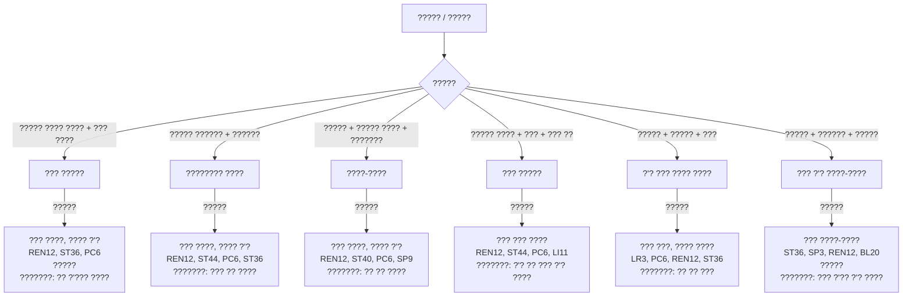

---

## 2. ?????? (?? Fu Zhang)

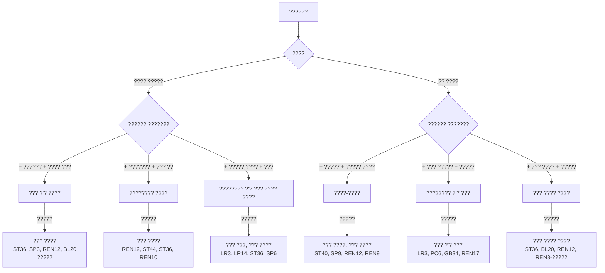

---

## 3. ????? (?? Xie Xie)

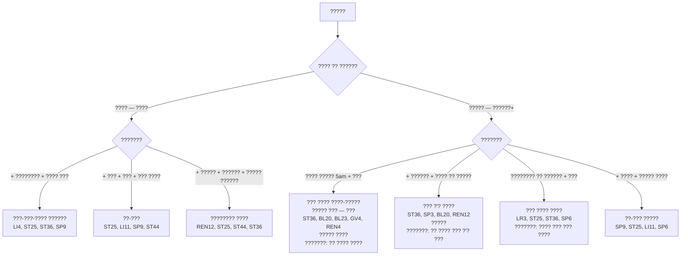

---

## 4. ?????? (?? Bian Mi)

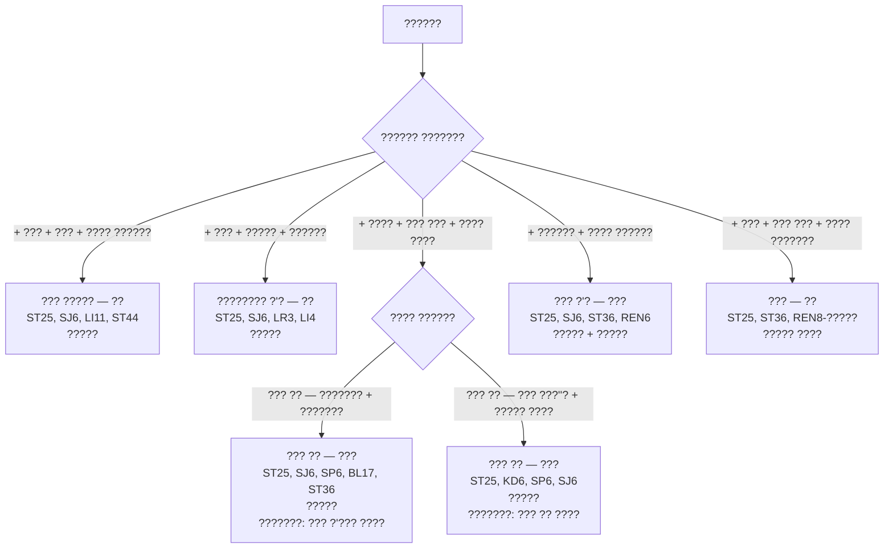

---

## 5. ??? ??? + ????? — ????? ?????

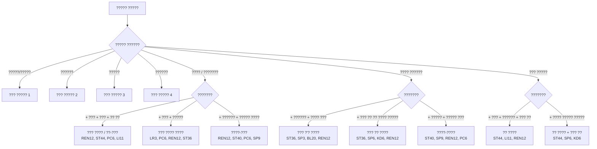

---

## 6. ???? ????? ????? — ?????

| ????? | ???? ???? ????? | ?????? ???? | ??????? |
|---|---|---|---|
| ?????? ???? ????? | ??? ?'? ???? | ST36, SP3, REN12, BL20 | ?? ?'?? ?'? / ??? ?'?? ?'? |
| ????? ????? | ??? ???? / ????-????? | ST36, BL20, BL23, REN12 | ?? ???? ??? ?'? ??? |
| ?????? + ??? | ??? ????? | ST25, SJ6, LI11, ST44 | ?? ?'? ?? ???? |
| ????? | ?'? ???? ???? | PC6, REN12, ST36 | ??? ???? |
| ???? | ??? ???? / ??? ? ???? | REN12, ST44, PC6, LR3 | ???? ???? ??? ???? |
| ???? ?????? | ??? ???? | ST36, SP3, BL20 | ?? ?'?? ?'? ???? |
| IBS — ????? + ?????? | ??? ???? ???? | LR3, ST25, ST36, SP6 | ???? ??? ??? ???? |
| ???? | ???????? ?'? / ??? ???? | REN6, ST25, LR3, ST36 | ??? ???? |

---

### ?????? ???? ??????

| ????? | ????? ????? |
|---|---|
| **REN12** (??) | ?? ???? — ???? ????? ??? ????? ???? |
| **ST36** (???) | ???-??? — ????? ?'? ????-???? |
| **PC6** (??) | ??? ????? — ???? ?????? |
| **ST25** (??) | ?? ??? ?? — ?????? ????? |
| **SP6** (???) | ????? ????, ?????? |
| **ST40** (??) | ???? ???? |
| **SP9** (???) | ?????? ???? |
| **LR3** (??) | ????? ??? — ????? ???? ????/???? |

---

## Source: `flowcharts/emotional-flowchart.md`


# ????? ????? — ????? ??????

## Emotional Disorders Flowchart (??????? Qing Zhi Bing Bian Zheng Liu Cheng)

---

> **???:** ?????? ??????, ???? ?????? (?? Qi Qing) ?? ????? ???? ???????. ?? ??? ???? ????? ??????: ??? ? ???, ???? ? ??, ???? ? ????, ??? ? ?????, ??? ? ?????.

---

## 1. ???? ???? (????)

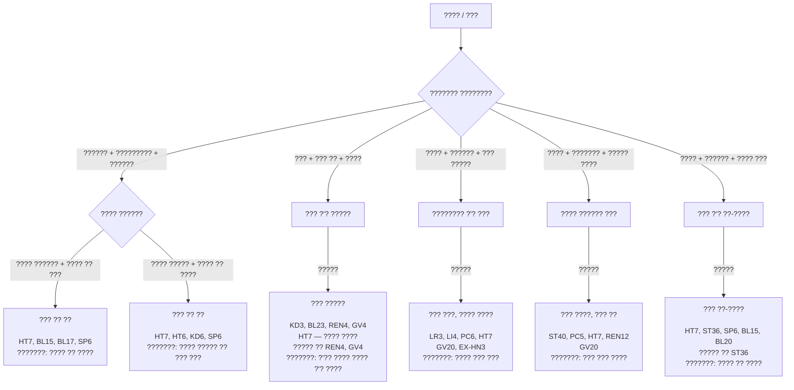

---

## 2. ?????? (?? Yi Yu)

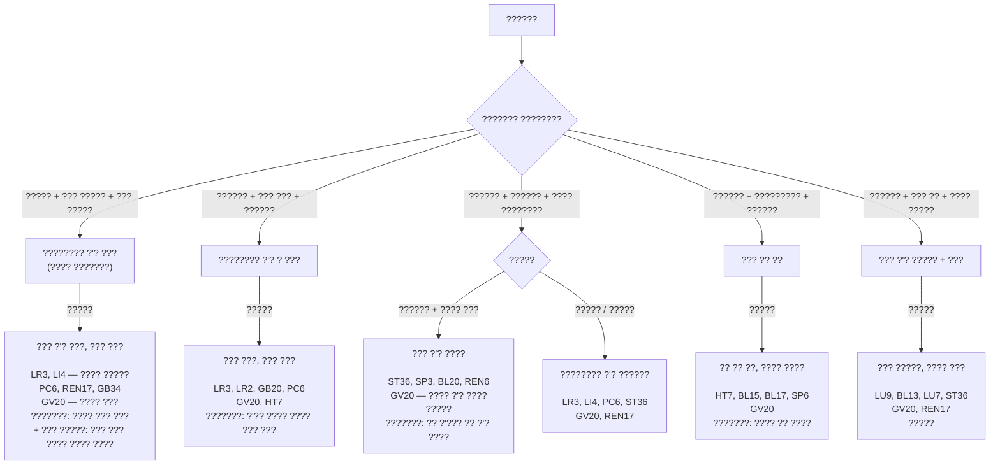

---

## 3. ??? ??????? (? Nu / ?? Fan Zao)

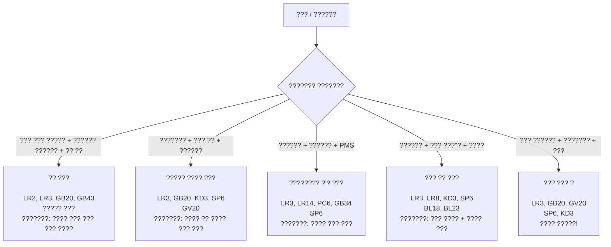

---

## 4. ????????? (?? Shi Mian)

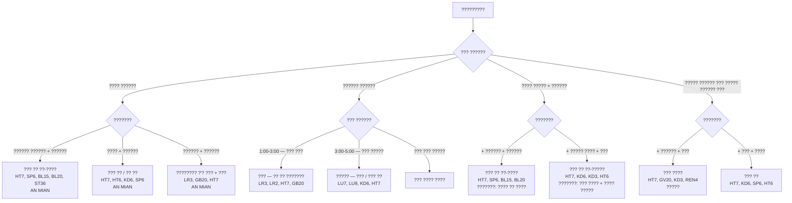

---

## 5. ??? ????? ????? (?? Ya Li)

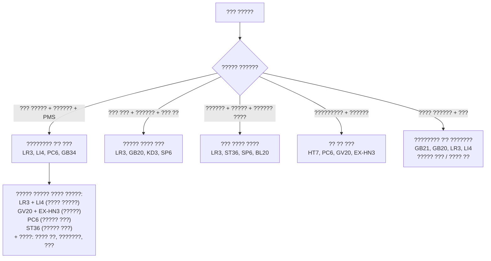

---

## 6. ???? ????? ????? — ?????

| ??? / ??? | ???? ????? | ???? ???? | ?????? ???? | ??????? |
|---|---|---|---|---|
| ??? | ??? | ?? ??? / ???????? ?'? | LR2/LR3, GB20, HT7 | ???? ??? / ???? ??? |
| ???? | ?? + ????? | ??? ??/?? ?? / ??? ????? | HT7, KD3, PC6, GV20 | ???? ?? / ???? ????? |
| ?????? | ???? | ??? ?'? ???? | ST36, SP3, HT7, GV20 | ???? ?? ???? |
| ??? | ????? | ??? ?'? ????? | LU7, LU9, BL13, GV20 | ?? ?'??? ?? ?'? |
| ??? | ????? | ??? ????? | KD3, BL23, HT7, GV20 | ?'?? ???? / ??? ???? |
| ?????? | ??? (+ ????) | ???????? ?'? ??? | LR3, LI4, GV20, PC6 | ???? ??? ??? |
| ????????? | ?? | ??? ??/?? ?? | HT7, AN MIAN, KD6, SP6 | ???? ?? / ???? ????? |
| ??? ????? | ??? ? ???? | ???????? ?'? ? ??? ???? | LR3, LI4, ST36, GV20 | ???? ??? ??? |

---

### ?????? ???? ?????? ??????

| ????? | ????? ???? |
|---|---|
| **HT7** (??) | "??? ?????" — ?????? ?? ????, ?? ??? ???? |
| **GV20** (??) | ???? ????, ?????? ???, ??? ?????? |
| **EX-HN3** (??) | ?????? ????, "??? ??????", ????? |
| **PC6** (??) | ????? ???, ?????? ????, ?????? ???? |
| **LR3** (??) | ????? ??? — ?? ??? ?? ??????? ????? |
| **LI4** (??) | "???? ?????" ?? LR3 — ????? ????? |
| **KD1** (??) | ?????, ?????? ?? ???? — ????, ?????? |
| **AN MIAN** | ????? ??????? ????? |

---

## Source: `flowcharts/gynecology-flowchart.md`


# ????? ????? — ??????????

## Gynecology Flowchart (?????? Fu Ke Bian Zheng Liu Cheng)

---

> **???:** ?????????? ?????? ?????? ?????? ?? ????? ?'??? ??? (??) ??? ??? (??), ?????? ??? (???? ?????? ?'? ?????? ??), ???? (????? ?? ?????? ????), ?????? (?????? ?????? ???'???).

---

## 1. ???? ????? — ?????????? (?? Tong Jing)

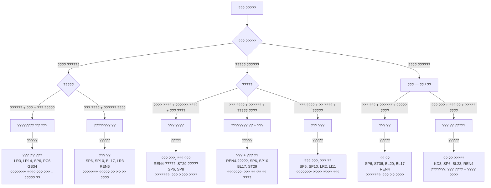

---

## 2. ??-?????? ????? (???? Yue Jing Bu Tiao)

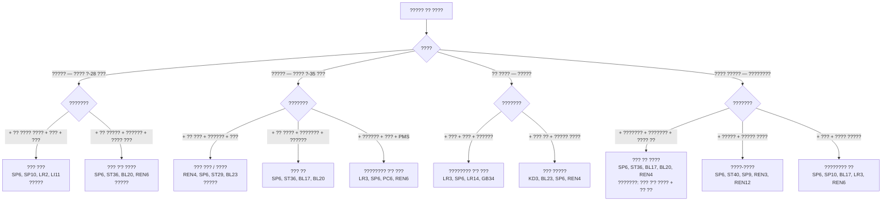

---

## 3. ????? ???? ???? (?? Beng Lou)

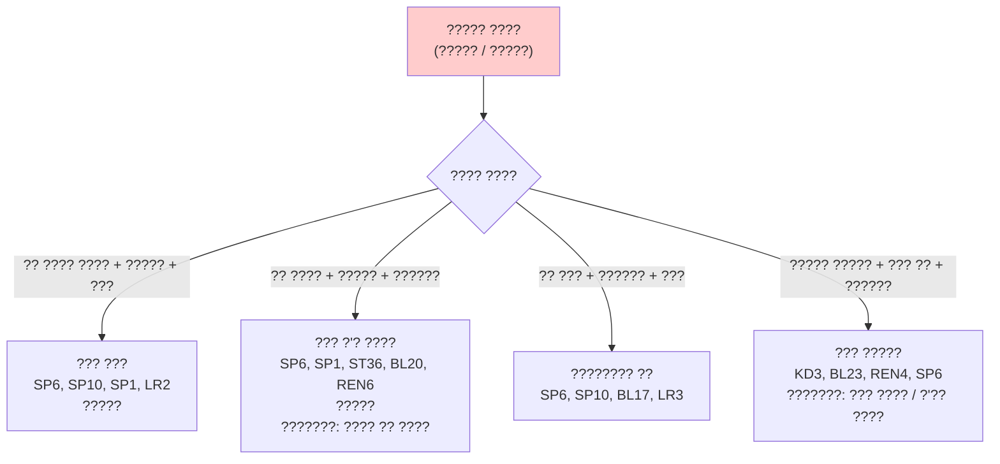

> **? ????:** ????? ???? ???? ???? ?? ????? ?????? ?????????? ?????? ?????? ?????? ????????.

---

## 4. ?????? (?? Bu Yun)

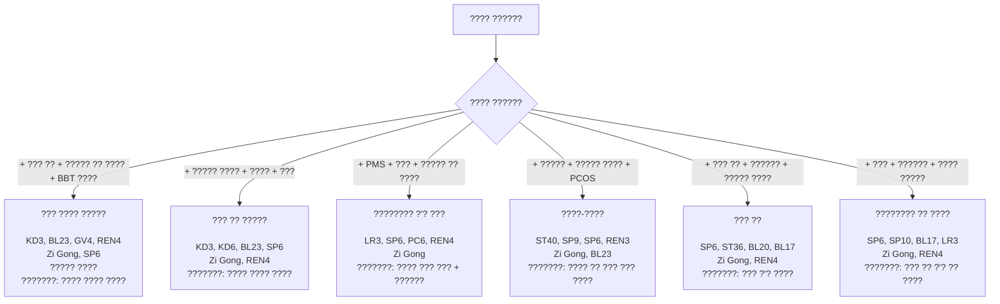

### ???????? ?????? ??? ???? ??????

| ??? | ???? | ?????? | ?????? |
|---|---|---|---|
| **?????** (???? 1-5) | ????? | ??? ??, ??? | SP6, SP10, LR3, REN3 |
| **?????????** (???? 6-13) | ???? ????? | ?? ??, ??? ?? | KD3, KD6, SP6, BL23, REN4 |
| **????** (???? 13-15) | ???? | ??? ?'?, ??? ???? | LR3, LI4, SP6, REN4, Zi Gong |
| **???????** (???? 16-28) | ???? ???? | ??? ????, ??? ????? | GV4, BL23, REN4, KD3, ST36 ????? |

---

## 5. ???????? — ?????? ??? ????? (??????)

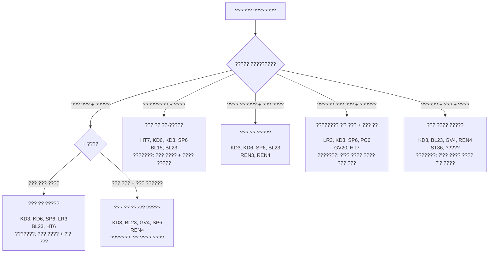

---

## 6. ?????? ???????? (??? Dai Xia Bing)

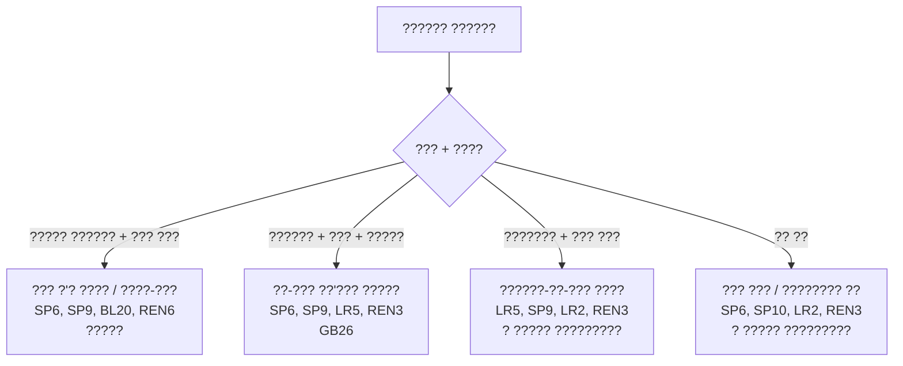

---

## 7. ???? ????? ????? — ??????????

| ??? | ???? ???? | ?????? ???? | ??????? |
|---|---|---|---|
| ??? ????? — ???? | ???????? ?'? ??? | LR3, SP6, PC6, LR14 | ???? ??? ??? |
| ??? ????? — ????? + ??? | ??? ???? | REN4, SP6, ST29 + ????? | ??? ?'??? ???? |
| ??? ????? — ???? | ??? ?? | SP6, ST36, BL17, BL20 | ??? ?'? ???? |
| ????? ????? | ??? ??? / ??? ?'? | SP6, SP10, LR2 / ST36 | ??? ???? |
| ????? ????? | ??? / ??? ?? | REN4, SP6, BL23 / ST36 | ??? ???? |
| PMS | ???????? ?'? ??? | LR3, SP6, PC6, GB34 | ???? ??? ??? |
| ?????? | ??? ????? (??/????) | KD3, BL23, REN4, SP6, Zi Gong | ????/???? ???? |
| ???????? — ??? ??? | ??? ?? ????? | KD3, KD6, SP6, HT7 | ??? ???? + ?'? ??? |
| ????? ???? | ??? ?'? / ??? ??? | SP1, SP6, ST36, BL20 | ???? ?? ???? |

---

### ?????? ???? ???????????

| ????? | ?????? |
|---|---|
| **SP6** (???) | ???? ???? ????? ?? — ?????? ??? ???? ??????????. ? ???? ???????! |
| **REN4** (??) | ????? ????? ???? — ??????, ????? |
| **Zi Gong** (??) | "????? ????" — ??????, ??? ????? |
| **ST29** (??) | ????? ??? — ??? ???? |
| **SP8** (??) | ????? ?? — ???? ????? ?????? |
| **LR3** (??) | ????? ?'? ??? — PMS, ??????? |
| **BL23** (??) | ????? ????? — ??????, ???????? |
| **SP10** (??) | "?? ???" — ?????? ?? |

---

## Source: `flowcharts/pain-flowchart.md`


# ????? ????? — ???

## Pain Diagnostic Flowchart (?????? Teng Tong Bian Zheng Liu Cheng)

---

> **??????:** ????/? ???? ????? ?????? ?????? ????. ??? ???? — ???/? ?? ?????? ??????? ?????. ?????? ????? ??????? ?? ?????, ?????? ?????? ???????? ????????.

---

## 1. ??? ??? (?? Tou Tong)

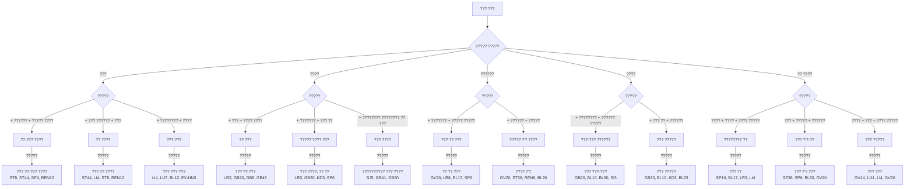

---

## 2. ??? ?? ????? (?? Yao Tong)

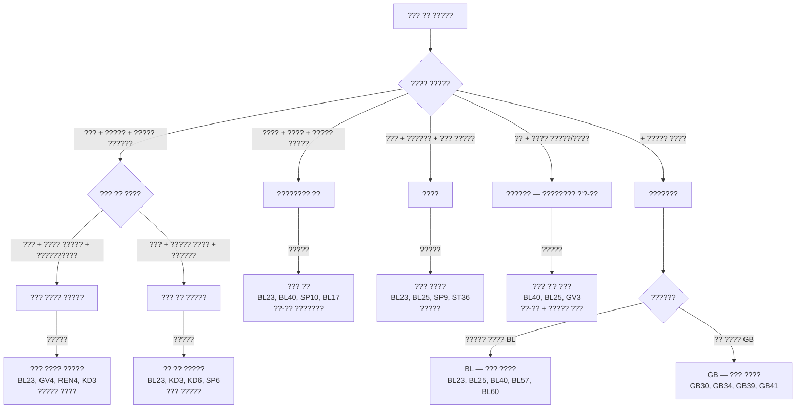

---

## 3. ??? ??? (?? Fu Tong)

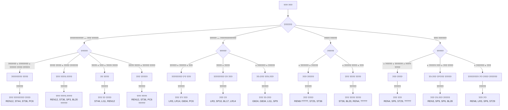

---

## 4. ??? ?????? — BI Syndrome (?? Bi Zheng)

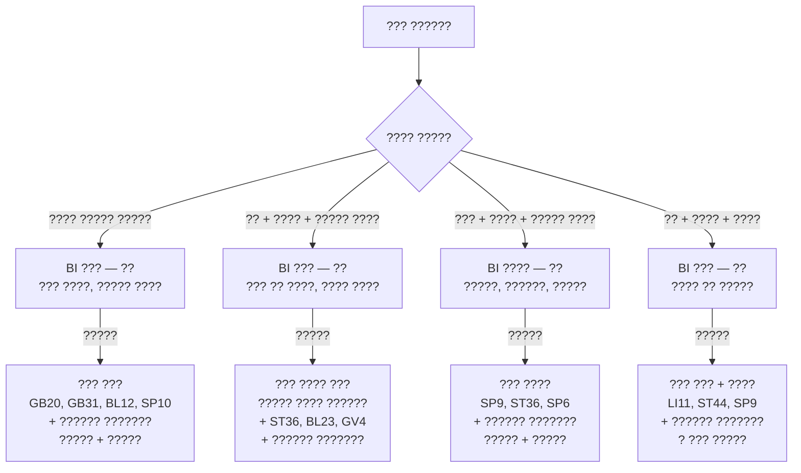

---

## 5. ???? ????? ????? — ???

| ???? ??? | ???? | ?????? ???? | ???? |
|---|---|---|---|
| ????, ???? | ???????? ?? | SP10, BL17, LR3, LI4 + ??????? | ????? |
| ???, ????? | ???????? ?'? | LR3, LI4, PC6, GB34 + ??????? | ?????/????? |
| ??, ????? ???? | ??? | ????? + ST36, BL23, GV4 + ??????? | ????? + ????? |
| ??? + ?????? | ???? | SP9, ST36, SP6 + ??????? | ????? |
| ????, ????, ?? | ??? | LI11, ST44 + ??????? | ????? |
| ???? | ??? | GB20, GB31, BL12 + ??????? | ????? |
| ??? + ?????? | ??? | ST36, SP6, BL20 + ??????? | ????? + ????? |
| ???? ???? | ??? | ????? + ????? |
| ????? ???? | ???? | ????? |
| ????? ?????? | ???? / ???????? ?? | ????? |
| ???? ?????? | ???????? ?'? | ?????/????? |

---

## Source: `flowcharts/respiratory-flowchart.md`


# ????? ????? — ????? ?????

## Respiratory Disorders Flowchart (???????? Hu Xi Xi Tong Bian Zheng Liu Cheng)

---

## 1. ????? (?? Ke Sou)

```mermaid
flowchart TD
    A[?????] --> B{???? ?? ??????}
    
    B -->|???? — ???? ?? 3 ??????| C{???????}
    B -->|????? — ??? 3 ??????| D{???????}
    
    C -->|+ ???????? + ??? ??? ???? + ????| C1["???-??? ???? ?????<br/>(????)"]
    C -->|+ ??? + ??? ???? + ??? ????| C2["???-??? ???? ?????<br/>(????)"]
    C -->|+ ???? ??? + ?? ??? + ????? ???| C3["???? ???? ?????<br/>(????)"]
    
    D -->|+ ??? ??? ????? + ?????? + ????? ????| D1["????-???? ??????<br/>(????)"]
    D -->|+ ??? ???? ??? + ??? + ???| D2["????-??? ??????<br/>(????)"]
    D -->|+ ????? ??? + ???? ??? + ??? ????| D3["??? ?? ?????<br/>(???)"]
    D -->|+ ????? ??? + ???? ????? + ???? ????????| D4["??? ?'? ?????<br/>(???)"]
    D -->|+ ???? ????? ?????? + ??? ??| D5["????? ?? ?????? ?'?<br/>(????)"]
    
    C1 -->|?????| C1T["??? ???-???, ??? ?????<br/>LU7, LI4, BL12, BL13<br/>GV16, EX-HN3<br/>????? ??? ?? BL12<br/>???????: ?? ????? / ???? ?'? ????"]
    C2 -->|?????| C2T["??? ???-???, ??? ?????<br/>LU7, LI4, LI11, GV14<br/>LU10, LU5<br/>? ??? ?????<br/>???????: ??? ?'??? ???"]
    C3 -->|?????| C3T["???? ?????, ???? ?????<br/>LU7, LU9, KD6, LU5<br/>REN22<br/>???????: ?? ?? ??? ???? ????"]
    
    D1 -->|?????| D1T["??? ????, ??? ????<br/>LU7, ST40, BL13, SP9<br/>REN12, REN22<br/>????? ?? BL13, ST36<br/>???????: ?? ?? ???? + ??? ?'? ????"]
    D2 -->|?????| D2T["??? ???, ??? ????<br/>LU5, LU7, ST40, LI11<br/>BL13, REN22<br/>? ??? ?????<br/>???????: ?'??? ?'? ???? ??? ????"]
    D3 -->|?????| D3T["?? ?? ?????<br/>LU9, LU7, KD6, SP6<br/>BL13, BL43<br/>???????: ??? ?? ?? ?'?? ????"]
    D4 -->|?????| D4T["??? ?'? ?????<br/>LU9, BL13, LU7, ST36<br/>REN6, REN17<br/>?????<br/>???????: ?? ???? ??? ???"]
    D5 -->|?????| D5T["??? ?????, ???? ?'?<br/>KD3, BL23, REN4, LU7<br/>REN17, KD25<br/>????? ?? BL23, REN4<br/>???????: ?'?? ???? ???? ?'? ????"]
```

---

## 2. ????? / ??????? (?? Xiao Chuan)

```mermaid
flowchart TD
    A[????? / ???????] --> B{????}
    
    B -->|???? ????| C{????}
    B -->|????? — ??? ??????| D{?????}
    
    C -->|??? — ??? ??? + ??? + ?????| C1["????? ???<br/>(??)"]
    C -->|??? — ??? ???? + ??? + ???| C2["????? ???<br/>(??)"]
    
    D -->|+ ?????? + ????????? ??????| D1["??? ?'? ?????"]
    D -->|+ ??? ?? + ???? ????? ?????| D2["??? ?????"]
    D -->|+ ?????? + ????? ????| D3["??? ???? (????? ????)"]
    
    C1 -->|?????| C1T["??? ?????, ??? ???? ???<br/>LU7, BL12, BL13, REN22<br/>REN17, Ding Chuan<br/>?????!<br/>???????: ???? ?'??? ???? ????"]
    C2 -->|?????| C2T["??? ???, ??? ???? ???<br/>LU5, LU7, LI11, ST40<br/>REN22, Ding Chuan<br/>? ??? ?????<br/>???????: ???? ?'???? ????"]
    
    D1 -->|?????| D1T["??? ?????<br/>LU9, BL13, ST36, REN6<br/>???????: ?? ???? ??? ???"]
    D2 -->|?????| D2T["??? ?????<br/>KD3, BL23, REN4, GV4<br/>?????<br/>???????: ?'?? ???? ???? ?'? ????"]
    D3 -->|?????| D3T["??? ????, ??? ????<br/>ST36, SP3, BL20, ST40<br/>REN12, ?????<br/>???????: ??? ?'?? ?'? ????"]
```

---

## 3. ???? ??? / ???? / ????????? (?? Bi Yan)

```mermaid
flowchart TD
    A[???? ??? / ????] --> B{???? ?? ??????}
    
    B -->|???? — ???????| C{???????}
    B -->|????? — ????? / ?????????| D{???????}
    
    C -->|+ ???????? + ???? ????? + ???? ???| C1["???-???<br/>LI20, LI4, LU7, BL12<br/>EX-HN3, GV23<br/>????? ???"]
    C -->|+ ??? + ???? ????? + ??? ????| C2["???-???<br/>LI20, LI4, LU7, LI11<br/>EX-HN3, GV14"]
    
    D -->|+ ????? ????? + ?????? ???? + ????| D1["??? ?'? ?????<br/>(??????)<br/>LI20, LI4, LU7, BL13<br/>ST36, EX-HN3, BL2<br/>????? ?? BL13, ST36<br/>???????: ?? ???? ??? ??? + ???? ??? ?'?"]
    D -->|+ ???? ??? + ????? ????? + ??? ????| D2["??-??? ??????<br/>(?????????)<br/>LI20, LI4, LI11, ST44<br/>EX-HN3, BL2, GV23<br/>???????: ???? ??? ?'?"]
    D -->|+ ???? + ????? ???? + ??????| D3["????-????<br/>LI20, ST40, SP9, LU7<br/>EX-HN3, REN12"]
```

---

## 4. ??? ???? (?? Yan Tong)

```mermaid
flowchart TD
    A[??? ????] --> B{???? ?? ??????}
    
    B -->|???? — ????| C{???????}
    B -->|????? — ??????+| D{???????}
    
    C -->|+ ??? + ???????? + ??????| C1["???-??? / ??<br/>LU11 — ????? ??!<br/>LI4, LI11, LU10<br/>REN22, ST44"]
    C -->|+ ???????? + ???? ???? + ???| C2["???-??? ???? ????<br/>LI4, LU7, LI11<br/>REN22"]
    
    D -->|+ ???? + ??? ???? + ???? ??? ???''?| D1["??? ?? ?????-?????<br/>LU7, KD6, REN22<br/>LU9, SP6"]
    D -->|+ ????? ??? + ???? ?????? + ???| D2["??? ?? ?'? — ???? ?????<br/>(???)<br/>PC6, REN22, ST40<br/>LR3, REN17<br/>???????: ??? ??? ???? ???? ????"]
    D -->|+ ???? ???? + ??? ????| D3["?? ???<br/>KD6, LU7, REN22<br/>KD2, SP6"]
```

---

## 5. ???? ????? (?? Qi Duan / ? Chuan)

```mermaid
flowchart TD
    A[???? ?????] --> B{????}
    
    B -->|?????| C{?????? ???????}
    B -->|??????| D{?????? ???????}
    B -->|??????| E["????-?????? ?????? ?<br/>?? ????? ?? ?<br/>LU7, ST40, REN17<br/>PC6, KD3<br/>????? ?????!"]
    
    C -->|+ ?????? + ???? + ??? ???| C1["??? ?'? ?????<br/>LU9, BL13, ST36, REN6<br/>REN17, ?????"]
    C -->|+ ??? ?? + ?????? ?????| C2["????? ?? ?????? ?'?<br/>KD3, BL23, REN4, LU7<br/>REN17, ?????"]
    C -->|+ ?????? + ???????| C3["??? ?'? ??-?????<br/>LU9, HT7, BL13, BL15<br/>REN17, ST36"]
    
    D -->|+ ??????? + ???| D1["???? ????? ?????<br/>LU7, ST40, REN22, REN17<br/>BL13, Ding Chuan"]
    D -->|+ ???? + ??????| D2["????-?? ?????? ???<br/>ST40, PC6, HT7, LU7<br/>REN17"]
    D -->|+ ??? + ??? + ??????| D3["??? ?????<br/>LU5, LI11, GV14, REN22<br/>? ?????!"]
```

---

## 6. ???? ????? ????? — ?????

| ??? | ???? | ?????? ???? | ???? | ??????? |
|---|---|---|---|---|
| ??????? — ??? | ???-??? | LU7, LI4, BL12 | ????? + ????? | ???? ?'? / ?? ????? ???? |
| ??????? — ??? | ???-??? | LU7, LI4, LI11, GV14 | ????? | ??? ?'??? ??? |
| ????? ??? ????? | ??? ?? ????? | LU9, KD6, LU7, BL13 | ????? | ??? ?? ?? ?'?? ???? |
| ????? ????? | ????-???? | LU7, ST40, SP9, BL13 | ????? + ????? | ?? ?? ???? |
| ????? + ??? ???? | ????-??? | LU5, LU7, ST40, LI11 | ????? | ?'??? ?'? ???? ??? |
| ????? — ???? ?? | ????-??? | LU7, BL13, REN22, Ding Chuan | ????? + ????? | ???? ?'??? ???? |
| ????? — ???? ?? | ????-??? | LU5, ST40, REN22, Ding Chuan | ????? | ???? ?'???? ???? |
| ????? — ????? | ??? ?????-????? | LU9, BL13, KD3, BL23 | ????? + ????? | ?? ???? ??? + ?'?? ???? |
| ?????? ???? | ??? ?'? ????? | LI20, LI4, LU7, ST36 | ????? + ????? | ?? ???? ??? ??? |
| ????????? | ??-??? | LI20, LI4, LI11, ST44 | ????? | ???? ??? ?'? |
| ??? ???? ???? | ???-??? / ?? | LU11, LI4, LI11, REN22 | ????? / ????? ?? | ??? ?'??? ??? |
| ???? ??? ????? | ??? ?? | LU7, KD6, REN22, SP6 | ????? | ??? ?? / ??? ?? ???? |
| ???? ????? ????? | ??? ????? + ????? | LU9, KD3, BL13, BL23, REN17 | ????? + ????? | ??? ???? |

---

### ?????? ???? ??????

| ????? | ????? ????? |
|---|---|
| **LU7** (??) | ???? ????? — ?????? ?????? ?????, ????? ??? |
| **LI4** (??) | ????? ???, ????? ??? — ?? ????? ??????? |
| **BL13** (??) | ????-??? ????? — ????? ????? |
| **REN22** (??) | ?????? ????? — ????? ?????, ????? ???? |
| **REN17** (??) | ?? ???? ?? — ????? ?'? ???, ????? ????? |
| **ST40** (??) | "????? ?????" — ????? ???? ??? ???? |
| **LU5** (??) | ???-??? — ???? ??? ????? |
| **LU9** (??) | ???? + ??? — ????? ?'? ????? |
| **KD3** (??) | ???? ????? — ????? ?????? ?'? ????? |
| **Ding Chuan** (??) | EX-B1 — ????? ??????? ?????? |
| **LI20** (??) | ????? ?? — ?? ????? ?? |
| **EX-HN3** (??) | ????? ??, ?????? |
| **LU11** (??) | ?'???-??? — ????? ?? ???? ???? ???? |

---

## Source: `README.md`


# ????? ????? ???? ????? - ?????? ?????

## Comprehensive Diagnostic Questionnaire - User Guide

---

## ????? ?????

??? ?????? ????? ??? ???? ????? ????? ?????? ???? (?? Zhen Jiu) ???? ????? ????? ?????, ???? ??????. ??? ???? ?? ?? ???? ?????? — ?????? ??????? ??? ?????? ????? ???? — ?????? ?? ???? ????? ?????? ?????????:

1. **????????** (? Wang) — ???? ????, ????, ???? ???
2. **????? ?????** (? Wen) — ???, ?????, ???
3. **?????** (? Wen) — ????? ??????
4. **?????** (? Qie) — ????, ????? ??? ???????

---

## ???? ??? ??????

### ??? 1: ????? ??????

| ???? | ???? | ??? ?????? |
|---|---|---|
| [01-intake-form.md](01-intake-form.md) | ???? ????? ?????? | ????? ????? — ???? ?????? |
| [02-ten-questions.md](02-ten-questions.md) | ??? ?????? (?? Shi Wen) | ????? ????? — ????? ?????? |

### ??? 2: ????? ??????

| ???? | ???? | ??? ?????? |
|---|---|---|
| [03-tongue-checklist.md](03-tongue-checklist.md) | ????? ???? ?????? ???? | ?? ????? |
| [04-pulse-checklist.md](04-pulse-checklist.md) | ????? ???? ?????? ???? | ?? ????? |
| [05-inspection-checklist.md](05-inspection-checklist.md) | ????? ???? ????????? | ?? ????? |
| [06-palpation-checklist.md](06-palpation-checklist.md) | ????? ???? ?????? | ??? ????? |

### ??? 3: ????? ???? ?????? ?????

| ???? | ???? | ??? ?????? |
|---|---|---|
| [07-pattern-identification.md](07-pattern-identification.md) | ??????? ?????? — ????? ?????? | ???? ????? ?? ??????? |
| [08-pattern-to-points.md](08-pattern-to-points.md) | ????? ?????? ??????? ????? | ????? ?????? ?????? |
| [09-point-combinations.md](09-point-combinations.md) | ?????? ?????? ??????? | ???????? ????? |
| [10-herbal-integration-guide.md](10-herbal-integration-guide.md) | ????? ???????? ????? | ?????? ????? ????? |

### ??? 4: ????? ?????

| ???? | ???? | ??? ?????? |
|---|---|---|
| [11-treatment-plan-template.md](11-treatment-plan-template.md) | ????? ?????? ????? | ?? ????? |
| [12-followup-form.md](12-followup-form.md) | ???? ???? | ?????? ???? |

### ?????? ????? ?????? ????

| ???? | ???? |
|---|---|
| [flowcharts/pain-flowchart.md](flowcharts/pain-flowchart.md) | ????? ????? — ??? |
| [flowcharts/digestive-flowchart.md](flowcharts/digestive-flowchart.md) | ????? ????? — ????? ????? |
| [flowcharts/emotional-flowchart.md](flowcharts/emotional-flowchart.md) | ????? ????? — ????? ?????? |
| [flowcharts/gynecology-flowchart.md](flowcharts/gynecology-flowchart.md) | ????? ????? — ?????????? |
| [flowcharts/respiratory-flowchart.md](flowcharts/respiratory-flowchart.md) | ????? ????? — ????? ????? |

---

## ????? ????? ??? ??? ???

### ????? ????? (60-90 ????)

```
??? 1: ?????
+-- ?????? ???? ?? ???? ?????? (01) ???? ?????? ?? ???????
+-- ????? ???? ?? ????? ?????? ????? ?????
+-- ???: 10-15 ????

??? 2: ????? ?????
+-- ?????? ?? ??? ?????? (02) ????? ??????
+-- ?????? ?????? ???????? ?????? ?????????
+-- ???: 15-20 ????

??? 3: ????? ??????
+-- ???????? ????? (05) — ????, ????, ?????
+-- ????? ???? (03) — ???, ?????, ?????
+-- ????? ???? (04) — ???? ?????, ??? ?????
+-- ????? (06) — ???, ?????? ??????, ??????
+-- ???: 10-15 ????

??? 4: ????? ??????
+-- ????? ??? ????? ???????? (07)
+-- ????? ???? ???????
+-- ????? ???? ?????
+-- ????? ???? ??????
+-- ???: 5-10 ???? (?????? ????)

??? 5: ?????? ?????
+-- ????? ?????? ??? ???? (08)
+-- ????? ??????? ??????? (09)
+-- ????? ??????? ????? (10)
+-- ????? ????? ?????? ????? (11)
+-- ???: 5-10 ????

??? 6: ????? ??????
+-- ????? ??? ???????
+-- ????? ?????? ???????
+-- ???: 20-30 ????

??? 7: ?????
+-- ?????? ???? ????
+-- ?????? ??????? ??????
+-- ????? ???? ????
+-- ???: 5 ????
```

### ????? ???? (45-60 ????)

```
??? 1: ????? ???????
+-- ????? ???? ???? (12)
+-- ????? ????? ???????? (1-10)
+-- ???: 5-10 ????

??? 2: ????? ???????
+-- ???? ????? (03, 04)
+-- ?????? ?????? ????
+-- ???: 5-10 ????

??? 3: ????? ????
+-- ????? ???? (07)
+-- ????? ?????? ??? ????? (08, 09)
+-- ???: 5 ????

??? 4: ????? + ?????
+-- ????? ?????
+-- ????? ?????? (11)
+-- ???: 25-35 ????
```

---

## ????? ?????? ????

### ????? ?????
1. **???? ???? ????** — ????? ?????? ??? ???? ??????
2. **?? ???? ?? ?????** — ?? ?? ???? ??????? ?????
3. **????? ??????? ??????** — ????? ????? ??? ??????
4. **???? ????? ???? ?????** — ?? ??? ?? ???? ??? ?????
5. **??? ?? ?? ??????** — ?? ?? ?? ???? ???, ?? ???? ?????? ?????

### ????? ?????
1. **????? ??????? ?????** — ?"??? ??????" ????? ??? ????? ????
2. **???? ?-07 (????? ??????)** — ?????? ??????? ?? ?????? ???????
3. **????? ?-08 + 09** — ?????? ?????? ????? ?????????
4. **????? ??????? ?????** — ?????? ???????? ???????

### ??????? ?????
- **???? ???? ?? ??????** — ???? ???? 80% ???? ?? ???? ???
- **?? ????? ??????** — ??????? ?? ???????, ?? ????? ???????
- **???? ????? = ????? ???** — ??? ?? ?? ??????? ?????? ?????
- **????? ?????? ?? ??????** — ???? ????? ??? ????? ??????? ????????????, ???? ?? ????? ??????

---

## ??????? ?????

| ????? | ?????? |
|---|---|
| LU | ????? (Lung) |
| LI | ??? ?? (Large Intestine) |
| ST | ???? (Stomach) |
| SP | ???? (Spleen) |
| HT | ?? (Heart) |
| SI | ??? ?? (Small Intestine) |
| BL | ??????? ???? (Bladder) |
| KD | ????? (Kidney) |
| PC | ???? ??? (Pericardium) |
| SJ | ??? ?'??? (San Jiao) |
| GB | ??? ???? (Gallbladder) |
| LR | ??? (Liver) |
| DU | ?? ??? (Du Mai) — ??? ???? |
| REN | ?? ??? (Ren Mai) — ??? ????? |
| EX | ?????? ???-??????? (Extra Points) |

| ???? | ?????? |
|---|---|
| ? | ???? ????? — ??? ?? ???????? |
| ? | ???? ???? ?????? |
| ? | ???? ????? ?? ?????? |
| ? | ????? ?? ???? / ????? |

---

## ??????

- **Maciocia, G.** — The Foundations of Chinese Medicine (3rd ed.)
- **Deadman, P.** — A Manual of Acupuncture
- **Chen, J.K. & Chen, T.T.** — Chinese Medical Herbology and Pharmacology
- **Wiseman, N. & Ye, F.** — A Practical Dictionary of Chinese Medicine
- **????** (Huang Di Nei Jing) — ???????? ??????? ?? ????? ?????

---

