# Diagnostic Tool (Acupuncture Course)

_Merged from: `diagnostic-tool` - 18 file(s)_

---

## Source: `01-intake-form.md`

<div dir="rtl">

# טופס קליטה ראשוני

## Initial Intake Form

---

> **הוראות:** טופס זה ימולא על-ידי המטופל/ת לפני הפגישה הראשונה, או בתחילתה.
> המטפל ישלים פרטים חסרים במהלך הראיון הקליני.

---

## א. פרטים אישיים

| שדה | תשובה |
|---|---|
| שם מלא | __________________ |
| תאריך לידה | ____/____/________ |
| גיל | __________________ |
| מין | □ זכר □ נקבה □ אחר |
| מצב משפחתי | □ רווק/ה □ נשוי/ה □ גרוש/ה □ אלמן/ה |
| מספר ילדים | __________________ |
| כתובת | __________________ |
| טלפון | __________________ |
| דוא"ל | __________________ |
| מקצוע / עיסוק | __________________ |
| רופא מטפל | __________________ |
| מי הפנה אותך? | __________________ |
| תאריך מילוי הטופס | ____/____/________ |

---

## ב. תלונה עיקרית (主诉 Zhu Su)

### מהי הבעיה העיקרית שבגללה באת לטיפול?

_____________________________________________________________________________

_____________________________________________________________________________

### פרטי התלונה

| שאלה | תשובה |
|---|---|
| מתי התחילה הבעיה? | __________________ |
| האם ההתחלה הייתה: | □ פתאומית □ הדרגתית |
| מה לדעתך גרם / הפעיל את הבעיה? | __________________ |
| האם הבעיה: | □ קבועה □ באה והולכת □ מחמירה □ משתפרת |
| דרג/י את חומרת הבעיה (1-10): | __________________ |

### מה מחמיר את הבעיה? (סמן/י את כל הרלוונטי)

- □ קור
- □ חום
- □ לחות / מזג אוויר גשום
- □ רוח
- □ מאמץ גופני
- □ מנוחה
- □ לחץ נפשי / מתח
- □ מזון מסוים: __________________
- □ זמן מסוים ביום: __________________
- □ מחזור חודשי (נשים)
- □ אחר: __________________

### מה מקל על הבעיה?

- □ מנוחה
- □ תנועה
- □ חום / חימום
- □ קור / קירור
- □ לחץ / עיסוי
- □ אוכל
- □ תרופות: __________________
- □ אחר: __________________

### האם ניסית טיפולים אחרים לבעיה זו?

| טיפול | מתי | תוצאה |
|---|---|---|
| __________________ | __________________ | __________________ |
| __________________ | __________________ | __________________ |
| __________________ | __________________ | __________________ |

---

## ג. היסטוריה רפואית

### מחלות כרוניות / אבחנות רפואיות

סמן/י את כל הרלוונטי:

**לב וכלי דם:**
- □ לחץ דם גבוה
- □ לחץ דם נמוך
- □ מחלת לב
- □ אי-ספיקת לב
- □ הפרעות קצב
- □ כולסטרול גבוה
- □ אחר: __________________

**נשימה:**
- □ אסתמה
- □ ברונכיטיס כרונית
- □ COPD
- □ דום נשימה בשינה
- □ אחר: __________________

**עיכול:**
- □ רפלוקס / GERD
- □ כיב קיבה / תריסריון
- □ IBS (תסמונת המעי הרגיז)
- □ קרוהן / קוליטיס
- □ אבני מרה
- □ אחר: __________________

**אנדוקריני / מטבולי:**
- □ סוכרת סוג 1
- □ סוכרת סוג 2
- □ תת-פעילות בלוטת התריס
- □ יתר-פעילות בלוטת התריס
- □ אחר: __________________

**שרירים ושלד:**
- □ פריצת דיסק
- □ דלקת מפרקים
- □ אוסטאופורוזיס
- □ פיברומיאלגיה
- □ אחר: __________________

**נוירולוגי:**
- □ מיגרנות
- □ אפילפסיה
- □ טרשת נפוצה
- □ נוירופתיה
- □ אחר: __________________

**נפשי:**
- □ חרדה
- □ דיכאון
- □ הפרעות שינה
- □ PTSD
- □ אחר: __________________

**אחר:**
- □ אנמיה
- □ מחלת כליות
- □ מחלת כבד
- □ סרטן (סוג: __________________)
- □ הפרעות אוטואימוניות (סוג: __________________)
- □ אחר: __________________

### ניתוחים

| ניתוח | שנה | הערות |
|---|---|---|
| __________________ | ________ | __________________ |
| __________________ | ________ | __________________ |
| __________________ | ________ | __________________ |

### אשפוזים

| סיבה | שנה | משך |
|---|---|---|
| __________________ | ________ | __________________ |
| __________________ | ________ | __________________ |

### פציעות / תאונות משמעותיות

_____________________________________________________________________________

_____________________________________________________________________________

---

## ד. תרופות ותוספים

### תרופות נוכחיות

| שם התרופה | מינון | מטרה | מאז מתי |
|---|---|---|---|
| __________________ | ________ | __________________ | ________ |
| __________________ | ________ | __________________ | ________ |
| __________________ | ________ | __________________ | ________ |
| __________________ | ________ | __________________ | ________ |
| __________________ | ________ | __________________ | ________ |

### תוספי תזונה / ויטמינים

| שם | מינון |
|---|---|
| __________________ | ________ |
| __________________ | ________ |
| __________________ | ________ |

### צמחי מרפא / טיפולים טבעיים

_____________________________________________________________________________

---

## ה. היסטוריה משפחתית

סמן/י מחלות שקיימות במשפחה הקרובה (הורים, אחים, סבים):

- □ סוכרת
- □ לחץ דם גבוה
- □ מחלת לב
- □ שבץ מוחי
- □ סרטן (סוג: __________________)
- □ מחלות אוטואימוניות
- □ מחלות נפש
- □ אחר: __________________

---

## ו. אלרגיות ורגישויות

| סוג | פרטים | תגובה |
|---|---|---|
| תרופות | __________________ | __________________ |
| מזון | __________________ | __________________ |
| סביבתי (אבק, פרחים) | __________________ | __________________ |
| מתכות / לטקס | __________________ | __________________ |
| אחר | __________________ | __________________ |

**⚠ האם יש לך רגישות למחטים?** □ כן □ לא

**⚠ האם אי פעם התעלפת מדיקור / זריקה / נטילת דם?** □ כן □ לא

---

## ז. אורח חיים

### תזונה

| שאלה | תשובה |
|---|---|
| תאר/י את התזונה הרגילה שלך: | __________________ |
| כמה ארוחות ביום? | __________________ |
| שעת ארוחה ראשונה: | __________________ |
| שעת ארוחה אחרונה: | __________________ |
| העדפת טמפרטורת שתייה: | □ קרה □ חדר □ חמה |
| כמות מים ביום: | __________________ |
| האם יש מזונות שאת/ה נמנע/ת מהם? | __________________ |
| חשק למזון מסוים (cravings): | __________________ |

**הרגלי אכילה** (סמן הרלוונטי):
- □ אוכל/ת מהר
- □ אוכל/ת באיחור בלילה
- □ מדלג/ת על ארוחות
- □ אוכל/ת הרבה מזון מעובד
- □ צמחוני/ת / טבעוני/ת
- □ דיאטה מיוחדת: __________________

### פעילות גופנית

| שאלה | תשובה |
|---|---|
| סוג פעילות: | __________________ |
| תדירות: | □ יומי □ 3-4 בשבוע □ 1-2 בשבוע □ לעיתים נדירות □ לא פעיל/ה |
| משך כל אימון: | __________________ |
| רמת אינטנסיביות: | □ קלה □ בינונית □ גבוהה |

### שינה

| שאלה | תשובה |
|---|---|
| שעת הליכה לישון: | __________________ |
| שעת קימה: | __________________ |
| כמה שעות שינה בלילה: | __________________ |
| איכות השינה: | □ טובה □ בינונית □ גרועה |
| קושי להירדם: | □ כן □ לא |
| יקיצות בלילה: | □ כן — כמה פעמים: ______ □ לא |
| שעת יקיצה קבועה: | __________________ |
| חלומות: | □ ללא □ מעט □ הרבה □ סיוטים |
| נחירות: | □ כן □ לא |

### מתח ורגשות

| שאלה | תשובה |
|---|---|
| רמת מתח כללית (1-10): | __________________ |
| מקורות מתח עיקריים: | __________________ |
| כיצד את/ה מתמודד/ת עם מתח? | __________________ |

**האם את/ה חווה באופן תדיר:** (סמן הרלוונטי)
- □ חרדה / דאגנות יתר
- □ עצבנות / כעס
- □ עצבות / דיכאון
- □ פחדים
- □ חוסר מוטיבציה
- □ קושי בריכוז
- □ בכי קל
- □ תחושת בדידות

### עבודה

| שאלה | תשובה |
|---|---|
| סוג עבודה: | __________________ |
| שעות עבודה בשבוע: | __________________ |
| עבודה פיזית / ישיבה / משולבת: | __________________ |
| שביעות רצון מהעבודה (1-10): | __________________ |
| חשיפה לחומרים / מסכים: | __________________ |

### הרגלים

| הרגל | כמות | תדירות |
|---|---|---|
| קפה / תה | __________________ | __________________ |
| אלכוהול | __________________ | __________________ |
| עישון | __________________ | __________________ |
| סמים / קנאביס | __________________ | __________________ |

---

## ח. מצב רגשי - סקירה מהירה

דרג/י כל אחד מהבאים ב-1-5 (1 = נמוך, 5 = גבוה):

| רגש | דירוג | הערות |
|---|---|---|
| כעס / תסכול (怒 Nu — כבד) | ______ | __________________ |
| שמחה / התרגשות יתר (喜 Xi — לב) | ______ | __________________ |
| דאגנות / מחשבות חוזרות (思 Si — טחול) | ______ | __________________ |
| עצב / אבל (悲 Bei — ריאות) | ______ | __________________ |
| פחד / חרדה (恐 Kong — כליות) | ______ | __________________ |
| בהלה / הלם (惊 Jing — כליות/לב) | ______ | __________________ |

---

## ט. היסטוריה רבייתית (נשים)

### מחזור חודשי

| שאלה | תשובה |
|---|---|
| גיל מחזור ראשון: | __________________ |
| אורך מחזור ממוצע (ימים): | __________________ |
| משך דימום (ימים): | __________________ |
| סדירות: | □ סדיר □ לא סדיר |
| כמות דימום: | □ מועטה □ רגילה □ מרובה |
| צבע הדם: | □ אדום בהיר □ אדום כהה □ סגול □ חום |
| קרישים: | □ כן — גודל: ________ □ לא |
| כאבי מחזור: | □ לפני □ במהלך □ אחרי □ ללא |
| חומרת כאב (1-10): | __________________ |
| PMS — תסמונת קדם-וסתית: | □ כן □ לא |
| תסמיני PMS: | __________________ |

### הפסקת מחזור (מנופאוזה)

| שאלה | תשובה |
|---|---|
| האם הפסקת מחזור? | □ כן □ לא |
| גיל הפסקה: | __________________ |
| תסמינים: | □ גלי חום □ הזעות לילה □ יובש □ שינויי מצב רוח □ אחר |

### היריון ולידה

| שאלה | תשובה |
|---|---|
| מספר הריונות: | __________________ |
| מספר לידות: | __________________ |
| הפלות / הפסקות: | __________________ |
| סיבוכי היריון: | __________________ |
| האם בהיריון כעת? | □ כן □ לא □ אפשרי |

### אמצעי מניעה

| שאלה | תשובה |
|---|---|
| סוג: | __________________ |
| מאז מתי: | __________________ |

### הפרשות נרתיקיות

| שאלה | תשובה |
|---|---|
| צבע: | □ שקוף □ לבן □ צהוב □ אחר |
| כמות: | □ מועטה □ רגילה □ מרובה |
| ריח: | □ ללא □ חריף |
| גירוד: | □ כן □ לא |

---

## י. היסטוריה רבייתית (גברים)

| שאלה | תשובה |
|---|---|
| בעיות בתפקוד מיני: | □ כן □ לא |
| הטלת שתן תכופה בלילה: | □ כן — כמה פעמים: ______ □ לא |
| בעיות פרוסטטה: | □ כן □ לא |
| אחר: | __________________ |

---

## יא. סקירת מערכות — תמצית

**סמן/י כל תסמין שאת/ה חווה:**

**ראש וחושים:**
- □ כאבי ראש
- □ סחרחורת
- □ טינטון (צלצולים באוזניים)
- □ בעיות ראייה
- □ יובש בעיניים
- □ כאבי אוזניים
- □ גודש באף
- □ דימום מהאף

**פה וגרון:**
- □ כאב גרון חוזר
- □ יובש בפה
- □ כיבים בפה
- □ טעם מתכתי / מר
- □ חניכיים מדממות
- □ בעיות שיניים

**חזה:**
- □ קוצר נשימה
- □ שיעול
- □ כאב בחזה
- □ דפיקות לב
- □ אסתמה

**עיכול:**
- □ בחילה
- □ הקאות
- □ שיהוקים
- □ צרבת
- □ נפיחות
- □ גזים
- □ כאבי בטן
- □ שלשול
- □ עצירות
- □ דם בצואה

**שתן:**
- □ תכיפות מוגברת
- □ תכיפות בלילה
- □ צריבה / כאב
- □ דם בשתן
- □ אי-שליטה
- □ שתן עכור

**שרירים ומפרקים:**
- □ כאבי גב — עליון / תחתון
- □ כאבי צוואר
- □ כאבי כתפיים
- □ כאבי ברכיים
- □ נוקשות מפרקים
- □ חולשת שרירים
- □ נימול / עקצוץ

**עור:**
- □ פריחה
- □ גירוד
- □ יובש
- □ אקזמה
- □ פסוריאזיס
- □ אקנה
- □ נשירת שיער

**כללי:**
- □ עייפות
- □ חולשה
- □ חום / צמרמורות
- □ הזעה ללא מאמץ
- □ הזעות לילה
- □ שינויים במשקל
- □ צמא מוגבר
- □ רגישות לקור
- □ רגישות לחום

---

## יב. מטרות הטיפול

**מה את/ה מצפה להשיג מהטיפול?**

_____________________________________________________________________________

_____________________________________________________________________________

**האם יש משהו נוסף שחשוב לך שאדע?**

_____________________________________________________________________________

_____________________________________________________________________________

---

## יג. הצהרה והסכמה

אני מאשר/ת שהמידע שמסרתי לעיל הוא נכון ומלא ככל ידיעתי. אני מבין/ה שדיקור סיני הוא טיפול משלים ואינו מחליף טיפול רפואי קונבנציונלי. אני מסכים/ה לשתף פעולה עם המטפל/ת ולדווח על כל שינוי במצבי הבריאותי.

| | |
|---|---|
| חתימת המטופל/ת: | __________________ |
| תאריך: | ____/____/________ |
| חתימת המטפל/ת: | __________________ |

---

> **למטפל/ת:** לאחר מילוי הטופס, המשך/י לקובץ [02-ten-questions.md](02-ten-questions.md) לתשאול מעמיק.

---

## Source: `02-ten-questions.md`

<div dir="rtl">

# עשר השאלות - שי וון (十问)

## Ten Questions (Shi Wen)

---

> **רקע:** עשר השאלות הן שיטת תשאול מסורתית שמופיעה ב"ג'ינג יואה צ'יואן שו" (景岳全书) של ג'אנג ג'ינג-יואה (Zhang Jing-Yue). הן מהוות את הבסיס השיטתי לחלק התשאול (问诊 Wen Zhen) מתוך ארבע שיטות האבחון.

> **הוראות שימוש:** עבור על כל שאלה בצורה שיטתית. רשום את התשובות בטור "ממצאים". בטור "משמעות אבחונית" — ציין מה הממצא מרמז עליו מבחינת דפוסי אבחון.

---

## שאלה 1: חום וקור (寒热 Han Re)

### שאלות עיקריות

- האם את/ה מרגיש/ה קור או חום?
- מתי? (כל הזמן / בזמנים מסוימים)
- איפה? (כל הגוף / אזור ספציפי)
- האם יש חום גוף מוגבר?

### שאלות מעמיקות

| שאלה | תשובה | משמעות אבחונית |
|---|---|---|
| האם את/ה מרגיש/ה קור אובייקטיבי (צמרמורות, ביגוד רב)? | ________ | → חסר יאנג / קור פנימי |
| האם את/ה מרגיש/ה חום סובייקטיבי (חום בכפות ידיים ורגליים, חום אחר הצהריים)? | ________ | → חסר ין / חום ריק |
| האם יש צמרמורות עם חום גוף? | ________ | → פלישה חיצונית (表证 Biao Zheng) |
| האם יש חום גבוה ללא צמרמורות? | ________ | → חום פנימי עודף |
| האם יש חום נמוך כרוני? | ________ | → חסר ין |
| האם יש גלי חום (בומבות חום)? | ________ | → חסר ין כליות / מנופאוזה |
| האם יש חום בחמשת המרכזים (כפות ידיים, כפות רגליים, חזה)? | ________ | → חסר ין (五心烦热 Wu Xin Fan Re) |
| האם אזורים ספציפיים קרים? (גב תחתון, ברכיים, בטן) | ________ | → חסר יאנג באיבר הרלוונטי |
| העדפת חדר חם או קריר? | ________ | → חום: מעדיף קור; קור: מעדיף חום |

### סיכום ממצאי שאלה 1

| ממצא | רמז אבחוני |
|---|---|
| קור כללי, גפיים קרות | חסר יאנג (Yang Xu) |
| צמרמורות + חום + כאבי גוף | פלישה חיצונית — רוח-קור (Wind-Cold) |
| חום גבוה + צמא + הזעה | חום פנימי עודף (Interior Heat Excess) |
| חום אחה"צ + הזעות לילה | חסר ין (Yin Xu) |
| גלי חום + הזעות | חסר ין כליות / מנופאוזה |
| חום וקור לחילופין | דפוס שאו-יאנג (Shao Yang) / מחלת מלריה |

---

## שאלה 2: הזעה (汗 Han)

### שאלות עיקריות

- האם את/ה מזיע/ה?
- מתי? (ביום / בלילה / במאמץ)
- איפה? (כל הגוף / ראש / כפות ידיים / חזה)
- כמה? (מעט / הרבה)

### שאלות מעמיקות

| שאלה | תשובה | משמעות אבחונית |
|---|---|---|
| הזעה ספונטנית ביום ללא מאמץ? | ________ | → חסר צ'י / חסר יאנג (ווי צ'י חלשה) |
| הזעות לילה (מפסיקות עם ההתעוררות)? | ________ | → חסר ין (Night Sweats = 盗汗 Dao Han) |
| הזעה מרובה מכל הגוף? | ________ | → חום עודף / חום קיבה |
| הזעה בראש בלבד? | ________ | → חום לח בג'יאו האמצעי / חסר יאנג |
| הזעה בכפות ידיים ורגליים? | ________ | → חסר ין / חום לח בטחול-קיבה |
| הזעה בחזה? | ________ | → חסר צ'י לב / חסר ין לב |
| הזעה בחצי גוף בלבד? | ________ | → חסימת ערוצים (שבץ) |
| הזעה מוגזמת במאמץ קל? | ________ | → חסר צ'י ריאות |
| ללא הזעה כלל? | ________ | → בפלישה חיצונית: רוח-קור |
| הזעה עם צמרמורות? | ________ | → רוח-קור חיצוני — טאי-יאנג |
| ריח הזיעה? | ________ | → חריף: חום; חמוצי: לח-חום |

### סיכום ממצאי שאלה 2

| ממצא | רמז אבחוני |
|---|---|
| הזעה ספונטנית ביום | חסר צ'י (Qi Xu) — במיוחד ריאות |
| הזעות לילה | חסר ין (Yin Xu) |
| הזעה מרובה + חום + צמא | חום פנימי עודף (יאנג מינג) |
| ללא הזעה + צמרמורות | רוח-קור חיצוני (Wind-Cold) |
| הזעה שמנונית/קרה | קריסת יאנג (Yang Collapse — 亡阳) ⚠ |

---

## שאלה 3: כאבים (疼痛 Teng Tong)

### שאלות עיקריות

- האם יש כאבים? איפה?
- מה אופי הכאב?
- מתי הכאב חמור יותר?
- מה מקל / מחמיר?

### שאלות מעמיקות

| שאלה | תשובה | משמעות אבחונית |
|---|---|---|
| כאב חד / דוקר? | ________ | → סטגנציית דם (Blood Stasis) |
| כאב כהה / כבד? | ________ | → חסר צ'י / לחות (Dampness) |
| כאב מתפשט / נודד? | ________ | → צ'י סטגנציה / רוח (Wind) |
| כאב קבוע במקום אחד? | ________ | → סטגנציית דם / קור |
| כאב עם תחושת כבדות? | ________ | → לחות (Dampness) |
| כאב עם תחושת נפיחות / מתיחה? | ________ | → סטגנציית צ'י (Qi Stagnation) |
| כאב מחמיר בקור? | ________ | → דפוס קור (Cold Pattern) |
| כאב מוקל בחום? | ________ | → דפוס קור |
| כאב מחמיר בחום? | ________ | → דפוס חום (Heat Pattern) |
| כאב מוקל בלחץ? | ________ | → חסר (Deficiency) |
| כאב מחמיר בלחץ? | ________ | → עודף (Excess) |
| כאב מחמיר בתנועה? | ________ | → עודף / סטגנציית דם |
| כאב מוקל בתנועה? | ________ | → סטגנציית צ'י |
| כאב מחמיר במנוחה? | ________ | → סטגנציית צ'י / דם |
| כאב מחמיר אחרי אכילה? | ________ | → עודף בקיבה |
| כאב מוקל אחרי אכילה? | ________ | → חסר בקיבה-טחול |
| כאב מחמיר במתח? | ________ | → סטגנציית צ'י כבד |
| כאב בשעה קבועה? | ________ | → שעה → ערוץ / איבר רלוונטי |

### מיקומי כאב ומשמעותם

| מיקום | ערוצים / איברים רלוונטיים |
|---|---|
| מצח | קיבה (ST), יאנג מינג |
| רקות | כיס מרה (GB), שאו יאנג |
| קודקוד | כבד (LR), ג'יואה ין |
| עורף | שלפוחית שתן (BL), טאי יאנג |
| כאב חד בראש כולו | דם / כבד |
| צוואר וכתפיים | GB, SI, BL |
| גב עליון | BL, LU, HT |
| גב תחתון | KD, BL, DU |
| חזה | HT, PC, LU |
| היפוכונדריום (צלעות) | LR, GB |
| אפיגסטריום (בור הקיבה) | ST, SP |
| בטן תחתונה | KD, LR, REN, SP |
| ברכיים | KD, ST, SP, LR, GB |

---

## שאלה 4: שתן וצואה (二便 Er Bian)

### שתן (小便 Xiao Bian)

| שאלה | תשובה | משמעות אבחונית |
|---|---|---|
| תדירות? | ________ | תכוף: חסר כליות / לח-חום; מועט: חסר ין / חום |
| צבע? | ________ | שקוף: קור/חסר; צהוב כהה: חום; אדום: חום בדם |
| כמות? | ________ | מרובה: חסר יאנג כליות; מועטה: חסר ין / לח-חום |
| הטלה בלילה? | ________ | כן: חסר יאנג כליות (夜尿) |
| צריבה/כאב? | ________ | לח-חום בשלפוחית |
| טפטוף / אי-שליטה? | ________ | חסר צ'י כליות / שקיעת צ'י |
| דחיפות? | ________ | לח-חום / חסר כליות |

### צואה (大便 Da Bian)

| שאלה | תשובה | משמעות אבחונית |
|---|---|---|
| תדירות? | ________ | >3/יום: חסר טחול / לח-חום; <1/יום: חום / חסר ין / סטגנציית צ'י |
| מרקם? | ________ | רך: לח / חסר טחול; יבש: חום / חסר ין |
| צבע? | ________ | חיוור: קור; צהוב: לח-חום; כהה: חום בדם |
| ריח? | ________ | חריף: חום / לח-חום; ללא ריח: קור / חסר |
| מזון לא מעוכל בצואה? | ________ | חסר יאנג טחול |
| ליחה / ריר? | ________ | לחות / חסר טחול |
| דם? | ________ | אדום: חום בדם; כהה: סטגנציית דם ⚠ |
| תחושת חוסר שלמות? | ________ | חסר צ'י טחול / שקיעת צ'י |
| עצירות לחילופין עם שלשול? | ________ | סטגנציית צ'י כבד תוקף טחול |

---

## שאלה 5: אכילה ושתייה (饮食 Yin Shi)

### שאלות מעמיקות

| שאלה | תשובה | משמעות אבחונית |
|---|---|---|
| תיאבון? | ________ | מוגבר: חום קיבה; מופחת: חסר צ'י טחול |
| רעב אך ללא חשק לאכול? | ________ | חסר ין קיבה |
| צמא? | ________ | מוגבר: חום / חסר ין; ללא: קור / לחות |
| העדפת שתייה חמה או קרה? | ________ | חמה: קור; קרה: חום |
| שותה בכמויות גדולות? | ________ | חום עודף |
| שותה לגימות קטנות? | ________ | חסר ין / לחות |
| טעם בפה? | ________ | ראה טבלה למטה |
| בחילה אחרי אכילה? | ________ | סטגנציית מזון / צ'י קיבה עולה |
| נפיחות אחרי אכילה? | ________ | חסר צ'י טחול / סטגנציית מזון |
| גיהוקים? | ________ | צ'י קיבה עולה (反胃 Fan Wei) |
| חשק למתוק? | ________ | חסר טחול |
| חשק לחריף? | ________ | קור / חסר יאנג |
| חשק לחמוץ? | ________ | סטגנציית צ'י כבד |
| חשק למלוח? | ________ | חסר כליות |
| חשק למר? | ________ | חום לב |

### טעמים בפה ומשמעותם

| טעם | משמעות |
|---|---|
| מר (苦) | חום — במיוחד חום לב או חום לח כבד-מרה |
| מתוק (甜) | לח-חום טחול |
| חמוץ (酸) | סטגנציית צ'י כבד / חום כבד |
| מלוח (咸) | חסר כליות |
| חריף / מתכתי | חום ריאות |
| תפל / ללא טעם (淡) | חסר צ'י טחול |
| דביק (腻) | לחות / ליחה (Phlegm-Damp) |

---

## שאלה 6: חזה ובטן (胸腹 Xiong Fu)

### שאלות מעמיקות

| שאלה | תשובה | משמעות אבחונית |
|---|---|---|
| תחושת לחץ / מלאות בחזה? | ________ | סטגנציית צ'י / ליחה חוסמת חזה |
| כאב בחזה? | ________ | סטגנציית דם לב / סטגנציית צ'י |
| דפיקות לב (心悸 Xin Ji)? | ________ | חסר דם לב / חסר ין לב / ליחה |
| קוצר נשימה? | ________ | חסר צ'י ריאות / חסר כליות (כליות לא קולטות צ'י) |
| קוצר נשימה במאמץ? | ________ | חסר צ'י / חסר יאנג |
| קוצר נשימה בשכיבה? | ________ | ליחה-נוזלים בריאות / חום ⚠ |
| שיעול? | ________ | ראה תרשים זרימה — נשימה |
| תחושת גוש בגרון (梅核气 Mei He Qi)? | ________ | סטגנציית צ'י כבד + ליחה |
| נפיחות בבטן עליונה? | ________ | סטגנציית צ'י קיבה / סטגנציית מזון |
| נפיחות בבטן תחתונה? | ________ | סטגנציית צ'י / לחות / חסר כליות |
| כאב בהיפוכונדריום (אזור צלעות)? | ________ | סטגנציית צ'י כבד |
| גורגור במעיים (肠鸣 Chang Ming)? | ________ | חסר טחול / קור בטחול |

---

## שאלה 7: שמיעה, ראייה וצמא (耳目口渴 Er Mu Kou Ke)

### שאלות מעמיקות

| שאלה | תשובה | משמעות אבחונית |
|---|---|---|
| טינטון (צלצולים)? | ________ | סוג: ראה טבלה למטה |
| ירידה בשמיעה? | ________ | חסר כליות (אטי: ין; פתאומי: עודף) |
| סחרחורת (眩晕 Xuan Yun)? | ________ | חסר דם / עליית יאנג כבד / ליחה-רוח |
| טשטוש ראייה? | ________ | חסר דם כבד / חסר ין כבד-כליות |
| עיניים יבשות? | ________ | חסר דם כבד / חסר ין |
| עיניים אדומות? | ________ | אש כבד / רוח-חום |
| ראייה מטושטשת אחה"צ? | ________ | חסר דם כבד |
| רגישות לאור? | ________ | עליית יאנג כבד / אש כבד |
| צמא כפי שנשאל בשאלה 5 | ________ | ________ |

### טינטון — סוגים ומשמעות

| סוג טינטון | משמעות |
|---|---|
| צלצול גבוה, פתאומי, חזק | עודף — אש כבד / עליית יאנג כבד / רוח-חום |
| צלצול נמוך, הדרגתי, מוקל בלחץ על האוזן | חסר — חסר כליות (ין או יאנג) |
| כמו גלים / רחש | ליחה / לחות |
| מחמיר במתח | כבד — אש כבד / סטגנציית צ'י כבד |
| מחמיר בעייפות | חסר — כליות / טחול |

---

## שאלה 8: היסטוריה רפואית (既往史 Ji Wang Shi)

> **הערה:** חלק גדול מהמידע נאסף בטופס הקליטה (01). כאן — שאלות משלימות.

### שאלות מעמיקות

| שאלה | תשובה | משמעות |
|---|---|---|
| האם היו לך מחלות חמורות בעבר? | ________ | מחלות ממושכות פוגעות בצ'י/דם/ין/יאנג |
| האם היו טראומות רגשיות משמעותיות? | ________ | משפיעות על איברי צאנג (Zang) |
| האם נולדת עם בעיות בריאותיות? | ________ | חסר מולד (先天 Xian Tian) — ג'ינג כליות |
| מה היה מצב בריאות הוריך בעת ההיריון? | ________ | משפיע על ג'ינג מולד |
| האם היו הרבה מחזורי אנטיביוטיקה? | ________ | פגיעה בצ'י טחול / מיקרוביום |
| האם השתמשת בסטרואידים לאורך זמן? | ________ | פגיעה ביאנג כליות / ג'ינג |
| חיסונים / תגובות חיסוניות? | ________ | רלוונטי להפרעות אוטואימוניות |
| האם עברת כימותרפיה / הקרנות? | ________ | חסר צ'י, דם, ין חמור |

---

## שאלה 9: גורם נוכחי (发病原因 Fa Bing Yuan Yin)

### שאלות מעמיקות

| שאלה | תשובה | משמעות |
|---|---|---|
| מה קרה לפני תחילת הבעיה? | ________ | מזהה את הגורם האטיולוגי |
| האם הייתה חשיפה לגורם אקלימי (קור, רוח, חום, לחות)? | ________ | שישה גורמים חיצוניים (六淫 Liu Yin) |
| האם היה אירוע רגשי משמעותי? | ________ | שבעה רגשות (七情 Qi Qing) |
| האם היו שינויים בתזונה? | ________ | סטגנציית מזון / חסר |
| האם היה מאמץ גופני חריג / פציעה? | ________ | טראומה / סטגנציית דם |
| האם היה שינוי באורח חיים (עבודה, מעבר)? | ________ | מתח / שינוי סביבתי |
| האם התקיים קשר מיני מופרז? | ________ | חסר ג'ינג כליות |
| האם יש עבודת יתר / חוסר מנוחה? | ________ | חסר צ'י / חסר ין |
| האם יש חוסר פעילות כרוני? | ________ | סטגנציית צ'י / לחות |

### טבלת גורמים ודפוסים

| גורם | דפוס אפשרי |
|---|---|
| חשיפה לרוח-קור | רוח-קור חיצוני → כאב, שפעת |
| חשיפה לרוח-חום | רוח-חום חיצוני → כאב גרון, חום |
| חשיפה ללחות | לחות חיצונית → כבדות, שלשול |
| חשיפה לקור ממושך | קור פנימי → כאב בטן, שלשול |
| מתח רגשי כרוני | סטגנציית צ'י כבד → כאב צלעות, PMS |
| כעס חזק | אש כבד / עליית יאנג כבד → כאב ראש, סחרחורת |
| אבל / עצב | חסר צ'י ריאות → עייפות, שיעול |
| פחד / בהלה | חסר צ'י כליות → כאב גב, הטלה |
| דאגנות כרונית | חסר צ'י טחול → עיכול ירוד, עייפות |
| אכילה לא סדירה | סטגנציית מזון / חסר טחול |
| עבודת יתר | חסר ין / חסר צ'י |

---

## שאלה 10: גינקולוגיה (妇科 Fu Ke)

> **הערה:** שאלה זו רלוונטית בעיקר לנשים. חלק מהמידע נאסף בטופס הקליטה. כאן — שאלות מעמיקות למשמעות אבחונית.

### מחזור חודשי (月经 Yue Jing)

| שאלה | תשובה | משמעות אבחונית |
|---|---|---|
| מחזור מוקדם (מתחת ל-28 יום)? | ________ | חום בדם / חסר צ'י טחול |
| מחזור מאוחר (מעל 35 יום)? | ________ | קור בדם / סטגנציית צ'י / חסר דם |
| מחזור לא סדיר? | ________ | סטגנציית צ'י כבד / חסר כליות |
| דימום מרובה? | ________ | חום בדם / חסר צ'י טחול (לא מחזיק דם) |
| דימום מועט? | ________ | חסר דם / חסר ין כליות / סטגנציית דם |
| דם בהיר/דליל? | ________ | חסר דם / חסר צ'י |
| דם כהה עם קרישים? | ________ | סטגנציית דם / קור בדם |
| דם אדום בהיר? | ________ | חום בדם |
| כאב לפני המחזור? | ________ | סטגנציית צ'י / סטגנציית דם (עודף) |
| כאב במהלך המחזור? | ________ | קור / סטגנציית דם |
| כאב אחרי המחזור? | ________ | חסר דם / חסר ין |
| כאב מוקל בחום? | ________ | קור ברחם |
| כאב מוקל בלחץ? | ________ | חסר |
| כאב מחמיר בלחץ? | ________ | עודף — סטגנציית דם |

### הפרשות נרתיקיות (带下 Dai Xia)

| ממצא | משמעות |
|---|---|
| שקופות / לבנות, ללא ריח | נורמלי / חסר טחול (אם מרובות) |
| לבנות מרובות | לחות-קור / חסר יאנג טחול-כליות |
| צהובות עם ריח | לח-חום בג'יאו התחתון |
| ירקרקות | רעילות-לח-חום בכבד |
| עם דם | חום בדם / סטגנציית דם ⚠ |

### פוריות (不孕 Bu Yun)

| שאלה | תשובה | משמעות |
|---|---|---|
| כמה זמן מנסים להרות? | ________ | |
| האם בוצעו בדיקות פוריות? | ________ | |
| רמות הורמונליות | ________ | FSH, LH, AMH, Progesterone |
| תבנית BBT (חום בסיסי)? | ________ | שלב ראשון: ין; שלב שני: יאנג |
| טיפולי פוריות? | ________ | IVF, IUI, תרופות |

---

## סיכום עשר השאלות

### טבלת סיכום ממצאים

| שאלה | ממצאים עיקריים | רמז אבחוני |
|---|---|---|
| 1. חום וקור | __________________ | __________________ |
| 2. הזעה | __________________ | __________________ |
| 3. כאבים | __________________ | __________________ |
| 4. שתן וצואה | __________________ | __________________ |
| 5. אכילה ושתייה | __________________ | __________________ |
| 6. חזה ובטן | __________________ | __________________ |
| 7. שמיעה וראייה | __________________ | __________________ |
| 8. היסטוריה | __________________ | __________________ |
| 9. גורם נוכחי | __________________ | __________________ |
| 10. גינקולוגיה | __________________ | __________________ |

### דפוסים עולים (Pattern Trends)

על בסיס התשאול, סמן את הדפוסים שעולים:

**שמונת העקרונות:**
- □ חוץ (表 Biao) / □ פנים (里 Li)
- □ חום (热 Re) / □ קור (寒 Han)
- □ עודף (实 Shi) / □ חסר (虚 Xu)
- □ יאנג / □ ין

**חומרים מעורבים:**
- □ צ'י (气)
- □ דם (血)
- □ ין (阴)
- □ יאנג (阳)
- □ ליחה (痰 Tan)
- □ לחות (湿 Shi)
- □ ג'ינג (精 Jing)

**איברים חשודים:**
- □ כבד (LR) □ כיס מרה (GB)
- □ לב (HT) □ מעי דק (SI)
- □ טחול (SP) □ קיבה (ST)
- □ ריאות (LU) □ מעי גס (LI)
- □ כליות (KD) □ שלפוחית שתן (BL)

---

> **השלב הבא:** המשך/י לבדיקה גופנית — [03-tongue-checklist.md](03-tongue-checklist.md)

---

## Source: `03-tongue-checklist.md`

<div dir="rtl">

# רשימת תיוג לאבחון לשון

## Tongue Diagnosis Checklist (舌诊 She Zhen)

---

> **רקע:** אבחון לשון הוא אחד מכלי האבחון החשובים ביותר ברפואה הסינית. הלשון היא "המראה של איברי הפנים" — היא משקפת את מצב הצ'י, הדם, הין והיאנג של כל האיברים. בשונה מתסמינים סובייקטיביים, הלשון מספקת ממצא אובייקטיבי.

> **הוראות:** בקש/י מהמטופל/ת להוציא את הלשון בצורה טבעית, ללא מאמץ. בדוק/י באור טבעי. הלשון צריכה להיבדק לפני אכילה או שתייה (במיוחד קפה, ממתקים צבעוניים). מלא/י את הרשימה למטה.

---

## 1. גוף הלשון (舌体 She Ti)

### 1.1 צבע גוף הלשון (舌色 She Se)

| ☐ | צבע | תיאור | משמעות אבחונית |
|---|---|---|---|
| ☐ | **חיוורת** (淡白 Dan Bai) | בהירה מהרגיל, חסרת צבע | חסר דם / חסר יאנג / חסר צ'י |
| ☐ | **ורודה בהירה — תקינה** (淡红 Dan Hong) | ורוד-אדום בהיר, חיוני | מצב תקין — צ'י ודם מאוזנים |
| ☐ | **אדומה** (红 Hong) | אדומה יותר מהרגיל | חום (פנימי או חיצוני) / חסר ין |
| ☐ | **אדומה כהה / ארגמנית** (绛 Jiang) | אדומה כהה עמוקה | חום קיצוני / חום ברמת הדם (营血) |
| ☐ | **סגולה / כחולה-סגולה** (紫 Zi) | גוון סגול | סטגנציית דם (כהה) / חום קיצוני (אדום-סגול) |
| ☐ | **כחולה** (青 Qing) | גוון כחלחל | סטגנציית דם / קור פנימי חמור |

**אזור ספציפי אדום/שונה?** ☐ קצה (לב) ☐ צדדים (כבד/מרה) ☐ מרכז (קיבה/טחול) ☐ שורש (כליות)

### 1.2 צורת גוף הלשון (舌形 She Xing)

| ☐ | צורה | תיאור | משמעות אבחונית |
|---|---|---|---|
| ☐ | **רגילה** | גודל וצורה תקינים | מצב תקין |
| ☐ | **נפוחה** (胖 Pang) | גדולה, נפוחה, רכה | חסר צ'י טחול / לחות / ליחה |
| ☐ | **עם סימני שיניים** (齿痕 Chi Hen) | סימני שיניים בצדדים | חסר צ'י טחול / לחות (הלשון נפוחה נלחצת לשיניים) |
| ☐ | **דקה / רזה** (瘦 Shou) | צרה מהרגיל | חסר דם / חסר ין (נוזלים לא מזינים) |
| ☐ | **סדוקה** (裂纹 Lie Wen) | סדקים על פני הלשון | חסר ין / חום יבש / חסר דם |
| ☐ | **סדק מרכזי ארוך** | סדק לאורך קו האמצע | חסר ין קיבה / חסר ין כליות |
| ☐ | **סדקים רוחביים קצרים** | סדקים קטנים בצדדים | חסר ין טחול |
| ☐ | **סדק בקצה** | סדק בשליש הקדמי | חסר ין לב |
| ☐ | **נקודות אדומות** (红点 Hong Dian) | נקודות או פפילות בולטות אדומות | חום באיבר לפי מיקום |
| ☐ | **נקודות סגולות / כהות** | כתמים כהים | סטגנציית דם |
| ☐ | **נפוחה בקצה** | קצה נפוח | חום לב |
| ☐ | **נפוחה בצדדים** | צדדים נפוחים | סטגנציית צ'י כבד / חסר טחול |

### 1.3 לחות גוף הלשון (舌润燥 She Run Zao)

| ☐ | מצב | תיאור | משמעות אבחונית |
|---|---|---|---|
| ☐ | **רטובה — תקינה** | לחה קלות, מבריקה | נוזלי הגוף תקינים |
| ☐ | **רטובה מדי** (滑 Hua) | נוזל עודף על הלשון | קור / לחות / חסר יאנג |
| ☐ | **יבשה** (燥 Zao) | יבשה למגע ולמראה | חסר ין / חום צורך נוזלים / חסר דם |
| ☐ | **דביקה** (腻 Ni) | ציפוי דביק, קשה להסרה | ליחה-לחות (Phlegm-Damp) |
| ☐ | **חסרת ברק** | מט, ללא ברק | חסר חמור של נוזלים / ג'ינג |

---

## 2. ציפוי הלשון (舌苔 She Tai)

### 2.1 צבע הציפוי (苔色 Tai Se)

| ☐ | צבע | תיאור | משמעות אבחונית |
|---|---|---|---|
| ☐ | **לבן דק — תקין** (薄白 Bo Bai) | שכבה דקה לבנה שמאפשרת לראות את גוף הלשון | מצב תקין / קור קל / פלישה חיצונית מוקדמת |
| ☐ | **לבן עבה** (厚白 Hou Bai) | שכבה עבה לבנה | קור פנימי / לחות-קור / ליחה-קור |
| ☐ | **צהוב דק** (薄黄 Bo Huang) | שכבה דקה צהובה | חום קל / תחילת חום פנימי |
| ☐ | **צהוב עבה** (厚黄 Hou Huang) | שכבה עבה צהובה | חום פנימי / לח-חום / סטגנציית מזון עם חום |
| ☐ | **אפור** (灰 Hui) | ציפוי אפרפר | קור-לחות פנימי (אם רטוב) / חום-יבש (אם יבש) |
| ☐ | **שחור** (黑 Hei) | ציפוי כהה מאוד | קור קיצוני (אם רטוב) / חום קיצוני (אם יבש) ⚠ |
| ☐ | **חום / מעושן** | גוון חום | לח-חום ממושך / עישון |

### 2.2 עובי הציפוי (苔厚薄 Tai Hou Bo)

| ☐ | עובי | תיאור | משמעות אבחונית |
|---|---|---|---|
| ☐ | **דק (薄 Bo)** | רואים את גוף הלשון דרכו | מצב תקין / פתוגן חיצוני / חסר |
| ☐ | **עבה (厚 Hou)** | לא רואים את גוף הלשון | פתוגן פנימי / סטגנציית מזון / ליחה / לחות |
| ☐ | **שורש עבה + קצה דק** | עובי לא אחיד | פתוגן עובר מחוץ לפנים |

### 2.3 התפלגות הציפוי

| ☐ | התפלגות | משמעות |
|---|---|---|
| ☐ | **אחיד** | דפוס מערכתי |
| ☐ | **עבה במרכז בלבד** | סטגנציית מזון / לח-חום בטחול-קיבה |
| ☐ | **עבה בשורש בלבד** | לחות / ליחה בג'יאו התחתון |
| ☐ | **ציפוי בצד אחד** | לח-חום בצד אחד / בעיה בכבד-מרה |
| ☐ | **ללא ציפוי כלל** (无苔 Wu Tai) | חסר ין קיבה חמור / חסר ג'ינג |
| ☐ | **ציפוי מתקלף** (剥苔 Bo Tai) | חסר ין קיבה / חסר צ'י קיבה-טחול |
| ☐ | **קילוף חלקי** ("לשון גיאוגרפית") | חסר ין קיבה |
| ☐ | **קילוף מלא + לשון אדומה** | חסר ין חמור ⚠ |

### 2.4 מרקם הציפוי

| ☐ | מרקם | משמעות |
|---|---|---|
| ☐ | **דביק / שמנוני (腻 Ni)** | ליחה-לחות (Phlegm-Damp) |
| ☐ | **גרגרי / מחוספס** | סטגנציית מזון / חום |
| ☐ | **חלק / מבריק** | חסר — נוזלים לא מתחדשים |
| ☐ | **קל להסרה** | פתוגן שטחי |
| ☐ | **קשה להסרה** | פתוגן מושרש / לחות כרונית |

---

## 3. תנועת הלשון (舌态 She Tai)

| ☐ | תנועה | תיאור | משמעות אבחונית |
|---|---|---|---|
| ☐ | **רגילה** | יציאה חלקה, יציבה | מצב תקין |
| ☐ | **רועדת** (颤 Chan) | רעד בזמן הוצאה | חסר צ'י / חסר יאנג / רוח פנימית |
| ☐ | **סוטה לצד** (歪 Wai) | נוטה לצד אחד | רוח פנימית / חסימת ערוצים (שבץ) ⚠ |
| ☐ | **נוקשה** (强硬 Qiang Ying) | קשיחה, קושי בתנועה | חום קיצוני / רוח פנימית / ליחה חוסמת |
| ☐ | **רפויה** (痿软 Wei Ruan) | רכה, ללא טונוס | חסר חמור — צ'י/דם/ין |
| ☐ | **מתכווצת / קצרה** (短缩 Duan Suo) | לא יוצאת מעבר לשפתיים | קור פנימי חמור / ליחה חוסמת ⚠ |
| ☐ | **ארוכה / בולטת** (吐弄 Tu Nong) | יוצאת ונכנסת / מלקקת שפתיים | חום לב / רוח-ליחה |
| ☐ | **מתגלגלת** | זזה ללא שליטה | רוח פנימית ⚠ |

---

## 4. ורידים תת-לשוניים (舌下脉络 She Xia Mai Luo)

> **הוראות:** בקש/י מהמטופל להרים את הלשון לחיך. בדוק/י את שני הורידים מתחת ללשון.

| ☐ | ממצא | תיאור | משמעות |
|---|---|---|---|
| ☐ | **רגילים** | ורידים דקים, צבע כחלחל עדין | תקין |
| ☐ | **מורחבים** | ורידים עבים, בולטים | סטגנציית דם |
| ☐ | **סגולים כהים** | צבע סגול כהה | סטגנציית דם חמורה |
| ☐ | **מפותלים** | ורידים מתפתלים | סטגנציית דם כרונית |
| ☐ | **עם ענפים** | הסתעפויות רבות | סטגנציית דם + חום |
| ☐ | **נקודות כהות** | כתמים כהים סביב הורידים | סטגנציית דם מקומית |

---

## 5. מפת הלשון — התאמת אזורים לאיברים

```
         ┌─────────────┐
         │   קצה       │ ← לב (HT) / ריאות (LU)
         │  (Tip)      │
         ├─────────────┤
    כבד  │             │  כבד
    מרה  │   מרכז     │  מרה
   (LR/  │  קיבה/טחול  │ (LR/
    GB)  │  (ST/SP)    │  GB)
  צד שמאל├─────────────┤ צד ימין
         │   שורש      │
         │  כליות (KD)  │
         │  ג'יאו תחתון│
         └─────────────┘
```

### כיצד לקרוא את המפה

| אזור | איבר | ממצא נפוץ | משמעות |
|---|---|---|---|
| קצה | לב / ריאות | אדום, נקודות אדומות | חום לב / חום ריאות |
| צדדים | כבד / מרה | אדום, נפוח, נקודות | אש כבד / סטגנציית צ'י כבד |
| מרכז | טחול / קיבה | ציפוי עבה, סדוק | לח-חום / חסר ין קיבה |
| שורש | כליות / מעיים | ציפוי עבה, שחור/אפור | לחות בג'יאו תחתון / חסר כליות |

---

## 6. טבלת ייחוס מהירה — לשון → דפוס

| ממצא בלשון | דפוס עיקרי |
|---|---|
| חיוורת, נפוחה, סימני שיניים, ציפוי לבן דק | חסר צ'י טחול (Spleen Qi Xu) |
| חיוורת, רטובה, ציפוי לבן עבה | חסר יאנג (Yang Xu) / קור-לחות |
| חיוורת, דקה, יבשה | חסר דם (Blood Xu) |
| אדומה, ציפוי צהוב | חום פנימי (Interior Heat) |
| אדומה, ללא ציפוי, סדוקה | חסר ין (Yin Xu) |
| אדומה בקצה, שאר רגילה | חום לב (Heart Fire) |
| אדומה בצדדים, שאר רגילה | אש כבד / סטגנציית צ'י כבד עם חום |
| אדומה כהה, יבשה | חום ברמת הדם (Ying/Blood Level Heat) |
| סגולה / כהה | סטגנציית דם (Blood Stasis) |
| סגולה + רטובה | סטגנציית דם + קור |
| נפוחה + ציפוי עבה דביק | ליחה-לחות (Phlegm-Damp) |
| סדוקה במרכז + ציפוי צהוב | לח-חום בטחול-קיבה |
| רועדת + חיוורת | חסר צ'י / רוח מחסר |
| סוטה לצד | רוח פנימית / שבץ ⚠ |

---

## 7. תיעוד — סיכום אבחון לשון

**תאריך:** ____/____/________

| קטגוריה | ממצא |
|---|---|
| צבע גוף | __________________ |
| צורה | __________________ |
| לחות | __________________ |
| צבע ציפוי | __________________ |
| עובי ציפוי | __________________ |
| התפלגות ציפוי | __________________ |
| מרקם ציפוי | __________________ |
| תנועה | __________________ |
| ורידים תת-לשוניים | __________________ |
| אזורים בולטים | __________________ |

**דפוס/ים עולים מאבחון הלשון:**

_____________________________________________________________________________

---

> **טיפ:** צלם/י תמונה של הלשון בכל ביקור לצורך מעקב והשוואה.

> **השלב הבא:** המשך/י לאבחון דופק — [04-pulse-checklist.md](04-pulse-checklist.md)

---

## Source: `04-pulse-checklist.md`

<div dir="rtl">

# רשימת תיוג לאבחון דופק

## Pulse Diagnosis Checklist (脉诊 Mai Zhen)

---

> **רקע:** אבחון דופק הוא אומנות מרכזית ברפואה הסינית, המתוארת בהרחבה ב"מאי ג'ינג" (脉经) של וואנג שו-חה (Wang Shu-He). הדופק נבדק על העורק הרדיאלי (寸口 Cun Kou) בשתי הידיים, בשלוש עמדות: צוּן (寸), גוּאן (关) וצ'י (尺).

> **הוראות:** המטופל/ת יושב/ת בנוח, ידיים על כרית בגובה הלב, כפות ידיים כלפי מעלה. המטפל/ת מניח/ה שלוש אצבעות (אמה, אמצעית, קמיצה) על שלוש העמדות. בדוק/י בשלושה עומקים: שטחי, אמצעי, עמוק.

---

## 1. עמדות הדופק ומיפוי איברים

### יד שמאל (左手)

| עמדה | מיקום | איבר ין (צאנג) | איבר יאנג (פו) |
|---|---|---|---|
| **צוּן** (寸) Cun | דיסטלי לבליטת הרדיוס | לב (HT / 心) | מעי דק (SI / 小肠) |
| **גוּאן** (关) Guan | על בליטת הרדיוס | כבד (LR / 肝) | כיס מרה (GB / 胆) |
| **צ'י** (尺) Chi | פרוקסימלי לבליטה | כליות — ין (KD Yin) | שלפוחית שתן (BL / 膀胱) |

### יד ימין (右手)

| עמדה | מיקום | איבר ין (צאנג) | איבר יאנג (פו) |
|---|---|---|---|
| **צוּן** (寸) Cun | דיסטלי לבליטת הרדיוס | ריאות (LU / 肺) | מעי גס (LI / 大肠) |
| **גוּאן** (关) Guan | על בליטת הרדיוס | טחול (SP / 脾) | קיבה (ST / 胃) |
| **צ'י** (尺) Chi | פרוקסימלי לבליטה | כליות — יאנג (KD Yang) | סאן ג'יאו (SJ / 三焦) |

```
          שמאל                    ימין
    ┌───┬───┬───┐          ┌───┬───┬───┐
    │CUN│GUA│CHI│          │CUN│GUA│CHI│
    │ N │ N │   │          │ N │ N │   │
    ├───┼───┼───┤          ├───┼───┼───┤
    │לב │כבד│כלי│          │ריא│טחו│כלי│
    │HT │LR │KD │          │LU │SP │KD │
    │   │   │ין │          │   │   │יאנג│
    └───┴───┴───┘          └───┴───┴───┘
     ↑         ↑            ↑         ↑
   שורש כף   אמה        שורש כף   אמה
```

---

## 2. הערכה כללית של הדופק

### 2.1 עומק (浮沉 Fu Chen)

| ☐ | עומק | תיאור | משמעות |
|---|---|---|---|
| ☐ | **שטחי / צף (浮 Fu)** | מורגש בנגיעה קלה, נחלש בלחץ | פלישה חיצונית / חסר ין (צף-ריק) |
| ☐ | **אמצעי** | מורגש בלחץ בינוני | תקין |
| ☐ | **עמוק / שוקע (沉 Chen)** | מורגש רק בלחץ חזק | דפוס פנימי / לחות / סטגנציית צ'י |
| ☐ | **חבוי (伏 Fu)** | כמעט לא מורגש, רק בלחץ מאוד חזק | סטגנציית צ'י חמורה / קור קיצוני ⚠ |

### 2.2 קצב (迟数 Chi Shu)

| ☐ | קצב | פעימות/נשימה | BPM (בערך) | משמעות |
|---|---|---|---|---|
| ☐ | **איטי (迟 Chi)** | <4 | <60 | קור / חסר יאנג |
| ☐ | **רגיל (缓 Huan)** | 4 | 60-80 | תקין (או לחות אם איטי-רך) |
| ☐ | **מהיר (数 Shu)** | >5 | >90 | חום / חסר ין |
| ☐ | **מואץ מאוד (疾 Ji)** | >7 | >120 | חום קיצוני / יאנג בורח ⚠ |

### 2.3 עוצמה (有力无力 You Li Wu Li)

| ☐ | עוצמה | תיאור | משמעות |
|---|---|---|---|
| ☐ | **חזק / בעל כוח (有力)** | דוחף כנגד האצבעות | עודף (Excess) |
| ☐ | **רגיל** | עוצמה בינונית | תקין |
| ☐ | **חלש / חסר כוח (无力)** | קל, רך, מתמוסס בלחץ | חסר (Deficiency) |

### 2.4 רוחב (粗细 Cu Xi)

| ☐ | רוחב | תיאור | משמעות |
|---|---|---|---|
| ☐ | **רחב / גדול (大 Da)** | רחב מהרגיל | חום עודף / לח-חום |
| ☐ | **רגיל** | רוחב בינוני | תקין |
| ☐ | **דק / צר (细 Xi)** | דק כחוט | חסר דם / חסר ין |

### 2.5 מתח (弦紧 Xian Jin)

| ☐ | מתח | תיאור | משמעות |
|---|---|---|---|
| ☐ | **רפוי** | ללא מתח | תקין / חסר |
| ☐ | **מתוח כמיתר (弦 Xian)** | כמו מיתר גיטרה | כבד / כאב / ליחה / מתח |
| ☐ | **מתוח ומהודק (紧 Jin)** | כחבל מסוחרר | קור / כאב חד |

---

## 3. 28 סוגי הדופק הקלאסיים

### קבוצה א: דפוסי עומק

| ☐ | שם | סיני | תיאור | דפוס |
|---|---|---|---|---|
| ☐ | **צף** | 浮 Fu | שטחי, מורגש בנגיעה קלה | חיצוני (Wind) / חסר ין |
| ☐ | **שוקע** | 沉 Chen | עמוק, מורגש רק בלחץ | פנימי / לחות |
| ☐ | **חבוי** | 伏 Fu | עמוק מאוד | סטגנציה חמורה / קור קיצוני |

### קבוצה ב: דפוסי קצב

| ☐ | שם | סיני | תיאור | דפוס |
|---|---|---|---|---|
| ☐ | **איטי** | 迟 Chi | <4 פעימות/נשימה | קור / חסר יאנג |
| ☐ | **מהיר** | 数 Shu | >5 פעימות/נשימה | חום / חסר ין |
| ☐ | **מזורז** | 疾 Ji | >7 פעימות/נשימה | חום קיצוני ⚠ |
| ☐ | **ממהר-עוצר (促 Cu)** | 促 Cu | מהיר עם דילוגים לא סדירים | חום + סטגנציה / ליחה-אש |
| ☐ | **קצוב-עוצר (结 Jie)** | 结 Jie | איטי עם דילוגים לא סדירים | קור + סטגנציה / חסר צ'י |
| ☐ | **מדלג (代 Dai)** | 代 Dai | דילוגים סדירים (מרווח קבוע) | חסר איבר / הפרעת קצב ⚠ |

### קבוצה ג: דפוסי עוצמה ורוחב

| ☐ | שם | סיני | תיאור | דפוס |
|---|---|---|---|---|
| ☐ | **ריק (虚 Xu)** | 虚 Xu | חלש בכל העומקים | חסר צ'י ודם |
| ☐ | **מלא (实 Shi)** | 实 Shi | חזק בכל העומקים | עודף |
| ☐ | **דק (细 Xi)** | 细 Xi | דק כחוט, רך | חסר דם / חסר ין |
| ☐ | **זעיר (微 Wei)** | 微 Wei | כמעט לא מורגש, דק וחלש מאוד | חסר יאנג חמור / קריסה ⚠ |
| ☐ | **גדול (大 Da)** | 大 Da | רחב, מורגש היטב | חום / עודף |
| ☐ | **מציף (洪 Hong)** | 洪 Hong | כגל גדול — עולה בחוזקה, יורד בפחות | חום עודף (יאנג מינג) |
| ☐ | **רך-צף (濡 Ru)** | 濡 Ru | שטחי, דק, רך | לחות / חסר צ'י-ין |
| ☐ | **רך-עמוק (弱 Ruo)** | 弱 Ruo | עמוק, דק, רך | חסר צ'י ודם |

### קבוצה ד: דפוסי צורה ואיכות

| ☐ | שם | סיני | תיאור | דפוס |
|---|---|---|---|---|
| ☐ | **מתוח (弦 Xian)** | 弦 Xian | כמו מיתר — ארוך ומתוח | כבד / כאב / סטרס / ליחה |
| ☐ | **מהודק (紧 Jin)** | 紧 Jin | מתוח ומסתחרר | קור / כאב |
| ☐ | **חלק (滑 Hua)** | 滑 Hua | זורם כמו כדורים מתגלגלים | ליחה / לחות / סטגנציית מזון / היריון |
| ☐ | **מחוספס (涩 Se)** | 涩 Se | לא חלק, "מגרד" | סטגנציית דם / חסר דם / חסר ג'ינג |
| ☐ | **ארוך (长 Chang)** | 长 Chang | מורגש מעבר לשלוש העמדות | עודף / כבד |
| ☐ | **קצר (短 Duan)** | 短 Duan | מורגש רק בעמדה אחת | סטגנציית צ'י / חסר צ'י |
| ☐ | **חוטי (弦细)** | 弦细 Xian Xi | דק ומתוח | כבד + חסר דם / חסר ין כבד |
| ☐ | **עורי (革 Ge)** | 革 Ge | שטחי קשה, ריק בעומק | חסר ג'ינג / דימום / הפלה |
| ☐ | **מתופף (芤 Kou)** | 芤 Kou | שטחי גדול, ריק במרכז (כגבעול בצל) | אובדן דם חד ⚠ |
| ☐ | **נודד (动 Dong)** | 动 Dong | קצר, מהיר, חלק, רועד | כאב / הלם / פחד |
| ☐ | **מוצק (牢 Lao)** | 牢 Lao | עמוק, חזק, מתוח, ארוך | קור פנימי כרוני / מסות |
| ☐ | **מפוזר (散 San)** | 散 San | שטחי, לא מוגדר, מתפזר | חסר חמור / קריסת צ'י ⚠ |

---

## 4. הערכה לפי עמדה

### יד שמאל

| עמדה | עומק | קצב | עוצמה | איכות | משמעות |
|---|---|---|---|---|---|
| **צוּן (לב)** | ☐ שטחי ☐ עמוק | ☐ איטי ☐ רגיל ☐ מהיר | ☐ חזק ☐ חלש | ________ | ________ |
| **גוּאן (כבד)** | ☐ שטחי ☐ עמוק | ☐ איטי ☐ רגיל ☐ מהיר | ☐ חזק ☐ חלש | ________ | ________ |
| **צ'י (כליות-ין)** | ☐ שטחי ☐ עמוק | ☐ איטי ☐ רגיל ☐ מהיר | ☐ חזק ☐ חלש | ________ | ________ |

### יד ימין

| עמדה | עומק | קצב | עוצמה | איכות | משמעות |
|---|---|---|---|---|---|
| **צוּן (ריאות)** | ☐ שטחי ☐ עמוק | ☐ איטי ☐ רגיל ☐ מהיר | ☐ חזק ☐ חלש | ________ | ________ |
| **גוּאן (טחול)** | ☐ שטחי ☐ עמוק | ☐ איטי ☐ רגיל ☐ מהיר | ☐ חזק ☐ חלש | ________ | ________ |
| **צ'י (כליות-יאנג)** | ☐ שטחי ☐ עמוק | ☐ איטי ☐ רגיל ☐ מהיר | ☐ חזק ☐ חלש | ________ | ________ |

---

## 5. טבלת ייחוס מהירה — דופק → דפוס

| דופק | דפוס עיקרי | נקודות מפתח |
|---|---|---|
| צף + מהיר | רוח-חום חיצוני | LU7, LI4, LI11, GV14 |
| צף + מהודק | רוח-קור חיצוני | LU7, LI4, BL12, GV16 |
| עמוק + איטי | קור פנימי / חסר יאנג | REN4, REN6, ST36, מוקסה |
| עמוק + דק | חסר דם / חסר ין | SP6, ST36, BL17, BL23 |
| מהיר + חזק | חום עודף פנימי | LI11, GV14, LI4 |
| מהיר + דק | חסר ין עם חום ריק | KD6, SP6, HT6, LU7 |
| מתוח | סטגנציית צ'י כבד / כאב | LR3, LR14, GB34, PC6 |
| מתוח + מהיר | אש כבד | LR2, GB43, LR3 |
| חלק + מהיר | ליחה-חום | ST40, SP9, LI11 |
| חלק + איטי | ליחה-קור / לחות | ST40, SP9, REN12, REN9 |
| מחוספס | סטגנציית דם | SP10, BL17, LR3, LI4 |
| קצוב-עוצר / מדלג | הפרעת קצב לב ⚠ | HT7, PC6, BL15, REN14 |
| מציף + מהיר | חום יאנג-מינג | ST44, LI11, GV14 |
| ריק + דק | חסר צ'י ודם | ST36, SP6, REN6, BL20 |

---

## 6. דגשים חשובים באבחון דופק

### גורמים המשפיעים על הדופק
- **שעת הבדיקה** — עדיף בבוקר; נמנעים אחרי מאמץ/אכילה/מתח
- **עונה** — אביב: מתוח קלות; קיץ: מציף קלות; סתיו: צף קלות; חורף: עמוק קלות
- **מבנה גוף** — רזים: דופק יותר שטחי; מלאים: דופק יותר עמוק
- **גיל** — צעירים: חזק ומהיר יותר; מבוגרים: איטי וקשיח יותר
- **מין** — נשים: דופק רך ומהיר יותר; הריון: חלק
- **תרופות** — בטא-בלוקרים מאטים; קפאין מאיץ; סטרואידים משנים

### דפוסים מורכבים נפוצים

| שילוב | משמעות |
|---|---|
| מתוח + דק + מהיר | חסר ין כבד-כליות עם עליית יאנג כבד |
| עמוק + חלק + מהיר | לח-חום פנימי |
| צף + ריק + מהיר | חסר ין עם חום ריק |
| עמוק + מתוח + מהודק | קור פנימי בכבד (כאב בטן/הרניה) |
| עמוק + דק + חלש | חסר יאנג כליות |

---

## 7. תיעוד — סיכום אבחון דופק

**תאריך:** ____/____/________

### דופק כללי

| פרמטר | ממצא |
|---|---|
| קצב כללי | __________________ |
| עומק כללי | __________________ |
| עוצמה כללית | __________________ |
| איכות כללית | __________________ |

### דופק לפי עמדה

| עמדה | ממצא | משמעות |
|---|---|---|
| שמאל — צוּן (לב) | __________________ | __________________ |
| שמאל — גוּאן (כבד) | __________________ | __________________ |
| שמאל — צ'י (כליות ין) | __________________ | __________________ |
| ימין — צוּן (ריאות) | __________________ | __________________ |
| ימין — גוּאן (טחול) | __________________ | __________________ |
| ימין — צ'י (כליות יאנג) | __________________ | __________________ |

**דפוס/ים עולים מאבחון הדופק:**

_____________________________________________________________________________

---

> **השלב הבא:** המשך/י להתבוננות — [05-inspection-checklist.md](05-inspection-checklist.md)

---

## Source: `05-inspection-checklist.md`

<div dir="rtl">

# רשימת תיוג להתבוננות

## Inspection Checklist (望诊 Wang Zhen)

---

> **רקע:** התבוננות (望 Wang) היא שיטת האבחון הראשונה מתוך הארבע. לפי המסורת, "מטפל מיומן מבחין ברגע שהמטופל נכנס לחדר". ההתבוננות כוללת: שֶׁן (רוח), גוון פנים, מבנה גוף, תנועה, קול, ריח ומראה כללי.

> **הוראות:** בצע/י התבוננות בזמן שהמטופל/ת נכנס/ת לחדר ובמהלך הפגישה. רשום/י ממצאים כבר מהרגע הראשון — הרושם הראשוני חשוב.

---

## 1. שֶׁן — הרוח (神 Shen)

> **עיקרון:** הנ (Shen) הוא הביטוי של חיות הגוף. הוא הממצא הראשון והחשוב ביותר. הנ טוב = פרוגנוזה טובה; שֶׁן מופרע = מצב חמור.

| ☐ | מצב | תיאור | משמעות |
|---|---|---|---|
| ☐ | **שֶׁן טוב (有神 You Shen)** | עיניים בהירות וממוקדות, פנים חיוניות, תגובתי, קולי ברור, תנועה תקינה | פרוגנוזה טובה — צ'י ודם מספיקים |
| ☐ | **חסר שֶׁן (无神 Wu Shen)** | עיניים עמומות, מבט ריק, פנים חיוורות/עמומות, תגובה איטית, קול חלש | חסר חמור — מצב כרוני/חמור ⚠ |
| ☐ | **שֶׁן מזויף (假神 Jia Shen)** | שיפור פתאומי ודרמטי במצב חמור — פנים סמוקות, דיבור ערני | "אור הנר לפני שנכבה" — סכנה ⚠ |
| ☐ | **שֶׁן מופרע (神乱 Shen Luan)** | חוסר שקט, דיבור לא קוהרנטי, התנהגות לא רגילה | ליחה חוסמת לב / אש מפריעה ללב |

### העיניים — מראה השֶׁן

| ☐ | ממצא | משמעות |
|---|---|---|
| ☐ | בהירות, ממוקדות, חיוניות | שֶׁן טוב |
| ☐ | עמומות, ללא ברק | חסר שֶׁן / חסר ג'ינג |
| ☐ | אדומות (לבן העין) | אש כבד / רוח-חום |
| ☐ | צהובות (סקלרה) | לח-חום / צהבת (黄疸 Huang Dan) |
| ☐ | יבשות | חסר דם כבד / חסר ין |
| ☐ | נפוחות (עפעפיים) | לחות / חסר טחול / בעיה כלייתית |
| ☐ | כהות מסביב (חוגים כהים) | חסר כליות / סטגנציית דם |
| ☐ | מבט מעורפל / טשטוש | ליחה / חסר דם כבד |
| ☐ | עיניים פוזלות / סוטות | רוח פנימית ⚠ |

---

## 2. גוון הפנים (面色 Mian Se)

> **עיקרון:** הפנים הן "פרח האיברים" — כל אזור בפנים מתאים לאיבר, וכל צבע מעיד על דפוס. הצבע התקין הוא ורוד-חי עם ברק.

### צבע כללי

| ☐ | צבע | סיני | תיאור | משמעות |
|---|---|---|---|---|
| ☐ | **ורוד-חי (תקין)** | 红润 | ורוד עם ברק | בריאות תקינה |
| ☐ | **חיוור / לבן** | 白 Bai | חסר צבע | חסר דם / חסר צ'י / קור / חסר יאנג |
| ☐ | **חיוור-בהיר ומבריק** | 白光白 | חיוור עם נפיחות | חסר יאנג / לחות |
| ☐ | **אדום** | 红 Hong | סמוק כולו | חום פנימי (עודף) |
| ☐ | **אדום בלחיים בלבד** | 颧红 | סומק בעצמות הלחיים | חסר ין / חום ריק |
| ☐ | **צהוב** | 黄 Huang | צהבהב | חסר טחול / לחות |
| ☐ | **צהוב בהיר** | 萎黄 | צהוב עמום | חסר צ'י טחול / חסר דם |
| ☐ | **צהוב עז** | 阳黄 | צהוב כתום בהיר | לח-חום (צהבת יאנג) |
| ☐ | **צהוב כהה** | 阴黄 | צהוב עכור כהה | קור-לחות (צהבת ין) |
| ☐ | **ירוק-כחול** | 青 Qing | גוון ירקרק/כחלחל | קור / כאב / סטגנציית דם / רוח |
| ☐ | **כהה / שחרחר** | 黑 Hei | כהה, עמום | חסר כליות / סטגנציית דם / קור / מים |

### צבע לפי אזור

| ☐ | אזור | ממצא | משמעות |
|---|---|---|---|
| ☐ | מצח | ________ | לב (HT) |
| ☐ | אף | ________ | טחול (SP) |
| ☐ | לחי ימנית | ________ | ריאות (LU) |
| ☐ | לחי שמאלית | ________ | כבד (LR) |
| ☐ | סנטר | ________ | כליות (KD) |
| ☐ | רקות | ________ | כיס מרה (GB) |
| ☐ | בין הגבות | ________ | ריאות (LU) / ין-טאנג |
| ☐ | סביב הפה | ________ | טחול-קיבה (SP/ST) |

---

## 3. מבנה גוף (体形 Ti Xing)

| ☐ | ממצא | תיאור | משמעות |
|---|---|---|---|
| ☐ | **רגיל** | מבנה מאוזן | תקין |
| ☐ | **רזה** | רזה, שרירים דלים | חסר ין / חסר דם / אש חזקה |
| ☐ | **שמן** | עודף משקל, בצקתי | ליחה-לחות / חסר צ'י טחול |
| ☐ | **שמן-רך** | שמן עם בשר רך | חסר צ'י / לחות |
| ☐ | **שמן-מוצק** | שמן עם בשר מוצק | עודף / ליחה-חום |
| ☐ | **כפוף** | גב כפוף, כתפיים קדימה | חסר כליות / חסר יאנג |
| ☐ | **נוקשה** | יציבה קשיחה | סטגנציית צ'י / כאב |
| ☐ | **שמוט** | יציבה שמוטה, חולשה | חסר צ'י / שקיעת צ'י טחול |

---

## 4. תנועה והתנהגות (动态 Dong Tai)

| ☐ | ממצא | תיאור | משמעות |
|---|---|---|---|
| ☐ | **פעיל ותנועתי** | תנועה חופשית, טבעית | תקין / עודף |
| ☐ | **חסר מנוחה / עצבני** | זזה כל הזמן, לא יושב בנוח | חום / יאנג עודף / אש כבד |
| ☐ | **רדום / אפתי** | מעט תנועה, עייף | חסר צ'י / חסר יאנג / לחות |
| ☐ | **מעדיף שכיבה מכורבלת** | מתכרבל, מכסה עצמו | קור / חסר יאנג (ין-תנוחה) |
| ☐ | **מעדיף שכיבה פרושה** | פרוש, זורק כיסויים | חום / יאנג עודף (יאנג-תנוחה) |
| ☐ | **צליעה / הגבלת תנועה** | תנועה מוגבלת | חסימת ערוצים / BI Syndrome |
| ☐ | **רעד** | רעד בגפיים | רוח פנימית / חסר דם כבד |
| ☐ | **שיתוק / חולשה בצד אחד** | חולשה חד-צדדית | רוח-ליחה / שבץ ⚠ |
| ☐ | **עוויתות** | התכווצויות לא רצוניות | רוח פנימית / חסר דם כבד |

---

## 5. קול (声音 Sheng Yin)

> **הערה:** זהו חלק מ"האזנה" (闻 Wen) אך נרשם כאן יחד עם שאר ההתבוננות.

### עוצמת הקול

| ☐ | ממצא | משמעות |
|---|---|---|
| ☐ | **חזק, ברור** | עודף / חום / מצב תקין |
| ☐ | **חלש, שקט** | חסר צ'י / חסר יאנג |
| ☐ | **צרוד** (哑 Ya) | חסר ין ריאות / חום ריאות / ליחה |
| ☐ | **חד ואגרסיבי** | אש כבד / חום |
| ☐ | **מגמגם / לא ברור** | ליחה חוסמת / רוח-ליחה |

### צלילים ספציפיים

| ☐ | צליל | סיני | משמעות |
|---|---|---|---|
| ☐ | **שיעול — יבש** | 干咳 | חסר ין ריאות / חום ריאות / יובש |
| ☐ | **שיעול — ליחתי** | 湿咳 | ליחה-לחות בריאות |
| ☐ | **שיעול — נובח** | | רוח חיצונית / חום ריאות |
| ☐ | **צפצופים (Wheeze)** | 哮 Xiao | ליחה בריאות / אסתמה |
| ☐ | **גניחה** | 呻 Shen | כאב / חסר כליות |
| ☐ | **אנחה** (溜 Liu) | 太息 | סטגנציית צ'י כבד |
| ☐ | **גיהוק** | 嗳气 | צ'י קיבה עולה / סטגנציית מזון |
| ☐ | **שיהוק** | 呃逆 | צ'י קיבה עולה / קור בקיבה |
| ☐ | **בכי** | 哭 Ku | ריאות / עצב |
| ☐ | **צחוק מוגזם** | 笑 Xiao | לב / חום לב |
| ☐ | **שירה / דיבור מרובה** | | חום לב / ליחה-אש |

---

## 6. ריח (嗅 Xiu)

> **הערה:** חלק מ"הרחה" (闻 Wen). שים/י לב לריחות במהלך הפגישה.

| ☐ | ריח | מקור | משמעות |
|---|---|---|---|
| ☐ | **ללא ריח חריג** | | תקין |
| ☐ | **ריח גוף חזק / חריף** | גוף | חום / לח-חום |
| ☐ | **ריח חמוץ** | גוף / הזעה | סטגנציית מזון / לח-חום |
| ☐ | **ריח מתוקתק** | נשימה | לח-חום בטחול |
| ☐ | **ריח מעופש / צחנה** | נשימה / גוף | ליחה / לחות כרונית |
| ☐ | **נשימה עם ריח רע** | פה | חום קיבה / סטגנציית מזון / בעיות שיניים |
| ☐ | **ריח שרוף** | | חום קיצוני |
| ☐ | **ללא ריח כלל (גם כשצפוי)** | | קור / חסר |

---

## 7. עור (皮肤 Pi Fu)

| ☐ | ממצא | תיאור | משמעות |
|---|---|---|---|
| ☐ | **תקין** | ורוד, חם, לח | בריא |
| ☐ | **חיוור** | לבנבן | חסר דם / קור |
| ☐ | **אדום** | אדמומי | חום |
| ☐ | **צהוב** | צהבהב | לח-חום / חסר טחול |
| ☐ | **כהה / שחרחר** | כהה | חסר כליות / סטגנציית דם |
| ☐ | **יבש** | יבש, מתקלף | חסר דם / חסר ין / רוח |
| ☐ | **שמנוני** | מבריק, שמנוני | לח-חום / ליחה |
| ☐ | **בצקתי** | נפוח, משאיר סימן בלחץ | לחות / חסר יאנג טחול-כליות |
| ☐ | **פריחה אדומה** | | חום בדם / רוח-חום |
| ☐ | **פריחה עם שלפוחיות** | | לח-חום / רעילות |
| ☐ | **גירוד ללא פריחה** | | רוח בדם / חסר דם |
| ☐ | **כוורות (אורטיקריה)** | | רוח / אלרגיה |

### שיער (毛发 Mao Fa)

| ☐ | ממצא | משמעות |
|---|---|---|
| ☐ | מבריק, חזק | דם וג'ינג מספיקים |
| ☐ | יבש, שביר | חסר דם / חסר ין |
| ☐ | נושר | חסר דם כבד / חסר כליות / חום בדם |
| ☐ | האפרה מוקדמת | חסר ג'ינג כליות / חסר דם |
| ☐ | שיער דליל | חסר צ'י-דם / חסר ג'ינג |

### ציפורניים (指甲 Zhi Jia)

| ☐ | ממצא | משמעות |
|---|---|---|
| ☐ | ורודות, חלקות | תקין |
| ☐ | חיוורות | חסר דם |
| ☐ | סגולות / כחולות | סטגנציית דם / קור |
| ☐ | שבירות | חסר דם כבד / חסר ין |
| ☐ | מפוספסות | חסר דם / חסר ג'ינג |
| ☐ | מעוותות | ליחה / פטרייה / חסר כרוני |

---

## 8. נשימה (呼吸 Hu Xi)

| ☐ | ממצא | משמעות |
|---|---|---|
| ☐ | רגילה, שקטה, קצבית | תקין |
| ☐ | מהירה ושטחית | חום / חסר צ'י ריאות |
| ☐ | איטית ועמוקה | קור / חסר יאנג |
| ☐ | קשיי שאיפה | כליות לא קולטות צ'י |
| ☐ | קשיי נשיפה | חסימה בריאות (ליחה) |
| ☐ | נשימה רועשת | ליחה / עודף |
| ☐ | נשימה חלשה | חסר צ'י |

---

## 9. תיעוד — סיכום התבוננות

**תאריך:** ____/____/________

| קטגוריה | ממצא |
|---|---|
| שֶׁן (רוח) | __________________ |
| גוון פנים | __________________ |
| עיניים | __________________ |
| מבנה גוף | __________________ |
| תנועה / התנהגות | __________________ |
| קול | __________________ |
| צלילים | __________________ |
| ריח | __________________ |
| עור | __________________ |
| שיער / ציפורניים | __________________ |
| נשימה | __________________ |

**דפוס/ים עולים מההתבוננות:**

_____________________________________________________________________________

---

> **השלב הבא:** המשך/י למישוש — [06-palpation-checklist.md](06-palpation-checklist.md)

---

## Source: `06-palpation-checklist.md`

<div dir="rtl">

# רשימת תיוג למישוש

## Palpation Checklist (切诊 Qie Zhen)

---

> **רקע:** מישוש (切 Qie) כולל בדיקת דופק (שנדונה ב-04) וכן מישוש בטן, גב, ערוצים ונקודות. מישוש מספק מידע ישיר על מצב הרקמות, טמפרטורה, מתח ורגישות.

> **הוראות:** בצע/י מישוש בידיים חמות. התחל/י בנגיעה קלה ולאט לאט הגבר/י לחץ. שים/י לב לתגובת המטופל/ת — הבעת פנים, ריתעה, אנחה.

---

## 1. מישוש בטן (腹诊 Fu Zhen)

### 1.1 מפת אזורי הבטן

```
    ┌─────────────────────────┐
    │      אפיגסטריום        │  ← ST/SP — בור הקיבה
    │    (上腹 Shang Fu)      │     REN12 (中脘)
    ├────────┬────────┬───────┤
    │ היפו-  │        │ היפו- │
    │כונדריום│ אמביליק│כונדריום│ ← LR/GB — צדדים
    │ ימני   │  אלי   │ שמאלי │     REN8 (神阙)
    │(右胁)  │(脐周)  │(左胁)  │
    ├────────┴────────┴───────┤
    │      בטן תחתונה         │  ← KD/LR/REN
    │    (下腹 Xia Fu)        │     REN4 (关元), REN6 (气海)
    │         ┌───┐           │
    │         │   │           │  ← REN3 (中极) — שלפוחית
    └─────────┴───┴───────────┘
```

### 1.2 הערכה כללית

| ☐ | ממצא | תיאור | משמעות |
|---|---|---|---|
| ☐ | **טמפרטורה — חמה** | חמה למגע | חום / דלקת |
| ☐ | **טמפרטורה — קרה** | קרה למגע | קור / חסר יאנג |
| ☐ | **טמפרטורה — תקינה** | חמימות נעימה | תקין |
| ☐ | **מתח — רפויה** | רכה, ללא מתח | חסר / תקין |
| ☐ | **מתח — מתוחה** | מתוחה, קשיחה | עודף / סטגנציית צ'י / כאב |
| ☐ | **מתח — נפוחה** | תחושת מלאות | גזים / סטגנציית צ'י / ליחה |
| ☐ | **רגישות — כאב בלחץ** | כאב שמחמיר בלחץ | עודף (Excess) |
| ☐ | **רגישות — הקלה בלחץ** | כאב שמוקל בלחץ | חסר (Deficiency) |
| ☐ | **מסות** | גוש מוחשי | סטגנציית דם / ליחה / גידול ⚠ |

### 1.3 הערכה לפי אזור

#### אפיגסטריום — בור הקיבה (上腹 / 胃脘)

| ☐ | ממצא | משמעות |
|---|---|---|
| ☐ | רגישות + נפיחות | סטגנציית מזון / סטגנציית צ'י קיבה |
| ☐ | כאב בלחץ + מלאות | עודף — סטגנציית מזון / לח-חום |
| ☐ | הקלה בלחץ + ריקנות | חסר צ'י טחול-קיבה / חסר יאנג |
| ☐ | קור למגע | קור בקיבה |
| ☐ | חום למגע | חום בקיבה |
| ☐ | קושי (גוש) שנעלם ונחזר | סטגנציית צ'י |
| ☐ | גורגור עם נוזל | "מים בקיבה" — חסר יאנג טחול |

#### היפוכונדריום — אזור הצלעות (胁肋)

| ☐ | ממצא | משמעות |
|---|---|---|
| ☐ | רגישות / כאב בצד ימין | סטגנציית צ'י כבד / אבני מרה |
| ☐ | רגישות / כאב בצד שמאל | סטגנציית צ'י כבד / סטגנציית דם |
| ☐ | מתח + נפיחות דו-צדדי | סטגנציית צ'י כבד |
| ☐ | מסה בצד ימין | בדוק כבד / מרה ⚠ |
| ☐ | מסה בצד שמאל | בדוק טחול (ברפואה מערבית) ⚠ |

#### אזור הטבור (脐周)

| ☐ | ממצא | משמעות |
|---|---|---|
| ☐ | פעימות חזקות | חסר כליות / חרדה |
| ☐ | כאב סביב הטבור | תולעים / סטגנציית מזון / קור |
| ☐ | קור באזור | חסר יאנג טחול-כליות |
| ☐ | נפיחות + גורגור | לחות / חסר טחול |

#### בטן תחתונה (下腹 / 少腹)

| ☐ | ממצא | משמעות |
|---|---|---|
| ☐ | כאב בלחץ | עודף — סטגנציית דם / לח-חום |
| ☐ | הקלה בלחץ / חום | חסר — קור ברחם / חסר יאנג |
| ☐ | קור למגע | קור ברחם / חסר יאנג כליות |
| ☐ | מתח + רגישות מרכזית (REN3) | בעיית שלפוחית / לח-חום בג'יאו תחתון |
| ☐ | מסה קבועה | סטגנציית דם / מיומה / ציסטה ⚠ |
| ☐ | נפיחות בצדדים | סטגנציית צ'י כבד / לחות |

---

## 2. נקודות בֵּי-שוּ בגב (背俞穴 Bei Shu Xue)

> **הוראות:** המטופל/ת שוכב/ת על הבטן או יושב/ת כפוף/ה קדימה. לחץ/י בעדינות על כל נקודה. רגישות, כאב או שינוי מרקם מעידים על בעיה באיבר המקביל.

| ☐ | נקודה | מיקום (חוליה) | איבר | ממצא | משמעות |
|---|---|---|---|---|---|
| ☐ | **BL13** (肺俞) | T3 | ריאות | ________ | בעיה בריאות |
| ☐ | **BL14** (厥阴俞) | T4 | קרום הלב | ________ | בעיה רגשית / חזה |
| ☐ | **BL15** (心俞) | T5 | לב | ________ | בעיית לב / שינה / חרדה |
| ☐ | **BL17** (膈俞) | T7 | סרעפת / דם | ________ | בעיות דם / סטגנציה |
| ☐ | **BL18** (肝俞) | T9 | כבד | ________ | בעיית כבד / עיניים / כעס |
| ☐ | **BL19** (胆俞) | T10 | מרה | ________ | בעיית מרה / החלטיות |
| ☐ | **BL20** (脾俞) | T11 | טחול | ________ | בעיית עיכול / עייפות |
| ☐ | **BL21** (胃俞) | T12 | קיבה | ________ | בעיית קיבה |
| ☐ | **BL22** (三焦俞) | L1 | סאן ג'יאו | ________ | בעיית מים / חילוף חומרים |
| ☐ | **BL23** (肾俞) | L2 | כליות | ________ | כאב גב / עייפות / כליות |
| ☐ | **BL25** (大肠俞) | L4 | מעי גס | ________ | בעיות מעי / עצירות / שלשול |
| ☐ | **BL27** (小肠俞) | S1 | מעי דק | ________ | בעיות ספיגה |
| ☐ | **BL28** (膀胱俞) | S2 | שלפוחית | ________ | בעיות שתן |

### סוגי ממצאים בנקודות בֵּי-שוּ

| ממצא | משמעות |
|---|---|
| כאב בלחץ | עודף / סטגנציה באיבר |
| רגישות + הקלה בלחץ מתמשך | חסר באיבר |
| קור מקומי | חסר יאנג באיבר |
| חום מקומי | חום באיבר |
| מרקם קשה / גושני | סטגנציית דם כרונית |
| שקע / ריקנות | חסר חמור |
| שרירים מתוחים | סטגנציית צ'י / כאב |

---

## 3. נקודות מוּ קדמיות (募穴 Mu Xue)

> **הוראות:** נקודות המו נמצאות בחזית הגוף ומשקפות את מצב האיבר המקביל. רגישות בנקודת מו מעידה על בעיה באיבר.

| ☐ | נקודה | מיקום | איבר | ממצא |
|---|---|---|---|---|
| ☐ | **LU1** (中府) | חזה קדמי, מתחת לבריח | ריאות | ________ |
| ☐ | **REN17** (膻中) | מרכז החזה, בין הפטמות | קרום הלב | ________ |
| ☐ | **REN14** (巨阙) | 6 צוּן מעל הטבור | לב | ________ |
| ☐ | **LR13** (章门) | קצה צלע 11 | טחול | ________ |
| ☐ | **REN12** (中脘) | 4 צוּן מעל הטבור | קיבה | ________ |
| ☐ | **GB25** (京门) | קצה צלע 12 | כליות | ________ |
| ☐ | **GB24** (日月) | צלע 7, מתחת לפטמה | מרה | ________ |
| ☐ | **LR14** (期门) | צלע 6, מתחת לפטמה | כבד | ________ |
| ☐ | **REN5** (石门) | 2 צוּן מתחת לטבור | סאן ג'יאו | ________ |
| ☐ | **ST25** (天枢) | 2 צוּן לצד הטבור | מעי גס | ________ |
| ☐ | **REN4** (关元) | 3 צוּן מתחת לטבור | מעי דק | ________ |
| ☐ | **REN3** (中极) | 4 צוּן מתחת לטבור | שלפוחית | ________ |

---

## 4. מישוש ערוצים (经络触诊 Jing Luo Chu Zhen)

> **הוראות:** מעבר על מסלולי הערוצים העיקריים. חפש/י שינויים במרקם, טמפרטורה, רגישות, צבע עור, והבדלים בין שני הצדדים.

### ממצאים אפשריים בערוצים

| ☐ | ממצא | תיאור | משמעות |
|---|---|---|---|
| ☐ | **כאב לאורך הערוץ** | רגישות לכל אורך המסלול | חסימה בערוץ |
| ☐ | **קור מקומי** | אזור קר לאורך ערוץ | קור חוסם ערוץ |
| ☐ | **חום מקומי** | אזור חם לאורך ערוץ | חום / דלקת בערוץ |
| ☐ | **מתח / מיתרים** | שרירים מתוחים לאורך ערוץ | סטגנציית צ'י |
| ☐ | **נפיחות** | בצקת מקומית | לחות / סטגנציית דם |
| ☐ | **שקע / ריקנות** | חסר מילוי רקמתי | חסר צ'י / דם |
| ☐ | **גושים / צמתים** | גושים קטנים מוחשיים | סטגנציית דם / ליחה |

### ערוצים עיקריים לבדיקה

| ערוץ | אזור בדיקה | ממצא |
|---|---|---|
| ריאות (LU) | צד רדיאלי של אמה | ________ |
| מעי גס (LI) | צד רדיאלי של אמה (חיצוני) | ________ |
| קיבה (ST) | חזית הרגל, מהברך עד כף הרגל | ________ |
| טחול (SP) | צד פנימי של הרגל | ________ |
| לב (HT) | צד אולנרי של אמה | ________ |
| מעי דק (SI) | גב כף היד עד כתף | ________ |
| שלפוחית (BL) | גב — פראוורטברלי | ________ |
| כליות (KD) | צד פנימי של הרגל (אחורי) | ________ |
| קרום הלב (PC) | מרכז אמה (פנימי) | ________ |
| סאן ג'יאו (SJ) | גב אמה (מרכזי) | ________ |
| מרה (GB) | צד הרגל | ________ |
| כבד (LR) | צד פנימי של הרגל (קדמי) | ________ |

---

## 5. נקודות אַה-שי (阿是穴 A Shi Xue)

> **הוראות:** נקודות אה-שי הן נקודות רגישות שאינן על ערוץ מוגדר. מצא/י אותן על-ידי מישוש שיטתי של אזור הכאב.

| מס' | מיקום | רגישות (1-10) | אופי (חד/כהה/מקרין) | הערות |
|---|---|---|---|---|
| 1 | __________________ | ________ | __________________ | ________ |
| 2 | __________________ | ________ | __________________ | ________ |
| 3 | __________________ | ________ | __________________ | ________ |
| 4 | __________________ | ________ | __________________ | ________ |
| 5 | __________________ | ________ | __________________ | ________ |

---

## 6. בדיקות מישוש נוספות

### טמפרטורת גפיים

| ☐ | ממצא | משמעות |
|---|---|---|
| ☐ | כפות ידיים ורגליים חמות | חסר ין / חום ריק (五心烦热) |
| ☐ | כפות ידיים ורגליים קרות | חסר יאנג |
| ☐ | כפות ידיים חמות + רגליים קרות | ניתוק עליון-תחתון / חסר כליות |
| ☐ | כפות ידיים לחות | חסר ין / לח-חום |
| ☐ | כפות ידיים יבשות | חסר דם / יובש |
| ☐ | ארבע גפיים קרות | חסר יאנג חמור / קור פנימי ⚠ |

### מישוש צוואר ובלוטות

| ☐ | ממצא | משמעות |
|---|---|---|
| ☐ | בלוטות לימפה נפוחות | חום / ליחה / דלקת |
| ☐ | בלוטת תריס מוגדלת | ליחה-אש / סטגנציית צ'י |
| ☐ | שרירי צוואר מתוחים | סטגנציית צ'י / רוח-קור / כבד |

---

## 7. תיעוד — סיכום מישוש

**תאריך:** ____/____/________

| קטגוריה | ממצא |
|---|---|
| בטן — אפיגסטריום | __________________ |
| בטן — היפוכונדריום | __________________ |
| בטן — טבור | __________________ |
| בטן — תחתונה | __________________ |
| נקודות בֵּי-שוּ רגישות | __________________ |
| נקודות מוּ רגישות | __________________ |
| ערוצים בולטים | __________________ |
| נקודות אה-שי | __________________ |
| טמפרטורת גפיים | __________________ |
| ממצאים נוספים | __________________ |

**דפוס/ים עולים מהמישוש:**

_____________________________________________________________________________

---

> **השלב הבא:** עכשיו שיש לך את כל הנתונים, עבור/י לזיהוי דפוסים — [07-pattern-identification.md](07-pattern-identification.md)

---

## Source: `07-pattern-identification.md`

<div dir="rtl">

# מדריך זיהוי דפוסים — מממצאים לאבחנה

## Pattern Identification Guide (辨证 Bian Zheng)

---

> **זהו הקובץ המרכזי.** כאן מתבצע המעבר מאיסוף נתונים לאבחנה סינית. התהליך שיטתי: סיווג כללי → זיהוי חומר → זיהוי איבר → דפוס ספציפי.

---

## שלב 1: סיווג לפי שמונת העקרונות (八纲辨证 Ba Gang Bian Zheng)

> **עיקרון:** שמונת העקרונות הם "המסננת הראשונה" — הם מאפשרים לסווג כל מצב לקטגוריות בסיסיות לפני שמעמיקים.

### 1.1 חוץ / פנים (表里 Biao Li)

| קריטריון | חוץ (表 Biao) | פנים (里 Li) |
|---|---|---|
| **התחלה** | פתאומית, חדה | הדרגתית / כרונית |
| **משך** | קצר (ימים) | ארוך (שבועות-חודשים) |
| **תסמינים** | צמרמורות, חום, כאבי גוף, גודש באף, כאב גרון | תסמינים של איברים פנימיים |
| **דופק** | צף (浮 Fu) | עמוק (沉 Chen) |
| **ציפוי לשון** | דק | עבה |
| **גורם** | פלישת שישה גורמים חיצוניים | רגשות, תזונה, עבודת יתר |

**☐ חוץ (表)** / **☐ פנים (里)** / **☐ חצי-חוץ-חצי-פנים (半表半里)**

### 1.2 חום / קור (寒热 Han Re)

| קריטריון | קור (寒 Han) | חום (热 Re) |
|---|---|---|
| **תחושה** | מרגיש קור, מעדיף חום | מרגיש חום, מעדיף קור |
| **פנים** | חיוורות | אדומות |
| **צמא** | ללא צמא, מעדיף שתייה חמה | צמא, מעדיף שתייה קרה |
| **שתן** | שקוף, מרובה | צהוב כהה, מועט |
| **צואה** | רכה / שלשול | יבשה / עצירות |
| **לשון** | חיוורת, ציפוי לבן | אדומה, ציפוי צהוב |
| **דופק** | איטי (迟) / מהודק (紧) | מהיר (数) |
| **ריח** | ללא | חריף |

**☐ קור (寒)** / **☐ חום (热)** / **☐ קור-חום מעורב**

### 1.3 עודף / חסר (虚实 Xu Shi)

| קריטריון | עודף (实 Shi) | חסר (虚 Xu) |
|---|---|---|
| **התחלה** | חדה, פתאומית | הדרגתית, כרונית |
| **מבנה** | חזק, מלא | חלש, רזה / נפוח-רך |
| **קול** | חזק, רם | חלש, שקט |
| **נשימה** | חזקה, רועשת | קצרה, חלשה |
| **כאב** | מחמיר בלחץ | מוקל בלחץ |
| **לשון** | ציפוי עבה, גוף מלא | דקה / נפוחה-רכה, ציפוי דק/ללא |
| **דופק** | חזק (有力), מלא (实) | חלש (无力), ריק (虚) |
| **שיפור** | באקטיביות מתונה | במנוחה |

**☐ עודף (实)** / **☐ חסר (虚)** / **☐ מעורב (עודף + חסר)**

### 1.4 ין / יאנג (阴阳)

| קריטריון | ין (阴) | יאנג (阳) |
|---|---|---|
| **כולל** | פנים + קור + חסר | חוץ + חום + עודף |
| **תנועה** | שקט, רדום, מכורבל | פעיל, חסר מנוחה, פרוש |
| **פנים** | חיוורות / כהות | אדומות |
| **קול** | חלש | חזק |
| **נשימה** | חלשה, שטחית | חזקה, עמוקה |
| **ריח** | ללא | חריף |
| **דופק** | עמוק, איטי, חלש | צף, מהיר, חזק |

**☐ דפוס ין** / **☐ דפוס יאנג**

### סיכום שלב 1

```
    ☐ חוץ / ☐ פנים
    ☐ חום / ☐ קור
    ☐ עודף / ☐ חסר
    ☐ יאנג / ☐ ין
```

---

## שלב 2: זיהוי חומר מעורב (物质辨证)

> **עיקרון:** לאחר שסיווגת את הדפוס הכללי, זהה איזה "חומר" מעורב — צ'י, דם, ין, יאנג, ליחה, לחות, או שילוב.

### 2.1 דפוסי צ'י (气)

| דפוס | תסמינים מובילים | לשון | דופק |
|---|---|---|---|
| **חסר צ'י (气虚)** | עייפות, קוצר נשימה במאמץ, הזעה ספונטנית, קול חלש | חיוורת, סימני שיניים | ריק, חלש |
| **סטגנציית צ'י (气滞)** | נפיחות, כאב מתפשט, מתח, אנחות, כאב בצלעות | רגילה / סגולה בצדדים | מתוח (弦) |
| **צ'י מורד (气逆)** | שיעול, בחילה, הקאות, גיהוקים, שיהוקים | לפי מקור | לפי מקור |
| **שקיעת צ'י (气陷)** | צניחת איברים, שלשול כרוני, אי-שליטה, עייפות קיצונית | חיוורת, נפוחה | חלש, שוקע |

### 2.2 דפוסי דם (血)

| דפוס | תסמינים מובילים | לשון | דופק |
|---|---|---|---|
| **חסר דם (血虚)** | חיוורון, סחרחורת, טשטוש ראייה, נימול, שינה קלה, עור יבש | חיוורת, דקה | דק (细), מחוספס (涩) |
| **סטגנציית דם (血瘀)** | כאב דוקר קבוע, מסות, עור כהה, שפתיים סגולות | סגולה / כתמים כהים | מחוספס (涩), קצוב-עוצר (结) |
| **חום בדם (血热)** | דימומים (אף, חניכיים, עור), פריחה, מחזור מוקדם/מרובה | אדומה כהה | מהיר (数) |
| **קור בדם (血寒)** | כאב בטן תחתונה, כאב מחזור + קרישים כהים, גפיים קרות | סגולה-כחולה | עמוק, איטי, מהודק |

### 2.3 דפוסי ין ויאנג

| דפוס | תסמינים מובילים | לשון | דופק |
|---|---|---|---|
| **חסר ין (阴虚)** | חום אחה"צ, הזעות לילה, חום ב-5 מרכזים, יובש, צמא לגימות, עצבנות | אדומה, ללא ציפוי / סדוקה | דק, מהיר (细数) |
| **חסר יאנג (阳虚)** | קור, גפיים קרות, עייפות, שתן שקוף מרובה, שלשול בבוקר, אימפוטנציה | חיוורת, נפוחה, רטובה | עמוק, איטי, חלש |

### 2.4 דפוסי ליחה ולחות

| דפוס | תסמינים מובילים | לשון | דופק |
|---|---|---|---|
| **לחות (湿)** | כבדות, נפיחות, שלשול, הפרשות, עכירות, עור שמנוני | נפוחה, סימני שיניים, ציפוי דביק | חלק (滑), רך-צף (濡) |
| **ליחה-קור (寒痰)** | כיח לבן שקוף, בחילה, סחרחורת, תחושת גוש | ציפוי לבן עבה דביק | חלק, איטי |
| **ליחה-חום (热痰)** | כיח צהוב-ירוק, צמא, עצירות, חום | ציפוי צהוב עבה דביק | חלק, מהיר |
| **ליחה-רוח (风痰)** | סחרחורת, נימול, שיתוק חלקי, אפילפסיה | ציפוי דביק | מתוח, חלק |

### סיכום שלב 2

**חומרים מעורבים:**
- ☐ צ'י: ☐ חסר ☐ סטגנציה ☐ מורד ☐ שקיעה
- ☐ דם: ☐ חסר ☐ סטגנציה ☐ חום ☐ קור
- ☐ ין: ☐ חסר
- ☐ יאנג: ☐ חסר
- ☐ ליחה: ☐ קור ☐ חום ☐ רוח ☐ לחות
- ☐ גורם חיצוני: ☐ רוח ☐ קור ☐ חום ☐ לחות ☐ יובש ☐ אש

---

## שלב 3: זיהוי איבר מעורב (脏腑辨证 Zang Fu Bian Zheng)

### 3.1 כבד (肝 Gan / LR)

| דפוס | תסמינים מרכזיים | לשון | דופק |
|---|---|---|---|
| **סטגנציית צ'י כבד** (肝气郁结) | כאב צלעות, נפיחות, אנחות, דיכאון/עצבנות, PMS, גוש בגרון | צדדים אדומים/סגולים | מתוח (弦) |
| **אש כבד** (肝火上炎) | כאב ראש ברקות, עיניים אדומות, טינטון פתאומי, כעס, פה מר, עצירות | אדומה, צדדים אדומים, ציפוי צהוב | מתוח, מהיר |
| **עליית יאנג כבד** (肝阳上亢) | כאב ראש, סחרחורת, טינטון, לחץ דם גבוה | אדומה בצדדים | מתוח, דק, מהיר |
| **רוח כבד** (肝风内动) | רעד, עוויתות, סחרחורת חמורה, נימול, שיתוק | רועדת / סוטה | מתוח |
| **חסר דם כבד** (肝血虚) | טשטוש ראייה, ציפורניים שבירות, עוויתות שרירים, נימול, שינה קלה, מחזור מועט | חיוורת, דקה | דק, מתוח |
| **חסר ין כבד** (肝阴虚) | עיניים יבשות, ראייה מטושטשת, חום אחה"צ, עצבנות | אדומה, סדוקה בצדדים | דק, מתוח, מהיר |

### 3.2 לב (心 Xin / HT)

| דפוס | תסמינים מרכזיים | לשון | דופק |
|---|---|---|---|
| **חסר צ'י לב** (心气虚) | דפיקות, קוצר נשימה, עייפות, הזעה ספונטנית | חיוורת, רגילה | ריק, חלש |
| **חסר יאנג לב** (心阳虚) | כנ"ל + קור, פנים חיוורות, כאב חזה בקור | חיוורת, נפוחה, רטובה | עמוק, חלש, איטי |
| **חסר דם לב** (心血虚) | דפיקות, חרדה, אינסומניה, חלומות מרובים, שכחנות | חיוורת, דקה | דק, חלש |
| **חסר ין לב** (心阴虚) | דפיקות, אינסומניה, הזעות לילה, חום ב-5 מרכזים | אדומה בקצה, סדוקה | דק, מהיר |
| **אש לב** (心火亢盛) | אינסומניה, חרדה, כיבים בפה ובלשון, צמא, שתן כהה | אדומה בקצה, נקודות אדומות | מהיר, חזק |
| **ליחה חוסמת לב** (痰蒙心窍) | בלבול, דיבור לא קוהרנטי, שיטיון | ציפוי עבה דביק | חלק |
| **סטגנציית דם לב** (心血瘀阻) | כאב חזה דוקר, דפיקות, שפתיים סגולות | סגולה / כתמים כהים | מחוספס, קצוב-עוצר |

### 3.3 טחול (脾 Pi / SP)

| דפוס | תסמינים מרכזיים | לשון | דופק |
|---|---|---|---|
| **חסר צ'י טחול** (脾气虚) | עייפות, תיאבון ירוד, נפיחות אחרי אכילה, צואה רכה, חולשת שרירים | חיוורת, סימני שיניים | ריק, חלש |
| **חסר יאנג טחול** (脾阳虚) | כנ"ל + קור בבטן, שלשול עם מזון לא מעוכל, בצקת | חיוורת, נפוחה, רטובה, ציפוי לבן עבה | עמוק, איטי, חלש |
| **שקיעת צ'י טחול** (脾气下陷) | צניחת רחם/חלחולת, שלשול כרוני, עייפות קיצונית, דימום כרוני | חיוורת | ריק, שוקע |
| **טחול לא מחזיק דם** (脾不统血) | דימומים כרוניים, מחזור מרובה, חבורות קלות, דם בצואה | חיוורת | דק, חלש |
| **לח-קור בטחול** (寒湿困脾) | נפיחות, כבדות, חוסר תיאבון, שלשול, שתן עכור | נפוחה, ציפוי לבן עבה דביק | איטי, חלק, רך |
| **לח-חום בטחול** (脾胃湿热) | נפיחות, בחילה, עור צהוב, שתן צהוב כהה, שלשול דביק | ציפוי צהוב עבה דביק | חלק, מהיר |

### 3.4 ריאות (肺 Fei / LU)

| דפוס | תסמינים מרכזיים | לשון | דופק |
|---|---|---|---|
| **חסר צ'י ריאות** (肺气虚) | שיעול חלש, קוצר נשימה, קול חלש, הזעה ספונטנית, הצטננויות חוזרות | חיוורת | ריק, חלש |
| **חסר ין ריאות** (肺阴虚) | שיעול יבש, גרון יבש, צרידות, חום אחה"צ, כיח מועט דביק | אדומה בקדמה, ציפוי מועט | דק, מהיר |
| **רוח-קור תוקף ריאות** (风寒犯肺) | שיעול + כיח לבן דליל, גודש באף, צמרמורות, כאבי גוף | ציפוי לבן דק | צף, מהודק |
| **רוח-חום תוקף ריאות** (风热犯肺) | שיעול + כיח צהוב, כאב גרון, חום, צמא | קצה אדום, ציפוי צהוב דק | צף, מהיר |
| **ליחה-לחות בריאות** (痰湿阻肺) | שיעול ליחתי, כיח לבן מרובה, חזה מלא, צפצופים | נפוחה, ציפוי לבן עבה דביק | חלק |
| **ליחה-חום בריאות** (痰热壅肺) | שיעול + כיח צהוב-ירוק עבה, חום, צמא, חזה כואב | אדומה, ציפוי צהוב עבה דביק | חלק, מהיר |
| **יובש בריאות** (燥邪犯肺) | שיעול יבש, גרון יבש, אף יבש, עור יבש | יבשה, ציפוי דק יבש | צף, דק |

### 3.5 כליות (肾 Shen / KD)

| דפוס | תסמינים מרכזיים | לשון | דופק |
|---|---|---|---|
| **חסר ין כליות** (肾阴虚) | כאב גב, ברכיים חלשות, הזעות לילה, חום אחה"צ, טינטון, שכחנות, יובש | אדומה, ללא ציפוי | דק, מהיר |
| **חסר יאנג כליות** (肾阳虚) | כאב גב בקור, ברכיים חלשות וקרות, הטלה בלילה, שלשול בבוקר, אימפוטנציה, עייפות | חיוורת, נפוחה, רטובה | עמוק, איטי, חלש |
| **חסר ג'ינג כליות** (肾精不足) | התפתחות איטית (ילדים), הזדקנות מוקדמת, עקרות, שכחנות, עצמות חלשות | לפי ין/יאנג דומיננטי | דק, חלש |
| **כליות לא קולטות צ'י** (肾不纳气) | קוצר נשימה בשאיפה, אסתמה כרונית, נשימה שטחית במאמץ | חיוורת (או אדומה אם חסר ין) | עמוק, חלש |
| **חסר ין כליות-כבד** (肝肾阴虚) | כאב גב + סחרחורת + טשטוש ראייה + טינטון + חום אחה"צ | אדומה, סדוקה | דק, מתוח, מהיר |

### 3.6 קיבה (胃 Wei / ST)

| דפוס | תסמינים מרכזיים | לשון | דופק |
|---|---|---|---|
| **חסר ין קיבה** (胃阴虚) | רעב ללא חשק לאכול, פה יבש, עצירות | אדומה, סדוקה במרכז, ללא ציפוי במרכז | דק, מהיר |
| **אש קיבה** (胃火) | רעב מוגבר, צמא, ריח פה, חניכיים מדממות/נפוחות, עצירות | אדומה, ציפוי צהוב עבה | מציף, מהיר |
| **קור בקיבה** (胃寒) | כאב בטן מוקל בחום, הקאות נוזל צלול, חוסר תיאבון | חיוורת, ציפוי לבן רטוב | עמוק, איטי, מהודק |
| **סטגנציית מזון** (食积) | נפיחות, כאב בטן שמחמיר בלחץ, גיהוקים חמוצים, בחילה, צואה סרוחה | ציפוי עבה דביק (לבן/צהוב) | חלק, מלא |

---

## שלב 4: קביעת דפוס ספציפי — טבלאות שילוב

### טבלת ממצאים → דפוס: כאב ראש

| ממצא משולב | דפוס |
|---|---|
| כאב במצח + נפיחות + ציפוי צהוב דביק | לח-חום בקיבה |
| כאב ברקות + עצבנות + דופק מתוח | אש כבד / עליית יאנג כבד |
| כאב בקודקוד + טשטוש + דופק דק | חסר דם כבד |
| כאב בעורף + צמרמורות + דופק צף מהודק | רוח-קור חיצוני |
| כאב כהה כרוני + עייפות + דופק ריק | חסר צ'י / חסר כליות |
| כאב דוקר קבוע + לשון סגולה | סטגנציית דם |

### טבלת ממצאים → דפוס: עייפות

| ממצא משולב | דפוס |
|---|---|
| עייפות + נפיחות + צואה רכה + סימני שיניים | חסר צ'י טחול |
| עייפות + קור + שתן שקוף + דופק עמוק איטי | חסר יאנג כליות |
| עייפות + סחרחורת + חיוורון + דופק דק | חסר דם |
| עייפות + חום אחה"צ + הזעות לילה + דופק דק מהיר | חסר ין |
| עייפות + כבדות + ציפוי דביק + דופק חלק | לחות / ליחה |
| עייפות + אנחות + כאב צלעות + דופק מתוח | סטגנציית צ'י כבד |

### טבלת ממצאים → דפוס: אינסומניה

| ממצא משולב | דפוס |
|---|---|
| קושי להירדם + מחשבות חוזרות + דפיקות | חסר דם לב / חסר דם לב-טחול |
| יקיצות תכופות + הזעות לילה + חלומות | חסר ין לב-כליות |
| אינסומניה + חרדה + כאב ראש + כעס | אש כבד / אש לב |
| אינסומניה + נפיחות + בחילה + ציפוי דביק | ליחה-חום מפריעה ללב |
| יקיצה 1-3 בלילה + שינה קלה | כבד (שעת שיא כבד-מרה) |
| יקיצה 3-5 בלילה | ריאות / עצב |

### טבלת ממצאים → דפוס: כאב גב תחתון

| ממצא משולב | דפוס |
|---|---|
| כאב כהה + חולשת ברכיים + הטלה בלילה | חסר כליות (ין או יאנג לפי חום/קור) |
| כאב שמחמיר בקור + נוקשות בבוקר | קור-לחות |
| כאב דוקר קבוע + מחמיר בלילה | סטגנציית דם |
| כאב + כבדות + ציפוי דביק | לחות |
| כאב חד אחרי הרמה/פציעה | סטגנציית צ'י ודם (טראומה) |
| כאב + נפיחות + נימול ברגל | חסימת ערוץ + סטגנציה |

---

## שלב 5: סיכום — מממצאים לדפוס

### טופס סיכום אבחנה

**תאריך:** ____/____/________

**ממצאים מרכזיים:**

| מקור | ממצא |
|---|---|
| תשאול | __________________ |
| לשון | __________________ |
| דופק | __________________ |
| התבוננות | __________________ |
| מישוש | __________________ |

**שמונת העקרונות:**
- ☐ חוץ / ☐ פנים
- ☐ חום / ☐ קור
- ☐ עודף / ☐ חסר
- ☐ יאנג / ☐ ין

**חומר מעורב:** __________________

**איבר מעורב:** __________________

**דפוס סופי:**

### **__________________ (__________________ בסינית)**

**עיקרון טיפולי (治则 Zhi Ze):** __________________

---

### דפוסים מורכבים — שילובים נפוצים

| שילוב | תסמינים אופייניים |
|---|---|
| **סטגנציית צ'י כבד + חסר צ'י טחול** | עצבנות + כאב צלעות + עייפות + שלשול |
| **חסר ין כליות-כבד** | כאב גב + סחרחורת + עיניים יבשות + חום אחה"צ |
| **חסר דם לב-טחול** | אינסומניה + חלומות + עייפות + תיאבון ירוד |
| **חסר יאנג טחול-כליות** | שלשול בבוקר + כאב גב + קור + בצקת |
| **חסר ין לב-כליות** | אינסומניה + הזעות לילה + דפיקות + כאב גב |
| **סטגנציית צ'י כבד → אש כבד** | עצבנות → כעס → כאב ראש + עיניים אדומות |
| **סטגנציית צ'י → סטגנציית דם** | כאב מתפשט → כאב דוקר קבוע |
| **חסר טחול → ליחה-לחות** | עייפות + עיכול ירוד → נפיחות + כיח + כבדות |

---

> **השלב הבא:** עכשיו שיש לך דפוס, עבור/י לבחירת נקודות — [08-pattern-to-points.md](08-pattern-to-points.md)

---

## Source: `08-pattern-to-points.md`

<div dir="rtl">

# מיפוי דפוסים לנקודות דיקור

## Pattern to Acupoint Mapping (辨证取穴 Bian Zheng Qu Xue)

---

> **זהו הגשר המעשי** — מדפוס אבחוני לתוכנית טיפול. לכל דפוס: עיקרון טיפולי, נקודות עיקריות עם נימוק, נקודות משניות, ושיטת דיקור.
>
> **מקרא שיטות:**
> - **חיזוק (补 Bu)** = סיבוב עם כיוון השעון, הכנסה בשאיפה, שליפה בנשיפה
> - **פיזור (泻 Xie)** = סיבוב נגד כיוון השעון, הכנסה בנשיפה, שליפה בשאיפה
> - **מוקסה (灸 Jiu)** = חימום — מתאים לחסר ולקור
> - **אזהרה על מוקסה (⚠ ללא מוקסה)** = אין לחמם — חום / עודף

---

## 1. דפוסי כבד (肝 Gan / LR)

### 1.1 סטגנציית צ'י כבד (肝气郁结 Gan Qi Yu Jie)

**עיקרון טיפולי:** להניע צ'י כבד, לפתוח את הזרימה (疏肝理气)

| סוג | נקודה | שם | נימוק |
|---|---|---|---|
| עיקרית | **LR3** | טאי צ'ונג (太冲) | נקודת מקור — מסירה סטגנציה ומניעה צ'י כבד |
| עיקרית | **LR14** | צ'י מן (期门) | נקודת מו כבד — מפזרת סטגנציה מקומית |
| עיקרית | **PC6** | ניי גוואן (内关) | פותחת חזה, מרגיעה רוח, מניעה צ'י |
| עיקרית | **GB34** | יאנג לינג צ'יואן (阳陵泉) | נקודת הֶה — מניעה צ'י בצדדים |
| משנית | **LI4** | חה גו (合谷) | "ארבע שערים" עם LR3 — מניעה צ'י בכל הגוף |
| משנית | **REN17** | טאן ג'ונג (膻中) | פותחת חזה, מפזרת סטגנציה |
| משנית | **SP6** | סאן ין ג'יאו (三阴交) | מווסתת כבד-טחול, מועילה לגינקולוגיה |

**שיטה:** פיזור (泻) או אפילו. ללא מוקסה.

---

### 1.2 אש כבד (肝火上炎 Gan Huo Shang Yan)

**עיקרון טיפולי:** לנקות אש כבד, להוריד יאנג (清肝泻火)

| סוג | נקודה | שם | נימוק |
|---|---|---|---|
| עיקרית | **LR2** | שינג ג'יאן (行间) | נקודת ינג-אש — מנקה אש כבד ישירות |
| עיקרית | **LR3** | טאי צ'ונג (太冲) | מקור — מניעה ומנקה |
| עיקרית | **GB20** | פנג צ'י (风池) | מנקה ראש, מורידה יאנג |
| עיקרית | **GB43** | שיא שי (侠溪) | נקודת ינג מרה — מנקה חום |
| משנית | **LI11** | צ'ו צ'י (曲池) | מנקה חום כללי |
| משנית | **KD1** | יונג צ'יואן (涌泉) | מורידה אש, מעגנת יאנג |

**שיטה:** פיזור חזק (泻). ⚠ ללא מוקסה.

---

### 1.3 עליית יאנג כבד (肝阳上亢 Gan Yang Shang Kang)

**עיקרון טיפולי:** לעגן יאנג, לזון ין כבד-כליות (平肝潜阳, 滋阴)

| סוג | נקודה | שם | נימוק |
|---|---|---|---|
| עיקרית | **LR3** | טאי צ'ונג | מעגנת יאנג כבד |
| עיקרית | **GB20** | פנג צ'י | מורידה יאנג מהראש |
| עיקרית | **KD3** | טאי שי (太溪) | מקור כליות — מזינה ין |
| עיקרית | **SP6** | סאן ין ג'יאו | מזינה ין כבד-כליות |
| משנית | **GV20** | באי הוי (百会) | מעגנת יאנג בקודקוד |
| משנית | **LR8** | צ'ו צ'יואן (曲泉) | נקודת הֶה-מים — מזינה ין כבד |

**שיטה:** LR3, GB20 — פיזור; KD3, SP6 — חיזוק. ללא מוקסה.

---

### 1.4 חסר דם כבד (肝血虚 Gan Xue Xu)

**עיקרון טיפולי:** לזון דם כבד (养肝血)

| סוג | נקודה | שם | נימוק |
|---|---|---|---|
| עיקרית | **LR8** | צ'ו צ'יואן | הֶה-מים של כבד — מזינה דם ומחזקת ין |
| עיקרית | **BL17** | גה שו (膈俞) | "נקודת הדם" — מזינה דם |
| עיקרית | **BL18** | גאן שו (肝俞) | בֵּי-שוּ כבד — מזינה דם כבד |
| עיקרית | **SP6** | סאן ין ג'יאו | מזינה דם, מווסתת כבד-טחול |
| משנית | **ST36** | צו סאן לי (足三里) | מחזקת טחול — מקור ייצור דם |
| משנית | **BL20** | פי שו (脾俞) | מחזקת טחול לייצור דם |

**שיטה:** חיזוק (补). מוקסה עדינה אפשרית.

---

## 2. דפוסי לב (心 Xin / HT)

### 2.1 חסר דם לב (心血虚 Xin Xue Xu)

**עיקרון טיפולי:** לזון דם לב, להרגיע שֶׁן (养心血, 安神)

| סוג | נקודה | שם | נימוק |
|---|---|---|---|
| עיקרית | **HT7** | שֶׁן מֶן (神门) | מקור לב — מרגיעה שֶׁן, מזינה דם לב |
| עיקרית | **BL15** | שין שו (心俞) | בֵּי-שוּ לב — מזינה ומחזקת לב |
| עיקרית | **BL17** | גה שו | נקודת דם — מזינה דם |
| עיקרית | **SP6** | סאן ין ג'יאו | מזינה דם |
| משנית | **PC6** | ניי גוואן | מרגיעה לב ושֶׁן |
| משנית | **REN14** | ג'יו צ'יואה (巨阙) | מו לב — מרגיעה שֶׁן |

**שיטה:** חיזוק (补). מוקסה עדינה אפשרית.

---

### 2.2 חסר ין לב (心阴虚 Xin Yin Xu)

**עיקרון טיפולי:** לזון ין לב, לנקות חום ריק, להרגיע שֶׁן (滋心阴, 清虚热, 安神)

| סוג | נקודה | שם | נימוק |
|---|---|---|---|
| עיקרית | **HT7** | שֶׁן מֶן | מקור — מרגיעה שֶׁן |
| עיקרית | **HT6** | ין שי (阴郄) | נקודת שי-ין — מזינה ין לב, עוצרת הזעות לילה |
| עיקרית | **KD6** | ג'או האי (照海) | מזינה ין כליות (שורש הין) |
| עיקרית | **SP6** | סאן ין ג'יאו | מזינה ין כללי |
| משנית | **REN4** | גוואן יואן (关元) | מחזקת ין-יאנג כליות |
| משנית | **PC7** | דא לינג (大陵) | מנקה חום לב |

**שיטה:** חיזוק (补). ⚠ ללא מוקסה (חום ריק).

---

### 2.3 אש לב (心火亢盛 Xin Huo Kang Sheng)

**עיקרון טיפולי:** לנקות אש לב (清心泻火)

| סוג | נקודה | שם | נימוק |
|---|---|---|---|
| עיקרית | **HT8** | שאו פו (少府) | ינג-אש של לב — מנקה אש לב ישירות |
| עיקרית | **HT7** | שֶׁן מֶן | מרגיעה שֶׁן |
| עיקרית | **PC7** | דא לינג | מנקה חום ליבי |
| עיקרית | **REN15** | ג'יו וויי (鸠尾) | נקודת לואו של רן מאי — מנקה חום לב |
| משנית | **SI2** | צ'יאן גו (前谷) | ינג-מים של מעי דק — מנקה חום בפנים-חוץ |
| משנית | **KD1** | יונג צ'יואן | מורידה אש |

**שיטה:** פיזור (泻). ⚠ ללא מוקסה.

---

## 3. דפוסי טחול (脾 Pi / SP)

### 3.1 חסר צ'י טחול (脾气虚 Pi Qi Xu)

**עיקרון טיפולי:** לחזק צ'י טחול, לחמם ג'יאו אמצעי (健脾益气)

| סוג | נקודה | שם | נימוק |
|---|---|---|---|
| עיקרית | **ST36** | צו סאן לי | נקודת הֶה-ארץ — מחזקת צ'י טחול-קיבה |
| עיקרית | **SP3** | טאי באי (太白) | מקור טחול — מחזקת טחול |
| עיקרית | **SP6** | סאן ין ג'יאו | מחזקת טחול, מזינה דם |
| עיקרית | **BL20** | פי שו | בֵּי-שוּ טחול — מחזקת ישירות |
| משנית | **REN12** | ג'ונג וואן (中脘) | מו קיבה — מחזקת עיכול |
| משנית | **REN6** | צ'י האי (气海) | "ים הצ'י" — מחזקת צ'י כללי |

**שיטה:** חיזוק (补) + מוקסה (灸).

---

### 3.2 חסר יאנג טחול (脾阳虚 Pi Yang Xu)

**עיקרון טיפולי:** לחמם ולחזק יאנג טחול (温脾阳)

| סוג | נקודה | שם | נימוק |
|---|---|---|---|
| עיקרית | **ST36** | צו סאן לי | מחזקת צ'י ויאנג טחול |
| עיקרית | **SP3** | טאי באי | מקור — מחזקת טחול |
| עיקרית | **BL20** | פי שו | בֵּי-שוּ טחול |
| עיקרית | **REN12** | ג'ונג וואן | מחממת ג'יאו אמצעי |
| עיקרית | **REN8** | שֶׁן צ'יואה (神阙) | מוקסה על הטבור — מחממת יאנג ⚠ מוקסה בלבד, ללא דיקור |
| משנית | **REN4** | גוואן יואן | מחממת יאנג כליות (שורש) |

**שיטה:** חיזוק (补) + מוקסה חזקה (灸). REN8 = מוקסה בלבד!

---

### 3.3 לח-חום בטחול-קיבה (脾胃湿热 Pi Wei Shi Re)

**עיקרון טיפולי:** לנקות חום, לייבש לחות (清热利湿)

| סוג | נקודה | שם | נימוק |
|---|---|---|---|
| עיקרית | **SP9** | ין לינג צ'יואן (阴陵泉) | נקודת הֶה-מים — מייבשת לחות |
| עיקרית | **SP6** | סאן ין ג'יאו | מווסתת טחול, מייבשת לחות |
| עיקרית | **ST44** | ניי טינג (内庭) | ינג-מים של קיבה — מנקה חום קיבה |
| עיקרית | **LI11** | צ'ו צ'י | מנקה חום כללי |
| משנית | **REN9** | שוויי פן (水分) | מווסתת מים |
| משנית | **BL22** | סאן ג'יאו שו | מנקה לח-חום מג'יאו |

**שיטה:** פיזור (泻). ⚠ ללא מוקסה.

---

## 4. דפוסי ריאות (肺 Fei / LU)

### 4.1 חסר צ'י ריאות (肺气虚 Fei Qi Xu)

**עיקרון טיפולי:** לחזק צ'י ריאות (补肺气)

| סוג | נקודה | שם | נימוק |
|---|---|---|---|
| עיקרית | **LU9** | טאי יואן (太渊) | מקור + נקודת ארץ — מחזקת צ'י ריאות |
| עיקרית | **BL13** | פיי שו (肺俞) | בֵּי-שוּ ריאות |
| עיקרית | **LU7** | ליה צ'יואה (列缺) | לואו — מווסתת ומחזקת ריאות |
| עיקרית | **ST36** | צו סאן לי | מחזקת צ'י כללי (ארץ מזינה מתכת) |
| משנית | **REN17** | טאן ג'ונג | מו קרום לב — מחזקת צ'י חזה |
| משנית | **REN6** | צ'י האי | ים הצ'י |

**שיטה:** חיזוק (补) + מוקסה.

---

### 4.2 רוח-קור תוקף ריאות (风寒犯肺)

**עיקרון טיפולי:** לגרש רוח, להפיץ קור, לפתוח ריאות (疏风散寒, 宣肺)

| סוג | נקודה | שם | נימוק |
|---|---|---|---|
| עיקרית | **LU7** | ליה צ'יואה | פותחת ריאות, מגרשת רוח |
| עיקרית | **LI4** | חה גו | מגרשת רוח, פותחת שטח |
| עיקרית | **BL12** | פנג מן (风门) | "שער הרוח" — מגרש רוח-קור |
| עיקרית | **GV16** | פנג פו (风府) | מגרש רוח מהעורף |
| משנית | **BL13** | פיי שו | מחזקת ריאות |
| משנית | **EX-HN3** | ין טאנג (印堂) | פותחת אף |

**שיטה:** פיזור (泻) + מוקסה קלה על BL12.

---

### 4.3 רוח-חום תוקף ריאות (风热犯肺)

**עיקרון טיפולי:** לגרש רוח-חום, לנקות ריאות (疏风清热, 宣肺)

| סוג | נקודה | שם | נימוק |
|---|---|---|---|
| עיקרית | **LU7** | ליה צ'יואה | פותחת ריאות |
| עיקרית | **LI4** | חה גו | מגרשת רוח, מנקה חום |
| עיקרית | **LI11** | צ'ו צ'י | מנקה חום |
| עיקרית | **GV14** | דא ג'ויי (大椎) | מנקה חום, מגרשת רוח |
| משנית | **LU10** | יו ג'י (鱼际) | ינג-אש — מנקה חום ריאות |
| משנית | **LU5** | צ'י צה (尺泽) | הֶה-מים — מנקה חום ריאות |

**שיטה:** פיזור (泻). ⚠ ללא מוקסה.

---

## 5. דפוסי כליות (肾 Shen / KD)

### 5.1 חסר ין כליות (肾阴虚 Shen Yin Xu)

**עיקרון טיפולי:** לזון ין כליות (滋补肾阴)

| סוג | נקודה | שם | נימוק |
|---|---|---|---|
| עיקרית | **KD3** | טאי שי | מקור כליות — מזינה ין כליות |
| עיקרית | **KD6** | ג'או האי | פותחת ין צ'יאו מאי — מזינה ין |
| עיקרית | **SP6** | סאן ין ג'יאו | מפגש שלוש ין — מזינה ין כללי |
| עיקרית | **BL23** | שֶׁן שו (肾俞) | בֵּי-שוּ כליות |
| משנית | **REN4** | גוואן יואן | מחזקת כליות |
| משנית | **KD10** | ין גו (阴谷) | הֶה-מים — מזינה ין |

**שיטה:** חיזוק (补). ⚠ ללא מוקסה (חום ריק).

---

### 5.2 חסר יאנג כליות (肾阳虚 Shen Yang Xu)

**עיקרון טיפולי:** לחמם ולחזק יאנג כליות (温补肾阳)

| סוג | נקודה | שם | נימוק |
|---|---|---|---|
| עיקרית | **KD3** | טאי שי | מקור — מחזקת כליות |
| עיקרית | **KD7** | פו ליו (复溜) | נקודת מתכת — מחזקת יאנג כליות |
| עיקרית | **BL23** | שֶׁן שו | בֵּי-שוּ כליות — מחממת יאנג |
| עיקרית | **GV4** | מינג מן (命门) | "שער החיים" — מחמם אש מינג מן |
| עיקרית | **REN4** | גוואן יואן | מחממת יאנג כליות |
| משנית | **ST36** | צו סאן לי | מחזקת צ'י כללי |

**שיטה:** חיזוק (补) + מוקסה חזקה (灸), במיוחד GV4, REN4, BL23.

---

### 5.3 כליות לא קולטות צ'י (肾不纳气)

**עיקרון טיפולי:** לחזק כליות, לקלוט צ'י (补肾纳气)

| סוג | נקודה | שם | נימוק |
|---|---|---|---|
| עיקרית | **KD3** | טאי שי | מחזקת כליות |
| עיקרית | **BL23** | שֶׁן שו | בֵּי-שוּ כליות |
| עיקרית | **REN17** | טאן ג'ונג | מחזקת צ'י חזה |
| עיקרית | **REN4** | גוואן יואן | מחזקת כליות |
| עיקרית | **LU7** | ליה צ'יואה | מחזקת ריאות (ריאות שולחות, כליות קולטות) |
| משנית | **KD25** | שֶׁן צאנג (神藏) | חזה — עוזרת לכליות לקלוט צ'י |

**שיטה:** חיזוק (补) + מוקסה.

---

## 6. דפוסי קיבה (胃 Wei / ST)

### 6.1 חסר ין קיבה (胃阴虚 Wei Yin Xu)

**עיקרון טיפולי:** לזון ין קיבה (养胃阴)

| סוג | נקודה | שם | נימוק |
|---|---|---|---|
| עיקרית | **ST36** | צו סאן לי | מחזקת קיבה |
| עיקרית | **SP6** | סאן ין ג'יאו | מזינה ין |
| עיקרית | **REN12** | ג'ונג וואן | מו קיבה |
| עיקרית | **ST44** | ניי טינג | מנקה חום קיבה |
| משנית | **KD6** | ג'או האי | מזינה ין כללי |
| משנית | **SP3** | טאי באי | מחזקת טחול לתמוך בקיבה |

**שיטה:** חיזוק (补). ⚠ ללא מוקסה.

---

## 7. דפוסים נוספים חשובים

### 7.1 חסר דם לב-טחול (心脾两虚)

**עיקרון:** לזון דם, לחזק לב וטחול (补养心脾)

| נקודה | נימוק |
|---|---|
| **HT7** | מרגיעה שֶׁן |
| **BL15** | בֵּי-שוּ לב |
| **BL20** | בֵּי-שוּ טחול |
| **SP6** | מזינה דם |
| **ST36** | מחזקת טחול |
| **REN12** | מו קיבה |

**שיטה:** חיזוק + מוקסה עדינה.

---

### 7.2 חסר ין כבד-כליות (肝肾阴虚)

**עיקרון:** לזון ין כבד-כליות (滋补肝肾之阴)

| נקודה | נימוק |
|---|---|
| **KD3** | מזינה ין כליות |
| **LR8** | מזינה ין כבד |
| **SP6** | מפגש שלוש ין |
| **BL18** | בֵּי-שוּ כבד |
| **BL23** | בֵּי-שוּ כליות |
| **KD6** | מזינה ין |

**שיטה:** חיזוק. ⚠ ללא מוקסה.

---

### 7.3 חסר יאנג טחול-כליות (脾肾阳虚)

**עיקרון:** לחמם ולחזק יאנג טחול-כליות (温补脾肾阳)

| נקודה | נימוק |
|---|---|
| **ST36** | מחזקת טחול |
| **SP3** | מקור טחול |
| **BL20** | בֵּי-שוּ טחול |
| **BL23** | בֵּי-שוּ כליות |
| **GV4** | מינג מן — מחמם |
| **REN4** | מחמם יאנג כליות |

**שיטה:** חיזוק + מוקסה חזקה.

---

### 7.4 סטגנציית דם (血瘀 Xue Yu) — כללי

**עיקרון:** להניע דם, לפזר סטגנציה (活血化瘀)

| נקודה | נימוק |
|---|---|
| **SP10** | שיואה האי (血海) — "ים הדם" — מניעה ומנקה דם |
| **BL17** | גה שו — נקודת דם |
| **LR3** | מניעה צ'י (צ'י מוביל דם) |
| **LI4** | "ארבע שערים" — מניעה כללית |
| **SP6** | מווסתת דם |
| + נקודות מקומיות לפי מיקום הסטגנציה |

**שיטה:** פיזור. ⚠ ללא מוקסה.

---

### 7.5 ליחה-לחות (痰湿 Tan Shi)

**עיקרון:** להמיס ליחה, לייבש לחות, לחזק טחול (化痰祛湿, 健脾)

| נקודה | נימוק |
|---|---|
| **ST40** | פנג לונג (丰隆) — "נקודת הליחה" — ממיסה ליחה |
| **SP9** | ין לינג צ'יואן — מייבשת לחות |
| **SP6** | מחזקת טחול |
| **REN12** | מחזקת ג'יאו אמצעי |
| **REN9** | שוויי פן — מווסתת מים |
| **BL20** | מחזקת טחול (מקור הליחה) |

**שיטה:** פיזור + מוקסה על ST36, REN12 (לחמם ולייבש).

---

### 7.6 לח-חום בג'יאו התחתון (下焦湿热)

**עיקרון:** לנקות לח-חום מג'יאו תחתון (清利下焦湿热)

| נקודה | נימוק |
|---|---|
| **SP9** | מייבשת לחות |
| **SP6** | מווסתת ג'יאו תחתון |
| **REN3** | מו שלפוחית — מנקה לח-חום |
| **BL28** | בֵּי-שוּ שלפוחית |
| **LR5** | לי גו (蠡沟) — לואו כבד — מנקה לח-חום מכבד |
| **GB34** | מניעה צ'י כבד-מרה |

**שיטה:** פיזור. ⚠ ללא מוקסה.

---

## 8. טבלת ייחוס מהירה — דפוס → נקודות מפתח

| דפוס | נקודות מפתח (3-5) | שיטה |
|---|---|---|
| סטגנציית צ'י כבד | LR3, LI4, PC6, GB34 | פיזור |
| אש כבד | LR2, LR3, GB20, GB43 | פיזור חזק |
| עליית יאנג כבד | LR3, GB20, KD3, SP6 | מעורב |
| חסר דם כבד | LR8, BL17, BL18, SP6, ST36 | חיזוק |
| חסר דם לב | HT7, BL15, BL17, SP6 | חיזוק |
| חסר ין לב | HT7, HT6, KD6, SP6 | חיזוק |
| אש לב | HT8, HT7, PC7, KD1 | פיזור |
| חסר צ'י טחול | ST36, SP3, BL20, REN12 | חיזוק + מוקסה |
| חסר יאנג טחול | ST36, BL20, REN12, REN8(מוקסה) | חיזוק + מוקסה |
| לח-חום טחול | SP9, SP6, ST44, LI11 | פיזור |
| חסר צ'י ריאות | LU9, BL13, LU7, ST36 | חיזוק + מוקסה |
| רוח-קור → ריאות | LU7, LI4, BL12, GV16 | פיזור + מוקסה קלה |
| רוח-חום → ריאות | LU7, LI4, LI11, GV14 | פיזור |
| חסר ין כליות | KD3, KD6, SP6, BL23 | חיזוק |
| חסר יאנג כליות | KD3, BL23, GV4, REN4 | חיזוק + מוקסה |
| סטגנציית דם | SP10, BL17, LR3, LI4 | פיזור |
| ליחה-לחות | ST40, SP9, REN12, BL20 | מעורב |

---

> **השלב הבא:** לשילובי נקודות קלאסיים — [09-point-combinations.md](09-point-combinations.md)

---

## Source: `09-point-combinations.md`

<div dir="rtl">

# שילובי נקודות קלאסיים

## Classic Point Combinations (经典配穴 Jing Dian Pei Xue)

---

> **רקע:** שילובי נקודות הם "מתכוני דיקור" מוכחים שנבנו לאורך אלפי שנים של ניסיון קליני. הם מבוססים על עקרונות כמו: עליון-תחתון, קדמי-אחורי, שמאל-ימין, מקומי-מרוחק, ושילוב ערוצים.

---

## 1. כאבי ראש (头痛 Tou Tong)

### לפי מיקום

#### כאב ראש מצחי (יאנג מינג — קיבה)
| נקודה | נימוק |
|---|---|
| **ST8** | טאו ויי — מקומית למצח |
| **ST44** | ניי טינג — מרוחקת, מנקה חום קיבה |
| **LI4** | חה גו — נקודת פיקוד ראש ופנים |
| **EX-HN3** | ין טאנג — מקומית, מרגיעה |

#### כאב ראש ברקות (שאו יאנג — מרה)
| נקודה | נימוק |
|---|---|
| **GB8** | שוואי גו — מקומית לרקה |
| **GB20** | פנג צ'י — מנקה ראש, מגרשת רוח |
| **SJ5** | וואי גוואן — מרוחקת שאו יאנג |
| **GB41** | צו לין צ'י — מרוחקת, פותחת דאי מאי |

#### כאב ראש בקודקוד (ג'יואה ין — כבד)
| נקודה | נימוק |
|---|---|
| **GV20** | באי הוי — מקומית בקודקוד |
| **LR3** | טאי צ'ונג — מרוחקת, מורידה יאנג כבד |
| **KD1** | יונג צ'יואן — מורידה (עליון-תחתון) |
| **LR8** | צ'ו צ'יואן — מזינה ין כבד |

#### כאב ראש עורפי (טאי יאנג — שלפוחית)
| נקודה | נימוק |
|---|---|
| **GB20** | פנג צ'י — מגרשת רוח מעורף |
| **BL10** | טיאן ג'ו — מקומית לעורף |
| **BL60** | קון לון — מרוחקת טאי יאנג |
| **SI3** | הואו שי — מרוחקת, פותחת דו מאי |
| + **GV16** | פנג פו — אם רוח חיצונית |

---

## 2. כאבי גב תחתון (腰痛 Yao Tong)

### שילוב בסיסי לכאב גב
| נקודה | נימוק |
|---|---|
| **BL23** | שֶׁן שו — בֵּי-שוּ כליות, מקומית |
| **BL25** | דא צ'אנג שו — מקומית, מניעה מקומית |
| **BL40** | וויי ג'ונג — "נקודת הפיקוד לגב" (腰背委中求) |
| **GV3** | יאו יאנג גוואן — מקומית, מחממת |
| **KD3** | טאי שי — מחזקת כליות |

**שינויים:**
- **+ מוקסה על GV4, BL23** — כשיש קור / חסר יאנג
- **+ BL17, SP10** — כשיש סטגנציית דם (כאב דוקר)
- **+ SP9, ST36** — כשיש לחות (כבדות)
- **+ GB30, GB34, BL54** — כשמקרין לרגל (סיאטיקה)

---

## 3. סיאטיקה (坐骨神经痛)

| נקודה | נימוק |
|---|---|
| **GB30** | הואן טיאו — נקודת מפתח לסיאטיקה |
| **GB34** | יאנג לינג צ'יואן — נקודת השרירים והגידים |
| **BL54** | ג'י ביאן — מקומית לעכוז |
| **BL40** | וויי ג'ונג — מרוחקת, מנקה ערוץ BL |
| **BL57** | צ'נג שאן — שרירי השוק |
| **BL60** | קון לון — מרוחקת — כאב לאורך BL |
| **GB39** | שואן ג'ונג — מרוחקת GB |

---

## 4. כתף קפואה (肩周炎 Jian Zhou Yan)

| נקודה | נימוק |
|---|---|
| **LI15** | ג'יאן יו — מקומית לכתף |
| **SJ14** | ג'יאן ליאו — מקומית אחורית |
| **SI9** | ג'יאן ג'ן — מקומית אחורית-תחתונה |
| **LI4** | חה גו — מרוחקת, מנקה ערוצי יד |
| **ST38** | טיאו קואו — נקודה מרוחקת ספציפית לכתף (ברגל הנגדית!) |

**שינוי לפי מיקום כאב:**
- קדמי: + LU1, LI4
- צידי: + SJ5, GB34
- אחורי: + SI3, BL62

---

## 5. כאב ברכיים (膝痛 Xi Tong)

| נקודה | נימוק |
|---|---|
| **ST35** | דו בי — "עיני העגל" — מקומית |
| **EX-LE5** | שי יאן — מקומית (מדיאלי ולטרלי) |
| **SP9** | ין לינג צ'יואן — מקומית, מייבשת לחות |
| **ST36** | צו סאן לי — מחזקת ברך, מקומית-מרוחקת |
| **GB34** | יאנג לינג צ'יואן — גידים ושרירים |
| **KD3** | טאי שי — מחזקת כליות (כליות שולטות בעצמות) |

**+ מוקסה** — כשיש קור / BI קר

---

## 6. אינסומניה (失眠 Shi Mian)

### שילוב בסיסי
| נקודה | נימוק |
|---|---|
| **HT7** | שֶׁן מֶן — מרגיעה שֶׁן, מזינה לב |
| **SP6** | סאן ין ג'יאו — מזינה דם וין |
| **EX-HN1** | סי שֶׁן צונג — ארבע נקודות מסביב GV20 — מרגיעות שֶׁן |
| **AN MIAN** | אן מיאן — נקודה חוץ-ערוצית לשינה |
| **KD6** | ג'או האי — פותחת ין צ'יאו — מקדמת שינה |

**שינויים לפי דפוס:**
- **חסר דם לב**: + BL15, BL17
- **חסר ין לב-כליות**: + KD3, HT6
- **אש כבד**: + LR2, GB20 (פיזור)
- **ליחה-חום**: + ST40, REN12 (פיזור)
- **סטגנציית מזון**: + ST44, REN12 (פיזור)

---

## 7. חרדה (焦虑 Jiao Lü)

| נקודה | נימוק |
|---|---|
| **HT7** | שֶׁן מֶן — מרגיעה שֶׁן |
| **PC6** | ניי גוואן — פותחת חזה, מרגיעה |
| **GV20** | באי הוי — מעלה שֶׁן, מרגיעה |
| **EX-HN3** | ין טאנג — מרגיעה שֶׁן |
| **LR3** | טאי צ'ונג — מניעה צ'י כבד |
| **KD1** | יונג צ'יואן — מעגנת, מורידה חרדה |

---

## 8. דיכאון (抑郁 Yi Yu)

| נקודה | נימוק |
|---|---|
| **LR3** | טאי צ'ונג — מניעה סטגנציה, מפזרת כבד |
| **LI4** | חה גו — "ארבע שערים" — מניעה כללית |
| **PC6** | ניי גוואן — פותחת חזה, מרגיעה |
| **GV20** | באי הוי — מעלה שֶׁן, מבהירה ראש |
| **HT7** | שֶׁן מֶן — מזינה לב ושֶׁן |
| **REN17** | טאן ג'ונג — פותחת חזה, מעלה רוח |
| **ST36** | צו סאן לי — מחזקת טחול (דאגנות פוגעת בטחול) |

---

## 9. כאבי מחזור — דיסמנוריאה (痛经 Tong Jing)

### שילוב בסיסי
| נקודה | נימוק |
|---|---|
| **SP6** | סאן ין ג'יאו — מווסתת מחזור, מפחיתה כאב |
| **SP8** | די ג'י — נקודת שי-צ'י — כאבי מחזור חריפים |
| **REN3** | ג'ונג ג'י — מווסתת רחם |
| **LR3** | טאי צ'ונג — מניעה צ'י כבד |
| **REN6** | צ'י האי — מחזקת צ'י בבטן תחתונה |

**שינויים:**
- **קור ברחם**: + REN4 (מוקסה), ST29 (מוקסה)
- **סטגנציית דם**: + SP10, BL17
- **חסר דם**: + ST36, BL20 (חיזוק)
- **סטגנציית צ'י כבד**: + LR14, GB34

---

## 10. פוריות (不孕 Bu Yun)

### שילוב בסיסי לנשים
| נקודה | נימוק |
|---|---|
| **REN4** | גוואן יואן — מחזקת כליות ורחם |
| **KD3** | טאי שי — מקור כליות |
| **SP6** | סאן ין ג'יאו — מווסתת מחזור ופוריות |
| **ST36** | צו סאן לי — מחזקת צ'י ודם |
| **BL23** | שֶׁן שו — מחזקת כליות |
| **Zi Gong** (子宫) | נקודה חוץ-ערוצית — מחזקת רחם |

**+ KD6** — אם חסר ין; **+ GV4 (מוקסה)** — אם חסר יאנג

---

## 11. מנופאוזה (更年期 Geng Nian Qi)

| נקודה | נימוק |
|---|---|
| **KD3** | טאי שי — מזינה ין כליות |
| **KD6** | ג'או האי — מזינה ין |
| **SP6** | סאן ין ג'יאו — מזינה ין ודם |
| **HT7** | שֶׁן מֶן — מרגיעה שֶׁן (גלי חום, אינסומניה) |
| **LR3** | טאי צ'ונג — מווסתת כבד |
| **GV20** | באי הוי — מעלה שֶׁן |
| **BL23** | שֶׁן שו — מחזקת כליות |

---

## 12. תסמונת המעי הרגיז — IBS (肠易激综合征)

### שילוב בסיסי
| נקודה | נימוק |
|---|---|
| **ST25** | טיאן שו — מו מעי גס — מווסתת מעיים |
| **ST36** | צו סאן לי — מחזקת טחול-קיבה |
| **SP6** | סאן ין ג'יאו — מחזקת טחול |
| **LR3** | טאי צ'ונג — "כבד תוקף טחול" — מפזרת כבד |
| **REN12** | ג'ונג וואן — מחזקת ג'יאו אמצעי |
| **ST37** | שאנג ג'יו שו — הֶה-תחתון של מעי גס |

**שינויים:**
- **שלשול דומיננטי**: + SP9, BL20 (מוקסה)
- **עצירות דומיננטית**: + SJ6, KD6
- **כאב דומיננטי**: + LR14, PC6

---

## 13. בחילה והקאות (恶心呕吐)

| נקודה | נימוק |
|---|---|
| **PC6** | ניי גוואן — נקודת מפתח לבחילה (מוכח מחקרית) |
| **REN12** | ג'ונג וואן — מווסתת קיבה |
| **ST36** | צו סאן לי — מורידה צ'י קיבה |
| **SP4** | גונג סון — פותחת צ'ונג מאי — מווסתת בטן |

---

## 14. עצירות (便秘 Bian Mi)

### שילוב בסיסי
| נקודה | נימוק |
|---|---|
| **ST25** | טיאן שו — מווסתת מעיים |
| **SJ6** | ג'י גואן (支沟) — נקודת מפתח לעצירות |
| **ST37** | שאנג ג'יו שו — הֶה-תחתון מעי גס |
| **KD6** | ג'או האי — מלחלחת מעיים |

**שינויים:**
- **חום**: + LI11, ST44 (פיזור)
- **חסר ין / יובש**: + KD6, SP6 (חיזוק)
- **חסר צ'י**: + ST36, REN6 (חיזוק + מוקסה)
- **סטגנציית צ'י**: + LR3, LI4

---

## 15. שיעול (咳嗽 Ke Sou)

### שילוב בסיסי
| נקודה | נימוק |
|---|---|
| **LU7** | ליה צ'יואה — מווסתת ריאות |
| **LU5** | צ'י צה — הֶה-מים — מנקה חום ריאות |
| **BL13** | פיי שו — בֵּי-שוּ ריאות |
| **REN22** | טיאן טו (天突) — מקומית לגרון, עוצרת שיעול |

**שינויים:**
- **כיח מרובה**: + ST40 (ממיס ליחה)
- **שיעול יבש**: + KD6, LU9 (מזין ין)
- **אסתמה**: + REN17, KD3 (כליות קולטות צ'י)

---

## 16. אסתמה (哮喘 Xiao Chuan)

| נקודה | נימוק |
|---|---|
| **REN17** | טאן ג'ונג — מחזקת צ'י חזה |
| **LU7** | ליה צ'יואה — מווסתת ריאות |
| **BL13** | פיי שו — מחזקת ריאות |
| **KD3** | טאי שי — כליות קולטות צ'י |
| **ST40** | פנג לונג — ממיס ליחה |
| **Ding Chuan** (定喘) | EX-B1 — נקודת אסתמה ספציפית |

---

## 17. אלרגיות / נזלת (鼻炎 Bi Yan)

| נקודה | נימוק |
|---|---|
| **LI20** | יינג שיאנג (迎香) — מקומית, פותחת אף |
| **LI4** | חה גו — מגרשת רוח, פותחת שטח |
| **LU7** | ליה צ'יואה — מווסתת ריאות |
| **EX-HN3** | ין טאנג — פותחת אף |
| **BL2** | צואן ג'ו (攒竹) — פותחת סינוסים |
| **ST36** | צו סאן לי — מחזקת ווי צ'י (חיסון) |

**+ GV23** — Shang Xing — פותחת אף; **+ BL13 מוקסה** — מחזקת ריאות

---

## 18. לחץ דם גבוה (高血压 Gao Xue Ya)

| נקודה | נימוק |
|---|---|
| **LR3** | טאי צ'ונג — מורידה יאנג כבד |
| **GB20** | פנג צ'י — מורידה יאנג מהראש |
| **LI11** | צ'ו צ'י — מנקה חום, מווסתת לחץ דם |
| **ST36** | צו סאן לי — מאזנת (מורידה עודף, מעלה חסר) |
| **KD3** | טאי שי — מזינה ין כליות |
| **GV20** | באי הוי — מעגנת יאנג |

---

## 19. דפיקות לב (心悸 Xin Ji)

| נקודה | נימוק |
|---|---|
| **HT7** | שֶׁן מֶן — מרגיעה לב |
| **PC6** | ניי גוואן — מווסתת לב, פותחת חזה |
| **BL15** | שין שו — בֵּי-שוּ לב |
| **REN14** | ג'יו צ'יואה — מו לב |
| **REN17** | טאן ג'ונג — מו קרום לב |
| **SP6** | סאן ין ג'יאו — מזינה דם |

---

## 20. עקרונות שילוב — כללים מנחים

### עקרונות קלאסיים

| עיקרון | הסבר | דוגמה |
|---|---|---|
| **עליון-תחתון** (上下配穴) | שילוב נקודה בפלג גוף עליון עם תחתון | LI4 (יד) + ST44 (רגל) לכאב שיניים |
| **קדמי-אחורי** (前后配穴) | שילוב מו (קדמית) עם בֵּי-שוּ (גב) | REN12 + BL21 לבעיות קיבה |
| **שמאל-ימין** (左右配穴) | דיקור בצד הנגדי | ST38 (רגל שמאל) לכתף ימנית |
| **מקומי-מרוחק** (远近配穴) | נקודה מקומית + מרוחקת על אותו ערוץ | GB20 + GB41 לכאב ראש צדדי |
| **ארבע שערים** (四关穴) | LI4 + LR3 דו-צדדי | מניעת צ'י ודם בכל הגוף |
| **שמיים-ארץ** | GV20 (למעלה) + KD1 (למטה) | הורדת יאנג, עיגון |

---

> **השלב הבא:** לשילוב צמחים — [10-herbal-integration-guide.md](10-herbal-integration-guide.md)

---

## Source: `10-herbal-integration-guide.md`

<div dir="rtl">

# מדריך שילוב פורמולות צמחים לפי דפוס

## Herbal Formula Integration Guide (方剂配合指南 Fang Ji Pei He Zhi Nan)

---

> **רקע:** דיקור וצמחים הם שני עמודי הטיפול ברפואה סינית. דיקור מצוין להנעת צ'י ודם ולאיזון מיידי; צמחים מצוינים לזינה פנימית ולטיפול מתמשך. השילוב מעצים את שניהם.

> **הוראות:** לכל דפוס — פורמולה מומלצת, מרכיבים עיקריים, שינויים נפוצים, ומתי לשלב עם דיקור.

---

## מתי להשתמש בצמחים בנוסף לדיקור?

| מצב | צמחים מומלצים? | הסבר |
|---|---|---|
| חסר כרוני (צ'י, דם, ין, יאנג) | **כן, חיוני** | דיקור מניע, צמחים בונים |
| סטגנציה חריפה (כאב חד) | **אופציונלי** | דיקור יעיל לבד |
| מצב רגשי (חרדה, דיכאון) | **מומלץ** | צמחים מספקים תמיכה מתמשכת |
| פלישה חיצונית חריפה (שפעת) | **כן** | צמחים מגרשים פתוגן ביעילות |
| דפוס מורכב/כרוני | **כן** | צמחים מאפשרים פורמולה מותאמת |
| לח-חום / ליחה | **מומלץ** | צמחים מייבשים ומנקים מבפנים |
| בעיות גינקולוגיות | **מומלץ מאוד** | צמחים מווסתים הורמונלית |

---

## 1. דפוסי כבד

### סטגנציית צ'י כבד (肝气郁结)

| פורמולה | **שיאו יאו סאן** (逍遥散) — "אבקת הנודד החופשי" |
|---|---|
| מרכיבים עיקריים | צ'אי הו (柴胡), דאנג גוויי (当归), באי שאו (白芍), בו לינג (茯苓), באי ג'ו (白术), גאן צאו (甘草), בו חה (薄荷), שנג ג'יאנג (生姜) |
| פעולה | מפזרת כבד, מחזקת טחול, מזינה דם |
| התוויות | כאב צלעות, PMS, דיכאון, עייפות, תיאבון ירוד |
| שינויים | + אם חום: **ג'יא וויי שיאו יאו סאן** (加味逍遥散) — מוסיפים מו דאן פי + ג'י ג'י |
| | + אם כאב חזק: + שיאנג פו, צ'ואן שיונג |

### אש כבד (肝火上炎)

| פורמולה | **לונג דאן שיה גאן טאנג** (龙胆泻肝汤) |
|---|---|
| פעולה | מנקה אש כבד, מייבשת לח-חום בג'יאו תחתון |
| התוויות | כאב ראש חד, עיניים אדומות, כעס, טינטון פתאומי, הפרשות צהובות |
| ⚠ אזהרה | לטווח קצר בלבד — קרה מאוד, עלולה לפגוע בטחול |

### עליית יאנג כבד (肝阳上亢)

| פורמולה | **טיאן מא גואו טנג יין** (天麻钩藤饮) |
|---|---|
| פעולה | מעגנת יאנג כבד, מזינה ין, מרגיעה רוח |
| התוויות | כאב ראש, סחרחורת, לחץ דם גבוה, טינטון |

---

## 2. דפוסי לב

### חסר דם לב (心血虚)

| פורמולה | **גויי פי טאנג** (归脾汤) — "מחזירה את הטחול" |
|---|---|
| פעולה | מזינה דם, מחזקת טחול ולב |
| התוויות | אינסומניה, חלומות, שכחנות, דפיקות, עייפות |
| גם עובדת ל- | חסר דם לב-טחול |

### חסר ין לב (心阴虚)

| פורמולה | **טיאן וואנג בו שין דאן** (天王补心丹) |
|---|---|
| פעולה | מזינה ין לב, מרגיעה שֶׁן |
| התוויות | אינסומניה + הזעות לילה + חרדה + חום ב-5 מרכזים |

### חסר ין לב-כליות (心肾不交)

| פורמולה | **ליו וויי די הואנג וואן** (六味地黄丸) + **הואנג ליאן** |
|---|---|
| חלופה | **ג'יאו טאי וואן** (交泰丸) — הואנג ליאן + רואו גויי |
| פעולה | מחברת לב וכליות, מזינה ין, מנקה אש לב |
| התוויות | אינסומניה + כאב גב + הזעות לילה |

---

## 3. דפוסי טחול

### חסר צ'י טחול (脾气虚)

| פורמולה | **סי ג'ון ג'י טאנג** (四君子汤) — "ארבעת האצילים" |
|---|---|
| מרכיבים | רן שן (人参), באי ג'ו (白术), בו לינג (茯苓), גאן צאו (甘草) |
| פעולה | מחזקת צ'י טחול |
| התוויות | עייפות, תיאבון ירוד, צואה רכה |
| שינויים | + חסר דם: **באי ג'ן טאנג** (八珍汤) — מוסיפים ארבעת החומרים |
| | + לחות: **ליו ג'ון ג'י טאנג** (六君子汤) — מוסיפים חן פי, באן שיא |

### חסר יאנג טחול-כליות (脾肾阳虚)

| פורמולה | **פו ג'י לי ג'ונג וואן** (附子理中丸) |
|---|---|
| פעולה | מחממת ומחזקת יאנג טחול-כליות |
| התוויות | שלשול בבוקר, בטן קרה, מזון לא מעוכל, עייפות, קור |

### שקיעת צ'י טחול (脾气下陷)

| פורמולה | **בו ג'ונג יי צ'י טאנג** (补中益气汤) |
|---|---|
| פעולה | מעלה צ'י, מחזקת טחול |
| התוויות | צניחת איברים, עייפות קיצונית, שלשול כרוני, דימום ממושך |

### לח-חום בטחול-קיבה (脾胃湿热)

| פורמולה | **יין חן האו טאנג** (茵陈蒿汤) — לצהבת |
|---|---|
| חלופה | **סאן רן טאנג** (三仁汤) — ללח-חום כללי |
| פעולה | מנקה לח-חום |
| התוויות | נפיחות, בחילה, עור צהוב, שתן כהה |

---

## 4. דפוסי ריאות

### חסר צ'י ריאות (肺气虚)

| פורמולה | **יו פינג פנג סאן** (玉屏风散) — "מסך הרוח מירקן" |
|---|---|
| מרכיבים | הואנג צ'י (黄芪), באי ג'ו (白术), פאנג פנג (防风) |
| פעולה | מחזקת ווי צ'י (חיסון), מחזקת שטח |
| התוויות | הצטננויות חוזרות, הזעה ספונטנית, אלרגיות |

### רוח-קור → ריאות (风寒犯肺)

| פורמולה | **מא הואנג טאנג** (麻黄汤) — חמורה |
|---|---|
| חלופה | **גויי ג'י טאנג** (桂枝汤) — קלה יותר, עם הזעה |
| פעולה | מגרשת רוח-קור, פותחת ריאות |
| התוויות | צמרמורות, כאבי גוף, ללא הזעה, כיח לבן |

### רוח-חום → ריאות (风热犯肺)

| פורמולה | **יין צ'יאו סאן** (银翘散) |
|---|---|
| פעולה | מגרשת רוח-חום |
| התוויות | חום, כאב גרון, כיח צהוב, צמא |

### ליחה-חום בריאות (痰热壅肺)

| פורמולה | **צ'ינג צ'י הואה טאן וואן** (清气化痰丸) |
|---|---|
| פעולה | מנקה חום, ממיסה ליחה |
| התוויות | שיעול + כיח צהוב-ירוק עבה + חום |

### חסר ין ריאות (肺阴虚)

| פורמולה | **באי חה גו ג'ין טאנג** (百合固金汤) |
|---|---|
| פעולה | מזינה ין ריאות, עוצרת שיעול |
| התוויות | שיעול יבש כרוני, גרון יבש, כיח דביק מועט |

---

## 5. דפוסי כליות

### חסר ין כליות (肾阴虚)

| פורמולה | **ליו וויי די הואנג וואן** (六味地黄丸) — "שש מרכיבים" |
|---|---|
| מרכיבים | שו די הואנג (熟地黄), שאן ג'ו יו (山茱萸), שאן יאו (山药), זה שיה (泽泻), מו דאן פי (牡丹皮), בו לינג (茯苓) |
| פעולה | מזינה ין כליות |
| התוויות | כאב גב, טינטון, הזעות לילה, חום אחה"צ |
| שינויים | + גלי חום: **ג'י באי די הואנג וואן** — מוסיפים ג'י מו, הואנג באי |

### חסר יאנג כליות (肾阳虚)

| פורמולה | **ג'ין גויי שֶׁן צ'י וואן** (金匮肾气丸) |
|---|---|
| פעולה | מחממת ומחזקת יאנג כליות |
| התוויות | כאב גב בקור, הטלה בלילה, אימפוטנציה, עייפות, קור |

### חסר ג'ינג כליות (肾精不足)

| פורמולה | **צואו גויי וואן** (左归丸) — חסר ין דומיננטי |
|---|---|
| חלופה | **יואו גויי וואן** (右归丸) — חסר יאנג דומיננטי |
| פעולה | מזינה ג'ינג כליות |
| התוויות | עקרות, הזדקנות מוקדמת, התפתחות מאוחרת |

---

## 6. דפוסים נוספים

### סטגנציית דם (血瘀)

| פורמולה | **שיואה פו ג'ו יו טאנג** (血府逐瘀汤) |
|---|---|
| פעולה | מניעה דם, מפזרת סטגנציה |
| התוויות | כאב דוקר קבוע, שפתיים סגולות, לשון סגולה |
| שינויים | לגב תחתון: **שן טונג ג'ו יו טאנג** |

### ליחה-לחות (痰湿)

| פורמולה | **אר חן טאנג** (二陈汤) — "שני ישנים" |
|---|---|
| מרכיבים | באן שיא (半夏), חן פי (陈皮), בו לינג (茯苓), גאן צאו (甘草) |
| פעולה | ממיסה ליחה, מייבשת לחות |
| התוויות | כיח מרובה, נפיחות, סחרחורת, ציפוי דביק |

### רוח פנימית כבד (肝风内动)

| פורמולה | **טיאן מא גואו טנג יין** (天麻钩藤饮) |
|---|---|
| פעולה | משככת רוח, מורידה יאנג |
| התוויות | סחרחורת חמורה, רעד, נימול, לחץ דם גבוה |

---

## 7. טבלת ייחוס מהירה — דפוס → פורמולה

| דפוס | פורמולה | שם סיני |
|---|---|---|
| סטגנציית צ'י כבד | שיאו יאו סאן | 逍遥散 |
| סטגנציית צ'י כבד + חום | ג'יא וויי שיאו יאו סאן | 加味逍遥散 |
| אש כבד | לונג דאן שיה גאן טאנג | 龙胆泻肝汤 |
| עליית יאנג כבד | טיאן מא גואו טנג יין | 天麻钩藤饮 |
| חסר דם כבד | סי וו טאנג | 四物汤 |
| חסר דם לב-טחול | גויי פי טאנג | 归脾汤 |
| חסר ין לב | טיאן וואנג בו שין דאן | 天王补心丹 |
| אש לב | דאו צ'י סאן | 导赤散 |
| חסר צ'י טחול | סי ג'ון ג'י טאנג | 四君子汤 |
| חסר יאנג טחול | לי ג'ונג וואן | 理中丸 |
| שקיעת צ'י טחול | בו ג'ונג יי צ'י טאנג | 补中益气汤 |
| לח-חום טחול | סאן רן טאנג | 三仁汤 |
| חסר צ'י ריאות | יו פינג פנג סאן | 玉屏风散 |
| רוח-קור → ריאות | גויי ג'י טאנג | 桂枝汤 |
| רוח-חום → ריאות | יין צ'יאו סאן | 银翘散 |
| חסר ין ריאות | באי חה גו ג'ין טאנג | 百合固金汤 |
| חסר ין כליות | ליו וויי די הואנג וואן | 六味地黄丸 |
| חסר יאנג כליות | ג'ין גויי שֶׁן צ'י וואן | 金匮肾气丸 |
| סטגנציית דם | שיואה פו ג'ו יו טאנג | 血府逐瘀汤 |
| ליחה-לחות | אר חן טאנג | 二陈汤 |
| חסר צ'י ודם | באי ג'ן טאנג | 八珍汤 |

---

## 8. עקרונות שילוב דיקור + צמחים

### תזמון

| מצב | המלצה |
|---|---|
| טיפול דיקור + צמחים ביום ביקור | צמחים אחרי הדיקור (2-3 שעות) |
| בין טיפולים | צמחים פעמיים ביום, בוקר וערב |
| מצב חריף (שפעת, כאב חד) | צמחים 3 פעמים ביום + דיקור |
| מצב כרוני | דיקור שבועי + צמחים יומיים |

### עקרונות

1. **דיקור מניע, צמחים בונים** — בחסר כרוני, הצמחים חשובים יותר
2. **דיקור פועל מיידית, צמחים פועלים לאורך זמן** — שלב לפי דחיפות
3. **התאם את הפורמולה לדפוס, לא לתלונה** — אותה תלונה = דפוסים שונים = פורמולות שונות
4. **שנה את הפורמולה עם השינוי בדפוס** — בדוק מחדש כל 2-4 שבועות
5. **הימנע משילוב פורמולות סותרות** — לא לחמם ולקרר באותו זמן (אלא אם הדפוס מעורב)

---

> **השלב הבא:** מלא/י את תבנית תוכנית הטיפול — [11-treatment-plan-template.md](11-treatment-plan-template.md)

---

## Source: `11-treatment-plan-template.md`

<div dir="rtl">

# תבנית תוכנית טיפול

## Treatment Plan Template (治疗计划 Zhi Liao Ji Hua)

---

> **הוראות:** מלא/י תבנית זו לכל טיפול. שמור/י עותק בתיק המטופל. השתמש/י בתבנית זו לתיעוד שיטתי של כל שלב — מאבחנה ועד המלצות.

---

## פרטי הטיפול

| שדה | ערך |
|---|---|
| שם מטופל/ת | __________________ |
| תאריך | ____/____/________ |
| מס' טיפול | __________________ |
| מטפל/ת | __________________ |

---

## תלונות נוכחיות

### תלונה עיקרית

_____________________________________________________________________________

**חומרה (1-10):** ________

### תלונות נוספות

| תלונה | חומרה (1-10) |
|---|---|
| __________________ | ________ |
| __________________ | ________ |
| __________________ | ________ |

### שינויים מהטיפול הקודם (ביקור חוזר)

_____________________________________________________________________________

---

## ממצאי אבחון

### לשון (舌)

| קטגוריה | ממצא |
|---|---|
| צבע גוף | __________________ |
| צורה | __________________ |
| ציפוי — צבע | __________________ |
| ציפוי — עובי | __________________ |
| לחות | __________________ |
| תנועה | __________________ |
| ממצאים נוספים | __________________ |

### דופק (脉)

| עמדה | ממצא |
|---|---|
| כללי (קצב/עומק/עוצמה) | __________________ |
| שמאל — צוּן (לב) | __________________ |
| שמאל — גוּאן (כבד) | __________________ |
| שמאל — צ'י (כליות-ין) | __________________ |
| ימין — צוּן (ריאות) | __________________ |
| ימין — גוּאן (טחול) | __________________ |
| ימין — צ'י (כליות-יאנג) | __________________ |

### ממצאים נוספים

| סוג | ממצא |
|---|---|
| התבוננות (שֶׁן, פנים) | __________________ |
| מישוש (בטן, ערוצים) | __________________ |
| נקודות רגישות | __________________ |
| אחר | __________________ |

---

## אבחנה (辨证 Bian Zheng)

### שמונת העקרונות

| | |
|---|---|
| חוץ / פנים | ☐ חוץ ☐ פנים |
| חום / קור | ☐ חום ☐ קור |
| עודף / חסר | ☐ עודף ☐ חסר |
| ין / יאנג | ☐ ין ☐ יאנג |

### דפוס/ים

| דפוס | שם סיני |
|---|---|
| **דפוס עיקרי:** __________________ | __________________ |
| **דפוס משני:** __________________ | __________________ |

### עיקרון טיפולי (治则)

_____________________________________________________________________________

---

## תוכנית דיקור

### נקודות שנבחרו

| מס' | נקודה | שם סיני | צד | שיטה | נימוק |
|---|---|---|---|---|---|
| 1 | ________ | ________ | ☐ ש ☐ י ☐ דו"צ | ☐ חיזוק ☐ פיזור ☐ אפילו | __________________ |
| 2 | ________ | ________ | ☐ ש ☐ י ☐ דו"צ | ☐ חיזוק ☐ פיזור ☐ אפילו | __________________ |
| 3 | ________ | ________ | ☐ ש ☐ י ☐ דו"צ | ☐ חיזוק ☐ פיזור ☐ אפילו | __________________ |
| 4 | ________ | ________ | ☐ ש ☐ י ☐ דו"צ | ☐ חיזוק ☐ פיזור ☐ אפילו | __________________ |
| 5 | ________ | ________ | ☐ ש ☐ י ☐ דו"צ | ☐ חיזוק ☐ פיזור ☐ אפילו | __________________ |
| 6 | ________ | ________ | ☐ ש ☐ י ☐ דו"צ | ☐ חיזוק ☐ פיזור ☐ אפילו | __________________ |
| 7 | ________ | ________ | ☐ ש ☐ י ☐ דו"צ | ☐ חיזוק ☐ פיזור ☐ אפילו | __________________ |
| 8 | ________ | ________ | ☐ ש ☐ י ☐ דו"צ | ☐ חיזוק ☐ פיזור ☐ אפילו | __________________ |
| 9 | ________ | ________ | ☐ ש ☐ י ☐ דו"צ | ☐ חיזוק ☐ פיזור ☐ אפילו | __________________ |
| 10 | ________ | ________ | ☐ ש ☐ י ☐ דו"צ | ☐ חיזוק ☐ פיזור ☐ אפילו | __________________ |

**מקרא:** ש = שמאל, י = ימין, דו"צ = דו-צדדי

### פרטי דיקור

| פרמטר | ערך |
|---|---|
| סוג מחטים | __________________ |
| עובי מחטים | __________________ |
| זמן השהייה | __________________ דקות |
| תנוחת מטופל | ☐ שכיבה על הגב ☐ שכיבה על הבטן ☐ צד ☐ ישיבה |

---

## טכניקות נוספות

### מוקסה (灸 Jiu)

| ☐ | סוג | נקודות | משך |
|---|---|---|---|
| ☐ | מוקסה עקיפה (מקל) | __________________ | ________ דקות |
| ☐ | מוקסה ישירה (קונוסים) | __________________ | ________ קונוסים |
| ☐ | מוקסה על מחט (温针灸) | __________________ | ________ דקות |
| ☐ | קופסת מוקסה | __________________ | ________ דקות |

### כוסות רוח (拔罐 Ba Guan)

| ☐ | שיטה | אזור | משך |
|---|---|---|---|
| ☐ | כוסות קבועות | __________________ | ________ דקות |
| ☐ | כוסות נעות | __________________ | ________ דקות |
| ☐ | כוסות עם דם (湿罐) | __________________ | |

### גואה שא (刮痧 Gua Sha)

| ☐ | אזור | ממצא (צבע) |
|---|---|---|
| ☐ | __________________ | __________________ |

### אלקטרו-דיקור (电针 Dian Zhen)

| ☐ | זוג נקודות | תדר | עוצמה | משך |
|---|---|---|---|---|
| ☐ | ________ — ________ | ☐ 2Hz ☐ 100Hz ☐ מעורב | ________ | ________ דקות |
| ☐ | ________ — ________ | ☐ 2Hz ☐ 100Hz ☐ מעורב | ________ | ________ דקות |

### אוזן (耳针 Er Zhen)

| ☐ | נקודת אוזן | נימוק |
|---|---|---|
| ☐ | __________________ | __________________ |
| ☐ | __________________ | __________________ |
| ☐ | __________________ | __________________ |

---

## מרשם צמחים (方剂 Fang Ji)

| | |
|---|---|
| שם פורמולה | __________________ (__________________ סינית) |
| צורת נטילה | ☐ גרגירים ☐ מבושל ☐ טבליות ☐ טינקטורה |
| מינון | __________________ |
| תדירות | __________________ פעמים ביום |
| משך | __________________ שבועות |

### מרכיבים (אם מותאם אישית)

| צמח | כמות | תפקיד |
|---|---|---|
| __________________ | ________ גרם | __________________ |
| __________________ | ________ גרם | __________________ |
| __________________ | ________ גרם | __________________ |
| __________________ | ________ גרם | __________________ |
| __________________ | ________ גרם | __________________ |
| __________________ | ________ גרם | __________________ |
| __________________ | ________ גרם | __________________ |
| __________________ | ________ גרם | __________________ |

---

## המלצות אורח חיים

### תזונה

| המלצה | פרטים |
|---|---|
| מזונות מומלצים | __________________ |
| מזונות להימנע | __________________ |
| טמפרטורת מזון/שתייה | __________________ |
| הערות תזונתיות | __________________ |

### פעילות גופנית

_____________________________________________________________________________

### שינה

_____________________________________________________________________________

### ניהול מתח / רגשות

_____________________________________________________________________________

### המלצות נוספות

_____________________________________________________________________________

---

## תוכנית מעקב

| | |
|---|---|
| תדירות טיפולים מומלצת | __________________ |
| מועד הטיפול הבא | ____/____/________ |
| יעדים לטיפול הבא | __________________ |
| סימנים שדורשים פנייה דחופה | __________________ |

---

## הערות מטפל

_____________________________________________________________________________

_____________________________________________________________________________

_____________________________________________________________________________

---

## תגובה מיידית לטיפול

| ממצא | תיאור |
|---|---|
| תחושת דה-צ'י (得气) | __________________ |
| תגובות במהלך הטיפול | __________________ |
| תגובות מיידיות אחרי | __________________ |
| ⚠ תופעות לוואי | __________________ |

---

| | |
|---|---|
| חתימת מטפל/ת | __________________ |
| תאריך | ____/____/________ |

---

## Source: `12-followup-form.md`

<div dir="rtl">

# טופס מעקב

## Follow-up Assessment Form (随访表 Sui Fang Biao)

---

> **הוראות:** מלא/י טופס זה בתחילת כל ביקור חוזר. השווה ממצאים לביקור הקודם. עדכן/י את האבחנה ותוכנית הטיפול בהתאם.

---

## פרטי המעקב

| שדה | ערך |
|---|---|
| שם מטופל/ת | __________________ |
| תאריך | ____/____/________ |
| מס' טיפול | __________________ |
| ימים מהטיפול הקודם | __________________ |
| מטפל/ת | __________________ |

---

## 1. שינויים מהטיפול הקודם

### תגובה לטיפול האחרון

| שאלה | תשובה |
|---|---|
| כיצד הרגשת מיד אחרי הטיפול? | __________________ |
| כיצד הרגשת ביום/יומיים שלאחר הטיפול? | __________________ |
| האם חלה החמרה זמנית? | ☐ כן — פרט: __________________ ☐ לא |
| כמה זמן נמשך השיפור? | __________________ |

### דירוג תסמינים — השוואה

| תסמין | דירוג קודם (1-10) | דירוג נוכחי (1-10) | שינוי |
|---|---|---|---|
| __________________ (עיקרי) | ________ | ________ | ☐ שיפור ☐ ללא שינוי ☐ החמרה |
| __________________ | ________ | ________ | ☐ שיפור ☐ ללא שינוי ☐ החמרה |
| __________________ | ________ | ________ | ☐ שיפור ☐ ללא שינוי ☐ החמרה |
| __________________ | ________ | ________ | ☐ שיפור ☐ ללא שינוי ☐ החמרה |

### הערכת שיפור כללי

| | 0% | 25% | 50% | 75% | 100% |
|---|---|---|---|---|---|
| **שיפור כללי** | ☐ ללא | ☐ קל | ☐ בינוני | ☐ משמעותי | ☐ מלא |

---

## 2. תסמינים חדשים

| תסמין חדש | מתי התחיל | חומרה (1-10) |
|---|---|---|
| __________________ | __________________ | ________ |
| __________________ | __________________ | ________ |
| __________________ | __________________ | ________ |

### שינויים מאז הביקור הקודם

| תחום | שינויים |
|---|---|
| שינה | __________________ |
| עיכול | __________________ |
| אנרגיה | __________________ |
| מצב רוח | __________________ |
| כאבים | __________________ |
| מחזור (נשים) | __________________ |
| אחר | __________________ |

---

## 3. ציות להמלצות

| המלצה | ציות | הערות |
|---|---|---|
| צמחים / תוספים | ☐ מלא ☐ חלקי ☐ לא ביצע | __________________ |
| שינוי תזונתי | ☐ מלא ☐ חלקי ☐ לא ביצע | __________________ |
| פעילות גופנית | ☐ מלא ☐ חלקי ☐ לא ביצע | __________________ |
| שינויי אורח חיים | ☐ מלא ☐ חלקי ☐ לא ביצע | __________________ |

---

## 4. בדיקה מעודכנת

### לשון — השוואה

| קטגוריה | קודם | נוכחי | שינוי |
|---|---|---|---|
| צבע גוף | __________________ | __________________ | __________________ |
| צורה | __________________ | __________________ | __________________ |
| ציפוי | __________________ | __________________ | __________________ |
| לחות | __________________ | __________________ | __________________ |

### דופק — השוואה

| פרמטר | קודם | נוכחי | שינוי |
|---|---|---|---|
| כללי | __________________ | __________________ | __________________ |
| שמאל-צוּן (לב) | __________________ | __________________ | __________________ |
| שמאל-גוּאן (כבד) | __________________ | __________________ | __________________ |
| שמאל-צ'י (כליות-ין) | __________________ | __________________ | __________________ |
| ימין-צוּן (ריאות) | __________________ | __________________ | __________________ |
| ימין-גוּאן (טחול) | __________________ | __________________ | __________________ |
| ימין-צ'י (כליות-יאנג) | __________________ | __________________ | __________________ |

### ממצאים נוספים

_____________________________________________________________________________

---

## 5. הערכה מחדש של הדפוס

### הדפוס ללא שינוי?

☐ **כן** — ממשיכים באותה תוכנית (עם שינויים קטנים)

☐ **לא** — הדפוס השתנה:

| | קודם | נוכחי |
|---|---|---|
| דפוס עיקרי | __________________ | __________________ |
| דפוס משני | __________________ | __________________ |
| עיקרון טיפולי | __________________ | __________________ |

### ניתוח מגמה

| מגמה | פירוט |
|---|---|
| סימנים של שיפור בדפוס | __________________ |
| סימנים של דפוס חדש שמתגלה | __________________ |
| סיבה אפשרית לחוסר שיפור | __________________ |

---

## 6. שינויים בתוכנית הטיפול

### שינויי נקודות

| פעולה | נקודה | סיבה |
|---|---|---|
| ☐ הוספה | __________________ | __________________ |
| ☐ הוספה | __________________ | __________________ |
| ☐ הסרה | __________________ | __________________ |
| ☐ הסרה | __________________ | __________________ |
| ☐ שינוי שיטה | __________________ | __________________ |

### שינוי פורמולה צמחית

| | |
|---|---|
| שינוי | __________________ |
| סיבה | __________________ |

### שינוי המלצות

_____________________________________________________________________________

---

## 7. תוכנית קדימה

| | |
|---|---|
| מספר טיפולים נוספים מוערך | __________________ |
| תדירות מומלצת | __________________ |
| יעדים לטיפול הבא | __________________ |
| מועד הטיפול הבא | ____/____/________ |

### קריטריונים לסיום סדרת הטיפולים

- ☐ תלונה עיקרית חומרה ≤ 2/10
- ☐ לשון תקינה / קרובה לתקינה
- ☐ דופק תקין / קרוב לתקין
- ☐ ללא הישנות למשך __________ שבועות
- ☐ קריטריון נוסף: __________________

---

## 8. הערות מעקב

_____________________________________________________________________________

_____________________________________________________________________________

_____________________________________________________________________________

---

## גרף מעקב תסמינים

> **טיפ:** השתמש/י בטבלה הבאה לתיעוד ויזואלי של התקדמות לאורך סדרת טיפולים.

| מס' טיפול | תאריך | תסמין עיקרי (1-10) | לשון | דופק | הערות |
|---|---|---|---|---|---|
| 1 | ________ | ________ | ________ | ________ | ________ |
| 2 | ________ | ________ | ________ | ________ | ________ |
| 3 | ________ | ________ | ________ | ________ | ________ |
| 4 | ________ | ________ | ________ | ________ | ________ |
| 5 | ________ | ________ | ________ | ________ | ________ |
| 6 | ________ | ________ | ________ | ________ | ________ |
| 7 | ________ | ________ | ________ | ________ | ________ |
| 8 | ________ | ________ | ________ | ________ | ________ |
| 9 | ________ | ________ | ________ | ________ | ________ |
| 10 | ________ | ________ | ________ | ________ | ________ |

---

| | |
|---|---|
| חתימת מטפל/ת | __________________ |
| תאריך | ____/____/________ |

---

## Source: `flowcharts/digestive-flowchart.md`

<div dir="rtl">

# תרשים זרימה — בעיות עיכול

## Digestive Disorders Flowchart (消化系统辨证流程 Xiao Hua Xi Tong Bian Zheng Liu Cheng)

---

## 1. בחילה והקאות (恶心呕吐 E Xin Ou Tu)

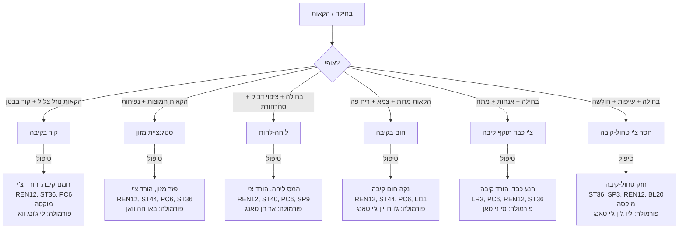

---

## 2. נפיחות (腹胀 Fu Zhang)

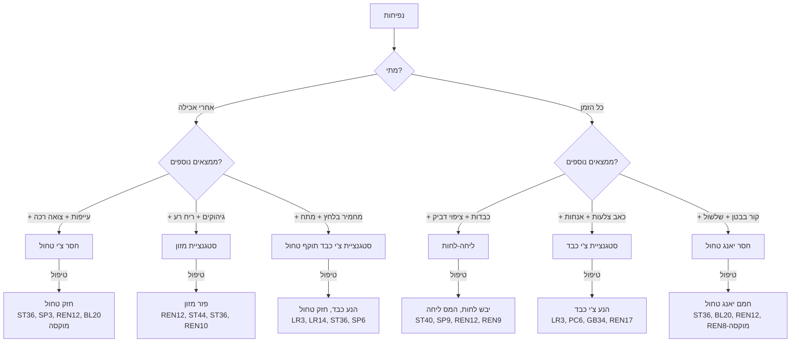

---

## 3. שלשול (泄泻 Xie Xie)

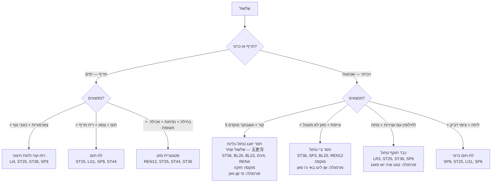

---

## 4. עצירות (便秘 Bian Mi)

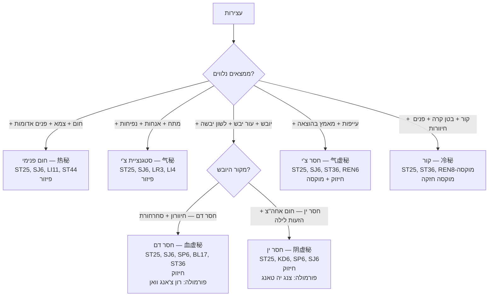

---

## 5. כאב בטן + עיכול — תרשים מאוחד

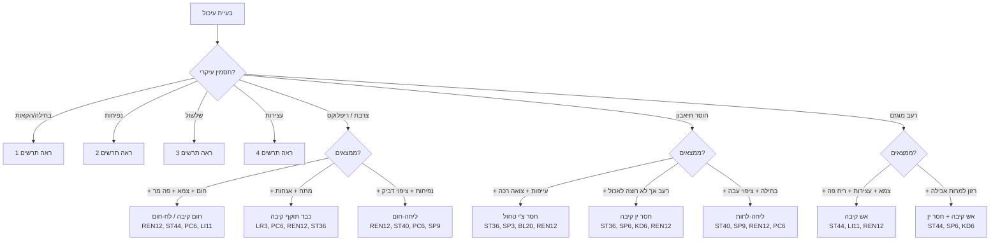

---

## 6. טבלת ייחוס מהירה — עיכול

| תסמין | דפוס נפוץ ביותר | נקודות ליבה | פורמולה |
|---|---|---|---|
| נפיחות אחרי אכילה | חסר צ'י טחול | ST36, SP3, REN12, BL20 | סי ג'ון ג'י / ליו ג'ון ג'י |
| שלשול כרוני | חסר טחול / טחול-כליות | ST36, BL20, BL23, REN12 | שן לינג באי ג'ו סאן |
| עצירות + חום | חום פנימי | ST25, SJ6, LI11, ST44 | מא ג'י רן וואן |
| בחילה | צ'י קיבה עולה | PC6, REN12, ST36 | לפי דפוס |
| צרבת | חום קיבה / כבד → קיבה | REN12, ST44, PC6, LR3 | צואו שואה גאן טאנג |
| חוסר תיאבון | חסר טחול | ST36, SP3, BL20 | סי ג'ון ג'י טאנג |
| IBS — שלשול + עצירות | כבד תוקף טחול | LR3, ST25, ST36, SP6 | טונג שיה יאו פאנג |
| גזים | סטגנציית צ'י / חסר טחול | REN6, ST25, LR3, ST36 | לפי דפוס |

---

### נקודות מפתח לעיכול

| נקודה | תפקיד מרכזי |
|---|---|
| **REN12** (中脘) | מו קיבה — מרכז טיפול בכל בעיות קיבה |
| **ST36** (足三里) | הֶה-ארץ — מחזקת צ'י טחול-קיבה |
| **PC6** (内关) | נגד בחילה — מוכח מחקרית |
| **ST25** (天枢) | מו מעי גס — מווסתת מעיים |
| **SP6** (三阴交) | מחזקת טחול, מווסתת |
| **ST40** (丰隆) | ממיס ליחה |
| **SP9** (阴陵泉) | מייבשת לחות |
| **LR3** (太冲) | מניעה כבד — כשכבד תוקף קיבה/טחול |

---

## Source: `flowcharts/emotional-flowchart.md`

<div dir="rtl">

# תרשים זרימה — מצבים רגשיים

## Emotional Disorders Flowchart (情志病辨证流程 Qing Zhi Bing Bian Zheng Liu Cheng)

---

> **רקע:** ברפואה הסינית, שבעת הרגשות (七情 Qi Qing) הם גורמי מחלה פנימיים. כל רגש פוגע באיבר ספציפי: כעס → כבד, שמחה → לב, דאגה → טחול, עצב → ריאות, פחד → כליות.

---

## 1. חרדה ופחד (焦虑恐惧)

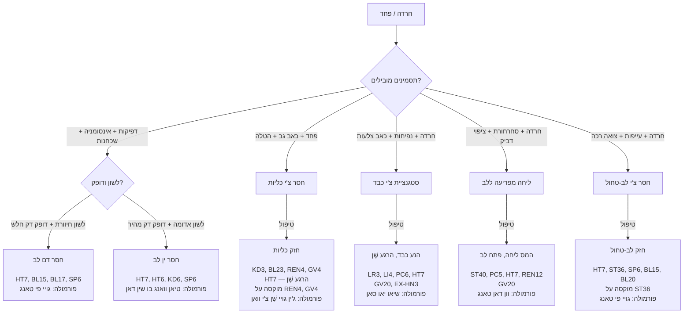

---

## 2. דיכאון (抑郁 Yi Yu)

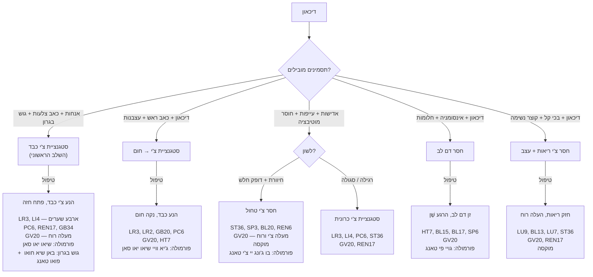

---

## 3. כעס ועצבנות (怒 Nu / 烦躁 Fan Zao)

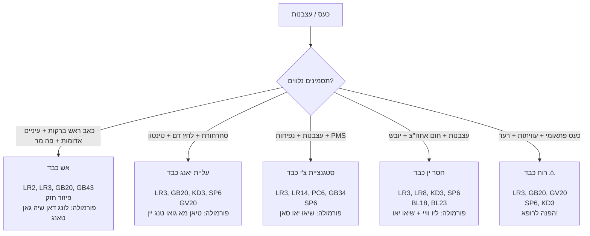

---

## 4. אינסומניה (失眠 Shi Mian)

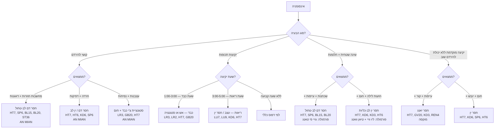

---

## 5. מתח וסטרס כרוני (压力 Ya Li)

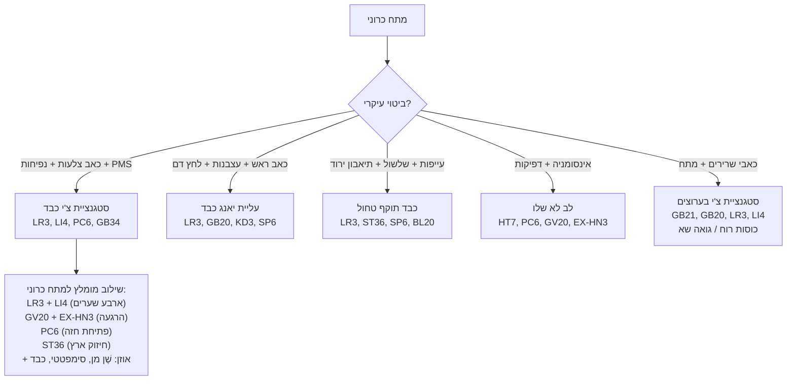

---

## 6. טבלת ייחוס מהירה — רגשות

| רגש / מצב | איבר מעורב | דפוס שכיח | נקודות ליבה | פורמולה |
|---|---|---|---|---|
| כעס | כבד | אש כבד / סטגנציית צ'י | LR2/LR3, GB20, HT7 | לונג דאן / שיאו יאו |
| חרדה | לב + כליות | חסר דם/ין לב / חסר כליות | HT7, KD3, PC6, GV20 | גויי פי / טיאן וואנג |
| דאגנות | טחול | חסר צ'י טחול | ST36, SP3, HT7, GV20 | גויי פי טאנג |
| עצב | ריאות | חסר צ'י ריאות | LU7, LU9, BL13, GV20 | בו ג'ונג יי צ'י |
| פחד | כליות | חסר כליות | KD3, BL23, HT7, GV20 | ג'ין גויי / ליו וויי |
| דיכאון | כבד (+ טחול) | סטגנציית צ'י כבד | LR3, LI4, GV20, PC6 | שיאו יאו סאן |
| אינסומניה | לב | חסר דם/ין לב | HT7, AN MIAN, KD6, SP6 | גויי פי / טיאן וואנג |
| מתח כרוני | כבד → טחול | סטגנציית צ'י → חסר טחול | LR3, LI4, ST36, GV20 | שיאו יאו סאן |

---

### נקודות מפתח למצבים רגשיים

| נקודה | תפקיד רגשי |
|---|---|
| **HT7** (神门) | "שער השֶׁן" — מרגיעה לב ורוח, כל מצב רגשי |
| **GV20** (百会) | מעלה שֶׁן, מבהירה ראש, נגד דיכאון |
| **EX-HN3** (印堂) | מרגיעה שֶׁן, "עין שלישית", הרגעה |
| **PC6** (内关) | פותחת חזה, מפחיתה חרדה, מרגיעה קיבה |
| **LR3** (太冲) | מניעה כבד — כל מצב של סטגנציה רגשית |
| **LI4** (合谷) | "ארבע שערות" עם LR3 — מניעה כללית |
| **KD1** (涌泉) | מעגנת, מורידה אש ורוח — חרדה, פאניקה |
| **AN MIAN** | נקודה ספציפית לשינה |

---

## Source: `flowcharts/gynecology-flowchart.md`

<div dir="rtl">

# תרשים זרימה — גינקולוגיה

## Gynecology Flowchart (妇科辨证流程 Fu Ke Bian Zheng Liu Cheng)

---

> **רקע:** גינקולוגיה ברפואה הסינית מבוססת על איזון צ'ונג מאי (冲脉) ורן מאי (任脉), בריאות כבד (שולט בזרימת צ'י ואחסון דם), טחול (מייצר דם ומחזיק אותו), וכליות (שולטות ברבייה ובג'ינג).

---

## 1. כאבי מחזור — דיסמנוריאה (痛经 Tong Jing)

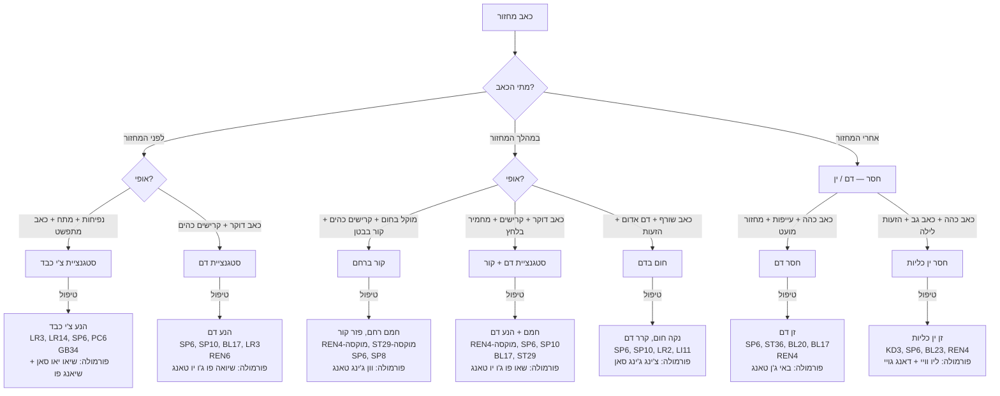

---

## 2. אי-סדירות מחזור (月经不调 Yue Jing Bu Tiao)

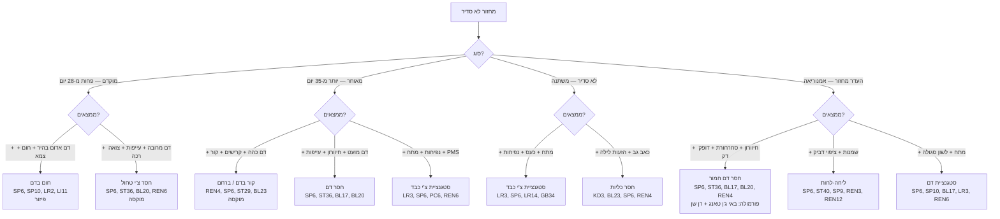

---

## 3. דימום רחמי חריג (崩漏 Beng Lou)

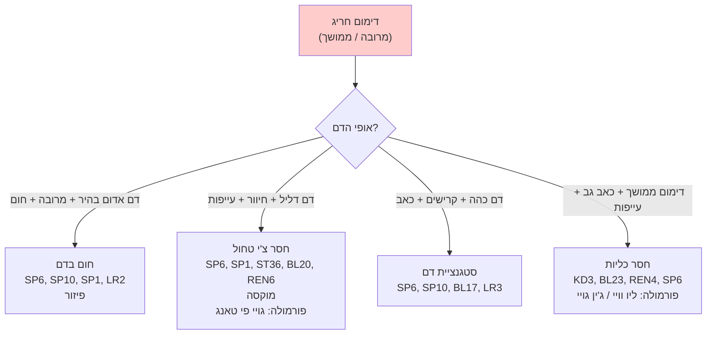

> **⚠ חשוב:** דימום רחמי חריג דורש גם הפניה לבדיקה גינקולוגית מערבית לשלילת גורמים אורגניים.

---

## 4. פוריות (不孕 Bu Yun)

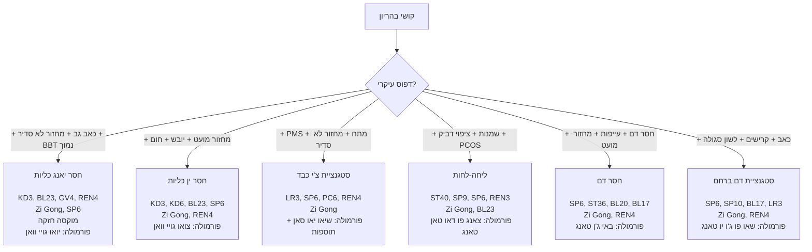

### פרוטוקול פוריות לפי שלבי המחזור

| שלב | ימים | עיקרון | נקודות |
|---|---|---|---|
| **מחזור** (ימים 1-5) | דימום | הנע דם, נקה | SP6, SP10, LR3, REN3 |
| **פוליקולרי** (ימים 6-13) | אחרי דימום | זן ין, בנה דם | KD3, KD6, SP6, BL23, REN4 |
| **ביוץ** (ימים 13-15) | ביוץ | הנע צ'י, חמם יאנג | LR3, LI4, SP6, REN4, Zi Gong |
| **לוטיאלי** (ימים 16-28) | אחרי ביוץ | חמם יאנג, חזק כליות | GV4, BL23, REN4, KD3, ST36 מוקסה |

---

## 5. מנופאוזה — תסמונת גיל המעבר (更年期综合征)

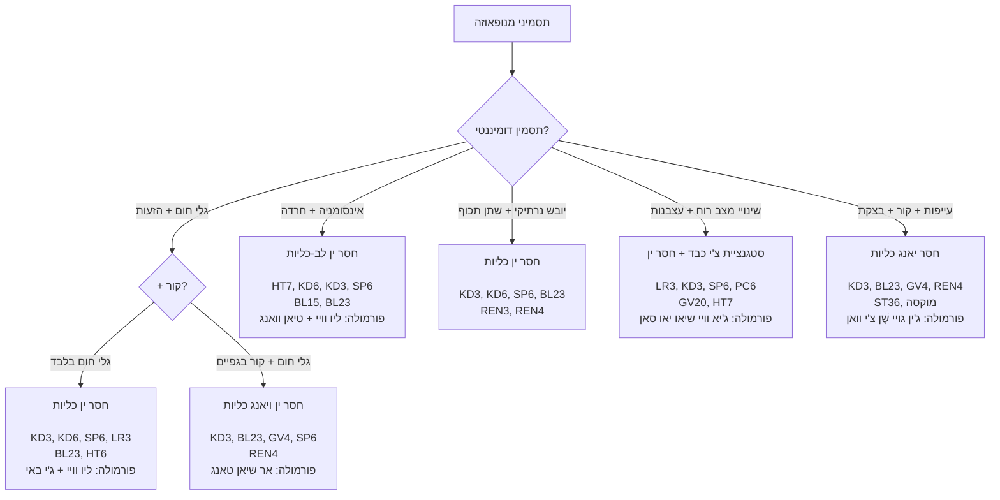

---

## 6. הפרשות נרתיקיות (带下病 Dai Xia Bing)

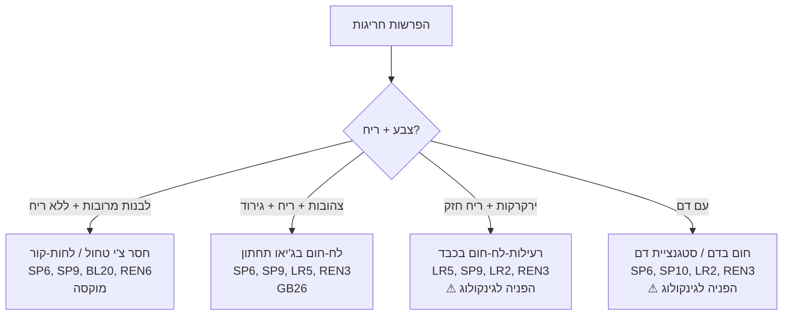

---

## 7. טבלת ייחוס מהירה — גינקולוגיה

| מצב | דפוס שכיח | נקודות ליבה | פורמולה |
|---|---|---|---|
| כאב מחזור — לפני | סטגנציית צ'י כבד | LR3, SP6, PC6, LR14 | שיאו יאו סאן |
| כאב מחזור — במהלך + קור | קור ברחם | REN4, SP6, ST29 + מוקסה | וון ג'ינג טאנג |
| כאב מחזור — אחרי | חסר דם | SP6, ST36, BL17, BL20 | באי ג'ן טאנג |
| מחזור מוקדם | חום בדם / חסר צ'י | SP6, SP10, LR2 / ST36 | לפי דפוס |
| מחזור מאוחר | קור / חסר דם | REN4, SP6, BL23 / ST36 | לפי דפוס |
| PMS | סטגנציית צ'י כבד | LR3, SP6, PC6, GB34 | שיאו יאו סאן |
| פוריות | חסר כליות (ין/יאנג) | KD3, BL23, REN4, SP6, Zi Gong | יואו/צואו גויי |
| מנופאוזה — גלי חום | חסר ין כליות | KD3, KD6, SP6, HT7 | ליו וויי + ג'י באי |
| דימום חריג | חסר צ'י / חום בדם | SP1, SP6, ST36, BL20 | גויי פי טאנג |

---

### נקודות מפתח בגינקולוגיה

| נקודה | חשיבות |
|---|---|
| **SP6** (三阴交) | מפגש שלוש ערוצי ין — מרכזית לכל בעיה גינקולוגית. ⚠ אסור בהיריון! |
| **REN4** (关元) | מחזקת כליות ורחם — פוריות, מחזור |
| **Zi Gong** (子宫) | "נקודת הרחם" — פוריות, כאב מחזור |
| **ST29** (归来) | מחממת רחם — קור ברחם |
| **SP8** (地机) | נקודת שי — כאבי מחזור חריפים |
| **LR3** (太冲) | מניעה צ'י כבד — PMS, סטגנציה |
| **BL23** (肾俞) | מחזקת כליות — פוריות, מנופאוזה |
| **SP10** (血海) | "ים הדם" — מווסתת דם |

---

## Source: `flowcharts/pain-flowchart.md`

<div dir="rtl">

# תרשים זרימה — כאב

## Pain Diagnostic Flowchart (疼痛辨证流程 Teng Tong Bian Zheng Liu Cheng)

---

> **הוראות:** עקוב/י אחרי תרשים הזרימה מלמעלה למטה. בכל צומת — בחר/י את התשובה המתאימה ביותר. התרשים מוביל מהתלונה אל הדפוס, עיקרון הטיפול והנקודות המרכזיות.

---

## 1. כאב ראש (头痛 Tou Tong)

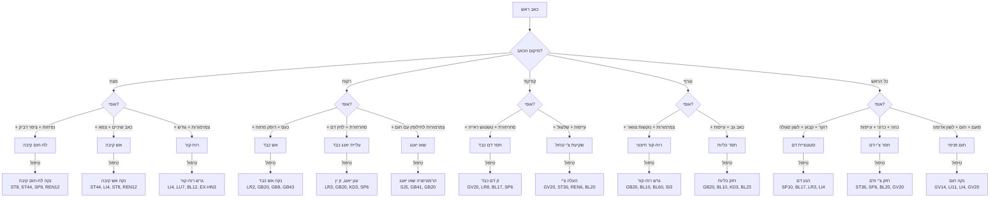

---

## 2. כאב גב תחתון (腰痛 Yao Tong)

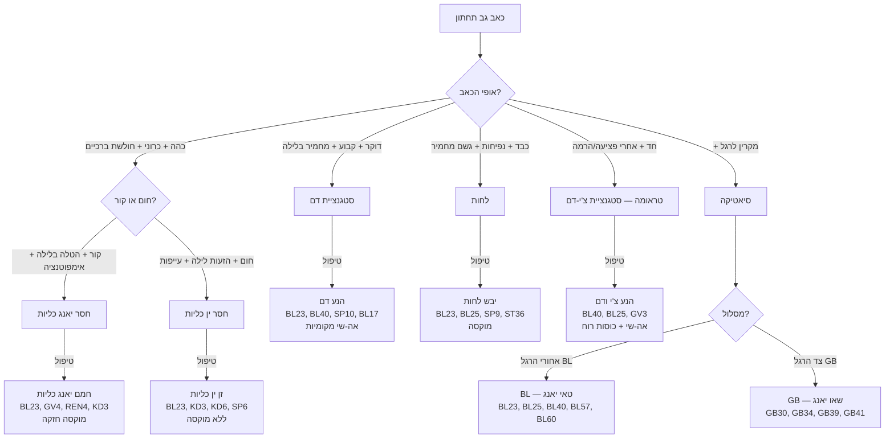

---

## 3. כאב בטן (腹痛 Fu Tong)

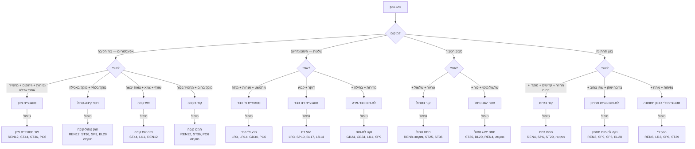

---

## 4. כאב מפרקים — BI Syndrome (痹证 Bi Zheng)

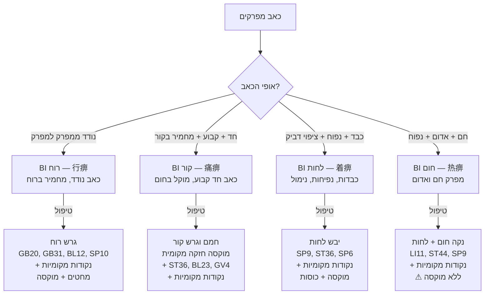

---

## 5. טבלת ייחוס מהירה — כאב

| אופי כאב | דפוס | נקודות מפתח | שיטה |
|---|---|---|---|
| דוקר, קבוע | סטגנציית דם | SP10, BL17, LR3, LI4 + מקומיות | פיזור |
| כהה, מתפשט | סטגנציית צ'י | LR3, LI4, PC6, GB34 + מקומיות | פיזור/אפילו |
| חד, מחמיר בקור | קור | מוקסה + ST36, BL23, GV4 + מקומיות | חיזוק + מוקסה |
| כבד + נפיחות | לחות | SP9, ST36, SP6 + מקומיות | מוקסה |
| שורף, אדום, חם | חום | LI11, ST44 + מקומיות | פיזור |
| נודד | רוח | GB20, GB31, BL12 + מקומיות | פיזור |
| כהה + עייפות | חסר | ST36, SP6, BL20 + מקומיות | חיזוק + מוקסה |
| מוקל בלחץ | חסר | חיזוק + מוקסה |
| מחמיר בלחץ | עודף | פיזור |
| מחמיר בתנועה | עודף / סטגנציית דם | פיזור |
| מוקל בתנועה | סטגנציית צ'י | פיזור/אפילו |

---

## Source: `flowcharts/respiratory-flowchart.md`

<div dir="rtl">

# תרשים זרימה — בעיות נשימה

## Respiratory Disorders Flowchart (呼吸系统辨证流程 Hu Xi Xi Tong Bian Zheng Liu Cheng)

---

## 1. שיעול (咳嗽 Ke Sou)

```mermaid
flowchart TD
    A[שיעול] --> B{חריף או כרוני?}
    
    B -->|חריף — ימים עד 3 שבועות| C{ממצאים?}
    B -->|כרוני — מעל 3 שבועות| D{ממצאים?}
    
    C -->|+ צמרמורות + כיח לבן דליל + גודש| C1["רוח-קור תוקף ריאות<br/>(风寒犯肺)"]
    C -->|+ חום + כאב גרון + כיח צהוב| C2["רוח-חום תוקף ריאות<br/>(风热犯肺)"]
    C -->|+ גרון יבש + אף יבש + שיעול יבש| C3["יובש תוקף ריאות<br/>(燥邪犯肺)"]
    
    D -->|+ כיח לבן מרובה + נפיחות + ציפוי דביק| D1["ליחה-לחות בריאות<br/>(痰湿阻肺)"]
    D -->|+ כיח צהוב עבה + חום + צמא| D2["ליחה-חום בריאות<br/>(痰热壅肺)"]
    D -->|+ שיעול יבש + גרון יבש + קול צרוד| D3["חסר ין ריאות<br/>(肺阴虚)"]
    D -->|+ שיעול חלש + קוצר נשימה + הזעה ספונטנית| D4["חסר צ'י ריאות<br/>(肺气虚)"]
    D -->|+ קוצר נשימה בשאיפה + כאב גב| D5["כליות לא קולטות צ'י<br/>(肾不纳气)"]
    
    C1 -->|טיפול| C1T["גרש רוח-קור, פתח ריאות<br/>LU7, LI4, BL12, BL13<br/>GV16, EX-HN3<br/>מוקסה קלה על BL12<br/>פורמולה: מא הואנג / גויי ג'י טאנג"]
    C2 -->|טיפול| C2T["גרש רוח-חום, נקה ריאות<br/>LU7, LI4, LI11, GV14<br/>LU10, LU5<br/>⚠ ללא מוקסה<br/>פורמולה: יין צ'יאו סאן"]
    C3 -->|טיפול| C3T["לחלח ריאות, עצור שיעול<br/>LU7, LU9, KD6, LU5<br/>REN22<br/>פורמולה: שא שן מאי דונג טאנג"]
    
    D1 -->|טיפול| D1T["יבש לחות, המס ליחה<br/>LU7, ST40, BL13, SP9<br/>REN12, REN22<br/>מוקסה על BL13, ST36<br/>פורמולה: אר חן טאנג + סאן ג'י טאנג"]
    D2 -->|טיפול| D2T["נקה חום, המס ליחה<br/>LU5, LU7, ST40, LI11<br/>BL13, REN22<br/>⚠ ללא מוקסה<br/>פורמולה: צ'ינג צ'י הואה טאן וואן"]
    D3 -->|טיפול| D3T["זן ין ריאות<br/>LU9, LU7, KD6, SP6<br/>BL13, BL43<br/>פורמולה: באי חה גו ג'ין טאנג"]
    D4 -->|טיפול| D4T["חזק צ'י ריאות<br/>LU9, BL13, LU7, ST36<br/>REN6, REN17<br/>מוקסה<br/>פורמולה: יו פינג פנג סאן"]
    D5 -->|טיפול| D5T["חזק כליות, קלוט צ'י<br/>KD3, BL23, REN4, LU7<br/>REN17, KD25<br/>מוקסה על BL23, REN4<br/>פורמולה: ג'ין גויי שֶׁן צ'י וואן"]
```

---

## 2. אסתמה / צפצופים (哮喘 Xiao Chuan)

```mermaid
flowchart TD
    A[אסתמה / צפצופים] --> B{שלב?}
    
    B -->|התקף חריף| C{סוג?}
    B -->|הפוגה — בין התקפים| D{דפוס?}
    
    C -->|קור — כיח לבן + קור + צפצוף| C1["אסתמה קרה<br/>(寒哮)"]
    C -->|חום — כיח צהוב + חום + צמא| C2["אסתמה חמה<br/>(热哮)"]
    
    D -->|+ עייפות + הצטננויות חוזרות| D1["חסר צ'י ריאות"]
    D -->|+ כאב גב + קוצר נשימה במאמץ| D2["חסר כליות"]
    D -->|+ עייפות + עיכול ירוד| D3["חסר טחול (מייצר ליחה)"]
    
    C1 -->|טיפול| C1T["חמם ריאות, המס ליחה קרה<br/>LU7, BL12, BL13, REN22<br/>REN17, Ding Chuan<br/>מוקסה!<br/>פורמולה: שיאו צ'ינג לונג טאנג"]
    C2 -->|טיפול| C2T["נקה חום, המס ליחה חמה<br/>LU5, LU7, LI11, ST40<br/>REN22, Ding Chuan<br/>⚠ ללא מוקסה<br/>פורמולה: דינג צ'יואן טאנג"]
    
    D1 -->|טיפול| D1T["חזק ריאות<br/>LU9, BL13, ST36, REN6<br/>פורמולה: יו פינג פנג סאן"]
    D2 -->|טיפול| D2T["חזק כליות<br/>KD3, BL23, REN4, GV4<br/>מוקסה<br/>פורמולה: ג'ין גויי שֶׁן צ'י וואן"]
    D3 -->|טיפול| D3T["חזק טחול, יבש ליחה<br/>ST36, SP3, BL20, ST40<br/>REN12, מוקסה<br/>פורמולה: ליו ג'ון ג'י טאנג"]
```

---

## 3. גודש באף / נזלת / סינוסיטיס (鼻炎 Bi Yan)

```mermaid
flowchart TD
    A[גודש באף / נזלת] --> B{חריף או כרוני?}
    
    B -->|חריף — הצטננות| C{ממצאים?}
    B -->|כרוני — אלרגי / סינוסיטיס| D{ממצאים?}
    
    C -->|+ צמרמורות + נזלת צלולה + כאבי גוף| C1["רוח-קור<br/>LI20, LI4, LU7, BL12<br/>EX-HN3, GV23<br/>מוקסה קלה"]
    C -->|+ חום + נזלת צהובה + כאב גרון| C2["רוח-חום<br/>LI20, LI4, LU7, LI11<br/>EX-HN3, GV14"]
    
    D -->|+ עיטוש בבוקר + רגישות לרוח + חוזר| D1["חסר צ'י ריאות<br/>(אלרגיה)<br/>LI20, LI4, LU7, BL13<br/>ST36, EX-HN3, BL2<br/>מוקסה על BL13, ST36<br/>פורמולה: יו פינג פנג סאן + צאנג ארר ג'י"]
    D -->|+ גודש כבד + הפרשה צהובה + כאב פנים| D2["לח-חום בריאות<br/>(סינוסיטיס)<br/>LI20, LI4, LI11, ST44<br/>EX-HN3, BL2, GV23<br/>פורמולה: צאנג ארר ג'י"]
    D -->|+ גודש + ציפוי דביק + עייפות| D3["ליחה-לחות<br/>LI20, ST40, SP9, LU7<br/>EX-HN3, REN12"]
```

---

## 4. כאב גרון (咽痛 Yan Tong)

```mermaid
flowchart TD
    A[כאב גרון] --> B{חריף או כרוני?}
    
    B -->|חריף — ימים| C{ממצאים?}
    B -->|כרוני — שבועות+| D{ממצאים?}
    
    C -->|+ חום + אדמומיות + נפיחות| C1["רוח-חום / אש<br/>LU11 — דקירת דם!<br/>LI4, LI11, LU10<br/>REN22, ST44"]
    C -->|+ צמרמורות + גרון כואב + כיח| C2["רוח-קור הופך לחום<br/>LI4, LU7, LI11<br/>REN22"]
    
    D -->|+ יובש + קול צרוד + גרון יבש אחה''צ| D1["חסר ין ריאות-כליות<br/>LU7, KD6, REN22<br/>LU9, SP6"]
    D -->|+ תחושת גוש + קושי בבליעה + מתח| D2["מיי חה צ'י — שזיף בגרון<br/>(梅核气)<br/>PC6, REN22, ST40<br/>LR3, REN17<br/>פורמולה: באן שיא חואו פואו טאנג"]
    D -->|+ גרון אדום + כאב חוזר| D3["אש ריק<br/>KD6, LU7, REN22<br/>KD2, SP6"]
```

---

## 5. קוצר נשימה (气短 Qi Duan / 喘 Chuan)

```mermaid
flowchart TD
    A[קוצר נשימה] --> B{מתי?}
    
    B -->|במאמץ| C{ממצאים נוספים?}
    B -->|במנוחה| D{ממצאים נוספים?}
    B -->|בשכיבה| E["ליחה-נוזלים בריאות ⚠<br/>או בעיית לב ⚠<br/>LU7, ST40, REN17<br/>PC6, KD3<br/>הפניה לרופא!"]
    
    C -->|+ עייפות + הזעה + קול חלש| C1["חסר צ'י ריאות<br/>LU9, BL13, ST36, REN6<br/>REN17, מוקסה"]
    C -->|+ כאב גב + ברכיים חלשות| C2["כליות לא קולטות צ'י<br/>KD3, BL23, REN4, LU7<br/>REN17, מוקסה"]
    C -->|+ דפיקות + חיוורון| C3["חסר צ'י לב-ריאות<br/>LU9, HT7, BL13, BL15<br/>REN17, ST36"]
    
    D -->|+ צפצופים + כיח| D1["ליחה חוסמת ריאות<br/>LU7, ST40, REN22, REN17<br/>BL13, Ding Chuan"]
    D -->|+ חרדה + דפיקות| D2["ליחה-אש מפריעה ללב<br/>ST40, PC6, HT7, LU7<br/>REN17"]
    D -->|+ חום + צמא + עצירות| D3["חום ריאות<br/>LU5, LI11, GV14, REN22<br/>⚠ הפניה!"]
```

---

## 6. טבלת ייחוס מהירה — נשימה

| מצב | דפוס | נקודות ליבה | שיטה | פורמולה |
|---|---|---|---|---|
| הצטננות — קור | רוח-קור | LU7, LI4, BL12 | פיזור + מוקסה | גויי ג'י / מא הואנג טאנג |
| הצטננות — חום | רוח-חום | LU7, LI4, LI11, GV14 | פיזור | יין צ'יאו סאן |
| שיעול יבש כרוני | חסר ין ריאות | LU9, KD6, LU7, BL13 | חיזוק | באי חה גו ג'ין טאנג |
| שיעול ליחתי | ליחה-לחות | LU7, ST40, SP9, BL13 | מעורב + מוקסה | אר חן טאנג |
| שיעול + כיח צהוב | ליחה-חום | LU5, LU7, ST40, LI11 | פיזור | צ'ינג צ'י הואה טאן |
| אסתמה — התקף קר | ליחה-קור | LU7, BL13, REN22, Ding Chuan | פיזור + מוקסה | שיאו צ'ינג לונג |
| אסתמה — התקף חם | ליחה-חום | LU5, ST40, REN22, Ding Chuan | פיזור | דינג צ'יואן טאנג |
| אסתמה — הפוגה | חסר ריאות-כליות | LU9, BL13, KD3, BL23 | חיזוק + מוקסה | יו פינג פנג + ג'ין גויי |
| אלרגית נזלת | חסר צ'י ריאות | LI20, LI4, LU7, ST36 | חיזוק + מוקסה | יו פינג פנג סאן |
| סינוסיטיס | לח-חום | LI20, LI4, LI11, ST44 | פיזור | צאנג ארר ג'י |
| כאב גרון חריף | רוח-חום / אש | LU11, LI4, LI11, REN22 | פיזור / דקירת דם | יין צ'יאו סאן |
| גרון יבש כרוני | חסר ין | LU7, KD6, REN22, SP6 | חיזוק | באי חה / מאי מן דונג |
| קוצר נשימה כרוני | חסר ריאות + כליות | LU9, KD3, BL13, BL23, REN17 | חיזוק + מוקסה | לפי דפוס |

---

### נקודות מפתח לנשימה

| נקודה | תפקיד מרכזי |
|---|---|
| **LU7** (列缺) | לואו ריאות — מווסתת ופותחת ריאות, מגרשת רוח |
| **LI4** (合谷) | מגרשת רוח, פותחת שטח — כל פלישה חיצונית |
| **BL13** (肺俞) | בֵּי-שוּ ריאות — מחזקת ריאות |
| **REN22** (天突) | מקומית לגרון — עוצרת שיעול, פותחת גרון |
| **REN17** (膻中) | מו קרום לב — מחזקת צ'י חזה, פותחת נשימה |
| **ST40** (丰隆) | "נקודת הליחה" — ממיסה ליחה מכל מקום |
| **LU5** (尺泽) | הֶה-מים — מנקה חום ריאות |
| **LU9** (太渊) | מקור + ארץ — מחזקת צ'י ריאות |
| **KD3** (太溪) | מקור כליות — כליות קולטות צ'י ריאות |
| **Ding Chuan** (定喘) | EX-B1 — נקודה ספציפית לאסתמה |
| **LI20** (迎香) | פותחת אף — כל בעיית אף |
| **EX-HN3** (印堂) | פותחת אף, מרגיעה |
| **LU11** (少商) | ג'ינג-באר — דקירת דם לכאב גרון חריף |

---

## Source: `README.md`

<div dir="rtl">

# שאלון אבחון מקיף למטפל - הוראות שימוש

## Comprehensive Diagnostic Questionnaire - User Guide

---

## סקירה כללית

כלי האבחון המקיף הזה נועד לסייע למטפל בדיקור סיני (针灸 Zhen Jiu) לבצע תהליך אבחון שיטתי, מקיף ומדויק. הוא מכסה את כל שלבי האבחון — מקליטה ראשונית ועד תוכנית טיפול מלאה — ומבוסס על ארבע שיטות האבחון המסורתיות:

1. **התבוננות** (望 Wang) — מראה כללי, לשון, גוון עור
2. **האזנה והרחה** (闻 Wen) — קול, נשימה, ריח
3. **תשאול** (问 Wen) — שאלות מובנות
4. **מישוש** (切 Qie) — דופק, מישוש בטן וערוצים

---

## מבנה כלי האבחון

### שלב 1: קליטה ותשאול

| קובץ | תוכן | מתי להשתמש |
|---|---|---|
| [01-intake-form.md](01-intake-form.md) | טופס קליטה ראשוני | ביקור ראשון — לפני הפגישה |
| [02-ten-questions.md](02-ten-questions.md) | עשר השאלות (十问 Shi Wen) | ביקור ראשון — במהלך הפגישה |

### שלב 2: בדיקה גופנית

| קובץ | תוכן | מתי להשתמש |
|---|---|---|
| [03-tongue-checklist.md](03-tongue-checklist.md) | רשימת תיוג לאבחון לשון | כל ביקור |
| [04-pulse-checklist.md](04-pulse-checklist.md) | רשימת תיוג לאבחון דופק | כל ביקור |
| [05-inspection-checklist.md](05-inspection-checklist.md) | רשימת תיוג להתבוננות | כל ביקור |
| [06-palpation-checklist.md](06-palpation-checklist.md) | רשימת תיוג למישוש | לפי הצורך |

### שלב 3: זיהוי דפוס ותכנון טיפול

| קובץ | תוכן | מתי להשתמש |
|---|---|---|
| [07-pattern-identification.md](07-pattern-identification.md) | מממצאים לאבחנה — זיהוי דפוסים | אחרי איסוף כל הנתונים |
| [08-pattern-to-points.md](08-pattern-to-points.md) | מיפוי דפוסים לנקודות דיקור | בחירת נקודות לטיפול |
| [09-point-combinations.md](09-point-combinations.md) | שילובי נקודות קלאסיים | התייחסות מהירה |
| [10-herbal-integration-guide.md](10-herbal-integration-guide.md) | שילוב פורמולות צמחים | כשנדרש טיפול משולב |

### שלב 4: תיעוד ומעקב

| קובץ | תוכן | מתי להשתמש |
|---|---|---|
| [11-treatment-plan-template.md](11-treatment-plan-template.md) | תבנית תוכנית טיפול | כל טיפול |
| [12-followup-form.md](12-followup-form.md) | טופס מעקב | ביקורי המשך |

### תרשימי זרימה לאבחון מהיר

| קובץ | תוכן |
|---|---|
| [flowcharts/pain-flowchart.md](flowcharts/pain-flowchart.md) | תרשים זרימה — כאב |
| [flowcharts/digestive-flowchart.md](flowcharts/digestive-flowchart.md) | תרשים זרימה — בעיות עיכול |
| [flowcharts/emotional-flowchart.md](flowcharts/emotional-flowchart.md) | תרשים זרימה — מצבים רגשיים |
| [flowcharts/gynecology-flowchart.md](flowcharts/gynecology-flowchart.md) | תרשים זרימה — גינקולוגיה |
| [flowcharts/respiratory-flowchart.md](flowcharts/respiratory-flowchart.md) | תרשים זרימה — בעיות נשימה |

---

## זרימת עבודה שלב אחר שלב

### ביקור ראשון (60-90 דקות)

```
שלב 1: קליטה
├── המטופל ממלא את טופס הקליטה (01) לפני הפגישה או בתחילתה
├── המטפל עובר על הטופס ומשלים פרטים חסרים
└── זמן: 10-15 דקות

שלב 2: תשאול מעמיק
├── עוברים על עשר השאלות (02) בצורה שיטתית
├── רושמים תשובות ומציינים ממצאים משמעותיים
└── זמן: 15-20 דקות

שלב 3: בדיקה גופנית
├── התבוננות כללית (05) — שֶׁן, מראה, תנועה
├── אבחון לשון (03) — גוף, ציפוי, תנועה
├── אבחון דופק (04) — שלוש עמדות, שתי ידיים
├── מישוש (06) — בטן, נקודות רגישות, ערוצים
└── זמן: 10-15 דקות

שלב 4: ניתוח ואבחנה
├── סיווג לפי שמונת העקרונות (07)
├── זיהוי חומר פתולוגי
├── זיהוי איבר מעורב
├── קביעת דפוס ספציפי
└── זמן: 5-10 דקות (בהתחלה יותר)

שלב 5: תוכנית טיפול
├── בחירת נקודות לפי דפוס (08)
├── הוספת שילובים קלאסיים (09)
├── שקילת פורמולה צמחית (10)
├── מילוי תבנית תוכנית טיפול (11)
└── זמן: 5-10 דקות

שלב 6: ביצוע הטיפול
├── דיקור לפי התוכנית
├── תיעוד תגובות מיידיות
└── זמן: 20-30 דקות

שלב 7: סיכום
├── המלצות אורח חיים
├── תדירות טיפולים מומלצת
├── קביעת מועד המשך
└── זמן: 5 דקות
```

### ביקור המשך (45-60 דקות)

```
שלב 1: הערכת שינויים
├── מילוי טופס מעקב (12)
├── דירוג שיפור בתסמינים (1-10)
└── זמן: 5-10 דקות

שלב 2: בדיקה מעודכנת
├── לשון ודופק (03, 04)
├── השוואה לביקור קודם
└── זמן: 5-10 דקות

שלב 3: הערכה מחדש
├── עדכון דפוס (07)
├── שינוי נקודות לפי הצורך (08, 09)
└── זמן: 5 דקות

שלב 4: טיפול + תיעוד
├── ביצוע דיקור
├── תיעוד בתבנית (11)
└── זמן: 25-35 דקות
```

---

## טיפים לשימוש יעיל

### למטפל מתחיל
1. **עקוב אחרי הסדר** — השתמש בטפסים לפי הסדר המספרי
2. **אל תדלג על שלבים** — גם אם נראה שהאבחנה ברורה
3. **השתמש בתרשימי הזרימה** — כשאתה מתלבט בין דפוסים
4. **תרגל אבחון לשון ודופק** — כל יום על עצמך ועל מכרים
5. **מלא את כל הטפסים** — גם אם זה לוקח זמן, זה בונה הרגלים טובים

### למטפל מנוסה
1. **השתמש ברשימות התיוג** — כ"רשת ביטחון" לוודא שלא פספסת משהו
2. **הפנה ל-07 (זיהוי דפוסים)** — במקרים מורכבים עם דפוסים מעורבים
3. **השתמש ב-08 + 09** — לבניית תוכנית טיפול אופטימלית
4. **השתמש בתרשימי זרימה** — להדרכת סטודנטים ומתמחים

### עקרונות מנחים
- **השלם גובר על המושלם** — עדיף לתעד 80% מאשר לא לתעד כלל
- **כל מטופל ייחודי** — הדפוסים הם מדריכים, לא כללים מוחלטים
- **ארבע שיטות = תמונה אחת** — שלב את כל הממצאים לתמונה אחידה
- **הלשון והדופק לא משקרים** — כשיש סתירה בין תלונה לממצאים אובייקטיביים, סמוך על הלשון והדופק

---

## קיצורים ומקרא

| קיצור | משמעות |
|---|---|
| LU | ריאות (Lung) |
| LI | מעי גס (Large Intestine) |
| ST | קיבה (Stomach) |
| SP | טחול (Spleen) |
| HT | לב (Heart) |
| SI | מעי דק (Small Intestine) |
| BL | שלפוחית השתן (Bladder) |
| KD | כליות (Kidney) |
| PC | קרום הלב (Pericardium) |
| SJ | סאן ג'יאו (San Jiao) |
| GB | כיס המרה (Gallbladder) |
| LR | כבד (Liver) |
| DU | דו מאי (Du Mai) — כלי מושל |
| REN | רן מאי (Ren Mai) — כלי תפיסה |
| EX | נקודות חוץ-ערוציות (Extra Points) |

| סימן | משמעות |
|---|---|
| ☐ | תיבת סימון — סמן את הרלוונטי |
| ★ | ממצא חשוב במיוחד |
| ⚠ | דורש תשומת לב מיוחדת |
| → | מצביע על דפוס / השלכה |

---

## הפניות

- **Maciocia, G.** — The Foundations of Chinese Medicine (3rd ed.)
- **Deadman, P.** — A Manual of Acupuncture
- **Chen, J.K. & Chen, T.T.** — Chinese Medical Herbology and Pharmacology
- **Wiseman, N. & Ye, F.** — A Practical Dictionary of Chinese Medicine
- **黄帝内经** (Huang Di Nei Jing) — הקלאסיקה הפנימית של הקיסר הצהוב

---

