# 03-large-intestine

## ערוץ המעי הגס - שו יאנג מינג דה צ'אנג (手阳明大肠经)

### Hand Yang Ming Large Intestine Channel (Shou Yang Ming Da Chang Jing)

***

### מטרות למידה

בסיום שיעור זה, הסטודנט יוכל:

1. לתאר את מסלול ערוץ המעי הגס — חיצוני ופנימי
2. לאתר את כל 20 הנקודות (LI1-LI20) על הגוף
3. לתאר את פעולות כל נקודה ואת התוויותיה
4. לבצע דיקור בטוח בכל נקודות הערוץ
5. להסביר את הקשר פנים-חוץ בין מעי גס (LI) לריאות (LU)
6. לזהות פתולוגיות נפוצות של ערוץ המעי הגס

***

### 1. סקירת הערוץ

#### 1.1 מידע כללי

| מאפיין       | פרטים                                    |
| ------------ | ---------------------------------------- |
| שם סיני      | 手阳明大肠经 (Shou Yang Ming Da Chang Jing)    |
| סוג          | יאנג — יאנג מינג (Yang Ming)             |
| גפה          | יד (Hand)                                |
| איבר         | מעי גס (大肠 Da Chang)                     |
| זוג פנים-חוץ | ריאות (LU) — טאי ין                      |
| מספר נקודות  | 20 (LI1-LI20)                            |
| שעת שיא      | 05:00-07:00                              |
| כיוון זרימה  | מהאצבע המורה אל הפנים (הצד הנגדי של האף) |
| אלמנט        | מתכת (金 Jin)                             |

#### 1.2 מסלול הערוץ

**מסלול חיצוני (外行 Wai Xing)**

1. **מתחיל** בפינה הרדיאלית של ציפורן האצבע המורה (LI1)
2. **עולה** לאורך הצד הרדיאלי (צד האגודל) של האצבע המורה
3. **ממשיך** בין עצמות המטקרפל הראשונה והשנייה (LI4)
4. **עובר** דרך ה-"Anatomical Snuffbox" ועולה לאורך הצד האחורי-לטרלי של האמה
5. **מגיע** למרפק (LI11) בצד הלטרלי
6. **עולה** לאורך הצד הלטרלי-קדמי של הזרוע העליונה
7. **מגיע** לכתף (LI15) ולבליטת הכתף
8. **יורד** אל הגומה שמעל לבריח (LI16) ועולה לצוואר
9. **חוצה את הלחי** ונכנס לחניכיים התחתונות ושיניים
10. **חוצה** את השפה העליונה ומסתיים בצד הנגדי של האף (LI20)

**מסלול פנימי (内行 Nei Xing)**

1. מ-LI16, ענף פנימי יורד דרך הסרעפת
2. מתחבר לריאות (האיבר המזווג)
3. חודר דרך הסרעפת אל המעי הגס

**ענף לפנים**

* מ-LI16, ענף עולה לצוואר ולחי, נכנס לשיניים התחתונות
* חוצה את הפילטרום (人中 Ren Zhong / DU26) — כאן ערוצי ימין ושמאל מצטלבים
* LI20 של ימין נמצא ליד נחיר שמאל, ולהפך

#### 1.3 תפקודי איבר המעי הגס (大肠 Da Chang)

* **שולט בהעברה ובהוצאה** (传导糟粕) — מקבל פסולת מהמעי הדק ומוציא אותה
* **שולט בנוזלים** — ספיגת מים מהפסולת
* **קשור לריאות** — הריאות שולטות בהורדת צ'י, שמשפיעה על תפקוד המעי
* **קשור לעור** — דרך הריאות (פנים-חוץ), בעיות עור קשורות למעי
* **נפתח לאף** (דרך הערוץ) — LI20 ליד האף

#### 1.4 פתולוגיות נפוצות של הערוץ

* כאב שיניים, כאב חניכיים, נפיחות בפנים
* כאב גרון, דימום מהאף
* עצירות, שלשול
* כאב לאורך מסלול הערוץ: אצבע מורה, יד, אמה, מרפק, כתף
* בעיות עור (אקנה, אקזמה)
* כאב ראש קדמי (Frontal headache)

***

### 2. נקודות הערוץ

***

#### LI1 — שאנג יאנג (商阳)

**שם סיני**: 商阳 (Shang Yang) **משמעות השם**: "יאנג של המתכת" — שאנג = צליל המתכת; יאנג = ערוץ יאנג **קטגוריה מיוחדת**: נקודת ג'ינג-באר (井穴 Jing Xue) — אלמנט מתכת (金 Jin)

**מיקום אנטומי**

בצד הרדיאלי (צד האגודל) של האצבע המורה, כ-0.1 צון מפינת בסיס הציפורן.

**איך למצוא את הנקודה**

1. התבוננו באצבע המורה של המטופל
2. אתרו את ציפורן האצבע המורה
3. הנקודה בפינה של בסיס הציפורן — בצד שפונה לאגודל (צד רדיאלי)
4. מדדו כ-0.1 צון (2 מ"מ) מפינת הציפורן, באלכסון

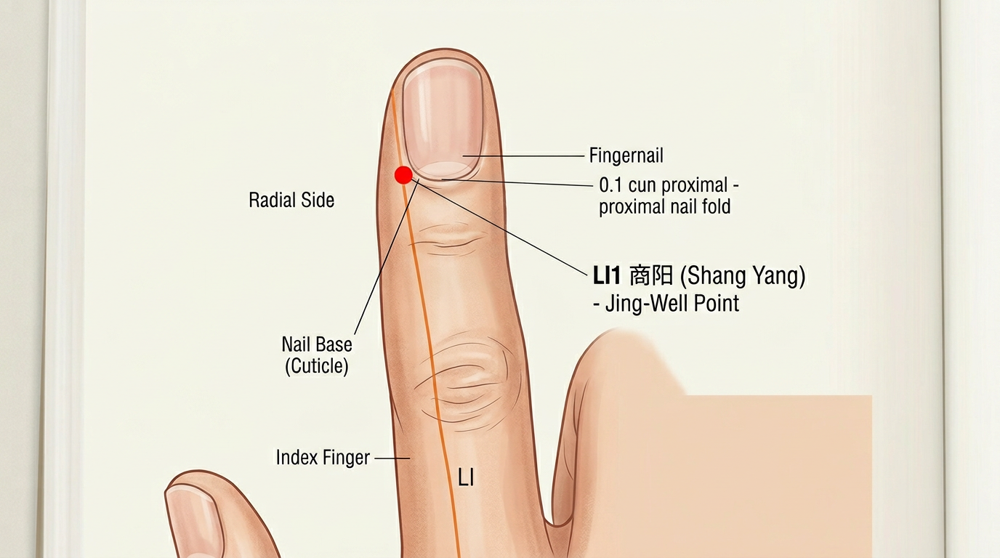

**דיקור**

* **שיטה**: בעיקר הוצאת דם (放血) עם מחט משולשת
* **עומק**: 0.1 צון
* **תחושת דה-צ'י**: כאב חד מקומי

**פעולות והתוויות**

* **פעולות**: מפנה חום; מועיל לגרון ולשיניים; משחרר שטח; מחייה מאבדן הכרה
* **התוויות**: כאב שיניים, כאב גרון, נפיחות בלחי, חום גבוה, אובדן הכרה, נימול באצבעות
* **שילובים נפוצים**: LI1 + LU11 (הוצאת דם — חום גבוה, כאב גרון)

***

#### LI2 — אר ג'יאן (二间)

**שם סיני**: 二间 (Er Jian) **משמעות השם**: "המרווח השני" — הנקודה השנייה בערוץ, במרווח השני של האצבע **קטגוריה מיוחדת**: נקודת יינג-מעיין (荥穴 Ying Xue) — אלמנט מים (水 Shui)

**מיקום אנטומי**

בצד הרדיאלי של האצבע המורה, דיסטלית למפרק המטקרפו-פלנגיאלי (MCP), בגבול בין העור הבהיר לכהה.

**איך למצוא את הנקודה**

1. בקשו מהמטופל לכופף מעט את האצבע המורה
2. אתרו את מפרק הפרק השני (MCP) של האצבע — הבליטה הגדולה בבסיס האצבע
3. הנקודה נמצאת דיסטלית (לכיוון קצה האצבע) למפרק, בצד הרדיאלי
4. על הגבול בין העור הבהיר (כף) לעור הכהה (גב)

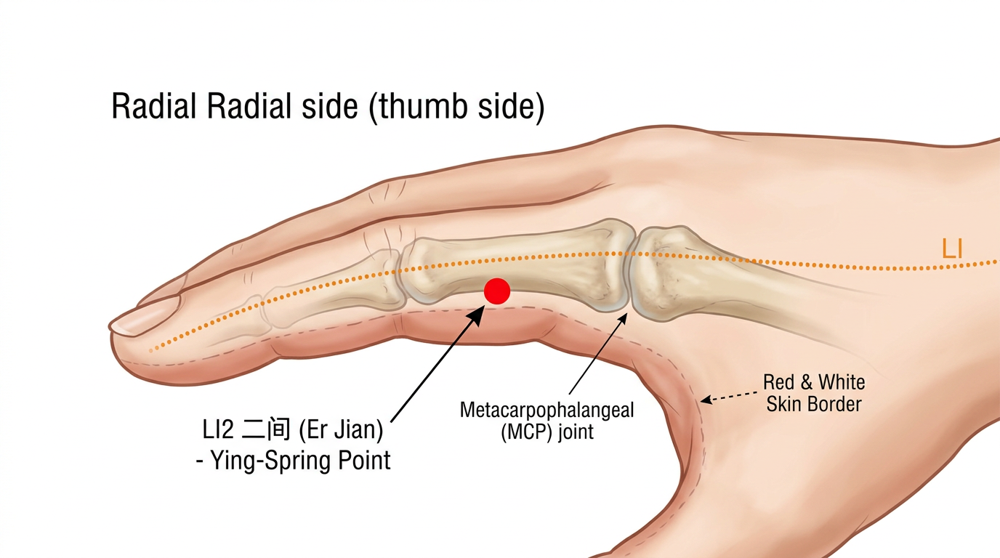

**דיקור**

* **זווית**: ניצבת, 90°
* **עומק**: 0.2-0.3 צון
* **תחושת דה-צ'י**: נימול מקומי

**פעולות והתוויות**

* **פעולות**: מפנה חום מערוץ יאנג מינג; מועיל לגרון, לאף ולשיניים
* **התוויות**: כאב שיניים, דימום מהאף, כאב גרון, ראייה מטושטשת
* **שילובים נפוצים**: LI2 + LI4 (כאב שיניים חריף)

***

#### LI3 — סאן ג'יאן (三间)

**שם סיני**: 三间 (San Jian) **משמעות השם**: "המרווח השלישי" — הנקודה השלישית בערוץ **קטגוריה מיוחדת**: נקודת שו-זרם (输穴 Shu Xue) — אלמנט עץ (木 Mu)

**מיקום אנטומי**

בצד הרדיאלי של האצבע המורה, פרוקסימלית למפרק המטקרפו-פלנגיאלי (MCP), בגומה שמאחורי ראש עצם המטקרפל השנייה.

**איך למצוא את הנקודה**

1. בקשו מהמטופל לקפוץ את האגרוף בעדינות
2. אתרו את מפרק ה-MCP של האצבע המורה (הפרק הבולט)
3. גששו את הגומה שמאחורי ראש עצם המטקרפל — פרוקסימלית למפרק
4. הנקודה בצד הרדיאלי (צד האגודל), על הגבול בין עור בהיר לכהה

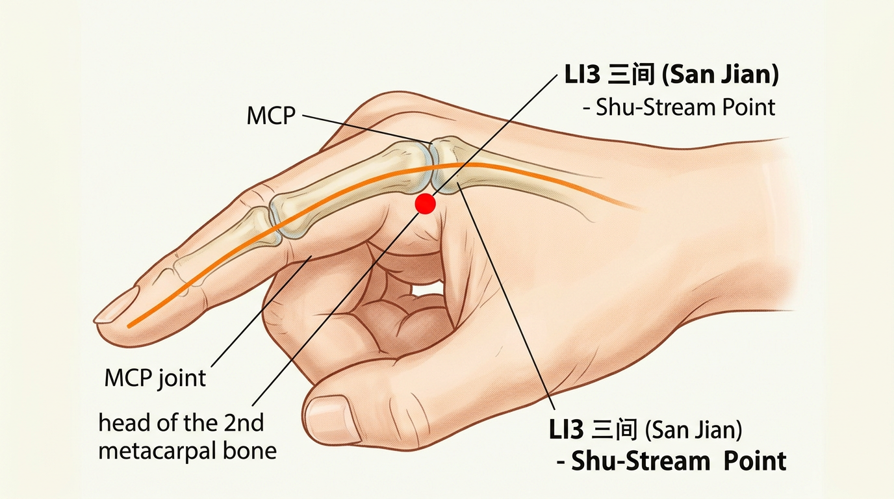

**דיקור**

* **זווית**: ניצבת, 90°
* **עומק**: 0.3-0.5 צון
* **תחושת דה-צ'י**: כבדות, נימול מקומי

**פעולות והתוויות**

* **פעולות**: מפנה חום; מפיג נפיחות; מועיל לעיניים ולשיניים
* **התוויות**: כאב שיניים, כאב עיניים, כאב גרון, שלשולות, כאב בגב היד
* **שילובים נפוצים**: LI3 + LI4 (כאב וגודש ביד)

***

#### LI4 — הה גו (合谷)

**שם סיני**: 合谷 (He Gu) **משמעות השם**: "עמק המפגש" — הנקודה בעמק (הגומה) שבין עצמות המטקרפל הראשונה והשנייה **קטגוריה מיוחדת**: נקודת יואן-מקור (原穴 Yuan Xue); אחת מ-4 נקודות הפיקוד (四总穴)

**מיקום אנטומי**

על גב היד, בין עצמות המטקרפל הראשונה והשנייה, בנקודת האמצע של הצד הרדיאלי של עצם המטקרפל השנייה, בשריר ה-First Dorsal Interosseous.

**איך למצוא את הנקודה**

1. בקשו מהמטופל להרפות את היד
2. **שיטה 1**: הניחו את קפל המפרק הבין-פלנגיאלי (IP) של האגודל על קרום האצבעות (Web) בין אגודל לאצבע מורה של היד השנייה — קצה האגודל נוגע ב-LI4
3. **שיטה 2**: אתרו את אמצע הצד הרדיאלי של עצם המטקרפל השנייה; לחצו לכיוון העצם
4. הנקודה נמצאת בבשר השרירי (First Dorsal Interosseous) שבין האגודל לאצבע המורה
5. לחצו כלפי עצם המטקרפל השנייה — כאב ברור וחד

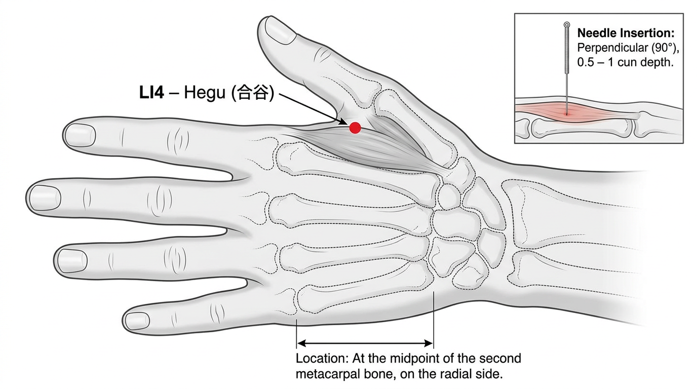

**דיקור**

* **זווית**: ניצבת, 90° (כלפי עצם המטקרפל השנייה)
* **עומק**: 0.5-1.0 צון
* **⚠️ זהירות**: **אסור בהריון** — נקודה זו מעודדת צירים ועלולה לגרום להפלה
* **תחושת דה-צ'י**: כבדות, כאב עמוק, נימול שמתפשט לאצבעות או לזרוע

**פעולות והתוויות**

* **פעולות**: מפזר רוח ומשחרר שטח; מפנה חום; מרגיע כאב (**נקודת שיכוך כאב מספר 1**); מווסת צ'י הפנים, האף, העיניים, האוזניים והפה; מווסת הזעה; מחזק ווי צ'י; מווסת צירים
* **כנקודת פיקוד**: "הפנים והפה — הה גו גוששת" (面口合谷收)
* **התוויות**: כאב ראש (כל סוג), כאב שיניים, כאב פנים, שיתוק פנים, הצטננות, חום, הזעה (או חוסר הזעה), כאב גרון, אלרגיה, עצירות, כאב בטן, אי-סדירות מחזור, עיכוב לידה
* **שילובים נפוצים**: LI4 + LR3 = "ארבע שערות" (四关 Si Guan — מרגיע כאב, מפזר צ'י); LI4 + LU7 (הצטננות); LI4 + ST44 (כאב שיניים, חום בקיבה); LI4 + SP6 (לעידוד צירים — **אסור בהריון!**)

***

#### LI5 — יאנג שי (阳溪)

**שם סיני**: 阳溪 (Yang Xi) **משמעות השם**: "נחל היאנג" — נקודה בגומה (נחל) בצד היאנג של שורש כף היד **קטגוריה מיוחדת**: נקודת ג'ינג-נהר (经穴 Jing Xue) — אלמנט אש (火 Huo)

**מיקום אנטומי**

בגומה (Anatomical Snuffbox) שנוצרת בצד הרדיאלי-אחורי של שורש כף היד, בין גידי ה-Extensor Pollicis Longus ו-Extensor Pollicis Brevis, כאשר האגודל מורחק (Abducted).

**איך למצוא את הנקודה**

1. בקשו מהמטופל להרחיק (Abduct) את האגודל — כאילו עושה "הכל בסדר" (thumbs up)
2. בצד האחורי של שורש כף היד, תיווצר גומה ברורה בין שני גידים בולטים
3. זו ה-"Anatomical Snuffbox" — תיבת הטבק האנטומית
4. הנקודה במרכז הגומה, ברמת קפל שורש כף היד

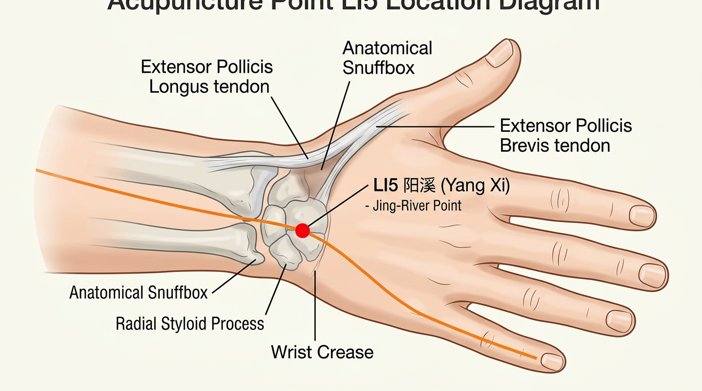

**דיקור**

* **זווית**: ניצבת, 90°
* **עומק**: 0.3-0.5 צון
* **תחושת דה-צ'י**: כאב מקומי, נימול

**פעולות והתוויות**

* **פעולות**: מפנה חום; מרגיע כאב; מועיל לשורש כף היד
* **התוויות**: כאב שורש כף היד, כאב ראש, כאב שיניים, כאב עיניים (אדמומיות), חום
* **שילובים נפוצים**: LI5 + TE4 (כאב שורש כף היד)

***

#### LI6 — פיאן לי (偏历)

**שם סיני**: 偏历 (Pian Li) **משמעות השם**: "מעבר צדדי" — ענף שסוטה (偏) הצידה מהערוץ הראשי **קטגוריה מיוחדת**: נקודת לואו מחברת (络穴 Luo Xue)

**מיקום אנטומי**

3 צון מעל LI5, על הקו המחבר בין LI5 ל-LI11, על הצד הרדיאלי-אחורי של האמה.

**איך למצוא את הנקודה**

1. אתרו את LI5 (בגומה בשורש כף היד) ואת LI11 (בקפל המרפק)
2. מדדו 3 צון מעל LI5 לאורך הקו המחבר
3. הנקודה נמצאת על הצד הרדיאלי (צד האגודל) של האמה
4. בין שרירי ה-Extensor Carpi Radialis ו-Abductor Pollicis Longus

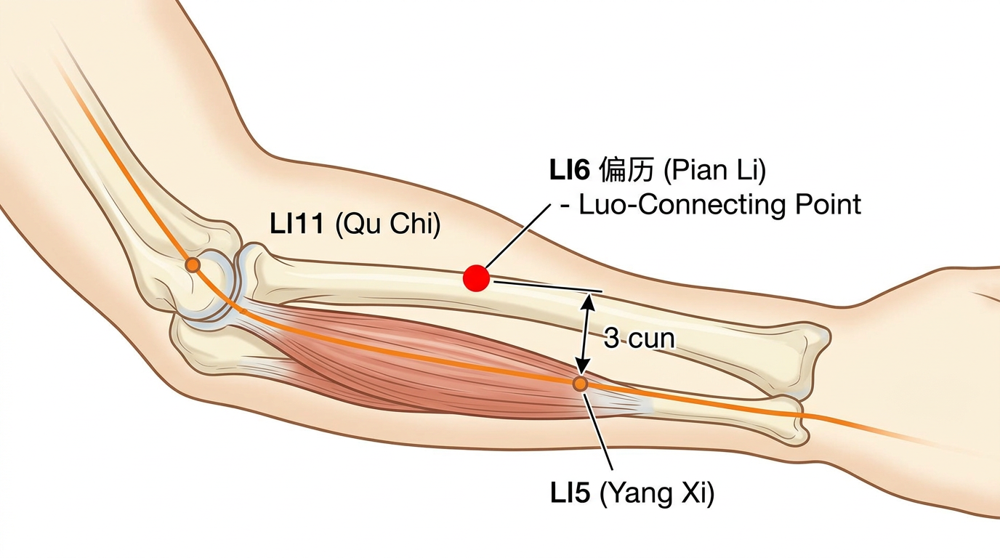

**דיקור**

* **זווית**: ניצבת או אלכסונית, 90-45°
* **עומק**: 0.3-0.5 צון
* **תחושת דה-צ'י**: כבדות, נימול מקומי

**פעולות והתוויות**

* **פעולות**: מפזר רוח; מפתח מסלול מים; מועיל לאוזן ולעין; מחבר לערוץ הריאות (כנקודת לואו)
* **התוויות**: בצקות (נפיחות), בעיות שמיעה, טינטון, דימום מהאף, כאב באמה, כאב שיניים
* **שילובים נפוצים**: LI6 + LU9 (שיטת אורח-מארח — בעיות ריאות ומעי); LI6 + REN9 (בצקות)

***

#### LI7 — וון ליו (温溜)

**שם סיני**: 温溜 (Wen Liu) **משמעות השם**: "חום זורם" — נקודה שבה הצ'י נאסף וזורם בחמימות **קטגוריה מיוחדת**: נקודת שי-צלע (郄穴 Xi Xue) — נקודת חירום/כאב חריף של הערוץ

**מיקום אנטומי**

5 צון מעל LI5, על הקו המחבר בין LI5 ל-LI11, על הצד הרדיאלי של האמה.

**איך למצוא את הנקודה**

1. אתרו את LI5 ואת LI11
2. מדדו 5 צון מעל LI5 (או 7 צון מתחת ל-LI11)
3. הנקודה על הצד הרדיאלי של האמה, על שריר ה-Extensor Carpi Radialis

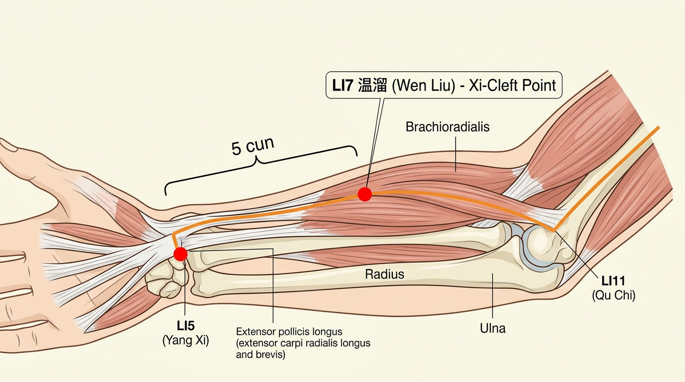

**דיקור**

* **זווית**: ניצבת, 90°
* **עומק**: 0.5-1.0 צון
* **תחושת דה-צ'י**: כבדות, כאב עמוק מקומי

**פעולות והתוויות**

* **פעולות**: מפנה חום; מפיג נפיחות; מועיל לראש ולפנים; מרגיע כאב חריף (כנקודת שי)
* **התוויות**: כאב ראש, כאב פנים, נפיחות בפנים, כאב גרון, כאב כתף וזרוע, מורסות בפה
* **שילובים נפוצים**: LI7 + LI4 + ST44 (כאב שיניים חריף); LI7 + ST6 (נפיחות בלחי)

***

#### LI8 — שיה ליאן (下廉)

**שם סיני**: 下廉 (Xia Lian) **משמעות השם**: "צד תחתון" — הנקודה התחתונה מבין שתי נקודות "ליאן" באמה

**מיקום אנטומי**

4 צון מתחת ל-LI11, על הקו המחבר בין LI5 ל-LI11.

**איך למצוא את הנקודה**

1. אתרו את LI11 (בקפל המרפק)
2. מדדו 4 צון ישירות מטה לכיוון שורש כף היד
3. הנקודה על שריר ה-Extensor Carpi Radialis

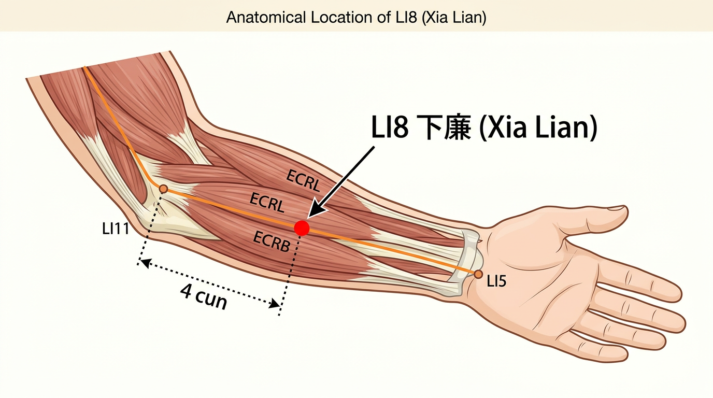

**דיקור**

* **זווית**: ניצבת, 90°
* **עומק**: 0.5-1.0 צון
* **תחושת דה-צ'י**: כבדות מקומית

**פעולות והתוויות**

* **פעולות**: מווסת צ'י של קיבה ומעיים; מרגיע כאב באמה
* **התוויות**: כאב בטן, כאב באמה ובמרפק, כאב ראש, סחרחורת
* **שילובים נפוצים**: LI8 + ST36 (כאבי בטן)

***

#### LI9 — שאנג ליאן (上廉)

**שם סיני**: 上廉 (Shang Lian) **משמעות השם**: "צד עליון" — הנקודה העליונה מבין שתי נקודות "ליאן"

**מיקום אנטומי**

3 צון מתחת ל-LI11, על הקו המחבר בין LI5 ל-LI11.

**איך למצוא את הנקודה**

1. אתרו את LI11
2. מדדו 3 צון ישירות מטה
3. הנקודה 1 צון מעל LI8

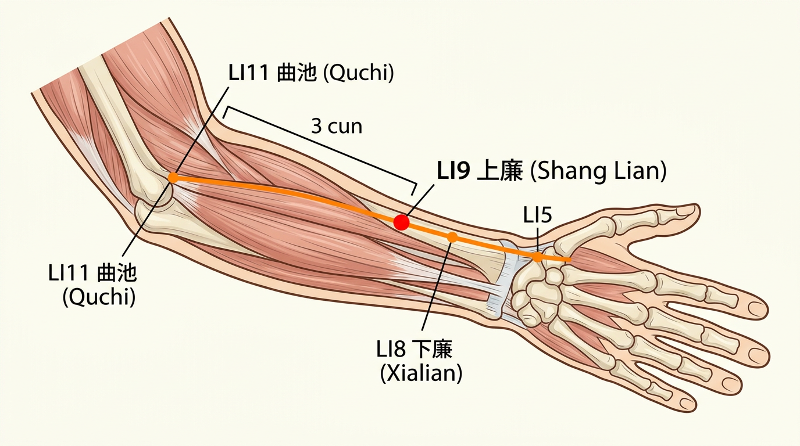

**דיקור**

* **זווית**: ניצבת, 90°
* **עומק**: 0.5-1.0 צון
* **תחושת דה-צ'י**: כבדות, נימול

**פעולות והתוויות**

* **פעולות**: מווסת מעיים; מרגיע כאב בזרוע
* **התוויות**: כאב בכתף וזרוע, נימול בזרוע, כאב בטן, בורבוריגמוס (קולות מעיים)
* **שילובים נפוצים**: LI9 + LI11 (כאב מרפק וזרוע)

***

#### LI10 — שו סאן לי (手三里)

**שם סיני**: 手三里 (Shou San Li) **משמעות השם**: "שלושה לי של היד" — 3 לי (=2 צון) מתחת למרפק; מקבילת היד של ST36 **קטגוריה מיוחדת**: נקודה חשובה לכאב מרפק ולזרוע

**מיקום אנטומי**

2 צון מתחת ל-LI11, על הקו המחבר בין LI5 ל-LI11, על שריר ה-Extensor Carpi Radialis Longus.

**איך למצוא את הנקודה**

1. אתרו את LI11 (בקפל המרפק, צד לטרלי)
2. מדדו 2 צון ישירות מטה לכיוון שורש כף היד
3. הנקודה על הגוש השרירי הבולט בצד החיצוני של האמה
4. לחצו — רגישות ברורה

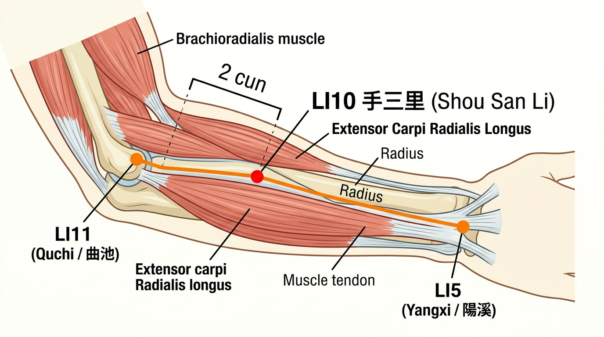

**דיקור**

* **זווית**: ניצבת, 90°
* **עומק**: 0.8-1.2 צון
* **תחושת דה-צ'י**: כבדות עמוקה, נימול שמתפשט למרפק או ליד

**פעולות והתוויות**

* **פעולות**: מווסת צ'י של קיבה ומעיים; מרגיע כאב בזרוע; מחזק את הזרוע; מפזר רוח-רטיבות
* **התוויות**: כאב מרפק ("מרפק טניס"), כאב וחולשה בזרוע, שיתוק ידיים, כאב בטן, שלשול, כאב שיניים
* **שילובים נפוצים**: LI10 + LI11 + LI4 (כאב מרפק וזרוע); LI10 + ST36 (חיזוק צ'י כללי)

***

#### LI11 — צ'יו צ'י (曲池)

**שם סיני**: 曲池 (Qu Chi) **משמעות השם**: "בריכה מעוקלת" — כשהמרפק מכופף, נוצרת גומה (בריכה) בקצה הקפל **קטגוריה מיוחדת**: נקודת הה-ים (合穴 He Xue) — אלמנט אדמה (土 Tu); נקודה מהחשובות באקופונקטורה

**מיקום אנטומי**

כאשר המרפק מכופף ב-90°, הנקודה נמצאת בקצה הלטרלי של קפל המרפק, באמצע הקו בין ה-Lateral Epicondyle של ה-Humerus לבין LU5.

**איך למצוא את הנקודה**

1. בקשו מהמטופל לכופף את המרפק ב-90°
2. אתרו את קפל המרפק
3. הנקודה בקצה הלטרלי (חיצוני) של הקפל
4. גששו את הגומה שנוצרת בין ה-Lateral Epicondyle לבין גיד ה-Biceps
5. לחצו בגומה — רגישות ברורה

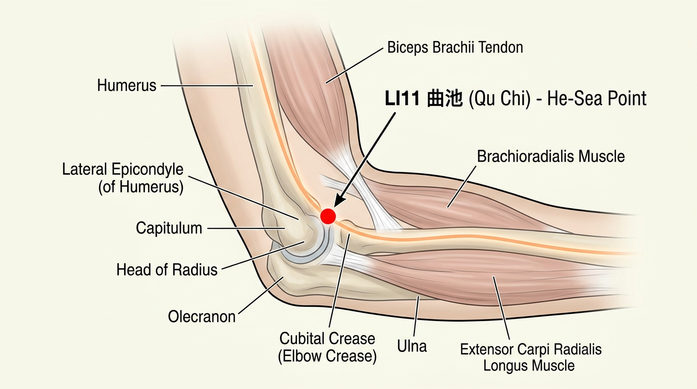

**דיקור**

* **זווית**: ניצבת, 90° (כשהמרפק מכופף)
* **עומק**: 1.0-1.5 צון
* **תחושת דה-צ'י**: כבדות עמוקה, נימול שמתפשט לאמה או לכתף

**פעולות והתוויות**

* **פעולות**: מפנה חום (**נקודת פינוי חום מספר 1 לערוץ יאנג מינג**); מקרר דם; מפזר רוח; מפיג רטיבות; מווסת צ'י ודם; מועיל למפרקים; מחזק ווי צ'י
* **התוויות**: חום, מחלות חום (זיהומיות), יתר לחץ דם, בעיות עור (אקזמה, אקנה, חרפשת/אורטיקריה), כאב מרפק, כאב כתף, שיתוק גפה עליונה, אלרגיות, עצירות, כאב שיניים, כאב עיניים
* **שילובים נפוצים**: LI11 + LI4 + ST36 (חיזוק חיסוני, פינוי חום); LI11 + SP10 + SP6 (בעיות עור); LI11 + GV14 (חום גבוה); LI11 + ST37 (עצירות); LI11 + GB20 + LR3 (יתר לחץ דם)

***

#### LI12 — ז'או ליאו (肘髎)

**שם סיני**: 肘髎 (Zhou Liao) **משמעות השם**: "שקע המרפק" — ז'או = מרפק; ליאו = שקע עצם

**מיקום אנטומי**

כאשר המרפק מכופף, 1 צון מעל ולטרלית ל-LI11, על הגבול הלטרלי של ה-Humerus, קדמית ל-Lateral Epicondyle.

**איך למצוא את הנקודה**

1. כופפו את המרפק
2. אתרו את LI11
3. מדדו 1 צון מעלה ולטרלית, על שפת עצם ה-Humerus
4. הנקודה על הגבול של ה-Lateral Supracondylar Ridge

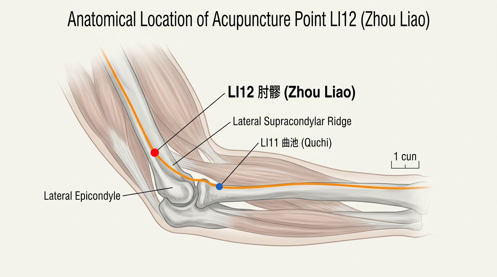

**דיקור**

* **זווית**: ניצבת, 90°
* **עומק**: 0.5-1.0 צון
* **תחושת דה-צ'י**: כבדות מקומית

**פעולות והתוויות**

* **פעולות**: מרפה גידים; מרגיע כאב מרפק
* **התוויות**: כאב מרפק, נוקשות מרפק, נימול וכאב בזרוע
* **שילובים נפוצים**: LI12 + LI11 + LI10 (כאב מרפק מורכב)

***

#### LI13 — שו וו לי (手五里)

**שם סיני**: 手五里 (Shou Wu Li) **משמעות השם**: "חמישה לי של היד" — 5 לי מעל המרפק

**מיקום אנטומי**

3 צון מעל LI11, על הקו המחבר בין LI11 ל-LI15, על הצד הלטרלי של הזרוע העליונה.

**איך למצוא את הנקודה**

1. אתרו את LI11
2. מדדו 3 צון מעלה לכיוון הכתף
3. הנקודה על הצד הלטרלי-קדמי של הזרוע, על שריר ה-Brachioradialis/Brachialis

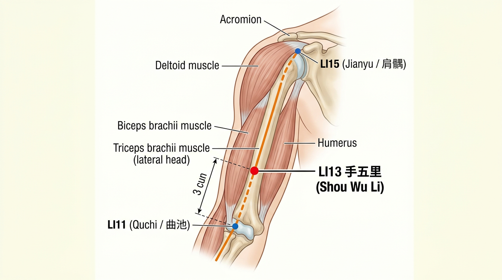

**דיקור**

* **זווית**: ניצבת, 90°
* **עומק**: 0.5-1.0 צון
* **תחושת דה-צ'י**: כבדות מקומית

**פעולות והתוויות**

* **פעולות**: מווסת צ'י; מפיג נפיחות; מרגיע כאב בזרוע
* **התוויות**: כאב בזרוע ובמרפק, נפיחות בלוטות לימפה (Scrofula)
* **שילובים נפוצים**: LI13 + LI15 (כאב זרוע עליונה)

***

#### LI14 — בי נאו (臂臑)

**שם סיני**: 臂臑 (Bi Nao) **משמעות השם**: "זרוע ושריר" — בי = זרוע; נאו = שריר הזרוע העליונה **קטגוריה מיוחדת**: נקודת מפגש עם ערוץ שלפוחית השתן (BL)

**מיקום אנטומי**

על הצד הלטרלי של הזרוע העליונה, 7 צון מעל LI11, על שריר ה-Deltoid, במקום החיבור של הדלתואיד.

**איך למצוא את הנקודה**

1. אתרו את LI11 (קפל מרפק) ואת LI15 (כתף)
2. מדדו 7 צון מעל LI11, על הקו המחבר ביניהם
3. הנקודה נמצאת על קצה ה-Deltoid Insertion, בגבול בין הדלתואיד לביצפס

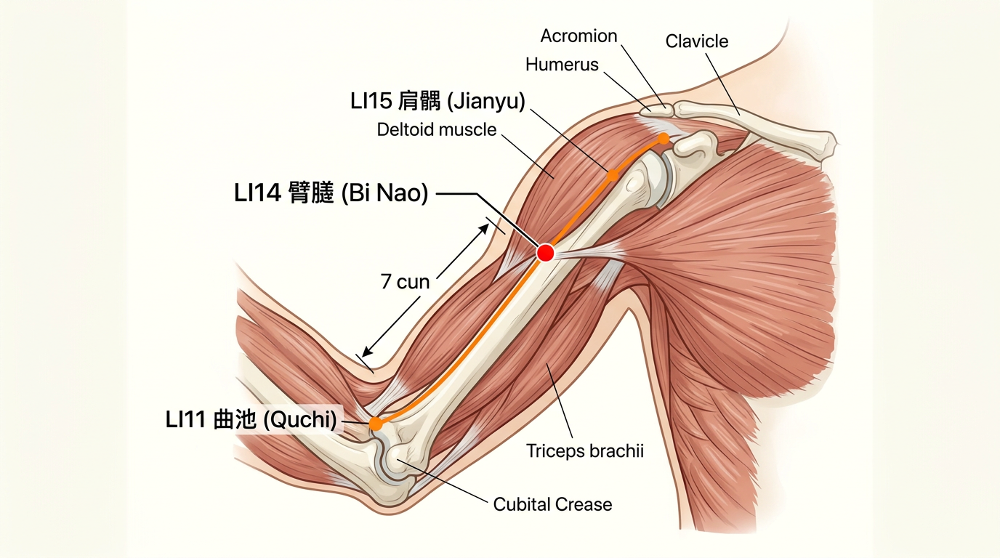

**דיקור**

* **זווית**: ניצבת או אלכסונית, 90-45° כלפי מעלה
* **עומק**: 0.5-1.5 צון
* **תחושת דה-צ'י**: כבדות, כאב מקומי

**פעולות והתוויות**

* **פעולות**: מועיל לעיניים; מפזר רוח-רטיבות; מפיג נפיחות
* **התוויות**: כאב בכתף ובזרוע, נוקשות צוואר, בעיות עיניים, נפיחות בלוטות בצוואר
* **שילובים נפוצים**: LI14 + LI15 + TE14 (כאב כתף)

***

#### LI15 — ג'יאן יו (肩髃)

**שם סיני**: 肩髃 (Jian Yu) **משמעות השם**: "שקע הכתף" — ג'יאן = כתף; יו = שקע/בליטת עצם **קטגוריה מיוחדת**: נקודת מפגש עם ערוץ יאנג צ'יאו מאי (阳跷脉)

**מיקום אנטומי**

בגומה שנוצרת קדמית ותחתית ל-Acromion (בליטת עצם השכם), כאשר הזרוע מורמת (Abducted) ב-90°. בין החלק הקדמי והאמצעי של שריר ה-Deltoid.

**איך למצוא את הנקודה**

1. בקשו מהמטופל להרים את הזרוע ישירות לצד (Abduction) ב-90°
2. שתי גומות ייווצרו בכתף — קדמית ואחורית ל-Acromion
3. LI15 נמצאת בגומה **הקדמית** (Anterior Depression)
4. כאשר הזרוע מורדת, הנקודה מכוסה על ידי שריר ה-Deltoid

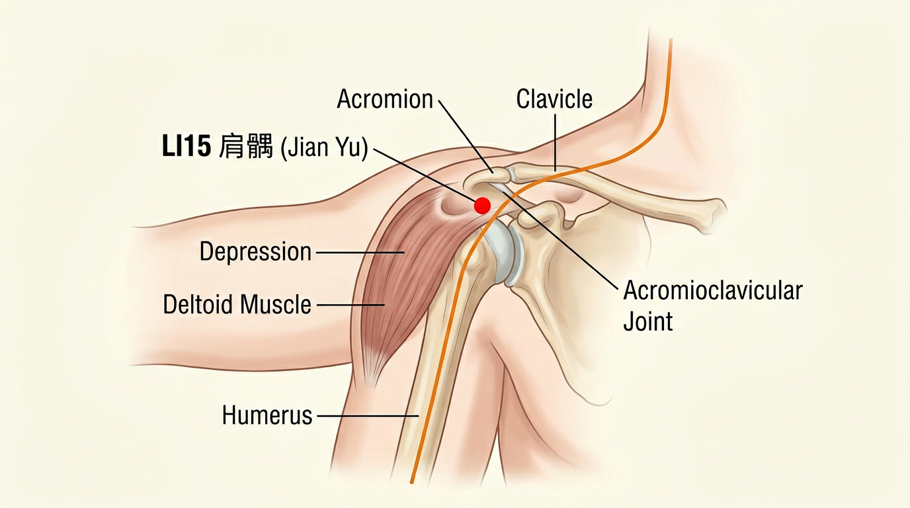

**דיקור**

* **זווית**: ניצבת או אלכסונית כלפי מטה, 90-60°
* **עומק**: 0.8-1.5 צון
* **תחושת דה-צ'י**: כבדות עמוקה, תחושה שמתפשטת לזרוע או לכתף

**פעולות והתוויות**

* **פעולות**: מפזר רוח-רטיבות; מועיל לכתף ולזרוע; מפזר צ'י תקוע
* **התוויות**: כאב כתף (**נקודה מרכזית**), קפיאת כתף (Frozen Shoulder), חוסר יכולת להרים זרוע, שיתוק גפה עליונה, חרפשת (אורטיקריה)
* **שילובים נפוצים**: LI15 + TE14 + SI9 (כאב כתף — "שלושת הנקודות של הכתף"); LI15 + GB21 (כאב כתף-צוואר); LI15 + LI11 + LI4 (שיתוק גפה עליונה)

***

#### LI16 — ג'ו גו (巨骨)

**שם סיני**: 巨骨 (Ju Gu) **משמעות השם**: "עצם גדולה" — ליד מפגש עצם הבריח עם ה-Acromion

**מיקום אנטומי**

בגומה שבין ה-Acromial End של עצם הבריח לבין ה-Scapular Spine (עמוד השדרה של עצם השכם).

**איך למצוא את הנקודה**

1. אתרו את קצה ה-Acromion (בליטת הכתף)
2. גששו את מפרק ה-Acromioclavicular (AC Joint) — המפגש בין עצם הבריח ל-Acromion
3. הנקודה בגומה שאחורית ותחתית למפרק זה
4. בקשו מהמטופל להצמיד את היד לכתף הנגדית — הגומה תתגלה

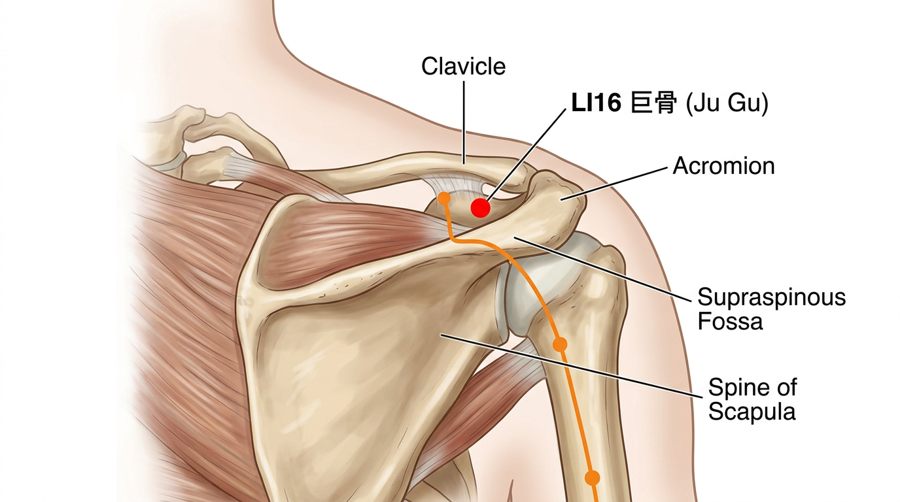

**דיקור**

* **זווית**: ניצבת או אלכסונית כלפי מטה
* **עומק**: 0.5-1.0 צון
* **⚠️ זהירות**: אין לדקור עמוק — סכנת פנאומותורקס
* **תחושת דה-צ'י**: כבדות מקומית, כאב

**פעולות והתוויות**

* **פעולות**: מפזר רוח; מועיל למפרק הכתף; מרפה גידים
* **התוויות**: כאב כתף, חוסר יכולת להרים זרוע, כאב בגב עליון
* **שילובים נפוצים**: LI16 + LI15 + SI10 (כאב כתף עליון)

***

#### LI17 — טיאן דינג (天鼎)

**שם סיני**: 天鼎 (Tian Ding) **משמעות השם**: "קדרה שמיימית" — טיאן = שמיים; דינג = קדרה מפורסמת בתרבות הסינית

**מיקום אנטומי**

על הצוואר, 1 צון מתחת ל-LI18, על הגבול האחורי של שריר ה-Sternocleidomastoid (SCM), ברמת הגבול העליון של סחוס ה-Cricoid.

**איך למצוא את הנקודה**

1. אתרו את ה-SCM (שריר הצוואר הבולט — בקשו מהמטופל לסובב ראש)
2. מצאו את תפוח האדם (Adam's Apple) והגבול התחתון שלו (Cricoid Cartilage)
3. הנקודה ברמת ה-Cricoid, על הגבול האחורי של ה-SCM
4. 1 צון מתחת ל-LI18

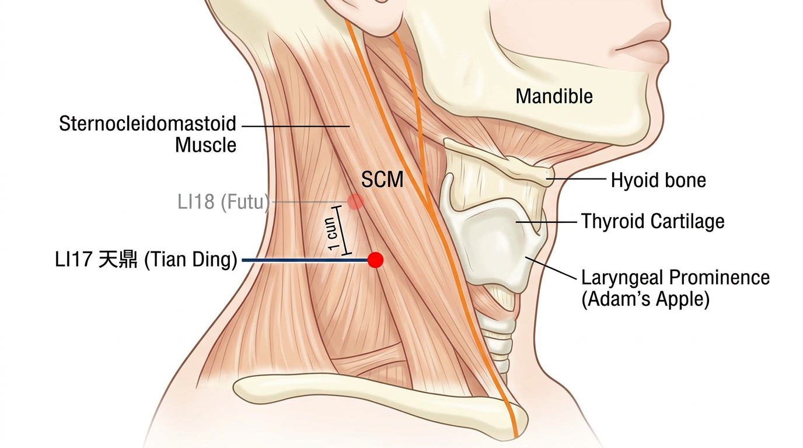

**דיקור**

* **זווית**: ניצבת, 90°
* **עומק**: 0.3-0.5 צון
* **⚠️ זהירות**: הימנעו מעורק הקרוטיד (Carotid Artery) ומוריד הג'וגולרי
* **תחושת דה-צ'י**: כבדות מקומית

**פעולות והתוויות**

* **פעולות**: מועיל לגרון; מפנה חום; מרגיע שיעול
* **התוויות**: כאב גרון, אובדן קול פתאומי, קושי בבליעה, גויטר (נפיחות בלוטת התריס)
* **שילובים נפוצים**: LI17 + LI18 + ST9 (בעיות גרון וצוואר)

***

#### LI18 — פו טו (扶突)

**שם סיני**: 扶突 (Fu Tu) **משמעות השם**: "תומך בבליטה" — ליד תפוח האדם (הבליטה בגרון)

**מיקום אנטומי**

על הצוואר, 3 צון לטרלית לתפוח האדם (Adam's Apple), בין ראשי שריר ה-SCM.

**איך למצוא את הנקודה**

1. אתרו את תפוח האדם
2. מדדו 3 צון הצידה (לטרלית)
3. הנקודה ברמת תפוח האדם, בין הראש הסטרנלי והקלביקולרי של ה-SCM
4. 1 צון מעל LI17

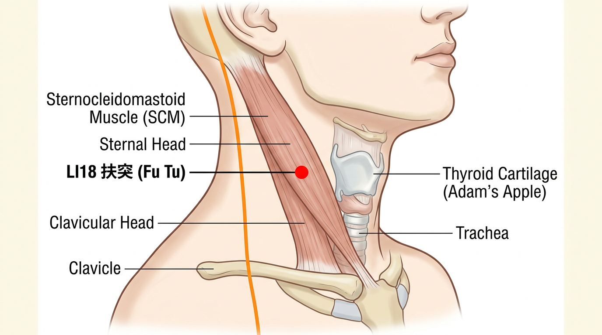

**דיקור**

* **זווית**: ניצבת, 90°
* **עומק**: 0.3-0.5 צון
* **⚠️ זהירות**: הימנעו מעורק הקרוטיד — גששו את הדופק לפני הדיקור
* **תחושת דה-צ'י**: כבדות מקומית

**פעולות והתוויות**

* **פעולות**: מועיל לגרון; מווסת צ'י; מפזר ליחה
* **התוויות**: שיעול, אסתמה, אובדן קול, כאב גרון, גויטר, קושי בבליעה
* **שילובים נפוצים**: LI18 + REN22 (אובדן קול); LI18 + ST9 (גויטר)

***

#### LI19 — הה ליאו (禾髎)

**שם סיני**: 禾髎 (He Liao) **משמעות השם**: "שקע התבואה" — הה = תבואה (מתייחס לשפם שנראה כשיבולים); ליאו = שקע

**מיקום אנטומי**

0.5 צון לטרלית לקו האמצע של השפה העליונה, מתחת לנחיר, ברמת הגבול התחתון של הנחיר.

**איך למצוא את הנקודה**

1. אתרו את DU26 (הפילטרום — המרזב שמתחת לאף)
2. מדדו 0.5 צון הצידה מ-DU26
3. הנקודה ישירות מתחת לנחיר, ברמת הגבול של השפה העליונה

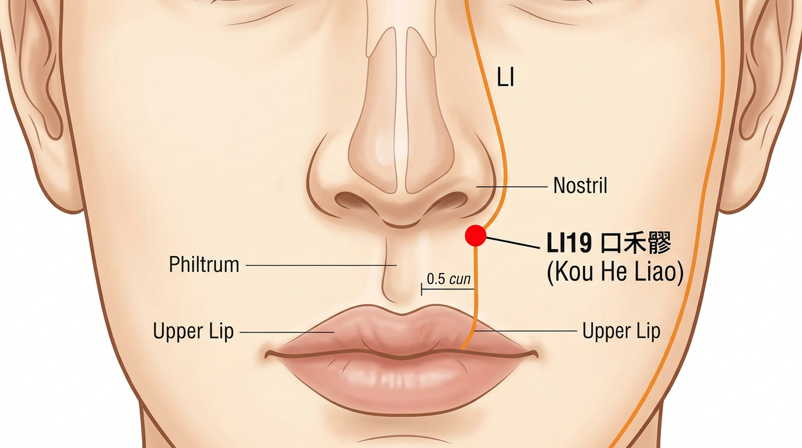

**דיקור**

* **זווית**: אלכסונית או מישורית (Transverse), 15-30°
* **עומק**: 0.2-0.3 צון
* **תחושת דה-צ'י**: כאב מקומי, דמעות

**פעולות והתוויות**

* **פעולות**: מפתח את האף; מפזר רוח; מרגיע שיעול
* **התוויות**: חסימת אף, דימום מהאף, סטיית פה (שיתוק פנים), אובדן חוש ריח
* **שילובים נפוצים**: LI19 + LI20 + DU26 (חסימת אף, שיתוק פנים)

***

#### LI20 — יינג שיאנג (迎香)

**שם סיני**: 迎香 (Ying Xiang) **משמעות השם**: "מקבל את הניחוח" — הנקודה ליד האף, ופתיחתה מאפשרת לקבל ריחות **קטגוריה מיוחדת**: נקודת מפגש עם ערוץ הקיבה (ST); נקודת סיום הערוץ

**מיקום אנטומי**

בקפל הנזולביאלי (Nasolabial Groove), ברמת נקודת האמצע של הגבול הלטרלי של הנחיר (Ala Nasi), כ-0.5 צון לטרלית לנחיר.

**איך למצוא את הנקודה**

1. אתרו את כנף האף (Ala Nasi) — החלק הרך של הנחיר
2. מצאו את נקודת האמצע של הגבול הלטרלי של הנחיר
3. הנקודה בקפל שנוצר בין הלחי לאף (Nasolabial Fold)
4. לחצו — רגישות ותחושה של "פתיחת האף"

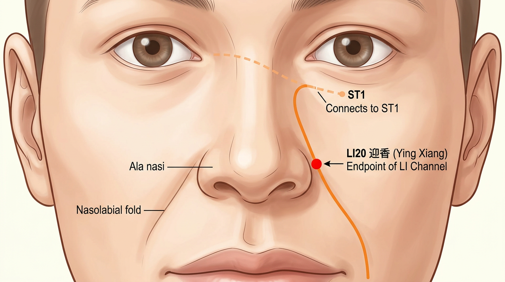

**דיקור**

* **זווית**: אלכסונית כלפי מעלה ומדיאלית, או מישורית (Transverse) לכיוון BL2
* **עומק**: 0.2-0.3 צון
* **תחושת דה-צ'י**: תחושת פתיחה באף, דמעות, נימול מקומי

**פעולות והתוויות**

* **פעולות**: מפתח את האף (**הנקודה המרכזית לאף**); מפזר רוח-חום; מפיג נפיחות בפנים
* **התוויות**: חסימת אף, נזלת, סינוסיטיס, אובדן חוש ריח, דימום מהאף, שיתוק פנים, כאב פנים, גרד באף (אלרגיה)
* **שילובים נפוצים**: LI20 + LI4 + BL2 (סינוסיטיס, חסימת אף); LI20 + GV23 + BL7 (נזלת אלרגית); LI20 + ST2 (כאב פנים, שיתוק); LI20 + Yintang (חסימת אף — שילוב פשוט ויעיל)

***

### 3. סיכום קטגוריות הנקודות

| קטגוריה                  | נקודה | סינית | שימוש עיקרי                  |
| ------------------------ | ----- | ----- | ---------------------------- |
| ג'ינג-באר (Jing-Well)    | LI1   | 商阳    | חירום, חום, אובדן הכרה       |
| יינג-מעיין (Ying-Spring) | LI2   | 二间    | פינוי חום                    |
| שו-זרם (Shu-Stream)      | LI3   | 三间    | כאבי מפרקים, רטיבות          |
| יואן-מקור (Yuan-Source)  | LI4   | 合谷    | שיכוך כאב, פנים ופה, הצטננות |
| ג'ינג-נהר (Jing-River)   | LI5   | 阳溪    | שורש כף יד, חום              |
| לואו (Luo-Connecting)    | LI6   | 偏历    | חיבור ל-LU, בצקות            |
| שי-צלע (Xi-Cleft)        | LI7   | 温溜    | כאב חריף, חירום              |
| הה-ים (He-Sea)           | LI11  | 曲池    | פינוי חום, בעיות עור, מרפק   |

***

### 4. חמש נקודות שו (五输穴) של ערוץ המעי הגס

| סוג                        | נקודה | אלמנט    | כיוון הזרימה |
| -------------------------- | ----- | -------- | ------------ |
| ג'ינג-באר (井 Jing-Well)    | LI1   | מתכת (金) | הצ'י "נובע"  |
| יינג-מעיין (荥 Ying-Spring) | LI2   | מים (水)  | הצ'י "זורם"  |
| שו-זרם (输 Shu-Stream)      | LI3   | עץ (木)   | הצ'י "מתחזק" |
| ג'ינג-נהר (经 Jing-River)   | LI5   | אש (火)   | הצ'י "גדל"   |
| הה-ים (合 He-Sea)           | LI11  | אדמה (土) | הצ'י "מתאסף" |

***

### 5. נקודות ה-Lower He-Sea (下合穴)

ערוץ המעי הגס הוא ערוץ יד, אך נקודת ה-Lower He-Sea שלו נמצאת **ברגל**:

* **ST37 (上巨虚 Shang Ju Xu)** — נקודת ה-Lower He-Sea של המעי הגס
* משמשת לטיפול ישיר בבעיות של איבר המעי הגס (עצירות, שלשול, דלקת מעיים)

***

### 6. תרגילים

#### תרגיל 1: מיקום נקודות

על זרוע של שותף/ה, אתרו את הנקודות הבאות: א. LI4 (שתי השיטות) ב. LI11 ג. LI10 ד. LI15 (עם הרמת זרוע) ה. LI20

#### תרגיל 2: בחירת נקודות

מטופל מגיע עם הצטננות: נזלת, כאב ראש קדמי, כאב גרון, וחום קל. א. אילו נקודות מערוץ המעי הגס תבחרו? ב. אילו נקודות מערוצים אחרים תוסיפו?

#### תרגיל 3: פנים-חוץ

הסבירו כיצד הקשר פנים-חוץ בין ריאות (LU) למעי גס (LI) בא לידי ביטוי: א. באנטומיה של הערוצים ב. בפתולוגיה (תנו דוגמה קלינית) ג. בטיפול (כיצד נשתמש בנקודות לואו-יואן?)

***

### קריאה מומלצת

* Deadman, P. _A Manual of Acupuncture_ — ערוץ המעי הגס
* Maciocia, G. _The Foundations of Chinese Medicine_ — פרק על המעי הגס
* הואנג די ניי ג'ינג, לינג שו, פרקים על ערוץ יאנג מינג

***

> **נקודה למחשבה**: ערוץ המעי הגס הוא אחד הערוצים הנפוצים ביותר בשימוש קליני, בעיקר בזכות LI4 ו-LI11 — שתי נקודות בעלות ספקטרום פעולה רחב ביותר. LI4 היא כנראה הנקודה הנדקרת ביותר בעולם. הערוץ עובר מהיד דרך הפנים, ולכן הוא חיוני לטיפול בכאבי ראש, שיניים, סינוסים ושיתוק פנים.

***

### ניווט

* **הקודם**: [ערוץ הריאות (LU)](02-lung-channel.md) | **הבא**: [ערוץ הקיבה (ST)](04-stomach-channel.md)
* **זוג פנים-חוץ**: [ערוץ הריאות (LU)](02-lung-channel.md) — ערוץ הין הזוגי (אלמנט מתכת)
* **חזרה למודול**: [מודול 2 — מרידיאנים](./)
