# ערוץ הטחול - צו טאי ין פי (足太阴脾经)

## Foot Tai Yin Spleen Channel

---

## מטרות למידה

בסיום שיעור זה, הסטודנט יוכל:
1. לתאר את מסלול ערוץ הטחול החיצוני והפנימי
2. לאתר את 21 נקודות הדיקור של הערוץ על הגוף
3. להסביר את תפקידי הטחול ברפואה הסינית
4. לבחור נקודות מתאימות לטיפול בפתולוגיות נפוצות של הטחול
5. לבצע דיקור בטוח בנקודות העיקריות של הערוץ

---

## 1. סקירת הערוץ

### 1.1 מידע כללי

| פרט | תיאור |
|---|---|
| **שם סיני** | 足太阴脾经 (Zú Tài Yīn Pí Jīng) |
| **קיצור** | SP (Spleen) |
| **מספר נקודות** | 21 |
| **סוג** | ין (Yin) |
| **אלמנט** | אדמה (土 Tǔ) |
| **זוג פנימי-חיצוני** | קיבה (足阳明胃经 ST) |
| **שעות פעילות** | 09:00–11:00 |
| **כיוון זרימה** | מהרגל לחזה (עולה) |

### 1.2 מסלול הערוץ

#### מסלול חיצוני (外行 Wài Xíng)
הערוץ מתחיל בפינה המדיאלית של ציפורן הבוהן הגדולה (SP1), עולה לאורך הצד המדיאלי של כף הרגל, עובר מתחת לעצם המדיאלית של הקרסול (malleolus medialis), ממשיך לאורך הגבול האחורי של עצם השוקה (tibia) בצדה המדיאלי. עובר דרך הברך מצד מדיאלי, ממשיך לאורך הצד המדיאלי-הקדמי של הירך. נכנס לבטן דרך המפשעה, עולה לאורך הבטן (4 צון לרוחב מקו האמצע), ממשיך לחזה עד למרווח הבין-צלעי השישי בצד, ומשם יורד מעט אל הצד (SP21) במרווח הבין-צלעי השביעי על קו אמצע השחי.

#### מסלול פנימי (内行 Nèi Xíng)
מהמפשעה, ענף פנימי חודר לחלל הבטן ומתחבר אל **הטחול** (脾 Pí) - האיבר השייך לו, ואל **הקיבה** (胃 Wèi) - איבר הפו המזווג. ממשיך כלפי מעלה, חוצה את הסרעפת, עולה לאורך הוושט ומגיע לשורש הלשון, שם מתפזר מתחתיה.

ענף נוסף מפריד מהקיבה, חוצה את הסרעפת ומתחבר ללב - שם הוא מצטרף לערוץ הלב (手少阴心经 HT).

### 1.3 זיווג פנימי-חיצוני

ערוץ הטחול (ין) מזווג עם ערוץ הקיבה (יאנג). שניהם שייכים לאלמנט האדמה (土 Tǔ):
- **הטחול** (ין) - מעביר ומטמיע (运化 Yùn Huà) - אחראי על עיבוד והפצת תוצרי העיכול
- **הקיבה** (יאנג) - מקבלת ומרככת (受纳腐熟 Shòu Nà Fǔ Shú) - אחראית על קבלת מזון ועיכול ראשוני

---

## 2. תפקידי הטחול ברפואה הסינית

### 2.1 תפקידים עיקריים

1. **העברה והטמעה** (运化 Yùn Huà): הטחול מעבד מזון ונוזלים, מפיק מהם את "תמצית הדגנים" (水谷精微 Shuǐ Gǔ Jīng Wēi), ומפיץ אותה לכל הגוף. זהו המקור העיקרי לצ'י ולדם שלאחר הלידה.

2. **שליטה בדם** (统血 Tǒng Xuè): הטחול שומר שהדם יישאר בתוך כלי הדם ולא ידלוף מחוץ להם. חולשת טחול עלולה לגרום לדימומים.

3. **העלאת הצ'י** (升清 Shēng Qīng): הטחול מעלה את הצ'י הצלול כלפי מעלה אל הריאות והלב. כאשר תפקוד זה נפגע, האיברים הפנימיים עלולים "לצנוח" (צניחת איברים).

4. **שליטה בשרירים ובגפיים** (主肌肉四肢 Zhǔ Jī Ròu Sì Zhī): הטחול מזין את השרירים. חולשת טחול מתבטאת בחולשת שרירים ועייפות בגפיים.

5. **נפתח בפה, מתגלה בשפתיים** (开窍于口，其华在唇 Kāi Qiào Yú Kǒu, Qí Huá Zài Chún): מצב הטחול משתקף בתיאבון ובצבע השפתיים.

### 2.2 פתולוגיות נפוצות

| פתולוגיה | סימנים עיקריים |
|---|---|
| **חסר צ'י הטחול** (脾气虚) | עייפות, תיאבון ירוד, נפיחות אחרי אכילה, צואה רכה, חיוורון |
| **חסר יאנג הטחול** (脾阳虚) | כל הנ"ל + קרירות בבטן, שלשול עם מזון לא מעוכל, גפיים קרות |
| **הטחול לא שולט בדם** (脾不统血) | דימומים כרוניים - דם בצואה, מחזור מרובה, חבורות בקלות |
| **צניחת צ'י הטחול** (中气下陷) | צניחת איברים, שלשולים כרוניים, עייפות קשה, סחרחורת |
| **רטיבות-לחות בטחול** (脾湿) | כבדות בגוף, נפיחות, ליחה, שלשול, ציפוי לשון עבה ודביק |
| **רטיבות-חום בטחול** (脾湿热) | צהבת, שלשול עם ריח, בטן נפוחה וכואבת, ציפוי צהוב ודביק |

---

## 3. נקודות הערוץ

---

### SP1 - ין באי (隐白) - Yǐn Bái

**משמעות השם**: "לבן נסתר" - הנקודה נמצאת בפינה הנסתרת של ציפורן הבוהן, כאשר הציפורן מכסה חלקית את הבשר הלבן

**מיקום אנטומי**: בצד המדיאלי של הבוהן הגדולה, 0.1 צון פרוקסימלית לפינה של בסיס הציפורן

**איך למצוא את הנקודה**:
1. מצאו את הבוהן הגדולה של הרגל
2. הביטו בפינה המדיאלית (הפנימית) של בסיס הציפורן
3. מדדו כ-0.1 צון (כ-2 מ"מ) לכיוון פרוקסימלי ומדיאלי מפינת הציפורן
4. הנקודה נמצאת במפגש שני קווים: אחד לאורך הצד המדיאלי של הציפורן, והשני לאורך בסיס הציפורן

**דיקור**: דקירה רדודה 0.1 צון, או דימום בעזרת מחט שלוש קצוות. מוקסה מומלצת מאוד.

**תחושת דה-צ'י**: כאב מקומי חד, תחושת עקצוץ

**פעולות והתוויות**:
- עוצרת דימומים (止血 Zhǐ Xuè) - במיוחד דימום רחמי, דם בצואה, דם באף
- מרגיעה את הרוח (安神 Ān Shén) - חלומות מטרידים, נדודי שינה, הזיות
- מחייה את ההכרה (开窍 Kāi Qiào)

**קטגוריה מיוחדת**: נקודת ג'ינג-באר (井穴 Jǐng) - אלמנט עץ; נקודת שורש

**שילובי נקודות נפוצים**:
- SP1 + DU20 (באי הוי) - צניחת רחם, דימום רחמי
- SP1 + LR1 (דא דון) - דימום רחמי חריף
- SP1 + HT7 (שן מן) - נדודי שינה עם חלומות מטרידים

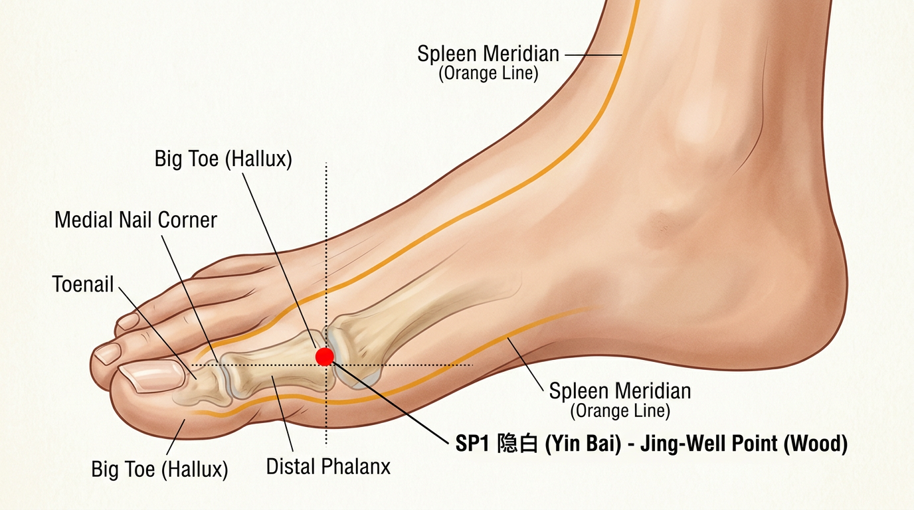

---

### SP2 - דא דו (大都) - Dà Dū

**משמעות השם**: "עיר גדולה" - הנקודה נמצאת ליד מפרק גדול (MTP), כמו עיר גדולה שהיא צומת מרכזי

**מיקום אנטומי**: בצד המדיאלי של הבוהן הגדולה, בשקע הדיסטלי-תחתון של מפרק המטטרסו-פלנגיאלי (MTP) הראשון, במפגש בין עור כף הרגל לגב הרגל

**איך למצוא את הנקודה**:
1. מצאו את מפרק הבוהן הגדולה (מפרק MTP הראשון)
2. כופפו מעט את הבוהן כדי למצוא את קו המפרק
3. מצאו את השקע בצד המדיאלי של המפרק, מעט דיסטלית ותחתונה
4. הנקודה נמצאת במעבר בין עור בהיר (גב הרגל) לעור כהה יותר (כף הרגל)

**דיקור**: דקירה ניצבת 0.3–0.5 צון

**תחושת דה-צ'י**: כאב מקומי, תחושת נפיחות סביב המפרק

**פעולות והתוויות**:
- מפנה חום (清热 Qīng Rè)
- מחזקת את הטחול (健脾 Jiàn Pí) - כאבי בטן, נפיחות, עצירות או שלשול
- חום ללא הזעה, כאבי בטן, הקאות

**קטגוריה מיוחדת**: נקודת יינג-מעיין (荥穴 Yíng) - אלמנט אש

**שילובי נקודות נפוצים**:
- SP2 + SP1 - חום חריף עם הפרעות עיכול
- SP2 + ST44 (ניי טינג) - חום בקיבה

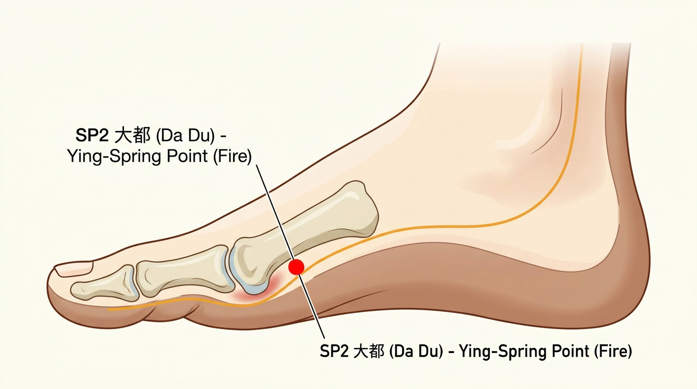

---

### SP3 - טאי באי (太白) - Tài Bái

**משמעות השם**: "לובן עליון" או "כוכב נוגה" (Venus) - כוכב נוגה משויך לאלמנט מתכת; הנקודה לבנה ובולטת

**מיקום אנטומי**: בצד המדיאלי של כף הרגל, בשקע הפרוקסימלי-תחתון של ראש עצם המטטרסוס הראשונה, במעבר בין עור כף הרגל לגב הרגל

**איך למצוא את הנקודה**:
1. מצאו את מפרק ה-MTP הראשון בצד המדיאלי של כף הרגל
2. החליקו לאורך עצם המטטרסוס הראשונה לכיוון פרוקסימלי (לכיוון העקב)
3. מצאו את הבליטה של ראש עצם המטטרסוס הראשונה
4. הנקודה נמצאת בשקע שמיד מאחורי (פרוקסימלית) לבליטה זו, במעבר בין עור גב הרגל לעור כף הרגל

**דיקור**: דקירה ניצבת 0.5–0.8 צון

**תחושת דה-צ'י**: תחושת כבדות וכאב עמום מקומי, עשויה להקרין לכף הרגל

**פעולות והתוויות**:
- מחזקת את הטחול ואת הקיבה (健脾和胃) - נקודת מפתח לכל בעיות עיכול
- מפנה רטיבות (化湿 Huà Shī) - כבדות בגוף, נפיחות, שלשול
- מווסתת את הצ'י - כאבי בטן, בורבוריגמוס (קולות מעיים)
- כאבי גוף מרטיבות

**קטגוריה מיוחדת**: נקודת שו-זרם (输穴 Shū) - אלמנט אדמה; **נקודת יואן-מקור** (原穴 Yuán Xué)

**שילובי נקודות נפוצים**:
- SP3 + ST36 (צו סאן לי) - חיזוק כללי של טחול וקיבה
- SP3 + SP9 (ין לינג צ'ואן) - סילוק רטיבות
- SP3 + LU9 (טאי יואן) - חיזוק צ'י של ריאות וטחול (אדמה מזינה מתכת)

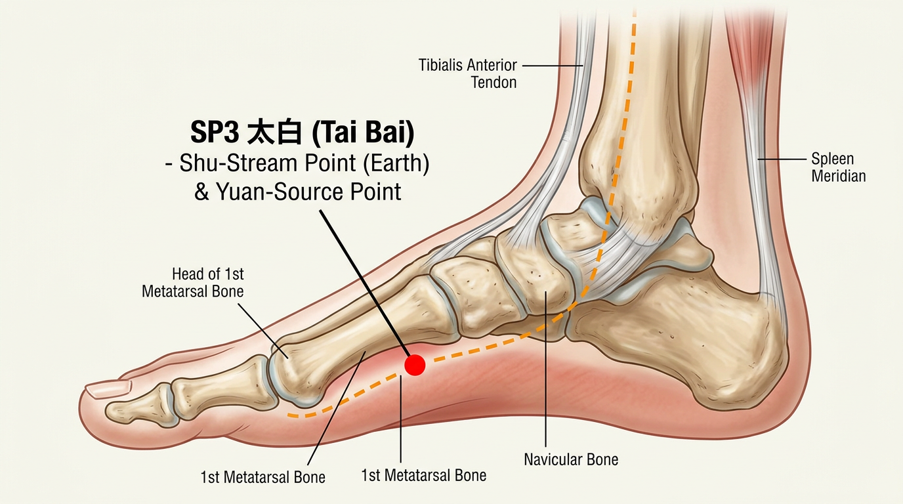

---

### SP4 - גונג סון (公孙) - Gōng Sūn

**משמעות השם**: "נכד" - בהתייחס ליחסים המשפחתיים בתורת חמשת האלמנטים: הטחול (אדמה) הוא "נכד" של הכבד (עץ)

**מיקום אנטומי**: בצד המדיאלי של כף הרגל, בשקע הדיסטלי-תחתון של בסיס עצם המטטרסוס הראשונה, במעבר בין עור בהיר וכהה

**איך למצוא את הנקודה**:
1. מצאו את SP3 (טאי באי)
2. החליקו לאורך הצד המדיאלי של עצם המטטרסוס הראשונה לכיוון פרוקסימלי (לכיוון העקב)
3. מצאו את בסיס העצם - הבליטה הגרמית הבולטת ביותר
4. הנקודה נמצאת בשקע שמיד לפני (דיסטלית) הבליטה, כ-1 צון פרוקסימלית ל-SP3

**דיקור**: דקירה ניצבת 0.5–1.0 צון

**תחושת דה-צ'י**: תחושת נפיחות וכבדות מקומית, עשויה להקרין לכף הרגל

**פעולות והתוויות**:
- מווסתת את הטחול והקיבה - כאבי בטן, הקאות, שלשול
- מפנה רטיבות
- מווסתת את צ'ונג מאי (冲脉) - בעיות גינקולוגיות, כאבי חזה
- מרגיעה את הלב והרוח
- כאבי לב, כאבי חזה

**קטגוריה מיוחדת**: **נקודת לואו-מחברת** (络穴 Luò Xué) - מתחברת לערוץ הקיבה; **נקודת פתיחה של צ'ונג מאי** (冲脉 Chōng Mài) - כלי חודר (Penetrating Vessel)

**שילובי נקודות נפוצים**:
- SP4 + PC6 (ניי גואן) - **זוג מצמד** לפתיחת צ'ונג מאי - כאבי חזה, בעיות לב, בחילות, כאבי בטן עליונה, בעיות גינקולוגיות
- SP4 + ST36 - בעיות עיכול כרוניות
- SP4 + REN12 (ג'ונג וואן) - כאבי קיבה

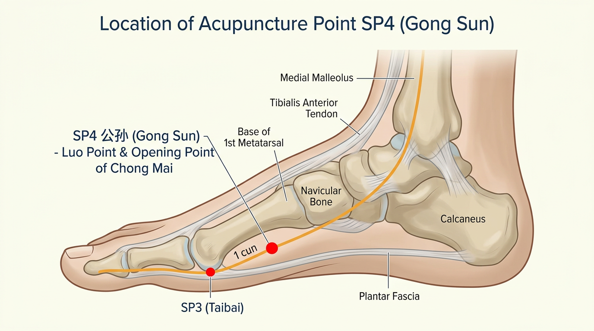

---

### SP5 - שאנג צ'יו (商丘) - Shāng Qiū

**משמעות השם**: "גבעת המתכת" - "שאנג" הוא הצליל של אלמנט המתכת בתורת חמשת הצלילים; "צ'יו" = גבעה, בהתייחס לבליטת הקרסול

**מיקום אנטומי**: בשקע הדיסטלי-הקדמי של הקרסול המדיאלי (malleolus medialis), באמצע הדרך בין קצה הקרסול לעצם הנביקולרית

**איך למצוא את הנקודה**:
1. מצאו את הבליטה של הקרסול המדיאלי (malleolus medialis)
2. מצאו את עצם הנביקולרית (navicular) - הבליטה הגרמית בצד המדיאלי של כף הרגל, כ-2.5 ס"מ מלפנים ומתחת לקרסול
3. הנקודה נמצאת בשקע שבאלכסון קדמי-תחתון לקרסול המדיאלי, במרחק בערך חצי הדרך בין שתי הבליטות הללו
4. ניתן לחוש שקע ברור בין הגידים במנח דורסיפלקסיה של כף הרגל

**דיקור**: דקירה ניצבת 0.3–0.5 צון; הימנעו מדיקור עמוק

**תחושת דה-צ'י**: כאב מקומי עם תחושת עקצוץ סביב הקרסול

**פעולות והתוויות**:
- מחזקת את הטחול ומפנה רטיבות
- מפעילה את הערוץ ומשככת כאבים - כאבי קרסול, נוקשות כף הרגל
- עצירות, צהבת, טחורים
- כאבי בטן, בורבוריגמוס

**קטגוריה מיוחדת**: נקודת ג'ינג-נהר (经穴 Jīng) - אלמנט מתכת

**שילובי נקודות נפוצים**:
- SP5 + SP9 - רטיבות בגפיים תחתונות, בצקת בקרסוליים
- SP5 + ST41 (ג'יה שי) - כאבי קרסול
- SP5 + BL20 (פי שו) - חולשת טחול עם רטיבות

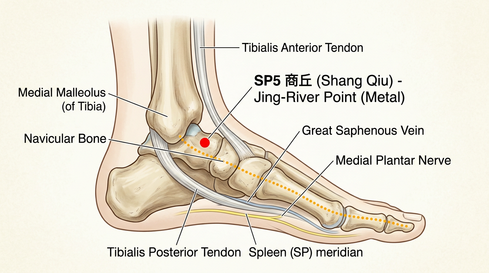

---

### SP6 - סאן ין ג'יאו (三阴交) - Sān Yīn Jiāo

**משמעות השם**: "מפגש שלושת הין" - נקודת המפגש של שלושת ערוצי הין של הרגל: טחול, כבד וכליות

**מיקום אנטומי**: בצד המדיאלי של השוק, 3 צון מעל קצה הקרסול המדיאלי, על הגבול האחורי של עצם השוקה (tibia)

**איך למצוא את הנקודה**:
1. מצאו את הנקודה הגבוהה ביותר של הקרסול המדיאלי
2. מדדו 3 צון (רוחב 4 אצבעות של המטופל, ללא הבוהן) ישירות כלפי מעלה
3. הנקודה נמצאת על הגבול האחורי של עצם השוקה (כלומר, מיד מאחורי העצם, לא על העצם עצמה)
4. ניתן לחוש רגישות ברורה בלחיצה על הנקודה

**דיקור**: דקירה ניצבת 1.0–1.5 צון. **אסור לדקור בהריון** (עלול לגרום להתכווצויות רחם!)

**תחושת דה-צ'י**: תחושת כבדות, נפיחות וכאב עמום שמקרינים לאורך הצד המדיאלי של השוק, לעיתים כלפי מעלה או מטה

**פעולות והתוויות**:
- מחזקת טחול וקיבה - בעיות עיכול, שלשול, נפיחות
- מזינה דם וין - אנמיה, סחרחורת, עייפות
- מווסתת מחזור חודשי - אי סדירות, כאבי מחזור, דימום מוגבר
- מפנה רטיבות - בצקות, הפרשות לבנות
- מחליקה לידה (בהריון מאוחר, תחת פיקוח!) - אך אסורה בתחילת הריון
- מווסתת מערכת השתן - הטלת שתן תכופה, דלקות
- מרגיעה את הרוח - נדודי שינה, חרדה
- מחזקת את הכליות - אין-אונות, פוריות

**קטגוריה מיוחדת**: **נקודת מפגש** (交会穴 Jiāo Huì Xué) של שלושת ערוצי הין של הרגל (טחול, כבד, כליות) - אחת הנקודות החשובות ביותר בגוף

**שילובי נקודות נפוצים**:
- SP6 + ST36 (צו סאן לי) - חיזוק צ'י ודם, חולשה כללית
- SP6 + LR3 (טאי צ'ונג) - מווסת כבד וטחול, כאבי מחזור
- SP6 + KI3 (טאי שי) - חיזוק כליות, ין, ודם
- SP6 + REN4 (גואן יואן) - בעיות גינקולוגיות ופוריות
- SP6 + HT7 (שן מן) - נדודי שינה, חרדה
- SP6 + PC6 (ניי גואן) - בחילות, הקאות

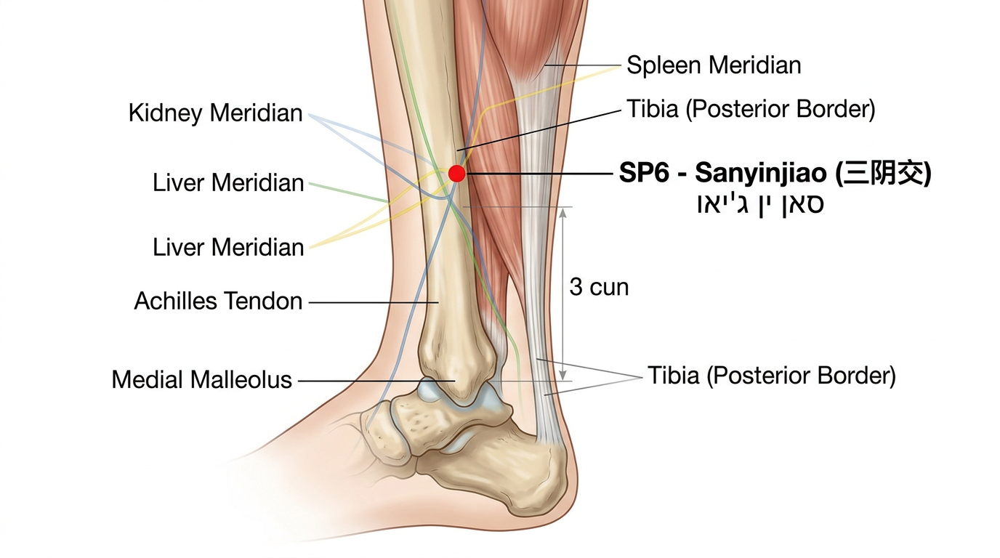

---

### SP7 - לואו גו (漏谷) - Lòu Gǔ

**משמעות השם**: "עמק הדולף" - מתייחס לתפקיד הנקודה בטיפול בדליפת נוזלים (בצקות, שתן לא רצוני)

**מיקום אנטומי**: בצד המדיאלי של השוק, 6 צון מעל קצה הקרסול המדיאלי, על הגבול האחורי של עצם השוקה

**איך למצוא את הנקודה**:
1. מצאו את SP6 (3 צון מעל הקרסול)
2. מדדו 3 צון נוספים כלפי מעלה (סה"כ 6 צון מעל קצה הקרסול המדיאלי)
3. הנקודה נמצאת על הגבול האחורי של עצם השוקה
4. או: מצאו את נקודת האמצע בין קצה הקרסול המדיאלי ל-SP9, ותהיה בקירוב ב-SP7

**דיקור**: דקירה ניצבת 1.0–1.5 צון

**תחושת דה-צ'י**: כבדות ונפיחות מקומית

**פעולות והתוויות**:
- מחזקת את הטחול ומפנה רטיבות
- מווסתת מערכת השתן - שתן לא רצוני, קושי בהשתנה
- מפחיתה בצקות בגפיים תחתונות
- כאבי בטן, בורבוריגמוס

**קטגוריה מיוחדת**: אין

**שילובי נקודות נפוצים**:
- SP7 + SP9 - בצקות בגפיים תחתונות
- SP7 + REN9 (שואי פן) - הצטברות נוזלים, בצקת

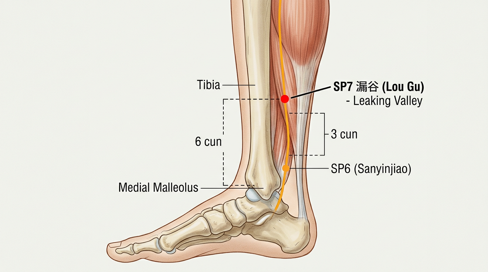

---

### SP8 - די ג'י (地机) - Dì Jī

**משמעות השם**: "מנגנון הארץ" - "ארץ" מתייחסת לאלמנט האדמה (הטחול); "מנגנון" מתייחס לנקודה שבה הצ'י מצטבר ומשתחרר

**מיקום אנטומי**: בצד המדיאלי של השוק, 3 צון מתחת ל-SP9, על הגבול האחורי של עצם השוקה

**איך למצוא את הנקודה**:
1. מצאו תחילה את SP9 (ין לינג צ'ואן) - בשקע מתחת לקונדילוס המדיאלי של עצם השוקה
2. מדדו 3 צון ישירות כלפי מטה לאורך הגבול האחורי של עצם השוקה
3. הנקודה רגישה בדרך כלל ללחיצה, במיוחד אצל נשים עם דיסמנוריאה

**דיקור**: דקירה ניצבת 1.0–1.5 צון

**תחושת דה-צ'י**: כאב עמום עם תחושת נפיחות, עשויה להקרין לאורך הצד המדיאלי של השוק

**פעולות והתוויות**:
- **נקודת מפתח לכאבי מחזור** (痛经 Tòng Jīng) - אחת הנקודות היעילות ביותר לדיסמנוריאה
- מווסתת מחזור חודשי - דימום לא סדיר, אמנוריאה
- מחזקת את הטחול ומפנה רטיבות
- שולטת בדימומים רחמיים
- בצקות, קושי בהשתנה

**קטגוריה מיוחדת**: **נקודת שי-צ'לפט** (郄穴 Xì Xué) - נקודת הצטברות צ'י ודם; יעילה במיוחד למצבים חריפים וכאב

**שילובי נקודות נפוצים**:
- SP8 + SP6 (סאן ין ג'יאו) - כאבי מחזור (שילוב קלאסי)
- SP8 + REN3 (ג'ונג ג'י) + SP6 - דיסמנוריאה חמורה
- SP8 + BL17 (גה שו) - דימומים כרוניים מחולשת טחול
- SP8 + ST36 - כאבי בטן חריפים

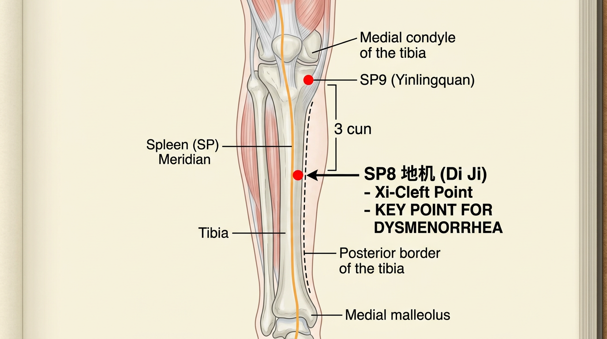

---

### SP9 - ין לינג צ'ואן (阴陵泉) - Yīn Líng Quán

**משמעות השם**: "מעיין גבעת הין" - נמצאת בצד הין (מדיאלי) של הברך, בשקע שנראה כמעיין ליד "גבעה" (הקונדילוס המדיאלי)

**מיקום אנטומי**: בצד המדיאלי של השוק, בשקע שבגבול התחתון-האחורי של הקונדילוס המדיאלי של עצם השוקה (tibia), באותו גובה כמו הטוברוסיטי (tuberosity) של עצם השוקה

**איך למצוא את הנקודה**:
1. שבו את המטופל עם הברך כפופה מעט
2. מצאו את הגבול האחורי של עצם השוקה בשוק
3. החליקו באצבע כלפי מעלה לאורך הגבול האחורי של עצם השוקה
4. האצבע תיעצר בשקע ברור מתחת לקונדילוס המדיאלי של עצם השוקה
5. הנקודה נמצאת בשקע זה - בדרך כלל רגישה מאוד ללחיצה

**דיקור**: דקירה ניצבת 1.0–2.0 צון

**תחושת דה-צ'י**: תחושת כבדות ונפיחות חזקה, עשויה להקרין לאורך הצד המדיאלי של השוק

**פעולות והתוויות**:
- **נקודת המפתח לסילוק רטיבות** (利湿 Lì Shī) - הנקודה היעילה ביותר לסילוק רטיבות מהגוף
- מחזקת את הטחול
- פותחת את מעברי המים (通利水道) - בצקות, מיימת, שתן מועט
- כאבי ברכיים (צד מדיאלי)
- דלקות בדרכי השתן
- שלשול, צהבת
- הפרשות לבנות מרובות

**קטגוריה מיוחדת**: נקודת הה-ים (合穴 Hé) - אלמנט מים

**שילובי נקודות נפוצים**:
- SP9 + SP6 - רטיבות בג'יאו התחתון, בצקות
- SP9 + ST36 (צו סאן לי) - חיזוק טחול וסילוק רטיבות
- SP9 + REN9 (שואי פן) - מיימת, בצקת כללית
- SP9 + BL20 (פי שו) + BL22 (סאן ג'יאו שו) - רטיבות מחולשת טחול

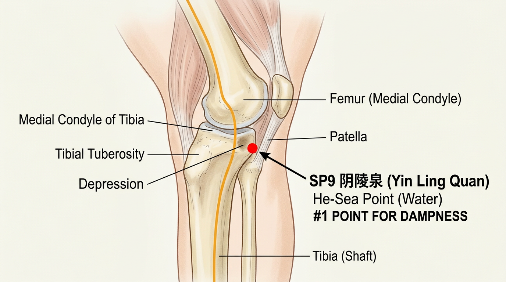

---

### SP10 - שיואה האי (血海) - Xuè Hǎi

**משמעות השם**: "ים הדם" - נקודה חשובה ביותר לכל הקשור לדם: הזנה, הפעלה, ושליטה בדם

**מיקום אנטומי**: בצד המדיאלי של הירך, 2 צון מעל הגבול העליון-המדיאלי של הפטלה (עצם הפיקה), על הבטן של שריר הוואסטוס מדיאליס (vastus medialis)

**איך למצוא את הנקודה**:
1. בקשו מהמטופל לשבת עם הברך כפופה ב-90 מעלות
2. מצאו את הפינה העליונה-המדיאלית של הפטלה
3. מדדו 2 צון (כ-3 אצבעות) כלפי מעלה ומדיאלית
4. **שיטה חלופית**: הניחו את כף ידכם הנגדית (יד ימין על ברך שמאל) כך שהפטלה נמצאת בין האגודל לשאר האצבעות - הנקודה נמצאת בקצה האגודל
5. הנקודה על בטן השריר שמתכווץ כשהמטופל מותח את הברך

**דיקור**: דקירה ניצבת 1.0–1.5 צון

**תחושת דה-צ'י**: תחושת נפיחות וכבדות מקומית על השריר, עשויה להקרין לאורך הצד המדיאלי של הירך

**פעולות והתוויות**:
- **מזינה ומפעילה את הדם** (养血活血) - נקודת מפתח לכל מצבי דם
- מווסתת מחזור חודשי - אי-סדירות, אמנוריאה, דימום מוגבר
- מפנה חום מהדם - פריחות עוריות, אקזמה, סבוריאה, גרד
- מקררת דם - אורטיקריה (חרלת)
- כאבי ברכיים (צד מדיאלי), כאבי ירך פנימי

**קטגוריה מיוחדת**: אין (אך נחשבת אחת הנקודות החשובות ביותר לטיפול במצבי דם)

**שילובי נקודות נפוצים**:
- SP10 + SP6 (סאן ין ג'יאו) - מצבי דם כלליים, גינקולוגיה
- SP10 + LI11 (צ'ו צ'י) - מצבי עור, גרד, אקזמה
- SP10 + BL17 (גה שו) - אנמיה, חסר דם
- SP10 + LR3 (טאי צ'ונג) - מחזור לא סדיר, כאבי מחזור

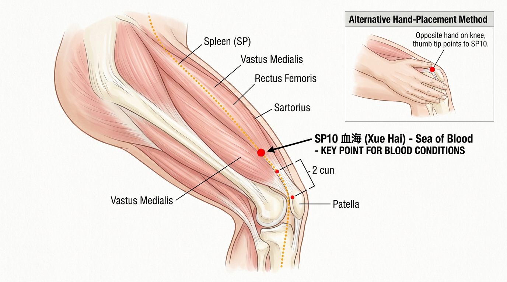

---

### SP11 - ג'י מן (箕门) - Jī Mén

**משמעות השם**: "שער הסל" - "ג'י" = סל נצרים לנפוי תבואה; הנקודה נמצאת באזור שבו שריר הסרטוריוס יוצר צורת V כמו סל

**מיקום אנטומי**: בצד המדיאלי של הירך, 6 צון מעל SP10, על קו המחבר בין SP10 ל-SP12, בשריר הסרטוריוס

**איך למצוא את הנקודה**:
1. מצאו את SP10 (שיואה האי) - 2 צון מעל הפטלה בצד המדיאלי
2. מדדו 6 צון ישירות כלפי מעלה לאורך הצד המדיאלי של הירך
3. הנקודה נמצאת על שריר הסרטוריוס
4. ניתן למשש את עורק הירך (femoral artery) בסמוך - יש להיזהר!

**דיקור**: דקירה ניצבת 0.5–1.0 צון. **זהירות**: הימנעו מפגיעה בעורק הירך!

**תחושת דה-צ'י**: תחושת נפיחות מקומית

**פעולות והתוויות**:
- מווסתת השתנה - קושי בהשתנה, אצירת שתן
- מפנה רטיבות מהג'יאו התחתון
- כאבי מפשעה, כאבי ירך פנימי
- בצקת בגפיים תחתונות

**קטגוריה מיוחדת**: אין

**שילובי נקודות נפוצים**:
- SP11 + SP9 - בצקות בגפיים תחתונות
- SP11 + REN3 (ג'ונג ג'י) - קושי בהשתנה

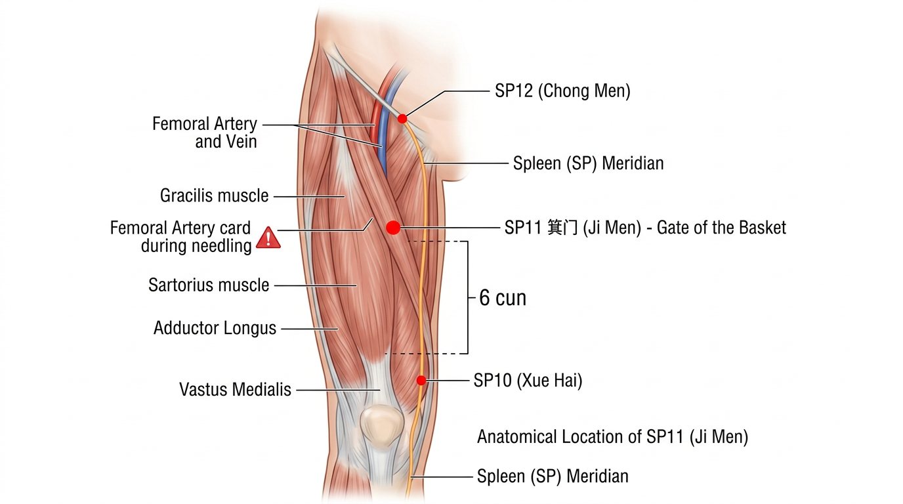

---

### SP12 - צ'ונג מן (冲门) - Chōng Mén

**משמעות השם**: "שער הפריצה" - הנקודה נמצאת במקום שבו עורק הירך "פורץ" מחלל הבטן אל הרגל

**מיקום אנטומי**: בקפל המפשעתי (inguinal crease), 3.5 צון לרוחב מקו האמצע, בצד הלטרלי של עורק הירך

**איך למצוא את הנקודה**:
1. בקשו מהמטופל לשכב על הגב
2. מצאו את קפל המפשעה (הקפל שנוצר בין הבטן לירך)
3. מששו את דופק עורק הירך בקפל המפשעה
4. הנקודה נמצאת בצד הלטרלי (חיצוני) של העורק, 3.5 צון מקו האמצע
5. או: בגובה הגבול העליון של סימפיזיס הפוביס, 3.5 צון לטרלית

**דיקור**: דקירה ניצבת 0.5–1.0 צון. **זהירות**: הימנעו מעורק הירך!

**תחושת דה-צ'י**: תחושת נפיחות מקומית, עשויה להקרין לירך

**פעולות והתוויות**:
- מפנה רטיבות וחום מהג'יאו התחתון
- כאבי בטן תחתונה, הרניה (פתק)
- כאבי מפשעה
- אצירת שתן

**קטגוריה מיוחדת**: נקודת מפגש (交会穴) עם ערוץ הכבד וין ווי מאי (阴维脉)

**שילובי נקודות נפוצים**:
- SP12 + SP6 - כאבי מפשעה, בעיות גינקולוגיות
- SP12 + LR12 (ג'י מאי) - הרניה מפשעתית

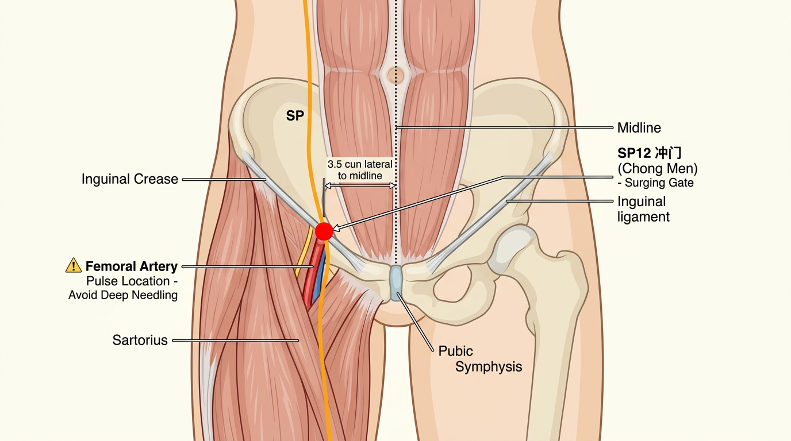

---

### SP13 - פו שה (府舍) - Fǔ Shè

**משמעות השם**: "מעון האיבר" - "פו" = אוצר/מחסן (כינוי לאיברי הפו); "שה" = מעון. הנקודה קרובה לאיברי הבטן

**מיקום אנטומי**: בבטן התחתונה, 0.7 צון מעל SP12, 4 צון לרוחב מקו האמצע

**איך למצוא את הנקודה**:
1. מצאו את SP12 (צ'ונג מן) בקפל המפשעה
2. מדדו 0.7 צון ישירות כלפי מעלה
3. הנקודה נמצאת 4 צון לרוחב מקו האמצע (הטבור)
4. בקירוב - 4.3 צון מתחת לטבור, 4 צון לטרלית

**דיקור**: דקירה ניצבת 1.0–1.5 צון. זהירות באזור הבטן התחתונה.

**תחושת דה-צ'י**: תחושת נפיחות מקומית

**פעולות והתוויות**:
- כאבי בטן תחתונה, הרניה
- הצטברות מסות בבטן
- עצירות

**קטגוריה מיוחדת**: נקודת מפגש (交会穴) עם ין ווי מאי (阴维脉) וערוץ הכבד

**שילובי נקודות נפוצים**:
- SP13 + REN4 (גואן יואן) - כאבי בטן תחתונה
- SP13 + ST25 (טיאן שו) - כאבי בטן עם הפרעות עיכול

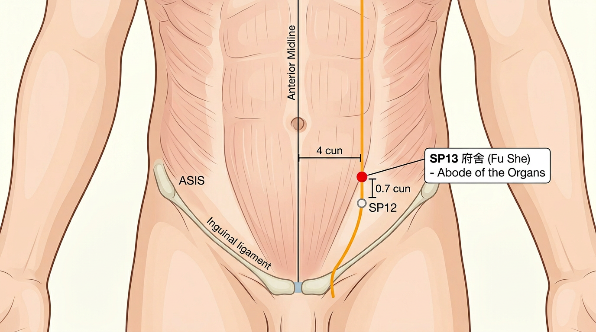

---

### SP14 - פו ג'יה (腹结) - Fù Jié

**משמעות השם**: "קשר הבטן" - הנקודה מטפלת בקשרים והצטברויות בבטן (גושים, עצירות)

**מיקום אנטומי**: בבטן התחתונה, 1.3 צון מתחת לטבור, 4 צון לרוחב מקו האמצע

**איך למצוא את הנקודה**:
1. מצאו את הטבור
2. מדדו 1.3 צון כלפי מטה
3. ממיקום זה, מדדו 4 צון לרוחב (לטרלית)
4. או: מצאו את SP15 (דא הנג, בגובה הטבור, 4 צון לטרלית) ומדדו 1.3 צון כלפי מטה

**דיקור**: דקירה ניצבת 1.0–1.5 צון

**תחושת דה-צ'י**: תחושת נפיחות וכבדות בבטן

**פעולות והתוויות**:
- כאבי בטן סביב הטבור
- שלשול, עצירות
- הרניה

**קטגוריה מיוחדת**: אין

**שילובי נקודות נפוצים**:
- SP14 + ST25 (טיאן שו) - עצירות, כאבי בטן
- SP14 + REN6 (צ'י האי) - כאבי בטן תחתונה

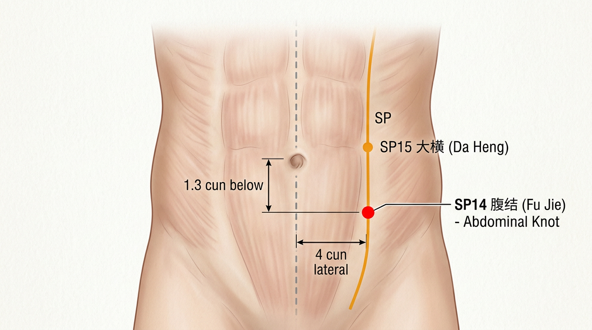

---

### SP15 - דא הנג (大横) - Dà Héng

**משמעות השם**: "אופקי גדול" - הנקודה נמצאת בגובה הטבור, בקו אופקי ישיר, במרחק רחב (גדול) מקו האמצע

**מיקום אנטומי**: בבטן, בגובה הטבור, 4 צון לרוחב מקו האמצע (מרכז הטבור)

**איך למצוא את הנקודה**:
1. מצאו את הטבור
2. מדדו 4 צון ישירות לצד (לטרלית) - שווה ערך לרוחב 4 אצבעות של המטופל מהגבול הלטרלי של הטבור
3. הנקודה בגובה הטבור בדיוק, 4 צון מקו האמצע

**דיקור**: דקירה ניצבת 1.0–1.5 צון

**תחושת דה-צ'י**: תחושת נפיחות מקומית בבטן

**פעולות והתוויות**:
- מחזקת את הטחול ומווסתת את המעיים
- עצירות (במיוחד מרטיבות או חסר צ'י)
- שלשול, כאבי בטן
- כבדות ועייפות בגפיים

**קטגוריה מיוחדת**: נקודת מפגש (交会穴) עם ין ווי מאי (阴维脉)

**שילובי נקודות נפוצים**:
- SP15 + ST25 (טיאן שו) - עצירות, שלשול (שילוב קלאסי לבעיות מעיים)
- SP15 + ST37 (שאנג ג'ו שיו) - שלשול כרוני
- SP15 + REN12 (ג'ונג וואן) - חולשת טחול עם נפיחות

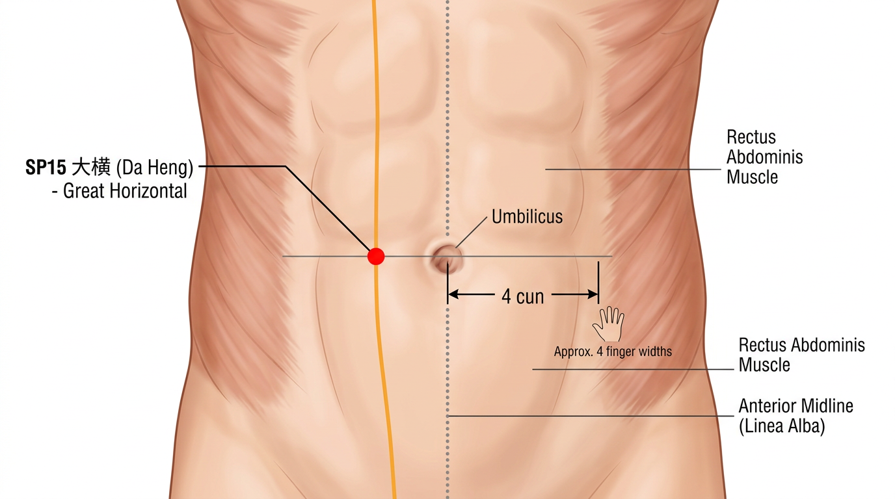

---

### SP16 - פו אי (腹哀) - Fù Āi

**משמעות השם**: "יגון הבטן" - הנקודה מטפלת בכאבי בטן חזקים שגורמים ליגון ("אי" = אנחת כאב)

**מיקום אנטומי**: בבטן העליונה, 3 צון מעל הטבור, 4 צון לרוחב מקו האמצע

**איך למצוא את הנקודה**:
1. מצאו את הטבור
2. מדדו 3 צון כלפי מעלה (זה גם גובה REN11, ג'יאן לי)
3. ממיקום זה, מדדו 4 צון לרוחב (לטרלית)
4. או: מצאו את SP15 (בגובה הטבור, 4 צון לטרלית) ומדדו 3 צון ישירות כלפי מעלה

**דיקור**: דקירה ניצבת 1.0–1.5 צון

**תחושת דה-צ'י**: תחושת נפיחות בבטן

**פעולות והתוויות**:
- כאבי בטן עליונה
- שלשול, דיזנטריה, עצירות
- הפרעות עיכול

**קטגוריה מיוחדת**: נקודת מפגש (交会穴) עם ין ווי מאי (阴维脉)

**שילובי נקודות נפוצים**:
- SP16 + REN12 (ג'ונג וואן) - כאבי בטן עליונה
- SP16 + ST21 (ליאנג מן) - כאבי קיבה לטרליים

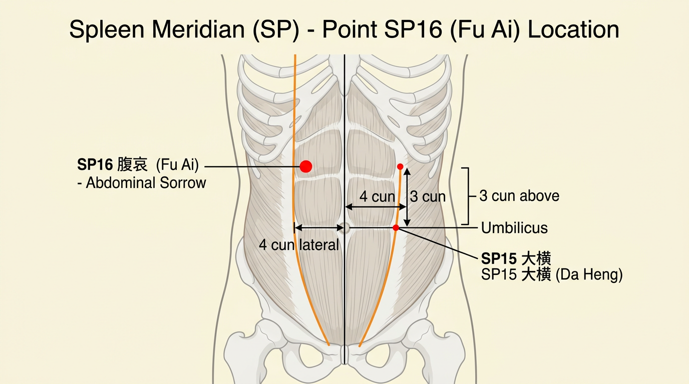

---

### SP17 - שי דואו (食窦) - Shí Dòu

**משמעות השם**: "חור המזון" - הנקודה קשורה לוושט ולמעבר המזון; "דואו" = חור, פתח

**מיקום אנטומי**: בחזה, במרווח הבין-צלעי החמישי, 6 צון לרוחב מקו האמצע הקדמי

**איך למצוא את הנקודה**:
1. מצאו את הפטמה (בדרך כלל בגובה מרווח בין-צלעי 4)
2. ירדו מרווח בין-צלעי אחד כלפי מטה (מרווח 5)
3. מדדו 6 צון מקו האמצע הקדמי (קו חזה האמצע), או 2 צון לטרלית מהפטמה
4. הנקודה נמצאת במרווח הבין-צלעי החמישי

**דיקור**: דקירה אלכסונית או שטוחה (subcutaneous) 0.5–0.8 צון לכיוון לטרלי. **אין לדקור עמוק** - סכנת פנאומוטורקס!

**תחושת דה-צ'י**: תחושת נפיחות מקומית בחזה

**פעולות והתוויות**:
- תחושת מלאות בחזה ובצלעות
- שיהוקים, הקאות, קושי בבליעה
- בצקת כללית
- כאבי בין-צלעיים

**קטגוריה מיוחדת**: אין

**שילובי נקודות נפוצים**:
- SP17 + REN17 (שאן ג'ונג) - תחושת לחץ בחזה
- SP17 + PC6 (ניי גואן) - שיהוקים, בחילות

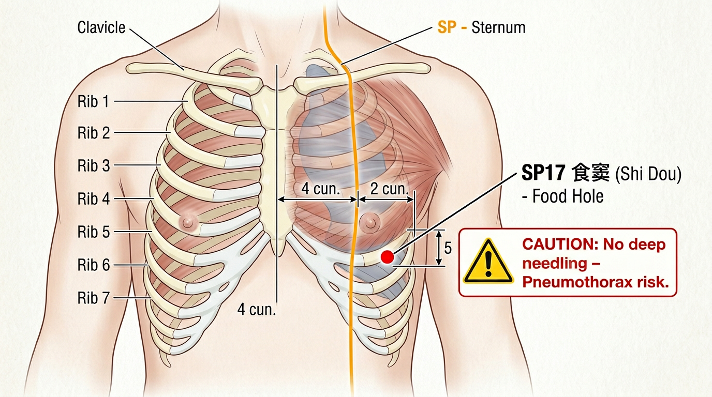

---

### SP18 - טיאן שי (天溪) - Tiān Xī

**משמעות השם**: "נחל שמיימי" - "טיאן" = שמיים (מתייחס לחלק העליון של הגוף/חזה); "שי" = נחל/זרם - מתאר את זרימת הצ'י והחלב

**מיקום אנטומי**: בחזה, במרווח הבין-צלעי הרביעי, 6 צון לרוחב מקו האמצע הקדמי

**איך למצוא את הנקודה**:
1. מצאו את הפטמה (מרווח בין-צלעי 4)
2. הנקודה נמצאת באותו גובה כמו הפטמה, 6 צון מקו האמצע
3. או 2 צון לטרלית מהפטמה
4. במרווח הבין-צלעי הרביעי

**דיקור**: דקירה אלכסונית או שטוחה 0.5–0.8 צון. **אין לדקור עמוק** - סכנת פנאומוטורקס!

**תחושת דה-צ'י**: תחושת נפיחות מקומית

**פעולות והתוויות**:
- כאבי חזה, כאבי שד
- מחסור בחלב אם (促乳 Cù Rǔ) - נקודה חשובה להגברת ייצור חלב
- שיעול, קוצר נשימה
- דלקת שד (מסטיטיס)

**קטגוריה מיוחדת**: אין

**שילובי נקודות נפוצים**:
- SP18 + ST18 (רו גן) - מחסור בחלב אם
- SP18 + REN17 (שאן ג'ונג) - כאבי חזה, בעיות הנקה
- SP18 + SI1 (שאו צה) - חוסר חלב

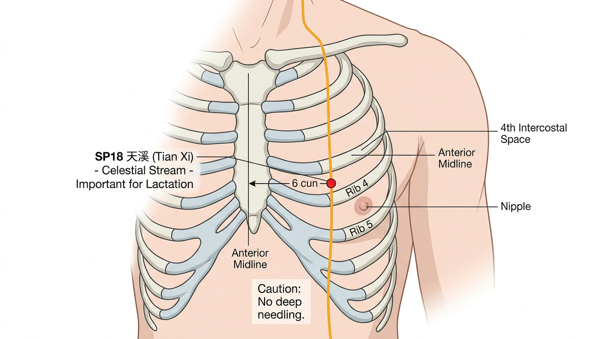

---

### SP19 - שיונג שיאנג (胸乡) - Xiōng Xiāng

**משמעות השם**: "כפר החזה" - "שיאנג" = כפר, אזור; הנקודה נמצאת באזור (ב"כפר") החזה

**מיקום אנטומי**: בחזה, במרווח הבין-צלעי השלישי, 6 צון לרוחב מקו האמצע הקדמי

**איך למצוא את הנקודה**:
1. מצאו את SP18 (מרווח בין-צלעי 4, 6 צון מקו האמצע)
2. עלו מרווח בין-צלעי אחד כלפי מעלה (מרווח 3)
3. הנקודה נמצאת 6 צון מקו האמצע, במרווח הבין-צלעי השלישי

**דיקור**: דקירה אלכסונית או שטוחה 0.5–0.8 צון. **אין לדקור עמוק** - סכנת פנאומוטורקס!

**תחושת דה-צ'י**: תחושת נפיחות ולחץ מקומי

**פעולות והתוויות**:
- כאבי חזה, תחושת מלאות בחזה
- כאבי בין-צלעיים (intercostal)
- קושי בנשימה

**קטגוריה מיוחדת**: אין

**שילובי נקודות נפוצים**:
- SP19 + REN17 - כאבי חזה כלליים
- SP19 + PC6 (ניי גואן) - לחץ בחזה עם בחילות

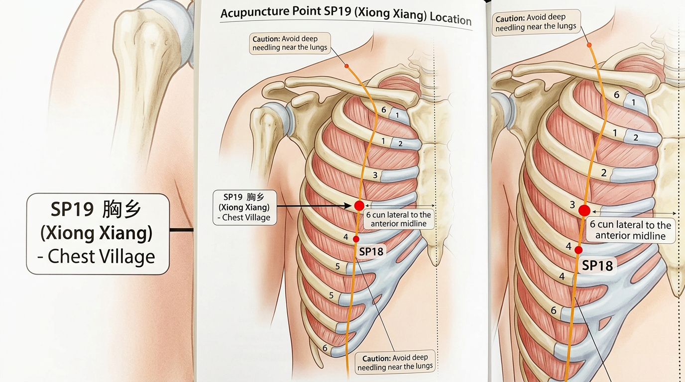

---

### SP20 - ג'ואו רונג (周荣) - Zhōu Róng

**משמעות השם**: "פריחה מסביב" - מתייחס ליכולת הטחול להפיץ הזנה לכל הגוף, כמו פריחה שמתפשטת

**מיקום אנטומי**: בחזה, במרווח הבין-צלעי השני, 6 צון לרוחב מקו האמצע הקדמי

**איך למצוא את הנקודה**:
1. מצאו את SP19 (מרווח בין-צלעי 3, 6 צון מקו האמצע)
2. עלו מרווח בין-צלעי אחד כלפי מעלה (מרווח 2)
3. או: מצאו את הזווית של לואי (angle of Louis / sternal angle) - הבליטה בחלק העליון של עצם החזה, שמסמנת את מרווח בין-צלעי 2
4. מדדו 6 צון לטרלית מקו האמצע

**דיקור**: דקירה אלכסונית או שטוחה 0.5–0.8 צון. **אין לדקור עמוק** - סכנת פנאומוטורקס!

**תחושת דה-צ'י**: תחושת נפיחות מקומית

**פעולות והתוויות**:
- שיעול, קוצר נשימה
- כאבי חזה, תחושת מלאות בחזה
- ירידה בתיאבון, אי-יכולת לאכול

**קטגוריה מיוחדת**: אין

**שילובי נקודות נפוצים**:
- SP20 + LU1 (ג'ונג פו) - שיעול עם כיח
- SP20 + REN17 - לחץ וכאבים בחזה

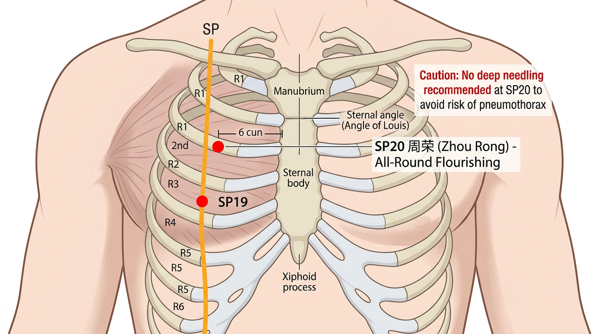

---

### SP21 - דא באו (大包) - Dà Bāo

**משמעות השם**: "חיבוק גדול" או "עטיפה גדולה" - הנקודה היא נקודת הלואו הגדולה של הטחול, ש"עוטפת" ומחברת את כל ערוצי הלואו בגוף

**מיקום אנטומי**: בצד הגוף, על קו אמצע השחי (midaxillary line), במרווח הבין-צלעי השביעי (בין צלע 7 לצלע 8)

**איך למצוא את הנקודה**:
1. בקשו מהמטופל להרים את הזרוע
2. מצאו את מרכז השחי (axilla) ותארו קו ישר כלפי מטה
3. מצאו את המרווח הבין-צלעי השביעי על קו זה
4. **שיטה חלופית**: מצאו את קצה עצם הגבורה (xiphoid process) - הנקודה בגובה זה על קו אמצע השחי
5. או: 6 צון מתחת לשחי על קו אמצע השחי

**דיקור**: דקירה אלכסונית או שטוחה 0.5–0.8 צון. **אין לדקור עמוק** - סכנת פנאומוטורקס!

**תחושת דה-צ'י**: תחושת נפיחות מקומית עם הקרנה לאורך הצלעות

**פעולות והתוויות**:
- כאב בכל הגוף, חולשה כללית (כאשר "הרשת הגדולה" של הלואו לא מתפקדת)
- כאבי צלעות, כאבי צד
- קושי בנשימה
- חולשת גפיים

**קטגוריה מיוחדת**: **נקודת הלואו הגדולה של הטחול** (脾之大络 Pí Zhī Dà Luò) - מחברת את כל 15 ערוצי הלואו בגוף. נקודה ייחודית בכל מערכת המרידיאנים.

**שילובי נקודות נפוצים**:
- SP21 + GB34 (יאנג לינג צ'ואן) - כאבי צלעות, כאבי צד
- SP21 + REN17 (שאן ג'ונג) - כאבי חזה וקוצר נשימה
- SP21 + ST36 (צו סאן לי) - חולשה כללית עם כאבי גוף

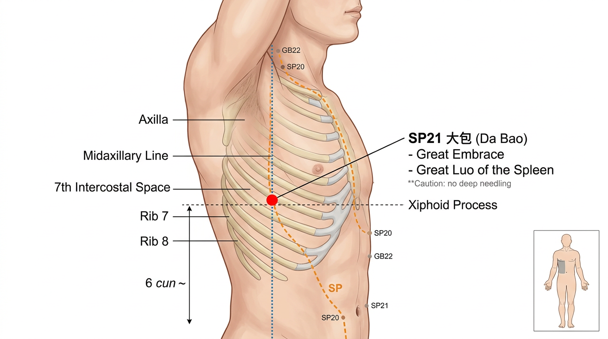

---

## 4. סיכום נקודות מפתח

### נקודות חמש האלמנטים (五输穴 Wǔ Shū Xué)

| נקודה | סוג | אלמנט |
|---|---|---|
| SP1 (ין באי) | ג'ינג-באר (井) | עץ |
| SP2 (דא דו) | יינג-מעיין (荥) | אש |
| SP3 (טאי באי) | שו-זרם (输) | אדמה |
| SP5 (שאנג צ'יו) | ג'ינג-נהר (经) | מתכת |
| SP9 (ין לינג צ'ואן) | הה-ים (合) | מים |

### נקודות מיוחדות נוספות

| נקודה | קטגוריה |
|---|---|
| SP3 (טאי באי) | יואן - מקור (原穴) |
| SP4 (גונג סון) | לואו - מחברת (络穴); פתיחת צ'ונג מאי |
| SP8 (די ג'י) | שי - צ'לפט (郄穴) |
| SP21 (דא באו) | לואו גדולה של הטחול (大络) |

### נקודות שימוש נפוצות ביותר

1. **SP6** (סאן ין ג'יאו) - הנקודה הנפוצה ביותר; גינקולוגיה, עיכול, שינה, דם
2. **SP9** (ין לינג צ'ואן) - סילוק רטיבות
3. **SP10** (שיואה האי) - מצבי דם ועור
4. **SP4** (גונג סון) - בעיות עיכול, חזה, גינקולוגיה (עם PC6)
5. **SP3** (טאי באי) - חיזוק טחול וקיבה

---

## 5. קריאה מומלצת

- Deadman, P. *A Manual of Acupuncture* - פרק ערוץ הטחול
- Maciocia, G. *The Foundations of Chinese Medicine* - פרקי הטחול
- הואנג די ניי ג'ינג, לינג שו, פרק 10

---

> **נקודה למחשבה**: ערוץ הטחול הוא "אם הצ'י והדם שלאחר הלידה" (后天之本). חיזוק הטחול הוא הבסיס לכל טיפול ברפואה הסינית, משום שללא עיכול תקין והפקת צ'י ודם - אין לגוף ממה לחיות.
