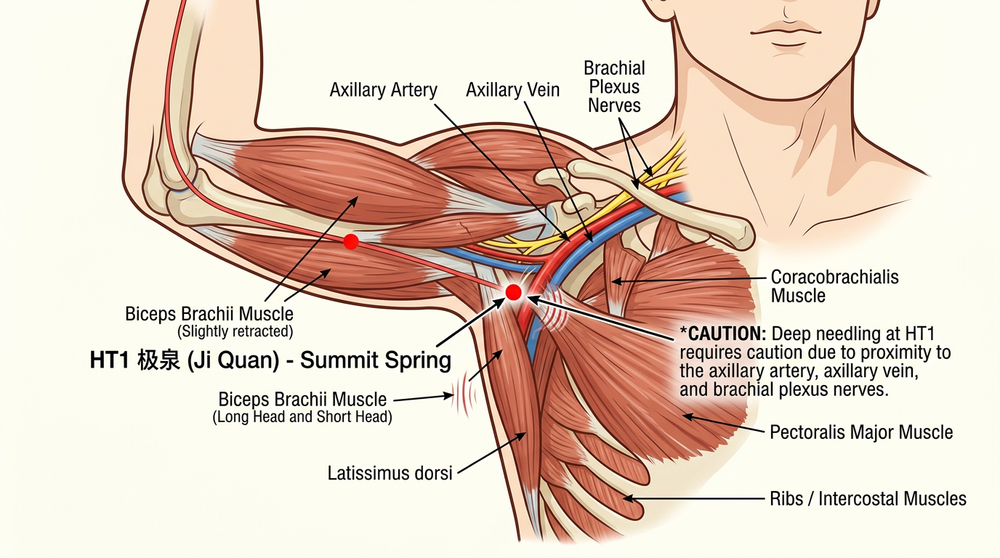
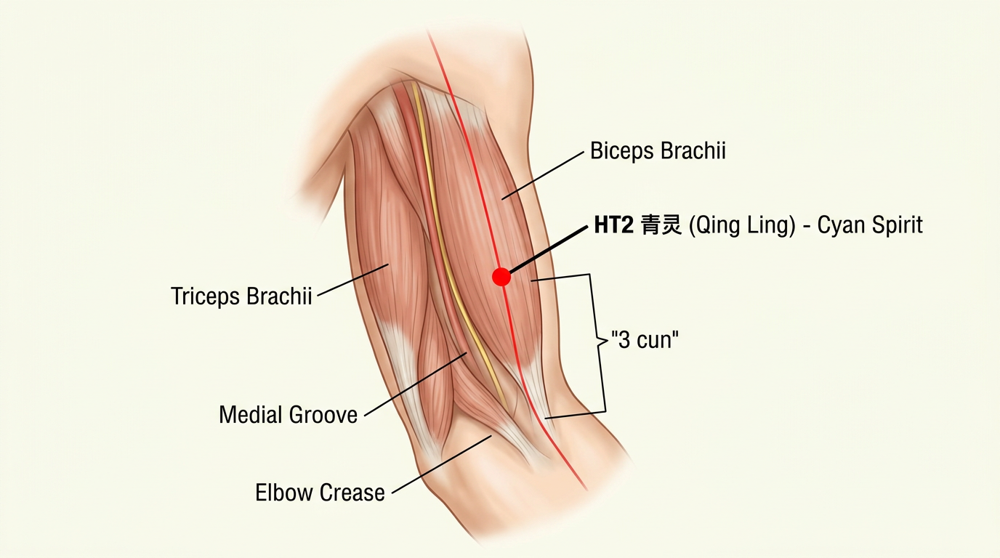
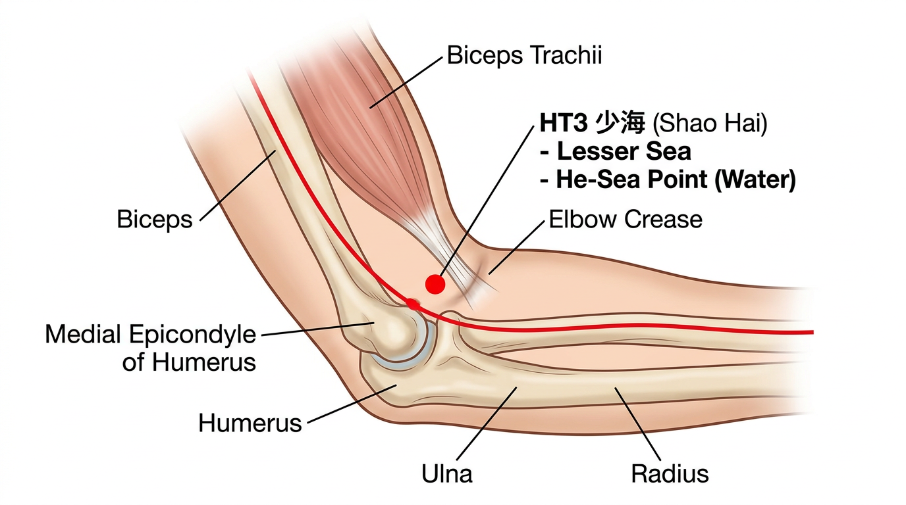
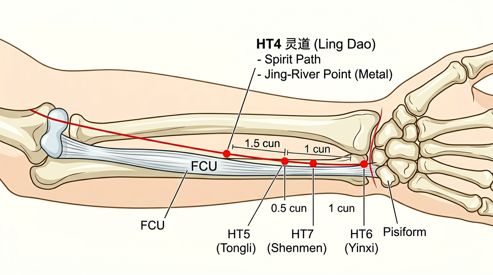
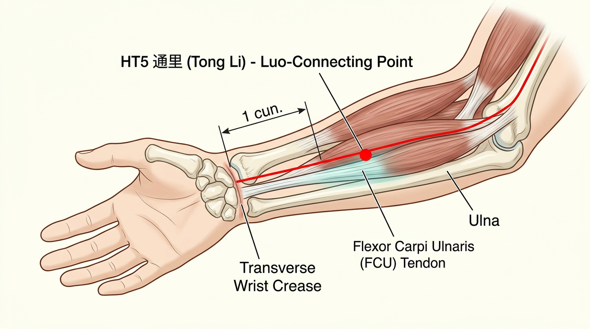
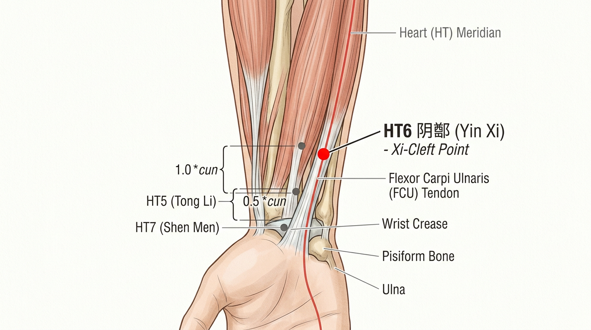
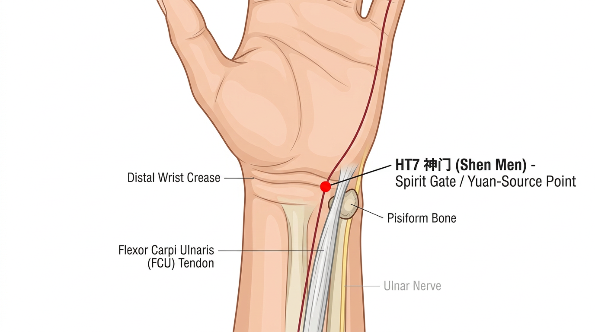
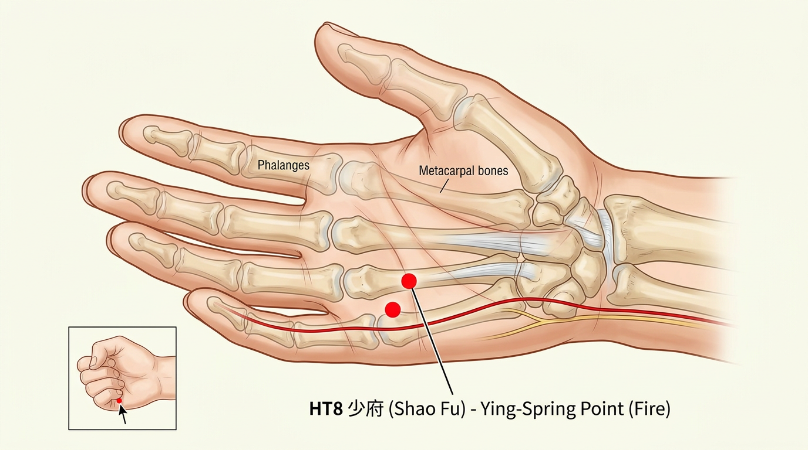
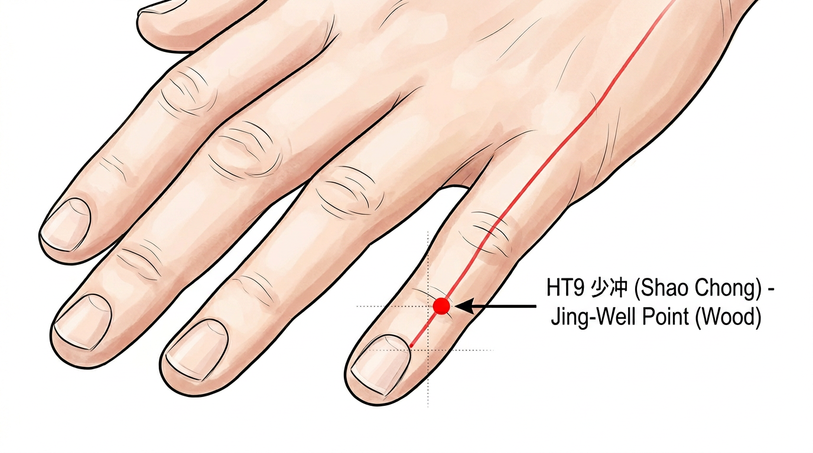

# ערוץ הלב - שו שאו ין שין (手少阴心经)

## Hand Shao Yin Heart Channel

---

## מטרות למידה

בסיום שיעור זה, הסטודנט יוכל:
1. לתאר את מסלול ערוץ הלב החיצוני והפנימי
2. לאתר את 9 נקודות הדיקור של הערוץ על הגוף
3. להסביר את תפקידי הלב ברפואה הסינית
4. לבחור נקודות מתאימות לטיפול בפתולוגיות נפוצות של הלב
5. להבין את הקשר בין הלב, הרוח (שן), והרגשות

---

## 1. סקירת הערוץ

### 1.1 מידע כללי

| פרט | תיאור |
|---|---|
| **שם סיני** | 手少阴心经 (Shǒu Shào Yīn Xīn Jīng) |
| **קיצור** | HT (Heart) |
| **מספר נקודות** | 9 |
| **סוג** | ין (Yin) |
| **אלמנט** | אש (火 Huǒ) |
| **זוג פנימי-חיצוני** | מעי דק (手太阳小肠经 SI) |
| **שעות פעילות** | 11:00–13:00 |
| **כיוון זרימה** | מהחזה ליד (יורד) |

### 1.2 מסלול הערוץ

#### מסלול חיצוני (外行 Wài Xíng)
הערוץ יוצא משטח הגוף באזור השחי (HT1), עובר לאורך הצד המדיאלי של הזרוע העליונה (בין ביספס לטריספס), ממשיך לאורך הצד המדיאלי של האמה (ulnar side), עובר ליד עצם האולנה (ulna), חוצה את שורש כף היד בצד האולנרי, נכנס לכף היד ומסתיים בפינה הרדיאלית של ציפורן הזרת (HT9).

#### מסלול פנימי (内行 Nèi Xíng)
הערוץ מתחיל ב**לב** (心 Xīn), יוצא ממנו ומתפצל לשלושה ענפים:
1. **ענף יורד**: יורד דרך הסרעפת ומתחבר אל **המעי הדק** (小肠 Xiǎo Cháng) - איבר הפו המזווג
2. **ענף עולה**: עולה מהלב לאורך הגרון ומגיע אל **העין** (目系 Mù Xì - "קשר העין")
3. **ענף לטרלי**: יוצא מהלב לריאות, חוצה את השחי ויוצא ב-HT1 - כך מתחבר למסלול החיצוני

### 1.3 זיווג פנימי-חיצוני

ערוץ הלב (ין) מזווג עם ערוץ המעי הדק (יאנג). שניהם שייכים לאלמנט האש (火 Huǒ):
- **הלב** (ין) - שולט על הדם וכלי הדם, מאכלס את הרוח (שן)
- **המעי הדק** (יאנג) - מפריד בין טהור לעכור, מעביר נוזלים לשלפוחית

הקשר הקליני: חום בלב (心火 Xīn Huǒ) יכול לרדת למעי הדק ולגרום לתסמיני חום בדרכי השתן (צריבה בהשתנה, דם בשתן).

---

## 2. תפקידי הלב ברפואה הסינית

### 2.1 תפקידים עיקריים

1. **שולט על הדם וכלי הדם** (主血脉 Zhǔ Xuè Mài): הלב מניע את הדם בכלי הדם. כוח הלב = דופק תקין, מחזור דם תקין.

2. **מאכלס את הרוח** (藏神 Cáng Shén): הלב הוא "הארמון" שבו שוכנת הרוח (神 Shén) - ההכרה, החשיבה, הזיכרון, השינה, והרגשות. כאשר הלב חזק, הרוח יציבה - שינה טובה, חשיבה ברורה, רגשות מאוזנים.

3. **נפתח בלשון** (开窍于舌 Kāi Qiào Yú Shé): מצב הלב משתקף בלשון - צבעה, תנועתה ויכולת הדיבור. לשון אדומה עם קצה אדום = חום בלב. גמגום או קושי בדיבור = חסימת ערוץ הלב.

4. **מתגלה בפנים** (其华在面 Qí Huá Zài Miàn): צבע הפנים משקף את מצב הלב. פנים ורודות = לב בריא. פנים חיוורות = חסר דם הלב. פנים כהות/סגולות = סטגנציה של דם.

5. **שולט על הזיעה** (汗为心之液 Hàn Wéi Xīn Zhī Yè): "הזיעה היא נוזל הלב" - הזעה מוגזמת פוגעת בצ'י ובין הלב.

### 2.2 פתולוגיות נפוצות

| פתולוגיה | סימנים עיקריים |
|---|---|
| **חסר צ'י הלב** (心气虚) | דפיקות לב, קוצר נשימה במאמץ, עייפות, הזעה ספונטנית, פנים חיוורות |
| **חסר יאנג הלב** (心阳虚) | כל הנ"ל + קרירות בגפיים, פנים חיוורות-כחלחלות, כאבי חזה |
| **חסר דם הלב** (心血虚) | דפיקות לב, חיוורון, סחרחורת, שכחנות, נדודי שינה, חלומות מרובים |
| **חסר ין הלב** (心阴虚) | דפיקות לב, נדודי שינה, הזעות לילה, חום בכפות ידיים, אי-שקט |
| **אש הלב עולה** (心火上炎) | כיבים בפה ובלשון, אי-שקט, נדודי שינה, פנים אדומות, צמא |
| **חסימת דם הלב** (心血瘀阻) | כאבי חזה דוקרניים (כמו דקירת סיכה), שפתיים כהות, לשון סגולה |
| **ליחה מטשטשת את הלב** (痰蒙心窍) | בלבול, דיבור לא קוהרנטי, הזיות, אפילפסיה, קהות חושים |

---

## 3. נקודות הערוץ

---

### HT1 - ג'י צ'ואן (极泉) - Jí Quán

**משמעות השם**: "מעיין הפסגה" - "ג'י" = קיצוניות/פסגה; "צ'ואן" = מעיין. הנקודה נמצאת בנקודה הגבוהה ביותר של הערוץ (שחי), כמו מעיין שבפסגת ההר שממנו זורם הערוץ כלפי מטה

**מיקום אנטומי**: במרכז השחי (axilla), בצד המדיאלי של עורק השחי (axillary artery), על שריר הקורקובראכיאליס (coracobrachialis)

**איך למצוא את הנקודה**:
1. בקשו מהמטופל לשכב על הגב עם הזרוע מורמת ב-90 מעלות והכף כלפי מעלה
2. מצאו את מרכז השחי (בית השחי)
3. מששו את דופק עורק השחי
4. הנקודה נמצאת בצד המדיאלי של העורק, במרכז השחי
5. ניתן לחוש שריר קורקובראכיאליס כשהמטופל מכופף מעט את הזרוע

**דיקור**: דקירה ניצבת 0.5–1.0 צון. **זהירות**: הימנעו מעורק ועצב השחי! אין לדקור ישירות לתוך העורק.

**תחושת דה-צ'י**: תחושת חשמלית שמקרינה לאורך הצד המדיאלי של הזרוע עד לאצבעות (עקב סמיכות לעצב)

**פעולות והתוויות**:
- מרחיבה את החזה ומווסתת את צ'י הלב - כאבי חזה, דפיקות לב
- משחררת את הערוץ - כאבי כתף, כאבי זרוע מדיאליים, "יד קפואה"
- כאב בצלעות
- יובש בגרון, צמא

**קטגוריה מיוחדת**: אין

**שילובי נקודות נפוצים**:
- HT1 + PC1 (טיאן צ'י) - כאבי חזה, לחץ בבית השחי
- HT1 + LI15 (ג'יאן יו) - כאבי כתף עם הגבלת תנועה

---

### HT2 - צ'ינג לינג (青灵) - Qīng Líng

**משמעות השם**: "רוח כחולה-ירוקה" - "צ'ינג" = כחול-ירוק (צבע אלמנט העץ/הכבד); "לינג" = רוח/נשמה. מתייחס לקשר הלב-כבד וליכולת הנקודה להשפיע על הרוח

**מיקום אנטומי**: בצד המדיאלי של הזרוע העליונה, 3 צון מעל קפל המרפק, בחריץ המדיאלי של שריר הביסספס ברכיי (biceps brachii)

**איך למצוא את הנקודה**:
1. כופפו את מרפק המטופל מעט
2. מצאו את קפל המרפק (HT3 נמצא בקצה המדיאלי שלו)
3. מדדו 3 צון כלפי מעלה לאורך הצד המדיאלי של הזרוע
4. הנקודה נמצאת בחריץ המדיאלי של שריר הביסספס (בין הביסספס לטריספס)

**דיקור**: דקירה ניצבת 0.5–1.0 צון

**תחושת דה-צ'י**: כאב מקומי עם תחושת נפיחות שעשויה להקרין לכיוון המרפק או השחי

**פעולות והתוויות**:
- כאבי ראש, כאב בעיניים, צהוב בעיניים
- כאבי כתף וזרוע (צד מדיאלי)
- כאבי צלעות, כאבי לב

**קטגוריה מיוחדת**: אין

**שילובי נקודות נפוצים**:
- HT2 + HT3 - כאבי זרוע מדיאליים
- HT2 + PC3 (צ'ו צה) - כאבי מרפק פנימיים

---

### HT3 - שאו האי (少海) - Shào Hǎi

**משמעות השם**: "ים קטן" - "שאו" = קטן/מועט (שם ערוץ שאו-ין); "האי" = ים. נקודת הה (ים) של הערוץ, כמו ים שאליו מתנקזות כל המים

**מיקום אנטומי**: בקפל המרפק, בשקע בין הקצה המדיאלי של קפל המרפק (כשהמרפק מכופף) לבין האפיקונדילוס המדיאלי של עצם הזרוע (humerus)

**איך למצוא את הנקודה**:
1. כופפו את מרפק המטופל ב-90 מעלות
2. מצאו את האפיקונדילוס המדיאלי של ההומרוס (הבליטה הגרמית בצד הפנימי של המרפק)
3. מצאו את קצה הקפל המדיאלי של המרפק
4. הנקודה נמצאת בשקע שבין שני מבנים אלה, בקצה המדיאלי של קפל המרפק
5. באמצע הדרך בין האפיקונדילוס המדיאלי לגיד שריר הביסספס

**דיקור**: דקירה ניצבת 0.5–1.0 צון

**תחושת דה-צ'י**: תחושת נפיחות וכבדות מקומית, עשויה להקרין לאמה

**פעולות והתוויות**:
- מפנה חום מהלב - כאבי לב, אי-שקט, נדודי שינה
- מרגיעה את הרוח (שן) - חרדה, מאניה, אפילפסיה, הפרעות נפשיות
- משחררת את הערוץ - כאבי מרפק, רעד בידיים, חוסר תחושה בזרוע
- כאבי שיניים, נפיחות בצד המרפק
- בלוטות לימפה נפוחות בשחי

**קטגוריה מיוחדת**: נקודת הה-ים (合穴 Hé) - אלמנט מים

**שילובי נקודות נפוצים**:
- HT3 + HT7 (שן מן) - נדודי שינה, חרדה
- HT3 + PC3 (צ'ו צה) - כאבי מרפק מדיאליים ("מרפק גולף")
- HT3 + DU26 (שואי גואו) - אפילפסיה, אובדן הכרה

---

### HT4 - לינג דאו (灵道) - Líng Dào

**משמעות השם**: "נתיב הרוח" - "לינג" = רוח/נשמה; "דאו" = דרך/נתיב. הנקודה פותחת את הנתיב שדרכו הרוח (שן) זורמת בחופשיות

**מיקום אנטומי**: בצד המדיאלי-הקדמי של האמה (אנטרו-מדיאלי), 1.5 צון מעל קפל שורש כף היד, בצד הרדיאלי של גיד שריר פלקסור קרפי אולנריס (FCU)

**איך למצוא את הנקודה**:
1. מצאו תחילה את HT7 (שן מן) - בקפל שורש כף היד, בצד הרדיאלי של גיד FCU
2. מדדו 1.5 צון כלפי מעלה (לכיוון המרפק) מ-HT7
3. הנקודה נמצאת בצד הרדיאלי (צד האגודל) של גיד שריר FCU
4. ניתן לזהות את גיד FCU כשהמטופל מכופף את שורש כף היד ומטה אותו לצד האולנרי

**דיקור**: דקירה ניצבת 0.3–0.5 צון

**תחושת דה-צ'י**: כאב מקומי עם תחושת עקצוץ שעשויה להקרין לכף היד

**פעולות והתוויות**:
- מרגיעה את הרוח - עצב פתאומי, פחד, חרדה
- מווסתת את צ'י הלב - דפיקות לב, כאבי חזה
- משחררת את הקול - אובדן קול פתאומי (אפוניה), גמגום
- כאבי שורש כף היד ואמה

**קטגוריה מיוחדת**: נקודת ג'ינג-נהר (经穴 Jīng) - אלמנט מתכת

**שילובי נקודות נפוצים**:
- HT4 + HT7 (שן מן) - דפיקות לב עם חרדה
- HT4 + REN23 (ליאן צ'ואן) - אובדן קול, קושי בדיבור
- HT4 + PC6 (ניי גואן) - כאבי חזה, דפיקות לב

---

### HT5 - טונג לי (通里) - Tōng Lǐ

**משמעות השם**: "חודר פנימה" - "טונג" = לחדור/לעבור; "לי" = פנים. כנקודת לואו, היא "חודרת" ומחברת את ערוץ הלב לערוץ המעי הדק (הזוג החיצוני)

**מיקום אנטומי**: בצד המדיאלי-הקדמי של האמה, 1 צון מעל קפל שורש כף היד, בצד הרדיאלי של גיד שריר FCU

**איך למצוא את הנקודה**:
1. מצאו את HT7 (שן מן) בקפל שורש כף היד
2. מדדו 1 צון בלבד כלפי מעלה (לכיוון המרפק)
3. הנקודה נמצאת בצד הרדיאלי של גיד FCU
4. ממוקמת 0.5 צון דיסטלית (קרוב יותר ליד) מ-HT4

**דיקור**: דקירה ניצבת 0.3–0.5 צון

**תחושת דה-צ'י**: כאב מקומי עם תחושת עקצוץ, עשויה להקרין לכף היד ולזרת

**פעולות והתוויות**:
- מחזקת את הלשון ומשחררת דיבור - גמגום, אובדן קול, לשון נוקשה
- מרגיעה את הרוח - אי-שקט, פחד, דפיקות לב
- מווסתת את קצב הלב - אריתמיה, ברדיקרדיה
- מווסתת מחזור חודשי - דימום רחמי (עקב קשר לב-רחם)
- הזעות לילה, הזעה ספונטנית
- כאבי עיניים, ראייה מטושטשת
- כאבי שורש כף היד

**קטגוריה מיוחדת**: **נקודת לואו-מחברת** (络穴 Luò Xué) - מתחברת לערוץ המעי הדק (SI)

**שילובי נקודות נפוצים**:
- HT5 + SI7 (ג'י ג'נג) - חיבור פנימי-חיצוני לב/מעי דק
- HT5 + REN23 (ליאן צ'ואן) - גמגום, אובדן קול
- HT5 + BL15 (שין שו) - דפיקות לב, אריתמיה
- HT5 + SP6 (סאן ין ג'יאו) - דימום רחמי

---

### HT6 - ין שי (阴郄) - Yīn Xì

**משמעות השם**: "צ'לפט הין" - "ין" = ין; "שי" = צ'לפט (סדק, חריץ). נקודת הצ'לפט של ערוץ ין, שבה הצ'י והדם מצטברים

**מיקום אנטומי**: בצד המדיאלי-הקדמי של האמה, 0.5 צון מעל קפל שורש כף היד, בצד הרדיאלי של גיד שריר FCU

**איך למצוא את הנקודה**:
1. מצאו את HT7 (שן מן) בקפל שורש כף היד
2. מדדו 0.5 צון בלבד כלפי מעלה
3. הנקודה נמצאת בצד הרדיאלי של גיד FCU
4. ממוקמת חצי צון דיסטלית מ-HT5 וחצי צון פרוקסימלית מ-HT7

**דיקור**: דקירה ניצבת 0.3–0.5 צון

**תחושת דה-צ'י**: כאב מקומי חד, תחושת עקצוץ

**פעולות והתוויות**:
- **נקודת מפתח להזעות לילה** (盗汗 Dào Hàn) - הנקודה היעילה ביותר להזעות לילה מחסר ין
- מזינה ין הלב - חום בלילה, חום בכפות ידיים, אי-שקט
- מפנה חום ריק (虚热 Xū Rè) מהלב
- מקררת דם - דימום אף, הקאת דם
- מרגיעה את הרוח - פחד פתאומי, חרדת לילה
- כאבי לב חריפים

**קטגוריה מיוחדת**: **נקודת שי-צ'לפט** (郄穴 Xì Xué) - יעילה במיוחד למצבים חריפים ולכאב

**שילובי נקודות נפוצים**:
- HT6 + KI7 (פו ליו) - הזעות לילה (שילוב קלאסי)
- HT6 + KI6 (ג'או האי) - חסר ין עם הזעות לילה וחום ריק
- HT6 + HT7 (שן מן) - חרדת לילה, פחד פתאומי
- HT6 + BL15 (שין שו) - כאבי לב חריפים

---

### HT7 - שן מן (神门) - Shén Mén

**משמעות השם**: "שער הרוח" - "שן" = רוח/נשמה/הכרה; "מן" = שער. הנקודה היא ה"שער" שדרכו ניתן להשפיע על הרוח (שן) - ההכרה, הרגשות והשינה

**מיקום אנטומי**: בקפל שורש כף היד (הקפל הדיסטלי), בשקע הרדיאלי של גיד שריר פלקסור קרפי אולנריס (FCU), בגובה עצם הפיסיפורם (pisiform)

**איך למצוא את הנקודה**:
1. מצאו את קפל שורש כף היד (הקפל הקרוב ביותר לכף היד)
2. מצאו את גיד שריר FCU - בקשו מהמטופל לכופף את שורש כף היד ולהטות לצד האולנרי; הגיד יבלוט בצד האולנרי של שורש כף היד
3. הנקודה נמצאת בצד הרדיאלי (צד האגודל) של הגיד, על קפל שורש כף היד
4. ניתן לחוש את עצם הפיסיפורם (עצם עגולה קטנה) בצד האולנרי - הנקודה ממש בצד הרדיאלי שלה
5. לחיצה על הנקודה בדרך כלל גורמת לתחושת רגישות ברורה

**דיקור**: דקירה ניצבת 0.3–0.5 צון

**תחושת דה-צ'י**: כאב עמום מקומי, תחושת כבדות, עשויה להקרין לכף היד

**פעולות והתוויות**:
- **נקודת המפתח להרגעת הרוח** (安神 Ān Shén) - הנקודה הנפוצה ביותר לנדודי שינה, חרדה, ודפיקות לב
- מרגיעה ומייצבת את הרוח - חרדה, דיכאון, מאניה, אפילפסיה, היסטריה
- מחזקת ומזינה את הלב - דפיקות לב, כאבי חזה
- מפנה חום מהלב - כיבים בפה, צמא
- שכחנות, חלומות מרובים, דיבור בשינה
- רעד בידיים

**קטגוריה מיוחדת**: נקודת שו-זרם (输穴 Shū) - אלמנט אדמה; **נקודת יואן-מקור** (原穴 Yuán Xué); נקודת סדציה (泻穴 Xiè Xué)

**שילובי נקודות נפוצים**:
- HT7 + SP6 (סאן ין ג'יאו) - **שילוב קלאסי** לנדודי שינה
- HT7 + PC6 (ניי גואן) - דפיקות לב, חרדה
- HT7 + BL15 (שין שו) - חיזוק לב, דפיקות לב (קדמי-אחורי)
- HT7 + KI6 (ג'או האי) - נדודי שינה מחסר ין
- HT7 + DU20 (באי הוי) - חרדה, סחרחורת, שכחנות
- HT7 + LR3 (טאי צ'ונג) - דיכאון, אי-שקט רגשי
- HT7 + REN14 (ג'ו צ'ואה) - בעיות לב עם חרדה

---

### HT8 - שאו פו (少府) - Shào Fǔ

**משמעות השם**: "ארמון קטן" - "שאו" = קטן/מועט (שאו-ין); "פו" = ארמון/מעון. הנקודה היא מעון האש של ערוץ שאו-ין

**מיקום אנטומי**: בכף היד, בין עצמות המטקרפוס ה-4 וה-5, כשקופצים אגרוף - בנקודה שבה קצה הזרת נוגע בכף היד

**איך למצוא את הנקודה**:
1. בקשו מהמטופל לסגור אגרוף קל
2. המקום שבו קצה הזרת נוגע בכף היד - זוהי הנקודה
3. **שיטה חלופית**: מצאו את המרווח בין עצמות המטקרפוס ה-4 וה-5
4. הנקודה נמצאת פרוקסימלית למפרק המטקרפו-פלנגיאלי, בערך במרכז כף היד (קרוב לקצה הדיסטלי של קפל הלב בכף היד)

**דיקור**: דקירה ניצבת 0.3–0.5 צון

**תחושת דה-צ'י**: כאב מקומי חד בכף היד

**פעולות והתוויות**:
- מפנה חום מהלב ומהמעי הדק - כיבים בפה ובלשון, צריבה בהשתנה
- מרגיעה את הרוח - אי-שקט, עצבנות, פחד
- מווסתת צ'י הלב - דפיקות לב, כאבי חזה
- גרד באיברי מין, הטלת שתן כואבת (חום לב שיורד למעי דק ולשלפוחית)
- כאב ונפיחות בכף היד, כיווץ הזרת והקמיצה

**קטגוריה מיוחדת**: נקודת יינג-מעיין (荥穴 Yíng) - אלמנט אש

**שילובי נקודות נפוצים**:
- HT8 + HT7 (שן מן) - חום בלב עם חרדה
- HT8 + SI2 (צ'יאן גו) - כיבים בפה, חום לב שיורד למעי דק
- HT8 + REN15 (ג'יו ווי) - מאניה, חום בלב

---

### HT9 - שאו צ'ונג (少冲) - Shào Chōng

**משמעות השם**: "פריצת השאו" - "שאו" = קטן/מועט (שאו-ין); "צ'ונג" = לפרוץ/להתנגש. נקודת הג'ינג שממנה הצ'י פורצת אל ערוץ המעי הדק

**מיקום אנטומי**: בצד הרדיאלי של הזרת, 0.1 צון פרוקסימלית לפינה של בסיס הציפורן

**איך למצוא את הנקודה**:
1. מצאו את הזרת (האצבע הקטנה)
2. הביטו בפינה הרדיאלית (צד פנימי, לכיוון האצבע הרביעית) של בסיס הציפורן
3. מדדו כ-0.1 צון (כ-2 מ"מ) פרוקסימלית ורדיאלית מפינת הציפורן
4. הנקודה נמצאת במפגש שני קווים: אחד לאורך הצד הרדיאלי של הציפורן, והשני לאורך בסיס הציפורן

**דיקור**: דקירה רדודה 0.1 צון, או דימום בעזרת מחט שלוש קצוות. מוקסה אפשרית.

**תחושת דה-צ'י**: כאב חד מקומי, תחושת עקצוץ

**פעולות והתוויות**:
- **מחייה את ההכרה** (开窍 Kāi Qiào) - אובדן הכרה, שבץ, קומה
- מפנה חום מהלב - חום גבוה עם דליריום, עוויתות חום בילדים
- מרגיעה את הרוח - מאניה חריפה, חרדה חמורה
- כאבי חזה, דפיקות לב
- כאב וחום בכף היד ובזרת

**קטגוריה מיוחדת**: נקודת ג'ינג-באר (井穴 Jǐng) - אלמנט עץ

**שילובי נקודות נפוצים**:
- HT9 + PC9 (ג'ונג צ'ונג) + DU26 (שואי גואו) - מצבי חירום: אובדן הכרה, שבץ
- HT9 + PC8 (לאו גונג) - חום בלב עם דליריום
- HT9 + LU11 (שאו שאנג) - כאב גרון חריף, חום גבוה

---

## 4. סיכום נקודות מפתח

### נקודות חמש האלמנטים (五输穴 Wǔ Shū Xué)

| נקודה | סוג | אלמנט |
|---|---|---|
| HT9 (שאו צ'ונג) | ג'ינג-באר (井) | עץ |
| HT8 (שאו פו) | יינג-מעיין (荥) | אש |
| HT7 (שן מן) | שו-זרם (输) | אדמה |
| HT4 (לינג דאו) | ג'ינג-נהר (经) | מתכת |
| HT3 (שאו האי) | הה-ים (合) | מים |

### נקודות מיוחדות נוספות

| נקודה | קטגוריה |
|---|---|
| HT7 (שן מן) | יואן - מקור (原穴); שו-זרם (输穴) |
| HT5 (טונג לי) | לואו - מחברת (络穴) |
| HT6 (ין שי) | שי - צ'לפט (郄穴) |

### נקודות שימוש נפוצות ביותר

1. **HT7** (שן מן) - הנקודה הנפוצה ביותר; נדודי שינה, חרדה, דפיקות לב
2. **HT6** (ין שי) - הזעות לילה, חסר ין הלב
3. **HT5** (טונג לי) - בעיות דיבור, אריתמיה
4. **HT3** (שאו האי) - בעיות נפשיות, כאבי מרפק
5. **HT8** (שאו פו) - חום בלב, כיבים בפה

---

## 5. קריאה מומלצת

- Deadman, P. *A Manual of Acupuncture* - פרק ערוץ הלב
- Maciocia, G. *The Foundations of Chinese Medicine* - פרקי הלב
- הואנג די ניי ג'ינג, סו וון, פרק 8: "הלב הוא השליט"

---

> **נקודה למחשבה**: הלב נקרא ברפואה הסינית "קיסר של כל האיברים" (君主之官 Jūn Zhǔ Zhī Guān). בדומה לקיסר שאינו עושה את העבודה בעצמו אלא מנהל, הלב שולט על ההכרה, הרגשות והדם - והפריקרד (心包 Xīn Bāo) משמש כ"שר הפנים" שמגן עליו. לכן, פתולוגיות רבות של "הלב" מטופלות דרך ערוץ הפריקרד.
