# 07-small-intestine

## ערוץ המעי הדק - שו טאי יאנג שיאו צ'אנג (手太阳小肠经)

### Hand Tai Yang Small Intestine Channel

***

### מטרות למידה

בסיום שיעור זה, הסטודנט יוכל:

1. לתאר את מסלול ערוץ המעי הדק החיצוני והפנימי
2. לאתר את 19 נקודות הדיקור של הערוץ על הגוף
3. להסביר את תפקודי המעי הדק ברפואה הסינית
4. לבחור נקודות מתאימות לטיפול בפתולוגיות נפוצות
5. להבין את הקשר בין הלב והמעי הדק (זיווג פנימי-חיצוני)

***

### 1. סקירת הערוץ

#### 1.1 מידע כללי

| פרט                  | תיאור                                  |
| -------------------- | -------------------------------------- |
| **שם סיני**          | 手太阳小肠经 (Shǒu Tài Yáng Xiǎo Cháng Jīng) |
| **קיצור**            | SI (Small Intestine)                   |
| **מספר נקודות**      | 19                                     |
| **סוג**              | יאנג (Yang)                            |
| **אלמנט**            | אש (火 Huǒ)                             |
| **זוג פנימי-חיצוני** | לב (手少阴心经 HT)                          |
| **שעות פעילות**      | 13:00–15:00                            |
| **כיוון זרימה**      | מהיד לראש (עולה)                       |

#### 1.2 מסלול הערוץ

**מסלול חיצוני (外行 Wài Xíng)**

הערוץ מתחיל בפינה האולנרית של ציפורן הזרת (SI1), עולה לאורך הצד האולנרי של כף היד, עובר את שורש כף היד, ממשיך לאורך הצד האחורי-האולנרי של האמה (בין עצם האולנה לשריר FCU), עובר בין האולקרנון (olecranon) לאפיקונדילוס המדיאלי של ההומרוס, עולה לאורך הצד האחורי של הזרוע העליונה, עובר דרך הצד האחורי של הכתף, מתעקל בצורת זיגזג על גב הכתף (עובר דרך SI9-SI15), עולה לצוואר, מגיע ללחי ולאוזן החיצונית (SI19), עם ענף שעולה ללחי ומגיע לזווית הפנימית של העין (שם מתחבר לערוץ שלפוחית השתן BL1).

**מסלול פנימי (内行 Nèi Xíng)**

מהבור העל-שכמי (supraclavicular fossa), ענף פנימי יורד אל הלב (心 Xīn) ומשם יורד לאורך הוושט, חוצה את הסרעפת, עובר דרך הקיבה ומגיע אל **המעי הדק** (小肠 Xiǎo Cháng) - האיבר השייך לו.

ענף נוסף עולה מהבור העל-שכמי לאורך הצוואר ללחי, ומגיע לאזור מתחת לעין ולאוזן הפנימית.

#### 1.3 זיווג פנימי-חיצוני

ערוץ המעי הדק (יאנג) מזווג עם ערוץ הלב (ין). שניהם שייכים לאלמנט האש (火 Huǒ):

* **הלב** (ין) - שולט על הדם, מאכלס את הרוח
* **המעי הדק** (יאנג) - מפריד בין טהור (清 Qīng) לעכור (浊 Zhuó)

הקשר הקליני: חום בלב (心火) יכול לרדת למעי הדק ולגרום: צריבה בהשתנה, שתן כהה, דם בשתן. בנוסף, בעיות רגשיות של הלב (חרדה, עצבנות) משפיעות על העיכול דרך המעי הדק.

***

### 2. תפקודי המעי הדק ברפואה הסינית

#### 2.1 תפקידים עיקריים

1. **שליטה על קבלה ופירוק** (受盛化物 Shòu Chéng Huà Wù): המעי הדק מקבל מזון מעוכל חלקית מהקיבה וממשיך את תהליך העיכול.
2. **הפרדה בין טהור לעכור** (泌别清浊 Mì Bié Qīng Zhuó): זהו התפקיד המרכזי - המעי הדק מפריד:
   * **טהור** (清 Qīng): חומרים מזינים → נשלחים לטחול להפצה
   * **עכור מוצק** (浊) → נשלח למעי הגס להפרשה
   * **עכור נוזלי** (浊) → נשלח לשלפוחית השתן
3. **קשר ללב**: כאיבר הפו המזווג ללב, המעי הדק מושפע ישירות ממצב הלב. חום בלב מועבר למעי הדק.

#### 2.2 פתולוגיות נפוצות

| פתולוגיה                           | סימנים עיקריים                                                   |
| ---------------------------------- | ---------------------------------------------------------------- |
| **חום במעי הדק** (小肠实热)            | כאבי בטן תחתונה, צריבה בהשתנה, שתן כהה, כיבים בפה (חום עולה מלב) |
| **חסר וקור במעי הדק** (小肠虚寒)       | כאבי בטן עמומים שמשתפרים בחום ובלחיצה, בורבוריגמוס, שלשול        |
| **סטגנציה של צ'י במעי הדק** (小肠气滞) | כאבי בטן תחתונה, נפיחות, הרניה מפשעתית                           |

***

### 3. נקודות הערוץ

***

#### SI1 - שאו צה (少泽) - Shào Zé

**משמעות השם**: "ביצה קטנה" - "שאו" = קטן; "צה" = ביצה/אגם רדוד. נקודת הג'ינג שממנה הצ'י מתחילה לזרום כמו מים בביצה קטנה

**מיקום אנטומי**: בצד האולנרי של הזרת, 0.1 צון פרוקסימלית לפינה של בסיס הציפורן

**איך למצוא את הנקודה**:

1. מצאו את הזרת (האצבע הקטנה)
2. הביטו בפינה האולנרית (חיצונית) של בסיס הציפורן
3. מדדו כ-0.1 צון (כ-2 מ"מ) פרוקסימלית ואולנרית מפינת הציפורן
4. הנקודה נמצאת בצד ההפוך ל-HT9 (שנמצא בצד הרדיאלי של הזרת)

**דיקור**: דקירה רדודה 0.1 צון, או דימום בעזרת מחט שלוש קצוות. מוקסה מומלצת.

**תחושת דה-צ'י**: כאב חד מקומי, עקצוץ

**פעולות והתוויות**:

* **מגבירה ייצור חלב אם** (催乳 Cuī Rǔ) - נקודה חשובה מאוד למחסור בחלב
* מפנה חום ומפחיתה נפיחות - כאב גרון, נפיחות בלחי, דלקת עיניים
* מחייה את ההכרה - אובדן הכרה, שבץ
* חום גבוה, עוויתות חום

**קטגוריה מיוחדת**: נקודת ג'ינג-באר (井穴 Jǐng) - אלמנט מתכת

**שילובי נקודות נפוצים**:

* SI1 + REN17 (שאן ג'ונג) + SP18 (טיאן שי) - מחסור בחלב אם
* SI1 + LU11 (שאו שאנג) - כאב גרון חריף
* SI1 + DU26 (שואי גואו) - אובדן הכרה

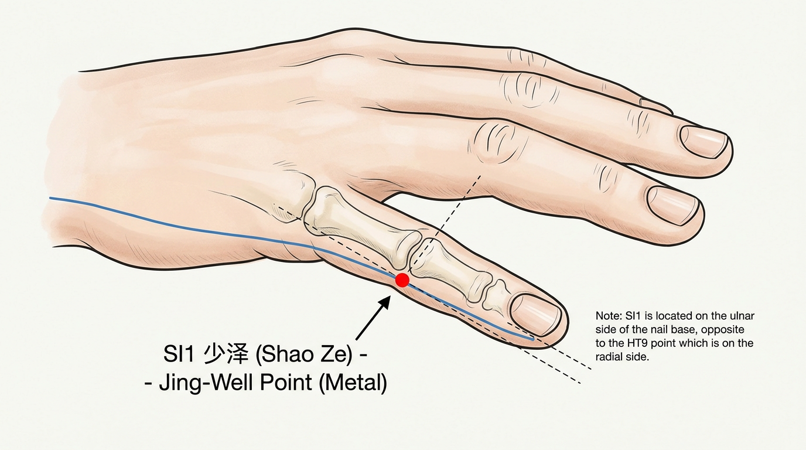

***

#### SI2 - צ'יאן גו (前谷) - Qián Gǔ

**משמעות השם**: "עמק קדמי" - הנקודה נמצאת לפני (דיסטלית) למפרק, בשקע כמו עמק קטן

**מיקום אנטומי**: בצד האולנרי של הזרת, בשקע הדיסטלי של מפרק ה-MTP החמישי, במעבר בין עור כף היד לגב היד

**איך למצוא את הנקודה**:

1. מצאו את מפרק ה-MTP החמישי (מפרק בסיס הזרת)
2. קפצו אגרוף קל כדי להבליט את קו המפרק
3. מצאו את השקע בצד האולנרי של המפרק, מעט דיסטלית
4. הנקודה נמצאת במעבר בין עור כף היד (כהה) לעור גב היד (בהיר)

**דיקור**: דקירה ניצבת 0.3–0.5 צון

**תחושת דה-צ'י**: כאב מקומי עם נפיחות קלה

**פעולות והתוויות**:

* מפנה חום מהלב ומהמעי הדק - כיבים בפה, כיבים על הלשון
* מפחיתה נפיחות - כאב גרון, נפיחות בלחי
* מחסור בחלב אם (משני ל-SI1)
* חום, כאבי ראש, טינטון
* כאבי אצבעות

**קטגוריה מיוחדת**: נקודת יינג-מעיין (荥穴 Yíng) - אלמנט מים

**שילובי נקודות נפוצים**:

* SI2 + HT8 (שאו פו) - חום בלב עם כיבים בפה
* SI2 + LI4 (חה גו) - כאב גרון, כאבי שיניים

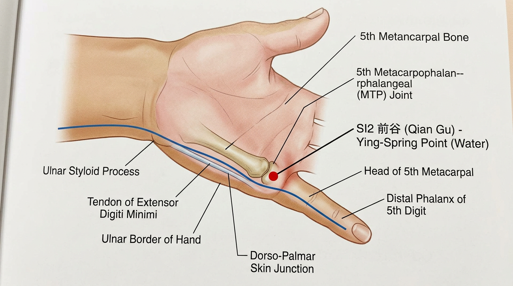

***

#### SI3 - הואו שי (后溪) - Hòu Xī

**משמעות השם**: "נחל אחורי" - הנקודה נמצאת בצד האולנרי (אחורי) של כף היד, בשקע כמו נחל קטן שנוצר כשקופצים אגרוף

**מיקום אנטומי**: בצד האולנרי של כף היד, בשקע הפרוקסימלי של מפרק ה-MTP החמישי, במעבר בין עור כף היד לגב היד

**איך למצוא את הנקודה**:

1. בקשו מהמטופל לקפוץ אגרוף רפוי
2. מצאו את מפרק ה-MTP החמישי בצד האולנרי של כף היד
3. הנקודה נמצאת בשקע שמיד מעל (פרוקסימלית) לראש עצם המטקרפוס החמישית
4. הקפל שנוצר בצד האולנרי של כף היד כשקופצים אגרוף - הנקודה בקצה הפרוקסימלי של קפל זה
5. במעבר בין עור כף היד לגב היד

**דיקור**: דקירה ניצבת 0.5–0.8 צון, בכיוון כף היד

**תחושת דה-צ'י**: כאב מקומי עם תחושת נפיחות, עשויה להקרין לזרת

**פעולות והתוויות**:

* **פותחת את דו מאי** (督脉 Dū Mài) - כאבי גב, נוקשות צוואר, כאבי עמוד שדרה
* מפנה רוח-חום - חום, כאבי ראש עורפיים, נוקשות צוואר
* מרגיעה את הרוח - אפילפסיה, מאניה, היסטריה
* מועילה לעיניים ולאוזניים - כאבי עיניים, טינטון, חירשות
* מפנה חום מהלב - הזעות לילה, כיבים בפה
* כאבי מרפק, כאבי זרוע

**קטגוריה מיוחדת**: נקודת שו-זרם (输穴 Shū) - אלמנט עץ; **נקודת פתיחה של דו מאי** (督脉 Dū Mài) - ערוץ המושל (Governing Vessel)

**שילובי נקודות נפוצים**:

* SI3 + BL62 (שן מאי) - **זוג מצמד** לפתיחת דו מאי - כאבי גב, כאבי צוואר, כאבי ראש עורפיים, אפילפסיה
* SI3 + DU14 (דא ג'ואי) - נוקשות צוואר, חום
* SI3 + BL40 (ווי ג'ונג) - כאבי גב תחתון חריפים
* SI3 + LU7 (ליה צ'ואה) - כאבי ראש, נוקשות צוואר

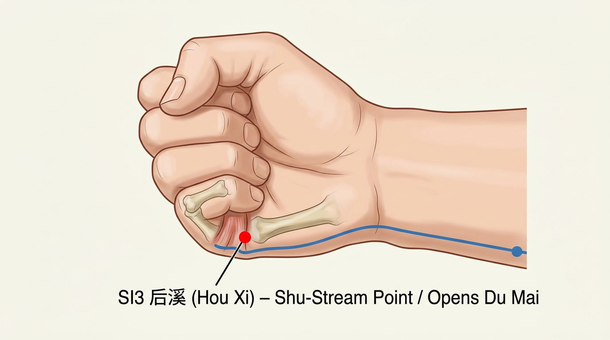

***

#### SI4 - וואן גו (腕骨) - Wàn Gǔ

**משמעות השם**: "עצם שורש כף היד" - הנקודה נמצאת ליד עצם שורש כף היד (ספציפית, עצם ה-hamate/hook of hamate וה-triquetrum)

**מיקום אנטומי**: בצד האולנרי של שורש כף היד, בשקע בין בסיס עצם המטקרפוס החמישית לבין עצם הטריקווטרום (triquetrum) / המייט (hamate)

**איך למצוא את הנקודה**:

1. החליקו לאורך הצד האולנרי של כף היד מ-SI3 לכיוון שורש כף היד
2. מצאו את בסיס עצם המטקרפוס החמישית (בליטה קטנה)
3. הנקודה נמצאת בשקע שמיד מעבר (פרוקסימלית) לבליטה זו, לפני קפל שורש כף היד
4. בין עצמות הקרפוס לבסיס המטקרפוס ה-5

**דיקור**: דקירה ניצבת 0.3–0.5 צון

**תחושת דה-צ'י**: כאב מקומי, תחושת נפיחות בשורש כף היד

**פעולות והתוויות**:

* מפנה רטיבות-חום - צהבת (黄疸 Huáng Dǎn), שלשול
* מפנה חום מהמעי הדק - כאבי בטן עם חום
* כאבי שורש כף היד (צד אולנרי)
* כאבי ראש, נוקשות צוואר
* חום, חוסר תיאבון
* טינטון

**קטגוריה מיוחדת**: **נקודת יואן-מקור** (原穴 Yuán Xué)

**שילובי נקודות נפוצים**:

* SI4 + GB34 (יאנג לינג צ'ואן) + DU9 (ג'י יאנג) - צהבת
* SI4 + HT5 (טונג לי) - חיבור יואן-לואו בין מעי דק ולב
* SI4 + TE4 (יאנג צ'י) - כאבי שורש כף היד

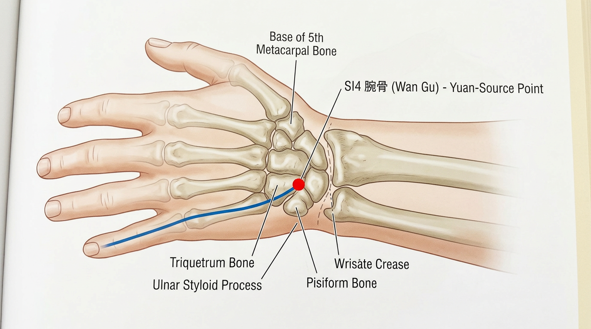

***

#### SI5 - יאנג גו (阳谷) - Yáng Gǔ

**משמעות השם**: "עמק היאנג" - הנקודה נמצאת בצד היאנג (אחורי-אולנרי) של שורש כף היד, בשקע כמו עמק

**מיקום אנטומי**: בצד האולנרי של שורש כף היד, בשקע בין התוצאה השטילואידית של האולנה (ulnar styloid process) לבין עצם הטריקווטרום, בצד הדורסלי

**איך למצוא את הנקודה**:

1. מצאו את התוצאה השטילואידית של האולנה - הבליטה הגרמית בצד האולנרי של שורש כף היד
2. הנקודה נמצאת בשקע בין הבליטה הזו לבין עצמות הקרפוס, בצד הדורסלי (גב היד)
3. כשמטים את היד לצד הרדיאלי (אולנר דויאיישן), השקע נפתח ומורגש ביתר בהירות

**דיקור**: דקירה ניצבת 0.3–0.5 צון

**תחושת דה-צ'י**: כאב מקומי חד, תחושת עקצוץ

**פעולות והתוויות**:

* מפנה חום, מפחיתה נפיחות - נפיחות בלחי, כאב חניכיים, כאב גרון
* מרגיעה את הרוח - מאניה, אפילפסיה
* כאבי שורש כף היד (צד אולנרי)
* כאבי ראש בצד, טינטון
* חום ללא הזעה

**קטגוריה מיוחדת**: נקודת ג'ינג-נהר (经穴 Jīng) - אלמנט אש

**שילובי נקודות נפוצים**:

* SI5 + SI3 - כאבי שורש כף היד עם נוקשות צוואר
* SI5 + TE5 (וואי גואן) - כאבי שורש כף היד

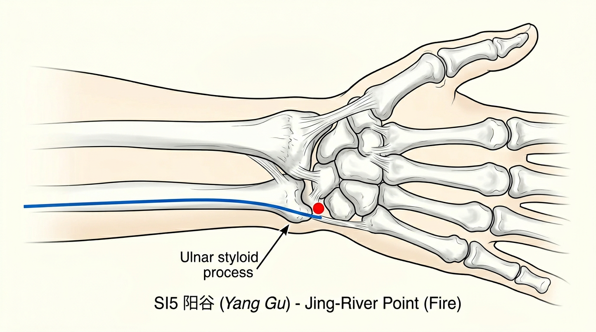

***

#### SI6 - יאנג לאו (养老) - Yǎng Lǎo

**משמעות השם**: "הזנת הזקן" - "יאנג" = להזין/לטפח; "לאו" = זקן/מבוגר. הנקודה מטפלת בבעיות הקשורות להזדקנות - ראייה מטושטשת, כאבי גב, נוקשות

**מיקום אנטומי**: בצד הגבי (דורסלי) של האמה, 1 צון מעל SI5, בשקע הרדיאלי של התוצאה השטילואידית של האולנה

**איך למצוא את הנקודה**:

1. הניחו את כף היד של המטופל שטוחה על השולחן, כף כלפי מטה
2. מצאו את התוצאה השטילואידית של האולנה (הבליטה הגרמית בשורש כף היד, צד אולנרי)
3. הפכו את כף היד כך שהיא פונה לחזה (סופינציה)
4. הנקודה נמצאת בשקע שנוצר בצד הרדיאלי של התוצאה השטילואידית, כ-1 צון פרוקסימלית ל-SI5
5. ניתן להחליק אצבע מקצה הבליטה לכיוון הרדיאלי - האצבע "נופלת" לתוך שקע

**דיקור**: דקירה ניצבת או אלכסונית 0.3–0.5 צון לכיוון דיסטלי

**תחושת דה-צ'י**: כאב מקומי, תחושת נפיחות

**פעולות והתוויות**:

* **מועילה לעיניים** - ראייה מטושטשת, כאבי עיניים, ירידה בראייה אצל מבוגרים
* כאבי כתף, כאבי זרוע, נוקשות צוואר
* כאבי גב תחתון חריפים (טורטיקוליס)
* כאבי שורש כף היד

**קטגוריה מיוחדת**: אין

**שילובי נקודות נפוצים**:

* SI6 + BL1 (ג'ינג מינג) - ירידה בראייה, כאבי עיניים
* SI6 + SI3 (הואו שי) - כאבי צוואר חריפים עם הגבלת תנועה
* SI6 + DU26 (שואי גואו) - כאבי גב תחתון חריפים

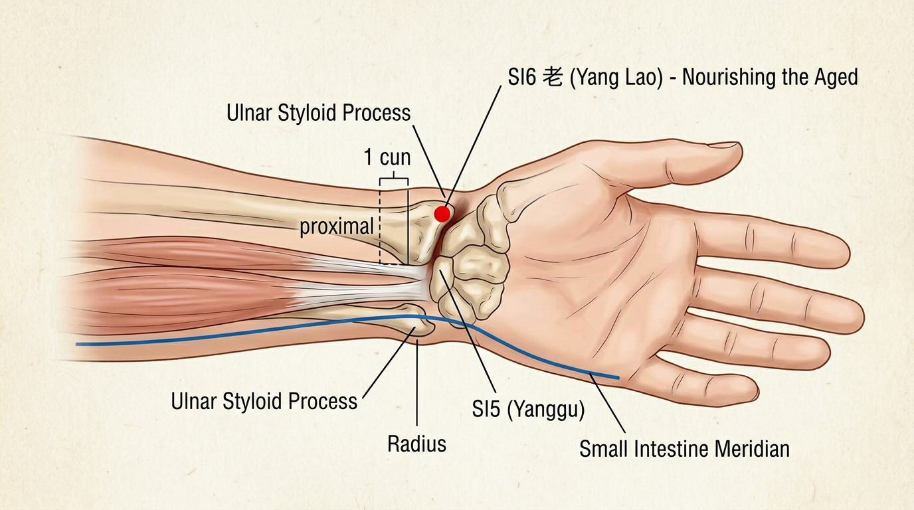

***

#### SI7 - ג'י ג'נג (支正) - Zhī Zhèng

**משמעות השם**: "ענף אל הנכון" - "ג'י" = ענף; "ג'נג" = ישר/נכון. כנקודת לואו, היא ה"ענף" שמתפצל מערוץ המעי הדק ומתחבר ל"נכון" - ערוץ הלב (הזוג הפנימי)

**מיקום אנטומי**: בצד האולנרי של האמה, 5 צון מעל שורש כף היד, על הקו המחבר בין SI5 ל-SI8

**איך למצוא את הנקודה**:

1. מצאו את SI5 (יאנג גו) בשורש כף היד
2. מצאו את SI8 (שיאו האי) בקפל המרפק
3. מדדו 5 צון מעל SI5 (או 7 צון מתחת ל-SI8) לאורך הצד האולנרי-האחורי של האמה
4. הנקודה נמצאת בין עצם האולנה לשריר FCU, בצד הדורסלי

**דיקור**: דקירה ניצבת או אלכסונית 0.5–0.8 צון

**תחושת דה-צ'י**: כאב מקומי עם תחושת נפיחות, עשויה להקרין למרפק או לשורש כף היד

**פעולות והתוויות**:

* מרגיעה את הרוח - מאניה, חרדה, עצבות
* מפנה חום - חום, כאבי ראש
* משחררת את הערוץ - כאבי צוואר, כאבי זרוע, כאבי מרפק
* נוקשות אצבעות, חולשת זרוע
* יבלות (贅疣 Zhuì Yóu) - שימוש מסורתי

**קטגוריה מיוחדת**: **נקודת לואו-מחברת** (络穴 Luò Xué) - מתחברת לערוץ הלב (HT)

**שילובי נקודות נפוצים**:

* SI7 + HT5 (טונג לי) - חיבור לואו-לואו בין מעי דק ולב
* SI7 + HT7 (שן מן) - מאניה, חרדה
* SI7 + SI3 - כאבי צוואר וזרוע

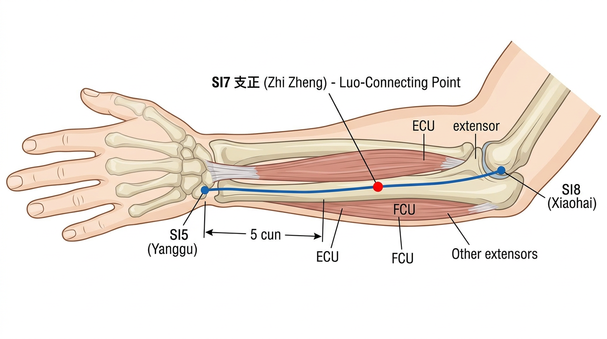

***

#### SI8 - שיאו האי (小海) - Xiǎo Hǎi

**משמעות השם**: "ים קטן" - "שיאו" = קטן; "האי" = ים. נקודת הה (ים) של הערוץ, כמו ים שבו מתקבצים כל הזרמים

**מיקום אנטומי**: בשקע בין האולקרנון (olecranon) של האולנה לבין האפיקונדילוס המדיאלי של ההומרוס, כשהמרפק כפוף

**איך למצוא את הנקודה**:

1. כופפו את מרפק המטופל ב-90 מעלות
2. מצאו את האולקרנון (קצה המרפק - הבליטה הגרמית האחורית)
3. מצאו את האפיקונדילוס המדיאלי של ההומרוס (הבליטה הגרמית בצד הפנימי)
4. הנקודה נמצאת בשקע (חריץ) בין שני מבנים גרמיים אלה
5. זהו "תעלת העצב האולנרי" - המקום שבו נגיעה גורמת לתחושת "חשמל" לזרת

**דיקור**: דקירה ניצבת 0.3–0.5 צון. **זהירות**: עצב אולנרי עובר בסמוך!

**תחושת דה-צ'י**: תחושת חשמלית שמקרינה לזרת ולאמה (עקב סמיכות לעצב האולנרי)

**פעולות והתוויות**:

* מפנה רטיבות-חום מהמעי הדק
* מרגיעה את הרוח - אפילפסיה, מאניה
* משחררת את הערוץ - כאבי מרפק ("עצם מצחיקה"), כאבי זרוע
* נפיחות בלחי, כאבי חניכיים, כאבי שיניים
* כאבי כתף, טורטיקוליס (צוואר עקום)

**קטגוריה מיוחדת**: נקודת הה-ים (合穴 Hé) - אלמנט אדמה

**שילובי נקודות נפוצים**:

* SI8 + HT3 (שאו האי) - כאבי מרפק מדיאליים
* SI8 + SI3 - כאבי מרפק עם נוקשות צוואר
* SI8 + DU26 (שואי גואו) - אפילפסיה

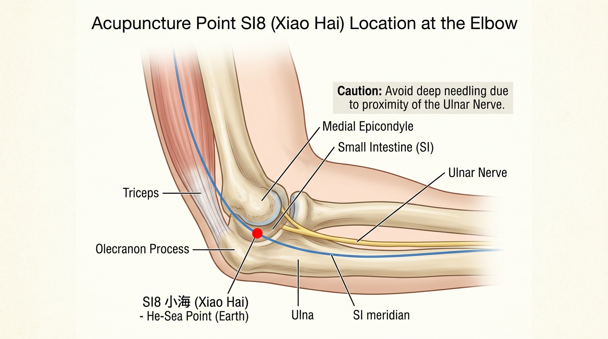

***

#### SI9 - ג'יאן ג'ן (肩贞) - Jiān Zhēn

**משמעות השם**: "כתף אמיתית/ישרה" - "ג'יאן" = כתף; "ג'ן" = אמיתי/ישר. נקודה עיקרית לטיפול בכאבי כתף

**מיקום אנטומי**: בצד האחורי-התחתון של הכתף, 1 צון מעל הקפל האחורי של השחי, כשהזרוע צמודה לגוף

**איך למצוא את הנקודה**:

1. בקשו מהמטופל לשבת עם הזרוע צמודה לגוף
2. מצאו את הקפל האחורי של השחי (נוצר על ידי שריר הטרס מג'ור / latissimus dorsi)
3. מדדו 1 צון ישירות כלפי מעלה מקצה הקפל
4. הנקודה נמצאת ישירות מתחת לאקרומיון, בצד האחורי-התחתון של מפרק הכתף

**דיקור**: דקירה ניצבת 1.0–1.5 צון, או אלכסונית לכיוון מפרק הכתף

**תחושת דה-צ'י**: כאב עמוק עם תחושת נפיחות שמקרינה לכתף ולזרוע

**פעולות והתוויות**:

* משחררת את הערוץ ומשככת כאבים - כאבי כתף, הגבלת תנועה בכתף
* כאבי זרוע (צד אחורי)
* טינטון, חירשות
* נפיחות בצד הצוואר

**קטגוריה מיוחדת**: אין

**שילובי נקודות נפוצים**:

* SI9 + SI10 + SI11 - "שלישיית הכתף" של ערוץ המעי הדק
* SI9 + LI15 (ג'יאן יו) - כאבי כתף כלליים
* SI9 + TE14 (ג'יאן ליאו) - הגבלת תנועה בכתף

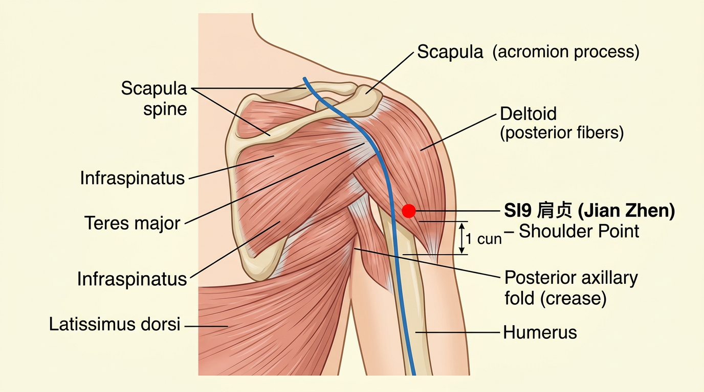

***

#### SI10 - נאו שו (臑俞) - Nào Shū

**משמעות השם**: "נקודת שו של הזרוע העליונה" - "נאו" = זרוע עליונה; "שו" = נקודת העברה/שינוע

**מיקום אנטומי**: בצד האחורי של הכתף, בשקע ישירות מעל SI9, מתחת לאקרומיון (acromion), על הגבול האחורי-התחתון של שריר הדלטואיד

**איך למצוא את הנקודה**:

1. מצאו את SI9 (1 צון מעל הקפל האחורי של השחי)
2. עלו ישירות כלפי מעלה עד שתגיעו לגובה שריר האינפרספינטוס
3. הנקודה נמצאת בשקע שנוצר כשהזרוע מורמת - מתחת לאקרומיון, בגבול התחתון של עצם השכם (scapular spine)
4. על הקו המחבר בין הקצה האחורי של קפל השחי לבין SI11

**דיקור**: דקירה ניצבת 0.5–1.0 צון, או אלכסונית כלפי מטה

**תחושת דה-צ'י**: כאב עמום מקומי עם נפיחות

**פעולות והתוויות**:

* כאבי כתף, הגבלת תנועה בכתף (במיוחד רוטציה חיצונית)
* כאבי זרוע, חולשת זרוע
* כאבי צוואר ועורף

**קטגוריה מיוחדת**: נקודת מפגש (交会穴) עם יאנג ווי מאי (阳维脉) ויאנג צ'יאו מאי (阳跷脉)

**שילובי נקודות נפוצים**:

* SI10 + SI9 + SI11 - כאבי כתף אחוריים
* SI10 + TE14 (ג'יאן ליאו) - כאבי כתף עם הגבלת תנועה
* SI10 + GB21 (ג'יאן ג'ינג) - כאבי כתף עליונים

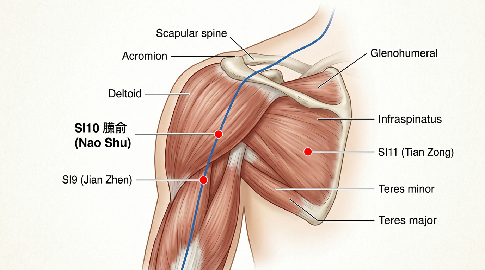

***

#### SI11 - טיאן צונג (天宗) - Tiān Zōng

**משמעות השם**: "מרכז שמיימי" - "טיאן" = שמיים; "צונג" = אב קדמון/מרכז. נקודה מרכזית על גב הכתף, כמו "מרכז שמיימי" שממנו שולטים על אזור הכתף

**מיקום אנטומי**: על עצם השכם (scapula), במרכז הפוסה האינפרספינטית (infraspinous fossa), בשליש העליון של המרחק בין שדרת עצם השכם (scapular spine) לפינה התחתונה של עצם השכם

**איך למצוא את הנקודה**:

1. מצאו את שדרת עצם השכם (הגב העליון) - הקו הגרמי שחוצה את עצם השכם
2. מצאו את הפינה התחתונה של עצם השכם (הזווית הקאודלית)
3. חלקו את המרחק בין שדרת השכם לפינה התחתונה לשלושה חלקים שווים
4. הנקודה נמצאת בשליש העליון, במרכז הפוסה האינפרספינטית (בערך באמצע עצם השכם, מתחת לשדרה)
5. לחיצה על הנקודה גורמת בדרך כלל לכאב מורגש שמקרין לכתף

**דיקור**: דקירה ניצבת או אלכסונית 0.5–1.0 צון

**תחושת דה-צ'י**: כאב עמוק עם נפיחות שמקרינה לכתף, לזרוע או לגב העליון

**פעולות והתוויות**:

* **נקודת מפתח לכאבי כתף** - כאבי כתף מכל סוג, "כתף קפואה"
* כאבי גב עליון, כאבי עצם השכם
* כאבי זרוע (צד לטרלי ואחורי)
* מחסור בחלב אם, כאבי שד, דלקת שד
* קוצר נשימה, אסטמה

**קטגוריה מיוחדת**: אין

**שילובי נקודות נפוצים**:

* SI11 + SI9 + SI10 - כאבי כתף אחוריים מקיפים
* SI11 + GB21 (ג'יאן ג'ינג) + LI15 (ג'יאן יו) - "כתף קפואה"
* SI11 + BL43 (גאו הואנג שו) - כאבי גב עליון כרוניים
* SI11 + REN17 (שאן ג'ונג) - מחסור בחלב אם

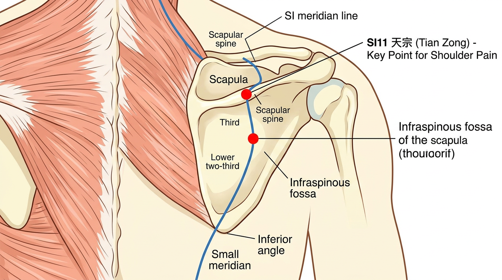

***

#### SI12 - בינג פנג (秉风) - Bǐng Fēng

**משמעות השם**: "אוחז ברוח" - "בינג" = לאחוז; "פנג" = רוח. הנקודה "אוחזת" ומגרשת רוח מאזור הכתף

**מיקום אנטומי**: באזור הכתף, במרכז הפוסה הסופרספינטית (supraspinous fossa), ישירות מעל SI11, בשקע שנוצר כשמרימים את הזרוע

**איך למצוא את הנקודה**:

1. מצאו את שדרת עצם השכם
2. הנקודה נמצאת ישירות מעל אמצע שדרת השכם, בפוסה הסופרספינטית
3. בקשו מהמטופל להניח את כף ידו על הכתף הנגדית - הנקודה בשקע שנוצר
4. ישירות מעל SI11

**דיקור**: דקירה ניצבת או אלכסונית 0.5–0.8 צון

**תחושת דה-צ'י**: כאב עמום מקומי עם תחושת נפיחות

**פעולות והתוויות**:

* מגרשת רוח ומשחררת את הערוץ - כאבי כתף, נוקשות כתף
* כאבי שכם, כאבי גב עליון
* חוסר תחושה בזרוע

**קטגוריה מיוחדת**: אין

**שילובי נקודות נפוצים**:

* SI12 + SI11 - כאבי כתף אחוריים
* SI12 + GB21 (ג'יאן ג'ינג) - כאבי כתף עליונים ונוקשות

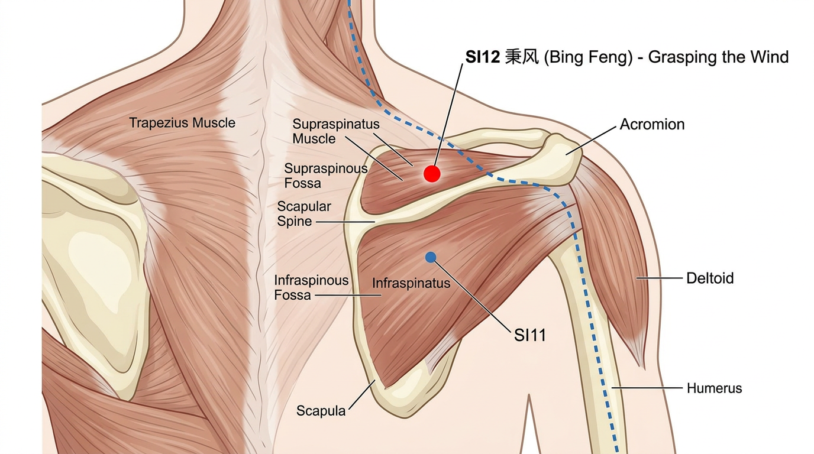

***

#### SI13 - צ'ו יואן (曲垣) - Qū Yuán

**משמעות השם**: "חומה עקומה" - "צ'ו" = עקום; "יואן" = חומה/גדר. מתאר את הצורה העקומה של שדרת עצם השכם שלידה נמצאת הנקודה

**מיקום אנטומי**: על הגב העליון, בקצה המדיאלי של הפוסה הסופרספינטית, באמצע הדרך בין SI10 לקצה הצדי של תהליך שדרתי T2

**איך למצוא את הנקודה**:

1. מצאו את הקצה המדיאלי של שדרת עצם השכם (הפינה שליד עמוד השדרה)
2. הנקודה נמצאת בשקע שמעל הקצה המדיאלי של שדרת השכם
3. בפוסה הסופרספינטית, קרוב לזווית העליונה-המדיאלית של עצם השכם

**דיקור**: דקירה ניצבת או אלכסונית 0.5–0.8 צון

**תחושת דה-צ'י**: כאב מקומי עם נפיחות

**פעולות והתוויות**:

* כאבי כתף ושכם (במיוחד אזור מדיאלי-עליון)
* כאבי גב עליון
* נוקשות צוואר

**קטגוריה מיוחדת**: אין

**שילובי נקודות נפוצים**:

* SI13 + SI14 + SI15 - כאבי גב עליון ושכם
* SI13 + BL41 (פו פן) - כאבי שכם מדיאליים

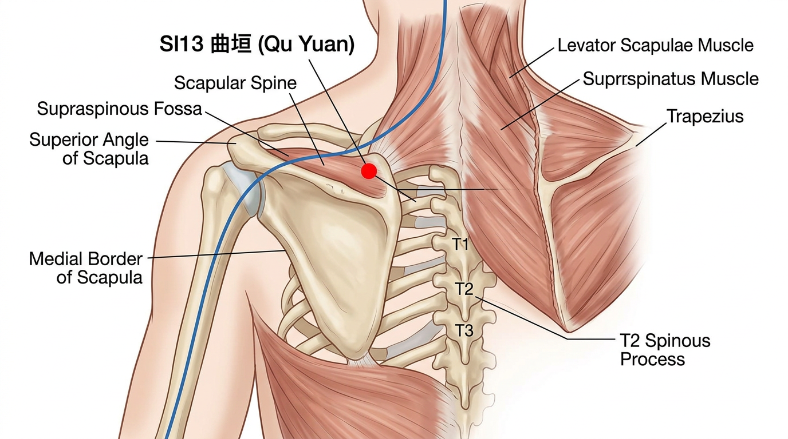

***

#### SI14 - ג'יאן וואי שו (肩外俞) - Jiān Wài Shū

**משמעות השם**: "נקודת שו חיצונית של הכתף" - "ג'יאן" = כתף; "וואי" = חיצוני; "שו" = נקודת העברה. נקודת ההעברה החיצונית של הכתף

**מיקום אנטומי**: על הגב העליון, 3 צון לרוחב מקו האמצע (מתחת לתהליך השדרתי של T1), על הגבול המדיאלי של עצם השכם

**איך למצוא את הנקודה**:

1. מצאו את תהליך שדרתי T1 (החוליה הבולטת ביותר בבסיס הצוואר; T1 נמצאת מתחת ל-C7/DU14)
2. מדדו 3 צון לרוחב (לטרלית)
3. הנקודה נמצאת על הגבול המדיאלי של עצם השכם, בגובה T1

**דיקור**: דקירה אלכסונית 0.5–0.8 צון לכיוון עמוד השדרה, או שטוחה (oblique). **אין לדקור עמוק** - סכנת פנאומוטורקס.

**תחושת דה-צ'י**: כאב מקומי עם תחושת נפיחות

**פעולות והתוויות**:

* כאבי כתף, כאבי גב עליון
* נוקשות צוואר ושכם
* כאבי זרוע

**קטגוריה מיוחדת**: אין

**שילובי נקודות נפוצים**:

* SI14 + SI15 - כאבי שכם וצוואר
* SI14 + GB21 (ג'יאן ג'ינג) - נוקשות כתפיים

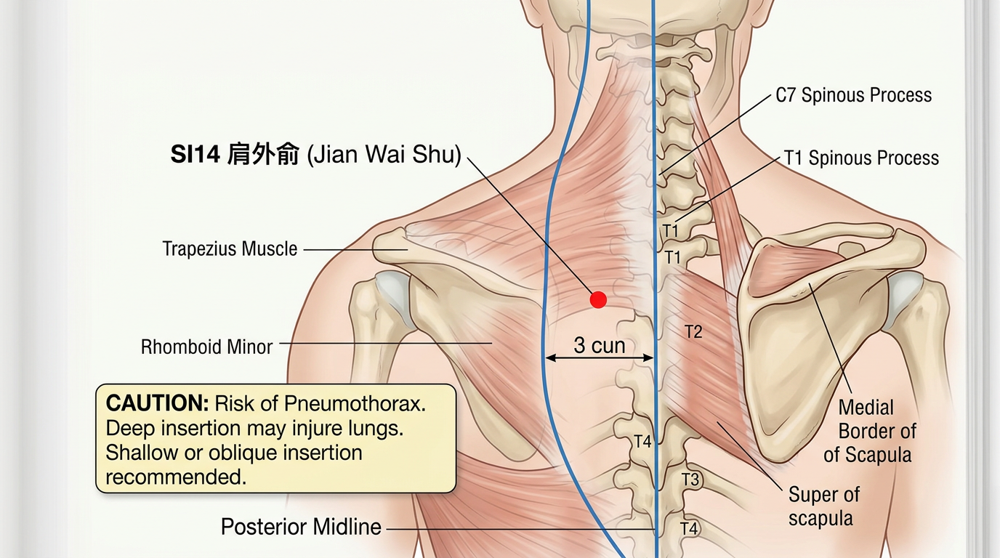

***

#### SI15 - ג'יאן ג'ונג שו (肩中俞) - Jiān Zhōng Shū

**משמעות השם**: "נקודת שו אמצעית של הכתף" - "ג'ונג" = אמצע. נקודת ההעברה באמצע אזור הכתף

**מיקום אנטומי**: על הגב העליון, 2 צון לרוחב מקו האמצע, בגובה תהליך שדרתי C7 (דא ג'ואי, DU14)

**איך למצוא את הנקודה**:

1. מצאו את DU14 (דא ג'ואי) - בשקע מתחת לתהליך השדרתי C7 (החוליה הבולטת ביותר בבסיס הצוואר)
2. מדדו 2 צון לרוחב (לטרלית)
3. הנקודה נמצאת על שריר הטרפזיוס

**דיקור**: דקירה אלכסונית 0.5–0.8 צון. **אין לדקור עמוק** - סכנת פנאומוטורקס.

**תחושת דה-צ'י**: כאב מקומי עם נפיחות

**פעולות והתוויות**:

* שיעול, אסטמה, קוצר נשימה, המופטיזיס (שיעול דם)
* כאבי כתף ושכם
* כאבי צוואר, טורטיקוליס
* ירידה בראייה

**קטגוריה מיוחדת**: אין

**שילובי נקודות נפוצים**:

* SI15 + BL13 (פיי שו) - שיעול, אסטמה
* SI15 + DU14 (דא ג'ואי) - כאבי צוואר, חום

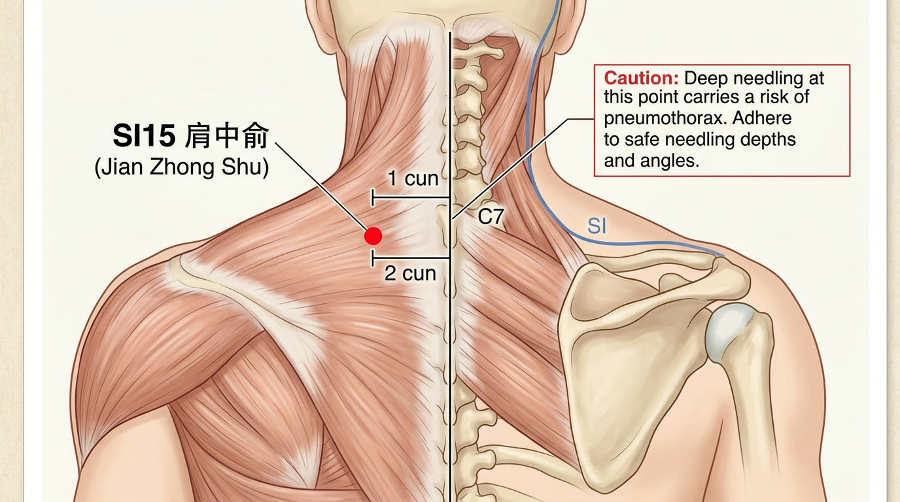

***

#### SI16 - טיאן צ'ואנג (天窗) - Tiān Chuāng

**משמעות השם**: "חלון שמיימי" - "טיאן" = שמיים (חלק עליון/ראש); "צ'ואנג" = חלון. הנקודה "פותחת חלון" לראש - משפרת שמיעה, ראייה וזרימה לראש

**מיקום אנטומי**: בצד הלטרלי של הצוואר, על הגבול האחורי של שריר הסטרנוקליידומסטואיד (SCM), בגובה גרון אדם, 3.5 צון לרוחב מגרון אדם

**איך למצוא את הנקודה**:

1. מצאו את גרון אדם (prominentia laryngea)
2. מצאו את הגבול האחורי של שריר SCM באותו גובה
3. הנקודה נמצאת על הגבול האחורי של שריר SCM, בגובה גרון אדם
4. או: 0.5 צון מאחורי SI17, בגובה גרון אדם

**דיקור**: דקירה ניצבת 0.5–0.8 צון. **זהירות**: אזור עשיר בכלי דם ועצבים!

**תחושת דה-צ'י**: כאב מקומי, תחושת נפיחות

**פעולות והתוויות**:

* מועילה לאוזניים - טינטון, חירשות
* כאבי גרון, צרידות, אובדן קול
* נפיחות בלחי ובצוואר
* נוקשות צוואר, טורטיקוליס

**קטגוריה מיוחדת**: נקודת חלון השמיים (天窗穴 Tiān Chuāng Xué)

**שילובי נקודות נפוצים**:

* SI16 + SI17 - טינטון, חירשות
* SI16 + SI19 (טינג גונג) - בעיות שמיעה
* SI16 + LI18 (פו טו) - כאבי גרון, נפיחות צוואר

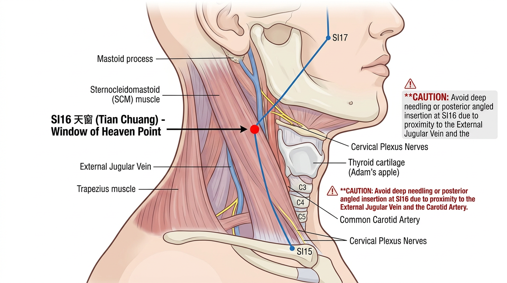

***

#### SI17 - טיאן רונג (天容) - Tiān Róng

**משמעות השם**: "מראה שמיימי" - "טיאן" = שמיים; "רונג" = מראה/פנים. הנקודה משפיעה על מראה הפנים והצוואר

**מיקום אנטומי**: בצד הלטרלי של הצוואר, מאחורי זווית הלסת (angle of mandible), בשקע הקדמי של שריר SCM

**איך למצוא את הנקודה**:

1. מצאו את זווית הלסת (הפינה האחורית של עצם הלסת)
2. הנקודה נמצאת בשקע שמיד מאחורי ומתחת לזווית הלסת
3. על הגבול הקדמי של שריר SCM
4. ניתן לחוש את דופק עורק הצוואר (carotid) בסמוך - **הימנעו מלחיצה על העורק!**

**דיקור**: דקירה ניצבת 0.5–1.0 צון. **זהירות**: עורק ווריד הצוואר בסמוך!

**תחושת דה-צ'י**: כאב מקומי, תחושת נפיחות

**פעולות והתוויות**:

* כאבי גרון, דלקת שקדים, צרידות
* נפיחות בלחי ובצוואר, בלוטות לימפה נפוחות
* טינטון, חירשות
* קוצר נשימה, אסטמה

**קטגוריה מיוחדת**: אין

**שילובי נקודות נפוצים**:

* SI17 + LI4 (חה גו) - כאבי גרון, נפיחות בצוואר
* SI17 + LU7 (ליה צ'ואה) - צרידות, אובדן קול

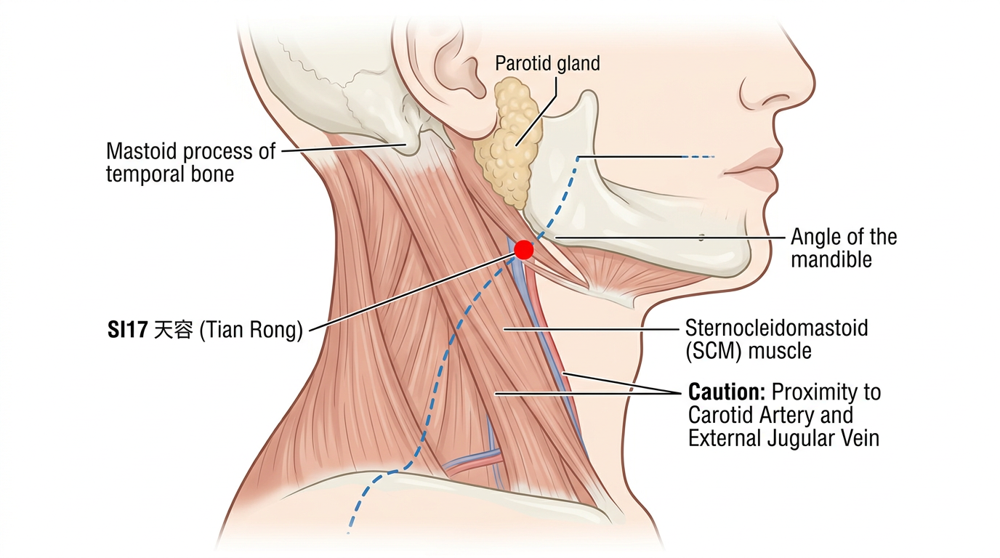

***

#### SI18 - צ'ואן ליאו (颧髎) - Quán Liáo

**משמעות השם**: "סדק עצם הלחי" - "צ'ואן" = עצם הלחי (zygoma); "ליאו" = סדק/שקע בעצם. הנקודה נמצאת בשקע מתחת לעצם הלחי

**מיקום אנטומי**: על הפנים, ישירות מתחת לזווית החיצונית של העין, בשקע התחתון של עצם הלחי (zygomatic bone), בגבול התחתון של הארכוס הזיגומטי

**איך למצוא את הנקודה**:

1. מצאו את הזווית החיצונית של העין
2. ירדו ישירות כלפי מטה עד שתגיעו לגבול התחתון של עצם הלחי (zygomatic arch)
3. הנקודה נמצאת בשקע שמיד מתחת לארכוס הזיגומטי
4. ניתן לחוש שקע ברור בלחיצה

**דיקור**: דקירה ניצבת 0.3–0.5 צון, או אלכסונית כלפי מטה

**תחושת דה-צ'י**: כאב מקומי עם תחושת כבדות בלחי

**פעולות והתוויות**:

* מגרשת רוח ומפחיתה נפיחות - שיתוק פנים (Bell's palsy), עיווית שרירי פנים
* כאבי שיניים (שיניים עליונות), כאבי לחי
* נפיחות בלחי, דלקת סינוסים
* נוירלגיה של עצב טריגמינלי (V2)
* צהוב בעיניים

**קטגוריה מיוחדת**: נקודת מפגש (交会穴) עם ערוץ שלוש המבערות (TE) וערוץ המעי הדק

**שילובי נקודות נפוצים**:

* SI18 + ST6 (ג'יא צ'ה) + ST7 (שיא גואן) - שיתוק פנים, כאבי לחי
* SI18 + LI4 (חה גו) - כאבי שיניים עליונות
* SI18 + GB14 (יאנג באי) - נוירלגיה טריגמינלית

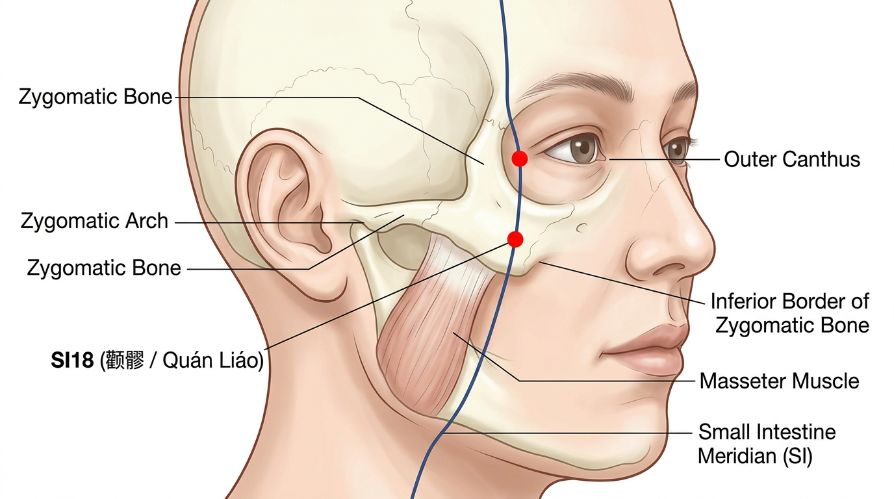

***

#### SI19 - טינג גונג (听宫) - Tīng Gōng

**משמעות השם**: "ארמון השמיעה" - "טינג" = לשמוע; "גונג" = ארמון. הנקודה היא ה"ארמון" שממנו נשלטת השמיעה

**מיקום אנטומי**: על הפנים, לפני הטרגוס (tragus) של האוזן, בשקע שנוצר כשפותחים את הפה, בגובה אמצע הטרגוס

**איך למצוא את הנקודה**:

1. מצאו את הטרגוס - הבליטה הסחוסית הקטנה שלפני פתח האוזן
2. בקשו מהמטופל לפתוח את הפה מעט - ייווצר שקע ברור לפני הטרגוס
3. הנקודה נמצאת בשקע זה, בגובה אמצע הטרגוס
4. בין הטרגוס לבין הקונדילוס של הלסת (condyle of mandible)
5. ניתן לחוש את תנועת מפרק הלסת כשהמטופל פותח וסוגר את הפה

**דיקור**: דקירה ניצבת 0.5–1.0 צון, כשהפה פתוח מעט

**תחושת דה-צ'י**: כאב מקומי עם תחושת מלאות באוזן, עשויה להקרין לתוך האוזן

**פעולות והתוויות**:

* **נקודת מפתח לבעיות אוזניים** - טינטון, חירשות, דלקת אוזן תיכונה, אוטיטיס
* כאבי אוזניים, הפרשה מהאוזן
* כאבי שיניים, כאבי מפרק הלסת (TMJ)
* אובדן קול, שיתוק פנים

**קטגוריה מיוחדת**: נקודת מפגש (交会穴) של ערוצי המעי הדק (SI), כיס המרה (GB), ושלוש המבערות (TE)

**שילובי נקודות נפוצים**:

* SI19 + TE17 (יי פנג) + TE21 (ארמן) - **שלישיית האוזן** - טינטון, חירשות, כל בעיות אוזניים
* SI19 + GB2 (טינג הוי) - טינטון, חירשות
* SI19 + ST7 (שיא גואן) - כאבי TMJ
* SI19 + KI3 (טאי שי) - טינטון מחסר כליות

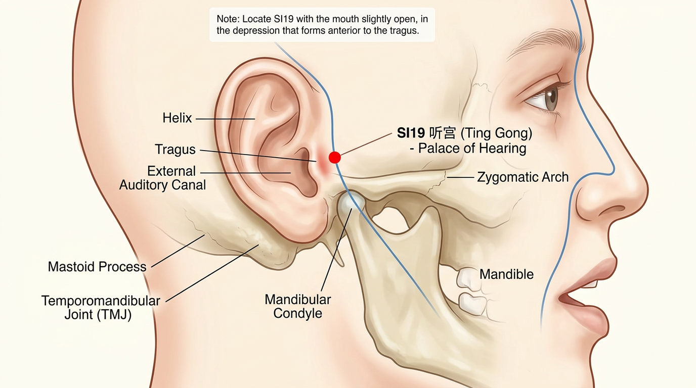

***

### 4. סיכום נקודות מפתח

#### נקודות חמש האלמנטים (五输穴 Wǔ Shū Xué)

| נקודה          | סוג            | אלמנט |
| -------------- | -------------- | ----- |
| SI1 (שאו צה)   | ג'ינג-באר (井)  | מתכת  |
| SI2 (צ'יאן גו) | יינג-מעיין (荥) | מים   |
| SI3 (הואו שי)  | שו-זרם (输)     | עץ    |
| SI5 (יאנג גו)  | ג'ינג-נהר (经)  | אש    |
| SI8 (שיאו האי) | הה-ים (合)      | אדמה  |

#### נקודות מיוחדות נוספות

| נקודה              | קטגוריה                        |
| ------------------ | ------------------------------ |
| SI3 (הואו שי)      | שו-זרם (输穴); פתיחת דו מאי (督脉) |
| SI4 (וואן גו)      | יואן - מקור (原穴)               |
| SI7 (ג'י ג'נג)     | לואו - מחברת (络穴)              |
| SI16 (טיאן צ'ואנג) | חלון השמיים (天窗穴)              |

#### נקודות שימוש נפוצות ביותר

1. **SI3** (הואו שי) - נוקשות צוואר, כאבי גב, אפילפסיה (עם BL62 לפתיחת דו מאי)
2. **SI19** (טינג גונג) - כל בעיות אוזניים: טינטון, חירשות
3. **SI11** (טיאן צונג) - כאבי כתף, מחסור בחלב
4. **SI1** (שאו צה) - הגברת חלב אם, החייאה
5. **SI6** (יאנג לאו) - בעיות ראייה, כאבי כתף

***

### 5. קריאה מומלצת

* Deadman, P. _A Manual of Acupuncture_ - פרק ערוץ המעי הדק
* Maciocia, G. _The Foundations of Chinese Medicine_ - פרקי המעי הדק
* הואנג די ניי ג'ינג, לינג שו, פרק 10

***

> **נקודה למחשבה**: ערוץ המעי הדק הוא ערוץ טאי-יאנג של היד, ולכן הוא עובר באזור האחורי של הגוף (גב הכתף, צוואר אחורי). זה הופך אותו לערוץ חשוב מאוד לטיפול בכאבי כתף אחוריים, נוקשות צוואר, וכאבי גב עליון. נקודת SI3 (הואו שי) היא אחת הנקודות הדיסטליות היעילות ביותר לטיפול בכאבי גב וצוואר - דרך הקשר שלה לדו מאי.

***

### ניווט

* **הקודם**: [ערוץ הלב (HT)](06-heart-channel.md) | **הבא**: [ערוץ שלפוחית השתן (BL)](08-bladder-channel.md)
* **זוג פנים-חוץ**: [ערוץ הלב (HT)](06-heart-channel.md) — ערוץ הין הזוגי (אלמנט אש)
* **חזרה למודול**: [מודול 2 — מרידיאנים](./)
