# ערוץ הכליות - צו שאו ין שן (足少阴肾经)

## Kidney Channel - Zu Shao Yin Shen Jing

---

## מטרות למידה

בסיום שיעור זה, הסטודנט יוכל:
1. לתאר את מסלול ערוץ הכליות החיצוני והפנימי
2. לאתר את 27 הנקודות של הערוץ (KI1-KI27)
3. להסביר את תפקודי איבר הכליות ברפואה הסינית
4. לזהות פתולוגיות נפוצות של הכליות ולבחור נקודות מתאימות
5. ליישם שילובי נקודות קלאסיים לטיפול בדפוסי חוסר איזון של הכליות

---

## 1. סקירת הערוץ

### 1.1 מידע כללי

| פרט | תיאור |
|---|---|
| **שם סיני** | 足少阴肾经 (Zú Shǎo Yīn Shèn Jīng) |
| **קיצור** | KI (Kidney) |
| **מספר נקודות** | 27 |
| **סוג** | ין (Yin) |
| **אלמנט** | מים (水 Shuǐ) |
| **שעות פעילות** | 17:00-19:00 |
| **כיוון זרימה** | מכף הרגל עולה אל החזה |
| **זוג פנים-חוץ** | שלפוחית השתן (BL - 足太阳膀胱经) |

### 1.2 מסלול הערוץ

**מסלול חיצוני:**
הערוץ מתחיל בכף הרגל, בצד התחתון של האצבע הקטנה (KI1). הוא עובר לכף הרגל הפנימית, עובר מתחת לעצם הנוויקולרית (KI2-KI3), עוטף את המלאולוס המדיאלי (KI4-KI6), עולה לאורך הצד המדיאלי של השוק (KI7-KI10), ממשיך לאורך הצד המדיאלי-אחורי של הירך, ונכנס לגוף באזור העצה.

**מסלול פנימי:**
הערוץ הפנימי נכנס לכליות ומתחבר לשלפוחית השתן. ענף עולה מהכליות דרך הכבד והסרעפת, נכנס לריאות ומסתיים בשורש הלשון. ענף נוסף יוצא מהריאות ומתחבר ללב ולקרום הלב (פריקרד), ומתפזר בחזה.

**ענף בטן-חזה:**
מהאזור הפנימי, הערוץ יוצא לשטח לאורך קו 0.5 צון מקו האמצע של הבטן (KI11-KI21) ואז 2 צון מקו האמצע של החזה (KI22-KI27).

### 1.3 זוג פנים-חוץ

ערוץ הכליות (צו שאו ין - 足少阴) הוא הערוץ הפנימי (ין) המזווג עם ערוץ שלפוחית השתן (צו טאי יאנג - 足太阳), שהוא הערוץ החיצוני (יאנג). שניהם שייכים לאלמנט המים. קשר זה חשוב בטיפול - לעיתים משתמשים בנקודות של ערוץ אחד כדי לטפל בבעיות בערוץ המזווג.

---

## 2. תפקודי איבר הכליות (腎 Shèn)

### 2.1 תפקודים עיקריים

1. **אחסון ג'ינג (精 Jīng)** - הכליות אוצרות את המהות החיונית, הן את הג'ינג המולד (先天之精) והן את הג'ינג הנרכש (后天之精). הג'ינג קובע את החוקה, ההתפתחות, הפריון וההזדקנות.

2. **שליטה על המים** - הכליות שולטות על חילוף המים בגוף, מפרידות בין "מים נקיים" ל"מים עכורים", ומווסתות את ההשתנה.

3. **קליטת הצ'י (纳气 Nà Qì)** - הכליות "תופסות" את הצ'י שנשלח מהריאות כלפי מטה, ומאפשרות נשימה עמוקה ויציבה.

4. **שליטה על העצמות ומח העצם** - הג'ינג של הכליות מייצר מח עצם, המזין את העצמות, עמוד השדרה והמוח.

5. **פתיחה באוזניים** - הכליות פתוחות לאוזניים; חולשת כליות עלולה לגרום לטינטון וירידה בשמיעה.

6. **ביטוי בשיער** - מצב השיער משקף את חוזק ג'ינג הכליות; שיער דליל, אפור מוקדם או נשירה מצביעים על חולשת כליות.

7. **שליטה בשני הפתחים התחתונים** - הכליות שולטות על השתן ועל הצואה.

### 2.2 רגש ומנטלי

- **רגש**: פחד (恐 Kǒng) וחרדה
- **רצון (志 Zhì)**: כוח רצון, נחישות
- **חולשת כליות** עלולה לגרום לפחד, חוסר ביטחון, חוסר מוטיבציה

### 2.3 פתולוגיות נפוצות

| דפוס | סימפטומים עיקריים |
|---|---|
| **חוסר ין כליות** | כאבי גב תחתון, חולשת ברכיים, טינטון, זיעות לילה, חום בכפות ידיים ורגליים, לשון אדומה |
| **חוסר יאנג כליות** | כאבי גב תחתון, ברכיים קרות, שתן רב וצלול, אימפוטנציה, עייפות, לשון חיוורת ונפוחה |
| **חוסר ג'ינג כליות** | עיכוב התפתחות, אי-פריון, הזדקנות מוקדמת, שיער אפור מוקדם, חולשת עצמות |
| **כליות לא תופסות צ'י** | קוצר נשימה במאמץ, אסתמה כרונית, שאיפה קשה |
| **מים עולים ומציפים את הלב** | בצקות, פלפיטציות, חרדה |

---

## 3. נקודות הערוץ (KI1-KI27)

---

### KI1 — יונג צ'יואן (涌泉) — Yǒng Quán — "מעיין נובע"

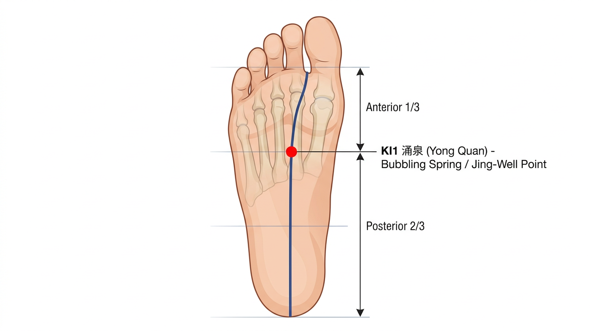

**קטגוריה מיוחדת:** נקודת ג'ינג-באר (井穴), נקודת עץ (木), נקודת טיפול חירום

**מיקום אנטומי:**
על כף הרגל, בשקע שנוצר כאשר כופפים את אצבעות הרגל, בשליש הקדמי של כף הרגל, בין עצמות המטטרסל ה-2 וה-3.

**איך למצוא את הנקודה:**
1. בקשו מהמטופל לכופף את אצבעות הרגל כלפי מטה
2. זהו את השקע הבולט ביותר שנוצר בכף הרגל
3. הנקודה נמצאת בשליש הקדמי של הקו המחבר את בסיס אצבע 2 לקצה העקב
4. חלקו את כף הרגל ל-3 חלקים שווים מהקצה הקדמי לעקב - הנקודה בגבול שליש קדמי ושני שלישים אחוריים

**עומק דקירה:** 0.5-1 צון

**זווית דקירה:** ניצבת (90°)

**תחושת דה-צ'י:** כאב מקומי חד, תחושת חשמל היורדת לאצבעות הרגל או עולה לאורך כף הרגל

**פעולות והתוויות:**
- מחייה את ההכרה, פותחת את חושי הראש
- מורידה עודף יאנג מהראש
- מרגיעה את הרוח (שן)
- התוויות: אובדן הכרה, שבץ, חום גבוה, כאבי ראש בקודקוד, יובש בגרון, טינטון, אפילפסיה, היסטריה, נדודי שינה בילדים

**שילובי נקודות נפוצים:**
- KI1 + DU26 — לאובדן הכרה ושבץ
- KI1 + LR3 — להורדת יאנג הכבד (כאבי ראש, סחרחורת)
- KI1 + HT7 — להרגעת הרוח ונדודי שינה

---

### KI2 — ראן גו (然谷) — Rán Gǔ — "עמק הלהבה"

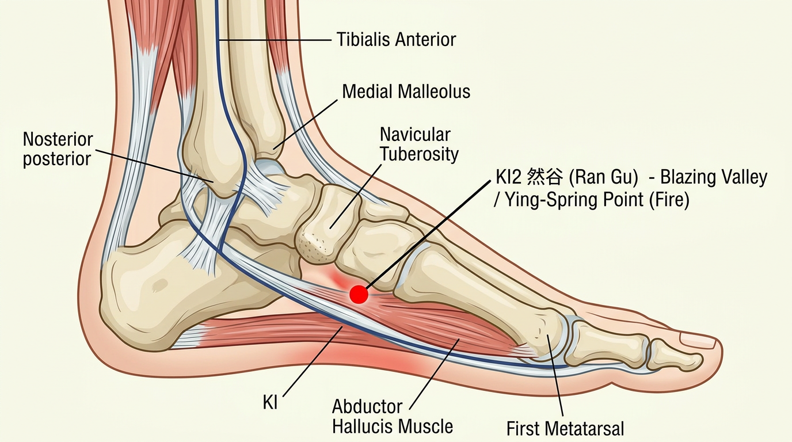

**קטגוריה מיוחדת:** נקודת יינג-מעיין (荥穴), נקודת אש (火)

**מיקום אנטומי:**
על הצד המדיאלי של כף הרגל, בשקע שמתחת ולפני (אנטריורי ואינפריורי) לבליטה של עצם הנוויקולרית (הסירה).

**איך למצוא את הנקודה:**
1. מצאו את הבליטה הבולטת של עצם הנוויקולרית בצד הפנימי של כף הרגל
2. החליקו את האצבע קדימה ומטה מהבליטה
3. הנקודה נמצאת בשקע הראשון שתמצאו, בגבול בין עור כף הרגל ועור גב הרגל
4. כאשר מוחלים לחץ, מורגש שקע ברור

**עומק דקירה:** 0.5-0.8 צון

**זווית דקירה:** ניצבת (90°)

**תחושת דה-צ'י:** כאב מקומי, תחושת כבדות או נימול המתפשטת לכף הרגל

**פעולות והתוויות:**
- מנקה חום מחוסר (虚热)
- מחזקת את ין הכליות
- מווסתת את מחזור הערוץ
- התוויות: זיעות לילה, חום בכפות ידיים ורגליים, גרון יבש, אי-סדירות במחזור, גירוד באזור המין, שתן מטפטף, שלשולים

**שילובי נקודות נפוצים:**
- KI2 + KI6 — להזנת ין הכליות וניקוי חום מחוסר
- KI2 + HT8 — לניקוי חום מהלב ומהכליות

---

### KI3 — טאי שי (太溪) — Tài Xī — "נחל גדול"

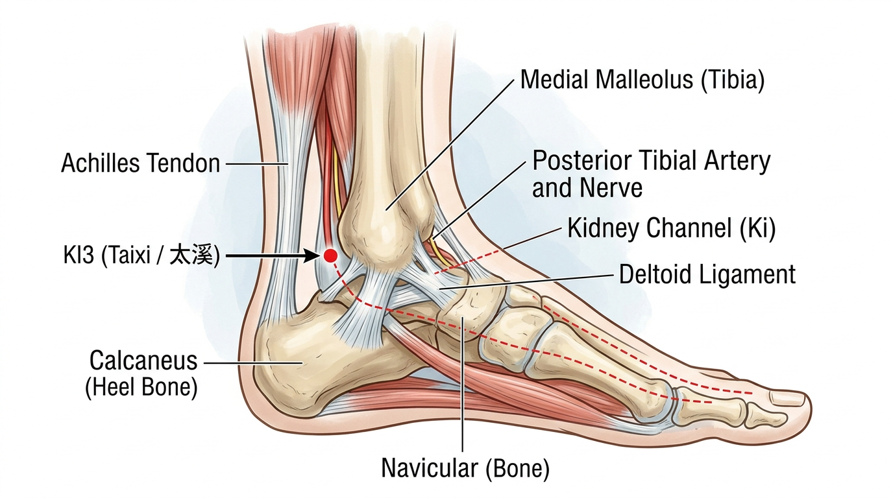

**קטגוריה מיוחדת:** נקודת שו-זרם (输穴), נקודת יואן-מקור (原穴), נקודת אדמה (土)

**מיקום אנטומי:**
בשקע שבין קצה המלאולוס המדיאלי (הקרסול הפנימי) לגיד אכילס (Tendo calcaneus).

**איך למצוא את הנקודה:**
1. מצאו את הנקודה הבולטת ביותר של הקרסול הפנימי (מלאולוס מדיאלי)
2. מצאו את גיד אכילס מאחור
3. הנקודה נמצאת בדיוק באמצע בין השניים, בגובה קצה הקרסול הפנימי
4. הניחו את האצבע בשקע - תרגישו את פעימת עורק הטיביאלי האחורי

**עומק דקירה:** 0.5-1 צון

**זווית דקירה:** ניצבת (90°)

**תחושת דה-צ'י:** כאב מקומי, תחושת נימול או חום המתפשטים לכף הרגל או עולים בשוק

**פעולות והתוויות:**
- מחזקת את הכליות (ין ויאנג כאחד)
- מזינה את ין הכליות
- מורידה חום מחוסר
- מחזקת את הגב התחתון והברכיים
- התוויות: כאבי גב תחתון, טינטון, ירידה בשמיעה, כאב גרון, כאב שיניים, אסתמה, אי-סדירות במחזור, אימפוטנציה, נדודי שינה, ירידה בזיכרון

**שילובי נקודות נפוצים:**
- KI3 + BL23 — לחיזוק הכליות וטיפול בכאבי גב תחתון
- KI3 + LU7 + KI6 — להזנת ין הכליות והריאות (גרון יבש, שיעול יבש)
- KI3 + SP6 — להזנת ין ודם
- KI3 + KI7 — לחיזוק יאנג הכליות

---

### KI4 — דא ג'ונג (大钟) — Dà Zhōng — "פעמון גדול"

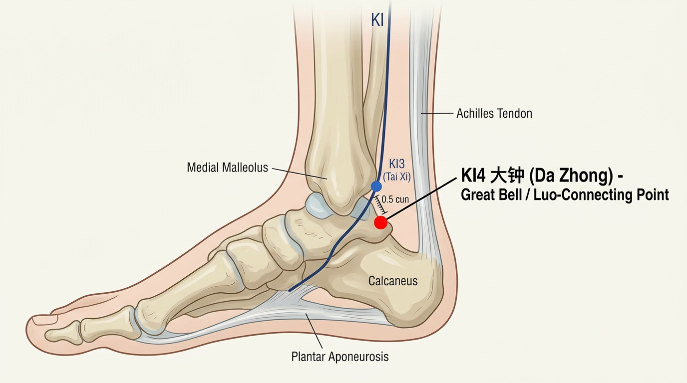

**קטגוריה מיוחדת:** נקודת לואו-מחברת (络穴)

**מיקום אנטומי:**
0.5 צון מאחורי ומתחת ל-KI3, על המקום שבו גיד אכילס מתחבר לעצם העקב (קלקנאוס), בצד המדיאלי.

**איך למצוא את הנקודה:**
1. מצאו תחילה את KI3 (בין קרסול פנימי לגיד אכילס)
2. החליקו 0.5 צון לכיוון מטה ואחורה
3. הנקודה נמצאת על הקצה המדיאלי-עליון של עצם העקב, במקום שגיד אכילס נצמד לעצם
4. מורגש כשקע רגיש בלחיצה

**עומק דקירה:** 0.3-0.5 צון

**זווית דקירה:** ניצבת (90°)

**תחושת דה-צ'י:** כאב מקומי, תחושת מתיחה באזור העקב

**פעולות והתוויות:**
- מחזקת את רצון הכליות (志 Zhì)
- מווסתת את ערוץ הכליות ואת ערוץ שלפוחית השתן (דרך חיבור הלואו)
- מטפלת בבעיות גרון
- התוויות: כאבי עקב, כאב גב תחתון, אסתמה, דם בשתן, צפצופים בגרון, חרדה, פחד, עצירות

**שילובי נקודות נפוצים:**
- KI4 + BL58 — חיבור לואו-יואן בין כליות לשלפוחית (בעיות דרכי השתן)
- KI4 + LU7 — לטיפול בבעיות גרון

---

### KI5 — שוי צ'יואן (水泉) — Shuǐ Quán — "מעיין מים"

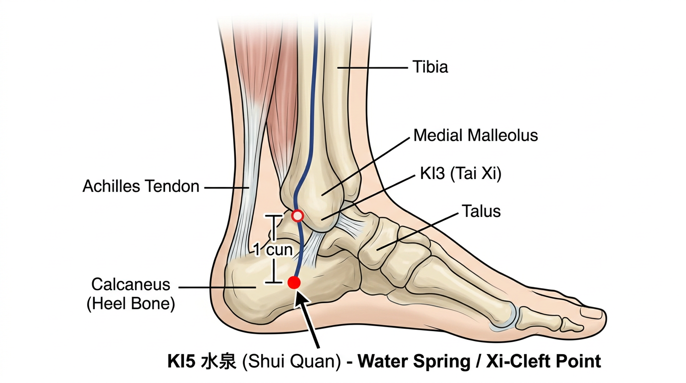

**קטגוריה מיוחדת:** נקודת שי-צבירה (郄穴)

**מיקום אנטומי:**
1 צון ישירות מתחת ל-KI3, בשקע המדיאלי-קדמי של עצם העקב (tuberosity of calcaneus).

**איך למצוא את הנקודה:**
1. מצאו תחילה את KI3 (בין קרסול פנימי לגיד אכילס)
2. מדדו 1 צון ישירות כלפי מטה
3. הנקודה נמצאת בשקע שעל הבליטה המדיאלית-קדמית של עצם העקב
4. לחצו לתוך השקע - הנקודה רגישה ללחיצה

**עומק דקירה:** 0.3-0.5 צון

**זווית דקירה:** ניצבת (90°)

**תחושת דה-צ'י:** כאב מקומי חד

**פעולות והתוויות:**
- מווסתת את הרחם ואת המחזור
- מקדמת את זרימת הדם
- מפעילה את ערוץ הכליות
- התוויות: אי-סדירות במחזור, כאבי מחזור (דיסמנוריאה), היעדר מחזור (אמנוריאה), צניחת רחם, קושי במתן שתן, טשטוש ראיה

**שילובי נקודות נפוצים:**
- KI5 + SP6 — לוויסות המחזור
- KI5 + BL23 — לחיזוק הכליות וטיפול בבעיות מחזור

---

### KI6 — ג'או האי (照海) — Zhào Hǎi — "ים זוהר"

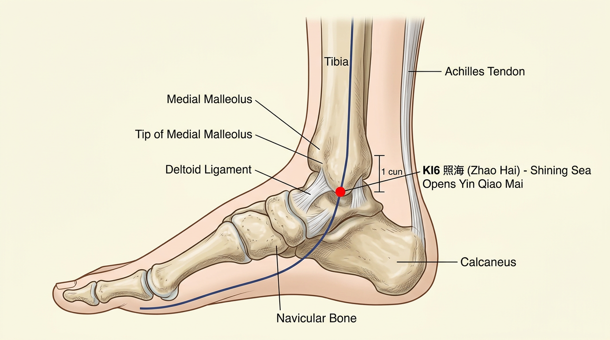

**קטגוריה מיוחדת:** נקודת מפגש עם ין צ'יאו מאי (阴跷脉), אחת מ-8 נקודות המפגש (八脉交会穴)

**מיקום אנטומי:**
1 צון מתחת לקצה המלאולוס המדיאלי (הקרסול הפנימי), בשקע.

**איך למצוא את הנקודה:**
1. מצאו את הנקודה הבולטת ביותר של הקרסול הפנימי
2. מדדו 1 צון ישירות כלפי מטה (כרוחב אגודל)
3. הנקודה נמצאת בשקע שמתחת לקרסול הפנימי
4. לחצו - תרגישו שקע רגיש מעל עצם העקב

**עומק דקירה:** 0.3-0.5 צון

**זווית דקירה:** ניצבת (90°)

**תחושת דה-צ'י:** כאב מקומי, תחושת נימול או כבדות סביב הקרסול

**פעולות והתוויות:**
- מזינה את ין הכליות
- מנקה חום מחוסר, מלחלחת את הגרון
- מרגיעה את הרוח (שן), מקדמת שינה
- מווסתת את ין צ'יאו מאי
- התוויות: גרון יבש וכואב, נדודי שינה, אפילפסיה, עצירות, אי-סדירות במחזור, גירוד באזור המין, תכיפות במתן שתן, עיניים יבשות

**שילובי נקודות נפוצים:**
- KI6 + LU7 — פתיחת רן מאי (任脉) — לגרון יבש, אסתמה, בעיות גינקולוגיות
- KI6 + HT7 — לנדודי שינה
- KI6 + SP6 — להזנת ין ודם

---

### KI7 — פו ליו (复溜) — Fù Liū — "זרם חוזר"

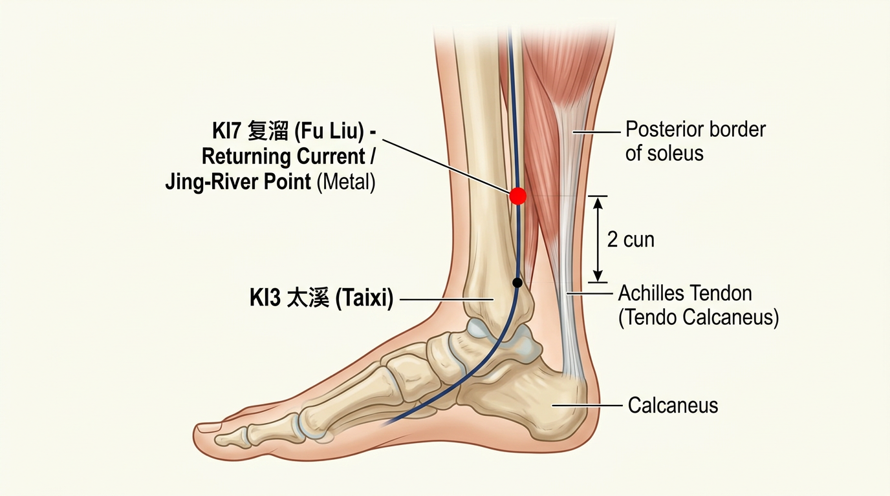

**קטגוריה מיוחדת:** נקודת ג'ינג-נהר (经穴), נקודת מתכת (金), נקודת חיזוק (补穴 - נקודת האם)

**מיקום אנטומי:**
2 צון ישירות מעל KI3, על השפה הקדמית של גיד אכילס.

**איך למצוא את הנקודה:**
1. מצאו תחילה את KI3 (בין קרסול פנימי לגיד אכילס)
2. מדדו 2 צון ישירות כלפי מעלה לאורך השוק
3. הנקודה נמצאת על השפה הקדמית (אנטריורית) של גיד אכילס
4. הנקודה ממוקמת בשקע בין גיד אכילס לשריר הסולאוס

**עומק דקירה:** 0.5-1 צון

**זווית דקירה:** ניצבת (90°)

**תחושת דה-צ'י:** כאב מקומי, תחושת כבדות או נימול העולים בשוק

**פעולות והתוויות:**
- מחזקת את יאנג הכליות
- מווסתת את הזעה (עוצרת הזעה מוגברת, מקדמת הזעה בצורך)
- מפזרת לחות, מווסתת את מערכת המים
- מחזקת את הגב התחתון
- התוויות: הזעה ספונטנית, זיעות לילה, בצקות, שלשולים, כאבי גב תחתון, כאבי בטן, חום ללא הזעה

**שילובי נקודות נפוצים:**
- KI7 + LU7 — לוויסות הזעה
- KI7 + SP9 — לפיזור לחות ובצקות
- KI7 + KI3 — לחיזוק כללי של הכליות
- KI7 + HT6 — לעצירת זיעות לילה

---

### KI8 — ג'יאו שין (交信) — Jiāo Xìn — "הצטלבות אמינה"

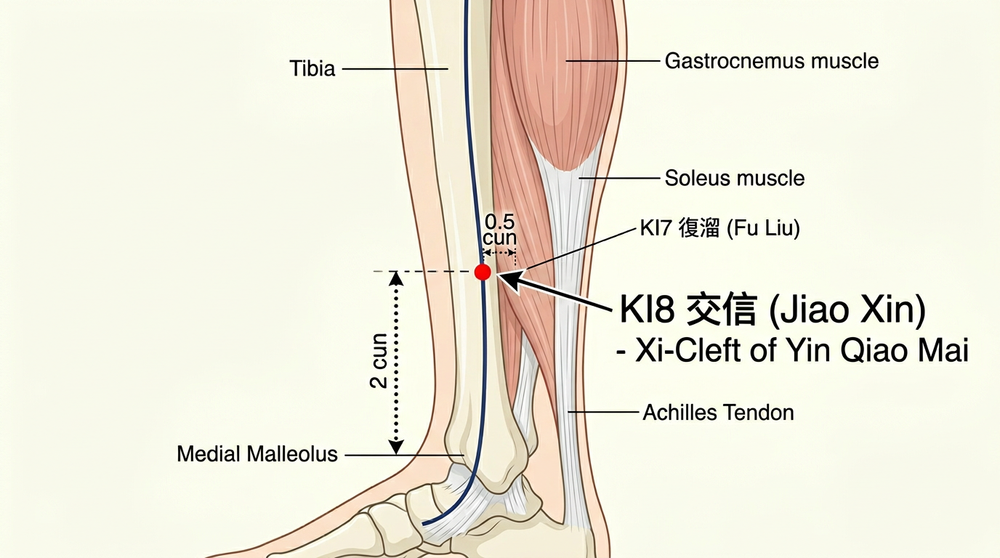

**קטגוריה מיוחדת:** נקודת שי (郄穴) של ין צ'יאו מאי (阴跷脉)

**מיקום אנטומי:**
2 צון מעל קצה המלאולוס המדיאלי, 0.5 צון קדימה (אנטריורית) ל-KI7, על השפה המדיאלית-אחורית של הטיביה.

**איך למצוא את הנקודה:**
1. מצאו את KI7 (2 צון מעל KI3, על שפת גיד אכילס)
2. החליקו 0.5 צון קדימה לכיוון הטיביה
3. הנקודה נמצאת על השפה האחורית-מדיאלית של עצם הטיביה
4. מורגשת כנקודה רגישה על שפת העצם

**עומק דקירה:** 0.5-1 צון

**זווית דקירה:** ניצבת (90°)

**תחושת דה-צ'י:** כאב מקומי, תחושת כבדות

**פעולות והתוויות:**
- מווסתת את הרחם ואת המחזור
- מפזרת לחות מהמבער התחתון
- מחזקת את ין צ'יאו מאי
- התוויות: דימום רחמי לא סדיר, כאבי מחזור, צניחת רחם, שלשולים, עצירות, כאב ובצקת במדיאל של השוק

**שילובי נקודות נפוצים:**
- KI8 + SP6 — לוויסות המחזור ודימום רחמי
- KI8 + REN4 — לחיזוק הרחם

---

### KI9 — ג'ו בין (筑宾) — Zhù Bīn — "בניין אורח"

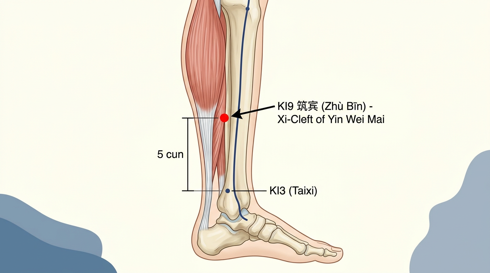

**קטגוריה מיוחדת:** נקודת שי (郄穴) של ין ווי מאי (阴维脉)

**מיקום אנטומי:**
5 צון מעל KI3, על השפה המדיאלית של שריר הגסטרוקנמיוס (שריר השוק), בקו שבין KI3 ל-KI10.

**איך למצוא את הנקודה:**
1. מדדו את המרחק בין KI3 (קרסול פנימי) ל-KI10 (קפל הברך)
2. מצאו את הנקודה 5 צון מעל KI3
3. הנקודה נמצאת על השפה המדיאלית (הפנימית) של שריר השוק (גסטרוקנמיוס)
4. היא ממוקמת בין שריר הגסטרוקנמיוס לגיד אכילס

**עומק דקירה:** 1-1.5 צון

**זווית דקירה:** ניצבת (90°)

**תחושת דה-צ'י:** כאב מקומי, תחושת כבדות בשוק

**פעולות והתוויות:**
- מרגיעה את הרוח, מנקה פליגמה מהלב
- מפעילה את ין ווי מאי
- מנקה רעלנות (רעלים)
- התוויות: הפרעות פסיכיאטריות (מאניה, אפילפסיה), כאב בשוק, הקאות, בחילות, פתולוגיות שליה בהריון

**שילובי נקודות נפוצים:**
- KI9 + HT7 + PC6 — להרגעת הרוח ומצבים נפשיים
- KI9 + ST40 — לניקוי פליגמה

---

### KI10 — ין גו (阴谷) — Yīn Gǔ — "עמק הין"

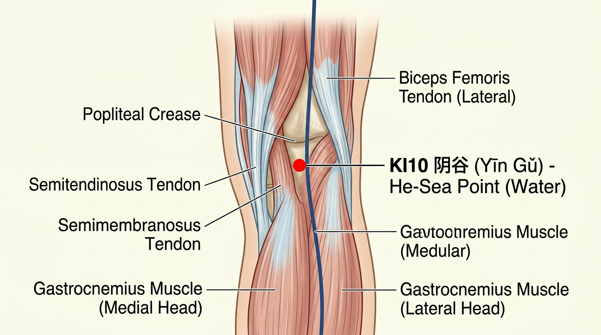

**קטגוריה מיוחדת:** נקודת הא-ים (合穴), נקודת מים (水)

**מיקום אנטומי:**
בצד המדיאלי של הפוסה הפופליטאלית (גב הברך), בין גיד השריר הסמי-טנדינוסוס לגיד השריר הסמי-ממברנוסוס, בגובה קפל הברך.

**איך למצוא את הנקודה:**
1. כופפו קלות את ברך המטופל
2. מצאו את קפל הברך מאחור
3. זהו את הגידים הבולטים בצד המדיאלי (פנימי) של גב הברך
4. הנקודה נמצאת בשקע שבין שני הגידים (סמי-טנדינוסוס וסמי-ממברנוסוס)
5. דופק עורק הפופליטאלי עשוי להיות מורגש בסמוך

**עומק דקירה:** 1-1.5 צון

**זווית דקירה:** ניצבת (90°)

**תחושת דה-צ'י:** כאב מקומי, תחושת כבדות או נימול סביב הברך

**פעולות והתוויות:**
- מחזקת את ין הכליות
- מנקה לחות-חום מהמבער התחתון
- מועילה לברכיים
- התוויות: כאב בברך, אימפוטנציה, דימום רחמי, קושי במתן שתן, כאב בצד המדיאלי של הירך, כאבי בטן תחתונה

**שילובי נקודות נפוצים:**
- KI10 + SP9 — לניקוי לחות-חום מהמבער התחתון
- KI10 + BL40 — לטיפול בכאבי ברך
- KI10 + REN3 — לבעיות דרכי השתן

---

### KI11 — הנג גו (横骨) — Héng Gǔ — "עצם רוחבית"

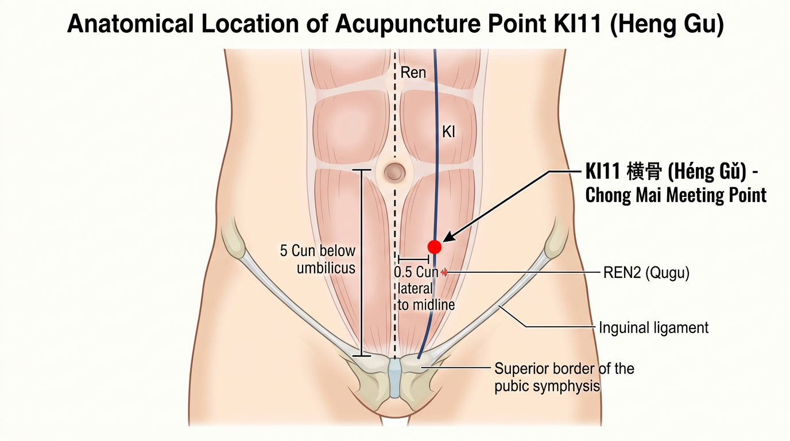

**קטגוריה מיוחדת:** נקודת מפגש עם כלי חונג מאי (冲脉)

**מיקום אנטומי:**
5 צון מתחת לטבור, 0.5 צון לטרלית לקו האמצע, על השפה העליונה של עצם ה-Pubis (ערווה).

**איך למצוא את הנקודה:**
1. מצאו את השפה העליונה של עצם הערווה (סימפיזיס פוביס) בקו האמצע
2. מדדו 0.5 צון הצידה (לטרלית)
3. הנקודה נמצאת על השפה העליונה של העצם, 0.5 צון מקו האמצע
4. בגובה REN2

**עומק דקירה:** 0.5-1 צון

**זווית דקירה:** ניצבת (90°)

**תחושת דה-צ'י:** כאב מקומי, תחושת כבדות בבטן התחתונה

**פעולות והתוויות:**
- מחזקת את הכליות
- מועילה לאזור המין ולשלפוחית
- התוויות: כאבי בטן תחתונה, אצירת שתן, אימפוטנציה, שפיכה מוקדמת, כאבי אשכים, הפרשות מהנרתיק

**שילובי נקודות נפוצים:**
- KI11 + REN4 — לחיזוק הכליות וטיפול בבעיות גניטו-אורינריות
- KI11 + SP6 — לבעיות גינקולוגיות

---

### KI12 — דא הא (大赫) — Dà Hè — "זוהר גדול"

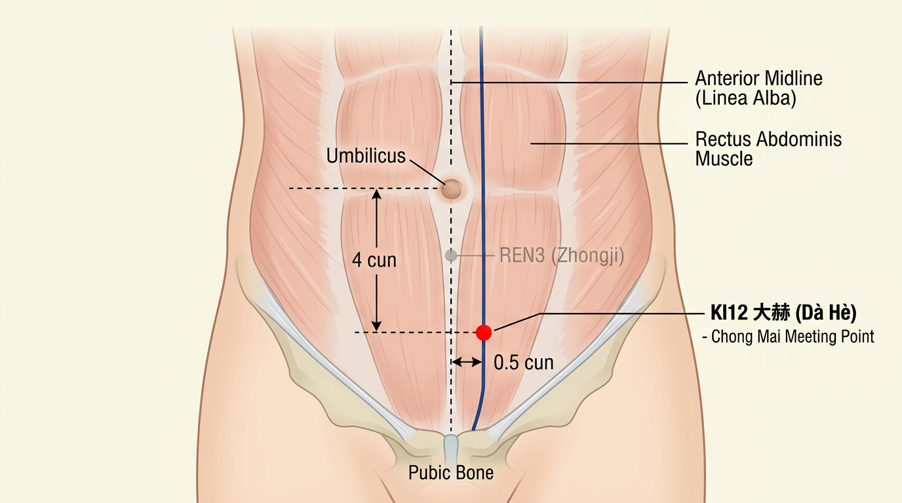

**קטגוריה מיוחדת:** נקודת מפגש עם כלי חונג מאי (冲脉)

**מיקום אנטומי:**
4 צון מתחת לטבור, 0.5 צון לטרלית לקו האמצע.

**איך למצוא את הנקודה:**
1. מצאו את הטבור ואת השפה העליונה של עצם הערווה
2. מדדו 4 צון מתחת לטבור (או 1 צון מעל השפה העליונה של עצם הערווה)
3. מדדו 0.5 צון הצידה מקו האמצע
4. בגובה REN3

**עומק דקירה:** 0.5-1 צון

**זווית דקירה:** ניצבת (90°)

**תחושת דה-צ'י:** כאב מקומי, תחושת מתיחה

**פעולות והתוויות:**
- מחזקת את ג'ינג וצ'י הכליות
- מועילה לאזור המין
- התוויות: אימפוטנציה, שפיכה מוקדמת, הפרשות מהנרתיק, כאב באזור המין, צניחת רחם

**שילובי נקודות נפוצים:**
- KI12 + REN4 + BL23 — לחיזוק הכליות וטיפול באימפוטנציה
- KI12 + SP6 — לוויסות המחזור

---

### KI13 — צ'י שיואה (气穴) — Qì Xué — "חור הצ'י"

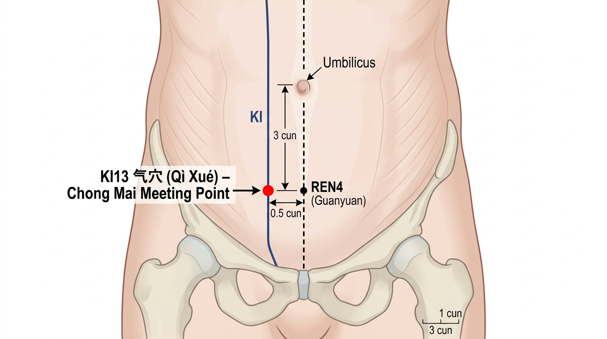

**קטגוריה מיוחדת:** נקודת מפגש עם כלי חונג מאי (冲脉)

**מיקום אנטומי:**
3 צון מתחת לטבור, 0.5 צון לטרלית לקו האמצע.

**איך למצוא את הנקודה:**
1. מצאו את הטבור
2. מדדו 3 צון כלפי מטה
3. מדדו 0.5 צון הצידה מקו האמצע
4. בגובה REN4

**עומק דקירה:** 0.5-1 צון

**זווית דקירה:** ניצבת (90°)

**תחושת דה-צ'י:** כאב מקומי, תחושת כבדות

**פעולות והתוויות:**
- מחזקת את הכליות ומווסתת צ'י
- מווסתת את המחזור
- התוויות: אי-סדירות במחזור, כאבי מחזור, שלשולים, כאבי גב תחתון, אצירת שתן

**שילובי נקודות נפוצים:**
- KI13 + REN4 — לוויסות המחזור וחיזוק הכליות
- KI13 + ST36 — לחיזוק הצ'י

---

### KI14 — סי מאן (四满) — Sì Mǎn — "ארבע מלאויות"

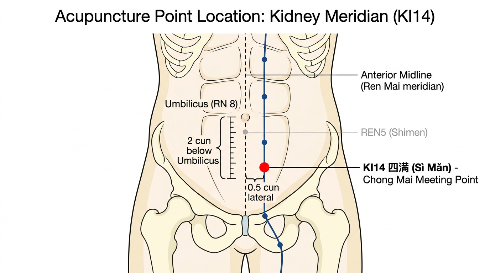

**קטגוריה מיוחדת:** נקודת מפגש עם כלי חונג מאי (冲脉)

**מיקום אנטומי:**
2 צון מתחת לטבור, 0.5 צון לטרלית לקו האמצע.

**איך למצוא את הנקודה:**
1. מצאו את הטבור
2. מדדו 2 צון כלפי מטה
3. מדדו 0.5 צון הצידה מקו האמצע
4. בגובה REN5

**עומק דקירה:** 0.5-1 צון

**זווית דקירה:** ניצבת (90°)

**תחושת דה-צ'י:** כאב מקומי, תחושת נפיחות

**פעולות והתוויות:**
- מווסתת את המחזור ומפזרת סטגנציה
- מפזרת הצטברות מים בבטן
- התוויות: כאבי בטן תחתונה, אי-סדירות במחזור, הפרשות מהנרתיק, בצקת בבטן, עצירות, שלשולים

**שילובי נקודות נפוצים:**
- KI14 + SP9 — לפיזור לחות ובצקת
- KI14 + REN6 — לטיפול בכאבי בטן

---

### KI15 — ג'ונג ג'ו (中注) — Zhōng Zhù — "יציקה מרכזית"

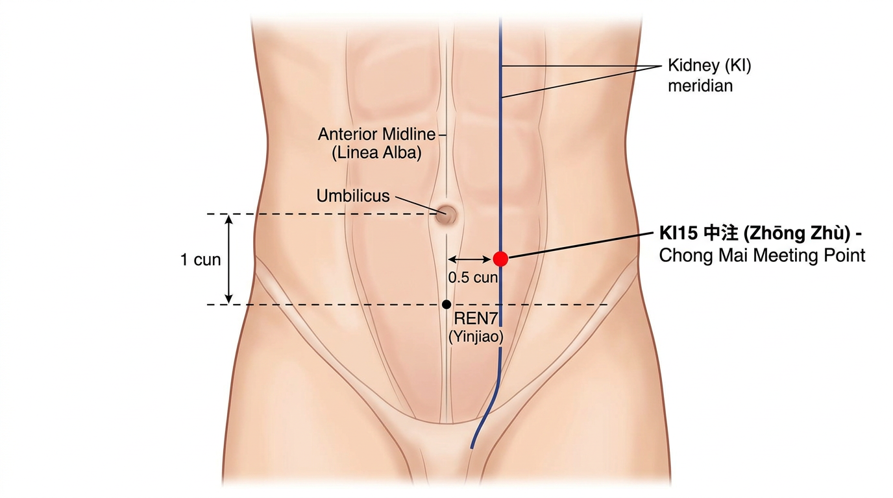

**קטגוריה מיוחדת:** נקודת מפגש עם כלי חונג מאי (冲脉)

**מיקום אנטומי:**
1 צון מתחת לטבור, 0.5 צון לטרלית לקו האמצע.

**איך למצוא את הנקודה:**
1. מצאו את הטבור
2. מדדו 1 צון כלפי מטה
3. מדדו 0.5 צון הצידה מקו האמצע
4. בגובה REN7 (ין ג'יאו - 阴交)

**עומק דקירה:** 0.5-1 צון

**זווית דקירה:** ניצבת (90°)

**תחושת דה-צ'י:** כאב מקומי

**פעולות והתוויות:**
- מווסתת את חונג מאי
- מווסתת את המעיים
- התוויות: עצירות, כאבי בטן, אי-סדירות במחזור

**שילובי נקודות נפוצים:**
- KI15 + ST25 — לוויסות המעיים
- KI15 + REN6 — לחיזוק צ'י הבטן

---

### KI16 — הואנג שו (肓俞) — Huāng Shū — "נקודת ממברנה חיונית"

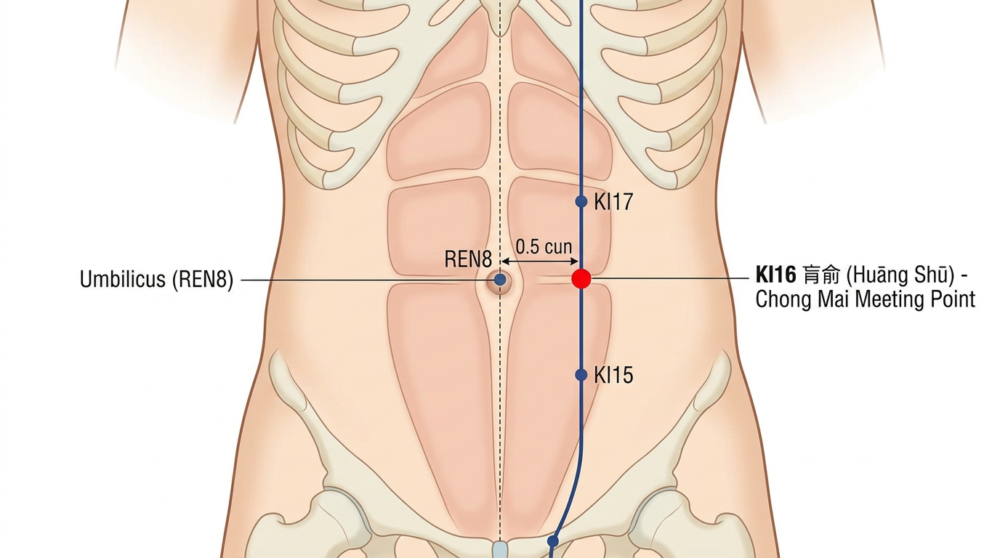

**קטגוריה מיוחדת:** נקודת מפגש עם כלי חונג מאי (冲脉)

**מיקום אנטומי:**
בגובה הטבור, 0.5 צון לטרלית לקו האמצע.

**איך למצוא את הנקודה:**
1. מצאו את מרכז הטבור
2. מדדו 0.5 צון הצידה מקו האמצע
3. הנקודה נמצאת בדיוק בגובה הטבור
4. בגובה REN8 (שן צ'יואה - 神阙)

**עומק דקירה:** 0.5-1 צון

**זווית דקירה:** ניצבת (90°)

**תחושת דה-צ'י:** כאב מקומי, תחושת נפיחות

**פעולות והתוויות:**
- מווסתת את המעיים ואת הקיבה
- מפזרת סטגנציה
- התוויות: כאבי בטן סביב הטבור, עצירות, שלשולים, הקאות, נפיחות

**שילובי נקודות נפוצים:**
- KI16 + ST25 + REN8 (מוקסה) — לטיפול בכאבי בטן ושלשולים
- KI16 + SP4 — לוויסות חונג מאי

---

### KI17 — שאנג צ'יו (商曲) — Shāng Qū — "עיקול המסחר"

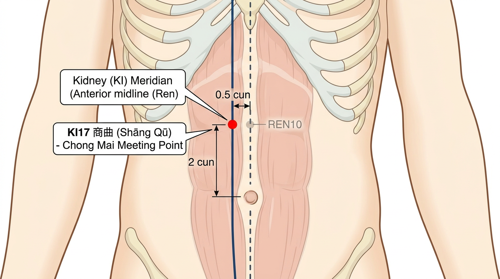

**קטגוריה מיוחדת:** נקודת מפגש עם כלי חונג מאי (冲脉)

**מיקום אנטומי:**
2 צון מעל הטבור, 0.5 צון לטרלית לקו האמצע.

**איך למצוא את הנקודה:**
1. מצאו את הטבור
2. מדדו 2 צון כלפי מעלה
3. מדדו 0.5 צון הצידה מקו האמצע
4. בגובה REN10 (שיה וואן - 下脘)

**עומק דקירה:** 0.5-1 צון

**זווית דקירה:** ניצבת (90°)

**תחושת דה-צ'י:** כאב מקומי, תחושת נפיחות

**פעולות והתוויות:**
- מווסתת את המעיים
- מפזרת סטגנציה
- התוויות: כאבי בטן, עצירות, שלשולים, כאב בבטן

**שילובי נקודות נפוצים:**
- KI17 + ST25 — לוויסות המעיים
- KI17 + REN12 — לטיפול בבעיות עיכול

---

### KI18 — שי גואן (石关) — Shí Guān — "שער האבן"

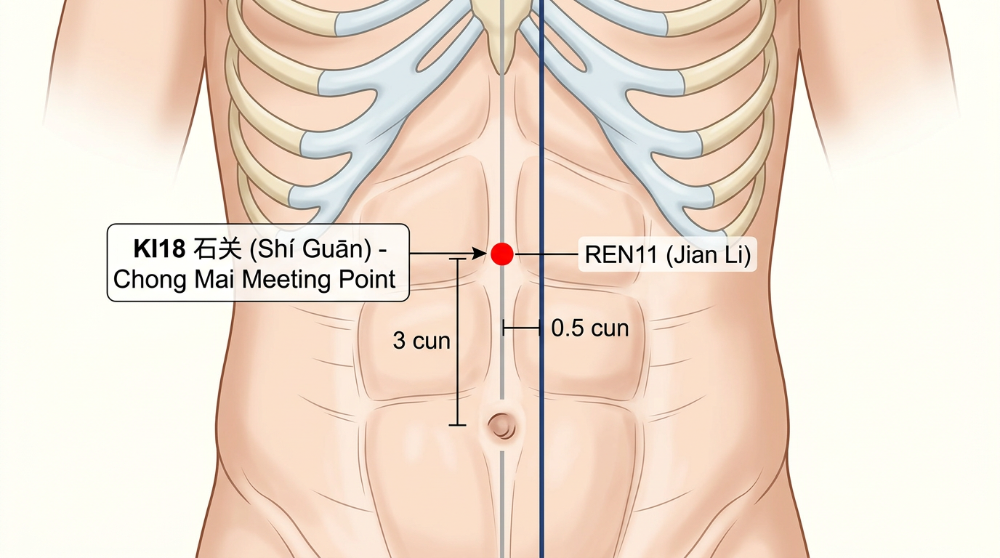

**קטגוריה מיוחדת:** נקודת מפגש עם כלי חונג מאי (冲脉)

**מיקום אנטומי:**
3 צון מעל הטבור, 0.5 צון לטרלית לקו האמצע.

**איך למצוא את הנקודה:**
1. מצאו את הטבור
2. מדדו 3 צון כלפי מעלה
3. מדדו 0.5 צון הצידה מקו האמצע
4. בגובה REN11 (ג'יאן לי - 建里)

**עומק דקירה:** 0.5-1 צון

**זווית דקירה:** ניצבת (90°)

**תחושת דה-צ'י:** כאב מקומי

**פעולות והתוויות:**
- מחזקת את הקיבה ומפזרת סטגנציה
- מורידה צ'י מנוגד (הקאות)
- התוויות: כאבי בטן, הקאות, בחילות, שיהוקים, עצירות, אי-פריון

**שילובי נקודות נפוצים:**
- KI18 + REN12 + PC6 — להקאות ובחילות
- KI18 + ST36 — לחיזוק הקיבה

---

### KI19 — ין דו (阴都) — Yīn Dū — "בירת הין"

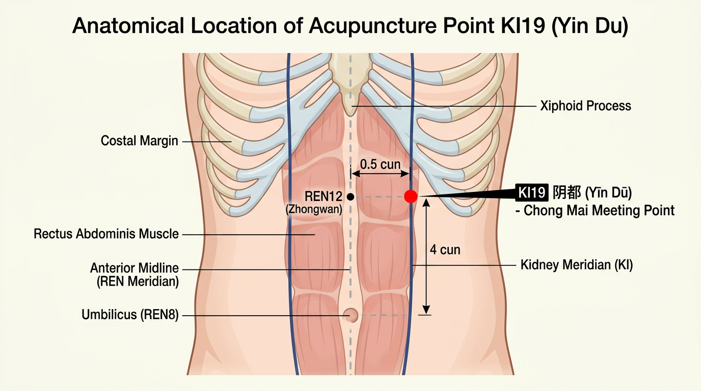

**קטגוריה מיוחדת:** נקודת מפגש עם כלי חונג מאי (冲脉)

**מיקום אנטומי:**
4 צון מעל הטבור, 0.5 צון לטרלית לקו האמצע.

**איך למצוא את הנקודה:**
1. מצאו את הטבור
2. מדדו 4 צון כלפי מעלה
3. מדדו 0.5 צון הצידה מקו האמצע
4. בגובה REN12 (ג'ונג וואן - 中脘)

**עומק דקירה:** 0.5-1 צון

**זווית דקירה:** ניצבת (90°)

**תחושת דה-צ'י:** כאב מקומי

**פעולות והתוויות:**
- מווסתת את הקיבה
- מורידה צ'י מנוגד
- התוויות: כאב בבטן עליונה, בורבוריגמוס (קולות מעיים), בחילות, עצירות, קוצר נשימה

**שילובי נקודות נפוצים:**
- KI19 + REN12 — לטיפול בבעיות קיבה
- KI19 + PC6 — נגד בחילות

---

### KI20 — פו טונג גו (腹通谷) — Fù Tōng Gǔ — "עמק התקשורת של הבטן"

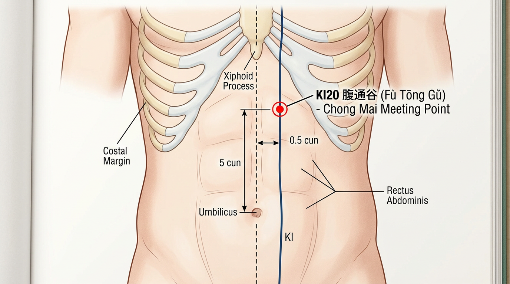

**קטגוריה מיוחדת:** נקודת מפגש עם כלי חונג מאי (冲脉)

**מיקום אנטומי:**
5 צון מעל הטבור, 0.5 צון לטרלית לקו האמצע.

**איך למצוא את הנקודה:**
1. מצאו את הטבור
2. מדדו 5 צון כלפי מעלה
3. מדדו 0.5 צון הצידה מקו האמצע
4. בגובה REN13 (שאנג וואן - 上脘)

**עומק דקירה:** 0.5-1 צון

**זווית דקירה:** ניצבת (90°)

**תחושת דה-צ'י:** כאב מקומי

**פעולות והתוויות:**
- מווסתת את הקיבה
- מרגיעה את הרוח
- התוויות: כאבי בטן עליונה, נפיחות, הקאות, חוסר תיאבון

**שילובי נקודות נפוצים:**
- KI20 + REN13 — לטיפול בבעיות קיבה עליונה
- KI20 + SP4 — לוויסות חונג מאי

---

### KI21 — יו מן (幽门) — Yōu Mén — "שער החושך"

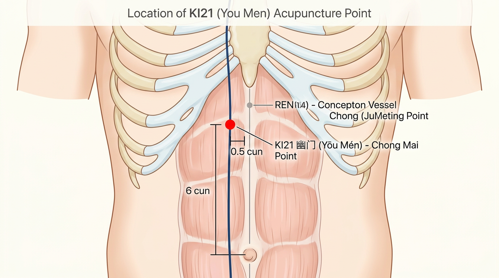

**קטגוריה מיוחדת:** נקודת מפגש עם כלי חונג מאי (冲脉)

**מיקום אנטומי:**
6 צון מעל הטבור, 0.5 צון לטרלית לקו האמצע, ממש מתחת לתהליך הכיפויידי (Xiphoid process).

**איך למצוא את הנקודה:**
1. מצאו את קצה עצם החזה (תהליך כיפויידי)
2. מדדו 0.5 צון הצידה מקו האמצע
3. או: מדדו 6 צון מעל הטבור + 0.5 צון הצידה
4. בגובה REN14 (ג'יו ווי - 巨阙)

**עומק דקירה:** 0.5-1 צון

**זווית דקירה:** ניצבת (90°) או אובליקית כלפי מטה (לא לדקור עמוק - קרבה לאיברים פנימיים)

**תחושת דה-צ'י:** כאב מקומי, תחושת כבדות

**פעולות והתוויות:**
- מווסתת את הקיבה ומורידה צ'י מנוגד
- מרגיעה בחילות והקאות
- התוויות: כאב בבטן עליונה, בחילות, הקאות, שלשולים, כאב בחזה, שיהוקים

**שילובי נקודות נפוצים:**
- KI21 + REN14 + PC6 — לטיפול בהקאות ובחילות
- KI21 + REN12 — לכאבי קיבה

---

### KI22 — בו לאנג (步廊) — Bù Láng — "מסדרון צעדים"

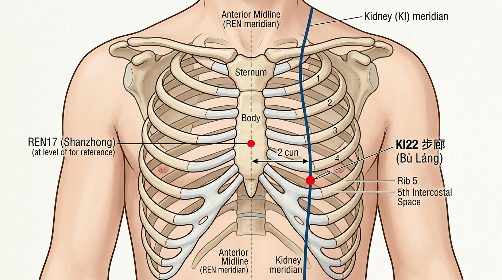

**מיקום אנטומי:**
ברווח הבין-צלעי ה-5, 2 צון לטרלית לקו האמצע של החזה.

**איך למצוא את הנקודה:**
1. מצאו את קו האמצע של החזה (סטרנום)
2. מדדו 2 צון הצידה
3. מצאו את הרווח הבין-צלעי ה-5 (ספרו מלמעלה)
4. בגובה REN17 (שאן ג'ונג - 膻中)

**עומק דקירה:** 0.3-0.5 צון

**זווית דקירה:** אובליקית לטרלית או שטוחה (לא לדקור עמוק - ריאות מתחת)

**תחושת דה-צ'י:** כאב מקומי, תחושת לחץ בחזה

**פעולות והתוויות:**
- מווסתת את הריאות ומורידה צ'י
- מרחיבה את החזה
- התוויות: שיעול, קוצר נשימה, כאב בחזה, חוסר תיאבון, הקאות

**שילובי נקודות נפוצים:**
- KI22 + REN17 — להרחבת החזה ושחרור קוצר נשימה
- KI22 + LU7 — לטיפול בשיעול

---

### KI23 — שן פנג (神封) — Shén Fēng — "חותם הרוח"

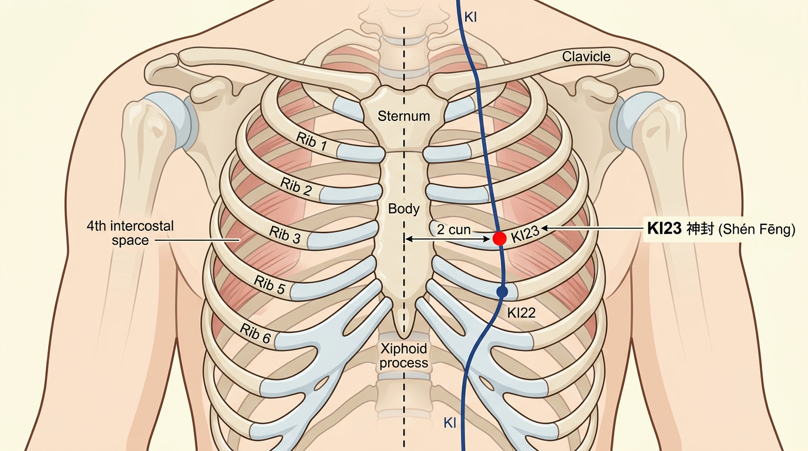

**מיקום אנטומי:**
ברווח הבין-צלעי ה-4, 2 צון לטרלית לקו האמצע של החזה.

**איך למצוא את הנקודה:**
1. מצאו את קו האמצע של החזה
2. מדדו 2 צון הצידה
3. מצאו את הרווח הבין-צלעי ה-4
4. רווח אחד מעל KI22

**עומק דקירה:** 0.3-0.5 צון

**זווית דקירה:** אובליקית לטרלית או שטוחה

**תחושת דה-צ'י:** כאב מקומי, תחושת לחץ

**פעולות והתוויות:**
- מרחיבה את החזה, מורידה צ'י מנוגד
- מרגיעה את הרוח
- התוויות: שיעול, אסתמה, כאב בחזה, חוסר תיאבון, הקאות, שד כואב

**שילובי נקודות נפוצים:**
- KI23 + PC6 — להרגעת הרוח ושחרור החזה
- KI23 + REN17 — לכאבי חזה

---

### KI24 — לינג שו (灵墟) — Líng Xū — "שממה רוחנית"

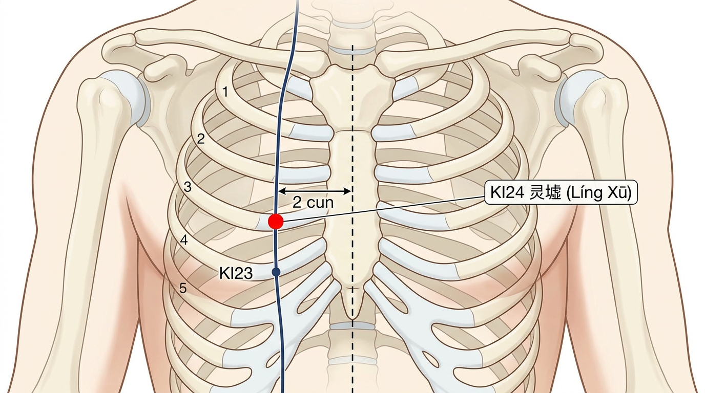

**מיקום אנטומי:**
ברווח הבין-צלעי ה-3, 2 צון לטרלית לקו האמצע של החזה.

**איך למצוא את הנקודה:**
1. מצאו את קו האמצע של החזה
2. מדדו 2 צון הצידה
3. מצאו את הרווח הבין-צלעי ה-3
4. רווח אחד מעל KI23

**עומק דקירה:** 0.3-0.5 צון

**זווית דקירה:** אובליקית לטרלית או שטוחה

**תחושת דה-צ'י:** כאב מקומי

**פעולות והתוויות:**
- מרחיבה את החזה
- מורידה צ'י מנוגד
- מרגיעה שיעול ואסתמה
- התוויות: שיעול, אסתמה, כאב בחזה, הקאות, שד כואב

**שילובי נקודות נפוצים:**
- KI24 + LU1 — לשיעול ואסתמה
- KI24 + REN17 — לכאבי חזה

---

### KI25 — שן צאנג (神藏) — Shén Cáng — "אוצר הרוח"

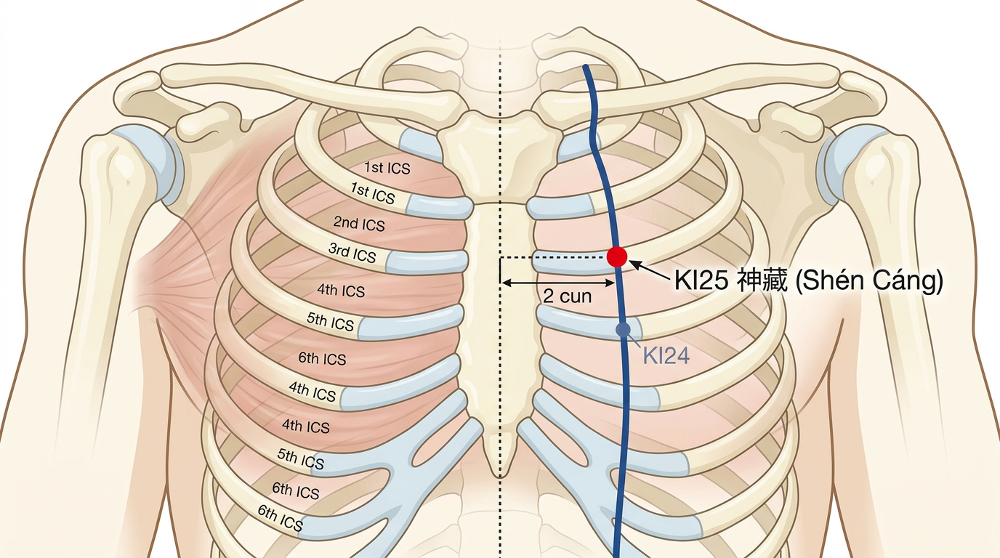

**מיקום אנטומי:**
ברווח הבין-צלעי ה-2, 2 צון לטרלית לקו האמצע של החזה.

**איך למצוא את הנקודה:**
1. מצאו את קו האמצע של החזה
2. מדדו 2 צון הצידה
3. מצאו את הרווח הבין-צלעי ה-2
4. רווח אחד מעל KI24

**עומק דקירה:** 0.3-0.5 צון

**זווית דקירה:** אובליקית לטרלית או שטוחה

**תחושת דה-צ'י:** כאב מקומי, תחושת לחץ

**פעולות והתוויות:**
- מרחיבה את החזה
- מורידה צ'י מנוגד, מרגיעה שיעול ואסתמה
- מרגיעה את הרוח
- התוויות: שיעול, אסתמה, כאב בחזה, חרדה, נדודי שינה

**שילובי נקודות נפוצים:**
- KI25 + HT7 — להרגעת הרוח
- KI25 + LU7 — לשיעול ובעיות ריאות

---

### KI26 — יו ג'ונג (彧中) — Yù Zhōng — "מרכז מבריק"

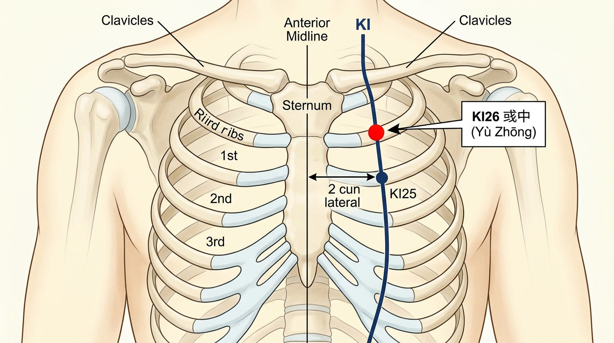

**מיקום אנטומי:**
ברווח הבין-צלעי ה-1, 2 צון לטרלית לקו האמצע של החזה.

**איך למצוא את הנקודה:**
1. מצאו את קו האמצע של החזה
2. מדדו 2 צון הצידה
3. מצאו את הרווח הבין-צלעי ה-1 (מתחת לצלע הראשונה)
4. רווח אחד מעל KI25

**עומק דקירה:** 0.3-0.5 צון

**זווית דקירה:** אובליקית לטרלית או שטוחה

**תחושת דה-צ'י:** כאב מקומי

**פעולות והתוויות:**
- מרחיבה את החזה ומורידה צ'י
- מרגיעה שיעול ואסתמה
- התוויות: שיעול, אסתמה, כאב בחזה, נפיחות, חוסר תיאבון

**שילובי נקודות נפוצים:**
- KI26 + REN22 — לטיפול בשיעול ובעיות גרון
- KI26 + LU1 — לשחרור החזה

---

### KI27 — שו פו (俞府) — Shū Fǔ — "ארמון ההעברה"

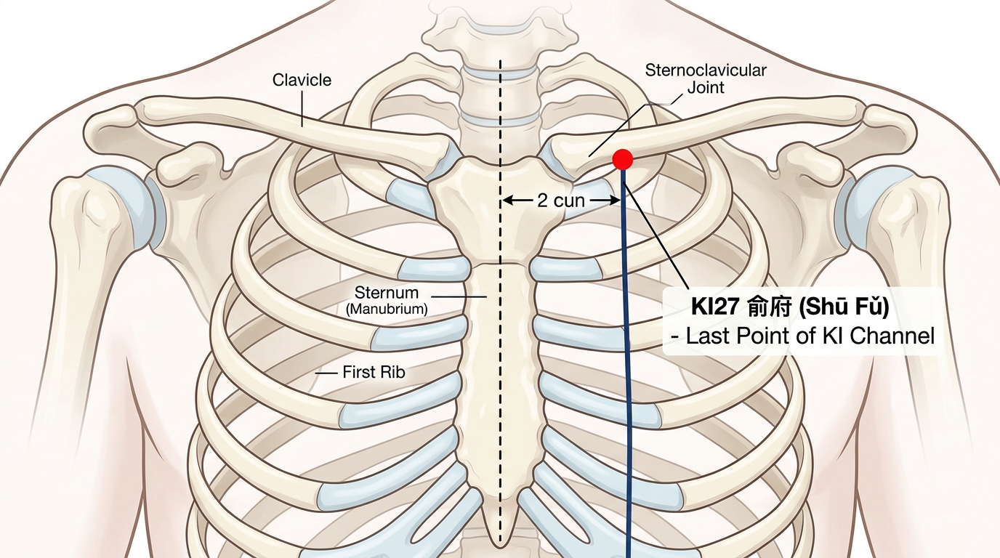

**מיקום אנטומי:**
בשקע שעל השפה התחתונה של עצם הבריח (קלביקולה), 2 צון לטרלית לקו האמצע של החזה.

**איך למצוא את הנקודה:**
1. מצאו את המפגש בין עצם החזה (סטרנום) לעצם הבריח (קלביקולה)
2. החליקו לאורך השפה התחתונה של עצם הבריח כ-2 צון הצידה
3. הנקודה נמצאת בשקע שמתחת לעצם הבריח
4. או: 2 צון לטרלית מ-REN21

**עומק דקירה:** 0.3-0.5 צון

**זווית דקירה:** אובליקית כלפי מטה ולטרלית (לא לדקור עמוק - ריאות מתחת)

**תחושת דה-צ'י:** כאב מקומי, תחושת לחץ

**פעולות והתוויות:**
- מורידה צ'י מנוגד של הריאות והקיבה
- מרגיעה שיעול ואסתמה
- מועילה לנשימה ולקליטת צ'י הכליות
- התוויות: שיעול, אסתמה, כאב בחזה, הקאות, חוסר תיאבון, קוצר נשימה

**שילובי נקודות נפוצים:**
- KI27 + LU7 + KI6 — לאסתמה ובעיות נשימה
- KI27 + REN22 — לטיפול בשיעול
- KI27 + REN17 — לשחרור החזה

---

## 4. סיכום נקודות מפתח של ערוץ הכליות

### 4.1 נקודות חשובות ביותר

| נקודה | שם | חשיבות |
|---|---|---|
| **KI1** | יונג צ'יואן | חירום, החייאה, הורדת יאנג |
| **KI3** | טאי שי | נקודת יואן - חיזוק כללי של הכליות |
| **KI6** | ג'או האי | הזנת ין, נדודי שינה, נקודת מפתח לרן מאי |
| **KI7** | פו ליו | חיזוק יאנג, וויסות הזעה |
| **KI27** | שו פו | קליטת צ'י, אסתמה, שיעול |

### 4.2 נקודות חמשת האלמנטים

| אלמנט | נקודה | סוג |
|---|---|---|
| עץ (木) | KI1 | ג'ינג-באר (井) |
| אש (火) | KI2 | יינג-מעיין (荥) |
| אדמה (土) | KI3 | שו-זרם (输) |
| מתכת (金) | KI7 | ג'ינג-נהר (经) |
| מים (水) | KI10 | הא-ים (合) |

### 4.3 נקודות מיוחדות

| קטגוריה | נקודה |
|---|---|
| נקודת יואן (原穴) | KI3 |
| נקודת לואו (络穴) | KI4 |
| נקודת שי (郄穴) | KI5 |
| 8 נקודות מפגש (八脉交会穴) | KI6 (ין צ'יאו מאי) |
| שי של ין צ'יאו מאי | KI8 |
| שי של ין ווי מאי | KI9 |

---

## 5. תרגילים

1. שרטטו את מסלול ערוץ הכליות על גוף שותף ללימודים וסמנו את כל 27 הנקודות.
2. תרגלו איתור של KI1, KI3, KI6, KI7, ו-KI10 בעיניים עצומות תוך שימוש בציוני דרך אנטומיים.
3. הסבירו את ההבדל בין חוסר ין כליות לחוסר יאנג כליות ואילו נקודות תבחרו לכל מצב.
4. תרגלו שילובי נקודות: בחרו 3 מצבים קליניים וכתבו מרשם נקודות מתאים מערוץ הכליות.
