

# ערוץ הכבד - צו ג'יואה ין גאן (足厥阴肝经)

## Liver Channel - Zú Jué Yīn Gān Jīng

---

## מטרות למידה

בסיום שיעור זה, הסטודנט יוכל:
1. לתאר את מסלול ערוץ הכבד החיצוני והפנימי
2. לאתר את 14 הנקודות של הערוץ (LR1-LR14)
3. להסביר את תפקודי איבר הכבד ברפואה הסינית
4. לזהות דפוסי חוסר איזון של הכבד ולבחור נקודות מתאימות
5. ליישם שילובי נקודות קלאסיים לטיפול בבעיות הכבד

---

## 1. סקירת הערוץ

### 1.1 מידע כללי

| פרט | תיאור |
|---|---|
| **שם סיני** | 足厥阴肝经 (Zú Jué Yīn Gān Jīng) |
| **קיצור** | LR (Liver) |
| **מספר נקודות** | 14 |
| **סוג** | ין (Yin) |
| **אלמנט** | עץ (木 Mù) |
| **שעות פעילות** | 01:00-03:00 |
| **כיוון זרימה** | מאצבע הרגל הגדולה עולה אל החזה |
| **זוג פנים-חוץ** | כיס המרה (GB - 足少阳胆经) |

### 1.2 מסלול הערוץ

**מסלול חיצוני:**
הערוץ מתחיל בצד הלטרלי של אצבע הרגל הגדולה (LR1), עולה על גב הרגל (LR2-LR4), עובר את המלאולוס המדיאלי (LR4-LR5), עולה לאורך הצד המדיאלי של השוק (LR5-LR8) — שם הוא חוצה את ערוץ הטחול (SP) בנקודה SP6. הערוץ ממשיך לצד המדיאלי של הברך (LR8), עולה לאורך הצד המדיאלי של הירך, עוטף את אזור המין, ועולה לבטן התחתונה (LR12-LR13). הוא מסתיים ברווח הבין-צלעי ה-6, מתחת לפטמה (LR14).

**מסלול פנימי:**
מאזור המין, הערוץ הפנימי נכנס לבטן, עוטף את הקיבה, מתחבר לכבד ולכיס המרה. משם הוא עולה דרך הסרעפת, מתפשט בצלעות, עולה בצד האחורי של הגרון, מגיע לנזופרינקס (חלק העליון של הגרון), מתחבר לעיניים, ועולה למצח ולקודקוד הראש שם הוא מתחבר לכלי דו מאי (督脉).

**ענפים:**
- ענף מהעיניים יורד ללחי ומקיף את השפתיים הפנימיות
- ענף מהכבד עובר דרך הסרעפת לריאות, שם הוא מתחבר לערוץ הריאות (LU1) ומשלים את מעגל 12 הערוצים

### 1.3 זוג פנים-חוץ

ערוץ הכבד (צו ג'יואה ין - 足厥阴) הוא הערוץ הפנימי (ין) המזווג עם ערוץ כיס המרה (צו שאו יאנג - 足少阳), שהוא הערוץ החיצוני (יאנג). שניהם שייכים לאלמנט העץ (木). הכבד וכיס המרה פועלים בשיתוף פעולה — הכבד מייצר מרה והכיס אוגר ומפריש אותה.

---

## 2. תפקודי איבר הכבד (肝 Gān)

### 2.1 תפקודים עיקריים

1. **שליטה על זרימת הצ'י (疏泄 Shū Xiè)** - הכבד אחראי על זרימה חלקה וחופשית של הצ'י בכל הגוף. זהו התפקיד החשוב ביותר של הכבד. סטגנציית צ'י הכבד היא אחד הדפוסים הנפוצים ביותר בקליניקה.

2. **אחסון דם (藏血 Cáng Xuè)** - הכבד אוגר דם ומווסת את כמות הדם שמסתובבת בגוף בהתאם לפעילות. בזמן מנוחה ושינה, דם חוזר לכבד; בזמן פעילות, דם משוחרר לגפיים.

3. **שליטה על הגידים (筋 Jīn)** - הכבד מזין את הגידים, הרצועות והשרירים. חוסר דם כבד מוביל לעוויתות, רעד, נימול וקשיחות.

4. **פתיחה בעיניים** - הכבד פתוח לעיניים. רוב בעיות העיניים ברפואה הסינית קשורות לכבד: עיניים אדומות, יבשות, מטושטשות, או כואבות.

5. **ביטוי בציפורניים** - מצב הציפורניים משקף את חוזק דם הכבד. ציפורניים שבירות, דקות או חיוורות מעידות על חוסר דם כבד.

6. **שליטה על התכנון (谋略 Móu Lüè)** - הכבד הוא "הגנרל" — אחראי על תכנון אסטרטגי, קבלת החלטות ויכולת ארגון.

### 2.2 רגש ומנטלי

- **רגש**: כעס (怒 Nù) — כולל תסכול, עצבנות, מרירות, דיכאון מודחק
- **רוח (魂 Hún)**: נשמה אתרית — דמיון, חזון, חלומות, תכנון לעתיד
- **חוסר איזון**: כעס, עצבנות, תסכול, דיכאון, חוסר יכולת לתכנן, חלומות חיים מדי

### 2.3 פתולוגיות נפוצות

| דפוס | סימפטומים עיקריים |
|---|---|
| **סטגנציית צ'י הכבד** | תחושת לחץ בצלעות, אנחות, עצבנות, דיכאון, גוש בגרון (שזיפת אדמה), נפיחות לפני מחזור, שד כואב |
| **עליית יאנג הכבד** | כאב ראש צידי או בקודקוד, סחרחורת, טינטון, פנים אדומות, עיניים אדומות, עצבנות חזקה |
| **אש הכבד** | כאב ראש חזק, עיניים אדומות ובוערות, מרירות בפה, כעס חזק, נדודי שינה, עצירות |
| **רוח הכבד** | רעד, עוויתות, טיקים, סחרחורת חזקה, אפילפסיה, שבץ |
| **חוסר דם כבד** | טשטוש ראיה, עיניים יבשות, ציפורניים שבירות, נימול בגפיים, מחזור דל, עוויתות, נדודי שינה |
| **חוסר ין הכבד** | סחרחורת, טינטון, עיניים יבשות, חום בכפות ידיים ורגליים, זיעות לילה |
| **לחות-חום בכבד וכיס המרה** | צהבת, מרירות בפה, בחילות, שתן כהה, כאב בצלעות, הפרשות צהובות מאזור המין |

---

## 3. נקודות הערוץ (LR1-LR14)

---

### LR1 — דא דון (大敦) — Dà Dūn — "גבעה גדולה"

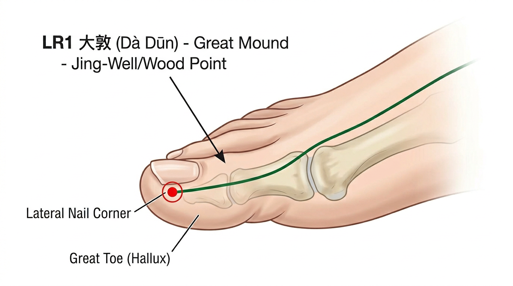

**קטגוריה מיוחדת:** נקודת ג'ינג-באר (井穴), נקודת עץ (木)

**מיקום אנטומי:**
בצד הלטרלי של אצבע הרגל הגדולה, 0.1 צון פרוקסימלית לזווית הציפורן.

**איך למצוא את הנקודה:**
1. מצאו את אצבע הרגל הגדולה (אצבע 1)
2. הנקודה בצד הלטרלי (הצד שפונה לאצבע השנייה)
3. 0.1 צון (כ-1 מ"מ) מאחורי (פרוקסימלי) לזווית בסיס הציפורן
4. בפינה שבין שולי הציפורן לעור

**עומק דקירה:** 0.1-0.2 צון (או דקירת הקזה)

**זווית דקירה:** ניצבת (90°) או שטוחה כלפי מעלה

**תחושת דה-צ'י:** כאב חד מקומי

**פעולות והתוויות:**
- מווסתת צ'י הכבד ומפזרת סטגנציה
- מווסתת את המבער התחתון ואת אזור המין
- עוצרת דימום (רחמי)
- מחייה את ההכרה
- התוויות: בקע (הרניה), נפיחות ב Falling/אשכים, דימום רחמי, צניחת רחם, אצירת שתן, אפילפסיה, אובדן הכרה

**שילובי נקודות נפוצים:**
- LR1 + SP1 — לעצירת דימום רחמי
- LR1 + REN1 — לבעיות אזור המין והפרינאום
- LR1 + DU20 — לצניחת איברים

---

### LR2 — שינג ג'יאן (行间) — Xíng Jiān — "מרווח הליכה"

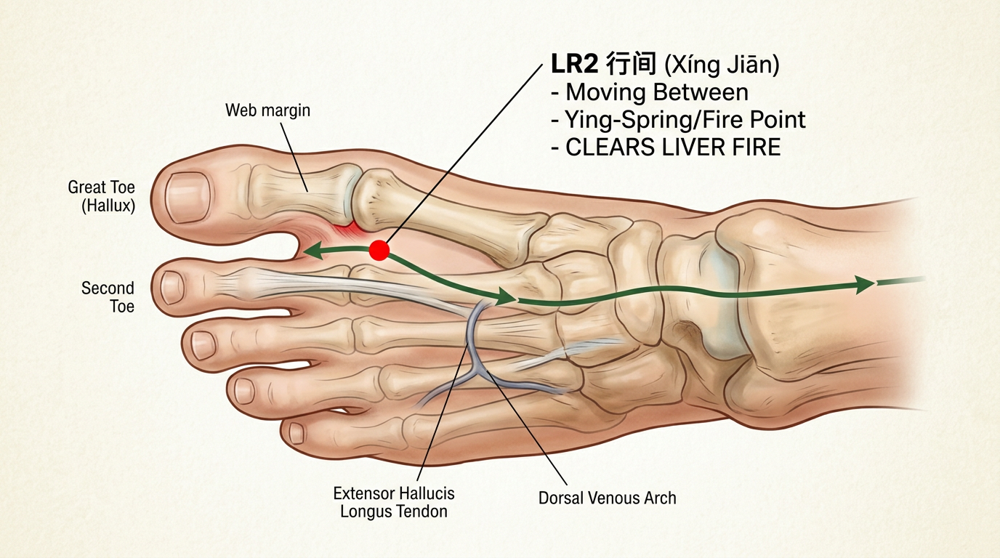

**קטגוריה מיוחדת:** נקודת יינג-מעיין (荥穴), נקודת אש (火), נקודת הרגעה/ניקוז (泻穴 - נקודת הבן)

**מיקום אנטומי:**
בגב הרגל, בשקע הדיסטלי לקצה הקרום שבין אצבע הרגל הגדולה לאצבע השנייה.

**איך למצוא את הנקודה:**
1. מצאו את הקרום (רשת) שבין אצבע הרגל הגדולה לשנייה
2. החליקו לקצה הדיסטלי (קדמי) של הקרום
3. הנקודה נמצאת בשקע שממש מלפני קצה הקרום, בגב הרגל
4. בגבול בין עור כף הרגל לעור גב הרגל

**עומק דקירה:** 0.5-0.8 צון

**זווית דקירה:** אובליקית כלפי מעלה (45°)

**תחושת דה-צ'י:** כאב מקומי, תחושת נפיחות בין האצבעות

**פעולות והתוויות:**
- **מנקה אש הכבד** (אחת הנקודות היעילות ביותר)
- מורידה יאנג עולה
- מנקה רוח-חום
- מווסתת את המחזור
- התוויות: כאב ראש, סחרחורת, עיניים אדומות ובוערות, כעס חזק, נדודי שינה, מרירות בפה, כאב בצלעות, כאבי מחזור, דימום רחמי, שתן כהה, אפילפסיה

**שילובי נקודות נפוצים:**
- LR2 + LR3 — לניקוי אש הכבד והורדת יאנג
- LR2 + GB43 — לטיפול בכאב ראש צידי מאש כבד
- LR2 + HT8 — לניקוי אש מהלב והכבד

---

### LR3 — טאי צ'ונג (太冲) — Tài Chōng — "שטף גדול"

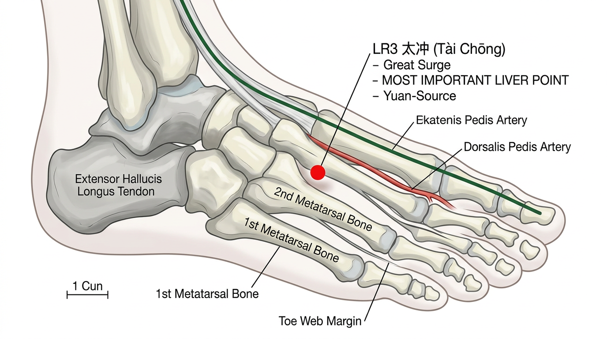

**קטגוריה מיוחדת:** נקודת שו-זרם (输穴), נקודת יואן-מקור (原穴), נקודת אדמה (土)

**מיקום אנטומי:**
בגב הרגל, בשקע שבין עצמות המטטרסל ה-1 וה-2, פרוקסימלית למפגש של עצמות המטטרסל.

**איך למצוא את הנקודה:**
1. מצאו את הרווח שבין אצבע הרגל הגדולה לשנייה
2. החליקו את האצבע לאורך הרווח כלפי מעלה (פרוקסימלית) לאורך גב הרגל
3. המשיכו עד שתרגישו שקע לפני שהעצמות נפגשות (כ-2 צון מהרשת)
4. הנקודה נמצאת בשקע שלפני מפגש עצמות המטטרסל
5. ניתן למשש דופק עורק הדורסליס פדיס בסמוך

**עומק דקירה:** 0.5-1 צון

**זווית דקירה:** ניצבת (90°) או אובליקית כלפי מעלה

**תחושת דה-צ'י:** כאב מקומי, תחושת נפיחות או כבדות המתפשטת לאצבעות

**פעולות והתוויות:**
- **נקודת המפתח של הכבד — אחת הנקודות החשובות ביותר בגוף**
- מפזרת סטגנציית צ'י הכבד
- מורידה יאנג עולה של הכבד
- מחזקת דם ומזינה ין הכבד (בטכניקת חיזוק)
- מווסתת את המחזור
- מרגיעה את הרוח
- מנקה את הראש ואת העיניים
- התוויות: כאב ראש (כל סוג), סחרחורת, טינטון, כאב בעיניים, כאב בצלעות, כעס, דיכאון, עצבנות, נדודי שינה, כאבי מחזור, אי-סדירות במחזור, בקע, כאב באזור המין, שתן קשה, יתר לחץ דם

**שילובי נקודות נפוצים:**
- LR3 + LI4 — "ארבעת השערים" (四关 Sì Guān) — לפיזור סטגנציה, הרגעת הרוח, כאב ראש
- LR3 + GB34 — לכאב בצלעות וסטגנציית צ'י הכבד
- LR3 + KI3 — להזנת ין הכבד והכליות
- LR3 + SP6 — לוויסות המחזור
- LR3 + GB20 — לכאב ראש ויתר לחץ דם
- LR3 + HT7 — להרגעת הרוח ונדודי שינה

---

### LR4 — ג'ונג פנג (中封) — Zhōng Fēng — "חותם מרכזי"

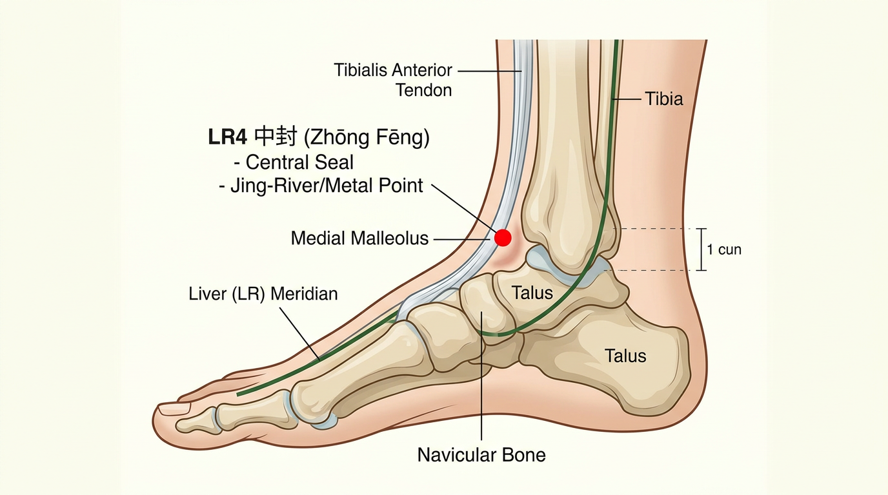

**קטגוריה מיוחדת:** נקודת ג'ינג-נהר (经穴), נקודת מתכת (金)

**מיקום אנטומי:**
1 צון קדימה (אנטריורית) למלאולוס המדיאלי (הקרסול הפנימי), בשקע שעל גיד שריר הטיביאליס אנטריור, כאשר כף הרגל בדורסיפלקסיה.

**איך למצוא את הנקודה:**
1. מצאו את הנקודה הבולטת ביותר של הקרסול הפנימי
2. בקשו מהמטופל להרים את כף הרגל כלפי מעלה (דורסיפלקסיה)
3. הבליטו את גיד הטיביאליס אנטריור
4. הנקודה נמצאת בשקע שבצד המדיאלי של הגיד, 1 צון קדימה לקרסול הפנימי
5. בדיוק באמצע בין הקרסול הפנימי לגיד

**עומק דקירה:** 0.5-0.8 צון

**זווית דקירה:** ניצבת (90°)

**תחושת דה-צ'י:** כאב מקומי, תחושת כבדות

**פעולות והתוויות:**
- מפזרת סטגנציית צ'י הכבד
- מנקה לחות-חום מהמבער התחתון
- מועילה לאזור המין ולהשתנה
- התוויות: כאב באזור המין, בקע, קושי במתן שתן, כאב ברגל, כאב בבטן תחתונה, שפיכה מוקדמת

**שילובי נקודות נפוצים:**
- LR4 + LR3 — לסטגנציית צ'י הכבד עם בעיות אזור מין
- LR4 + REN3 — לבעיות דרכי השתן

---

### LR5 — לי גו (蠡沟) — Lǐ Gōu — "חריץ התולעת"

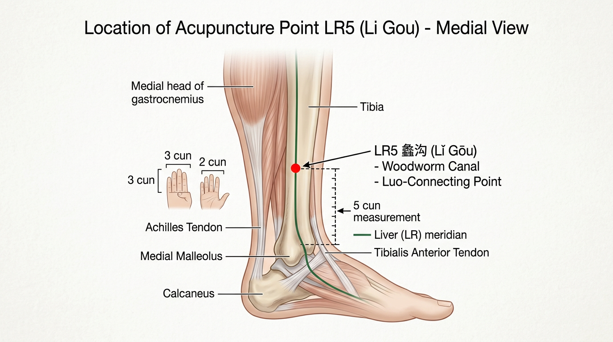

**קטגוריה מיוחדת:** נקודת לואו-מחברת (络穴)

**מיקום אנטומי:**
5 צון מעל קצה המלאולוס המדיאלי, על השפה המדיאלית (פנימית) של עצם הטיביה.

**איך למצוא את הנקודה:**
1. מצאו את הנקודה הבולטת ביותר של הקרסול הפנימי
2. מדדו 5 צון ישירות כלפי מעלה לאורך השוק
3. הנקודה נמצאת על השטח המדיאלי (פנימי) של עצם הטיביה
4. ממש על שפת העצם

**עומק דקירה:** 0.5-0.8 צון

**זווית דקירה:** שטוחה לאורך העצם או ניצבת

**תחושת דה-צ'י:** כאב מקומי על העצם

**פעולות והתוויות:**
- מווסתת צ'י הכבד ומפזרת סטגנציה
- מנקה לחות-חום מהמבער התחתון
- מווסתת את המחזור ומועילה לאזור המין
- מועילה לערוץ כיס המרה (דרך חיבור הלואו)
- התוויות: אי-סדירות במחזור, הפרשות מהנרתיק, גירוד באזור המין, בקע, קושי במתן שתן, תחושת נפיחות באשכים, כאב ברגל

**שילובי נקודות נפוצים:**
- LR5 + GB40 — חיבור לואו-יואן בין כבד לכיס מרה
- LR5 + SP6 — לוויסות המחזור
- LR5 + REN3 — לטיפול בלחות-חום באזור המין

---

### LR6 — ג'ונג דו (中都) — Zhōng Dū — "בירה מרכזית"

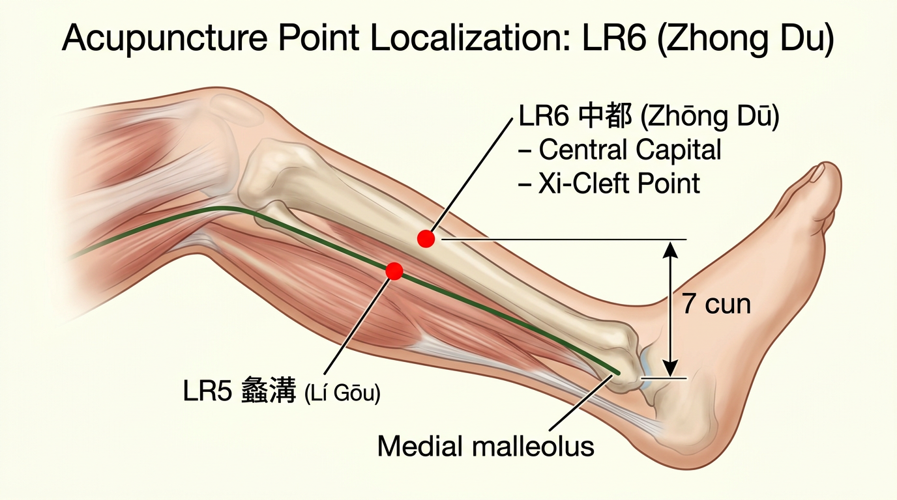

**קטגוריה מיוחדת:** נקודת שי-צבירה (郄穴)

**מיקום אנטומי:**
7 צון מעל קצה המלאולוס המדיאלי, על השפה המדיאלית של עצם הטיביה.

**איך למצוא את הנקודה:**
1. מצאו את הנקודה הבולטת ביותר של הקרסול הפנימי
2. מדדו 7 צון ישירות כלפי מעלה
3. הנקודה נמצאת על השטח המדיאלי של עצם הטיביה
4. 2 צון מעל LR5

**עומק דקירה:** 0.5-0.8 צון

**זווית דקירה:** שטוחה לאורך העצם או ניצבת

**תחושת דה-צ'י:** כאב מקומי

**פעולות והתוויות:**
- מפעילה את מחזור הדם ועוצרת דימום (נקודת שי של ערוץ ין)
- מווסתת צ'י הכבד
- מטפלת בכאב חריף
- התוויות: דימום רחמי, כאבי מחזור, לוכיה ממושכת, בקע, כאב בבטן תחתונה, שלשולים

**שילובי נקודות נפוצים:**
- LR6 + SP1 — לעצירת דימום רחמי
- LR6 + SP6 — לכאבי מחזור

---

### LR7 — שי גואן (膝关) — Xī Guān — "מעבר הברך"

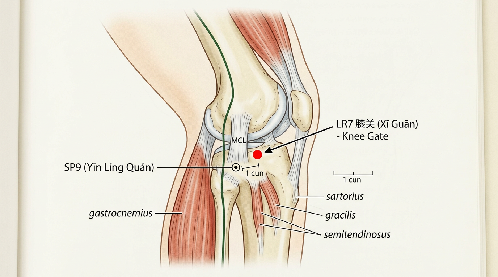

**מיקום אנטומי:**
1 צון אחורית (פוסטריורית) ל-SP9, בשקע שעל השפה האחורית של הקונדיל המדיאלי של הטיביה.

**איך למצוא את הנקודה:**
1. מצאו את SP9 (בשקע שמתחת לקונדיל המדיאלי של הטיביה)
2. החליקו 1 צון אחורה (לכיוון גב הברך)
3. הנקודה נמצאת בשקע שעל השפה האחורית של הקונדיל המדיאלי
4. על הקצה של גיד שריר הסרטוריוס

**עומק דקירה:** 0.5-1 צון

**זווית דקירה:** ניצבת (90°)

**תחושת דה-צ'י:** כאב מקומי, תחושת כבדות בברך

**פעולות והתוויות:**
- מפזרת רוח-לחות מהברך
- מפעילה את הערוץ ומשחררת כאב
- התוויות: כאב בברך, נפיחות בברך, כאב בצד המדיאלי של הירך, כאב גרון

**שילובי נקודות נפוצים:**
- LR7 + SP9 + ST35 — לכאב וניפוח בברך
- LR7 + GB34 — לכאב בברך ובגידים

---

### LR8 — צ'יו צ'יואן (曲泉) — Qū Quán — "מעיין מתעקל"

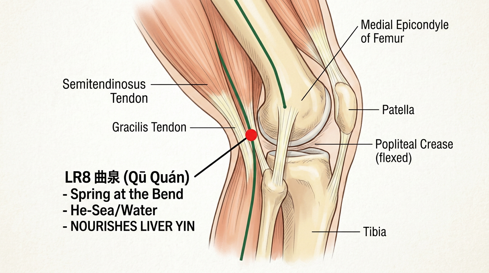

**קטגוריה מיוחדת:** נקודת הא-ים (合穴), נקודת מים (水), נקודת חיזוק (补穴 - נקודת האם)

**מיקום אנטומי:**
בקצה המדיאלי של קפל הברך, כאשר הברך מכופפת, בשקע שמעל לקונדיל המדיאלי של הטיביה, אחורית לאפיקונדיל המדיאלי של הפמור.

**איך למצוא את הנקודה:**
1. כופפו את ברך המטופל
2. מצאו את קפל הברך מהצד המדיאלי (הפנימי)
3. הנקודה נמצאת בקצה המדיאלי של הקפל
4. בשקע שמאחורי (פוסטריורי) לגידים הבולטים של שריר הסמי-טנדינוסוס וגרסיליס
5. ממש אחורית לאפיקונדיל המדיאלי של עצם הירך

**עומק דקירה:** 1-1.5 צון

**זווית דקירה:** ניצבת (90°)

**תחושת דה-צ'י:** כאב מקומי, תחושת כבדות או נימול סביב הברך

**פעולות והתוויות:**
- **מזינה דם ו-ין הכבד** (נקודת חיזוק)
- מנקה לחות-חום מהמבער התחתון
- מועילה לאזור המין ולרחם
- מועילה לברכיים
- התוויות: כאב בברך, לחות-חום באזור המין (הפרשות, גירוד), כאבי מחזור, צניחת רחם, אי-פריון, כאב בבטן תחתונה, שלשולים, דיזוריה (כאב במתן שתן), שפיכה מוקדמת, אימפוטנציה

**שילובי נקודות נפוצים:**
- LR8 + KI3 — להזנת ין הכבד והכליות
- LR8 + SP6 + SP9 — לניקוי לחות-חום מהמבער התחתון
- LR8 + REN3 — לבעיות גניטו-אורינריות
- LR8 + ST36 — להזנת דם

---

### LR9 — ין באו (阴包) — Yīn Bāo — "מעטפת הין"

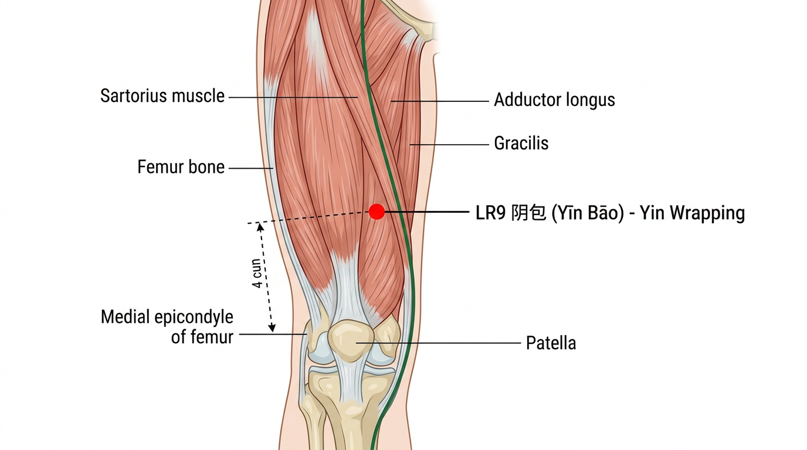

**מיקום אנטומי:**
4 צון מעל האפיקונדיל המדיאלי של הפמור, בין שרירי הסרטוריוס לגרסיליס, בצד המדיאלי של הירך.

**איך למצוא את הנקודה:**
1. מצאו את האפיקונדיל המדיאלי של הפמור (הבליטה הפנימית מעל הברך)
2. מדדו 4 צון כלפי מעלה לאורך הצד המדיאלי של הירך
3. הנקודה נמצאת בין שרירי הסרטוריוס (קדמי) לגרסיליס (אחורי)
4. על הצד הפנימי של הירך

**עומק דקירה:** 0.5-1 צון

**זווית דקירה:** ניצבת (90°)

**תחושת דה-צ'י:** כאב מקומי, תחושת כבדות בירך

**פעולות והתוויות:**
- מווסתת צ'י הכבד
- מועילה למבער התחתון ולאזור המין
- התוויות: כאב בבטן תחתונה, קושי במתן שתן, אי-סדירות במחזור, כאב בצד המדיאלי של הירך, כאב בגב התחתון המקרין לאזור המין

**שילובי נקודות נפוצים:**
- LR9 + REN3 — לבעיות דרכי השתן
- LR9 + SP6 — לכאבי מחזור

---

### LR10 — צו וו לי (足五里) — Zú Wǔ Lǐ — "חמש מיילים ברגל"

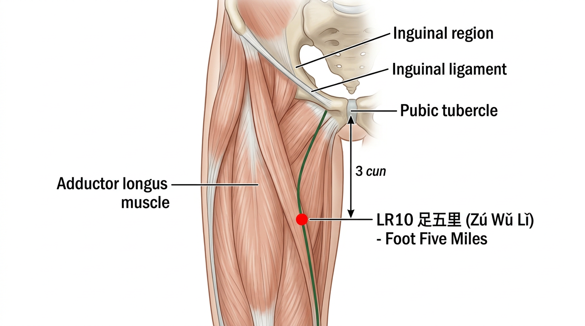

**מיקום אנטומי:**
3 צון מתחת ל-ST30 (צ'י צ'ונג), על הצד המדיאלי של הירך, על השפה הלטרלית של שריר האדוקטור לונגוס.

**איך למצוא את הנקודה:**
1. מצאו את ST30 (בגובה השפה העליונה של עצם הערווה, 2 צון מקו האמצע)
2. מדדו 3 צון ישירות כלפי מטה לאורך הירך
3. הנקודה נמצאת על השפה הלטרלית של שריר האדוקטור לונגוס
4. על הצד המדיאלי-עליון של הירך

**עומק דקירה:** 0.5-1 צון

**זווית דקירה:** ניצבת (90°)

**תחושת דה-צ'י:** כאב מקומי

**פעולות והתוויות:**
- מפזרת לחות-חום מהמבער התחתון
- מפעילה את הערוץ
- התוויות: נפיחות באשכים, גירוד באזור המין, כאב בירך, אצירת שתן

**שילובי נקודות נפוצים:**
- LR10 + LR5 — לטיפול בלחות-חום באזור המין

---

### LR11 — ין ליאן (阴廉) — Yīn Lián — "זווית הין"

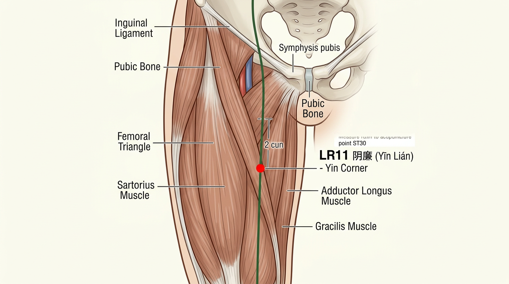

**מיקום אנטומי:**
2 צון מתחת ל-ST30, על הצד המדיאלי של הירך, על שריר האדוקטור לונגוס.

**איך למצוא את הנקודה:**
1. מצאו את ST30 (בגובה עצם הערווה, 2 צון מקו האמצע)
2. מדדו 2 צון ישירות כלפי מטה
3. הנקודה על שריר האדוקטור לונגוס
4. 1 צון מעל LR10

**עומק דקירה:** 0.5-1 צון

**זווית דקירה:** ניצבת (90°)

**תחושת דה-צ'י:** כאב מקומי

**פעולות והתוויות:**
- מווסתת את המחזור ומועילה לרחם
- מפזרת לחות-חום מהמבער התחתון
- התוויות: אי-סדירות במחזור, כאב בירך, אי-פריון, הפרשות מהנרתיק

**שילובי נקודות נפוצים:**
- LR11 + SP6 — לוויסות המחזור
- LR11 + REN4 — לבעיות רחם

---

### LR12 — ג'י מאי (急脉) — Jí Mài — "דופק מהיר"

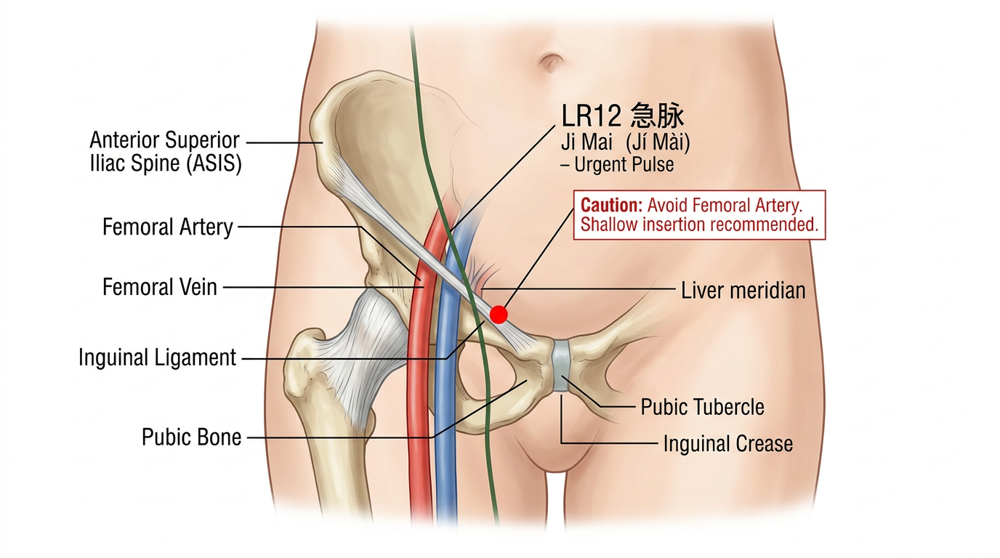

**מיקום אנטומי:**
2.5 צון לטרלית לקו האמצע, בצד הלטרלי-תחתון של עצם הערווה, בצד המדיאלי של עורק הפמורלי.

**איך למצוא את הנקודה:**
1. מצאו את עורק הפמורלי בקפל המפשעתי (דופק ברור)
2. הנקודה נמצאת בצד המדיאלי (פנימי) של העורק
3. בגובה השפה העליונה של עצם הערווה
4. 2.5 צון מקו האמצע

**עומק דקירה:** 0.5-0.8 צון (להימנע מעורק הפמורלי!)

**זווית דקירה:** ניצבת (90°)

**תחושת דה-צ'י:** כאב מקומי, תחושת מתיחה

**פעולות והתוויות:**
- מפזרת סטגנציה ומשחררת כאב באזור המין
- מועילה לאזור המפשעתי
- התוויות: בקע, כאב באזור המין, כאב במפשעה, כאב בצד המדיאלי של הירך

**שילובי נקודות נפוצים:**
- LR12 + LR3 — לטיפול בבקע
- LR12 + ST30 — לכאב במפשעה

---

### LR13 — ג'אנג מן (章门) — Zhāng Mén — "שער המניפסט"

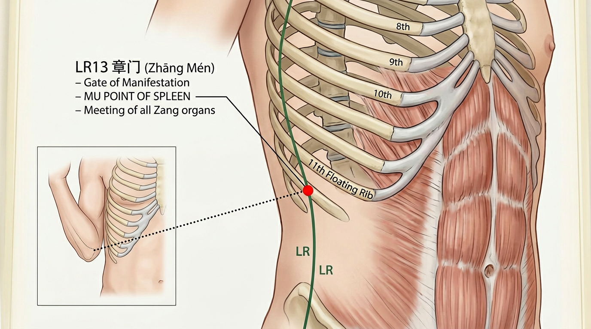

**קטגוריה מיוחדת:** נקודת מו-קדמית (募穴) של הטחול, נקודת מפגש (会穴) של איברי הזאנג (五脏之会)

**מיקום אנטומי:**
בקצה חופשי של הצלע ה-11, בצד הלטרלי של הבטן.

**איך למצוא את הנקודה:**
1. בקשו מהמטופל לשכב על הצד או להניח את הזרוע מעל הראש
2. מצאו את הצלע ה-11 (הצלע הצפה הראשונה — צלע קצרה שלא מתחברת בקדמה)
3. הנקודה נמצאת בקצה החופשי (הקדמי) של הצלע
4. שיטה חלופית: כופפו את מרפק המטופל והצמידו לצד הגוף — הנקודה בגובה קצה המרפק

**עומק דקירה:** 0.5-1 צון

**זווית דקירה:** ניצבת (90°) או אובליקית (לא לדקור עמוק — טחול/כליה מתחת)

**תחושת דה-צ'י:** כאב מקומי, תחושת נפיחות באזור הצלעות

**פעולות והתוויות:**
- **נקודת מו של הטחול — מחזקת את הטחול ומווסתת צ'י**
- מווסתת צ'י הכבד ומפזרת סטגנציה
- מפזרת גושים בבטן
- נקודת מפגש של כל איברי הזאנג (5 איברי הין)
- התוויות: כאב בצלעות, נפיחות בבטן, שלשולים, כאבי בטן, הקאות, עייפות, טחול מוגדל, כבד מוגדל

**שילובי נקודות נפוצים:**
- LR13 + LR14 — לוויסות צ'י הכבד
- LR13 + SP6 + ST36 — לחיזוק הטחול
- LR13 + REN12 — לטיפול בטחול וקיבה (מו של טחול + מו של קיבה)
- LR13 + GB34 — לכאב בצלעות

---

### LR14 — צ'י מן (期门) — Qī Mén — "שער המחזור"

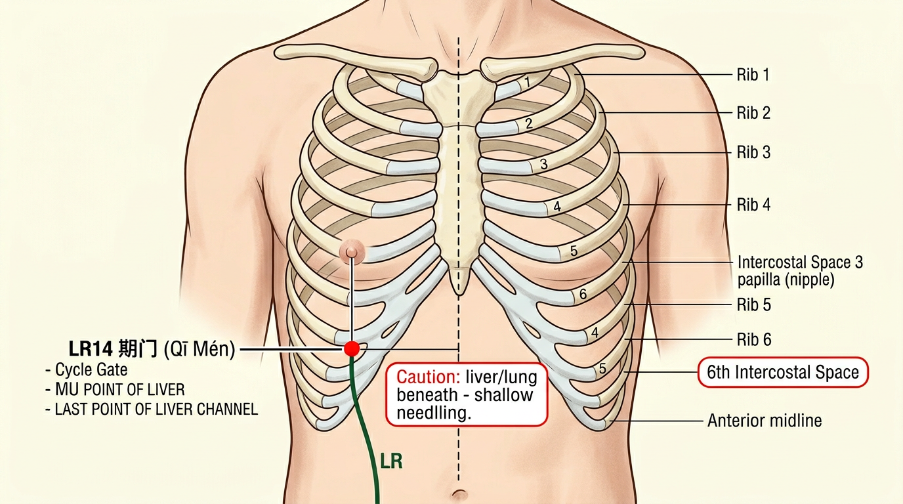

**קטגוריה מיוחדת:** נקודת מו-קדמית (募穴) של הכבד, נקודת מפגש עם ערוצי הטחול וין ווי מאי

**מיקום אנטומי:**
ברווח הבין-צלעי ה-6, 4 צון לטרלית לקו האמצע, ישירות מתחת לפטמה.

**איך למצוא את הנקודה:**
1. מצאו את הפטמה (בגברים) או את הרווח הבין-צלעי ה-4 בקו הפטמה
2. ספרו 2 רווחים בין-צלעיים כלפי מטה עד לרווח ה-6
3. הנקודה נמצאת ברווח הבין-צלעי ה-6, ישירות מתחת לפטמה
4. 4 צון מקו האמצע של החזה

**עומק דקירה:** 0.5-0.8 צון

**זווית דקירה:** אובליקית או שטוחה (לא לדקור עמוק — כבד/ריאה מתחת)

**תחושת דה-צ'י:** כאב מקומי, תחושת נפיחות או לחץ באזור

**פעולות והתוויות:**
- **נקודת מו של הכבד — מווסתת צ'י הכבד, מפזרת סטגנציה**
- מרחיבה את החזה
- מפזרת לחות-חום מכבד וכיס מרה
- מרגיעה את הקיבה
- מועילה לשד (סטגנציה)
- התוויות: כאב בצלעות, כאב בחזה, נפיחות בבטן, בחילות, הקאות, שלשולים, שיהוקים, דיכאון, כאב שד לפני מחזור, מרירות בפה, צהבת

**שילובי נקודות נפוצים:**
- LR14 + LR3 — לפיזור סטגנציית צ'י הכבד (מו + יואן)
- LR14 + GB24 — לטיפול בכבד וכיס מרה (מו + מו)
- LR14 + PC6 — לכאב בחזה ובצלעות
- LR14 + SP6 — לוויסות המחזור ופיזור סטגנציה
- LR14 + REN12 + ST36 — כאשר הכבד תוקף את הקיבה (כבד-קיבה דיסהרמוניה)

---

## 4. סיכום נקודות מפתח של ערוץ הכבד

### 4.1 נקודות חשובות ביותר

| נקודה | שם | חשיבות |
|---|---|---|
| **LR1** | דא דון | חירום, בקע, דימום רחמי |
| **LR2** | שינג ג'יאן | ניקוי אש הכבד |
| **LR3** | טאי צ'ונג | נקודת המפתח — סטגנציה, כאב ראש, רגש |
| **LR8** | צ'יו צ'יואן | הזנת דם ו-ין הכבד, לחות-חום |
| **LR13** | ג'אנג מן | מו של הטחול, מפגש איברי זאנג |
| **LR14** | צ'י מן | מו של הכבד, סטגנציית צ'י |

### 4.2 נקודות חמשת האלמנטים

| אלמנט | נקודה | סוג |
|---|---|---|
| עץ (木) | LR1 | ג'ינג-באר (井) |
| אש (火) | LR2 | יינג-מעיין (荥) |
| אדמה (土) | LR3 | שו-זרם (输) |
| מתכת (金) | LR4 | ג'ינג-נהר (经) |
| מים (水) | LR8 | הא-ים (合) |

### 4.3 נקודות מיוחדות

| קטגוריה | נקודה |
|---|---|
| נקודת יואן (原穴) | LR3 |
| נקודת לואו (络穴) | LR5 |
| נקודת שי (郄穴) | LR6 |
| נקודת מו של הכבד (肝募穴) | LR14 |
| נקודת מו של הטחול (脾募穴) | LR13 |
| מפגש איברי זאנג (五脏之会) | LR13 |

---

## 5. תרגילים

1. שרטטו את מסלול ערוץ הכבד על גוף שותף ללימודים וסמנו את כל 14 הנקודות.
2. תרגלו איתור LR2, LR3, LR8, LR13, ו-LR14 בעיניים עצומות.
3. הסבירו את ההבדל בין סטגנציית צ'י הכבד, עליית יאנג הכבד ואש הכבד — ואילו נקודות תבחרו לכל דפוס.
4. כתבו מרשם נקודות לטיפול ב: (א) כאב ראש צידי עם עצבנות, (ב) כאבי מחזור עם נפיחות, (ג) לחות-חום באזור המין.
5. הסבירו מדוע LR3 + LI4 נקראים "ארבעת השערים" ומהן ההתוויות העיקריות לשימוש בשילוב זה.

---

## ניווט

- **הקודם**: [ערוץ כיס המרה (GB)](12-gallbladder.md) | **הבא**: [כלים יוצאי דופן](14-extraordinary-vessels.md)
- **זוג פנים-חוץ**: [ערוץ כיס המרה (GB)](12-gallbladder.md) — ערוץ היאנג הזוגי (אלמנט עץ)
- **חזרה למודול**: [מודול 2 — מרידיאנים](README.md)
- **ראה גם**: [אגירת צ'י כבד](../../year-2-intermediate/module-06b-syndromes/liver-syndromes/01-liver-qi-stagnation.md) — הסינדרום הנפוץ ביותר | [אש כבד](../../year-2-intermediate/module-06b-syndromes/liver-syndromes/02-liver-fire.md) | [עליית יאנג כבד](../../year-2-intermediate/module-06b-syndromes/liver-syndromes/06-liver-yang-rising.md) | [לחות-חום כבד-מרה](../../year-2-intermediate/module-06b-syndromes/liver-syndromes/08-liver-gallbladder-damp-heat.md)
